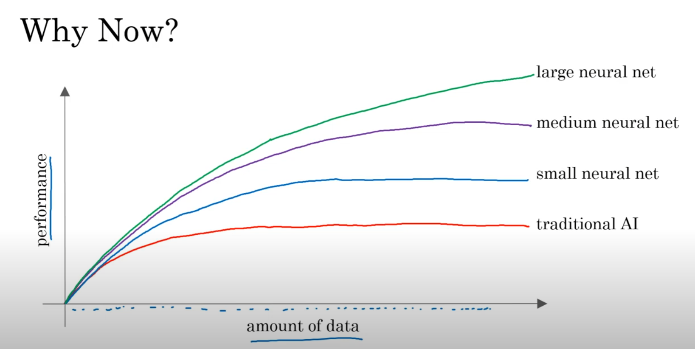
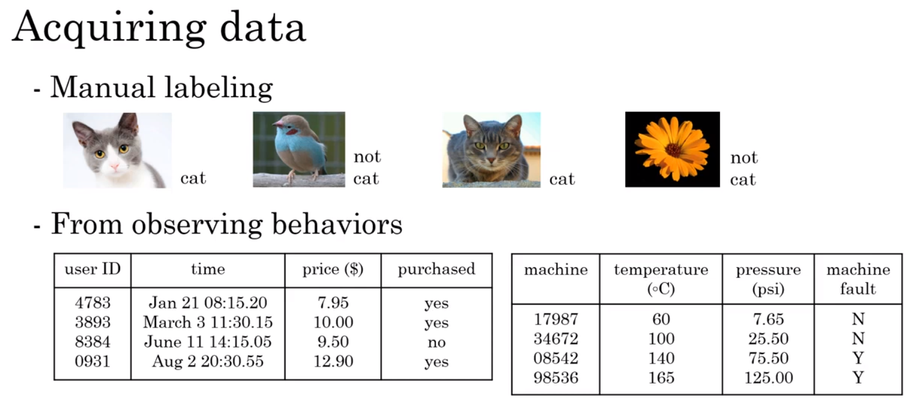
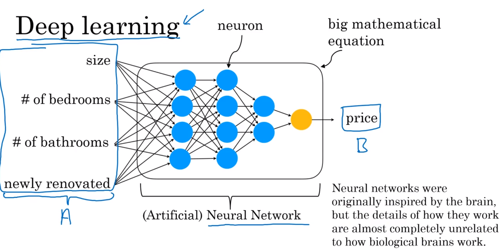
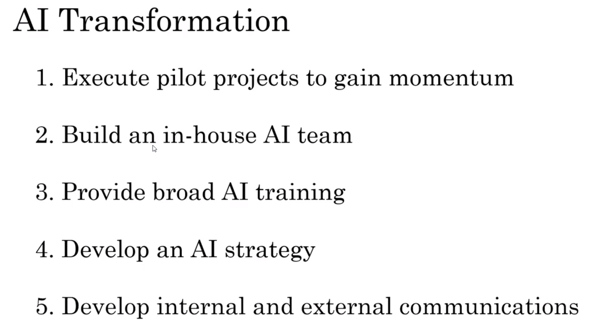
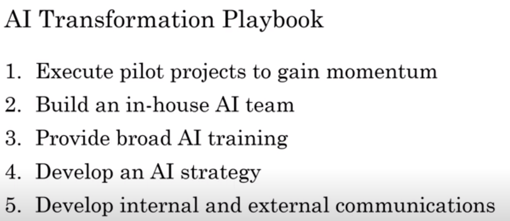
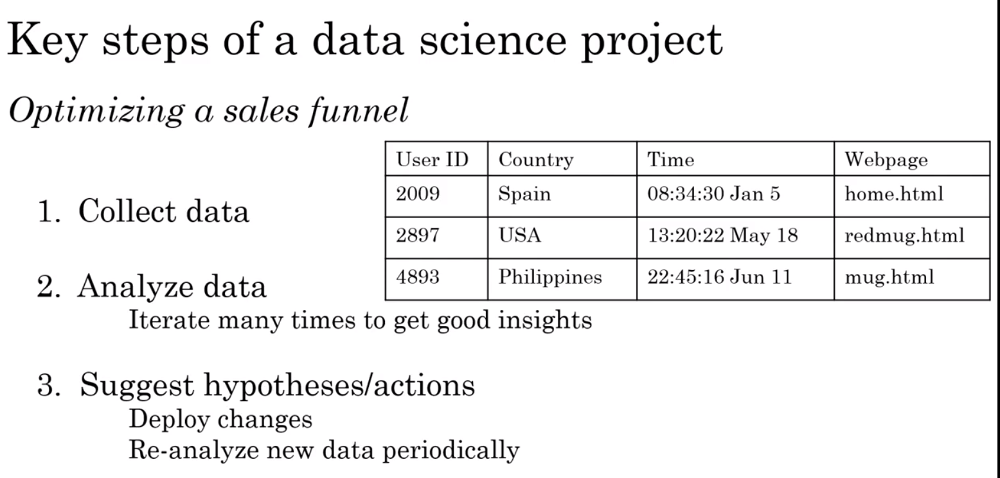
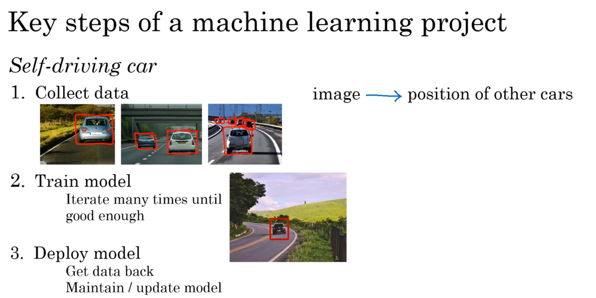
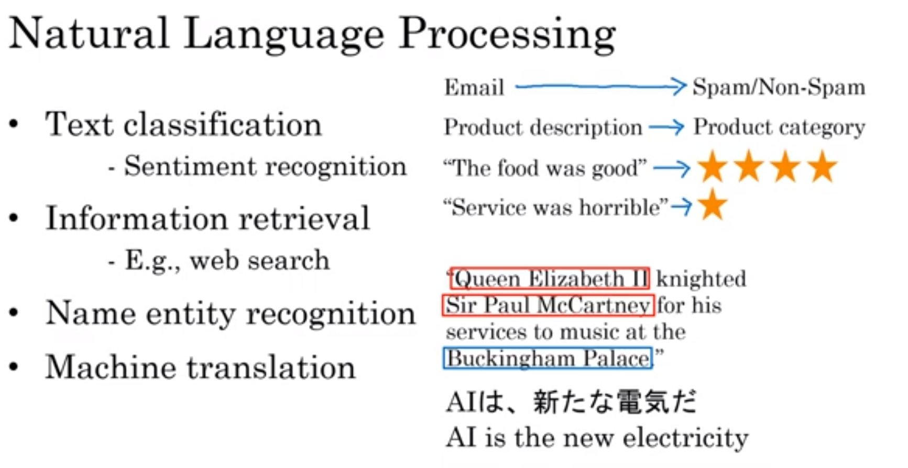
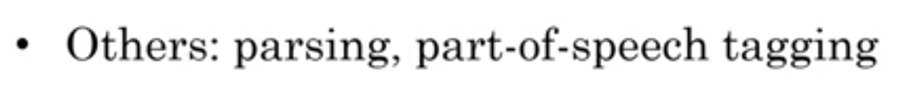

# AI For Everyone \[Coursera\]

## What is AI?

Short Intro: <https://www.youtube.com/watch?v=WSbgixdC9g8>

Full Course: <https://www.youtube.com/watch?v=jTKc7-K22jw>

**How to get good at AI (5 steps)**

## Using AI Successfully

### Key steps of data science project

### Key steps of machine learning projects

## NLP: Natural Language Processing

## Practicing Diligence

- Business

- Technical

- Ethical

# Machine Learning \[Coursera\]
