CyberSecurity: Security in Practice

# **Roles in CyberSecurity**

<https://tryhackme.com/room/careersincyber>

A** *Security Operations Center* (SOC)** is a *team* of IT security
professionals tasked with monitoring a company’s network and systems 24
hours a day, seven days a week. Their purpose of monitoring is to:

- **Find vulnerabilities on the network**: A *vulnerability* is a
  weakness that an attacker can exploit to carry out things beyond their
  permission level. A vulnerability might be discovered in any device’s
  software (operating system and programs) on the network, such as a
  server or a computer. For instance, the SOC might discover a set of MS
  Windows computers that must be patched against a specific published
  vulnerability. Strictly speaking, vulnerabilities are not necessarily
  the SOC’s responsibility; however, unfixed vulnerabilities affect the
  security level of the entire company.

- **Detect unauthorized activity**: Consider the case where an attacker
  discovered the username and password of one of the employees and used
  it to log in to the company system. It is crucial to detect this kind
  of unauthorized activity quickly before it causes any damage. Many
  clues can help us detect this, such as geographic location.

- **Discover policy violations**: A *security policy* is a set of rules
  and procedures created to help protect a company against security
  threats and ensure compliance. What is considered a violation would
  vary from one company to another; examples include downloading pirated
  media files and sending confidential company files insecurely.

- **Detect intrusions**: *Intrusions* refer to system and network
  intrusions. One example scenario would be an attacker successfully
  exploiting our web application. Another example scenario would be a
  user visiting a malicious site and getting their computer infected.

- **Support with the incident response**: An *incident* can be an
  observation, a policy violation, an intrusion attempt, or something
  more damaging such as a major breach. Responding correctly to a severe
  incident is not an easy task. The SOC can support the incident
  response team handle the situation.

Security operations cover various tasks to ensure protection; one such
task is threat intelligence.

## **Threat Intelligence**

In this context, *intelligence* refers to information you gather about
actual and potential enemies. A *threat* is any action that can disrupt
or adversely affect a system. Threat intelligence aims to gather
information to help the company better prepare against potential
adversaries. The purpose would be to achieve a *threat-informed
defense*. Different companies have different adversaries. Some
adversaries might seek to steal customer data from a mobile operator;
however, other adversaries are interested in halting the production in a
petroleum refinery. Example adversaries include a nation-state cyber
army working for political reasons and a ransomware group acting for
financial purposes. Based on the company (target), we can expect
adversaries.

Intelligence needs data. Data has to be collected, processed, and
analyzed. Data collection is done from local sources such as network
logs and public sources such as forums. Processing of data aims to
arrange them into a format suitable for analysis. The analysis phase
seeks to find more information about the attackers and their motives;
moreover, it aims to create a list of recommendations and actionable
steps.

Learning about your adversaries allows you to know their tactics,
techniques, and procedures. As a result of threat intelligence, we
identify the threat actor (adversary), predict their activity, and
consequently, we will be able to mitigate their attacks and prepare a
response strategy.

## Data Management

You previously learned about various incident classification types and
how those incidents can impact an organization. 

This reading will discuss the roles of the various team members who are
a part of the incident escalation process. Keep in mind that not all
organizations are alike, and some roles and responsibilities may be
identified using different terminology and definitions.  

### Data owners

A data owner is the person that decides who can access, edit, use, or
destroy their information. Data owners have administrative control over
specific information hardware or software and are accountable for the
classification, protection, access, and use of company data. For
example, consider a situation where an employee gains unauthorized
access to software they do not need to use for work. This kind of
security event would be escalated to the data owner of that software.

### Data controllers

Data controllers determine the procedure and purpose for processing
data. This role largely focuses on collecting the personal information
of customers. The data controller determines how that data is used. The
data controller also ensures that data is used, stored, and processed in
accordance with relevant security and privacy regulations. If sensitive
customer information was at risk, that event would be escalated to data
controllers.

### Data processors

Data processors report directly to the data controller and are
responsible for processing the data on behalf of the data controller.
The data processor is typically a vendor and is often tasked with
installing security measures to help protect the data. Data processing
issues are typically escalated to the individual who oversees the
third-party organization responsible for data processing.

### Data custodians

Data custodians assign and remove access to software or hardware.
Custodians are responsible for implementing security controls for the
data they are responsible for, granting and revoking access to that
data, creating policies regarding how that data is stored and
transmitted, advising on potential threats to that data, and monitoring
the data. Data custodians are notified when data security controls need
to be strengthened or have been compromised.

### Data protection officers (DPOs)

Data protection officers are responsible for monitoring the internal
compliance of an organization’s data protection procedures. These
individuals advise the security team on the obligations required by the
organization's data protection standards and procedures. They also
conduct assessments to determine whether or not the security measures in
place are properly protecting the data as necessary. DPOs are notified
when set standards or protocols have been violated.  

## Command, control, and communication

A **computer security incident response team (CSIRT)** is a specialized
group of security professionals that are trained in incident management
and response. During incident response, teams can encounter a variety of
different challenges. For incident response to be effective and
efficient, there must be clear command**,** control, and communication
of the situation to achieve the desired goal. 

- **Command** refers to having the appropriate leadership and direction
  to oversee the response.

- **Control** refers to the ability to manage technical aspects during
  incident response, like coordinating resources and assigning tasks.

- **Communication** refers to the ability to keep stakeholders informed.

Establishing a CSIRT organizational structure with clear and distinctive
roles aids in achieving an effective and efficient response.

## Roles in CSIRTs 

CSIRTs are organization dependent, so they can vary in their structure
and operation. Structurally, they can exist as a separate, dedicated
team or as a task force that meets when necessary. CSIRTs involve both
nonsecurity and security professionals. Nonsecurity professionals are
often consulted to offer their expertise on the incident. These
professionals can be from external departments, such as human resources,
public relations, management, IT, legal, and others. Security
professionals involved in a CSIRT typically include three key security
related roles: 

1.  **Security analyst**

2.  **Technical lead**

3.  **Incident coordinator**

### **Security analyst**

The job of the **security** **analyst** is to continuously monitor an
environment for any security threats. This includes: 

- Analyzing and triaging alerts

- Performing root-cause investigations

- Escalating or resolving alerts 

If a critical threat is identified, then analysts escalate it to the
appropriate team lead, such as the technical lead.

### **Technical lead**

The job of the technical lead is to manage all of the technical aspects
of the incident response process, such as applying software patches or
updates. They do this by first determining the root cause of the
incident. Then, they create and implement the strategies for containing,
eradicating, and recovering from the incident. Technical leads often
collaborate with other teams to ensure their incident response
priorities align with business priorities, such as reducing disruptions
for customers or returning to normal operations. 

### **Incident coordinator**

Responding to an incident also requires cross-collaboration with
nonsecurity professionals. CSIRTs will often consult with and leverage
the expertise of members from external departments. The job of the
incident coordinator is to coordinate with the relevant departments
during a security incident. By doing so, the lines of communication are
open and clear, and all personnel are made aware of the incident status.
Incident coordinators can also be found in other teams, like the SOC. 

### **Other roles**

Depending on the organization, many other roles can be found in a CSIRT,
including a dedicated communications lead, a legal lead, a planning
lead, and more. 

**Note**: Teams, roles, responsibilities, and organizational structures
can differ for each company. For example, some different job titles for
incident coordinator include incident commander and incident manager.

## SOC

### SOC organization

A SOC is composed of SOC analysts, SOC leads, and SOC managers. Each
role has its own respective responsibilities. SOC analysts are grouped
into three different tiers. 

#### **Tier 1 SOC analyst**

The first tier is composed of the least experienced SOC analysts who are
known as level 1s (L1s). They are responsible for:

- Monitoring, reviewing, and prioritizing alerts based on criticality or
  severity

- Creating and closing alerts using ticketing systems

- Escalating alert tickets to Tier 2 or Tier 3

#### **Tier 2 SOC analyst**

The second tier comprises the more experienced SOC analysts, or level 2s
(L2s). They are responsible for: 

- Receiving escalated tickets from L1 and conducting deeper
  investigations

- Configuring and refining security tools

- Reporting to the SOC Lead

#### **Tier 3 SOC lead**

The third tier of a SOC is composed of the SOC leads, or level 3s (L3s).
These highly experienced professionals are responsible for:

- Managing the operations of their team

- Exploring methods of detection by performing advanced detection
  techniques, such as malware and forensics analysis

- Reporting to the SOC manager

#### **SOC manager **

The SOC manager is at the top of the pyramid and is responsible for: 

- Hiring, training, and evaluating the SOC team members

- Creating performance metrics and managing the performance of the SOC
  team

- Developing reports related to incidents, compliance, and auditing

- Communicating findings to stakeholders such as executive management   

#### **Other roles**

SOCs can also contain other specialized roles such as: 

- **Forensic investigators**: Forensic investigators are commonly L2s
  and L3s who collect, preserve, and analyze digital evidence related to
  security incidents to determine what happened.

- **Threat hunters**: Threat hunters are typically L3s who work to
  detect, analyze, and defend against new and advanced cybersecurity
  threats using threat intelligence.

**Note**: Just like CSIRTs, the organizational structure of a SOC can
differ depending on the organization. 

### SOC Data Sources

The SOC uses many data sources to monitor the network for signs of
intrusions and to detect any malicious behaviour. Some of these sources
are:

- **Server logs**: There are many types of servers on a network, such as
  a mail server, web server, and domain controller on MS Windows
  networks. Logs contain information about various activities, such as
  successful and failed login attempts, among many others. There is a
  trove of information that can be found in the server logs.

- **DNS activity**: DNS stands for Domain Name System, and it is the
  protocol responsible for converting a domain name, such
  as tryhackme.com, to an IP address, such as 10.3.13.37, among other
  domain name related queries. One analogy of the DNS query is asking,
  “How can I reach TryHackMe?” and someone replying with the postal
  address. In practice, if someone tries to browse tryhackme.com,
  the DNS server has to resolve it and can log the DNS query to
  monitoring. The SOC can gather information about domain names that
  internal systems are trying to communicate with by merely inspecting
  DNS queries.

- **Firewall logs**: A firewall is a device that controls network
  packets entering and leaving the network mainly by letting them
  through or blocking them. Consequently, firewall logs can reveal much
  information about what packets passed or tried to pass through the
  firewall.

- **DHCP logs**: DHCP stands for Dynamic Host Configuration Protocol,
  and it is responsible for assigning an IP address to the systems that
  try to connect to a network. One analogy of the DHCP request would be
  when you enter a fancy restaurant, and the waiter welcomes you and
  guides you to an empty table. Know that DHCP has automatically
  provided your device with the network settings whenever you can join a
  network without manual configuration. By inspecting DHCP transactions,
  we can learn about the devices that joined the network.

These are some of the most common data sources; however, many other
sources can be used to aid in the network security monitoring and the
other tasks of the SOC. A SOC might use a Security Information and Event
Management (SIEM) system. The SIEM aggregates the data from the
different sources so that the SOC can efficiently correlate the data and
respond to attacks.

### SOC Services

SOC services include reactive and proactive services in addition to
other services.

Reactive services refer to the tasks initiated after detecting an
intrusion or a malicious event. Example reactive services include:

- **Monitor security posture**: This is the primary role of the SOC, and
  it includes monitoring the network and computers for security alerts
  and notifications and responding to them as the need dictates.

- **Vulnerability management**: This refers to finding vulnerabilities
  in the company systems and patching (fixing) them. The SOC can assist
  with this task but not necessarily execute it.

- **Malware analysis**: The SOC might recover malicious programs that
  reached the network. The SOC can do basic analysis by executing it in
  a controlled environment. However, more advanced analysis requires
  sending it to a dedicated team.

- **Intrusion detection**: An *intrusion detection system* (IDS) is used
  to detect and log intrusions and suspicious packets. The SOC’s job is
  to maintain such a system, monitor its alerts, and go through its logs
  as the need dictates.

- **Reporting**: It is essential to report incidents and alarms.
  Reporting is necessary to ensure a smooth workflow and to support
  compliance requirements.

Proactive services refer to the tasks handled by the SOC without any
indicator of an intrusion. Example proactive services carried out by the
SOC include:

- **Network security monitoring (NSM)**: This focuses on monitoring the
  network data and analyzing the traffic to detect signs of intrusions.

- **Threat hunting**: With *threat hunting*, the SOC assumes an
  intrusion has already taken place and begins its hunt to see if they
  can confirm this assumption.

- **Threat Intelligence**: Threat intelligence focuses on learning about
  potential adversaries and their tactics and techniques to improve the
  company’s defences. The purpose would be to establish
  a *threat-informed defence*.

Other services by the SOC include **cyber security training**. Many data
breaches and intrusions can be avoided by raising users’ security
awareness and arming them with solid security training.

### Security operations center

A **security operations center (SOC)** is an organizational unit
dedicated to monitoring networks, systems, and devices for security
threats or attacks. Structurally, a SOC (usually pronounced "sock")
often exists as its own separate unit or within a CSIRT. You may be
familiar with the term *blue team*, which refers to the security
professionals who are responsible for defending against all security
threats and attacks at an organization. A SOC is involved in various
types of blue team activities, such as network monitoring, analysis, and
response to incidents.

# Understanding Threats

Preparing for attacks is an important job that the entire security team
is responsible for. Threat actors have many tools they can use depending
on their target. For example, attacking a small business can be
different from attacking a public utility. Each have different assets
and specific defenses to keep them safe. In all cases, anticipating
attacks is the key to preparing for them. In security, we do that by
performing an activity known as threat modeling.

Threat modeling is a process of identifying assets, their
vulnerabilities, and how each is exposed to threats. We apply threat
modeling to everything we protect. Entire systems, applications, or
business processes all get examined from this security-related
perspective.

Creating threat models is a lengthy and detailed activity. They're
normally performed by a collection of individuals with years of
experience in the field. Because of that, it's considered to be an
advanced skill in security. However, that doesn't mean you won't be
involved.

There are several threat modeling frameworks used in the field. Some are
better suited for network security. Others are better for things like
information security, or application development.

## Key terms

- **Threat**: Some potential attack/ Any circumstance or event that can
  negatively impact assets.

- **Vulnerability**: A susceptibility/ A weakness that can be exploited
  by a threat.

- **Risk**: Anything that can impact the confidentiality, integrity, or
  availability of an asset.

  - Vulnerability + Threat.

  - Likelihood x Impact.

- **Exploit**: Taking advantage of a vulnerability (risk actualized).

- **Attack Surface**: term for all the potential system vulnerabilities
  that a threat actor could exploit.

## Six Steps of threat modeling

In general, there are six steps of a threat model.

1.  The first is to **define the scope** of the model. At this stage,
    the team determines what they're building by creating an inventory
    of assets and classifying them.

2.  The second step is to **identify threats**. Here, the team defines
    all potential threat actors. A threat actor is any person or group
    who presents a security risk. Threat actors are characterized as
    being internal or external. For example, an internal threat actor
    could be an employee who intentionally expose an asset to harm. An
    example of an external threat actor could be a malicious hacker, or
    a competing business.

After threat actors have been identified, the team puts together what's
known as **an attack tree**. An attack tree is a diagram that maps
threats to assets. The team tries to be as detailed as possible when
constructing this diagram before moving on.

3.  Step three of the threat modeling process is to **characterize the
    environment**. Here, the team applies an attacker mindset to the
    business. They consider how the customers and employees interact
    with the environment. Other factors they consider are external
    partners and third party vendors.

4.  At step four, their objective is to **analyze threats**. Here, the
    team works together to examine existing protections and identify
    gaps. They then rank threats according to their risk score that they
    assign.

5.  During step five, the team decides how to **mitigate risk**. At this
    point, the group creates their plan for defending against threats.
    The choices here are to avoid risk, transfer it, reduce it, or
    accept it.

6.  The sixth and final step is to **evaluate findings**. At this stage,
    everything that was done during the exercise is documented, fixes
    are applied, and the team makes note of any successes they had. They
    also record any lessons learned, so they can inform how they
    approach future threat models.

## Threat Modeling Frameworks

When performing threat modeling, there are multiple methods that can be
used, such as:

- STRIDE

- PASTA

- Trike

- VAST

Organizations might use any one of these to gather intelligence and make
decisions to improve their security posture. Ultimately, the “right”
model depends on the situation and the types of risks an application
might face.

### **PASTA**

The **Process of Attack Simulation and Threat Analysis** (PASTA) is a
risk-centric threat modeling process developed by two OWASP leaders and
supported by a cybersecurity firm called VerSprite. Its main focus is to
discover evidence of viable threats and represent this information as a
model. PASTA's evidence-based design can be applied when threat modeling
an application or the environment that supports that application. Its
seven stage process consists of various activities that incorporate
relevant security artifacts of the environment, like vulnerability
assessment reports.

#### Seven Steps of PASTA Framework

PASTA is a popular threat modeling framework that's used across many
industries. PASTA is short for Process for Attack Simulation and Threat
Analysis. There are seven stages of the PASTA framework. Let's go
through each of them to help this fitness company get their app ready.

1.  Stage one of the PASTA threat model framework is to **<u>define
    business and security</u> objectives**. Before starting the threat
    model, the team needs to decide what their goals are. The main
    objective in our example with the fitness company app is protecting
    customer data. The team starts by asking a lot of questions at this
    stage. They'll need to understand things like how personally
    identifiable information is handled. Answering these questions is a
    key to evaluate the impact of threats that they'll find along the
    way.

2.  Stage two of the PASTA framework is to **<u>define the technical
    scope</u>**. Here, the team's focus is to identify the application
    components that must be evaluated. This is what we discussed earlier
    as the attack surface. For a mobile app, this will include
    technology that's involved while data is at rest and in use. This
    includes network protocols, security controls, and other data
    interactions.

3.  At stage three of PASTA, the team's job is to **<u>decompose the
    application</u>**. In other words, we need to identify the existing
    controls that will protect user data from threats. This normally
    means working with the application developers to produce a data flow
    diagram. A diagram like this will show how data gets from a user's
    device to the company's database. It would also identify the
    controls in place to protect this data along the way.

4.  Stage four of PASTA is next. The focus here is to **<u>perform a
    threat analysis</u>**. This is where the team gets into their
    attacker mindset. Here, research is done to collect the most
    up-to-date information on the type of attacks being used. Like other
    technologies, mobile apps have many attack vectors. These change
    regularly, so the team would reference resources to stay up-to-date.

5.  Stage five of PASTA is **<u>performing a vulnerability
    analysis</u>**. In this stage, the team more deeply investigates
    potential vulnerabilities by considering the root of the problem.

6.  Next is stage six of PASTA, where the team conducts **<u>attack
    modeling</u>**. This is where the team tests the vulnerabilities
    that were analyzed in stage five by simulating attacks. The team
    does this by creating an attack tree, which looks like a flow chart.
    For example, an attack tree for our mobile app might look like this.
    Customer information, like user names and passwords, is a target.
    This data is normally stored in a database. We've learned that
    databases are vulnerable to attacks like SQL injection. So we will
    add this attack vector to our attack tree. A threat actor might
    exploit vulnerabilities caused by unsanitized inputs to attack this
    vector. The security team uses attack trees like this to identify
    attack vectors that need to be tested to validate threats. This is
    just one branch of this attack tree. An application, like a fitness
    app, typically has lots of branches with a number of other attack
    vectors.

7.  Stage seven of PASTA is to **<u>analyze risk and impact</u>**. Here,
    the team assembles all the information they've collected in stages
    one through six. By this stage, the team is in position to make
    informed risk management recommendations to business stakeholders
    that align with their goals.

### **STRIDE **

STRIDE is a threat-modeling framework developed by Microsoft. It’s
commonly used to identify vulnerabilities in six specific attack
vectors. The acronym represents each of these vectors: spoofing,
tampering, repudiation, information disclosure, denial of service, and
elevation of privilege.

### **Trike **

Trike is an open source methodology and tool that takes a
security-centric approach to threat modeling. It's commonly used to
focus on security permissions, application use cases, privilege models,
and other elements that support a secure environment.

### **VAST**

The Visual, Agile, and Simple Threat (VAST) Modeling framework is part
of an automated threat-modeling platform called ThreatModeler®. Many
security teams opt to use VAST as a way of automating and streamlining
their threat modeling assessments.

## Threat actor types

Previously, you were introduced to the concept of threat actors. As a
reminder, a **threat actor** is any person or group who presents a
security risk. In this reading, you’ll learn about different types of
threat actors. You will also learn about their motivations, intentions,
and how they’ve influenced the security industry.

Vandal/hacker is an umbrella term which can also be a script kiddie.

### **Advanced persistent threats**

Advanced persistent threats (APTs) have significant expertise accessing
an organization's network without authorization. APTs tend to research
their targets (e.g., large corporations or government entities)  in
advance and can remain undetected for an extended period of time. Their
intentions and motivations can include:

- Damaging critical infrastructure, such as the power grid and natural
  resources

- Gaining access to intellectual property, such as trade secrets or
  patents

### **Insider threats**

Insider threats abuse their authorized access to obtain data that may
harm an organization. Their intentions and motivations can include: 

- Sabotage

- Corruption

- Espionage

- Unauthorized data access or leaks 

### **Organized Crime**

Hackers who are part of a crime group that is well-funded and highly
sophisticated.

### **Hacktivists**

Hacktivists are threat actors that are driven by a political agenda.
They abuse digital technology to accomplish their goals, which may
include: 

- Demonstrations

- Propaganda

- Social change campaigns

- Fame

### **Script Kiddies**

Hackers with little to no skill who only use the tools and exploits
written by others.

## Hacker types

A **hacker** is any person who uses computers to gain access to computer
systems, networks, or data. They can be beginner or advanced technology
professionals who use their skills for a variety of reasons. There are
three main categories of hackers:

- Authorized hackers are also called ethical hackers. They follow a code
  of ethics and adhere to the law to conduct organizational risk
  evaluations. They are motivated to safeguard people and organizations
  from malicious threat actors.

- Semi-authorized hackers are considered researchers. They search for
  vulnerabilities but don’t take advantage of the vulnerabilities they
  find.

- Unauthorized hackers are also called unethical hackers. They are
  malicious threat actors who do not follow or respect the law. Their
  goal is to collect and sell confidential data for financial gain. 

**Note:** There are multiple hacker types that fall into one or more of
these three categories.

**<u>Five Types of Hackers</u>**

- White Hats

  - Non-malicious hackers who attempt to break into a company’s systems
    at their request

- Black Hats

  - Malicious hackers who break into computer systems and networks
    without authorization or permission

- Gray Hats

  - Hackers without any affiliation to a company who attempt to break
    into a company’s network but risk the law by doing so

- Blue Hats

  - Hackers who attempt to hack into a network with permission of the
    company but are not employed by the company

- Elite

  - Hackers who find and exploit vulnerabilities before anyone else does

  - 1 in 10,000 are elite

- Script kiddies have limited skill and only run other people’s exploits
  and tools

## Threat Trees

## CIA (CIA Triad)

Three standard types of threats

- **Confidentiality**: An attack of disclosure – where some data is no
  longer confidential.

- **Integrity**: An attack on the integrity of some data.

- **Availability**: An attack limiting/stopping availability of some
  service.

- ***Fraud (arguable)**: Taking/using some products/service without
  paying for it.*

### CIA Threat Types

A threat is just the possibility of danger/attack.

#### Confidentiality Threat

"Confidentiality," in this context, means preventing unauthorized third
parties from gaining access to the data.

#### Integrity Threat

"Integrity," in this context, means ensuring that the data remains
intact, uncorrupted, and not tampered with. The data that gets sent is
the exact same as the data that gets received.

Buffer Overflow

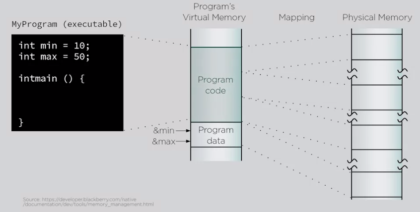

#### Availability Threat

"Availability," in this context, means ensuring that data and services
remain accessible to those who are authorized to access them.

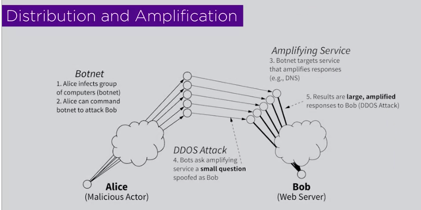

#### Fraud Threat

Dr. Edward G. Amoroso, CEO of TAG Cyber, a global cybersecurity company.
He is a distinguished research professor in computer science and
engineering at NYU Tandon.

## Threat/Asset Matrix

Each cell corresponds to a risk assessment of some sort. Each cell can
be broken down into its own threat tree.

**Risk** is estimated based on two contributing factors: (1) How likely
is it that some security attack will occur? (2) What are the
consequences if such attack were to occur?

Each of these seven assets for example, can have its own asset matrix –
where each such cell has its own threat tree (potentially).

**Risk Assessment example (contd.)**

Note doctor analogy. Best to start with Assets & threats which are
finite than Vulnerabilities & attacks which are infinite.

# Finding Vulnerabilities

## Vulnerability Types

The "zero" in zero-day vulnerability means that there's been zero days
for the vulnerability to be fixed, but it's been exploited by attackers
already.

A vulnerability is a bug or hole in a system. It allows an attacker to
gain access by using an exploit, which takes advantage of the
vulnerability.

## Analyzing suspicious items with OSINT Tools (Open Source Intelligence)

There's an enormous amount of open-source information online. Finding
relevant information that can be used to gather intelligence is a
challenge. Information can be gathered from a variety of sources, such
as search engines, social media, discussion boards, blogs, and more.
Several tools also exist that can be used in your intelligence gathering
process. Here are just a few examples of tools that you can explore:

- [VirusTotal](https://www.virustotal.com/gui/home/upload) is a service
  that allows anyone to analyze suspicious files, domains, URLs, and IP
  addresses for malicious content.

- [MITRE ATT&CK®](https://attack.mitre.org/) is a knowledge base of
  adversary tactics and techniques based on real-world observations.

- [OSINT Framework](https://osintframework.com/) is a web-based
  interface where you can find OSINT tools for almost any kind of source
  or platform.

- [Have I been Pwned](https://haveibeenpwned.com/) is a tool that can be
  used to search for breached email accounts.

There are numerous other OSINT tools that can be used to find specific
types of information. Remember, information can be gathered from a
variety of sources. Ultimately, it's your responsibility to thoroughly
research any available information that's relevant to the problem you’re
trying to solve.

### MITRE: Attack Framework

MITRE: A Comprehensive Guide: <https://www.varonis.com/blog/mitre-attck>

[MITRE ATT&CK®](https://attack.mitre.org/) is a knowledge base of
adversary tactics and techniques based on real-world observations.

### **File scanning**

#### **Jotti malware scan**

[Jotti's malware scan](https://virusscan.jotti.org/) is a free service
that lets you scan suspicious files with several antivirus programs.
There are some limitations to the number of files that you can submit. 

#### **CAPE Sandbox**

[CAPE Sandbox](https://capesandbox.com/analysis/) is an open source
service used to automate the analysis of suspicious files. Using an
isolated environment, malicious files such as malware are analyzed and a
comprehensive report outlines the malware behavior.

#### **MalwareBazaar**

[MalwareBazaar](https://bazaar.abuse.ch/browse/) is a free repository
for malware samples. Malware samples are a great source of threat
intelligence that can be used for research purposes. 

#### **Malwr**

Malwr uses the open source malware analysis system called Cuckoo Sandbox
which is also developed by them. Other than able to analyze EXE files,
Malwr also supports PDF, PHP, PERL and DLL formats. Providing an email
address to the submit form will notify you once your file analysis has
been complete with a direct link to view the report.

To submit a file to Malware, browse the file, optionally enter your
email address to receive notification or wait until the report is listed
at the the main homepage, fill up the CAPTCHA and click the Analyze
button. The report will contain file details, analysis errors,
screenshots, behavior/network/static analysis and dropped files.

[**Visit Malwr **  
Read
More: ](https://whatsoftware.com/download/did/1365/)<https://whatsoftware.com/analyze-suspicious-exe-files-with-comodo-instant-malware-analysis/>

#### **ThreatExpert**

ThreatExpert is an online free automated file analyzer that runs the
file that you send in their virtual system. Every action from the
program is then being recorded and generated into an easy to understand
report. The ThreatExpert report page contains information such as memory
and registry modifications, attempt to establish remote connections,
screenshots, multiple virus engine detection with a summary findings
showing the severity level of the file.

To submit a file, you can either register a free account so you can
access your reports anytime or enter your email address to receive the
report in MHTML format and a direct link to the online report. There is
a 5MB file size limit and the analysis can take up to 10 minutes. They
also have a [standalone desktop
tool ](https://whatsoftware.com/download/did/1364/) to submit files
without opening your web browser.

[**Visit ThreatExpert **  
Read
More: ](https://whatsoftware.com/download/did/1363/)<https://whatsoftware.com/analyze-suspicious-exe-files-with-comodo-instant-malware-analysis/>

#### VirusTotal 

[**<u>VirusTotal</u>**](https://www.virustotal.com/gui/home) is a
service that allows anyone to analyze suspicious files, domains, URLs,
and IP addresses for malicious content. VirusTotal also offers
additional services and tools for enterprise use. This reading focuses
on the VirusTotal website, which is available for free and
non-commercial use.

It can be used to analyze suspicious files, IP addresses, domains, and
URLs to detect cybersecurity threats such as malware. Users can submit
and check artifacts, like file hashes or IP addresses, to get VirusTotal
reports, which provide additional information on whether an IoC is
considered malicious or not, how that IoC is connected or related to
other IoCs in the dataset, and more.

Here is a breakdown of the reports summary:

1.  **Detection**: The Detection tab provides a list of third-party
    security vendors and their detection verdicts on an IoC. For
    example, vendors can list their detection verdict as malicious,
    suspicious, unsafe, and more.

2.  **Details**: The Details tab provides additional information
    extracted from a static analysis of the IoC. Information such as
    different hashes, file types, file sizes, headers, creation time,
    and first and last submission information can all be found in this
    tab.

3.  **Relations**: The Relations tab provides related IoCs that are
    somehow connected to an artifact, such as contacted URLs, domains,
    IP addresses, and dropped files if the artifact is an executable.

4.  **Behavior**: The Behavior tab contains information related to the
    observed activity and behaviors of an artifact after executing it in
    a controlled or sandboxed environment. This information includes
    tactics and techniques detected, network communications, registry
    and file systems actions, processes, and more.

5.  **Community:** The Community tab is where members of the VirusTotal
    community, such as security professionals or researchers, can leave
    comments and insights about the IoC.

6.  **Vendors’ ratio and community score**: The score displayed at the
    top of the report is the vendors’ ratio. The vendors’ ratio shows
    how many security vendors have flagged the IoC as malicious overall.
    Below this score, there is also the community score, based on the
    inputs of the VirusTotal community. The more detections a file has
    and the higher its community score is, the more likely that the file
    is malicious.

**Note**: Data uploaded to VirusTotal will be publicly shared with the
entire VirusTotal community. Be careful of what you submit, and make
sure you do not upload personal information.

### **URL Scanning**

#### **Urlscan.io**

[Urlscan.io](https://urlscan.io/) is a free service that scans and
analyzes URLs and provides a detailed report summarizing the URL
information.

### **Ip reputation checker**

#### **Talos**

<https://talosintelligence.com/>

#### **Senderscore**

<https://senderscore.org/>

#### **Spamhaus (domain and ip)**

<https://check.spamhaus.org/>

Check if an ip/domain has been involved with sus activity. Great for
seeing if your device is a bot in a botnet.

### Email Attachments and Sandbox Environments

#### VirtualBox

#### Sandboxie

Sandboxie runs your programs in an isolated space which prevents them
from making permanent changes to other programs and data in your
computer.

The red arrows indicate changes flowing from a running program into your
computer. The box labeled Hard disk (no sandbox) shows changes by a
program running normally. The box labeled Hard disk (with sandbox) shows
changes by a program running under Sandboxie. The animation illustrates
that Sandboxie is able to intercept the changes and isolate them within
a sandbox, depicted as a yellow rectangle. It also illustrates that
grouping the changes together makes it easy to delete all of them at
once.

<https://sandboxie-plus.com/sandboxie/>

### Email address scanning

#### Haveibeenpwned

<https://haveibeenpwned.com/>

## McAfee Threat Report

## CVE (Common Vulnerabilities and Exposures list) and NVD

We've discussed before that security is a team effort. Did you know the
group extends well beyond a single security team? Protecting information
is a global effort!

When it comes to vulnerabilities, there are actually online public
libraries. Individuals and organizations use them to share and document
common vulnerabilities and exposures. We've been focusing a lot on
vulnerabilities. Exposures are similar, but they have a key difference.
While a vulnerability is a weakness of a system, an exposure is a
mistake that can be exploited by a threat.

For example, imagine you're asked to protect an important document.
Documents are vulnerable to being misplaced. If you laid the document
down near an open window, it could be exposed to being blown away.

One of the most popular libraries of vulnerabilities and exposures is
the CVE list. The **common vulnerabilities and exposures list**, or CVE
list, is an openly accessible dictionary of known vulnerabilities and
exposures. It is a popular resource.

Many organizations use a CVE list to find ways to improve their
defenses. The CVE list was originally created by MITRE corporation in
1999. MITRE is a collection of non-profit research and development
centers. They're sponsored by the US government. Their focus is on
improving security technologies around the world.

The main purpose of the CVE list is to offer a standard way of
identifying and categorizing known vulnerabilities and exposures. Most
CVEs in the list are reported by independent researchers, technology
vendors, and ethical hackers, but anyone can report one. Before a CVE
can make it onto the CVE list, it first goes through a strict review
process by a **CVE Numbering Authority**, or **CNA**.

A CNA is an organization that volunteers to analyze and distribute
information on eligible CVEs. All of these groups have an established
record of researching vulnerabilities and demonstrating security
advisory capabilities. When a vulnerability or exposure is reported to
them, a rigorous testing process takes place.

<u>The CVE list tests four criteria that a vulnerability must have
before it's assigned an ID.</u>

1.  First, it must be independent of other issues. In other words, the
    vulnerability should be able to be fixed without having to fix
    something else.

2.  Second, it must be recognized as a potential security risk by
    whoever reports it. Third, the vulnerability must be submitted with
    supporting evidence.

3.  And finally, the reported vulnerability can only affect one
    codebase, or in other words, only one program's source code. For
    instance, the desktop version of Chrome may be vulnerable, but the
    Android application may not be. If the reported flaw passes all of
    these tests, it is assigned a CVE ID.

### Scoring CVE Vulnerabilities

Vulnerabilities added to the CVE list are often reviewed by other online
vulnerability databases. These organizations put them through additional
tests to reveal how significant the flaws are and to determine what kind
of threat they pose. One of the most popular is the **NIST National
Vulnerabilities Database**.

The NIST National Vulnerabilities Database uses what's known as the
common vulnerability scoring system, or CVSS, which is a measurement
system that scores the severity of a vulnerability. Security teams use
**CVSS** as a way of calculating the impact a vulnerability could have
on a system. They also use them to determine how quickly a vulnerability
should be patched.

<u>The NIST National Vulnerabilities Database provides a base score of
CVEs on a scale of 0-10</u>. Base scores reflect the moment a
vulnerability is evaluated, so they don't change over time. In general,
a CVSS that scores below a 4.0 is considered to be low risk and doesn't
require immediate attention. However, anything above a 9.0 is considered
to be a critical risk to company assets that should be addressed right
away.

Security teams commonly use the CVE list and CVSS scores as part of
their vulnerability management strategy. These references provide
recommendations for prioritizing security fixes, like installing
software updates before patches.

Libraries like the CVE list, help organizations answer questions. Is a
vulnerability dangerous to our business? If so, how soon should we
address it?

## The OWASP Top 10 Vulnerabilities

To prepare for future risks, security professionals need to stay
informed. Previously, you learned about the **CVE® list**, an openly
accessible dictionary of known vulnerabilities and exposures. The CVE®
list is an important source of information that the global security
community uses to share information with each other.

In this reading, you’ll learn about another important resource that
security professionals reference, the Open Web Application Security
Project, recently renamed Open Worldwide Application Security Project®
(OWASP). You’ll learn about OWASP’s role in the global security
community and how companies use this resource to focus their efforts.

### What is OWASP?

OWASP is a nonprofit foundation that works to improve the security of
software. OWASP is an open platform that security professionals from
around the world use to share information, tools, and events that are
focused on securing the web.

### The OWASP Top 10

One of OWASP’s most valuable resources is the OWASP Top 10. The
organization has published this list since 2003 as a way to spread
awareness of the web’s most targeted vulnerabilities. The Top 10 mainly
applies to new or custom made software. Many of the world's largest
organizations reference the OWASP Top 10 during application development
to help ensure their programs address common security mistakes.

**Pro tip:** OWASP’s Top 10 is updated every few years as technologies
evolve. Rankings are based on how often the vulnerabilities are
discovered and the level of risk they present.

**Note:** Auditors also use the OWASP Top 10 as one point of reference
when checking for regulatory compliance.

**Common vulnerabilities**

Businesses often make critical security decisions based on the
vulnerabilities listed in the OWASP Top 10. This resource influences how
businesses design new software that will be on their network, unlike the
CVE® list, which helps them identify improvements to existing programs.
These are the most regularly listed vulnerabilities that appear in their
rankings to know about:

#### **Broken access control**

Access controls limit what users can do in a web application. For
example, a blog might allow visitors to post comments on a recent
article but restricts them from deleting the article entirely. Failures
in these mechanisms can lead to unauthorized information disclosure,
modification, or destruction. They can also give someone unauthorized
access to other business applications.

#### **Cryptographic failures**

Information is one of the most important assets businesses need to
protect. Privacy laws such as General Data Protection Regulation (GDPR)
require sensitive data to be protected by effective encryption methods.
Vulnerabilities can occur when businesses fail to encrypt things like
personally identifiable information (PII). For example, if a web
application uses a weak hashing algorithm, like MD5, it’s more at risk
of suffering a data breach.

#### **Injection**

Injection occurs when malicious code is inserted into a vulnerable
application. Although the app appears to work normally, it does things
that it wasn’t intended to do. Injection attacks can give threat actors
a backdoor into an organization’s information system. A common target is
a website’s login form. When these forms are vulnerable to injection,
attackers can insert malicious code that gives them access to modify or
steal user credentials.

#### **Insecure design**

Applications should be designed in such a way that makes them resilient
to attack. When they aren’t, they’re much more vulnerable to threats
like injection attacks or malware infections. Insecure design refers to
a wide range of missing or poorly implemented security controls that
should have been programmed into an application when it was being
developed.

#### **Security misconfiguration**

Misconfigurations occur when security settings aren’t properly set or
maintained. Companies use a variety of different interconnected systems.
Mistakes often happen when those systems aren’t properly set up or
audited. A common example is when businesses deploy equipment, like a
network server, using default settings. This can lead businesses to use
settings that fail to address the organization's security objectives.

#### **Vulnerable and outdated components**

Vulnerable and outdated components is a category that mainly relates to
application development. Instead of coding everything from scratch, most
developers use open-source libraries to complete their projects faster
and easier. This publicly available software is maintained by
communities of programmers on a volunteer basis. Applications that use
vulnerable components that have not been maintained are at greater risk
of being exploited by threat actors.

#### **Identification and authentication failures**

Identification is the keyword in this vulnerability category. When
applications fail to recognize who should have access and what they’re
authorized to do, it can lead to serious problems. For example, a home
Wi-Fi router normally uses a simple login form to keep unwanted guests
off the network. If this defense fails, an attacker can invade the
homeowner’s privacy.

#### **Software and data integrity failures**

Software and data integrity failures are instances when updates or
patches are inadequately reviewed before implementation. Attackers might
exploit these weaknesses to deliver malicious software. When that
occurs, there can be serious downstream effects. Third parties are
likely to become infected if a single system is compromised, an event
known as a supply chain attack.

A famous example of a supply chain attack is the [SolarWinds cyber
attack
(2020)](https://www.gao.gov/blog/solarwinds-cyberattack-demands-significant-federal-and-private-sector-response-infographic)
where hackers injected malicious code into software updates that the
company unknowingly released to their customers.

#### **Security logging and monitoring failures**

In security, it’s important to be able to log and trace back events.
Having a record of events like user login attempts is critical to
finding and fixing problems. Sufficient monitoring and incident response
is equally important.

#### **Server-side request forgery**

Companies have public and private information stored on web servers.
When you use a hyperlink or click a button on a website, a request is
sent to a server that should validate who you are, fetch the appropriate
data, and then return it to you.

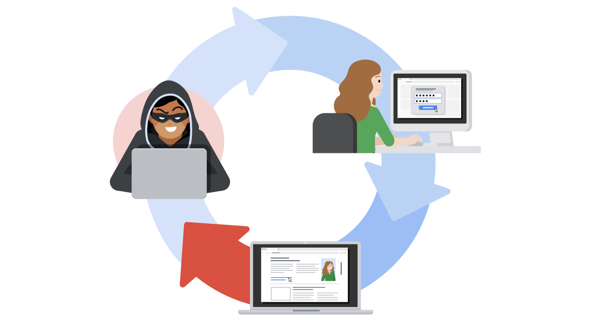

Server-side request forgeries (SSRFs) are when attackers manipulate the
normal operations of a server to read or update other resources on that
server. These are possible when an application on the server is
vulnerable. Malicious code can be carried by the vulnerable app to the
host server that will fetch unauthorized data.

## Compliance Standards

Previously, you were introduced to security frameworks and how they
provide a structured approach to implementing a security lifecycle. As a
reminder, a security lifecycle is a constantly evolving set of policies
and standards. In this reading, you will learn more about how security
frameworks, controls, and compliance regulations—or laws—are used
together to manage security and make sure everyone does their part to
minimize risk.

The **confidentiality, integrity, and availability (CIA) triad** is a
model that helps inform how organizations consider risk when setting up
systems and security policies. 

CIA are the three foundational principles used by cybersecurity
professionals to establish appropriate controls that mitigate threats,
risks, and vulnerabilities.

As you may recall, **security** **controls** are safeguards designed to
reduce specific security risks. So they are used alongside frameworks to
ensure that security goals and processes are implemented correctly and
that organizations meet regulatory compliance requirements.

**Compliance** is the process of adhering to internal standards and
external regulations.

### **The Federal Energy Regulatory Commission - North American Electric Reliability Corporation (FERC-NERC)**

FERC-NERC is a regulation that applies to organizations that work with
electricity or that are involved with the U.S. and North American power
grid. These types of organizations have an obligation to prepare for,
mitigate, and report any potential security incident that can negatively
affect the power grid. They are also legally required to adhere to the
Critical Infrastructure Protection (CIP) Reliability Standards defined
by the FERC. 

### **The Federal Risk and Authorization Management Program (FedRAMP®)**

FedRAMP is a U.S. federal government program that standardizes security
assessment, authorization, monitoring, and handling of cloud services
and product offerings. Its purpose is to provide consistency across the
government sector and third-party cloud providers. 

### **Center for Internet Security (CIS®)**

CIS is a nonprofit with multiple areas of emphasis. It provides a set of
controls that can be used to safeguard systems and networks against
attacks. Its purpose is to help organizations establish a better plan of
defense. CIS also provides actionable controls that security
professionals may follow if a security incident occurs. 

### **General Data Protection Regulation (GDPR)**

GDPR is a European Union (E.U.) general data regulation that protects
the processing of E.U. residents’ data and their right to privacy in and
out of E.U. territory. For example, if an organization is not being
transparent about the data they are holding about an E.U. citizen and
why they are holding that data, this is an infringement that can result
in a fine to the organization. Additionally, if a breach occurs and an
E.U. citizen’s data is compromised, they must be informed. The affected
organization has 72 hours to notify the E.U. citizen about the breach.

### **Payment Card Industry Data Security Standard (PCI DSS)**

PCI DSS is an international security standard meant to ensure that
organizations storing, accepting, processing, and transmitting credit
card information do so in a secure environment. The objective of this
compliance standard is to reduce credit card fraud. 

### **The Health Insurance Portability and Accountability Act (HIPAA)**

HIPAA is a U.S. federal law established in 1996 to protect patients'
health information. This law prohibits patient information from being
shared without their consent. It is governed by three rules: 

1.  Privacy

2.  Security 

3.  Breach notification 

Organizations that store patient data have a legal obligation to inform
patients of a breach because if patients' **Protected Health
Information** (PHI) is exposed, it can lead to identity theft and
insurance fraud. PHI relates to the past, present, or future physical or
mental health or condition of an individual, whether it’s a plan of care
or payments for care. Along with understanding HIPAA as a law, security
professionals also need to be familiar with the Health Information Trust
Alliance (HITRUST®), which is a security framework and assurance program
that helps institutions meet HIPAA compliance.

### **International Organization for Standardization (ISO) **

ISO was created to establish international standards related to
technology, manufacturing, and management across borders. It helps
organizations improve their processes and procedures for staff
retention, planning, waste, and services. 

### **System and Organizations Controls (SOC type 1, SOC type 2)**

The American Institute of Certified Public Accountants® (AICPA) auditing
standards board developed this standard. The SOC1 and SOC2 are a series
of reports that focus on an organization's user access policies at
different organizational levels such as: 

- Associate

- Supervisor

- Manager

- Executive

- Vendor

- Others 

They are used to assess an organization’s financial compliance and
levels of risk. They also cover confidentiality, privacy, integrity,
availability, security, and overall data safety. Control failures in
these areas can lead to fraud.

**Pro tip**: There are a number of regulations that are frequently
revised. You are encouraged to keep up-to-date with changes and explore
more frameworks, controls, and compliance. Two suggestions to research:
the Gramm-Leach-Bliley Act and the Sarbanes-Oxley Act.

### United States Presidential Executive Order 14028

On May 12, 2021, President Joe Biden released an executive order related
to improving the nation’s cybersecurity to remediate the increase in
threat actor activity. Remediation efforts are directed toward federal
agencies and third parties with ties to U.S. [critical
infrastructure](https://csrc.nist.gov/glossary/term/critical_infrastructure#:~:text=Definition(s)%3A,any%20combination%20of%20those%20matters.).
For additional information, review the [Executive Order on Improving the
Nation’s
Cybersecurity](https://www.whitehouse.gov/briefing-room/presidential-actions/2021/05/12/executive-order-on-improving-the-nations-cybersecurity/).

## Security Controls

### Principle of Least privilege

To maintain privacy, security controls are intended to limit access
based on the user and situation. This is known as the **<u>principle of
least privilege</u>**. Security controls should be designed with the
principle of least privilege in mind. When they are, they rely on
differentiating between data owners and data custodians.

A **data owner** is a person who decides who can access, edit, use, or
destroy their information.

The idea is very straightforward except in cases where there are
multiple owners. For example, the intellectual property of an
organization can have multiple data owners.

A **data custodian** is anyone or anything that's responsible for the
safe handling, transport, and storage of information.

Did you notice that I mentioned, "anything?" That's because, aside from
people, organizations and their systems are also custodians of people's
information.

#### Limiting access reduces risk

Every business needs to plan for the risk of data theft, misuse, or
abuse. Implementing the principle of least privilege can greatly reduce
the risk of costly incidents like data breaches by:

- Limiting access to sensitive information

- Reducing the chances of accidental data modification, tampering, or
  loss

- Supporting system monitoring and administration

Least privilege greatly reduces the likelihood of a successful attack by
connecting specific resources to specific users and placing limits on
what they can do. It's an important security control that should be
applied to any asset. Clearly defining who or what your users are is
usually the first step of implementing least privilege effectively.

**Note:** Least privilege is closely related to another fundamental
security principle, the *separation of duties—*a security concept that
divides tasks and responsibilities among different users to prevent
giving a single user complete control over critical business functions.
You'll learn more about separation of duties in a different reading
about identity and access management.

#### Determining access and authorization

To implement least privilege, access and authorization must be
determined first. There are two questions to ask to do so: 

- Who is the user? 

- How much access do they need to a specific resource? 

Determining who the user is usually straightforward. A user can refer to
a person, like a customer, an employee, or a vendor. It can also refer
to a device or software that's connected to your business network. In
general, every user should have their own account. Accounts are
typically stored and managed within an organization's directory service.

These are the most common types of user accounts:

- **Guest accounts** are provided to external users who need to access
  an internal network, like customers, clients, contractors, or business
  partners.

- **User accounts** are assigned to staff based on their job duties.

- **Service accounts** are granted to applications or software that
  needs to interact with other software on the network.

- **Privileged accounts** have elevated permissions or administrative
  access.

It's best practice to determine a baseline access level for each account
type before implementing least privilege. However, the appropriate
access level can change from one moment to the next. For example, a
customer support representative should only have access to your
information while they are helping you. Your data should then become
inaccessible when the support agent starts working with another customer
and they are no longer actively assisting you. Least privilege can only
reduce risk if user accounts are routinely and consistently monitored.

**Pro tip:** Passwords play an important role when implementing the
principle of least privilege. Even if user accounts are assigned
appropriately, an insecure password can compromise your systems.

#### Auditing account privileges

Setting up the right user accounts and assigning them the appropriate
privileges is a helpful first step. Periodically auditing those accounts
is a key part of keeping your company’s systems secure.

There are three common approaches to auditing user accounts:

- Usage audits

- Privilege audits

- Account change audits

As a security professional, you might be involved with any of these
processes.

#### **Usage audits**

When conducting a usage audit, the security team will review which
resources each account is accessing and what the user is doing with the
resource. Usage audits can help determine whether users are acting in
accordance with an organization’s security policies. They can also help
identify whether a user has permissions that can be revoked because they
are no longer being used.

#### **Privilege audits**

Users tend to accumulate more access privileges than they need over
time, an issue known as *privilege creep*. This might occur if an
employee receives a promotion or switches teams and their job duties
change. Privilege audits assess whether a user's role is in alignment
with the resources they have access to.

#### **Account change audits**

Account directory services keep records and logs associated with each
user. Changes to an account are usually saved and can be used to audit
the directory for suspicious activity, like multiple attempts to change
an account password. Performing account change audits helps to ensure
that all account changes are made by authorized users.

**Note:** Most directory services can be configured to alert system
administrators of suspicious activity.

### Classifying Data

Security professionals classify data types to help them properly protect
an organization from cyber attacks that negatively impact business
operations. Here is a review of the most common data types:

- **Public data**

- **Private data**

- **Sensitive data**

- **Confidential data**

#### Public data

This data classification does not need extra security protections.
**Public data** is already accessible to the public and poses a minimal
risk to the organization if viewed or shared by others. Although this
data is open to the public, it still needs to be protected from security
attacks. Examples of public data include press releases, job
descriptions, and marketing materials.

#### Private data

This data classification type has a higher security level. **Private
data** is information that should be kept from the public. If an
individual gains unauthorized access to private data, that event has the
potential to pose a serious risk to an organization. 

Examples of private data can include company email addresses, employee
identification numbers, and an organization’s research data. 

#### Sensitive data

This information must be protected from everyone who does not have
authorized access. Unauthorized access to sensitive data can cause
significant damage to an organization’s finances and reputation. 

**Sensitive data** includes personally identifiable information (PII),
sensitive personally identifiable information (SPII), and protected
health information (PHI). Examples of these types of sensitive data are
banking account numbers, usernames and passwords, social security
numbers (which U.S. citizens use to report their wages to the
government), passwords, passport numbers, and medical information. 

#### Confidential data

This data classification type is important for an organization’s ongoing
business operations. **Confidential data** often has limits on the
number of people who have access to it. Access to confidential data
sometimes involves the signing of non-disclosure agreements (NDAs)—
legal contracts that bind two or more parties to protect information—to
further protect the confidentiality of the data. 

Examples of confidential data include proprietary information such as
trade secrets, financial records, and sensitive government data.

#### Asset classification

**Asset classification** means labeling assets based on sensitivity and
importance to an organization. The classification of an organization's
assets ranges from low- to high-level. 

Public data is a low-level asset. It is readily available to the public
and will not have a negative impact on an organization if compromised.
Sensitive data and confidential data are high-level assets. They can
have a significantly negative impact on an organization if leaked
publicly. That negative impact can lead to the loss of a company’s
competitive edge, reputation, and customer trust. A company’s website
address is an example of a low-level asset. An internal email from that
company discussing trade secrets is an example of a high-level asset. 

### Security Control categories

Controls within cybersecurity are grouped into three main categories:

- Administrative/Managerial controls

- Technical controls

- Operational/Physical controls

**Administrative/Managerial controls** address the human component of
cybersecurity. These controls include policies and procedures that
define how an organization manages data and clearly defines employee
responsibilities, including their role in protecting the organization.
While administrative controls are typically policy based, the
enforcement of those policies may require the use of technical or
physical controls. User training is the most cost-effective security
control to use.

**Technical controls** consist of solutions such as firewalls, intrusion
detection systems (IDS), intrusion prevention systems (IPS), audio
visual (AV) products, encryption, etc. Technical controls can be used in
a number of ways to meet organizational goals and objectives.

Smart cards, encryption, access control lists (ACLs), intrusion
detection systems, and network authentication

**Physical controls** include door locks, cabinet locks, surveillance
cameras, badge readers, etc. They are used to limit physical access to
physical assets by unauthorized personnel.

### Control types

There are five types of controls:

1.  Preventative

2.  Corrective

3.  Detective

4.  Deterrent

5.  Compensating

These controls work together to provide defense in depth and protect
assets. **Preventative controls** are designed to prevent an incident
from occurring in the first place. **Corrective controls** are used to
restore an asset after an incident. **Detective controls** are
implemented to determine whether an incident has occurred or is in
progress. **Deterrent controls** are designed to discourage attacks.
And, finally, **compensating controls** are used to fortify the security
of an asset when the current controls aren’t enough to adequately
protect the asset.

Review the following charts for specific details about each type of
control and its purpose.

<table>
<colgroup>
<col style="width: 33%" />
<col style="width: 33%" />
<col style="width: 33%" />
</colgroup>
<thead>
<tr>
<th colspan="3" style="text-align: center;"><strong>Administrative
Controls</strong></th>
</tr>
</thead>
<tbody>
<tr>
<td><strong>Control Name</strong></td>
<td><strong>Control Type</strong></td>
<td><strong>Control Purpose</strong></td>
</tr>
<tr>
<td>Least Privilege</td>
<td>Preventative</td>
<td>Reduce risk and <mark>overall impact</mark> of malicious insider or
compromised accounts</td>
</tr>
<tr>
<td>Disaster recovery plans</td>
<td>Corrective</td>
<td>Provide business continuity</td>
</tr>
<tr>
<td>Password policies</td>
<td>Preventative</td>
<td>Reduce likelihood of account compromise through brute force or
dictionary attack techniques</td>
</tr>
<tr>
<td>Access control policies</td>
<td>Preventative</td>
<td>Bolster confidentiality and integrity by defining which groups can
access or modify data</td>
</tr>
<tr>
<td>Account management policies</td>
<td>Preventative</td>
<td>Managing account lifecycle, reducing attack surface, and limiting
<mark>overall impact</mark> from disgruntled former employees and
default account usage</td>
</tr>
<tr>
<td>Separation of duties</td>
<td>Preventative</td>
<td>Reduce risk and <mark>overall impact</mark> of malicious insider or
compromised accounts</td>
</tr>
</tbody>
</table>

<table>
<colgroup>
<col style="width: 33%" />
<col style="width: 33%" />
<col style="width: 33%" />
</colgroup>
<tbody>
<tr>
<td colspan="3" style="text-align: center;"><strong>Technical
Controls</strong></td>
</tr>
<tr>
<td style="text-align: center;"><strong>Control Name</strong></td>
<td style="text-align: center;"><strong>Control Type</strong></td>
<td style="text-align: center;"><strong>Control Purpose</strong></td>
</tr>
<tr>
<td style="text-align: center;">Firewall</td>
<td style="text-align: center;">Preventative</td>
<td style="text-align: center;">To filter unwanted or malicious traffic
from entering the network</td>
</tr>
<tr>
<td style="text-align: center;">IDS/IPS</td>
<td style="text-align: center;">Detective</td>
<td style="text-align: center;">To detect and prevent anomalous traffic
that matches a signature or rule</td>
</tr>
<tr>
<td style="text-align: center;">Encryption</td>
<td style="text-align: center;">Deterrent</td>
<td style="text-align: center;">Provide confidentiality to sensitive
information</td>
</tr>
<tr>
<td style="text-align: center;">Backups</td>
<td style="text-align: center;">Corrective</td>
<td style="text-align: center;">Restore/recover from an event</td>
</tr>
<tr>
<td style="text-align: center;">Password management</td>
<td style="text-align: center;">Preventative</td>
<td style="text-align: center;">Reduce password fatigue</td>
</tr>
<tr>
<td style="text-align: center;">Antivirus (AV) software</td>
<td style="text-align: center;">Corrective</td>
<td style="text-align: center;">Detect and quarantine known threats</td>
</tr>
<tr>
<td style="text-align: center;">Manual monitoring, maintenance, and
intervention</td>
<td style="text-align: center;">Preventative</td>
<td style="text-align: center;">Necessary to identify and manage
threats, risks, or vulnerabilities to out-of-date systems</td>
</tr>
</tbody>
</table>

<table>
<colgroup>
<col style="width: 33%" />
<col style="width: 33%" />
<col style="width: 33%" />
</colgroup>
<tbody>
<tr>
<td colspan="3" style="text-align: center;"><strong>Physical
Controls</strong></td>
</tr>
<tr>
<td style="text-align: center;"><strong>Control Name</strong></td>
<td style="text-align: center;"><strong>Control Type</strong></td>
<td style="text-align: center;"><strong>Control Purpose</strong></td>
</tr>
<tr>
<td style="text-align: center;">Time-controlled safe</td>
<td style="text-align: center;">Deterrent</td>
<td style="text-align: center;">Reduce attack surface and <mark>overall
impact</mark> from physical threats</td>
</tr>
<tr>
<td style="text-align: center;">Adequate lighting</td>
<td style="text-align: center;">Deterrent</td>
<td style="text-align: center;">Deter threats by limiting “hiding”
places</td>
</tr>
<tr>
<td style="text-align: center;">Closed-circuit television (CCTV)</td>
<td style="text-align: center;">Preventative/Detective</td>
<td style="text-align: center;">Closed circuit television is both a
preventative and detective control because it’s presence can reduce risk
of certain types of events from occurring, and can be used after an
event to inform on event conditions</td>
</tr>
<tr>
<td style="text-align: center;">Locking cabinets (for network gear)</td>
<td style="text-align: center;">Preventative</td>
<td style="text-align: center;">Bolster integrity by preventing
unauthorized personnel and other individuals from physically accessing
or modifying network infrastructure gear</td>
</tr>
<tr>
<td style="text-align: center;">Signage indicating alarm service
provider</td>
<td style="text-align: center;">Deterrent</td>
<td style="text-align: center;">Deter certain types of threats by making
the likelihood of a successful attack seem low</td>
</tr>
<tr>
<td style="text-align: center;">Locks</td>
<td style="text-align: center;">Deterrent/Preventative</td>
<td style="text-align: center;">Bolster integrity by deterring and
preventing unauthorized personnel, individuals from physically accessing
assets</td>
</tr>
<tr>
<td style="text-align: center;">Fire detection and prevention (fire
alarm, sprinkler system, etc.)</td>
<td style="text-align: center;">Detective/Preventative</td>
<td style="text-align: center;">Detect fire in physical location and
prevent damage to physical assets such as inventory, servers, etc.</td>
</tr>
</tbody>
</table>

## Vulnerability Scanning

See red-teaming.

## The data lifecycle

The data lifecycle is an important model that security teams consider
when protecting information. It influences how they set policies that
align with business objectives. It also plays an important role in the
technologies security teams use to make information accessible.

In general, the data lifecycle has five stages. Each describe how data
flows through an organization from the moment it is created until it is
no longer useful:

- Collect

- Store

- Use

- Archive

- Destroy

Protecting information at each stage of this process describes the need
to keep it accessible and recoverable should something go wrong.

### Data governance

Businesses handle massive amounts of data every day. New information is
constantly being collected from internal and external sources. A
structured approach to managing all of this data is the best way to keep
it private and secure.

*Data governance* is a set of processes that define how an organization
manages information. Governance often includes policies that specify how
to keep data private, accurate, available, and secure throughout its
lifecycle.

Effective data governance is a collaborative activity that relies on
people. Data governance policies commonly categorize individuals into a
specific role:

- **Data owner:** the person that decides who can access, edit, use, or
  destroy their information.

- **Data custodian**: anyone or anything that's responsible for the safe
  handling, transport, and storage of information.

- **Data steward**: the person or group that maintains and implements
  data governance policies set by an organization.

Businesses store, move, and transform data using a wide range of IT
systems. Data governance policies often assign accountability to data
owners, custodians, and stewards.

**Note:** As a data custodian, you will primarily be  responsible for
maintaining security and privacy rules for your organization.

### Protecting data at every stage

Most security plans include a specific policy that outlines how
information will be managed across an organization. This is known as a
data governance policy. These documents clearly define procedures that
should be followed to participate in keeping data safe. They place
limits on who or what can access data. Security professionals are
important participants in data governance. As a data custodian, you will
be responsible for ensuring that data isn’t damaged, stolen, or misused.

### Legally protected information

Data is more than just a bunch of 1s and 0s being processed by a
computer. Data can represent someone's personal thoughts, actions, and
choices. It can represent a purchase, a sensitive medical decision, and
everything in between. For this reason, data owners should be the ones
deciding whether or not to share their data. As a security professional,
protecting a person's data privacy decisions must always be respected.

Securing data can be challenging. In large part, that's because data
owners generate more data than they can manage. As a result, data
custodians and stewards sometimes lack direct, explicit instructions on
how they should handle specific types of data. Governments and other
regulatory agencies have bridged this gap by creating rules that specify
the types of information that organizations must protect by default:

- **PII** is any information used to infer an individual's identity.
  Personally identifiable information, or PII, refers to information
  that can be used to contact or locate someone.

- **PHI** stands for protected health information.  In the U.S., it is
  regulated by the Health Insurance Portability and Accountability Act
  (HIPAA), which defines PHI as “information that relates to the past,
  present, or future physical or mental health or condition of an
  individual.” In the EU, PHI has a similar definition but it is
  regulated by the General Data Protection Regulation (GDPR).

- **SPII** is a specific type of PII that falls under stricter handling
  guidelines. The *S* stands for sensitive, meaning this is a type of
  personally identifiable information that should only be accessed on a
  need-to-know basis, such as a bank account number or login
  credentials.

Overall, it's important to protect all types of personal information
from unauthorized use and disclosure.

# Analyzing and Scoring Vulnerabilities

## Vulnerability Assessments 

Weaknesses and flaws are generally found during a vulnerability
assessment. A vulnerability assessment is the internal review process of
an organization's security systems. These assessments work similar to
the process of identifying and categorizing vulnerabilities on the CVE
list. The main difference is the organization's security team performs,
evaluates, scores, and fixes them on their own. Security analysts play a
key role throughout this process.

Overall, the goal of a vulnerability assessment is to identify weak
points and prevent attacks. They're also how security teams determine
whether their security controls meet regulatory standards. Organizations
perform vulnerability assessments a lot. Because companies have so many
assets to protect, security teams sometimes need to select which area to
focus on through vulnerability assessments.

Once they decide what to focus on, vulnerability assessments typically
follow a four-step process.

1.  **<u>Identification</u>**: The first step is **identification**.
    Here, scanning tools and manual testing are used to find
    vulnerabilities. During the identification step, the goal is to
    understand the current state of a security system, like taking a
    picture of it. A large number of findings usually appear after
    identification.

2.  **<u>Vulnerability Analysis:</u>** The next step of the process is
    **vulnerability analysis**. During this step, each of the
    vulnerabilities that were identified are tested. By being a digital
    detective, the goal of vulnerability analysis is to find the source
    of the problem.

3.  **<u>Risk Assessment:</u>** The third step of the process is **risk
    assessment**. During this step of the process, a score is assigned
    to each vulnerability. This score is assigned based on two factors:
    how severe the impact would be if the vulnerability were to be
    exploited and the likelihood of this happening. Vulnerabilities
    uncovered during the first two steps of this process often outnumber
    the people available to fix them. Risk assessments are a way of
    prioritizing resources to handle the vulnerabilities that need to be
    addressed based on their score.

4.  **<u>Planned Remediation:</u>** The fourth and final step of
    **vulnerability assessment** is remediation. It's during this step
    that the vulnerabilities that can impact the organization are
    addressed. Remediation occurs depending on the severity score
    assigned during the risk assessment step. This part of the process
    is normally a joint effort between the security staff and IT teams
    to come up with the best approach to fixing the vulnerabilities that
    were uncovered earlier. Examples of remediation steps might include
    things like enforcing new security procedures, updating operating
    systems, or implementing system patches.

Vulnerability assessments are great for identifying the flaws of a
system. Most organizations use them to search for problems before they
happen. But how do we know where to search? When we get together again,
we'll explore how companies figure this out.

## The triage process

Previously, you learned that triaging is used to assess alerts and
assign priority to incidents. In this reading, you'll explore the triage
process and its benefits. As a security analyst, you'll be responsible
for analyzing security alerts. Having the skills to effectively triage
is important because it allows you to address and resolve security
alerts efficiently.

Incidents can have the potential to cause significant damage to an
organization. Security teams must respond quickly and efficiently to
prevent or limit the impact of an incident before it becomes too late.
**Triage** is the prioritizing of incidents according to their level of
importance or urgency. The triage process helps security teams evaluate
and prioritize security alerts and allocate resources effectively so
that the most critical issues are addressed first.

The triage process consists of three steps:

1.  Receive and assess 

2.  Assign priority 

3.  Collect and analyze

### **Receive and assess**

During this first step of the triage process, a security analyst
receives an alert from an alerting system like an **intrusion detection
system** (IDS). You might recall that an IDS is an application that
monitors system activity and alerts on possible intrusions. The analyst
then reviews the alert to verify its validity and ensure they have a
complete understanding of the alert. 

This involves gathering as much information as possible about the alert,
including details about the activity that triggered the alert, the
systems and assets involved, and more. Here are some questions to
consider when verifying the validity of an alert: 

- **Is the alert a false positive?** Security analysts must determine
  whether the alert is a genuine security concern or a **false
  positive**, or an alert that incorrectly detects the presence of a
  threat.

- **Was this alert triggered in the past?** If so, how was it resolved?
  The history of an alert can help determine whether the alert is a new
  or recurring issue. 

- **Is the alert triggered by a known vulnerability?** If an alert is
  triggered by a known vulnerability, security analysts can leverage
  existing knowledge to determine an appropriate response and minimize
  the impact of the vulnerability. 

- **What is the severity of the alert?** The severity of an alert can
  help determine the priority of the response so that critical issues
  are quickly escalated.

### **Assign priority **

Once the alert has been properly assessed and verified as a genuine
security issue, it needs to be prioritized accordingly. Incidents differ
in their impact, size, and scope, which affects the response efforts. To
manage time and resources, security teams must prioritize how they
respond to various incidents because not all incidents are equal. Here
are some factors to consider when determining the priority of an
incident:

- **Functional impact:** Security incidents that target information
  technology systems impact the service that these systems provide to
  its users. For example, a ransomware incident can severely impact the
  confidentiality, availability, and integrity of systems. Data can be
  encrypted or deleted, making it completely inaccessible to users.
  Consider how an incident impacts the existing business functionality
  of the affected system.

- **Information impact:** Incidents can affect the confidentiality,
  integrity, and availability of an organization’s data and information.
  In a data exfiltration attack, malicious actors can steal sensitive
  data. This data can belong to third party users or organizations.
  Consider the effects that information compromise can have beyond the
  organization. 

- **Recoverability:** How an organization recovers from an incident
  depends on the size and scope of the incident and the amount of
  resources available. In some cases, recovery might not be possible,
  like when a malicious actor successfully steals proprietary data and
  shares it publicly. Spending time, effort, and resources on an
  incident with no recoverability can be wasteful. It’s important to
  consider whether recovery is possible and consider whether it’s worth
  the time and cost.

**Note**: Security alerts often come with an assigned priority or
severity level that classifies the urgency of the alert based on a level
of prioritization. 

### **Collect and analyze**

The final step of the triage process involves the security analyst
performing a comprehensive analysis of the incident. Analysis involves
gathering evidence from different sources, conducting external research,
and documenting the investigative process. The goal of this step is to
gather enough information to make an informed decision to address it.
Depending on the severity of the incident, escalation to a level two
analyst or a manager might be required. Level two analysts and managers
might have more knowledge on using advanced techniques to address the
incident. 

### Benefits of triage

By prioritizing incidents based on their potential impact, you can
reduce the scope of impact to the organization by ensuring a timely
response. Here are some benefits that triage has for security teams: 

- **Resource management:** Triaging alerts allows security teams to
  focus their resources on threats that require urgent attention. This
  helps team members avoid dedicating time and resources to lower
  priority tasks and might also reduce response time.

- **Standardized approach:** Triage provides a standardized approach to
  incident handling. Process documentation, like playbooks, help to move
  alerts through an iterative process to ensure that alerts are properly
  assessed and validated. This ensures that only valid alerts are moved
  up to investigate.

## Security audits

A **security audit** is a review of an organization's security controls,
policies, and procedures against a set of expectations. Audits are
independent reviews that evaluate whether an organization is meeting
internal and external criteria. Internal criteria include outlined
policies, procedures, and best practices. External criteria include
regulatory compliance, laws, and federal regulations.

Additionally, a security audit can be used to assess an organization's
established security controls. As a reminder, **security controls** are
safeguards designed to reduce specific security risks. 

Audits help ensure that security checks are made (i.e., daily monitoring
of security information and event management dashboards), to identify
threats, risks, and vulnerabilities. This helps maintain an
organization’s security posture. And, if there are security issues, a
remediation process must be in place.

### Goals and objectives of an audit

The goal of an audit is to ensure an organization's information
technology (IT) practices are meeting industry and organizational
standards. The objective is to identify and address areas of remediation
and growth. Audits provide direction and clarity by identifying what the
current failures are and developing a plan to correct them. 

Security audits must be performed to safeguard data and avoid penalties
and fines from governmental agencies. The frequency of audits is
dependent on local laws and federal compliance regulations.

### Factors that affect audits

Factors that determine the types of audits an organization implements
include: 

- Industry type

- Organization size

- Ties to the applicable government regulations

- A business’s geographical location

- A business decision to adhere to a specific regulatory compliance

To review common compliance regulations that different organizations
need to adhere to, refer to [the reading about controls, frameworks, and
compliance](https://www.coursera.org/learn/foundations-of-cybersecurity/supplement/xu4pr/controls-frameworks-and-compliance).

### The role of frameworks and controls in audits

Along with compliance, it’s important to mention the role of frameworks
and controls in security audits. Frameworks such as the National
Institute of Standards and Technology Cybersecurity Framework (NIST CSF)
and the international standard for information security (ISO 27000)
series are designed to help organizations prepare for regulatory
compliance security audits. By adhering to these and other relevant
frameworks, organizations can save time when conducting external and
internal audits. Additionally, frameworks, when used alongside controls,
can support organizations’ ability to align with regulatory compliance
requirements and standards. 

### Audit checklist

It’s necessary to create an audit checklist before conducting an audit.
A checklist is generally made up of the following areas of focus:

**Identify the scope of the audit**

- The audit should:

  - List assets that will be assessed (e.g., firewalls are configured
    correctly, PII is secure, physical assets are locked, etc.) 

  - Note how the audit will help the organization achieve its desired
    goals

  - Indicate how often an audit should be performed

  - Include an evaluation of organizational policies, protocols, and
    procedures to make sure they are working as intended and being
    implemented by employees

**Complete a risk assessment**

- A risk assessment is used to evaluate identified organizational risks
  related to budget, controls, internal processes, and external
  standards (i.e., regulations).

**Conduct the audit**

- When conducting an internal audit, you will assess the security of the
  identified assets listed in the audit scope.

**Create a mitigation plan**

- A mitigation plan is a strategy established to lower the level of risk
  and potential costs, penalties, or other issues that can negatively
  affect the organization’s security posture. 

**Communicate results to stakeholders**

- The end result of this process is providing a detailed report of
  findings, suggested improvements needed to lower the organization's
  level of risk, and compliance regulations and standards the
  organization needs to adhere to.

**<u>Key takeaways</u>**

In this reading you learned more about security audits, including what
they are; why they’re conducted; and the role of frameworks, controls,
and compliance in audits. 

Although there is much more to learn about security audits, this
introduction is meant to support your ability to complete an audit of
your own for a self-reflection portfolio activity later in this course.

Resources that you can explore to further develop your understanding of
audits in the cybersecurity space are: 

- [IT Security Procedural Guide: Audit and Accountability (AU) CIO-IT
  Security-01-08](https://www.gsa.gov/cdnstatic/Audit_and_Accountability_(AU)_%5BCIO-IT_Security_01-08_Rev_6%5D_12-03-2020docx.pdf)

- [Assessment and Auditing
  Resources](https://www.nist.gov/cyberframework/assessment-auditing-resources)  

- [IT Disaster Recovery
  Plan](https://www.ready.gov/it-disaster-recovery-plan)

# Vulnerability Management and Security Plans

Security teams spend a lot of time finding vulnerabilities and thinking
of how they can be exploited. They do this with the process known as
vulnerability management. Vulnerability management is the process of
finding and patching vulnerabilities. Vulnerability management helps
keep assets safe. It's a method of stopping threats before they can
become a problem.

<u>Vulnerability management is a four step process</u>.

1.  The first step is to **identify vulnerabilities.**

2.  The next step is to **consider potential exploits** of those
    vulnerabilities.

3.  Third is to **prepare defenses against threats**.

4.  And finally, the fourth step is to **evaluate those defenses**.

When the last step ends, the process starts again. Vulnerability
management happens in a cycle. It's a regular part of what security
teams do because there are always new vulnerabilities to be concerned
about.

This is exactly why a diverse set of perspectives is useful! Having a
wide range of backgrounds and experiences only strengthens security
teams and their ability to find exploits. However, even large and
diverse security teams can't keep track of everything.

New vulnerabilities are constantly being discovered. These are known as
zero-day exploits. A zero-day is an exploit that was previously unknown.
The term zero-day refers to the fact that the exploit is happening in
real time with zero days to fix it. These kind of exploits are
dangerous. They represent threats that haven't been planned for yet.

For example, we can anticipate the possibility of a burglar breaking
into our home. We can plan for this type of threat by having defenses in
place, like locks on the doors and windows. A zero-day exploit would be
something totally unexpected, like the lock on the door falling off from
intense heat. Zero-day exploits are things that don't normally come to
mind. For example, this might be a new form of spyware infecting a
popular website. When zero-day exploits happen, they can leave assets
even more vulnerable to threats than they already are.

Vulnerability management is the process of finding vulnerabilities and
fixing their exploits. That's why the process is performed regularly at
most organizations. Perhaps the most important step of the process is
identifying vulnerabilities. We'll explore this step in more details
next time we get together. I'll meet you again then!

## On Security Frameworks

**Security frameworks** are guidelines used for building plans to help
mitigate risks and threats to data and privacy. They have four core
components:

1.  Identifying and documenting security goals 

2.  Setting guidelines to achieve security goals 

3.  Implementing strong security processes

4.  Monitoring and communicating results

The National Institute of Standards and Technology (NIST) is a
U.S.-based agency that develops multiple voluntary compliance frameworks
that organizations worldwide can use to help manage risk. The more
aligned an organization is with compliance, the lower the risk.

Examples of frameworks that were introduced previously include the NIST
Cybersecurity Framework (CSF) and the NIST Risk Management Framework
(RMF). 

**Note:** Specifications and guidelines can change depending on the type
of organization you work for.

In addition to the [NIST CSF](https://www.nist.gov/cyberframework) and
[NIST RMF](https://csrc.nist.gov/projects/risk-management/about-rmf),
there are several other controls, frameworks, and compliance standards
that it is important for security professionals to be familiar with to
help keep organizations and the people they serve safe.

In this video, we're going to focus on NIST's Risk Management Framework
or RMF. As an entry-level analyst, you may not engage in all of these
steps, but it's important to be familiar with this framework. Having a
solid foundational understanding of how to mitigate and manage risks can
set yourself apart from other candidates as you begin your job search in
the field of security.

## NIST RMF (NIST Risk Management Framework)

There are seven steps in the RMF: **prepare, categorize, select,
implement, assess, authorize,** and **monitor**.

Let's start with **Step one, prepare**. Prepare refers to activities
that are necessary to manage security and privacy risks before a breach
occurs. As an entry-level analyst, you'll likely use this step to
monitor for risks and identify controls that can be used to reduce those
risks.

**Step two is categorize**, which is used to develop risk management
processes and tasks. Security professionals then use those processes and
develop tasks by thinking about how the confidentiality, integrity, and
availability of systems and information can be impacted by risk. As an
entry-level analyst, you'll need to be able to understand how to follow
the processes established by your organization to reduce risks to
critical assets, such as private customer information.

**Step three is select**. Select means to choose, customize, and capture
documentation of the controls that protect an organization. An example
of the select step would be keeping a playbook up-to-date or helping to
manage other documentation that allows you and your team to address
issues more efficiently.

**Step four is to implement security and privacy plans** for the
organization. Having good plans in place is essential for minimizing the
impact of ongoing security risks. For example, if you notice a pattern
of employees constantly needing password resets, implementing a change
to password requirements may help solve this issue.

**Step five is assess**. Assess means to determine if established
controls are implemented correctly. An organization always wants to
operate as efficiently as possible. So it's essential to take the time
to analyze whether the implemented protocols, procedures, and controls
that are in place are meeting organizational needs. During this step,
analysts identify potential weaknesses and determine whether the
organization's tools, procedures, controls, and protocols should be
changed to better manage potential risks.

**Step six is authorize**. Authorize means being accountable for the
security and privacy risks that may exist in an organization. As an
analyst, the authorization step could involve generating reports,
developing plans of action, and establishing project milestones that are
aligned to your organization's security goals.

**Step seven is monitor**. Monitor means to be aware of how systems are
operating. Assessing and maintaining technical operations are tasks that
analysts complete daily. Part of maintaining a low level of risk for an
organization is knowing how the current systems support the
organization's security goals. If the systems in place don't meet those
goals, changes may be needed.

Although it may not be your job to establish these procedures, you will
need to make sure they're working as intended so that risks to the
organization itself, and the people it serves, are minimized.

# System Hardening

## Hardening by Asset

### Asset Management

#### Why asset management matters

Keeping assets safe requires a workable system that helps businesses
operate smoothly. Setting these systems up requires having detailed
knowledge of the assets in an environment. For example, a bank needs to
have money available each day to serve its customers. Equipment,
devices, and processes need to be in place to ensure that money is
available and secure from unauthorized access.

Organizations protect a variety of different assets. Some examples might
include:

- Digital assets such as customer data or financial records.

- Information systems that process data, like networks or software.

- Physical assets which can include facilities, equipment, or supplies.

- Intangible assets such as brand reputation or intellectual property.

Regardless of its type, every asset should be classified and accounted
for. As you may recall, **asset classification** is the practice of
labeling assets based on sensitivity and importance to an organization.
Determining each of those two factors varies, but the sensitivity and
importance of an asset typically requires knowing the following:

- What you have

- Where it is

- Who owns it, and

- How important it is

An organization that classifies its assets does so based on these
characteristics. Doing so helps them determine the sensitivity and value
of an asset.

#### Common asset classifications

Asset classification helps organizations implement an effective risk
management strategy. It also helps them prioritize security resources,
reduce IT costs, and stay in compliance with legal regulations.

The most common classification scheme is: restricted, confidential,
internal-only, and public.

- **Restricted** is the highest level. This category is reserved for
  incredibly sensitive assets,  like need-to-know information.

- **Confidential** refers to assets whose disclosure may lead to a
  significant negative impact on an organization.

- **Internal-only** describes assets that are available to employees and
  business partners.

- **Public** is the lowest level of classification. These assets have no
  negative consequences to the organization if they’re released.

How this scheme is applied depends greatly on the characteristics of an
asset. It might surprise you to learn that identifying an asset’s owner
is sometimes the most complicated characteristic to determine.

#### Challenges of classifying information

Identifying the owner of certain assets is straightforward, like the
owner of a building. Other types of assets can be trickier to identify.
This is especially true when it comes to information.

For example, a business might issue a laptop to one of its employees to
allow them to work remotely. You might assume the business is the asset
owner in this situation. But, what if the employee uses the laptop for
personal matters, like storing their photos?

Ownership is just one characteristic that makes classifying information
a challenge. Another concern is that information can have multiple
classification values at the same time. For example, consider a letter
addressed to you in the mail. The letter contains some public
information that’s okay to share, like your name. It also contains
fairly confidential pieces of information that you’d rather only be
available to certain people, like your address. You’ll learn more about
how these challenges are addressed as you continue through the program.

### OS and software Hardening (best practices)

Hi there. In this video, we'll discuss operating system, or OS,
hardening and why it's essential to keep the entire network secure. The
operating system is the interface between computer hardware and the
user. The OS is the first program loaded when a computer turns on. The
OS acts as an intermediary between software applications and the
computer hardware. It's important to secure the OS in each system
because one insecure OS can lead to a whole network being compromised.
There are many types of operating systems, and they all share similar
security hardening practices. Let's talk about some of those security
hardening practices that are recommended to secure an OS.

Some OS hardening tasks are performed at regular intervals, like
updates, backups, and keeping an up-to-date list of devices and
authorized users. Other tasks are performed only once as part of
preliminary safety measures. One example would be configuring a device
setting to fit a secure encryption standard. Let's begin with OS
hardening tasks that are performed at a regular interval, such as patch
installation, also known as patch updates.

#### \[One-Time\] Cryptographic Hardware

##### Trusted Platform Module (TPM)

Welcome back. Let's dive right in. Another interesting application of
cryptography concepts, is the Trusted Platform Module or TPM. This is a
hardware device that's typically integrated into the hardware of a
computer, that's a dedicated crypto processor. TPM offers secure
generation of keys, random number generation, remote attestation, and
data binding and sealing. A TPM has unique secret RSA key burned into
the hardware at the time of manufacture, which allows a TPM to perform
things like hardware authentication. This can detect unauthorized
hardware changes to a system. Remote attestation is the idea of a system
authenticating its software and hardware configuration to a remote
system. This enables the remote system to determine the integrity of the
remote system. This can be done using a TPM by generating a secure hash
of the system configuration, using the unique RSA key embedded in the
TPM itself. Another use of this secret hardware backed encryption key is
data binding and sealing. It involves using the secret key to derive a
unique key that's then used for encryption of data. Basically, this
binds encrypted data to the TPM and by extension, the system the TPM is
installed in, sends only the keys stored in hardware in the TPM will be
able to decrypt the data. Data sealing is similar to binding since data
is encrypted using the hardware backed encryption key. But, in order for
the data to be decrypted, the TPM must be in a specified state. TPM is a
standard with several revisions that can be implemented as a discrete
hardware chip, integrated into another chip in a system, implemented in
firmware software or virtualize then a hypervisor. The most secure
implementation is the discrete chip, since these chip packages also
incorporate physical tamper resistance to prevent physical attacks on
the chip.

##### Secure Element

Mobile devices have something similar referred to as a secure element.
Similar to a TPM, it's a tamper resistant chip often embedded in the
microprocessor or integrated into the mainboard of a mobile device. It
supplies secure storage of cryptographic keys and provides a secure
environment for applications.

##### Trusted Execution Environment (TEE)

An evolution of secure elements is the Trusted Execution Environment or
TEE which takes the concept a bit further. It provides a full-blown
isolated execution environment that runs alongside the main OS. This
provides isolation of the applications from the main OS and other
applications installed there. It also isolates secure processes from
each other when running in the TEE. TPMs have received criticism around
trusting the manufacturer. Since the secret key is burned into the
hardware at the time of manufacture, the manufacturer would have access
to this key at the time. It is possible for the manufacturer to store
the keys that could then be used to duplicate a TPM, that could break
the security the module is supposed to provide. There's been one report
of a physical attack on a TPM which allowed a security researcher to
view and access the entire contents of a TPM. But this attack required
the use of an electron microscope and micron precision equipment for
manipulating a TPM circuitry. While the process was incredibly time
intensive and required highly specialized equipment, it proved that such
an attack is possible despite the tamper protections in place. You can
read more about it just after this video.

##### Full Disk Encryption (FDE)

We briefly discussed disk encryption earlier when we talked about
encryption at a high level. Now, it's time to dive deeper. Full-disk
encryption, or FDE, is an important factor in a defense in-depth
security model. It provides protection from some physical forms of
attack. As an IT support specialist, you likely assist with implementing
an FDE solution. If one doesn't exist already, help with migrating
between FDE solutions and troubleshoot issues with FDE systems, like
helping with forgotten passwords. So FDE is key. Systems with their
entire hard drives encrypted are resilient against data theft. They'll
prevent an attacker from stealing potentially confidential information
from a hard drive that's been stolen or lost. Without also knowing the
encryption password or having access to the encryption key, the data on
the hard drive is just meaningless gibberish. This is a very important
security mechanism to deploy for more mobile devices like laptops, cell
phones, and tablets. But it's also recommended for desktops and servers
too. Since disk encryption not only provides confidentiality but also
integrity. This means that an attacker with physical access to a system
can't replace system files with malicious ones or install malware.
Having the disk fully encrypted protects from data theft and
unauthorized tampering even if an attacker has physical access to the
disk. But in order for a system to boot if it has an FDE setup, there
are some critical files that must be accessible. They need to be
available before the primary disk can be unlocked and the boot process
can continue. Because of this, all FDE setups have an unencrypted
partition on the disk, which holds these critical boot files. Examples
include things like the kernel and bootloader, that are critical to the
operating system. These files are actually vulnerable to being replaced
with modified potentially malicious files by an attacker with physical
access. While it's possible to compromise a machine this way, it would
take a sophisticated and determined attacker to do it. There's also
protection against this attack in the form of the secure boot protocol,
which is part of the UEFI specification. Secure boot uses public key
cryptography to secure these encrypted elements of the boot process. It
does this by integrated code signing and verification of the boot files.
Initially, secure boot is configured with what's called a platform key,
which is the public key corresponding to the private key used to sign
the boot files. This platform key is written to firmware and is used at
boot-time to verify the signature of the boot files. Only files
correctly signed and trusted will be allowed to execute. This way, a
secure boot protects against physical tampering with the unencrypted
boot partition. There are first-party full-disk encryption solutions
from Microsoft and Apple called Bit Locker and FileVault 2 respectively.
There are also a bunch of third party and open source solutions. On
Linux, the dm-crypt package is super popular. There are also solutions
from PGP, TrueCrypt, VeraCrypt, and lots of others. Check out the
supplementary readings for a detailed list of FDE tools. Just pick your
poison or antidote, I should say.

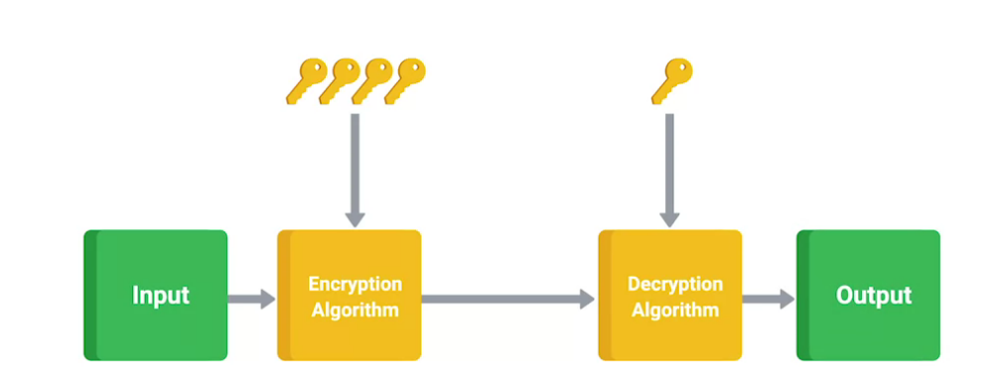

Full-disk encryption schemes rely on the secret key for actual
encryption and decryption operations. They typically password-protect
access to this key. And in some cases, the actual encryption key is used
to derive a user key, which is then used to encrypt the master key. If
the encryption key needs to be changed, the user key can be swapped out,
without requiring a full decryption and re-encryption of the data being
protected. This would be necessary if the master encryption key needs to
be changed. Password-protecting the key works by requiring the user
entry passphrase to unlock the encryption key. It can then be used to
access the protected contents on the disk. In many cases, this might be
the same as the user account password to keep things simple and to
reduce the number of passwords to memorize. When you implement a
full-disk encryption solution at scale, it's super important to think
about how to handle cases where passwords are forgotten. This is another
convenience tradeoff when using FDE. If the passphrase is forgotten,
then the contents of the disk aren't recoverable. Yikes! This is why
lots of enterprise disk encryption solutions have a key escrow
functionality. Key escrow allows encryption key to be securely stored
for later retrieval by an authorized party. So if someone forgets the
passphrase to unlock their encrypted disk for their laptop, the systems
administrators are able to retrieve the escrow key or recovery
passphrase to unlock the disk. It's usually a separate key passphrase
that can unlock the disk in addition to the user to find one. This
allows for recovery if a password is forgotten. The recovery key is used
to unlock the disk and boot the system fully. You should compare
full-disk encryption against file-based encryption. That's where only
some files or folders are encrypted and not the entire disk. This is
usually implemented as home directory encryption. It serves a slightly
different purpose compared to FDE. Home directory or file-based
encryption only guarantees confidentiality and integrity of files
protected by encryption. These setups usually don't encrypt system files
because there are often compromises between security and usability. When
the whole disk isn't encrypted, it's possible to remotely reboot a
machine without being locked out. If you reboot a full-disk encrypted
machine, the disk unlock password must be entered before the machine
finishes booting and is reachable over the network again. So while
file-based encryption is a little more convenient, it's less protected
against physical attacks. An attacker can modify or replace core system
files and compromise the machine to gain access to the encrypted data.
This is a good example of why understanding threats and the risks these
threats represent is an important part in designing a security
architecture and choosing the right defenses. In our next lesson, we'll
cover application hardening. I'll see you there.

**TPMs and FDE**

TPMs are most commonly used to ensure platform integrity, preventing
unauthorized changes to the system either in software or hardware, and
full disk encryption utilizing the TPM to protect the entire contents of
the disk. Full Disk Encryption or FDE, as you might have guessed from
the name, is the practice of encrypting the entire drive in the system.
Not just sensitive files in the system. This allows us to protect the
entire contents of the disk from data theft or tampering. Now, there are
a bunch of options for implementing FDE. Like the commercial product
PGP, Bitlocker from Microsoft, which integrates very well with TPMs,
Filevault 2 from Apple, and the open source software dm-crypt, which
provides encryption for Linux systems. An FDE configuration will have
one partition or logical partition that holds the data to be encrypted.
Typically, the root volume, where the OS is installed. But, in order for
the volume to be booted, it must first be unlocked at boot time. Because
the volume is encrypted, the BIOS can't access data on this volume for
boot purposes. This is why FDE configurations will have a small
unencrypted boot partition that contains elements like the kernel,
bootloader and a netRD. At boot time, these elements are loaded which
then prompts the user to enter a passphrase to unlock the disk and
continue the boot process. FDE can also incorporate the TPM, utilizing
the TPM encryption keys to protect the disk. And, it has platform
integrity to prevent unlocking of the disk if the system configuration
is changed. This protects against attacks like hardware tampering, and
disk theft or cloning. Before we wrap up this module on encryption, I
wanted to touch base on the concept of random. Earlier, when we covered
the various encryption systems, one commonality kept coming up that
these systems rely on. Did you notice what it was? That's okay if you
didn't. It's the selection of random numbers. This is a very important
concept in encryption because if your number selection process isn't
truly random, then there can be some kind of pattern that an adversary
can discover through close observation and analysis of encrypted
messages over time. Something that isn't truly random is referred to as
pseudo-random. It's for this reason that operating systems maintain
what's referred to as an entropy pool. This is essentially a source of
random data to help seed random number generators. There's also
dedicated random number generators and pseudo-random number generators,
that can be incorporated into a security appliance or server to ensure
that truly random numbers are chosen when generating cryptographic keys.
I hope you found these topics in cryptography interesting and
informative. I know I did when I first learned about them. In the next
module, we'll cover the three As of security, authentication,
authorization and accounting. These three As are awesome and I'll tell
you why in the next module. But before we get there, one final quiz on
the cryptographic concept we've covered so far.

##### Creating an Encrypted filesystem in Linux (LUKS and cryptsetup)

1.  Create a mounting point

2.  Create a partition – and do not create a filesystem on it (yet).
    Make sure it isn’t moutned.

3.  Wipte the partition with shred

    1.  

4.  Format a partition with luks (enter a passphrase)

^ you can add “v” for verbose.

If you run lsblk -f, by this point you should the filestem type is
crypto_LUKS

5.  Open the drive for accessing (and give is a name which we can
    referenced in its open state – “secretdisk”)

Can also use “luksOpen” instead of “open”.

Run ls -f again to see that your secretdisk is listing under the
partition now

That name you gave it will be where the disk exists in the
**/dev/mapper/\<newname\>** dir.

So you should see your new drive name using “ls” on the /dev/mapper dir.

6.  Create a filesystem on this new location **/dev/mapper/\<newname\>**

7.  Mount this drive on the folder you made in step one

8.  Use away!

9.  To put it away so to speak… unmount it first

10. To make sure it’s not available anymore in it’s unencrypted format,
    close it

11. 

> Now there would no way to gain access to that disk again without the
> password.

**Auto Mount on Boot**

1.  Use blkid to grab the UUID of the luks partition

    1.  This would be the luks partition itself – not the filesystem set
        on top

    2.  

2.  Create/open /etc/crypttab

    1.  Enter the name for the uncrypted drive, the UUID, and a hypen or
        the word “none” which will initiate a password prompt when
        booting the machine to unencrypt the drive.

> 

3.  Lastly, update /etc/fstab with the drive to open and where to mount
    it (along with the fs set)

^ you can replace “defaults” with “nofail” if you want. This will mean
that if the volume is not detected (i.e. if the volume isn’t able to
decrypt & mount on boot) then no errors will be thrown and the rest of
the boot process can continue uninterrupted.

##### More with luks and cryptsetup

#### \[One-Time\] Resource Limiting: Fork Bomb (Linux)

##### Fork bomb

This is a fork bomb…

:(){ :|: &};:

^ it’s a bash function that exponentially and recusrsively calls itsels
– locking the system by hoggin all the usable resources and forcing a
reboot to get out of this. This is efectively a local DDoS attack.
POSIX-based UNIX systems (as opposed to Bash) only accept alphanumeric
characters as a function name so the colon would work.

Features like **ulimit** and **sysconf** set limits on what can be used
– killing the process(es) after they reach a certain threshold before
they wreck havom on the entore system and choke the machine altogether.

##### ulimit commmand

Use ulimit to set a limit of certain usable resources .

**View all**: ulimit -a

Ulimit is only active per session. To apply this at the system-level we
need to look at **sysconf** – meaning it’s likely preferable to edit the
**/etc/security/limits** file.

**Max number of user processes**

*get*

*set*

Best to also update sysconf as well to cover all bases to apply this
limit.

##### Sysconf

Pam-enabled systems can utilize this more secure method.

File: **/etc/security/limits.conf**

**Note:** In FreeBSD systems, the system administrator can put limits in
**/etc/login.conf**

**Limiting number of processes (nproc) to 30 with a hard limit**

^ set on all users and explicitly on root.

***From stack overflow***

**IMPORTANT!**: MUST REBOOT FOR CHANGES TO TAKE EFFECT!

#### \[Regular Intervals\] Patch Updates

A patch update is a software and operating system, or OS, update that
addresses security vulnerabilities within a program or product. Now
we'll discuss patch updates provided to the company by the OS software
vendor. With patch updates, the OS should be upgraded to its latest
software version. Sometimes patches are released to fix a security
vulnerability in the software. As soon as OS vendors publish a patch and
the vulnerability fix, malicious actors know exactly where the
vulnerability is in systems running the out-of-date OS. This is why it's
important for organizations to run patch updates as soon as they are
released. For example, my team had to perform an emergency patch to
address a recent vulnerability found in a commonly used programming
library. The library is used almost everywhere, so we had to quickly
patch most of our servers and applications to fix the vulnerability. The
newly updated OS should be added to the baseline configuration, also
called the baseline image. A baseline configuration is a documented set
of specifications within a system that is used as a basis for future
builds, releases, and updates. For example, a baseline may contain a
firewall rule with a list of allowed and disallowed network ports. If a
security team suspects unusual activity affecting the OS, they can
compare the current configuration to the baseline and make sure that
nothing has been changed.

#### \[Regular Intervals\] Software Disposal

Another hardening task performed regularly is hardware and software
disposal. This ensures that all old hardware is properly wiped and
disposed of. It's also a good idea to delete any unused software
applications since some popular programming languages have known
vulnerabilities. Removing unused software makes sure that there aren't
any unnecessary vulnerabilities connected with the programs that the
software uses.

#### \[Regular Intervals\] Strong Password Policy

The final OS hardening technique that we'll discuss is implementing a
strong password policy. Strong password policies require that passwords
follow specific rules. For example, an organization may set a password
policy that requires a minimum of eight characters, a capital letter, a
number, and a symbol. To discourage malicious actors, a password policy
usually states that a user will lose access to the network after
entering the wrong password a certain number of times in a row. Some
systems also require multi-factor authentication, or MFA. MFA is a
security measure which requires a user to verify their identity in two
or more ways to access a system or network. Ways of identifying yourself
include something you know, like a password, something you have like an
ID card, or something unique about you, like your fingerprint.

#### \[Regular Intervals\] Disabling unnecessary components

Think back to the beginning of this course when we talked about attacks
and vulnerabilities. The special class of vulnerabilities we discussed
called zero-day vulnerabilities are unique since they're unknown until
they're exploited in the wild. The potential for these unknown flaws is
something you should think about when looking to secure your company's
systems and networks. Even though it's an unknown risk, it can still be
handled by taking measures to restrict and control access to systems.
Our end goal overall is risk reduction.

**Threat vector**: method used by an attacker to gain access to a
victim’s machine.

Two important terms to know when talking about security risks are
**attack vectors** and **attack surfaces**. An attack vector is a method
or mechanism by which an attacker or malware gains access to a network
or system. Some attack vectors are email attachments, network protocols
or services, network interfaces, and user input. These are different
approaches or paths that an attacker could use to compromise a system if
they're able to exploit it. An Attack Surface is the sum of all the
different attack vectors in a given system. Think of this as the
combination of all possible ways an attacker could interact with our
system, regardless of known vulnerabilities. It's not possible to know
of all vulnerabilities in the system. So, make sure to think of all
avenues that an outside actor could interact with our systems as a
potential Attack Surface. The main takeaway here is to keep our Attack
Surfaces as small as possible. This reduces the chances of an attacker
discovering an unknown flaw and compromising our systems. There are lots
of approaches you can use as an IT support specialist to reduce Attack
Surfaces. All of them boil down to simplifying systems and services. The
less complex something is, the less likely there will be undetected
flaws. So, make sure to disable any extra services or protocols. If
they're not totally necessary, then get them out of there. Every
additional surface that's operating represents additional Attack
Surfaces, that could have an undiscovered vulnerability. That
vulnerability could be exploited and lead to compromise. This concept
also applies to access and ACLs. Only allow access when totally
necessary. So, for example, it's probably not necessary for employees to
be able to access printers directly from outside of the local network.
You can just adjust firewall rules to prevent that type of access.
Another way to keep things simple is to reduce your software
deployments. Instead of having five different software solutions to
accomplish five separate tasks, replace them with one unified solution,
if you can. That one solution should require less complex code, which
reduces the number of potential vulnerabilities. You should also make
sure to disable unnecessary or unused components of software and systems
deployed. By disabling features not in use, you're reducing even more
tech services, even more. You're not only reducing the number of ways an
attacker can get in, but you're also minimizing the amount of code
that's active. It's important to take this approach at every level of
systems and networks under your administration. It might seem obvious to
take these measures on critical networking infrastructure and servers,
but it's just as important to do this for desktop and laptop platforms
that your employees use. Lots of consumer operating systems ship a bunch
of default services and software-enabled right out of the box, that you
probably won't be using in an enterprise network or environment. For
example, Telnet access for a managed switch has no business being
enabled in a real-world environment. You should disable it immediately
if you find it on the device. Any vendor-specific API access should also
be disabled if you don't plan on using these services or tools. They
might be harmless especially if you set up strong firewall rules and
network ACLs. This one service might represent a fairly low risk, but
why take any unnecessary risk at all? Remember, the defense in depth
concept is all about risk mitigation and implementing layers of
security. Now, let's think about the layered approach to security. What
if our access control measures are bypassed or fail, in some unforeseen
way? As an IT support specialist, this is exactly what you want to think
about. How do we keep this component secure if the security systems
above it have failed?

#### \[Regular Intervals\] Scanning for Malware with Process Explorer (Windows)

<https://www.youtube.com/watch?v=RnPtuTbqzd4>

#### Quiz Question

### Application Security \[Linux\]

#### AppArmor (Ubuntu)

**Check if installed:**

sudo aa-unconfined

**Installation:**

Use **aa-** to see all programs we can use to manipulate apparmor:

##### Overview/Usage

##### View active profiles

aa-status

any profiles you see in “complain” mode mean that these profiles will
only report (by writing log files) if a program violates it’s policies
whereas enforce mode will actually stop that program.

##### See if we already have a profile created for a given service

/etc/apparmor./

^ those files will correspond to existing service paths if a profile is
installed for a given service. For example, if there’s a profiles for
apache2 (which lives at **/usr/sbin/apache2**) then there should exist a
file in this dir name **usr.sbin.apache2** – that tells us we already
have a profile installed for apache2.

##### Create a profile

aa-status \<path to app\>

This output a profiletemplate:

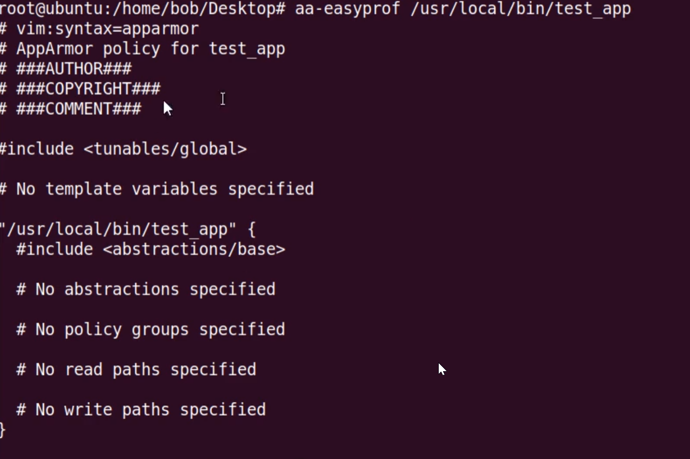

You can use this template to create a file at
/etc/apparmor.d/usr.local.bin.\<app_name\> .

Eeven better, you just redirect this template to the destination and
edit that:

Note: for the path name of the app, replace any forward-slashes with
dots.

It should be noted that a blank template doesn’t have any permissions
set on it.

##### Activate a profile

apparmor_parser -r \<profile path\>

^ this reads the profile into the kernel and since the blank template
had no permissions, this means trying to call to app now should throw a
permissions error as AppArmor is now in control of setting permissions
on this app and the associated profile has no permissions set (yet).

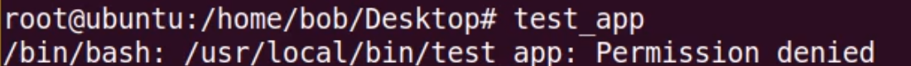

##### Log permission errors

Because of the above, trying to call an app without permissions set
where that app has an associated app armor profile, all permission-error
details will be logged.

You can view these logs with (**aa-logprof**):

^ Applying and saving
these actions will update the profile for this application:

You can cat the profiles to view these changes

Continue the process of view errors and updating permissions until you
are able to run thr program without issue.

#### SELinux (Process security) \[Redhat/Cent os\]

This is ideal for Redhat and Cent OS and many issues have been noted
with some distros like Ubuntu. AppArmor is recommended for Ubuntu.

Can be installed with:

sudo apt install policycoreutils

Key terms:

- **Domain** : Describe the relationship between objects and whether or
  not they have access each other (for example web servers domain).

  - **Object** : Can be files or ports.

    - **Types** : Describe where an object can go or where it can do.

  - **Subject** : A linux process (exists within a domain).

    - **(User) Role** : A role describes which subjects a user has
      access to. Every user has a role.

    - **SELinux Users** : All system users are mapped to one or more
      SELinux users.

    - **System User** : A linux user either created or process-spawned.

**Config file**: /etc/selinux/config

/

##### Overview/Usage

menu^ You may need to instead update the config file to “enforcing” then
reboot the machine.

**Can also use binary digits**

**View what’s currently being allowed**

To change contexts at the file-level use **chcon** (change context) and
restorecon (restore context).

**View SELinux sesttings on files (ls -z)**

**Audit2allow**

The "audit2allow" command generates SELinux policy allow/dontaudit rules
from logs of denied operations, making it the correct answer. 

**Disable SELinux**

The sudo nano /etc/setlinux/config command and setting the SELINUX
variable to disabled are used to disable SELinux.

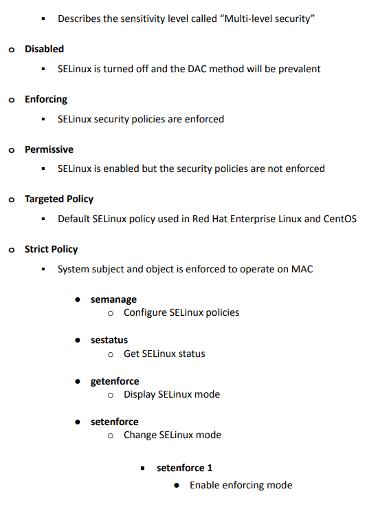

##### Policies

**Targeted policy** subjects and objects run in an unconfined
environment. The untargeted subjects and objects will operate on the DAC
method, and the targeted daemons will operate on the MAC method.

The **minimum policy** is similar to the targeted policy in that
subjects and objects run in an unconfined environment but load less
configuration into memory. This policy category is appropriate for small
devices, such as phones, and experimentation with SELinux.

A **strict policy** is a policy where every subject and object of the
system is enforced to operate on the Mandatory Access Control (MAC)
method.

##### System Booleans

System Boolean values enable you to change policy configurations at
runtime without actually writing the policy directly. 

**View settings defined our policies**

**Turn a setting on (cifs in this example)**

*Find it*

*Set it (p for permanent, 1 for ‘on’)*

^ applies at the system level.

The **autorelabel** feature of SELinux allows sysadmins to cause
contexts to be reset throughout the filesystem

##### Granting access : Overview and working example

If you deal with Red Hat or CentOS, you're probably familiar with
SELinux, or Security Enhanced Linux. And unfortunately, one of the
things that SELinux is known for is giving system administrators a real
tough time. And I have to admit, in the past, I've been a person who has
just disabled SELinux, because it's been frustrating.

But there is a better way, because SELinux is a really awesome and
powerful security tool that you should not just disable. So I'm going to
go through and show you how to do some troubleshooting so you can maybe
use SELinux in a way that's going to be beneficial, and not just
annoying.

So SELinux is basically just a way for the Linux to make sure that there
aren't any programs that are doing things they shouldn't be doing. And
how that works is there's a list of contexts, or labels, that specify
when a program can or can't use a particular port on a system, or a
particular file on a system.

And this is a very complicated and very robust system. We're just going
to touch the surface of it to show you some of the things you might
encounter on the command line. So basically, there's a long list of
things that a particular application is allowed to access.

And some of those things, like I said, are ports. Some of those things
are files. And these contexts are put onto the ports and the files using
labels. So here's what our scenario's going to be. Normally, a web
server runs on port 80, or port 443 if it's going to be something that
is SSL.

But we're going to say port 80 for a standard HTTP port. What if we
wanted to serve something from a port that is not standard? Well,
obviously, Apache can do that, but SELinux, our supervisor over here, is
not going to allow Apache to serve from a port that it shouldn't
normally have access to, and it's just going to fail.

So let's actually do that. Let's set up Apache to run on a non-standard
port and see what happens, and then see how to fix it. Now, here I'm on
a CentOS machine, and I have Apache installed. So if we open up a web
browser and we just go to http://localhost, it's going to show us that,
sure enough, Apache test server is installed.

It's on port 80. I didn't specify port 80, because that's a default. But
if we look at port 80, sure enough, there it is. That's what it's
running on. But if we want to run this on a non-standard port-- in fact,
let's look. I'm in the current working directory of-- OK, the httpd, or
the Apache configuration folder.

Let's edit sudo vi httpd, and I want to look for where it says Listen.
OK, right here it's going to be listening on port 80-- which is one of
the ports, obviously, that it's allowed to using SELinux. So let's,
instead, say, listen on port 8888. Now, this is not a privileged port.

This is not a port below 1024. So ideally, it should be able to do this.
We should just be able to allow it to listen on port 8888, then serve
out the web page on that port. So we would just say sudo systemctl
restart httpd, and it should just work-- except it didn't.

\[GROAN\] sudo systemctl status httpd, and let's see. We had some issues
here. If we stretch out this window-- let's do that again so we can see
it stretched out. It looks like what happened is it failed because it
didn't have permission to make a socket on port 8888-- which makes sense
if SELinux doesn't allow that.

Now, we can see what SELinux allows if we type sudo semanage port -l.
And then it's going to give a whole list, so I just want to grep for
http. Oh, I meant grep for, not-- grep for http. And it's going to show
us, with this label-- http_cache_port or http_port tcp ports, and here
all the ports that Apache is allowed to listen on.

But notice port 8888 is not there. Now, we could have switched it to
port 8008 or 8009, and it would've worked just fine. But notice 8888 is
not on here. Now, we could disable SELinux and it would work, but that's
not the best way to go about it. What we could do instead is add port
8888 to the SELinux context that will be allowed to use it here.

So what we would do is sudo semanage, but this time port -a for add. The
type is going to be that http port, so http port type protocol is going
to be tcp. And then the actual port is 8888. Press Enter.

This will take it a minute. And it's going to add it so that Apache is
allowed to use port 8888.

Now, if we do that list again, where we grep for http, we should see a
change. And sure enough, now http port is allowed on port 8888.

So if we were to say sudo systemctl restart httpd, ah, there's no
errors, which means if we come over here, and now we do
http://localhost:8888, oh, look at that.

We've got the Testing 1, 2, 3 page on port 8888, even though SELinux, by
default, would not normally allow that. What we've done is we've allowed
it to also list it on port 8888 using SELinux. We didn't have to disable
it. We were able to leave it enabled, leave it enforcing, and still
allow us to use Apache on that port.

Now, I really want to be clear. SELinux-- Security Enhanced Linux-- this
could be almost an entire course on its own-- how to manage all the
contexts and labels and files and ports, and all the different things
that it manages. However, for privileges based on ports and files, It's.

Not too bad to just make some modifications. And it's much better to
make those modifications and handle the changes, rather than just
disabling SELinux, which is what a lot of us old, crusty sysadmins did
for a lot of years. So SELinux is a powerful, powerful tool to help keep
your system safe, and some common issues-- like not being able to listen
on a port-- can be solved.

#### chroot jail (chroot command)

chroot command in Linux/Unix system is used to change the root
directory. Every process/command in Linux/Unix like systems has a
current working directory called root directory. It changes the root
directory for currently running processes as well as its child
processes.

A process/command that runs in such a modified environment cannot access
files outside the root directory. This modified environment is known as
“chroot jail” or “jailed directory”. Some root user and privileged
process are allowed to use chroot command.

<https://www.geeksforgeeks.org/chroot-command-in-linux-with-examples/>

<https://www.youtube.com/watch?v=NBpgDvah8Xw>

**Chroot for SSH Connections:**
<https://www.tecmint.com/restrict-ssh-user-to-directory-using-chrooted-jail/>

**Commands –**

**1) Create a directory which will be parent directory**

mkdir /home/jail

**2) create binary and library directories**

mkdir /home/jail/bin /home/jail/lib64

**3) copy all commands to jail**

cp /bin/bash /bin/ls /home/jail/bin

**4) Print libraries**

ldd /bin/bash

**5) copy ldd files to /home/jail/lib64**

cp /lib64/libtinfo.so.5 /lib64/libdl.so.2 /lib64/libc.so.6
/lib64/ld-linux-x86-64.so.2 /home/jail/lib64

**6) now to jail directory**

chroot /home/jail

-------------------------------------------------------------

How to Copy the shell and the libraries

### IAM/AAA Security (User/Auth)

In this module, we'll cover the three A's of security, which are
**authentication, authorization, and accounting**. We'll cover exactly
what they are, how they relate to each other, and their common
implementations and protocols. Let's kick things off with
authentication, and by extension identification. You should be familiar
with authentication in the form of username and password problems when
accessing things like your email. So let's take that as an example to
show the differences between identification and authentication.
Identification is the idea of describing an entity uniquely. For
example, your email address is your identity when logging into your
email. But how do you go about proving you are who you claim to be?
That's the process we call authentication.

**Authentication**

When a person’s identity is established with proof and confirmed by a

system

> ● Something you know
>
> ● Something you are
>
> ● Something you have
>
> ● Something you do
>
> ● Somewhere you are

When accessing your email, you're claiming to be your email address, and
you'd supply a password associated with the identity to prove it's you,
or at least you know the password associated with the e-mail account.
Pretty straightforward, right?

This is distinctly different from **authorization**, which pertains to
the resources and identity has access to. These two concepts are usually
distinguished from each other in the security world, with the terms
authn for authentication and authz for authorization. In our e-mail
account login example, by authenticating using your email address and
password, your identity is authorized to access your email inbox, but
you're not authorized to access anyone else's inbox. We really don't
want anyone else getting access to our inbox, right? So what can we do
to ensure that only we are able to identify and authenticate as our
e-mail account? We could start by ensuring that we're using a strong
password. But what exactly constitutes a strong password? Well, what do
you think of the password ponies? Would you categorize that as a strong
password? I hope not. That password is super short, and only six
characters, and all of those characters are lowercase letters. This is a
short and simple password, but that could be easily broken through brute
force or dictionary based attacks. Ponies would almost definitely be in
a dictionary file, and six characters doesn't provide a large pool of
possibilities for an attacker to try. We can ensure a password is strong
by making it longer and more complex, adding numbers, uppercase letters,
and special characters like punctuation. What do you think of the
strength of this password? That seems way more secure, doesn't it? It
adds complexity, which increases the pool of possible passwords, and is
longer at 10 characters. But which of these two passwords do you think
you would be able to remember tomorrow? Probably not the strong one,
right? This highlights a super important concept in security. There's
often a trade-off between security and usability. With our password
example, the more usable password that's easy to memorize is less
secure, while the more secure password is much more challenging to
remember. This concept applies to many other security subjects, not just
passwords. You can think of security as risk mitigation, and when it
comes to risk mitigation, it's impossible to completely eliminate the
risk. The best you can do is understand the risks your systems face,
take measures to reduce those risks, and monitor them. Think about it
like this, the most secure computer system is one that's disconnected
from everything, including networking, and even power and is locked in a
concrete bunker hundreds of feet underground that no one has access to.
While this is incredibly secure machine, almost impossible to
compromise, it's basically useless since it's powered off and no one can
access it. This is an extreme example of the security versus usability
trade-off, but you get the point. Coming back to our password example,
we obviously need to find some sort of happy medium, but where we have a
reasonably secure password that's also somewhat easy to memorize. How
about something like this. We start with a short phrase, Ilikeponies,
then replace some letters with numbers that resemble the letters to help
with memorization. We also swapped the S with the Z since they're
similar sounding and tacked on some numbers as a suffix. At first
glance, this seems like a very complex password and will be hard to
memorize, but it's easier than a random password example. Problem
solved, right? Well, you should actually be wary of this number
substitution process, since it's well-known by attackers and password
cracking tools. As an I.T. support specialist, ensuring that your
organization uses strong passwords and practices, good password hygiene
are super important. They're literally the keys to the kingdom. So what
should we do? Incorporating good password policies into an organization
is key to ensuring that employees are securing their accounts with
strong passwords. A good password policy system would enforce length
requirements, character complexity, and check for the presence of
dictionary words, which would undermine the strength of passwords.
Passwords should never be written down or recorded in plain text, reused
across accounts or be shared with anyone. Password reuse is a risk
because in the event the password for one account is compromised, other
accounts using the same password would also be at risk. Sharing
passwords should also be a no go, since this undermines the identity of
an account because someone else now has the ability to log in as that
user. Along with requiring the use of strong passwords, a password
rotation policy is also recommended, since it safeguards against
potential undetected compromised passwords. But it's important that a
password rotation period isn't too short. Why? The inconvenience of
having to change passwords so often may actually encourage poor security
behavior by users. So let's say you required your organization to create
highly complex passwords and to change them every three months. It's
very likely that a significant percentage of users would write down
their passwords on post-it notes or on their phones. A big no no.
Despite the policy being designed to increase security, it actually has
the opposite effect because of the inconvenience it causes your users.

#### Authentication

##### Authenticating users

###### **User provisioning**

Back-end systems need to be able to verify whether the information
provided by a user is accurate. To accomplish this, users must be
properly provisioned. **User provisioning** is the process of creating
and maintaining a user's digital identity. For example, a college might
create a new user account when a new instructor is hired. The new
account will be configured to provide access to instructor-only
resources while they are teaching. Security analysts are routinely
involved with provisioning users and their access privileges.

**Pro tip:** Another role analysts have in IAM is to deprovision users.
This is an important practice that removes a user's access rights when
they should no longer have them.

###### **Granting authorization**

If the right user has been authenticated, the network should ensure the
right resources are made available. There are three common frameworks
that organizations use to handle this step of IAM:

- Mandatory access control (MAC)

- Discretionary access control (DAC)

- Role-based access control (RBAC)

###### **Mandatory Access Control (MAC)**

MAC is the strictest of the three frameworks. Authorization in this
model is based on a strict need-to-know basis. Access to information
must be granted manually by a central authority or system administrator.
For example, MAC is commonly applied in law enforcement, military, and
other government agencies where users must request access through a
chain of command. MAC is also known as non-discretionary control because
access isn’t given at the discretion of the data owner.

###### **Discretionary Access Control (DAC)**

DAC is typically applied when a data owner decides appropriate levels of
access. One example of DAC is when the owner of a Google Drive folder
shares editor, viewer, or commentor access with someone else.

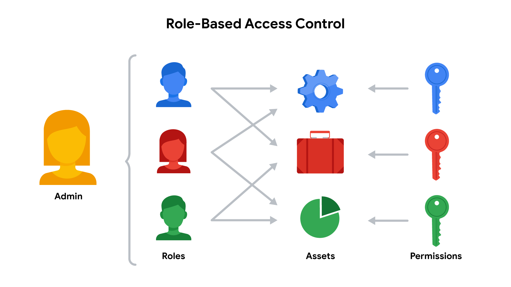

###### **Role-Based Access Control (RBAC)**

RBAC is used when authorization is determined by a user's role within an
organization. For example, a user in the marketing department may have
access to user analytics but not network administration.

##### Password Hardening

We've already alluded to attacks on hashes. Now let's learn more
details, including how to defend against these attacks. One crucial
application for cryptographic hash functions is for authentication.
Think about when you log into your e-mail account. You enter your e-mail
address and password. What do you think happens in the background for
the e-mail system to authenticate you? It has to verify that the
password you entered is the correct one for your account. You could just
take the user supplied password and look up the password on file for the
given account and compare them. Right? If they're the same, then the
user is authenticated. Seems like a simple solution but does that seem
secure to you? In the authentication scenario, we'd have to store user
passwords in plain text somewhere. That's a terrible idea. You should
never ever store sensitive information like passwords in plain text.
Instead, you should do what pretty much every authentication system
does, store a hash of the password instead of the password itself. When
you log into your e-mail account the password you entered is run through
the hashing function and then the resulting hash digest is compared
against the hash on file. If the hashes match, then we know the password
is correct, and you're authenticated. Password shouldn't be stored in
plain text because if your systems are compromised, passwords for other
accounts are ultimate prize for the attacker. If an attacker manages to
gain access to your system and can just copy the database of accounts
and passwords, this would obviously be a bad situation. By only storing
password hashes, the worst the attacker would be able to recover would
be password hashes, which aren't really useful on their own. What if the
attacker wanted to figure out what passwords correspond to the hashes
they stole? They would perform a brute force attack against the password
hash database. This is where the attacker just tries all possible input
values until the resulting hash matches the one they're trying to
recover the plain text for. Once there's a match, we know that the input
that's generated that matches the hash is the corresponding password. As
you can imagine, a brute force attack can be very computationally
intensive depending on the hashing function used. An important
characteristic to call out about brute force attacks is, technically,
they're impossible to protect against completely. A successful brute
force attack against even the most secure system imaginable is a
function of attacker time and resources. If an attacker has unlimited
time and or resources any system can be brute force. Yikes. The best we
can do to protect against these attacks, is to raise the bar. Make it
sufficiently time and resource intensive so that it's not practically
feasible in a useful timeframe or with existing technology. Another
common method to help raise the computational bar and protect against
brute force attacks is to run the password through the hashing function
multiple times, sometimes through thousands of interactions. This would
require significantly more computations for each password guess attempt.

###### Key Stretching

In an effort to increase the security of their passwords, Dion Training
has added a salt and cryptographic hash to their passwords prior to
storing them. To further increase security, they run this process many
times before storing the passwords. This technique is an example of
**key stretching**.

In cryptography, key stretching techniques are used to make a possibly
weak key, typically a password or passphrase, more secure against a
brute-force attack by increasing the resources it takes to test each
possible key. 

###### Password Salt

So…

- password + salt = hash(password + salt)

- Therefore, password = password – salt

So if salt + hash = “secret password”, then to compare passwords you
just…

- Extract salt from the secret password

- Hash(password +salt)

- Compare this new value against “secret password”

Early Unix systems used a 12 Bit salt, which amounts to a total of 4,096
possible salts. So, an attacker would have to generate hashes for every
password in their database, 4,096 times over. Modern systems like Linux,
BSD and Solaris use a 128 bit salt. That means there are two to the 128
power possible salt values, which is over 340 undecillion. That's 340
with 36 zeros following. Clearly, 128 bit salt raises the bar high
enough that a rainbow table attack wouldn't be possible in any realistic
time-frame. Just another scenario when adding salt to something makes it
even better. That runs out our lesson on hashing functions. Up next
we'll talk about real world applications of cryptography and explain how
it's used in various applications and protocols. But first, a project
that will help you get hands on with hashing. Hashtag, get it done.

##### Multifactor Authentication

In the last video, we learned about basic authentication in the form of
username, password, sometimes referred to as single-factor
authentication. But there are other more complex and secure
authentication mechanisms. Keep in mind the security versus usability
tradeoff, as we work through the different types of multifactor
authentication. Multifactor authentication is a system where users are
authenticated by presenting multiple pieces of information or objects.
The many factors that comprise a multifactor authentication system can
be categorized into three types. Something you know, something you have,
and something you are. Ideally, a multifactor system will incorporate at
least two of these factors. Something you know would be something like a
password, or a pin for your bank or ATM card. Something you have would
be a physical token, like your ATM or bank card. Something you are would
be a piece of biometric data, like a fingerprint or iris scan. The
premise behind multifactor authentication is that an attacker would find
it much more difficult to steal or clone multiple factors of
authentication, assuming different types are used. If multiple passwords
are used, security isn't enhanced by that much. This is because
passwords, however many, are still susceptible to phishing or keylogging
attacks. By using a password in conjunction with a security token is a
game changer. Even if the password is compromised by a phishing attack,
the attacker would also need to steal or clone the physical token to be
able to access the account. And that's much less likely to happen. We
won't cover passwords again here since we talked about them in detail in
the last section. But here's the quick rundown. Physical tokens can take
a few different forms. Common ones include a USB device with a secret
token on it, a standalone device which generates a token, or even a
simple key used with a traditional lock. A physical token that's
commonly used generates a short-lived token. Typically a number that's
entered along with a username and password. This number is commonly
called a One-Time-Password or OTP since it's short-lived and constantly
changing value. An example of this is the RSA SecurID token. It's a
small, battery-powered device with an LCD display, that shows a
One-Time-Password that's rotated periodically. This is a time-based
token sometimes called a TOTP, and operates by having a secret seed or
randomly generated value on the token that's registered with the
authentication server. The seed value is used in conjunction with the
current time to generate a One-Time-Password. Now, as long as the user
has possession of their token, or can view the display of the token,
they are able to log in. I should also call out that the scheme requires
the time between the authenticator token, and the authentication server
to be relatively synchronized. This is usually achieved by using the
Network Time Protocol or NTP. An attacker would need to either steal the
physical token or clone the token if they're able to steal the secret
seed value. Since a time-based token is synchronized with the server
using time, which is not a secret, that would be sufficient for an
attacker to clone a token. There are also counter-based tokens, which
use a secret seed value along with the secret counter value that's
incremented every time a one-time password is generated on the device.
The value is then incremented on the server upon successful
authentication. This is more secure than the time-based tokens for two
reasons. First, the attacker would need to recover the seed value and
the counter value. Second, the counter value is also incrementing when
it's being used. So, a cloned token would only be useful for a short
period of time before the counter value changes too much and the clone
token becomes un-synchronized from the real token and the server. These
token generators can either be physical, dedicated devices, or they can
be an app installed on a smartphone that performs the same
functionality. Another very common method for handling multifactor
today, is that the delivery of one-time password tokens using SMS. But
this has been subject to some criticism, because of the observed attacks
through this channel. The problem with relying on SMS to transmit an
additional authentication factor is that you're dependent on the
security processes of the mobile carrier. SMS isn't encrypted, nor is it
private. And it's possible for SMS to be intercepted by a well-funded
attacker. Even worse, there have been accounts of SMS based multifactor
codes being stolen by calling the mobile provider. The attacker
impersonates the owner of the line of service to redirect phone calls
and SMS to a phone the attacker controls. If the attacker has already
compromised the password and can get SMS redirected to them, they now
get full access to the account. Of course, there's a convenience
tradeoff when you use a physical token. You have to carry around another
device in order to authenticate. If the device is lost or damaged, the
user won't be able to authenticate until the device is replaced. This
also requires support overhead, since devices will fail, be lost, run
off batteries, and get out of sync with the server. Using an app on a
smartphone addresses some of these issues, but still, require some
additional support and inconvenience. When prompted to log in, the user
must retrieve a device or phone from their pocket and manually
transcribe the numbers into the authentication page. These generated
one-time passwords are also susceptible to man in the middle style
phishing attacks. A user can be tricked into going to a fake
authentication page by sending a phishing email. Something on the lines
of, "your account has been compromised, please log in and change your
password immediately." When the victim enters their credentials in the
fake page, including the one-time password, the attacker has all the
information needed to take over the account. The other category of
multifactor authentication is biometrics, which has gained in popularity
in recent years, especially in mobile devices. Biometric authentication
is the process of using unique physiological characteristics of an
individual to identify them. By confirming the biometric signature, the
individual is authenticated. A very common use of this in mobile devices
is fingerprint scanners to unlock phones. This works by registering your
fingerprints first, using an optical sensor that captures images of the
unique pattern of your fingerprint. Much like how passwords should never
be stored in plain text, biometric data used for authentication, so, it
also never be stored directly. This is even more important for handling
biometric data. Unlike passwords, biometrics are an inherent part of who
someone is. So, there are privacy implications to theft or leaks of
biometric data. Biometric characteristics can also be super difficult to
change in the event that they are compromised unlike passwords. So,
instead of storing the fingerprint data directly, the data is run
through a hashing algorithm and the resulting unique hash is stored. One
advantage of biometric authentication over knowledge or token-based
systems, is that it's more reliable to identify an individual for
authentication, since biometric features aren't usually shareable. For
example, you can't give your friend your fingerprints so that they can
log in as you. Well, you'd hope not anyway. But as schools start to
introduce fingerprint based attendance recording systems, students are
finding ways to trick the system. They're creating fake fingerprints
using things like glue, allowing friends to marking each other as
present if they're late or if they skip school. This is harder to
achieve than sharing a password, but it's sort of ingenious of these
kids to think up. They really go the extra mile to skip school these
days. Not that I'm condoning this behavior, but you can read more about
it just after this video. Other biometric systems use features like iris
scans, facial recognition, gate detection and even voice. Microsoft
developed the biometric authentication system for Windows 10, called
Windows Hello, which supports fingerprint identification, iris
identification and facial recognition. It uses two cameras, one for
color and one for infrared, which allows for depth detection. This way,
it's not possible to trick the system using a printout of an authorized
user's face.

###### Universal Second Factor

An evolution of physical tokens is the U2F or Universal Second Factor.
It's a standard developed jointly by Google, Yubico and NXP
Semiconductors. The finalized standard for U2F are being hosted by the
FIDO alliance. U2F incorporates a challenge-response mechanism, along
with public key cryptography to implement a more secure and more
convenient second-factor authentication solution. U2F tokens are
referred to as security keys and are available from a range of
manufacturers. Support for U2F authentication is built into the Chrome
browser and the Opera browser, with native Firefox support coming soon.
Security keys are essentially small embedded cryptoprocessors, that have
secure storage of asymmetric keys and additional slots to run embedded
code. Let's do a quick rundown on how exactly security keys work, and
how their improvement over an OTP solution. The first step is
registration, since the security key must be registered with a site or
service. At registration time, the security key generates a
private-public key pair unique to that site, and submits the public key
to the site for registration. It also binds the identity of the site
with the key pair. The reason for unique key pairs for each site is for
privacy reasons. If a site is compromised, this prevents
cross-referencing registered public keys, and discovering commonalities
between sites based on registration data. Once registered with the site,
the next time you're prompted to authenticate, you'll be prompted for
your username and password as usual. But afterwards, you'll be prompted
to tap your security key. When you physically tap the security key, it's
a small check for user presence to ensure malware cant authenticate on
your behalf, without your knowledge. This tap will unlock the private
keys stored in the security key, which is used to authenticate. The
authentication happens as a challenge-response process, which protects
against replay attacks. This is because the authentication session can't
be used again later by an eavesdropper, because the challenge and
resulting response will be different with every authentication session.
What happens is the site generates a challenge, essentially, some
randomized data and sends this to the client that's attempting to
authenticate. The client will then select the private key matching the
site, and use this key to sign the challenge and send the signed data
back. The site can now verify the signature using the public key that
was registered earlier. If the signature checks out, the user is
authenticated. From a security perspective, this is a much more secure
design than OTPs. This is because, the authentication flow is protected
from phishing attacks, given the interactive nature of the process.
While U2F doesn't directly protect against man in the middle attacks,
the authentication should take place over a secure TLS connection, which
would provide protection from this type of attack. Security keys are
also resistant to cloning or forgery, because they have unique, embedded
secrets on them and are protected from tampering. From the convenience
perspective, this is a much nicer authentication flow compared to OTPs
since the user doesn't have to manually transcribe a string of numbers
into the authentication dialog. All they have to do is tap their
security key. Nice and easy. As an IT support specialist, you may come
across multifactor authentication setups, that you'll be responsible for
supporting. You might even be tasked with helping to implement one. So,
it's important to understand how they provide enhanced account
protection, along with the options that are available.

**The System Security Services Daemon** (sssd) connects the local system
to remote authentication services. 

###### Strengthening authentication

MFA builds on the benefits of SSO. It works by having users prove that
they are who they claim to be. The user must provide two factors (2FA)
or three factors (3FA) to authenticate their identification. The MFA
process asks users to provide these proofs, such as:

To ensure the right user is attempting to access a resource requires
some form of proof that the user is who they claim to be. In a [video on
authentication
controls](https://www.coursera.org/learn/assets-threats-and-vulnerabilities/item/r6XuB),
you learned that there are a few factors that can be used to
authenticate a user:

- **Knowledge**, or something the user knows

  - most commonly a username and password

- **Ownership**, or something the user has (possesses)

  - normally received from a service provider, like a one-time passcode
    (OTP) sent via SMS

- **Characteristic**, or something the user is.

  - refers to physical characteristics of a user, like their
    fingerprints or facial scans

Authentication is mainly verified with login credentials. **Single
sign-on** (SSO), a technology that combines several different logins
into one, and **multi-factor authentication** (MFA), a security measure
that requires a user to verify their identity in two or more ways to
access a system or network, are other tools that organizations use to
authenticate individuals and systems.

**Pro tip:** Another way to remember this authentication model is:
something you know, something you have, and something you are.

Requiring multiple forms of identification is an effective security
measure, especially in cloud environments. It can be difficult for
businesses in the cloud to ensure that the users remotely accessing
their systems are not threat actors. MFA can reduce the risk of
authenticating the wrong users by requiring forms of identification that
are difficult to imitate or brute force.

##### SSO: A better approach to authentication

**Single sign-on** (SSO) is a technology that combines several different
logins into one. More companies are turning to SSO as a solution to
their authentication needs for three reasons:

1.  **SSO improves the user experience** by eliminating the number of
    usernames and passwords people have to remember.

2.  **Companies can lower costs** by streamlining how they manage
    connected services.

3.  **SSO improves overall security** by reducing the number of access
    points attackers can target.

This technology became available in the mid-1990s as a way to combat
*password fatigue*, which refers to people’s tendency to reuse passwords
across services. Remembering many different passwords can be a
challenge, but using the same password repeatedly is a major security
risk. SSO solves this dilemma by shifting the burden of authentication
away from the user.

###### How SSO works

SSO works by automating how trust is established between a user and a
service provider. Rather than placing the responsibility on an employee
or customer, SSO solutions use trusted third-parties to prove that a
user is who they claim to be. This is done through the exchange of
encrypted access tokens between the identity provider and the service
provider.

Similar to other kinds of digital information, these access tokens are
exchanged using specific protocols. SSO implementations commonly rely on
two different authentication protocols: LDAP and SAML. LDAP, which
stands for Lightweight Directory Access Protocol, is mostly used to
transmit information on-premises; SAML, which stands for Security
Assertion Markup Language, is mostly used to transmit information
off-premises, like in the cloud.

**Note:** LDAP and SAML protocols are often used together.

Here's an example of how SSO can connect a user to multiple applications
with one access token:

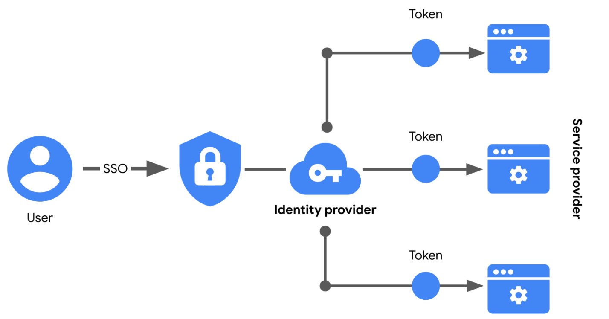

###### Limitations of SSO

Usernames and passwords alone are not always the most secure way of
protecting sensitive information. SSO provides useful benefits, but
there’s still the risk associated with using one form of authentication.
For example, a lost or stolen password could expose information across
multiple services. Thankfully, there’s a solution to this problem.

**<u>MFA to the rescue</u>**

**Multi-factor authentication** (MFA) requires a user to verify their
identity in two or more ways to access a system or network. In a sense,
MFA is similar to using an ATM to withdraw money from your bank account.
First, you insert a debit card into the machine as one form of
identification. Then, you enter your PIN number as a second form of
identification. Combined, both steps, or factors, are used to verify
your identity before authorizing you to access the account.

##### OAuth

OAuth is an open standard that allows users to grant third-party
websites and applications access to their information without sharing
account credentials. This can be thought of as a form of access
delegation because access to the user's account is being delegated to
the third party. This is accomplished by prompting the user to confirm
that they agree to permit the third party access to certain information
about their account. Typically, this prop will specifically list which
pieces of information or access are being requested. Once confirmed, the
identity provider will supply the third party with a token that gives
them access to the user's information. This token can then be used by
the third party to access data or services offered by the identity
provider directly on behalf of the user. OAuth is commonly used to grant
access to third party applications, to APIs offered by large internet
companies like Google, Microsoft, and Facebook. Let's say you want to
use a third party meme creation website. This website lets you create
memes using templates and gives you the option to save your creations
and email them to your friends. Instead of the site sending the emails
directly, which would appear to be coming from an address your friends
wouldn't recognize, the site uses OAuth to get permission to send the
memes using your email account directly. This is done by making an OAuth
request to your email provider. Once you approve this request, the email
provider issues an access token to the site, which grants the site
access to your email account. The access token would have a scope, which
says that it can only be used to access email, not other services
associated with the account. So it can access email but not your cloud
storage files or calendar, for example. It's important that users pay
attention to what third party is requesting access and what exactly
they're granting access to. OAuth permissions can be used in phishing
style attacks to gain access to accounts without requiring credentials
to be compromised. This works by sending phishing emails to potential
victims that look like legitimate OAuth authorization requests, which
ask the user to grant access to some aspects of their account through
OAuth. Once the user grants access, the attacker has access to the
account through the OAuth authorization token. This was used in an OAuth
based worm attack in early 2017. There was a rash of phishing emails
that appeared to be from a friend or colleague who wanted to share a
google doc. When the sharing link was followed, the victim was prompted
to log in and authorize access to email documents and contacts for some
third party service, which only identified itself as the name Google
Apps. But it was actually a malicious service that would then email
contacts from their email account perpetuating the attack. In case you
like to read more about it, I've included a link in the next reading.
It's important to distinguish between OAuth and OpenID. OAuth is
specifically an authorization system and OpenID is an authentication
system. Though they're usually used together, OpenID Connect is an
authentication layer built on top of OAuth 2.0 designed to improve upon
OpenID and build better integration with OAuth authorizations. Since
TACACS plus is a full AAA system, it also handles authorization along
with authentication. This is done once a user is authenticated by
allowing or disallowing access for the user account to run certain
commands or access certain devices. This lets you not only allow admin
access for users that administer devices while still allowing less
privileged access to other users when necessary. Here's an example,
since your networking teams are responsible for configuring and
maintaining your network switches, routers, and other infrastructure.
You'd give them admin access to your network and equipment. Meanwhile,
you can have limited read-only access to your support team since they
don't need to be able to make changes to switch configurations in their
jobs. Read-only access is enough for them to troubleshoot problems. The
rest of the user accounts would have no access at all and wouldn't be
permitted to connect to the networking infrastructure. So more
sophisticated or configurable AAA systems may even allow further
refinement of authorization down to the command level. This gives you
much more flexibility in how your access is granted to specific users or
groups in your organization. RADIUS also allows you to authorize network
access. For example, you may want to permit some users to have Wi-Fi and
VPN access while others may not need this. When they authenticate to the
RADIUS server, if the authentication succeeds, the RADIUS server returns
configuration information to the network access server. This includes
authorizations which specifies what network services the user is
permitted to access.

#### Authorization

After a user/service has been authenticated, we need to make sure that
have proper access to the resource they are trying to reach.

#### Accounting

- Audit access logs

- Tracking of data, computer usage, and network resources

- Non-repudiation occurs when you have proof that someone has taken an
  action

Accounting is the practice of monitoring the access logs of a system.
These logs contain information like who accessed the system, and when
they accessed it, and what resources they used.

Security analysts use access logs a lot. The data they contain is a
helpful way to identify trends, like failed login attempts. They're also
used to uncover hackers who have gained access to a system, and for
detecting an incident, like a data breach.

In this field, access logs are essential. Oftentimes, analyzing them is
the first procedure you'll follow when investigating a security event.
So, how do access logs compile all this useful information? Let's
examine this more closely.

Anytime a user accesses a system, they initiate what's called a session.
A session is a sequence of network HTTP basic auth requests and
responses associated with the same user, like when you visit a website.
Access logs are essentially records of sessions that capture the moment
a user enters a system until the moment they leave it.

Two actions are triggered when the session begins. The first is the
creation of a session ID. A session ID is a unique token that identifies
a user and their device while accessing the system. Session IDs are
attached to the user until they either close their browser or the
session times out.

The second action that takes place at the start of a session is an
exchange of session cookies between a server and a user's device. A
session cookie is a token that websites use to validate a session and
determine how long that session should last. When cookies are exchanged
between your computer and a server, your session ID is read to determine
what information the website should show you.

Cookies make web sessions safer and more efficient. The exchange of
tokens means that no sensitive information, like usernames and
passwords, are shared. Session cookies prevent attackers from obtaining
sensitive data. However, there's other damage that they can do. With a
stolen cookie, an attacker can impersonate a user using their session
token. This kind of attack is known as session hijacking.

Session hijacking is an event when attackers obtain a legitimate user's
session ID. During these kinds of attacks, cyber criminals impersonate
the user, causing all sorts of harm. Money or private data can be
stolen. If, for example, hijackers obtain a single sign-on credential
from stolen cookies, they can even gain access to additional systems
that otherwise seem secure.

This is one reason why accounting and monitoring session logs is so
important. Unusual activity on access logs can be an indication that
information has been improperly accessed or stolen. At the end of the
day, accounting is how we gain valuable insight that makes information
safer.

#### IAM: Identity and access management

As organizations become more reliant on technology, regulatory agencies
have put more pressure on them to demonstrate that they’re doing
everything they can to prevent threats. **Identity and access
management** (IAM) is a collection of processes and technologies that
helps organizations manage digital identities in their environment. Both
AAA and IAM systems are designed to authenticate users, determine their
access privileges, and track their activities within a system.

Either model used by your organization is more than a single, clearly
defined system. They each consist of a collection of security controls
that ensure the *right user* is granted access to the *right resources*
at the *right time* and for the *right reasons*. Each of those four
factors is determined by your organization's policies and processes.

**Note:** A user can either be a person, a device, or software.

#### Quiz questions

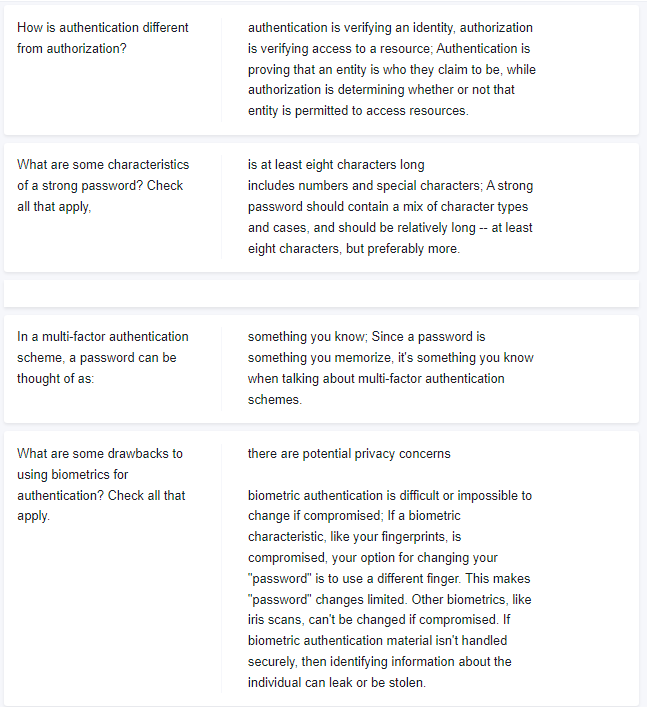

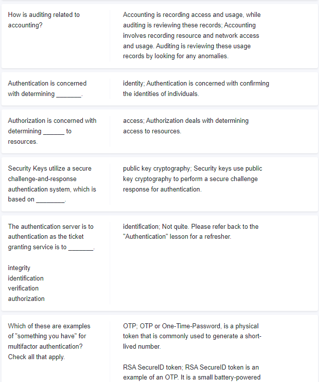

### Wireless Security (WEP,WPA,WPA2)

#### **WEP**

**WEP** stands for Wired Equivalent Privacy, and it's an encryption
technology that provides a very low level of privacy. Actually, it's
really right there in the name, wired equivalent privacy. Using WEP
protects your data a little but it should really only be seen as being
as safe as sending unencrypted data over a wired connection. The WEP
standard is a really weak encryption algorithm.

***It's important to know that the number of bits in an encryption key
corresponds to how secure it is, the more bits in a key the longer it
takes for someone to crack the encryption.***

WEP only uses 40 bits for its encryption keys and with the speed of
modern computers, this can usually be cracked in just a few minutes. WEP
was quickly replaced in most places with WPA or Wi-Fi Protected Access.

**WPA**, by default, uses a 128-bit key, making it a whole lot more
difficult to crack than WEP. Today, the most commonly used encryption
algorithm for wireless networks is WPA2, an update to the original WPA.

**WPA2** uses a 256-bit key make it even harder to crack. Another common
way to help secure wireless networks is through MAC filtering.

With **MAC filtering**, you configure your access points to only allow
for connections from a specific set of MAC addresses belonging to
devices you trust. This doesn't do anything more to help encrypt
wireless traffic being sent through the air, but it does provide an
additional barrier preventing unauthorized devices from connecting to
the wireless network itself.

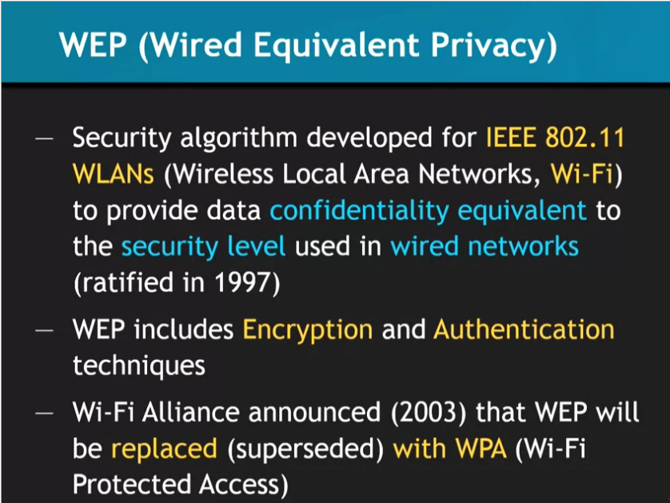

#### WPA/WPA2

It's okay if you're not sure, just keep this question in mind as we go
over all the options available along with their benefits and drawbacks.
Spoiler alert, there's some pretty technical security stuff coming your
way, so put your thinking caps on. The first security protocol
introduced for Wi-Fi networks was WEP or Wired Equivalent Privacy. It
was part of the original 802.11 standard introduced back in 1997. WEP
was intended to provide privacy on par with the wired network, that
means the information passed over the network should be protected from
third parties eavesdropping. This was an important consideration when
designing the wireless specification.

Play video starting at :1:42 and follow transcript1:42

Unlike wired networks, packets could be intercepted by anyone with
physical proximity to the access point or client station. Without some
form of encryption to protect the packets, wireless traffic would be
readable by anyone nearby who wants to listen. WEP was proven to be
seriously bad at providing confidentiality or security for wireless
networks. It was quickly discounted in 2004 in favor of more secure
systems. Even so, we'll cover it here for historical purposes. I want to
drive home the point that no one should be using WEP anymore. You never
know, you may see seriously outdated systems when working as an IT
support specialist. So it's important that you fully understand why WEP
is outdated and what you can do instead.

Play video starting at :2:28 and follow transcript2:28

WEP use the RC4 symmetric stream cipher for encryption. It used either a
40-bit or 104-bit shared key where the encryption key for individual
packets was derived. The actual encryption key for each packet was
computed by taking the user-supplied shared key and then joining a
24-bit initialization vector or IV for short. It's a randomized bit of
data to avoid reusing the same encryption key between packets. Since
these bits of data are concatenated or joined, a 40-bit shared key
scheme uses a 64-bit key for encryption and the 104-bit scheme uses a
128-bit key. Originally, WEP encryption was limited to 64-bit only
because of US export restrictions placed on encryption technologies.

Play video starting at :3:19 and follow transcript3:19

Now once those laws were changed, 128-bit encryption became available
for use. The shared key was entered as either 10 hexadecimal characters
for 40-bit WEP, or 26 hex characters for 104-bit WEP. Each hex character
was 4-bits each. The key could also be specified by supplying 5 ASCII
characters or 13, each ASCII character representing 8-bits. But this
actually reduces the available keyspace to only valid ASCII characters
instead of all possible hex values. Since this is a component of the
actual key, the shared key must be exactly as many characters as
appropriate for the encryption scheme. WEP authentication originally
supported two different modes, Open System authentication and Shared Key
authentication. The open system mode didn't require clients to supply
credentials. Instead, they were allowed to authenticate and associate
with the access point. But the access point would begin communicating
with the client encrypting data frames with the pre-shared WEP key. If
the client didn't have the key or had an incorrect key, it wouldn't be
able to decrypt the frames coming from the access point or AP.

Play video starting at :4:34 and follow transcript4:34

It also wouldn't be able to communicate back to the AP.

Play video starting at :4:39 and follow transcript4:39

Shared key authentication worked by requiring clients to authenticate
through a four-step challenge response process. This basically has the
AP asking the client to prove that they have the correct key. Here's how
it works. The client sends an authentication request to the AP. The AP
replies with clear text challenge, a bit of randomized data that the
client is supposed to encrypt using the shared WEP key. The client
replies to the AP with the resulting ciphertext from encrypting this
challenge text. The AP verifies this by decrypting the response and
checking it against the plain text challenge text. If they match, a
positive response is sent back.

Play video starting at :5:20 and follow transcript5:20

Does anything jump out at you as potentially insecure in the scheme?
We're transmitting both the plain text and the ciphertext in a way that
exposes both of these messages to potential eavesdroppers. This opens
the possibility for the encryption key to be recovered by the attacker.

Play video starting at :5:38 and follow transcript5:38

A general concept in security and encryption is to never send the plain
text and ciphertext together, so that attackers can't work out the key
used for encryption. But WEP's true weakness wasn't related to the
authentication schemes, its use of the RC4 stream cipher and how the IVs
were used to generate encryption keys led to WEP's ultimate downfall.
The primary purpose of an IV is to introduce more random elements into
the encryption key to avoid reusing the same one. When using a stream
cipher like RC4, it's super important that an encryption key doesn't get
reused. This would allow an attacker to compare two messages encrypted
using the same key and recover information. But the encryption key in
WEP is just made up of the shared key, which doesn't change frequently.
It had 24-bits of randomized data, including the IV tucked on to the end
of it. This results in only a 24-bit pool where unique encryption keys
will be pulled from and used.

Play video starting at :6:41 and follow transcript6:41

Since the IV is made up of 24-bits of data, the total number of possible
values is not very big by modern computing standards. That's only about
17 million possible unique IVs, which means after roughly 5,000 packets,
an IV will be reused. When an IV is reused, the encryption key is also
reused.

Play video starting at :7:2 and follow transcript7:02

It's also important to call out that the IV is transmitted in plain
text. If it were encrypted, the receiver would not be able to decrypt
it. This means an attacker just has to keep track of IVs and watch for
repeated ones. The actual attack that lets an attacker recover the WEP
key relies on weaknesses in some IVs and how the RC4 cipher generates a
keystream used for encrypting the data payloads. This lets the attacker
reconstruct this keystream using packets encrypted using the weak IVs.
The details of the attack are outside what we'll cover in this course,
but the full paper detailing the attack is available in the
supplementary readings if you want to check it out.

Play video starting at :7:45 and follow transcript7:45

You could also take a look at open source tools that demonstrate this
attack in action, like Aircrack-ng or AirSnort, they can recover a WEP
key in a matter of minutes, it's kind of terrifying to think about. So
now you've heard the technical reasons why WEP is inherently vulnerable
to attacks. In the next video, we'll talk about the solution that
replaced WEP. But before we get there, you might be asking yourself why
it's important to know WEP, since it's not recommended for use anymore.
Well, as an IT support specialist, you might encounter some cases where
legacy hardware is still running WEP. It's important to understand the
security implications of using this broken security protocol so you can
prioritize upgrading away from WEP. All right, now let's dive into the
replacement for WEP in the next video.

##### Let's Get Rid of WEP! WPA/WPA2

The replacement for WEP from the Wi-Fi Alliance was WPA or Wi-Fi
Protected Access. It was introduced in 2003 as a temporary measure while
the alliance finalized their specification for what would become WPA2
introduced in 2004. WPA was designed as a short-term replacement that
would be compatible with older WEP-enabled hardware with a simple
firmware update. This helped with user adoption because it didn't
require the purchase of new Wi-Fi hardware. To address the shortcomings
of WEP security, a new security protocol was introduced called TKIP or
the Temporal Key Integrity Protocol. TKIP implemented three new features
that made it more secure than WEP. First, a more secure key derivation
method was used to more securely incorporate the IV into the per packet
encryption key. Second, a sequence counter was implemented to prevent
replay attacks by rejecting out of order packets. Third, a 64-bit MIC or
Message Integrity Check was introduced to prevent forging, tampering, or
corruption of packets. TKIP still use the RC4 cipher as the underlying
encryption algorithm. But it addressed the key generation weaknesses of
WEP by using a key mixing function to generate unique encryption keys
per packet. It also utilizes 256 bit long keys. This key mixing function
incorporates the long live the Wi-Fi passphrase with the IV. This is
different compared to the simplistic concatenation of the shared key and
IV. Under WPA, the pre-shared key is the Wi-Fi password you share with
people when they come over and want to use your wireless network. This
is not directly used to encrypt traffic. It's used as a factor to derive
the encryption key. The passphrase is fed into the PBKDF2 or
Password-Based Key Derivation Function 2, along with the Wi-Fi networks
SSID as a salt. This is then run through the HMAC-SHA1 function 4096
times to generate a unique encryption key. The SSID salt is incorporated
to help defend against rainbow table attacks. The 4096 rounds of
HMAC-SHA1 Increase the computational power required for a brute force
attack. I should call out that the pre-shared key can be entered using
two different methods. A 64 character hexadecimal value can be entered,
or the 64 character value is used as the key, which is 64 hexadecimal
characters times four bits, which is 256 bits. The other option is to
use PBKDF2 function but only if entering ASCII characters as a
passphrase. If that's the case, the passphrase can be anywhere from
eight to 63 characters long. WPA2 improve WPA security even more by
implementing CCMP or Counter Mode CBC-MAC Protocol. WPA2 is the best
security for wireless networks currently available, so it's really
important to know as an I.T. Support Specialist. It's based on the AES
cipher finally getting away from the insecure RC4 cipher. The key
derivation process didn't change from WPA, and the pre-shared key
requirements are the same. Counter with CBC-MAC is a particular mode of
operation for block ciphers. It allows for authenticated encryption,
meaning data is kept confidential, and is authenticated. This is
accomplished using an authenticate, then encrypt mechanism. The CBC-MAC
digest is computed first. Then, the resulting authentication code is
encrypted along with the message using a block cipher. We're using AES
in this case, operating in counter mode. This turns a block cipher into
a stream cipher by using a random seed value along with an incrementing
counter to create a key stream to encrypt data with.

##### Security and WPA/WPA2

**2. WPA/WPA2: **WPA and WPA2 are very similar, the only difference
between them is the algorithm used to encrypt the information but both
encryptions work in the same way. WPA/WPA2 can be cracked in two ways

1\. If **WPS **feature is enabled then there is a high chance of
obtaining the key regardless of its complexity, this can be done by
exploiting a weakness in the WPS feature. WPS is used to allow users to
connect to their wireless network without entering the key, this is done
by pressing a WPS button on both the router and the device that they
want to connect, the authentication works using an **eight digit
pin,** hackers can brute force this pin in relatively short time (in an
average of 10 hours), once they get the right pin they can use a tool
called reaver to reverse engineer the pin and get the key, this is all
possible due to the fact that the WPS feature uses an easy pin (only 8
characters and only contains digits), so its not a weakness in WPA/WPA2,
its a weakness in a feature that can be enabled on routers that use
WPA/WPA2 which can be exploited to get the actual WPA/WPA2 key.

2\. If WPS is not enabled, then the only way to crack WPA/WPA2 is using
a dictionary attack, in this attack a list of passwords (dictionary) is
compared against a file (handshake file) to check if any of the
passwords is the actual key for the network, so if the password does not
exist in the wordlist then the attacker will not be able to find the
password.

**Conclusion:**

1.Do not use WEP encryption, as we seen how easy it is to crack it
regardless of the complexity of the password and even if there is nobody
connected to the network.

2\. Use WPA2 with a complex password, make sure the password contains
small letters, capital letters, symbols and numbers and;

3\. Ensure that the WPS feature is disabled as it can be used to crack
your complex WPA2 key by brute-forcing the easy WPS pin.

##### Types of WPA2

- **WPA2 Personal** : Uses a pre-shared key (PSK) \[SOHO\].

- **WpA2 Enterprise** : Uses an AAA server (Authentication,
  Authorization, Accounting) such as Radius. If Active Directory server
  is in use Radius can connect the AD server to auth as well.

##### Four-Way Handshake process

Now, let's walk through the **Four-Way Handshake process** that
authenticates clients to the network. I should call out, that while you
might not encounter this in your day to day work, it's good to have a
grasp on how the authentication process works. It will help you
understand how WPA2 can be broken.

This process also generates the temporary encryption key that will be
used to encrypt data for this client. This process is called the
**Four-Way Handshake**, since it's made up of four exchanges of data
between the <u>client and AP</u>. It's designed to allow an AP to
confirm that the client has the correct pairwise master key, or
**pre-shared key** (PSK) in a WPA-PSK setup without disclosing the PMK.
The PMK is a long live key and might not change for a long time. So
<u>an encryption key is derived from the PMK that's used for actual
encryption and decryption of traffic between a client and AP</u>. This
key is called the **Pairwise Transient Key or PTK**. The PTK is
generating using the PMK, AP nonce, Client nonce, AP MAC address, and
Client MAC address. They're all concatenated together, and run through a
function. The AP and Client nonces are just random bits of data
generated by each party and exchanged. The MAC addresses of each party
would be known through the packet headers already, and both parties
should already have the correct PMK. With this information, the PTK can
be generated. This is different for every client to allow for
confidentiality between clients. The PTK is actually made up of five
individual keys, each with their own purpose. Two keys are used for
encryption and confirmation of EAPoL packets, and the encapsulating
protocol carries these messages. Two keys are used for sending and
receiving message integrity codes. And finally, there's a temporal key,
which is actually used to encrypt data. The AP will also transmit the
GTK or Groupwise Transient Key. It's encrypted using the EAPoL
encryption key contained in the PTK, which is used to encrypt multicast
or broadcast traffic. Since this type of traffic must be readable by all
clients connected to an AP, this GTK is shared between all clients. It's
updated and retransmitted periodically, and when a client disassociates
the AP. That's a lot to take in, so let's recap.

**The four messages exchanged in order are**, the AP, which sends a
nonce to the client, the Client, then sends its nonce to the AP, the AP,
sends the GTK, and the Client replies with an Ack confirming successful
negotiation.

The WPA and WPA2 standard also introduce an 802.1x authentication to
Wi-Fi networks. It's usually called WPA2-Enterprise. The non-802.1x
configurations are called either WPA2-Personal or WPA2-PSK, since they
use a pre-shared key to authenticate clients. We won't rehash 802.1x
here since it operates similarly to 802.1x on wire networks, which we
covered earlier. The only thing different is that the AP acts as the
authenticator in this case. The back-end radius is still the
authentication server and the PMK is generated using components of the
EAP method chosen. While not a security feature directly, WPS or Wi-Fi
protected setup is a convenience feature designed to make it easier for
clients to join a WPA-PSK protected network. You might encounter WPS in
a small IT shop that uses commercial SOHO routers. It can be useful in
these smaller environments to make it easier to join wireless clients to
the wireless networks securely. But there are security implications to
having enabled that you should be aware of. The Wi-Fi Alliance
introduced WPS in 2006. It provides several different methods that allow
our wireless client to securely join a wireless network without having
to directly enter the pre-shared key. This facilitates the use of very
long and secure passphrases without making it unnecessarily complicated.
Can you imagine having to have your less technically inclined friends
and family enter a 63-character passphrase to use your Wi-Fi when they
come over? That probably wouldn't go so well. WPS simplifies this by
allowing for secure exchange of the SSID and pre-shared key. This is
done after authenticating or exchanging data using one of the four
supported methods. WPS supports PIN entry authentication, NFC or USB for
out-of-band exchange of the network details, or push-button
authentication. You've probably seen the push-button mechanism. It's
typically a small button somewhere on the home router with two arrows
pointing counter-clockwise. The push-button mechanism works by requiring
a button to be pressed on both the AP side and the client side. This
requires physical proximity and a short window of time that the client
can authenticate with a button press of its own. The NFC and USB methods
just provide a different channel to transmit the details to join the
network. The PIN methods are really interesting and also where critical
flaw was introduced. The PIN authentication mechanism supports two
modes. In one mode, the client generates a PIN which is then entered
into the AP, and the other mode, the AP has a PIN typically hard-coded
into the firmware which is entered into the client. It's the second mode
that is vulnerable to an online brute force attack. Feel free to dive
deep into this by reading more about it in the supplementary readings.
The PIN authentication method uses PINs that are eight-digits long, but
the last digit is a checksum that's computed from the first seven
digits. This makes the total number of possible PINs 10 to the seventh
power or around 10 million possibilities. But the PIN is authenticated
by the AP in halves. This means the client will send the first four
digits to the AP, wait for a positive or negative response, and then
send the second half of the PIN if the first half was correct. Did you
see anything wrong with this scenario? We're actually reducing the total
possible valid PINs even more and making it even easier to guess what
the correct PIN is. The first half of the PIN being four digits has
about 10,000 possibilities. The second half, only three digits because
of the checksum value, has a maximum of only 1,000 possibilities. This
means the correct PIN can be guessed in a maximum of 11,000 tries. It
sounds like a lot, but it really isn't. Without any rate limiting, an
attacker could recover the PIN and the pre-shared key in less than four
hours. In response to this, the Wi-Fi Alliance revised the requirements
for the WPS specification, introducing a lockout period of one minute
after three incorrect PIN attempts. This increases the maximum time to
guess the PIN from four hours to less than three days. That's easily in
the realm of possibility for a determined and patient attacker, but it
gets worse. If your network is compromised using this attack because the
PIN is an unchanging element that's part of the AP configuration, the
attacker could just reuse the already recovered WPS PIN to get the new
password. This would happen even if you detected unauthorized wireless
clients on your network and changed your Wi-Fi password. WPA2 is a
really robust security protocol. It's built using best in class
mechanisms to prevent attacks and ensure the confidentiality of the data
it's protecting. Even so, it's susceptible to some forms of attack.

**Cracking with deauth!**

The four-way authentication handshake that we covered earlier is
actually susceptible to an offline brute force attack. If an attacker
can manage to capture the four-way handshake process just for packets,
they can begin guessing the pre-shared key or PMK. They can take the
nonces and MAC addresses from the four-way handshake packets and
computing PTKs. Sends the message authentication code, secret keys are
included as part of the PTK. The correct PMK guess would yield a PTK
that successfully validates a MIC. This is a brute force or
dictionary-based attack, so it's dependent on the quality of the
password guesses. It does require a fair amount of computational power
to calculate the PMK from the passphrase guesses and SSID values. But
the bulk of the computational requirements lie in the PMK computation.
This requires 4096 iterations of a hashing function, which can be
massively accelerated through the use of GPU-accelerated computation and
cloud computing resources. Because of the bulk of the computations
involving computing the PMK, by incorporating the password guesses with
the SSIDs, it's possible to pre-compute PMKs in bulk for common SSIDs
and password combinations. This reduces the computational requirements
to deriving the PTK from the unique session elements. These pre-computed
sets are referred to as rainbow tables and exactly this has been done.
Rainbow tables are available for download for the top 1000 most commonly
seen SSIDs and 1 million passwords.

### Network Security

#### Network Security best practices

##### Security through obscurity

##### Implicit deny (Whitelisting)

There's a general security principle that can be applied to most areas
of security, it's the concept of disabling unnecessary extra services or
restricting access to them. Since any service that's enabled and
accessible can be attacked, this principle should be applied to network
security too. Networks would be much safer if you disable access to
network services that aren't needed and enforce access restrictions.
Implicit deny is a network security concept where anything not
explicitly permitted or allowed should be denied. This is different from
blocking all traffic, since an implicit deny configuration will still
let traffic pass that you've defined as allowed, you can do this through
ACL configurations. This can usually be configured on a firewall which
makes it easier to build secure firewall rules. Instead of requiring you
to specifically block all traffic you don't want, you can just create
rules for traffic that you need to go through. You can think of this as
whitelisting, as opposed to blacklisting. While this is slightly less
convenient, it's a much more secure configuration. Before a new service
will work, a new rule must be defined for it reducing convenience a bit.
If you want to learn more about how to configure a firewall rules and
Linux and other implementations, take a look at the references in the
supplementary reading.

#### Network Monitoring

Another very important component of network security is monitoring and
analyzing traffic on your network. There are a couple of reasons why
monitoring your network is so important. The first is that it lets you
establish a baseline of what your typical network traffic looks like.
This is key because in order to know what unusual or potential attack
traffic looks like, you need to know what normal traffic looks like. You
can do this through network traffic monitoring and logs analysis. We'll
dive deeper into what network traffic monitoring is a bit later, but
let's quickly summarize how laws can be helpful in this context.
Analyzing logs is the practice of collecting logs from different network
and sometimes client devices on your network, then performing an
automated analysis on them. This will highlight potential intrusions,
signs of malware infections or a typical behavior. You'd want to analyze
things like firewall logs, authentication server logs, and application
logs. As an IT support specialist, you should pay close attention to any
external facing devices or services. They're subject to a lot more
potentially malicious traffic which increases the risk of compromise.
Analysis of logs would involve looking for specific log messages of
interests, like with firewall logs. Attempted connections to an internal
service from an untrusted source address may be worth investigating.
Connections from the internal network to known address ranges of Botnet
command and control servers could mean there's a compromised machine on
the network. As you learned in earlier courses of this program, log and
analysis systems are a best practice for IT supports specialists to
utilize and implement. This is true too for network hardening. Logs
analysis systems are configured using user-defined rules to match
interesting or a typical log entries. These can then be surfaced through
an alerting system to let security engineers investigate the alert. Part
of this alerting process would also involve categorizing the alert,
based on the rule matched. You'd also need to assign a priority to
facilitate this investigation and to permit better searching or
filtering. Alerts could take the form of sending an email or an SMS with
information, and a link to the event that was detected. You could even
wake someone up in the middle of the night if the event was severe
enough. Normalizing logged data is an important step, since logs from
different devices and systems may not be formatted in a common way. You
might need to convert log components into a common format to make
analysis easier for analysts, and rule-based detection systems, this
also makes correlation analysis easier. Correlation analysis is the
process of taking log data from different systems, and matching events
across the systems. So, if we see a suspicious connection coming from a
suspect source address and the firewall logs to our authentication
server, we might want to correlate that logged connection with the log
data of the authentication server. That would show us any authentication
attempts made by the suspicious client. This type of logs analysis is
also super important in investigating and recreating the events that
happened once a compromise is detected. This is usually called a post
fail analysis, since it's investigating how a compromise happened after
the breach is detected. Detailed logging and analysis of logs would
allow for detailed reconstruction of the events that led to the
compromise. Hopefully, this will let the security team make appropriate
changes to security systems to prevent further attacks. It could also
help determine the extent and severity of the compromise. Detailed
logging would also be able to show if further systems were compromised
after the initial breach. It would also tell us whether or not any data
was stolen, and if it was, what that data was. One popular and powerful
logs analysis system is Splunk, a very flexible and extensible log
aggregation and search system. Splunk can grab logs data from a wide
variety of systems, and in large amounts of formats. It can also be
configured to generate alerts, and allows for powerful visualization of
activity based on logged data. You can read more about Splunk and the
supplementary readings in this lesson.

##### IP Scanning

There are many open-source databases out there, like AbuseIPDB, and
Cisco Talos Intelligence, where you can perform a reputation and
location check for the IP address. Most security analysts use these
tools to aid them with alert investigations. You can also make the
Internet safer by reporting the malicious IPs, for example, on
AbuseIPDB.

<https://www.abuseipdb.com/>

<https://www.talosintelligence.com/>

<https://scamalytics.com/>

<https://www.lookip.net/>

<https://www.ipqualityscore.com/free-ip-lookup-proxy-vpn-test>

<https://www.virustotal.com/gui/home/url>

##### Log collection and management

In this reading, you’ll examine some best practices related to log
management, storage, and protection. Understanding the best practices
related to log collection and management will help improve log searches
and better support your efforts in identifying and resolving security
incidents.

###### Logs

Data sources such as devices generate data in the form of events. A
**log** is a record of events that occur within an organization's
systems. Logs contain log entries and each entry details information
corresponding to a single event that happened on a device or system.
Originally, logs served the sole purpose of troubleshooting common
technology issues. For example, error logs provide information about why
an unexpected error occurred and help to identify the root cause of the
error so that it can be fixed. Today, virtually all computing devices
produce some form of logs that provide valuable insights beyond
troubleshooting. 

Security teams access logs from logging receivers like SIEM tools which
consolidate logs to provide a central repository for log data. Security
professionals use logs to perform **log** **analysis**, which is the
process of examining logs to identify events of interest. Logs help
uncover the details surrounding the 5 W's of incident investigation:
*who* triggered the incident, *what* happened, *when* the incident took
place, *where* the incident took place, and *why* the incident
occurred. 

####### Types of logs

Depending on the data source, different log types can be produced.
Here’s a list of some common log types that organizations should record:

- **Network**: Network logs are generated by network devices like
  firewalls, routers, or switches.

- **System**: System logs are generated by operating systems like Chrome
  OS™, Windows, Linux, or macOS®. 

- **Application**: Application logs are generated by software
  applications and contain information relating to the events occurring
  within the application such as a smartphone app.

- **Security**: Security logs are generated by various devices or
  systems such as antivirus software and intrusion detection systems.
  Security logs contain security-related information such as file
  deletion.

- **Authentication**: Authentication logs are generated whenever
  authentication occurs such as a successful login attempt into a
  computer.

###### Overview of log file formats

You’ve learned about how logs record events that happen on a network, or
system. In security, logs provide key details about activities that
occurred across an organization, like who signed into an application at
a specific point in time. As a security analyst, you’ll use **log
analysis**, which is the process of examining logs to identify events of
interest. It’s important to know how to read and interpret different log
formats so that you can uncover the key details surrounding an event and
identify unusual or malicious activity. In this reading, you’ll review
the following log formats:

- JSON

- Syslog

- XML

- CSV

- CEF

####### JavaScript Object Notation (JSON)

JavaScript Object Notation (JSON) is a file format that is used to store
and transmit data. JSON is known for being lightweight and easy to read
and write. It is used for transmitting data in web technologies and is
also commonly used in cloud environments. JSON syntax is derived from
JavaScript syntax. If you are familiar with JavaScript, you might
recognize that JSON contains components from JavaScript including:

- Key-value pairs

- Commas

- Double quotes

- Curly brackets

- Square brackets

######## Key-value pairs

A **key-value** **pair** is a set of data that represents two linked
items: a key and its corresponding value. A key-value pair consists of a
key followed by a colon, and then followed by a value. An example of a
key-value pair is  **"Alert": "Malware"**.

**Note**: For readability, it is recommended that key-value pairs
contain a space before or after the colon that separates the key and
value.

######## Commas

Commas are used to separate data. For example: **"Alert": "Malware",
"Alert code": 1090, "severity": 10**.

######## Double quotes

Double quotes are used to enclose *text* data, which is also known as a
string, for example:  **"Alert": "Malware"**. Data that contains numbers
*is not* enclosed in quotes, like this: **"Alert code": 1090**.

######## Curly brackets

Curly brackets enclose an **object**, which is a data type that stores
data in a comma-separated list of key-value pairs. Objects are often
used to describe multiple properties for a given key. JSON log entries
start and end with a curly bracket. In this example, **User** is the
object that contains multiple properties:

**"User" {  "id": "1234",  "name": "user", "role": "engineer" }**

######## Square brackets

Square brackets are used to enclose an **array**, which is a data type
that stores data in a comma-separated ordered list. Arrays are useful
when you want to store data as an ordered collection, for
example: **\["Administrators", "Users", "Engineering"\]**.

####### Syslog

Syslog is a standard for logging and transmitting data. It can be used
to refer to any of its three different capabilities: 

1.  **Protocol**: The syslog protocol is used to transport logs to a
    centralized log server for log management. It uses port 514 for
    plaintext logs and port 6514 for encrypted logs.

2.  **Service**: The syslog service acts as a log forwarding service
    that consolidates logs from multiple sources into a single location.
    The service works by receiving and then forwarding any syslog log
    entries to a remote server. 

3.  **Log format**: The syslog log format is one of the most commonly
    used log formats that you will be focusing on. It is the native
    logging format used in  Unix® systems. It consists of three
    components: a header, structured-data, and a message.

######## Syslog log example

Here is an example of a syslog entry that contains all three components:
a header, followed by structured-data, and a message:

**\<236\>1 2022-03-21T01:11:11.003Z virtual.machine.com evntslog - ID01
\[user@32473 iut="1" eventSource="Application" eventID="9999"\] This is
a log entry!**

######## Priority (PRI)

The priority (PRI) field indicates the urgency of the logged event and
is contained with angle brackets. In this example, the priority value is
**\<236\>** . Generally, the lower the priority level, the more urgent
the event is. 

**Note**: Syslog headers can be combined with JSON, and XML formats.
Custom log formats also exist.

######## Header 

The header contains details like the timestamp; the hostname, which is
the name of the machine that sends the log; the application name; and
the message ID. 

- **Timestamp**: The timestamp in this example is
  **2022-03-21T01:11:11.003Z**, where **2022-03-21** is the date in
  YYYY-MM-DD format. **T** is used to separate the date and the time.
  **01:11:11.003** is the 24-hour format of the time and includes the
  number of milliseconds **003**. **Z** indicates the timezone, which is
  Coordinated Universal Time (UTC). 

- **Hostname**: **virtual.machine.com** 

- **Application**: **evntslog** 

- **Message** **ID**: **ID01**

######## Structured-data 

The structured-data portion of the log entry contains additional logging
information. This information is enclosed in square brackets and
structured in key-value pairs. Here, there are three keys with
corresponding values: **\[user@32473 iut="1" eventSource="Application"
eventID="9999"\]**.

######## Message 

The message contains a detailed log message about the event. Here, the
message is **This is a log entry!**.

####### XML (eXtensible Markup Language)

XML (eXtensible Markup Language) is a language and a format used for
storing and transmitting data. XML is a native file format used in
Windows systems. XML syntax uses the following:

- Tags

- Elements

- Attributes

######## Tags 

XML uses tags to store and identify data. Tags are pairs that must
contain a start tag and an end tag. The start tag encloses data with
angle brackets, for example **\<tag\>**,  whereas the end of a tag
encloses data with angle brackets and a forward slash like this:
**\</tag\>**. 

######## Elements 

XML elements include *both* the data contained inside of a tag and the
tags itself. All XML entries must contain at least one root element.
Root elements contain other elements that sit underneath them, known as
child elements. 

Here is an example:

**\<Event\> \<EventID\>4688\</EventID\> \<Version\>5\</Version\>
\</Event\>**

In this example, **\<Event\>** is the root element and contains two
child elements **\<EventID\>** and **\<Version\>**. There is data
contained in each respective child element.

######## Attributes

XML elements can also contain attributes. Attributes are used to provide
additional information about elements. Attributes are included as the
second part of the tag itself and must always be quoted using either
single or double quotes.

For example:

**\<EventData\> \<Data Name='SubjectUserSid'\>S-2-3-11-160321\</Data\>
\<Data Name='SubjectUserName'\>JSMITH\</Data\> \<Data
Name='SubjectDomainName'\>ADCOMP\</Data\> \<Data
Name='SubjectLogonId'\>0x1cf1c12\</Data\> \<Data
Name='NewProcessId'\>0x1404\</Data\> \</EventData\>**

In the first line for this example, the tag is **\<Data\>** and it uses
the attribute  **Name='SubjectUserSid'** to describe the data enclosed
in the tag **S-2-3-11-160321**.

####### CSV (Comma Separated Value)

CSV (Comma Separated Value) uses commas to separate data values. In CSV
logs, the position of the data corresponds to its field name, but the
field names themselves might not be included in the log. It’s critical
to understand what fields the source device (like an IPS, firewall,
scanner, etc.) is including in the log. 

Here is an example:

**2009-11-24T21:27:09.534255,ALERT,192.168.2.7,
1041,x.x.250.50,80,TCP,ALLOWED,1:2001999:9,"ET MALWARE BTGrab.com
Spyware Downloading Ads",1**

####### CEF (Common Event Format)

**Common Event Format (CEF)** is a log format that uses key-value pairs
to structure data and identify fields and their corresponding values.
The CEF syntax is defined as containing the following fields: 

**CEF:Version|Device Vendor|Device Product|Device Version|Signature
ID|Name|Severity|Extension** 

Fields are all separated with a pipe character **|**. However, anything
in the **Extension** part of the CEF log entry must be written in a
key-value format. Syslog is a common method used to transport logs like
CEF. When Syslog is used a timestamp and hostname will be prepended to
the CEF message. Here is an example of a CEF log entry that details
malicious activity relating to a worm infection:

**Sep 29 08:26:10 host CEF:1|Security|threatmanager|1.0|100|worm
successfully stopped|10|src=10.0.0.2 dst=2.1.2.2 spt=1232**

Here is a breakdown of the fields:

- **Syslog Timestamp**: **Sep 29 08:26:10**

- **Syslog Hostname**: **host**

- **Version**: **CEF:1**

- **Device Vendor**: **Security**

- **Device Product**: **threatmanager**

- **Device Version**: **1.0**

- **Signature ID**: **100**

- **Name**: **worm successfully stopped**

- **Severity**: **10**

- **Extension**: This field contains data written as key-value pairs.
  There are two IP addresses, **src=10.0.0.2** and **dst=2.1.2.2**, and
  a source port number **spt=1232**. Extensions are not required and are
  optional to add.

This log entry contains details about a **Security** application called
**threatmanager** that **successfully stopped a worm** from spreading
from the internal network at **10.0.0.2** to the external network
**2.1.2.2** through the port **1232**. A high severity level of **10**
is reported.

**Note**: Extensions and syslog prefix are optional to add to a CEF log.

###### Log management

Because all devices produce logs, it can quickly become overwhelming for
organizations to keep track of all the logs that are generated. To get
the most value from your logs, you need to choose exactly what to log,
how to access it easily, and keep it secure using log management. **Log
management** is the process of collecting, storing, analyzing, and
disposing of log data. 

####### What to log

The most important aspect of log management is choosing what to log.
Organizations are different, and their logging requirements can differ
too. It's important to consider which log sources are most likely to
contain the most useful information depending on your event of interest.
This might be configuring log sources to reduce the amount of data they
record, such as excluding excessive verbosity. Some information,
including but not limited to phone numbers, email addresses, and names,
form personally identifiable information (PII), which requires special
handling and in some jurisdictions might not be possible to be logged.

####### Log details

Generally, logs contain a date, time, location, action, and author of
the action. Here is an example of an authentication log:

**Login Event \[05:45:15\] User1 Authenticated successfully**

Logs contain information and can be adjusted to contain even more
information. Verbose logging records additional, detailed information
beyond the default log recording. Here is an example of the same log
above but logged as verbose.

**Login Event \[2022/11/16 05:45:15.892673\] auth_performer.cc:470 User1
Authenticated successfully from device1 (192.168.1.2)**

####### The issue with overlogging

From a security perspective, it can be tempting to log everything. This
is the most common mistake organizations make. Just because it can be
logged, doesn't mean it *needs* to be logged. Storing excessive amounts
of logs can have many disadvantages with some SIEM tools. For example,
overlogging can increase storage and maintenance costs. Additionally,
overlogging can increase the load on systems, which can cause
performance issues and affect usability, making it difficult to search
for and identify important events. 

####### Log retention

Organizations might operate in industries with regulatory requirements.
For example, some regulations require organizations to retain logs for
set periods of time and organizations can implement log retention
practices in their log management policy.

Organizations that operate in the following industries might need to
modify their log management policy to meet regulatory requirements:

- Public sector industries, like the Federal Information Security
  Modernization Act (FISMA)

- Healthcare industries, like the Health Insurance Portability and
  Accountability Act of 1996 (HIPAA)

- Financial services industries, such as the Payment Card Industry Data
  Security Standard (PCI DSS), the Gramm-Leach-Bliley Act (GLBA), and
  the Sarbanes-Oxley Act of 2002 (SOX)

####### Log protection

Along with management and retention, the protection of logs is vital in
maintaining log integrity. It’s not unusual for malicious actors to
modify logs in attempts to mislead security teams and to even hide their
activity.

Storing logs in a centralized log server is a way to maintain log
integrity. When logs are generated, they get sent to a dedicated server
instead of getting stored on a local machine. This makes it more
difficult for attackers to access logs because there is a barrier
between the attacker and the log location. 

##### SIEM (log aggregator/analyzer/metric-gatherer/dashboard creator)

A **SIEM tool** is an application that collects and analyzes log data to
monitor critical activities in an organization. A **log** is a record of
events that occur within an organization’s systems. Depending on the
amount of data you’re working with, it could take hours or days to
filter through log data on your own. SIEM tools reduce the amount of
data an analyst must review by providing alerts for specific types of
threats, risks, and vulnerabilities.

SIEM tools provide a series of dashboards that visually organize data
into categories, allowing users to select the data they wish to analyze.
Different SIEM tools have different dashboard types that display the
information you have access to. 

SIEM tools also come with different hosting options, including
on-premise and cloud. Organizations may choose one hosting option over
another based on a security team member’s expertise. For example,
because a cloud-hosted version tends to be easier to set up, use, and
maintain than an on-premise version, a less experienced security team
may choose this option for their organization.

***Lecture***

A log is a record of events that occur within an organization's systems.
Examples of security-related logs include records of employees signing
into their computers or accessing web-based services. Logs help security
professionals identify vulnerabilities and potential security breaches.

The first tools we'll discuss are security information and event
management tools, or SIEM tools. A SIEM tool is an application that
collects and analyzes log data to monitor critical activities in an
organization. The acronym S-I-E-M may be pronounced as 'sim' or 'seem',
but we'll use 'sim' throughout this program. SIEM tools collect
real-time, or instant, information, and allow security analysts to
identify potential breaches as they happen.

Imagine having to read pages and pages of logs to determine if there are
any security threats. Depending on the amount of data, it could take
hours or days. SIEM tools reduce the amount of data an analyst must
review by providing alerts for specific types of risks and threats.
Next, let's go over examples of commonly used SIEM tools: Splunk and
Chronicle.

Splunk is a data analysis platform, and Splunk Enterprise provides SIEM
solutions. Splunk Enterprise is a self-hosted tool used to retain,
analyze, and search an organization's log data.

Another SIEM tool is Google's Chronicle. Chronicle is a cloud-native
SIEM tool that stores security data for search and analysis.
Cloud-native means that Chronicle allows for fast delivery of new
features.

Both of these SIEM tools, and SIEMs in general, collect data from
multiple places, then analyze and filter that data to allow security
teams to prevent and quickly react to potential security threats.

As a security analyst, you may find yourself using SIEM tools to analyze
filtered events and patterns, perform incident analysis, or proactively
search for threats. Depending on your organization's SIEM setup and risk
focus, the tools and how they function may differ, but ultimately, they
are all used to mitigate risk.

Other key tools that you will use in your role as a security analyst,
and that you'll have hands-on opportunities to use later in the program,
are playbooks and network protocol analyzers.

A playbook is a manual that provides details about any operational
action, such as how to respond to an incident. Playbooks, which vary
from one organization to the next, guide analysts in how to handle a
security incident before, during, and after it has occurred. Playbooks
can pertain to security or compliance reviews, access management, and
many other organizational tasks that require a documented process from
beginning to end.

Another tool you may use as a security analyst is a network protocol
analyzer, also called packet sniffer. A packet sniffer is a tool
designed to capture and analyze data traffic within a network. Common
network protocol analyzers include tcpdump and Wireshark.

As an entry-level analyst, you don't have to be an expert in these
tools. As you continue through this certificate program and get more
hands-on practice, you'll continuously build your understanding of how
to use these tools to identify, assess, and mitigate risks.

###### Overview of SIEM technology

Previously, you learned about the SIEM process. In this reading, you'll
explore more about this process and why SIEM tools are an important part
of incident detection and response. As a refresher, a **security
information and event management** (**SIEM**) tool is an application
that collects and analyzes log data to monitor critical activities in an
organization. You might recall that SIEM tools help security analysts
perform **log analysis** which is the process of examining logs to
identify events of interest.

####### SIEM advantages

SIEM tools collect and manage security-relevant data that can be used
during investigations. This is important because SIEM tools provide
awareness about the activity that occurs between devices on a network.
The information SIEM tools provide can help security teams quickly
investigate and respond to security incidents. SIEM tools have many
advantages that can help security teams effectively respond to and
manage incidents. Some of the advantages are:

- **Access to event data:** SIEM tools provide access to the event and
  activity data that happens on a network, including real-time activity.
  Networks can be connected to hundreds of different systems and
  devices. SIEM tools have the ability to ingest all of this data so
  that it can be accessed.

- **Monitoring, detecting, and alerting:** SIEM tools continuously
  monitor systems and networks in real-time. They then analyze the
  collected data using detection rules to detect malicious activity. If
  an activity matches the rule, an alert is generated and sent out for
  security teams to assess.

- **Log storage:** SIEM tools can act as a system for data retention,
  which can provide access to historical data. Data can be kept or
  deleted after a period depending on an organization's requirements. 

####### The SIEM process

The SIEM process consists of three critical steps:

1.  **Collect and aggregate data**

2.  **Normalize data **

3.  **Analyze data**

By understanding these steps, organizations can utilize the power of
SIEM tools to gather, organize, and analyze security event data from
different sources. Organizations can later use this information to
improve their ability to identify and mitigate potential threats.

######## Collect and aggregate data

SIEM tools require data for them to be effectively used. During the
first step, the SIEM collects event data from various sources like
firewalls, servers, routers, and more. This data, also known as logs,
contains event details like timestamps, IP addresses, and more. **Logs**
are a record of events that occur within an organization’s systems.
After all of this log data is collected, it gets aggregated in one
location. Aggregation refers to the process of consolidating log data
into a centralized place. Through collection and aggregation, SIEM tools
eliminate the need for manually reviewing and analyzing event data by
accessing individual data sources. Instead, all event data is accessible
in one location—the SIEM. 

Parsing can occur during the first step of the SIEM process when data is
collected and aggregated. *Parsing* maps data according to their fields
and their corresponding values. For example, the following log example
contains fields with values. At first, it might be difficult to
interpret information from this log based on its format:

**April 3 11:01:21 server sshd\[1088\]: Failed password for user nuhara
from 218.124.14.105 port 5023**

In a parsed format, the fields and values are extracted and paired
making them easier to read and interpret:

- host = **server**

- process = **sshd**

- source_user = **nuhara**

- source ip = **218.124.14.105**

- source port = **5023**

######## Normalize data

SIEM tools collect data from many different sources. This data must be
transformed into a single format so that it can be easily processed by
the SIEM. However, each data source is different and data can be
formatted in many different ways. For example, a firewall log can be
formatted differently than a server log.

Collected event data should go through the process of normalization.
*Normalization* converts data into a standard, structured format that is
easily searchable. 

######## Analyze data

After log data has been collected, aggregated, and normalized, the SIEM
must do something useful with all of the data to enable security teams
to investigate threats. During this final step in the process, SIEM
tools analyze the data. Analysis can be done with some type of detection
logic such as a set of rules and conditions. SIEM tools then apply these
rules to the data, and if any of the log activity matches a rule, alerts
are sent out to cybersecurity teams.

**Note**: A part of the analysis process includes correlation.
*Correlation* involves the comparison of multiple log events to identify
common patterns that indicate potential security threats.

###### What SIEM tools analyze

**Logs commonly aggregated/analyzed:**

- Firewall logs

- Network logs

- Server logs

As a security analyst, one of your responsibilities might include
analyzing log data to mitigate and manage threats, risks, and
vulnerabilities. As a reminder, a log is a record of events that occur
within an organization's systems and networks. Security analysts access
a variety of logs from different sources. Three common log sources
include firewall logs, network logs, and server logs. Let's explore each
of these log sources in more detail.

A **firewall log** is a record of attempted or established connections
for incoming traffic from the internet. It also includes outbound
requests to the internet from within the network. This could include
IDS/IPS logs as well.

A **network log** is a record of all computers and devices that enter
and leave the network. It also records connections between devices and
services on the network.

Finally, a **server log** is a record of events related to services such
as websites, emails, or file shares. It includes actions such as login,
password, and username requests.

By monitoring logs, like the one shown here, security teams can identify
vulnerabilities and potential data breaches. Understanding logs is
important because SIEM tools rely on logs to monitor systems and detect
security threats.

A security information and event management, or SIEM, tool is an
application that collects and analyzes log data to monitor critical
activities in an organization. It provides real-time visibility, event
monitoring and analysis, and automated alerts. It also stores all log
data in a centralized location.

Because SIEM tools index and minimize the number of logs a security
professional must manually review and analyze, they increase efficiency
and save time.

But, SIEM tools must be configured and customized to meet each
organization's unique security needs. As new threats and vulnerabilities
emerge, organizations must continually customize their SIEM tools to
ensure that threats are detected and quickly addressed.

Later in the certificate program, you'll have a chance to practice using
different SIEM tools to identify potential security incidents.

Coming up, we'll explore SIEM dashboards and how cybersecurity
professionals use them to monitor for threats, risks, and
vulnerabilities.

###### Common SIEM tools

**<u>Self-hosted vs Cloud hosted</u>**

**Self-hosted** SIEM tools require organizations to install, operate,
and maintain the tool using their own physical infrastructure, such as
server capacity. These applications are then managed and maintained by
the organization's IT department, rather than a third party vendor.
Self-hosted SIEM tools are ideal when an organization is required to
maintain physical control over confidential data.

Alternatively**, cloud-hosted** SIEM tools are maintained and managed by
the SIEM providers, making them accessible through the internet.
Cloud-hosted SIEM tools are ideal for organizations that don't want to
invest in creating and maintaining their own infrastructure.

Or, an organization can choose to use a combination of both self-hosted
and cloud-hosted SIEM tools, known as a hybrid solution. Organizations
might choose a hybrid SIEM solution to leverage the benefits of the
cloud while also maintaining physical control over confidential data.

**<u>Common SIEM Tools</u>**

**Splunk Enterprise, Splunk Cloud, and Chronicle** are common SIEM tools
that many organizations use to help protect their data and systems.
Let's begin by discussing Splunk.

There are many SIEM tools. The following are some SIEM tools commonly
used in the cybersecurity industry:

- AlienVault® OSSIM™

- Chronicle

- Elastic

- Exabeam

- IBM QRadar® Security Intelligence Platform

- LogRhythm

- Splunk

####### Splunk

**Splunk** is a data analysis platform and Splunk Enterprise provides
SIEM solutions.

- ***Splunk Enterprise*** is a self-hosted tool used to retain, analyze,
  and search an organization's log data to provide security information
  and alerts in real-time.

- ***Splunk Cloud*** is a cloud-hosted tool used to collect, search, and
  monitor log data. Splunk Cloud is helpful for organizations running
  hybrid or cloud-only environments, where some or all of the
  organization's services are in the cloud.

######## Splunk Dashboards

Review the following Splunk dashboards and their purposes:

**Security posture dashboard**

The security posture dashboard is designed for security operations
centers (SOCs). It displays the last 24 hours of an organization’s
notable security-related events and trends and allows security
professionals to determine if security infrastructure and policies are
performing as designed. Security analysts can use this dashboard to
monitor and investigate potential threats in real time, such as
suspicious network activity originating from a specific IP address.

**Executive summary dashboard**

The executive summary dashboard analyzes and monitors the overall health
of the organization over time. This helps security teams improve
security measures that reduce risk. Security analysts might use this
dashboard to provide high-level insights to stakeholders, such as
generating a summary of security incidents and trends over a specific
period of time.

**Incident review dashboard**

The incident review dashboard allows analysts to identify suspicious
patterns that can occur in the event of an incident. It assists by
highlighting higher risk items that need immediate review by an analyst.
This dashboard can be very helpful because it provides a visual timeline
of the events leading up to an incident.

**Risk analysis dashboard**

The risk analysis dashboard helps analysts identify risk for each risk
object (e.g., a specific user, a computer, or an IP address). It shows
changes in risk-related activity or behavior, such as a user logging in
outside of normal working hours or unusually high network traffic from a
specific computer. A security analyst might use this dashboard to
analyze the potential impact of vulnerabilities in critical assets,
which helps analysts prioritize their risk mitigation efforts.

####### Chronicle (Google)

Finally, there's Google's **Chronicle**.

**Chronicle** is a cloud-native tool designed to retain, analyze, and
search data. Chronicle provides log monitoring, data analysis, and data
collection. Like cloud-hosted tools, cloud-native tools are also fully
maintained and managed by the vendor. But cloud-native tools are
specifically designed to take full advantage of cloud computing
capabilities such as availability, flexibility, and scalability.

Chronicle allows you to collect and analyze log data according to:

- A specific asset

- A domain name

- A user

- An IP address

######## Chronicle Dashboards

**Enterprise insights dashboard**

The enterprise insights dashboard highlights recent alerts. It
identifies suspicious domain names in logs, known as indicators of
compromise (IOCs). Each result is labeled with a confidence score to
indicate the likelihood of a threat. It also provides a severity level
that indicates the significance of each threat to the organization. A
security analyst might use this dashboard to monitor login or data
access attempts related to a critical asset—like an application or
system—from unusual locations or devices.

**Data ingestion and health dashboard**

The data ingestion and health dashboard shows the number of event logs,
log sources, and success rates of data being processed into Chronicle. A
security analyst might use this dashboard to ensure that log sources are
correctly configured and that logs are received without error. This
helps ensure that log related issues are addressed so that the security
team has access to the log data they need.

**IOC matches dashboard**

The IOC matches dashboard indicates the top threats, risks, and
vulnerabilities to the organization. Security professionals use this
dashboard to observe domain names, IP addresses, and device IOCs over
time in order to identify trends. This information is then used to
direct the security team’s focus to the highest priority threats. For
example, security analysts can use this dashboard to search for
additional activity associated with an alert, such as a suspicious user
login from an unusual geographic location.

**Main dashboard**

The main dashboard displays a high-level summary of information related
to the organization’s data ingestion, alerting, and event activity over
time. Security professionals can use this dashboard to access a timeline
of security events—such as a spike in failed login attempts— to identify
threat trends across log sources, devices, IP addresses, and physical
locations.

**Rule detections dashboard**

The rule detections dashboard provides statistics related to incidents
with the highest occurrences, severities, and detections over time.
Security analysts can use this dashboard to access a list of all the
alerts triggered by a specific detection rule, such as a rule designed
to alert whenever a user opens a known malicious attachment from an
email. Analysts then use those statistics to help manage recurring
incidents and establish mitigation tactics to reduce an organization's
level of risk.

**User sign in overview dashboard**

The user sign in overview dashboard provides information about user
access behavior across the organization. Security analysts can use this
dashboard to access a list of all user sign-in events to identify
unusual user activity, such as a user signing in from multiple locations
at the same time. This information is then used to help mitigate
threats, risks, and vulnerabilities to user accounts and the
organization’s applications.

###### Querying for events in a SIEM 

####### Search methods with SIEM tools

So far, you’ve learned about how you can use **security information and
event management (SIEM)** tools to search for security events such as
failed login attempts. Remember, SIEM is an application that collects
and analyzes log data to monitor critical activities in an organization.
In this reading, you’ll examine how SIEM tools like Splunk and Chronicle
use different search methods to find, filter, and transform search
results. 

Not all organizations use the same SIEM tool to gather and centralize
their security data. As a security analyst, you’ll need to be ready to
learn how to use different SIEM tools. It’s important to understand the
different types of searches you can perform using SIEM tools so that you
can find relevant event data to support your security investigations.

######## Splunk searches

- [Splunk’s Search
  Manual](https://docs.splunk.com/Documentation/Splunk/9.0.1/Search/GetstartedwithSearch)
  on how to use the Splunk search processing language (SPL)

As you’ve learned, Splunk has its own querying language called **Search
Processing Language (SPL)**. SPL is used to search and retrieve events
from indexes using Splunk’s Search & Reporting app. An SPL search can
contain many different commands and arguments. For example, you can use
commands to transform your search results into a chart format or filter
results for specific information. 

Here is an example of a basic SPL search that is querying an index for a
failed event:

**index=main fail **

- **index=main**: This is the beginning of the search command that tells
  Splunk to retrieve events from an  **index** named **main**. 

- **fail**: This is the search term. This tells Splunk to return any
  event that contains the term **fail**.

Knowing how to effectively use SPL has many benefits. It helps shorten
the time it takes to return search results. It also helps you obtain the
exact results you need from various data sources. SPL supports many
different types of searches that are beyond the scope of this reading.
If you would like to learn more about SPL, explore [Splunk's Search
Reference](https://docs.splunk.com/Documentation/Splunk/9.0.2/SearchReference/UnderstandingSPLsyntax).

**<u>Pipes</u>**

Previously, you might have learned about how piping is used in the Linux
bash shell. As a refresher, piping sends the output of one command as
the input to another command.

SPL also uses the pipe character **|** to separate the individual
commands in the search. It's also used to chain commands together so
that the output of one command combines into the next command. This is
useful because you can refine data in various ways to get the results
you need using a single command.

Here is an example of two commands that are piped together: 

**index=main fail| chart count by host**

- **index=main fail**: This is the beginning of the search command that
  tells Splunk to retrieve events from an  **index** named **main** for
  events containing the search term **fail**. 

- **|**: The pipe character separates and chains the two commands
  **index=main** and **chart count by host**. This means that the output
  of the first command **index=main** is used as the input of the second
  command **chart count by host**. 

- **chart count by host**: This command tells Splunk to transform the
  search results by creating a **chart** according to the  **count** or
  number of events. The argument **by host** tells Splunk to list the
  events by host, which are the names of the devices the events come
  from. This command can be helpful in identifying hosts with excessive
  failure counts in an environment.

**<u>Wildcard</u>**

A **wildcard** is a special character that can be substituted with any
other character. A wildcard is usually symbolized by an asterisk
character **\***. Wildcards match characters in string values. In
Splunk, the wildcard that you use depends on the command that you are
using the wildcard with. Wildcards are useful because they can help find
events that contain data that is similar but not entirely identical.
Here is an example of using a wildcard to expand the search results for
a search term:

**index=main fail\***

- **index=main**: This command retrieves events from an **index** named
  **main**. 

- **fail\***: The wildcard after **fail** represents any character. This
  tells Splunk to search for all possible endings that contain the term
  **fail**. This expands the search results to return any event that
  contains the term **fail** such as “failed” or “failure”.

**Pro tip**: Double quotations are used to specify a search for an exact
phrase or string. For example, if you want to only search for events
that contain the exact phrase **login failure**, you can enclose the
phrase in double quotations **"login failure"**. This search will match
only events that contain the exact phrase **login failure** and not
other events that contain the words **failure** or **login** separately.

####### Chronicle searches

- [Chronicle's quickstart
  guide](https://cloud.google.com/chronicle/docs/review-security-alert)
  on the different types of searches

In Chronicle, you can search for events using the Search field. You can
also use Procedural Filtering to apply filters to a search to further
refine the search results. For example, you can use Procedural Filtering
to include or exclude search results that contain specific information
relating to an event type or log source. There are two types of searches
you can perform to find events in Chronicle, a Unified Data Mode (UDM)
Search or a Raw Log Search.

######## Unified Data Model (UDM) Search

The UDM Search is the default search type used in Chronicle. You can
perform a UDM search by typing your search, clicking on “Search,” and
selecting “UDM Search.” Through a UDM Search, Chronicle searches
security data that has been ingested, parsed, and normalized. A UDM
Search retrieves search results faster than a Raw Log Search because it
searches through indexed and structured data that’s normalized in UDM.

A UDM Search retrieves events formatted in UDM and these events contain
UDM fields. There are many different types of UDM fields that can be
used to query for specific information from an event. Discussing all of
these UDM fields is beyond the scope of this reading, but you can learn
more about UDM fields by exploring [Chronicle's UDM field
list](https://cloud.google.com/chronicle/docs/reference/udm-field-list).
Know that all UDM events contain a set of common fields including:

- **Entities**: Entities are also known as nouns. All UDM events must
  contain at least one entity. This field provides additional context
  about a device, user, or process that’s involved in an event. For
  example, a UDM event that contains entity information includes the
  details of the origin of an event such as the hostname, the username,
  and IP address of the event.

- **Event metadata**: This field provides a basic description of an
  event, including what type of event it is, timestamps, and more. 

- **Network metadata**: This field provides information about
  network-related events and protocol details. 

- **Security results**: This field provides the security-related outcome
  of events. An example of a security result can be an antivirus
  software detecting and quarantining a malicious file by reporting
  "virus detected and quarantined." 

Here’s an example of a simple UDM search that uses the event metadata
field to locate events relating to user logins:

**metadata.event_type = “USER_LOGIN” **

- **metadata.event_type = “USER_LOGIN”**: This UDM field
  **metadata.event_type** contains information about the event type.
  This includes information like timestamp, network connection, user
  authentication, and more. Here, the event type specifies
  **USER_LOGIN**, which searches for events relating to authentication. 

Using just the metadata fields, you can quickly start searching for
events. As you continue practicing searching in Chronicle using UDM
Search, you will encounter more fields. Try using these fields to form
specific searches to locate different events.

######## Raw Log Search 

If you can't find the information you are searching for through the
normalized data, using a Raw Log Search will search through the raw,
unparsed logs. You can perform a Raw Log Search by typing your search,
clicking on “Search,” and selecting “Raw Log Search.” Because it is
searching through raw logs, it takes longer than a structured search. In
the Search field, you can perform a Raw Log Search by specifying
information like usernames, filenames, hashes, and more. Chronicle will
retrieve events that are associated with the search.

**Pro tip**: Raw Log Search supports the use of regular expressions,
which can help you narrow down a search to match on specific patterns.

##### SOAR

A security orchestration, automation, and response (SOAR) is used to
facilitate incident response, threat hunting, and security configuration
by orchestrating automated runbooks and delivering data enrichment. A
SOAR may be implemented as a standalone technology or integrated within
a SIEM as a next-gen SIEM. A *Security Information and Event Management*
(SIEM) system gathers security-related information and events from
various sources and presents them via one system. A SOAR can scan the
organization's store of security and threat intelligence, analyze it
using machine/deep learning techniques, and then use that data to
automate and provide data enrichment for the workflows that drive
incident response and threat hunting

**<u>SIEM tools and SOAR</u>**

**Security orchestration, automation, and response (SOAR)** is a
collection of applications, tools, and workflows that uses automation to
respond to security events. Essentially, this means that handling common
security-related incidents with the use of SIEM tools is expected to
become a more streamlined process requiring less manual intervention.
This frees up security analysts to handle more complex and uncommon
incidents that, consequently, can’t be automated with a SOAR.
Nevertheless, the expectation is for cybersecurity-related platforms to
communicate and interact with one another. Although the technology
allowing interconnected systems and devices to communicate with each
other exists, it is still a work in progress.

#### Firewalls

Most firewalls are similar in their basic functions. Firewalls allow or
block traffic based on a set of rules. As data packets enter a network,
the packet header is inspected and allowed or denied based on its port
number. NGFWs are also able to inspect packet payloads. Each system
should have its own firewall, regardless of the network firewall.

##### Flood guards

Flood guards provide protection against Dos or denial of service
attacks. Think back to the CIA triad we covered earlier, availability is
an important tenet of security and is exactly what Flood guard
protections are designed to help ensure. This works by identifying
common flood attack types like SYN floods or UDP floods. It then
triggers alerts once a configurable threshold of traffic is reached.
There's another threshold called the activation threshold. When this one
is reached, it triggers a pre-configured action. This will typically
block the identified attack traffic for a specific amount of time. This
is usually a feature on enterprise grade routers or firewalls, though
it's a general security concept. A common open source flood guard
protection tool is **Fail2ban**. It watches for signs of an attack on a
system, and blocks further attempts from a suspected attack address.
Fail to ban is a popular tool for smaller scale organizations. So, if
you're the sole IT support specialist in your company or have a small
fleet of machines, this can be a helpful tool to use. This flood guard
protection can also be described as a form of intrusion prevention
system, which we'll cover in more detail in another video. Network
separation or network segmentation is a good security principle for an
IT support specialists to implement. It permits more flexible management
of the network, and provides some security benefits. This is the concept
of using VLANs to create virtual networks for different device classes
or types. Think of it as creating dedicated virtual networks for your
employees to use, but also having separate networks for your printers to
connect to. The idea here is that the printers won't need access to the
same network resources that employees do. It probably doesn't make sense
to have the printers on the employee network. You might be wondering how
employees are supposed to print if the printers are on a different
network. It's actually one of the benefits of network separation, since
we can control and monitor the flow of traffic between networks more
easily. To give employees access to printers, we'd configure routing
between the two networks on our routers. We'd also implement network
ACLs that permit the appropriate traffic

###### Fail2ban (scan log files)

**Config file**: /etc/fail2ban/jail.conf

**Enabled and start faile2ban service**

sudo systemctl enable fail2ban.service

sudo systemctl start fail2ban.service

**Get failban status** *(need to be root/sudo)*

**Get failban status on specific service**

**Unban an ip**

***Overview***

*Also good idea to utlizlise fail2ban logging service as well as
firewalls.*

**Configuration files**

You can copy /etc/fail2ban/jail.conf to /etc/fail2ban/jail.local and
make changes to that file instead.

##### denyhosts

Configuration file: 

^ this is a ban list. Any Ips added will be banned.

Adding a denied ip:

##### Edge/Network based Firewall

Our **network based** firewall has a duty to protect our internal
network by filtering traffic in and out of it, while the **host based**
firewall on each individual host protects that one machine. Like our
network based firewall, we'd still want to start with an implicit deny
rule. Then, we'd selectively enable specific services and ports that
will be used. This let us start with a secured default and then only
permits traffic that we know and trust. You can think of this as
starting with a perfectly secure firewall configuration and then poking
holes in it for the specific traffic we require. This may look very
different from your network firewall configuration since it's unlikely
that your employees would need remote SSH access to their laptops, for
example. Remember that to secure systems you need to minimize attack
surfaces or exposure. A host-based firewall plays a big part in reducing
what's accessible to an outside attacker. It provides flexibility while
only permitting connections to selective services on a given host from
specific networks or IP ranges. This ability to restrict connections
from certain origins is usually used to implement a highly secure host
to network. From there, access to critical or sensitive systems or
infrastructure is permitted. These are called Bastion hosts or networks,
and are specifically hardened and minimized to reduce what's permitted
to run on them. Bastion hosts are usually exposed to the internet so you
should pay special attention to hardening and locking them down to
reduce the chances of compromise. But they can also be used as a sort of
gateway or access portal into more sensitive services like core
authentication servers or domain controllers. This would let you
implement more secure authentication mechanisms and ACLs on the Bastion
hosts without making it inconvenient for your entire company. Monitoring
and logging can be prioritized for these hosts more easily. Typically,
these hosts or networks would also have severely limited network
connectivity. It's usually just to the secure zone that they're designed
to protect and not much else. Applications that are allowed to be
installed and run on these hosts would also be restricted to those that
are strictly necessary, since these machines have one specific purpose.
Part of the host base firewall rules will likely also provide ACLs that
allow access from the VPN subnet. It's good practice to keep the network
that VPN clients connected to separate using both subnetting and VLANs.
This gives you more flexibility to enforce security on these VPN
clients. It also lets you build additional layers of defenses, while a
VPN host should be protected using other means, it's still a host that's
operating in a potentially malicious environment. This host is then
initiating a remote connection into your trusted internal network. These
hosts represent another potential vector of attack and compromise. Your
ability to separately monitor traffic coming and going from them is
super useful. There's an important thing for you to consider when it
comes to host based firewalls, especially for client systems like
laptops. If the users of the system have administrator rights, then they
have the ability to change firewall rules and configurations. This is
something you should keep in mind and make sure to monitor with logging.
If management tools allow it, you should also prevent the disabling of
the host-based firewall. This can be done with Microsoft Windows
machines when administered using active directory as an example.

##### Software/Host-Based Firewall

Like we mentioned before, firewalls are critical to securing a network.
They can be deployed as dedicated network infrastructure devices, which
regulate the flow of traffic for a whole network. They can also be
host-based as software that runs on a client system providing protection
for that one host only. It's generally recommended to deploy both
solutions. A host-based firewall provides protection for mobile devices
such as a laptop that could be used in an untrusted, potentially
malicious environment like an airport Wi-Fi hotspot. Host-based
firewalls are also useful for protecting other hosts from being
compromised, by corrupt device on the internal network. That's something
a network-based firewall may not be able to help defend against. You
will almost definitely encounter host-based firewalls since all major
operating systems have built in ones today. It's also very likely that
your company will have some kind of network-based firewall. Your router
at home even has a network-based firewall built in.

Host-based firewalls are important to creating multiple layers of
security. They protect individual hosts from being compromised when
they're used in untrusted and potentially malicious environments. They
also protect individual hosts from potentially compromised peers inside
a trusted network.

<u>While a network-based firewall could protect against DDoS attacks
(using flood guards), host-based firewalls do not</u>.

Host-Based firewalls also check the processes being requested for a
request.

###### Linux Host-based Firewalls 

A **firewall zone** defines a set of rules for each group of interfaces.

####### iptables (firewall as a service)

Uses netfilter behind the scenes. Firewall ***chains*** are groups of
rules which collectively compose firewall ***tables*** such that each
table has a set of chains which in turn contain a set of rules.

The iptables tool enables you to ***manage packet filtering*** as well
as ***stateful firewall** functionality* within Linux through various
tables. Each table applies to a certain context and consists of rule
sets, called chains, that the table uses to implement the firewall. 

Most of the work is done one table named the **FILTER** table.

######## Overview/Usage

######## Checking current firewall status

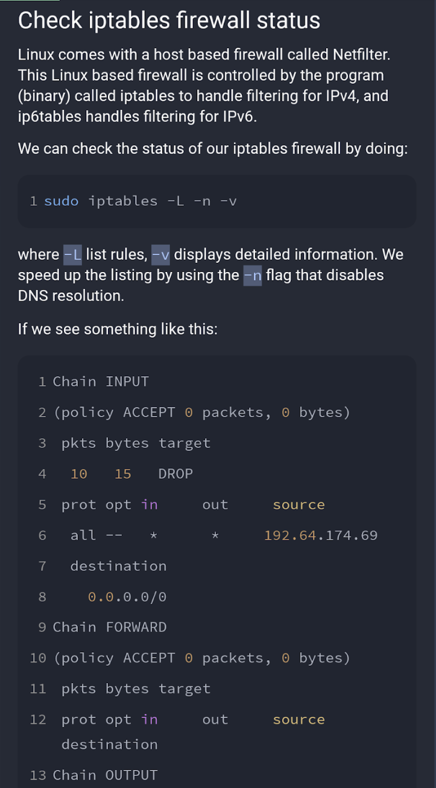

Note – order is important in firewall rules. The first and only the
first matching rule will be applied to the incoming/outgoing packet(s).

######## \[Debian\] Keeping changes persistent between boots.

**Sudo apt install iptables-persistent**

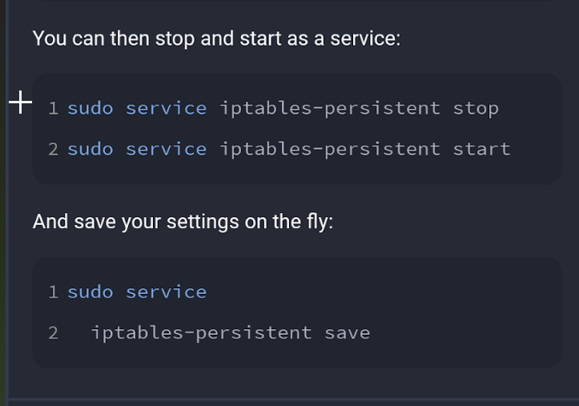

######## How to insert/edit/remove rules

The general format of iptables is

iptables \<action_flag\> \<chain\> \<rule_details…\>…

**<u>Action flags</u>**

-A: Append to chain (at end)

-I: Insert into chain (at beginning)

-D: Delete from chain

-R: Replace rule in chain

**<u>Chains:</u>**

INPUT: inbound

OUTPUT: outbound

FORWARD: to pass along

**<u>Examples:</u>**

iptables -L --line-numbers to see rules with nums

iptables -A INPUT: Append to input chain

iptables -I INPUT: Insert into output chain

iptables -R INPUT 12 : Replace rule \#12 in input chain

iptables -D OUTPUT 2: Delete rule \#2 from output chain

######## Accept (allow)

^ ‘I’ “insert” can be replaced with ‘A’ for “append” – this is important
a first matching rules are applied and nothing else below overrides a
match against a packet.

sudo iptables -A INPUT -p tcp –dport 22 -m conntrack –ctstate NEW,
ESTABLISHED -j ACCEPT

######## Dropping (blocking)

**Block by tcp and port**

iptables -A INPUT -s 192.168.34.23 -p tcp –destination-port 22 -j DROP

######## Logging dropped connections

**<u>Step1: Create new chain</u>**

This is a custom chain so you can name it anything:

sudo Iptables -N LOGGING

**<u>Step2: Add rules to INPUT/OUTPUT (optional – recommended</u>**

**<u>)</u>**

Next, you can add a rule at the end of each OUTPUT/INPUT chain so that
any traffic that hasn’t matched any rule yet will be logged:

sudo iptables -A INPUT -j LOGDROP

sudo iptables -A OUTPUT -j LOGDROP

Traffic gets sent to log chain once there’s no match (and later get
dropped).

**<u>Step3: Configure Logging</u>**

Could also add –-log-level 4 which will only log up to warning level
events (1-3 are for errors so 4 will include errors and warnings.
Setting a higher number will log more data – useful for
troubleshooting).

**<u>Step4: Drop anything that made it to log chain after its
logged</u>**

Logs are saved in /var/log/messages by default.

**<u>Step 5: Save config</u>**

sudo netfilter-persistent save

######## Common commands + Good practice rules

**First, add rule to drop all invalid packets**

sudo iptables -A OUTPUT -m state –state INVALID -j DROP

sudo iptables -A INPUT -m state –state INVALID -j DROP

**Add rules to keep existing/established connections (and loopback)**

sudo iptables -A INPUT -m state –state RELATED,ESTABLISHED -j ACCEPT

sudo iptables -A OUTPUT -m state –state RELATED,ESTABLISHED -j ACCEPT

sudo iptables -A OUTPUT -I lo -j ACCEPT

**Allow SSH connections**

sudo iptables -A INPUT -p tcp –dport 22 -m conntrack -–ctstate NEW -j
ACCEPT

Add -s 192.168.1.25 for example, to only allow from a specific ip/range

**Delete all rules in a given chain**

sudo iptables -F INPUT

*^ remove all rules in INPUT chain*

**Once basic rules are defined, add rule to default to dropping
connections that don’t meet our rules**

sudo iptables -P INPUT DROP

sudo iptables -P FORWARD DROP

sudo iptables -P OUTPUT DROP

The above does prohibit pings (which me might want), to sort this allow
for icmp traffic.

sudo iptables -A INPUT -p icmp -j ACCEPT

sudo iptables -A OUTPUT -p icmp -j ACCEPT

**Open a specific port (incoming)**

sudo iptables -A INPUT -p tcp –dport 22 -m conntrack -–ctstate NEW -j
ACCEPT

**Allowing for outgoing HTTP+HTTPS traffic**

iptables -A OUTPUT -p tcp –dport 80 -m conntrack -–ctstate
NEW,ESTABLISHED -j ACCEPT

iptables -A OUTPUT -p tcp –dport 443 -m conntrack -–ctstate
NEW,ESTABLISHED -j ACCEPT

**Allow/Deny connection by IP**

sudo iptables -A INPUT -s 206.189.69.35 DROP

sudo iptables -A OUTPUT -s 206.189.69.35 DROP

ss

######## Clearing Rules

######## Rejecting (drop and send err reply)

####### ipset

Allows you to groups sets of specific IP addresses.

####### nftables (newer version of ip tables – aimed to replace iptables) “Netfilter”

Uses the **nft** command. ** **

There exists an translator called **iptables-translate**.

####### UFW (Uncomplicated Firewall)

A tool used to simpifly firewall configuration and provide simpler ip
tables.

UFW is just a frontend for iptables to make it easier to manage. If you
create your rules with ufw, you'll see them when you run

iptables -L -n -v

iptables gives you more flexibility, but it's also slightly more
complicated to configure - so use whichever one you're most happy with.
If you use iptables, remember that it only affects IPv4 - you need to
also use ip6tables if your server has IPv6.

2-step process to allow connections:

**Open up port on active session:**

**Keep port open on bootup:**

<https://linuxconfig.org/how-to-install-and-use-ufw-firewall-on-linux>

<https://linuxhint.com/ufw-firewall-allow-ssh/>

**Verbose status output**

**Allow/deny by ip**

######## Overview

######## Cheat Sheet

*Taken from*:
<https://www.digitalocean.com/community/tutorials/ufw-essentials-common-firewall-rules-and-commands>

^ above says “access to any port from port 22”

######## Installation

Note: Pre-installed on some linux distros like Ubuntu.

######## Usage

**Checking status**

**Enable UFW**

**Clear all rules**

**Add a “deny” rule**

**Add an “allow” rule**

*^ Above you can do by application name or port number.*

UFW needs to be enabled in order to use first.

Make sure to keep ssh enabled if you are connecting remotely!

sudo ufw allow ssh

Enabling mysql connections (default port)

sudo ufw alloq mysql

**Deleting a rule**

####### Firewalld (Cetnt os 7+)

Command is called “firewall-cmd”.

View zones

> 

Default zone

######## Overview/Usage

##### Web Application Firewall (WAF)

Notes taken from:

<https://www.cloudflare.com/learning/ddos/glossary/web-application-firewall-waf/>

**A WAF is a server on network specializing in protecting against
XSS/SQL injection attacks.**

A WAF or web
application [firewall](https://www.cloudflare.com/learning/security/what-is-a-firewall/) helps
protect web applications by filtering and
monitoring [HTTP](https://www.cloudflare.com/learning/ddos/glossary/hypertext-transfer-protocol-http/) traffic
between a web application and the Internet. It typically protects web
applications from attacks such as [cross-site
forgery](https://www.cloudflare.com/learning/security/threats/cross-site-request-forgery/), [cross-site-scripting
(XSS)](https://www.cloudflare.com/learning/security/threats/cross-site-scripting/),
file inclusion, and [SQL
injection](https://www.cloudflare.com/learning/security/threats/sql-injection/),
among others. A WAF is a protocol [layer
7](https://www.cloudflare.com/learning/ddos/what-is-layer-7/) defense
(in the [OSI
model](https://www.cloudflare.com/learning/ddos/glossary/open-systems-interconnection-model-osi/)),
and is not designed to defend against all types of attacks. This method
of attack mitigation is usually part of a suite of tools which together
create a holistic defense against a range of attack vectors.

By deploying a WAF in front of a web application, a shield is placed
between the web application and the Internet. While a proxy server
protects a client machine’s identity by using an intermediary, a WAF is
a type
of [reverse-proxy](https://www.cloudflare.com/learning/cdn/glossary/reverse-proxy/),
protecting the server from exposure by having clients pass through the
WAF before reaching the server.

A WAF operates through a set of rules often called policies. These
policies aim to protect against vulnerabilities in the application by
filtering out malicious traffic. The value of a WAF comes in part from
the speed and ease with which policy modification can be implemented,
allowing for faster response to varying attack vectors; during a [DDoS
attack](https://www.cloudflare.com/learning/ddos/what-is-a-ddos-attack),
rate limiting can be quickly implemented by modifying WAF policies.

A WAF can be implemented one of three different ways, each with its own
benefits and shortcomings:

- **A network-based WAF** is generally hardware-based. Since they are
  installed locally they minimize latency, but network-based WAFs are
  the most expensive option and also require the storage and maintenance
  of physical equipment.

- **A host-based WAF** may be fully integrated into an application’s
  software. This solution is less expensive than a network-based WAF and
  offers more customizability. The downside of a host-based WAF is the
  consumption of local server resources, implementation complexity, and
  maintenance costs. These components typically require engineering
  time, and may be costly.

- **[Cloud](https://www.cloudflare.com/learning/cloud/what-is-the-cloud/)-based
  WAFs** offer an affordable option that is very easy to implement; they
  usually offer a turnkey installation that is as simple as a change
  in [DNS](https://www.cloudflare.com/learning/ddos/glossary/domain-name-system-dns/) to
  redirect traffic. Cloud-based WAFs also have a minimal upfront cost,
  as users pay monthly or annually for security as a service.
  Cloud-based WAFs can also offer a solution that is [consistently
  updated to protect against the newest
  threats](https://developers.cloudflare.com/waf/managed-rulesets) without
  any additional work or cost on the user’s end. The drawback of a
  cloud-based WAF is that users hand over the responsibility to a third
  party, therefore some features of the WAF may be a black box to them.
  (A cloud-based WAF is one type of cloud firewall; [learn more about
  cloud
  firewalls](https://www.cloudflare.com/learning/cloud/what-is-a-cloud-firewall/).)

Learn about Cloudfl

#### Firewall Filters: IDS and IPS Systems

In this video, you will learn to describe intrusion detection systems,
IDS, and how they are used to detect vulnerability exploits on a
network.

Describe intrusion prevention systems, IPS, and how they are used to
actively protect against vulnerability exploits on a network. \>\>

##### Four ways IDS and IPS systems detect threats

<u>IDS and IPS systems commonly use one of four ways to detect
threats</u>.

1.  **Signature-Based** **detection**. IDS and IPS systems both
    **maintain a database of signatures** that are used for signature
    based detection. <u>These signatures describe common patterns of
    network traffic</u> that may indicate the traffic contains some
    malware which warrants raising an alert.

2.  **Anomaly based detection** is another way to detect a threat in the
    network. Each network protocol goes about its work in a
    characteristic way. If we find traffic that does not follow the
    standards of its protocol, this may indicate a threat is present and
    an alert is raised. For example, if there are a lot of half open TCP
    sessions or HTTP traffic that's not arriving with the right header
    or arrives with an unexpectedly long header.

3.  **Policy-Based-detection.** This approach requires administrators to
    configure security policies according to organizational security
    policies and the network infrastructure. When an activity occurs
    that violates a security policy, an alert is triggered and sent to
    the system administrators.

###### Signature-based analysis

**Signature analysis**, or signature-based analysis, is a detection
method that is used to find events of interest. A **signature** is a
pattern that is associated with malicious activity. Signatures can
contain specific patterns like a sequence of binary numbers, bytes, or
even specific data like an IP address. 

Previously, you explored the Pyramid of Pain, which is a concept that
prioritizes the different types of **indicators of compromise** (IoCs)
associated with an attack or threat, such as IP addresses, tools,
tactics, techniques, and more. IoCs and other indicators of attack can
be useful for creating targeted signatures to detect and block attacks.

Different types of signatures can be used depending on which type of
threat or attack you want to detect. For example, an anti-malware
signature contains patterns associated with malware. This can include
malicious scripts that are used by the malware. IDS tools will monitor
an environment for events that match the patterns defined in this
malware signature. If an event matches the signature, the event gets
logged and an alert is generated. 

**<u>Advantages</u>**

- **Low rate of false positives:** Signature-based analysis is very
  efficient at detecting known threats because it is simply comparing
  activity to signatures. This leads to fewer false positives. Remember
  that a **false positive** is an alert that incorrectly detects the
  presence of a threat.

**<u>Disadvantages</u>**

- **Signatures can be evaded:** Signatures are unique, and attackers can
  modify their attack behaviors to bypass the signatures. For example,
  attackers can make slight modifications to malware code to alter its
  signature and avoid detection.

- **Signatures require updates:** Signature-based analysis relies on a
  database of signatures to detect threats. Each time a new exploit or
  attack is discovered, new signatures must be created and added to the
  signature database.

- **Inability to detect unknown threats:** Signature-based analysis
  relies on detecting known threats through signatures. Unknown threats
  can't be detected, such as new malware families or **zero-day**
  attacks, which are exploits that were previously unknown.

###### Anomaly-based analysis

**Anomaly-based analysis** is a detection method that identifies
abnormal behavior. There are two phases to anomaly-based analysis: a
training phase and a detection phase. In the training phase, a baseline
of normal or expected behavior must be established. Baselines are
developed by collecting data that corresponds to normal system behavior.
In the detection phase, the current system activity is compared against
this baseline. Activity that happens outside of the baseline gets
logged, and an alert is generated. 

**<u>Advantages</u>**

- **Ability to detect new and evolving threats:** Unlike signature-based
  analysis, which uses known patterns to detect threats, anomaly-based
  analysis *can* detect unknown threats.

**<u>Disadvantages</u>**

- **High rate of false positives:** Any behavior that deviates from the
  baseline can be flagged as abnormal, including non-malicious
  behaviors. This leads to a high rate of false positives.

- **Pre-existing compromise:** The existence of an attacker during the
  training phase will include malicious behavior in the baseline. This
  can lead to missing a pre-existing attacker.

##### Intrusion Detection System (IDS)

An **intrusion detection system** (IDS) is an application that monitors
system activity and alerts on possible intrusions. An IDS alerts
administrators based on the signature of malicious traffic.

The IDS is configured to detect known attacks. IDS systems often sniff
data packets as they move across the network and analyze them for the
characteristics of known attacks. Some IDS systems review not only for
signatures of known attacks, but also for anomalies that could be the
sign of malicious activity. When the IDS discovers an anomaly, it sends
an alert to the network administrator who can then investigate further.

The limitations to IDS systems are that they can only scan for known
attacks or obvious anomalies. New and sophisticated attacks might not be
caught. The other limitation is that the IDS doesn’t actually stop the
incoming traffic if it detects something awry. It’s up to the network
administrator to catch the malicious activity before it does anything
damaging to the network. 

When combined with a firewall, an IDS adds another layer of defense. The
IDS is placed behind the firewall and before entering the LAN, which
allows the IDS to analyze data streams after network traffic that is
disallowed by the firewall has been filtered out. This is done to reduce
noise in IDS alerts, also referred to as false positives.

This is a symbolic representation of a Juniper brand firewall. Many
modern firewalls and network devices have a control plane and a
forwarding plane similar to this. The forwarding plane is in charge of
forwarding all traffic and making all the routing decisions, the policy
evaluations, the session matching, and so forth. This is done in a
manner that does not interrupt the control plane, which is in charge of
running the operating system which controls the device and the routing
table. If something happens to the control plane, the device will still
forward traffic since the forwarding plane will still be running.

Let's talk a little about **IDS, or intrusion detection systems**. An
IDS is a network security technology that is designed to detect
vulnerabilities and exploits against targeted servers, applications, or
a computer within our organization. By default, IDS just listens to
traffic. It doesn't take any action.

In most cases, an IDS is a dedicated server that's connected to a port
on a switch. The switch forwards a copy of all traffic flowing through
it to its IDS. The IDS monitors the traffic looking for anomalous
behavior, and when found, sends an alert to the administrator. While an
IDS won't take any action by default, modern IDSs can be configured to
run scripts that can send a command to the router to block an IP address
if an anomaly is detected. But normally, an IDS will just send an alert
to an administrator to let the administrator know that something
anomalous is happening in our network. And then it's up to the
administrator to initiate any required action.

###### IDS: Network-based vs Host-based

1.  **HIDS**. There are also ***host based intrusion detection
    systems***, or **HIDS**. These are software based applications
    designed to protect the computer they're installed on against
    attack. The HIDS listens to the traffic being received by and sent
    from the end point, which triggers an alert or actions as
    appropriate.

2.  **NIDS**. A ***network-based IDS*** listens to a copy of network
    traffic from a port mirror configured to the core switch, while a
    ***network-based IPS*** sits in the middle of the stream of traffic,
    both trying to find anomalies in the data stream. The main
    difference between a host-based and a network-based system is that
    the host-based system is a piece of software installed on an
    endpoint machine. While the network-based system is a piece of
    hardware that listens to all traffic that is sent to it or flows
    through it.

We covered Packet Capture and Analysis, which is related to our next
topic, Intrusion Detection and Prevention Systems or IDS/IPS. IDS or IPS
systems operate by monitoring network traffic and analyzing it. As an IT
support specialist, you may need to support the underlying platform that
the IDS/IPS runs on. You might also need to maintain the system itself,
ensuring that rules are updated, and you may even need to respond to
alerts. So, what exactly do IDS and IPS systems do? They look for
matching behavior or characteristics that would indicate malicious
traffic. The difference between an IDS and an IPS system, is that IDS is
only a detection system. It won't take action to block or prevent an
attack, when one is detected, it will only log an alert. But an IPS
system can adjust firewall rules on the fly, to block or drop the
malicious traffic when it's detected. IDS and IPS system can either be
host based or network based. In the case of a Network Intrusion
Detection System or NIDS, the detection system would be deployed
somewhere on a network, where it can monitor traffic for a network
segment or sub net. A host based intrusion detection system would be a
software deployed on the host that monitors traffic to and from that
host only. It may also monitor system files for unauthorized changes.
NIDS systems resemble firewalls in a lot of ways. But a firewall is
designed to prevent intrusions by blocking potentially malicious traffic
coming from outside, and enforce ACLs between networks. NIDS systems are
meant to detect and alert on potential malicious activity coming from
within the network. Plus, firewalls only have visibility of traffic
flowing between networks they've set up to protect. They generally
wouldn't have visibility of traffic between hosts inside the network.
So, the location of the NIDS must be considered carefully when you
deploy a system. It needs to be located in the network topology, in a
way that it has access to the traffic we'd like to monitor.

A good way that you can get access to network traffic is using the port
mirroring functionality found in many enterprise switches. This allows
all packets on a port, port range, or entire VLAN to be mirrored to
another port, where NIDS host would be connected. With this
configuration, our NIDS machine would be able to see all packets flowing
in and out of hosts on the switch segment. This lets us monitor host to
host communications, and traffic from hosts to external networks, like
the internet. The NIDS hosts would analyzed this traffic by enabling
promiscuous mode on the analysis port. This is the network interface
that's connected to the mirror port on our switch, so it can see all
packets being passed, and perform an analysis on the traffic. Since this
interface is used for receiving mirrored packets from the network we'd
like to monitor, a NIDS host must have at least two network interfaces.
One is for monitoring an analysis, and a separate one is for connecting
to our network for management and administrative purposes. Some popular
NID or NIP systems are Snort, Suricata, and Bro NIDS, which you can read
about more in the supplementary readings. Placement of a NIP system or
Network Intrusion Prevention system, would differ from a NIDS system.
This is because of a prevention system being able to take action against
a suspected malicious traffic. In order for a NIPS device to block or
drop traffic from a detected threat, it must be placed in line with the
traffic being monitored. This means, that the traffic that's being
monitored must pass through the NIPS device. If it wasn't the case, the
NIPS host wouldn't be able to take action on suspected traffic. Think of
it this way, a NIDS device is a passive observer that only watches the
traffic, and sends an alert if it sees something. This is unlike a NIPS
device, which not only monitors traffic, but can take action on the
traffic it's monitoring, usually by blocking or dropping the traffic.
The detection of threats or malicious traffic is usually handled through
signature based detection, similar to how antivirus software detects
malware. As an IT Support Specialist, you might be in charge of
maintaining the IDS or IPS setup, which would include ensuring that
rules and signatures are up to date. Signatures are unique
characteristics of known malicious traffic. They might be specific
sequences of packets, or packets with certain values encoded in the
specific header field. This allows Intrusion Detection and Prevention
Systems from easily and quickly recognizing known bad traffic from
sources like botnets, worms, and other common attack vectors on the
internet. But similar to antivirus, less common are targeted attacks
might not be detected by a signature based system, since they're might
not be signatures developed for these cases. So, it's also possible to
create custom rules to match traffic that might be considered
suspicious, but not necessarily malicious. This would allow
investigators to look into the traffic in more detail to determine the
badness level. If the traffic is found to be malicious, a signature can
be developed from the traffic, and incorporate it into the system. What
actually happens when a NIDS system detects something malicious? This is
configurable, but usually the NIDS system would log the detection event
along with a full packet capture of the malicious traffic. An alert
would also usually be triggered to notify the investigating team to look
into that detected traffic. Depending on the severity of the event, the
alert may just email a group, or create a ticket to follow up on, or it
might page someone in the middle of the night if it's determined to be a
really high severity and urgent. These alerts would usually also include
reference information linking to a known vulnerability, or some more
information about the nature of the alert to help the investigator look
into the event. Well, we covered a lot of ground on securing your
networks. I hope you feel secure enough to move on. If not, you can
review any of these concepts that we've talked about. Once you've done
that, it's time for a peer review assessment, to give you some hands on
experience with packet sniffing analysis. When you're finished, I'll see
you in the next video, where we'll cover defense in depth.

##### Intrusion Prevention System (IPS)

An **intrusion prevention system (IPS)** is an application that monitors
system activity for intrusive activity and takes action to stop the
activity. It offers even more protection than an IDS because it actively
stops anomalies when they are detected, unlike the IDS that simply
reports the anomaly to a network administrator.

An IPS searches for signatures of known attacks and data anomalies. An
IPS reports the anomaly to security analysts and blocks a specific
sender or drops network packets that seem suspect. 

The IPS (like an IDS) sits behind the firewall in the network
architecture. This offers a high level of security because risky data
streams are disrupted before they even reach sensitive parts of the
network. However, one potential limitation is that it is inline: If it
breaks, the connection between the private network and the internet
breaks. Another limitation of IPS is the possibility of false positives,
which can result in legitimate traffic getting dropped.

Now let's move on to **intrusion prevention systems, or IPS** for short.
<u>The primary difference between an IDS and an IPS is that an IPS is
designed to take action on its own when an anomaly or an offense is
detected in the network</u>. Another difference is that the <u>IPS does
not just listen to a copy of the network traffic, but all traffic must
pass through it before it's allowed to move on.</u> One disadvantage is
that it adds a delay to the flow of network traffic. An IPS is usually
positioned right after a router, edge device, or firewall, and some
firewalls are designed to also function as an IPS. Unlike intrusion
detection systems, an IPS is not a passive listener. It's going to be an
active listener and it can take action if an anomaly is found in our
network.

##### EDR

**Endpoint detection and response** (**EDR**) is an application that
monitors an endpoint for malicious activity. EDR tools are installed on
endpoints. Remember that an **endpoint** is any device connected on a
network. Examples include end-user devices, like computers, phones,
tablets, and more.

EDR tools monitor, record, and analyze endpoint system activity to
identify, alert, and respond to suspicious activity. Unlike IDS or IPS
tools, EDRs collect endpoint activity data and perform *behavioral
analysis* to identify threat patterns happening on an endpoint.
Behavioral analysis uses the power of machine learning and artificial
intelligence to analyze system behavior to identify malicious or unusual
activity. EDR tools also use *automation* to stop attacks without the
manual intervention of security professionals. For example, if an EDR
detects an unusual process starting up on a user’s workstation that
normally is not used, it can automatically block the process from
running.

Tools like Open EDR®, Bitdefender™ Endpoint Detection and Response, and
FortiEDR™ are examples of EDR tools.

**Note**: Security information and event management (SIEM) tools also
have detection capabilities, which you'll explore later.

##### IDS vs IPS

**The placement of the device in the network.**

The IPS is going to be directly in-line in the middle of the stream of
network traffic. The IPS will be tapping our communication, while the
IDS is outside the direct line of communication. Meaning it's offline or
it just receives a copy of all traffic sent to the interface. The <u>IDS
is listening in what's called promiscuous</u> mode and analyzing the
traffic. Most of the time, this won't cause any delay in network
traffic. An IPS, on the other hand, is an active system type. Meaning it
is usually configured to actively monitor network traffic and to
automatically defend the network if a threat is found. For example,
automatically creating an ACL, or access control list, to block traffic
that's been identified as malicious. <u>In passive mode, an IPS acts
more like an IDS</u>. If a threat is found, it will notify the
administrator, and it will then be up to the administrator to take
action. An IDS won't normally take any action other than notifying the
administrator of a threat. An IDS might have a Web interface where the
administrator can see what has been found. IDS and IPS systems both use
the same detection mechanisms. They both can use signatures to detect
malicious traffic where signatures are basically patterns that can be
found in the payload of traffic. Both types of system can also use
anomaly-based detection. They will detect if protocol standards are not
being followed, indicating a threat. Or in the case of signature
detection, that someone is trying to exploit a vulnerability in the
network.

##### IDS vs IPS vs EDR

##### IPS/IDS Tools

- Snort

- Zeek

- Kismet

- Sagan

- Suricata

###### **<u>Suricata (NIDS+SIEM)</u>**

Suricata is an open-source network analysis and threat detection
software.  Network analysis and threat detection software is used to
inspect network traffic to identify suspicious behavior and generate
network data logs. The detection software finds activity across users,
computers, or Internet Protocol (IP) addresses to help uncover potential
threats, risks, or vulnerabilities. 

Suricata was developed by the Open Information Security Foundation
(OISF). OISF is dedicated to maintaining open-source use of the Suricata
project to ensure it’s free and publicly available. Suricata is widely
used in the public and private sector, and it integrates with many SIEM
tools and other security tools.

####### Examining logs

Now let's examine some logs generated by Suricata. In Suricata, alerts
and events are output in a format known as EVE JSON. EVE stands for
Extensible Event Format and JSON stands for JavaScript Object Notation.

As you previously learned, JSON uses key-value pairs, which simplifies
both searching and extracting text from log files.

**<u>Suricata generates two types of log data: alert logs and network
telemetry logs</u>**.

- <u>Alert logs</u> contain information that's relevant to security
  investigations. Usually this is the output of signatures which have
  triggered an alert. For example, a signature that detects suspicious
  traffic across the network generates an alert log that captures
  details of that traffic.

- While <u>network telemetry logs</u> contain information about network
  traffic flows, network telemetry is not always security relevant, it's
  simply recording what's happening on a network, such as a connection
  being made to a specific port.

Both of these log types provide information to build a story during an
investigation.

Let's examine an example of both log types.

Here's an example of an event log. We can tell that this event is an
alert because the event type field says alert. There's also details
about the activity that was logged including IP addresses and the
protocol. There are also details about the signature itself, such as the
message and id. From the signature's message, it appears that this alert
relates to the detection of malware.

Next up, we have an example of a network telemetry log, which shows us
the details of an http request to a website. The event type field tells
us it's an http log. There's details about the request. Under hostname,
there's the website that was accessed. The user agent is the name of
software that connects you to the website. In this case, it's the web
browser Mozilla 5.0. And the content type, which is the data the http
request returned. Here it's specified as HTML text.

####### Overview of Suricata

So far, you've learned about detection signatures and you were
introduced to Suricata, an incident detection system (IDS).

In this reading, you’ll explore more about Suricata. You'll also learn
about the value of writing customized signatures and configuration. This
is an important skill to build in your cybersecurity career because you
might be tasked with deploying and maintaining IDS tools.

####### Introduction to Suricata

[**<u>Suricata</u>**](https://suricata.io/) is an open-source intrusion
detection system, intrusion prevention system, and network analysis
tool.

**<u>Suricata features</u>**

There are three main ways Suricata can be used:

- **Intrusion detection system** (**IDS**): As a network-based IDS,
  Suricata can monitor network traffic and alert on suspicious
  activities and intrusions. Suricata can also be set up as a host-based
  IDS to monitor the system and network activities of a single host like
  a computer.

- **Intrusion prevention system** (**IPS**): Suricata can also function
  as an intrusion prevention system (IPS) to detect and block malicious
  activity and traffic. Running Suricata in IPS mode requires additional
  configuration such as enabling IPS mode.

- **Network security monitoring** (**NSM**): In this mode, Suricata
  helps keep networks safe by producing and saving relevant network
  logs. Suricata can analyze live network traffic, existing packet
  capture files, and create and save full or conditional packet
  captures. This can be useful for forensics, incident response, and for
  testing signatures. For example, you can trigger an alert and capture
  the live network traffic to generate traffic logs, which you can then
  analyze to refine detection signatures.

####### Rules 

Rules or signatures are used to identify specific patterns, behavior,
and conditions of network traffic that might indicate malicious
activity. The terms rule and signature are often used interchangeably in
Suricata. Security analysts use **signatures**, or patterns associated
with malicious activity, to detect and alert on specific malicious
activity. Rules can also be used to provide additional context and
visibility into systems and networks, helping to identify potential
security threats or vulnerabilities. 

Suricata uses **signatures analysis**, which is a detection method used
to find events of interest. Signatures consist of three components:

- **Action**: The first component of a signature. It describes the
  action to take if network or system activity matches the signature.
  Examples include: alert, pass, drop, or reject.

- **Header**: The header includes network traffic information like
  source and destination IP addresses, source and destination ports,
  protocol, and traffic direction.

- **Rule options:** The rule options provide you with different options
  to customize signatures.

Here's an example of a Suricata signature:

Rule options have a specific ordering and changing their order would
change the meaning of the rule.

**Note**: The terms rule and signature are synonymous.

**Note:** Rule order refers to the order in which rules are evaluated by
Suricata. Rules are processed in the order in which they are defined in
the configuration file. However, Suricata processes rules in a different
default order: pass, drop, reject, and alert. Rule order affects the
final verdict of a packet especially when conflicting actions such as a
drop rule and an alert rule both match on the same packet.

####### Custom rules

Although Suricata comes with pre-written rules, it is highly recommended
that you modify or customize the existing rules to meet your specific
security requirements.

There is no one-size-fits-all approach to creating and modifying rules.
This is because each organization's IT infrastructure differs. Security
teams must extensively test and modify detection signatures according to
their needs.

Creating custom rules helps to tailor detection and monitoring. Custom
rules help to minimize the amount of false positive alerts that security
teams receive. It's important to develop the ability to write effective
and customized signatures so that you can fully leverage the power of
detection technologies.

####### Configuration file

Before detection tools are deployed and can begin monitoring systems and
networks, you must properly configure their settings so that they know
what to do. A **configuration file** is a file used to configure the
settings of an application. Configuration files let you customize
exactly how you want your IDS to interact with the rest of your
environment. 

Suricata's configuration file is **suricata.yaml**, which uses the YAML
file format for syntax and structure.

####### Log files

There are two log files that Suricata generates when alerts are
triggered:

- **eve.json**: The eve.json file is the standard Suricata log file.
  This file contains detailed information and metadata about the events
  and alerts generated by Suricata stored in JSON format. For example,
  events in this file contain a unique identifier called flow_id  which
  is used to correlate related logs or alerts to a single network flow,
  making it easier to analyze network traffic. The eve.json file is used
  for more detailed analysis and is considered to be a better file
  format for log parsing and SIEM log ingestion.

- **fast.log**: The fast.log file is used to record minimal alert
  information including basic IP address and port details about the
  network traffic. The fast.log file is used for basic logging and
  alerting and is considered a legacy file format and is not suitable
  for incident response or threat hunting tasks.

The main difference between the eve.json file and the fast.log file is
the level of detail that is recorded in each. The fast.log file records
basic information, whereas the eve.json file contains additional verbose
information.

####### Resources for more information

If you would like to learn more about Suricata including rule management
and performance, check out the following resources: 

- [Suricata user
  guide](https://suricata.readthedocs.io/en/latest/index.html) 

- [Suricata features](https://suricata.io/features/) 

- [Rule
  management](https://suricata.readthedocs.io/en/latest/rule-management/suricata-update.html)

- [Rule performance
  analysis](https://suricata.readthedocs.io/en/latest/configuration/suricata-yaml.html#engine-analysis-and-profiling)

- [Suricata threat hunting webinar](https://youtu.be/kaDGolhTu94)

- [Introduction to writing Suricata rules](https://youtu.be/tvoqFBVSShA)

- [Eve.json jq
  examples](https://suricata.readthedocs.io/en/latest/output/eve/eve-json-examplesjq.html)

#### Securing network access

- **<u>Disabling IPv6</u>**

  - in devices

  - in router

- **<u>Device Filtering</u>**

  - IP Filtering

    - Configure static ip addresses

    - Configure DHCP limit

  - Mac filtering

    - recommended to build an allow list and specify the devices to have
      access. This should be specified on the same Wireless band you are
      using (5GhZ fir example)

- **<u>network segmentation</u>**

  - deny intranet access from guest networks (if applicable)

  - Network segmentation is **a technique that
    divides a computer network into smaller parts, each acting as its
    own small network, to improve network performance and security**. It
    is also known as network segregation, network partitioning, or
    network isolation.t

#### Securing Network software

Hey, welcome back. In the last lesson, we covered network hardware
hardening security measures. Which you should be aware of as an IT
support specialist. Now, we're going to shift to network software
hardening techniques. Just like with network hardware hardening, it is
important for you to know how to implement network software hardening,
which includes things like firewalls, proxies, and VPNs. These security
software solutions will play an important role in securing networks and
their traffic for your organization.

##### Securing SSH connection

[Click here for bookmarked content.](#_SSH_and_Remote)

##### Syslog/Logging

##### Proxy Service

Proxies come in many other flavors, way too many for us to cover them
all here. But the most important takeaway is that proxies are any server
that act as a intermediary between a client and another server.

- **Proxy server**: A server that fulfills the requests of its clients
  by forwarding them to other servers

- **Forward proxy server**: A server that regulates and restricts a
  person’s access to the internet

- **Reverse proxy server**: A server that regulates and restricts the
  internet's access to an internal server

A form of load balancing like DNS round robin

Proxies can be really useful to protect client devices and their
traffic. They also provide secure remote access without using a VPN. A
standard web proxy can be configured for client devices. This allows web
traffic to be proxied through a proxy server that we control for lots of
purposes. This configuration can be used for logging web requests of
client devices. The devices can be used for logs, and traffic analysis,
and forensic investigation. The proxy server can be configured to block
content that might be malicious, dangerous, or just against company
policy.

A **reverse proxy** can be configured to allow secure remote access to
web based services without requiring a VPN. Now, as an IT. support
specialist, you may need to configure or maintain a reverse proxy
service as an alternative to VPN. By configuring a reverse proxy at the
edge of your network, connection requests to services inside the network
coming from outside, are intercepted by the reverse proxy. They are then
forwarded on to the internal service with the reverse proxy acting as a
relay. This bridges communications between the remote client outside the
network and the internal service. This proxy setup can be secured even
more by requiring the use of client TLS certificates, along with
username and password authentication. Specific ACLs can also be
configured on the reverse proxy to restrict access even more. Lots of
popular proxy solutions support a reverse proxy configuration like
HAProxy, Nginx, and even the Apache Web Server. You can read more about
these popular proxy solutions in the supplemental readings. Next up,
let's take a practice quiz to secure the network architecture terms
we've just discussed.

***Comparing proxy vs reverse proxy***

Note: VPNs, Proxies, and SSH all fight against man-in-the-middle
attacks.

##### VPN (transport layer)

**Is a tunneling protocol.**

VPNs are commonly used to provide secure remote access, and link two
networks securely. Let's say we have two offices located in buildings
that are on opposite sides of town. We want to create one unified
network that would let users in each location, seamlessly connect to
devices and services in either location. We could use a site to site VPN
to link these two offices. To the people in the offices, everything
would just work. They'd be able to connect to a service hosted in the
other office without any specific configuration. Using a VPN tunnel, all
traffic between the two offices can be secured using encryption. This
lets the two remote networks join each other seamlessly. This way,
clients on one network can access devices on the other without requiring
them to individually connect to a VPN service. Usually, the same
infrastructure can be used to allow remote access VPN services for
individual clients that require access to internal resources while out
of the office.

Most VPNs work by using the payload section of the transport layer to
carry an encrypted payload that actually contains an entire second set
of packets. The network, the transport and the application layers of a
packet intended to traverse the remote network.

Basically, this payload is carried to the VPNs end point where all the
other layers are stripped away and discarded. Then the payload is
unencrypted, leaving the VPN server with the top three layers of a new
packet. This gets encapsulated with the proper data link layer
information and sent out across the network. This process is completed
in the inverse, in the opposite direction.

*Lecture…*

Let's talk about securing network traffic. As we've seen, encryption is
used for protecting data both from the privacy perspective and the data
integrity perspective. A natural application of this technology is to
protect data in transit, but what if our application doesn't utilize
encryption? Or what if we want to provide remote access to internal
resources too sensitive to expose directly to the Internet? We use a
VPN, or Virtual Private Network solution. A VPN is a mechanism that
allows you to remotely connect a host or network to an internal private
network, passing the data over a public channel, like the Internet. You
can think of this as a sort of **encrypted tunnel** where all of our
remote system's network traffic would flow, transparently channeling our
packets via the tunnel through the remote private network. A

VPN can also be **point-to-point**, where two gateways are connected via
a VPN. Essentially bridging two private networks through an encrypted
tunnel. There are a bunch of VPN solutions using different approaches
and protocols with differing benefits and tradeoffs. Let's go over some
of the more popular ones.

**IPsec**, or **Internet Protocol Security**, is a VPN protocol that was
designed in conjunction with IPv6. It was originally required to be
standards compliant with IPv6 implementations, but was eventually
dropped as a requirement. It is optional for use with IPv6. IPsec works
by encrypting an IP packet and encapsulating the encrypted packet inside
an IPsec packet. This encrypted packet then gets routed to the VPN
endpoint where the packet is de-encapsulated and decrypted then sent to
the final destination.

IPsec supports two modes of operations, **transport mode and tunnel**
mode. When ***transport mode*** is used, only the payload of the IP
packet is encrypted, leaving the IP headers untouched. Heads up that
authentication headers are also used. Header values are hashed and
verified, along with the transport and application layers. This would
prevent the use of anything that would modify these values, like NAT or
PAT. In ***tunnel mode***, the entire IP packet, header, payload, and
all, is encrypted and encapsulated inside a new IP packet with new
headers.

While not a VPN solution itself, **L2TP**, or **Layer 2 Tunneling
Protocol**, is typically used to support VPNs. A common implementation
of L2TP is in conjunction with IPsec when data confidentially is needed,
since L2TP doesn't provide encryption itself. It's a simple tunneling
protocol that allows encapsulation of different protocols or traffic
over a network that may not support the type of traffic being sent. L2TP
can also just segregate and manage the traffic. ISPs will use the L2TP
to deliver network access to a customer's endpoint, for example. The
combination of L2TP and IPsec is referred to as L2TP IPsec and was
officially standardized in ietf RFC 3193. The establishment of an L2TP
IPsec connection works by first negotiating an IPsec security
association. Which negotiates the details of the secure connection,
including key exchange, if used. It can also share secrets, public keys,
and a number of other mechanisms. I've included a link to more info
about it in the next reading. Next, secure communication is established
using Encapsulating Security Payload. It's a part of the IPsec suite of
protocols, which encapsulates IP packets, providing confidentiality,
integrity, and authentication of the packets. Once secure encapsulation
has been established, negotiation and establishment of the L2TP tunnel
can proceed. L2TP packets are now encapsulated by IPsec, protecting
information about the private internal network. An important distinction
to make in this setup is the difference between the tunnel and the
secure channel. The tunnel is provided by L2TP, which permits the
passing of unmodified packets from one network to another. The secure
channel, on the other hand, is provided by IPsec, which provides
confidentiality, integrity, and authentication of data being passed.

**SSL TLS** is also used in some VPN implementations to secure network
traffic, as opposed to individual sessions or connections. An example of
this is OpenVPN, which uses the OpenSSL library to handle key exchange
and encryption of data, along with control channels. This also enables
OpenVPN to make use of all the cyphers implemented by the OpenSSL
library. Authentication methods supported are pre-shared secrets,
certificate-based, and username password. Certificate-based
authentication would be the most secure option, but it requires more
support and management overhead since every client must have a
certificate. Username and password authentication can be used in
conjunction with certificate authentication, providing additional layers
of security. It should be called out that OpenVPN doesn't implement
username and password authentication directly. It uses modules to plug
into authentication systems, which we'll cover in the next module.
OpenVPN can operate over either TCP or UDP, typically over port 1194. It
supports pushing network configuration options from the server to a
client and it supports two interfaces for networking. It can either rely
on a Layer 3 IP tunnel or a Layer 2 Ethernet tap. The Ethernet tap is
more flexible, allowing it to carry a wider range of traffic. From the
security perspective, OpenVPN supports up to 256-bit encryption through
the OpenSSL library. It also runs in user space, limiting the
seriousness of potential vulnerabilities that might be present. There
are a lot of acronyms to take in, so take a minute to go over them and
read more about them, and I'll see you in the next video.

###### Installing VPN Client (w/Kali Linux)

<https://www.udemy.com/course/complete-ethical-hacking-bootcamp-zero-to-mastery/learn/lecture/29421154#questions>

###### Point-to-Point VPN

A point-to-point VPN, also called a site-to-site VPN, establishes a VPN
tunnel between two sites. This operates a lot like the way that a
traditional VPN setup lets individual users act as if they are on the
network they're connecting to. It's just that the VPN tunneling logic is
handled by network devices at either side, so that users don't all have
to establish their own connections. Now, it's time for one more quiz to
see how your connections are firing.

###### Misc and using a vpn with open vpn

<https://openvpn.net/what-is-a-vpn/>

Using OpenVPN

1.  Install OpenVPN

2.  Import config file provided by employer

3.  Login with openvpn credentials

    1.  An employer provided config file not only masks your IP, but it
        gives you access to the employers network and all connected
        devices/machines.

<https://www.youtube.com/watch?v=DbBR_U70rTo>

<https://www.youtube.com/watch?v=jMv29ZQ7huQ>

<https://www.youtube.com/watch?v=9LNC393pqyE>

**Sample config file**:
<https://github.com/OpenVPN/openvpn/blob/master/sample/sample-config-files/client.conf>

<https://openvpn.net/community-resources/how-to/>

#### Securing Network Hardware and Architecture

##### DMZ

A demilitarized zone (DMZ) exposes a LAN host to the Internet.

##### DHCP snooping

In an earlier lesson on networking, we explored DHCP. It's the protocol
where devices on a network are assigned critical configuration
information for communicating on the network. You also learned about
configuring DHCP in another course of this program. So, you can see how
DHCP is a target of attackers because of the important nature of the
service it provides. If an attacker can manage to deploy a rogue DHCP
server on your network, they could hand out DHCP leases with whatever
information they want. This includes setting a gateway address or DNS
server, that's actually a machine within their control. This gives them
access to your traffic and opens the door for future attacks. We call
this type of attack a rogue **DHCP server attack**. To protect against
this rogue DHCP server attack, enterprise switches offer a feature
called **DHCP snooping**. <u>A switch that has DHCP snooping will
monitor DHCP traffic being sent across it. It will also track IP
assignments and map them to hosts connected to switch ports</u>. This
basically builds a map of assigned IP addresses to physical switch
ports. This information can also be used to protect against IP spoofing
and ARP poisoning attacks. DHCP snooping also makes you designate either
a trusted DHCP server IP, if it's operating as a DHCP helper, and
forwarding DHCP requests to the server, or you can enable DHCP snooping
trust on the uplinked port, where legitimate DHCP responses would now
come from. Now any DHCP responses coming from either an untrusted IP
address or from a downlinked switch port would be detected as untrusted
and discarded by the switch.

##### Dynamic ARP inspection (DAI) – switch-based ARP-spoof protection

Let's talk about another form of network hardware hardening, Dynamic ARP
inspection. We covered ARP earlier from the how does it function
standpoint. ARP allows for a layer to men-in-the-middle attack because
of the unauthenticated nature of ARP. It allows an attacker to forge an
ARP response, advertising its MAC address as the physical address
matching a victim's IP address. This type of ARP response is called a
**gratuitous ARP response**, since it's effectively answering a query
that no one made. When this happens, all of the clients on the local
network segment would cache this ARP entry. Because of the forged ARP
entry, they send frames intended for the victim's IP address to the
attacker's machine instead. The attacker could enable IP forwarding,
which would let them transparently monitor traffic intended for the
victim. They could also manipulate or modify data. **Dynamic ARP
inspection or DAI** is another feature on enterprise switches that
prevents this type of attack. <u>It requires the use of DHCP snooping to
establish a trusted binding of IP addresses to switch ports</u>. DAI
will detect these forged gratuitous ARP packets and drop them. It does
this because it has a table from DHCP snooping that has the
authoritative IP address assignments per port. DAI also enforces great
limiting of ARP packets per port to prevent ARP scanning. An attacker is
likely to ARP scan before attempting the ARP attack.

##### IP source guard (IPSG)

To prevent IP spoofing attacks, **IP source guard or IPSG** can be
enabled on enterprise switches along with DHCP snooping. If you're an IT
Support Specialist at a small company that uses enterprise-class switch
hardware, you'll probably utilize IPSG. It works by using the DHCP
snooping table to dynamically create ACLs for each switchboard. This
drops packets that don't match the IP address for the port based on the
DHCP snooping table.

##### 802.1X and EAP-TLS

Now, if you really want to lock down your network, you can implement
802.1X. We've added details about how to configure this in the
supplementary reading. But for now, let's discuss this at a high level.
It's important for an IT Support Specialist to be aware of 802.1X. This
is the IEEE standard for encapsulating EAP or Extensible Authentication
Protocol traffic over the 802 networks. This is also called EAP over LAN
or EAPOL, it was originally designed for Ethernet but support was added
for other network types like Wi-Fi and fiber networks. We won't go into
the details of all EAP authentication types supported. There are about
100 compatible types, so it would take way too long. But we'll take a
closer look at **EAP-TLS** since it's one of the more common and secure
EAP methods. When a client wants to authenticate to a network using
802.1X, there are three parties involved. The client device is what we
call the supplicant. It's sometimes also used to refer to the software
running on the client machine that handles the authentication process
for the user. The open source Linux utility wpa_supplicant is one of
those. The supplicant communicates with the authenticator, which acts as
a sort of gatekeeper for the network. It requires clients to
successfully authenticate to the network before they're allowed to
communicate with the network. This is usually an enterprise switch or an
access point in the case of wireless networks. It's important to call
out that while the supplicant communicates with the authenticator, it's
not actually the authenticator that makes the authentication decision.
The authenticator acts like a go between and forwards the authentication
request to the authentication server. That's where the actual credential
verification and authentication occurs. The authentication server is
usually a RADIUS server. <u>**EAP-TLS** is an authentication type
supported by EAP that uses TLS to provide mutual authentication of both
the client and the authenticating server</u>. This is considered one of
the more secure configurations for wireless security, so it's definitely
possible that you'll encounter this authentication type in your IT
career. Like with many of these protocols, understanding how it works
can help you if you need to troubleshoot. You might remember from Course
4 that HTTPS is a combination of the hypertext transfer protocol, HTTP,
with SSL-TLS cryptographic protocols. When TLS is implemented for HTTPS
traffic, it specifies a client's certificate as an optional factor of
authentication. Similarly, most EAP-TLS implementations require
client-side certificates. Authentication can be certificate-based, which
requires a client to present a valid certificate that's signed by the
authenticating CA, or a client can use a certificate in conjunction with
a username, password, and even a second factor of authentication, like a
one-time password. The security of EAP-TLS stems from the inherent
security that the TLS protocol and PKI provide. That also means that the
pitfalls are the same when it comes to properly managing PKI elements.
You have to safeguard private keys appropriately and ensure distribution
of the CA certificate to client devices to allow verification of the
server-side. Even more secure configuration for EAP-TLS would be to bind
the client-side certificates to the client platforms using TPMs. This
would prevent theft of the certificates from client machines. When you
combine this with FDE, even theft of a computer would prevent compromise
of the network. We're covering a lot of complex processes right now, so
feel free to watch this video again so that the material really sinks
in. If you're really interested in implementing these processes yourself
or want to dive into even more details about how it all works, check out
the supplementary readings for this lesson. Keep in mind, as an IT
Support Specialist, you don't need to know every single step-by-step
detail here. Knowing what these processes are and how they work can be
very beneficial while troubleshooting and evaluating infrastructure
security. When you're ready, I'll catch you on the next video.

### Database Security

#### Database and Injection attacks

##### Injection Flaws

##### OS Command Injection

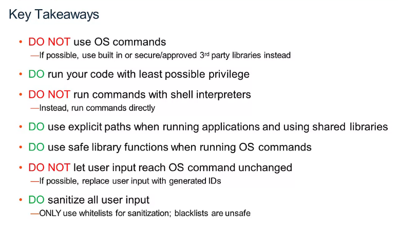

##### SQL Injection

##### SQL Injection in practice

##### Other types of injection

##### Additional Resources

**<u>OWASP Cheat Sheets</u>**

Injection Flaws <https://owasp.org/www-community/Injection_Flaws>

OS Command Injection
<https://owasp.org/www-community/attacks/Command_Injection>

SQL Injection <https://owasp.org/www-community/attacks/SQL_Injection>

LDAP Injection
<https://cheatsheetseries.owasp.org/cheatsheets/LDAP_Injection_Prevention_Cheat_Sheet.html>

**<u>The Database Hacker's Handbook: Defending Database Servers</u>**

You can find it at different retailers such as Amazon.com.

**<u>pentestmonkey</u>**

MSSQL injection cheat
sheet: <http://pentestmonkey.net/cheat-sheet/sql-injection/mssql-sql-injection-cheat-sheet>

Oracle injection cheat
sheet: <http://pentestmonkey.net/cheat-sheet/sql-injection/oracle-sql-injection-cheat-sheet>
 

DB2 injection cheat
sheet: <http://pentestmonkey.net/cheat-sheet/sql-injection/db2-sql-injection-cheat-sheet>
 

Postgres injection cheat
sheet: [http://pentestmonkey.net/cheat-sheet/sql-injection/postgres-sql-injection-cheat-sheet
 ](http://pentestmonkey.net/cheat-sheet/sql-injection/postgres-sql-injection-cheat-sheet)

MySQL injection cheat
sheet: <http://pentestmonkey.net/cheat-sheet/sql-injection/mysql-sql-injection-cheat-sheet>

##### Quiz Questions

#### Data sources

##### Types generally

Every organization whether it's a public or a private entity has many
different types of data sources, such as **distributed databases**<u>,
Microsoft SQL Server, Oracle, MySQL, SQL light</u>, Postgres, the list
goes on and on and on. It's probably the most common database type in
the world.

Also **data warehouses** such as <u>Amazon's redshift or Hadoop's Hive
or TISA or exit data</u>.

**Big Data NoSQL** We will cover those in a bit, but those you might be
familiar with such as <u>Google's BigTable or Hadoop and MongoDB.</u>

**File shares**. So file shares are everything from <u>Amazon S3, Google
Drive, Dropbox, Box.com</u>, even your download folder on your laptop.
That would be a file share, that would be a directory, but we'll cover
those in a bit.

So one thing every organization has in common is they're all using a lot
of data in a variety of combinations of these things. They might be
using all or only a couple of these. Also, organizations have many
different locations oftentimes regardless of it's a public or private
entity, it could be around the city, around the state, around the world.
That's true regardless if it's a retail store, bank, a hospital, even a
public building, even picking all the different locations, Amazon, and
IBM and Google have around the world. One thing in common with all of
these different entities, public and private, is they have a lot of
Infrastructure and the backend that help them do what they do day in and
day out, regardless if it's as simple as providing e-mail for the
organization, providing check clients for the organization, even simply
all the different projects going on in an organization, the project
holders, what they're working on, the way teams integrate together. All
the different backend systems being worked on our commonality in all
organizations that all of that background infrastructure is stored in
data centers. Now, it used to be in the early 2000's people still
thought mainly of security as a perimeter defense, and by perimeter
defense, I really mean firewalls and VPNs and stopping people from ever
getting into your organization. It's been proven time and time again
that that's just not adequate anymore if not in the current day and age
because regardless of people trying to come into your organization,
there's just so many different ways into an organization. You're not
just trying to come through your firewall, they're not just trying to
come through VPN. They're trying to come with your employees
credentials. They're trying to come through your business partners,
through other entities that you've worked with that have access into
your data center. All of those different means of entering your data
center are all potential threat vectors or ways into your organization
that you have to think of and lock. Its essentially a safe with many,
many different windows and doors that each I will need some security
controls around. That's why so much focus has been given in the last 10
years to data security and all of the different bridges that you hear
again and again and again, where all somebody compromising an
organizations data security controls, or simply accessing it because of
lack of controls access to the data.

##### Data sources types in practice

In this video, you will learn to, identify the many data sources present
in a typical organization, identify the type of data commonly contained
in each data source.

Here's just an example of a couple of different things you would see in
typical organizations listers in no way shape or form exhaustive of the
different types of; Applications, Databases, Data Warehouses, Big Data
Environments, Files, Content Managers, Database Tools and Environments.
But this is an example of all the different things that have to do with
data in your organization. All the different avenues for people to
access the data. Typically, an organization, you won't just have
database. The DBAs connect to you. You'll really have applications that
connect to a back end database such as your HR system when people are on
board and off board. Say even as a key PeopleSoft shipping logistics for
your clients and make orders logistics of shipping it around the world
to your clients. Just need time for their deadlines etc. All of that
would be in Databases, Applications and you're really and your entire
workforce is logging into, do their job day in day out. Data Warehouses
are typically used for crunching numbers. They're oftentimes incredibly
vast amounts of data such as Hadoop Hive or Amazon redshift or even the
teaser and Exif Data purpose spill incredibly fast processors to do
nothing but crunch data incredibly efficiently and fast. So exif date is
really for crunching numbers if you want to think of it that way. Big
Data environments oftentimes you'll see an organization. It is a massive
amount of data. A lot of times people don't quite know what's in the
data or what they're going to do with it. So lot of times you'll have
legacy databases that events sunset and shut down. Somebody archive the
information and put it somewhere. They don't quite know what to do with,
so someone decides to throw it in Hadoop. Maybe, we'll start gaining
more information about our customers, our clients, our products, how we
do business, how we can do business better, how we can interact with all
of them better. So all that information just kinda gets thrown into Big
Data and the ideas oftentimes to simply start gaining value out of it.
Later as you start slice looking into it. Cloud Environments simply
different places to host your data versus on-prem being data center that
you have set up control and have complete ownership of Database Tools
simply for ways to interact with databases, oftentimes used by DBAs but
it can be a variety of different things used for Content Manager,
SharePoint, classical, and there's a lot of different types though and
that could really be just about anything. If you're thinking of
Enterprise Content Manager could be a project management tool or
something like that. Basically sending file's certainly files you're
probably more familiar with this than you might think of or realize. So
even your download folder would be File shares. So Linux Unix Windows
all the different files stored inside them would be in all share
unstructured data when you connect to HTTP sites all of those would be
unstructured data or it can be unstructured data. So Data Source Types;
Distribute Databases, Data Warehouses, Big Data, File Shares.
Distributed Database examples are; Oracle, DB2, Microsoft SQL Server,
MySQL, Postgres list goes on and on. Big Data examples; Hadoop, MongoDB,
BigTable. Data Warehouse examples; Netezza, Exadata, Amazon Redshift,
and Apache Hive. Fileshare examples; "NAs" (Network Attached Storage),
Network Fileshare such as; EMC or NetApp, and Cloud Shares such as;
Google drive, dropbox.com, box.com, and Amazon's S3 storage. Thinking of
the different database types, house look at distributed databases and
data warehouses. Both of those are often consider structured data and
we'll get into what that means in a minute. Big Data database examples
are oftentimes semi-structured data. Mostly because oftentimes it's a
lot of different structured data sources that don't have means to look
at all of the different types of data that was thrown into it
holistically, and I'll explain more about that in a minute. Let me go
over structured and semi-structured data, and posture example simply
unstructured data. So think of your download folder, you had reason to
download it but that's really it, it could depend on all the different
projects you're working on work, it could be your kids Project,

Play video starting at :5:40 and follow transcript5:40

working for the first time or something like that. All the different
things you might download but no real structure to it whatsoever other
than that.

#### Securing Databases

##### Securing the Crown Jewels

In this video, you will learn to: describe the data security journey in
terms of discover, harden, monitor and protect, and repeat. Identify
which activities are typically contained in each of these steps. This is
the data security journey that I've been seeing our clients go through
again, around the world. Now, this is a process you see chevrons across
the top discover, harden, monitor checked, repeat. You could really
rewrite these to say, discover repeat, harden repeat, monitor repeat,
protect repeat. Because the reality in IT is, things never stay the
same. There's always a new version of a database, there's always a new
operating system with those come new vulnerabilities, there's always a
new database being set up, database being sunset and an entire
application being sunset in favor of something new that's replacing it,
there's just always change, there's always constant change. So even if
you completed one of the steps, you have to do it again and again to
have an understanding of where your organization was at that one point
in time, but as it's evolving over time. You need to have a clear
understanding of what's going on. I personally think of that three
different phases. I could call this identification to baseline, raising
the bar, as I like to call this phase and then this real-time monitor
protecting is really just applying security controls as appropriate for
the different data sources. So I'll walk you through them, getting them.

1.  **So discovering classification**. It's one of the tenets of
    security that you cannot adequately secure something unless you know
    it exists, and understand clearly what it is. For example, if I
    somehow had a brick a gold, I would probably think of putting that
    in a safe like Fort Knox versus my house keys while certainly
    important, and I want to keep them safe, I might be okay with just
    putting them on my bedside stand. So very different controls for
    different items. Discovery processes is simply discovering all the
    different data sources in your environment, and the classification
    process is understanding not only where those different data sources
    are, but classifying the type of sensitive data in those data
    sources.

    1.  So ***discovery*** is discovering all of the different types of
        data sources in your environment, structured, semi-structured or
        unstructured, etc.

    2.  ***Classification*** is looking into those different data
        sources, and understanding not only where those different data
        sources are, but what types of sensitive data are each of those
        data sources. For example, SOCKS information, PCI information,
        PII information, PHI information, GPR information the list goes
        on and on, all the different types of data, and each of those
        different types of data have different types of controls that
        are used maybe because of different requirements constantly
        being and regulatory compliance needs, and rules and regulations
        that are really changing day to day, which requires specific
        controls for each of those different things like PCI
        requirements and encryption it can be up in hand.

2.  So **entitlement reporting** can be defined as a lot more than
    simply who has access to the data. Entitlement reporting can also go
    deeper, for example, not only who has access to different types of
    sensitive data; PII, PHI, PCI data, who has access to data source
    itself, and who has access to reconfigure the data source, a classic
    example there would be a DBA who does not have access to sensitive
    data on a system, because maybe that sensitive data is though, for
    example, it could be the rest of the DBAs who works with all of
    their salary information. Those are no reason for him to see that
    day to day basis, and a reason for it and have access to that. But
    perhaps he has the access to create a database user account with
    whatever roles and privileges and access levels that he wants to. So
    classic control to implement there would be whenever that DBA does
    onboard new person, you simply integrate it with your ticketing
    system. So now you can see the quest to onboard a new employee tied
    to the work that he's doing, and that would be a reasonable control
    to understand who's doing what, and letting them do the creation,
    certain windows, certain checks and balances in place.

3.  **Vulnerability assessment**. So vulnerability assessment is simply
    looking at industry benchmarks, and looking at the operating system
    and data sources inside your organization, and comparing them to
    best practices, and all the different benchmarks available.

4.  **Reconfigure, Mask and Encrypt**. Oftentimes, you'll see
    organizations go further than the basic benchmark, simply because
    they see that there are some, say intellectual property, or really
    important information we often refer to as crown jewels in an
    organization that they feel require more tests, and more stringent
    requirements for hardening the operating systems, and databases,
    then the basic benchmarks allow for or taken to a consideration. So
    raising the bar out to think of this as the moment where
    organizations will start looking at all the information they've
    gathered through the identification and baseline phase, and they'll
    simply start implementing it., they'll start reconfiguring the data
    sources to harden them based on vulnerability assessment
    information, free operating systems and databases, they'll start
    implementing things such as masking, redaction, encryption on the
    data sources, and they could even be going further than that, and
    implementing safe monitoring, alerting, workflows to interact with
    the incident management teams, maybe through \[inaudible\] or
    something like that, like QRadar, and there's all other things they
    could do such as blocking business account, are there some
    suspicious activity like hey, you're supposed to be on vacation, and
    you just had a strange amount of activity going on usually only
    interact with one record at a time, \[inaudible\] 100 records. So
    it's not only block that before it ever happens, but it's also
    quarantine the account so we can look into this because that guy is
    supposed to be on vacation. It really doesn't make any sense right
    now, it's after-hours work. These are all red flags in that
    scenario.

5.  Of course, simply **activity monitoring**. So activity monitoring is
    as simple as capturing everything that's happening in these
    different data sources; structured, semi-structured, or
    unstructured, and giving you the ability to understand what happened
    at any point in time. So really giving you a system of record or a
    single source of truth. It's really a best practice to have that as
    itself a hardened, encrypted tamper-proof environment that you're
    going to be storing those in because obviously, it's sensitive data
    like very sensitive data because the only sensitive data is your
    security data.

So here are some industry best practices.

- So **Center for Internet Security**, also notice the **CIS
  benchmarks**,

- **CVE**, so **Common Vulnerabilities** and **Exposures**.

- And then **STIGs**, which are released by the **Department of
  Defense**.

So all of those are different privileges, configuration settings,
security patches, password policies, OS-level file permission, so
password policy. An example there is not having a set number of failed
login attempts for someone. So I can just keep trying, and keep trying
until I finally guess the right password for a user account, obviously a
big no-no. So establish baselines for all the for organization
industries, applications, and it's just kind of on and on. Also, all
these different things are simply vulnerabilities for databases and
operating systems.

##### Securing Data Sources by Type

In this video, you will learn to describe how to decide what security
controls are needed to protect data against both outside actors, and
internal, and other trusted actors, describe how security considerations
change as you consider various hosting models such as; on-premise,
infrastructure as a service, platform as a service, and software as a
service. We talked a bit about perimeter defense. We talked about VPNs.
One of the big things to take into account though is, it's not simply
your users and your employees connecting to your data sources and your
data centers. It's also your business partners and other entities that
you do business with oftentimes have direct access into your data
centers and interior dip various data sources. So the controls that are
put in place and need to be put in place for each of these things really
needs to be thought of and taken into account based on how your
organization leverages those data sources to a new environment. Like my
example of the bar gold and car keys, different data requires different
levels of controls and different hardening of the operating system
databases that sits inside. But also you might think of not only
monitoring but also encrypting or tokenizing your data and encryption
rest, encryption motion is just the list goes on and on and on for
different ways that you could secure your data. Additionally, you're
talking about all these different data centers and different data types
and all these different applications that are running on those different
data types.

**<u>Were data is hosted</u>**

The one thing we haven't talked about yet is where the data sources are
actually being hosted. So this one right here on premises is what most
people think of as their organizations data centers.

So data center you operate and have full control over everything
happening inside. So in a data center, it doesn't matter if you're
thinking of the application, the data itself, runtime environment such
as the Java Runtime, middleware software is supporting all of that.
Above it, the operating system is sitting on. You have the ability to
touch and work with any of it. Even including the virtualization the
operating system maybe running inside, networking of that server,
storage of the server, and just the servers themselves. Like everything
top to bottom you have complete access to update, change, reconfigure,
however you see fit. Infrastructure as a Service and the rest of these
are known as cloud services defined in your cloud as infrastructure
service, platform as a service, software as a service. Oftentimes you'll
see these written as IaaS, PaaS, and SaaS or SaaS, PaaS and
infrastructure service. Infrastructure as a service, what organizations
will do is, they will have the servers likely owned and ran and updated
by other organizations such as a cloud provider like IBM, Google, Amazon
et cetera. They'll have one of us actually keep up the machine, make
sure it's running and simply make sure they have access to a certain
amount of servers, certain amount of processing, a certain amount of
disk space etc. So we worry about this everything here provider managed
and the only thing they think about is the operating system, updating
that, middleware, the runtime data, the application. So in this
scenario, infrastructure service they would have full access to the
operating system and be able to update it. But for all of this, they
would not have any access to it possibly even insight into it. Same goes
for platform as a service and software as a service. Platform as a
service, the only thing they would have access to modify would be
application or the data itself. They'd be able to upload that and change
that. A lot of times this would be custom applications that you're just
putting on Cloud System to host it. Then software as a service you're
probably familiar with, even if you'll realize, it's defined like that.
Gmail would be software as a service because you don't have any ability
to reconfigure the database or the operating system that Gmail is
running on. Same thing would be Salesforce, same thing would be Dropbox.
All of those would be software and services simply some sort of software
that you interact with and that's it. You have no access whatsoever to
reconfigure the application, update the application, update the
operating system it's running on. You just have to let the provider
handle everything. With that comes a lot of additional considerations
for security and data security especially. For example, in the on
premise model, if I needed to install an agent on server to monitor not
only what an application is doing and everyone that's logging in SAP is
doing on a given day, to say Chris logged in, versus Sam logged in,
versus Sarah logged in and did X, Y, Z in the course of the day, or I
can simply go install that. Now on infrastructure as a service, I can
install that as well but depending on how it's set up, I may not
actually be able to see the underlying virtualization and server that
that virtualized system is running on. I may not be able to see who's
logging into that system and what they're doing if I don't have access
to install things if I need to on this layer of infrastructure as a
service. Same goes that way for platform as a service and software as a
service. I don't have the ability to even install something on the
operating system. So I need to come up with other ways to secure the
platform as a service and the data in that and the software as a service
and the data in that. An example would be tokenization. I could
implement tokenization and platform as a service. In that tokenized data
sitting on that server run by a provider, the provider even if one of
their employees did something nefarious and copied the entire system,
somewhere else the tokenized data is going to stay tokenized regardless
wherever it's copied to. Then all of a sudden, they may have copied the
system. But unless they have access to my means of detokenizing or
dencrypting that information, then they will not be able to make any
sense of that information. It'll simply be gobbledygook for them or you
may have format preserving tokenization. So maybe instead of Chris Win
it says John Smith. So you could still test with it or whatever. But
it's still not useful to someone that's looking for the actual sensitive
data. Software service, same thing. You have to come up with different
methods to work with software as a service. Software service if it's
connecting to your system through API or something like that, then you
can think of tokenization. There's just different methods, different
considerations, and place for each of these things purely because of
what they are and organizations not having access to the underlying
systems. Just because they're not managing their enterprises and
managing, users aren't managing the different layers of the system or
not all of them, such as the on-prem model.

##### Anatomy of a Vulnerability Assessment Test Report

In this video, you will learn to describe what a vulnerability
assessment test report contains and how to read it. We talked a little
bit about vulnerability assessments. Here's an example vulnerability
assessment, from a recent assessment test that was done. So you'll see
this test passing 36 percent total, reflected here by this little dot.
This would be a chart over time. You run it again and again, and you'd
rather want to see this with an upward trend. Now, it might be that you
have an operating system update, or a new version of a database and you
see a dip because some additional vulnerabilities have been released for
that new operating system version or database version. But on the whole,
everyone likes to see an upward trend here in this assessment result
history. Now, this is incredibly low, 36 percent. It's actually quite
normal to see that for some databases, if the only thing you've done is
simply install the operating system, install the database software, and
then absolutely taken zero steps, no steps whatsoever, towards hardening
the operating system or the database itself. That's typically why you
would be in the 30s or 40s. You'll just see an example of different
results known as critical, categorized as critical major, minor,
cautionary, or just informational. Here you see the external references
with \[inaudible\] Department of Defense. You see test checks the value
of failed log in attempts, parameter for each. So for this one that
failed log in attempt value and it's never failed log in, allowed before
the account is locked. So simply how to define your threshold value. I
think this particular one suggests three or five, something like that. I
can't remember on top of my head. The recommendation fixes simply the
log in attempts is not set. High number of failed log in attempts can
indicate unauthorized users trying to gain unauthorized access. While
we've all forgotten the password once or twice, the best practice is to
limit the amount of retries that anyone has when they do forget their
password. That way you're stopping someone from simply standing there
and trying again to access the system with your credentials. It's just
one of the many different mobility tests to check.

##### Quiz: Data Sources, IBM Gaurdium, and Database Security

## The eight CISSP security domains

### Overview of eight domains

Let's start with the first domain, **<u>security and risk
management</u>**. Security and risk management focuses on defining
security goals and objectives, risk mitigation, compliance, business
continuity, and the law. For example, security analysts may need to
update company policies related to private health information if a
change is made to a federal compliance regulation such as the Health
Insurance Portability and Accountability Act, also known as HIPAA.

The second domain is **<u>asset security</u>**. This domain focuses on
securing digital and physical assets. It's also related to the storage,
maintenance, retention, and destruction of data. When working with this
domain, security analysts may be tasked with making sure that old
equipment is properly disposed of and destroyed, including any type of
confidential information.

The third domain is **<u>security architecture and engineering</u>**.
This domain focuses on optimizing data security by ensuring effective
tools, systems, and processes are in place. As a security analyst, you
may be tasked with configuring a firewall. A firewall is a device used
to monitor and filter incoming and outgoing computer network traffic.
Setting up a firewall correctly helps prevent attacks that could affect
productivity.

The fourth security domain is **<u>communication and network
security</u>**. This domain focuses on managing and securing physical
networks and wireless communications. As a security analyst, you may be
asked to analyze user behavior within your organization.

Imagine discovering that users are connecting to unsecured wireless
hotspots. This could leave the organization and its employees vulnerable
to attacks. To ensure communications are secure, you would create a
network policy to prevent and mitigate exposure.

Maintaining an organization's security is a team effort, and there are
many moving parts. As an entry-level analyst, you will continue to
develop your skills by learning how to mitigate risks to keep people and
data safe.

Let's move into the fifth domain: **<u>identity and access
management</u>**. Identity and access management focuses on keeping data
secure, by ensuring users follow established policies to control and
manage physical assets, like office spaces, and logical assets, such as
networks and applications. Validating the identities of employees and
documenting access roles are essential to maintaining the organization's
physical and digital security. For example, as a security analyst, you
may be tasked with setting up employees' keycard access to buildings.

There are four main components to IAM.

- **Identification** is when a user verifies who they are by providing a
  user name, an access card, or biometric data such as a fingerprint.

- **Authentication** is the verification process to prove a person's
  identity, such as entering a password or PIN.

- **Authorization** takes place after a user's identity has been
  confirmed and relates to their level of access, which depends on the
  role in the organization.

- **Accountability** refers to monitoring and recording user actions,
  like login attempts, to prove systems and data are used properly.

The sixth domain is **<u>security assessment and testing</u>**. This
domain focuses on conducting security control testing, collecting and
analyzing data, and conducting security audits to monitor for risks,
threats, and vulnerabilities. Security analysts may conduct regular
audits of user permissions, to make sure that users have the correct
level of access. For example, access to payroll information is often
limited to certain employees, so analysts may be asked to regularly
audit permissions to ensure that no unauthorized person can view
employee salaries.

The seventh domain is **<u>security operations</u>**. This domain
focuses on conducting investigations and implementing preventative
measures. Imagine that you, as a security analyst, receive an alert that
an unknown device has been connected to your internal network. You would
need to follow the organization's policies and procedures to quickly
stop the potential threat.

The final, eighth domain is **<u>software development security</u>**.
This domain focuses on using secure coding practices, which are a set of
recommended guidelines that are used to create secure applications and
services. A security analyst may work with software development teams to
ensure security practices are incorporated into the software development
life-cycle. If, for example, one of your partner teams is creating a new
mobile app, then you may be asked to advise on the password policies or
ensure that any user data is properly secured and managed.

### Domain one: Security and risk management

All organizations must develop their security posture. <u>Security
posture is an organization’s ability to manage its defense of critical
assets and data and react to change</u>. Elements of the security and
risk management domain that impact an organization's security posture
include:

- Security goals and objectives

- Risk mitigation processes

- Compliance

- Business continuity plans

- Legal regulations

- Professional and organizational ethics

Information security, or InfoSec, is also related to this domain and
refers to a set of processes established to secure information. An
organization may use playbooks and implement training as a part of their
security and risk management program, based on their needs and perceived
risk. There are many InfoSec design processes, such as:

- Incident response

- Vulnerability management

- Application security

- Cloud security

- Infrastructure security

As an example, a security team may need to alter how personally
identifiable information (PII) is treated in order to adhere to the
European Union's General Data Protection Regulation (GDPR).

### Domain two: Asset security

Asset security involves managing the cybersecurity processes of
organizational assets, including the storage, maintenance, retention,
and destruction of physical and virtual data. Because the loss or theft
of assets can expose an organization and increase the level of risk,
keeping track of assets and the data they hold is essential. Conducting
a security impact analysis, establishing a recovery plan, and managing
data exposure will depend on the level of risk associated with each
asset. Security analysts may need to store, maintain, and retain data by
creating backups to ensure they are able to restore the environment if a
security incident places the organization’s data at risk.

### Domain three: Security architecture and engineering 

This domain focuses on managing data security. Ensuring effective tools,
systems, and processes are in place helps protect an organization’s
assets and data. Security architects and engineers create these
processes.

One important aspect of this domain is the concept of **shared
responsibility**. <u>Shared responsibility means all individuals
involved take an active role in lowering risk during the design of a
security system</u>. Additional design principles related to this
domain, which are discussed later in the program, include:

- Threat modeling

- Least privilege

- Defense in depth

- Fail securely

- Separation of duties

- Keep it simple

- Zero trust

- Trust but verify

An example of managing data is the use of a security information and
event management (SIEM) tool to monitor for flags related to unusual
login or user activity that could indicate a threat actor is attempting
to access private data.

### Domain four: Communication and network security

This domain focuses on managing and securing physical networks and
wireless communications. This includes on-site, remote, and cloud
communications. 

Organizations with remote, hybrid, and on-site work environments must
ensure data remains secure, but managing external connections to make
certain that remote workers are securely accessing an organization’s
networks is a challenge. Designing network security controls—such as
restricted network access—can help protect users and ensure an
organization’s network remains secure when employees travel or work
outside of the main office.

### Domain five: Identity and access management

The identity and access management (IAM) domain focuses on keeping data
secure. It does this by ensuring user identities are trusted and
authenticated and that access to physical and logical assets is
authorized. This helps prevent unauthorized users, while allowing
authorized users to perform their tasks.

Essentially, IAM uses what is referred to as the principle of least
privilege, which is the concept of granting only the minimal access and
authorization required to complete a task. As an example, a
cybersecurity analyst might be asked to ensure that customer service
representatives can only view the private data of a customer, such as
their phone number, while working to resolve the customer's issue; then
remove access when the customer's issue is resolved.

Security is more than simply combining processes and technologies to
protect assets. Instead, security is about ensuring that these processes
and technologies are creating a secure environment that supports a
defense strategy. A key to doing this is implementing two fundamental
security principles that limit access to organizational resources:

- The **principle of least privilege** in which a user is only granted
  the minimum level of access and authorization required to complete a
  task or function.

- **Separation of duties**, which is the principle that users should not
  be given levels of authorization that would allow them to misuse a
  system.

Both principles typically support each other. For example, according to
least privilege, a person who needs permission to approve purchases from
the IT department shouldn't have the permission to approve purchases
from every department. Likewise, according to separation of duties, the
person who can approve purchases from the IT department should be
different from the person who can input new purchases.

In other words, least privilege *limits* *the access* that an individual
receives, while separation of duties *divides responsibilities* among
multiple people to prevent any one person from having too much control.

Previously, you learned about the authentication, authorization, and
accounting (AAA) framework. Many businesses used this model to implement
these two security principles and manage user access. In this reading,
you’ll learn about the other major framework for managing user access,
identity and access management (IAM). You will learn about the
similarities between AAA and IAM and how they're commonly implemented.

### Domain six: Security assessment and testing 

The security assessment and testing domain focuses on identifying and
mitigating risks, threats, and vulnerabilities. Security assessments
help organizations determine whether their internal systems are secure
or at risk. Organizations might employ penetration testers, often
referred to as “pen testers,” to find vulnerabilities that could be
exploited by a threat actor. 

This domain suggests that organizations conduct security control
testing, as well as collect and analyze data. Additionally, it
emphasizes the importance of conducting security audits to monitor for
and reduce the probability of a data breach. To contribute to these
types of tasks, cybersecurity professionals may be tasked with auditing
user permissions to validate that users have the correct levels of
access to internal systems.

### Domain seven: Security operations 

The security operations domain focuses on the investigation of a
potential data breach and the implementation of preventative measures
after a security incident has occurred. This includes using strategies,
processes, and tools such as:

- Training and awareness

- Reporting and documentation

- Intrusion detection and prevention

- SIEM tools   

- Log management

- Incident management

- Playbooks

- Post-breach forensics

- Reflecting on lessons learned

The cybersecurity professionals involved in this domain work as a team
to manage, prevent, and investigate threats, risks, and vulnerabilities.
These individuals are trained to handle active attacks, such as large
amounts of data being accessed from an organization's internal network,
outside of normal working hours. Once a threat is identified, the team
works diligently to keep private data and information safe from threat
actors.  

### Domain eight: Software development security

The software development security domain is focused on using secure
programming practices and guidelines to create secure applications.
Having secure applications helps deliver secure and reliable services,
which helps protect organizations and their users.

Security must be incorporated into each element of the software
development life cycle, from design and development to testing and
release. To achieve security, the software development process must have
security in mind at each step. Security cannot be an afterthought.

Performing application security tests can help ensure vulnerabilities
are identified and mitigated accordingly. Having a system in place to
test the programming conventions, software executables, and security
measures embedded in the software is necessary. Having quality assurance
and pen tester professionals ensure the software has met security and
performance standards is also an essential part of the software
development process. For example, an entry-level analyst working for a
pharmaceutical company might be asked to make sure encryption is
properly configured for a new medical device that will store private
patient data. 

## Security Plans: Policies, Standards, and Procedures

**Security plans consist of three basic elements**: <u>policies,
standards, and procedures.</u>

These three elements are how companies share their security plans. These
words tend to be used interchangeably outside of security, but you'll
soon discover that they each have a very specific meaning and function
in this context.

**A <u>policy</u>** in security is a set of rules that reduce risk and
protects information. Policies are the foundation of every security
plan. They give everyone in and out of an organization guidance by
addressing questions like, what are we protecting and why? Policies
focus on the strategic side of things by identifying the scope,
objectives, and limitations of a security plan. For instance, newly
hired employees at many companies are required to sign off on acceptable
use policy, or AUP. These provisions outline secure ways that an
employee may access corporate systems.

**<u>Standards</u>** are the next part. These have a tactical function,
as they concern how well we're protecting assets. In security, standards
are references that inform how to set policies. A good way to think of
standards is that they create a point of reference. For example, many
companies use the password management standard identified in NIST
Special Publication 800-63B to improve their security policies by
specifying that employees' passwords must be at least eight characters
long.

The last part of a plan is its **<u>procedures</u>**. Procedures are
step-by-step instructions to perform a specific security task.
Organizations usually keep multiple procedure documents that are used
throughout the company, like how employees can choose secure passwords,
or how they can securely reset a password if it's been locked. Sharing
clear and actionable procedures with everyone creates accountability,
consistency, and efficiency across an organization.

Policies, standards, and procedures vary widely from one company to
another because they are tailored to each organization's goals. Simply
understanding the structure of security plans is a great start. For now,
I hope you have a clearer picture of what policies, standards, and
procedures are, and how they are essential to making security a team
effort.

## Defense in Depth (five layers)

A **layered defense** is difficult to penetrate. When one barrier fails,
another takes its place to stop an attack. Defense in depth is a
security model that makes use of this concept. It's a layered approach
to vulnerability management that reduces risk. Defense in depth is
commonly referred to as the <u>castle approach</u> because it resembles
the layered defenses of a castle.

The defense in depth concept can be used to protect any asset. It's
mainly used in cybersecurity to protect information using a five layer
design. Each layer features a number of security controls that protect
information as it travels in and out of the model.

**<u>Layer 1: Perimeter Layer</u>**

The first layer of defense in depth is the perimeter layer. This layer
includes some technologies that we've already explored, like usernames
and passwords. Mainly, this is a user authentication layer that filters
external access. Its function is to only allow access to trusted
partners to reach the next layer of defense.

**<u>Layer 2: Network Layer</u>**

Second, the network layer is more closely aligned with authorization.
The network layer is made up of other technologies like network
firewalls and others.

**<u>Layer 3: Endpoint Layer</u>**

Next, is the endpoint layer. Endpoints refer to the devices that have
access on a network. They could be devices like a laptop, desktop, or a
server. Some examples of technologies that protect these devices are
anti-virus software.

**<u>Layer 4: Application Layer</u>**

After that, we get to the application layer. This includes all the
interfaces that are used to interact with technology. At this layer,
security measures are programmed as part of an application. One common
example is multi-factor authentication. You may be familiar with having
to enter both your password and a code sent by SMS. This is part of the
application layer of defense.

**<u>Layer 5: Data Layer</u>**

And finally, the fifth layer of defense is the data layer. At this
layer, we've arrived at the critical data that must be protected, like
personally identifiable information. One security control that is
important here in this final layer of defense is asset classification.

Like I mentioned earlier, information passes in and out of each of these
five layers whenever it's exchanged over a network. There are many more
security controls aside from the few that I mentioned that are part of
the defense in depth model. A lot of businesses design their security
systems using the defense in-depth model. Understanding this framework
hopefully gives you a better sense of how an organization's security
controls work together to protect important assets.

## OWASP: Security Principles

### Security principles

In the workplace, security principles are embedded in your daily tasks.
Whether you are analyzing logs, monitoring a security information and
event (SIEM) dashboard, or using a [vulnerability
scanner](https://csrc.nist.gov/glossary/term/vulnerability_scanner), you
will use these principles in some way. 

Previously, you were introduced to several OWASP security principles.
These included:

- **Minimize attack surface area**: Attack surface refers to all the
  potential vulnerabilities a threat actor could exploit.

- **Principle of least privilege**: Users have the least amount of
  access required to perform their everyday tasks.

- **Defense in depth**: Organizations should have varying security
  controls that mitigate risks and threats.

- **Separation of duties**: Critical actions should rely on multiple
  people, each of whom follow the principle of least privilege. 

- **Keep security simple**: Avoid unnecessarily complicated solutions.
  Complexity makes security difficult. 

- **Fix security issues correctly**: When security incidents occur,
  identify the root cause, contain the impact, identify vulnerabilities,
  and conduct tests to ensure that remediation is successful.

### Additional OWASP security principles

Next, you’ll learn about four additional OWASP security principles that
cybersecurity analysts and their teams use to keep organizational
operations and people safe.

#### **Establish secure defaults**

This principle means that the optimal security state of an application
is also its default state for users; it should take extra work to make
the application insecure. 

#### **Fail securely**

Fail securely means that when a control fails or stops, it should do so
by defaulting to its most secure option. For example, when a firewall
fails it should simply close all connections and block all new ones,
rather than start accepting everything.

#### **Don’t trust services**

Many organizations work with third-party partners. These outside
partners often have different security policies than the organization
does. And the organization shouldn’t explicitly trust that their
partners’ systems are secure. For example, if a third-party vendor
tracks reward points for airline customers, the airline should ensure
that the balance is accurate before sharing that information with their
customers.

#### **Avoid security by obscurity**

The security of key systems should not rely on keeping details hidden.
Consider the following example from OWASP (2016):

The security of an application should not rely on keeping the source
code secret. Its security should rely upon many other factors, including
reasonable password policies, defense in depth, business transaction
limits, solid network architecture, and fraud and audit controls.

## **Cyber deception**

Cyber deception involves techniques that deliberately deceive malicious
actors with the goal of increasing detection and improving defensive
strategies.

**Honeypots** are an example of an active cyber defense mechanism that
uses deception technology. Honeypots are systems or resources that are
created as decoys vulnerable to attacks with the purpose of attracting
potential intruders. For example, having a fake file labeled *Client*
*Credit Card Information - 2022* can be used to capture the activity of
malicious actors by tricking them into accessing the file because it
appears to be legitimate. Once a malicious actor tries to access this
file, security teams are alerted.

# Incident Response

An *incident* usually refers to a data breach or cyber attack; however,
in some cases, it can be something less critical, such as a
misconfiguration, an intrusion attempt, or a policy violation. Examples
of a cyber attack include an attacker making our network or systems
inaccessible, defacing (changing) the public website, and data breach
(stealing company data). How would you *respond* to a cyber attack?
Incident response specifies the methodology that should be followed to
handle such a case. The aim is to reduce damage and recover in the
shortest time possible. Ideally, you would develop a plan ready for
incident response.

Previously, we discussed how SIEM tools are used to help protect an
organization's critical assets and data. In this video, we'll introduce
another important tool for maintaining an organization's security, known
as a playbook.

A playbook is a manual that provides details about any operational
action. Playbooks also clarify what tools should be used in response to
a security incident. In the security field, playbooks are essential.

Urgency, efficiency, and accuracy are necessary to quickly identify and
mitigate a security threat to reduce potential risk. Playbooks ensure
that people follow a consistent list of actions in a prescribed way,
regardless of who is working on the case. Different types of playbooks
are used. These include playbooks for incident response, security
alerts, teams-specific, and product-specific purposes. Here, we'll focus
on a playbook that's commonly used in cybersecurity, called an incident
response playbook. Incident response is an organization's quick attempt
to identify an attack, contain the damage, and correct the effects of a
security breach. An incident response playbook is a guide with six
phases used to help mitigate and manage security incidents from
beginning to end. Let's discuss each phase.

## What is an “incident”?

**According to NIST, an incident is "an occurrence that actually or
imminently jeopardizes, without lawful authority, the confidentiality,
integrity, or availability of information or an information system; or
constitutes a violation or imminent threat of violation of law, security
policies, security procedures, or acceptable use policies."** Whoa,
that's a lot to take in. Let's break it down.

It's important to understand that all security incidents are events, but
not all events are security incidents. What are events? An event is an
observable occurrence on a network, system, or device.

Here's an example of an event. A user attempts to log into their email
account, but they can't because they forgot their password. The user
then requests a password reset and successfully changes their password.

This is an observable event. Why? Because systems and applications log
password reset requests and logs provide evidence that something
happened. We know that someone successfully requested a password reset
and that they did not violate security policies to access the account.

Now, imagine that instead of the rightful owner of the account, a
malicious actor trying to gain access to the account, successfully
initiated the password change request and changed the account password.
This would be considered both an event and a security incident. It's an
event because it's an observable occurrence. It's also a security
incident because a malicious actor violated the security policy to
unlawfully access an account that is not rightfully theirs. Remember,
all security incidents are events, but not all events are security
incidents.

Just like detectives working a case carefully handle and document their
evidence and findings, security analysts are required to do the same
when they investigate a security incident. An incident investigation
reveals critical information about the five W's of an incident: who
triggered the incident, what happened, when the incident took place,
where the incident took place, and why the incident occurred.

Keeping track of this information is essential not only during an
incident investigation, but also during the closure of an investigation
when it comes time to write the final report. As an analyst, you'll need
a method to document and reference this information for easy access when
you need it.

A great way to do this is to use an incident handler's journal, which is
a form of documentation used in incident response. Throughout this
course, you'll be using your own incident handler's journal to take
notes of any incident details. We'll discuss more on documentation in
the upcoming lessons.

## Indicators of compromise

In this reading, you’ll be introduced to the concept of the Pyramid of
Pain and you'll explore examples of the different types of indicators of
compromise. Understanding and applying this concept helps organizations
improve their defense and reduces the damage an incident can cause.

**Indicators of compromise** (**IoCs**) are observable evidence that
suggests signs of a potential security incident. IoCs chart specific
pieces of evidence that are associated with an attack, like a file name
associated with a type of malware. You can think of an IoC as evidence
that points to something that's already happened, like noticing that a
valuable has been stolen from inside of a car. 

**Indicators of attack** (**IoA**) are the series of observed events
that indicate a real-time incident.  IoAs focus on identifying the
behavioral evidence of an attacker, including their methods and
intentions.

Essentially, IoCs help to identify the *who* and *what* of an attack
after it's taken place, while IoAs focus on finding the *why* and *how*
of an ongoing or unknown attack. For example, observing a process that
makes a network connection is an example of an IoA. The filename of the
process and the IP address that the process contacted are examples of
the related IoCs.

**Note**: Indicators of compromise are not always a confirmation that a
security incident has happened. IoCs may be the result of human error,
system malfunctions, and other reasons not related to security. 

### Pyramid of Pain

Not all indicators of compromise are equal in the value they provide to
security teams. It’s important for security professionals to understand
the different types of indicators of compromise so that they can quickly
and effectively detect and respond to them. This is why security
researcher David J. Bianco created the concept of the [Pyramid of
Pain](http://detect-respond.blogspot.com/2013/03/the-pyramid-of-pain.html),
with the goal of improving how indicators of compromise are used in
incident detection.

The Pyramid of Pain captures the relationship between indicators of
compromise and the level of difficulty that malicious actors experience
when indicators of compromise are blocked by security teams. It lists
the different types of indicators of compromise that security
professionals use to identify malicious activity. 

Each type of indicator of compromise is separated into levels of
difficulty. These levels represent the “pain” levels that an attacker
faces when security teams block the activity associated with the
indicator of compromise. For example, blocking an IP address associated
with a malicious actor is labeled as easy because malicious actors can
easily use different IP addresses to work around this and continue with
their malicious efforts. If security teams are able to block the IoCs
located at the top of the pyramid, the more difficult it becomes for
attackers to continue their attacks. Here’s a breakdown of the different
types of indicators of compromise found in the Pyramid of Pain. 

1.  **Hash values**: Hashes that correspond to known malicious files.
    These are often used to provide unique references to specific
    samples of malware or to files involved in an intrusion.

2.  **IP addresses**: An internet protocol address like 192.168.1.1

3.  **Domain names**: A web address such as www.google.com 

4.  **Network artifacts**: Observable evidence created by malicious
    actors on a network. For example, information found in network
    protocols such as User-Agent strings. 

5.  **Host artifacts:** Observable evidence created by malicious actors
    on a host. A host is any device that’s connected on a network. For
    example, the name of a file created by malware.

6.  **Tools**: Software that’s used by a malicious actor to achieve
    their goal. For example, attackers can use password cracking tools
    like John the Ripper to perform password attacks to gain access into
    an account.

7.  **Tactics, techniques, and procedures (TTPs)**: This is the behavior
    of a malicious actor. Tactics refer to the high-level overview of
    the behavior. Techniques provide detailed descriptions of the
    behavior relating to the tactic. Procedures are highly detailed
    descriptions of the technique. TTPs are the hardest to

## NIST CSF (NIST Cyber **Security framework)**

The CSF consists of three main components: the core, it's tiers, and
it's profiles. 

In any scenario, the U.S. Cybersecurity and Infrastructure Security
Agency (CISA) provides detailed guidance that any organization can use
to implement the CSF. This is a quick overview and summary of their
recommendations:

- Create a current profile of the security operations and outline the
  specific needs of your business.

- Perform a risk assessment to identify which of your current operations
  are meeting business and regulatory standards.

- Analyze and prioritize existing gaps in security operations that place
  the businesses assets at risk.

- Implement a plan of action to achieve your organization’s goals and
  objectives.

**Pro tip**: Always consider current risk, threat, and vulnerability
trends when using the NIST CSF.

You can learn more about implementing the CSF in

this report by CISA that outlines how the framework was applied in the
commercial facilities sector.

<https://www.cisa.gov/sites/default/files/publications/Commercial_Facilities_Sector_Cybersecurity_Framework_Implementation_Guidance_FINAL_508.pdf>

We'll focus on the NIST CSF. Then, we'll expand on the CSF and discuss
the phases of the NIST incident response lifecycle. To recall, the five
core functions of the NIST CSF are: identify, protect, detect, respond,
and recover. This course will explore the last three steps of this
framework: detect, respond, and recover. These last three steps are
critical stages during incident response, and as an analyst, you'll
detect and respond to incidents and implement actions for recovery.

The NIST incident response lifecycle is another NIST framework with
additional substeps dedicated to incident response. It begins with
preparation. Next, detection and analysis, and then containment,
eradication and recovery, and finally post-incident activity. One thing
to note is that the incident lifecycle isn't a linear process. It's a
cycle, which means that steps can overlap as new discoveries are made.

This lifecycle gives us a blueprint of how to effectively respond to
incidents, but before we dive into incident detection and response,
let's take some time to understand what an incident is.

### Five Core Functions

NIST CSF focuses on five core functions: **identify, protect, detect,
respond, and recover**.

These core functions help organizations manage cybersecurity risks,
implement risk management strategies, and learn from previous mistakes.
Basically, when it comes to security operations, NIST CSF functions are
key for making sure an organization is protected against potential
threats, risks, and vulnerabilities. So let's take a little time to
explore how each function can be used to improve an organization's
security.

The first core function is **identify**, which is related to the
management of cybersecurity risk and its effect on an organization's,
people and assets. For example, as a security analyst, you may be asked
to monitor systems and devices in your organization's internal network
to identify potential security issues, like compromised devices on the
network.

The second core function is **protect**, which is the strategy used to
protect an organization through the implementation of policies,
procedures, training, and tools that help mitigate cybersecurity
threats. For example, as a security analyst, you and your team might
encounter new and unfamiliar threats and attacks. For this reason,
studying historical data and making improvements to policies and
procedures is essential.

The third core function is **detect**, which means identifying potential
security incidents and improving monitoring capabilities to increase the
speed and efficiency of detections. For example, as an analyst, you
might be asked to review a new security tool's setup to make sure it's
flagging low, medium, or high risk, and then alerting the security team
about any potential threats or incidents.

The fourth function is **respond**, which means making sure that the
proper procedures are used to contain, neutralize, and analyze security
incidents, and implement improvements to the security process. As an
analyst, you could be working with a team to collect and organize data
to document an incident and suggest improvements to processes to prevent
the incident from happening again.

The fifth core function is **recover**, which is the process of
returning affected systems back to normal operation. For example, as an
entry-level security analyst, you might work with your security team to
restore systems, data, and assets, such as financial or legal files,
that have been affected by an incident like a breach.

### Tiers

After the core, the next NIST component we'll discuss is its tiers.
These provide security teams with a way to measure performance across
each of the five functions of the core. Tiers range from Level-1 to
Level-4. Level-1, or passive, indicates a function is reaching bare
minimum standards. Level-4, or adaptive, is an indication that a
function is being performed at an exemplary standard. You may have
noticed that CSF tiers aren't a yes or no proposition; instead, there's
a range of values. That's because tiers are designed as a way of showing
organizations what is and isn't working with their security plans.

### Profiles

Lastly, profiles are the final component of CSF. These provide insight
into the current state of a security plan. One way to think of profiles
is like photos capturing a moment in time. Comparing photos of the same
subject taken at different times can provide useful insights. For
example, without these photos, you might not notice how this tree has
changed. It's the same with NIST profiles.

## NIST Incident Response Lifecycle (5 phases)

1)  **Preparation**. Organizations must prepare to mitigate the
    likelihood, risk, and impact of a security incident by documenting
    procedures, establishing staffing plans, and educating users.
    Preparation sets the foundation for successful incident response.
    For example, organizations can create incident response plans and
    procedures that outline the roles and responsibilities of each
    security team member. This requires a team trained and ready to
    handle incidents. Ideally, various measures are put in place to
    prevent incidents from happening in the first place.

2)  **Detection and Analysis**. The objective of this phase is to detect
    and analyze events using defined processes and technology. Using
    appropriate tools and strategies during this phase helps security
    analysts determine whether a breach has occurred and analyze its
    possible magnitude. The team has the necessary resources to detect
    any incident; moreover, it is essential to further analyze any
    detected incident to learn about its severity. As you’ve learned, an
    intrusion detection system (IDS) can detect possible intrusions and
    send out alerts to security analysts to investigate the suspicious
    activity. Security analysts can also use security information and
    event management (SIEM) tools to detect, collect, and analyze
    security data.

3)  **Containment, Eradication, and Recovery**: Once an incident is
    detected, it is crucial to stop it from affecting other systems,
    eliminate it, and recover the affected systems. For instance, when
    we notice that a system is infected with a computer virus, we would
    like to stop (contain) the virus from spreading to other systems,
    clean (eradicate) the virus, and ensure proper system recovery.

    1)  **Containment.** The goal of containment is to prevent further
        damage and reduce the immediate impact of a security incident.
        During this phase, security professionals take actions to
        contain an incident and minimize damage. Containment is a high
        priority for organizations because it helps prevent ongoing
        risks to critical assets and data. A cybersecurity analyst must
        preserve evidence during the containment, eradication, and
        recovery phase. They must preserve forensic and incident
        information for future needs, to prevent future attacks, or to
        bring up an attacker on criminal charges. Restoration and
        recovery are often prioritized over analysis by business
        operations personnel, but taking time to create a forensic image
        is crucial to preserve the evidence for further analysis and
        investigation. When collecting evidence, you should always
        follow the order of volatility. This will allow you to collect
        the most volatile evidence (most likely to change) first, and
        the least volatile (least likely to change) last. You should
        always begin the collection with the CPU registers and cache
        memory (L1/L2/L3/GPU). The contents of system memory (RAM),
        including a routing table, ARP cache, process tables, kernel
        statistics, and temporary file systems/swap space/virtual
        memory. Next, you would move onto the collection of data storage
        devices like hard drives, SSDs, and flash memory devices.

    2)  **Eradication and Recovery**. This phase involves the complete
        removal of an incident's artifacts so that an organization can
        return to normal operations. During this phase, security
        professionals eliminate artifacts of the incident by removing
        malicious code and mitigating vulnerabilities.

    3)  **Recovery:** Once they've exercised due diligence, they can
        begin to restore the affected environment to a secure state.
        This is also known as IT restoration. For instance, when we
        notice that a system is infected with a computer virus, we would
        like to stop (contain) the virus from spreading to other
        systems, clean (eradicate) the virus, and ensure proper system
        recovery.

4)  **Post-Incident Activity**. After successful recovery, a report is
    produced, and the learned lesson is shared to prevent similar future
    incidents. This phase includes documenting the incident, informing
    organizational leadership, and applying lessons learned to ensure
    that an organization is better prepared to handle future incidents.
    Depending on the severity of the incident, organizations can conduct
    a full-scale incident analysis to determine the root cause of the
    incident and implement various updates or improvements to enhance
    its overall security posture.

5)  **Coordination**. Coordination involves reporting incidents and
    sharing information, throughout the incident response process, based
    on the organization's established standards. Coordination is
    important for many reasons. It ensures that organizations meet
    compliance requirements and it allows for coordinated response and
    resolution.

There are many ways security professionals may be alerted to an
incident. You recently learned about SIEM tools and how they collect and
analyze data. They use this data to detect threats and generate alerts,
which can inform the security team of a potential incident. Then, when a
security analyst receives a SIEM alert, they can use the appropriate
playbook to guide the response process. SIEM tools and playbooks work
together to provide a structured and efficient way of responding to
potential security incidents.

## Best practices for effective documentation

**Documentation** is any form of recorded content that is used for a
specific purpose, and it is essential in the field of security. Security
teams use documentation to support investigations, complete tasks, and
communicate findings. This reading explores the benefits of
documentation and provides you with a list of common practices to help
you create effective documentation in your security career.

### Documentation benefits

You’ve already learned about many types of security documentation,
including playbooks, final reports, and more. As you’ve also learned,
effective documentation has three benefits:

1.  Transparency

2.  Standardization

3.  Clarity

### **Transparency**

In security, transparency is critical for demonstrating compliance with
regulations and internal processes, meeting insurance requirements, and
for legal proceedings. **Chain of custody** is the process of
documenting evidence possession and control during an incident
lifecycle. Chain of custody is an example of how documentation produces
transparency and an audit trail.

### **Standardization**

Standardization through repeatable processes and procedures supports
continuous improvement efforts, helps with knowledge transfer, and
facilitates the onboarding of new team members. **Standards** are
references that inform how to set policies.

You have learned how NIST provides various security frameworks that are
used to improve security measures. Likewise, organizations set up their
own standards to meet their business needs. An example of documentation
that establishes standardization is an **incident response plan**, which
is a document that outlines the procedures to take in each step of
incident response. Incident response plans standardize an organization’s
response process by outlining procedures in advance of an incident. By
documenting an organization’s incident response plan, you create a
standard that people follow, maintaining consistency with repeatable
processes and procedures.

### **Clarity**

Ideally, all documentation provides clarity to its audience. Clear
documentation helps people quickly access the information they need so
they can take necessary action. Security analysts are required to
document the reasoning behind any action they take so that it’s clear to
their team why an alert was escalated or closed.

### Best practices

As a security professional, you’ll need to apply documentation best
practices in your career. Here are some general guidelines to remember:

#### **Know your audience**

Before you start creating documentation, consider your audience and
their needs. For instance, an incident summary written for a security
operations center (SOC) manager will be written differently than one
that's drafted for a chief executive officer (CEO). The SOC manager can
understand technical security language but a CEO might not. Tailor your
document to meet your audience’s needs.

#### **Be concise**

You might be tasked with creating long documentation, such as a report.
But when documentation is too long, people can be discouraged from using
it. To ensure that your documentation is useful, establish the purpose
immediately. This helps people quickly identify the objective of the
document. For example, executive summaries outline the major facts of an
incident at the beginning of a final report. This summary should be
brief so that it can be easily skimmed to identify the key findings. 

#### **Update regularly **

In security, new vulnerabilities are discovered and exploited
constantly. Documentation must be regularly reviewed and updated to keep
up with the evolving threat landscape. For example, after an incident
has been resolved, a comprehensive review of the incident can identify
gaps in processes and procedures that require changes and updates. By
regularly updating documentation, security teams stay well informed and
incident response plans stay updated.

## Digital Forensics

Forensics is the application of science to investigate crimes and
establish facts. With the use and spread of digital systems, such as
computers and smartphones, a new branch of forensics was born to
investigate related crimes: computer forensics, which later evolved
into, *digital forensics*.

### Where to find forensic data

In defensive security, the focus of digital forensics shifts to
analyzing evidence of an attack and its perpetrators and other areas
such as intellectual property theft, cyber espionage, and possession of
unauthorized content. Consequently, digital forensics will focus on
different areas such as:

- **File System**: Analyzing a digital forensics image (low-level copy)
  of a system’s storage reveals much information, such as installed
  programs, created files, partially overwritten files, and deleted
  files.

- **System memory**: If the attacker is running their malicious program
  in memory without saving it to the disk, taking a forensic image
  (low-level copy) of the system memory is the best way to analyze its
  contents and learn about the attack.

- **System logs**: Each client and server computer maintains different
  log files about what is happening. Log files provide plenty of
  information about what happened on a system. Some traces will be left
  even if the attacker tries to clear their traces.

- **Network logs**: Logs of the network packets that have traversed a
  network would help answer more questions about whether an attack is
  occurring and what it entails.

### **Malware Analysis**

Malware stands for malicious software. *Software* refers to programs,
documents, and files that you can save on a disk or send over the
network. Malware includes many types, such as:

- **Virus** is a piece of code (part of a program) that attaches itself
  to a program. It is designed to spread from one computer to another;
  moreover, it works by altering, overwriting, and deleting files once
  it infects a computer. The result ranges from the computer becoming
  slow to unusable.

- **Trojan Horse** is a program that shows one desirable function but
  hides a malicious function underneath. For example, a victim might
  download a video player from a shady website that gives the attacker
  complete control over their system.

- **Ransomware** is a malicious program that encrypts the user’s files.
  Encryption makes the files unreadable without knowing the encryption
  password. The attacker offers the user the encryption password if the
  user is willing to pay a “ransom.”

Malware analysis aims to learn about such malicious programs using
various means:

1.  **Static analysis** works by inspecting the malicious program
    without running it. Usually, this requires solid knowledge of
    assembly language (processor’s instruction set, i.e., computer’s
    fundamental instructions).

2.  **Dynamic analysis** works by running the malware in a controlled
    environment and monitoring its activities. It lets you observe how
    the malware behaves when running.

### Forensic tools/resources

#### Email, exe, and url 

- **Email Header analyzer**: MX Toolbox

  - Analyze email headers

- **Exe/Url Analysis**: Virus Total (Analyze a potentially malicious
  URL)

- **Link Viewer**: Joe Sandbox

  - Open links/attachments in a sandbox environment

- **Link tracer**: grabify (get ip of user who clicked)

#### File metadata

##### Get Photo EXIF Data (exiftool)

**Usage**: exitftool \<image\>

EXIF stands for Exchangeable Image File Format; it is a standard for
saving metadata to image files. Whenever you take a photo with your
smartphone or with your digital camera, plenty of information gets
embedded in the image. The following are examples of metadata that can
be found in the original digital images:

- Camera model / Smartphone model

- Date and time of image capture

- Photo settings such as focal length, aperture, shutter speed, and ISO
  settings

Because smartphones are equipped with a GPS sensor, finding GPS
coordinates embedded in the image is highly probable. The GPS
coordinates, i.e., latitude and longitude, would generally show the
place where the photo was taken.

There are many online and offline tools to read the EXIF data from
images. One command-line tool is exiftool. ExifTool is used to read and
write metadata in various file types, such as JPEG images. 

##### Get PDF metadata (pdfinfo)

## Post-Incident Actions

The Post-incident activity phase of the NIST Incident Response Lifecycle
is the process of reviewing an incident to identify areas for
improvement during incident handling.

### Lessons learned 

After an organization has successfully contained, eradicated, and
recovered from an incident, the incident comes to a close. However, this
doesn’t mean that the work of security professionals is complete.
Incidents provide organizations and their security teams with an
opportunity to learn from what happened and prioritize ways to improve
the incident handling process.

This is typically done through a **lessons learned meeting**, also known
as a post-mortem. A lessons learned meeting includes all involved
parties after a major incident. Depending on the scope of an incident,
multiple meetings can be scheduled to gather sufficient data. The
purpose of this meeting is to evaluate the incident in its entirety,
assess the response actions, and identify any areas of improvement. It
provides an opportunity for an organization and its people to learn and
improve, not to assign blame. This meeting should be scheduled no later
than two weeks after an incident has been successfully remediated. 

Not all incidents require their own lessons learned meeting; the size
and severity of an incident will dictate whether the meeting is
necessary. However, major incidents, such as ransomware attacks, should
be reviewed in a dedicated lessons learned meeting. This meeting
consists of all parties who participated in any aspect of the incident
response process. Here are some examples of questions that are addressed
in this meeting:

- What happened?

- What time did it happen?

- Who discovered it?

- How did it get contained?

- What were the actions taken for recovery?

- What could have been done differently?

Besides having the opportunity to learn from the incident, there are
additional benefits to conducting a lessons learned meeting. For large
organizations, lessons learned meetings offer a platform for team
members across departments to share information and recommendations for
future prevention. 

**Pro tip**: Before a team hosts a lessons learned meeting, organizers
should make sure all attendees come prepared. The meeting hosts
typically develop and distribute a meeting agenda beforehand, which
contains the topics of discussion and ensures that attendees are
informed and prepared. Additionally, meeting roles should be assigned in
advance, including a moderator to lead and facilitate discussion and a
scribe to take meeting notes.

### **Recommendations**

Lessons learned meetings provide opportunities for growth and
improvement. For example, security teams can identify errors in response
actions, gaps in processes and procedures, or ineffective security
controls. A lessons learned meeting should result in a list of
prioritized actions or actionable recommendations meant to improve an
organization’s incident handling processes and overall security posture.
This ensures that organizations are implementing the lessons they’ve
learned after an incident so that they are not vulnerable to
experiencing the same incident in the future. Examples of changes that
can be implemented include updating and improving playbook instructions
or implementing new security tools and technologies.

### Final report

Throughout this course, you explored the importance that documentation
has in recording details during the incident response lifecycle. At a
minimum, incident response documentation should describe the incident by
covering the 5 W's of incident investigation: *who*, *what*, *where*,
*why*, and *when.* The details that are captured during incident
response are important for developing additional documents during the
end of the lifecycle.

One of the most essential forms of documentation that gets created
during the end of an incident is the **final report**. The final report
provides a comprehensive review of an incident. Final reports are not
standardized, and their formats can vary across organizations.
Additionally, multiple final reports can be created depending on the
audience it’s written for. Here are some examples of common elements
found in a final report:

- **Executive summary**: A high-level summary of the report including
  the key findings and essential facts related to the incident

- **Timeline**:  A detailed chronological timeline of the incident that
  includes timestamps dating the sequence of events that led to the
  incident

- **Investigation**: A compilation of the actions taken during the
  detection and analysis of the incident. For example, analysis of a
  network artifact such as a packet capture reveals information about
  what activities happen on a network.

- **Recommendations**: A list of suggested actions for future prevention

**Pro tip**: When writing the final report, consider the audience that
you’re writing the report for. Oftentimes, business executives and other
non-security professionals who don’t have the expertise to understand
technical details will read post-incident final reports. Considering the
audience when writing a final report will help you effectively
communicate the most important details.
