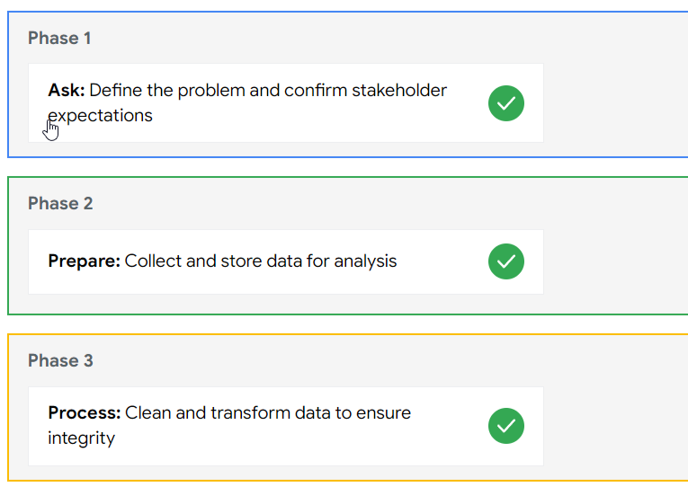
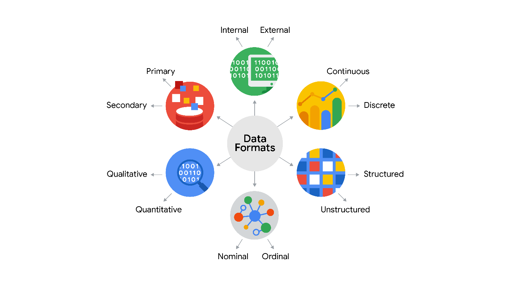
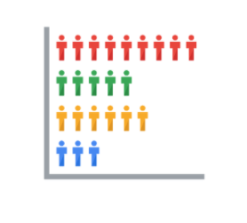

# Introduction: Tasks, Skills, and tool of Data Analytics

## Data Analyst skills

1.  **Curiosity:** Wanting to learn something/asking questions.

2.  **Understanding context:** Understanding bigger picture and how it
    relates to the data at hand.

    - Asking questions like ‘why is this data being collected’?

3.  **Having a technical mindset:** Ability to break problems into
    smaller/simpler problems.

4.  **Data Design:** How you organize information.

5.  **Data Strategy:** Management of people, processes, and tools to
    process data.

## Six phases of data analysis

1.  Ask

2.  Prepare

3.  Process

4.  Analyze

5.  Share

6.  Act

## Six Stages of the data life cycle

1.  **Plan:** Decide what kind of data is needed, how it will be
    managed, and who will be responsible for it.

2.  **Capture:** Collect or bring in data from a variety of different
    sources.

3.  **Manage:** Care for and maintain the data. This includes
    determining how and where it is stored and the tools used to do so.

4.  **Analyze:** Use the data to solve problems, make decisions, and
    support business goals.

5.  **Archive:** Keep relevant data stored for long-term and future
    reference.

6.  **Destroy:** Remove data from storage and delete any shared copies
    of the data.

# 1 - Asking questions: Identify issues, outline scope, and planning

## Six problem types

### Making predictions 

A company that wants to know the best advertising method to bring in new
customers is an example of a problem requiring analysts to make
predictions. Analysts with data on location, type of media, and number
of new customers acquired as a result of past ads can't guarantee future
results, but they can help predict the best placement of advertising to
reach the target audience.

### Categorizing things 

An example of a problem requiring analysts to categorize things is a
company's goal to improve customer satisfaction. Analysts might classify
customer service calls based on certain keywords or scores. This could
help identify top-performing customer service representatives or help
correlate certain actions taken with higher customer satisfaction
scores.

### Spotting something unusual 

A company that sells smart watches that help people monitor their health
would be interested in designing their software to spot something
unusual. Analysts who have analyzed aggregated health data can help
product developers determine the right algorithms to spot and set off
alarms when certain data doesn't trend normally.

### Identifying themes 

User experience (UX) designers might rely on analysts to analyze user
interaction data. Similar to problems that require analysts to
categorize things, usability improvement projects might require analysts
to identify themes to help prioritize the right product features for
improvement. Themes are most often used to help researchers explore
certain aspects of data. In a user study, user beliefs, practices, and
needs are examples of themes.

By now you might be wondering if there is a difference between
categorizing things and identifying themes. The best way to think about
it is: categorizing things involves assigning items to categories;
identifying themes takes those categories a step further by grouping
them into broader themes.

### Discovering connections 

A third-party logistics company working with another company to get
shipments delivered to customers on time is a problem requiring analysts
to discover connections. By analyzing the wait times at shipping hubs,
analysts can determine the appropriate schedule changes to increase the
number of on-time deliveries.

### Finding patterns

Minimizing downtime caused by machine failure is an example of a problem
requiring analysts to find patterns in data. For example, by analyzing
maintenance data, they might discover that most failures happen if
regular maintenance is delayed by more than a 15-day window.

### Key takeaway

As you move through this program, you will develop a sharper eye for
problems and you will practice thinking through the problem types when
you begin your analysis. This method of problem solving will help you
figure out solutions that meet the needs of all stakeholders.

## SMART questions

### Examples of SMART questions

Here's an example that breaks down the thought process of turning a
problem question into one or more SMART questions using the SMART
method: **What features do people look for when buying a new car?**

- **Specific**: Does the question focus on a particular car feature?

- **Measurable**: Does the question include a feature rating system?

- **Action-oriented**: Does the question influence creation of different
  or new feature packages?

- **Relevant**: Does the question identify which features make or break
  a potential car purchase?

- **Time-bound**: Does the question validate data on the most popular
  features from the last three years? 

#### Quantitative vs Qualitative data

## Selecting the right data

Following are some data-collection considerations to keep in mind for
your analysis:

### How the data will be collected

Decide if you will collect the data using your own resources or receive
(and possibly purchase it) from another party. Data that you collect
yourself is called first-party data.

### Data sources

If you don’t collect the data using your own resources, you might get
data from second-party or third-party data providers. **Second-party
data** is collected directly by another group and then sold.
**Third-party data** is sold by a provider that didn’t collect the data
themselves. Third-party data might come from a number of different
sources.

**Good data sources**

### Solving your business problem

Datasets can show a lot of interesting information. But be sure to
choose data that can actually help solve your problem question. For
example, if you are analyzing trends over time, make sure you use time
series data — in other words, data that includes dates.

### How much data to collect

If you are collecting your own data, make reasonable decisions about
sample size. A random sample from existing data might be fine for some
projects. Other projects might need more strategic data collection to
focus on certain criteria. Each project has its own needs. 

### Time frame

If you are collecting your own data, decide how long you will need to
collect it, especially if you are tracking trends over a long period of
time. If you need an immediate answer, you might not have time to
collect new data. In this case, you would need to use historical data
that already exists.

Use the flowchart below if data collection relies heavily on how much
time you have:

# 2 – Prepare: Collecting and Categorizing Data and it’s many forms

## Data types

## Data Formats

When you think about the word "format," a lot of things might come to
mind. Think of an advertisement for your favorite store. You might find
it in the form of a print ad, a billboard, or even a commercial. The
information is presented in the format that works best for you to take
it in. The format of a dataset is a lot like that, and choosing the
right format will help you manage and use your data in the best way
possible.

### Data format examples

As with most things, it is easier for definitions to click when we can
pair them with real life examples. Review each definition first and then
use the examples to lock in your understanding of each data format.

the following table
highlights the differences between primary and secondary data and
examples of each

<table>
<colgroup>
<col style="width: 19%" />
<col style="width: 23%" />
<col style="width: 56%" />
</colgroup>
<thead>
<tr>
<th><strong>Data Format Classification</strong></th>
<th><strong>Definition</strong></th>
<th><strong>Examples</strong></th>
</tr>
</thead>
<tbody>
<tr>
<td>Primary data</td>
<td>Collected by a researcher from first-hand sources</td>
<td>- Data from an interview you conducted - Data from a survey returned
from 20 participants - Data from questionnaires you got back from a
group of workers</td>
</tr>
<tr>
<td>Secondary data</td>
<td>Gathered by other people or from other research</td>
<td>- Data you bought from a local data analytics firm’s customer
profiles - Demographic data collected by a university - Census data
gathered by the federal government</td>
</tr>
</tbody>
</table>

the following table
highlights the differences between internal and external data and
examples of each

<table>
<colgroup>
<col style="width: 20%" />
<col style="width: 26%" />
<col style="width: 53%" />
</colgroup>
<thead>
<tr>
<th><strong>Data Format Classification</strong></th>
<th><strong>Definition</strong></th>
<th><strong>Examples</strong></th>
</tr>
</thead>
<tbody>
<tr>
<td>Internal data</td>
<td>Data that lives inside a company’s own systems</td>
<td>- Wages of employees across different business units tracked by HR -
Sales data by store location - Product inventory levels across
distribution centers</td>
</tr>
<tr>
<td>External data</td>
<td>Data that lives outside of a company or organization</td>
<td>- National average wages for the various positions throughout your
organization - Credit reports for customers of an auto dealership</td>
</tr>
</tbody>
</table>

the following table
highlights the differences between continuous and discrete data and
examples of each

<table>
<colgroup>
<col style="width: 20%" />
<col style="width: 27%" />
<col style="width: 51%" />
</colgroup>
<thead>
<tr>
<th><strong>Data Format Classification</strong></th>
<th><strong>Definition</strong></th>
<th><strong>Examples</strong></th>
</tr>
</thead>
<tbody>
<tr>
<td>Continuous data</td>
<td>Data that is measured and can have almost any numeric value</td>
<td>- Height of kids in third grade classes (52.5 inches, 65.7 inches) -
Runtime markers in a video - Temperature</td>
</tr>
<tr>
<td>Discrete data</td>
<td>Data that is counted and has a limited number of values</td>
<td>- Number of people who visit a hospital on a daily basis (10, 20,
200) - Room’s maximum capacity allowed - Tickets sold in the current
month</td>
</tr>
</tbody>
</table>

the following
table highlights the differences between qualitative and quantitative
data and examples of each

<table>
<colgroup>
<col style="width: 20%" />
<col style="width: 32%" />
<col style="width: 46%" />
</colgroup>
<thead>
<tr>
<th><strong>Data Format Classification</strong></th>
<th><strong>Definition</strong></th>
<th><strong>Examples</strong></th>
</tr>
</thead>
<tbody>
<tr>
<td>Qualitative</td>
<td>Subjective and explanatory measures of qualities and
characteristics</td>
<td>- Exercise activity most enjoyed - Favorite brands of most loyal
customers - Fashion preferences of young adults</td>
</tr>
<tr>
<td>Quantitative</td>
<td>Specific and objective measures of numerical facts</td>
<td>- Percentage of board certified doctors who are women - Population
of elephants in Africa - Distance from Earth to Mars</td>
</tr>
</tbody>
</table>

the following table
highlights the differences between nominal and ordinal data and examples
of each

<table>
<colgroup>
<col style="width: 19%" />
<col style="width: 27%" />
<col style="width: 53%" />
</colgroup>
<thead>
<tr>
<th><strong>Data Format Classification</strong></th>
<th><strong>Definition</strong></th>
<th><strong>Examples</strong></th>
</tr>
</thead>
<tbody>
<tr>
<td>Nominal</td>
<td>A type of qualitative data that isn’t categorized with a set
order</td>
<td>- First time customer, returning customer, regular customer - New
job applicant, existing applicant, internal applicant - New listing,
reduced price listing, foreclosure</td>
</tr>
<tr>
<td>Ordinal</td>
<td> A type of qualitative data with a set order or scale</td>
<td>- Movie ratings (number of stars: 1 star, 2 stars, 3 stars) -
Ranked-choice voting selections (1st, 2nd, 3rd) - Income level (low
income, middle income, high income)</td>
</tr>
</tbody>
</table>

the following
table highlights the differences between structured and unstructured
data and examples of each

<table>
<colgroup>
<col style="width: 24%" />
<col style="width: 40%" />
<col style="width: 34%" />
</colgroup>
<thead>
<tr>
<th><strong>Data Format Classification</strong></th>
<th><strong>Definition</strong></th>
<th><strong>Examples</strong></th>
</tr>
</thead>
<tbody>
<tr>
<td>Structured data</td>
<td>Data organized in a certain format, like rows and columns</td>
<td>- Expense reports - Tax returns - Store inventory</td>
</tr>
<tr>
<td>Unstructured data</td>
<td>Data that isn’t organized in any easily identifiable manner</td>
<td>- Social media posts - Emails - Videos</td>
</tr>
</tbody>
</table>

## Structured vs Unstructured data

Data is everywhere and it can be stored in lots of ways. Two general
categories of data are: 

- **Structured data:** Organized in a certain format, such as rows and
  columns.

- **Unstructured data:** Not organized in any easy-to-identify way.

For example, when you rate your favorite restaurant online, you're
creating structured data. But when you use Google Earth to check out a
satellite image of a restaurant location, you're using unstructured
data. 

Here's a refresher on the characteristics of structured and unstructured
data:

Structured
data: - Defined data types - Most often quantitative data - Easy to
organize - Easy to search - Easy to analyze - Stored in relational
databases - Contained in rows and columns - Examples: Excel, Google
Sheets, SQL, customer data, phone records, transaction history
Unstructured data: - Varied data types - Most often qualitative data -
Difficult to search - Provides more freedom for analysis - Stored in
data lakes and NoSQL databases - Can't be put in rows and columns -
Examples: Text messages, social media comments, phone call
transcriptions, various log files, images, audio, video

### Structured data

As we described earlier, **structured data** is organized in a certain
format. This makes it easier to store and query for business needs. If
the data is exported, the structure goes along with the data.

### Unstructured data

**Unstructured data** can’t be organized in any easily identifiable
manner. And there is much more unstructured than structured data in the
world. Video and audio files, text files, social media content,
satellite imagery, presentations, PDF files, open-ended survey
responses, and websites all qualify as types of unstructured data.

### The fairness issue

The lack of structure makes unstructured data difficult to search,
manage, and analyze. But recent advancements in artificial intelligence
and machine learning algorithms are beginning to change that. Now, the
new challenge facing data scientists is making sure these tools are
inclusive and unbiased. Otherwise, certain elements of a dataset will be
more heavily weighted and/or represented than others. And as you're
learning, an unfair dataset does not accurately represent the
population, causing skewed outcomes, low accuracy levels, and unreliable
analysis.

## Small vs Big Data

Whether you work with big or small data, you can use it to help
stakeholders improve business processes, answer questions, create new
products, and much more. But there are certain challenges and benefits
that come with big data and the following table explores the differences
between big and small data.

<table>
<colgroup>
<col style="width: 43%" />
<col style="width: 56%" />
</colgroup>
<thead>
<tr>
<th><strong>Small data</strong></th>
<th><strong>Big data</strong></th>
</tr>
</thead>
<tbody>
<tr>
<td>Describes a data set made up of specific metrics over a short,
well-defined time period</td>
<td>Describes large, less-specific data sets that cover a long time
period</td>
</tr>
<tr>
<td>Usually organized and analyzed in spreadsheets</td>
<td>Usually kept in a database and queried</td>
</tr>
<tr>
<td>Likely to be used by small and midsize businesses</td>
<td>Likely to be used by large organizations</td>
</tr>
<tr>
<td>Simple to collect, store, manage, sort, and visually represent</td>
<td>Takes a lot of effort to collect, store, manage, sort, and visually
represent</td>
</tr>
<tr>
<td>Usually already a manageable size for analysis</td>
<td>Usually needs to be broken into smaller pieces in order to be
organized and analyzed effectively for decision-making</td>
</tr>
</tbody>
</table>

### Challenges and benefits

Here are some **challenges** you might face when working with big data:

- A lot of organizations deal with data overload and way too much
  unimportant or irrelevant information. 

- Important data can be hidden deep down with all of the non-important
  data, which makes it harder to find and use. This can lead to slower
  and more inefficient decision-making time frames.

- The data you need isn’t always easily accessible. 

- Current technology tools and solutions still struggle to provide
  measurable and reportable data. This can lead to unfair algorithmic
  bias. 

- There are gaps in many big data business solutions.

Now for the good news! Here are some **benefits** that come with big
data:

- When large amounts of data can be stored and analyzed, it can help
  companies identify more efficient ways of doing business and save a
  lot of time and money.

- Big data helps organizations spot the trends of customer buying
  patterns and satisfaction levels, which can help them create new
  products and solutions that will make customers happy.

- By analyzing big data, businesses get a much better understanding of
  current market conditions, which can help them stay ahead of the
  competition.

- As in our earlier social media example, big data helps companies keep
  track of their online presence—especially feedback, both good and bad,
  from customers. This gives them the information they need to improve
  and protect their brand.

## Metadata

Regardless of whether you are working with a large or small quantity of
data, metadata is the mark of a knowledgeable analytics team, helping to
communicate about data across the business and making it easier to reuse
data. In essence, metadata tells the who, what, when, where, which, how,
and why of data.

## Elements of metadata

Before looking at metadata examples, it is important to understand what
type of information metadata typically provides.

### <u>Title and description</u>

What is the name of the file or website you are examining? What type of
content does it contain?

### <u>Tags and categories</u>

What is the general overview of the data that you have? Is the data
indexed or described in a specific way? 

### <u>Who created it and when</u>

Where did the data come from, and when was it created? Is it recent, or
has it existed for a long time?

### <u>Who last modified it and when</u>

Were any changes made to the data?  If yes, were the modifications
recent?

### <u>Who can access or update it</u>

Is this dataset public? Are special permissions needed to customize or
modify the dataset?

## Data Dashboard

### The beauty of dashboards

Dashboards are powerful visual tools that help you tell your data story.
A **dashboard** organizes information from multiple datasets into one
central location, offering huge time-savings. Data analysts use
dashboards to track, analyze, and visualize data in order to answer
questions and solve problems. For a basic idea of what dashboards look
like, refer to this article: [6 real-world examples of business
intelligence
dashboards](https://www.tableau.com/learn/articles/business-intelligence-dashboards-examples).
Tableau is one tool that is used to create dashboards and is covered
later in the program.

The following table summarizes the benefits of using a dashboard for
both data analysts and their stakeholders.

<table>
<colgroup>
<col style="width: 15%" />
<col style="width: 39%" />
<col style="width: 44%" />
</colgroup>
<thead>
<tr>
<th><strong>Benefits</strong></th>
<th><strong>For Data Analysts</strong></th>
<th><strong>For Stakeholders</strong></th>
</tr>
</thead>
<tbody>
<tr>
<td><strong>Centralization</strong></td>
<td>Sharing a single source of data with all stakeholders</td>
<td>Working with a comprehensive view of data, initiatives, objectives,
projects, processes, and more</td>
</tr>
<tr>
<td><strong>Visualization</strong></td>
<td>Showing and updating live, incoming data in real time*</td>
<td>Spotting changing trends and patterns more quickly</td>
</tr>
<tr>
<td><strong>Insightfulness</strong></td>
<td>Pulling relevant information from different datasets</td>
<td>Understanding the story behind the numbers to keep track of goals
and make data-driven decisions</td>
</tr>
<tr>
<td><strong>Customization</strong></td>
<td>Creating custom views dedicated to a specific person, project, or
presentation of the data</td>
<td>Drilling down to more specific areas of specialized interest or
concern</td>
</tr>
</tbody>
</table>

*\* It is important to remember that changed data is pulled into
dashboards automatically only if the data structure is the same. If the
data structure changes, you have to update the dashboard design before
the data can update live.*

### Creating a dashboard

Here is a process you can follow to create a dashboard:

**1.** **Identify the stakeholders who need to see the data and how they
will use it**

To get started with this, you need to ask effective questions. Check out
this [Requirements Gathering
Worksheet](https://s3.amazonaws.com/looker-elearning-resources/Requirements+Gathering+Worksheet.pdf)
to explore a wide range of good questions you can use to identify
relevant stakeholders and their data needs. This is a great resource to
help guide you through this process again and again.

**2. Design the dashboard (what should be displayed)**

Use these tips to help make your dashboard design clear, easy to follow,
and simple:

- Use a clear header to label the information

- Add short text descriptions to each visualization

- Show the most important information at the top

**3. Create mock-ups if desired**

This is optional, but a lot of data analysts like to sketch out their
dashboards before creating them. 

**4. Select the visualizations you will use on the dashboard**

You have a lot of options here and it all depends on what data story you
are telling. If you need to show a change of values over time, line
charts or bar graphs might be the best choice. If your goal is to show
how each part contributes to the whole amount being reported, a pie or
donut chart is probably a better choice.

To learn more about choosing the right visualizations, check out
Tableau’s galleries:

- For more samples of area charts, column charts, and other
  visualizations, visit [Tableau’s Viz
  Gallery](https://www.tableau.com/solutions/gallery). This gallery is
  full of great examples that were created using real data; explore this
  resource on your own to get some inspiration.

- Explore [Tableau’s Viz of the
  Day](https://public.tableau.com/en-us/gallery/?tab=viz-of-the-day&type=viz-of-the-day)
  to see visualizations curated by the community. These are
  visualizations created by Tableau users and are a great way to learn
  more about how other data analysts are using data visualization
  tools. 

**5.** **Create filters as needed**

Filters show certain data while hiding the rest of the data in a
dashboard. This can be a big help to identify patterns while keeping the
original data intact. It is common for data analysts to use and share
the same dashboard, but manage their part of it with a filter. To dig
deeper into filters and find an example of filters in action, you can
visit Tableau’s page on [Filter
Actions](https://help.tableau.com/current/pro/desktop/en-us/actions_filter.htm). This
is a useful resource to save and come back to when you start practicing
using filters in Tableau on your own.

### Dashboards are part of a business journey

Just like how the dashboard on an airplane shows the pilot their flight
path, your dashboard does the same for your stakeholders. It helps them
navigate the path of the project inside the data. If you add clear
markers and highlight important points on your dashboard, users will
understand where your data story is headed. Then, you can work together
to make sure the business gets where it needs to go. 

# 3 – Clean: Cleaning Data

## **What to do when you find an issue with your data**

When you are getting ready for data analysis, you might realize you
don’t have the data you need or you don’t have enough of it. In some
cases, you can use what is known as proxy data in place of the real
data. Think of it like substituting oil for butter in a recipe when you
don’t have butter. In other cases, there is no reasonable substitute and
your only option is to collect more data.

Consider the following data issues and suggestions on how to work around
them.

### Data issue 1: no data

<table>
<colgroup>
<col style="width: 45%" />
<col style="width: 54%" />
</colgroup>
<thead>
<tr>
<th><strong>Possible Solutions</strong></th>
<th><strong>Examples of solutions in real life</strong></th>
</tr>
</thead>
<tbody>
<tr>
<td>Gather the data on a small scale to perform a preliminary analysis
and then request additional time to complete the analysis after you have
collected more data.</td>
<td>If you are surveying employees about what they think about a new
performance and bonus plan, use a sample for a preliminary analysis.
Then, ask for another 3 weeks to collect the data from all
employees.</td>
</tr>
<tr>
<td>If there isn’t time to collect data, perform the analysis using
proxy data from other datasets.  <em>This is the most common
workaround.</em></td>
<td>If you are analyzing peak travel times for commuters but don’t have
the data for a particular city, use the data from another city with a
similar size and demographic.</td>
</tr>
</tbody>
</table>

### Data issue 2: too little data

<table>
<colgroup>
<col style="width: 30%" />
<col style="width: 69%" />
</colgroup>
<thead>
<tr>
<th><strong>Possible Solutions</strong></th>
<th><strong>Examples of solutions in real life</strong></th>
</tr>
</thead>
<tbody>
<tr>
<td>Do the analysis using proxy data along with actual data.</td>
<td>If you are analyzing trends for owners of golden retrievers, make
your dataset larger by including the data from owners of
labradors. </td>
</tr>
<tr>
<td>Adjust your analysis to align with the data you already have.</td>
<td>If you are missing data for 18- to 24-year-olds, do the analysis but
note the following limitation in your report: <em>this conclusion
applies to adults 25 years and older</em> <em>only</em>.</td>
</tr>
</tbody>
</table>

### Data issue 3: wrong data, including data with errors\*

<table>
<colgroup>
<col style="width: 51%" />
<col style="width: 48%" />
</colgroup>
<thead>
<tr>
<th><strong>Possible Solutions</strong></th>
<th><strong>Examples of solutions in real life</strong></th>
</tr>
</thead>
<tbody>
<tr>
<td>If you have the wrong data because requirements were misunderstood,
communicate the requirements again.</td>
<td>If you need the data for female voters and received the data for
male voters, restate your needs.</td>
</tr>
<tr>
<td>Identify errors in the data and, if possible, correct them at the
source by looking for a pattern in the errors.</td>
<td>If your data is in a spreadsheet and there is a conditional
statement or boolean causing calculations to be wrong, change the
conditional statement instead of just fixing the calculated values.</td>
</tr>
<tr>
<td>If you can’t correct data errors yourself, you can ignore the wrong
data and go ahead with the analysis if your sample size is still large
enough and ignoring the data won’t cause systematic bias.</td>
<td>If your dataset was translated from a different language and some of
the translations don’t make sense, ignore the data with bad translation
and go ahead with the analysis of the other data.</td>
</tr>
</tbody>
</table>

*\* Important note: sometimes data with errors can be a warning sign
that the data isn’t reliable. Use your best judgment.*

#### Use the following decision tree as a reminder of how to deal with data errors or not enough data:

1.
Can you fix or request a corrected dataset? NO 2. Do you have enough
data to omit the wrong data? NO 3. Can you proxy the data? NO 4. Can you
collect more data? NO Modify the business objective (if possible)

## **What to do when there is no data**

Earlier, you learned how you can still do an analysis using proxy data
if you have no data. You might have some questions about proxy data, so
this reading will give you a few more examples of the types of datasets
that can serve as alternate data sources.

### Proxy data examples

Sometimes the data to support a business objective isn’t readily
available. This is when proxy data is useful. Take a look at the
following scenarios and where proxy data comes in for each example:

<table>
<colgroup>
<col style="width: 52%" />
<col style="width: 47%" />
</colgroup>
<thead>
<tr>
<th><strong>Business scenario</strong></th>
<th><strong>How proxy data can be used</strong></th>
</tr>
</thead>
<tbody>
<tr>
<td>A new car model was just launched a few days ago and the auto
dealership can’t wait until the end of the month for sales data to come
in. They want sales projections now.</td>
<td>The analyst proxies the number of clicks to the car specifications
on the dealership’s website as an estimate of potential sales at the
dealership.</td>
</tr>
<tr>
<td>A brand new plant-based meat product was only recently stocked in
grocery stores and the supplier needs to estimate the demand over the
next four years. </td>
<td>The analyst proxies the sales data for a turkey substitute made out
of tofu that has been on the market for several years.</td>
</tr>
<tr>
<td>The Chamber of Commerce wants to know how a tourism campaign is
going to impact travel to their city, but the results from the campaign
aren’t publicly available yet.</td>
<td>The analyst proxies the historical data for airline bookings to the
city one to three months after a similar campaign was run six months
earlier.</td>
</tr>
</tbody>
</table>

### Open (public) datasets

If you are part of a large organization, you might have access to lots
of sources of data. But if you are looking for something specific or a
little outside your line of business, you can also make use of open or
public datasets. (You can refer to this [Towards Data Science
article](https://towardsdatascience.com/is-there-a-difference-between-open-data-and-public-data-6261cd7b5389)
for a brief explanation of the difference between open and public data.)

Here's an example. A nasal version of a vaccine was recently made
available. A clinic wants to know what to expect for contraindications,
but just started collecting first-party data from its patients. A
**contraindication** is a condition that may cause a patient not to take
a vaccine due to the harm it would cause them if taken. To estimate the
number of possible contraindications, a data analyst proxies an open
dataset from a trial of the injection version of the vaccine. The
analyst selects a subset of the data with patient profiles most closely
matching the makeup of the patients at the clinic. 

There are plenty of ways to share and collaborate on data within a
community. Kaggle ([kaggle.com](https://www.kaggle.com/)) which we
previously introduced, has datasets in a variety of formats including
the most basic type, Comma Separated Values (CSV) files.  

#### CSV, J​SON, SQLite, and BigQuery datasets

- CSV: Check out this [Credit card
  customers](https://www.kaggle.com/sakshigoyal7/credit-card-customers)
  dataset, which has information from 10,000 customers including age,
  salary, marital status, credit card limit, credit card category,
  etc. (CC0: Public Domain, Sakshi Goyal).

- JSON: Check out this JSON dataset for [trending YouTube
  videos](https://www.kaggle.com/datasnaek/youtube-new) (CC0: Public
  Domain, Mitchell J).

- SQLite: Check out this SQLite dataset for 24 years worth of [U.S.
  wildfire
  data](https://www.kaggle.com/rtatman/188-million-us-wildfires) (CC0:
  Public Domain, Rachael Tatman).

- BigQuery: Check out this [Google Analytics
  360](https://www.kaggle.com/bigquery/google-analytics-sample) sample
  dataset from the Google Merchandise Store (CC0 Public Domain, Google
  BigQuery).

Refer to the Kaggle [documentation for
datasets](https://www.kaggle.com/docs/datasets) for more information and
search for and explore datasets on your own at
[kaggle.com/datasets](https://www.kaggle.com/datasets).

As with all other kinds of datasets, be on the lookout for duplicate
data and ‘Null’ in open datasets. Null most often means that a data
field was unassigned (left empty), but sometimes Null can be interpreted
as the value, 0. It is important to understand how Null was used before
you start analyzing a dataset with Null data.

## **Calculating sample size**

Before you dig deeper into sample size, familiarize yourself with these
terms and definitions:

<table>
<colgroup>
<col style="width: 18%" />
<col style="width: 81%" />
</colgroup>
<thead>
<tr>
<th><strong>Terminology</strong></th>
<th><strong>Definitions</strong></th>
</tr>
</thead>
<tbody>
<tr>
<td><strong>Population </strong></td>
<td>The entire group that you are interested in for your study. For
example, if you are surveying people in your company, the population
would be all the employees in your company.</td>
</tr>
<tr>
<td><strong>Sample </strong></td>
<td>A subset of your population. Just like a food sample, it is called a
sample because it is only a taste. So if your company is too large to
survey every individual, you can survey a representative sample of your
population.</td>
</tr>
<tr>
<td><strong>Margin of error</strong></td>
<td>Since a sample is used to represent a population, the sample’s
results are expected to differ from what the result would have been if
you had surveyed the entire population. This difference is called the
margin of error. The smaller the margin of error, the closer the results
of the sample are to what the result would have been if you had surveyed
the entire population. </td>
</tr>
<tr>
<td><strong>Confidence level</strong></td>
<td>How confident you are in the survey results. For example, a 95%
confidence level means that if you were to run the same survey 100
times, you would get similar results 95 of those 100 times. Confidence
level is targeted before you start your study because it will affect how
big your margin of error is at the end of your study. </td>
</tr>
<tr>
<td><strong>Confidence interval</strong></td>
<td>The range of possible values that the population’s result would be
at the confidence level of the study. This range is the sample result
+/- the margin of error.</td>
</tr>
<tr>
<td><strong>Statistical significance</strong></td>
<td>The determination of whether your result could be due to random
chance or not. The greater the significance, the less due to
chance.</td>
</tr>
</tbody>
</table>

### Things to remember when determining the size of your sample

When figuring out a sample size, here are things to keep in mind:

- Don’t use a sample size less than 30. It has been statistically proven
  that 30 is the smallest sample size where an average result of a
  sample starts to represent the average result of a population.

- The confidence level most commonly used is 95%, but 90% can work in
  some cases. 

Increase the sample size to meet specific needs of your project:

- For a **higher** confidence level, use a larger sample size

- To **decrease** the margin of error, use a larger sample size

- For **greater** statistical significance, use a larger sample size

**Note:** Sample size calculators use statistical formulas to determine
a sample size. More about these are coming up in the course! Stay tuned.

#### Why a minimum sample of 30?

This recommendation is based on the **Central Limit Theorem (CLT)** in
the field of probability and statistics. As sample size increases, the
results more closely resemble the normal (bell-shaped) distribution from
a large number of samples. A sample of 30 is the smallest sample size
for which the CLT is still valid. Researchers who rely on **regression
analysis** – statistical methods to determine the relationships between
controlled and dependent variables – also prefer a minimum sample of 30.

Still curious? Without getting too much into the math, check out these
articles:

- [Central Limit Theorem
  (CLT)](https://www.investopedia.com/terms/c/central_limit_theorem.asp):
  This article by Investopedia explains the Central Limit Theorem and
  briefly describes how it can apply to an analysis of a stock index.

- [Sample Size
  Formula](https://www.statisticssolutions.com/dissertation-resources/sample-size-calculation-and-sample-size-justification/sample-size-formula/):
  This article by Statistics Solutions provides a little more detail
  about why some researchers use 30 as a minimum sample size.

#### Sample sizes vary by business problem

Sample size will vary based on the type of business problem you are
trying to solve. 

For example, if you live in a city with a population of 200,000 and get
180,000 people to respond to a survey, that is a large sample size. But
without actually doing that, what would an acceptable, smaller sample
size look like? 

Would 200 be alright if the people surveyed represented every district
in the city?

**Answer**: It depends on the stakes. 

- A sample size of 200 might be large enough if your business problem is
  to find out how residents felt about the new library

- A sample size of 200 might not be large enough if your business
  problem is to determine how residents would vote to fund the library

You could probably accept a larger margin of error surveying how
residents feel about the new library versus surveying residents about
how they would vote to fund it. For that reason, you would most likely
use a larger sample size for the voter survey.

#### Larger sample sizes have a higher cost

You also have to weigh the cost against the benefits of more accurate
results with a larger sample size. Someone who is trying to understand
consumer preferences for a new line of products wouldn’t need as large a
sample size as someone who is trying to understand the effects of a new
drug. For drug safety, the benefits outweigh the cost of using a larger
sample size. But for consumer preferences, a smaller sample size at a
lower cost could provide good enough results. 

#### Knowing the basics is helpful

Knowing the basics will help you make the right choices when it comes to
sample size. You can always raise concerns if you come across a sample
size that is too small. A sample size calculator is also a great tool
for this. Sample size calculators let you enter a desired confidence
level and margin of error for a given population size. They then
calculate the sample size needed to statistically achieve those
results. 

Refer to the [Determine the Best Sample
Size](https://www.coursera.org/learn/process-data/lecture/mSj5A/determine-the-best-sample-size)
video for a demonstration of a sample size calculator, or refer to the
[Sample Size
Calculator](https://www.coursera.org/learn/process-data/supplement/ZqcDw/sample-size-calculator)
reading for additional information.

### **Sample size calculator**

In this reading, you will learn the basics of sample size calculators,
how to use them, and how to understand the results. A **sample size
calculator** tells you how many people you need to interview (or things
you need to test) to get results that represent the target population.
Let’s review some terms you will come across when using a sample size
calculator:

- **Confidence level**: The probability that your sample size accurately
  reflects the greater population.

- **Margin of error**: The maximum amount that the sample results are
  expected to differ from those of the actual population.

- **Population**: This is the total number you hope to pull your sample
  from.

- **Sample**: A part of a population that is representative of the
  population.

- **Estimated response rate**: If you are running a survey of
  individuals, this is the percentage of people you expect will complete
  your survey out of those who received the survey.

#### How to use a sample size calculator

In order to use a sample size calculator, you need to have the
population size, confidence level, and the acceptable margin of error
already decided so you can input them into the tool. If this information
is ready to go, check out these sample size calculators below:

- [Sample size calculator by
  surveymonkey.com](https://www.surveymonkey.com/mp/sample-size-calculator/)

- [Sample size calculator by
  raosoft.com](http://www.raosoft.com/samplesize.html)

#### What to do with the results

After you have plugged your information into one of these calculators,
it will give you a recommended sample size. Keep in mind, the calculated
sample size is the **minimum** number to achieve what you input for
confidence level and margin of error. If you are working with a survey,
you will also need to think about the estimated response rate to figure
out how many surveys you will need to send out. For example, if you need
a sample size of 100 individuals and your estimated response rate is
10%, you will need to send your survey to 1,000 individuals to get the
100 responses you need for your analysis.

Now that you have the basics, try some calculations using the sample
size calculators and refer back to this reading if you need a refresher
on the definitions. 

## **All about margin of error**

**Margin of error** is the maximum amount that the sample results are
expected to differ from those of the actual population. More
technically, the margin of error defines a range of values below and
above the average result for the sample. The average result for the
entire population is expected to be within that range. We can better
understand margin of error by using some examples below.

### Margin of error in baseball

Imagine you are playing baseball and that you are up at bat. The crowd
is roaring, and you are getting ready to try to hit the ball. The
pitcher delivers a fastball traveling about 90-95mph, which takes about
400 milliseconds (ms) to reach the catcher’s glove. You swing and miss
the first pitch because your timing was a little off. You wonder if you
should have swung slightly earlier or slightly later to hit a home run.
That time difference can be considered the margin of error, and it tells
us how close or far your timing was from the average home run swing.    

### Margin of error in marketing

The margin of error is also important in marketing. Let’s use A/B
testing as an example. **A/B testing** (or split testing) tests two
variations of the same web page to determine which page is more
successful in attracting user traffic and generating revenue. User
traffic that gets monetized is known as the **conversion rate**. A/B
testing allows marketers to test emails, ads, and landing pages to find
the data behind what is working and what isn’t working. Marketers use
the **confidence interval** (determined by the conversion rate and the
margin of error) to understand the results. 

For example, suppose you are conducting an A/B test to compare the
effectiveness of two different email subject lines to entice people to
open the email. You find that subject line A: “Special offer just for
you” resulted in a 5% open rate compared to subject line B: “Don’t miss
this opportunity” at 3%. 

Does that mean subject line A is better than subject line B? It depends
on your margin of error. If the margin of error was 2%, then subject
line A’s actual open rate or confidence interval is somewhere between 3%
and 7%. Since the lower end of the interval overlaps with subject line
B’s results at 3%, you can’t conclude that there is a statistically
significant difference between subject line A and B. Examining the
margin of error is important when making conclusions based on your test
results. 

### Want to calculate your margin of error? 

All you need is population size, confidence level, and sample size. In
order to better understand this calculator, review these terms:

- **Confidence level**: A percentage indicating how likely your sample
  accurately reflects the greater population 

- **Population**: The total number you pull your sample from

- **Sample**: A part of a population that is representative of the
  population

- **Margin of error**: The maximum amount that the sample results are
  expected to differ from those of the actual population

In most cases, a 90% or 95% confidence level is used. But, depending on
your industry, you might want to set a stricter confidence level. A 99%
confidence level is reasonable in some industries, such as the
pharmaceutical industry. 

After you have settled on your population size, sample size, and
confidence level, plug the information into a margin of error calculator
like the ones below: 

- [Margin of error calculator by G​ood Calculators (free online
  calculators)](https://goodcalculators.com/margin-of-error-calculator/)

- [Margin of error calculator by
  CheckMarket](https://www.checkmarket.com/sample-size-calculator/#sample-size-margin-of-error-calculator)

### Key takeaway

Margin of error is used to determine how close your sample’s result is
to what the result would likely have been if you could have surveyed or
tested the entire population. Margin of error helps you understand and
interpret survey or test results in real-life.  Calculating the margin
of error is particularly helpful when you are given the data to analyze.
After using a calculator to calculate the margin of error, you will know
how much the sample results might differ from the results of the entire
population.

## **Statistical Power**

[A Gentle Introduction to Statistical Power and Power Analysis in
Python](https://machinelearningmastery.com/statistical-power-and-power-analysis-in-python/)
sums it up nicely:

"**Statistical power** can be calculated and reported for a completed
experiment to comment on the confidence one might have in the
conclusions drawn from the results of the study. It can also be used as
a tool to estimate the number of observations or sample size required in
order to detect an effect in an experiment."

## **What is dirty data?**

Earlier, we discussed that **dirty data** is data that is incomplete,
incorrect, or irrelevant to the problem you are trying to solve.  This
reading summarizes:

- Types of dirty data you may encounter

- What may have caused the data to become dirty

- How dirty data is harmful to businesses

### Types of dirty data

#### Duplicate data

<table>
<colgroup>
<col style="width: 25%" />
<col style="width: 28%" />
<col style="width: 46%" />
</colgroup>
<thead>
<tr>
<th><strong>Description</strong></th>
<th><strong>Possible causes</strong></th>
<th><strong>Potential harm to businesses</strong></th>
</tr>
</thead>
<tbody>
<tr>
<td>Any data record that shows up more than once</td>
<td>Manual data entry, batch data imports, or data migration</td>
<td>Skewed metrics or analyses, inflated or inaccurate counts or
predictions, or confusion during data retrieval</td>
</tr>
</tbody>
</table>

#### Outdated data

<table>
<colgroup>
<col style="width: 38%" />
<col style="width: 35%" />
<col style="width: 25%" />
</colgroup>
<thead>
<tr>
<th><strong>Description</strong></th>
<th><strong>Possible causes</strong></th>
<th><strong>Potential harm to businesses</strong></th>
</tr>
</thead>
<tbody>
<tr>
<td>Any data that is old which should be replaced with newer and more
accurate information</td>
<td>People changing roles or companies, or software and systems becoming
obsolete</td>
<td>Inaccurate insights, decision-making, and analytics</td>
</tr>
</tbody>
</table>

#### Incomplete data

<table>
<colgroup>
<col style="width: 25%" />
<col style="width: 28%" />
<col style="width: 46%" />
</colgroup>
<thead>
<tr>
<th><strong>Description</strong></th>
<th><strong>Possible causes</strong></th>
<th><strong>Potential harm to businesses</strong></th>
</tr>
</thead>
<tbody>
<tr>
<td>Any data that is missing important fields</td>
<td>Improper data collection or incorrect data entry</td>
<td>Decreased productivity, inaccurate insights, or inability to
complete essential services</td>
</tr>
</tbody>
</table>

#### Incorrect/inaccurate data

<table>
<colgroup>
<col style="width: 23%" />
<col style="width: 35%" />
<col style="width: 41%" />
</colgroup>
<thead>
<tr>
<th><strong>Description</strong></th>
<th><strong>Possible causes</strong></th>
<th><strong>Potential harm to businesses</strong></th>
</tr>
</thead>
<tbody>
<tr>
<td>Any data that is complete but inaccurate</td>
<td>Human error inserted during data input, fake information, or mock
data</td>
<td>Inaccurate insights or decision-making based on bad information
resulting in revenue loss</td>
</tr>
</tbody>
</table>

#### Inconsistent data

<table>
<colgroup>
<col style="width: 30%" />
<col style="width: 29%" />
<col style="width: 40%" />
</colgroup>
<thead>
<tr>
<th><strong>Description</strong></th>
<th><strong>Possible causes</strong></th>
<th><strong>Potential harm to businesses</strong></th>
</tr>
</thead>
<tbody>
<tr>
<td>Any data that uses different formats to represent the same
thing</td>
<td>Data stored incorrectly or errors inserted during data transfer</td>
<td>Contradictory data points leading to confusion or inability to
classify or segment customers</td>
</tr>
</tbody>
</table>

#### Business impact of dirty data

For further reading on the business impact of dirty data, enter the term
“dirty data” into your preferred browser’s search bar to bring up
numerous articles on the topic. Here are a few impacts cited for certain
industries from a previous search:

- **Banking**: Inaccuracies cost companies between 15% and 25% of
  revenue
  ([source](https://sloanreview.mit.edu/article/seizing-opportunity-in-data-quality/)).

<!-- -->

- **Digital commerce:** Up to 25% of B2B database contacts contain
  inaccuracies
  ([source](https://www.demandgen.com/dirty-data-what-is-it-costing-you/)).

<!-- -->

- **Marketing and sales**: 8 out of 10 companies have said that dirty
  data hinders sales campaigns
  ([source](https://www.dqglobal.com/2011/05/04/obsolete-or-dirty-data/)).

<!-- -->

- **Healthcare**: Duplicate records can be 10% and even up to 20% of a
  hospital’s electronic health records
  ([source](https://searchhealthit.techtarget.com/feature/Hospitals-battle-duplicate-medical-records-with-technology)).

## **Common data-cleaning pitfalls**

In this reading, you will learn the importance of data cleaning and how
to identify common mistakes. Some of the errors you might come across
while cleaning your data could include:

### Common mistakes to avoid

- **Not checking for spelling errors**: Misspellings can be as simple as
  typing or input errors. Most of the time the wrong spelling or common
  grammatical errors can be detected, but it gets harder with things
  like names or addresses. For example, if you are working with a
  spreadsheet table of customer data, you might come across a customer
  named “John” whose name has been input incorrectly as “Jon” in some
  places. The spreadsheet’s spellcheck probably won’t flag this, so if
  you don’t double-check for spelling errors and catch this, your
  analysis will have mistakes in it. 

- **Forgetting to document errors**: Documenting your errors can be a
  big time saver, as it helps you avoid those errors in the future by
  showing you how you resolved them. For example, you might find an
  error in a formula in your spreadsheet. You discover that some of the
  dates in one of your columns haven’t been formatted correctly. If you
  make a note of this fix, you can reference it the next time your
  formula is broken, and get a head start on troubleshooting.
  Documenting your errors also helps you keep track of changes in your
  work, so that you can backtrack if a fix didn’t work. 

- **Not checking for misfielded values**: A misfielded value happens
  when the values are entered into the wrong field. These values might
  still be formatted correctly, which makes them harder to catch if you
  aren’t careful. For example, you might have a dataset with columns for
  cities and countries. These are the same type of data, so they are
  easy to mix up. But if you were trying to find all of the instances of
  Spain in the country column, and Spain had mistakenly been entered
  into the city column, you would miss key data points. Making sure your
  data has been entered correctly is key to accurate, complete
  analysis. 

- **Overlooking missing values**: Missing values in your dataset can
  create errors and give you inaccurate conclusions. For example, if you
  were trying to get the total number of sales from the last three
  months, but a week of transactions were missing, your calculations
  would be inaccurate.  As a best practice, try to keep your data as
  clean as possible by maintaining completeness and consistency.

- **Only looking at a subset of the data**: It is important to think
  about all of the relevant data when you are cleaning. This helps make
  sure you understand the whole story the data is telling, and that you
  are paying attention to all possible errors. For example, if you are
  working with data about bird migration patterns from different
  sources, but you only clean one source, you might not realize that
  some of the data is being repeated. This will cause problems in your
  analysis later on. If you want to avoid common errors like duplicates,
  each field of your data requires equal attention.

- **Losing track of business objectives**: When you are cleaning data,
  you might make new and interesting discoveries about your dataset--
  but you don’t want those discoveries to distract you from the task at
  hand. For example, if you were working with weather data to find the
  average number of rainy days in your city, you might notice some
  interesting patterns about snowfall, too. That is really interesting,
  but it isn’t related to the question you are trying to answer right
  now. Being curious is great! But try not to let it distract you from
  the task at hand.  

- **Not fixing the source of the error:** Fixing the error itself is
  important. But if that error is actually part of a bigger problem, you
  need to find the source of the issue. Otherwise, you will have to keep
  fixing that same error over and over again. For example, imagine you
  have a team spreadsheet that tracks everyone’s progress. The table
  keeps breaking because different people are entering different values.
  You can keep fixing all of these problems one by one, or you can set
  up your table to streamline data entry so everyone is on the same
  page. Addressing the source of the errors in your data will save you a
  lot of time in the long run. 

- **Not analyzing the system prior to data cleaning:** If we want to
  clean our data and avoid future errors, we need to understand the root
  cause of your dirty data. Imagine you are an auto mechanic. You would
  find the cause of the problem before you started fixing the car,
  right? The same goes for data. First, you figure out where the errors
  come from. Maybe it is from a data entry error, not setting up a spell
  check, lack of formats, or from duplicates. Then, once you understand
  where bad data comes from, you can control it and keep your data
  clean.

- **Not backing up your data prior to data cleaning**: It is always good
  to be proactive and create your data backup before you start your data
  clean-up. If your program crashes, or if your changes cause a problem
  in your dataset, you can always go back to the saved version and
  restore it. The simple procedure of backing up your data can save you
  hours of work-- and most importantly, a headache. 

- **Not accounting for data cleaning in your deadlines/process**: All
  good things take time, and that includes data cleaning. It is
  important to keep that in mind when going through your process and
  looking at your deadlines. When you set aside time for data cleaning,
  it helps you get a more accurate estimate for ETAs for stakeholders,
  and can help you know when to request an adjusted ETA. 

### Additional resources

Refer to these "top ten" lists for data cleaning in Microsoft Excel and
Google Sheets to help you avoid the most common mistakes:

- [Top ten ways to clean your
  data](https://support.microsoft.com/en-us/office/top-ten-ways-to-clean-your-data-2844b620-677c-47a7-ac3e-c2e157d1db19):
  Review an orderly guide to data cleaning in Microsoft Excel.

<!-- -->

- [10 Google Workspace tips to clean up
  data](https://support.google.com/a/users/answer/9604139?hl=en#zippy=):
  Learn best practices for data cleaning in Google Sheets.

# 4 - Analyzing data

## Speadsheets vs Databases

<table>
<colgroup>
<col style="width: 44%" />
<col style="width: 56%" />
</colgroup>
<thead>
<tr>
<th><strong>Spreadsheets</strong></th>
<th><strong>Databases</strong></th>
</tr>
</thead>
<tbody>
<tr>
<td>Software applications</td>
<td>Data stores - accessed using a query language (e.g. SQL)</td>
</tr>
<tr>
<td>Structure data in a row and column format</td>
<td>Structure data using rules and relationships</td>
</tr>
<tr>
<td>Organize information in cells</td>
<td>Organize information in complex collections</td>
</tr>
<tr>
<td>Provide access to a limited amount of data</td>
<td>Provide access to huge amounts of data</td>
</tr>
<tr>
<td>Manual data entry</td>
<td>Strict and consistent data entry</td>
</tr>
<tr>
<td>Generally one user at a time</td>
<td>Multiple users</td>
</tr>
<tr>
<td>Controlled by the user</td>
<td>Controlled by a database management system</td>
</tr>
</tbody>
</table>

## 4 Phases of analysis

1.  **Organize data**: Collection of data

2.  **Format and Adjust data**: Sort and filter data

3.  **Get input from others**: Compare with external data sources

4.  **Transform Data:** Find a correlation win the data and performs
    some calculations with the data.

## **Types of data validation**

This reading describes the purpose, examples, and limitations of six
types of data validation. The first five are validation types associated
with the data (type, range, constraint, consistency, and structure) and
the sixth type focuses on the validation of application code used to
accept data from user input. 

As a junior data analyst, you might not perform all of these
validations. But you could ask if and how the data was validated before
you begin working with a dataset. Data validation helps to ensure the
integrity of data. It also gives you confidence that the data you are
using is clean. The following list outlines six types of data validation
and the purpose of each, and includes examples and limitations.

- **Purpose**: Check that the data matches the data type defined for a
  field.

- **Example**: Data values for school grades 1-12 must be a numeric data
  type.

- **Limitations**: The data value 13 would pass the data type validation
  but would be an unacceptable value. For this case, data range
  validation is also needed.

- **Purpose**: Check that the data falls within an acceptable range of
  values defined for the field.

- **Example**: Data values for school grades should be values between 1
  and 12.

- **Limitations**: The data value 11.5 would be in the data range and
  would also pass as a numeric data type. But, it would be unacceptable
  because there aren't half grades. For this case, data constraint
  validation is also needed.

- **Purpose**: Check that the data meets certain conditions or criteria
  for a field. This includes the type of data entered as well as other
  attributes of the field, such as number of characters.

- **Example**: Content constraint: Data values for school grades 1-12
  must be whole numbers.

- **Limitations**: The data value 13 is a whole number and would pass
  the content constraint validation. But, it would be unacceptable since
  13 isn’t a recognized school grade. For this case, data range
  validation is also needed.

- **Purpose**: Check that the data makes sense in the context of other
  related data.

- **Example**: Data values for product shipping dates can’t be earlier
  than product production dates.

- **Limitations**: Data might be consistent but still incorrect or
  inaccurate. A shipping date could be later than a production date and
  still be wrong.

- **Purpose**: Check that the data follows or conforms to a set
  structure.

- **Example**: Web pages must follow a prescribed structure to be
  displayed properly.

- **Limitations**: A data structure might be correct with the data still
  incorrect or inaccurate. Content on a web page could be displayed
  properly and still contain the wrong information.

- **Purpose:** Check that the application code systematically performs
  any of the previously mentioned validations during user data input.

- **Example:** Common problems discovered during code validation
  include: more than one data type allowed, data range checking not
  done, or ending of text strings not well defined.

- **Limitations:** Code validation might not validate all possible
  variations with data input.

## **Spreadhsheet Skills**

### **Functions with multiple conditions**

In this reading, you will learn more about conditional functions and how
to construct functions with multiple conditions. Recall that conditional
functions and formulas perform calculations according to specific
conditions. Previously, you learned how to use functions like **SUMIF**
and **COUNTIF** that have one condition. You can use the **SUMIFS** and
**COUNTIFS** functions if you have two or more conditions. You will
learn their basic syntax in Google Sheets, and check out an example. 

Refer to the resources at the end of this reading for information about
similar functions in Microsoft Excel.

#### **SUMIF**

Sum the values in one range if some condition is met for each entry in
another range.

=SUMIF(B2:B6,"=1",C2:C6)

#### SUMIF to SUMIFS

The basic syntax of a SUMIF function is: **=SUMIF(range, criterion,
sum_range)**

The first range is where the function will search for the condition that
you have set. The criterion is the condition you are applying and the
sum_range is the range of cells that will be included in the
calculation. 

For example, you might have a table with a list of expenses, their cost,
and the date they occurred. 

Column A: A1 -
Expense A2 - Fuel A3 - Food A4 - Taxi A5 - Coffee A6 - Fuel A7 - Taxi
A8 - Coffee A9 - Food Column B: B1 - Price B2 - $48.00 B3 - $12.34 B4 -
$21.57 A5 - $2.50 A6 - $36.00 A7 - $15.88 A8 - $4.15 A9 - $6.75 Column
C: C1 - Date C2 - 12/14/2020 C3 - 12/14/2020 C4 - 12/14/2020 C5 -
12/15/2020 C6 - 12/15/2020 C7 - 12/15/2020 C8 - 12/15/2020 C9 -
12/15/2020

You could use SUMIF to calculate the total price of fuel in this table,
like this:

But, you could also build in multiple conditions by using the SUMIFS
function. SUMIF and SUMIFS are very similar, but SUMIFS can include
multiple conditions.

The basic syntax is: **=SUMIFS(sum_range, criteria_range1, criterion1,
\[criteria_range2, criterion2, ...\])**

The square brackets let you know that this is optional. The ellipsis at
the end of the statement lets you know that you can have as many
repetition of these parameters as needed. For example, if you wanted to
calculate the sum of the fuel costs for one date in this table, you
could create a SUMIFS statement with multiple conditions, like this:

This formula gives you the total cost of every fuel expense from the
date listed in the conditions. In this example, C1:C9 is our second
criterion_range and the date 12/15/2020 is the second condition. As long
as you follow the basic syntax, you can add up to 127 conditions to a
SUMIFS statement!

#### COUNTIF to COUNTIFS

Just like the SUMIFS function, COUNTIFS allows you to create a COUNTIF
function with multiple conditions.

The basic syntax for COUNTIF is: **=COUNTIF(range, criterion)**

Just like SUMIF, you set the range and then the condition that needs to
be met. For example, if you wanted to count the number of times Food
came up in the Expenses column, you could use a COUNTIF function like
this:

COUNTIFS has the same basic syntax as
SUMIFS: **=COUNTIFS(criteria_range1, criterion1, \[criteria_range2,
criterion2, ...\])**

The criteria_range and criterion are in the same order, and you can add
more conditions to the end of the function. So, if you wanted to find
the number of times Coffee appeared in the Expenses column on
12/15/2020, you could use COUNTIFS to apply those conditions, like this:

This formula follows the basic syntax to create conditions for “Coffee”
and the specific date. Now we can find every instance where both of
these conditions are true.  

#### For more information

SUMIFS and COUNTIFS are just two examples of functions with multiple
conditions. They help demonstrate how multiple conditions can be built
into the basic syntax of a function. But, there are other functions with
multiple conditions that you can use in your data analysis. There are a
lot of resources available online to help you get started with these
other functions:

- [**<u>How to use the Excel IFS
  function</u>**](https://exceljet.net/excel-functions/excel-ifs-function):
  This resource includes an explanation and example of the IFS function
  in Excel. This is a great reference if you are interested in learning
  more about IFS. The example is a useful way to understand this
  function and how it can be used. 

- [**<u>VLOOKUP in Excel with multiple
  criteria</u>**](https://exceljet.net/formula/vlookup-with-multiple-criteria):
  Similar to the previous resource, this resource goes into more detail
  about how to use VLOOKUP with multiple criteria. Being able to apply
  VLOOKUP with multiple criteria will be a useful skill, so check out
  this resource for more guidance on how you can start using it on your
  own spreadsheet data.  

- **[<u>INDEX and MATCH in Excel with multiple
  criteria</u>](https://exceljet.net/formula/index-and-match-with-multiple-criteria):**
  This resource explains how to use the INDEX and MATCH functions with
  multiple criteria. It also includes an example which helps demonstrate
  how these functions work with multiple criteria and actual data. 

- **[<u>Using IF with AND, OR, and NOT functions in
  Excel</u>](https://support.microsoft.com/en-us/office/using-if-with-and-or-and-not-functions-d895f58c-b36c-419e-b1f2-5c193a236d97):**
  This resource combines IF with AND, OR, and NOT functions to create
  more complex functions. By combining these functions, you can perform
  your tasks more efficiently and cover more criteria at once. 

### **Notable functions**

#### **SUMPRODUCT**

#### **VLOOKUP core concepts**

Functions can be used to quickly find information and perform
calculations using specific values. In this reading, you will learn
about the importance of one such function, **VLOOKUP**, or Vertical
Lookup, which searches for a certain value in a spreadsheet column and
returns a corresponding piece of information from the row in which the
searched value is found.

##### When do you need to use VLOOKUP? 

Two common reasons to use VLOOKUP are:

- Populating data in a spreadsheet

- Merging data from one spreadsheet with data in another

##### VLOOKUP syntax

A VLOOKUP function is available in both Microsoft Excel and Google
Sheets. You will be introduced to the general syntax in Google Sheets.
(You can refer to the resources at the end of this reading for more
information about VLOOKUP in Microsoft Excel.)

Here is the syntax.

###### search_key

- The value to search for.

- For example, 42, "Cats", or I24.

###### range 

- The range to consider for the search.

- The first column in the range is searched to locate data matching the
  value specified by search_key.

###### index

- The column index of the value to be returned, where the first column
  in range is numbered 1.

- If index is not between 1 and the number of columns in range, \#VALUE!
  is returned.

###### is_sorted 

- Indicates whether the column to be searched (the first column of the
  specified range) is sorted. TRUE by default.

- It’s recommended to set is_sorted to FALSE. If set to FALSE, an exact
  match is returned. If there are multiple matching values, the content
  of the cell corresponding to the first value found is returned, and
  \#N/A is returned if no such value is found.

- If is_sorted is TRUE or omitted, the nearest match (less than or equal
  to the search key) is returned. If all values in the search column are
  greater than the search key, \#N/A is returned.

##### What if you get \#N/A?

As you have just read, \#N/A indicates that a matching value can't be
returned as a result of the VLOOKUP. The error doesn’t mean that
anything is actually wrong with the data, but people might have
questions if they see the error in a report. You can use the **IFNA**
function to replace the \#N/A error with something more descriptive,
like “Does not exist.”

Here is the syntax.

###### value

- This is a required value.

- The function checks if the cell value matches the value; such as
  \#N/A.

###### value_if_na

- This is a required value.

- The function returns this value if the cell value matches the value in
  the first argument; it returns this value when the cell value is
  \#N/A.

##### Helpful VLOOKUP reminders

- TRUE means an approximate match, FALSE means an exact match on the
  search key. If the data used for the search key is sorted, TRUE can be
  used.

- You want the column that matches the search key in a VLOOKUP formula
  to be on the left side of the data. VLOOKUP only looks at data to the
  right after a match is found. In other words, the index for VLOOKUP
  indicates columns to the right only. This may require you to move
  columns around before you use VLOOKUP.

- After you have populated data with the VLOOKUP formula, you may copy
  and paste the data as values only to remove the formulas so you can
  manipulate the data again. 

##### VLOOKUP resources for Microsoft Excel 

VLOOKUP may slightly differ in Microsoft Excel, but the overall concepts
can still be generally applied. Refer to the following resources if you
are working with Excel.

- [H​ow to use VLOOKUP in
  Excel](https://support.microsoft.com/en-us/office/vlookup-function-0bbc8083-26fe-4963-8ab8-93a18ad188a1):
  This tutorial includes a video to help you get a general understanding
  of how the VLOOKUP function works in Excel, as well as practical
  examples to look through.

- [VLOOKUP in Excel
  tutorial](https://www.youtube.com/watch?v=d3BYVQ6xIE4): Follow along
  in this video lesson and learn how to write a VLOOKUP formula in Excel
  and master time-saving useful tips and tricks.

- [23 things you should know about VLOOKUP in
  Excel](https://exceljet.net/things-you-should-know-about-vlookup):
  Explore this list of 23 VLOOKUP facts as well as challenges you might
  run into, and start to learn how to master them.

- [How to use Excel's VLOOKUP
  function](https://edu.gcfglobal.org/en/excel-tips/how-to-use-excels-vlookup-function/1/):
  This article shares a specific example around how to apply VLOOKUP in
  your searches.

- [VLOOKUP in Excel vs Google
  Sheets](https://infoinspired.com/sheets-vs-excel-formula/vlookup-formula-in-excel-and-google-sheets/):
  This guide offers a VLOOKUP comparison of Excel and Google Sheets.

### **Advanced spreadsheet tips and tricks**

Like a lot of the things you’re learning in this program, spreadsheets
will get easier the more you practice. This reading provides you with a
list of resources that may help advance your knowledge and experience
with spreadsheet functions and functionality. The goal is to provide you
with access to a variety of advanced tips and tricks that will help make
you more efficient and effective when working with spreadsheets to
perform data analysis. Review the description of each resource below,
click the links to learn more, and save or bookmark any links that are
useful to you. You can immediately start practicing anything that you
learn to increase the chances of your understanding and to build your
familiarity with spreadsheets. This reading provides a range of
resources, so feel free to explore the ones that are applicable to you
and skip the ones that aren’t.  

#### Google Sheets

- **[<u>Keyboard shortcuts for Google
  Sheets:</u>](https://support.google.com/docs/answer/181110)** This is
  a great resource for quickly learning a range of keyboard shortcuts
  that can make regular tasks quicker and easier, like navigating your
  spreadsheet or accessing formulas and functions. This list contains
  shortcuts for the desktop and mobile versions of Google Sheets so that
  you can apply them to your work no matter what device you are using. 

- **[<u>L​ist of Google Sheets
  functions</u>](https://support.google.com/docs/table/25273?hl=en):**
  This is a comprehensive list of the Google Sheets functions and
  syntax. Each function is listed with a link to learn more.

- **[<u>2​0 Google Sheets Formulas You Must
  Know:</u>](https://automate.io/blog/google-spreadsheet-formulas/)**
  This blog article summarizes and describes 20 of the most useful
  Google Sheets formulas.

- [**<u>18 Google Sheets Formula Tips and
  Techniques:</u>**](https://www.benlcollins.com/spreadsheets/google-sheets-formulas-techniques/)
  These are tips for using Google Sheets shortcuts when working with
  formulas.

#### Excel

- **[<u>Keyboard shortcuts in
  Excel:</u>](https://support.microsoft.com/en-us/office/keyboard-shortcuts-in-excel-1798d9d5-842a-42b8-9c99-9b7213f0040f?ui=en-US&rs=en-US&ad=US)**
  Earlier in this list, you were provided with a resource for keyboard
  shortcuts in Google Sheets. Similarly, this resource provides a list
  of keyboard shortcuts in Excel that will make performing regular
  spreadsheet tasks more efficient. This includes keyboard shortcuts for
  both desktop and mobile versions of Excel, so you can apply them no
  matter what platform you are working on. 

- **[<u>222 Excel
  shortcuts:</u>](https://exceljet.net/keyboard-shortcuts)** A
  compilation of shortcuts includes links to more detailed explanations
  about how to use them. This is a great way to quickly reference
  keyboard shortcuts. The list has been organized by functionality, so
  you can go directly to the sections that are most useful to you. 

<!-- -->

- **[<u>List of spreadsheet
  functions:</u>](https://exceljet.net/excel-functions)** This is a
  comprehensive list of Excel spreadsheet functions with links to more
  detailed explanations. This is a useful resource to save so that you
  can reference it often; that way, you’ll have access to functions and
  examples that you can apply to your work. 

<!-- -->

- **[<u>List of spreadsheet
  formulas:</u>](https://exceljet.net/formulas)** Similar to the
  previous resource, this comprehensive list of Excel spreadsheet
  formulas with links to more detailed explanations and can be saved and
  referenced any time you need to check out a formula for your
  analysis. 

<!-- -->

- **[<u>Essential Excel Skills for Analyzing
  Data:</u>](https://learntocodewith.me/posts/excel-skills/)** This blog
  post includes more advanced functionalities of some spreadsheet tools
  that you have previously learned about, like pivot tables and
  conditional formatting. These skills have been identified as
  particularly useful for data analysis. Each section includes a how-to
  video that will take you through the process of using these functions
  step-by-step, so that you can apply them to your own analysis. 

<!-- -->

- **[<u>Advanced Spreadsheet
  Skills:</u>](https://www.slideshare.net/markjhonoxillo/advanced-spreadsheet-skills)**
  Mark Jhon C. Oxillo’s presentation starts with a basic overview of
  spreadsheet but also includes advanced functions and exercises to help
  you apply formulas to actual data in Excel. This is a great way to
  review some basic concepts and practice the skills you have been
  learning so far. 

There are lots of resources online about advanced spreadsheet tips and
tricks. You'll probably discover new resources and tools on your own,
but this list is a great starting point as you become more familiar with
spreadsheets. 

### **Elements of a pivot table**

Previously, you learned that a pivot table is a tool used to sort,
reorganize, group, count, total, or average data in spreadsheets. In
this reading, you will learn more about the parts of a pivot table and
how data analysts use them to summarize data and answer questions about
their data.

**Pivot tables** make it possible to view data in multiple ways in order
to identify insights and trends. They can help you quickly make sense of
larger data sets by comparing metrics, performing calculations, and
generating reports. They’re also useful for answering specific questions
about your data. 

A pivot table has four basic parts: rows, columns, values, and filters.

The **rows** of a pivot table organize and group data you select
horizontally. For example, in the [Working with pivot
tables](https://www.coursera.org/learn/analyze-data/lecture/Jl8cZ/working-with-pivot-tables)
video, the Release Date values were used to create rows that grouped the
data by year.

The **columns** organize and display values from your data vertically.
Similar to rows, columns can be pulled directly from the data set or
created using **values**. **Values** are used to calculate and count
data. This is where you input the variables you want to measure. This is
also how you create calculated fields in your pivot table. As a
refresher, a **calculated field** is a new field within a pivot table
that carries out certain calculations based on the values of other
fields

In the previous movie data example, the Values editor created columns
for the pivot table, including the SUM of Box Office Revenue, the
AVERAGE of Box Office Revenue, and the COUNT of Box Office Revenue
columns.

Finally, the **filters** section of a pivot table enables you to apply
filters based on specific criteria — just like filters in regular
spreadsheets! For example, a filter was added to the movie data pivot
table so that it only included movies that generated less than $10
million in revenue.

Being able to use all four parts of the pivot table editor will allow
you to compare different metrics from your data and execute
calculations, which will help you gain valuable insights.

#### Using pivot tables for analysis

Pivot tables can be a useful tool for answering specific questions about
a dataset so you can quickly share answers with stakeholders. For
example, a data analyst working at a department store was asked to
determine the total sales for each department and the number of products
they each sold. They were also interested in knowing exactly which
department generated the most revenue.

Instead of making changes to the original spreadsheet data, they used a
pivot table to answer these questions and easily compare the sales
revenue and number of products sold by each department.

They used the department as the rows for this pivot table to group and
organize the rest of the sales data. Then, they input two Values as
columns: the SUM of sales and a count of the products sold. They also
sorted the data by the SUM of sales column in order to determine which
department generated the most revenue.

Now they know that the Toys department generated the most revenue! 

Pivot tables are an effective tool for data analysts working with
spreadsheets because they highlight key insights from the spreadsheet
data without having to make changes to the spreadsheet. Coming up, you
will create your own pivot table to analyze data and identify trends
that will be highly valuable to stakeholders.

# 5 – Share: Data Visualization

## Four elements of successful visualizations

The four elements of effective data visualization are…

1.  **the information** (data)

2.  **the story** (concept)

3.  **the goal** (function)

4.  **and the visual form** (metaphor)

a successful data visualization must have all four elements.

The Venn diagram by David McCandless identifies four elements of
successful visualizations: 

- **Information (data):** The information or data that you are trying to
  convey is a key building block for your data visualization. Without
  information or data, you cannot communicate your findings
  successfully.

- **Story (concept):** Story allows you to share your data in meaningful
  and interesting ways. Without a story, your visualization is
  informative, but not really inspiring. 

- **Goal (function):** The goal of your data visualization makes the
  data useful and usable. This is what you are trying to achieve with
  your visualization. Without a goal, your visualization might still be
  informative, but can’t generate actionable insights.

- **Visual form (metaphor):** The visual form element is what gives your
  data visualization structure and makes it beautiful. Without visual
  form, your data is not visualized yet. 

All four of these elements are important on their own, but a successful
data visualization balances all four. For example, if your data
visualization has only two elements, like the information and story, you
have a rough outline. This can be really useful in your early planning
stages, but is not polished or informative enough to share. Even three
elements are not quite enough— you need to consider all four to create a
successful data visualization.

## Effective Data Visualizations

The elements for effective visualization are clear meaning,
sophisticated use of contrast, and refined execution.

### Frameworks for organizing your thoughts about visualization

Frameworks can help you organize your thoughts about data visualization
and give you a useful checklist to reference. Here are two frameworks
that may be useful for you as you create your own data viz: 

**1)** [**<u>The McCandless
Method</u>**](https://www.informationisbeautiful.net/visualizations/what-makes-a-good-data-visualization/)

You learned about the David McCandless method in the first lesson on
effective data visualizations, but as a refresher, the McCandless Method
lists four elements of good data visualization: 

1.  **Information**: the data you are working with

2.  **Story**: a clear and compelling narrative or concept

3.  **Goal**: a specific objective or function for the visual

4.  **Visual form**: an effective use of metaphor or visual expression

Note: One useful way of approaching this framework is to notice the
parts of the graphic where there is incomplete overlap between all four
elements. For example, visual form without a goal, story, or data could
be a sketch or even art. Data plus visual form without a goal or
function is eye candy. Data with a goal but no story or visual form is
boring. All four elements need to be at work to create an effective
visual.

**2) [<u>Kaiser Fung’s Junk Charts Trifecta
Checkup</u>](https://junkcharts.typepad.com/junk_charts/junk-charts-trifecta-checkup-the-definitive-guide.html)**

This approach is a useful set of questions that can help consumers of
data visualization critique what they are consuming and determine how
effective it is. The Checkup has three questions:

1.  What is the practical question? 

2.  What does the data say?

3.  What does the visual say? 

Note: This checklist helps you think about your data viz from the
perspective of your audience and decide if your visual is communicating
your data effectively to them or not. In addition to these frameworks,
there are some other building blocks that can help you construct your
data visualizations. 

### Pre-attentive attributes: marks and channels

Creating effective visuals means leveraging what we know about how the
brain works, and then using specific visual elements to communicate the
information effectively. **Pre-attentive attributes** are the elements
of a data visualization that people recognize automatically without
conscious effort. The essential, basic building blocks that make visuals
immediately understandable are called marks and channels. 

#### Marks

**M​arks** are basic visual objects like points, lines, and shapes. Every
mark can be broken down into four qualities:

1.  **Position** - Where a specific mark is in space in relation to a
    scale or to other marks

2\. **Size** - How big, small, long, or tall a mark is

3\. **Shape** - Whether a specific object is given a shape that
communicates something about it

4\. **Color** - What color the mark is

#### Channels

**C​hannels** are visual aspects or variables that represent
characteristics of the data. Channels are basically marks that have been
used to visualize data. Channels will vary in terms of how effective
they are at communicating data based on three elements: 

1\. **Accuracy** - Are the channels helpful in accurately estimating the
values being represented?

For example, color is very accurate when communicating categorical
differences, like apples and oranges. But it is much less effective when
distinguishing quantitative data like 5 from 5.5.

2\. **Popout** - How easy is it to distinguish certain values from
others?

There are many ways of drawing attention to specific parts of a visual,
and many of them leverage pre-attentive attributes like line length,
size, line width, shape, enclosure, hue, and intensity.

3\. **Grouping** - How good is a channel at communicating groups that
exist in the data?

Consider the proximity, similarity, enclosure, connectedness, and
continuity of the channel.

But, remember: the more you emphasize different things, the less that
emphasis counts. The more you emphasize one single thing, the more that
counts. 

### Design principles

Once you understand the pre-attentive attributes of data visualization,
you can go on to design principles for creating effective visuals. These
design principles are important to your work as a data analyst because
they help you make sure that you are creating visualizations that
communicate your data effectively to your audience. By keeping these
rules in mind, you can plan and evaluate your data visualizations to
decide if they are working for you and your goals. And, if they aren’t,
you can adjust them! 

<table>
<colgroup>
<col style="width: 15%" />
<col style="width: 84%" />
</colgroup>
<thead>
<tr>
<th><strong>Principle</strong></th>
<th><strong>Description</strong></th>
</tr>
</thead>
<tbody>
<tr>
<td>Choose the right visual</td>
<td>One of the first things you have to decide is which visual will be
the most effective for your audience. Sometimes, a simple table is the
best visualization. Other times, you need a more complex visualization
to illustrate your point. </td>
</tr>
<tr>
<td>Optimize the data-ink ratio</td>
<td>The data-ink entails focusing on the part of the visual that is
essential to understanding the point of the chart. Try to minimize
non-data ink like boxes around legends or shadows to optimize the
data-ink ratio.</td>
</tr>
<tr>
<td>Use orientation effectively</td>
<td>Make sure the written components of the visual, like the labels on a
bar chart, are easy to read. You can change the orientation of your
visual to make it easier to read and understand. </td>
</tr>
<tr>
<td>Color</td>
<td>There are a lot of important considerations when thinking about
using color in your visuals. These include using color consciously and
meaningfully, staying consistent throughout your visuals, being
considerate of what colors mean to different people, and using inclusive
color scales that make sense for everyone viewing them.</td>
</tr>
<tr>
<td>Numbers of things</td>
<td>Think about how many elements you include in any visual. If your
visualization uses lines, try to plot five or fewer. If that isn’t
possible, use color or hue to emphasize important lines. Also, when
using visuals like pie charts, try to keep the number of segments to
less than seven since too many elements can be distracting. </td>
</tr>
</tbody>
</table>

### Avoiding misleading or deceptive charts 

As you are considering what kind of visualization to create and how to
design it, you will want to be sure that you are not creating misleading
or deceptive charts. As you have been learning, data analysis provides
people with insights and knowledge they can use to make decisions. So,
it is important that the visualizations you create are communicating
your data accurately and truthfully. Here are some common errors to
avoid so that your visualizations aren’t accidentally misleading: 

<table>
<colgroup>
<col style="width: 29%" />
<col style="width: 70%" />
</colgroup>
<thead>
<tr>
<th><strong>What to avoid</strong></th>
<th><strong>Why</strong></th>
</tr>
</thead>
<tbody>
<tr>
<td>Cutting off the y-axis</td>
<td>Changing the scale on the y-axis can make the differences between
different groups in your data seem more dramatic, even if the difference
is actually quite small. </td>
</tr>
<tr>
<td>Misleading use of a dual y-axis</td>
<td>Using a dual y-axis without clearly labeling it in your data
visualization can create extremely misleading charts. </td>
</tr>
<tr>
<td>Artificially limiting the scope of the data</td>
<td>If you only consider the part of the data that confirms your
analysis, your visualizations will be misleading because they don’t take
all of the data into account. </td>
</tr>
<tr>
<td>Problematic choices in how data is binned or grouped</td>
<td>It is important to make sure that the way you are grouping data
isn’t misleading or misrepresenting your data and disguising important
trends and insights. </td>
</tr>
<tr>
<td>Using part-to-whole visuals when the totals do not sum up
appropriately </td>
<td>If you are using a part-to-whole visual like a pie chart to explain
your data, the individual parts should add up to equal 100%. If they
don’t, your data visualization will be misleading. </td>
</tr>
<tr>
<td>Hiding trends in cumulative charts</td>
<td>Creating a cumulative chart can disguise more insightful trends by
making the scale of the visualization too large to track any changes
over time. </td>
</tr>
<tr>
<td>Artificially smoothing trends</td>
<td>Adding smooth trend lines between points in a scatter plot can make
it easier to read that plot, but replacing the points with just the line
can actually make it appear that the point is more connected over time
than it actually was. </td>
</tr>
</tbody>
</table>

Finally, keep in mind that data visualization is an art form, and it
takes time to develop these skills. Over your career as a data analyst,
you will not only learn how to design good data visualizations, but you
will also learn how to evaluate good data visualizations. Use these tips
to think critically about data visualization—both as a creator and as an
audience member.

### Further reading

- [The beauty of data
  visualization](https://www.ted.com/talks/david_mccandless_the_beauty_of_data_visualization?language=en#t-150183):
  In this video, David McCandless explains the need for design to not
  just be beautiful, but for it to be meaningful as well. Data
  visualization must be able to balance function and form for it to be
  relevant to your audience. 

<!-- -->

- [‘The McCandless Method’ of data
  presentation](https://artscience.blog/home/the-mccandless-method-of-data-presentation):
  At first glance, this blog appears to be written by a David McCandless
  fan, and it is. However, it contains very useful information and
  provides an in-depth look at the 5-step process that McCandless uses
  to present his data.

<!-- -->

- [Information is beautiful](https://informationisbeautiful.net/):
  Founded by McCandless himself, this site serves as a hub of sample
  visualizations that make use of the McCandless method. Explore data
  from the news, science, the economy, and so much more and learn how to
  make visual decisions based on facts from all kinds of sources. 

<!-- -->

- [Beautiful daily
  news](https://informationisbeautiful.net/beautifulnews/): In this
  McCandless collection, explore uplifting trends and statistics that
  are beautifully visualized for your creative enjoyment. A new chart is
  released every day so be sure to visit often to absorb the amazing
  things happening all over the world.

<!-- -->

- [The Wall Street Journal Guide to Information Graphics: The Dos and
  Don'ts of Presenting Data, Facts, and
  Figures](https://www.amazon.com/Street-Journal-Guide-Information-Graphics/dp/0393072959):
  This is a comprehensive guide to data visualization, including
  chapters on basic data visualization principles and how to create
  useful data visualizations even when you find yourself in a tricky
  situation. This is a useful book to add to your data visualization
  library, and you can reference it over and over again.

## **Types of visualizations and knowing which to choose**

Types: <https://www.youtube.com/watch?v=csXmVBw8cdo>

Which to choose:
<https://d18ky98rnyall9.cloudfront.net/XsaUfemhQ-qGlH3poXPqMg_4b74b6280a7a4a10a83e6b5ca9138630_How-to-choose-a-data-visualization.pdf?Expires=1668816000&Signature=ZBCyEkcQMzYZwDH0K14Ww-0o5TQsMtpWrsUI4YHNKyaScnQrGLB9mcwTVKR7gZkoE9emP~ccTs6pFpIkCXqxzjii9XVKDHQ8cRG~OxfLDqTnySKSuWQlFAkm~OBe6ULBKQSLexZS16rEiUUJot0cV-BBSZsMQdlToJN5lTwq4mU_&Key-Pair-Id=APKAJLTNE6QMUY6HBC5A>

## **Principles of design**

In this reading, you are going to learn more about using the elements of
art and principles of design to create effective visualizations. So far,
we have learned that communicating data visually is a form of art. Now,
it's time to explore the nine design principles for creating beautiful
and effective data visualizations that can be informative and appeal to
all audiences.

After we go through the various design principles, spend some time
examining the visual examples to ensure that you have a thorough
understanding of how the principle is put into practice. Let’s get into
it! 

### Nine basic principles of design 

There are nine basic **principles of design** that data analysts should
think about when building their visualizations.  

**1. Balance**: The design of a data visualization is balanced when the
key visual elements, like color and shape, are distributed evenly. This
doesn’t mean that you need complete symmetry, but your visualization
shouldn’t have one side distracting from the other. If your data
visualization is balanced, this could mean that the lines used to create
the graphics are similar in length on both sides, or that the space
between objects is equal. For example, [**<u>this column
chart</u>**](https://developers.google.com/chart/interactive/docs/gallery/columnchart)
(also shown below) is balanced; even though the columns are different
heights and the chart isn’t symmetrical, the colors, width, and spacing
of the columns keep this data visualization balanced. The colors provide
sufficient contrast to each other so that you can pay attention to both
the motivation level and the energy level displayed.

**2. Emphasis:** Your data visualization should have a focal point, so
that your audience knows where to concentrate. In other words, your
visualizations should emphasize the most important data so that users
recognize it first. Using color and value is one effective way to make
this happen. By using contrasting colors, you can make certain that
graphic elements—and the data shown in those elements—stand out. 

For example, you will notice a heat map data visualization below from
**[<u>The Pudding’s “Where Slang Comes
From"</u>](https://pudding.cool/2017/02/new-slang/)** article. This heat
map uses colors and value intensity to emphasize the states where search
interest is highest. You can visually identify the increase in the
search over time from low interest to high interest. This way, you are
able to quickly grasp the key idea being presented without knowing the
specific data values.

**3. Movement:** Movement can refer to the path the viewer’s eye travels
as they look at a data visualization, or literal movement created by
animations. Movement in data visualization should mimic the way people
usually read. You can use lines and colors to pull the viewer’s
attention across the page. 

For example, notice how the average line in [**<u>this combo
chart</u>**](https://developers.google.com/chart/interactive/docs/gallery/combochart)
(also shown below) draws your attention from left to right. Even though
this example isn’t moving, it still uses the movement principle to guide
viewers’ understanding of the data. 

**4. Pattern:** You can use similar shapes and colors to create patterns
in your data visualization. This can be useful in a lot of different
ways. For example, you can use patterns to highlight similarities
between different data sets, or break up a pattern with a unique shape,
color, or line to create more emphasis.

In the example below, the different colored categories of **[<u>this
stacked column
chart</u>](https://developers.google.com/chart/interactive/docs/gallery/barchart)**
(also shown below) are a consistent pattern that makes it easier to
compare book sales by genre in each column. Notice in the chart that the
Fantasy & Sci Fi category (royal blue) is increasing over time even as
the general category (green) is staying about the same. 

**5. Repetition:** Repeating chart types, shapes, or colors adds to the
effectiveness of your visualization. Think about the book sales chart
from the previous example: the repetition of the colors helps the
audience understand that there are distinct sets of data. You may notice
this repetition in all of the examples we have reviewed so far. Take
some time to review each of the previous examples and notice the
elements that are repeated to create a meaningful visual story.

**6. Proportion:** Proportion is another way that you can demonstrate
the importance of certain data. Using various colors and sizes helps
demonstrate that you are calling attention to a specific visual over
others. If you make one chart in a dashboard larger than the others,
then you are calling attention to it. It is important to make sure that
each chart accurately reflects and visualizes the relationship among the
values in it. In [**<u>this
dashboard</u>**](https://developers.google.com/chart/interactive/docs/gallery/controls)
(also shown below), the slice sizes and colors of the pie chart compared
to the data in the table help make the number of donuts eaten by each
person the focal point. 

These first six principles of design are key considerations that you can
make while you are creating your data visualization. These next three
principles are useful checks once your data visualization is finished.
If you have applied the initial six principles thoughtfully, then you
will probably recognize these next three principles within your
visualizations already. 

**7. Rhythm:** This refers to creating a sense of movement or flow in
your visualization. Rhythm is closely tied to the movement principle. If
your finished design doesn’t successfully create a flow, you might want
to rearrange some of the elements to improve the rhythm.

**8. Variety:** Your visualizations should have some variety in the
chart types, lines, shapes, colors, and values you use. Variety keeps
the audience engaged. But it is good to find balance since too much
variety can confuse people. The variety you include should make your
dashboards and other visualizations feel interesting and unified.

**9. Unity:** The last principle is unity. This means that your final
data visualization should be cohesive. If the visual is disjointed or
not well organized, it will be confusing and overwhelming. 

Being a data analyst means learning to think in a lot of different ways.
These nine principles of design can help guide you as you create
effective and interesting visualizations. 

## **Design thinking for visualization improvement**

Design thinking for data visualization involves five phases:

1.  **Empathize:** Thinking about the emotions and needs of the target
    audience for the data visualization 

2.  **Define:** Figuring out exactly what your audience needs from the
    data

3.  **Ideate:** Generating ideas for data visualization

4.  **Prototype:** Putting visualizations together for testing and
    feedback

5.  **Test:** Showing prototype visualizations to people before
    stakeholders see them

As interactive dashboards become more popular for data visualization,
new importance has been placed on efficiency and user-friendliness. In
this reading, you will learn how design thinking can improve an
interactive dashboard. As a junior analyst, you wouldn’t be expected to
create an interactive dashboard on your own, but you can use design
thinking to suggest ways that developers can improve data visualizations
and dashboards.

### An example: online banking dashboard

Suppose you are an analyst at a bank that has just released a new
dashboard in their online banking application. This section describes
how you might explore this dashboard like a new user would, consider a
user’s needs, and come up with ideas to improve data visualization in
the dashboard. The dashboard in the banking application has the
following data visualization elements:

- Monthly spending is shown as a donut chart that reflects different
  categories like utilities, housing, transportation, education, and
  groceries. 

- When customers set a budget for a category, the donut chart shows
  filled and unfilled portions in the same view.

- Customers can also set an overall spending limit, and the dashboard
  will automatically assign the budgeted amounts (unfilled areas of the
  donut chart) to each category based on past spending trends.

#### E​mpathize

First, empathize by putting yourself in the shoes of a customer who has
a checking account with the bank. 

- Do the colors and labels make sense in the visualization? 

- How easy is it to set or change a budget? 

- When you click on a spending category in the donut chart, are the
  transactions in the category displayed?

What is the main purpose of the data visualization? If you answered that
it was to help customers stay within budget or to save money, you are
right! Saving money was a top customer need for the dashboard. 

#### D​efine

Now, imagine that you are helping dashboard designers define other
things that customers might want to achieve besides saving money.

What other data visualizations might be needed? 

- Track income (in addition to spending)

- Track other spending that doesn’t neatly fit into the set categories
  (this is sometimes called **discretionary spending**)

- Pay off debt

Can you think of anything else?

#### I​deate

Next, ideate additional features for the dashboard and share them with
the software development team. 

- What new data visualizations would help customers?

- Would you recommend bar charts or line charts in addition to the
  standard donut chart?

- Would you recommend allowing users to create their own (custom)
  categories?

Can you think of anything else?

#### P​rototype

Finally, developers can prototype the next version of the dashboard with
new and improved data visualizations.

#### T​est

Developers can close the cycle by having you (and others) test the
prototype before it is sent to stakeholders for review and approval.

### Key takeaways

This design thinking example showed how important it is to:

- Understand the needs of users

- Generate new ideas for data visualizations

- Make incremental improvements to data visualizations over time

You can refer to the following articles for more information about
design thinking:

- [Three Critical Aspects of Design Thinking for Big Data
  Solutions](https://dataconomy.com/2019/05/three-critical-aspects-of-design-thinking-for-big-data-solutions/)

<!-- -->

- [Data and Design Thinking: Why Use Data in the Design
  Process?](https://www.enginess.io/insights/data-and-design-thinking)

### Labeling and Headings: Guidelines and pro tips

Refer to the following table for recommended guidelines and style checks
for headlines, subtitles, labels, and annotations in your data
visualizations. Think of these guidelines as guardrails. Sometimes data
visualizations can become too crowded or busy. When this happens, the
audience can get confused or distracted by elements that aren’t really
necessary. The guidelines will help keep your data visualizations
simple, and the style checks will help make your data visualizations
more elegant.

<table>
<colgroup>
<col style="width: 17%" />
<col style="width: 39%" />
<col style="width: 43%" />
</colgroup>
<thead>
<tr>
<th><strong>Visualization components</strong></th>
<th><strong>Guidelines</strong></th>
<th><strong>Style checks</strong></th>
</tr>
</thead>
<tbody>
<tr>
<td>Headlines</td>
<td>- <strong>Content</strong>: Briefly describe the data -
<strong>Length</strong>: Usually the width of the data frame -
<strong>Position</strong>: Above the data</td>
<td>- Use brief language - Don’t use all caps - Don’t use italic - Don’t
use acronyms - Don't use abbreviations - Don’t use humor or sarcasm</td>
</tr>
<tr>
<td>Subtitles</td>
<td>- <strong>Content</strong>: Clarify context for the data -
<strong>Length</strong>: Same as or shorter than headline -
<strong>Position</strong>: Directly below the headline</td>
<td>- Use smaller font size than headline - Don’t use undefined words -
Don’t use all caps, bold, or italic - Don’t use acronyms - Don't use
abbreviations</td>
</tr>
<tr>
<td>Labels</td>
<td>- <strong>Content</strong>: Replace the need for legends -
<strong>Length</strong>: Usually fewer than 30 characters -
<strong>Position</strong>: Next to data or below or beside axes</td>
<td>- Use a few words only - Use thoughtful color-coding - Use callouts
to point to the data - Don’t use all caps, bold, or italic</td>
</tr>
<tr>
<td>Annotations</td>
<td>- <strong>Content</strong>: Draw attention to certain data -
<strong>Length</strong>: Varies, limited by open space -
<strong>Position</strong>: Immediately next to data annotated</td>
<td>- Don’t use all caps, bold, or italic - Don't use rotated text -
Don’t distract viewers from the data</td>
</tr>
</tbody>
</table>

## Effective presentation

**The McCandless Method**

## Tableau

# **Your portfolio and case study checklist**

It is important to understand the key components of both a portfolio and
case study, as both are essential to success when applying for jobs. The
following are checklists to help cover your bases. If you'd like to
refer to this checklist in the future, you can download the PDF below:

[**Your portfolio and case study
checklist.pdf**](https://d18ky98rnyall9.cloudfront.net/NQfW0r6WQsmH1tK-luLJeg_cf9d5450675649f1a49897eda567916d_Your-portfolio-and-case-study-checklist.pdf?Expires=1669420800&Signature=WtzLyH129pG0LLbsWIjxj4jBbPd-TODXXSKUepg7hdzrT5FhYFCZQ6qS7c~rfykfu9uOIy3ZG1kZfaf8dsGSxeRT5ouvXc4ViSJfvuvSPU8s~Vdu7bDiWJLYc7Y2VH0A~rBt1SNMpwzZpIeSg0iktLLzGi4JmWYK6j6wA09HcuE_&Key-Pair-Id=APKAJLTNE6QMUY6HBC5A)

[PDF
File](https://d18ky98rnyall9.cloudfront.net/NQfW0r6WQsmH1tK-luLJeg_cf9d5450675649f1a49897eda567916d_Your-portfolio-and-case-study-checklist.pdf?Expires=1669420800&Signature=WtzLyH129pG0LLbsWIjxj4jBbPd-TODXXSKUepg7hdzrT5FhYFCZQ6qS7c~rfykfu9uOIy3ZG1kZfaf8dsGSxeRT5ouvXc4ViSJfvuvSPU8s~Vdu7bDiWJLYc7Y2VH0A~rBt1SNMpwzZpIeSg0iktLLzGi4JmWYK6j6wA09HcuE_&Key-Pair-Id=APKAJLTNE6QMUY6HBC5A)

## What to include in your portfolio

Even if you don’t have previous data analytics work experience, you can
still craft a great portfolio that represents your new skills and offers
insight into who you are. Be sure to include the following in your
portfolio:

- **Biography**: The main focus of your portfolio is to introduce
  yourself in a strong and memorable way. Write a concise and clear
  introduction of yourself. The goal is to capture your audience’s
  interest and compel them to want to meet you to learn more. 

- **Contact page**: Be sure to include a way for others to get in touch
  with you, whether it be via email, phone call (if you are
  comfortable), or social media handles (especially LinkedIn). You might
  find that your website has its own built-in contact form if you use
  common website builders. 

- **Resume**: In previous readings, [Adding Professional Skills to your
  Resume](https://www.coursera.org/learn/process-data/supplement/8FBgn/adding-professional-skills-to-your-resume)
  and [Adding Soft Skills to your
  Resume](https://www.coursera.org/learn/process-data/supplement/U8xZj/adding-softs-skills-to-your-resume),
  you learned how to craft a resume that reflects your skills and your
  experience. Be sure to include a resume somewhere in your portfolio.

- **Accomplishments**: You are not just limited to your past
  experiences. Any present career-worthy highlights you can think of
  should be included. This can be any certifications you have earned,
  data analytics events you have attended, or even blog posts you have
  published.

- **An image of you (optional)**: Add a personal touch with your photo.
  All you need is a simple, clear photo that represents you well.

## What to include in a case study

During your interview process, you will very likely encounter the case
study interview. In this interview, you will be provided with a
business-related scenario where you analyze a problem and come up with
the best solution. You will have a certain amount of time to solve this
so it is best to be prepared for any scenario you are given. A great
case study will include the following:

- **Introduction**: Make sure to state the purpose of the case study.
  This includes what the scenario is and an explanation on how it
  relates to a real-world obstacle. Feel free to note any assumptions or
  theories you might have depending on the information provided. 

- **Problems**: You need to identify what the major problems are,
  explain how you have analyzed the problem, and present any facts you
  are using to support your findings.

- **Solutions**: Outline a solution that would alleviate the problem and
  have a few alternatives in mind to show that you have given the case
  study considerable thought. Don’t forget to include pros and cons for
  each solution.

- **Conclusion**: End your presentation by summarizing key takeaways of
  all of the problem-solving you conducted, highlighting what you have
  learned from this.

- **Next steps**: Choose the best solution and propose recommendations
  for the client or business to take. Explain why you made your choice
  and how this will affect the scenario in a positive way. Be specific
  and include what needs to be done, who should enforce it, and when.
