**Orchestration** enables the automation of multiple related tasks or
even an entire workflow. Orchestration can be used to automate the
deployment, management, scaling, and networking of containers to support
increased demand for a service. Orchestration is an essential part of
creating a microservice-based application that can respond automatically
to changes demand.

# YAML

YAML (YAML Ain’t Markup Language) is a data serialization language used
to write configuration files. YAML is designed to be readable by human
and machines.

**YAML Tutorial** : <https://www.youtube.com/watch?v=1uFVr15xDGg>

**YAML Tutorial (pythoholic):** https://youtu.be/LI9FXfBsP4E

**YAML Linter**: <http://www.yamllint.com/>

Fun-fact: YAML is a superset of JSON so any JSON file is also a valid
yaml file.

<https://www.json2yaml.com/>

<https://www.tutorialspoint.com/yaml/index.htm>

**Note**: YAML isn’t really a markdown or programming language, it’s a
type of serialization language used to write configuration files. Very
white-space-strict.

**Init**

**Quoting**

Though you can place most keys and values in quotes, you actually don’t
have to.

## Multi-Line statements

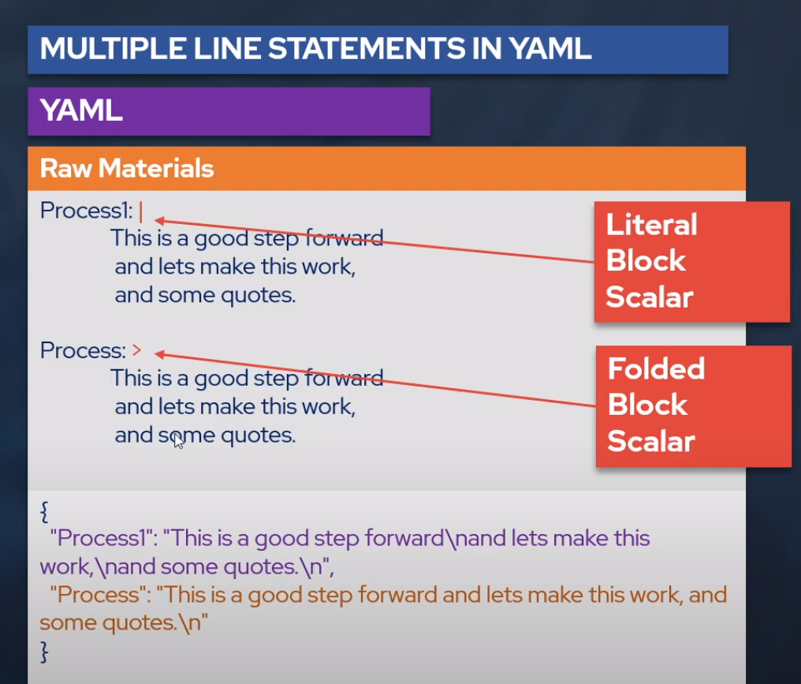

**Literal Block Scalar:** Gives newline the newline character “\n”.

**Folded Block Scalar**: Ignores newlines – allows you to write values
more neatly. Really handy for assigning an entries shell script to a
single variable.

## Booleans

Include True/false,TRUE/FALSE, yes/no, and on/off.

## Lists

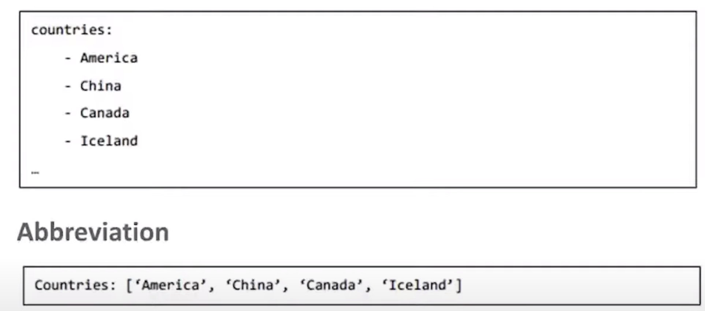

## Dictionaries

Dictionaries are only space-indented

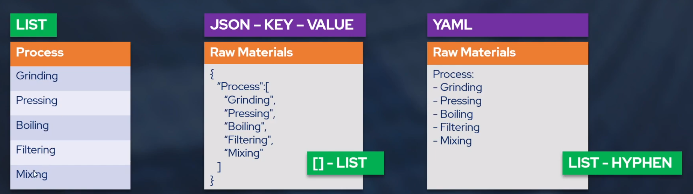

Dictionaries supports traditional JSON notation as well

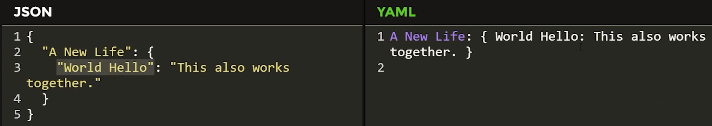

# Cloud Computing

## Debugging and Troubleshooting in the cloud.

- <https://cloud.google.com/compute/docs/troubleshooting/troubleshooting-instances>

- <https://docs.microsoft.com/en-us/azure/virtual-machines/troubleshooting/>

- [https://docs.aws.amazon.com/AWSEC2/latest/UserGuide/ec2-instance-troubleshoot.htm](https://docs.aws.amazon.com/AWSEC2/latest/UserGuide/ec2-instance-troubleshoot.html)

## Cloud computing vs Virtualization: 

<https://www.youtube.com/watch?v=14KJoDs6reg>

<https://www.educba.com/cloud-computing-vs-virtualization/>

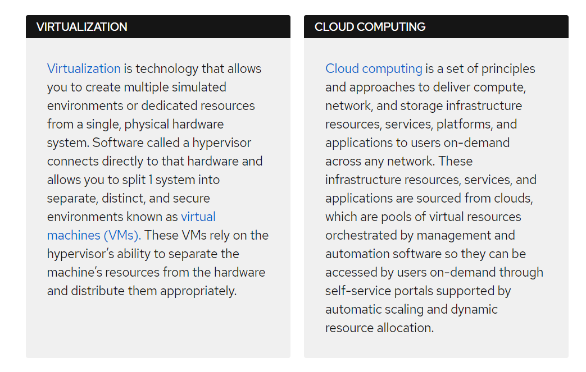

## Quotas & Rate Limiting

Here are some links to some common Quotas you’ll find in various cloud
providers

- <https://cloud.google.com/compute/quotas#understanding_vm_cpu_and_ip_address_quotas>

- <https://docs.aws.amazon.com/general/latest/gr/aws_service_limits.html>

- <https://docs.microsoft.com/en-us/azure/azure-subscription-service-limits#service-specific-limits>

## Monitoring and Alerting

- <https://www.datadoghq.com/blog/monitoring-101-collecting-data/>

- <https://www.digitalocean.com/community/tutorials/an-introduction-to-metrics-monitoring-and-alerting>

- <https://en.wikipedia.org/wiki/High_availability>

- <https://landing.google.com/sre/books/>

### Alerting and alerting systems

There's a bunch of different monitoring systems out there. Some systems
like AWS Cloudwatch, Google Stack Driver, or Azure Metrics are offered
directly by the Cloud providers. Other systems like Prometheus, Datadog,
or Nagios can be used across vendors. There's two ways of getting our
metrics into the monitoring system. Some systems use a pull model, which
means that the monitoring infrastructure periodically queries our
service to get the metrics. Other monitoring systems use a push model,
which means that our service needs to periodically connect to the system
to send the metrics. No matter how we get the metrics into the system,
we can create dashboards based on the collected data.

We expect a lot from our modern IT services. We expect them to be up and
running 24-7. We want to be able to get our work done whenever and
wherever. For that, we need our services to respond day or night,
workday or holiday. But even if the services are running 24-7, System
Administrators can't constantly be in front of their systems. Instead,
we set up our services so that they work unattended and deal with
problems when they happen. Now to do this, we need to detect those
problems so that we can deal with them as quickly as possible. If you
have no automated way of raising an alert, you might only find out about
the issue when you get a call from a frustrated user telling you that
your service is down. That's not ideal. It's much better to create
automation that checks the health of your system and notifies you when
things don't behave as expected. This can give you advance warning that
something's wrong, sometimes even before users notice a problem at all.
So how do we do that? The most basic approach is to run a job
periodically that checks the health of the system and sends out an email
if the system isn't healthy. On a Linux system, we could do this using
cron, which is the tool to schedule periodic jobs. We'd pair this with a
simple Python script that checks the service and sends any necessary
emails. This is an extremely simplified version of an alerting system,
but it shares the same principles. Is all alerting systems, no matter
how complex and advanced. We want to periodically check the state of the
service and raise alerts if there's a problem. When you use a monitoring
system like the ones we described in our last video, the metrics you
collect represent the state of your service. Instead of periodically
running a script that connects to the service and checks if it's
responding, you can configure the system to periodically evaluate the
metrics; and based on some conditions, decide if an alert should be
raised. Raising an alert signals that something is broken and a human
needs to respond. For example, you can set up your system to raise
alerts if the application is using more than 10 gigabytes of RAM, or if
it's responding with too many 500 errors, or if the queue of requests
waiting to get processed gets too long. Of course, not all alerts are
equally urgent. We typically divide useful alerts into two groups, those
that need immediate attention and those that need attention in the near
future. If an alert doesn't need attention, then it shouldn't have been
sent at all. It's just noise. If your web service is responding with
errors to 50 percent of the requests, you should look at what's going on
right away. Even if this means waking up in the middle of the night to
address whatever is wrong, you'll definitely want to fix this kind of
critical problem ASAP. On the other hand, if the issue is that the
attached storage is 80 percent full, you need to figure out whether to
increase the disk size or maybe clean up some of the stored data. But
this isn't super urgent, so don't let it get in the way of a good
night's sleep. Since these two types of alerts are different, we
typically configure our systems to raise alerts in two different ways.
Those that need immediate attention are called **<u>pages</u>**, which
comes from a device called a pager.

Before mobile phones became popular, pagers were the device of choice
for receiving urgent messages, and they're still used in some places
around the world. Nowadays, most people receive their pages in other
forms like SMS, automated phone calls, emails, or through a mobile app,
but we still call them pages. On the flip side, the non-urgent alerts
are usually configured to create bugs or tickets for an IT specialist to
take care of during their workday. They can also be configured to send
email to specific mailing lists or send a message to a chat channel that
will be seen by the people maintaining the service. One thing to
highlight is that all alerts should be actionable. If you get a bug or a
page and there's nothing for you to do, then the alert isn't actionable
and it should be changed or it shouldn't be there at all. Otherwise,
it's just noise. Say you're trying to check if your services database
back-end is responsive. If you do this by creating a query that returns
all rows in a large table, your request might sometimes timeout and
raise an alert. That would be a noisy alert, not really actionable.
You'd need to tweak the query to make the check useful. Say you run a
cron job that copies files from one location to another every 10
minutes, you want to check that this job runs successfully. So you
configure your system to alert you if the job fails. After putting this
in production, you realize there's a bunch of unimportant reasons that
can cause this job to temporarily fail. Maybe the destination storage is
too busy and so sometimes the job times out. Maybe the origin was being
rebooted right when the job started, so the job couldn't connect to it.
No matter why, whenever you go to check out what caused a job to fail,
you discover that the following run had succeeded and there's nothing
for you to do. You need to rethink the problem and tweak your alert.
Since the task is running frequently, you don't care if it fails once or
twice, you can change the system to only raise the alert if the job
fails three times in a row. That way when you get a bug, it means that
it's failing consistently and you'll actually need to take action to fix
it. All of this configuring and tweaking can seem like a lot of work.
You need to think about which metrics you care about. Configure your
monitoring system to store them, then configure your alerting system to
raise alerts when things don't behave as expected. The flip side is that
once you've set your systems to raise actionable alerts when needed,
you're going to have peace of mind. If no alerts are firing, you know
the service is working fine. This lets you concentrate on other tasks
without having to worry. To set up good alerts, we need to figure out
which situations should page, which ones should create bugs, and which
ones we just don't care about. These decisions aren't always easy and
might need some discussion with the rest of your team. But it can help
make sure that you spend time only on things that actually matter. Up
next, we'll talk about criteria that we can use to decide which
situation should raise alerts and what to do about them.

### Service-Level Objectives

We all know that some IT systems are more critical than others. Let's be
real, if you try to play a computer game that you haven't opened in a
year and it doesn't work, you probably won't care as much as if you're
trying to make a bank transfer and your bank's website is down.
Sometimes a piece of infrastructure can be down and the overall system
still works with degraded performance. For example, if the caching
server that makes your web application go faster is down, the app can
still function, even if it's running slower. No system is ever available
100% of the time, it's just not possible. But depending on how critical
the service is, it can have different **service level objectives**, or
**SLOs**. SLOs are pre-established performance goals for a specific
service. Setting these objectives helps manage the expectations of the
service users, and the targets also guide the work of those responsible
for keeping the service running. SLOs need to be measurable, which means
that there should be metrics that track how the service is performing
and let you check if it's meeting the objectives or not.

Many SLOs are expressed as how much time a service will behave as
expected. For example, a service might promise to be available 99% of
the time.

Heads up, when dealing with metrics and availability, we need to do a
little math to understand what those numbers mean in practice, but don't
worry, it's all pretty straightforward. If our service has an SLO of 99%
availability, it means it can be down up to 1 % of the time. If we
measure this over a year, the service can be down for a total of 3.65
during the year and still have 99% availability. Availability targets
like this one are commonly named by their number of nines. Our 99%
example would be a two 9 service, 99.9% availability is a three 9
service, 99.999% availability is a five 9 service. Five nine services
promised a total down time of up to five minutes in a year. Five nines
is super high availability, reserved only for the most critical systems.
A three nine service, aiming for a maximum of eight hours of downtime
per year, is fine for a lot of IT systems. Now, you might be wondering,
why not just make everything a five nine service? It's a good question.
The answer is, because it's really expensive and usually not necessary.
If your service isn't super critical and it's okay for it to be down
briefly once in a while having two or three nines of availability might
be enough. You can keep the service running with a small team.

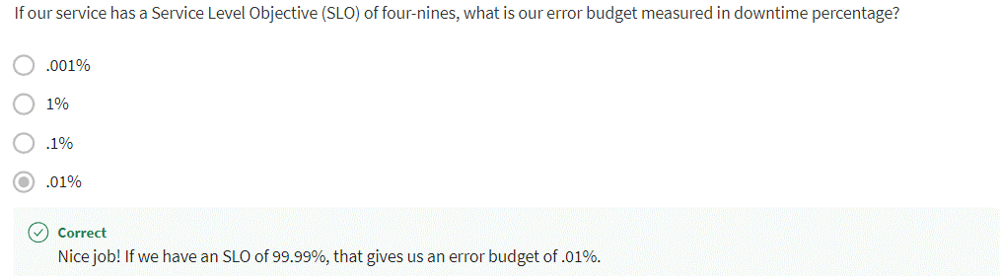

Five nine services usually require a much larger team of engineers to
maintain it. Any service can have a bunch of different service level
objectives like these, they tell its users what to expect from it. Some
services, like those that we pay for, also have more strict promises in
the form of **service level agreements**, or **SLAs**. A service level
agreement is a commitment between a provider and a client.

Breaking these promises might have serious consequences. Service level
objectives though are more like a soft target, it's what the maintaining
team aims for, but the target might be missed in some situations. As we
called out, having explicit SLOs or SLAs is useful for both the users of
that service and the team that keeps the service running. If you're
using a cloud service, you can decide how much you're going to entrust
your infrastructure to it, based on the SLAs that the provider
publishes. If on the other hand you're part of the team that maintains
the service, you can use the SLOs and SLAs of your service to decide
which alerts to create and how urgent they should be. Say you have a
service with an SLO that says that at least 90% of the requests should
return within 5 seconds. To know if your service is behaving correctly,
you need to measure how many of the total requests are returning within
those 5 seconds, and you want that number to always be above 90%. So you
might set up a non-paging alert to notify you if less than 95% return
within 5 seconds, and a paging alert if less than 90% return promptly.
If you're in charge of a website, you'll typically measure the rate of
responses with 500 return codes to check if your service is behaving
correctly. If your SLO is 99% of successful requests, you can set up a
non-paging alert if the rate of errors is above 0.5%, and a paging alert
if it reaches 1%. In an earlier video, we called out that services
usually break because something changed. That's also often the case when
looking at what makes services go out of SLO. If your service was
working fine and meeting all of its SLOs and then started misbehaving,
it's likely this was caused by a recent change. That's why some teams
use the concepts of error budgets to handle their services.

Say you're running a service that has three nines of availability. This
means the service can be down 43 minutes per month, this is your error
budget. You can tolerate up to 43 minutes of downtime, so you keep track
of the total time the service was down during the month. If it starts to
get close to those 43 minutes, you might decide to stop pushing any new
features and focus on resolving the problems that keep causing the
downtime. Now, all this talk of nines, availability and downtime can
have your head spinning if you've never done this before, and that's
totally normal. If it's your first time setting objectives for your
service, start by setting achievable goals that you can measure.

Track how the service behaves for a while and see what causes the
service to deviate from the targets. Once you have a better idea of the
whole service's behavior, you can set more aggressive goals. Up next,
we'll go back to our VMS running in the cloud and demonstrate how we can
monitor them using the tools offered by the provider.

## GCP (Googe cloud)

Install SDK (CLI): <https://cloud.google.com/sdk/docs/install-sdk#linux>

Docs: <https://cloud.google.com/sdk/docs>

Check out the following links for more information:

- [*<u>Getting started on GCP with
  Terraform</u>*](https://cloud.google.com/community/tutorials/getting-started-on-gcp-with-terraform)

<!-- -->

- [*<u>Creating groups of unmanaged
  instances</u>*](https://cloud.google.com/compute/docs/instance-groups/creating-groups-of-unmanaged-instances)

- Official documentation is here:
  <https://cloud.google.com/load-balancing/docs/https/>

- <https://geekflare.com/gcp-load-balancer/>

**Creating instances**

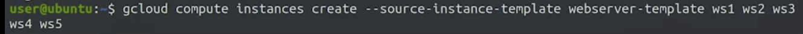

- [*<u>https://cloud.google.com/compute/docs/quickstart-linux</u>*](https://cloud.google.com/compute/docs/quickstart-linux)

- [*<u>https://cloud.google.com/compute/docs/instances/create-vm-from-instance-template</u>*](https://cloud.google.com/compute/docs/instances/create-vm-from-instance-template)

*another example (creating from template vm1-template)*

gcloud compute instances create --zone us-west1-b
--source-instance-template vm1-template vm2 vm3 vm4 vm5 vm6 vm7 vm8

**List instances**

gcloud compute instances list

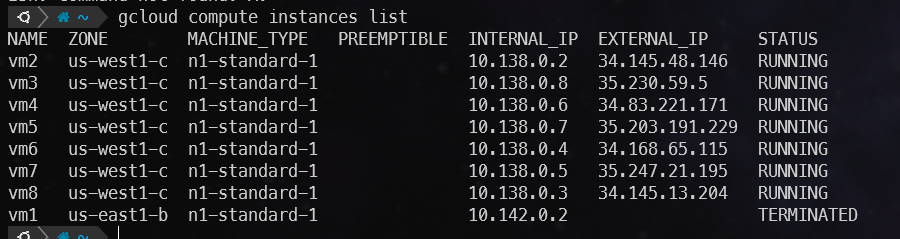

# Orchestration without containerization

## Discussion: Compare contrast Orchestration tool (Ansible, Shef, Puppet)

**Popular Orchestration/DevOps tools**

- <u>Agent-less options</u>

  - Ansible

- <u>Agent options</u>

  - Chef

  - Puppet

**Case sample** : here we have a misconfigured web server. By checking
in with our Orchestration program (in this case chef) we are notified of
what tools, files, programs are missing and they are automatically
installed. Usually a “check-in” would run on a cron job and it would
catch any new updates/configurations manages by the orchestration tool
with a single line of code.

Chef client checking in : **sudo chef-client**

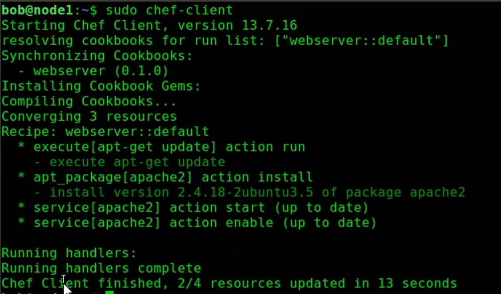

Everybody wants to be a secret agent. But sometimes, they're just not
the right tool for the job. Seriously, though, DevOps tools come in one
of two flavors when it comes to configuration management. You can either
have an agent that goes on every client computer, or you can use a
system that is agentless and just connects to a computer without needing
to install anything in advance.

Ansible is an example of an agentless system. And Chef and Puppet both
use agents. Now, what do I mean? Well, basically, we have these two
different systems. Chef, we've looked at actually in our last Nugget. It
is a system that has a server, and on that server is where the list of
all of your configurations are stored.

And then a client computer will phone home and say, what do I need to
put on it. But to do this phoning home, it requires that there is a Chef
client installed on every node that is being configured. So that
networks fine because there are Chef clients for Debian and for CentOS
and for pretty much every Linux operating system out there.

And so the Chef client is installed, and then it phones in, and it
installs all the things that need to be done. And the Chef client is
really nice, because it can do things like keep track of all sorts of
information about the computer itself, and keep a local database of that
information, and use that to determine what sort of stuff it pulls from
Cher's server, et cetera, et cetera.

But there are some cases where you just can't install a Chef client. And
a perfect example of that is an embedded system. If you have a tiny
little system that is in running embedded Linux, it may be running an
SSH server, but you can't actually install Chef client.

It just doesn't have the resources or the libraries necessary to install
the full-blown client. And so you need to use a system like Ansible that
doesn't require anything special to be installed on the node that you
are managing. Now, you can use Ansible to manage things like full-blown
Debian or CentOS installs.

But you can also use it to manage things that can't support a client
install of Chef. And that's where I really, really like Ansible, because
there's nothing to install on the nodes that you are configuring.
Basically, Ansible just comes in with SSH that is installed on almost
everything, including embedded systems, and then it will kind of push
into it and make it install the things or configure the things or change
files, et cetera, et cetera, with all the stuff that is installed in
Ansible here.

So basically, Ansible just logs in and does all of the things on the
local computer from here. It doesn't require anything installed. And so
this is an agent. This doesn't have an agent. So that's the difference
between agent and agentless. And if you remember, on our Chef computer,
when we had it install the web server, if you look up here when we ran
sudo Chef client-- well, Chef client is that agent that is installed on
the node computer itself.

This is the program that it uses to phone home to figure out what it
should use. If we were using Ansible in this situation, there would be
nothing installed on node 1 except for maybe an SSH server so it can
connect. But it actually wouldn't execute anything, any code of
Ansible's locally, because there is no local client.

Now, your instinct might be to say, why would I ever use anything except
an agentless system. Well, there are some advantages that having an
agent installed on your system will give you. For example, this
computer, Chef or Puppet, will be able to phone home.

It will be able to pull a configuration down from the Chef server into
itself, whereas with Ansible, there is no pulling that's going to
happen, because it doesn't have anything to pull with. You're going to
have to use your Ansible machine to connect to every client computer and
do it that way, whereas this gives you a little bit more flexibility.

Anyway, that's the difference. And depending on your scenario, that's
how you're going to pick which type of system makes more sense. I hope
this has been informative for you, and I'd like to thank you for
viewing.

### IaC (Infrastructure-as-code)

#### Comparing IaC providers

In our last video, we talked about how we need to orchestrate complex
Cloud setups. This includes handling a bunch of different nodes with
different workloads, managing the complexity of deploying a hybrid
setup, or modifying deployments across several Data centers. Back at the
beginning of the course, we talked about infrastructure as Code, and we
called out that storing our infrastructure in a code like format, lets
us create repeatable infrastructure, and that using Version control for
the storage, means that we can keep a history of what we've done and
easily rollback mistakes. These principles also apply to Cloud
infrastructure. The way we store it might be a little different
depending on the tools that we use, but we'll still be storing this
configuration in a code like format using Version control to keep track
of the changes. This lets us manage large-scale solutions with a small
team. We can very quickly have an idea of what the deployment looks
like, by looking at the configuration. We can try new things out and
roll back if anything goes wrong. We can look at the history of changes
to figure out why a specific change was made, and much more. Most Cloud
providers offer their own tool for managing resources as code. Amazon
has Cloud Formation, Google has Cloud Deployment Manager, Microsoft has
Azure Resource Manager, and OpenStack has Heat Orchestration Templates.
These tools are specific to the Cloud provider, which means it can be
complex and cumbersome to move to a different provider or combine a
Cloud deployment with an on-premise deployments. An option that's
becoming really popular in the Orchestration field, is called Terraform.
Similar to Puppet, Terraform uses its own Domain-specific language which
lets us specify what we want our Cloud infrastructure to look like. The
cool thing about Terraform is that it knows how to interact with a lot
of different Cloud providers and automation vendors. So you can write
your Terraform rules to deploy something on one Cloud provider, and then
use very similar rules to deploy the service to a different Cloud
provider. Terraform uses each Cloud provider's API to accomplish this.
This keeps you from having to learn a new API when moving to a different
Cloud provider, and lets you focus on the infrastructure design. We saw
in earlier videos how we can have a puppet rule that specifies that a
computer should install a given package, and that the local puppet agent
analyzes the computer and decides which installation mechanism to use
depending on the operating system, the specific Linux distro and so on.
A similar thing happens with Terraform. The rules that define the
resources like the VMs or containers to use, will use specific values
related to the Cloud provider like selecting which machine type to use
or in what region to deploy it. But a lot of the overall configuration
is independent of the provider, and can be reused if we decide to move
our configuration to a different provider or we want to use a hybrid
setup. Of course Terraform isn't the only option. Puppet itself also
ships with a bunch of plug-ins that can be used to interact with the
different Cloud providers to create and modify the desired Cloud
infrastructure. Finally, let's spend a moment talking about the contents
of the nodes or instances managed by the Orchestration tools. When
dealing with nodes in the Cloud, there are basically two options. Either
they're long-lived and their contents need to be periodically updated,
or they are short-lived and updates are made by deleting the old
instances and deploying new ones. Long-lived instances are typically
servers that are not expected to go away. Things like your company's
internal mail server or internal document sharing servers, will manage
these instances using a configuration management system like Puppet,
which can deploy any necessary changes to the machines while they're
running. This keeps them updated to the latest state. On the flip side,
short-lived instances come and go very quickly. For these cases, it
makes less sense to apply changes while they're running. Instead, we
normally apply the configuration that we want the instances to have when
they start, and we deploy any future changes by replacing the instances
with new ones. We can still use Puppet for the initial setup, but we
don't need to run the agent periodically, only at the start. If all this
sounds super complex, that's okay. There's a lot to learn about Cloud
Orchestration, and many of these concepts will make more sense once
you've tried them out. Up next, we've gathered some additional info you
can use if you want to find out more. Then there is a quick quiz to put
all of these concepts together.

#### What is Infrastructure-as-code?

We've called out that when we use a configuration management system, we
write rules that describe how the computers in our fleet should be
configured. These rules are then executed by the automation, to make the
computers match our desired state. This means that we can model the
behavior of our IT infrastructure in files that can be processed by
automatic tools. These files can then be tracked in a version control
system. Remember, version control systems help us keep track of all
changes done to the files, helping answer questions like who, when, and
why. More importantly, they're super-useful when we need to revert
changes. This can be especially helpful if a change turns out to be
problematic. The paradigm of storing all the configuration for the
managed devices in version controlled files is known as Infrastructure
as Code or IaC. In other words, we see that we're using Infrastructure
as Code when all of the configuration necessary to deploy and manage a
node in the infrastructure is stored in version control. This is then
combined with automatic tooling to actually get the nodes provisioned
and managed. If you have all the details of your Infrastructure properly
stored in the system, you can very quickly deploy a new device if
something breaks down. Simply get a new machine, either virtual or
physical, use the automation to deploy the necessary configuration, and
you're done. The principals of Infrastructure as Code are commonly
applied in cloud computing environments, where machines are treated like
interchangeable resources, instead of individual computers. This
principle is also known as treating your computers as cattle instead of
pets because you care for them as a group rather than individually.
Apologies to anyone with a pet cow. This concept isn't just for managing
computers in huge data centers or globe spanning infrastructures, it can
work for anything; from servers to laptops, or even workstations in a
small IT department. Even if your company only has a single computer
working as the mail server, you can still benefit from storing all the
configuration needed to set it up in a configuration management system.
That way if the server ever stops working, you can deploy a replacement
very quickly by simply applying the rules that configure the mail server
to the new computer. One valuable benefit of this process is that the
configuration applied to the device doesn't depend on a human
remembering to follow all the necessary steps. Rest assured, silly
human, the result will always be the same, making the deployment
consistent. As mentioned, having Infrastructure as Code means that we
can also apply the benefits of the version control system or VCS to your
infrastructure. Since the configuration of our computers is stored in
files, those files can be added to a VCS. This has all the benefits that
version control systems bring. It gives us an audit trail of changes, it
lets us quickly rollback if a change was wrong, it lets others reviewed
our code to catch errors and distribute knowledge, it improves
collaboration with the rest of the team, and it lets us easily check out
the state of our infrastructure by looking at the rules that are
committed. Not too shabby. I personally think this is one of the coolest
things about IaC. The ability to easily see what configuration changes
were made and roll back to a known good state is super important. It can
make a big difference in quickly recovering from an outage, especially
since changing the contents of the configuration file can be as
dangerous as updating the version of an application. I've had my fair
share of outages caused by an innocent-looking change with unintended
side effects. But storing all the infrastructure in a version control
system lets me quickly roll back to a previously known good version so
that the outage length can be minimized. On top of that, having the
rules stored in files means that we can also run automated tests on
them. It's much better to find out in a test that a configuration file
has a typo in it than to find out from our users. In a complex or large
environment, treating your IT Infrastructure as Code can help you deploy
a flexible scalable system. A configuration management system can help
you manage that code by providing a platform to maintain and provision
that infrastructure in an automated way. Having your infrastructure
stored as code means that you can automatically deploy your
infrastructure with very little overhead. If you need to move it to a
different location, it can be deployed, de-provisioned, and redeployed
at scale in a different locale with minimal code level changes. To sum
all of this up, managing your Infrastructure as Code it means that your
fleet of nodes are consistent, versioned, reliable, and repeatable.
Instead of being seen as precious or unique, machines are treated as
replaceable resources that can be deployed on-demand through the
automation. Any infrastructure that claims to be scalable must be able
to handle the capacity requirements of growth. Performing an action like
adding more servers to handle an increase in requests is just a possible
first step. There are other things that we might need to take into
account, such as the amount of traffic that network can handle or the
load on the back end servers like databases. Viewing your infrastructure
in this way helps your IT team adapt and stay flexible. The technology
industry is constantly changing and evolving. Automation and
configuration management can help you embrace that change instead of
avoiding it. Before diving into concrete examples of what this looks
like, the first practice quiz of the course is coming up. These quizzes
act as check-in points to help you make sure all the concepts covered in
the videos are making sense. See you on the other side.

## Push vs Pull Configuration

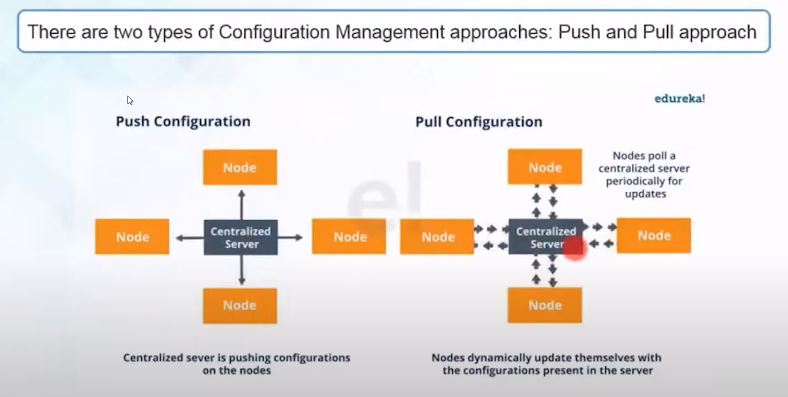

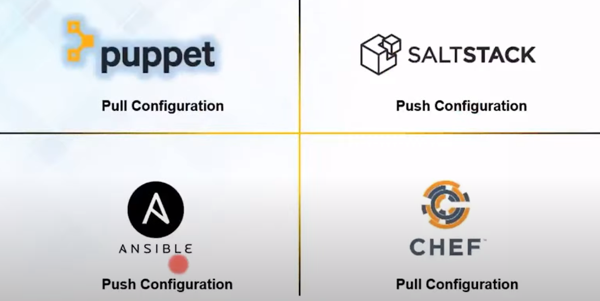

## Orchestration Tools

### SaltStak

SaltStack is an orchestration tool that utilizes both agent and
agentless options and supports the use of Python and YAML

### Ansible

#### Overview

**Great intro**: <https://youtu.be/1id6ERvfozo>

**Another**: <https://youtu.be/wgQ3rHFTM4E>

**Another**: https://youtu.be/MNGfPn0Yvs8

<https://youtu.be/EcnqJbxBcM0>

<https://linuxconfig.org/ansible-tutorial-for-beginners-on-linux>

[Ansible tutorial for beginners on Linux - Linux Tutorials - Learn Linux
Configuration](https://linuxconfig.org/ansible-tutorial-for-beginners-on-linux)

Helpful Links:

[Understanding privilege escalation: become — Ansible
Documentation](https://docs.ansible.com/ansible/latest/user_guide/become.html)

Note: Ansible is agent-less unlike chef or puppet.

**Why it’s more efficient**

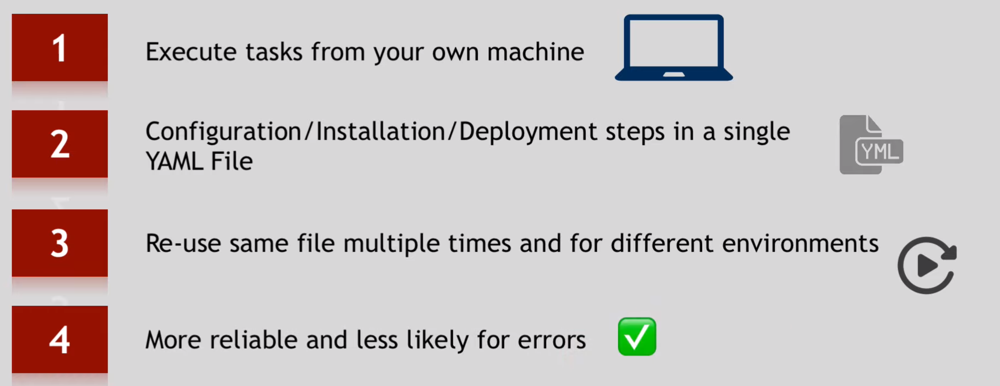

**How it works**

- **Inventory** files contain important info about your ansible
  anvironment like which hosts will serve as receiving clients.

- **Yaml** files are created which perform small tasks (these files are
  called modules).

- Ansible on a primary machine (ansible server) will use SSH to push
  modules out to other machines.

- Playbooks can group together multiple modules for more complex tasks.

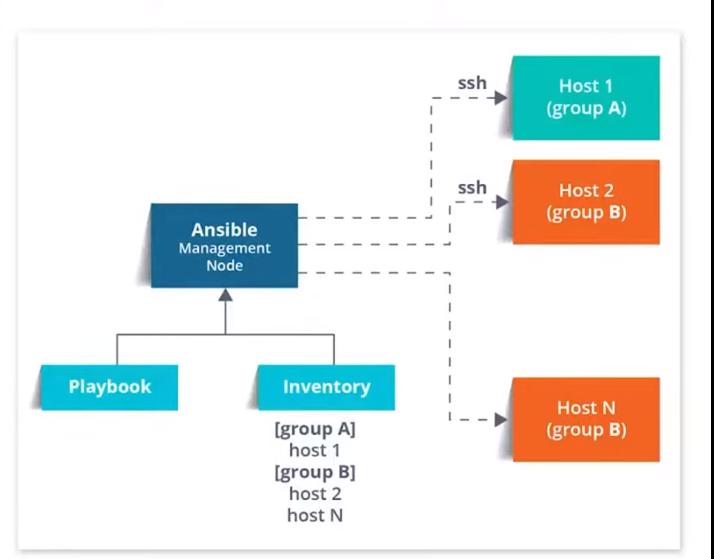

#### Installing Ansible

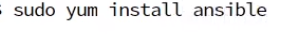

^ RedHat distro – Debian uses apt.

Installing on an AWS AMI

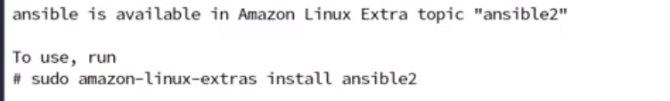

#### Using Ansible

<https://linuxconfig.org/ansible-tutorial-for-beginners-on-linux>

**Config folder** : /etc/ansible

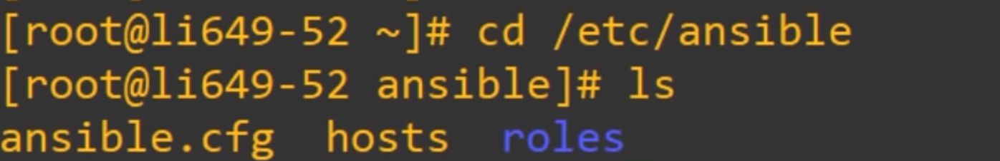

##### Inventory file (hosts)

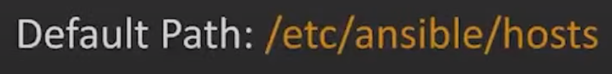

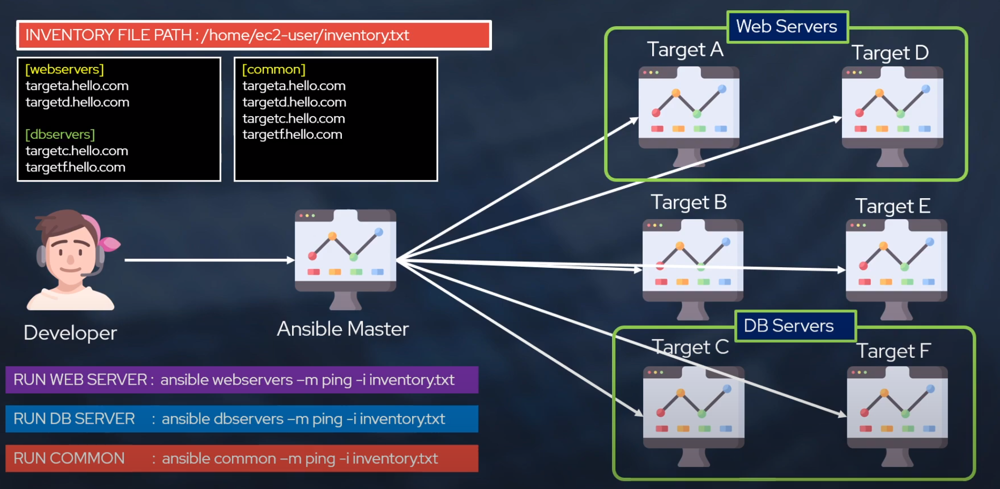

Place your systems Ips in a host group and name whatever you like, here
we use “webservers”,”linux”,and “droplets”

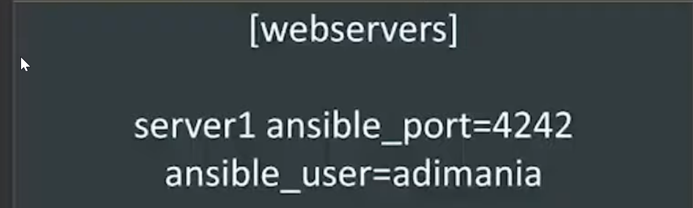

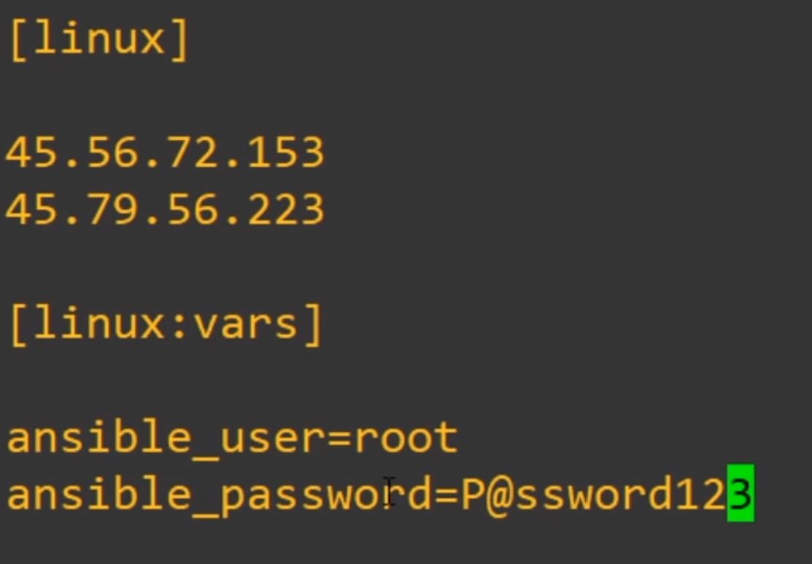

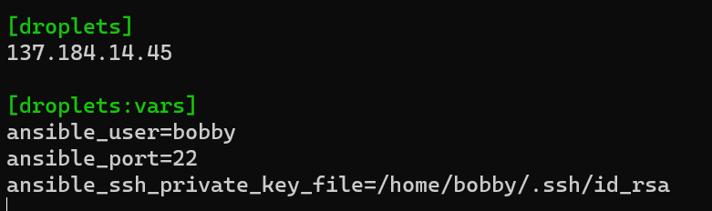

^ Host node must have an ssh key generated who’s public key is in the
**authorized_keys** files of all the client nodes.

Note: Ips can be public or private if they are in same VPC (network).

**Sudo commands**

***These require privilege escalation***

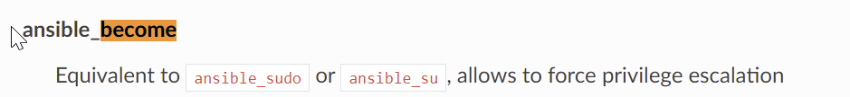

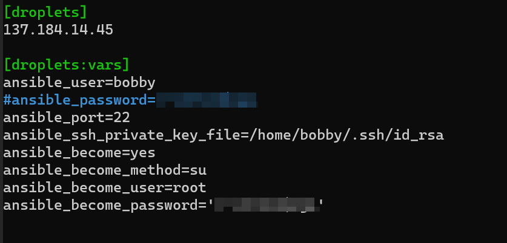

^ that pw is the root pw.

Note: if you define **anisble_password** and it’s define before
**ansible_become_password** then ansible will assume you are trying to
log in merely as user (with ansible_password) which may cause issues if
you are trying to auth with ssh keys.

Note: **ansible_become_password** is not the user’s password, but the
actuall password of the root user.

***Multiple nodes/different creds***

*<u>Using “:vars” means those variables will be applied to all client
nodes.</u>*

If you want to define multiple clients hosts with different
creds/configuration, give each it’s one target name and specific all
settings on each line.

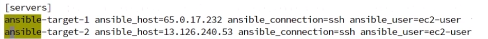

*Full working example*

\[droplets\]

centos-node ansible_host=10.124.0.3 ansible_connection=ssh
ansible_user=bobby ansible_port=22
ansible_ssh_private_key_file=/home/bobby/.ssh/id_rsa ansible_become=yes
ansible_become_method=su ansible_become_user=root
ansible_become_password={PASS}

fedora-node ansible_host=10.124.0.4 ansible_connection=ssh
ansible_user=bobby ansible_port=22
ansible_ssh_private_key_file=/home/bobby/.ssh/id_rsa ansible_become=yes
ansible_become_method=su ansible_become_user=root
ansible_become_password={PASS}

##### Testing and basic commands

Note: In these examples “linux” is the name of my host group.

**Ping your clients**

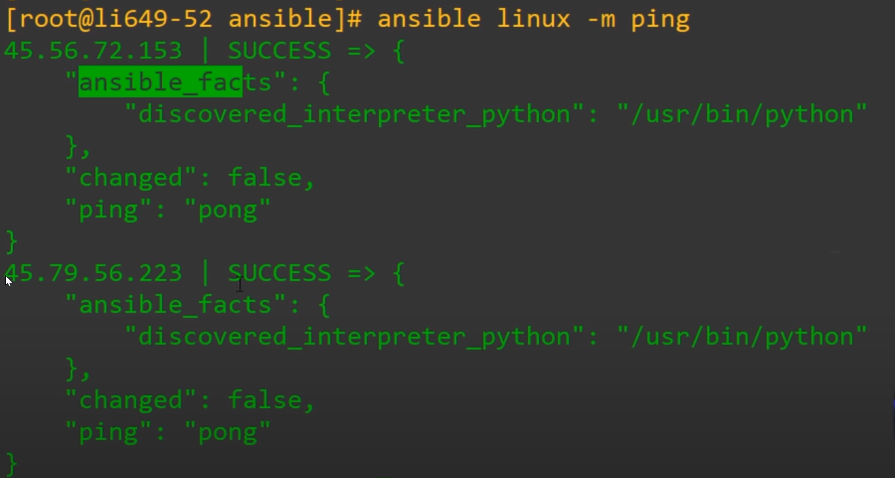

**Run a command on all clients**

**Reboot your clients**

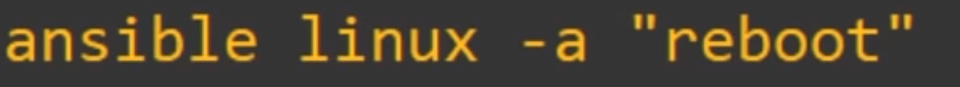

**Create and run a playbook**

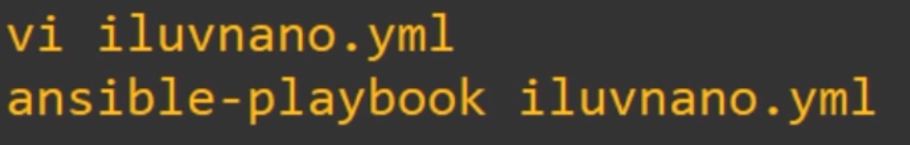

##### ­Ansible modules

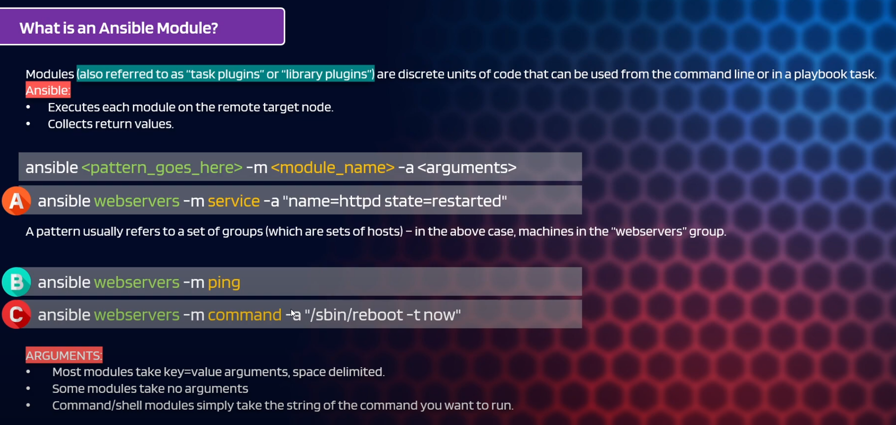

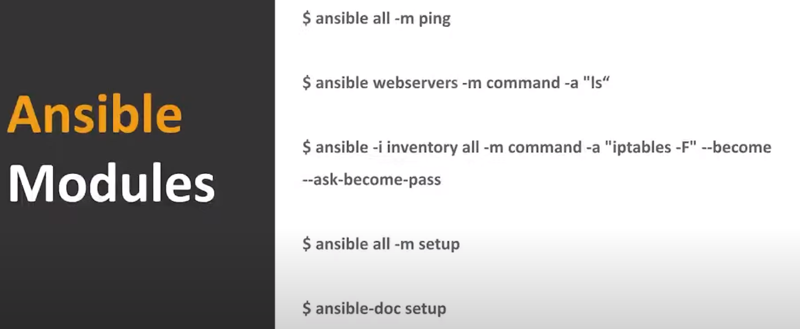

**Arguments**

Most arguments use key value paris or space-separated arguments. Some
module take no arguments.

###### Ping module

Useful to make sure your client nodes are online.

###### Command module

Use the command module to pass in shell commands as arguments

ansible droplets -m command -a "/bin/touch
/home/bobby/testfromserver.txt"

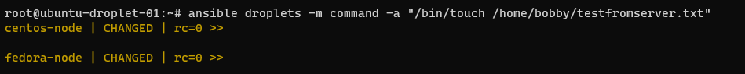

##### Service module

Equivalent to sysvinit **service** command or system **systemctl**
command – i.e. this allow you to manage services. Arguments are passed
in as key-value pairs.

##### Creating a Playbook

A playbook is composed of “play” each of which is named has a one or
more task(s) associated with that play where each task is also named.

Playbooks are saved in a yaml file.

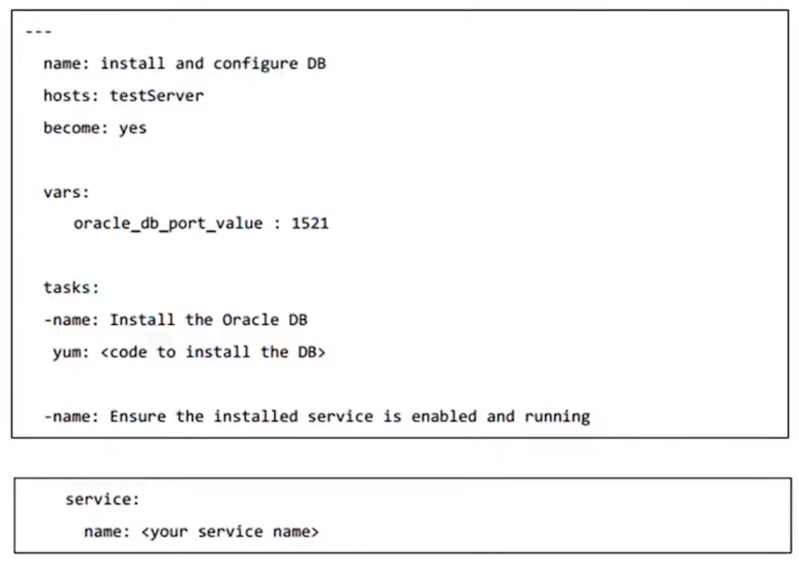

#### Ansible Tower

An enterprise level version on ansible consisting of a web-based GUI.

### Puppet

#### Tutorials and Resources

**Resources:**

<https://puppet.com/docs/puppet/latest/lang_resources.html>

<https://puppet.com/blog/deploy-packages-across-your-windows-estate-with-bolt-and-chocolatey/>

**Tutorials**

<https://www.youtube.com/watch?v=Ns_tRKD20c4>

<https://www.youtube.com/watch?v=F-NGOvYiV9g>

#### An introduction to Puppet

Puppet is the current industry standard for managing the configuration
of computers in a fleet of machines. Part of the reason why Puppet is so
popular is that it's a cross-platform tool that's been around for a
while. It's an open source project that was created in 2005, and it's
gone through several different versions. As it's evolved, the tool has
incorporated feedback from its users to make it more and more useful.
The latest available version at the time this Google course went live is
Puppet 6, which came out in late 2018. We typically deploy puppet using
a client-server architecture. The client is known as the Puppet agent,
and the service is known as the Puppet master. When using this model,
the agent connects to the master and sends a bunch of facts that
describe the computer to the master. The master then processes this
information, generates the list of rules that need to be applied on the
device, and sends this list back to the agent. The agent is then in
charge of making any necessary changes on the computer. This is a
pull-based architecture, where the client node (puppet agent) “pulls”
tasks from the puppet master. This stands in contrast to Ansible for
example, which is a push-based architecture where the master “pushes”
tasks to the agents.

The **catalog** is the list of rules that are generated for one specific
computer once the server has evaluated all variables, conditionals, and
functions.

**Master-Slave Architecture**

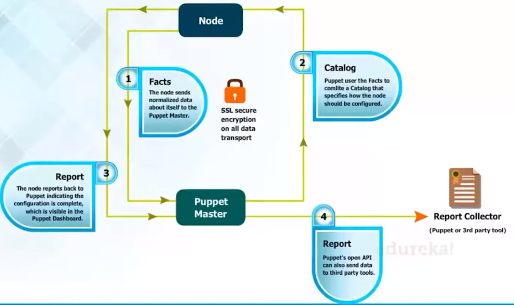

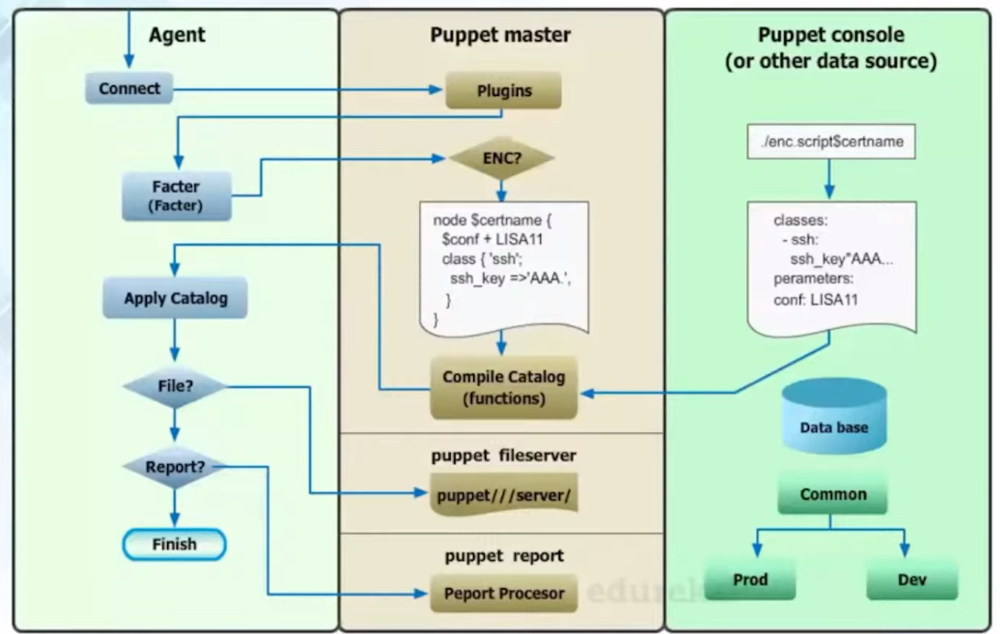

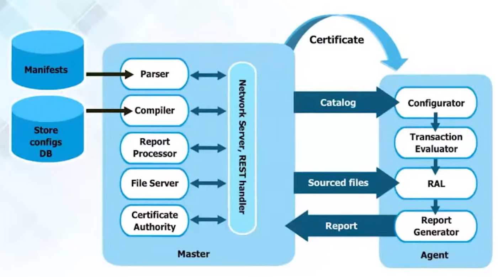

**Rules**

Puppet is a cross-platform application available for all Linux
distributions, Windows, and Mac OS. This means that you can use the same
puppet rules for managing a range of different computers. What are these
rules that we keep talking about? Let's check out a very simple example.

This block is saying that the package 'sudo' should be present on every
computer where the rule gets applied. If this rule is applied on 100
computers, it would automatically install the package in all of them.
This is a small and simple block but can already give us a basic
impression of how rules are written in puppet. Don't worry too much
about the syntax now, we'll look into what each piece means in future
videos.

There are various installation tools available depending on the type of
operating system. Puppet will determine the type of operating system
being used and select the right tool to perform the package
installation. On Linux distributions, there are several package
management systems like APT, Yum, and DNF. Puppet will also determine
which package manager should be used to install the package. On Mac OS,
there's a few different available providers depending on where the
package is coming from. The Apple Provider is used for packages that are
part of the OS, while the MacPorts provider is used for packages that
come from the MacPorts Project. For Windows, we'll need to add an extra
attribute to our rule, stating where the installer file is located on
the local desk or a network mounted resource. Puppet will then execute
the installer and make sure that it finishes successfully. If you use
Chocolatey to manage your windows packages, you can add an extra
Chocolatey provider to Puppet to support that. We'll add a link to more
information about this in our next reading. Using rules like this one,
we can get puppet to do a lot more than just install packages for us. We
can add, remove, or modify configuration files stored in the system, or
change registry entries on Windows. We can also enable, disable, start,
or stop the services that run on our computer. We can configure crone
jobs, the scheduled tasks, add, remove, or modify Users and Groups or
even execute external commands, if that's what we need. There's a lot to
say about puppet. We won't go into absolutely every detail, but we'll
cover the most important concepts in this course. The goal is to get you
started with what you need to know about configuration management in
general and puppet in particular. We'll also give you pointers to find
out more information on your own. Up next, we'll check out the different
resources we can use to define our rules.

#### Installation and setup

##### Configuration files

**Main puppet conf:** /etc/puppet/puppet.conf

**Base folder for manifests/modules:**
/etc/puppet/code/environments/production/

**Profile module:**
/etc/puppet/code/environments/production/modules/profile/manifests

##### Step 1: Installing and configuring

###### Server node (puppet master)

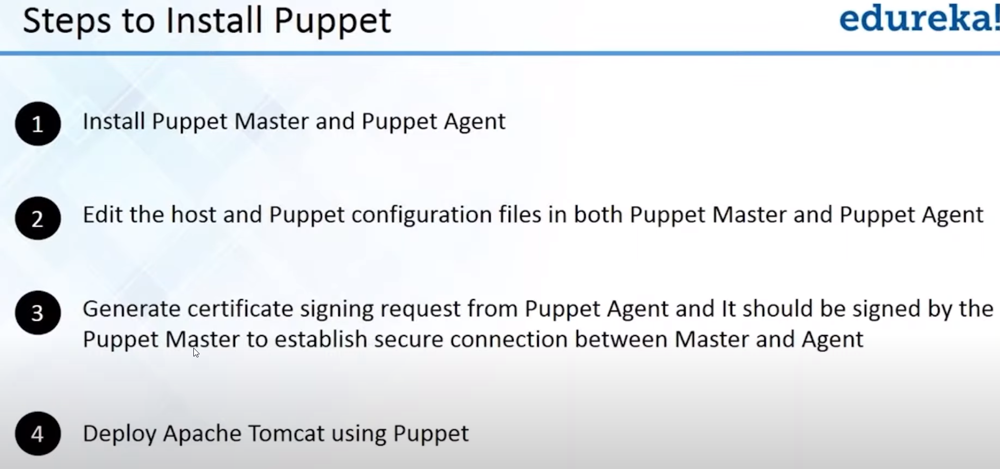

**Clear firewall**

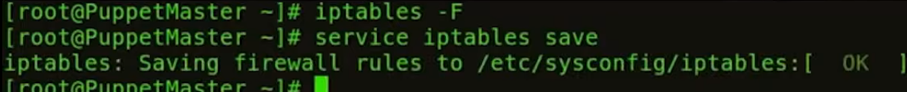

**Installation using apt:**

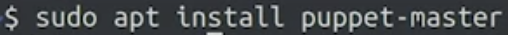

Could also install by finding /downloading package zip.

**Edit your hosts file with your localip (/etc/hosts):**

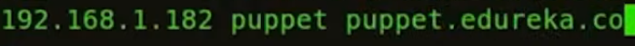

**Add host names to /etc/puppet/puppet.conf (in “main” section):**

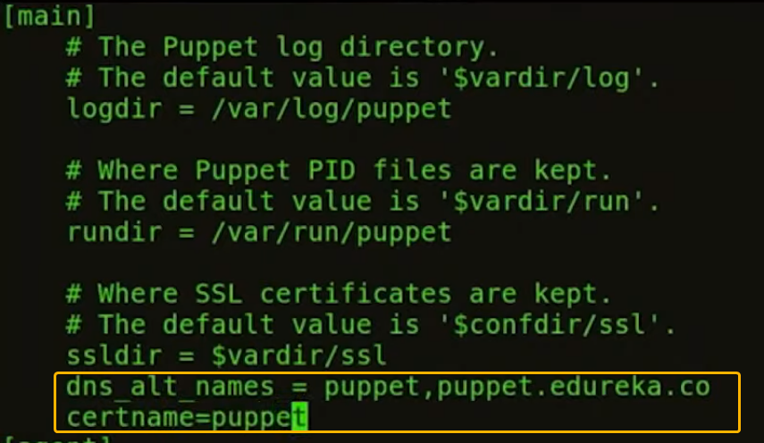

**Start the puppet service**

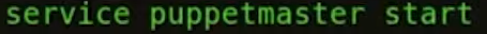

###### Agent (client node)

**Clear firewall**

**Install puppet using yum/apt**

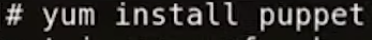

**Edit the hosts file to make this puppet agent:**

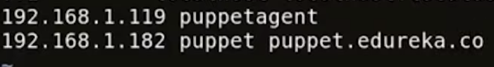

**Edit /etc/puppet/puppet.conf (add in ip or hostname of puppet
master)**

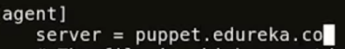

Another way to do this is via the cmdline:

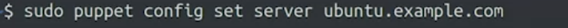

**Start puppet service**

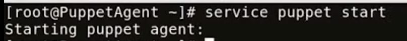

##### Step 2: Setting up shared certificate for master/agent communication

**Auto-Signing**

You can enable auto-signing on the master node but it should only be
used for testing purposes.

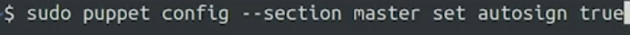

###### Create/receive CSR

####### Server node (master)

**Stop service:**

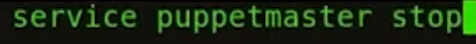

**Create new key (using hostnames)**

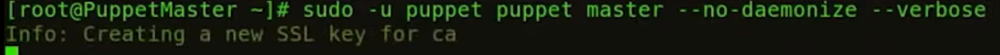

*Stop hanging terminal (ctrl+c) once you see version num displayed:*

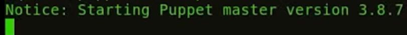

**Create a running resource:**

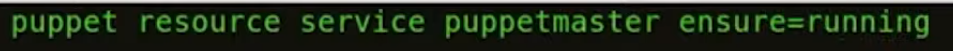

####### Agent node

**Stop service:**

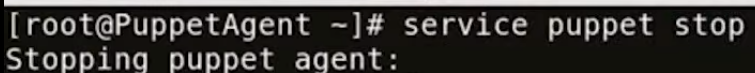

**Create CSR for puppetmaster:**

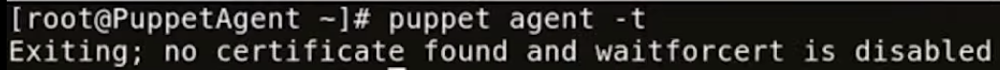

###### Sign/Verify CSR

####### Master node

**On <u>master node</u>, view the CSR sent by the agent:**

**Sign CSR:**

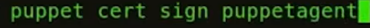

####### Agent

**Now on <u>agent node</u>, start the puppet service as a resource:**

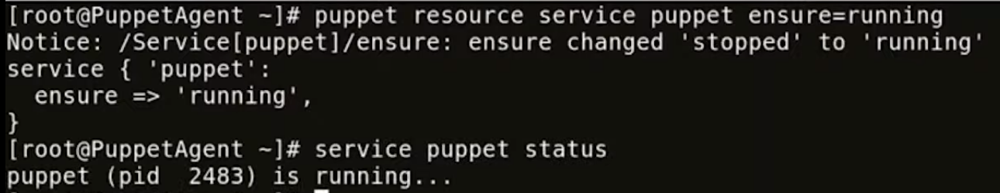

Also on agent, view fingerprint of signed cert:

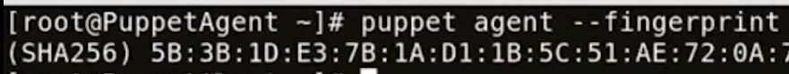

**Update agent with changes made in master (signing of cert)**

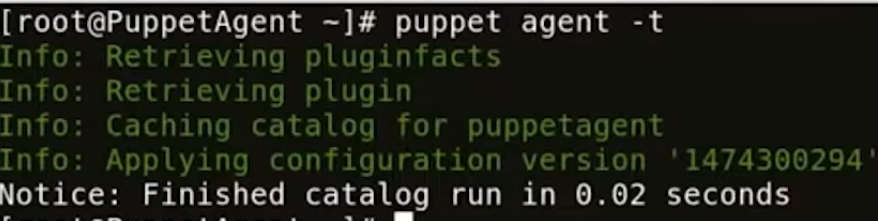

**Test connection to master**

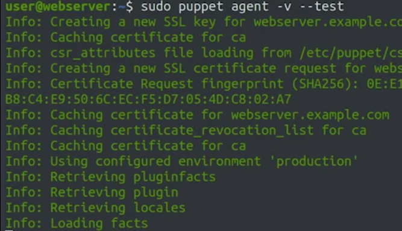

##### Step 3: Manifests (file of rules) and Rules

###### Creating and Running a manifest file

**Main Manifest file**

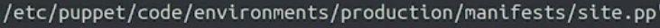

**Creating a manifest**

We now have the package installed and can start trying out a few rules.
We'll begin by creating the simplest possible Puppet file. To do this,
we first have to create a file where we'll store the rules that we want
to apply. In Puppet lingo, these files are called **manifests** and they
must end with a **.pp** extension.

*File: ~/tools.pp*

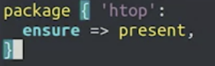

**On Rules**

**Rules** contain a **<u>resource</u>** (such as package, file, etc) a
**<u>title</u>** (name that corresponds to your resource, for example a
package name if your resource is set to “package “) and
**<u>attributes</u>** (details declaring the desired end-state).

Rules are saved in files with the “pp” extension:

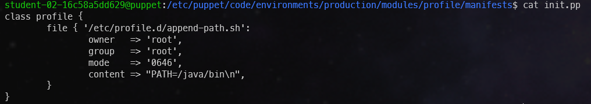

Usually the file name is “init.pp” if it’s a module or “site.pp” if it’s
the main manifest file.

A **class** is a collection of one or more rules:

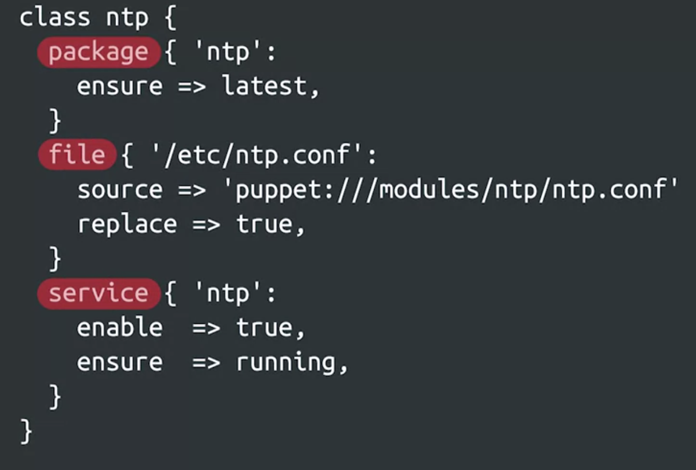

**<u>Examples:</u>**

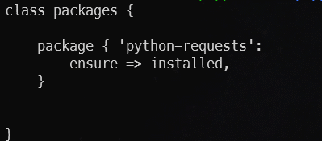

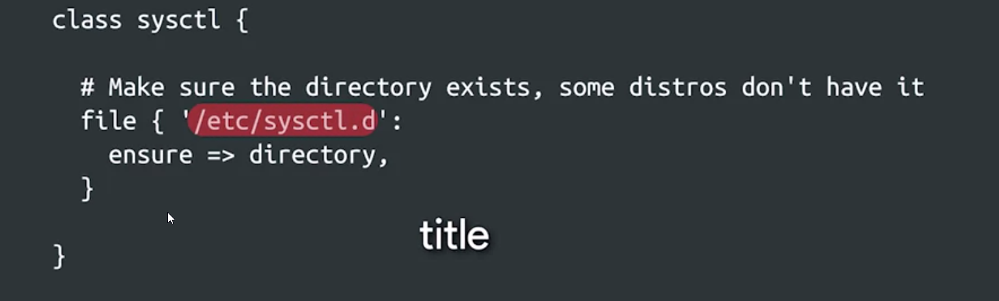

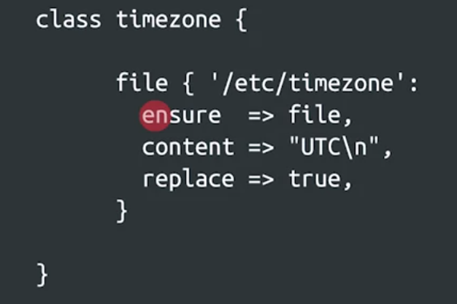

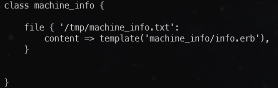

gathers some information from the machine using **Puppet** facts and
then stores it in a file. Currently, the module is always storing this
information in /tmp/machine_info.

###### Node definitions to group agents

**Node**: Any system that can run a puppet agent.

The node definitions are typically stored in a file called **site.pp**,
which isn't part of any module. Instead, it just defines what classes
will be included for what nodes. <u>This is your main manifest file</u>.
Note that instead of “class” we use “node” to define the default node.

**The default node**

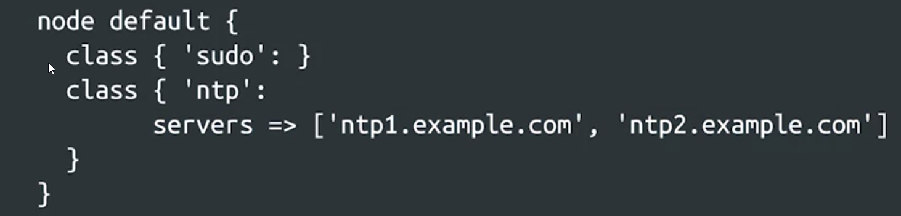

^ here you can include all the merging

**“webserver” node definition**

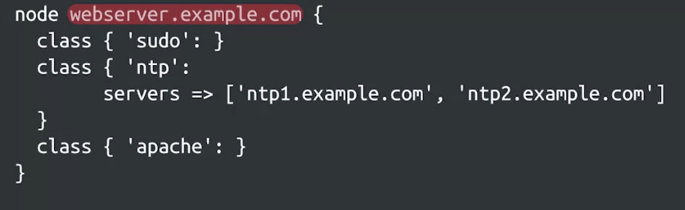

**Both**

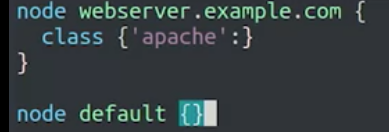szzzzzzzzzzzzzzzzzzzzzzzzzzzzzzzzzz

###### Resource Relationships

Example:

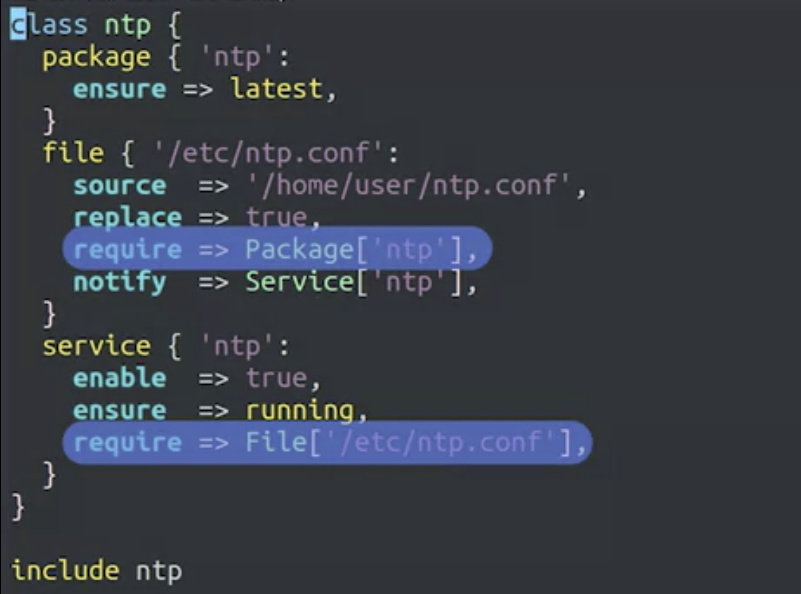

This is part of Puppet syntax. We write resource types in lowercase when
declaring them, but capitalize them when referring to them from another
resource's attributes.

At the bottom of the file, we have a call to include NTP. That's why we
told Puppet that we want to apply the rules described in a class. For
this example, we put the definition of the class and the call to include
the class in the same file. Typically, the class is defined in one file
and included in another.

###### Modules (group of manifests and assoc. data)

**/etc/puppet/code/environments/production/**

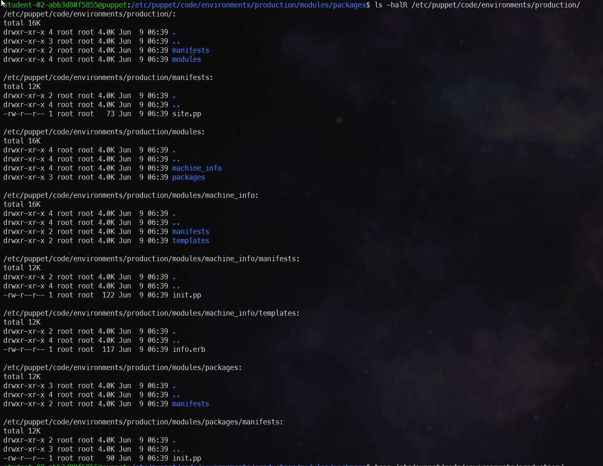

**Dir:** 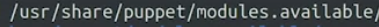

In any configuration management deployment, there's usually a lot of
different things to manage. We might want to install some packages, copy
some configuration files, start some services, schedule some periodic
tasks, make sure some users and groups are created and have access to
specific devices, and maybe execute a few commands that aren't provided
by existing resources. On top of that, there might be different
configurations applied to the different computers in the fleet. For
example, workstations and laptops might include resources that aren't
used on servers. Each distinct type of server will need its own specific
setup. There's a lot of different things to manage. We need to organize
all these resources and information in a way that helps us maintain them
long-term. **This means grouping related resources, giving the groups
good names, and making sure that the organization will make sense to new
users. In puppet, we organize our manifests into modules.** A module is
a collection of manifests and associated data. We can put any resource
we want into a module, but to keep our configuration management
organized, we'll group things together under a sensible topic. For
example, we could have a module for everything related to monitoring the
computer's health, another one for setting up the network stack, and yet
another one for configuring a web serving application. So the module
ship the manifest in the associated data, but how is this organized? All
manifests gets stored in a directory called manifests. The rest of the
data is stored in different directories depending on what it does. The
files directory includes files that are copied into the client machines
without any changes, like the ntp.conf file that we saw in our last
video. The template's directory includes files that are preprocessed
before they've been copied into the client machines. These templates can
include values that get replaced after calculating the manifests, or
sections that are only present if certain conditions are valid. There's
a bunch more directories that can be part of a module depending on what
exactly the module does. But you don't need to worry about these when
creating your first puppet module.

**You can start with the simple module that just has one manifest in the
Manifest directory. This file should be called init.pp and it should
define a class with the same name as the module that you're creating.**
Then any files that your rules use need to be stored in the files or
templates directories depending on whether you copy them directly or
need to preprocess them. For example, this is how the NTP class that we
saw in our last video looks like when turned into a module.

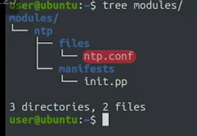

There's an init.pp file, which contains the NTP classes that we saw
before, and the ntp.conf file that gets deployed onto the machine is now
stored in the files directory. Modules like these can look pretty much
the same no matter who's using them. That's why over time, system
administrators using puppet have shared the modules they've written,
letting others use the same rules. By now, there's a large collection of
prepackaged modules that are shipped and ready to use. If one of those
modules does what we want, we can just install it on our Puppet server
and use it in our deployments. Let's install the Apache module provided
by Puppet Labs to check out how this works.

We've installed the module. Let's have a quick look at its contents.
First, we'll change into the directory where the module files are stored
and list its contents.

We see the files, manifests, and templates directories that we
mentioned. On top of that, there's a lib directory that adds functions
and fact to the ones already shipped by puppet. The metadata.json file
includes some additional data about the module we just installed, like
which versions of which operating systems it's compatible with. Let's
peek into the manifest directory.

That's a lot of files, like how we split the different things that we
want to manage into separate modules. We can also split each separate
functionality that we want to configure into separate manifests. This
helps us organize our code when we make changes to it, and to see how
this directory also contains its own init.pp. As we called out, this
manifest is special. It needs to always be present because it's the
first one that's read by puppet when a module gets included. So how do
we include a module like this one? It's pretty easy. Let's create a
manifest file that includes the module we've just installed.

Here, we're telling Puppet to include the Apache module. The double
colon before the module name, let's puppet know that this is a global
module. Let's save this file now and apply it using Puppet apply like we
did before.

Our manifest was super-simple, it just include the Apache module. But by
including the module, we got puppet to apply all the rules run by
default in the module. We now have an Apache server configured and ready
to run on this machine. We've just seen how we can organize our code in
modules and how we can even use modules provided by other teams so we
don't have to reinvent the wheel. Up next, there's a reading with
pointers to more information, followed by a quick quiz. After that, meet
me over in the next video, where we'll check out what we need to do to
deploy our rules to more machines.

###### Testing Manifests file (for syntax err)

A simple first step is to use the **puppet parser validate** command
that checks that the syntax of the manifests is correct on top of that
we can also run the rules using the **--noop parameter** the name comes
from no operations and it makes puppet simulate what it would do without
actually doing it. You can look at the list of actions that it would
take and check that they're exactly what you wanted puppet to do.

###### Manually running rules in a manifest file (from agent node):

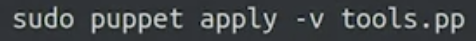

#### Principles of config management

Up to now, we've seen a few examples of what Puppet rules look like,
including a bunch of different resources and even a conditional
expression. You might have noticed that in all the examples we've
checked out, we were never telling the computer the steps it should
follow in order to do what we wanted. Instead, we were just declaring
the end goal that we wanted to achieve, like going to a drive-through
and ordering a burger, we didn't make it, but there it is. The providers
that we mentioned earlier lake apt and yum are the ones in charge of
turning our goals into whatever actions are necessary. We say that
Puppet uses a declarative language because we declare the state that we
want to achieve rather than the steps to get there. Traditional
languages like Python or C are called procedural because we write out
the procedure that the computer needs to follow to reach our desired
goal. Coming from a procedural language like Python, it might take some
time to get used to writing declarative code like the ones used for
Puppet, and that's okay. Just remember that when it comes to
configuration management, it makes sense to simply state what the
configuration should be, not what the computer should do to get there.
Say you're using a resource to declare that you want a package
installed, you don't care what commands a computer has to run you
install it, you only care that after the configuration management tool
has run, the package is installed. Another important aspect of
configuration management is that operations should be idempotent. In
this context, an idempotent action can be performed over and over again
without changing the system after the first time the action was
performed, and with no unintended side effects. Let's check this out
with an example of a file resource.

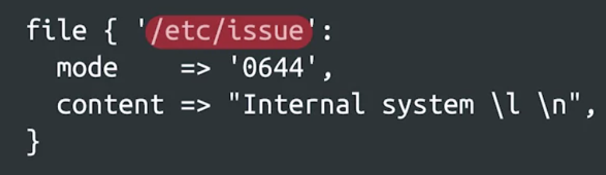

This resource ensures that the /etc/issue file has a set of permissions
and a specific line in it. Fulfilling this requirement is an idempotent
operation. If the file already exists and has the desired content, then
Puppet will understand that no action has to be taken. If the file
doesn't exist, then puppet will create it. If the contents or
permissions don't match, Puppet will fix them. No matter how many times
the agent applies the rule, the end result is that this file will have
the requested contents and permissions. Idempotency is a valuable
property of any piece of automation. If a script is idempotent, it means
that it can fail halfway through its task and be run again without
problematic consequences. Say you're running your configuration
management system to setup a new server. Unfortunately, the setup fails
because you forgot to add a second disk to the computer and the
configuration required two disks. If your automation is idempotent, you
can add the missing disk and then have the system pick up from where it
left off. Most Puppet resources provide idempotent actions, and we can
rest assured that two runs of the same set of rules will lead to the
same end result. An exception to this is the exec resource, which runs
commands for us. The actions taken by the exec resource might not be
idempotent since a command might modify the system each time it's
executed. To understand this, let's check out what happens when we
execute a command that moves a file on our computer. First, we'll check
that the example.txt file is here, and then we'll move it to the desktop
directory.

This works fine now, but what happens if we run the exact same command
again after it's been executed once? We receive an error because the
file is no longer in the same place.

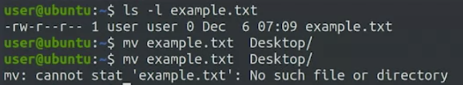

In other words, this was not an idempotent action, as executing the same
action twice produced a different result and the unintended side effect
of an error. If we were running this inside Puppet, this would cause our
Puppet run to finish with an error. So if we need to use the exec
resource to run a command for us, we need to be careful to ensure that
the action is idempotent. We could do that for example by using the
onlyif attribute like this. Using the onlyif attribute, we specified
that this command should be executed only if the file that we want to
move exists. This means that the file will be moved if it exists and
nothing will happen if it doesn't. By adding this conditional, we've
taken an action that's not idempotent and turned it into an idempotent
one.

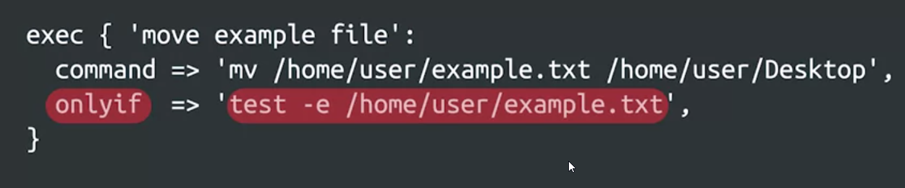

Another important aspect of how configuration management works is the
test and repair paradigm. This means that actions are taken only when
they are necessary to achieve a goal. Puppet will first test to see if
the resource being managed like a file or a package, actually needs to
be modified. If the file exists in the place we want it to, no action
needs to be taken. If a package is already installed, there's no need to
install it again. This avoids wasting time doing actions that aren't
needed. Finally, another important characteristic is that Puppet is
stateless, this means that there's no state being kept between runs of
the agent. Each Puppet run is independent of the previous one, and the
next one. Each time the puppet agent runs, it collects the current
facts. The Puppet master generates the rules based just on those facts,
and then the agent applies them as necessary. We're just getting started
with what configuration management is and what it looks like in Puppet.
But hopefully, you're starting to see how understanding these basic
concepts and how turning them into practical rules can help you manage a
small army of computers. Up next, there's a reading with links to more
information about the concepts we've covered followed by a quick quiz.
You've got this.

#### Running shell commands

#### DSL (domain-specific-language)

- <https://en.wikipedia.org/wiki/Domain-specific_language>

- <http://radar.oreilly.com/2015/04/the-puppet-design-philosophy.html>

A **fact** is a hash that stores information about the details of a
particular system. Here’s we’re trying to access the value of the facts
hash and see what corresponds to the “is_virtual” key in the hash (very
perl-ish).

**<u>Checking is virtual</u>**

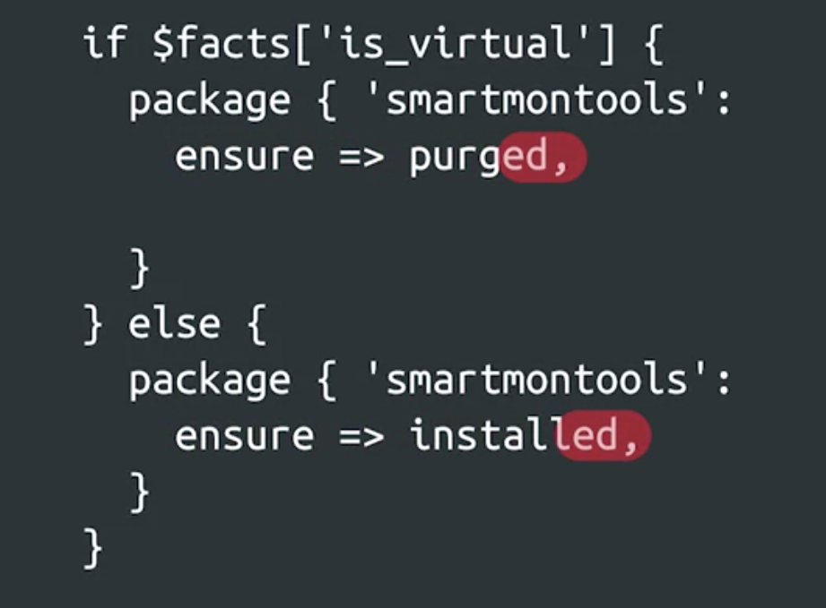

**<u>Checking kernel (windows/linux)</u>**

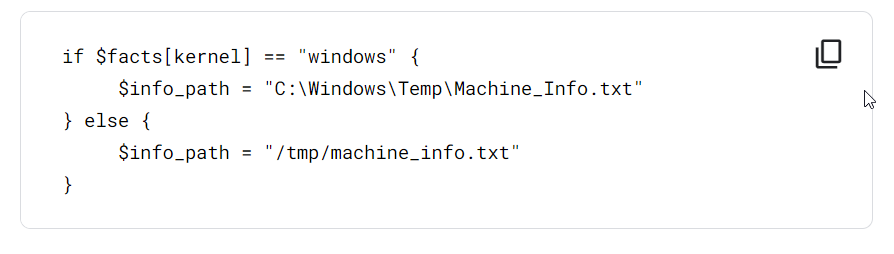

Extended:

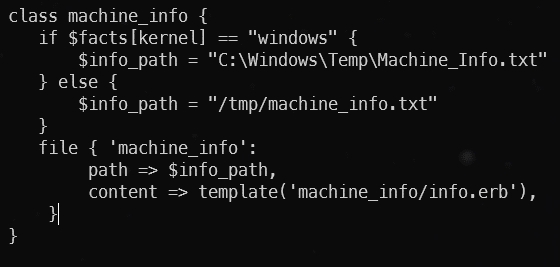

**<u>Checking is of Debian family</u>**

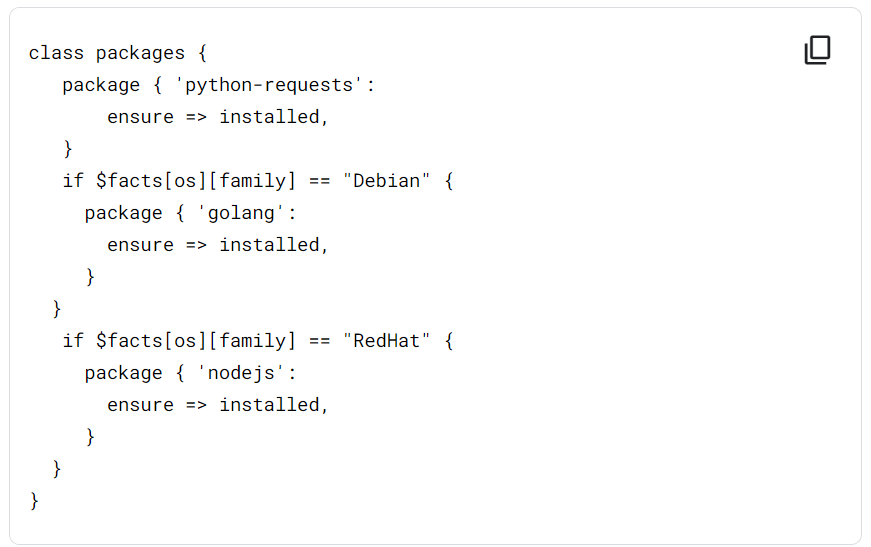

**<u>Checking uptime:</u>**

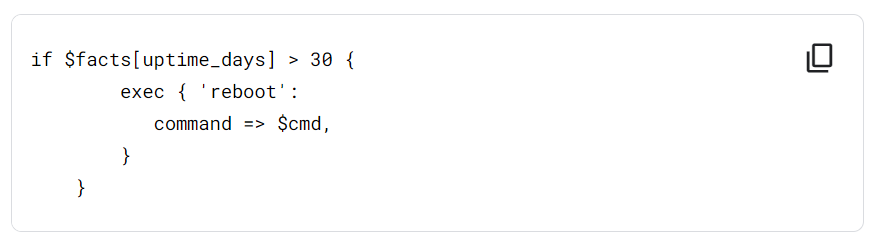

#### Puppet Templates

Templates are documents that combine code, data, and literal text to
produce a final rendered output. The goal of a template is to manage a
complicated piece of text with simple inputs.

In Puppet, you'll usually use templates to manage the content of
configuration files (via the content attribute of the file resource
type).

Templates are written in a templating language, which is specialized for
generating text from data. Puppet supports two templating languages:

- **Embedded Puppet (EPP)** uses Puppet expressions in special tags.
  It's easy for any Puppet user to read, but only works with newer
  Puppet versions. (≥ 4.0, or late 3.x versions with future parser
  enabled.)

- **Embedded Ruby (ERB)** uses Ruby code in tags. You need to know a
  small bit of Ruby to read it, but it works with all Puppet versions.

Now, take a look at the template file using the following command.

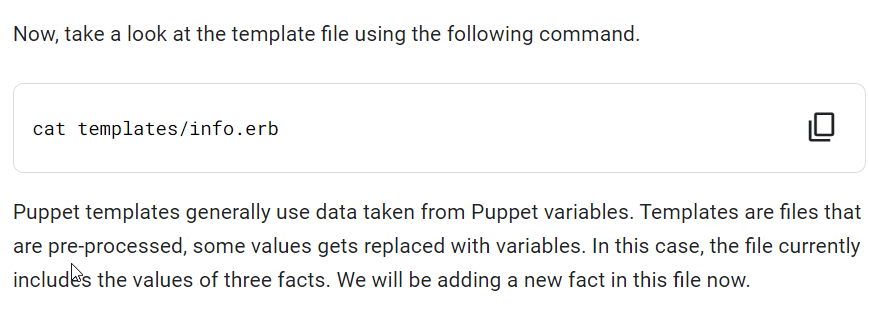

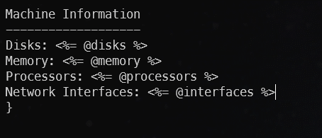

### Teraform

Terraform is an orchestration tool that is agentless and uses the
specialized Terraform configuration language. Terraform is an
infrastructure as code tool that lets you define both cloud and on-prem
resources in human-readable configuration files that you can version,
reuse, and share. 

# Containerization

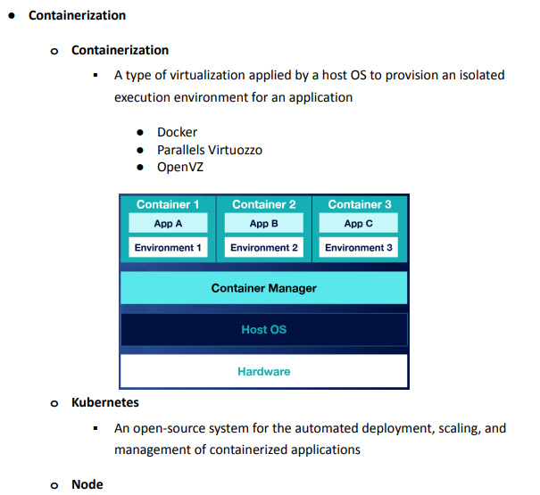

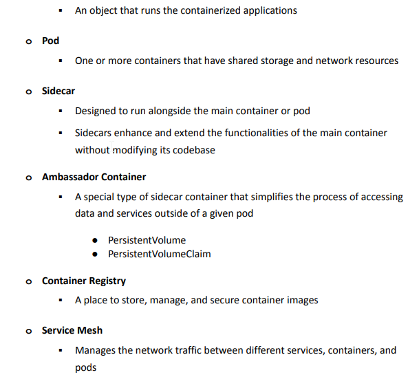

**Service mesh** is a dedicated infrastructure layer managed by code
that provides service-to-service interaction in a container environment.

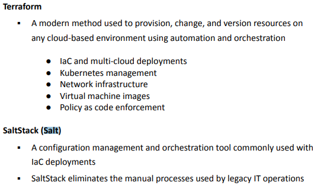

## Securing Docker containers

<https://www.youtube.com/watch?v=KINjI1tlo2w&list=PLBf0hzazHTGMh2fe2MFf3lCgk0rKmS2by&index=43>

## Networking and Containerization

**Network Address Translation (NAT)** is used to track all of the IP
addresses between the containers, hosts, and remote services.

**The container's host network driver** provides networking between the
container and host while using the host's network access.

**The container's** **overlay driver provides connectivity** between
containers run by different daemons.

**The container's bridge network driver** provides the standard
configuration for standalone containers that need network access.

## Podman

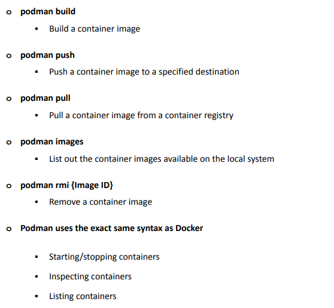

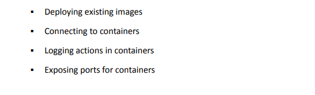

## Docker

Tutorial vids

- <https://www.youtube.com/watch?v=Gjnup-PuquQ>

- <https://www.youtube.com/watch?v=gAkwW2tuIqE&t=460s>

- <https://www.youtube.com/watch?v=3OP-q55hOUI>

- <https://www.youtube.com/watch?v=PziYflu8cB8>

- <https://www.youtube.com/watch?v=3c-iBn73dDE>

- <https://www.youtube.com/playlist?list=PLy7NrYWoggjzfAHlUusx2wuDwfCrmJYcs>

### Core concepts

Installing: If your system does not support docker installation, you can
install docker toolbox – a software made to serve as a bridge on which
docker sits on top as docker toolbox should be able to function on older
systems.

#### Registries

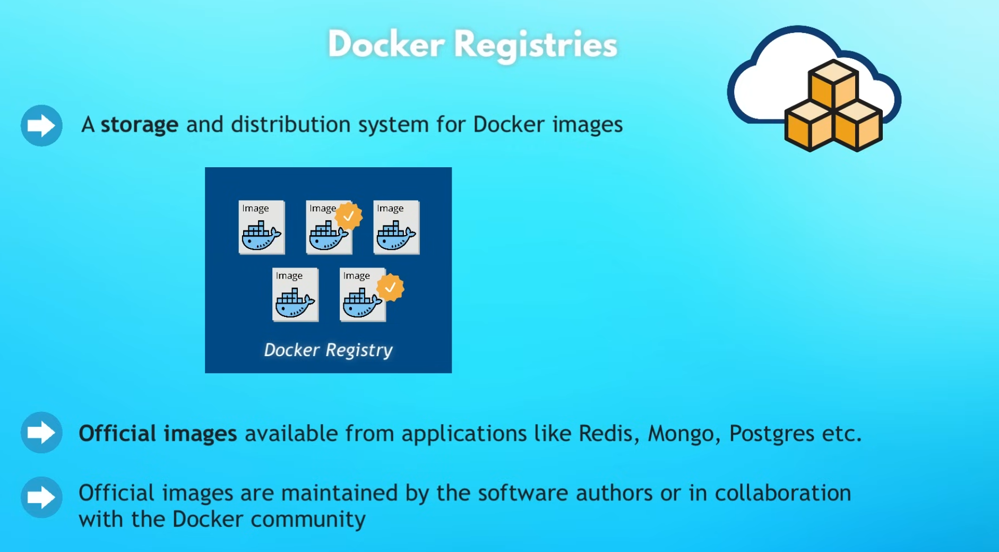

Docker has it’s own official registry called DockerHub where many
official images are available.

#### Docker Image

*Images are read-only*

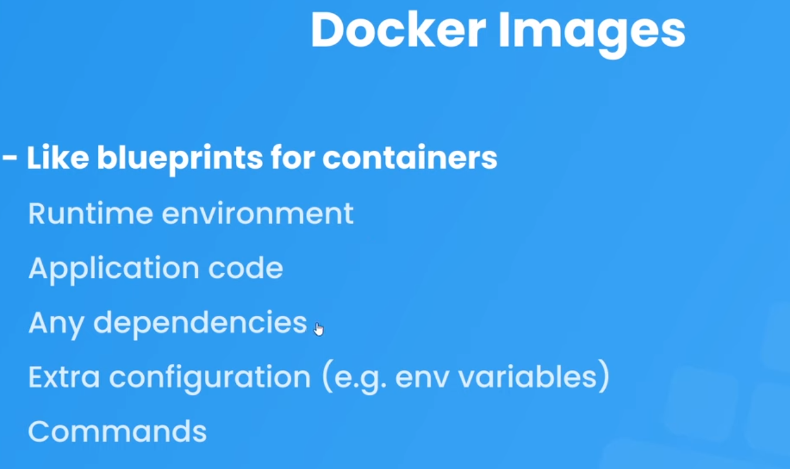

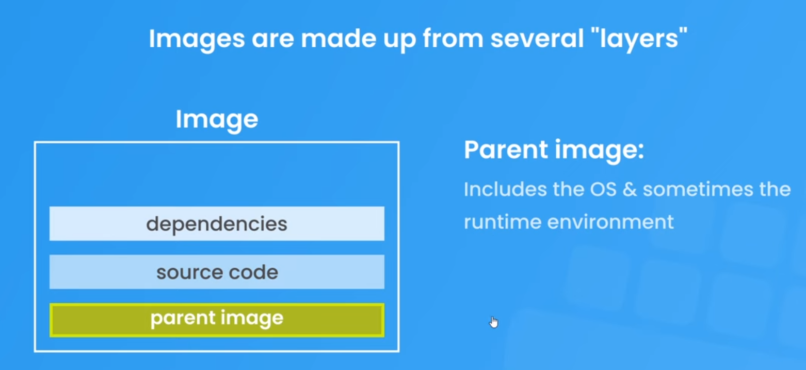

#### Containers

**Containers are runnable instances of docker images**

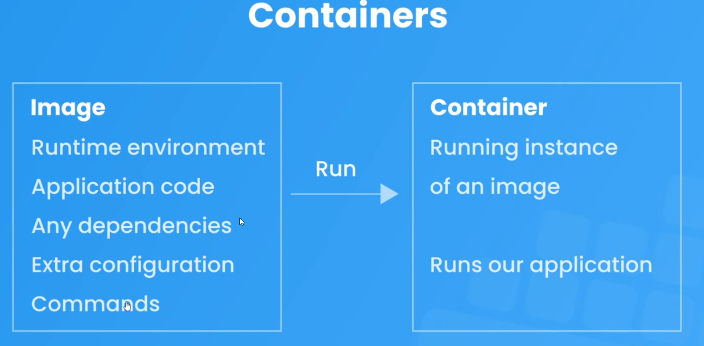

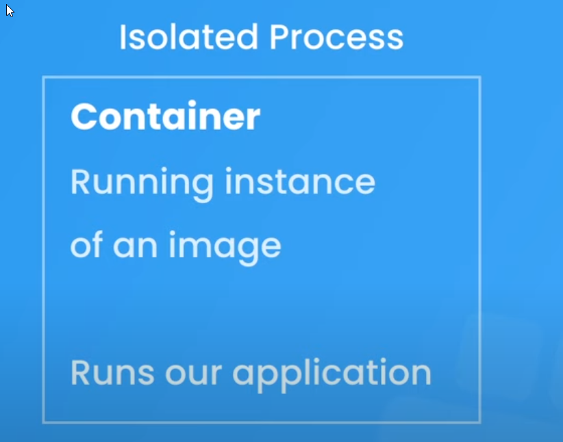

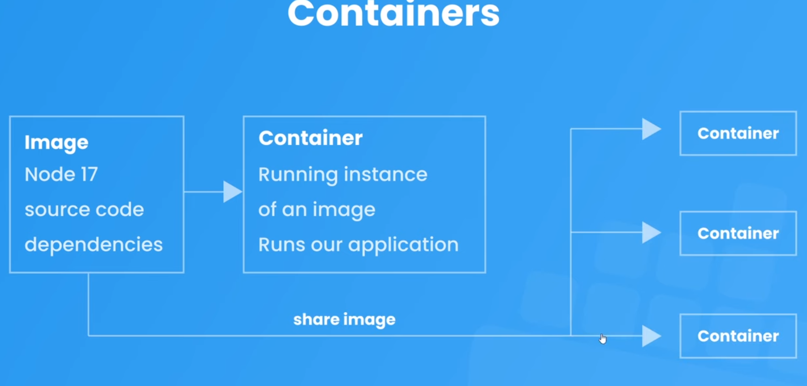

#### Docker File

A set of instructions which tells Dockers which additional “layers” to
place on a parent image. For example, which source code to add,
dependencies to install, etc.

#### Workflow in real prod environment

Interesting: <https://youtu.be/3c-iBn73dDE?t=4507>

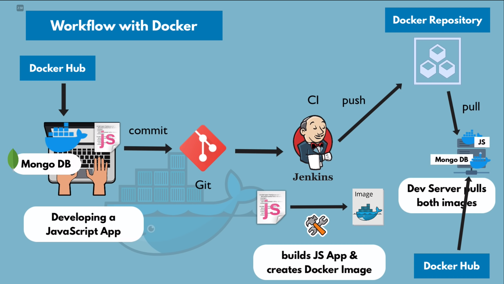

### General Commands

**Commands Cheat Sheet:**
<https://buddy.works/tutorials/docker-commands-cheat-sheet>

The docker **inspect** command is used to display detailed information
about a container.

The docker **push** command is used to upload a container image to a
registry.

The docker **port** command is used to list the port mappings for the
specified container.

The docker **rmi** command is used to remove images from the docker
repository.

**Compose** is a docker function that can be used to build
multi-container clusters.

An **ambassador container** is a special container that is configured to
handle communications on behalf of the rest of the containers in a pod.

**<u>Difference between docker rm IMAGE vs docker rmi IMAGE</u>**

**docker container** ... and **docker image** ... commands are newer

#### Args and environment variables

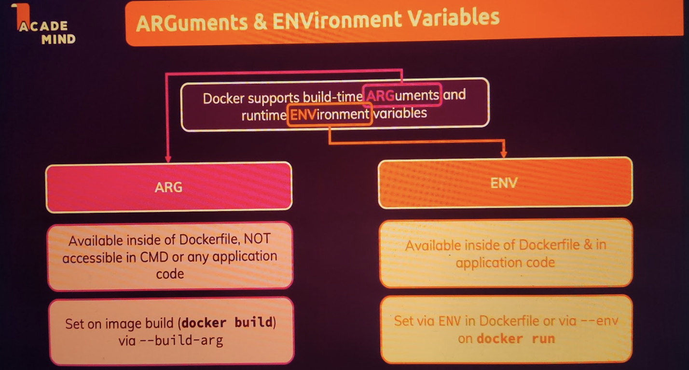

**Environment variables  **

- **In Dockerfile (setting a var):**

  - ENV MYVAR"TESTER"

- **In Dockerfile (referencing a var):**

  - PORT $MYVAR

- **In command line: -e MYVAR=1000**

- **In command line (from .env file) \[preferred/secure\]**

  - –env-file ./.env

**Build arguments**

<https://www.udemy.com/course/docker-kubernetes-the-practical-guide/learn/lecture/22166942#overview>

#### .dockerignore

You can add more "to-be-ignored" files and folders to
your .dockerignore file.

For example, consider adding the following to entries:

1.  Dockerfile

2.  .git

This would ignore the Dockerfile itself as well as a potentially
existing .git folder (if you are using Git in your project).

### Pulling down a parent (base) image (Pulling images down from Docker Hub)

- “docker pull \<image\>” will pull down image and you should see it in
  docker desktop.

- Note: If a version isn’t specified it will default to downloading the
  latest version.

- “running” an image creates a container.

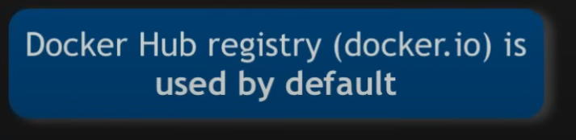

**<u>Example</u>**

*Dockerhub*

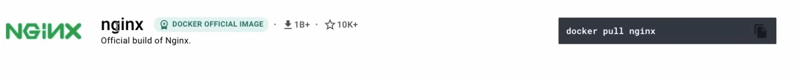

*Cli*

*Listing images*

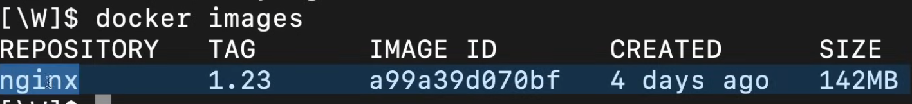

### Creating a Dockerfile

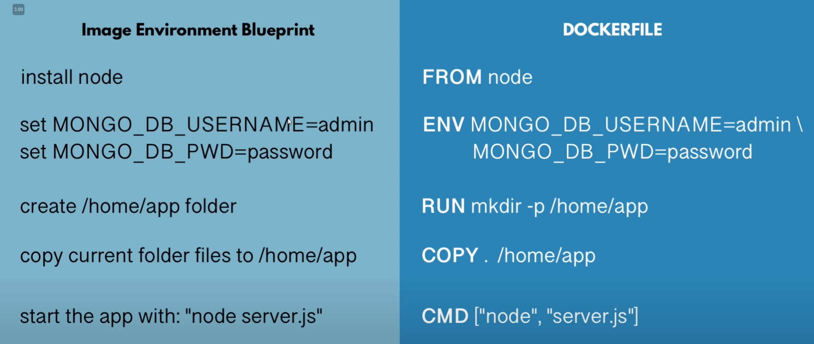

Just create a file called “Dockerfile” in the root of your working
application.

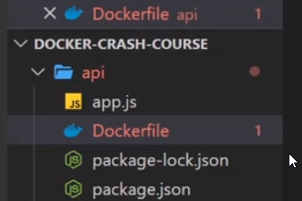

Note: It’s best to install docker package in vscode.

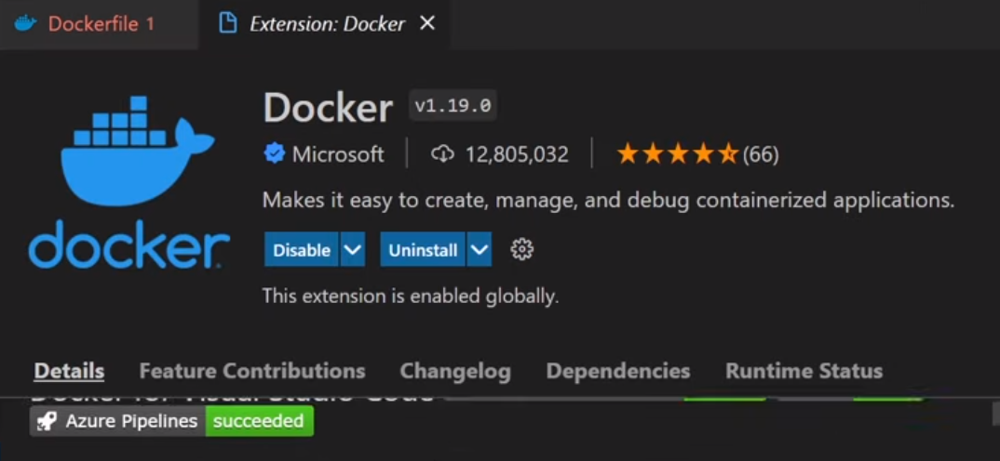

Generally speaking, each new line of a docker file is a layer in our
docker image.

**<u>Pulling in parent (base) image</u>**

This will either **(a)** download this (node) image from the dockerhub
repo or **(b)** pull this from our local machine if we’ve already pulled
this image down from docker hub.

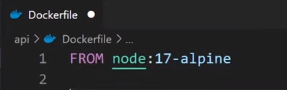

**<u>Define working dir (local)</u>**

So you can use “WORKDIR” to specify where the root dir starts.

**<u>Copy source file into image</u>**

Specify the source files you wanted copied into your image and where in
the dir structure if your image they should be copied.

*Format*:

COPY \<code_path\> \<img_path\>

*Example:*

Since we want to copy all src files (./app/\*) into /app dir (working
dir)we can just use this

Even better, if we specify our working dir its easier

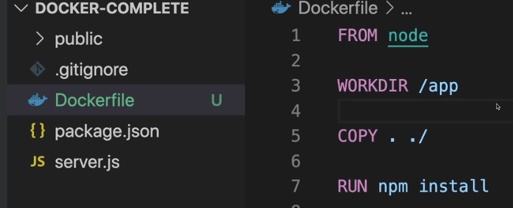

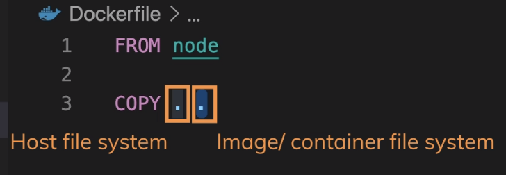

**<u>Install dependencies</u>**

Use the “RUN” command to define which shell commands should be
automatically ran on your image.

Here we can use the “RUN” command to install dependencies on the docker
image.

Keep in mind, this depends on the above step – where you define where
your source files would be saved (“/app”).

Running this would execute “npm install” inside the root dir of the
docker image (just outside the “/app” folder

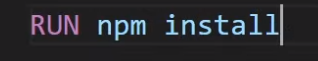

… not what we want.

*Examples*

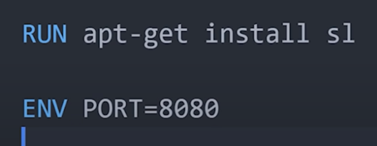

**<u>Start up application</u>**

Once you’ve deployed a container based on this image, any “CMD” commands
will run. You can start your app this way.

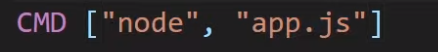

*<u>“CMD” vs “RUN</u>*

- “RUN” – These commands are ran once when *building the image*.

- “CMD” – T-hese commands once a container is deployed.

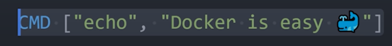

**<u>Define any listening ports</u>**

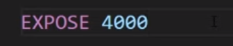

I just want to clarify again, that EXPOSE \<port\> in the Dockerfile in
the end is **optional**. It **documents** that a process in the
container will expose this port. But you still need to then actually
expose the port with -p when running docker run. So technically, -p is
the **only required part** when it comes to listening on a port. Still,
it is a **best practice** to also add EXPOSE in the Dockerfile to
document this behavior.

### Building an image using a Dockerfile

**<u>Build docker image</u>**

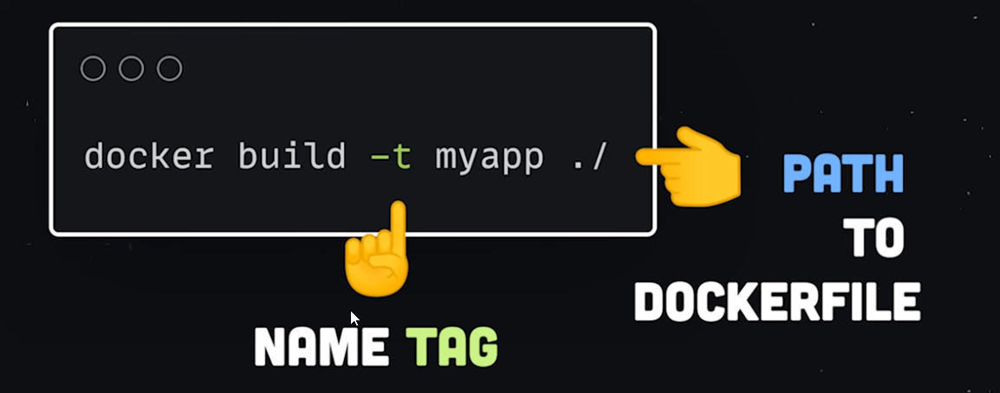

First navigate into working dir then run “docker build -t \<name\>
\<dir_of_dockerfile\>”

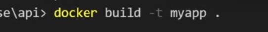

*Best practice: Ignore unneeded file/folders before building an image.
Create .dockerignore file*

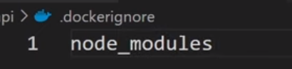

#### \[optional\] Add a version Tag

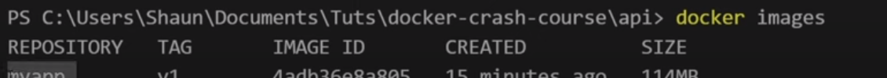

**<u>Run container from image (name)</u>**

#### RUN vs EXEC vs CMD

The **RUN** command is executed *within* the Docker container whereas
**EXEC** is executed in host system.

The **CMD** command is executed in the host system (like EXEC) but it
takes in an array of values to be passed in. Considered an “entry point
command” meaning it should only be used once inside a Dockerfile and on
the last line.

**RUN**

**EXEC**

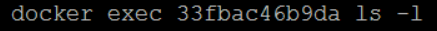

*Exec to enter interactive session within container*

**CMD**

#### Layered Caching

Explanation: <https://youtu.be/_nMpndIyaBU?si=0lMvWHHuFFhdn2wG>

Since each line of our docker file acts as a sort of “layer” on the
image we’re going to build, the order in which we layer is important.

Notice here that we copy package.json and install dependencies before
line 9 – where we copy all of our source code (including package.json).
This is ideal in case we only make a change in a script but the
dependencies are the same. With this change, the first four lines of
commands (lines 1 – 9) should be cached and all we need to do to update
our image is execute the last “COPY” and “EXPOSE” commands.

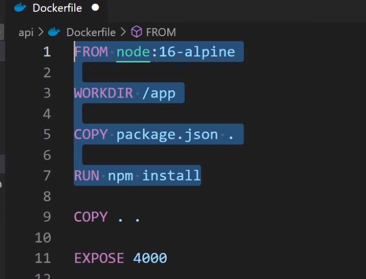

#### On IDs vs Names

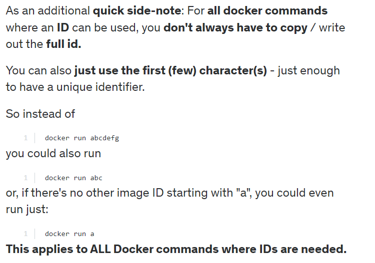

### Creating/running a container from a docker image

- You can run a container from local docker images (docker images which
  you’ve already pulled) or you can just run a container without any
  locally pulled image and if that image is in dockerhub, then docker
  will try to find and download it for you.

  - 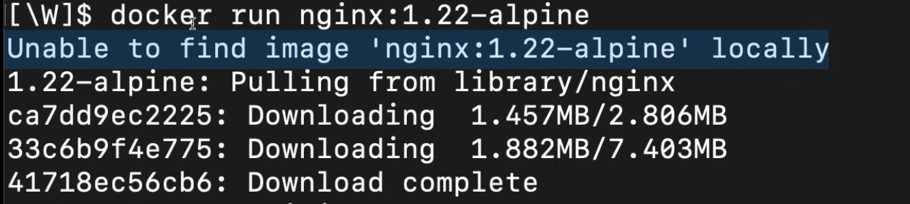

Run Container

Run Container and change the default container name

Run container in background

  

Can also use the image id

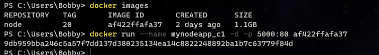

***Important Note:** If you’re container exits immediately, it may need
to be ran in interactive mode (add “I”)*

docker run --name node_v18_c1 -p 4555:4555 -d**i** \<image_id\>

#### View containers

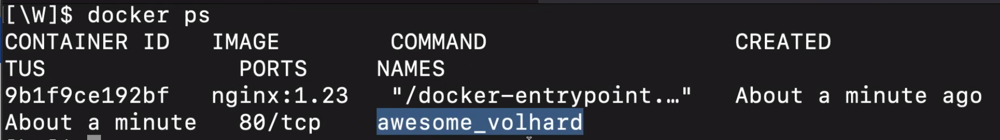

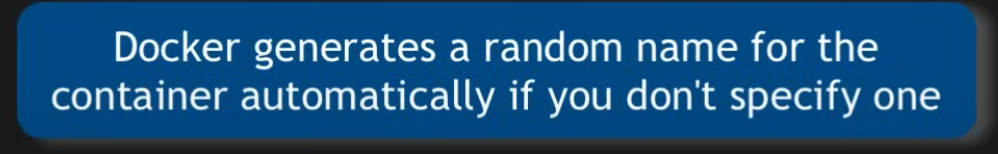

#### Showing container logs

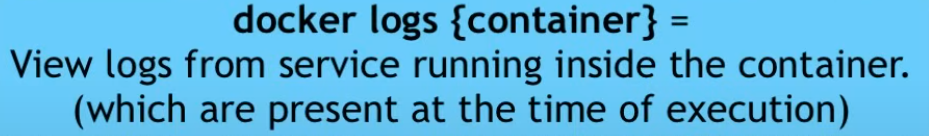

*Get containerID*

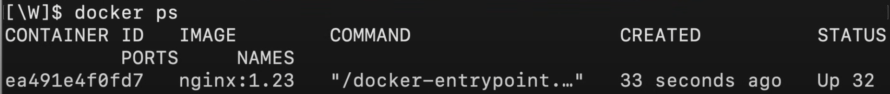

*Print logs*

#### Starting vs running containers

“Running” a container is the process of choosing an image to run, which
then spins up a brand new container.

“Starting” a container is the process of choosing an existing container
(that may have previously been stopped) and starting it back up again.
Some containers are created but not listening.

Listening containers can be listed using **docker ps** and one can use
**docker ps -a** to view all containers (running or not).

***Run vs start***: “run” always creates a new container, whereas
“start” merely starts up an existing container.

#### Attached vs Detached

By default, “docker start” always starts a container in detached mode.
To start in “interactive” mode instead (so you can see output) start
with “I” flag.

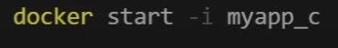

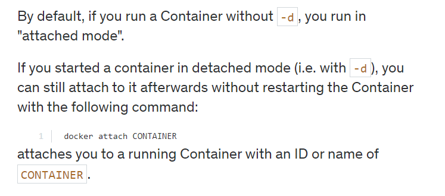

#### Running commands in your container

**<u>Running a single command</u>**

docker exec \<container\> \<command\>…

**<u>Entering into a terminal session of your container
(interactive)</u>**

docker exec -t \<container_id.nAME\> \<shell\>

*Example*

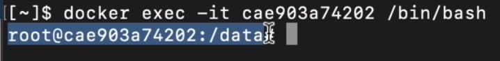

#### Containers and port-binding

Suppose you have an image with source code such that the application
listens on port 4000. Once this image is ran (as a container), the
container will listen on port 4000. This doesn’t mean you can find your
application listening on port 4000 of your host machine. It just means
the container itself is listening on port 4000, and you can map that to
a port on your local machine.

For example: you’re listening on port 4000 in your source code. Further,
when creating your Dockerfile you also add this in to make sure when
your Dockerfile is ran as a container – the container will listen in
port 400 (since that will route to your listening application):

Once you’re running a container, you can specify where that listening
port will be mapped to on your local machine. So you listening on your
machine on port 5000, and that will be mapped to port 4000 on your
container (where your app is listening).

Example via the GUI

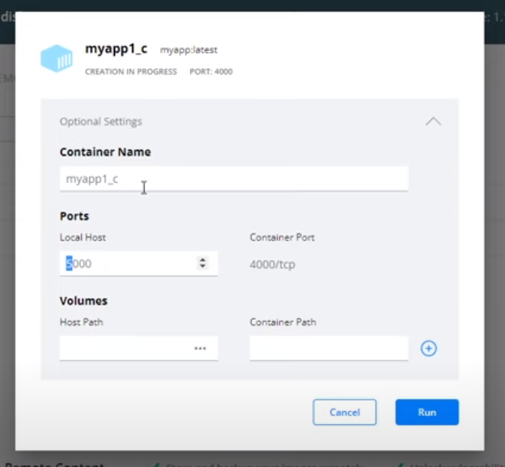

In most cases, the port will be the same on localhost and the container
itself to avoid confusion, but it’s good to know that it doesn’t need to
be this way. This option to map (bind) ports like this is only available
if you use the ‘EXPOSE’ keywork in your Dockerfile.

Via CLI:

docker run –name \<container_name\> -p \<local_port\>:\<container_port\>
-d \<image_name\>

Example:

docker run –name node_app_c1 -p 4000:4000 -d mynodeapp

#### Setting Environmental variables

You can set env variables within your container upon creating your
container using the “-e” options.

^ notice the “-e” options set ^

#### Copying files into a running container

**<u>Format:</u>**

docker cp \<item(s)\> \<container_name/id\>:\<path_in_contianer\>

**<u>Example:</u>** *Adding everything inside of “newfolder” to
container*

docker cp newfolder/. mycontainername:/app

#### Ephemeral Containers

Add “rm” upon running container to remove the container, once the
container is stopped.

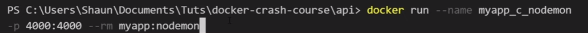

This is great for running a temporary container to debug.

### Managing images and containers

**<u>Removing Images</u>**

docker image rm \<image_name\>

Images can be in use (even if there’s no active container running it)
and would result in error when removing an in-use image:

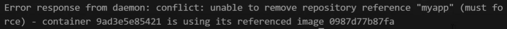

One can get by this by adding “-f” option:

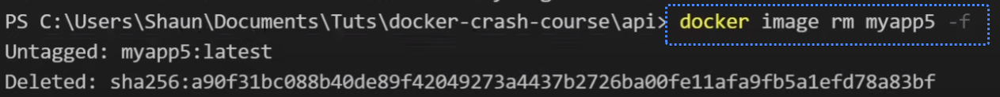

Another approach would be to remove the container first then remove the
images.

**<u>Clear All Images, Containers, and Volumes</u>**

### Volumes (data persistence)

**Map files from the Virtual File System (VFS) of your container to the
Physical File System of your host machine.**

Great intro: <https://youtu.be/Wh4BcFFr6Fc?si=TwqzCw_Ce_Escgyq>

View volumes: **docker volumes ls**

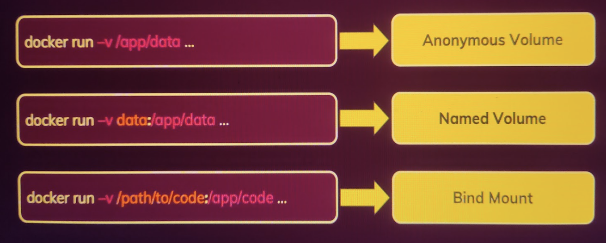

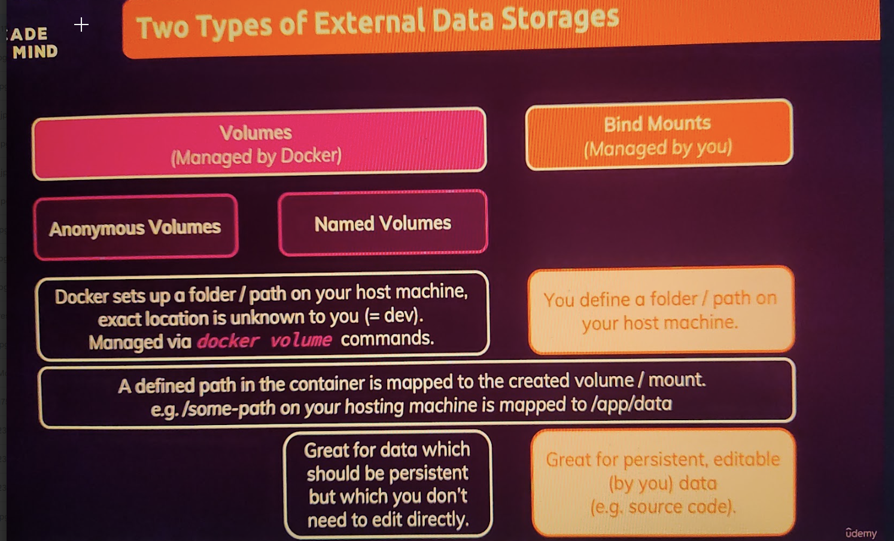

#### Viewing volumes

docker volumes ls

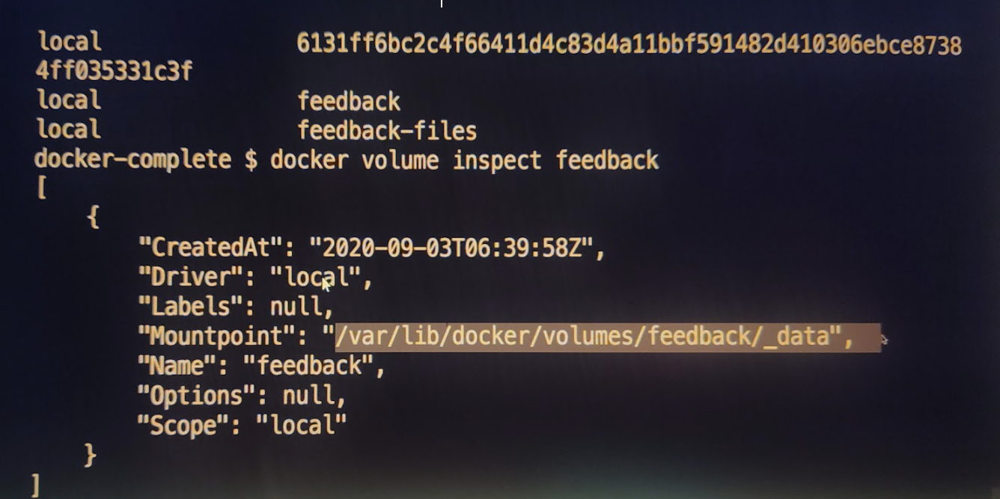

#### Anonymous Volumes

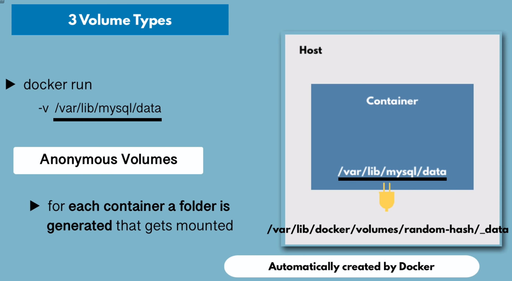

**Key Point**: A key feature of anon volumes is that they only exists if
the container exists and is runninig – once the container is
removed/stopped, any associated volumes will be removed.

With Named volumes, not only do we get to set the local path to map the
data to but named volumes persist even after container removal.

Enable anonymous volumes in dockerfile

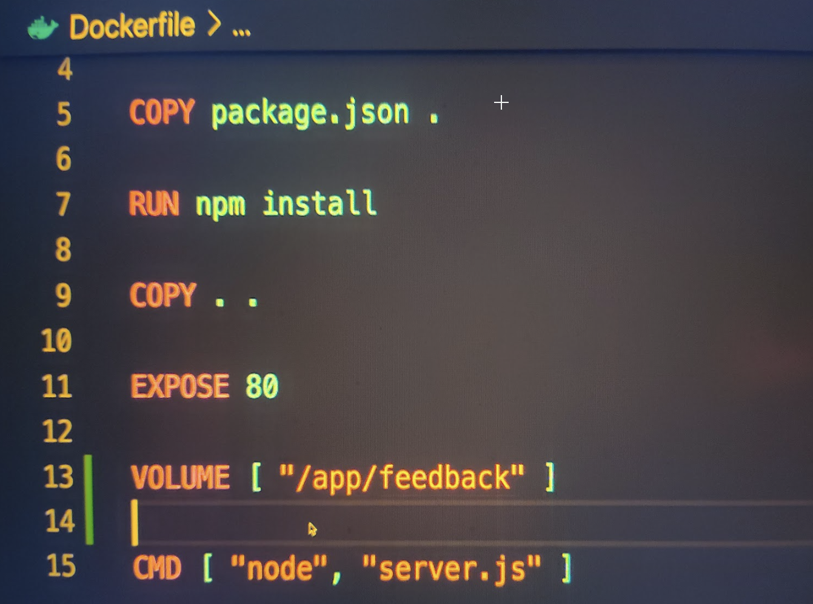

^ the path “/app/feedback” is the path inside our container.

**Benefit of anonymous volumes**

<https://www.udemy.com/course/docker-kubernetes-the-practical-guide/learn/lecture/22166924#overview>

- Can be used to exclude container folders from being overwritten by
  host folder counter parts if bind mounts are enabled.

- Creates a folder on host machine (albeit transitory).

##### Removing

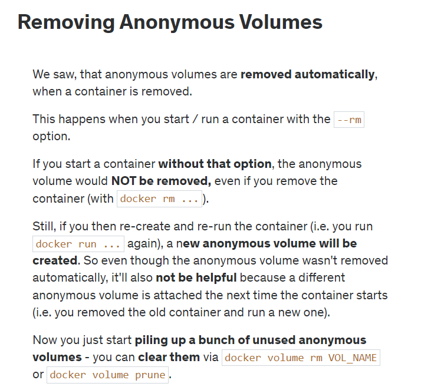

#### Named Volumes

Map local folder in working dir to folder in container, allowing the
container to detect when local changes have been made, and then updated
the changes to the mapped file in the container.

Secondly, with nodemon running the node app, any changes detected in the
container would cause the server to restart the node app and load the
new changes when serving responses.

**<u>Workflow</u>**

*Changes made locally \> Detected by container \> Changed files are also
changed in Container \> nodemon restarts server in container.*

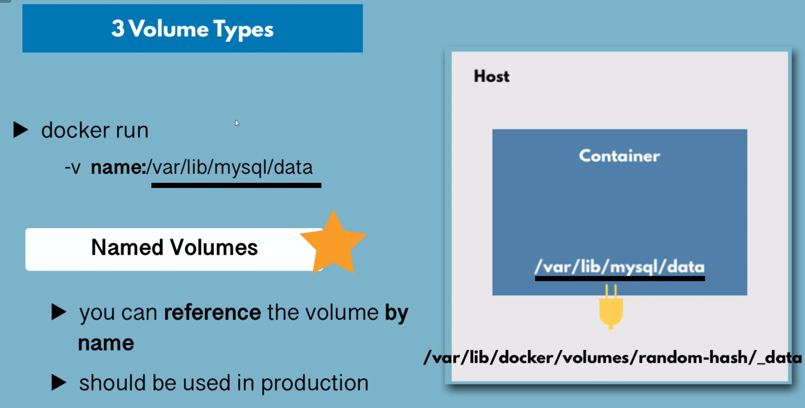

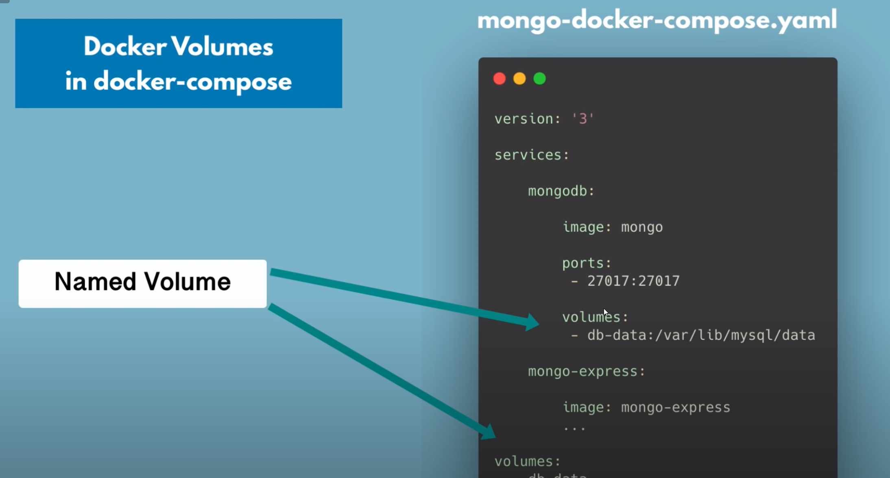

#### Host Volumes (Bind Mounts)

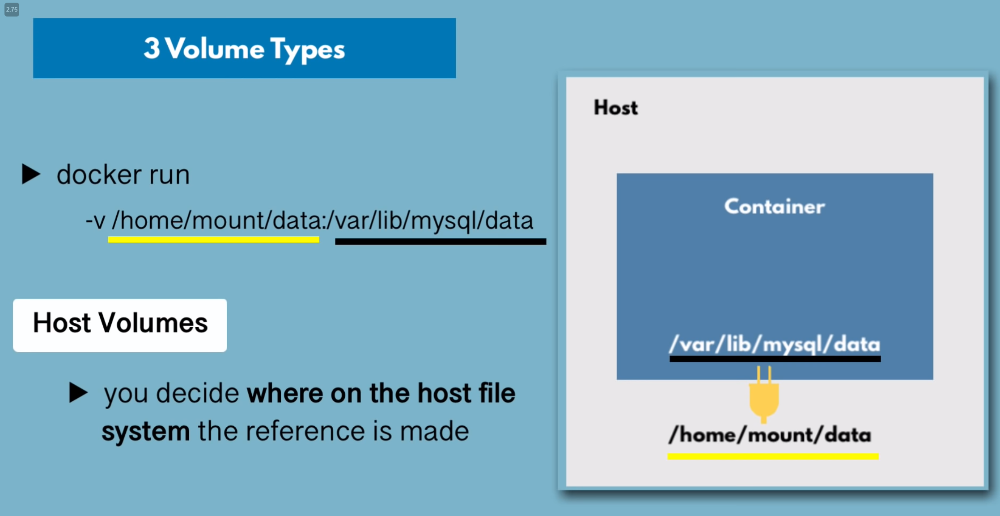

To setup a volume, just use the “-v” option when running a container.

The format is **“-v \<absolute_path_to_local_dir\>”** and must be
directly before the image name. Adding a secondary (and more specific
volume) with only one path, allows you to exclude that path from the
“”sync-able” folder that are captured by the previous “-v” (volume)
option.

Example, this…

*-v /app/node_modules*

^ would exclude the **node_modules** from the previous “-v” argument.
Very common as we wouldn’t want to remove the nodule_modules dir just
because it may be deleted on the local side.

 *\# Format:*

*docker run --name mynodeapp_c1-p 4000:4000 --rm -v
\<local_dir\>:\<container_dir\> mynodeapi_img:1.0*

 *\# Example:*

*docker run --name mynodeapp_c1-p 4000:4000 --rm -v
C:\Users\Me\Documents\mydockerapp\\/dockerapp mynodeapi_img:1.0*

*Note: using “-rm” options means the container will be removed once it’s
stopped – useful for running containers ad-hoc.*

##### Host volumes+named volumes

You can combine named and host volumes – this will still make one
volume, but the benefit of adding a named volume option is that we can
view our volumes by a name of our choosing when running docker volumes
ls

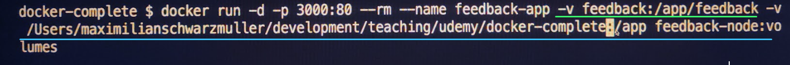

^ named volume (green) and host vol (blue)

**<u>FINAL: We also need to add an anonymous volume.</u>**

Here’s why: by binding our local path to the path in the container, we
overwriting the contents of the “/app” folder in the container. This
means, when copying the relevant files into the container using COPY . .
in the dockerfile (such as node_modules folder) we subsequently “bind”
our local path to the “/app” folder in the container, causing the “/app”
folder to match our local folder (and we may not have those dependencies
installed locally). To avoid that, we add an exclusion to tell docker to
bind everything BUT exclude “/app/node_modules” from being synced with
host as it may not exist there AND because the COPY package.json and CMD
\[“npm”,”install”\] commands will have added the node_modules to the
container and we don’t want to remove that.

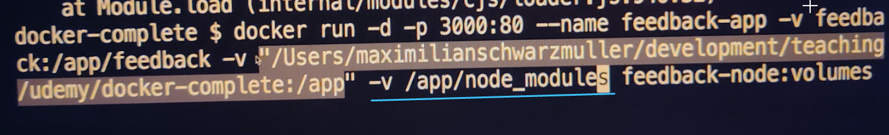

Great explainer here:

<https://www.udemy.com/course/docker-kubernetes-the-practical-guide/learn/lecture/22166916#overview>

##### Making bind mounts read-only

By default there’s a 2-way read-write relationship between the container
and your local host files. You can make it such that that is only a
one-way relationship (i.e. host file can cause files on container to be
overwritten/changed but changes to the containers files don’t cause
local changes.

**<u>Step 1: Add “ro” to the bind mount option.</u>**

-v \<host_path\>:\<container_path\>:ro

**<u>Step 2: Any anonymous volumes to exclude any folders that you do
want to have host write access</u>**

-v \<host_path\>:\<container_path\>:ro -v \<container_path\>/outputfiles

##### Troubleshooting

If you aren’t using windows, make sure the host path you’re using is
accessible by docker. In docker, make sure the parent folder you’re
using is a shared folder on the settings here:

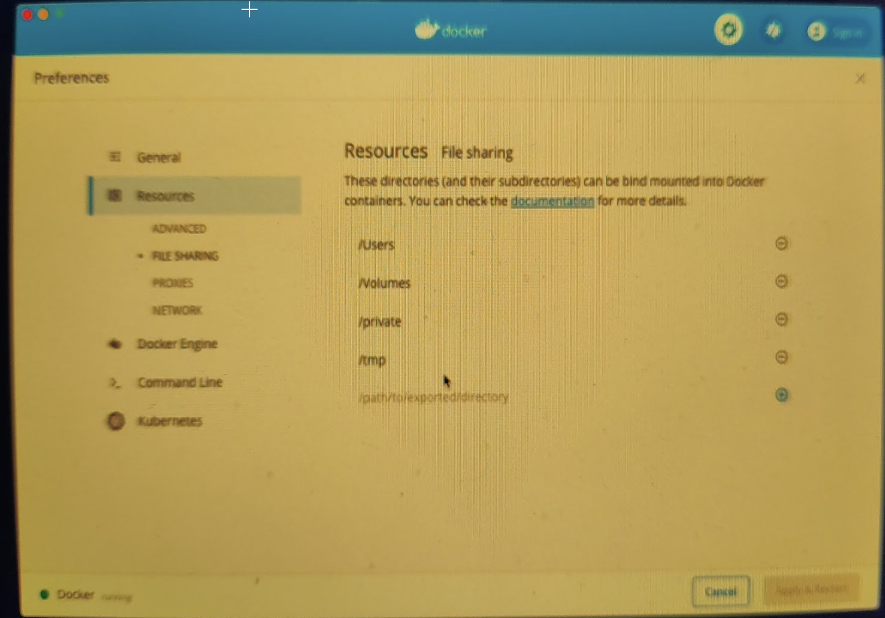

Helpful link for those using docker toolbox:
<https://headsigned.com/posts/mounting-docker-volumes-with-docker-toolbox-for-windows/>

### Docker networking

Creating multiple docker containers within the same docker network
(virtual network) allows those containers to communicate within each
other.

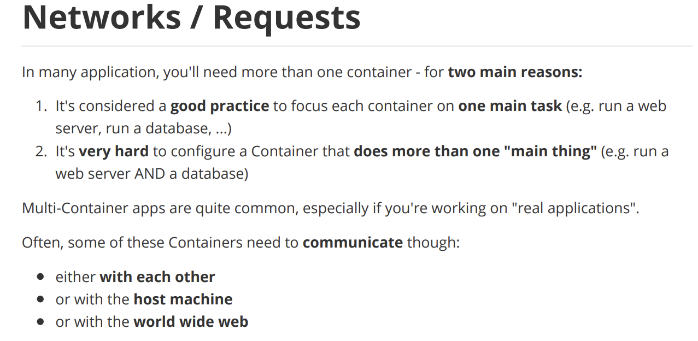

#### How to connect to other systems

##### Container-to- WWW

By default, containers can make requests to world wide web.

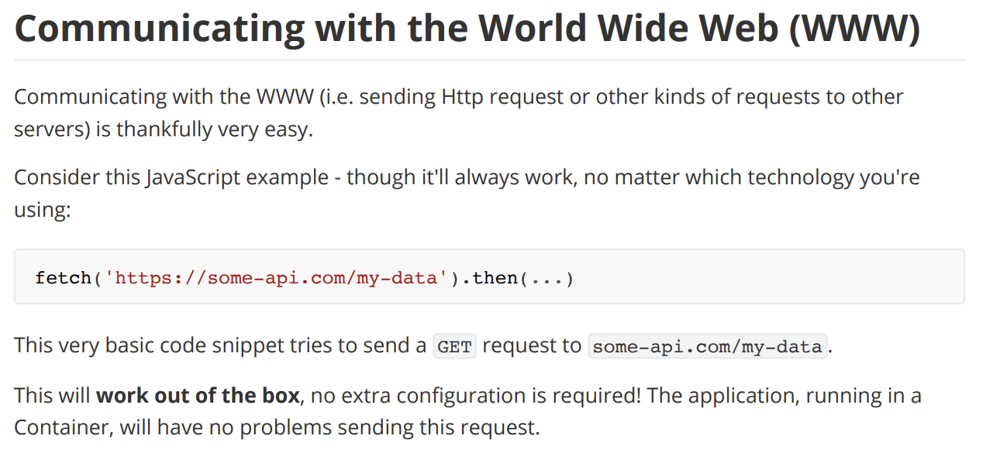

##### Conatiner-to-Host

Use **host.docker.internal** to refer to the local ip of the host
machine.

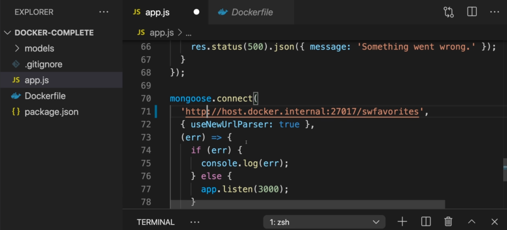

^ example above, connecting to another server in your local network.

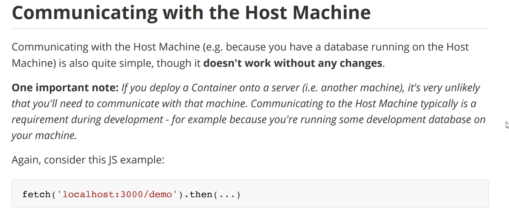
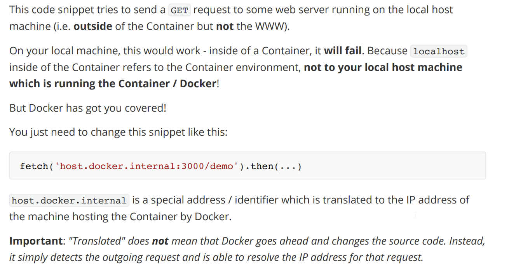

##### Container-to-container

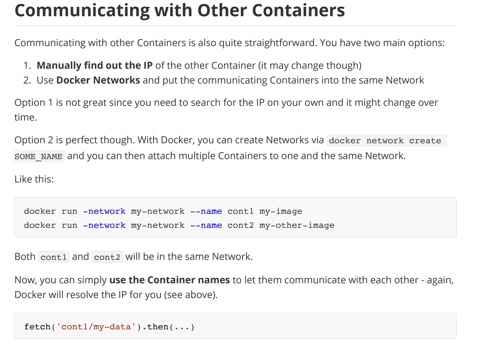

**Options in detail**

- **<u>\[not preferred\] Using docker default network (manual – have to
  hard-code ips of other containers)</u>**

  - The docker engine creates a network for all containers and those
    containers can communicate to each other via the same subnet
    (172.17.0.1/16 by default)

  - Find the ip of a container you want to connect to by using

    - **docker container inspect \<container\>**

    - 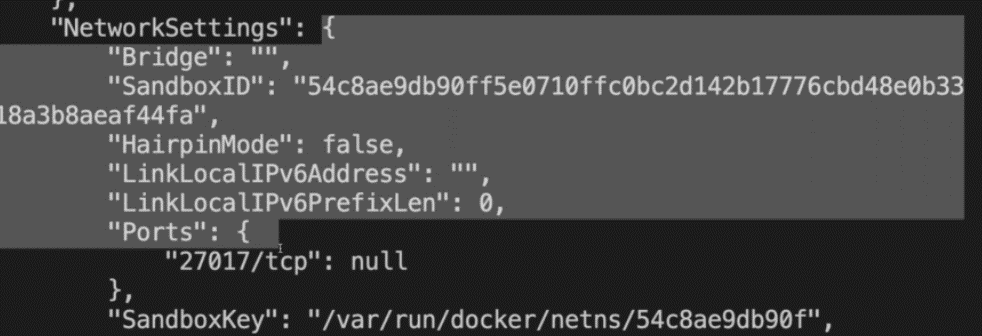

    - 

    - 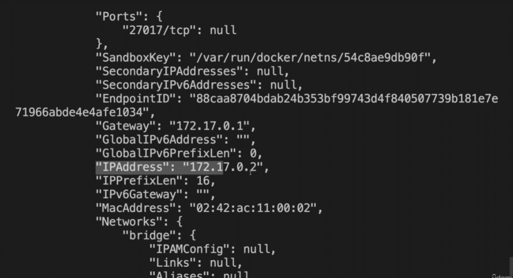

    - docker container inspect network_scanner_container | jq
      '.\[0\].NetworkSettings.IPAddress'

- **<u>\[Preferred\] Creating a container network</u>**

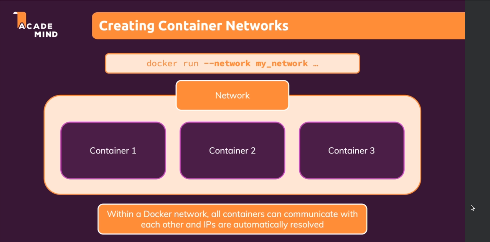

- **Step1: Create a docker network**

  - docker network create \<name\>

  - 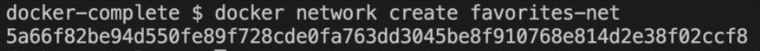

  - *View*

  - 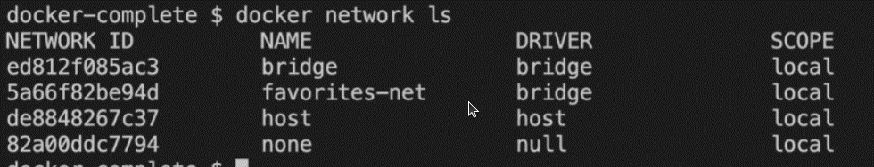

- **Step2: Create container(s) in that same network**

  - docker run –network \<network_name\> \<container_name\>

  - 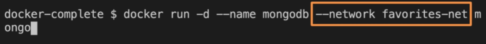

- **Step3: Use container namesin your code**

  - Anytime you want to refer to another container in your code, just
    use the container name to refence it. Docker will check if its in
    the same docker network and if so, will route traffic to that
    container by replacing that container name with the local ip of that
    container.

  - Example: “mongodb” will be “171.17.0.2”

  - 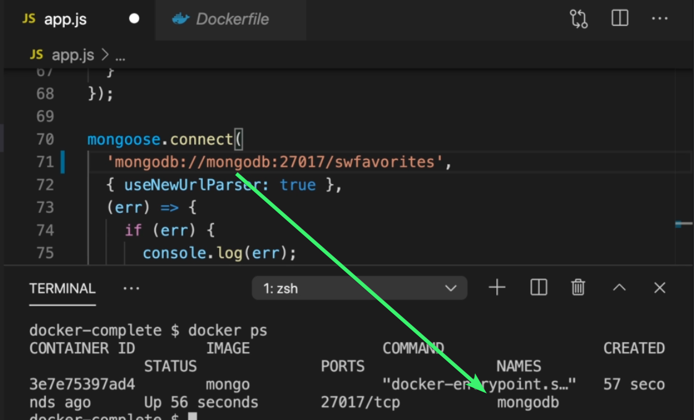

#### List docker networks

List docker networks with **docker network ls**

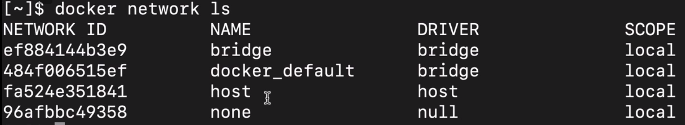

#### Creating a network

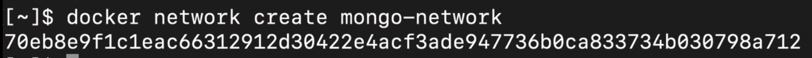

*Verifying network was made*

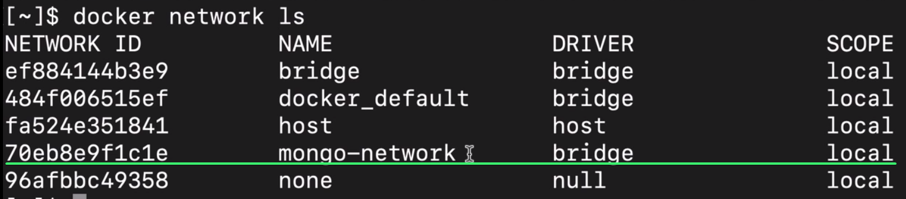

#### Creating a container within a specific docker network

Use the “—net” or “--wetwok” option upon running your container

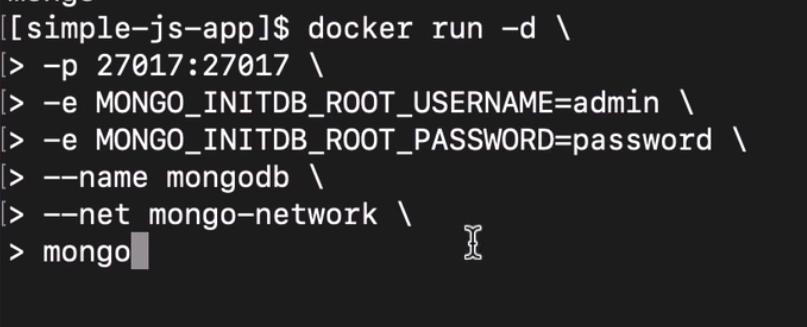

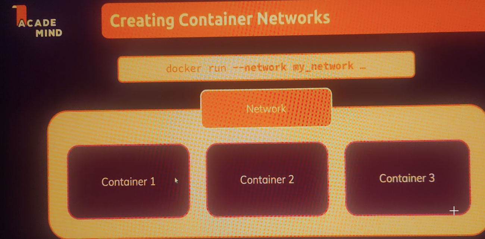

#### Docker network drivers

Docker Networks actually support different kinds of "**Drivers**" which
influence the behavior of the Network.

The default driver is the "**bridge**" driver - it provides the behavior
shown in this module (i.e. Containers can find each other by name if
they are in the same Network).

The driver can be set when a Network is created, simply by adding
the --driver option.

1.  docker network create --driver bridge my-net

*Of course, if you want to use the "bridge" driver, you can simply omit
the entire option since "bridge" is the default anyways.*

Docker also supports these alternative drivers - though you will use the
"bridge" driver in most cases:

- **host**: For standalone containers, isolation between container and
  host system is removed (i.e. they share localhost as a network)

- **overlay**: Multiple Docker daemons (i.e. Docker running on different
  machines) are able to connect with each other. Only works in "Swarm"
  mode which is a dated / almost deprecated way of connecting multiple
  containers

- **macvlan**: You can set a custom MAC address to a container - this
  address can then be used for communication with that container

- **none**: All networking is disabled.

- **Third-party plugins**: You can install third-party plugins which
  then may add all kinds of behaviors and functionalities

As mentioned, the "**bridge**" driver makes most sense in the vast
majority of scenarios.

### Docker Repositories

#### Sharing your images

Two ways to share your image

- **Share your dockerfile**: User can build image and run container.

- **Share your built image**

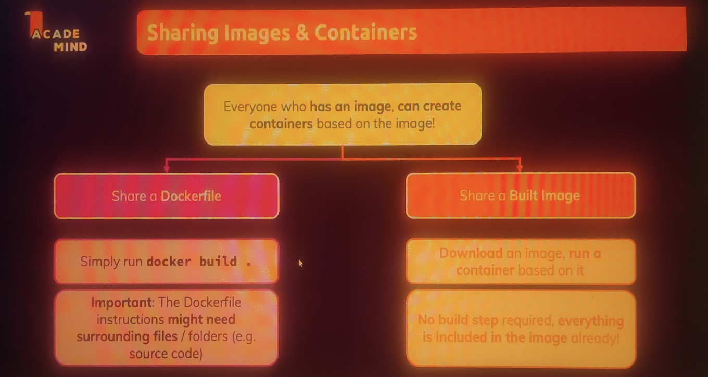

#### Public Repository : Dockerhub (Sharing your images to dockerhub)

#### Private Docker Repository

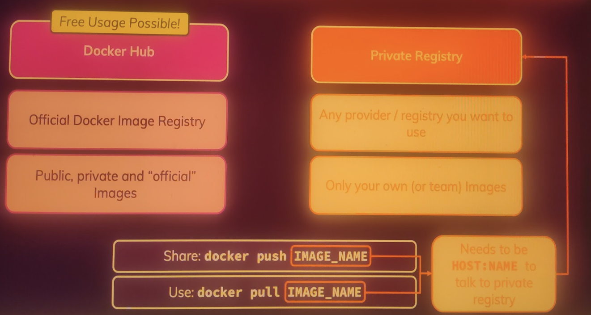

##### Pushing existing images to dockerhub

Image needs to be re-tagged to point to public repo.

Docker tag command needs to be ran to create of cl

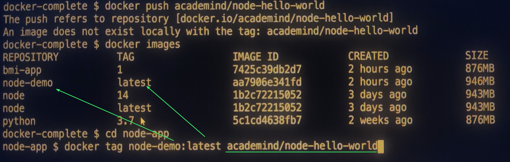

##### AWS ECR

**<u>Pulling from a private repository</u>**

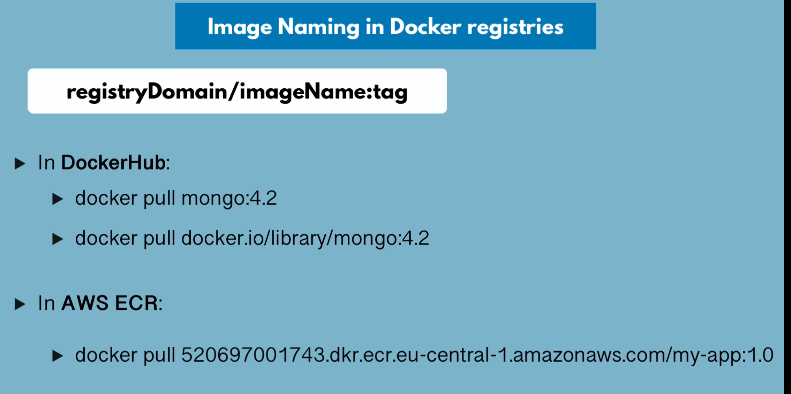

^ You can see above when pulling the format is

**\<repo\>/image:\<version\>**

We usually pull **without** specifying the repo, for example:

docker pull node:alpine-17

but that’s only because without specifying the repo, it’s assumed to be
public and fill in the repo bit with the dockerhub repo url. For
example,

docker pull
**<u>docker.io/</u>**node:alpine-17

*(it’s not really docker.io – but you get the idea).*

**<u>Pushing to a private repository</u>**

*Tag your image (associate it with your private repo)*

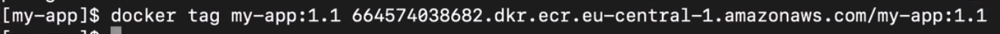

*Push to your private repository*

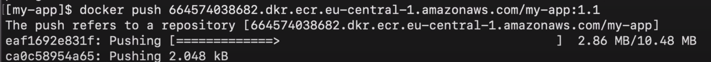

### Compose

<https://youtu.be/TSySwrQcevM?si=DCY1MOLhCLHT84fj>

Docker compose is a native feature which allows us to write a Docker
compose file, and use that file to define our images to be created,
containers to be made, port mappings, volumes, and more.

A **“docker-compose.yaml”** file, is a configuration file that allows us
to manage several containers that can communicate with each other. It’s
responsible for creating Docker images based on any **Dockerfile**(s)
placed in their respective project folders. This should be in the very
root folder. Not root of our project (where source code lives) but at
the very root of our Docker working directory.

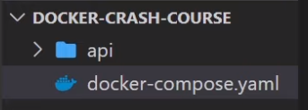

#### Samples + creating a compose config file

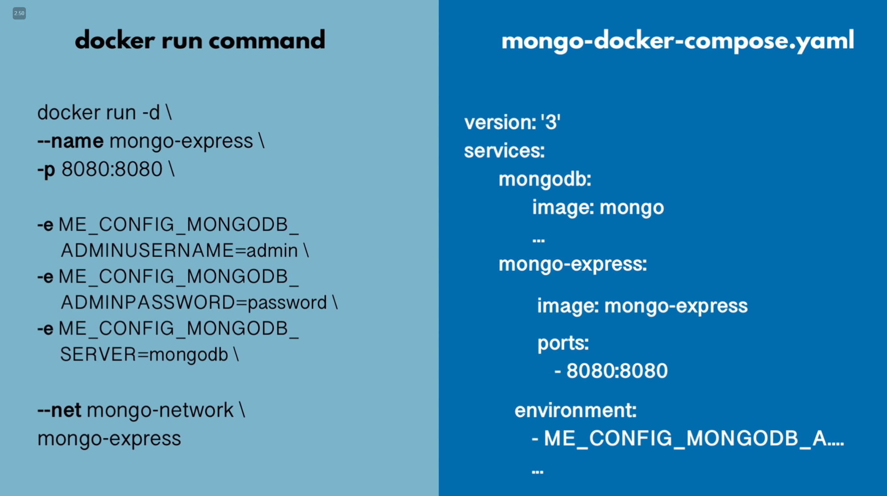

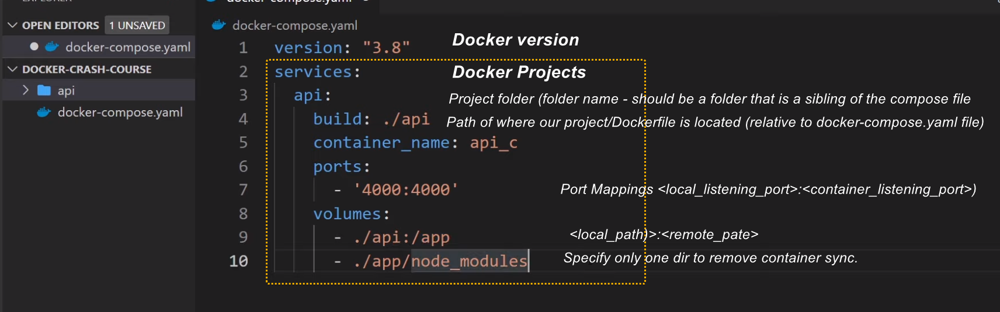

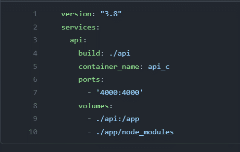

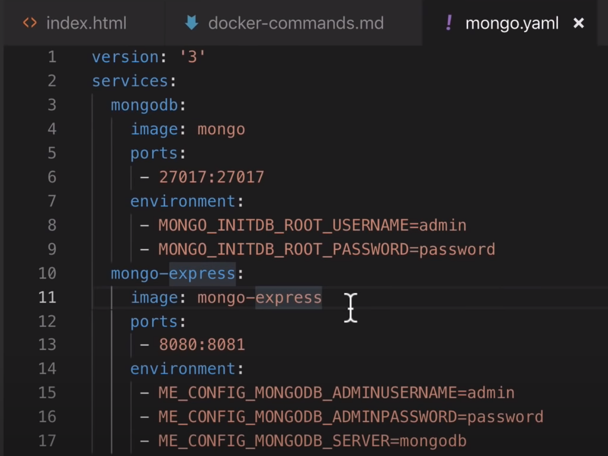

By default containers will run in detached mode, To have them start in
interactive mode add “stdin_open” and “tty”.

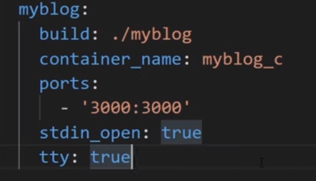

#### Running a docker compose file

When create a composition in docker, all of those created containers
will be attached to the same docker network.

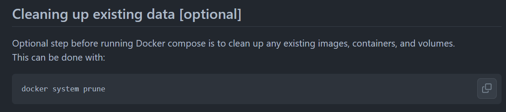

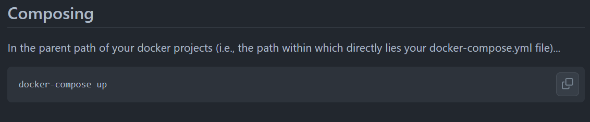

You can specify the name of your conf file as well

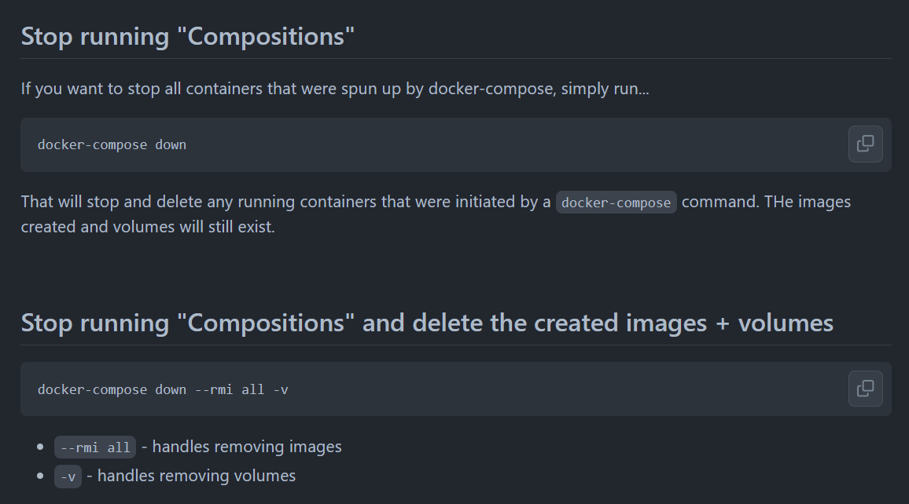

### Backup and Recovery

#### Backing up/restoring images

**<u>Backing up images:</u>** Save to save an image into a tar file

<https://docs.docker.com/engine/reference/commandline/save/>

**<u>Restoring images:</u>** Load to import tar file as an image

<https://docs.docker.com/engine/reference/commandline/load/>

#### Backing up/restoring Containers

You can back up a docker container by different means

- by committing a new docker image based on the docker container current
  state using the [docker
  commit](https://docs.docker.com/engine/reference/commandline/commit/) command

- by exporting the docker container file system as a tar archive using
  the [docker
  export](https://docs.docker.com/engine/reference/commandline/export/) command.
  You can later on create a new docker image from that tar archive with
  the [docker
  import](https://docs.docker.com/engine/reference/commandline/import/) command.

Be aware that those commands will only back up the docker container
layered file system. **This excludes the data volumes**.

#### Backing up/restoring Volumes

## Kubernetes

- <https://www.youtube.com/watch?v=PziYflu8cB8>

- 

**Kubernetes** is a container orchestration solution that supports
dynamic, scalable, and intertwined container environments.

A **pod** in Kubernetes consists of one or more containers.

A **proxy** in Kubernetes is run on each node in a cluster to maintain
network rules for that nodes. A sidecar is a separate container that
runs alongside an application container in a Kubernetes pod.

If you do not specify a network when starting a container, the container
will be placed on the default "**bridge**" network.

By default, containers start in the **foreground**.  To run a container
in the background, you must use the "-d" or "--detach" option to the
"docker run" or "podman run" commands.

Top of Form

Docker networking allows you to attach a container to as many networks
as you like.

Bottom of Form

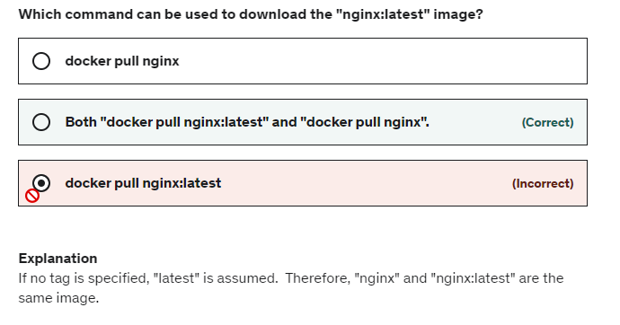

Running the **docker run {image-name}** command causes the container to
start up and run without establishing an administrative interface.
Running a container with the **docker run -it {image-name}** bash
command causes the container to start up and run but then launches the
Bash shell within the container and establishes an administrative
connection to the shell.
