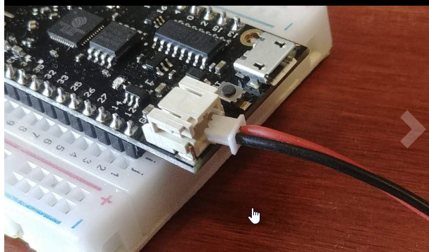

# Bluetooth

**Bluedot**

<https://bluedot.readthedocs.io/en/latest/gettingstarted.html>

# Learning Electronics

## General Electronics & MicroController Tutorials

**15min high-level overview**

<https://youtu.be/a9VxTE3-bbA>

**Beginner Electronics Playlist \[Greatest\]:**
<https://www.youtube.com/playlist?list=PLah6faXAgguOeMUIxS22ZU4w5nDvCl5gs>

**Beginner Electronics Playlist \[Great\]:**

<https://www.youtube.com/playlist?list=PLtzrl5APIWXREy07DTM0462aCc7_9sRG9>

**Electronics Concepts**

<https://www.youtube.com/playlist?list=PLYS_1w0FFIANdG78JyJu3tsumsXVIcXUB>

**A simple guide to electronic components**

<https://www.youtube.com/watch?v=6Maq5IyHSuc>

**Other**

[Electronics Explained The Easy
Way](https://www.build-electronic-circuits.com/)

[EveryCircuit](https://everycircuit.com/)

## Capacitors

<https://www.youtube.com/watch?v=X4EUwTwZ110>

## Terminology and Symbols


## IC (integrated circuit)

<https://www.youtube.com/watch?v=IbGrNgx6-lg>

<https://www.youtube.com/watch?v=UWPxa6N7VvA>

**555 timer ic**


## Breadboards

<https://www.youtube.com/watch?v=6WReFkfrUIk>

## Motors

**Great Playlist on all things Motor!:**
<https://www.youtube.com/playlist?list=PLWv9VM947MKjMtpgoXJ_azxuDdMnlSo69>

## Relay

<https://youtu.be/n9renPKEtUc>

## OHMs law

<https://youtu.be/fGI9d0CjI8s>


/

**Example**: Want to light a 3V LED with a 5V power supply. How many
ohms of resistance to apply?

**Scenario 1: You know how much mA your LED uses**

- **V** = **Volts** used by power supply **(5V)**

- **I** = **Milliamps** of current used by 3V LED (0.02A/**20mA)**

- **Formula for resistance** (**Number of Ohms**)

  - R = V \* I

  - R = 5\*20

  - R = 100 (100 Ohms of resistance)

**Scenario 2: You know how much Volts your LED uses**

- **V** = **Volts** used by power supply **(5V)**

- **I** = **Amps** of current used by 3V LED (**0.02A**/20mA**)**

- **F = Free Volts** not used by LED from power supply **(V - I)**.

- **Formula for resistance** (**Number of Ohms**)

  - R = F / I

  - R = 2/0.020w

  - R = 100 (100 Ohms of resistance)

<https://ledcalculator.net/>

## LiPo Batteries

<https://www.rogershobbycenter.com/lipoguide/>


- Small rechargeable batteries

- Voltage for small projects: 3.7V

  - 1S: 3.7V

  - 2S: 7.4V

  - …

- **MaH**: Milliamps has to do with capacity. How much they can hold of
  the given voltage.

  - **1000mAh = 1 Amp Hour (1Ah)**

- They have different connectors

  - Traxxas Connectors

  - EC3 Connectors

  - Deans Connectors

  - Tamiya Connectors

  - XT-60 Connectors

  - Anderson Power Poles

  - **JST-XH Plug**

    - Used in many microcontroller devices (1.25mm, 2mm, etc)

    - 1.25mm pin not fitting into a 2mm pin female

    - 

    - 

  - Thunder Power (TP) Plugs

- They need to be charged by charger of same type (1S, 2S, etc) and pin
  connection

## Resistors

<https://www.youtube.com/watch?v=7w5I-KbJ1Sg>

<https://www.youtube.com/watch?v=DYcLFHgVCn0>


## PCBs

<https://www.youtube.com/watch?v=MsdJgEinb34>

## Circuit Schematics

<https://www.youtube.com/watch?v=_HZ-EQ8Hc8E>

<https://www.youtube.com/watch?v=9cps7Q_IrX0>

<https://www.youtube.com/watch?v=MxRGXIe1qPo>

<https://www.youtube.com/watch?v=35YuILUlfGs>

<https://www.youtube.com/watch?v=Et-gHKTdziU>

## PWM

<https://www.youtube.com/watch?v=B_Ysdv1xRbA>

<https://www.youtube.com/watch?v=GQLED3gmONg>

## Motors

**Motor Driver:** <https://www.youtube.com/watch?v=PVyAcgYkzDs>

**Motor Controller:** <https://www.youtube.com/watch?v=Ey4xoG970Go>

**Motor Drivers vs Motor Controllers**:
<https://www.youtube.com/watch?v=eI4bUJDV2ok>

**DC Motors with Microcontrollers:** <https://youtu.be/ygrsIqWOh3Y>

# Programming with MicroControllers/MicroProcessors

## Key Terms

- **MicroProcessor**: Computer/device that usually has some sort of
  operating system.

  - Pi 3, Pi4, Pi Zero, etc.

- **MicroController**: Device that has no microcontroller but can run
  code that can be loaded onto the device.

- **Embedded System**: Similar to microcontrollers, but usually place a
  larger emphasis on the hardware side of things.

## Tutorials

**10 Min High-Level Overview of a MicroController**

<https://www.youtube.com/watch?v=JwCTkm43CxQ>

**ARM Microcontroller Programming:**

<https://www.youtube.com/playlist?list=PL6PplMTH29SHgRPDufZhfMRoFwRAIrzOp>

**Microcontrollers and the C Programming Language:**
<https://www.youtube.com/playlist?list=PLcTEZWGmK0W8AnyLA1ukHlM7rhQf5db8p>

## Programming Software

- **Binary**: Machine code already compiled and runs on embedded systems
  as ROM.

- **C/C++:** Low-level native programming for most/all?
  microcontrollers. Simply import the proper libraries for doing things
  like interacting with GPIO pins.

- **MicroPython:** A light implementation of python designed to run on
  some microcontrollers. Has hardware-related libraries installed that
  support microcontroller interactivity.

  - Can run more than one script at once.

  - Default script that runs is **main.py**

- **CircuitPython**: AdaFruit’s implementation of MicroPython. An even
  slimmed down and more simple version of MicroPython.

  - Can only run one file at a time.

  - Default script that runs is **code.py**

- **Arduino Sketch:** A port of C++ that runs natively on Arduino
  devices and some other devices as well (such as pi pico). Unlike
  python (as an interpreted language) Sketch is a compiled language
  making is faster to run than it’s python counterparts.

## Arduino Programming

**Playlist**:
<https://www.youtube.com/playlist?list=PLWNDWPAClRVoIZzsX-SkR5Br0_ZtRscxZ>

<https://www.youtube.com/watch?v=BLrHTHUjPuw>

### IR transmitting and receiving

<https://youtu.be/KMhPzWWwBwg>

## ESP32

**Playlist:**
<https://www.youtube.com/playlist?list=PLWNDWPAClRVqNUIuJylljkQfFSeIpuxUi>

**ESP32 and MicroPython**:
<https://www.youtube.com/playlist?list=PLw0SimokefZ3uWQoRsyf-gKNSs4Td-0k6>

## Raspberry Pi (and Raspian)

### Docs + Getting started

**Docs:** <https://www.raspberrypi.com/documentation/>

**Getting Started:** <https://youtu.be/BpJCAafw2qE>

**Raspian Images (64-bit version)**

<https://downloads.raspberrypi.org/raspios_arm64/images/raspios_arm64-2021-05-28/>

<https://jamesachambers.com/where-to-get-the-64-bit-raspberry-pi-os-image-for-pi-4-400/>

**Setting up remote Access**

<https://www.raspberrypi.com/documentation/computers/remote-access.html>

**Troubleshooting (NDIS driver)**

<https://learn.adafruit.com/turning-your-raspberry-pi-zero-into-a-usb-gadget/ethernet-gadget>

If a Raspberry Pi device is not recognized by Windows 10 as a COM port,
it may need to be manually installed with the Microsoft RNDIS 5.1
driver. This can be done by right-clicking on the device and selecting
"Update Driver Software," then "Browse my computer for driver software,"
and finally choosing "Remote NDIS Compatible Device." Another option is
to manually force or install Microsoft RNDIS driver usage in Device
Manager by right-clicking on the device and selecting "Update Driver
Software," then "Browse my computer," "Pick from a list," "Network
Adapters," "Microsoft," and finally "Remote NDIS compatible device." If
the Raspberry Pi is pre-built with Qualcomm's wan0 driver, it needs to
be removed and then installed with SIMCOM's driver.


### Bluetooth Interactivity

<https://bluedot.readthedocs.io/en/latest/gettingstarted.html>

### GPIO, Python, and gpiozero

**Basics of GPIO**: <https://youtu.be/6PuK9fh3aL8>

<https://gpiozero.readthedocs.io/en/stable/>

<https://www.raspberrypi.com/documentation/computers/os.html#gpio-in-python>

On a PI type “pinout” in a terminal to get a pinout


### Controlling LEDs


### Pimoroni gif frame

pip3 install RPi.GPIO

pip3 install spidev

pip3 install Pillo

pip install numpy

pip install ST7789

### Pimoroni display hat mini

<https://shop.pimoroni.com/products/display-hat-mini>

**Demo:** <https://github.com/pimoroni/displayhatmini-python>

**GifFrame**:
<https://github.com/printminion/pimoroni-Display-HAT-Mini-gif-frame>

### Working with Servo motor

<https://how2electronics.com/how-to-control-servo-motor-with-raspberry-pi-pico/>

<https://makersportal.com/blog/2020/3/21/raspberry-pi-servo-panning-camera>

**Rotating 360 degrees**

<https://www.youtube.com/watch?v=AekrfCaZF2s>

**Controlling servo with potentiometer**

<https://www.youtube.com/watch?v=oCdoSJVEgJg>

<https://circuitdigest.com/microcontroller-projects/control-a-servo-motor-with-raspberry-pi-pico-using-pwm-in-micropython>

### Projects

#### Pwnaagotchi

<https://www.youtube.com/watch?v=z5yb43PlhEA&t=142s>

**WPA_supplicant:**
<https://linuxhint.com/rasperberry_pi_wifi_wpa_supplicant/>

**Default config file**:
<https://github.com/evilsocket/pwnagotchi/blob/master/pwnagotchi/defaults.toml>

**Web-UI**: <https://pwnagotchi.ai/usage/#bettercap-s-web-ui>

#### NAS

<https://youtu.be/gyMpI8csWis>

#### MySQL Database

<https://youtu.be/crPoSYFcZDk>

#### Web-Server

**Node Js web server:** <https://youtu.be/iSAF8D8rp0o>

**Apache + PHP:** <https://youtu.be/9pn1KKhxwdM>

**Apache + PHP:** <https://youtu.be/8FyqyO-k16M>

#### Pi-hole

<https://www.youtube.com/watch?v=4X6KYN1cQ1Y>

 

**Parts List:**

- **Raspberry Pi (any model)**

  - We will be using a Raspberry Pi Zero (<https://lmg.gg/8KV3n>)
    - **$5**

  - You can optionally install Pi-Hole in a docker container, or inside
    a VM, but we will be assuming you are using a Raspi for the rest of
    this tutorial.

- **Micro SD Card **(2gb+, but you should probably just buy a 16GB card
  because they're so cheap)

  - We'd recommend a cheap SanDisk card (<https://lmg.gg/8KV3k>)

- **2.5A Micro USB AC Power Supply**

  - You can get these really cheap on eBay, but we aren't making any
    promises about quality. AdaFruit has a solid
    one: <https://lmg.gg/8KVm8>

- **\*Optional\*: Micro USB to RJ45 Ethernet Adapter**

  - This is in case the RasPi you are using doesn't have an ethernet
    port or WiFi (**if you're using the Pi Zero, you will need one of
    these**)

- **\*Optional\*: Other stuff that you might need:**

  - SD/uSD Card Reader (Unless your laptop, or you already has one)

  - Ethernet Cable (Unless you're using WiFi, you will need one of
    these)

  - Case for your Raspberry Pi Model (Nice to have to keep it protected,
    but cardboard also works)

  - Heat sinks for your Raspberry Pi (Nice to have to keep it cool, also
    helpful if you want to overclock your Pi)

  - A display connection for your Pi (Pi Zero's use Mini HDMI) (We will
    be doing a headless install, so this is not necessary)

 

**Stage 1 - OS Install/Setup:**

1.  **Before we can install Pi-Hole or anything else really, we have to
    setup our operating system of choice: Raspbian Buster Lite (stretch
    also works)**

    1.  Download and unzip the ***"Raspbian Buster Lite"*** image
        from the Raspbian
        website: <https://www.raspberrypi.org/downloads/raspbian/>

    2.  Download and install balenaEtcher, our uSD card writer/burner of
        choice: <https://www.balena.io/etcher/>

    3.  Plug in your uSD card

    4.  Launch balenaEtcher, select the Raspbian Buster Lite image, your
        uSD card, and then click **Flash**.
        ([**https://i.imgur.com/GMSZj8Z.png**](https://i.imgur.com/GMSZj8Z.png))

2.  **If you're doing a headless install like us (no monitor/keyboard
    required), you'll need to enable SSH before booting up the Raspberry
    Pi**

    1.  Replug your uSD card to allow Windows to recognize the new
        Raspbian partition layout

    2.  You should have a lettered drive pop up marked as "boot"
        ([**https://i.imgur.com/4ar0ih3.png**](https://i.imgur.com/4ar0ih3.png))

        1.  If you don't, ensure your uSD is being detected in Disk
            Management
            ([**https://i.imgur.com/ZPmyyz6.png**](https://i.imgur.com/ZPmyyz6.png))

        2.  Then assign the partition a drive
            letter: <https://lmg.gg/8KVm6>

    3.  Create a file inside the "***boot***" folder called "ssh" with
        no extension
        ([**https://i.imgur.com/KDyB4nc.png**](https://i.imgur.com/KDyB4nc.png))

        1.  If you don't know how to make an extension-less file you can
            download it here: <https://lmg.gg/8KVmb>

3.  **Plug your uSD card into the Raspberry Pi followed by networking,
    and then power.**

4.  **Since we're doing a headless install, we'll need to search for our
    raspberrypi's IP address so we can access it over SSH.**

    1.  If you know what you're doing, log in to your router's admin
        page and check the DHCP client/reservation list for
        "raspberrypi"

    2.  If you don't know how to do the above, download Angry IP scanner
        and run it: <https://lmg.gg/8KVmS>

    3.  Look for the hostname "raspberrypi", on that line the IP and MAC
        address of our Raspberry Pi will also be listed: **10.20.0.77 in
        our case** (**<https://i.imgur.com/lK2ce0R.png>)**

5.  **Now that we've found our Raspberry Pi's IP address + MAC Address,
    we need to assign it an INTERNAL/LOCAL static IP address.**

    1.  This process is going to vary wildly based on which router/DHCP
        server you use, so we'd recommend Googling your router's model
        name/number (can be found on the back) + "how to set static IP"
        (ex: "Netgear R7000 how to set static ip").

    2.  If you're willing and somewhat tech savvy, you might also be
        able to figure it out on your own.

        1.  Start by navigating to your router's admin page. The IP for
            this is typically located on a sticker on the back of your
            ISP's provided router (along with the admin page's default
            username and password), but you can also find it by running
            the command "ipconfig" in command prompt on a Windows PC.
            Your router's IP will be listed after "default gateway"
            ([**https://i.imgur.com/S2Ndc0w.png**](https://i.imgur.com/S2Ndc0w.png))

        2.  Log in to the admin page either with the Iogin credentials
            listed on the back of the router, or by googling the model
            number of the router along with "default password". Some
            routers use a randomly generated default password, so
            googling will not work for those.

        3.  Once logged in, look for a tab labeled "*DHCP
            Reservation*", "*Static IP Assignment*", or something along
            those lines.
            ([**https://i.imgur.com/FeMjd4V.png**](https://i.imgur.com/FeMjd4V.png))
            You may have to go to the Advanced menu to access this.
            ([**https://i.imgur.com/6l4kIqH.png**](https://i.imgur.com/6l4kIqH.png))

        4.  Enter the MAC address we grabbed earlier with Angry IP
            scanner, and then enter/select your desired static IP
            address (make sure you're using something not taken by
            another device on your network).
            ([**https://i.imgur.com/znUTbKv.png**](https://i.imgur.com/znUTbKv.png))

        5.  Hit Apply (or whatever the equivalent is for your router) 

6.  **Re-plug the power connection for your Raspberry Pi, to allow it to
    restart and fetch it's newly assigned IP.**

7.  **To access the Raspberry Pi over SSH we will need to download and
    connect to it with an SSH client**

    1.  Download, install and then launch the SSH client of your choice.

        1.  We will be using PuTTY because it's simple, but any SSH
            client will
            do: <https://lmg.gg/8KVmQ> ([**https://i.imgur.com/POLV3i4.png**](https://i.imgur.com/POLV3i4.png))

    2.  Enter the newly assigned static IP address of your Raspberry Pi
        into PuTTY, and click "Open"
        ([**https://i.imgur.com/BegMcKC.png**](https://i.imgur.com/BegMcKC.png))

    3.  After it prompts you with "login as:" enter "pi"
        ([**https://i.imgur.com/jfULCu5.png**](https://i.imgur.com/jfULCu5.png))

    4.  Then for password, enter "raspberry". You should now be logged
        in over
        SSH.  ([**https://i.imgur.com/Q058Sbw.png**](https://i.imgur.com/Q058Sbw.png))

8.  **Now that we're logged in over SSH, start by changing the default
    password, and updating the Raspberry Pi.**

    1.  To change the user password enter the command "passwd" and press
        enter.

        1.  You'll then be prompted to enter the current password (this
            is "raspberry" so enter that)

        2.  Then enter your desired new password

    2.  To update the Raspberry Pi, run the command "sudo apt update" -
        this is going to update the package list to tell us if anything
        needs to be update.
        ([**https://i.imgur.com/ECpLG93.png**](https://i.imgur.com/ECpLG93.png))

        1.  Then, to actually upgrade the packages now that the package
            manager knows which ones need updating, run "sudo apt
            upgrade -y".
            ([**https://i.imgur.com/EYfDhkC.png**](https://i.imgur.com/EYfDhkC.png))

9.  **Our Raspberry Pi is now updated, set to a secure password and
    ready to install Pi-Hole
    onto! **

 

**Stage 2 - Pi-Hole Install/Setup (this is where the tutorial portion in
the video starts)**

1.  **With our RasPi's OS, internet, and SSH ready to go, we can now
    install Pi-Hole.** 

    1.  Copy the Pi-Hole install command from their website, paste it
        into the SSH client, and click Enter to run
        it: <https://lmg.gg/8KVm9> ([**https://i.imgur.com/P20CP2I.png**](https://i.imgur.com/P20CP2I.png))

    2.  The installer will spit out some status updates until you're
        brought to the configuration screen
        ([**https://i.imgur.com/t0DHzHo.png**](https://i.imgur.com/t0DHzHo.png))

    3.  Press Enter until you get to the "Choose An Interface" page. The
        default "eth0" interface for Ethernet users should be selected
        by default. Press Enter to continue.

        1.  ("wlan0" should be selected if you're using WiFI - keep in
            mind WiFi installation is not supported in this tutorial,
            but if you have some decent Google-Fu you should be able to
            figure it out)

    4.  On the next screen, select your upstream DNS provider. This is
        where requests will be forwarded if they're not blocked by
        Pi-Hole (ie. if they're not found in it's block/black lists). We
        will be using Google DNS, and if you don't know what this means,
        stick with that. Press Enter to continue.

    5.  The following screen allows you to select which of the default
        block list's you'd like to use. We will leave these all on, but
        you can use your arrow keys and space bar to (de)select any of
        them as you wish. Press Enter to continue.

    6.  Next up, it will ask you if which IP protocols you want to block
        ads over, leave this at the default unless you know what you're
        doing. Press Enter to continue.

    7.  The next screen will list the IP address of the Raspberry Pi and
        the IP of your router, assuming you've set a static IP, just
        click Enter to continue.

        1.  If you get a screen about an IP conflict, just ignore it and
            click Enter to continue.

    8.  You'll then be asked about the web interface, web server, and
        logging modes. Leave these all at default by clicking Enter.

    9.  After all that, Pi-Hole is going to do a bunch of stuff, and it
        might take a couple minutes so sit back until you're greeted
        with an "Installation Complete!" page. This will list the IP and
        password for the Pi-Hole web interface.

2.  **Copy the IP into your browser, and log with the listed password.
    Huzzah! You now have a functioning Pi-Hole
    installation **** **

 

**Stage 3 - Setting Up Pi-Hole to Run on Your Devices / Whole Network**

1.  **To enable Pi-Hole on a device-by-device basis, you'll need to
    manually set the DNS IP address in your device settings. **

    1.  **For each of these, substitute the IP in the tutorial for the
        IP of your Raspberry Pi**

        1.  How to set DNS on an iPhone: <https://lmg.gg/8KVmw>

        2.  How to set DNS on Android phones (your phone manufacturers
            skin may slightly vary): <https://lmg.gg/8KVmh>

2.  **To enable Pi-Hole on a Router level, meaning it will work on all
    your devices automatically, you'll need to configure your router's
    DHCP server's default DNS settings.**

    1.  This process is going to vary wildly based on which router/DHCP
        server you use, so we'd recommend Googling your router's model
        name/number (can be found on the back) + "how to set DNS
        servers" (ex: "Netgear R7000 how to set DNS servers").

 

**Stage 4 - Using Pi-Hole + Common Whitelisting**

1.  **To enable some common whitelisted false-positives run the command
    listed here: <https://github.com/anudeepND/whitelist>**

2.  **For some great info on the Pi-Hole web interface read the lower
    portion of this
    tutorial: <https://www.smarthomebeginner.com/pi-hole-tutorial-whole-home-ad-blocking/#Configuring_Your_Router_8211_Whole_Home_Ad_Blocking> **

## MicroPython and CircuitPython devices (RP 2040, Arduino, etc)

### Getting Started

#### Setting Up

Replace “xiao” with relevant device.

- Open thonny editor

  - Configure Interpreter to detect automatically (choose Circuit/Micro
    Python – whichever you plan to use). It will detect your XIAO as a
    pi pico (because it uses same chip).

    - Bottom right – click “configure interpreter”

      - 

    - Or go to options and make sure it looks like this

    - 

- Hold “B” button while plugging in the xiao into your pc (“boot mode”).

  - Will shows as an external drive

  - 

  - 

- Open thonny editor

  - Will show up as “pico” (bottom right)

  - 

  - Install/Update Micropython/CircuitPython if needed

    - 

  - Alternatively, you can download the UF2 file from
    Micropython/CircuitPython and save it directly in the XIAO.

    - 

  - Keep default settings

  - 

  - 

- Now you might have to change the device selected in bottom right to
  choose the Pico version you chose:

  - 

#### Hello world

Code:

from machine import Pin, Timer  
  
led = Pin(25, Pin.OUT)  
Counter = 0  
Fun_Num = 0  
  
def fun(tim):  
global Counter  
Counter = Counter + 1  
print(Counter)  
led.value(Counter%2)  
  
tim = Timer(-1)  
tim.init(period=1000, mode=Timer.PERIODIC, callback=fun)

Paste that into your edit and save


^ either option should be fine, but I would choose pico to be safe.

**“main.py”** is the default and the file that runs when the xiaio is
powered on standalone (no pc) if using **MicroPython**.

**“code.py”** is the default and the file that runs when the xiaio is
powered on standalone (no pc) if using **CircuitPython**.

**NOTE**: Sometimes circuitpython uses “main.py” as well so best to try
both if either doesn’t work.

Run script and cross fingers! Unplug and see if file runs as well.


### MicroPython (Mostly Pico-based)

#### Helpful Docs

**MicroPython Docs for RP 2040 Libraries**

<https://docs.micropython.org/en/latest/library/rp2.html>

**Micropython Alternate docs + mini tutorials**

<https://docs.sunfounder.com/projects/thales-kit/en/latest/micropython/python_start/introduction_micropython.html>

<http://docs.micropython.org/en/latest/library/index.html>

**PIN Library**

<https://docs.micropython.org/en/latest/library/machine.Pin.html>

**Neopixel docs**

<https://docs.micropython.org/en/latest/esp8266/tutorial/neopixel.html>

#### Running scripts on poweron

Just add code in **main.py** file.

#### PWM and MicroPython

<https://www.instructables.com/Servo-Motor-Control-Using-Raspberry-Pi-Pico/>

<https://microcontrollerslab.com/servo-motor-raspberry-pi-pico-micropython/>

***Docs***

<https://docs.micropython.org/en/latest/library/machine.PWM.html?highlight=pwm>

<https://micropython-glenn20.readthedocs.io/en/latest/library/machine.PWM.html>

#### DC Motor with L298N Motor Driver

Best:
<https://microcontrollerslab.com/dc-motor-l298n-driver-raspberry-pi-pico-tutorial/>

<https://www.youtube.com/watch?v=H1Fzil_VUq4>

<https://youtu.be/ygrsIqWOh3Y>


The “5V Logic” jumper can also go out to a external battery source \>
7.5V+. We need 7.5+ because we are going to lose 1.5V due to the heat
sink of this motor driver. It is for this reason Mofset-based drivers
are preferred.

#### Web server

<https://projects.raspberrypi.org/en/projects/get-started-pico-w/0>

<https://makeblock-micropython-api.readthedocs.io/en/latest/public_library/Third-party-libraries/urequests.html>

<https://www.raspberrypi.com/news/how-to-run-a-webserver-on-raspberry-pi-pico-w/>

#### Working with Servo Motor

<https://www.iotstarters.com/controlling-a-servo-motor-using-raspberry-pi-pico/>

<https://www.youngwonks.com/blog/How-to-use-a-servo-motor-with-the-Raspberry-Pi-Pico>

<https://www.instructables.com/Servo-Motor-Control-Using-Raspberry-Pi-Pico/>

<https://www.youtube.com/watch?v=jYuYG1E6FvM>

<https://www.youtube.com/watch?v=RQ5-d4o-M2Q>

### CircuitPython

**Getting Started:** <https://youtu.be/07vG-_CcDG0>

# MicroControllers/MicroProcessors

## RP2040 Devices

### Raspberry Pi Pico

**Powering the pico:** <https://www.youtube.com/watch?v=3PH9jzRsb5E>

**Full Tutorial+ Controlling I/O:** <https://youtu.be/Zy64kZEM_bg>

**Full tutorial guid + code-along projects:**
<https://www.dropbox.com/sh/9s1gbzqsubayo28/AABJxsXhfdYC-fL-1107da4Wa?dl=0>

### XIAO Seed: RP 2040

**Using XIAO with Thonny IDE \[BEST\]**

<https://wiki.seeedstudio.com/XIAO-RP2040-with-MicroPython/>

**Using XIAO with Ardiuino IDE**

<https://how2electronics.com/getting-started-with-seeed-xiao-rp2040-with-projects/>

**Intro to XIAO and Solder demo (~13mins in)**

<https://www.youtube.com/watch?v=2axwx_Mz3WI>

**MicroPython Docs for RP 2040 Libraries**

[https://docs.micropython.org/en/latest/library/rp2.html](https://docs.micropython.org/en/latest/library/rp2.html)

**PIN Library**

[https://docs.micropython.org/en/latest/library/machine.Pin.html](https://docs.micropython.org/en/latest/library/machine.Pin.html)

**Neopixel docs**

[https://docs.micropython.org/en/latest/esp8266/tutorial/neopixel.html](https://docs.micropython.org/en/latest/esp8266/tutorial/neopixel.html)

#### Pinout

There are 11 GPIO pins (D0-D10) which are referenced by P0-P4, P6-P7,
and P26-P29 (inclusively).


# Hello world

Code:

```python
```from machine import Pin, Timer led = Pin(25, Pin.OUT)  
Counter = 0  
Fun_Num = 0  
   
def fun(tim):  
    global Counter  
    Counter = Counter + 1  
    print(Counter)  
    led.value(Counter%2)  
   
tim = Timer(-1)  
tim.init(period=1000, mode=Timer.PERIODIC, callback=fun)
```

**Paste that into your edit and save**
![[Pasted image 20250617085009.png]]


^ either option should be fine, but I would choose pico to be safe.

**“main.py”** is the default and the file that runs when the xiaio is powered on standalone (no pc) if using **MicroPython**.

**“code.py”** is the default and the file that runs when the xiaio is powered on standalone (no pc) if using **CircuitPython**.

**NOTE**: Sometimes circuitpython uses “main.py” as well so best to try both if either doesn’t work.

Run script and cross fingers! Unplug and see if file runs as well.

![[Pasted image 20250617084940.png]]

## ESP32 Devices

**What is ESP32:** <https://www.youtube.com/watch?v=A5CB4t9sukM>
