## Bash Shell Scripting

## Helpful Links

<https://www.tutorialspoint.com/unix/shell_scripting.htm>

<https://www.youtube.com/watch?v=v-F3YLd6oMw>

<https://www.youtube.com/watch?v=GtovwKDemnI>

<https://www.youtube.com/watch?v=hwrnmQumtPw>

<https://www.youtube.com/watch?v=e7BufAVwDiM>

<https://www.youtube.com/watch?v=6ue2luv2I-Y>

<https://www.youtube.com/playlist?list=PLS1QulWo1RIYmaxcEqw5JhK3b-6rgdWO_>

<https://www.youtube.com/watch?v=GzIFoJBVwh8>

Intermediate:
<https://www.youtube.com/playlist?list=PLtK75qxsQaMIlFCcFZpTBLnaCJ0I0uiaY>

Advanced: <https://youtu.be/emhouufDnB4>

Running shell scripts on windows:
<https://www.youtube.com/watch?v=pqn20YFvYWE>

Sample script:
<https://gist.github.com/bradtraversy/ac3b1136fc7d739a788ad1e42a78b610>

212 examples: <https://www.youtube.com/watch?v=q2z-MRoNbgM>

**<u>Straight examples</u>**:
<https://www.ubuntupit.com/simple-yet-effective-linux-shell-script-examples/>

Cheat sheet: <https://devhints.io/bash>

**Note**: Seems like wherever you would use a comma in most programming
languages you would use a single space in shell scripting.

## General/scripting with bash

THE 3 CORE COMPONENTS OF A BASH SCRIPT

### Setup

See your shells:

With the shebang in place, we don’t need to specify which program to use
when calling the script (**bash myscript** or **perl myscript** or
**python myscript**) – we just call it (**myscript**)

**Preferred** – this method find bash location on any system

^ this is basically like running which bash, where we let the
environment find the path to the bash binary instead of manually setting
it with **/bin/bash** for example.

The which bash
command returns the location of your shell –
which you will need to reference in your shebang line if manually
defining it.

**Shebang line:**

However, you can use which ‘sh’ to allow this script to run without
calling the bash program

\# = ‘sharp’ symbol. As in music (or C#).

! = ‘BANG’ symbol

\#! = shebang

This is just the full path to the script interpreter

**Running a script:**

Enter path and file name

### Add professional comment 

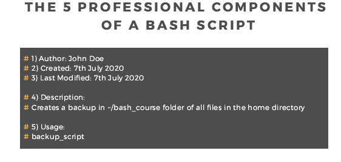

### Where to save your script

- **Personal use (preferred)**

  - ~/bin

    - Make this dir in home dir

      - 

    - Add this new dir to PATH in the .bashrc file and source it

      - 

      - 

    - Note: On Ubuntu, there’s already a bit in the .profile file checks
      for such a dir and auto-adds it to the PATH var. All that is
      needed is to source the .profile file (**source ~/.profile**)

      - 

- **All users**

  - /usr/local/bin

- **Intended to be used by SysAdmin**

  - /usr/local/sbin

- Save as functions in ~/.bashrc

### Change permissions!

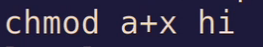

### Using main function

To keep code clean it’s common to have only functions in your script,
including a main function, and then passing args into main function at
the bottom of your script like:

### Redirection

### **Multi-line comments**

Many people use multi-line comments for documenting their shell scripts.
Check how this is done in the next script called comment.sh.

\#!/bin/bash

: '

This script calculates

the square of 5.

'

((area=5\*5))

echo $area

Notice how multi-line comments are placed
inside **:’** and **‘** characters.

You can also use a here document.

### Common Special characters

#### List operators (chaining commands)

#### Redirection Special Characters

<table>
<colgroup>
<col style="width: 20%" />
<col style="width: 79%" />
</colgroup>
<thead>
<tr>
<th><strong>Character</strong></th>
<th><strong>Usage</strong></th>
</tr>
</thead>
<tbody>
<tr>
<td><strong>\#&gt;</strong></td>
<td>Redirect output descriptor (Default <strong># = 1,
stdout</strong>)</td>
</tr>
<tr>
<td><strong>&lt;</strong></td>
<td>Redirect input descriptor</td>
</tr>
<tr>
<td><strong>&gt;&gt;</strong></td>
<td>Append output</td>
</tr>
<tr>
<td><strong>&gt;&amp;</strong></td>
<td>Redirect <strong>stdout</strong> and <strong>stderr</strong>
(equivalent to <strong>.. &gt; .. 2&gt;&amp;1</strong>)</td>
</tr>
</tbody>
</table>

#### Compound Commands Special Characters

<table>
<colgroup>
<col style="width: 32%" />
<col style="width: 67%" />
</colgroup>
<thead>
<tr>
<th><strong>Character</strong></th>
<th><strong>Usage</strong></th>
</tr>
</thead>
<tbody>
<tr>
<td><strong>|</strong></td>
<td>Piping</td>
</tr>
<tr>
<td><strong>()</strong></td>
<td>Execute in a separate shell</td>
</tr>
<tr>
<td><strong>&amp;&amp;</strong></td>
<td>AND list</td>
</tr>
<tr>
<td><strong>||</strong></td>
<td>OR list</td>
</tr>
<tr>
<td><strong>;</strong></td>
<td>Separate commands</td>
</tr>
</tbody>
</table>

#### Expansion Special Characters

<table>
<colgroup>
<col style="width: 19%" />
<col style="width: 80%" />
</colgroup>
<thead>
<tr>
<th><strong>Character</strong></th>
<th><strong>Usage</strong></th>
</tr>
</thead>
<tbody>
<tr>
<td><strong>{}</strong></td>
<td>Lists</td>
</tr>
<tr>
<td><strong>~</strong></td>
<td>Usually means <strong>$HOME</strong></td>
</tr>
<tr>
<td><strong>$</strong></td>
<td>Parameter substitution</td>
</tr>
<tr>
<td><strong>‘</strong></td>
<td>Back tick; used in expression evaluation (also <strong>$()</strong>
syntax)</td>
</tr>
<tr>
<td><strong>$(( ))</strong></td>
<td>Arithmetic substitution</td>
</tr>
<tr>
<td><strong>[]</strong></td>
<td>Wildcard expressions, and conditionals</td>
</tr>
</tbody>
</table>

#### Escapes Special Characters

<table>
<colgroup>
<col style="width: 25%" />
<col style="width: 74%" />
</colgroup>
<thead>
<tr>
<th><strong>Character</strong></th>
<th><strong>Usage</strong></th>
</tr>
</thead>
<tbody>
<tr>
<td><strong>\</strong></td>
<td>End of line, escape sequence</td>
</tr>
<tr>
<td><strong>’ ’</strong></td>
<td>Take exactly as is</td>
</tr>
<tr>
<td><strong>" "</strong></td>
<td>Take as is, but do parameter expansion</td>
</tr>
</tbody>
</table>

#### Other Special Characters

<table>
<colgroup>
<col style="width: 24%" />
<col style="width: 75%" />
</colgroup>
<thead>
<tr>
<th><strong>Character</strong></th>
<th><strong>Usage</strong></th>
</tr>
</thead>
<tbody>
<tr>
<td><strong>&amp;</strong></td>
<td>Redirection and putting task in background</td>
</tr>
<tr>
<td><strong>#</strong></td>
<td>Used for comments</td>
</tr>
<tr>
<td><strong>*?</strong></td>
<td>Used in wildcard expansion</td>
</tr>
<tr>
<td><strong>!</strong></td>
<td>Used in history expansion</td>
</tr>
</tbody>
</table>

## Environment and Scripting

### Parameters

#### Environment Variables

$$ - this variable tells you the PID of the current process

You can also run this inside a bash script to get the PID of the current
run of the script.

##### Positional Parameters 

- $1 – the first argument supplied to the script

- $2 – the secondargument supplied to the script

- $3 … etc etc

Arguments can be passed into the script by separating them on the same
line after calling the script

Example: ./script.sh argone argtwo

**Loop through all script arguments**

#### Default/Missing arguments

**Default values for script arguments:**

**Throwing an error if no arg passed**

**Hard-code (overwrite) arguments passed in**

^ first arg becomes “CompTIA”, second “Dion” and third “Training”

##### Special Parameters

**$@** - basically acts like a list/array (can be iterated over)

**$\*** - is one string containing every arg as a single string

#### Standard Variables 

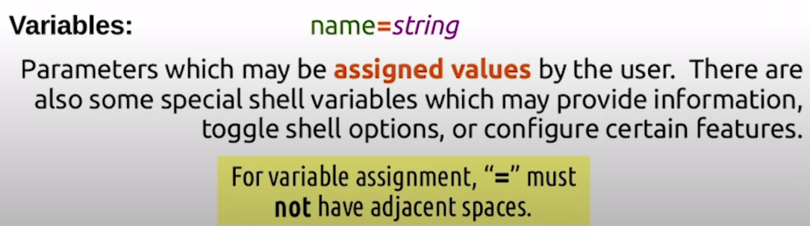

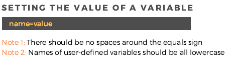

### Working with Parameters

#### Parameter expansion

Link to list of more parameter expansion tricks

Setting default value

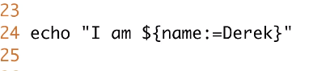

#### Brace Expansion

#### Variables and data types

All values are treated as strings by default.

Use the declare to specify certain data types (“I” for integer, “r” for
real/floating point numbers).

#### Sub-shell execution

Execute a command in a sub-shell, and exits the subshell without
returning any output.

#### Command substitution

##### Command substitution vs Sub-shell execution

^ Commands placed in parens are executed in a subshell. Adding a sigil
in front actions command substitution where the $() is replaced with the
output of the command that was ran.

##### Command substitution vs Variable substitution

$(joe) – means “Run the <u>command</u> ‘joe’ and place the output in
place of $(joe)

“${joe}” – means “Plug in the value of the joe <u>variable</u> in place
of ${joe}”

#### Arithmetic expansion

#### Process substitution

#### Tilde expansion

### Handling command line options/ARGS (getopts)

If you added the option **-A,** “variable” will print out “A” otherwise
a question mark.

### Importing other scripts (sourcing)

The source command adds functions found in the file argument to the
current shell. The source command is requently used for software
installs to ensure that the environment is set up properly prior to
execution of the install scripts.

**Import all files in a folder**

### Debugging

#### Debug flags/options

**Debugging**: after shebang line add "set - n" (or what have you) -
that will allow you to run your script without executing it, only
checking for any errors.

There are a number of options that can be used for debugging purposes:

- **set -n (bash -n)** just checks for syntax

- **set -x (bash -x)** echos all commands after running them

- **set -v (bash -v)** echos all commands before running them

- **set -u (bash -u)** causes the shell to treat using unset variables
  as an error

- **set -e (bash -e)** causes the script to exit immediately upon any
  non-zero exit status (on any failures).

where the **set** command is used inside the script (with a **+** sign
behavior is reversed) and the second form, giving an option to **bash**,
is invoked when running the script from the command line.

**-x**

You can also specify the above, not directly in your script but when
calling the script with the bash command...

bash -x myscript.sj

This isn't as portable though.

#### Common errors

#### Shellcheck

[www.shellcheck.net](http://www.shellcheck.net)

### Session portability

### Temporary files (mktemp)

A utility to create temp files based on a template you provide.

**Format**: mktemp \<dir\>/\<filenamebased\>XXX

### Exec command: force redirect of script output

Replaces the bash with the command to be executed

## How bash processes command lines

### Step 1: Tokenisation

### Step 2: Command Identification

### Step 3: Expansions

For more information, see: GNU Bash Manual - Word Splitting

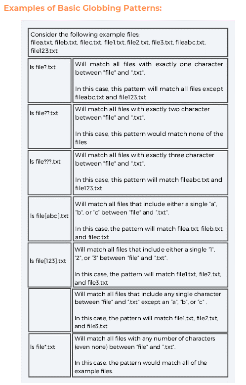

For more information, see: GNU Bash Manual - Pattern Matching

### Step 4: Quote Removal

### Step 5: Redirection

For more information, see: GNU Bash Manual – Redirections

## Handling User Input

### GUI Forms with Zenity

<https://www.howtoforge.com/how-to-display-gui-dialogs-in-bash-script-using-zenity/>

tut:
<https://ostechnix.com/zenity-create-gui-dialog-boxes-in-bash-scripts/>

### Read Command

Input saved int REPLY by default:

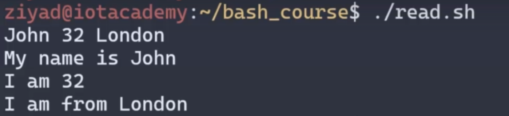

**Custom variables**

read -p "Enter some names..." NAMES

Where NAMES is the variable that holds the input.

**Adding Prompt:**

**Adding Timeout (-t \< seconds \>):**

Determines how long to wait before moving into next command.

**Hiding entered input:**

**Specify expected input length:**

### Multiple Lines of STDIN

#### From a file

Setting the delimeter to an empty string is a great way to read until
the end of a file.

Syntax:

Full example:

*Note: “-t 0” is a way of checking if STDIN is empty*

#### User input (using read -r)

*Doesn’t really work when pasting large chucks of text…*

#### User input (checking for carriage return)

*Doesn’t really work when pasting large chucks of text…*

Note: $’n’ means carriage return.

### Select Command

Give user list of options to select from

*Formatted:*

**Adding prompt string:**

**Print options vertically:**

Add COLUMNS=1 before the select statement

## Formatting Output 

### Creating headers

\- get terminal columns/rows

tput lines

tput cols

\- printf "%100s" " " | tr " " "-"

\- replace 100 with value from tput cols

\- printf "%${COLUMNS}s" " "

For all in one command…

printf "%$(tput cols)s" " " | tr " " "="

### Here statement

Using variables

### Echo without newlines

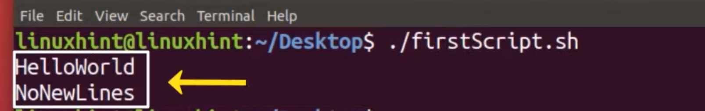

## Data types

### Arrays

#### Common operations

#### Create an array (space-separated)

You can also specify specific indexes upon array creation

Myarray=(\[2\]=“Jim” \[5\]=”Dwight” \[9\]=Andy)

^ Also note that Microsoft word using different ascii value for quotes –
so they’re interpreted literally.

#### Referencing/Output array value

#### Parameter expansion

#### WORKING WITH INDEXED ARRAYS

#### EXPANDING AN ARRAY

#### MODIFYING AN ARRAY

#### THE READARRAY COMMAND

#### CREATING AN ARRAY FROM THE OUTPUT OF A COMMAND

#### Add into array

Oor…

foo=(a b c)

echo ${foo\[@\]}

foo+=(d e f)

echo ${foo\[@\]}

#### Build array from user input (readarray)

Always use the ‘-t’ switch to remove trailing newline/whitespace
characters:

You can also use **read -r**

**Using process substitution**

This allows us to accept results of a command and add then into an
array:

Looping through:

#### Removing/replacing array items

Unset to remove element from array (or array itself)

Remove an item and add a different one in place

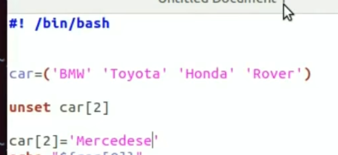

#### Re-create array

#### Nested/Multidimensional arrays

Check out bash man page. declare -n means “This variable is special – it
should serve as a pointer (name reference) to another variable. This
other variable may be an array for example. If it is an array, treat
this variable ( my pointer) as you would the array itself”.

Note how this fails

Yet how this succeeds

#### Loop over array

##### By referencing full array (for..in loop)

Spreads array to list every item (space-separated)

##### By printing array indexes

Use the BANG to print indexes

##### By iterating through each item

##### By referencing array length

### Dictionaries (Associative arrays)

Regular arrays cannot be treated as associative arrays. Associative
arrays must be declared as such upon creation. Almost as if it’s its own
data type. Normal arrays are implicitly or explicitly declared using
declare -a. But associative arrays use a capital “A”.

declare -A mynewarray

Indexes will be strings.

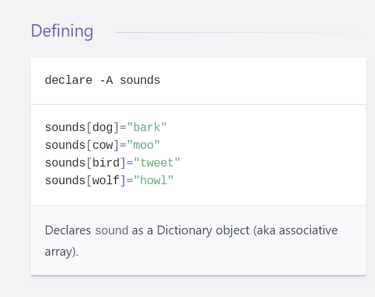

### Strings

#### String Operators/conditions

#### Transform strings

**Replace multiple whitespaces with a single whitespace**

tr -s \[:space:\]

^ so powerful when redirectin using cut command to work on a single
space.

#### Getting length of string

#### Setting case

Capitalize and Uppercase (respectively)

Lowercase – same as caps but using comma instead of caret.

#### String length, slicing (substrings), and substitution 

**Substitution**

\#!/bin/bash

Str="Learn Bash Commands from UbuntuPit"

subStr=${Str:0:20}

echo $subStr

This script should print out “*Learn Bash Commands*” as its output. The
parameter expansion takes the form **${VAR_NAME:S:L**}. Here, S denotes
starting position, and L indicates the length.

#### Find substring

#### String concatenation

\#!/bin/bash

string1="Ubuntu"

string2="Pit"

string=$string1$string2

echo "$string is a great resource for Linux beginners."

The following program outputs the string “UbuntuPit is a great resource
for Linux beginners.” to the screen.

### Number and arithmetic

***Double parens (modern)***

**Note**: Arithmetic can be evaluated within **(()).** This will return
the result to a boolean value.

You can also use all symbolic logical operators with this syntax. If you
want to return the **result** of a mathematical expression you can use
**$(())** to save returned value into the **$(())** var.

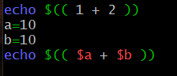

If you remove the sigil and keep double parens you can set a variable
and calculate arithmetic in the same line.

Example:

((mynumber=4+6+$x))

***Can also use ‘expr’ syntax (legacy)***

*Expression*

#### Integer test

#### Bc (basic calculator)

Here statements (as opposed to here docs, which are multi-line) are
perfect for the bc calculator.

bc\<\<\<"$x+$y+10"

Bc to calculate floating-point calculations

bc\<\<\<"scale=2;$x+$y"

#### Random variable

Outputs a random number between 0 - 32767

Get zero through 9 (use modulo bro)

#### Arithmetic Operators

##### Operator precedence

#### Seq command (sequence)

Give a range of number given a soart value, end value, incrementor

seq \<start\> \<inc \> \< end \>

Works similar to brace expansion except the order is different:

echo \<start\> \<end\> \<inc\>

Also, seq separates each returned value with a newline char whereas
braces only separates by a single space (ideal for command line
arguments).

## Conditional Statements/operations

### Numerical Relational operators

^ as seen on last line if you want to use the greater than or less than
symbols on numbers, the numbers need to placed within double-quotes and
the comparison needs to occur inside parens

### String comparison against many matches

This checks if $cool is equal to any one of these options

### Boolean/Logical operators

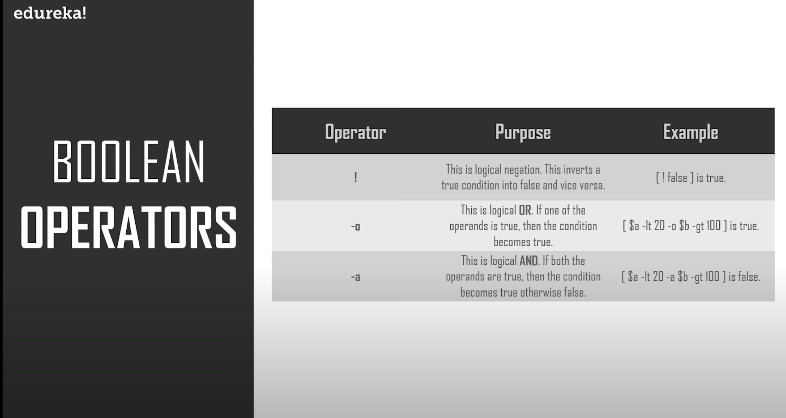

#### Short-circuiting with logical operators

Also can use: && ||

Logical operators allow you to do short-circuiting to replace if
statements. Square brackets reokace oarensin

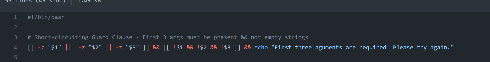

Use curly braces grouping commands when short-circuiting

Example of a one-line if-else statement:s

which cmatrixfail &\> /dev/null && { echo "Condition met!" && echo
"Doing condition met stuff!" ; } || { echo "Condition not met..." &&
echo "Doing failure stuff..." ; }

#### Ternary operator

**Legacy**

>  alt="A picture containing text Description automatically generated" />

**New syntax**

**New and improved (for multi-conditions)**

*Curly braces can be used to group multiple statements together*

{ \[\[ "${already_running,,}" =~ perl \]\] && echo "Hive API Running" ;
}

**||**

{ echo "Not running. Starting Up...." && $(which perl)
/home/control-io/www/HiveAPI/index.pl 2\> /dev/null & }

**Note**: Every curly brace group must end with a semi-colon UNLESS that
group ends with a statement that starts a background job.

### Testing commands

### If statement

Double square brackets is the more modern and preferred syntax \[\[\]\]
– as it supports pattern matching ( “$g” =~ ^matchthis\[.\]$ )and shell
wildcards ( “$g” == foo.\* ). Also, allows for the use of locaical
comparison;s

\#!/bin/bash

echo -n "Enter a number: "

read num

if \[\[ $num -gt 10 \]\]

then

echo "Number is greater than 10."

elif \[\[ $num -eq 10 \]\]

then

echo "Number is equal to 10."

else

echo "Number is less than 10."

fi

The else part needs to be placed after the action part of if and before
fi.

**Double square brackets vs Single square brackets**

The form with double brackets is preferred over the form with single
brackets, which is now considered deprecated. Double brackets allows you
to omit surrounding the variable in double quots.

If \[\[ $response -eq yes \]\]

Then

…

fi

Single brackets requires double quotes to prevent an error if no input
is entered

Also single square brackets doesn’t allow for logical operators like
“&&” or “||” but instead requires “-a” and “-o”.

Additionally, the new method using double square brackets allows for
multiple conditions in one set of square brackets.

If \[\[ $answer == y || $answer == yes \]\]

Also, double brackets accept regular expressions

If \[\[ $answer =~ y|yes \]\]

Alt syntax (preferred)

You don't need square brackets in an of statement if you're testing a
command

If which apache2

...

Fi

#### More review and examples

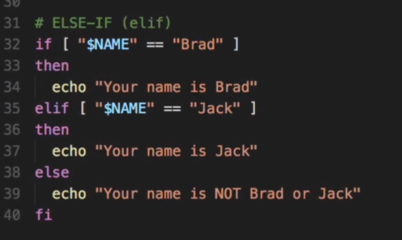

^ note how you only need to end the if condition with a semicolon if
you’re the ‘then’ keyword on the same line… don’t so that ☺. Also not
that conditions need one space and beginning and ending inside squarew
brackets.

Remember to put spaces around the \[ \] brackets.

### Case statements

\#!/bin/sh

echo "Do you want to destroy your entire file system?"

read response

case "$response" in

   "yes")              echo "I hope you know what you are doing!" ;;

   "no" )              echo "You have some comon sense!" ;;

   "y" | "Y" | "YES" ) echo "I hope you know what you are doing!" ;

                       echo ’I am going to type: " rm -rf /"’;;

   "n" | "N" | "NO" )  echo "You have some comon sense!" ;;

   \*   )               echo "You have to give an answer!" ;;

esac

exit 0

## Functions

Two ways to declare a function

**Formal:**

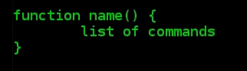

**Informal (parens can be omitted too):**

Calling a function does not require parens – args are passed as in
command line (see below)

### With args

### Returning values

Note values are returned into the **$?** Variable

Alternatively we can save returned values directly into a variable:

### Calling functions from functions

No scope?

## Loops

- Continue – to skip

- break – break loop

### For (C-like)

The for loop is another widely used bash shell construct that allows
users to iterate over codes efficiently. A simple example is
demonstrated below.

\#!/bin/bash

for (( counter=1; counter\<=10; counter++ ))

do

echo -n "$counter "

done

printf "\n"

Save this code in a file named for.sh and run it using ./for.sh. Don’t
forget to make it executable. This program should print out the numbers
1 to 10.

Just as with ‘then’ with an if statement, we can omit the semicolon if
we give ‘do’ its own line

### For…in

<https://www.lifewire.com/bash-for-loop-examples-2200575>

**Ranging over…**

**You can even use expansion to loop through files**

for i in filename-\*.txt

### For…range

### Infinity for loop

for((;;))

Do

Done

Note that it still responds to a break statement

### While

The while loop construct is used for running some instruction multiple
times. Check out the following script called while.sh for a better
understanding of this concept.

\#!/bin/bash

i=0

while \[ $i -le 2 \]

do

echo Number: $i

((i++))

done

So, the while loop takes the below form.

while \[ condition \]

do

commands 1

commands n

done

The space surrounding the square brackets is mandatory.

A space is required inside square brackets

^ creates 100 files each with ‘another one’ written inside

Alternative

**Nested while**

#### Infinite while loop

### Until

Executes (while some conditions is false) - ***until*** some condition
is true

### Read-while 

#### Read lines in a command

## Handling command output

### Reading command output (as a file using process substitution):

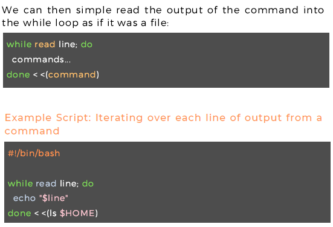

## File I/O

### File operators/conditions

Check if files does not exists:

**Checking if a file is empty**

Works with single quotes for me…

You could also use ‘s’ to see if the file has size (see if there’s any
data written to the fle in question) (i.e. if it’s **not** an an empty
file)

### Reading from file

#### Using while loop

\#!/bin/bash

file='editors.txt'

while read line; do

echo $line

done \< $file

Assuming the first arg is a file name

#### Using while loop (and piping)

#### Using for loop

Good for one column but not ideal for loop through lines of text as for
loop uses spaces as its default delimeter. Can manually change/reset IFS
though

IFS=$'\n' \# make newlines the only separator

for j in $(cat ./file_wget_med)

do

echo "$j"

done

\# Note: IFS needs to be reset to default!

unset IFS

### Saving file content into a variable

### **Deleting Files**

The following program will demonstrate how to delete a file within Linux
shell scripts. The program will first ask the user to provide the
filename as input and will delete it if it exists. The Linux rm command
does the deletion here.

\#!/bin/bash

echo -n "Enter filename -\>"

read name

rm -i $name

Let’s type in editors.txt as the filename and press y when asked for
confirmation. It should delete the file.

### **Appending to Files**

The below shell script example will show you how to append data to a
file on your filesystem using bash scripts. It adds an additional line
to the earlier editors.txt file.

\#!/bin/bash

echo "Before appending the file"

cat editors.txt

echo "6. NotePad++" \>\> editors.txt

echo "After appending the file"

cat editors.txt

You should notice by now that we’re using everyday terminal commands
directly from Linux bash scripts.

###  **Print Number of Files or Directories**

The below Linux bash script finds the number of files or folders present
inside a given directory. It utilizes the Linux find command to do this.
First, you need to pass the directory name to search for files from the
command line.

\#!/bin/bash

if \[ -d "$@" \]; then

echo "Files found: $(find "$@" -type f | wc -l)"

echo "Folders found: $(find "$@" -type d | wc -l)"

else

echo "\[ERROR\] Please retry with another folder."

exit 1

fi

The program will ask the user to try again if the specified directory
isn’t available or have permission issues.

### **Removing Duplicate Lines from Files**

File processing takes considerable time and hampers the productivity of
admins in many ways. For example, searching for duplicates in your files
can become a daunting task. Luckily, you can do this with a short shell
script.

\#! /bin/sh

echo -n "Enter Filename-\> "

read filename

if \[ -f "$filename" \]; then

sort $filename | uniq | tee sorted.txt

else

echo "No $filename in $pwd...try again"

fi

exit 0

The above script goes line by line through your file and removes any
duplicative line. It then places the new content into a new file and
keeps the original file intact.

## Pattern Matching

### Standard

#### Matching

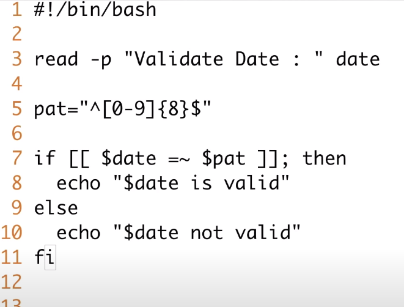

Checks for any matches in a list of options (like a “OR” statement)

#### Substitution

##### Substitution flags

#### Extended RegEx

<https://www.tutorialspoint.com/unix/unix-regular-expressions.htm>

## Other useful/common tasks

### **Running scripts remotely via SSH**

### **Send Mails from Shell Scripts**

It is quite straightforward to send emails from bash scripts. The
following simple example will demonstrate one way of doing this from
bash applications.

\#!/bin/bash

recipient=”admin@example.com”

subject=”Greetings”

message=”Welcome to UbuntuPit”

\`mail -s $subject $recipient \<\<\< $message\`

It will send an email to the recipient containing the given subject and
message.

### **Parsing Date and Time**

The next bash script example will show you how to handle dates and times
using scripts. Again, the Linux date command is used for getting the
necessary information, and our program does the parsing.

\#!/bin/bash

year=\`date +%Y\`

month=\`date +%m\`

day=\`date +%d\`

hour=\`date +%H\`

minute=\`date +%M\`

second=\`date +%S\`

echo \`date\`

echo "Current Date is: $day-$month-$year"

echo "Current Time is: $hour:$minute:$second"

Run this program to see how it works. Also, try running the date command
from your terminal.

**Print current epoch**

date +%s

**Print date from epoch**

date -d @\<epoch\>

### **The Sleep Command**

The sleep command allows your shell script to pause between
instructions. It is useful in a number of scenarios, such as performing
system-level jobs. The next example shows the sleep command in action
from within a shell script.

\#!/bin/bash

echo "How long to wait?"

read time

sleep $time

echo "Waited for $time seconds!"

This program pauses the last instruction’s execution
until **$time** seconds, which the user in this case provides.

### **The Wait Command**

The wait command is used for pausing system processes from Linux bash
scripts. Check out the following example for a detailed understanding of
how this works in bash.

\#!/bin/bash

echo "Testing wait command"

sleep 5 &

pid=$!

kill $pid

wait $pid

echo $pid was terminated.

Run this program yourself to check out how it works.

### **Displaying the Last Updated File**

Sometimes you might need to find the last updated file for certain
operations. The following simple program shows us how to do this in bash
using the awk command. It will list either the last updated or created
file in your current working directory.

\#!/bin/bash

ls -lrt | grep ^- | awk 'END{print $NF}'

For the sake of simplicity, we’ll avoid describing how awk functions in
this example. Instead, you can simply copy this code to get the task
done.

### **Adding Batch Extensions**

The below example will apply a custom extension to all of the files
inside a directory. Create a new directory and put some files in there
for demonstration purposes. My folder has a total of five files, each
named test followed by (0-4). I’ve programmed this script to add
(**.UP)** at the end of the files. You can add any extension you want.

\#!/bin/bash

dir=$1

for file in \`ls $1/\*\`

do

mv $file $file.UP

done

Firstly, do not try this script from any regular directory; instead, run
this from a test directory. Plus, you need to provide the directory name
of your files as a command-line argument. Use period(.) for the current
working directory.

### **Cleaning Log Files**

The next simple example demonstrates a handy way we can use shell
scripts in real life. This program will simply delete all log files
present inside your /var/log directory. You can change the variable that
holds this directory for cleaning up other logs.

\#!/bin/bash

LOG_DIR=/var/log

cd $LOG_DIR

cat /dev/null \> messages

cat /dev/null \> wtmp

echo "Logs cleaned up."

Remember to run this Linux shell script as root.

### **Backup Script Using Bash**

Shell scripts provide a robust way to back up your files and
directories. The following example will backup each file or directory
that have been modified within the last 24 hour. This program utilizes
the find command to do this.

\#!/bin/bash

BACKUPFILE=backup-$(date +%m-%d-%Y)

archive=${1:-$BACKUPFILE}

find . -mtime -1 -type f -print0 | xargs -0 tar rvf "$archive.tar"

echo "Directory $PWD backed up in archive file \\$archive.tar.gz\\."

exit 0

It will print the names of the files and directories after the backup
process is successful.

### **Check Whether You’re Root**

The below example demonstrates a quick way to determine whether a user
is a root or not from Linux bash scripts.

\#!/bin/bash

ROOT_UID=0

if \[ "$UID" -eq "$ROOT_UID" \]

then

echo "You are root."

else

echo "You are not root"

fi

exit 0

The output of this script depends on the user running it. It will match
the root user based on the **$UID**.

### **System Maintenance**

I often use a little Linux shell script to upgrade my system instead of
doing it manually. The below simple shell script will show you how to do
this.

\#!/bin/bash

echo -e "\n$(date "+%d-%m-%Y --- %T") --- Starting work\n"

apt-get update

apt-get -y upgrade

apt-get -y autoremove

apt-get autoclean

echo -e "\n$(date "+%T") \t Script Terminated"

The script also takes care of old packages that are no longer needed.
You need to run this script using sudo else it will not work properly.

## Sample scripts

### Git – delete branches

### Write to new files

^writes to 100 new files each with text with ‘test-n’ where n is current
iteration index.

**Via prompt**

read –p = ‘read from prompt’

When running this script, a prompt will occur asking for a list of
names. For each name entered (separated by a space) that names will be
written into a file with the name ‘Custom-\<name\>-file.txt

\#!/bin/sh

\#shell scripting

read -p "Enter some names..." NAMES

for NAME in $NAMES

do

echo $NAME \>\> Custom-$NAME-file.txt

done

### Rename 100 files

### create 100 text files

With for loop

With while loop

^ create 100 text files

### Display info about current session

### Backup and move

### Replace a word with another

This script will find every time the word ‘dog’ appears (lowercase) in a
file and will replace it with the word ‘cat’

***As in Perl – s for substitution***

*Replace lowercase ‘I’ with capital and insert into new file*

