# Disk Usage and Space

- <https://linuxhandbook.com/find-biggest-files-linux/>

- <https://kerneltalks.com/troubleshooting/space-is-not-released-after-deleting-files-in-linux/>

- <https://kerneltalks.com/commands/beginners-guide-to-kill-process-in-linux/>

## Disk Drives (df)

- **Disk space free on system** – root (all human readable – entire sys)

  - df –ah /

**View all storage devices (sds)**

**View disks human-readable by filesystem type**

## Files and Dirs (du)

- View total usage of current dir

  - sudo du –shL

  - (s = summarize, h=human-readable, L= dereference symbolic links)

- **<u>Large files in dir</u>**

  - sudo du -ch --max-depth=2 | sort -rh

  - max-depth = how level of folders do tyou want to consinder

  - ‘c’ gets grand total

- TOP 10 largest in current dir (with grand total/summary ‘s’)

  - sudo du -hsx \* | sort -rh | head

- **TOP 10 largest in current dir 2 levels deep (d=maxdepth)**

  - du -chd2 2\>/dev/null | sort -rhk1 -k2 | head | sed ‘2d’

- **\[BEST FILES\] TOP 10 largest FILES from root 0 levels deep
  (d=maxdepth)**

  - sudo du /\* -hd0 2\>/dev/null | sort -rhk1 | head

  - To get size of folder remove the /\*

    - sudo du -hd0 ./loguploads/

- **\[BEST DIR\] TOP 10 largest DIRs within a folder (/var/log)**

  - for i in $(find /var/log/ -type d 2\>/dev/null); do sudo du -sh
    ${i}; done | sort -rhk 1 | head

## Dirs in use by process (fuser)

Fuser is used to see which processes referencing a given directory

## Open files used by processes (lsof)

**Files in use by port**

lsof -iTCP:443

ls -i

The "lsof" command lists open files. On a Linux system, everything is a
file, including network connections. The "-i" option to "lsof" lists all
network ports and the corresponding processes that are using those
ports. 

**File in use by process name**

sudo lsof -p $(pidof \<process_name\>)

### Dealing with deleted files being referenced

*Some process can still refer to deleted files/dirs so the disk space
won't be cleared yet. Gotta use lsof | grep -i deleted to list process
still using deleted stuff.*

List open files (lsof) that are referencing deleted files (-I deleted)

- lsof | grep -i deleted

Find the PIDs of the files deleted and kill those (PID is). Note, PIDs
are second column in lsof

Which means you can get all PIDs on one command…

lsof | grep -i deleted | tr -s \[:space:\] | cut -d ' ' -f 2

We can even kill those processes in one gp…

lsof | grep -i deleted | tr -s \[:space:\] | cut -d ' ' -f 2 | xargs
kill

If that doesn’t work you can try to forcekill and lastly remove those
files.

**Alternative,**

cp /dev/null /file/to/delete

**df -h**

Let's say you have a USB drive connected to your machine, you're working
with some of the files on the machine, then when you go to eject the USB
drive, you get an error saying, device or resource busy. You've already
checked that none of the files on the USB driver is in use or opened
anywhere, or so you think. Using the lsof command, you don't have to
wonder. It lists open files and what processes are using them.

This command is great for tracking down those pesky processes that are
holding open files. One last thing to call out about hardware
utilization is that you can monitor it separately from processes. If you
just wanted to see how your CPU or memory is doing, you could use
various commands to check their output. This isn't immediately useful to
see on a single machine, but maybe in the future, if you manage a fleet
of machines, you might want to think about monitoring the hardware
utilization for all of your machines at once.

## I/O Schedulers (cfq, Deadline, NoOp)

To be honest, Linux I/O schedulers are not something you think about
very often unless you happen to be in a situation where input and output
on the server is very important. Like if you want to be able to read
really fast, or let's say that you need to schedule the priority of a
write over top of a read.

Now the cool thing is Linux I/O scheduling actually happens right in the
kernel and there's a couple different options for what type of scheduler
is used. And they do different things. Now, the default is going to be
varied from distribution to distribution.

**CFQ**

For example Ubuntu uses CFQ by default. And CFQ stands for completely
fair queue, which means that every I/O process, every write process,
every read process gets a fair turn. It just basically splits up all the
time and distributes it as evenly as possible.

This is really good for a general system that is going to be reading and
writing all the time. But it does not prioritize reading over writing,
or writing over reading. And generally, this, like I said, is good for a
desktop environment.

**Deadline**

Now another one that is pretty common is called deadline.

Now how deadline works is rather than all of the read and write queues
having access and all the time, what it does is every single read and
write operation or op has a time that it has before it expires. So
processes that are read times, by default, now this is tweakable, but by
default, read times have a lower expiration time than write times.

And what that means is that reading operations end up having a higher
priority because basically the kernel says, OK read operations have to
be written within 500 milliseconds, or they have to be allowed to read
the disk within 500 milliseconds. Whereas, like a write operation where
it's actually writing data to the disk, well that can wait like 5,000
milliseconds.

So it can wait up to 5 seconds before it absolutely has to have priority
to write. And so what deadline does is it gives read access more of a
priority than write access. And this is really good if you're in a
situation with like, oh, let's say for example, a web server that is
going to be constantly reading.

I'm kind of making a mess here. But it's going to be constantly reading
off of the disk, and so you're going to want it to have higher priority
for reads than for writes, because it's going to just occasionally write
things, and it's going to be reading constantly.

So that's what deadline does.

**NoOp**

And there is one more, and it's a funny word. It looks like it's Noop,
but it's actually no op, no operations at all. And what this kernel I/O
scheduler does is not a darn thing, OK. It doesn't do anything at all.
And why would you want that?

Don't we want the kernel to schedule things? Generally, yes. But here's
the Deal-- In a large virtualized environment, or like in a Cloud
environment, generally the underlying system, like a storage area
network or something, is going to prioritize reading and writing
operations at that level.

So you're just going to want your computer to try to read and write at
any given moment and the underlying system is going to prioritize what
does and doesn't have access. And so if you have a system that's like
out in Amazon Web Services or it's in the Google Cloud, or you know
wherever, you're going to probably want to turn on Noop for your Linux
scheduler because the underlying system is going to do a better job.

Even if you try to schedule something, like with deadline, it's not
really going to matter if the underlying system is only going to give
you certain priorities at any given moment. So it's kind of like giving
the controls to the underlying system if you use Noop.

**Making a change**

Now it is pretty easy to make a change or to see what's going on and
then to make a change to the Linux schedule. And it's in one of the file
systems that's created on boot. So if we were to look at sys block SDA
queue scheduler, what it's going to do is it's going to show us the
three options, and it puts the currently selected one in brackets.

So this is a CentOS machine by default. It's using the Linux deadline
scheduler for Linux I/O operations. Now we can change this by just
echoing. So echo, noop or no op into sys block sda queue scheduler. And
then if we look back up, it's going to have changed it to the noop
scheduler, and that happens in real time.

We can, boom, just do it automatically. So that right now it's not
prioritizing anything. It's just trying to read and write whenever the
request comes in. Now these changes will not stick between boots, so
generally if we want this to have a different default, notice the
default up here is deadline.

Let's say we wanted to use this as a desktop machine and we wanted to
completely fair queue or completely fair scheduler, what we would do is
change it inside the grub config. So we've messed with GRUB before, but
let's do a quick v.I. Et cetera, default GRUB.

And where we need to put something is right in the GRUB command line
Linux. So right here. Go all the way to the end, and make sure it's not
already here and it doesn't look like it is. I'm going to insert, it's
actually called elevator. Elevator equals, and then what we want to call
it.

So I'm going to say CF queue. We're going to want this to be a CF queue
scheduler. So we save this, GRUB 2, mkconfig.

And we want it to go. Now, this is sent to us so it's going to be in
boot. GRUB 2. GRUB dot config. And it should now when we reboot the
system have changed our schedule.

Let's see. Let's look at the scheduler, and sure enough, on boot. Now
it's automatically set it to CF queue, which is what we changed it in
our GRUB config, so that now it has that completely fair queue, which is
kind of a good idea for a desktop environment.

So while changing the Linux schedulers isn't something that you have to
do on a normal basis, it's important to understand that the I/O is
actually prioritized by the Linux kernel itself. And whether we're using
CF queue, deadline, or we're not doing anything at all and letting the
underlying like sand device do it, it's important to understand how we
make those changes and how we make them permanent.

## Testing disk I/O (iostat/ioping)

### Iostat (input/output statistics)

**iostat** provides some statistics concerning the input/output requests
for a storage device, it does not provide the latency in real-time.
Instead, iostat will report ont he percentage of time that the CPU was
idle while the system had outstanding disk input/output requests. 

**Install:**

Running periodic scans on a disk (every 3s in this example)

^ notice how reads and writes are at zero (as well as **tps** –
transactions per section). Now let’s see how it looks when we run rsync
in another terminal on this machine…

^ iowait is how many processes are in queue, waiting to run but are
being held up current I/O processes hogging up the cpu.

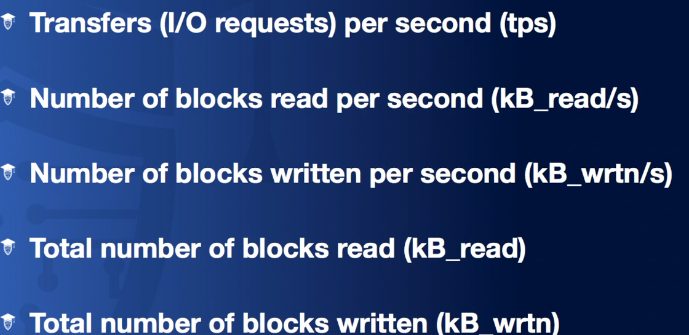

### Ioping (input/output ping latency)

 The ioping command is used to generate a report of a device's
input/output (I/O) latency in real-time. The ioping command is commonly
used to determine the speed of storage device, such as a hard disk
drive, in terms of input/output speed and access time latency. 

This allows you to see how it takes to wite to a disk:

## RAID

### RAID Levels

### RAID Configuration

The **mdadm** (multiple device administration) command is used to manage
RAID systems from within the Linux CLI. In a RAID array, data is stored
across multiple physical storage devices, and those devices are combined
into a single virtual storage device. The mdadm tool enables you to
create, manage, and monitor RAID arrays. 

#### Background

You can go to the store and buy a RAID card, like a hardware RAID
device, and then you can use that on your system and you'll be able to
have hardware RAID. But Linux has a really awesome and powerful software
RAID program that will use kernel-level tools to allow you to create
your own RAID devices without needing any specialty hardware at all.

Now there's a couple of things we need to discuss, like partitions
versus using RAW devices, and I want to make sure we cover all that
configuration stuff. But conceptually it's really easy. Rather than
having a hardware-based card, we just use our regular SATA controllers,
and then our hard drives can all work together in a RAID array that we
choose.

Now when I talk about partitions versus RAW devices, let's say we have
200-gigabyte hard drives, but they're from different manufacturers. Now
they both say that they're 100 gigabytes, however, if you look close,
they might have slightly different number of sectors and slightly
different size.

So this one says it's 100 gigabytes, but it might be actually 1028
megabytes, and this one says 100 gigabytes, but it might actually be
1022 megabytes. Now they round for marketing purposes, and that's
perfectly fine, and usually on a system it doesn't matter.

But if you have like this drive fail in a RAID array and you need to
replace it with another drive and you try to use this drive, and all of
a sudden, oh, you created a RAW disk device RAID array unit and it has
1028 megabytes of space and you try to replace it with another 100
gigabit drive but this only has 1022 megabytes, you're not going to be
able to work it, because this isn't big enough.

So generally what people do is you take and make a partition inside of
your drive that is slightly smaller than the hard drive itself. So it
might be 99.9 gigabytes. And then the same thing-- when you have a new
drive, you're going to have enough room to create a 99.9-gigabyte
partition, and so even though this drive itself is slightly different,
the underlying partition is going to be the exact same size, so you're
going to be able to use it to replace a failed drive in an array.

So that's why we generally use partitions, even though using a RAW
device would work until you need to replace it with a smaller drive that
is your replacement.

#### Configuration

Now here on our Ubuntu system, if we do lsblk, we're going to see, we
have four 10-gigabyte drives that are installed in here.

We're going to make a RAID array with those. This sda1, this is our root
partition, this is where our system is installed, but these drives down
here are the ones that we're going to use to create our RAID array. Now
I've already partition the first three. You'll notice it's a 10-gigabyte
drive and the partitions are 9.9 gigabytes. Awesome. We're going to do
the sde, the last one together. And so

**fdisk /dev/sde**

and the first thing-- well we can press **m** to see all of our
different options, but I'm going to go kind of quickly. I'm going to say
**o** to create a new partition type, and it's going to be a DOS one. It
doesn't have to be DOS, but I just decided DOS. And then I'm going to
say n for a new partition, and I want the partition to be primary.

So default… number 1… default. The start point on the drive…default. And
here's where rather-- if I choose default, it's going to be 10 gigabytes
in size, and that would be fine as long as our replacement was the exact
same kind.

But I want to do it slightly smaller than the drive itself, so here I'm
going to say plus 9.9G and press Enter, and now we have it 9.9 gigabytes
in size.

So any 10-gigabyte drive we'll be able to replace it with because we'll
just create a 9.9-gigabyte partition inside.

Now the one last thing. If we do t for type and press Enter, it's going
to say, OK, what partition type do you want? Here it says it created a
new partition with type of Linux, but if we type of capital **L**, we're
going to see all of the available codes here.

Now this is not a format. This is just like a flag to give the kernel a
hint as to what sort of partition this is supposed to be. So the one
that we want to put on here is actually **fd** for Linux auto RAID. So
I'm going to type **fd**, and now it says, change type of partition to
Linux auto raid-- or Linux raid autodetect.

I'm going to press **w** to write this change to the disk, and now if we
do lsblk, we're going to see we have all of them here. Now that
partition type is just to give the kernel a hint. If you put these
drives in a new system, it's going to say, oh, look at those partitions.

Those are part of a Linux array or of a RAID array, so we're going to
treat it as such. So it's just a hint, but it works even if you don't
change that partition type. All right, so now it's pretty easy to create
the actual RAID device. We're going to create a RAID 5 device with four
10-gigabyte devices-- well, about 10 gigabytes.

And so we should end up with about a 30-gigabyte usable space with our
RAID 5 array. Now the tool we use is mdadm. And then we're going to say
--create because we want to create a brand new one. I'm going to say
verbose just so we can see it do things as we type it in.

And now what device do I want to create? Well, the devices are /dev/md
and then the number of the RAID device you're creating. So we're going
to start with md0 because that's our first device, and we don't have any
RAID devices on here yet. And I do --level equals 5-- I want it to be a
RAID 5 device.

And then --raid devices equals 4, because we have four devices, and now
we need to list those devices out. And we're going to list the actual
partition, so /dev/sdb1, /dev/sdc1, /dev/sdd1, and /dev/sde1. And press
Enter-- boom. It created it that quickly.

Format: mdam –create –verbose /dev/md0 –level=5 –raid-devices=4
\<partition_1\> \<partition_2\> \<partition_3\> \<partition_1\>

Now we can see the details of it if we were to look at /proc/mdstat--
this is the virtual file system proc, and this is going to show us the
mdstat, which is the current RAID arrays in our system. So here we
have-- it's currently a RAID 5 array, it shows our devices here, lots of
information.

It says recovery, that's because it's building the array, but we can use
it while it's currently using the array, which is really awesome, OK? So
we look into /dev, grep for md. We're going to see there we have md0, so
we have a device all created, and we can now use this as a hard drive in
our system.

Before we do that, though, I want to save this configuration of this
RAID 5 array into our system so that on boot, it knows exactly what sort
of array to build. To do that, we just mdadm --detail --scan. And if we
do that, it's going to show us the configuration.

So that's the configuration for our current array. What we want to do is
save that, so I'm going to redirect it into /etc/mdadm/mdadm.com. So
we're going to save that result into this file. And now, every time we
boot the system, md0 is going to be created.

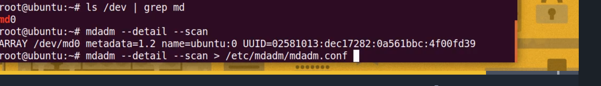

And then we just treat it like any other hard drive on our system. So
mkfs, ext4, /dev/md0, and boom-- it created it, and now it's part of our
system and it's going to be about 30 gigs in size, let's see-- lsblk,
OK, and we look down here, md0 shows up as 29.6 gigabytes-- about 30
gigabytes of RAID 5 storage on our system.

If you're thinking that was a little bit too easy, well you're right.
Linux RAID is awesome. It's super simple to set up, it allows you to use
the regular drives in your system and set them up as a RAID device. So
as long as you can save that file into mdadm.com, that detail scan that
we did, and you can check for the progress or the status of your current
RAID array in mdstat, you are really set.

That's all it takes to use RAID on a system using nothing but software
provided with a Linux kernel. I hope this has been informative for you,
and I'd like to thank you for viewing.

## LVM (Logical Volume manager)

### Overview and introduction

**Physical volumes, Volume groups, and Logical Volumes**

1.  Create one or more physical volumes (from disks)

2.  Create a volume group from those one or more physical volumes.

3.  Create one or more logical volumes from the volume group.

LVM, or Logical Volume Manager is basically like a software version of a
storage area network. It allows you to take a whole bunch of physical
devices and lump them into one big group that allows you to kind of
carve out slices of storage for the use in your local system.

It consists of a bunch of parts-- physical volumes, volume groups, and
logical volumes. They use the word volumes a lot in there. But
nonetheless, it's a way of taking raw storage and combining it into a
thing that you can just slice up, and expand, and contract, and add more
things to it without disrupting the existing services.

Here's how it actually works, or looks in practice. So we start with
physical volumes. I mean, I'm just calling them PV. And we're going to
say that we have four 10 gigabyte drives. Now in the standard practice,
these could be actual hard drives, they could be RAID devices, or they
could be partitions on a hard drive.

It doesn't really matter what they are, they're just chunks of storage.
And you create physical volumes out of them. And then you combine those
physical volumes into volume groups. And so then all of these are
combined into a volume group. And if you add 10 times 4, you get 40
gigs.

So then you have this volume group, which is just a big bucket of
storage. And that bucket of storage has no protection. Now, I know
that's not like a feature, right? But I really want you to know that if
you just have 10 gigabyte drives all in a bucket-- so you have 40
gigabytes of storage-- and you're just going to take and carve out
chunks of that, that doesn't offer you any protection.

So if one of these drives fails, all of a sudden you could have your end
result be completely corrupt and useless. So **physical volumes** being
raw devices and not having any redundancy is a little bit scary. So
anyway, I just wanted to throw that in there.

So once you've had this **volume group**, you carve out a slice of it.
And it can be a small slice, like here I just said this is about 7 gigs.
I just kind of like spatially guessed how much of 40 gigs that would be.
But you can carve out a big chunk. So you can have a 30 gig slice, or
you can have a 32 gig slice that would use like 2 plus a little of
another drive.

Basically, you don't know underneath what's going on. The volume group
is just a big chunk of storage that you carve out a slice of. And then
this slice is called a **logical volume**. That logical volume is what
you format with the file system and mount on your local hard drive, or
on your local file system, and what you install Linux on.

So it's a long step process, but it allows for a lot of flexibility. And
so I want to show you what it looks like in practice, even though it's
not this robust system with multiple physical volumes. If you have
CentOS installed, they actually use LVM even if you only have OneDrive.

So I'm going to show you here if we look at the etc/fstab file, what we
have here is our device is called dev/mapper/centos-root. OK, now this
is like dev mapper. What is that? Well, this is where Logical Volume
Manager creates those logical volumes for us to use.

And you'll see here, this dev/mapper/centos-root is mounted on the route
of the hard drive, or route of the file system. It has xfs as a file
system and it's installed. Same thing down here, they have another
carved out slice called centos-swap. And that's mounted as swap space on
the system.

So if we look inside dev/mapper, we're going to see we have centos-root
and centos-swap. Now, I want to show you really quickly a handful of
commands so you can see what's going on.

Another way to view available LVM disks is to use **lvmdiskscan**:

If we look at **pvdisplay**, this is physical volume display. It's going
to show us what's going on behind the scenes, like, what makes up the
bucket of data that we're going to use.

We only have one physical volume. I know, it seems weird, right? Why am
I making a bucket out of one device? Well, you can expand it if you
want. So they're giving you room to expand later if you want to do it
after it's already installed. So we have one physical volume, and it's a
partition.

It's dev/sda2. It's in a volume group named centos. And that gives us,
it looks like about 19 gigabytes of storage. OK, so this physical volume
is inside a volume group called centos. So our bucket with all the data
is called centos. And it looks like we carved out root and swap from
that bucket.

So let's look at that really quick. Well, you're just going to look at
**lvdisplay**-- Logical Volume Display. And we should see two.

And sure enough, we have two logical volumes. I'm going to scroll up a
little bit here. Our first one is named swap. It's in the centos volume
group, because that's the only volume group we have.

It happens to be two gigabytes in size and it lives in dev/centos/swap.
This is an interesting thing, you can use dev mapper and the name of it,
or you could use dev, the name of the volume group, the name of the
logical volume in folders here. So that's another way that you can
reference it and find the actual logical volumes.

And then the same thing down here, dev/centos/root. The logical volume
name is root. It's carved out of the CentOS volume group. And this one
looks like it's about 17 gigabytes. So if we look inside dev/centos,
we're going to see sure enough, there we have root and swap as our two
different logical volumes that we could, one, is formatted, right?

This is formatted with XFS. And this is just swap space. I know we
didn't go through the process of actually creating all of the different
parts, but hopefully you understand exactly what LVM is doing taking
physical volumes, whether the partitions, or hard drives, or RAID
devices, combining them into a volume group, and then carving out
logical volumes that you can use as regular devices on your system.

And it just allows for flexibility kind of like a software-based SAN in
your own computer. I hope this has been informative for you, and I'd
like to thank you for viewing.

**Commands**

### pvcreate and pvdisplay (create and view physical volume)

**<u>Important Note</u>**: It’s always considered best practice to
partition a disk before creating a physical volume though this doesn’t
need to be done. One benefit is that the disk will load on boot. Another
is the fact that if you do partition your disk, you can skip the
**pvcreate** command and head straight to creating your volume group
with **vgcreate** command and the pvcreate command will automatically be
actioned on your partition behind the scenes. Though this assumes that
you would be creating a volume group. If you are extending a volume
group, it’s still best practive to partition your drive and use
**pvcreate** as it will also allow for a more readable display when
listing your LVM contents.

Using blkid to gat an email

**pvscan** can be run perodically to detect any changes not being listed
with pvdisplay, vgdisplay, or lvdisplay.

Building an LVM is actually one of the most straightforward things that
you can do when it comes to block storage devices on Linux. It's
surprisingly consistent all the way through the process for the names of
the tools. And it really is kind of fun. And once it's built, you can
expand it by adding more drives to the system, or stretching your
existing volumes. But let's go ahead and actually create from start to
finish an LVM system on our Linux device. Now, here I am on Ubuntu. And
if we lsblk, we're going to see that, well, we have a bunch of stuff.

But down here, this is the drive that our system is installed on. So
we're not going to touch this one. We're going to use these four
devices-- so sdb, sdc, sdd, and sde, which are 10 gigabyte devices.
Notice, I don't have partitions created on these.

Now, you can create partitions. Some people prefer to use partitions for
their physical volumes in an LVM. Some people prefer to use the raw
devices. Either one works fine. They work the same. The advantage of
setting up a partition is that if somebody else comes to your system,
they're going to see that there's partitions on the system and they're
going to know that something is already done there.

Whereas if you leave them raw devices, they might think, oh, look, empty
drives. Now, it's kind of far fetched. You're not just going to start
formatting drives in somebody's system. But that's the reason some
people like to use partitions. I'm just going to use the raw devices.

And to turn these raw devices into physical volumes, we use
**pvcreate**, and we just make a list of the devices we want to use. So
**/dev/sdb, /dev/sdc, /dev/sdd**, and **/dev/sde**. So it created them.

Now we can do **pvdisplay** if we want, and it's going to show all the
devices that we have.

Now, each of them is 10 gigabytes. And the name of it is just the device
itself, dev/sdc.

^ Notice the last value (PV UUID) this uniquely identified the PV.

Note: You can also use **pvs** the command to view your physical volumes
though it’s not as detailed as **pvdisplay**.

### vgcreate and vgdisplay (create and view a volume group)

So the next step is to create a volume group. Now to do that, we just do
**vgcreate**, which is very, very nice. The first flag, or the first
command argument here is the name of the volume group (in this case
**“bucket”**).

So I'm going to call this bucket, because it's just a big bucket of our
hard drives, right, of our data that's available. So I'm going to call
the volume group bucket. And then we just make a list of the physical
volumes that we want to add to it. So those same volumes we just did
before.

And then press Enter. Our volume group bucket was created.

^ Notice the last value – the VG UUID (**V**olume **G**roup
**U**niversal **U**nique **I**dentifider). This is helpful to note as
it’s possible to have more than one Volume Group with the same name (VG
Name) in a single system. In such a case you can rename one of these VGs
using the **vgrename** command which accepts the VG UUID.

We can look at that by doing **vgdisplay** (or vgs). There's four
metadata areas, meaning we have four devices. Our current active pv are
four. We have 40 gigabytes of storage just about altogether because each
one was 10.

And now we have this thing called bucket that we can carve a slice out
of if we want and use that slice and put a file system on it.

### lvcreate and lvdisplay (create and view a logical volume)

So to do that, we're going to use-- I'm sure you guessed it-- lvcreate.
I love the consistency of these tools. It's really nice.

Here, we do -L and how big of a slice we want. In this case, let's do
something that's going to span all four disks. So I'm going to say 32G
for 32 gigabytes. And then -n, the name that I want to call it, I'm
going to call this BIG_SLICE. And then we have to tell it where we want
to get the data from.

Well, in our case, it's in bucket. The name of our volume group right
there is bucket. So what we're doing is creating a 32 gigabyte slice
called BIG_SLICE out of the volume group bucket. Press Enter. Logical
volume BIG SLICE is created.

Note: if you don’t know exactly how much space is free exactly, you can
use the lowercase ‘l’ instead uppercase “L” – this way you can specify
by percentage:

lvcreate -l 100%FREE -n BIG_SLICE bucket

You can also pass the name as the last flag

lvcreate -l 100%FREE bucket -n BIG_SLICE

So we can do **lvdisplay** (or lvs).

And sure enough, LV size is 32 gigabytes. So we know if that worked. The
name is BIG_SLICE. It's in bucket. The LV path is dev/bucket/BIG_SLICE,
which is exactly what we would expect because we've created this volume
group called bucket, and now this logical volume lives inside there.

So the last step is that we would actually use this as an actual block
device, or as a hard drive in and of itself.

**<u>Now to format this logical volume</u>**

And then we could just do something like **mkfs.ext4
/dev/bucket/BIG_SLICE**. (we could also use **mkfs -t ext4**)

And there we go, now we've done that, we could mount it somewhere, and
every time the system starts, it's going to be available in
**dev/bucket/BIG_SLICE.**

And then if we put it in fstab, it's going to be mounted on boot (though
we can always manually mount a logical volume).

mkfs.\<filesystem\>

### vgextend (extend volume group)

Could also use vgextend to extend a volume to include its current
physical volume:

Format: vgextend vg\_\<vgname\> \<pv name\>

vgextend vg_app /dev/sdc

Just pass in the name of the physical volume that was just added to say
“Accommodate for this newly added physical volume” instead of passing in
the amount to storage to add to vg:

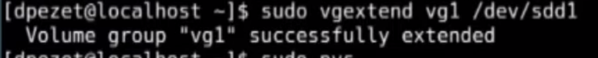

You may want to create a new lv to use this new space (lvcreate) or
maybe you want to extend an existing lv in which case you would use
something like lvresize or **lvextend**.

### lvextend (extend logical volume)

And then there are other tools that we can go, like lvextend if we
wanted to make it bigger. So we could do something like lvextend -L+5G
/dev/bucket/BIG SLICE. And now it says the size has gone from 32
gigabytes to 37 gigabytes (you can also use lvresize but the syntax
isn’t as intuitive).

^Common practice to add the “-r” flag when using lvextend to perform the
resize of the filesystem that resides on that logical volume. If this is
omitted, you can always resize the logical volume after the fact by
using : **resize2fs /dev/\<path to lv\>** (resize2fs only works for ext4
filesystems) .

It was re-sized. And we did that without adding anything to the system.
We just used the tools to change the size of our logical volume.

### Disabling/Enabling a logical volume

### Adding a new disk (pv) to a logical volume

- lvmdiskscan

- df -h

- lsblk

  - find disks with no mountpoint (or unmount disks needed).

- pvdisplay

- pvcreate \<disk\>

- pvdisplay

- vgdisplay

  - note the volume group name (vgname)

- vgextend \<vgname\> \<disk\>

  - The disk here has now become a physical volume.

- vgdisplay

- lvdisplay

  - note the logical volume name (lvname)

- lvextend \<lvolumename\> \<disk\>

- lvdisplay

- Find lv path

  - Under lvdisplay check out lv path

    - 

  - (alternatively) cat /etc/fstab

    - Find the path to the relevant disk and determine filesystem
      \<fspath\>

    - 

    - Can also use **fdisk -l** or **parted -l** and look for “Disk”

- extend the filesystem of the logical volume

  - etx4

    - resize2fs \<fspath\>

    - Did you noiceee

    - 

  - xfs

    - xfs_growfs \<fspath\>

    - 

We get to use those LVM tools and expand a partition owner system. So
let's get actually right down to it. But just for a quick reminder of
how LVM works, we have physical volumes, at least one, so a physical
volume or multiple physical volumes, and those are grouped together into
a volume group.

And then this whole thing can be carved up into chunks, which are called
logical volumes. And then that logical volume is treated just like any
other device on the system, like dev, mapper, root, and that is then in
turn mounted on our file system. Now the nice thing about this is we can
make changes back at this level that will affect down here without the
need to reboot or remove hard drives, or reformat, or anything like
that.

So what we're going to do in our scenario is add a new physical volume,
and then we're going to expand the volume group so that it's bigger. And
then after it's bigger, we're going to then expand this logical volume
so that it includes that new physical volume, and in turn becomes a
bigger root partition.

It's actually really, really cool. We do have to expand this file system
into all the free space we're going to create, but that's a one step
process, too. So let's actually go to our system, which is a CentOS
machine. And you can see it has problems.

It says low disk space on the root file system. It only has 300
kilobytes of space. Oh no. I'm going to click Ignore. We can do a df
minus h, and we can see, sure enough, dev mapper cent os root only has
now 276 kilobytes. It's almost 100% full.

So what we need to do is create a new physical volume.

Now I want to just go through if we look at logical volume display,
we're going to see what our logical volumes are. We actually have two.
We have our swap partition, which is dev centos swap and we have the
root partition. This is the one that's full.

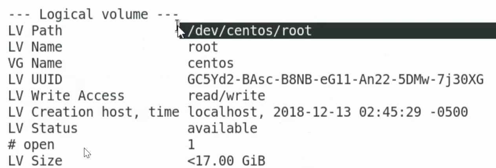

OK, so this is our logical volume that's sliced out of our entire volume
group, and it is actually currently full. Now in our volume groups, so
**vg isplay**, we only have a single physical volume. And that that
single physical volume, we can see current physical volumes are just
one, and it's creating the volume group centos.

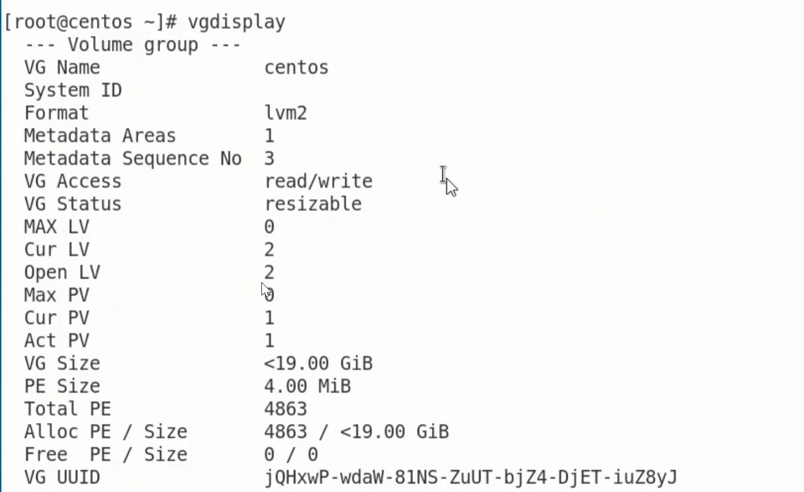

All right, so what we need to do is add a physical volume. If we do PV
display, we're going to see we just have this one, dev sda2. If we look
in our dev folder though and grep for SD, we're going to see we have
other hard drives in here. So we're going to add dev SD b as a physical
volume to our LVM system.

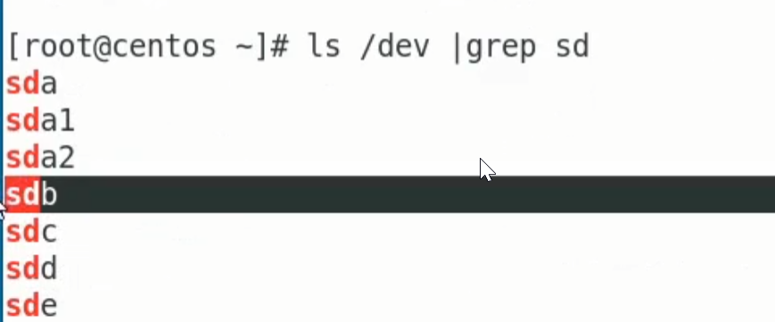

So it's just **PVcreate dev SD b**, physical volume dev SD b is created.

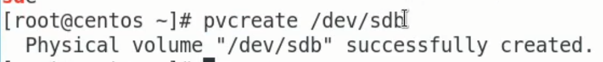

And if we do PV display again, now we're going to see we have two.

We have this first one up here, dev sda2, and we also have dev sdb. It
looks like it's 10 gigabytes in size, and it's not currently
allocatable.

Because even though it's recognized as a physical volume, it's not part
of a volume group.

Remember **vgdisplay** shows that we just have one physical volume in
here.

So we need to extend this physical or this volume group to include that
new physical volume.

So we're going to say volume group extend or vg extend, centos, so this
is the volume group that we're going to extend. And we're going to
extend it with dev sdb. So the volume group centos was successfully
extended.

So now if we do a **vgdisplay**, we're going to see hear it's still
called centos, but now it has two physical volumes in it, and the
volumes group size has changed.

Now it's almost 29 gigabytes in size, whereas if we go up here, it was
less than 19 gigabytes in size. And we had zero size available. But now
down here we have free space available. We have almost 10 gigabytes
available. Haha, so what are we going to do with that 10 gigabytes?

Well we're going to extend our logical volume. So logical volume display
(**lvdisplay**) is going to show us our current logical volumes. We have
2. We have the swap partition, which we're not going to touch. And then
we have this route partition, which is the one that is full.

So we want to make this one bigger. Now right now the logical volume
size is just under 17 gigabytes. So we're going to say logical volume
extend. Now hopefully you're going along and doing this with me, but
we're going to logical volume extend dev centos root, and we're going to
extend it with the physical volume that we use, which is dev sdb.

So it says it's been successfully resized.

*Note: can also use lvresize (which can grow or shrink, but lv extend is
preferred for growing)*

So let's do logical volume display (**lvdisplay**) one more time, and
this time we should see now it is almost 27 gigabytes in size, and
there's going to be free space available.

But it doesn't happen automatically. If we do a df minus h, we're going
to see that it still shows it as just being 17 gigabytes and completely
full.

And that's because while the partition is now bigger, the file system is
still originally only 17 gig. So we need to extend that partition.

Let's do an lsblk so we can see what we have. So this root partition is
right here and it says it's type lvm, all right.

Let's look at et cetera fs tab and see what it is. So here it is, our
root partition. Aha, that's what I was looking for. It's type XFS.

This is the file system that's on it, which means in order to grow this
partition, we need to use XFS grow fs. And what is the name of the
partition?

Well it's dev mapper centos root. So dev mapper centos root. Press
Enter. And now automatically, boom, it says it was changed from this big
to this big.

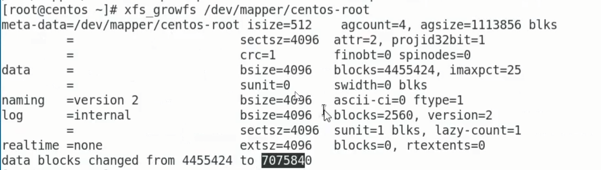

And you ready for the moment of truth? df minus h, aha, look at that.

All of a sudden now we have a 27 gigabyte partition with 10 gigabytes
free, and we didn't have to even restart the computer.

All we did is add that extra logical, or add that extra physical volume.
We've then added that to the volume group and then carved out a bigger
part of that into our logical volume centos root. And all of a sudden,
boom, we can expand that file system and have a ton of storage available
on our system.

Now I know we went really quick using those LVM tools, but I encourage
you to not only do exactly what we did, but try to add those extra hard
drives like dev sdc and dev sdd. Try adding those and make the file
system even bigger. It's the same process we did, but ysou just add more
physical volumes and then keep adding them to the volume group, and then
expand that partition in the end.

It's a lot of fun, and it's going to teach you how to do some real world
scenarios when you have a file system that's full and you need to
remediate it by expanding the storage available. I hope this has been
informative for you, and I'd like to thank you for viewing.

### Remove physical volume, volume groups, and logical volumes

**Remove logical volume from volume group**

First be sure to unmount the volume

unmount /bucket

lvremove /dev/vg_bucket/lv_bucket/bucket

**Remove physical volume from volume group**

First view with **vgs** then reduce

vgreduce vg_bucket /dev/sdf

**remove volume group**

vgremove vg_bucket

**Remove all from bottom up**

### Reduce LVM partition

First, device must be unmounted (with umount) then you must run e2fsck
–f to scan for errors on the partition.

Then resize volume:

### Backing up data with LVM 

**Mirrorvg**

**mklvcopy**

**Copy a LV**

Copy a LV from one VG into a different VG

# Disk Partitioning 

## \[GUIDE\] Partition and mount a disk

**List partitions (3ways):**

- parted -l

- lsblk -e7

- cat /proc/partitions

1.  **Enter parted session:**

    - parted /dev/sdb

2.  **Get partition info (use throughout):**

    - print

3.  **Create partition table:**

    - mklabel gpt

4.  **Create partition:**

    - mkpart primary ext4 0% 100%

5.  **Quit parted session:**

    - quit

6.  **List partitions again:** Repeat step \#1

7.  **Confirm that kernel has an updated view of anything that has been
    changed (avoids a reboot):**

    - partprobe

8.  **Make filesystem from partition name:**

    - mkfs -t ext4 /dev/sdb1

9.  **Get parition UUID:**

    - blkid or

    - lsblk -f

10. **Add to fstab (can also use partition name):**

    - UUID=1234 /dev/sdb1 ext4 defaults 0 0

Mount:

mount -a (reads from fstab) or mount /dev/sdb1 /mnt

Get mount info/status:

cat /etc/mtab or cat /proc/mounts

## Partionning considerations

## Device files and storage hierarchy

**<u>Hierarchy</u>**

- **Hard Drives**

  - **Character files**

  - **Block devices**

    - **Drives (disks)** vs partitions. Partitions are partitions *of*
      drives, so they are hierarchically below drives.

    - **Hard Drives** **(disks)** are of the format.. **/dev/sda** or
      **/dev/sdb** or **/dev/sdc** …etc

      - **Paritions** *(of a drive)* are of the format…

        - **sda1** or **sda2** or **sda3** for drive **sda**

        - **sdb1** or **sdb2** or **sdb3** for drive **sdb**

          - **Volume:**A formatted partition. Ready for use.

    - **Virtual Disks (vd)**

      - **/dev/vd**

      - **/dev/xvd (xen virtual disks)**

    - **NvMe (non-volatile memory)**

      - **/dev/nvme**

      - Use **lsscsi** command

    - **Device Mapper (often used with LVM)**

      - **/dev/**

    - **PATA (/dev//had, /dev/hdv)**

      - *Older version of SATA*

    - **CD and DVD Drives (/dev/hd)**

    - 

## Listing devices

### List block devices – including disks and assoc. partitions (lsblk) \[TREE STRUCTURE\]

***Note: A disk device is a type of block device***

*Use ‘lsblk’ for a tree-like structure of the current disks/partitions*

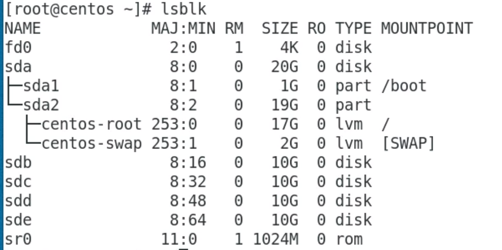

Before diving into the details of creating partitions and formatting
them, let's kick things off with a review of blocks and partitions.

**ls -f** to list with associated filesystem types

Optimal View

lsblk -fe7

“f” to show associated filesystems (if any) and “e7” to skip listing of
any loopback devices.

Blocks are a layer of storage devices that allow individual access to
each independently. They allow programs to access storage without
worrying about whether the underlying hardware device is a hard drive,
solid state drive, flash drive, etc.

In Linux, you can view block devices and file systems attached to your
system using the **lsblk** command. This command gathers information
about all devices attached to the system, and prints them out using a
tree-like structure. To view the devices attached to your VM, use
the **lsblk** command.

NAME MAJ:MIN RM SIZE RO TYPE MOUNTPOINT

sda 8:0 0 10G 0 disk

|-sda1 8:1 0 4.9G 0 part

|-sda2 8:2 0 16M 0 part

|-sda3 8:3 0 2G 0 part

|-sda4 8:4 0 16M 0 part

|-sda5 8:5 0 2G 0 part

|-sda6 8:6 0 512B 0 part

|-sda7 8:7 0 512B 0 part

|-sda8 8:8 0 16M 0 part

|-sda9 8:9 0 512B 0 part

|-sda10 8:10 0 512B 0 part

|-sda11 8:11 0 8M 0 part

\`-sda12 8:12 0 32M 0 part

sdb 8:16 0 10G 0 disk

|-sdb1 8:17 0 5.9G 0 part /etc/hosts

|-sdb2 8:18 0 16M 0 part

|-sdb3 8:19 0 2G 0 part

| \`-vroot 253:0 0 2G 1 dm

|-sdb4 8:20 0 16M 0 part

|-sdb5 8:21 0 2G 0 part

|-sdb6 8:22 0 512B 0 part

|-sdb7 8:23 0 512B 0 part

|-sdb8 8:24 0 16M 0 part

|-sdb9 8:25 0 512B 0 part

|-sdb10 8:26 0 512B 0 part

|-sdb11 8:27 0 8M 0 part

\`-sdb12 8:28 0 32M 0 part

You'll see that your instance has two block devices attached to it
(disks). Each of them is 10GB in size. The column MOUNTPOINT shows where
a block device is mounted. It's from this location that files on the
disk can be accessed. In this case, the MOUNTPOINT is
displaying **"/etc/hosts"** against **sdb**, which means the second disk
(sdb) is mounted at the root of the Linux file system tree. Thus, the
files you're seeing on your system right now are from this disk.

A first disk, **sda**, is also available, but it's not mounted. In this
lab, you'll divide this disk into two partitions. You'll then mount one
of these partitions onto the file system, so you can start accessing
files from it.

**Note**: These may be swapped for you, and your VM may be mounted on
sda instead of sdb. This will change the commands used in the lab, so
when you see \\MOUNT DRIVE\\ replace it with your mount drive (sda or
sdb) and when you see \\SECOND DRIVE\\ replace it with the other one. If
your VM is mounted on sda, the screenshots will also be flipped from
what you will see.

Optionally, you can view disks mounted on the system using
the **df** command. This command is normally used to display the amount
of space available on the file system. It lists all block devices with
the available space on them. Use the **-h** option to display file sizes
in human readable format.

df -h

Filesystem Size Used Avail Use% Mounted on

overlay 5.7G 809M 4.9G 14% /

tmpfs 64M 0 64M 0% /dev

tmpfs 290M 0 290M 0% /sys/fs/cgroup

shm 64M 0 64M 0% /dev/shm

/dev/sdb1 5.7G 809M 4.9G 14% /etc/hosts

### List disks (df -h)

Because this command is designed for showing free disk space, you won’t
see any mount points or associated partitions.

### List scsi devices (and more – lsscsi)

**lsscsi** is used to list scsi devices – but physical disk drives also
fall under that category as well so they will also be listed. Virtual
disks/partitions will not be listed.

### List disks and assoc. partitions (fdisk)

*fdisk* will start in interactive mode. You can use **m** to use help
provided by the command.

You can use **p** to show details about partitions on the disk.

Enter **q** to exit interactive mode when you are finished exploring.

Instead of using a storage block as a whole, it's common practice to
divide a storage block into different partitions. Partitions can be
different sizes, and formatted to different filesystems. This allows you
to use a single storage device for different purposes.

You can display partition information using the **fdisk** command. You
can also use the -l option to list partitions in the block. You can pass
a device name to the fdisk command to list the partitions contained in
that device.

To list all partitions, use **fdisk -l**

Note: technically, fdisk just lists all devices whether/not they are
partitioned, but you can use this to see information about devices you
may want to partition. To list disks

sudo fdisk -l

GPT PMBR size mismatch (18874524 != 20971519) will be corrected by
write.

The backup GPT table is not on the end of the device. This problem will
be corrected by write.

Disk /dev/sda: 10 GiB, 10737418240 bytes, 20971520 sectors

Disk model: PersistentDisk

Units: sectors of 1 \* 512 = 512 bytes

Sector size (logical/physical): 512 bytes / 4096 bytes

I/O size (minimum/optimal): 4096 bytes / 4096 bytes

Disklabel type: gpt

Disk identifier: FDF53EEC-3010-3049-B247-42C11C16F682

Device Start End Sectors Size Type

/dev/sda1 8704000 18874476 10170477 4.9G Linux filesystem

/dev/sda2 20480 53247 32768 16M ChromeOS kernel

/dev/sda3 4509696 8703999 4194304 2G ChromeOS root fs

/dev/sda4 53248 86015 32768 16M ChromeOS kernel

/dev/sda5 315392 4509695 4194304 2G ChromeOS root fs

/dev/sda6 16448 16448 1 512B ChromeOS kernel

/dev/sda7 16449 16449 1 512B ChromeOS root fs

/dev/sda8 86016 118783 32768 16M Linux filesystem

/dev/sda9 16450 16450 1 512B ChromeOS reserved

/dev/sda10 16451 16451 1 512B ChromeOS reserved

/dev/sda11 64 16447 16384 8M BIOS boot

/dev/sda12 249856 315391 65536 32M EFI System

Partition 7 does not start on physical sector boundary.

Partition 9 does not start on physical sector boundary.

Partition 10 does not start on physical sector boundary.

Partition table entries are not in disk order.

Disk /dev/sdb: 10 GiB, 10737418240 bytes, 20971520 sectors

Disk model: PersistentDisk

Units: sectors of 1 \* 512 = 512 bytes

Sector size (logical/physical): 512 bytes / 4096 bytes

I/O size (minimum/optimal): 4096 bytes / 4096 bytes

To list partitions contained in **/dev/sdb**, pass **/dev/sdb** to
the **fdisk** command.

sudo fdisk -l /dev/sdb

Copied!

content_copy

Disk /dev/sdb: 10 GiB, 10737418240 bytes, 20971520 sectors

Disk model: PersistentDisk

Units: sectors of 1 \* 512 = 512 bytes

Sector size (logical/physical): 512 bytes / 4096 bytes

I/O size (minimum/optimal): 4096 bytes / 4096 bytes

Disklabel type: gpt

Disk identifier: FDF53EEC-3010-3049-B247-42C11C16F682

Device Start End Sectors Size Type

/dev/sdb1 8704000 20971486 12267487 5.9G Linux filesystem

/dev/sdb2 20480 53247 32768 16M ChromeOS kernel

/dev/sdb3 4509696 8703999 4194304 2G ChromeOS root fs

/dev/sdb4 53248 86015 32768 16M ChromeOS kernel

/dev/sdb5 315392 4509695 4194304 2G ChromeOS root fs

/dev/sdb6 16448 16448 1 512B ChromeOS kernel

/dev/sdb7 16449 16449 1 512B ChromeOS root fs

/dev/sdb8 86016 118783 32768 16M Linux filesystem

/dev/sdb9 16450 16450 1 512B ChromeOS reserved

/dev/sdb10 16451 16451 1 512B ChromeOS reserved

/dev/sdb11 64 16447 16384 8M BIOS boot

/dev/sdb12 249856 315391 65536 32M EFI System

Partition 7 does not start on physical sector boundary.

Partition 9 does not start on physical sector boundary.

Partition 10 does not start on physical sector boundary.

Partition table entries are not in disk order.

**fdisk** displays information contained in the partition table, where
information about partitions is stored.

### List disks and assoc. partitions (parted)

parted –l

Note ‘/dev/sdb/’ doesn’t have any partitions listed. Partition table
“unknown”.

### View fiber channel connections (fcstat)

To view detailed info try fcstat -e

## Listing partitions

### /proc/partitions

This files all existing partitions

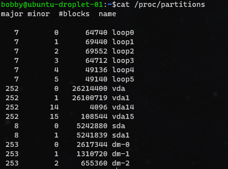

### List partition table and Assoc. Disck info (parted -l) \[preferred\]

### List partition table (fdisk -l)

Fdisk is preferred over parted for listing partitions as it give an
exact number for partition usage whereas parted gives an estimate.

### List filesystem table and mount info (cat /etc/fstab)

## Creating and deleting partitions

When the *fdisk* command is used without options, it provides a
menu-driven environment for creating and deleting partitions.

**Caution!**: Modifying partitions is destructive, and can lead to loss
of data. Not good! Remember to always backup your data before modifying
partitions on a live system.

Mounting and unmounting mean making devices available or unavailable on
a Linux file system. This is accomplished by the
commands *mount* and *umount.* Before modifying a disk, you should
first **unmount** it from the system, using the umount command. When
modifications on the disk are done, you should **mount** it back onto
the system. For this exercise, since the device we're partitioning isn't
initially mounted, you can proceed with partitioning.

Go ahead and start *fdisk* in interactive mode by passing the name of
the disk you want to partition. In this lab, we'll
partition **/dev/sda**

**Note**: We will partition the disk that's not currently mounted. You
should select dev/sdb if /dev/sda is where the operating system is
mounted, and /dev/sda otherwise. You can still partition the disk even
when the operating system is running from it, but a reboot will be
required in order for the partition changes you make to take place.

Start fdisk by passing the disk you want to partition as the parameter.

sudo fdisk /dev/\[SECOND DRIVE\]

Welcome to fdisk (util-linux 2.33.1).

Changes will remain in memory only, until you decide to write them.

Be careful before using the write command.

GPT PMBR size mismatch (18874524 != 20971519) will be corrected by
write.

The backup GPT table is not on the end of the device. This problem will
be corrected by write.

Command (m for help):

*fdisk* will start in interactive mode. You can use **m** to use help
provided by the command.

Command (m for help): m

Help:

GPT

M enter protective/hybrid MBR

Generic

d delete a partition

F list free unpartitioned space

l list known partition types

n add a new partition

p print the partition table

t change a partition type

v verify the partition table

i print information about a partition

Misc

m print this menu

x extra functionality (experts only)

Script

I load disk layout from sfdisk script file

O dump disk layout to sfdisk script file

Save & Exit

w write table to disk and exit

q quit without saving changes

Create a new label

g create a new empty GPT partition table

G create a new empty SGI (IRIX) partition table

o create a new empty DOS partition table

s create a new empty Sun partition table

Command (m for help):

You can use **p** to show details about partitions on the disk.

Command (m for help): p

Disk /dev/sda: 10 GiB, 10737418240 bytes, 20971520 sectors

Disk model: PersistentDisk

Units: sectors of 1 \* 512 = 512 bytes

Sector size (logical/physical): 512 bytes / 4096 bytes

I/O size (minimum/optimal): 4096 bytes / 4096 bytes

Disklabel type: gpt

Disk identifier: FDF53EEC-3010-3049-B247-42C11C16F682

Device Start End Sectors Size Type

/dev/sda1 8704000 18874476 10170477 4.9G Linux filesystem

/dev/sda2 20480 53247 32768 16M ChromeOS kernel

/dev/sda3 4509696 8703999 4194304 2G ChromeOS root fs

/dev/sda4 53248 86015 32768 16M ChromeOS kernel

/dev/sda5 315392 4509695 4194304 2G ChromeOS root fs

/dev/sda6 16448 16448 1 512B ChromeOS kernel

/dev/sda7 16449 16449 1 512B ChromeOS root fs

/dev/sda8 86016 118783 32768 16M Linux filesystem

/dev/sda9 16450 16450 1 512B ChromeOS reserved

/dev/sda10 16451 16451 1 512B ChromeOS reserved

/dev/sda11 64 16447 16384 8M BIOS boot

/dev/sda12 249856 315391 65536 32M EFI System

Partition 7 does not start on physical sector boundary.

Partition 9 does not start on physical sector boundary.

Partition 10 does not start on physical sector boundary.

Partition table entries are not in disk order.

Command (m for help):

Enter **q** to exit interactive mode when you are finished exploring.

### Fdisk

#### Partitioning a disk (fdisk) \[MBR – and GPT on newer versions\]

Fdisk has traditionally been used for MBR. New version of fdisk (gdisk)
support MBR and GPT boot sectors, but if you want to be safe, better to
use parted as it’s always supported both.

**Cheatsheet:**

- **fdisk \<disk\>**

  - Enter interactive mode

  - Example: fdisk /dev/sdb

- **m** : view menu

- **n** : Create partition

- **p** : set this partition as primary

- **+1GB** : set partition to 1GB

  - Defaults to last sector which is ideal if you want to partition the
    entire disk with this partition. Otherwise, uses these readable valu

- **l** : list of all partition types

  - defaults to type “Linux” which uses code 83, but you can change to
    linux swap for example (code 82.)

- **v** : verify your changes

- **w** : write these changes to disk.

You'll now create new partitions using **fdisk**. You'll partition **the
second drive** into two partitions: one swap partition of size **1GB**,
and another of size **9GB**. The file system type on the second
partition will be ext4.

Open *fdisk* in interactive mode to do the partitioning:

sudo fdisk /dev/\[SECOND DRIVE\]

Welcome to fdisk (util-linux 2.33.1).

Changes will remain in memory only, until you decide to write them.

Be careful before using the write command.

GPT PMBR size mismatch (18874524 != 20971519) will be corrected by
write.

The backup GPT table is not on the end of the device. This problem will
be corrected by write.

Command (m for help):

To create a new partition, the command control **n** is used. However,
since all the space on the disk is currently allocated, you'll need to
first free up space by deleting the default partitions.

Use the **d** command control to delete the default partitions. When you
issue the **d** command control, **fdisk** asks you to enter the number
of partitions you want to delete. Since you have twelve
partitions, **fdisk** automatically selects the last partition by
default, and pressing **Enter** deletes the last partition. Repeat this
process until you delete all the twelve partitions.

Command (m for help): d

Partition number (1-12, default 12):

Partition 12 has been deleted.

Command (m for help): d

Partition number (1-11, default 11):

Partition 11 has been deleted.

Command (m for help): d

Partition number (1-10, default 10):

Partition 10 has been deleted.

Command (m for help): d

Partition number (1-9, default 9):

Partition 9 has been deleted.

Command (m for help): d

Partition number (1-8, default 8):

Partition 8 has been deleted.

Command (m for help): d

Partition number (1-7, default 7):

Partition 7 has been deleted.

Command (m for help): d

Partition number (1-6, default 6):

Partition 6 has been deleted.

Command (m for help): d

Partition number (1-5, default 5):

Partition 5 has been deleted.

Command (m for help): d

Partition number (1-4, default 4):

Partition 4 has been deleted.

Command (m for help): d

Partition number (1-3, default 3):

Partition 3 has been deleted.

Command (m for help): d

Partition number (1,2, default 2):

Partition 2 has been deleted.

Command (m for help): d

Selected partition 1

Partition 1 has been deleted.

Command (m for help):

You're now able to create your new partitions. Enter the command control
for creating a new partition, **n**.

You'll then need to provide the starting sector (memory location) of the
new partition, from where you want to allocate. Here, press **Enter** to
select the default value 2048.

Command (m for help): n

Partition number (1-128, default 1):

First sector (34-20971486, default 2048):

Last sector, +/-sectors or +/-size{K,M,G,T,P} (2048-20971486, default
20971486):

Provide the last sector of the new partition, up to where you want to
allocate. The difference between the first and last sectors makes up the
total size of the partition. Disk sector represents units used to
measure the size on disks. Each sector stores a fixed amount of data. In
lots of hard disks, for example, a sector stores 512 bytes. To create
the first 1GB partition, enter **2097200** (divide the original
partition by 10).

Command (m for help): n

Partition number (1-128, default 1):

First sector (34-20971486, default 2048):

Last sector, +/-sectors or +/-size{K,M,G,T,P} (2048-20971486, default
20971486): 2097200

Created a new partition 1 of type 'Linux filesystem' and of size 1023
MiB.

Command (m for help):

Two important things happen here: the partition size is set to **1GB**,
and the partition type is set to **Linux filesystem**. (You'll see how
to change partition types in the next section.) Voila! One partition is
now created. You'll now move on to the second one.

Use the command control **n** again for a new partition.

Command (m for help): n

Partition number (2-128, default 2):

Select partition number **2** to issue partition numbers in sequence.

Command (m for help): n

Partition number (2-128, default 2):

First sector (2097201-20971486, default 2099200):

Select the default partition starting sector, which is the next sector
from the last partition you allocated.

Command (m for help): n

Partition number (2-128, default 2):

First sector (2097201-20971486, default 2099200):

Last sector, +/-sectors or +/-size{K,M,G,T,P} (2099200-20971486, default
20971486):

Also select the default last sector, which will be the last sector of
the remaining disk space.

Command (m for help): n

Partition number (2-128, default 2):

First sector (2097201-20971486, default 2099200):

Last sector, +/-sectors or +/-size{K,M,G,T,P} (2099200-20971486, default
20971486):

Created a new partition 2 of type 'Linux filesystem' and of size 9 GiB.

Command (m for help):

The second partition is now created. Sweet!

Before committing your changes, you'll change the second partition to a
different partition type. You'll change the first partition type to a
Linux swap type. Enter command control **t** to change the partition
type, and select the first partition.

Command (m for help): t

Partition number (1,2, default 2): 1

Partition type (type L to list all types):

You can use the command control **L** to view a list of all partition
types.

Command (m for help): t

Partition number (1,2, default 2): 1

Partition type (type L to list all types): L

1 EFI System C12A7328-F81F-11D2-BA4B-00A0C93EC93B

2 MBR partition scheme 024DEE41-33E7-11D3-9D69-0008C781F39F

3 Intel Fast Flash D3BFE2DE-3DAF-11DF-BA40-E3A556D89593

4 BIOS boot 21686148-6449-6E6F-744E-656564454649

5 Sony boot partition F4019732-066E-4E12-8273-346C5641494F

6 Lenovo boot partition BFBFAFE7-A34F-448A-9A5B-6213EB736C22

7 PowerPC PReP boot 9E1A2D38-C612-4316-AA26-8B49521E5A8B

8 ONIE boot 7412F7D5-A156-4B13-81DC-867174929325

9 ONIE config D4E6E2CD-4469-46F3-B5CB-1BFF57AFC149

10 Microsoft reserved E3C9E316-0B5C-4DB8-817D-F92DF00215AE

11 Microsoft basic data EBD0A0A2-B9E5-4433-87C0-68B6B72699C7

12 Microsoft LDM metadata 5808C8AA-7E8F-42E0-85D2-E1E90434CFB3

13 Microsoft LDM data AF9B60A0-1431-4F62-BC68-3311714A69AD

14 Windows recovery environment DE94BBA4-06D1-4D40-A16A-BFD50179D6AC

15 IBM General Parallel Fs 37AFFC90-EF7D-4E96-91C3-2D7AE055B174

16 Microsoft Storage Spaces E75CAF8F-F680-4CEE-AFA3-B001E56EFC2D

17 HP-UX data 75894C1E-3AEB-11D3-B7C1-7B03A0000000

18 HP-UX service E2A1E728-32E3-11D6-A682-7B03A0000000

19 Linux swap 0657FD6D-A4AB-43C4-84E5-0933C84B4F4F

20 Linux filesystem 0FC63DAF-8483-4772-8E79-3D69D8477DE4

21 Linux server data 3B8F8425-20E0-4F3B-907F-1A25A76F98E8

22 Linux root (x86) 44479540-F297-41B2-9AF7-D131D5F0458A

Enter **19** to change the partition type to ‘Linux swap', and
press **Enter**.

Head's up: Some of the characters in the partition type name **Linux
swap** are truncated.

Partition type (type L to list all types): 19

Changed type of partition 'Linux filesystem' to 'Linux swap'.

Command (m for help):

The partition type will be changed to match the selection.

Up to this point, you've just been editing the partition table in
memory. You can use the **q** command here to quit **fdisk** without
committing changes to the disk. You can also update your partitions by
using the **d** and **n** commands to remove and add new partitions.

You can also use the **v** command here to verify your changes before
proceeding.

Command (m for help): v

No errors detected.

Header version: 1.0

Using 2 out of 128 partitions.

A total of 4013 free sectors is available in 2 segments (the largest is
1007 KiB).

If you're satisfied with the changes you've made so far, you can commit
them to the disk by using the **w** command.

Command (m for help): w

The partition table has been altered.

Calling ioctl() to re-read partition table.

Syncing disks.

Congrats! You've successfully partitioned the second disk
using **fdisk**.

The second disk device is now made up of two partitions
of **1GB** and **9GB**, respectively.

#### Deleting a partition (using fdisk)

Use the **d** command control to delete the default partitions. When you
issue the **d** command control, **fdisk** asks you to enter the number
of partitions you want to delete. Since you have twelve
partitions, **fdisk** automatically selects the last partition by
default, and pressing **Enter** deletes the last partition. Repeat this
process until you delete all the twelve partitions.

#### Deleting a partition (using dd)

#### Partitioning a disk (gdisk) \[GUI/GPT\]

See fdisk as it works in much the same way, just for GPT.

### Parted

#### Partitioning a disk (parted) \[MBR/GPT\]

*Installed by default on some distros like centos but not all distros.
You can always rely gdisk as a GPT alternative to fdisk that acts much
in the same way as fdisk.*

sudo parted \<disk\>

Type **print** to see more info on the selected disk and type **quit**
at any time to exit this mode:

“Unrecognized label” mean there’s no partition table (label) assigned.

*Note: gparted is a gui variant*

#### Creating a partition table (parted - mklabel)

mklabel \<partition table scheme\>

#### Partitioning a disk (mkpart) \[GPT\]

We want to partition the /dev/sdb disk into two partitions. Inside the
parted tool we're going to use the mkpart command. The mkpart command
needs to have the following information…

- what type partition we want to make

- what file system we want to format

- the start of the disk

- and the end of the disk.

The partition type is only meaningful for mbr partition tables.
Remember, the mbr uses primary, extended, and logical partitions. Since
we are formatting this using gpt, we're just going to use **primary** as
the partition type. The start point here is one mebibyte and the
endpoint is five gibibytes. So our partition is essentially five
gibibytes.

Though we can also use percentages

## partprobe : Good practice after making partition changes

partprobe

Run the partprobe command to make sure the kernel has an updated view of
anything that has been changed.

This adds any new partitions to the /**proc/partitions** dir.

## Extending a partition

## AWS: Expand EBS volume

Overview:
https://docs.aws.amazon.com/AWSEC2/latest/UserGuide/ebs-modify-volume.html

1.  **AWS:** Expand EBS volume in AWS

    1.  EBS Volume – modify

2.  **Linux:** Extend partition

    1.  Partition and FS resize:
        <https://docs.aws.amazon.com/AWSEC2/latest/UserGuide/recognize-expanded-volume-linux.html>

    2.  **Extend partition**

        1.  For example, to extend a partition named **nvme0n1p1**, use
            the following command. Note the space between the device
            name (nvme0n1) and the partition number (1).

        2.  sudo growpart /dev/nvme0n1 1

    3.  **Resize fiilesystm \[Linux - ext4\]**

        1.  sudo resize2fs /dev/nvme0n1p1

# Files and Filesystems

## Study and Learning

### File Types

### Filesystem Types

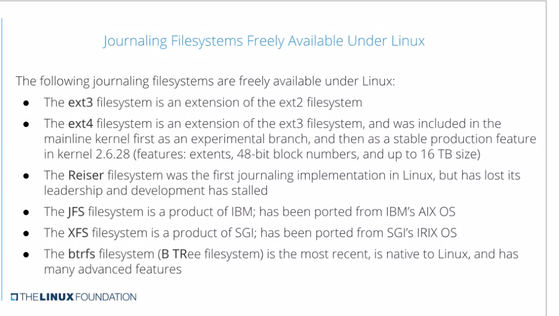

### Filesystem Layout and FHS

Here is a list of the main directories which should be present under
**/**:

#### Main Directories

<table>
<colgroup>
<col style="width: 15%" />
<col style="width: 11%" />
<col style="width: 72%" />
</colgroup>
<thead>
<tr>
<th><strong>Directory</strong></th>
<th><strong>In FHS?</strong></th>
<th><strong>Purpose</strong></th>
</tr>
</thead>
<tbody>
<tr>
<td><strong>/</strong></td>
<td>Yes</td>
<td>Primary directory of the entire filesystem hierarchy</td>
</tr>
<tr>
<td><strong>/bin</strong></td>
<td>Yes</td>
<td>Essential executable programs that must be available in single user
mode</td>
</tr>
<tr>
<td><strong>/boot</strong></td>
<td>Yes</td>
<td>Files needed to boot the system, such as the kernel, initrd or
initramfs images, and boot configuration files and bootloader
programs</td>
</tr>
<tr>
<td><strong>/dev</strong></td>
<td>Yes</td>
<td><strong>Device Nodes</strong>, used to interact with hardware and
software devices</td>
</tr>
<tr>
<td><strong>/etc</strong></td>
<td>Yes</td>
<td>System-wide configuration files</td>
</tr>
<tr>
<td><strong>/home</strong></td>
<td>Yes</td>
<td>User home directories, including personal settings, files, etc.</td>
</tr>
<tr>
<td><strong>/lib</strong></td>
<td>Yes</td>
<td>Libraries required by executable binaries in <strong>/bin</strong>
and <strong>/sbin</strong></td>
</tr>
<tr>
<td><strong>/lib64</strong></td>
<td>No</td>
<td>64-bit libraries required by executable binaries in
<strong>/bin</strong> and <strong>/sbin</strong>, for systems which can
run both 32-bit and 64-bit programs</td>
</tr>
<tr>
<td><strong>/media</strong></td>
<td>Yes</td>
<td>Mount points for removable media such as CD’s, DVD’s, USB sticks,
etc.</td>
</tr>
<tr>
<td><strong>/mnt</strong></td>
<td>Yes</td>
<td>Temporarily mounted filesystems</td>
</tr>
<tr>
<td><strong>/opt</strong></td>
<td>Yes</td>
<td>Optional application software packages</td>
</tr>
<tr>
<td><strong>/proc</strong></td>
<td>Yes</td>
<td>Virtual pseudo-filesystem giving information about the system and
processes running on it; can be used to alter system parameters</td>
</tr>
<tr>
<td><strong>/run</strong></td>
<td>Yes</td>
<td>System information data describing the system since it was booted;
should be cleared at every reboot</td>
</tr>
<tr>
<td><strong>/sys</strong></td>
<td>No</td>
<td>Virtual pseudo-filesystem giving information about the system and
processes running on it; can be used to alter system parameters, is
similar to a device tree and is part of the Unified Device Model</td>
</tr>
<tr>
<td><strong>/root</strong></td>
<td>Yes</td>
<td>Home directory for the root user</td>
</tr>
<tr>
<td><strong>/sbin</strong></td>
<td>Yes</td>
<td>Essential system binaries</td>
</tr>
<tr>
<td><strong>/srv</strong></td>
<td>Yes</td>
<td>Site-specific data served up by the system; seldom used (ideally for
site-specific servers)</td>
</tr>
<tr>
<td><strong>/tmp</strong></td>
<td>Yes</td>
<td>Temporary files; on many distributions lost across a reboot and may
be a ramdisk in memory</td>
</tr>
<tr>
<td><strong>/usr</strong></td>
<td>Yes</td>
<td>Multi-user applications, utilities and data; theoretically
read-only</td>
</tr>
<tr>
<td><strong>/var</strong></td>
<td>Yes</td>
<td>Variable data that changes during system operation</td>
</tr>
</tbody>
</table>

A system should be able to boot and go into single user, or recovery
mode, with only the **/bin**, **/sbin**, **/etc**, **/lib** and
**/root** directories mounted, while the contents of the **/boot**
directory are needed for the system to boot in the first place.

Many of these directories (such as **/etc** and **/lib**) will generally
have subdirectories associated either with specific applications or
sub-systems, with the exact layout differing somewhat by Linux
distribution. Two of them, **/usr** and **/var**, are relatively
standardized and worth looking at.

#### Directories Under /usr

<table>
<colgroup>
<col style="width: 20%" />
<col style="width: 79%" />
</colgroup>
<thead>
<tr>
<th><strong>Directory</strong></th>
<th><strong>Purpose</strong></th>
</tr>
</thead>
<tbody>
<tr>
<td><strong>/usr/bin</strong></td>
<td>Non-essential binaries and scripts, not needed for single user mode;
generally this means user applications not needed to start system</td>
</tr>
<tr>
<td><strong>/usr/include</strong></td>
<td>Header files used to compile applications</td>
</tr>
<tr>
<td><strong>/usr/lib</strong></td>
<td>Libraries for programs in <strong>/usr/bin</strong> and
<strong>/usr/sbin</strong></td>
</tr>
<tr>
<td><strong>/usr/lib64</strong></td>
<td>64-bit libraries for 64-bit programs in <strong>/usr/bin</strong>
and <strong>/usr/sbin</strong></td>
</tr>
<tr>
<td><strong>/usr/sbin</strong></td>
<td>Non-essential system binaries, such as system daemons</td>
</tr>
<tr>
<td><strong>/usr/share</strong></td>
<td>Shared data used by applications, generally
architecture-independent</td>
</tr>
<tr>
<td><strong>/usr/src</strong></td>
<td>Source code, usually for the Linux kernel</td>
</tr>
<tr>
<td><strong>/usr/X11R6</strong></td>
<td>X Window files; generally obsolete</td>
</tr>
<tr>
<td><strong>/usr/local</strong></td>
<td>Local data and programs specific to the host; subdirectories include
<strong>bin</strong>, <strong>sbin</strong>, <strong>lib</strong>,
<strong>share</strong>, <strong>include</strong>, etc.</td>
</tr>
</tbody>
</table>

#### Directories Under /var

<table>
<colgroup>
<col style="width: 18%" />
<col style="width: 81%" />
</colgroup>
<thead>
<tr>
<th><strong>Directory</strong></th>
<th><strong>Purpose</strong></th>
</tr>
</thead>
<tbody>
<tr>
<td><strong>/var/lib</strong></td>
<td>Persistent data modified by programs as they run</td>
</tr>
<tr>
<td><strong>/var/lock</strong></td>
<td>Lock files used to control simultaneous access to resources</td>
</tr>
<tr>
<td><strong>/var/log</strong></td>
<td>Log files</td>
</tr>
<tr>
<td><strong>/var/mail</strong></td>
<td>User mailboxes</td>
</tr>
<tr>
<td><strong>/var/run</strong></td>
<td>Information about the running system since the last boot</td>
</tr>
<tr>
<td><strong>/var/spool</strong></td>
<td>Tasks spooled or waiting to be processed, such as print queues</td>
</tr>
<tr>
<td><strong>/var/tmp</strong></td>
<td>Temporary files to be preserved across system reboot; sometimes
linked to <strong>/tmp</strong></td>
</tr>
<tr>
<td><strong>/var/www</strong></td>
<td>Root for website hierarchies</td>
</tr>
</tbody>
</table>

#### Randomness

**/dev/random**: Will only return a steam of random characters one
enough entropy is built-up in a given system.

**/dev/urandom:** (newer) Will always return a stream of random
characters – does not depend on randomess. May be time-based so
randomness isn’t as robust as /dev/random (as entropy is not a factor)
but useful for most general use-cases.

**$RANDOM**: Bult-in bash environment variable that generates a random
32-bit number.

#### /Dev/null and /Dev/zero

- /dev/null: Write-only black hole (doesn’t return data – nothing to
  read)

  - Could hold up a script that depends on this if not enough entropy is
    generated at a given time.

- /dev/zero: Read-only- returns endless stream of null characters (not
  zeros) – perfect for wiping a disk.

#### Symbolic links

***IMPORTANT!***

*Make sure to always specify the absolute path of the source file as the
source will literally be what the soft link points to – which would be
an issue if you move your soft link to another dir.*

### Filesystem Structure

### File creation,deletion, and inodes

In Linux, metadata and files are organized into a structure called an
inode. Inodes are similar to the Windows NTFS MFT records. We store
inodes in an inode table and they help us manage the files on our file
system. The inode itself doesn't actually store file date or the file
name, but it does store everything else about a file. In the last
lesson, we learned how to create file shortcuts, symbolic links, and
hardlinks in Windows. Well in Linux we have the same concept. Shortcuts
in Linux are referred to as softlinks, or symlinks. They work in a
similar way symbolic links work in Windows, in that they just point to
another

file.

**On inodes file deletion and inodes**

However, every single file on the system will use an inode.

It's kind of like a pointer to the file, so this has exactly one inode,
even though it's a big file. This has one inode, even though it's a
smaller file. This has one inode, this his one inode. Every single file
has an node that is kind of like its-- I don't know. --it's place on the
drive that it starts, OK?

So you have to have an inode for every single file regardless of how
much space on the hard drive it takes up. OK, so every single file needs
an inode. That's the important thing to know.

Remember how our filesystem is comprised of all our actual files and a
database that manages these files? The database is known as the inode
table.

**What is an inode?**

An inode (index node) is an entry in this table and there is one for
every file. It describes everything about the file, such as:

- File type - regular file, directory, character device, etc

- Owner

- Group

- Access permissions

- Timestamps - mtime (time of last file modification), ctime (time of
  last attribute change), atime (time of last access)

- Number of hardlinks to the file

- Size of the file

- Number of blocks allocated to the file

- Pointers to the data blocks of the file - most important!

Basically inodes store everything about the file, except the filename
and the file itself!

**When are inodes created?**

When a filesystem is created, space for inodes is allocated as well.
There are algorithms that take place to determine how much inode space
you need depending on the volume of the disk and more. You've probably
at some point in your life seen errors for out of disk space issues.
Well the same can occur for inodes as well (although less common), you
can run out of inodes and therefore be unable to create more files.
Remember data storage depends on both the data and the database
(inodes).

To see how many inodes are left on your system, use the command **df
-i**

**Inode information**

Inodes are identified by numbers, when a file gets created it is
assigned an inode number, the number is assigned in sequential order.
However, you may sometimes notice when you create a new file, it gets an
inode number that is lower than others, this is because once inodes are
deleted, they can be reused by other files. To view inode numbers
run **ls -li**:

The first field in this command lists the inode number.

You can also see detailed information about a file with stat, it tells
you information about the inode as well.

**How do inodes locate files?**

We know our data is out there on the disk somewhere, unfortunately it
probably wasn't stored sequentially, so we have to use inodes. Inodes
point to the actual data blocks of your files. In a typical filesystem
(not all work the same), each inode contains 15 pointers, the first 12
pointers point directly to the data blocks. The 13th pointer, points to
a block containing pointers to more blocks, the 14th pointer points to
another nested block of pointers, and the 15th pointer points yet again
to another block of pointers! Confusing, I know! The reason this is done
this way is to keep the inode structure the same for every inode, but be
able to reference files of different sizes. If you had a small file, you
could find it quicker with the first 12 direct pointers, larger files
can be found with the nests of pointers. Either way the structure of the
inode is the same.

#### Max inodes used

Example where we can’t create another file:

Even though we have 8gb of free space

**Problem**: max inodes are already in use

Nice to see in human-readable format (**hi**)

**Viewing individual inode information for a file (stat \<path\>)**

#### Immutable files

Example of an immutable file:

**lsattr** : view file attributes

*Notice “i” for “immutable (lowercase I for the “deleteme” file).*

**View attributes (chattr)**

*Removing the immutable attribute in this example*

*Adding immutability*

### Virtual Filesystems

- **/proc** : Stores process information.

  - *Note: this predates /dev/ and /sys/ and as such lots of information
    about devices or the system still lives inside this dir for backward
    compatibility.*

- **/sys/** : Store info about the kernel (firmware, modules,
  hypervisor, etc)

  - 

- **/dev/** : Stores device information (IO periphials,Hard disks, etc)

## Creating filesystems (Formatting partitions) using mkfs

Running mkfs and the type flag is the same as running mkfs and using dot
notation to specify the file

Next, you'll create different file systems in the partitions you just
created. You'll do this by using the command **mkfs** in Linux. Multiple
filesystem types exist, and it's important to know all of them, along
with the functions they're best suited for. In this lab, you'll format
the second partition into ext4, the most widely used Linux filesystem
type.

View the different mkfs tools for each filesystem

To do this, use **lsblk** again to find the disk you want to create the
file system type in.

lsblk -e7 shows non-loopback devices

NAME MAJ:MIN RM SIZE RO TYPE MOUNTPOINT

sda 8:0 0 10G 0 disk

|-sda1 8:1 0 1023M 0 part

\`-sda2 8:2 0 9G 0 part

sdb 8:16 0 10G 0 disk

|-sdb1 8:17 0 5.9G 0 part /etc/hosts

|-sdb2 8:18 0 16M 0 part

|-sdb3 8:19 0 2G 0 part

| \`-vroot 253:0 0 2G 1 dm

|-sdb4 8:20 0 16M 0 part

|-sdb5 8:21 0 2G 0 part

|-sdb6 8:22 0 512B 0 part

|-sdb7 8:23 0 512B 0 part

|-sdb8 8:24 0 16M 0 part

|-sdb9 8:25 0 512B 0 part

|-sdb10 8:26 0 512B 0 part

|-sdb11 8:27 0 8M 0 part

\`-sdb12 8:28 0 32M 0 part

Format the second partition **in your unmounted drive** (sdb2 or sda2)
to ext4 using this command:

sudo mkfs -t ext4 /dev/\[SECOND DRIVE\]2

*Note: You can also use the specific mkfs instead of specifying the
filesystem type as an argument with ‘t’*

mke2fs 1.44.5 (15-Dec-2018)

Discarding device blocks: done

Creating filesystem with 2359035 4k blocks and 589824 inodes

Filesystem UUID: 3e68d65f-3029-4232-8f45-b924de3862bd

Superblock backups stored on blocks:

32768, 98304, 163840, 229376, 294912, 819200, 884736, 1605632

Allocating group tables: done

Writing inode tables: done

Creating journal (16384 blocks): done

Writing superblocks and filesystem accounting information: done

You can now mount **/dev/sda2** to a location on the file system to
start accessing files on it. Mount it on the
directory **/home/my_drive**.

sudo mount /dev/\[SECOND DRIVE\]2 /home/my_drive

You can verify the file systems and block devices attached to your
system using **lsblk** command.

NAME MAJ:MIN RM SIZE RO TYPE MOUNTPOINT

sda 8:0 0 10G 0 disk

|-sda1 8:1 0 1023M 0 part

\`-sda2 8:2 0 9G 0 part /home/my_drive

sdb 8:16 0 10G 0 disk

|-sdb1 8:17 0 5.9G 0 part /etc/hosts

|-sdb2 8:18 0 16M 0 part

|-sdb3 8:19 0 2G 0 part

| \`-vroot 253:0 0 2G 1 dm

|-sdb4 8:20 0 16M 0 part

|-sdb5 8:21 0 2G 0 part

|-sdb6 8:22 0 512B 0 part

|-sdb7 8:23 0 512B 0 part

|-sdb8 8:24 0 16M 0 part

|-sdb9 8:25 0 512B 0 part

|-sdb10 8:26 0 512B 0 part

|-sdb11 8:27 0 8M 0 part

\`-sdb12 8:28 0 32M 0 part

From now on, accessing "/home/my_drive" will be accessing files on the
disk.

That's it! You've successfully partitioned and formatted a disk in
Linux.

### Reformatting an existing filesystem

If a filesystem is already present, use the “f” option to format to a
new filesystem type.

### More on makefs

Quit interactive mode if in parted and use **mkfs**.

mkfs -t \<filesys type\> \<disk\>

List partitions again to verify:

## Filesystem Label (XFS)

## Filesystem labels (e2label)

EXT filesystems use the e2label command

e2label \<partition\> \<new name\>

XFS filesystems require the **xfs_admin -L** command to label

## Mounting and unmounting Filesystems (mount and fstab)

Note: Listing everything in /dev will tell you which devices are
connected to your machine.

### Outline/Useful commands

**<u>Outline</u>**

- View Partitions

  - sudo parted -l

- Create new dir in root (preferably under **/mnt/**)

  - mkdir /mnt/myusb

- Mount device to your dir

  - sudo mount /dev/sdb1 /mnt/myusb

  - 

- Mount all devices according to fstab if unmounted

  - mount -a

- Remount a given drive

  - 

- Mount read-only (o = option)

  - sudo mount -o ro /sdb1 /mnt/myusb

- Mount drives automatically

  - Get UUID

    - sudo blkid

  - Add entry to fstab

    - Frmat \<id\>
      \<Mount_location\>\<filesystem\>\<options\>\<dump\>\<pass\>

    - Example: UUID=1234 /mnt/myusb ext4 defaults 0 0

    - Example2: UUID=1234 /mnt/myusb ext4 errors=remount 0 0

    - 

### Gathering mount information

**/etc/mtab** File: Reports the status of currently mounted file systems

**/proc/mounts”** is more accurate and includes more up-to-date
information on file systems

### Partition Mounting/Unounting (using mount/umount)

**Mounting**

To begin interacting with the disk, we need to mount the file system to
the directory.

You might be thinking, why can't we just cd into /dev/sdb? That's the
disk device, isn't it?

It is, but if we try to cd into /dev/sdb like this

We'd get an error saying the device is not a directory, which is true.
To resolve this, we need to create a directory on our computer and then
mount the file system of our USB drive to this directory.

Let's pull up where our partition is with **sudo parted -l**. Okay, I
can see that partition that we want to access is /dev/sdb1. I've created
a directory already under root called my_usb. So let's give this a try.

sudo mount /dev/sdb1 /my_usb/

Now if we go to my_usb, we can start reading and writing to the new file
system.

You can even specify the filesystem (if not linux will do this
automatically)

We actually don't need to explicitly mount a file system using the mount
command. Most operating systems actually do this for us automatically,
when we plug in a device like a USB drive.

File systems have to be mounted one way or the other, because we need to
tell the OS how to interact with the device. We can also unmount the
file system in a similar way using the umount command. Unmounting is the
opposite of mounting a disk.

**Unmounting**

So now let's unmount the file system.

I can either use

sudo umount /my_usb

or sudo

umount /dev/sdb1

Both will work to unmount a file system. **<u>When you shut down your
computer, disks that were mounted manually are automatically
unmounted</u>**. In some cases, like if we were using a USB drive, we
just want to unmount the file system for the USB drive without shutting
down.

Always be sure to unmount a file system of a drive before physically
disconnecting the drive. In the case of the USB drive, we can run into
some interesting file system errors if we don't do this. We'll talk more
about this in the upcoming lesson. Also, keep in mind that we when we
use the mount command to mount a file system to a directory, once we
shut off the computer, the mount point disappears.

### Automatic Partition Mounting on startup (using fstab)

We can permanently mount a disk though if we needed to automatically
load up when the computer boots. Add entry to **/etc/fstab**

- Frmat \<id\>
  \<Mount_location\>\<filesystem\>\<options\>\<dump\>\<pass\>

- Example: UUID=1234 /mnt/myusb ext4 defaults 0 0

- Example2: UUID=1234 /mnt/myusb ext4 errors=remount 0 0

To do this, we need to modify a file called /etc/fstab. If we open this
up now, you'll see a list of unique

- **File System**: device IDs

- **Mount point**: their mount points

- **Type**: what type of file system they are

- **Options**: additional options

- **Dump**: (deprecated – backup solution when set to ‘1’)

- **Pass**: If/when this drive should be scanned for errors (using fsck)
  on boot.

  - **0** – Skip

  - **1** – Root partition only (best practice), highest priority

  - **2** – Any other partition that you want scanned on boot.

If we want to automatically mount file systems when the computer boots,
just add an entry similar to what's listed here.

Let's go ahead and do that really quickly.

The first field that we need to add for /etc/fstab is the **UUID** or
universally Unique ID of our USB Drive. To get the UUID of our devices
we can use this command, **sudo blkid**. This will show us the UUID for
block device IDs, aka storage device IDs, and that's it.

To make sure these changes take effect now run **mount -a**

**How it looks on WSL**

### Creating mount Files \[system d UnitFile\]

The **.mount** file is used to configure mount points on a file system
for use with systemd.

<https://dev.to/adarshkkumar/mount-a-volume-using-systemd-1h2f>

<https://www.techtarget.com/searchdatacenter/tip/Mount-file-system-Linux-systemds-way>

There are four options used in a .mount unit file: **what, where,
type,** and **options**.

The **'What'** option identifies the absolute path to the storage device
that will be mounted.

The **'Where'** option identifies the absolute path to the mount point's
directory.

The **'Type'** option defines the filesystem type (optional). The
'Options' option specifies any additional required options for the mount
action.

### Mounting over existing data

/home/sarah still exists, but it’s on a directory which is associated
with ‘/’ (because sarah is a child of ‘/’ and ‘/’ is already mounted).

### WSL: Accessing secondary drives and removable media

**For mounting on WSL (sudo mount)**

<https://linuxnightly.com/mount-and-access-hard-drives-in-windows-subsystem-for-linux-wsl/>

To access other drives and removable media like flash drives, you can
try the /mnt directory. So for your D: drive, you’d navigate to it in
terminal with the following command.

$ cd /mnt/d

However, this doesn’t always work, as WSL may not mount these other
drives automatically. In that case, we can mount them with
the mount command. Run the following commands with sudo or the root user
account. Remember to replace D: with whichever drive letter you’re
trying to mount.

$ sudo mkdir /mnt/d

\# FORMAT -\> sudo mount \<what\> \<where to\>

$ sudo mount -t drvfs D: /mnt/d

Of course, you don’t you have to use the /mnt directory. You can mount
the drives wherever you like as long you use Microsoft’s **DrvFs** as
the filesystem type in your mount command.

If you need to unmount a drive, you can use the normal umount Linux
command.

$ sudo umount /mnt/d

Mount Drives Automatically (on boot)

Rather than having to run mount commands every time you open WSL, we can
mount the drives automatically and persistently by making some edits to
the system’s /etc/fstab file. For example, adding the following line
will automatically mount the D: drive.

D: /mnt/d drvfs defaults 0 0

It’s safe to ignore any default lines that are already in this file.
Just make your changes to the bottom of the file.

## Viewing filesystem details

^ similar to the **mount** command

## Resizing a filesystem (xfs_growfs)

Unlike ext, afx requires the filesystem to be mounted first and then
resized:

Sadly, you can only grow an XFS filesystem, you can’t shrink it (hence
“grow” instead of “resize”).

## Resizing a filesystem (ext2/3/4)

<https://access.redhat.com/articles/1196353>

### **Prerequisits**

- A created partition that you know the name of. To check the name,
  run **cat /etc/fstab**. The first field is the name of the partition.

- A created file system. If you need to create a new file system refer
  to the \*How to Create a File System with mkfs\* \[LINK TO COME\]
  article

### **Procedure**

**1.** If the partition the file system is on is currently mounted,
unmount it.

~\]# umount /dev/vdb1

**2.** Run fsck on the unmounted file system.

~\]# e2fsck /dev/vdb1

e2fsck 1.41.12 (17-May-2010)

Pass 1:Checking inodes, blocks, and sizes

Pass 2:Checking directory structure

Pass 3:Checking directory connectivity

Pass 4:Checking reference counts

Pass 5:Checking group sumary information

ext4-1:11/131072 files (0.0% non-contiguous),27050/524128 blocks

3.  Resize the file system with the **resize2fs */dev/device* **command.

> 

~\]# resize2fs /dev/vdb1

resize2fs 1.41.12 (17-May-2010)

Resizing the filesystem on /dev/vdb1 to 524128 (1k) blocks.

The filesystem on /dev/vdb1 is now 524128 blocks long.

Accepted size units for file system block sizes are:  
  
S - 512 byte sectors  
  
K - kilobytes  
  
M - megabytes  
  
G - gigabytes

**4.** Mount the file system and partition.

~\]# mount /dev/vdb1 /ext4-1

### Symbolic Links

<https://phoenixnap.com/kb/symbolic-link-linux>

<https://www.freecodecamp.org/news/symlink-tutorial-in-linux-how-to-create-and-remove-a-symbolic-link/>

## Creating an Encrypted filesystem (LUKS and cryptsetup)

*See other doc on advanced tasks in Linux and CyberSec.*

## Clearing swap space

The idea behind swap space is that RAM will be “swapped” to the disk if
full (or close) and “swapped” back from disk to RAM when RAM is free –
swapping one or more pages of memory at a time.

## Configuring Swap Space (mkswap)

**Low-ram example:**

### Dynamically using A hard disk to add a new swap partition \[Usual way\]

Instead of creating a filesystem and mounting it, with a swap partition,
you **create a swap space** and **enable** it.

If you don’t have a dedicated disk for swap space, you can create one
with the dd command (creating a 1GB swap disk here):

Make sure it’s readeable/writable at least by root:

**mkswap** command options. “c” option is like a fsck for the swap
partition.

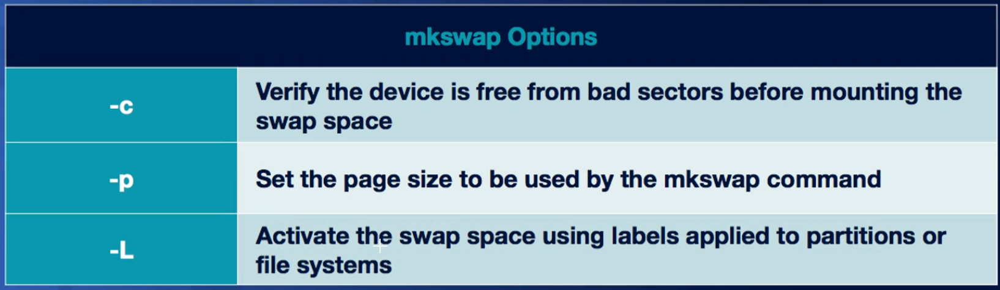

**swapon** options

**Applying changes in boot**

*Edit the the /etc/fstab file and set the type to swap*

### Creating swap space with existing disk

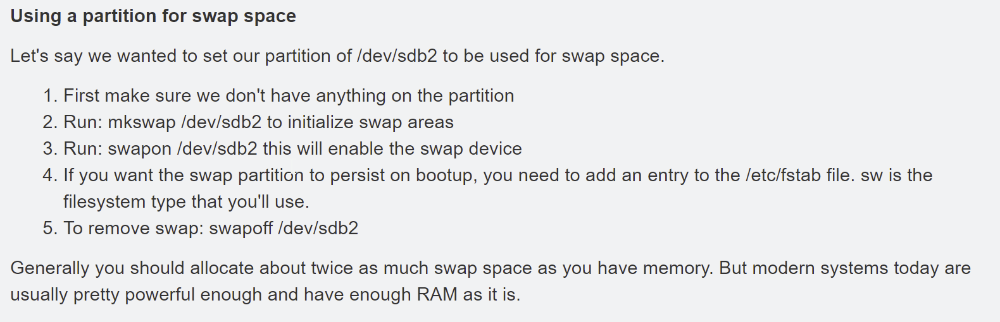

#### Partitioning the disk

***If you need to first create a swap partition before creating and
enabling the swap space, read below.***

In Linux, the dedicated area of the hard drive used for virtual memory
is known as swap space. We can create swap space by using the new disk
partitioning tools that we learned. A good guideline to use to determine
how much swap space you need is to follow the recommended partitioning
scheme in the next supplementary reading. In our case, since we just
have a USB drive which doesn't need swap, we're just going to partition
the rest of it as swap to show you how this works. In practice, you
would create swap partitions for your main storage devices like hard
drives and SSDs. Okay. Let's make swap space.

First, go back into the parted tool and select /dev/sdb, where our USB
is. We're going to partition it again this time to make a swap
partition. And then we'll format the Linux dash swap file system on it.

So, mkpart primary Linux swap 5 gibibytes 100 percent. You'll notice
that the end point of the drive says 100 percent which indicates that we
should use the rest of the free space on our drive.

 We're not done yet.
Swap isn't actually a file system, so this command won't be enough. I
know I'm sorry, I just lied to you like five seconds ago. If you think
about it, it makes a lot of sense since pages go into swap and not file
data. Anyways, to complete this process, we need to specify that we want
to make it swap space with the mkswap command. Let's quit out of parted
and run this command on a new swap partition. So, sudo mkswap dev, and
our new swap partition is on dev sdb2. Finally, there's one more command
to run to enable swap on the device, **swapon**. So, sudo **swapon** dev
sdb2. If we want to automatically mount swap space every time the
computer boots up, just add a swap entry to the /etc fstab file like we
did earlier.

**Turning swap off**

sudo swapoff \<device\>

Or..

**sudo swapoff -a**

^ turns off all swap off.

#### Preparing swap space

^ Assumes you already have a swap partition ready.

## User filesystems (fuse)

The Filesystem in USErspace (FUSE) is a software interface that lets
non-privileged users create their own file systems without editing the
underlying kernel's code. FUSE allows system administrators to define
how to read, write, and status requests are made to the file system.

> ***Nicholas, a system administrator at Dion Training, needs to specify
> how read, write, and status requests are made to the file system of a
> Linux server. Which of the following commands should be used to
> accomplish this?***

## Scanning, repairing, and Troubleshooting

### Filesystem Mismatch

***Rita, a system administrator at Dion Training, received an error
indicating that the filesystem size is 2 GB according to the superblock.
When Rita checks the physical size of the device, she notices it is only
1 GB in size. Which of the following filesystem errors is occurring?***

**Filesystem mismatch** occurs when the physical size of the device does
not equal the filesystem size reported by the superblock. Filesystem
mismatches often occur after a change to the filesystem or partition
size, if there is a filesystem misconfiguration, or if the storage disk
is damaged.

### View filesystem status/info (xfs\_...) \[xfs\]

### View block status/info (dumpe2fs) \[ext2/3\]

### Disk drive Error Scan (badblocks)

Could take a few secs or up to an hour or more but has very little
impact on system performance.

Save disk space with symbolic links!

If you have more than one partition and a file (say a lof file)
continues to overload partition A… delete that fle from partition A (or
compress and rename) and create a file on partition B to store that file
data. Then, create a symbolic link on partition a (of the original file
name) which points to the file on partition B. Data will stil be written
to the file on Partition A but the disk usage will go to the file on
Partition B.

### XFS Files system repair and scan

Used for xfs filesystems.

xfs_fsr

xfs_db

### EXT Filesystem Repair (fsck and e2fsck)

**<u>IMPORTANT: NEVER SCAN A MOUNTED DRIVE!!!</u>**

**<u>Steps</u>**

1.  **View all mounted drives**

    1.  df

    2.  df /dev/sda

        1.  *Note: This views a specific drive*

2.  **Unmount Disk**

    1.  unmount /dev/sda

3.  **Scan for errors (filesystem check - fsck)**

    1.  fsck /dev/sda/

4.  **Scan and repair errors**

    1.  fsck –p /dev/sda

    2.  

5.  **Mount disk**

    1.  mount /dev/sda /mnt/mydrive

    2.  *Or…*

    3.  mount a

        1.  *This mounts all unmounted devices*

To try and repair a file system manually in Linux you can also use the
fsck or file system check command.

Just make sure the file system isn't mounted. I won't run this command,
but this is what it would look like.

If you run fsck on a mounted partition, there's a high chance that it'll
damage the file system. File system repair isn't always a guaranteed
fix, but it can help in most cases. Just be nice to your hardware and it
will be nice to you, in most cases. Another thing to call out is that on
in some versions of Linux, fsck actually runs on your computer when you
boot it to check for any issues and attempt to auto-repair the file
system.

Note: You cannot unmount your root drive (whatever is mounted at
**‘/’**usually similar to **/dev/sda.** Use df command to view this). So
you would instead have to update the /etc/fstab to enable
scanning/reparing on boot (see next).

There’s a different version of fsck for each filesystem (just as with
mkfs) but fsck will auto-detect the fs in question so you can use the
single **fsk** command against any fs.

These more specific versions of fsck have more options available:

*This example is fsck.ext4*

### Scanning on Boot (tune2fs)

Will occur for each in the fstab (**cat /etc/fstab**) which has a pass
value set to 1 or two. Also checks if the max number of mounts has been
used first – if not it still won’t scan.

Check number of mounts on a device (df) with **tune2fs** (defaults to
-1)

Note: The **tune2fs** command is used to display or modify specific
metadata for an ext2/ext3/ext4 filesystem

We can change this (in this example, every 10mounts)

^ So now every 10 mounts the partition will be scanned for errors with
fsck.

This means we have to reboot 10 times before the partition is scanned.
Or we can speed this up

Now, on next boot it will scan and mount countwill reset to zero, and
change to ‘1’ after the initial mount.

You can also view/edit the /etc/fstab to check if a drive is enables for
scanning/repairing on boot.

[More at this bookmark in the
doc.](#automatic-partition-mounting-on-startup-using-fstab)
