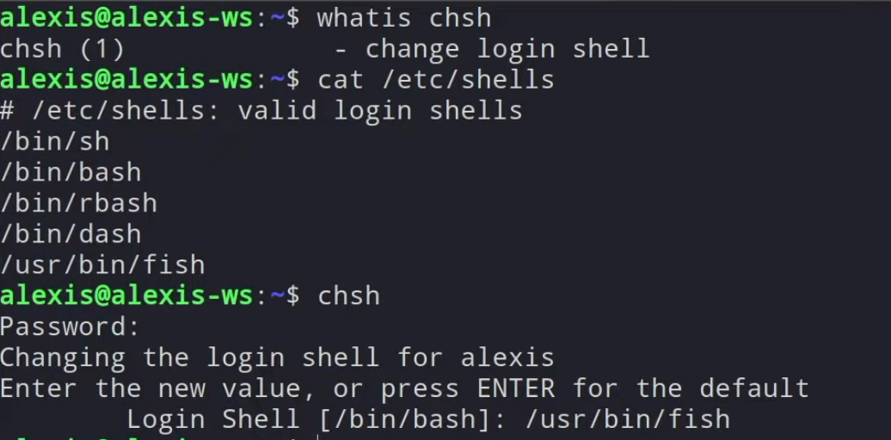
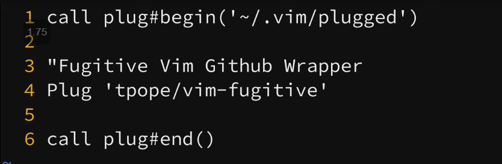

Shells, Startup files, and Text Editors

# Environment, Shell, and config

## Shell Variables vs. Environment Variables

- **Shell Variables (local – terminal session based):**

  - Cannot be used by child processes (like a bash script if It is
    exported in CLI)

  - Transient – contingent on a given shell session

  - ***Action***: When defining a variable as is.

- **Environment Variable (global – terminal session based):**

  - Can be used by child processes

  - Maintains its value for a given terminal – accessible for a given
    terminal login.

  - ***Action***: When defining a variable as is and exporting it (this
    adds changed to terminal log-in).

- **Persistent Environment Variable defined by Startup Files** **(boot
  based)**:

  - Persist not only across sessions and terminals but saved in a file
    to be the defaults at boot unless otherwise changed (either
    temporarily by changing the variable value or permanently when
    editing a startup file itself).

  - ***Action***: When editing startup file (see below).

    - *Usually editing the **.bashrc** file is all that’s needed to do.*

    - 

    - Then source it!

    - This is for a given user that the bashrc file is in (home dir). To
      persists across all users do the same in **/etc/environment**.

## **Startup files**

**From system-wide setings to local settings**

*Shows the order these load in*

**Settings files**

- Bash as login shell will
  load /etc/profile, ~/.bash_profile, ~/.bash_login, ~/.profile in the
  order

- Bash as non-login interactive shell will load ~/.bashrc

  - This file is loaded everything one logs in but can also be sourced
    to manually reload it.

- Bash as non-login non-interactive shell will load the configuration
  specified in environment variable $BASH_ENV

**Non-login sessions (more common)**

**Login sessions**

## **Interactive vs Login shell**

- Login Shell: Loads all config files one time and every subsequent time
  a terminal is opened only the .bashrc file is loaded.

  - This means if you make change to system-wide config file (like
    /etc/profile) you won’t notice the changes just by opening a new
    terminal. You actually need to log out/in which usual involves
    rebooting the system.

- Interactive Shell: All relevant config files are loaded every time a
  new terminal/session is initiated.

  - For example, SSH is an interactive shell.

More info: <https://youtu.be/-HqRDCYnUWQ?si=sNA7uDBa5xBn_qmp>

^ start at around 12min mark (or before).

## **Exporting variables from CLI to a shell script**

**Method 1: Export a defined variable:**

Because the first script exports, it will be exported to whatever script
is called (run) in script one.

**Method 2: Export a variable as we define it:**

$username was set in the shell environment (globally), not usable in the
script. We can export ‘username’ to the global environment so that the
script can use it, by giving it the value we set to $username in the CLI

## PS1 (prompt variable)

Easy: Check out prompt generators like **EzPrompt**

Customize prompt: Check out **man bash**

Color:

In some systems (RedHat at least) there will additionally be a
$PROMPT_COMMAND variable.

This is usually set in /etc/bashrc.

It can cause a double-up of the prompt sometimes.

Try echo $PROMPT_COMMAND to see if theres a value there and if so clear
it in your local bashrc file to prevent double up

PROMPT_COMMAND=

## SHELL variable

**Returns the shell type you are using (default)**

**View shell in use (found in passwd)**

**View all shells on your system**

Just type the binary name (example “sh” or “dash”) to change into that
shell. Doesn’t save this setting once logged out/in.

**To update default shell (maintains even after logout)**

## PATH variable

- /bin – usually coreitils and standard linux binaries.

- /usr/bin – usually uer installed software.

- /usr/local/bin – usually custom/user-created software.

^ Note how the specificity increases, and thus the latter more-specific
file are preferred.

Shell scripts are usually added to a more specific user dir: $HOME/bin
then that path is usually adde to the PATH environment variable.

The

This holds the default location where binaries will be searched. You can
add to this to include your own programs – or just create handy
functions and plug them in your bashrc file.

## Aliases

- nano ~/.bashrc

- Alias can be stored in .bashrc file (located in home dir –if not,
  create it#)

- For changes to take effect you must logout.in to re-source your
  .bashrc file – or force a source like so:

  - source ~/.bashrc

  - . ~/.bashrc Note: You can replace ‘source’ keyword with a full stop.

- *Note: Macs will use bash_profile and zshell uses ~/.zshrc*

- 

***Optional**: Create a file just for aliases and linux willdetect it
under **.bash_aliases (in user home folder)***

*Would still need to source:* source ~/.bash_aliases

## Shells

### tmux 

<https://www.hamvocke.com/blog/a-quick-and-easy-guide-to-tmux/>

<http://tmuxcheatsheet.com/>

<https://www.youtube.com/watch?v=Yl7NFenTgIo>

<https://www.youtube.com/watch?v=DzNmUNvnB04>

Open tmux terminal with **tmux** command

Tmux ls to list all windows

**<u>Sesssions</u>**

- Open tmux as a named session

  - tmux new -s \<name\>

- To detach a tmux session

  - Ctrl+b+d

- View tmux sessions (from cli)

  - tmux ls

- Re-attach to session (from cli)

  - tmux attach -t 0

  - *Where ‘0’ is your session id/name*

- Rename tmux sessions (from cli)

  - tmux rename-sesssion -t 0 \<name\>

  - *Where ‘0’ is your session id/name*

- Killing tmux sessions (from cli)

  - tmux kill-sesssion -t 0 \<name\>

  - *Where ‘0’ is your session id/name*

**<u>Module</u>**

Check out the TPM tmux modules to install plugins.

<https://github.com/tmux-plugins/tpm>

**<u>Catppuccin Theme</u>**

<https://github.com/catppuccin/tmux>

### zsh+ohmyzsh (zshell as an alternate shell)

<https://linuxhint.com/install_zsh_shell_ubuntu_1804/>

<https://youtu.be/njDuayF9Q6k>

<https://dev.to/abdfnx/oh-my-zsh-powerlevel10k-cool-terminal-1no0>

Install with **apt install zsh** and simple configuration with myzsh

<https://ohmyz.sh/>

sh -c "$(curl -fsSL
https://raw.githubusercontent.com/ohmyzsh/ohmyzsh/master/tools/install.sh)"

You may be prompted to change your default shell – but if not you can
use **chsh -s /usr/bin/zsh** or using **usermod**

**Powerlevel10k theme**

Not only does it look cool – but it also has a bunch of built-in handy
commands

<https://github.com/romkatv/powerlevel10k>

Choose manual or ohmyzsh instructions (manual preferred) – then make
sure to source your zshrc file when you’re done (**. ~/.zshrc** or
**source ~/.zshrc**)

On the first run, Powerlevel10k configuration wizard will ask you a few
questions and configure your prompt. If it doesn't trigger
automatically, type…

exec zsh

p10k configure

**Want to enable more features?**

Edit (and source) the **.p10k.zsh** file and uncomment what you want to
see.

**Not seeing diamond/lock icon?**

The problem is caused by your terminal using a font without powerline
glyphs. Might need to change the font your terminal is using.

From Powerlevel10k troubleshooting: [Icons, glyphs or powerline symbols
don't
render](https://github.com/romkatv/powerlevel10k/blob/master/README.md#icons-glyphs-or-powerline-symbols-dont-render):

Restart your terminal, [install the recommended
font](https://github.com/romkatv/powerlevel10k/blob/master/README.md#meslo-nerd-font-patched-for-powerlevel10k) and
run p10k configure.

Please try this. <u>Note that there is no point in trying other fonts.
Powerline symbols are either present in a font or missing. They are
present in the recommended font. If your terminal doesn't display
powerline glyphs, it's not using the recommended font.</u>

View link above (“install the recommended…”) for full instructions.

Install font on system, then select it from your terminal.

I’ve had success with WSL and the “MesloLGS NF” nerdfont, but I’ve heard
the “PL” variants of Cascadia work as well.

*<u>Note for WSL with Windows terminal</u>*: Sometimes, changing an
existing profile to use a newly installed font doesn’t help. However, if
you have just installed a proper font, try creating a new profile
altogether. Or even duplicating an existing profile, but making sure the
new font is selected when creating the dup.

**NerdFonts Easy installer:**

<https://github.com/ronniedroid/getnf>

Lunarvim requires “DroidSansMono” – which you can install from the Easy
installer or manually here: <https://www.nerdfonts.com/font-downloads>

**Add this to .p10k.zsh to remove warnings**

Standard output is verbose which slows down zsh

**Prevent command from writing to output**

Open .zshrc file

Source .zshrc

#### Glyphs, Icons, and Symbols

**Using glyphs**

Find more here: <https://www.nerdfonts.com/cheat-sheet>

Some icons don’t paste properly in a config file. Most with ‘nf-ple’ do.
Keep trying until you find ones that work. When you copy – click “copy
icon”.

**Git symbols**

#### Cli syntax highlighting

<https://github.com/zsh-users/zsh-syntax-highlighting/blob/master/INSTALL.md>

git clone https://github.com/zsh-users/zsh-syntax-highlighting.git

echo "source
${(q-)PWD}/zsh-syntax-highlighting/zsh-syntax-highlighting.zsh" \>\>
${ZDOTDIR:-$HOME}/.zshrc

^ make sure that stays at the bottom of your .zshrc file

### zsh + tmux

**Install [tpm](https://github.com/tmux-plugins/tpm) to handle tmux
plugins.**

<https://github.com/tmux-plugins/tpm>

**Quick Install**

git clone https://github.com/tmux-plugins/tpm ~/.tmux/plugins/tpm

**Edit ~/.tmux.conf and put this at the bottom.**

\# List of plugins

set -g @plugin 'tmux-plugins/tpm'

set -g @plugin 'tmux-plugins/tmux-sensible'

\# Other examples:

\# set -g @plugin 'github_username/plugin_name'

\# set -g @plugin 'git@github.com:user/plugin'

\# set -g @plugin 'git@bitbucket.com:user/plugin'

\# maintain colors

set -g default-terminal "screen-256color"

set -g default-terminal "tmux-256color"

set -ga terminal-overrides ",\*256col\*:Tc"

set -ga terminal-overrides '\*:Ss=\E\[%p1%d q:Se=\E\[ q'

set-environment -g COLORTERM "truecolor"

\# Use powerline theme for tmux status bar │

\# Initialize TMUX plugin manager (keep this line at the very bottom of
tmux.conf)

run '~/.tmux/plugins/tpm/tpm'

**Reload tmux environment**

\# type this in terminal if tmux is already running

tmux source ~/.tmux.conf

**Restart tmux server**

tmux kill-server && tmux

#### See which colors are available on your system

for i in {0..255}; do print -Pn "%K{$i} %k%F{$i}${(l:3::0:)i}%f "
${${(M)$((i%6)):#3}:+$'\n'}; done

#### Customize tmux status bar

Add below to .tmux.conf file and source within tmux using tmux source
~/.tmux.conf

\# === Use powerline for tmux status bar ===

\# Set status bar on

set -g status on

\# Update the status line every second

set -g status-interval 1

\# Set the position of window lists.

set -g status-justify centre \# \[left | centre | right\]

\# Set Vi style keybinding in the status line

set -g status-keys vi

\# Set the status bar position

set -g status-position top \# \[top, bottom\]

\# Set status bar background and foreground color.

set -g status-style fg=colour136,bg="#002b36"

\# Set left side status bar length and style

set -g status-left-length 60

set -g status-left-style default

\# Display the session name

set -g status-left "#\[fg=green\] ❐ \#S \#\[default\]"

\# Display the os version (Ubuntu)

set -ag status-left " \#\[fg=black\] \#\[fg=green,bright\]  \#(sw_vers
-productVersion) \#\[default\]"

\# Display the battery percentage (Ubuntu)

set -ag status-left "#\[fg=green,bg=default,bright\] 🔋 \#(pmset -g batt
| tail -1 | awk '{print $3}' | tr -d ';') \#\[default\]"

\# Set right side status bar length and style

set -g status-right-length 140

set -g status-right-style default

\# Display the cpu load (Mac OS)

set -g status-right "#\[fg=green,bg=default,bright\]  \#(top -l 1 |
grep -E "^CPU" | sed 's/.\*://') \#\[default\]"

\# Display the date

set -ag status-right "#\[fg=white,bg=default\]  %a %d \#\[default\]"

\# Display the time

set -ag status-right "#\[fg=colour172,bright,bg=default\] ⌚︎%l:%M %p
\#\[default\]"

\# Display the hostname

set -ag status-right "#\[fg=cyan,bg=default\] ☠ \#H \#\[default\]"

\# Set the inactive window color and style

set -g window-status-style fg=colour244,bg=default

set -g window-status-format ' \#I \#W '

\# Set the active window color and style

set -g window-status-current-style fg=black,bg=colour136

set -g window-status-current-format ' \#I \#W '

#### getting font to work on putty

Not a guarantee this will work – but kinda:
<https://serverfault.com/questions/1048795/putty-not-showing-some-utf-8-characters>

#### Useful Shortcuts

# Text Editors

## Vim – text editor

<https://vimsheet.com/>

<https://www.youtube.com/watch?v=-txKSRn0qeA>

Tuts:

- 1HR \>

  - <https://www.youtube.com/watch?v=RZ4p-saaQkc>

- 15M \<

  - \[GoodOverall\] <https://www.youtube.com/watch?v=zE0hno3vV9M>

  - 

> <https://www.youtube.com/watch?v=-txKSRn0qeA&t=296s>

- <https://www.youtube.com/watch?v=FrMRyXtiJkc>

- <https://www.youtube.com/watch?v=ggSyF1SVFr4>

- <https://www.youtube.com/watch?v=1UXHsCT18wE>

More + neovim

<https://www.youtube.com/watch?v=RZ4p-saaQk>

<https://www.youtube.com/watch?v=5r6yzFEXajQ>

<https://www.youtube.com/watch?v=FrMRyXtiJkc>

<https://www.youtube.com/watch?v=JWReY93Vl6g>

<https://www.youtube.com/watch?v=qZO9A5F6BZs>

<https://www.youtube.com/watch?v=uL9oOZStezw>

<https://www.youtube.com/watch?v=KfENDDEpCsI>

<https://youtu.be/Mtgo-nP_r8Y>

<https://www.youtube.com/watch?v=6VbOLOuiHUI&t=3s>

<https://youtu.be/f5-XZadSFBc>

NeoVimWindows: <https://www.youtube.com/watch?v=XBlKG2LW6p4>

Vim initializes in command mode. Enter insert mod with ‘i’

Return to command mode by pressing ESC

Run program with :!...

**Global search and replace:**

:%s – command

Then just add a replace regex

Full example (replace ‘bob’ with ‘joe’)

:%s/bob/joe/g

### Registers

### Using the system clipboard

- "+y copy a selection to the system clipboard

- "+p paste from the system clipboard

  - If this doesn’t work, it’s probably because Vim was not built with
    the system clipboard option. To check, run vim --version and see
    if +clipboard exists. If it says -clipboard, you will not be able to
    copy from outside of Vim.

    - For Mac users, homebrew install Vim with the clipboard option.
      Install homebrew and then run brew install vim.

      - then move the old Vim binary: $ mv /usr/bin/vim /usr/bin/vimold

      - restart your terminal and you should see vim --version now
        with +clipboard

**------------------------------------------------------------------------------------------------------------------------------------------**

**Below taken from this article:**
<https://advancedweb.hu/working-with-the-system-clipboard-in-vim/#:~:text=Check%20the%20clipboard%20support%20of,you%20are%20good%20to%20go>.

If you use Vim as your primary editor, the most convenient way to copy
around is to yank text directly to the system clipboard.

Living in the 21st century, you are most likely accustomed to the fact
that there is only one clipboard to store the stuff that you Ctrl + c.
This is not the case in Vim. Vim has multiple registers where you can
store information separately. Each register has a unique identifier.
That identifier has to be referred when you wish to store or retrieve
information:

- "\<register id\>y: yank (copy) to register

- "\<register id\>p: paste from register

For example, paste to, then copy from the r register with "ry then "rp.

We write articles like this regularly. Join our mailing list and let's
keep in touch.

Top of Form

Bottom of Form

Conveniently Vim allows to omit the " and the register identifier, so
you can simply use y and p. In these cases, the data will be accessed
from the default (0) register.

For our purposes, we need the + register, as it is special in the sense
that it’s associated with the system clipboard. The content yanked to it
will be accessible to other applications. Similarly, you can use it to
paste text copied to the clipboard by other applications.

To work with it, essentially you have two options:

- Set the + register as the default: :set clipboard=unnamedplus. After
  this, every time you simply y or p, Vim will use the system clipboard.

- Yank to the system clipboard explicitly only when you need it
  with "+y, and paste from it with "+p.

There is one caveat though, Vim has to be compiled with clipboard
support for this to work, and many distros come with vim package that
does not have this feature.

Check the clipboard support of your Vim with vim --version and look for
the +clipboard or +xterm_clipboard flags.

If you see either of those, then your Vim supports the access to system
clipboard and you are good to go. If not, you better look for an
alternative package, like vim-gtk on Debian or vim-X11 on Red Hat Linux.
Check out
this [VimTip](http://vim.wikia.com/wiki/Accessing_the_system_clipboard) for
more info on this topic.

#### Plan B: Pasting from system clipboard using insert mode

If you are stuck with a version that does not come with this feature you
still have some options.

***<u>Pasting</u>***

The pasting part is pretty trivial: just jump into insert mode and
press Shift + Insert. If you are inserting source code, it might worth
enabling paste mode with :set paste to preserve indentation. (You can
disable paste mode with :set nopaste later.)

In command mode enter: set paste

Then enter insert mode and: Ctrl+Shift+V

***<u>Copying</u>***

Copying can be a bit trickier as Vim might try to handle the mouse on
its own. Most terminal emulators have the option to capture mouse
interactions rather than passing it to the running application. You can
take advantage of that to copy a piece of text.

For example with *Konsole* simply hold down the Shift key then select
and copy the text from the terminal, as you would normally do. Of
course, if you didn’t enable mouse support, then you can simply copy
text from the terminal as usual.

As a last resort, you can use :!cat % to pipe the currently edited file
to *cat*, displaying it entirely outside of vim. In this case, it’s easy
to copy multiple pages as well.

### Pattern matching and regex

<https://vimregex.com/>

<https://vim.fandom.com/wiki/Search_and_replace>

### Adding custom colors

<https://linuxhint.com/best_vim_color_schemes/>

Download this

<https://raw.githubusercontent.com/crusoexia/vim-monokai/master/colors/monokai.vim>

save into ~/.vim/colors/

Then set color with **colorscheme monokai**

**catpuccin colors**

<https://github.com/catppuccin/vim/tree/main>

### Plugins

#### Builtin-plugin manager (Vim 8.0 +)

**:set packpath** – to view package path

To remove a plugin just remove the dir.

^ plugins placed im a start dir will auto-load when vim starts. Ones in
an opt dir won’t.

To add a plugin just clone the repo

#### Third-Party: Vim-plug

Install vim-plug as your plugin manager:
<https://github.com/junegunn/vim-plug>

In your .vimrc config file add **“call”** lines to wrap your plugins and
add plugins with “Plug \<repo\>”

:PlugInstall to install plugins.

**<u>Removing Plugins</u>**

Remove (or comment) from configuration file and run :PlugClean

Reload .vimrc :so % (or just close/re-open).

***Alternatively***, you can create a plug file (~/.vimrc.plug), place
this in there, and call (source) this plug file when loading ~/.vimrc

Add plugins to your plug file but this time pass in the path to your
plug file in you **begin** function:

### Command list

In regular mode, enter “ZZ” to save and quit.

Below you can see some of the most important **vi** commands.

**Starting, Exiting, Reading and Writing Files in vi**

<table>
<colgroup>
<col style="width: 28%" />
<col style="width: 71%" />
</colgroup>
<thead>
<tr>
<th><strong>Command</strong></th>
<th><strong>Description</strong></th>
</tr>
</thead>
<tbody>
<tr>
<td><strong>vi myfile</strong></td>
<td>Start <strong>vi</strong> and edit <strong>myfile</strong></td>
</tr>
<tr>
<td><strong>vi -r myfile</strong></td>
<td>Start <strong>vi</strong> and edit <strong>myfile</strong> in
recovery mode from a system crash</td>
</tr>
<tr>
<td><strong>:r file2&lt;RET&gt;</strong></td>
<td>Read in <strong>file2</strong> and insert at current position</td>
</tr>
<tr>
<td><strong>:w&lt;RET&gt;</strong></td>
<td>Write out the file</td>
</tr>
<tr>
<td><strong>:w myfile&lt;RET&gt;</strong></td>
<td>Write out the file to <strong>myfile</strong></td>
</tr>
<tr>
<td><strong>:w! file2&lt;RET&gt;</strong></td>
<td>Overwrite <strong>file2</strong></td>
</tr>
<tr>
<td><strong>:x&lt;RET&gt; or :wq&lt;RET&gt;</strong></td>
<td>Exit <strong>vi</strong> and write out modified file</td>
</tr>
<tr>
<td><strong>:q&lt;RET&gt;</strong></td>
<td>Quit <strong>vi</strong></td>
</tr>
<tr>
<td><strong>:q!&lt;RET&gt;</strong></td>
<td>Quit <strong>vi</strong> even though modifications have not been
saved</td>
</tr>
</tbody>
</table>

**Changing Position in vi**

<table>
<colgroup>
<col style="width: 27%" />
<col style="width: 72%" />
</colgroup>
<thead>
<tr>
<th><strong>Command</strong></th>
<th><strong>Description</strong></th>
</tr>
</thead>
<tbody>
<tr>
<td>arrow keys</td>
<td>Use the arrow keys for up, down, left and right; or:</td>
</tr>
<tr>
<td><strong>j</strong> or <strong>&lt;RET&gt;</strong></td>
<td>One line down</td>
</tr>
<tr>
<td><strong>k</strong></td>
<td>One line up</td>
</tr>
<tr>
<td><strong>h</strong> or Backspace</td>
<td>One character left</td>
</tr>
<tr>
<td><strong>l</strong> or Space</td>
<td>One character right</td>
</tr>
<tr>
<td><strong>0</strong></td>
<td>Move to beginning of line</td>
</tr>
<tr>
<td><strong>$</strong></td>
<td>Move to end of line</td>
</tr>
<tr>
<td><strong>w</strong></td>
<td>Move to beginning of next word</td>
</tr>
<tr>
<td><strong>b</strong></td>
<td>Move back to beginning of preceding word</td>
</tr>
<tr>
<td><strong>:0 &lt;RET&gt;</strong> or <strong>1G</strong></td>
<td>Move to beginning of file</td>
</tr>
<tr>
<td><strong>:n &lt;RET&gt;</strong> or <strong>nG</strong></td>
<td>Move to line n</td>
</tr>
<tr>
<td><strong>:$ &lt;RET&gt;</strong> or <strong>G</strong></td>
<td>Move to last line in file</td>
</tr>
<tr>
<td><strong>^f</strong> or <strong>PageDown</strong></td>
<td>Move forward one page</td>
</tr>
<tr>
<td><strong>^b</strong> or <strong>PageUp</strong></td>
<td>Move backward one page</td>
</tr>
<tr>
<td><strong>^l</strong></td>
<td>Refresh and center screen</td>
</tr>
</tbody>
</table>

**Searching for Text in vi**

<table>
<colgroup>
<col style="width: 27%" />
<col style="width: 72%" />
</colgroup>
<thead>
<tr>
<th><strong>Command</strong></th>
<th><strong>Description</strong></th>
</tr>
</thead>
<tbody>
<tr>
<td><strong>/pattern&lt;RET&gt;</strong></td>
<td>Search forward for pattern</td>
</tr>
<tr>
<td><strong>n</strong></td>
<td>Move to next occurrence of search pattern</td>
</tr>
<tr>
<td><strong>string&lt;RET&gt;</strong></td>
<td>Search backward for pattern</td>
</tr>
<tr>
<td><strong>N</strong></td>
<td>Move to previous occurrence of search pattern</td>
</tr>
</tbody>
</table>

**Changing, Adding and Deleting Text in vi**

<table>
<colgroup>
<col style="width: 17%" />
<col style="width: 82%" />
</colgroup>
<thead>
<tr>
<th><strong>Command</strong></th>
<th><strong>Description</strong></th>
</tr>
</thead>
<tbody>
<tr>
<td><strong>a</strong></td>
<td>Append text after cursor; stop upon <strong>Escape</strong> key</td>
</tr>
<tr>
<td><strong>A</strong></td>
<td>Append text at end of current line; stop upon
<strong>Escape</strong> key</td>
</tr>
<tr>
<td><strong>i</strong></td>
<td>Insert text before cursor; stop upon <strong>Escape</strong>
key</td>
</tr>
<tr>
<td><strong>I</strong></td>
<td>Insert text at beginning of current line; stop upon
<strong>Escape</strong> key</td>
</tr>
<tr>
<td><strong>o</strong></td>
<td>Start a new line below current line, insert text there; stop upon
<strong>Escape</strong> key</td>
</tr>
<tr>
<td><strong>O</strong></td>
<td>Start a new line above current line, insert text there; stop upon
<strong>Escape</strong> key</td>
</tr>
<tr>
<td><strong>r</strong></td>
<td>Replace character at current position</td>
</tr>
<tr>
<td><strong>R</strong></td>
<td>Replace text starting with current position; stop upon
<strong>Escape</strong> key</td>
</tr>
<tr>
<td><strong>x</strong></td>
<td>Delete character at current position</td>
</tr>
<tr>
<td><strong>Nx</strong></td>
<td>Delete <strong>N</strong> characters, starting at current
position</td>
</tr>
<tr>
<td><strong>dw</strong></td>
<td>Delete the word at the current position</td>
</tr>
<tr>
<td><strong>D</strong></td>
<td>Delete the rest of the current line</td>
</tr>
<tr>
<td><strong>dd</strong></td>
<td>Delete the current line</td>
</tr>
<tr>
<td><strong>Ndd</strong> or <strong>dNd</strong></td>
<td>Delete N lines</td>
</tr>
<tr>
<td><strong>u</strong></td>
<td>Undo the previous operation</td>
</tr>
<tr>
<td><strong>yy</strong></td>
<td>Yank (cut) the current line and put it in buffer</td>
</tr>
<tr>
<td><strong>Nyy</strong> or <strong>yNy</strong></td>
<td>Yank (cut) N lines and put it in buffer</td>
</tr>
<tr>
<td><strong>p</strong></td>
<td>Paste at the current position the yanked line or lines from the
buffer</td>
</tr>
</tbody>
</table>

## NeoVim

**<u>Setup Tuts:</u>**

- <https://www.youtube.com/watch?v=JWReY93Vl6g>

- <https://www.youtube.com/watch?v=c4OyfL5o7DU>

- <https://www.youtube.com/watch?v=XBlKG2LW6p4>

## Getting Started with Neovim

To get started, you’ll need to install the Neovim package.

### Pre-Install

Backup any existing configs

Delete any nvim caches

### Install Neovim

**Docs:** <https://nvchad.com/docs/quickstart/install>

**Git**: <https://github.com/NvChad/NvChad>

**Article**:
<https://mattermost.com/blog/how-to-install-and-set-up-neovim-for-code-editing/>

**FullVid Tutorial (best):**
<https://www.youtube.com/watch?v=vdn_pKJUda8>

There are several different ways to install Neovim on your system,
depending on which OS you run. Windows, macOS, and Linux all have
pre-built [packages](https://github.com/neovim/neovim/releases/tag/v0.6.0) that
you can download and run directly. Other options include [installing
Neovim via your package
manager](https://github.com/neovim/neovim/wiki/Installing-Neovim#install-from-package) or
even [building it directly from the
source](https://github.com/neovim/neovim/wiki/Building-Neovim). This
tutorial will use the pre-built package for the latest release.

Go to the Releases page on GitHub and grab the [latest
release](https://github.com/neovim/neovim/releases/latest) of Neovim for
your operating system (v0.6.0 at the time of this writing). Download the
archive file and save it to your machine. On Linux, you can save the
Neovim AppImage to the folder of your choice with the following command:

$ cd ~ && wget

https://github.com/neovim/neovim/releases/download/v0.6.0/nvim.appimage

Once you’ve downloaded the file, you’ll need to extract the contents
using your file manager or by running a shell command like tar xzvf
name-of-file.tar.gz. If you’re using the AppImage and have FUSE
installed on your system, you won’t need to extract the file. But you
will need to modify the file permissions:

$ chmod u+x nvim.appimage

Now that you have Neovim installed, you can run it by either clicking
the executable file or prepending a dot slash to the location of the
binary:

$ ./nvim.appimage

**The author has aliased this command to **nvim** to improve readability
throughout the rest of the tutorial. **You can learn about setting up
and configuring
aliases [here](https://www.tecmint.com/create-alias-in-linux/).

One of the things that makes Neovim so powerfully extensible is direct
integration with the Lua programming language. Lua is embedded inside
Neovim itself, offering power users direct access to the scripting
language’s capabilities without forcing them to download any external
dependencies.

You can get started writing Lua by simply opening up an empty Neovim
buffer. Then, you’ll want to enter command mode by pressing the colon
character (i.e., :). There, you’ll type lua followed by the command you
want to execute. 

Try executing the command :lua print("Hello, world!"). The output should
be rendered at the bottom of your screen. Again, you didn’t need to
install Lua yourself in order to execute this code. The just-in-time
compiler ([LuaJIT](https://luajit.org/)) comes bundled with this version
of Neovim, so as long as you’re calling Lua code inside a Neovim buffer,
it should execute without any trouble.

### Learning the Basics

If you’ve never used Vim, Neovim, or Lua before, then you might want to
check out the following guides:

- [Learn Vim in Y Minutes](https://learnxinyminutes.com/docs/vim/): This
  tutorial will quickly walk you through the basics of using Vim (and
  therefore Neovim). You’ll learn how to exit Vim (a frustrating task
  for many a developer), how to navigate using the Vim keys, how to
  toggle between different modes, and how to actually edit text.
  Everything that you learn in this tutorial will translate directly to
  your usage of Neovim.

- [Learn Lua in Y Minutes](https://learnxinyminutes.com/docs/lua/):
  Likewise, this tutorial will introduce the syntax for the Lua
  programming language. You’ll learn how to set variables, work with
  different data types (like strings, numbers, and bools), structure
  conditional statements, define functions, and aggregate data in a Lua
  table.

### Configuration

Now that you’ve got Neovim running and you have a basic understanding of
the Lua scripting language, it’s time to start customizing your config
files.

Many tutorials that have been written so far are geared towards users
who are new to Neovim but have used Vim in the past. In other words, a
lot of tutorials show how to transition one’s configuration from the
Vimscript file init.vim to the Neovim file init.lua.

Note: config/nvim/init.vim is the same as your vimrc file.

That’s not what we’re going to do here! 

Instead, we’re going to take advantage of Lua’s position as a
first-class language inside Neovim and build config files using this
language from the start. The reader will get a better understanding of
what they’ll find in the init.vim file, and the process they need to
take to convert this to init.lua. They’ll configure line numbers,
terminal colors, whitespace, custom keybinds, and more.

#### Config directory tree

#### Vim-Plug: Adding plugins using vim.init config file

Install vim-plug as your plugin manager:
<https://github.com/junegunn/vim-plug>

In your vim.init config file add **“call”** lines to wrap your plugins
and add plugins with “Plug \<repo\>”

:PlugInstall to install plugins.

**<u>Removing Plugins</u>**

Remove (or comment) from configuration file and run :PlugClean

Reload vim.init file with: nvim ~/.config/nvim/init.vm

##### Adding key bindings

#### Create a configuration file

Neovim expects to find configuration files under the hidden
directory ~/.config/nvim/ or ~/AppData/Local/nvim/, depending on your
operating system. If this folder does not exist, go ahead and create it
now. On Linux, you’d run the following command:

mkdir ~/.config/nvim

Your base configuration file is going to be init.lua. Create this file
in your Neovim configuration directory. You can use the following code
block as a skeleton to get started:

--\[\[ init.lua \]\]

-- LEADER

-- These keybindings need to be defined before the first /

-- is called; otherwise, it will default to "\\

vim.g.mapleader = ","

vim.g.localleader = "\\"

-- IMPORTS

-- require('vars') -- Variables

-- require('opts') -- Options

-- require('keys') -- Keymaps

-- require('plug') -- Plugins

Move it into your configuration directory, which should now look like
this:

tree ~/.config/nvim

Then, open the file in Neovim by calling nvim and passing in the path to
the file:

nvim ~/.config/nvim/init.lua

The first thing you’ll see is a section titled LEADER. Here,
two **leader** keys are defined. You can use them to create personalized
shortcuts by binding keys to custom commands. Feel free to change these
values to whatever you’d like by replacing the character inside the
string.

The next section is titled IMPORTS. These are other Lua files that
Neovim will initialize whenever you run the program. Separating your
code out into modular files is a good way to improve readability by
compartmentalizing functionality into discrete chunks. That way, you can
maintain all of your keybindings at once without getting bogged down in
plugin configuration, for example.

Call the Vim API

Neovim integrates extremely well with existing Vim functionality. The
core development team has often stressed that the goal of Neovim
is *not* to displace Vim but to offer a fork of Vim that’s more focused
on modern UI elements and extensibility. 

As a result, you’ll find that Neovim is capable of playing well with Vim
in many ways. This allows you to quickly bootstrap your Lua
configuration without having to implement that functionality yourself.

To do this, you’ll need to access the global vim variable. This acts as
the entry point for calling Neovim functions directly in Lua.

In particular, the vim.api module allows you to control the
configuration of your editor without writing a single line of Vimscript.

- **vim.api.nvim_set_var** to set internal variables.

- **vim.api.nvim_set_option** to set options.

- **vim.api.nvim_set_keymap** to set key mappings.

#### Set internal variables

You can use vim.api.nvim_set_var to set internal variables. You may have
noticed two of these sets already if you’re using the
skeleton init.lua file:

vim.g.mapleader = ","

vim.g.localleader = "\\"

These lines of code set two global variables,
the \<leader\> and \<localleader\> keys, to the comma and the backslash,
respectively. These mappings allow you to set a prefix key that, when
pressed, will activate a set of mappings that you can use to quickly run
certain commands. 

Your leader key will work across all files you edit in Neovim, whereas
the local leader key will be for a specific file type — like a Python
file or a Bash script. It’s a good idea to set these[ leader
keys](https://learnvimscriptthehardway.stevelosh.com/chapters/06.html) before
any other variables to ensure that they’re mapped correctly and are
ready to work with any plugins you install.

Note that here you called vim.g instead of vim.api.nvim_set_var. That’s
because Neovim offers a helpful set of **meta-accessors** that you can
use to reduce the amount of code contained in your file. Some of the
available meta-accessors for the vim.api.nvim_set_var command are as
follows:

- vim.g: maps to vim.api.nvim_set_var; sets global variables.

- vim.o: maps to vim.api.nvim_win_set_var; sets variables scoped to a
  given window.

- vim.b; maps to vim.api.nvim_buf_set_var; sets variables scoped to a
  given buffer.

The API also exposes other functions to get or delete the value of a
variable. To access these functions, you would replace the set in the
above commands with get and del, respectively. You can confirm that
these values are set by running a Lua command in an open Neovim buffer.
Press the colon to enter command mode, then tell Neovim to print the
current value of the leader key:

:lua print(vim.api.nvim_get_var('mapleader'))

The character you assigned as the leader key should be displayed beneath
the statusline.

Let’s use Lua to set one or two more global variables for this
configuration. In addition to your init.lua file, Neovim will also look
for any files that are included in the /lua subdirectory. All code
contained in this subfolder is part of your **runtimepath** and can be
imported for use in Neovim with the command require('name-of-file').

Lua modules are found inside a /lua folder in your ’runtimepath’ (for
most users, this will mean ~/.config/nvim/lua on \*nix systems
and ~/AppData/Local/nvim/lua on Windows). You can require() files in
this folder as Lua modules.

Create a new /lua directory inside of your Neovim directory, and add a
file named vars.lua:

mkdir ~/.config/nvim/lua && touch ~/.config/nvim/lua/vars.lua

Open this file in Neovim and add the following lines of code:

--\[\[ vars.lua \]\]

local g = vim.g

g.t_co = 256

g.background = "dark"

The first line further reduces the amount of code you have to write by
aliasing the vim.g meta-accessor to a local Lua variable, *g*. The
second line sets the global variable t_co to 256, enabling support for
256 colors in whichever terminal emulator you’re using to run Neovim.
The final line sets the global variable background to tell Neovim
whether your terminal background will use dark or light mode. These
variables may come in handy when you’re solidifying your theme.

Save the file, then go back to your init.lua file and uncomment the line
that imports this module:

-- IMPORTS

require('vars') -- Variables: UNCOMMENT THIS LINE

-- require('opts') -- Options

-- require('keys') -- Keymaps

-- require('plug') -- Plugins

Note that you don’t need to include the .lua file extension when you’re
specifying the module to import. Now, whenever you run Neovim, it will
load all code in the lua/vars.lua file into your runtime environment.
You can confirm that the variables you defined in this file are indeed
accessible globally by running :lua
print(vim.api.nvim_get_var('t_co')) and :lua
print(vim.api.nvim_get_var('background')) in command mode.

To learn more about a given variable, you can run the command :help
name-of-variable in command mode. If it’s available, Neovim will point
you to the relevant section in the docs for more information on what
that variable means and what values you can assign to it.

You’ll set more variables as you start to install new plugins and
configure their functionality to work across all file types.

Set options to customize your experience 

This is where you’ll really start to see your configuration take shape.
You’ll spend most of your time setting options to tell Neovim how you
want your development environment to operate both functionally and
aesthetically. For instance, options allow you to determine settings for
whitespace, line numbers, search functionality, file encodings, and
more.

Like variables, you can set options in Lua by using the Neovim API. Here
are some of the functions and meta-accessors that are available to you:

- vim.o: maps to vim.api.nvim_set_option; equivalent to :set.

- vim.go: maps to vim.api.nvim_set_option; equivalent to :setglobal.

- vim.bo; maps to vim.api.nvim_buf_set_option; equivalent
  to :setlocal for buffer options.

- vim.wo: maps to vim.api.nvim_win_set_option; equivalent
  to :setlocal for window options.

The API also exposes related functions to get the value of an option; to
access them, you can replace set in the above commands with get.

Let’s set some global options for Neovim. Inside the /lua directory, add
a file named opts.lua:

touch ~/.config/nvim/lua/opts.lua

Open the file and configure the following options:

--\[\[ opts.lua \]\]

local opt = vim.opt

-- \[\[ Context \]\]

opt.colorcolumn = '80' -- str: Show col for max line length

opt.number = true -- bool: Show line numbers

opt.relativenumber = true -- bool: Show relative line numbers

opt.scrolloff = 4 -- int: Min num lines of context

opt.signcolumn = "yes" -- str: Show the sign column

-- \[\[ Filetypes \]\]

opt.encoding = 'utf8' -- str: String encoding to use

opt.fileencoding = 'utf8' -- str: File encoding to use

-- \[\[ Theme \]\]

opt.syntax = "ON" -- str: Allow syntax highlighting

opt.termguicolors = true -- bool: If term supports ui color then enable

-- \[\[ Search \]\]

opt.ignorecase = true -- bool: Ignore case in search patterns

opt.smartcase = true -- bool: Override ignorecase if search contains
capitals

opt.incsearch = true -- bool: Use incremental search

opt.hlsearch = false -- bool: Highlight search matches

-- \[\[ Whitespace \]\]

opt.expandtab = true -- bool: Use spaces instead of tabs

opt.shiftwidth = 4 -- num: Size of an indent

opt.softtabstop = 4 -- num: Number of spaces tabs count for in insert
mode

opt.tabstop = 4 -- num: Number of spaces tabs count for

-- \[\[ Splits \]\]

opt.splitright = true -- bool: Place new window to right of current one

opt.splitbelow = true -- bool: Place new window below the current one

First, we’ve set a local variable opt so that we don’t have to
type vim.opt for each option we want to set. Then, we define a section
to group settings together. Organizing your config in this way will help
you maintain your custom environment, as it’s easy to see the settings
that each section is responsible for.

The first group, **Context**, defines options for how your lines render
to the screen. Some of the options it sets are a visual indicator for
the max number of characters you want on a line, as well as line numbers
relative to the position of your cursor.

The **Filetypes** group configures Unicode compatibility, whereas
the **Theme** group sets options that are related to Neovim’s look and
feel. This section will expand as you continue to specify the desired
aesthetics you want your installation of Neovim to have.

The last three sections configure basic functionality for handling
whitespace, optimizing search, and splitting the screen in a more
intuitive fashion.

Feel free to change any (or all!) of these settings and omit those you
don’t want. The point of configuring Neovim with Lua is
to *customize* *your own personal development environment* and make it
perfect for your own needs. The options shown here are simply a few
ideas to get started with.

Once your options file is configured to your liking (for now, don’t
worry — you’ll be making changes to all these files as you continue to
expand on your configuration in the future), you can go back to
your init.lua skeleton file and uncomment its line so that Neovim knows
to import the module:

-- IMPORTS

require('vars') -- Variables

require('opts') -- Options: UNCOMMENT THIS LINE

-- require('keys') -- Keymaps

-- require('plug') -- Plugins

As always, you can confirm that Neovim is importing your file correctly
by printing one of the options in command mode.

If you’re ever confused about what a particular option is, you can run
the command :help name-of-option in command mode. If it’s available,
Neovim will point you to the relevant section in the docs for more
information on what that option is and what values you can give to it.

Set key mappings to improve productivity

Vim is loved by developers, system administrators, and others who may
spend most of their days in the terminal. For such individuals,
productivity and efficiency can increase when your fingers leave the
keyboard as little as possible.

The Vim keybindings ensure that you don’t need to reach for the mouse
every few seconds to change something on your screen. However, sometimes
the default keymaps are a bit unintuitive or require you to stretch your
fingers farther than you’d like. 

For example, to return to normal mode from insert mode, you have to
press the ESCAPE key — which, though not as far away as the mouse might
be, is still quite a bit of a reach!

Thankfully, it’s easy to define your own custom keybindings — even ones
that override Neovim’s default functionality. Let’s remap the ESCAPE key
to something a bit more intuitive, like “jk”. In the /lua directory, run
Neovim with a new filename, keys.lua:

nvim keys.lua

Your file should contain the following lines of code:

--\[\[ keys.lua \]\]

local map = vim.api.nvim_set_keymap

-- remap the key used to leave insert mode

map('i', 'jk', '', {})

Just like with settings options and variables, you call out to the
Neovim API in order to set keybindings from Lua. The function you need
to access is vim.api.nvim_set_keymap, which has been assigned to the
local variable map here.

This function takes in four parameters:

1.  **mode**: the mode you want the key bind to apply to (e.g., insert
    mode, normal mode, command mode, visual mode).

2.  **sequence**: the sequence of keys to press.

3.  **command**: the command you want the keypresses to execute.

4.  **options**: an optional Lua table of options to configure (e.g.,
    silent or noremap).

In the code block above, the defined keymapping is available in *insert
mode*. The *sequence* of keys to press is ‘jk’, and this will call
the *escape command* (returning you to normal mode). There are no
additional options configured here. But you’ll still need to pass in
curly braces to signify an empty table.

If you save the file and try to use your new keybinding straight away,
you might notice that it doesn’t work. That’s because you’ll usually
need to **refresh** your Neovim buffer before any configuration changes
will take effect. You won’t need to close the file and open a new Neovim
instance (although this would work as well). Instead, you can
simply **source** the current file from command mode by calling :luafile
% .

Now, your keymapping should work!

Don’t forget to uncomment the line that imports this new module in your
init file:

-- IMPORTS

require('vars') -- Variables

require('opts') -- Options

require('keys') -- Keymaps: UNCOMMENT THIS LINE

-- require('plug') -- Plugins

To keep your config as clean as possible, it’s recommended that you
define any future keybindings in this file.

### Lunarvim!

<https://www.lunarvim.org/docs/installation>

OG Playlist

<https://www.youtube.com/playlist?list=PLhoH5vyxr6QqGu0i7tt_XoVK9v-KvZ3m6>

### Great Plugins

Cool Plugins Menetioned here:
<https://www.youtube.com/watch?v=f5-XZadSFBc&t=19s&pp=ygUKdmltIG5lb3ZpbQ%3D%3D>

**<u>NVCHAD - HAS/KINDA</u>**

- Ident blankline (bracket colorizer) \[NVCHAD - check!\]

- gitsigns/vim-fugitive/lazygit (w delta pager) \[NVCHAD - check!\]

- ToggleTerm (terminal window) \[VNCHAD - comes with NVTerm\]

- nvim-tree \[NVCHAD - check!\]

**<u>NVCHAD - NO HAVE</u>**

- HOP

- Barbecue

- vim-illuminate (highlight word matches)

- nvim colorizer

- bufferline (tabs) telescope works great too

- symbols-outline - navbuddy is great too

- goto-preview (get code defiintions)

- TroubleToggle

- Vim-Spectre (rename with regex)

- todo- comments

- rofi - helps create selection menus (can create clipboard amanager)

## Nano - Text Editor

Note: ‘M’ stands for meta as in meta key (alt key).

**Open file to a line**: nano +123 file.txt

**Open with line numbers**

nano –-linenumbers filename.txt

**Open at specific line number with linenumbers**

Nano –linenumbers +10 filename.txt

**Add line numbers once nano is open**

Alt+#

(Alt+Shift+3)

**How to Copy and Paste in Nano Editor?**

In a nano text editor, we can copy using the following steps:

Set the target by moving the cursor to the beginning of the text and
pressing CTRL + 6.

Using the arrow keys, highlight the text you want to copy.

To copy, hold ALT + 6.

To paste, move the cursor to the target position and click CTRL + U.

### Spell check

Needs to be enabled – uncommented from the /etc/nanorc file.
