# Operating Systems

## First OS: Atlas

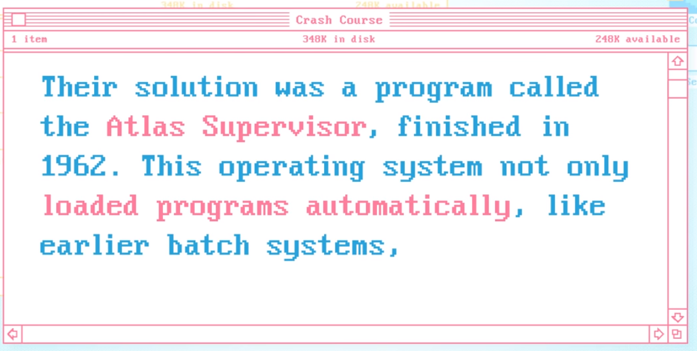
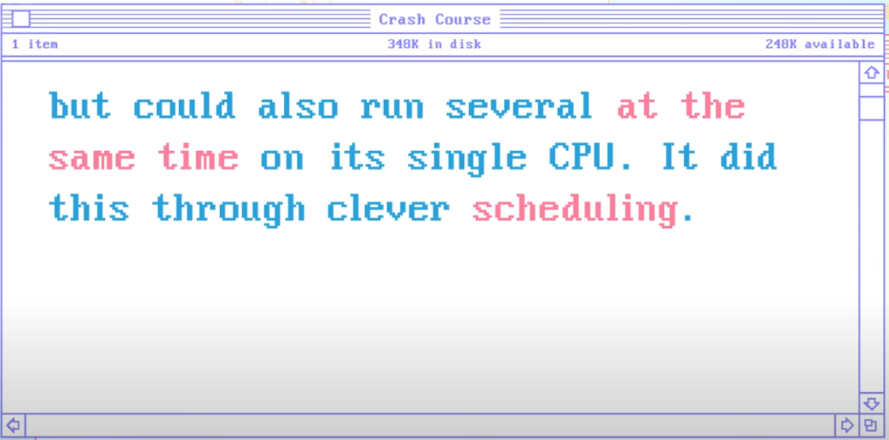

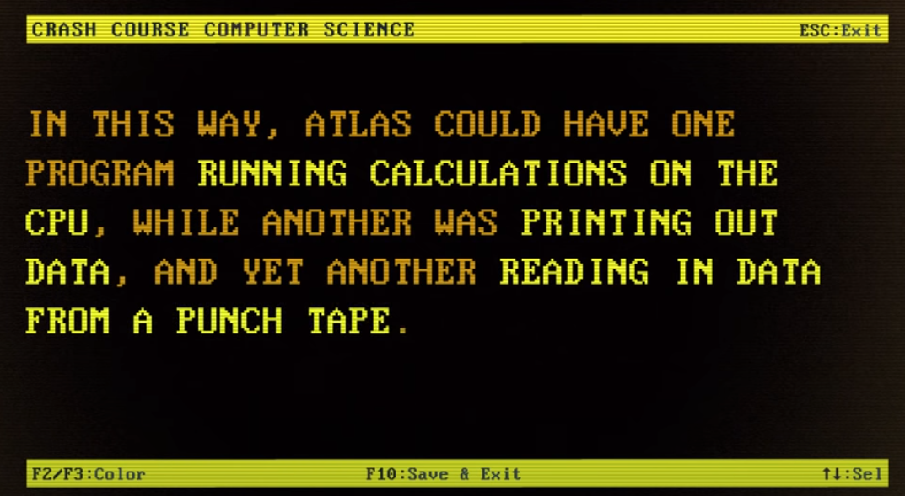

Along with with came the concept of ***virtual memory*** where memory
can be allocated between multiple programs instead of all memory going
to a single program.

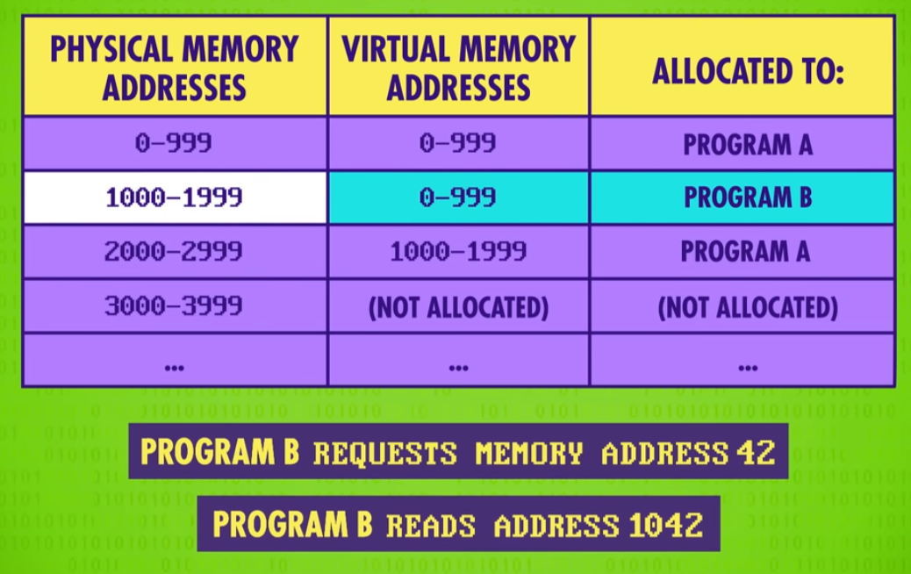

Developed to standardize the way different computers function the same
software in a uniform way through the use of ***device*** ***drivers***.

## Multics OS

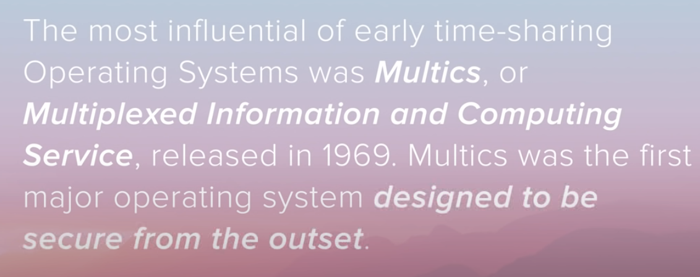

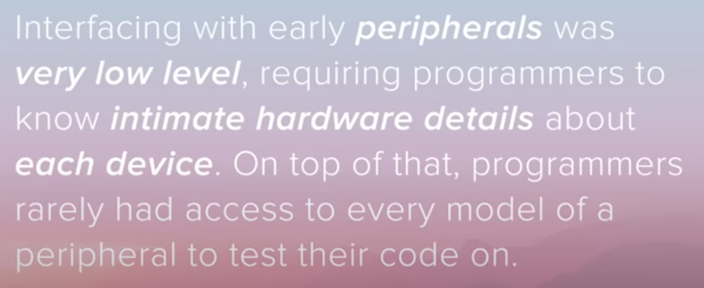

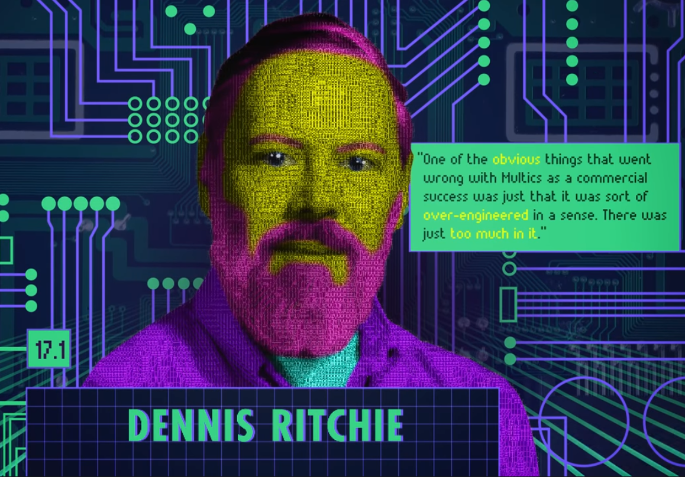

## UNIX OS

Multics OS was divided into two parts

1.  **Kernel**: Memory management, I/O, multitasking, etc

2.  **Programs/libraries**

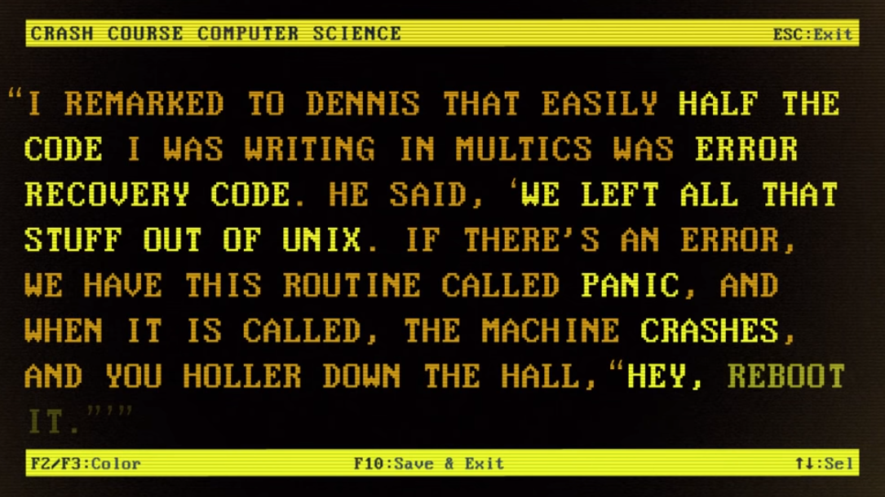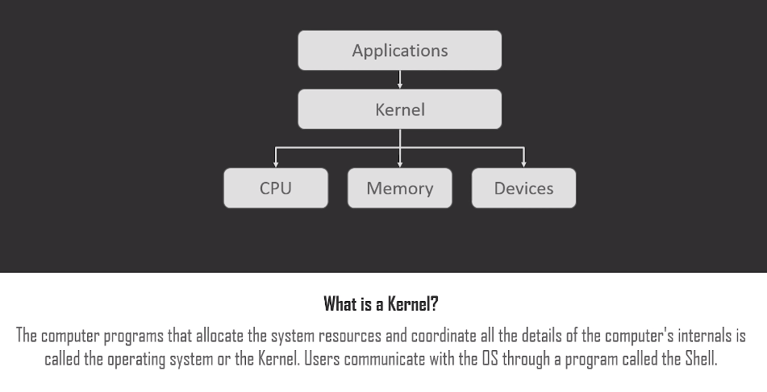

## Linux (UNIX-based OS)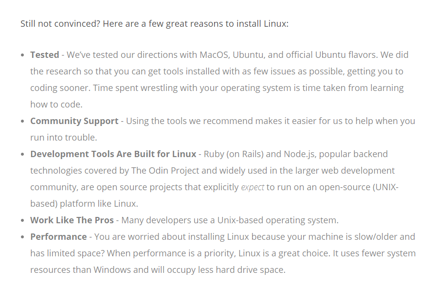

## WSL

Install defaults with Ubuntu (you can also specify your distro with flag
– see docs):

wsl --install

Install windows subsystem for Linux

<https://docs.microsoft.com/en-us/windows/wsl/install>

Utilizing chmod

<https://devblogs.microsoft.com/commandline/chmod-chown-wsl-improvements/>

**Permissions**

WSL respects Windows permissions unless you are setting to 755 or 000 –
full or clear all.

In order to change these perms using WSL, it’s best to copy that file
(without the p flag) so that this new file will be a non-windows created
file/folder.

Also…

If you’re perms aren’t applying.. **make sure the file you are changing
actually exists in your WSL environment!** Spent too much time trying to
change file perms on files that were on my C drive.

View Details if your wsl with **wslfetch**

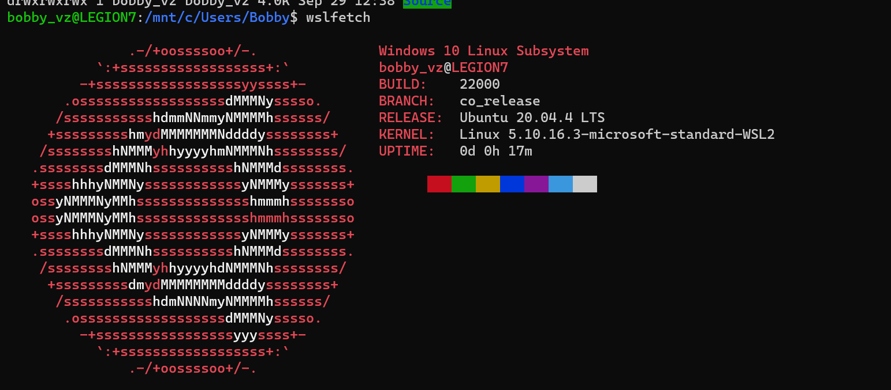

**Display and GUI**

<https://docs.microsoft.com/en-us/windows/wsl/tutorials/gui-apps>

**Networking**

Fun fact, just as a type 2 hypervisor in a local VM – WSl creates a
virtual network with it’s own network interface

***On host machine using cmd:***

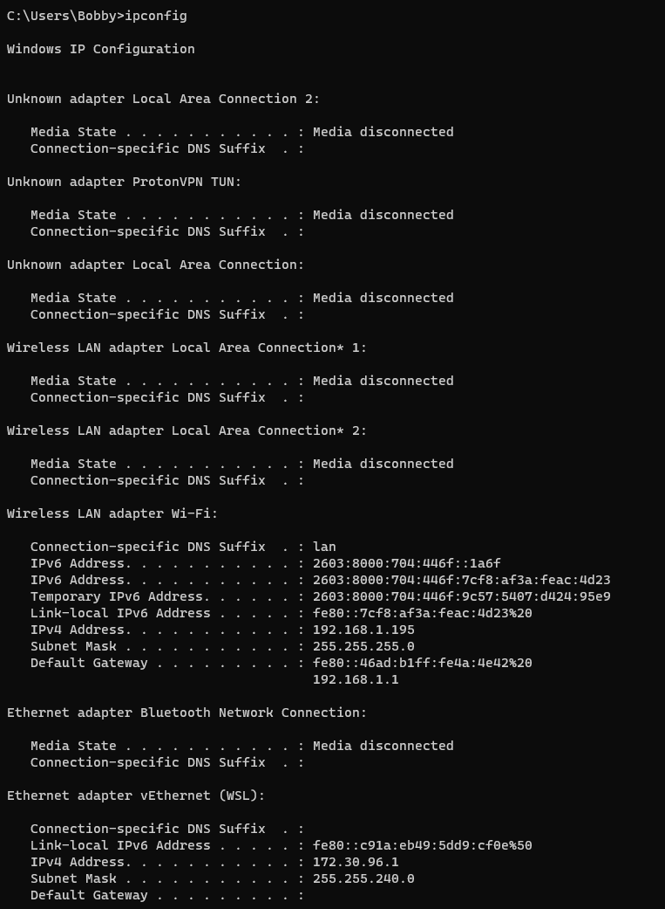

^ Notice the last interface

While in WSL ubuntu – you only see your interface and the loopback

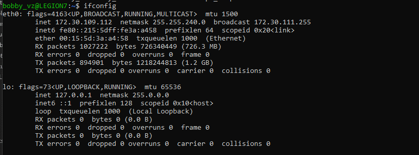

### Reclaiming Memory

## **Reclaim cached memory**

WSL 2 automatically reclaims memory when it is freed, to make it
available to Windows processes. However, if the kernel decides to keep
content in cache (and with Docker, it tends to happen quite a lot), the
amount of memory reclaimed might not be sufficient.

To reclaim more memory, after stopping your containers, you can run echo
1 \> /proc/sys/vm/drop_caches as root to drop the kernel page cache and
make WSL 2 reclaim memory used by its VM.

### CUDA for WSL (GPU )

<https://developer.nvidia.com/cuda/wsl>

<https://docs.nvidia.com/cuda/wsl-user-guide/index.html>

Download Driver for host: <https://developer.nvidia.com/cuda/wsl>

Helpful:
<https://medium.com/swlh/how-to-install-the-nvidia-cuda-toolkit-11-in-wsl2-88292cf4ab77>

**Option 1: Using the WSL-Ubuntu Package**

Launch WSL 2:

C:\\ wsl

Install CUDA:

wget
<https://developer.download.nvidia.com/compute/cuda/repos/wsl-ubuntu/x86_64/cuda-wsl-ubuntu.pin>

sudo mv cuda-wsl-ubuntu.pin
/etc/apt/preferences.d/cuda-repository-pin-600

wget
<https://developer.download.nvidia.com/compute/cuda/11.4.0/local_installers/cuda-repo-wsl-ubuntu-11-4-local_11.4.0-1_amd64.deb>

sudo dpkg -i cuda-repo-wsl-ubuntu-11-4-local_11.4.0-1_amd64.deb

\# Note: the above file may download under slightly different name.

For example: sudo dpkg -i
cuda-repo-wsl-ubuntu-11-4-local_11.4.0-1_amd64.deb

sudo apt-key add /var/cuda-repo-wsl-ubuntu-11-4-local/7fa2af80.pub

sudo apt-get update

sudo apt-get -y install cuda

WSL/NVIDIA CUDA don’t yet support OpenCL in WSL

***Check if you have opencl enabled***

clinfo

WSL curently doesn’t have support for open cl. Hence the above yielding
no platforms.

***Install OpenCl:***

sudo apt-get install ocl-icd-libopencl1 opencl-headers clinfo

Alternative

sudo apt-get install opencl-icd-loader

Stll prob wouldn’t work atm since thee’s no support for openCl.

#### You can find out which drivers you're using by running 

sudo lshw -c video | grep driver. 

#### Find graphics card in use

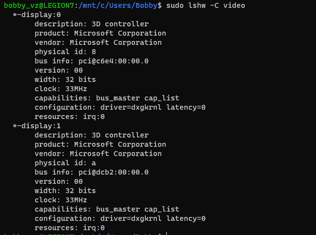

***OpenCL Implementations | Linux Guide***

<https://www.youtube.com/watch?v=p2xiGb_3o0g>

# Terminal/CLI (Command Line Interface)

<http://www.cs.columbia.edu/~sedwards/classes/2017/1102-spring/Command%20Prompt%20Cheatsheet.pdf>

<https://youtu.be/CV-ven_rxhw>

## Intro

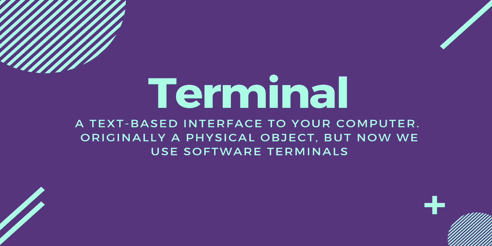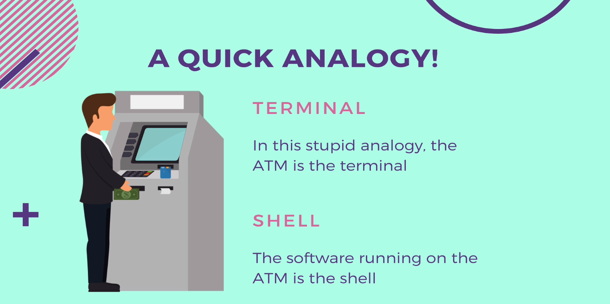

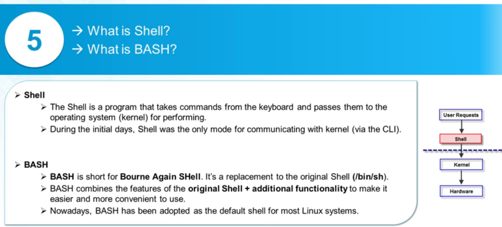

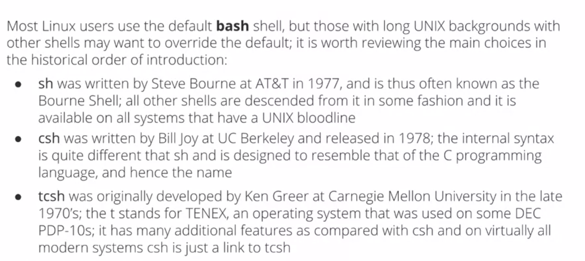

<https://youtu.be/ZtqBQ68cfJc>

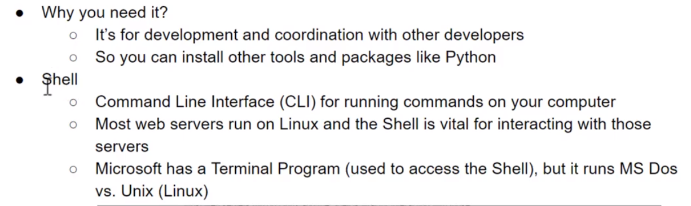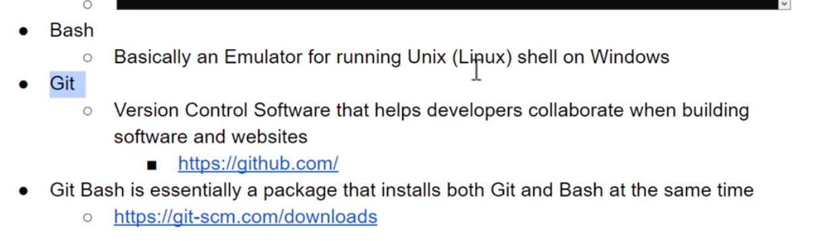

***Bash vs Powershell***

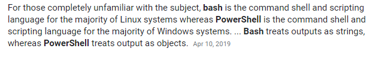

## TTY and virtual terminals

**tty** : displays the current terminal in in use (for example
/dev/pts/0)

**pts** : displays the pseudoterminal (pts) one is reading from.

**Write command**

write \<user\>

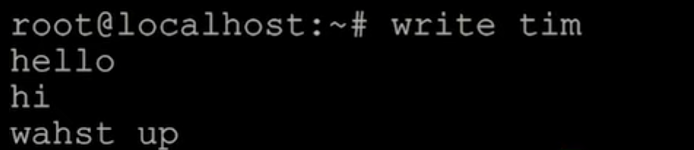

Enable receiving write messages

- **Tty**

  - Tty to find name of your terminal

  - Just as you cat redirect tet to a file, you can also redirect to
    another pseudoterminal

  - 

  - You can also use the **wall** command to broadcast a message to all
    other logged in users.

  - 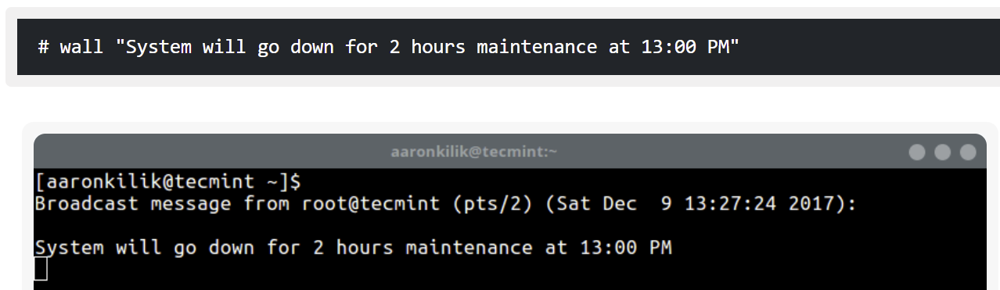

**Changing virtual terminal (cvt)**

chvt 2

^ that will change your virtual terminal from /dev/pts/1 for example to
/dev/pts/2

**Deallocating unused terminals**

To get rid of unused VTs, use deallocvt(1).

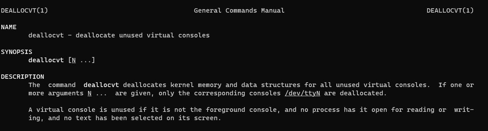

## Custom prompt

<https://ezprompt.net/>

export
PS1="\[\\\e\[37m\\\\\\\e\[m\\\]\\\e\[36;40m\\\u\\\e\[m\\\\\e\[33m\\@\\\e\[m\\:\[\\\e\[33m\\\w\\\e\[m\\\]\\$
"

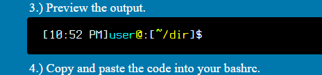

Start editing your

# Linux: General

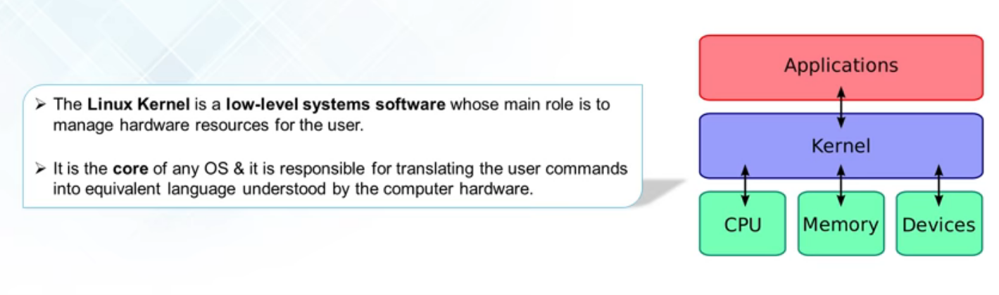

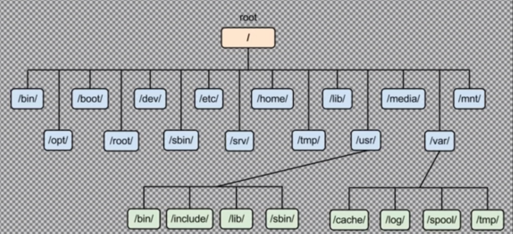

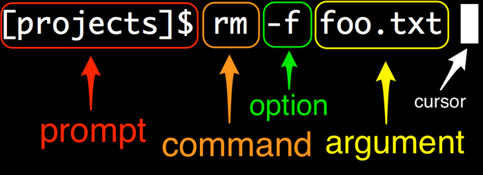

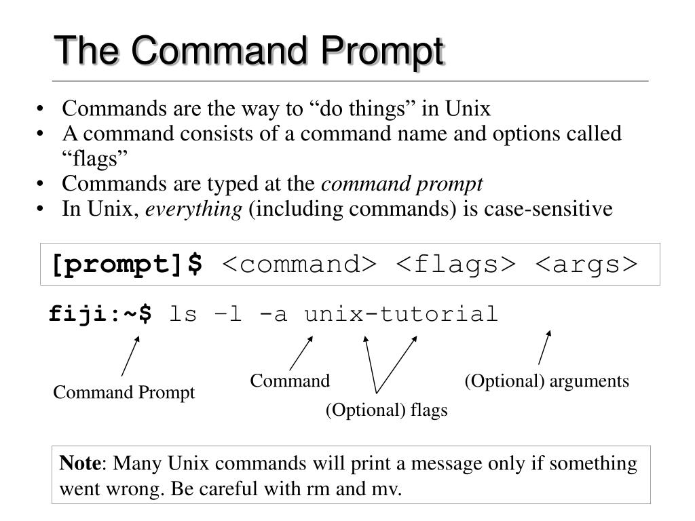

## Basic CLI

General crash course: <https://www.youtube.com/watch?v=oxuRxtrO2Ag>

Open a terminal on your computer. - Linux: open the programs menu and
search for “Terminal”. You can also open the terminal by pressing CTRL +
ALT + T on your keyboard. - MacOS: Open your Applications \> Utilities
folder and find “Terminal”.

Before we do anything, take a look at the following text: $ whoami This
is a terminal command because it begins with a $. The $ is saying “Hey!
Enter what follows in your terminal.” This means that we must exclude
the $ when entering any command. In the example above, we would only
enter whoami in our terminal. This is a common indicator so make sure
that you aren’t entering $ before a command. Now that you are aware of
what $ does, take your terminal for a test run! Make sure your terminal
is open, type the command mentioned above, and press enter on your
keyboard.

CLI Basics: <http://conqueringthecommandline.com/book/basics>

Testing: <https://explainshell.com/>

Beginners Playlist:
<https://www.youtube.com/playlist?list=PLT98CRl2KxKHaKA9-4_I38sLzK134p4GJ>

Cheat Sheet: <https://files.fosswire.com/2007/08/fwunixref.pdf>

Basic Command Line: <https://www.youtube.com/watch?v=cBokz0LTizk>

<https://www.hostinger.com/tutorials/linux-commands>

sudo apt-get update

sudo apt-get upgrade –y

### Cheat Sheet & Basics

\* - Wildcard (can also mean ‘all’)

- **Describe a command (whatis)**

  - Example: whatis \<command\>

- **Exit a terminal session (exit)**

- **Clear the terminal (clear)**

  - Alternative :ctrl + l

- **Stop execution (^C)**

- **Sleep (sleep)**

  - Equivalent to setTimeout in JS

  - 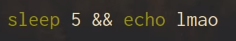

  - (prints lmao every 5s)

- **Home Directory (~)**

- **Present Working Directory (pwd)**

- **Search for a file (ls filename)**

  - 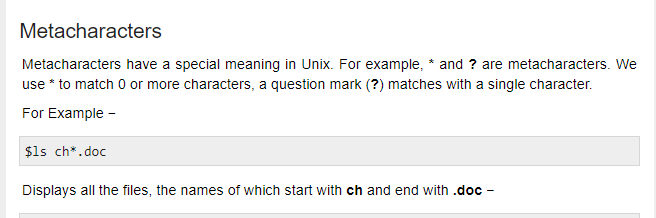

- **List Files and Directories (ls)**

  - 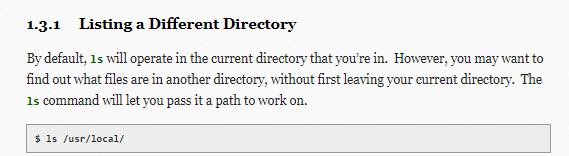

  - Listing All Files (-a)

  - Long Form Listing (-l)

  - Human Reasdable Sizes (-h)

  - Sorting by Size (-S)

  - Sorting by Last Modified Time (-t)

  - Reverse Sort (-r)

  - Find path where a command is installed (which)

    - Example: **which bash** or **which cal**

  - **Combination: ls –lah Downloads/**

    - List all files including hidden files (a), in a neat table (l),
      and human readable

  - **Combination: ls –lahR Downloads/**

    - List all files including hidden files (a), in a neat table (l),
      and human readable

    - Also include files of those subdirs (R)

- **Change Directories (cd)**

  - Navigating Up (..)

- **Creating Directories (mkdir)**

  - Create Intermediate Directories (-p)

    - 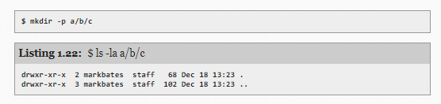

  - Verbose Output (-v)

- **Copying Files (cp)**

  - Verbose Output (-v)

  - Copying Directories (-R)

  - Force Overwriting of a File (-f)

  - Confirm Overwriting of a File - interactive (-i)

  - Keep Permission (-p)

- **Deleting Files (rm)**

- **Deleting Empty Directories (rmdir \<dirname\>)**

- **Deleting Non-empty Directories (rm –r \<dirname\>)**

- **Moving Files (mv)**

- **Show all running processes**

  - <https://www.binarytides.com/linux-ps-command/>

  - ps ax | grep cw_sync.pl

    - This searches for all processes containing ‘cw_sync.pl’

  - 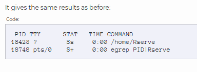

### CRUD

There are many basic command line utilities that are used to list,
examine, and manipulate files and directories. Each has many options.
Here is a list of very commonly used ones, that should be in any user’s
toolbox:

<table>
<colgroup>
<col style="width: 14%" />
<col style="width: 85%" />
</colgroup>
<thead>
<tr>
<th>Name</th>
<th>Purpose</th>
</tr>
</thead>
<tbody>
<tr>
<td><strong>ls</strong></td>
<td>List files</td>
</tr>
<tr>
<td><strong>cat</strong></td>
<td>Type out (concatenate) the files</td>
</tr>
<tr>
<td><strong>rm</strong></td>
<td>Remove files</td>
</tr>
<tr>
<td><strong>mv</strong></td>
<td>Rename (move) files</td>
</tr>
<tr>
<td><strong>mkdir</strong></td>
<td>Create directories</td>
</tr>
<tr>
<td><strong>rmdir</strong></td>
<td>Remove directories</td>
</tr>
<tr>
<td><strong>file</strong></td>
<td>Show file types</td>
</tr>
<tr>
<td><strong>ln</strong></td>
<td>Create symbolic and hard links</td>
</tr>
<tr>
<td><strong>tail</strong></td>
<td>Look at the tail end of the file</td>
</tr>
<tr>
<td><strong>head</strong></td>
<td>Look at the beginning of the file</td>
</tr>
<tr>
<td><strong>less</strong></td>
<td>Look at the file, one screenful at a time</td>
</tr>
<tr>
<td><strong>more</strong></td>
<td>Look at the file, one screenful at a time</td>
</tr>
<tr>
<td><strong>touch</strong></td>
<td>Either create an empty file, or update the file modification
time</td>
</tr>
<tr>
<td><strong>wc</strong></td>
<td>Count lines, words, and bytes in a file</td>
</tr>
</tbody>
</table>

## General

Create typescript of your commands:
<https://manpages.ubuntu.com/manpages/bionic/man1/script.1.html>

## Printf

<https://youtu.be/V7xGfm8qhZM>

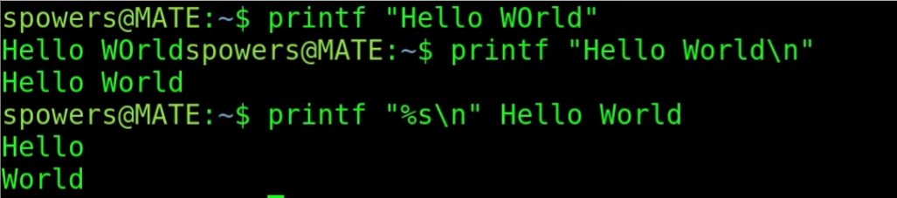

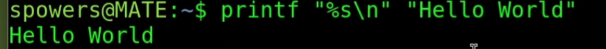

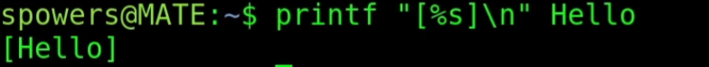

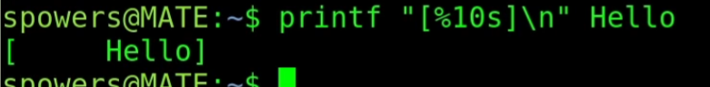

## Useful commands

### General

- **Listing** (long form, human-readable,all and recursively)

  - **ls -halR**

- **Parameter Expansion**

  - ls –hal $(which bash)

  - Equiv. ls –hal /usr/bin/bash

  - 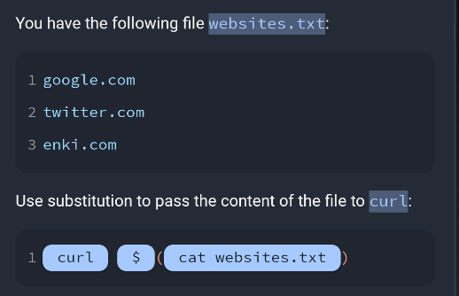

- **Search command history (CTRL + R)**

  - Start typing…

  - Ctrl + J to copy

  - Enter to execute

- **Re-run last command**

  - Sudo !!

- Re-run last command

  - 

- **Clear CLI – and reset history**

  - Reset

- History command with date and time

  - HISTTIMEFORMAT="%d/%m/%y %T "

  - History

  - 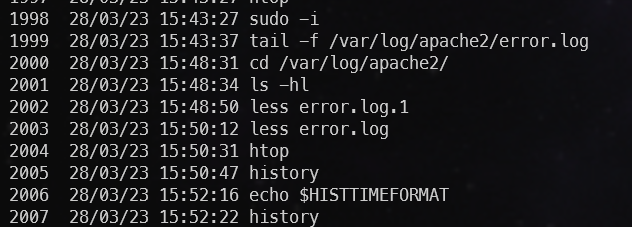

  - Or use this ti just date date

  - export HISTTIMEFORMAT='%F %t '

  - add to your bashrc to retain by default

- **Cut/paste (kill/yank)**

  - Ctrl + K – copies text from cursor to end of line

  - Ctrl + U – copies text from cursor to beginning of line (UP)

  - Alt + D – copies from cursor to end of word ( click multiple times
    to add more words to clipboard/kill ring) to paste/yank later with
    Ctrl + Y

  - Ctrl + Y – paste from kill ring

- **Symbolic Permissions**

  - Applies to: ugoa (user,group,other,all)

  - Setting: +=-

- **Run a script/program in the background (stdout still prints to
  cli)**

  - Just follow with an ampersand

  - programname.sh &

  - Returns **jobid and processed –** list jobs with jobs commands.

  - 

- **Redirecting STDOUT & STDERR to free CLI**

  - *Note: redirects to ‘nohup.out’ in working dir*

  - nohup ./test.sh 2&1\> /dev/null

  - nohup node app.js 2&1\>/dev/null

- 

- **Print ‘ls’ as a comma-separated list (ls -m)**

  - 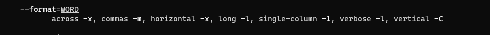

  - You can even pipe this directly into a new file with csv extension
    to create a csv from thin air.

- **Show error status of last command ran**

  - $?

  - If that returns zero then no error – that’s a success state

- **Bypass interactive confirmations with yes command**

  - **yes | sudo apt install mypackage**

- **Pipe stdout to be used as args for another command (xargs)**

  - find ./ -name “file\*” | xargs ls –hal

  - Same result can be acheived using ‘exec’

  - find ./ -name “file\*” –exec {} \\

- **Long commands**

  - 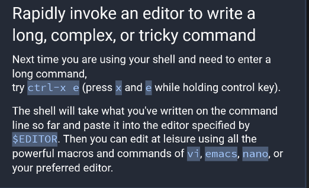

### Printf command

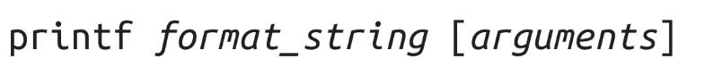

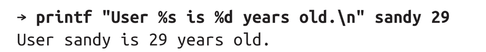

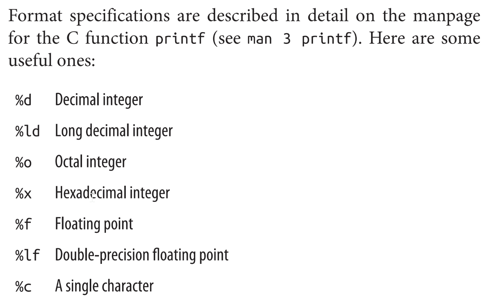

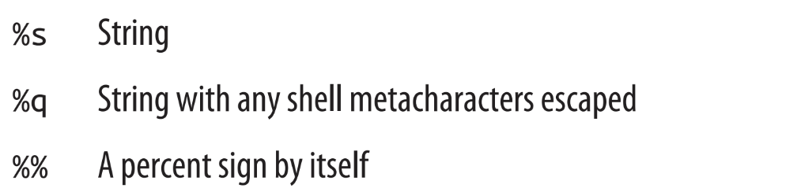

### Run new command using same file as last command \[BASH\]

Does not work in sh – does in bash.

\<cmd\> !$

Example:

ls -hal myfile.txt

cat !$

### Display message to all other distinct logged in users

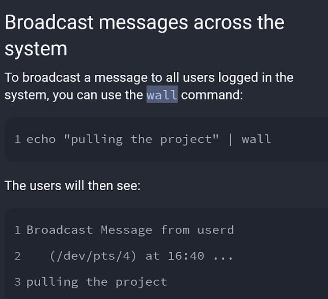

### Test command

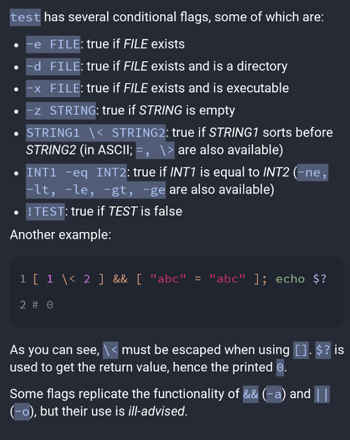

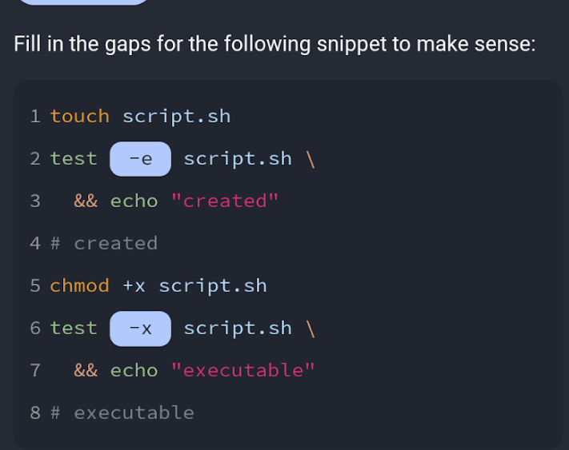

### File comand (file type)

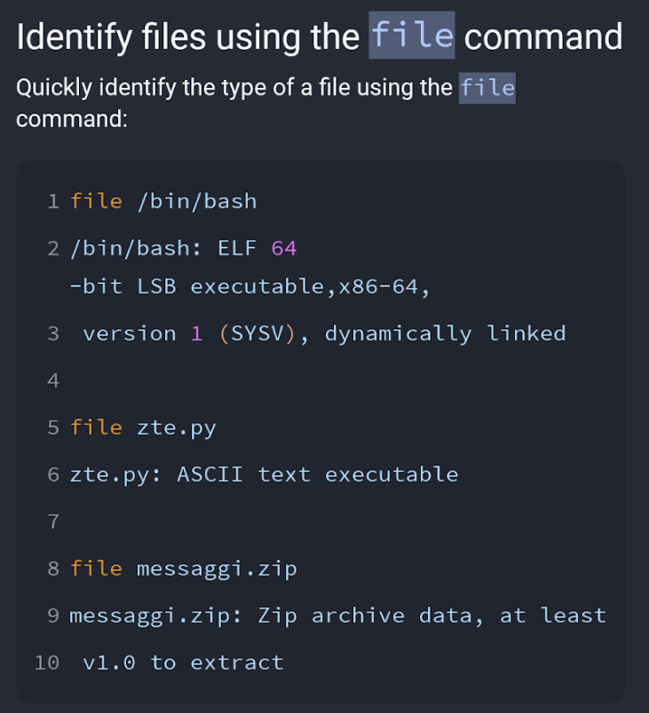

### tree

*Note: Seems like **ls -halR** but with beter UI.*

tree is a recursive directory listing program that produces a
depth-indented listing of files. With no arguments, tree lists the files
in the current directory.


**List dirs only (d) 2 levels deep**


### Searching with less


### Which/whereis

Which command tells you where in the $PATH a given program will be
executed from.

Whereis tells you all of the locations where it could be found from.

Whereis -b === which

### Change hostname

**Show hostname**

hostnamectl

Or…

hostname

Or…

uname -n

**Get FQDN**

Hostname -f

**Change hostname**

<https://linuxconfig.org/how-to-change-hostname-on-linux>

- Step1:

  - Hostnamectl set-hostname ‘newhostname’

  - Or…

  - Hostnamectl hostname ‘newhostname’

- Step 2: edit the config file

  - $ sudo nano /etc/hostname

  - If it’s a RedHat distro try this

- 

- 

- Step 3: Good practice to restart hostname service after making this
  change


### Watch Command


## Accessibility Features

Called universal access in most places. Some featured require that your
Desktop Environment support said features.

## Getting help

- Info \<command\>

- help \<command\>

- \<command\> --help

- man \<command\>

### Type command


### Info command


### Help command


### Man Page

**<u>Man page chapters</u>**


## Navigating with cs, pushd, and popd

**cd –** takes you to th previous dir, but if you want to keep track of
lots of past dirs. You can use popd and pushd.


“pushd” works just like “cd” except it adds the dir you are entering
onto the stack. Each dir you “pushd” into, you add onto the stack. If
you ever run “popd” it will take you back to the last dir you “pushd’d”
into – popping it off of the stack.

You can also run “cd –“ to return to the previous dir.

# Linux Graphical Interfaces


### x.org (X11) \[Legacy\]


Wayland and X.org both do the same thing. They take the programs that
are running on your system and render the picture to the display.
However, they do things a little bit differently. Now, the end user is
not going to notice any difference at all. But Wayland is an improved
design that is not quite ready for mainstream.

So let's talk about why we would use one over the other. First of all,
X.org has been around for longer than Linux has been around. It's just
been around forever. It's usually referred to as X11. That is the video
program that you have heard of. Now, when you have an application on
your system, it has to render its window onto your actual screen over
here.

Now, how this works with X.org is you have the x-server. Now, x-server
is, honestly, pretty powerful. It does things like it allows the
application to be on a separate computer altogether. And you could
actually do this over the network. But for the basics of how it works,
basically the app says OK, I need to draw a window.

And you would think that the x-server would then draw it on the window,
on the actual video hardware. But there's more to it. There's like a
duality here that the x-server has to do some other things because
here's the deal. The x-server's job is to listen for incoming
applications or x-clients to tell it what to do.

But also, its job is to draw it on the screen. The problem is, it
doesn't have any idea where these application windows might be on the
screen. So its job is to draw it there. But it has no idea where to put
anything. So the x-server then takes all of the application information
and sends it off to a compositor, which is software that's installed on
the Linux machine.

The compositor says OK, I have all of these different applications that
are running. I'm going to arrange them how they need to be arranged
based on who dragged what mouse with what click, et cetera. And then the
compositor returns the image to the x-server.

And then the x-server finally draws the image that the compositor came
up with on the video hardware. So it's kind of this complex weird thing
where the x-server has a duality where it writes to the hardware and it
listens to the apps, but it doesn't actually know how to place things on
the screen.

So it has to use a third-party compositor. And that's how it works. Now,
here's the deal. Even though this is complex, it's very stable. It's
been around for a long time. And every application knows how it works.


### Installation and config

**Install**

sudo apt-get install xorg

**Start x-windows**

startx

**Install a desktopmanager**

*This gives us nice titlebar and such*

sudo apt intall openbox -y

**Start x-windows**

startx

### Wayland \[modern\]

Now, let's compare that to Wayland, because functionally, Wayland does
just about the exact same thing.

It's a server program that's running here. The applications tell it,
hey, I need to have my window here. I moved my mouse. I need to move
this, et cetera, et cetera. The thing about Wayland is, though, Wayland
has a compositor built right in. So Wayland doesn't have to do anything
to a third-party program.

It can write directly to the hardware. Wayland knows not only that it
has to draw and how to draw, but thanks to the compositor, it also knows
what to draw and where to draw it. So Wayland is much, much faster.
There's also a couple other advantages.

One-- an application has its own little secure pathway that goes from
the app directly to the window. And they don't all get mixed up in this
security nightmare of funneling all to a third party compositor or
anything like that. Since everything is done inside Wayland, all of the
connections from the application to the screen are just one smooth path
that isn't compromised and doesn't leak from one app to another.

So one app doesn't necessarily see all the information from another app.
Wayland handles all of that without them seeing each other's data, which
is just a nice security feature. The other nice thing that Wayland
allows is for super giant screens. So if you have one of those big
monitors with super high resolution and you've ever run across a problem
of oh look, my window is this big-- you can't even see the text on it--
Wayland is designed to scale things a lot better.

So it's going to being able to scale those windows up without needing to
do weird zoom things that cause blocky artifacts and things like that.
So Wayland is the way of the future. But it's a little bit buggy right
now. So X11, or more specifically, X.org, as it's actually called, is
the most common, stable window interface that we use right now.

### Setting up a Graphical display using lightdm

**First**, make sure you’re using a graphical runlevel (5)

Sysv : runlevel

System : who -r

*Also, might be worth it to install xorg and openbox as well.*

**Second**, install lightdm and gnome

sudo apt install lightdm gnome

# Booting and the Boot Process

## Power/Rebooting/shutting down


## Boot Process, booting, and bootloaders

1.  **Bios**

    1.  POST test is run (checking for low-level hardware)

    2.  Bios runs

    3.  Bios looks through drives for an MBR

2.  **Boot Loader**

    1.  MBR loads the bootloader

    2.  Bootloader (Lilo/GRUB) finds the compressed kernel file to
        decompress (vmlinux/vmlinuz \[compressed\])

    3.  InitRD program is also run to find/initialize the kernel modules
        currently in use.

        1.  Gives kernel ability to access drivers needed for loading of
            hardware/modules.

    4.  Initramfs initiates basic filesystem for kernel access (to
        continue loading associated modules)

3.  **Kernel**

    1.  Full kernel is initialized with full sile system and all
        necessary kernel modules.

    2.  Init rd dismounted


## Run levels (boot targets/ boot modes)

Though both **sys-v** and **system d** are distinct process/service
managers, they both edit the /etc/inittab file under the hood to set
different runlevels.


Notice how Debian does use 3-5.


**Rebooting/Poweroff (using sys-v and systemd)**


*Default runlevels are saved in /etc/inittab*

Format: 

- Rstate = runlevel that this applies to

### Configuring runlevels using sys-V (runlevel and telinit) \[LEGACY\]

**Viewing and changing the runlevel** (runlevel)

Changing from 5 to 3 which removes the GUI login screen.


^ returns two numbers used to view current/past runlevel set.

**Apply changes**

**Viewing servives and associated runlevels**

**Setting runlevel (telinit)**

### Configuring runlevels using system d (systemctl) \[MODERN\]


#### Viewing current runlevel


#### Viewing default runlevel


#### Setting the default runlevel


#### Setting the current runlevel


### Configuring services with chkconfig (sys-v init)


The chkconfig command is used to control services in each runlevel,
start services, and stop services.

The chkconfig {service} **restart** command resets the status of a
service.

The chkconfig {service} **reset** command stops a service immediately.

The chkconfig {service} **on** command enables a service to be started
on boot.

The chkconfig {service} **off** command disables a service so that it is
no longer started on boot

**<u>Using chckconfig (preferred)</u>**

Running **chkconfig –list**

*(Shows which services are enabled at which runlevel)*


You can also use chkconfig to set which services should run at certain
runlevels (default to runlevels 3 and 5)

^ above is the same as running…


Checking network runlevels


**<u>Editing the init.d file (not preferred)</u>**


## Boot methods

### PXE, cd, USB

Linux is so flexible. It can boot from an incredible number of methods
or sources. Now, there are several different things we need to
understand about the boot processes, like is it hardware based or is it
a software based? And I'll tell you what I mean about that in a minute.

But there are just this multitude of ways that a Linux system can book.
It can boot over PXE, or PXE boot. If you haven't seen that, it's just
the coolest thing ever. It's when it boots up completely over the
network. We can boot from USB, from CD. iPXE is a more advanced version
of PXE.

I'll talk about that, too. And then ISO images. Just like the dot ISO
file, you can actually make a GRUB2 entry that will boot directly from
the ISO, even though you don't have it burned to a disk or to a USB
drive. It can live on your system. And you can have a GRUB menu item
that boots directly to that ISO image.

It's really flexible what it can do. But that hardware software thing I
wanted to talk about, because where the boot process is taking place is
really important. Some of it is Linux specific. Some of it is not. So
first of all, let's talk about the hardware things.

Now when I say hardware, I mean the BIOS or the UEFI, the part that
takes place before Linux is ever introduced. And PXE is one of those
things. PXE, which stands for Pre-Boot Execution Environment, is the way
that the hardware says, OK, I don't see a hard drive, or I'm not set up
to use a hard drive, so I'm going to query the network.

And it just queries a DHCP server. And the DHCP server responds with not
only an IP address, which is what DHCP servers normally do, but also a
boot file, and a TFTP location. A TFTP server is just a place you can
store files on a network. And then basically the computer then downloads
that image, that boot image, from the TFTP server.

And that's where Linux comes into play. That kernel, or that boot file,
is the Linux kernel. So it downloads it off the internet-- off the
internet-- off of your local network, and then it puts it in memory, and
boots itself from there. So PXE starts as just a hardware thing, and
then turns into a software.

There's also **iPXE**, which is very similar, but instead of using TFTP
to download that thing, it allows you to use HTTP, which is faster and
usually more reliable than the old fashioned TFTP. But it's very similar
in concept, iPXE, if your computer supports it.

Then **USB**, this is also right on the hardware. Now, the hardware
determines exactly how to boot from the USB. But on the USB itself is
where the Linux code is. So the hardware knows that it can boot from
USB. The same thing with CD. And to be quite honest, the same thing with
a hard drive.

The hard drive is booted to because the computer itself understands how
to do that. But when Linux comes into play-- we'll say the software side
of things. This is once it loads into Linux. Linux does some things on
its own, like the ISO booting with GRUB2, that's after Linux starts, or
after GRUB starts.

It says, OK, I'm in GRUB now. What are we going to do? We're going to
either mount a partition, or we're going to look at this ISO file, and
actually use that as our operating system, just like it was burned to a
CD. So some of this stuff is software.

This is where you like select the kernel. This is where you can have
Memtest. So a lot of this stuff is done in software. But most things--
actually, all things have to start in the hardware. Otherwise, you're
never going to get to the point where the software takes control.

But it's important to know that PXE, iPXE, these are not Linux specific
boot methods. These are boot methods the computer supports that Linux
also supports in that they can provide the boot files. So I don't want
you to confuse PXE network booting with something specific to Linux.

The same with USB and CD. We can boot Windows from USB or CDs. And it
works because the hardware supports it. If I'm honest, probably the most
fun way to boot a computer is using PXE, only because there's no media.
It just boots directly off the network.

And for some reason, that's just really awesome to be a part of. It's
really awesome to see. But there are multiple ways that you can boot
Linux. And it's important to know that they're all there. It's OK if you
don't know exactly how to boot from an ISO file using GRUB2.

Anybody is going to have to Google the specifics of that in order to
make it work. But knowing all these different processes exist for
booting a computer, that's vital, because that will help you learn and
help you troubleshoot when you run into a booting issue.

### Creating an initrd image NFS option

**Step1: Identify the kernel we’re using**


**Step2: Make an initial ram disk image file**

*This is the standard way*


*This is how we make one for an nfs server*


If you made both it would look like this


## Boostrapping 

Cloud-init, kickstart, and anaconda are all used for bootstrapping.
Cloud-init is a cloud-based Linux mechanism to customize a virtual
machine during its first boot up. This customization might include
security settings, software package installations, user and group
creation, and many more.

### Pre-install (legacy standard)

#### Cent OS : kick start file

Bootstrapping is really just a term that means how to get your Linux
system from the point of being on a CD-ROM or USB drive into fully
installed a configured on your system. Now there's a couple different
ways to go about doing it post-install and pre-install, but there's some
literal terms and some programs that I want to point out, because the
way that you do it in various operating systems is a little bit
different.

So first I want to talk about the pre-install method. Now this has been
around for a very long time. This has been around since before the cloud
is even a thing. And there's two general ways to go about it. We'll
start with CentOS, because honestly, CentOS from Red Hat has the most
developed way to go about doing this.

Now the installer with CentOS is called Anaconda. And Anaconda will
accept something called a kickstart file, which is basically just a
formatted text file that can be stored somewhere like-- when I would use
kickstart on my network and when I worked at a school district, I would
store it like on an NFS server somewhere, and it would just be this
kickstart file that I would reference during the boot up process of the
installer CD.

And then it would get all of the configuration files-- or all the
configuration settings from this kickstart file, like the network
settings and users and all the things that you would want to have
pre-installed on a system, like what packages, and then Anaconda will
use that kickstart file to install it in the way that you want it to be
complete.

So during the installation, it actually uses all of the customization
that you specify, and then you end up with a complete system.

#### Debian/Ubuntu : Pre-seed

Now Debian and Ubuntu, which are-- basically on the underside the exact
same thing. They have a similar thing, it's called pre-seed.

Now Debian pre-seed is not nearly as robust as kickstart is over here.
It's weird, in fact. When you configure the settings, it doesn't like
just give configurations. You actually have to just pre-seed the answer.
So you need to know all of the things that the Debian installer is going
to ask, like would you like to use DHCP?

And then rather than having a configuration file that just says, use
DHCP, you actually have to say yes to the "would you like to use DHCP"
question. So it's really kind of bizarre, and it's a strange way to go
about doing it. But Debian does provide this pre-seed, and for some
things in the installation process, it's the only way that you can
customize it.

Now because it's so limited and quite honestly a little weird and hard
to configure, Debian does have kickstart support. You can use a
kickstart file. In fact, because I use Ubuntu on almost all of my
servers, I had to use this kickstart file that I stored on the network
on an Ubuntu system.

And it will support a lot of kickstart settings. So it's fairly robust
in its support for kickstart, but it's not as complete and not as
elegant as if you're using Red Hat or CentOS. But anyway, you can
pre-seed answers or not pre-seed answers-- this is like the official
Debian way to do an automated install.

And you can also do some kickstart stuff, which doesn't support as much
as it supports in CentOS, but it will give you a complete system at the
end that is configured with users and passwords and packages and all the
things that you want on a system.

And this is how we would do it for years. This is how I spent most of my
career at a school district installing servers. Is I would create a
kickstart file and just boot up from a CD or boot up from DHCP and it
would go through the entire bootup process.

### Post-install (modern standard)

#### Cloud-init


But now things have changed a little bit. Now we have cloud-based
systems, which are almost more popular than installing an actual
hardware in your own server closet. So then cloud-init came out. And
what's really nice about cloud-init, it's supported by all the major
distributions.

So whatever distro you're using up on the cloud, you can use cloud-init
and it's going to work the same. Now honestly, you don't even have to be
in the cloud to use cloud-init-- it's just what it was designed for. And
conceptually it's completely different from this pre-seed or the
kickstart install, because you start from a bare-boned,
already-installed system.

So basically somebody has gone through the process of installing
step-by-step a system, and then they make an image of that pre-installed
system. And that system is stripped down as far as we can go, like
there's no users and no network settings, but it's a base install, and
we get that going, and on the initial bootup, it runs the customization
scripts, which is what cloud-init provides.

You just set up a whole bunch of configuration files, and it will take
all those. You can install SSH keys, you can install users, packages--
all of the things that you would want to do during the installation
process, you just do it after the install.

It's like the first time it boots up, it runs through all of the things,
and then you have your complete customized system. So cloud-init is kind
of the way that we do it now, although you can still use a kickstarter.

The cloud-init application uses **YAML** files to store configuration
information on newly deployed virtual machines, to install software or
create user accounts during the virtual machine's first boot, or for
orchestration.

### Chef or Puppet

And there is a third way which really isn't how to start things out of
the box-- and I didn't even make a slide, I just want to describe it,
because somebody's probably going to say to you, well why don't you just
use Chef or Puppet?

I'll be honest-- Chef and Puppet are awesome, and they do a great job,
but you still have to install it. And so that's where with cloud-init, a
lot of times if you're using cloud-init to set up your system, one of
those initial things you're going to install is going to be Puppet,
Chef, Ansible-- something to manage your system after it's already
installed.

So there are a couple ways that you can bootstrap your Linux system. You
can do it pre-install-- or during install I guess is a more accurate way
to describe it. But generally what we use now is cloud-init because
that's done in the aftermath of a pre-installed system.

Most of our things are installed with images because most of them are
virtual machines, whether in our own server room or somewhere in the
cloud. I hope this has been informative for you, and I'd like to thank
you for viewing.

## Managing the Kernel 

The kernel is located in the “/boot/” dir.


## Changing kernel settings with sysctl


**View current kernel options**


**Swappiness**

Goes from 1-100, and ideal to set lower for machines that can’t afford
to write to disk for virtual memory ( raspberry pi for example). Ideal
to set a pi to ‘1’.

**Updating a kernel option**


In order for those changes to apply on boot they need to be copied to
the **/etc/sysctl.conf**. Ideal to do it all ine one-line:


^ append instead of redirect if making multiple changes of course…
honestly just better to always append and verify afterwards.

Changes will take affect on boot.

The **/etc/sysctl.conf** file can be edited or modified to enable
configuration changes to a running Linux kernel. This configuration file
contains settings for upgrades to networking activity, security
settings, and logging information. 

The **sysctl** command is used to configure kernel parameters at
runtime.

## Boot directory

A **/boot** directory might look like the one in the screenshot below:


In this example, there are multiple possible kernels to boot into, each
of which has four files associated with it:

- **vmlinuz** is the compressed kernel

- **initramfs** contains a complete initial root filesystem which is
  loaded as a ramdisk, as well as some essential kernel modules
  (generally, device drivers) and the programs needed to load them, that
  are required to load the real filesystem, at which point it is
  discarded

- **config** contains all the details about how the kernel was compiled;
  it is not needed for system operation

- **System.map** lists the complete kernel symbol table; it is used only
  for debugging purposes

Depending on which Linux distribution is being used, there will be
variations in the above possible kernels. For example, the **initramfs**
file may actually be called **initrd**.


The /boot partition will typically be much less than 500 MB (usually
around 200 MB) but should not be undersized. The used space within /boot
will increase as more kernels are added, such as during an upgrade
process.

## Bios


Use bios to handle low-level configuration


^ If you are at a locallinux system you can enable/configure user/admin
passwords (admin pw protect against others changing bios settings and
user pws protect against booting the machine altogether). Also a way to
do this in GRUB.

If you have configured the BIOS to boot from a removeable device first…


Since there’s no kernel yet, the linux cannot access the files in a
traditional manner (for example, to load the kernel) so it has to rely
on a much simpler way of accessing data (LBA – Logical Block Addressing)
and once the Kernel is loaded, the kernel can reach out to other files
(init rd) to load any of ther associated modules.

**Changing the boot order in system V**

One needs to modify the link farm – i.e. prevent one of the commands in
the *init.d* dir from running.

## GRUB/GRUB2 (Bootloaders)

### Grub overview


- GRUB (legacy) vs GRUB2

  - Check inside **/boot/grub** dir GRUB (legacy) will have either
    “menu.list” or “grub.conf” whereas GRUB2 would have “grub.cfg”.

    - 

**Check current grub version**


### Grub installation

Typically the bootloader is installed during the boot process, but it is
possible that the bootloader could become corrupt and need to be
reinstalled. To install the bootloader, execute the **grub-install**
command and provide the device where you want to install GRUB. The
**grub2-install** command is intended for BIOS-based systems, not UEFI
systems.

The grub2-install command is used to install GRUB onto a disk.


Options

### Grub menu

During boot of a system with GRUB2 press and hold the shift key to pull
up the grub menu.

Grub menu to select the boot device (kernels)


Or press ‘e’ to edit a device… (“c” enters grub prompt)


^ the “linux…” line determines which boot device is being loaded as well
as which arguments are to be used. You can remove the **“quiet”**
argument to boot and see all the output on screen upon loading.

Once selecting a device, press F2 or ctrl+c to enter the grub prompt.

### Grub prompt

At grun menu enter “c” to enter grub prompt.

The **ls** command from within the grub \> prompt will show the
available partitions .

The command “**single**” will boot into single user mode.

### Grub menu configuration and config files

#### config files


**<u>Key point: The BIOS loads Bootloaders (by searching for them) and
the Bootloader loads Ooperating systems (though it doesn’t search for
them – but merely checks a table to determine which to display).</u>**


GRUB2 configuration file path:

Should be a few files based on different changes to be made:


UEFI systems may have the config file located at **/boot/efi/EFI/**


The **40_custom** file in the **grub.d** directory enables the
customization of the menu presented to the user during the boot process.
GRUB 2 will offer the user a menu of installed operating systems to
choose from. This choice is useful for multi-boot scenarios where more
than one operating system is available on the computer, booting to
different Linux kernels, or for booting into a rescue mode. The menu
contents may be customized by editing the **40_custom** file, enabling
an administrator to specify the order of the menu choices, provide
user-friendly names, and to password protect menu entries.

#### Sourcing config file(s)

##### Debian

Changing the configuration files requires sourcing using the
**update-grub** command (since we shouldn’t update grub.cfg directly).

*Note*: **update-grub** is a debian command – a script that really calls
grub-mkconfig behind the scenes (and adds in a couple checks as well).


Sourcing updates the **/boot/grub/grub.cfg** file.

Proof that **update-grub** really just calls **grub(2)-mkconfig** behind
the scenes


##### Redhat 

Note: In some OSes (like CentOS/Rehat) the grub2 folder will be used and
sourcing is handled a different way
.

^ you can leave out the “-o” output files reference to print to stdout.

#### Securing on boot by setting a bios user password (using grub)

*Bios user passwords are used to preventthe machine from starting
without proper password entered.*

**Set a user password**


This will ask you for your user password (since we’re using sudo) then
will ask you to set a password:


**Edit grub custom file** ( in this case curtom 40):


In the file, add two new lines reading:

set superusers=”root”

password_pbkdf2 root \<password\>

^ where the password was th returned hash from the grub-mkpasswd-pbkdf2
command above.

Example:

**Update grub (Debian)**


**Update grub (Redhat)**

Try rebooting


#### Setting a grub password with grub-md5-crypt

grub-md5-crypt

## Compiling The Linux Kernel On Ubuntu & Debian

<https://www.youtube.com/watch?v=E4yRcmQqvWM>

Edit grub config file and increase timeout before OS boots


^ also make sure hidden timeout is not being applied.

### Update grub (updates initrd file)

*Note: initrd file contains info about which drivers, kernel modules,
etc the kernel should use. Also tells how long kernel should wait before
loading os (as seen below) so we want that file updated so when the
kernel finds it, it respects the timeout we set.*


Current kernel version


### Download and extract latest kernel src code from kernel.org


Enter linux_kernel dir (or linux-\<version number\>)


Notice in this dir you will not see a .conf file yet.

### Install required tools for compilation (dependencies)

- **build-essential** : Suite of tools used for compilation

- **rsync** : remote copying utility

- **gcc**: C compiler for linux

- **bc** : Exntesion for gcc

- **bison** : parser

- **flex** : lexical analyzer

- **libssl-dev** : development package for openssl

- **libncurses** : dev package for ncourses.

- **Libefl.dev** – package for reading elf files.

### Create config file

#### Method 1 : copy old one from linux.

**Copy file :** cp /boot/config-$(uname -r) . ./conig

This also copyies in a


#### Method 2 : using menuconfig 


Or, use j flag to use as many threads as possible:

*Pass in number of threds on your machine*


#### Method 3 : use localmodconfig \[preferred\]

*Uses current system settings to create config file*

Create/update the config file


^ There may be a promp asking ifs cool to install a given module –
defaults to yes ists is.

### Compile kernel (make deb-pkg)


^ uses one cpu core to compile.

**Compile with multiple cores**

Commnad : make deb-pkg -j \<num of cors\>

Though this isn’t recommended as best results occur when compiling on a
single core.

### Install dependencies

There should now be debian dev dependencies in the parent dir. Move up a
folder and install those.


Once installed, the initrd will automatically be updated as well.

**Reboot and check version number**


## Lilo (boot loader)


## Device Drivers

Ubuntu has a slightly messier way of showing us device management. In
Linux, everything's considered a file, even hardware devices. When a
device is connected to your computer, a device file is created in the
/dev directory. Let's take a look at this directory.

There are lots of devices in this directory, but not all of them are
actually physical devices. For example, the /dev/null devices in here.
We won't talk about all the device types in Linux because there are a
lot of them. But we'll go over the more common ones you'll see,
character devices and block devices. Character devices, like a keyboard
or mouse, transmit data character by character.

Block devices like USB drives, hard drives, and CD-ROMs transfer blocks
of data. A data block is just a unit of data storage. Remember from an
earlier lesson, that the first bit you see in an LS-L command is the
type of file. So far, we've seen dash which stands for a regular file
and a D which stands for a directory. But in this output, we can see we
have a few other file types. Some of them have B for block device and C
for character device. If you'd like to learn more about that other
device types, you can check out the next supplemental reading. Let's
look at some of the block devices we'll be interacting with in this
course. You'll see a few files that start with /dev/sda or /sdb. SD
devices are mass storage devices like our hard drives, memory sticks, et
cetra. If you see an A after SD, it just means the device was detected
by the computer first. So you might see something like /dev sda, /dev
sdb, /dev sdc. Revisiting the /dev/null device, we can see it's
considered a character device because it's used to transfer data,
character by character.

This is a pretty simple overview of device files. I left a lot of stuff
out that you don't necessarily need to know now. If you want to learn
more about the inner workings of devices in Linux checkout, you guessed
it, the next supplemental reading. Let's talk about updating device
drivers for Linux. With Windows, we were able to just click update
driver and in most cases that works. In Linux, things are a little more
complicated, and at the same time pretty easy. I'm not trying to be
confusing. You'll see what I mean in a moment. Device drivers aren't
stored in the /dev directory. Sometimes, they're part of the Linux
kernel. Remember, that the kernel of our machine handles the interaction
with hardware. The kernel is a really monolithic piece of software that
has lots of functions including support for lots of hardware. These
days, a lot of hardware support is built into the kernel. So when you
plug in a device, it automatically works. But if there are devices that
don't have support built into the kernel, they most likely have
something called a kernel module. Well, what's this kernel module
thingy? For a lot of developers, touching software like the Linux kernel
is kind of intimidating. Instead, they can create kernel modules which
extend the kernel's functionality without them actually touching it. So,
if you need to install kernel module for a specific type of device, you
can install the same way we've been installing all software in Linux.
Keep in mind that not all kernel modules are drivers. We won't get into
kernel modules, but if you'd like to read more, I've included a link to
that as well in the next reading. Since we just need to get started and
get hands-on with the operating systems, this should be more than
enough. Let's keep moving.

### /proc/devices

## kernel modules and the initrd file (mkinit and initramfs)

So let's look and see what the boot process actually is, and then I'll
show you on a system where those files live. So I have a little
flowchart here.


Now a lot of these steps, we probably are already familiar with. First,
the computer either has BIOS or UEFI.

And that's the hardware on the computer, which looks for something that
GRUB or GRUB 2-- it's one or the other here-- will provide. And then
that boot code that Grub uses points us to the kernel. Now this is the
stuff where it starts to get a little-- not confusing so much-- but
complicated.

It's almost like this fine dance that has to be done. Now what the
process is normally is we have the actual Linux kernel itself, which is
a file-- one file-- and it's called VM Linux. Or you probably currently
see it called vmlinuz, with a z. These are the same file, the only
difference is that this is compressed.

The z means that it's compressed, so it's just a space saving method. So
usually we use vmlinuz just to save some room on the system. And then
this is the kernel itself with no modules, right? So there's no modules.
This is just the base kernel. And then once the kernel boots up, it will
mount all the file systems.

And then it will have access to all of the modules that it needs to
insert to make things work. Like, you know, your USB mouse and your
keyboard, and your monitor and your video card. All those things are
modules that are loaded into the kernel. They're not part of the static
kernel, right?

I mean, we could build this huge kernel that includes everything, but
that's just a waste of resources. And so we have this stripped down
kernel that has just enough stuff to make sure that we can mount the
file systems so that it can have access to all of its modules, and then
become the full running kernel on our system.

There's a few problems. What if this full kernel and all the modules--
yes, so basically, what if all the modules here are on a file system
that this stripped down kernel doesn't know how to mount? It's like,
well, I don't know how to get on to a RAID device, or I don't have any
idea how to mount this fancy new SSD drive that you put into the PCIe
slot or something.

Well, that's where **initRD** or init **ramdisk** comes into play. This
is just enough information-- like module information and driver
information-- to be able to have the Linux kernel access the file system
so that it can get to its modules. So rather than make a custom, bigger
kernel for every specific system, what we've done is we have a generic
stripped down kernel.

And then this initRD has the stuff we need in order to load the modules
by mounting the hard drive or whatever we need. Maybe this is stored on
a network drive. So we have to have the NFS stuff in order to mount a
remote disk on the computer, so it can access its modules.

**<u>Important Note</u>**: The term initial RAM filesystem
(**initramfs**) refers to the implementation that uses the <u>cpio
archive</u> as the source of the temporary filesystem. The older version
called the initial RAM disk (**initRD**) uses a <u>disk image</u> as the
basis of the temporary filesystem. This (initRD) has fallen into disuse
because Its much easer to maintain a cpio-based initial RAM filesystem.
Often filenames/configuration files still contain the name “initrd”.

- **Initrd** = disk image (legacy)

  - 

  - **Format**

  - 

  - **Example**

  - 

- **Initramfs** = cpio archive (modern - debian)

- Create and unpack the initramfs file with **mkinitramfs** and
  **unmkinitramfs**.

  - The first argument to the **mkinitrd** command is the initramfs
    filename that you want to create. The second is the version of the
    kernel.

- **DRACUT:** You can also create an initramfs image file with
  **Dracut**.

  - 

- You may not need the initramfs file if the kernel doesn't need any
  additional external drivers.

**Note**: The kernel will load the initramfs file with the same version
number in the file name (if any) as the kernel itself.

So this is just like, the temporary staging area for kernel stuff that
we need. And this is kind of inserted right into this running stripped
down kernel. OK. Now I want to mention this because a lot of people
confuse the init ramdisk with the init RAM file system.

And they seem similar conceptually. They are fairly similar
conceptually. Except that the initramfs is actually part of the actual
kernel itself. It's part of this vmlinuz or VM Linux kernel. And this is
just like it says. It's a file system that it creates and mounts in RAM.

And I want to mention this tool, even though we're not going to go into
it much. dracut is a tool that has made this extremely generic using
udev and stuff like that, so that it's very flexible. But this is
basically the tiny little file system that the Linux kernel uses in
order to do what it needs to do to get to the point where it can load
the full kernel by loading modules.

So initramfs is a file system that it loads into RAM, but that's part of
the kernel itself. This initRD is a RAM disk that is mounted alongside
of the kernel that allows it to get to the point, so it can use the full
kernel. init ramdisk is not used after the system is booted up.

This is just like, a temporary staging ground to get to the full kernel.
Wow. That was a lot of information, but it's really fairly
straightforward when you see why it's doing all of those complicated
things. Now I want to show you really quickly some of the files that we
talked about.

So here I am inside Ubuntu. And this is the boot folder, and we can see
we have here's the initram. Sure enough. I have a couple of different
kernels in here. There was an update. But the kernel numbers are listed
here. But here's the init ramdisk, and here is the actual kernel file
itself.

There's a couple other files. A system map actually tells the kernel
where on the file system all of its modules live. And then config, this
is the configuration file when the kernel was actually compiled, so if
you want to see the options that were used there.

But those are the main files that are on the system. One other thing I
want to show you is, this system dot map tells the kernel to look in lib
modules and then the name of the actual running kernel. And inside there
is where you'll see the actual different modules, OK?

And this is where the modules that are going to be loaded in to get that
full kernel live. So that's the basics of starting a Linux kernel on
your system. Now I know we covered a lot of things, and a lot of terms,
and a lot of concepts. But they should make sense once you go through
that flowchart of what's happening and why it's happening.

*(below) proof that the initrd file is separate and not part of the
kernel file.*

### Notable points about modules

There are some important things to keep in mind when loading and
unloading modules:

- It is impossible to unload a module that is being used by another
  module (or application), which can be seen from the Ismod listing.

- It is impossible to unload a module that is being used by one or mcrc
  processes, which can also be seen from the Ismod listing. However,
  there are modules which do not always keep track of this reference
  count, such as network device driver modules, as it would make it too
  difficult to temporarily replace a module without shutting down and
  restarting much of the whole network stack.

- When a module is loaded with modprobe, the system will automatically
  load any other modules that are required to be loaded first.

- When a module is unloaded with modprobe -r, the system will
  automatically unload any other modules being used by the module, if
  they are not being simultaneously used by any other loaded modules.

- Files in the /etc/modprobe.d directory control some parameters that
  come into play when loading with modprobe. These parameters include
  module name aliases and automatically supplied options. This directory
  also contains information about blacklisted modules, which should
  never be located and loaded.

### Viewing/listing modules

#### /usr/lib/modules 


The **system.map** file tells the kernel to look in the **/lib/modules**
dir to load any modules. In **/lib/modules** modules are grouped by
their associated kernel versions.


#### /proc/modules

Read this file to list installed modules

#### lsmod


**Q :** What is one reason a device driver does not appear in the output
of Ismod, even though the device is loaded and working properly?

**A :** Support for the device has been compiled directly into the
kernel.

#### Modinfo

The modinfo command is used to display information about a particular
kernel module, such as the file name of the module, license,
description, author's name, module version number, dependent modules,
and other parameters or attributes.


### Adding/removing kernel modules

Drivers, usually call for the kernel to be recompiled. With kernel
modules, you can add/remove the bitis you need from the kernel without
the extra hassle of recompiling.

**insmod vs modprobe**

Modprobe uses insmod behind the scenes and is a more robust layer built
on top as it installs dependencies whereas insmod does not. Also,
modprobe almost never requires a reboot to active a newly loaded modules
whereas insmod does.

The **insmod** command has two disadvantages: You have to know the exact
location of the module. If the module has any dependencies they won’t be
installed.

Insmod is only for removing, rmmod is for removing. Or you can use
modprobe with does both.

#### To add/remove modules with insmod/rmmod

*Install module*

insmod \<full path to module\>


*Remove module*

rmmod \<module name\>

Adding the “-w” switch will cause the kernel to *wait* until module is
no longer in use to unload the module:

rmmod -w \<module name\>


#### To add/remove modules with modprobe

modprobe \<module name\>

Example:


#### Loading/Unloading on boot

### Update dependencies

**Update modpro dependency list (database) with depmod**

The depmod command builds the modules.dep file. The modules.dep file
contains module dependencies and is used by the modprobe command to
determine which modules need to be loaded


The depmod command is typically executed when new modules are placed on
the system. This normally happens as part of the installation of a
software package, but it can be executed manually. When the depmod
command does have a few options, they are not typically used.

### Modprobe configuration


### Adding kernel modules to load on boot


Adding any modules here will also cause the loading of any module
dependencies.

### Blacklisting modules

*This applies even if we try to add modules*

File: /etc/modprobe.d/backlist.conf


Note: In fact, any file with “blacklist” will actually work – but they
are usually organized to be more modular.

## Kernel Parameters


View kernel parameters by reading the **/proc/cmdline** file.

For readability…


- BOOT_IMAGE : Which kernel file to load

- Root : Primary disk to load kernel/od

- Ro : start in read-only mode (kernel will change this to rw upon boot)

- Default console to start

- Not sure


**Security hardening best practice**: *Tune Kernel Parameters*

The tune kernel parameters best practice matches the server's role,
installed services, network capabilities, performance requirements, and
service levels to the given Linux server.

## Booting and troubleshooting

### On the Bootlog (dmesg and other logs)

You can always view the output using the **demsg** command or by
catting…


^ dmesg command and dmesg file only exist for system v service managers.
Otherwise use **journalctl -k** for boot log of current session or
**journalctl -b -0** for boot log of previous session.


This is also a good way to see where the kernel assigned a disk.


***Journaling with journalctl***

**Journaling** is a log of the changes that are being made to the
filesystem during disk writing that can be used to rapidly reconstruct
corruptions that may occur due to events such a system crash or power
outage. The journal is an on-disk log containing data about the
filesystem and it is kept up-to-date as the filesystem changes.

### Systemd-analyze blame

**systemd-analyze blame** allows you to see which processes take the
longest to start on boot


### Kernel Panic

Often times, installing a newer version of the Kernel can result in a
Kernel panic. Thankfully, GRUB holds some older/previous versions of the
Kernel installed so you can rollback to a previously working version by
holding the shift key upon boot to bring up the GRUB menu:


Once you reboot with a working version, you can try to uninstall and
reinstall any newer versions you had tried to install before.

You can always try to temporarily boot from a USB.

A kernel panic occurs when something goes wrong with the kernel and the
system crashes. Typically when this happens, data is stored using a
feature called **kdump**. An kernel expert can view this data to
determine the cause of the crash.

# Installing/updating/Packages/etc

<https://www.cyberciti.biz/faq/how-do-i-update-ubuntu-linux-softwares/>

packages.ubuntu.com

## Compiling/using gcc compiler

- Just as the **core-utils** is used for standard linux operations, the
  **build-essential** is a package containing tools used for compiling
  \[Debian\]. In redhat systems, we use “Development Tools”.

  - **\[Debian\]** sudo apt install build-essentials

  - **\[Redhat\]** sudo dnf groupinstall “Development Tools”

- The extension “.so” stands for shared object and is used to demote a
  share library that is being referenced.

### Simple program


*Note: either **cc** or the **gcc** compiler will work here*

Instead of cc -o (to output an executable) you can use the **-c** option
to output a c module called an “object file” – as such the files will
end in “.o”.

Example


^ this will create two object files: **dionmain.o** and
**dionfunction.o**

Object files can be bundled together to make a full executable like so:

cc -o programname main.o aux1.o aux2.o

^ where the “main” file will contain the main function and can make
references to code (functions, variables) in the other object files
being complied with it (**aux1.o** and **aux2.o**).

Notice that we don’t need a makefile or even need to call make at all.
Behind the scenes (like including libraries) and additionally it also
runs the **cc** command. But if your program is simple enough, you can
just run cc directly.

## Working with libraries

### List shared library dependencies

ldd \<program\>

Running ldd without any arguments will show all libraries in use.


To add a new file into the shared library cache, just create a
<u>conf</u> file in the **/etc/ld.so.conf.d/** and then run **sudo
ldconfig**.


## Tarballs (legacy method – compiling from source code and installing)

<https://linuxjourney.com/lesson/compile-source-code>

<https://helpdeskgeek.com/linux-tips/how-to-compile-software-packages-on-linux/>

**Converting source code into an executable (“the 3 step”):**

1.  Extract & configure

2.  Compile

3.  Install


### Step 1: Extract and create makfile (tar and configure)


#### If there’s no make file… (let’s make one)

If there’s no makefile in the tarball, there’s likely a configure script


Run configure script to create the makefile: **./configure**

**Theory and background**


**Install the gcc compiler**


**Download core-utils.xz from gnu :**

<https://ftp.gnu.org/gnu/coreutils/>

wget <https://ftp.gnu.org/gnu/coreutils/coreutils-9.1.tar.gz>

**Run configure** – allows gcc to work on our system
(prepares/configures) and creates make file


^ or simply **./configure.**


Configure sets where the binaries wil be moved once **make install** is
run.

If you want to set a custom dir that the final binary should be placed,
run the configure script like so:

./configure --prefix=$HOME/customprogs

^ checkout the –help flag on the configure scripts to see lots of other
options.

The configure script also makes sure we have all the libraries we need
to compile properly. If you see any errors or missing packages, install
the necessary packages and continue to run the configure script until no
errors are shown. Then you are ready to compile.

### Step 2 : Compile (make)

Install make (if not already installed)


Once everything compiles, the binaries should exist in the pwd.

**One-line (compile and install):**


^ You can skip the rest by running make and install in one line.

Enter dir and run “make”:

*“make” – this compiles programs in this dir*


Note: If there are dependencies there may be a **.config** dir and more
to do in that case.

View created file(s):


^ sunwait is the compiled program that can be ran with **./sunwait**

**<u>Notable points about make command</u>**

- You can also choose the compiler you want make to use:

  - make CC=clang

- You can always specify the file you want to read with the ‘f’ flag
  (instead of the default “makefile”):

  - 

- Print build commands without actually running make

  - make -n

- Instruct make to remove all object files and executables so you have a
  fresh start

  - make clean

  - Because of this, it’s common to clean then run make…

  - make clean && make

### Step 3 : Install (make install)

Not all makefiles have the install option – but most do.

This command moves the compiled binaries from the pwd and places them
into a binary path (usually /usr/local/bin)

<u>Option 1</u>: Copy program to the /usr/local/bin


^ From here you can run it as a normal program as /usr/local/bin is in
the local path.

<u>Option 2</u>: Use install (if available)

**Note**: Best practice to run **make -n** first so you where where make
will attempt to place the executable without actually running make .

Usually involves running **‘make install’** in the pwd.


## Ubuntu troubleshooting

*Possible compiling errors on ubuntu*

**openssl -ubuntu**

$ sudo apt-get install libssl-dev

**curl**

$ sudo apt-get install libcurl4-nss-dev

## General Packaging operations (Debian and RPM)

The following table lists the basic packaging operations and their
**rpm** and **deb**-based equivalents. The **zypper**-based commands are
almost identical to the **yum** ones; look at the man page for
**zypper** on SUSE-based systems.

<table>
<colgroup>
<col style="width: 48%" />
<col style="width: 26%" />
<col style="width: 25%" />
</colgroup>
<thead>
<tr>
<th><strong>Operation</strong></th>
<th><strong>RPM</strong></th>
<th><strong>deb</strong></th>
</tr>
</thead>
<tbody>
<tr>
<td>Install a package</td>
<td><strong>rpm -i foo.rpm</strong></td>
<td><strong>dpkg --install foo.deb</strong></td>
</tr>
<tr>
<td>Install a package with dependencies from repository</td>
<td><strong>dnf install foo</strong></td>
<td><strong>apt-get install foo</strong></td>
</tr>
<tr>
<td>Remove a package</td>
<td><strong>rpm -e foo.rpm</strong></td>
<td><strong>dpkg --remove foo.deb</strong></td>
</tr>
<tr>
<td>Remove a package and dependencies using a repository</td>
<td><strong>dnf remove foo</strong></td>
<td><strong>apt remove foo</strong></td>
</tr>
<tr>
<td>Update package to a newer version</td>
<td><strong>rpm -U foo.rpm</strong></td>
<td><strong>dpkg --install foo.deb</strong></td>
</tr>
<tr>
<td>Update package using repository and resolving dependencies</td>
<td><strong>dnf update foo</strong></td>
<td><strong>apt install foo</strong></td>
</tr>
<tr>
<td>Update entire system</td>
<td><strong>dnf update</strong></td>
<td><strong>apt dist-upgrade</strong></td>
</tr>
<tr>
<td>Show all installed packages</td>
<td><strong>rpm -qa or yum list installed</strong></td>
<td><strong>dpkg --list</strong></td>
</tr>
<tr>
<td>Get information about an installed package including files</td>
<td><strong>rpm -qil foo</strong></td>
<td><strong>dpkg --listfiles foo</strong></td>
</tr>
<tr>
<td>Show available packages with “foo” in name</td>
<td><strong>dnf list foo</strong></td>
<td><strong>apt-cache search foo</strong></td>
</tr>
<tr>
<td>Show all available packages</td>
<td><strong>dnf list</strong></td>
<td><strong>apt-cache dumpavail foo</strong></td>
</tr>
<tr>
<td>What package does a file belong to?</td>
<td><strong>rpm -qf file</strong></td>
<td><strong>dpkg --search file</strong></td>
</tr>
</tbody>
</table>

Older RHEL/CentOS Recent Fedora systems used **yum** instead of **dnf**.
The basic commands are the same. However, advanced commands can be
different or missing. In most cases, if you issue a **yum** command, a
warning may be displayed and the equivalent **dnf** command is displayed
and carried out.

## Debian (Ubuntu) Packages


It should be noted that using ‘**dpkg -i**’ doesn’t install package
dependencies. Best to use **apt** package manager.

### Using APT (advanced packaging tool)


- Check version

  - vlc –version

- Check version with details

  - dpkg –s vlc

- update apt cache and upgrade packages

  - sudo apt update && sudo apt upgrade

- Upgrade single packages

  - sudo apt update && sudo apt upgrade

- View package dependencies

  - 

- Remove

  - sudo apt upgrade vlc

- Remove unused dependencies of an app

  - 

- Remove unused dependencies of all apps

  - sudo apt autoremove

- Searching for packages

- 

- Get info about a package

  - 

- The apt-cache’s home

  - 

- Downloading source code

  - 

- Installing Debian software using apt – which catches any dependencies

  - 

Upgrade everything, including kernel version (dist-upgrade)


#### Preventing updating of package


#### Getting package information (version, repo, etc)

- **Detailed info about a package**

  - apt-cache show nodejs

### Using Dpkg command


#### List all currently installed packages:

dpkg -l

#### View package info


See files relating to a specific package


#### Installing/Uninstalling

*Note: dpkg -I does not install any package dependencies.*


Sudo apt-get install -f

(above) fix dependency errors when installing with dpkg -i

**Installing with dependencies**


#### List installed packages


### Linux repositories

*Note: Ubuntu has four repos*


You can view/change which repos linux has access by manipulating the
**/etc/apt/sources.list** file.


- The repository source file in in all Debian distrocs (including
  Ubuntu) exists in the the **/etc/apt/sources.list** file. Your
  computer doesn't know where to check for software if you don't
  explicitly add the package or repository links to this file. Let's
  just open this up real quick and take a peek.

  - 

  - 

  - /etc/apt/sources.list.d

  - 

  - ^ you can always ping your repo server to make sure its up.

  - 

### Reposync

The reposync utility is used to mirror an online repository to a local
storage location. This allows other clients on the network to install
packages from the local repository instead of the online repository. The
repolist command is used to display all of the available repositories.
The makecache command is used to locally cache information about the
available repositories. The createrepo command is used to create a
specified location and update an XML file that will be used to reference
the repository's location.

## rpm packages (YUM, DNF, and RPM) \[Redhat/Centos\]


**Rpm** is equivalent to dpkg for debian distros as it doesn’t install
dependencies**: rpm -I \<pacakage\>**

**Yum** updates the local repository and installs with one command :
**yum install \<package\>** (equivalent to running **apt update** and
**apt install**). Upgrade with **yum upgrade**. Yum uses rpm behind the
scenes.

### RPM Package Management


Verify package setup


For whole system


Other

### yum Package management


If the yum command is entered without any subcommands or options, it
will update all of the installed packages on a given system. This can be
time-consuming and is not recommended. Instead, the yum update {package
name} command should be used instead to update a single package.

Edit main config file: 

“-y” allows all
dependencies to be downloaded straight away as well.  


### Yum respositories

This directories shows all of the respoitories in use by yum

 The /etc/yum.repos.d directory contains the .repo files generated from
the **createrepo** command. 

### DNF Package Management

DNF is newer version of yum.

View packages available for install : **sudo dnf list**


Repo config file

### On epel

Enterprise Linux distributors often offer only a relatively small subset
of the total number of packages available and the versions supported are
often not the latest cutting edge ones.

This is done to permit better control over package interaction as the
potential number of problems tends to rise rather dramatically as more
software is included.

However, there are many software packages that are well-understood and
probably can be added without big problems. While one can always install
from source, binary packages are much easier to deal with.

**<u>NOTE</u>:** This lab can only be done on a RHEL or CentOS system.

For Red Hat Enterprise Linux installations (including CentOS), a handy
resource is the [EPEL repository](https://fedoraproject.org/wiki/EPEL)
(Extra Packages for Enterprise Linux). For the most part these are
packages which have been used on Fedora systems, which are very similar
to the current Red Hat system, and are expected to install cleanly and
play well with the rest of the software on the system, although no
technical support can be provided.

To install the EPEL repository, you need to download the RPM file from
the [EPEL repository](https://fedoraproject.org/wiki/EPEL), selecting
the version appropriate for your major release version.

You can then install as in:

$ sudo rpm -Uvh epel-release-8-6.el8.noarch.rpm

You will notice this creates a file, **/etc/yum.repos.d/epel.repo**
which you should examine, as it is a template for how other repositories
can be added.

You may already have the EPEL repository installed; for example, if you
are using a Linux Foundation CentOS virtual machine. In such a case,
just make sure you know how to obtain the RPM file and examine
**/etc/yum.repos.d/epel.repo**.

## Non-rpm and non-apt package managers

### Opensuse

Opensuse uses ‘zypper’ package manager. SUSE Linux uses the ZYpp
CLI-based package manager that serves as the basis for the GUI-based
YaST (Yet another Setup Tool) application.

View help


Install a package with ‘in’:


### Arch Linux

Uses pacman package manager. Install packages with ‘-S’:


## PPA (Personal Package Archives)

**Adding third-party repos (PPA):**


Important to do this in the **/etc/apt** dir that apt can detect this
new sources list (list)


Once installed we can see a new sources list is provided (often in
**sources.list.d** dir):


**Installing PPAs with CentOS (yum)**


^ files are already present, just enable it as needed.


Most missing PPAs in CentOS can be accessed by downloaded by downloading
the **epels** repo:

**yum install epel-release**

Though for newer versions of centos we should use **dnf**


## Installing bundle files


## Standalone apps (appimage, flatpak, snaps)

Standalone apps don’t require the use of external dependencies and
instead come pre-installed with everything needed to execute these
programs. As such they are <u>distro-independent</u> and aim to
eliminate compatibility issues.


### AppImage

An AppImage file is a self-contained application that can be run on
Linux systems within a sandboxed environment. Each AppImage application
file contains everything needed to run the application.

### Flatpak

The Flatpak package manager uses the term **remotes** to refer to its
repositories.

### Snaps

Downloading a snap file:


Saved in /snap/bin


A full file system is stored inside each version (here we check current
version for vlc):


## Shared Libraries

**ldconfig** creates the necessary links and cache to the most recent
shared libraries found in the directories specified on the command line,
in the file /etc/ld.so.conf, and in the trusted directories, /lib and
/usr/lib (on some 64-bit architectures such as x86-64, /lib and /usr/lib
are the trusted directories for 32-bit libraries, while /lib64 and
/usr/lib64 are used for 64-bit libraries).

# Development Environment Setup

## General/Setup 

Note: ‘apt’ should be preferred over ‘apt-get’ -
[info](https://phoenixnap.com/kb/apt-vs-apt-get)

- **General**:
  <https://www.raspberrypi.org/documentation/computers/getting-started.html#setting-up-your-raspberry-pi>

  - ***Update and upgrade*** : sudo apt update && sudo apt upgrade

  - ***Upgrade*** ***dist***: sudo apt-get dist-upgrade

  - ***See IP***: hostname –I

  - **Public hostname:** ping -a

    - Getting the public hostname of an EC2 instance from inside the
      machine.

    - curl <http://169.254.169.254/latest/meta-data/public-hostname>

  - ***See public IP***

    - Preferred :

    - curl ifconfig.co

    - curl ifconfig.me

    - curl https://ipinfo.io/ip

    - nslookup myip.opendns.com resolver1.opendns.com

- Install common packages

  - sudo apt install make gcc ripgrep unzip git git-all xclip zsh
    build-essential p7zip-full jq curl locate sshfs sshpass xsel lua5.3
    cmake xse libstdc++6 -y

  - Python: <https://www.python.org/downloads/source/>

  - Node:
    <https://github.com/nvm-sh/nvm?tab=readme-ov-file#installing-and-updating>

  - Neovim:
    <https://github.com/neovim/neovim/blob/master/INSTALL.md#install-from-download>

  - 

- Add user

  - sudo adduser --shell /bin/zsh \<username\>

  - sudo usermod -aG sudo newuser

  - copy keys from root to user

    - mkdir /home/ubuntu/.ssh

    - chmod 700 /home/ubuntu/.ssh/

    - cp /root/.ssh/authorized_keys /home/ubuntu/.ssh/

    - chown ubuntu:ubuntu /home/ubuntu/.ssh/

    - chown ubuntu:ubuntu /home/ubuntu/.ssh/authorized_keys

    - chmod 600 /home/ubuntu/.ssh/authorized_keys

- Configure ssh erver

  - LogLevel VERBOSE

  - PermitRootLogin no

  - AuthenticationMethods publickey

  - PasswordAuthentication no

  - PubkeyAuthentication yes

- **Cloudflare** :
  <https://developers.cloudflare.com/pages/how-to/preview-with-cloudflare-tunnel>

- **Node JS**: <https://www.w3schools.com/nodejs/nodejs_raspberrypi.asp>

  - <https://nodejs.org/en/download/>

  - ***Download***: curl -sL https://deb.nodesource.com/setup_14.x |
    sudo -E bash -

  - ***Install***: sudo apt-get install -y nodejs

  - <https://github.com/ticklemycode/helpful-bits/blob/master/deploying-node-js-to-digital-ocean.md>

  - Packages

    - Nodemon

    - [PM2](https://pm2.keymetrics.io/) (run processes behind the
      scenes) can also direct to null file?

    - [Libcap2-bin](https://www.digitalocean.com/community/tutorials/how-to-use-pm2-to-setup-a-node-js-production-environment-on-an-ubuntu-vps)
      : allows you run on port 80

> sudo apt install libcap2-bin
>
> sudo setcap cap_net_bind_service=+ep /path/to/node
>
> path to node can be found by -\> which node
>
> Working example:
>
> sudo setcap cap_net_bind_service=+ep /usr/bin/node
>
> Or…
>
> sudo setcap cap_net_bind_service=+ep $(which node)

- **Git:**

  - sudo apt install git

- Installing R on ubuntu

  - <https://cran.r-project.org/bin/linux/ubuntu/>

> *\# update indices*
>
> sudo apt update -qq
>
> *\# install two helper packages we need*
>
> sudo apt install --no-install-recommends software-properties-common
> dirmngr
>
> *\# add the signing key (by Michael Rutter) for these repos*
>
> *\# To verify key, run gpg --show-keys
> /etc/apt/trusted.gpg.d/cran_ubuntu_key.asc*
>
> *\# Fingerprint: E298A3A825C0D65DFD57CBB651716619E084DAB9*
>
> wget -qO-
> https://cloud.r-project.org/bin/linux/ubuntu/marutter_pubkey.asc **|**
> sudo tee -a /etc/apt/trusted.gpg.d/cran_ubuntu_key.asc
>
> *\# add the R 4.0 repo from CRAN -- adjust 'focal' to 'groovy' or
> 'bionic' as needed*
>
> sudo apt install --no-install-recommends r-base

- sudo add-apt-repository "deb
  https://cloud.r-project.org/bin/linux/ubuntu $(lsb_release
  -cs)-cran40/"

<!-- -->

- **Copy your Key to your Raspberry Pi/other machine**

  - <https://www.raspberrypi.com/documentation/computers/remote-access.html#setting-up-an-ssh-server>

  - cat ~/.ssh/id_rsa.pub | ssh \<USERNAME\>@\<IP-ADDRESS\> 'mkdir -p
    ~/.ssh && cat \>\> ~/.ssh/authorized_keys'

## To do list

- Update and upgrade

- Disable root login && disble password login

- Configure git

- Install common packages (ssh, node, apache, python, perl)

  - 

## Setting up Database Server (Linux-MySQL/Maria db)

- **MySQL**:
  <https://raspberry-projects.com/pi/software_utilities/web-servers/mysql>

- <https://docs.rackspace.com/support/how-to/install-mysql-server-on-the-ubuntu-operating-system/>

  - 

- **Maria db**:
  <https://betterprogramming.pub/how-to-install-mysql-on-a-raspberry-pi-ad3f69b4a094>

  - <https://superuser.com/questions/957708/mysql-mariadb-error-1698-28000-access-denied-for-user-rootlocalhost>

### General Setup and configuration

<https://dev.mysql.com/doc/mysql-getting-started/en/>


Here we are editing the server configuration file.

Here it is on maria db connection:

The bind address we want to add in is the **ip of the host machine**. We
can use localhost if we want to only connect with local connections.
However, if we want to connect to this db server from a remote machine
we need to add in the public ip of this machine.

Example:

*Note how I’ve made sure to uncomment the port number*


We can view any active TCP/UDP connections to our machine using:

netstat -tulpn


^Note above how we can see that we are listening on the public ip
“161.35.237.176” on port 3306.

If you’re using ufw you can view ising that as well


With this, we can access our database using MySQL workbench with a user
we’ve set up on the database server. We just need to make sure the user
has the ‘host’ field equal to the public ip of the machine they are
coming from in the mysql.user table.


#### Logging in/out


- ***Root login:***

  - sudo mysql -u root

- ***User login (enter pw in TTY):***

  - mysql -u testuser -h localhost -p

- ***User login (password as arg and specify database)***

  - mysql -u testuser -h localhost -pMYPASSWORD DBNAME

- ***\[PREFERRED - SECURE\] User login (password as TTY and specify
  database)***

  - mysql -u testuser -p -h localhost DBNAME

- ***User login***

  - mysql -u testuser -h localhost -pMYPASSWORD

  - 

  - sudo mysql -u hive -h host.server.io -password123

- ***Specifying port***

  - sudo mysql -u \<user\> -h \<host\> -P\<port\> -p\<pass\> \<db_name\>

  - Example:

  - sudo mysql -u dbx-hive -h server.io -P3307 -password123 mydatabase

- ***Other***

  - mysql -uroot -h localhost –p

  - mysql -uroot -h localhost –p -D \<database_name\>

  - mysql –u root –p 192.168.1.101

  - *Log in as root on host machine*

    - sudo mysql –u root

- ***Logout:***

  - quit


If no password saved, just hit enter

#### Maria db

- ***Install maria-db:***

  - *This listens for incoming requests to the db on this machine (db
    server)*

  - sudo apt-get install mariadb-server –y

- ***Restart maria db server***:

  - sudo systemctl restart mysql

- ***Install maria db for client***

  - *Allows a machine to connect to a db server on another machine
    (remote host) or the self-same machine (local host)*

  - sudo apt-get install mysql-client


### Root user

- ***Set root perms and password***: (first login as root)

  - GRANT ALL PRIVILEGES on \*.\* TO 'root'@'%' IDENTIFIED BY
    ‘mypassword123';

  - flush privileges;

- ***Set root perms – troubleshoot (update db):***

  - use mysql;

  - update user set plugin='' where User='root';

  - flush privileges;

  - exit;


### Viewing/adding users


***Important!***


<https://www.educba.com/mysql-add-user/>

**Creating a user**

**CREATE USER IF NOT EXISTS ‘admin’@’\<CLIENT_IP\>’ IDENTIFIED BY
‘\<PASSWORD\>’**


**Changing Password**

SET PASSWORD FOR 'jeffrey'@'localhost' = PASSWORD('cleartext password');

FLUSH PRIVILEGES;

### Permissions (Viewing/editing)


### Exporting Database (backup)


### Importing SQL file


## VM setup with Virtual Box 

Settnig up virtualbox

\- Make sure Windows Features \> Hypervisor is disabled

\- Go in Bios and enable virtualization

\- You can check your virtualization from task manager \> performance

### Via OVA virtualbox file

Right-click OVA file and open with virtual box or…

1.  Download, verify checksum and extract ova file using 7zip – this
    will show reveal vmdk.

2.  In virtualbox, New \> Linux \[Debian 64bit\] \> locate vmdk file -\>
    choose

Creds..

Un: kali

Pw: kali

(sometimes root -\> toor)

### Dual Boot

<https://www.just.edu.jo/~mzali/courses/Fall14/Cis345/files/dual-boot-windows-7-ubuntu.html>

[How to Install Ubuntu 20.04 Alongside With
Windows](https://www.tecmint.com/install-ubuntu-alongside-with-windows/)

<https://www.freecodecamp.org/news/how-to-dual-boot-windows-10-and-ubuntu-linux-dual-booting-tutorial/>

### VirtualBox Deets

- Kali

  - Username: bobby_vz

  - Pw: /^kali$/gi

### Droplet Deets

- **Machine1**

  - **IP**: 144.126.223.222

  - **User**: bobby

  - **PW**: /^dropmeup$/gi

  - **SSH**: ssh <bobby@144.126.223.222>

  - **SSH config file**:

    - Host pi

    - HostName 192.168.1.162

    - User pi

    - *(not needed)* IdentityFile C:\\users\\Bobby\\.ssh\\id_rsa.pub

  - Maria-db

    - User: root

    - Pw: pimaster01

- **Centos**

  - Root

  - Pw: /^C_centos_1$/gi

- **Ubuntu-sandbox**

  - Ip: 128.199.0.35

  - pw: s4gjXYj2HC6RnPB

**Google Auth Emergency Codes**

Your new secret key is: 6V3BDBEF2PUBZLZ3SM26I4SS7I

Your verification code is 534644

Your emergency scratch codes are:

68907258

73436969

47046601

73726128

19708052

### WSL

Restart WSL with powershell

Restart-Service LXSSMANAGER

### Pi Configuration

- ***Raspberry config screen***: sudo raspi-config

- **64bit PiOS**

  - <https://jamesachambers.com/where-to-get-the-64-bit-raspberry-pi-os-image-for-pi-4-400/>

  - <https://downloads.raspberrypi.org/raspios_arm64/images/>

- Enable SSH:

  - Add file name ‘ssh’ to /Volumes/boot or use PiOS GUI or sudo
    raspi-config (PiOS)

  - <https://phoenixnap.com/kb/enable-ssh-raspberry-pi>

- **Wifi**

  - <https://www.seeedstudio.com/blog/2021/01/25/three-methods-to-configure-raspberry-pi-wifi/>

  - **wpa_supplicant**:

    - <https://linuxhint.com/rasperberry_pi_wifi_wpa_supplicant/>

- **Pi 4 LCD screen Miuzei**

  - **sudo rm –rf LCD-show**

  - **git clone <https://github.com/goodtft/LCD-show.git>**

  - **chmod –R 755 LCD-show**

  - **cd LCD-show/**

  - **sudo ./MPI4008-show**

  - **Install Driver: <https://tinyurl.com/y3xsemve>**

- **Ubuntu**: <https://ubuntu.com/download/raspberry-pi>

  - <https://ubuntu.com/tutorials/how-to-install-ubuntu-desktop-on-raspberry-pi-4#1-overview>

  - <https://linuxize.com/post/how-to-enable-ssh-on-ubuntu-20-04/>

#### Troubleshooting

Make sure you have usb with data support

##### Download/Install RNDIS driver on the device. 

When I first plug pwnagotchi into pc, shows up ad a “USB COM3” device in
my devices manager, Under usbs I think.

^ Install the RNDIS.inf file in that zip or search for it automatically,
like so…


##### Add static ip


Notice the last one “unidentified network”

After clicking “Ethernet 3”


Give it a second…


And bam:


You should now see it in your network adaptors:


Turn off your VPN!

Now you should be able to ping 10.0.2


#### Arducam Setup

<https://www.arducam.com/docs/cameras-for-raspberry-pi/camera-case/case-installation-pictures/>

BINGO! works just like the 'official' V1 of the Raspi-cam (there's a new
version out in June 2016?)

anyway, this one works just fine and i was able to set up a live feed
using console-VLC on a single command line:

raspivid -o - -t 0 -hf -w 640 -h 360 -fps 25 | cvlc -vvv
stream:///dev/stdin --sout '#rtp{sdp=rtsp://:8554}' :demux=h264

then just run vlc on the remote computer using the network stream
address: rtsp://rpi_with_camera_ip_address:8554/

(thanks to stackexchange for this answer - we'll see if the bone-brain
Amazon filters wipes the above info)

#### Pi Cam


#### SenseHat

<https://www.raspberrypi.com/documentation/accessories/sense-hat.html>

- Sudo apt-get install sense-hat

- Raspi config -\> Interface Options -\> Enable I2C module (ARM I2C)

- Node pckg: <https://www.npmjs.com/package/sense-hat-led>

### Xubuntu VM

#### [Introduction](https://www.theodinproject.com/lessons/prerequisites#introduction)

If you are already using MacOS, Ubuntu, or [an official flavor of
Ubuntu](https://wiki.ubuntu.com/UbuntuFlavors), you can skip this
section. Otherwise, click on the small arrow to the left of the method
you would like to use below to expand that section, and then follow the
installation instructions.

Please Note: We can only support the operating systems indicated above.
Our instructions have been tested with MacOS, Ubuntu, and official
flavors of Ubuntu. We do not recommend installing an OS that is based on
Ubuntu.

#### [Setup](https://www.theodinproject.com/lessons/prerequisites#setup)

IMPORTANT

This curriculum only supports using a laptop, desktop or supported
Chromebook. We cannot help you set up a developer environment on a
RaspberryPi or any other device.

Virtual Machine (Recommended)

Installing a Virtual Machine (VM) is the easiest and most reliable way
to get started creating an environment for web development. A VM is an
entire computer emulation that runs inside your current Operating System
(OS), like Windows. The main drawback of a VM is that it can be slow
because you’re essentially running two computers at the same time. We’ll
do a few things to improve its performance.

#### [Step 1: Download VirtualBox and Xubuntu](https://www.theodinproject.com/lessons/prerequisites#step-1-download-virtualbox-and-xubuntu)

Installing a VM is a simple process. This guide uses Oracle’s VirtualBox
program to create and run the VM. This program is open-source, free, and
simple. What more can you ask for? Now, let’s make sure we have
everything downloaded and ready for installation.

IMPORTANT

Once you have completed these instructions, you are expected to work
entirely in the VM. Maximize the window, add more virtual monitors if
you have them, fire up the Internet Browser in the Whisker
Menu  on the top left of the desktop. You should
not be using anything outside of the VM while working on The Odin
Project. If you feel like you have a good understanding after using the
VM for a while, and or want to improve your experience, we recommend
dual-booting Ubuntu, which there are instructions for below.

##### Step 1.1: Download VirtualBox

[Click here](https://www.virtualbox.org/wiki/Downloads) and download
VirtualBox for Windows hosts.

##### Step 1.2: Download Xubuntu

There are thousands of distributions of Linux out there, but Ubuntu is
undoubtedly one of the most popular and user friendly. When installing
Linux on a VM, we recommend [downloading Xubuntu
18.04](https://mirror.us.leaseweb.net/ubuntu-cdimage/xubuntu/releases/18.04/release/xubuntu-18.04.5-desktop-amd64.iso).
Xubuntu uses the same base software as Ubuntu but has a desktop
environment that requires fewer computer resources and is therefore
ideal for virtual machines.

#### [Step 2: Install VirtualBox and set up Xubuntu](https://www.theodinproject.com/lessons/prerequisites#step-2-install-virtualbox-and-set-up-xubuntu)

##### Step 2.1: Install VirtualBox

Installing VirtualBox is very straightforward. It doesn’t require much
technical knowledge and is the same process as installing any other
program on your Windows computer. Double clicking the downloaded
VirtualBox file will start the installation process. During the
installation, you’ll be presented with various options. Leave them in
their default state unless you are certain about their behavior. As the
software installs, the progress bar might appear to be stuck; just wait
for it to finish.

##### Step 2.2: Prepare VirtualBox for Xubuntu

Now that you have VirtualBox installed, launch the program. Once open,
you should see the start screen.


Click on the “New” button to create a virtual operating system. Give it
a name of “Xubuntu”, leave the “Machine Folder” as is, set the “Type” to
“Linux” and be sure “Version” is set to “Ubuntu (64-bit)”. Continue by
pressing “Next”, and choose the following options in the next steps:


1.  Memory size: Use 2048 MB or more if possible. Ideally, this amount
    should be about half of your computer’s maximum memory. For example,
    if you have 8 GB of RAM, allocate 4096 MB (1024 MB to 1 GB) to your
    VM’s operating system. If you do not know how much RAM is available
    to you, please
    click [here](https://www.google.com/search?q=how+to+find+out+how+much+ram+you+have).

>  alt="The VirtualBox RAM window" />

2.  Hard disk: Click “Create a virtual hard disk now”.

>  alt="The VirtualBox Create Hard Disk window 1" />

3.  Hard disk file type: Choose the VDI (VirtualBox disk image) option.

>  alt="The VirtualBox Create Virtual Hard Disk window 2" />

4.  Storage on physical hard disk: “Dynamically allocated”.

>  alt="The VirtualBox Create Virtual Hard Disk window 3" />

5.  File location and size: We recommend at least 20 GB for the virtual
    hard disk.

>  alt="The VirtualBox Create Virtual Hard Disk window 4" />

After completing the last step, click the “Create” button. Your new
virtual OS should now appear in the menu. With Xubuntu selected, click
on the “Settings” button on the navigation bar, highlighted in red
below.


Click on the “System” tab and then the “Processor” tab. Increase the
Processor(s) to 2. If this screen prevents you from increasing
processors, you likely need to [enable virtualization in your computer’s
BIOS/UEFI
settings](https://www.google.com/search?q=enable+virtualization+windows).
If you have a single core processor, you will not be able to change this
setting.


If you have more than one monitor, you can create additional monitors by
increasing the “Monitor Count” attribute in the “Display” tab. Please be
sure to increase the “Video Memory” slider until it is in the green. All
other settings should remain default.


With all that complete, click “OK” to save the changes.

You cannot install Xubuntu without mounting the ISO you downloaded
earlier. We will do that now. Click on the section labeled \[Optical
Drive\] Empty to the right of the text labeled IDE Secondary
Master under Storage at the main VirtualBox screen, while Xubuntu is
selected. This will open up a dropdown menu, click Choose/Create a disk
image….


The next window that opens, click on the Blue Circle with the Green Plus
labeled Add, and locate your Xubuntu ISO file you downloaded earlier.
Choose the ISO and click open.


You should now see the ISO on the Disk Selector screen. Click it and hit
the Choose button at the bottom.


You can now start the VM by right clicking on the icon in the menu and
by clicking the large “Start” arrow at the top.

When the VM starts up, you’ll be asked to install Xubuntu. All of the
default options can be left alone, including the Installation type
(“Erase disk and install Ubuntu”). It may sound dangerous, but the VM
can only see the “Hard Drive” of the VM. This is the beauty of VMs: the
ability to separate the physical space of your computer across many VMs.
While installing, be sure to take note of the password and username you
chose, we will need these later.

The rest of the installation is pretty straightforward, but if you have
any questions, you can find Ubuntu’s official installation guide for
Ubuntu [here](https://tutorials.ubuntu.com/tutorial/tutorial-install-ubuntu-desktop#0).

#### [Step 3: Install and Enable Guest Additions](https://www.theodinproject.com/lessons/prerequisites#step-3-install-and-enable-guest-additions)

Your regular operating system (Windows in this case) is called the Host,
and all other operating systems that run as VMs are called Guests. To
make working in your Guest OS easier, you need to install Guest
Additions. It adds useful functionality to the Guest OS, such as
full-screen guest mode.

While your VM is running, do the following steps:

1.  Click the Whisker
    Menu  on the top left of the desktop.

2.  Type Software Updater in the text field that opens up and click on
    the item with the same name.

3.  Install all available updates. If there are no available updates,
    move on to Step 5.

4.  If the Software Updater is stuck waiting for an unattended
    upgrade to finish, reboot the VM and start again from Step 1.

5.  Open a terminal with ctrl + alt + t or opening the Whisker Menu and
    typing in Terminal (the shortcut is obviously faster).

6.  Copy and paste this into the terminal: sudo apt install
    linux-headers-$(uname -r) build-essential dkms. Enter your password
    when it asks you to. (*note*: Your password will not be visible in
    the terminal. This is a security feature to protect your password.
    Press *Enter* when done.)

7.  If you get the following errors: Unable to locate package
    build-essential and Unable to locate package dkms, paste in the
    following: sudo apt-get install build-essential and enter your
    password. Otherwise, move on to Step 8.

8.  Type Y when it asks you to and let it finish installing. Close the
    terminal when it is finished.

9.  Click Devices on the VM toolbar -\> Insert Guest additions CD
    image in the menu bar.

10. Wait for the CD image to mount, it will show the CD on the desktop
    as solid, not transparent, and a window will show on the top right
    of the VM screen saying it was successfully mounted.

11. Double-click on the CD icon on the VM desktop.

12. In the new window that opens, right click on the white-space or any
    file/folder, and click Open Terminal Here.

13. In the newly opened terminal window, paste sudo
    ./VBoxLinuxAdditions.run and hit enter.

14. Once it finishes, close the terminal and the CD folder.

15. Right-click CD on the VM desktop and click Eject Volume. It will not
    eject if the CD folder is open.

16. Reboot your VM (which you can do by typing reboot and hitting enter
    in a terminal).

17. You can now maximize the VM window, use the shared clipboard, and
    create additional displays, among many other useful features. These
    options are available on the VM toolbar under View and Device.

NOTE:

- If upon trying to start the VM you only get a black screen, close and
  “power off” the VM, click “Settings -\> Display” and make sure “Enable
  3D Acceleration” is UNCHECKED, and Video memory is set to AT LEAST
  128mb.

- If you receive an error when trying to mount the Guest Additions CD
  image (“Unable to insert the virtual optical disk”), please reboot
  your host (Windows/OSX) operating system. Afterwards, ensure that
  there is no image file mounted in both Virtual Box as well as in the
  file system of the VM.

- If you encounter the error “VirtualBox-Error: Failed to open a session
  for the virtual machine…” you might have to turn on ‘virtualization’
  in your host’s BIOS settings. If you are using Windows as your host OS
  you can follow
  these [instructions](https://2nwiki.2n.cz/pages/viewpage.action?pageId=75202968),
  otherwise just google how to turn it on for your specific OS.

- Are you using a touchscreen? [Click
  here](https://www.youtube.com/watch?v=hW-iyHHoDy4) to watch a video on
  how to enable touchscreen controls for VirtualBox.

#### [Step 4: Understand Your New VM](https://www.theodinproject.com/lessons/prerequisites#step-4-understand-your-new-vm)

Here are some tips to help you get started in a virtual environment:

- All your work should happen in the VM. You will install everything you
  need for coding, including your text editor, Ruby, and Rails inside
  the VM. The Xubuntu installation inside of your VM also comes with a
  web browser pre-installed.

- To install software on your VM, you will follow the Ubuntu
  installation instructions from inside the Xubuntu VM.

- All of the development that you’ll do related to TOP will be done in
  the VM.

- We recommend going full screen (Edit \> Full-screen Mode) and
  forgetting about your host OS (Windows). For best performance, close
  all programs inside of your host OS when running your VM.

- If you added additional monitors in the “Display” tab of your VM
  settings, with the VM running, clicking “View” -\> “Virtual Screen 2”
  -\> “Enable”. You can run fullscreen with multiple monitors, but it
  may ask for more “Video Memory”, which you should have increased when
  adding more monitors. Upon exiting fullscreen, your secondary display
  may close. You can reopen it with these instructions.

Ubuntu/Windows Dual-BootChrome OS/CloudReady

Read this entire section before starting

Dual-booting provides two operating systems on your computer that you
can switch between with a simple reboot. One OS will not modify the
other unless you explicitly tell it to do so. Before you continue, be
sure to back up any important data and to have a way to ask for help. If
you get lost, scared, or stuck, we’re here to help in the [Odin Tech
Support chat
room](https://discordapp.com/channels/505093832157691914/514204667245363200).
Come say “Hi”!

#### Dual-booting with virtualbox

##### [Step 1: Download Ubuntu](https://www.theodinproject.com/lessons/prerequisites#step-1-download-ubuntu)

First, you need to download the version of Ubuntu you want to install on
your computer. Ubuntu comes in different versions (“flavors”), but we
suggest the standard [Ubuntu](https://releases.ubuntu.com/18.04/). If
you’re using an older computer, we
recommend [Xubuntu](https://xubuntu.org/). Be sure to download the
64-bit version
of [Ubuntu](https://releases.ubuntu.com/18.04/) or [Xubuntu](http://cdimage.ubuntu.com/xubuntu/releases/18.04/release/xubuntu-18.04.5-desktop-amd64.iso).

##### [Step 2: Create a Bootable Flash Drive](https://www.theodinproject.com/lessons/prerequisites#step-2-create-a-bootable-flash-drive)

Next, follow [this
guide](https://tutorials.ubuntu.com/tutorial/tutorial-create-a-usb-stick-on-windows#0) to
create a bootable flash drive so that you can install Ubuntu on your
hard drive. If you don’t have a flash drive, you can also use a CD or
DVD.

Note: You can use this method to try out [different flavors of
Ubuntu](https://www.ubuntu.com/download/flavours) if you’d like. These
images allow you to try out different flavors without committing to an
installation. Be aware that running the OS from a flash drive will cause
the OS to be slow and can decrease the life of your flash drive.

##### [Step 3: Install Ubuntu](https://www.theodinproject.com/lessons/prerequisites#step-3-install-ubuntu)

###### Step 3.1: Boot from the Flash Drive

First, you need to boot Ubuntu from your flash drive. The exact steps
may vary, but in general, you will need to do the following:

- Insert the flash drive into the computer.

- Reboot the computer.

- Select the flash drive as the bootable device instead of the hard
  drive.

For example, on a Dell computer, you would need to plug in the flash
drive, reboot the computer, and press the F12 key while the computer is
first booting up to bring up the boot menu. From there, you can select
to boot from the flash drive. Your computer may not be exactly the same,
but Google can help you figure it out.

###### Step 3.2: Install Ubuntu

If you would like to test out the version of Ubuntu on the flash drive,
click ‘Try me’. When you have found a flavor of Ubuntu you like, click
‘Install’ and continue to the next step.

Installing Ubuntu is where the real changes start happening on your
computer. The default settings are mostly perfect, but be sure
to “Install Ubuntu alongside Windows” and change the allocated disk
space allowed for Ubuntu to 30 GB (or more if you can).

For step-by-step instructions, please follow this [installation
guide](https://tutorials.ubuntu.com/tutorial/tutorial-install-ubuntu-desktop#0) from
the creators of Ubuntu.

# Text and readable stream Manipulation

## General


*As in perl – double-quotes interpolate*

*Can also use JS ES6 template literal syntax to interpolate:*


*Must use curly brace syntax for evaluating array values*

**Note**: variables are ***declared without a sigil*** (as in JS) but
***referenced with a sigil*** (as in perl).


### Changing default editor


### Variables and mutability

All script variables are immutable but can be made constants upon
initialization


## Handy commands

- crontab -l | egrep -v ‘^#’

  - Print all active cronjobs (remove commented lines)

- grep -C 10 ‘word’

  - Grep and grab containing (C) 10 lines. Can also use (A) above or (B)
    below lines.

- sed -n ‘2p’ file.txt

  - Only print line two of this file

- cat file.txt | tr -s \[:space:\]

  - Remove all multiple occurrences of a single space

## Searching for files

- **Finding a file (locate)**

  - 

  - **Note:** locate uses Linux’s built-in db. You may need to update
    the db to find the item you’re looking for:

    - 

### Find command


Note: It’s a good idea to use sudo (or redirect stderr | &2\> err) so
your cli doesn’t get clogged with errors.

**Running tests**

- Search by filename

  - find \< dir to search \> -name “filename”

  - replace ‘name’ arg with ‘iname’ for case-insensitive results

  - ‘name’/’iname’ accepts wildcards – ex ‘\*.txt’

- Add tests on file type (‘d’ for dir, or ‘f’ for regular file)

  - find \< dir to search \> -type f -name “filename”

  - find \< dir to search \> -type d -name “dirname”

- Add tests on size

  - find \< dir to search \> -type f -size +1M

  - sizes can be in ‘G’,’M’,’K’,or’c’.

  - Plus sign is greater than, minus sign is less sign, nosign is exact
    match

- Pipe into ‘wc’ command with the line flag ‘l’ to get number of items
  listed

  - $ find . -type f -iname "\*" | wc –l

- Pattern-matching with RexEx! (-regex)

  - $ find . –regex ‘.\*\[A-Z\]’

  - 


#### Actions on results returned

*Perform some action on every result returned*

##### Suffix

Suffix entire find command with an action (limited)

***Actions include**: -delete, -ls, -print (default), -quit*

- Run ‘-ls’ pm every result

  - \< find command \> -ls

  - $ find ./ \\ -type d -iname "dir1" \\ -or \\ -type d -iname "dir2"
    \\ -ls

- Create and delete 100 files

  - $ touch file{0..100}.txt \# Create 100 files

  - $ find ./ -iname "file\*" \# Verify the files we’re about to delete

  - $ find ./ -iname "file\*" -ls \# Alternate verification

  - $ find ./ -iname "file\*" -ls | wc –l \# Alternate citing count of
    files

  - $ find ./ -iname "file\*" –delete \# Delete files

##### Using exec


*Note: curly braces semi-colon need single-quotes. See example below*


‘exex’ can be replaced with ‘ok’ to put it interactive mode – good when
deleting


One can also add in the **–maxdepth 3** option to specify search depth –
but this option would need to be first (or one of first) options.

##### xargs


- Using xargs to action custom commands on results

  - \< find command \> | xargs ls -hal

  <!-- -->

  - 


This is useful as some commands cannot accept stdinput to be piped in,
but instead rely on arguments (take ‘rm’ or ‘ls’ for example).


#### Timestamps

ls- lc – lists change time

ls- lu – lists access (usually read) time

**Touch** command has ‘-d’ flag which allows you to set a default
modification time by using a string as an arg.


Find by time

- Find if accessed (greater than/less than) x mins (ago)

  - find –amin +30- (greater than 30 mins ago)

- Find if modified (greater than/less than) x mins (ago)

  - find –mmin 30 - (30 mins ago)

- Find if changed (greater than/less than) x mins (ago)

  - find –cmin -30- (less than 30 mins ago)

#### Logical Operators


-not can be replaced with !

Group with escaped-parens for complex finds.

“and” is implied unless you are grouping with parens.

**Using logical operators (parens must be escaped)**

- **Operators**: ‘-and’, ‘-or’, ’not’

  - find ./ \\ -type d -iname "dir1" \\ -or \\ -type d -iname "dir2" \\

  - *^ Above says “file all results that are either dir with name “dir1”
    or dir with name “dir2”*

  - **sudo ls -hal $(sudo find / -iname "actions.pm")**

  - $ find ./ \\ -type f -iname "small" -size -10M \\ -or \\ -type f
    -iname "large" -size +100G \\

  - *^ Above says “get all results that are either files with name
    “small” that are smaller than 10M or files with name “large” and
    larger than 100G*

  - 

### Locate


-e flag makes sure they actually appear in the db

Manually update db: 

Locate Use, **locate –S** to see details on the database.

locate -c = get count of matches

## Reading from input

### Here document (Scripting)

The cat command used on a here document is the same as echo – where we
are appending to stdout (which we can later redirect into a file in this
example to make a simple html page):


### Reading from a file into a variable:

### Reading command input – save to var


Alternative:


Password:


Accept input and write message to a file

echo "what's your name?"

read response

echo "Hey $response, how's it hanging?" \>\> text.txt

Multiple inputs


Save inputs into array (-a)


### Reading from a command output to a file:

**‘1’** – used to represent the standard output of a command

**‘2’** – used to represent the standard error of a command


Result writes to file1.txt & error msg writes to file2.txt

Omitting number will assume first command to be standard output


Making a single file the source for standard output and standard error:


## Reading text

### Cat

Multi-line


Cat with line numbers

cat -n filename

### Less

<https://www.howtogeek.com/444233/how-to-use-the-less-command-on-linux/>

In less…

Search with /\<PATTERN\>

**Go to line number**

\<linenumber\>g


Open file with numbered lines

less -N filename.txt

*(may not be supported on older versions)*

### nl – numbered lines!

nl - cat but with numbered lines

Use **nl -ba** to add lines


### Tail command

You can use [tail](http://linux.die.net/man/1/tail) command as follows
to read last n number of lines from a file:

tail -100 \<log file\> \> newLogfile

Now last 100 lines will be present in newLogfile

Note: negative numbers read from the end but you can use positive
numbers to read a given number of lines from the beginning of the file.

tail -n 1000 connectwise/cw_sync.pl \> log/cw_sync.txt

^ This takes last 1000 lines from cw_sync.pl and pipes then into
ce_sync.txt

Can also be used without the ‘n’ option

**tail -100**

Tail -n+100 - start at line 100 and next 9 lines  
Tail -n25+100 - start at line 100 and next 24 lines  
Tail -n15-50 -start at line and prev 15 lines

Use the ‘f’ flag to indicate ‘following’

Following alternative…

less +F

### Head command

The **head** command is the same as the tail but it starts from the
beginning from the file

### Combining head + tail + other


### Strings

Use the strings command just as cat but to only print out the lines of
text in a file that are human-readable.


## Finding/replacing text 

### Character Classes / Wildcards/ Expansion/ Quoting


All part of the linux non-extended regex pattern-matching system.

- **Wildcards**

  - Any character any num of times: **‘\*’**

  - Any single character this num of times: **‘?????’**

  - Character set:

    - 


- Expansion: Spreading elements/args into single-spaced stout

- $(( )) = arithmetic expression evaluation

- $( ) = variable expression/ "parameter expansion"

- **Brace Expansion**

  - {0..100}/{A..Z}/{Z..A}

  - Bash 4.0 supports zero-padded numbers {001..099}

  - $ mkdir –p playground/dir-{001..100}

  - $ touch dir3/dir-{001..100}/file-{A..Z}


With double quotes some forms of expression is still possible and by
using command subsitution **$()** you can even use stdout from commands
as well.


#### Command Substitution


##### Sigil Parens vs backticks (deprecated)

TLDR: Backticks deprecated

***Single parens $()***

Single parens (or backticks) evaluate whatever is passed into them as if
it were in the command line itself.

**Note**: Reading text and saving into a var (with sh) requires
backticks or single parens


***Backticks –executes as a commandand returns output** (older bash)*


*(Less preferred alternative)*

[*https://www.redhat.com/sysadmin/backtick-operator-vs-parens*](https://www.redhat.com/sysadmin/backtick-operator-vs-parens)

Everything you type between backticks is evaluated (executed) by the
shell before the main command, and the *output* of that execution is
used by that command, just as if you'd type that output at that place in
the command line.


From Stack overflow

<https://unix.stackexchange.com/questions/48392/understanding-backtick>

Text between backticks is executed and replaced by the output of the
command (minus the trailing newline characters, and beware that shell
behaviors vary when there are NUL characters in the output). That is
called *command substitution* because it is substituted with the output
of the command. So if you want to print 5, you can't use backticks, you
can use quotation marks, like echo "$b" or just drop any quotation and
use echo $b.

As you can see, since $b contains 5, when using backticks bash is trying
to run command 5 and since there is no such command, it fails with error
message.

To understand how backticks works, try running this:

$ A=\`cat /etc/passwd | head -n1\`

$ echo "$A"

cat /etc/passwd |head -n1 should print first line of /etc/passwd file.
But since we use backticks, it doesn't print this on console. Instead it
is stored in A variable. You can echo $A to this. Note that more
efficient way of printing first line is using command head -n1
/etc/passwd but I wanted to point out that expression inside of
backticks does not have to be simple.

So if first line of /etc/passwd is root:x:0:0:root:/root:/bin/bash,
first command will be dynamically substituted by bash
to A="root:x:0:0:root:/root:/bin/bash".

Note that this syntax is of the Bourne shell. Quoting and escaping
becomes quickly a nightmare with it especially when you start nesting
them. Ksh introduced the $(...) alternative which is now standardized
([POSIX](http://pubs.opengroup.org/onlinepubs/9699919799/utilities/V3_chap02.html#tag_18_06_03))
and supported by all shells (even the Bourne shell from Unix v9). So you
should use $(...) instead nowadays unless you need to be portable to
very old Bourne shells.

Also note that the output of \`...\` and $(...) are subject to word
splitting and filename generation just like variable expansion (in zsh,
word splitting only), so would generally need to be quoted in list
contexts.

### Grep

*Searches data stream **– returns lines of matches found***


**grep** has many options; some of the most important are:

<table>
<colgroup>
<col style="width: 12%" />
<col style="width: 87%" />
</colgroup>
<thead>
<tr>
<th>Option</th>
<th>Meaning</th>
</tr>
</thead>
<tbody>
<tr>
<td><strong>-i</strong></td>
<td>Ignore case</td>
</tr>
<tr>
<td><strong>-v</strong></td>
<td>Invert match</td>
</tr>
<tr>
<td><strong>-n</strong></td>
<td>Print line number</td>
</tr>
<tr>
<td><strong>-H</strong></td>
<td>Print filename</td>
</tr>
<tr>
<td><strong>-a</strong></td>
<td>Treat binary files as text</td>
</tr>
<tr>
<td><strong>-I</strong></td>
<td>Ignore binary files</td>
</tr>
<tr>
<td><strong>-r</strong></td>
<td>Recurse through subdirectories</td>
</tr>
<tr>
<td><strong>-l</strong></td>
<td>Print out names of all files that contain matches</td>
</tr>
<tr>
<td><strong>-L</strong></td>
<td>Print out names of all files that do not contain matches</td>
</tr>
<tr>
<td><strong>-c</strong></td>
<td>Print out number of matching lines only</td>
</tr>
<tr>
<td><strong>-e</strong></td>
<td>Use the following pattern; useful for multiple strings and special
characters</td>
</tr>
</tbody>
</table>

As an example:

1

$ grep -i -e pig -e dog -r .

will search all files in the current directory and those below it for
the strings "pig" or "dog", ignoring case.

\# print all lines that start with "dog"

$ grep "^dog" file

\# print all lines that end with "dog"

$ grep "dog$" file

\# print all lines that contain "d" followed any char between a-p

$ grep d\[a-p\] file

- Grep options:

  - **‘l’**: Print name of each matched file instead of printing the
    whole line itself.

  - **‘E’**: Extended Regular Expressions. This allows to use lots of
    the standard regex features (iden. To egrep).

<table>
<colgroup>
<col style="width: 33%" />
<col style="width: 66%" />
</colgroup>
<thead>
<tr>
<th>Search Patterns</th>
<th>Usage</th>
</tr>
</thead>
<tbody>
<tr>
<td><strong>.(dot)</strong></td>
<td>Match any single character</td>
</tr>
<tr>
<td><strong>a|z</strong></td>
<td>Match a or z</td>
</tr>
<tr>
<td><strong>$</strong></td>
<td>Match end of string</td>
</tr>
<tr>
<td><strong>^</strong></td>
<td>Match beginning of string</td>
</tr>
<tr>
<td><strong>*</strong></td>
<td>Match preceding item 0 or more times</td>
</tr>
</tbody>
</table>

For example, consider the following sentence: *The quick brown fox
jumped over the lazy dog.*

Some of the patterns that can be applied to this sentence are as
follows:

<table>
<colgroup>
<col style="width: 31%" />
<col style="width: 68%" />
</colgroup>
<thead>
<tr>
<th>Command</th>
<th>Usage</th>
</tr>
</thead>
<tbody>
<tr>
<td><strong>a..</strong></td>
<td>matches <strong>azy</strong></td>
</tr>
<tr>
<td><strong>b.|j.</strong></td>
<td>matches both <strong>br</strong> and <strong>ju</strong></td>
</tr>
<tr>
<td><strong>..$</strong></td>
<td>matches <strong>og</strong></td>
</tr>
<tr>
<td><strong>l.*</strong></td>
<td>matches <strong>lazy dog</strong></td>
</tr>
<tr>
<td><strong>l.*y</strong></td>
<td>matches <strong>lazy</strong></td>
</tr>
<tr>
<td><strong>the.*</strong></td>
<td>matches the whole sentence</td>
</tr>
</tbody>
</table>

#### Get line number


Line numbers for every match:


#### Grep and Basic regex

#### Grep and extended regex

#### Find matches for all file in certain directory (include/exclude)

**<u>Find all files ending with “.pl” containing ‘foo’ in the
“/home/user/” directory (recursive) and print next 4 lines</u>**

❯ grep -HErniA 4 'foo' --include=\\.pl /home/user/

**<u>Find all files ending with “.pl” containing ‘foo’ or ‘bar’ in the
“/home/user/” directory (recursive) and print next 4 lines</u>**

❯ grep -HErniA 4 'foo|bar' --include=\\.pl /home/user/

**<u>Find all files ending with “.pl” containing lines that have ‘foo’
in the “/home/user/” directory (recursive) and print next 4 lines – and
exclude the “trash” directory</u>**

❯ grep -HErniA 10 'foo' --include \\.pl --exclude-dir=trash /home/

**<u>Line in</u>** Ajax/indexajax.pl **<u>containing ‘Deploy’
non-immediately followed by ‘Protection’ and print next 1 line</u>**

❯ grep -HPrniA 1 '(?=Deploy).\*(?=Protection)' Ajax/indexajax.pl

^ the above match “**Deploy***\<anything_here\>***Protection**”

**<u>Find all files ending with “.pl” containing lines that have
‘Deploy’ non-immediately followed by ‘Protection’ in the “/home/user/”
directory (recursive) and print next 1 line</u>**

grep -HPrniA 1 '(?=Deploy).\*(?=Protection)' --include \\.pl /home/user/

^ the above match “**Deploy***\<anything_here\>***Protection**”

#### Get all files that contains text (showfilename and line numberr)

­­­

grep -HErni 'UPDATE.+Resources\s+SET.+'

### fgrep command


### egrep command


**Find pattern across all files and print filenames+line numbers (rnH)**

grep -rnH \<string\> \<dir\>

Add “s” to suppress error msgs


**View content of a file by line number**

cat -n \<filename\> | egrep "^\s+\<linenumber\>\s"

**EOF characters in different OSes**


Or using sed


### Sed command

**sed** stands for stream editor. Its job is to make substitutions and
other modifications in files and in streamed output.

where the s stands for substitute. If you want to change all instances,
you have to add the g (global) qualifier. Any of the following methods
will change all first instances of the string "pig" with "cow" for each
line of file, and put the results in newfile:


$ sed s/pig/cow/ file \> newfile

$ sed s/pig/cow/ \< file \> newfile

$ cat file | sed s/pig/cow/ \> newfile

The / characters are used to delimit the new and old strings. You can
choose to use another character, as in:

$ sed s:pig:cow:g file \> newfile

If you want to make multiple simultaneous substitutions, you need to use
the -e option, as in:

$ sed -e s/"pig"/"cow"/g -e s/"dog"/"cat"/g \< file \> newfile

If you have a lot of commands, you can put them in a file and apply the
-f option, as in:

$ cat scriptfile

s/pig/cow/g

s/dog/cat/g

s/frog/toad/g

$ sed -f scriptfile \< file \> newfile


**Sed to replace and create a backup**

sed -i.back 's/old/new/g' myfile

^ Above creates myfile.back as og backup

**Sed, match some line and replace some field**

sed '/match/s/replaceme/withme/' myfile.txt

**Print specific line numbers using cat and grep**


**Print specific line numbers**

Add line numbers by piping to nl

sed -n ‘7,13p’ file | nl

And printing line numbers on empty line

sed -n ‘7,13p’ file | nl -ba

print at line number x and next y lines

sed -n ‘10,+7p’ file | nl -ba

print at line number x to the end of file

sed -n ‘10,$p’ file | nl -ba

**Print with line numbers using cat and sed (nah)**

cat -n header1.pl | sed -n '20,30p'


**Print with line number using awk**

awk ‘NR\>=3 && NR \<=10 { print NR,$0 }’ myfile.txt

Example

awk 'NR\>= 29615 && NR\<=29631 { print NR,$0 }'
/home/control-io/www/header1.pl


**Remove empty lines**

sed '/^$/d' myfile.txt

^ of course that only outputs the changed data. To apply this update
in-place (thus updating the file) use the “I” option.

sed -t '/^$/d' myfile.txt

sed '/^$/d' myfile.txt

#### Convert from Windows to Unix text files

### Awk

<https://youtu.be/V7xGfm8qhZM>


This is similar to the BEGIN PROCESS and END blocks in powershell loops
like the **For-Each-Object** loop.


With AWK spaces and tabs are both considered a delimiter by default
(unless itherwise specified with “F”).

Further, awk can also accept a matching pattern like grep and an action
to do like print


Awk treats tabs and spaces the same. Print $0 means print the whole line
– all fields.


As with **sed**, short **awk** commands can be specified directly at the
command line, but a more complex script can be saved in a file that you
can specify using the **-f** option.

<table>
<colgroup>
<col style="width: 30%" />
<col style="width: 69%" />
</colgroup>
<thead>
<tr>
<th>Command</th>
<th>&lt;header&gt;</th>
</tr>
</thead>
<tbody>
<tr>
<td><strong>awk 'command' file</strong></td>
<td>Specify a command directly at the command line</td>
</tr>
<tr>
<td><strong>awk -f scriptfile file</strong></td>
<td>Specify a file that contains the script to be executed</td>
</tr>
</tbody>
</table>

The table below explains the basic tasks that can be performed using
**awk**. The input file is read one line at a time, and, for each line,
**awk** matches the given pattern in the given order and performs the
requested action. The **-F** option allows you to specify a particular
field separator character. For example, the **/etc/passwd** file uses
"**:**" to separate the fields, so the **-F:** option is used with the
**/etc/passwd** file.

The command/action in **awk** needs to be surrounded with apostrophes
(or single-quote ('))**. awk** can be used as follows:

<table>
<colgroup>
<col style="width: 39%" />
<col style="width: 60%" />
</colgroup>
<thead>
<tr>
<th>Command</th>
<th>Usage</th>
</tr>
</thead>
<tbody>
<tr>
<td><strong>awk '{ print $0 }' /etc/passwd</strong></td>
<td>Print entire file</td>
</tr>
<tr>
<td><strong>awk -F: '{ print $1 }' /etc/passwd</strong></td>
<td>Print first field (column) of every line, separated by a space</td>
</tr>
<tr>
<td><strong>awk -F: '{ print $1 $7 }' /etc/passwd</strong></td>
<td>Print first and seventh field of every line</td>
</tr>
</tbody>
</table>


Also accepts regex


#### Awk with variables


Input stream fields just ARE variables in awk

Can be used to set variables and even useful for doing things like
summing columns of a csv


#### Awk is a great substitute for the bc calculator if it’s not present on a machine

\#!/usr/bin/env bash

read -p "First Num:" num1

read -p "Second Num:" num2

echo "$num1 $num2" | awk '{ a=$1;b=$2; print a+b }'


You can declare variables as options – but this requires some input if
not using begin lock

***Using echo***


***Using BEGIN block***


#### Print first occurrence of a regex match

$ awk '/somestring1/{p=1} p; /somestring2/{exit}' foo

#### Calling actions from awk file

***myawk.awk***


Command


### m4 command


### Tr (‘translate’ - replace)

“translate” – char replacement – takes in data stream.


Accepts char classes, as well as cool flags like ‘-d’ to delete found
matches


## Manipulating text

### Sort command

Useful for passing stdout into and sorting. Also sorts in reverse order
with ‘r’ flag

- ls –ha | sort –r

We can also display only unique results with ‘u’ flag

- ls –ha | sort –u

**Sorting numbers**

Sorting numbers is a bit difere (as inJS) since we only sort by first
character. Luckily, we have the ‘h’ flag to sort by human-readable
numbers.

We can even sort this in reverse as well

History | sort –hr

We expand in this by passing this into a less command to flip by pages
(with spacebar and ‘b’ key)

History | sort –hr | less

<table>
<colgroup>
<col style="width: 25%" />
<col style="width: 74%" />
</colgroup>
<thead>
<tr>
<th>Syntax</th>
<th>Usage</th>
</tr>
</thead>
<tbody>
<tr>
<td><strong>sort &lt;filename&gt;</strong></td>
<td>Sort the lines in the specified file, according to the characters at
the beginning of each line</td>
</tr>
<tr>
<td><strong>cat file1 file2 | sort</strong></td>
<td>Combine the two files, then sort the lines and display the output on
the terminal</td>
</tr>
<tr>
<td><strong>sort -r &lt;filename&gt;</strong></td>
<td>Sort the lines in reverse order</td>
</tr>
<tr>
<td><strong>sort -k 3 &lt;filename&gt;</strong></td>
<td>Sort the lines by the 3rd field on each line instead of the
beginning</td>
</tr>
</tbody>
</table>


**Multi-field sorting**

You can use multi-field sorting like so:

sort –k1 –k2 –k3r

^ Sorting third column in reverse, but you can add any options you want.

**Custom delimiters**

What if your file isn’t space-separated? You can specify any ‘chars’ to
use as a field-delimeter using a ‘-t’ option followed by your delimeter.

For example, looking at a csv, sorting by second col:

sort –t ‘,’ –k2

**Test task**


### Uniq command

Same as ‘sort –u’ by default. However, by adding in the ‘c’ flag, we can
get the count of duplicate occurrences for each record. Similar to SQL
SELECT COUNT(\*) … ORDER BY COUNT(\*). It groups and counts.

We can pass this into a reverse sort as well to see occurrences sorting
from highest – and even get top3 (see example below):


### Split


### csplit

Break up one file into multiple files based on some delimeter


### Paste


$ paste file1 file2

The syntax to use a different delimiter is as follows:

$ paste -d, file1 file2

### Join

To combine two files on a common field, at the command prompt type
**join file1 file2** and press the ***Enter*** key.

For example, the common field (i.e. it contains the same values) among
the phonebook and cities files is the phone number, and the result of
joining these two files is shown in the screen capture.

will split the American-English file into 100 equal-sized segments named
**'dictionaryxx**. The last one will, of course, be somewhat smaller.


### Cut

**cut** is used for manipulating column-based files and is designed to
extract specific columns. The default column separator is the **tab**
character. A different delimiter can be given as a command option.

For example, to display the third column delimited by a blank space, at
the command prompt type **ls -l | cut -d" " -f3** and press the
***Enter*** key.


Viewing just the usage of the current dir:

ls –hal | cut –d ‘ ‘ –f4

Cutting a range:

ls –hal | cut –d ‘ ‘ –f4-6

Multiple ranges:

ls –hal | cut –d ‘ ‘ –f4-6,8-10

Cool example I made:

Get all files within folder nested up to three levels, larger than 10MB
and smaller than 100MB and list their sizes and dates in order from size
desc (only 2 columns)


sudo find . -maxdepth 3 -type f -size +10M -size -100M -exec ls -hal
'{}' ';' | cut -d ' ' -f5-8 | sort -rhk1

When using ls –hal, you can cat fields 5-7 and 10 to get best info


### Tac & Rev


### Wc


### od command (octal dump)


### Appending/prepending text

**Append and prepend exercise**


**Sandwiching text**


### column command

Format txt into columns based on a delimeter.

Format csv into table:


s = separator.

t = format as stable.

Or using AWK – print specific columns of a csv (printing first and
fourth in the example below)

awk -F, '{printf $1 " " $4 "\n"}' myspreadsheet.csv

**Formatting passwd file as a table:**

sudo cat /etc/passwd | column -ts:


Print files in ls

ls -hal | awk '{ print $5,$9 }' | sort -rhk 1 | head | column -s ' ' -t

### realpath


Note: this doesn’t really validate the path. This command reallt just
prepends the filename with the present working directory (PWD).

### basename

Given a path, will return the file/dir without gull path:


Add in an argument to specific any file extensions you want to chop off
if any.


## Redirection/ Piping


^ Redirecting both can also be done with \>&


### Writing into a file/ piping/redirecting:

cat \> newfile.txt

^replaces text

cat \>\> newfile.txt

^appends text

**Run process in background**

Doesn’t hold up command line and redirects output to bit bucket

(two examples)

nohup ./test.sh 2&1\> /dev/null

nohup node app.js 2&1\>/dev/null

*output is redirected to a new file in working dir named
**‘nohup.out’***

### Output Direction


### Input Direction


### Tee


# Markdown and Media Manipulation (Image/Audio/Video/Pdf)

## Audio/Video


## Youtube-dl: download a youtube video

<https://github.com/ytdl-org/youtube-dl>


Doesn’t work on youtube “shorts”.

## mplayer/mpv

Installing RH/Centos/Rocky

<http://elinuxbook.com/install-mplayer-in-linux/>

**Play videos using ascii art**

mplayer -vo caca \<videofile\>


## Convert Command (Image rotate, resize, quality, etc)


## Doc/PDF File handling


sudo apt install poppler-utils

### pandoc


### pdftotext

<https://www.linuxuprising.com/2019/05/how-to-convert-pdf-to-text-on-linux-gui.html>

Working example:

pdftotext -layout The_lab.pdf output.txt


### pdftk


### pdfseparate


## ps2ascii command


# Configuring emails from linux (Ubuntu)

## Using ssmtp

<https://www.youtube.com/watch?v=XYLzDp8LBXk>

1.  Install ssmtp

    1.  sudo apt install ssmtp

2.  Edit your config file /etc/ssmtp/ssmtp.conf

    1.  Add email login deets of your email

    2.  

3.  Sending email

    1.  ssmtp \<toemailaddress\> *(press enter)*

    2.  Everything on the next lones will be email body. Press Ctrl+D tp
        send.

    3.  

## Using postfix

<https://www.youtube.com/watch?v=uNss377DK88>

1.  Install postfix

    1.  

    2.  On configuration screen select “Internet Site” (default).

    3.  “System mail name” really doesn’t matter- usually hostname.

2.  Verify the config file looks good

    1.  

    2.  (make sure it’s not empty really)

3.  In gmail (or what have you) create an app password

    1.  A specialized password generated that allows you to use gmail
        auth’d as you – without having to provide your actual creds
        (user/pass).

4.  Create an open a sasl file

    1.  

    2.  Fill in with this format

    3.  \[smtp.\<emailprovider\>\]:\<smtpport\>
        \<email\>:\<apppassword\>

    4.  

5.  Create a hashed database file

    1.  sudo postmap \<path to sasl file\>

    2.  

    3.  Creates a files at /etc/postfix/sasl/sasl_passwd.db

6.  Make sure only root can access file in sasl path
    (/etc/postfix/sasl/)

    1.  sudo chown root:root /etc/postfix/sasl/sasl_passwd
        /etc/postfix/sasl/sasl_passwd.db

    2.  sudo chmiod 600 /etc/postfix/sasl/sasl_passwd
        /etc/postfix/sasl/sasl_passwd.db

7.  Configure postfix to use gmail

    1.  Edit /etc/postfix/main.cf

    2.  Find/edir “relay host” to match our sasl file

    3.  

    4.  ***Enable Sasl Auth***

    5.  

        1.  smtp_sasl_auth_enable = yes

        2.  smtp_sasl_security_options = noanonymous

        3.  smtp_sasl_password_maps = hash:/etc/postfix/sasl/sasl_passwd

        4.  smtp_tls_security_level = encrypt

        5.  smtp_tls_CAfile = /etc/ssl/certs/ca-certificates.crt

    6.  ^ I think the cert can be any cert (even a self-signed one).But
        that cert file should exist by default (at least on ubuntu).
        **/etc/ssl/certs/ca/certificartes.crt**

    7.  Worth updating “myhostname” and “mydomain” while we’re here

        1.  

8.  Restart postfix and make sure no errors show

    1.  

    2.  *Good to verofy the service is running and enabled.*

9.  Add to firewall

    1.  Firewall-cmd

        1.  

    2.  Ufw

        1.  

    3.  

### Sending/Receiving Email

**Quick and dirty**

1.  sendmail \<toemailaddress\> *(press enter)*

2.  Everything on the next lones will be email body. Press Ctrl+D tp
    send.

**Programmatic**


# System statsInfo, and Kernel/OS Managament

## Troubleshoting Kernel Panic


## Peseudo directories


## General commands and utilities to get system information


## Getting system/kernel info

### Getting kernel release/kernel version

#### uname -r/ uname -v


### Getting OS version

#### lsb_release (comes installed with ubuntu)

**lsb_release –a**

Release info (version of your distro – here’s one for Ubuntu)

*Note: lsb_release may need to be installed on some distros*


#### /etc/issue

Release version I default though this can be changed if you want to
change the message one sees when trying to ssh into this machine.


#### /etc/os-release


If above doesn’t work on Ubuntu, try with an asterisk


### Uname command (Kernel info)

Gets lots of details about machine. For example, details about your OS:

uname –o

Show your architecture:


Operating sytem:


to get all info try ‘-a’ option

uname –a


### /proc/version (kernel version)

This file contains information about the kernel version.

### System locale and localization


#### Configuring clocks and timezones


##### Setting the RTC to kernel’s UTC clock

hwclock –systohc –utc

It’s best to keep the hwclock set to utc. Your localtime will be
factored in and the time registered with be offset accordingly.

Though you can set your hwclock to your localtime

sudo hwclock –systohc --localtime

**View current hwclock setting (hwclock)**

cat /etc/adjtime


**View current hardwareclock time**


sudo hwclock

*(Note: This should match with your systemtime you get when running
**date**)*

You can also use **timedatectl**


##### Timezones and clocks in linux

When most people think about configuring the clocks in the Linux system,
they're thinking about installing NTP, the network time protocol server.
But what I want to talk about today is the local time on the computer
that's stored on the hardware clock and also, how time zones are
affected by that.

So we have a couple things that we need to look at-- the UTC-- what that
actually means. And then how time zones themselves are configured on our
Linux machine. First of all, some conceptual stuff. There's something
called the **RTC** or the **real-time clock**.

It's also referred to as the **hardware clock**. Sometimes you'll hear
it called the **CMOS clock**. Basically, this is the hardware clock
inside your computer. So if you've ever seen a battery on your
motherboard, it's keeping this clock running, OK, and this is the basis
of time for when your computer is shut off or unplugged.

Something has to keep the time. And that's what this battery in
real-time clock does. And then what happens is, when the computer turns
on, it looks at this clock. And based on that, it sets its system time.
Now, there's another thing you really need to understand.

And this is not necessarily Linux-specific. This is just some side info
for you. UTC versus GMT-- a lot of people use these two interchangeably.
But they are not the same thing. UTC, which, oddly enough, stands for
coordinated universal time-- I don't know why the acronym is backwards--
but this is a standard.

It's not a time zone. This is a standard by which the entire planet
bases their clocks. So UTC is what time it is on planet Earth. Now, it
just so happens that this universal time is also GMT. So GMT, Greenwich
meantime, happens to be set to UTC. But while GMT or Greenwich meantime
is a time zone, UTC is just a universal standard time.

So while they may be at the same time, they're not the same thing. And
the reason that's really important is there are some places that use GMT
as their time zone. And they do daylight savings time, which means that
it's going to be different from UTC, because UTC never ever, ever
changes for daylight savings time.

It's always the same time. All right, so anyway, that's UTC versus GMT.
Why that's important is usually the hardware clock on a system is set to
UTC. And then, depending on your time zone, the system clock is set
accordingly. So UTC is right here on your hardware.

And then when Linux boots up, it says, OK, I see what the UTC is. So now
my local time is going to be UTC and then adjusted for the current time
zone.

#### Date and time management (timedatectl)

##### RC5 (set UTC)


##### NTP

<https://ubuntu.com/server/docs/network-ntp>

NTP is a TCP/IP protocol for synchronizing time over a network.
Basically a client requests the current time from a server, and uses it
to set its own clock.

Behind this simple description, there is a lot of complexity - there are
tiers of NTP servers, with the tier one NTP servers connected to atomic
clocks, and tier two and three servers spreading the load of actually
handling requests across the Internet. Also the client software is a lot
more complex than you might think - it has to factor out communication
delays, and adjust the time in a way that does not upset all the other
processes that run on the server. But luckily all that complexity is
hidden from you!

**ntpd**: Runs a daemon on your machine which polls a time server to
check if your clock is out of sync with that time server.

**ntpdate**: Used to query a remote time server and set your clock to
that. You can run this yourself with sudo ntpdate pool.ntp.org.

**<u>Ntp service</u>**

Checking ntp status


***Manually change datetime***


*Note: ntp won’t adjust time the it’s a significant change – otherwise
it will adjust to sync date with ntp clock.*

***Force sync of date to ntp***

*Just restart servive (or stop/start)*


Or…


Timezone (**Debian**)


##### timedatectl and /etc/localtime (changing local time)

<https://www.youtube.com/watch?v=EJewe9QsI7o>


Now, on our systems, we can see that really easily. So let's actually
start out with Ubuntu. And I want to show you if we type date, of
course, this is where we see the local date and time.

**View your timezone**: cat /etc/timezone

**View your localtime**: ls -hal /etc/localtime


##### Timedatectl Service: Managing date and time


Ubuntu by default uses ***timedatectl / timesyncd*** to synchronize time
and users can optionally use chrony to serve the Network Time Protocol.


Oh, very, very convenient. But we don't know if the hardware clock is
set to this, or if the system clock is pulling from the hardware clock
directly. If we type **timedatectl**, it's going to tell us the local
time, which we just saw up here. Then it's going to tell us the
universal time or the coordinated universal time, which happens to be
right here.


OK, it's a different time. And the RTC or our hardware clock is set to
this. Now, if we look, these are set to be the same thing. So our RTC
clock is definitely set to UTC. It's the exact same time. If we look
down here, we can see, is the RTC in local time zone?

No, it's not. You can see up here, it's in UTC. All right, it also tells
us our current timezone, which is very, very convenient.

Now, I want to show you the same thing over in **centos**. It actually
gives us a little more detail. If we do timedatectl, it's going to show
us the same information.


Also, it's going to give us NTP information-- network time protocol--
which is nice to know and also, some daylight savings time stuff. But,
again, this computer is set to Pacific Standard Time. OK, so our local
time here is Pacific Standard Time-- notice it's a different time than
it was on the Ubuntu system.

And the hardware clock is still set to UTC. All right, so we can see
that the hardware clock here is the same as the UTC time up here. And
down here, it says, is RTC in local time zone? No. Now, every
distribution has its own way of configuring the time zone.

And that can be really, really frustrating. Here on centos, I think it's
**tzselect**. And that'll allow you to select what time zone you want.
If we're back over on Ubuntu, it used to be a program called
**tzconfig**. But now that's deprecated. So you have to do dpkg
reconfigure tzdata.

##### Setting your localtime/timezone (/etc/localtime)

The nice thing is, even though the configuration tools are slightly
different on the distributions, what they do behind the scenes is the
same. So we can actually look in ls minus l, et cetera, local time (**ls
-l /etc/localtime**). And this is just a symbolic link pointing to user
share zoneinfo America New York.


OK. Ah, so that is in the Eastern time. This is my time zone. I'm
actually in Michigan. But we have the same Eastern time zone. So our
local time is set here. This is where the time zone information is
stored. If we look over on centos, since this one is in the Pacific
time, it must be different-- ls minus l et cetera localtime.

###### Method 1.0: Update the symbolic link (not preferred)

And we can see this one is pointing at zoneinfo America Los Angeles.
<u>So if we wanted to change this so that it matched my current time
zone, we could just do rm et cetera localtime. Yes, delete that – then
we will create a new symlink.</u>

And then ln -l **/usr/share/zoneinfo/America/New York** to
**/etc/localtime**.


And now if we were to do timedatectl. Ha, we're going to say, sure
enough. Now, my local time is Eastern time. He didn't do anything with
the hardware clock. That remained the same. But that's how we can change
our system clock based on just timezone data.

I know that's quite a bit of information, especially about time zones in
UTC. But it's really, really simple, because all of the Linux operating
systems are going to use that et cetera local time in order to set their
actual time zone. So you don't necessarily have to worry about the
distributions tools for configuring that.

###### Method 1.5: Rename original link (not preferred)

Alternatively, you can just rename the original link


###### Method 2: Using timedatectl \[Preferred\]

Timezones can be listed with **timedatectl list-timezones**

sudo timedatectl set-timezone Asia/Kathmandu

###### Method 3: Environment variable

There’s an environment variable (**TZ**) and you can see all possible
options in the **/usr/share/zonelinfo** file.

Local timezones can be viewed at **/usr/share/zoneinfo/\<country\>** or
**/etc/timezone**

You can also manually set and export the timezone variable.

**export TZ=US/Central**


###### Method 4: tzselect


#### Locale, language, and keyboard (localectl)


Language and localization can be really, really confusing when you're
dealing with computers across different countries. Now there's a little
bit of a history lesson that we need to have, because ASCII has been
around forever, but it is certainly not sufficient for our global
community of IT people now.

Unicode actually makes that better, and then UTF is how we encode that.
And I do want-- I put it here because I didn't want to forget. I want to
mention C, because that can be confusing, but it's kind of important,
especially if you're somebody who write scripts.

Now first I want to start out with ASCII. ASCII stands for the American
Standard Code for Information Interchange, which you can tell right here
that the A is American. At first when computers were really becoming a
big thing, America was the place that that started.

And so ASCII characters use seven bits, and you can get a total of 128
characters, and if you have the American alphabet, that is very
sufficient. You can get a lot, even capital letters, lowercase letters,
numbers, but really only English letters. That was really a problem when
other countries started using computers as much as we did and we tried
to communicate.

So there was briefly an extended ASCII that used eight bits. This added
some characters, but then only 256, and that is just not enough. So what
do we do? We invent Unicode. Unicode is more than just a set of letters.
It is characters from like almost every language on the planet, but it
also includes rules for how those are rendered, rules for encoding-- and
what I mean by rendering is some languages go from right to left or up
to down, and those are the sorts of things that Unicode defines, OK?

Then when it comes to actually using them on a computer, UTF or UTF-8,
UTF-16, or 32, these are just different ways that the computer encodes
Unicode characters for computers to use. So UTF is an encoding of
Unicode characters.

\[LAUGHS\] Unicode is a huge set of characters and rules, UTF is how we
encode it to use it on the computer. All right. So one last
informational slide here, then I'll show you some stuff, but languages.
So languages are associated with Unicode. I mean, again, the Unicode
characters are a big part of the different languages, but languages
themselves are used on a computer to tell you like which help files to
show you, right?

So the language just tells the computers which translations and
characters to use that is determined by the system locale, and how that
works is the system locale is a setting on your computer which in turn
sets environment variables, and then programs use those environment
variables to determine what language to give you and what types of
Unicode characters that they're supposed to do.

\[GASPS\] That was a lot. I wanted to mention C, so I'm going to do that
really quickly. C is a very limited set of characters, POSIX characters.
This is a Linux thing that allows you to use very basic ASCII codes, and
a lot of times you'll set the environment variable in your script to use
C just to make sure that you're using-- that the characters you're using
in your script are the same characters regardless of where they're used
on our big blue planet.

So C is a very, very limited set of characters, and you can specify that
on a-- using an environment variable even specific to your script, and
it's just to make sure that there aren't characters swapping out things
in your scripts that break, OK? Now setting up locales on the system is
really fairly simple.

The tough part is actually understanding what all of the stuff means.
And now that we're there, we can talk about configuring our system in
order to use the proper language and encoding stuff.

##### Localectl command (to set/update localization settings- language and keyboard)


***Cheat sheet***

- locale

  - view localization environment variables (I’ll call these “LEV”s for
    “local environment variables”). Can also call **locale -a** to see
    full list.

- localectl

  - show current system local info (based on locale)

  - 

- sudo localectl set-local \<LEV\>=\<value\>

  - Update some localization environment variable.

  - *Example:*

    - sudo localectl set-local LANG=en_US.utf8

    - 

  - Note : The localectl comment should immediately show these changes,
    however, the local command will show changes after log out/in as
    file needs to be sourced.

- 

  - Update the keymap (keyboard mapping)

So here on Ubuntu, I'm just going to type **locale** on its own, and
it's going to show us a list of our environment variables, OK?


And we can see here, there's a problem. en_ZA which is South Africa. So
what that means is, my computer is going to show me things-- instead of
the dollar symbol for monetary things, it's going to show me whatever it
is in South Africa. So I noticed on this computer that my locale is set
incorrectly for me.

So I want to change it back. Now, in order to do that, we're going to
use **localectl**. Just typed alone, it's going to show us what our
current system locale is.


And sure enough, English, South Africa-- that's what ZA stands for-- and
that's why our environment variables are all set to use that.

So if I want to change it, I need to be root. So sudo localectl
set-locale, L-A-N-G for language, equals en_US.utf8. So if we do this
and we type localectl again, we should see, sure enough, now my system
locale is English US. Awesome, that's what I want.

But if we do this, type locale, hmm, what the heck? It's still set to
South Africa. Well that's because these are our environment variables,
right? These are set when we log into the system. So it pulls it from
our computer's locale. Our system locale is en_US, but we're still
logged in, so it hasn't pulled fresh environment variables.

If we were to log out and log back in-- in fact, let's just restart the
computer, that's the quickest way to log out and log back in here. If we
do that, it's going to pull those fresh new environment variables when
it reboots and we log in. So now we're all rebooted, let's open up a
terminal window.

And now if we type locale, we're going to see that sure enough, our
environment variables are correct now. And when I type something about
dollars in a document, I'm going to see the dollar symbol instead of
whatever it would be for South Africa. As our world grows, localization
becomes more and more complicated.

But that's OK, because we have some great systems in place for
configuring our computer to be able to use the right Unicode for
whatever position we happen to be in on the planet. I hope this has been
informative for you, and I'd like to thank you for viewing.

##### Debian local troubleshooting (locale command)


## Getting performance stats

### Systemd-analyze (blame)

Tells which services slowed the boot down the most:


### General Hardware info (dmidecode)

This may produce incorrect info – per manufacter. Good to correlate with
other tools.

Great for viewing BIOS information.


Use the ‘t’ flag to specify the type


**lshw** is another great tool to see tons of hardware info


### mpstat (multiple processor statistics)

Allows you to see info about multiple processes over time.

mpstat -P ALL 2 5

*For all processors, every 2 seconds, stop after 5 resports.*


### Uptime (general/cpu)

This command shows information about the current time, how long your
system's been running, how many users are logged on, and what the load
average of your machine is. From here, we can see the current time is
16:43 or 4:43, our system has been up for five hours and eight minutes,
and we have one user logged in. The path that we want to talk about here
is the **system load average**.

<u>This shows the average CPU load in 1, 5, and 15 minute intervals.</u>


Load averages are an interesting metric to read. They become super
useful when you need to see how your machine is doing over a certain
period of time.


### Top command/Htop (general)

Top shows us the top processes that are using the most resources on our
machine. We also get a quick snapshot of total tasks running or idle,
CPU usage, memory usage, and more. This updates live every 3s.

Shows table of CPU, RAM, etc showing the things that use the highest of
these resources


You can type letters to sort by certain columns (for example: M=memory,
T=total cpu, u=user processes).

Show sorted by CPU usage

top –o ‘%MEM’

**Note**: htop is a more robust version of top utility and can be
isntalled with **sudo apt install htop -y**

With htop you can actually click on column headers to sort columns.

The **%us** displays CPU time spent running user processes.

The **%s** metric displays the CPU time spent running the Linux kernel.

The **%wa** metric displays the I/O wait time. If the %wa is high, this
indicates that the run queue is too high.

The **%st** displays steal which indicates how often a virtual CPU is
waiting for access to the physical CPU.

The **%id** displays CPU idle time and if this is too high then this
indicates that the CPU is working too hard.

### Memory


Since total available memory = **buffers/cache + free** (not just free).


Looking at the memory usage on a system is remarkably similar to when we
would look at the CPU information on a system as well. It's obviously a
little bit different because it's different measurements that we're
actually measuring, but it's similar in that it's in the PROC file
system, that virtual file system that's created.

So we can look at the actual memory information. Then there's some tools
to give us more detailed information, specifically free and vmstat. But
before we look at those, I want to explain how buffers and caches work.
Because it can make it real confusing situation trying to figure out
exactly what's going on with your system.

So let's say we have a total memory of like, four gigabytes. So on our
system, we have four gigabytes of total memory. Active memory is going
to be like one gigabyte, which is like, right here. This thing that we
have listed right here. That's our total active memory.

And then buffers and cache is going to be like, 2.5 gigabytes, meaning
this whole big section here, and we only have like 0.5 gigabytes of free
space, which is this little tiny sliver here. If you look at this, you
might think, oh man, I only have 1/2 a gig free on my system.

I must need more RAM. But here's the deal. That's not the case. Buffers
and cache are only here in case you need it. Generally, if you load a
program, it loads it all up into active memory, and then when you exit
the program, it leaves most of its stuff buffered in cache.

In case you want to start it up again, the second startup will go almost
immediately, because all of its stuff is still in RAM. However, if you
need to use this RAM for something else, all of this space is currently
available, meaning all of the buffered area and the free area together
are what give you your available RAM on the system.

So when you're looking at your system, don't worry if you have very
little free space. That's normal. That's just a Linux kernel being a
wise steward of your memory. What you really want to pay attention to is
total available memory, which is your buffers plus your free memory
added together.

#### Core dump

A core dump will provide the running state of the application at the
time of the crash and any virtual memory information associated with it.
A core dump serves as a crash report and can be sent to the software
developer for further analysis.

#### Memory Leak

Memory leak is a term used to describe the situation where a process
fails to free up allocated memory when it is no longer needed. A memory
leak can occur when an application or process crashes or is improperly
terminated. 

Tools: Valgrind

#### Lsmem


The lsmem command lists the ranges of available memory with their online
status. The listed memory blocks correspond to the memory block
representation in sysfs. The lsmem command also shows the memory block
size and the amount of memory in online and offline state. 

#### /proc/meminfo


Note: Load average is 1 to 1 ratio with each core.

#### OOM killer (out of memory)

Every process has an associated “oom_adj” file under /proc/\<PID\>.

There’s a single number in this file (defaults to zero).

The higher the number, the higher the chance is that this process will
be killed when memory is used up towards max usage.

Max value is 15.


You can also set it such that on OOM a kernel panic will trigger and you
can then force a restart (after 2s in this example):


***Real-World Example:***

*Aimee, a system administrator at Dion Training, determined that a Linux
system is malfunctioning and over-allocating memory to some of its
applications. She wants to use a program to recover the over-allocated
resources. Which of the following commands should be used to accomplish
this?*

The Out of Memory Killer (OOM Killer) is used to recover over-allocated
memory space back to the Linux operating system.

#### Vmstat (Memory – live update)


The fields are as follows:

**procs**

- r - Number of processes for run time

- b - Number of processes in uninterruptible sleep

**memory**

- swpd - Amount of virtual memory used

- free - Amount of free memory

- buff - Amount of memory used as buffers

- cache - Amount of memory used as cache

**swap**

- si - Amount of memory swapped in from disk

- so - Amount of memory swapped out to disk

**io**

- bi - Amount of blocks received in from a block device

- bo - Amount of blocks sent out to a block device

**system**

- in - Number of interrupts per second

- cs - Number of context switches per second

**cpu**

- us - Time spent in user time

- sy - Time spent in kernel time

- id - Time spent idle

- wa - Time spent waiting for IO


#### Free (memory and swap)


Show memory usage live updating


#### Load average

#### Memdump (forensics)

#### Swap information

**Viiew amount of swap available/in use:**


*Note: you can also use free command:*

**Adding a swap file ( instead of a swap partition):**

<https://www.youtube.com/watch?v=0mgefj9ibRE>


#### AVML - Memory capture ana analysis \[FORENSIC\]

<https://www.youtube.com/watch?v=6Frec5cGzOg>

**AVML**

<https://github.com/microsoft/avml>

**Usage**

./avml \<my_output\>


### CPU Info

#### Sar (system reporting over time - cpu/load average)

Tracks cpu in 10mins snapshots. Good for historical reporting.

- **Install sysstat**

  - sudo apt install sysstat -y

- **Enable sar**

  - Edit /etc/default

    - 

    - 

- **Restart service (with sys-v)**

  - 

- **Run sar**

  - 

  - **sar -q** : see load average over time

  - **sar -q 3** : see load average over time (every 3s)

  - **sar 1** : see live data every 1s (enter any value)


#### /proc/cpuinfo


I need to explain load average and then look at that load average with
uptime or top. So first of all, I do want to explain what on earth load
average means, because it can be a very confusing topic and it doesn't
need to be. Because load average in itself, it's just talking about how
many processes are either running or waiting to run on average over
time.

*Note: can view load average with htop*


*Uptime*


Now, that sounds like a lot of jargon, but basically, it just means how
many things are going on at one time? The really challenging part is
that the load average, which is just a number, it has a different
meaning depending on how many cores you have on your system.

So let me explain really quick. Let's say we have a load average of 3.54
over the past five minutes. Again, it's an average, so how many
processes are either running or waiting to run over the past five
minutes on average, and our number here is 3.54.

Which means that at any given moment, or the average of all the given
moments, our one CPU-- so in this scenario, we have just one core or one
CPU with a single core. There is one process running, because a CPU can
only run one process at a time or a core can only run one process at a
time.

And if we do the math, that means 2.54, so about 2 and 1/2 processes on
average are waiting to use this CPU. So this 3.54 is a pretty big issue
if you have a single core system, because it means that all the time, or
on average, there's always multiple processes that are waiting for their
turn on the CPU.

However, if you have the same load average of 3.54 and you happen to
have a four-core server, that's not a problem at all. Because what that
means is on average, all of these cores are running one process all the
time, and there is one core down here that is idle half the time,
because it's-- yeah, half the time.

0.54. Half the time, it is running a process, but half the time, it's
not. It's just sitting there waiting for something to do. So if you have
a load average of 3.54 on a single core processor, that's a problem. If
you have a load average of 3.54 on a four-core system, that's not a
problem at all.

In fact, you're well utilizing the cores on your system. So now that you
understand exactly what's going on with load average, let's figure out
how to see that. Now, first of all, I want to show you that you can see
the processor information on your system.

Lets type less /proc/cpuinfo, because this is just that proc or that
virtualized file system that shows us in real time what we have. And
there's just lots of information about our processor. Now, something
that's just cool is if you're using a virtualized environment and you
look at proc CPU info, it will generally show you the actual processor
on your host operating system.

So if you have a big server that is like, your VM host and you have just
a slice of that, it's generally going to show you the CPU info for that
huge server. For example, if we look here, this Xeon processor, this is
actually the CPU in the host machine that's hosting our virtual machine.

That's just actually really cool information to see. Now, I just used
less so we can scroll up and down and see all the information provided,
which is extensive, including all the flags that the kernel was compiled
with or that the CPU supports. But really, what I want you to look at
here is CPU cores, two.

So that means we currently have two cores in our virtual machine here.
Now that is important if we look at the load average. So let's just type
uptime. And uptime's going to show us some interesting information, like
this VM has been running for 40 minutes.

There's one user logged in. But here is the information I want to focus
on. Now, this gives us three different load averages, The load average
over the past one minute, the load average over the past five minutes,
and the load average over the past 15 minutes.

Now, if we have two CPUs or two cores and our load average is three,
that's a problem, right? Because that means our two CPU cores are full
all the time and there's generally one that's waiting, there's a process
that's waiting to execute all the time.

And that seems to be a trend that's been going on for a while. It looks
like even over the past 15 minutes, we have both of our cores busy, and
25% of the time or 22% of the time, there's a process waiting to have
its turn on a CPU. Now that's because I'm running a process that is
hogging all of the CPU stuff, we can actually look at top, which is
another command, and it'll show us in real time what's actually
happening.

There's a program called Stress that I'm running, and that's actually
using three CPU cores even though we only have two, and it's causing
that load average of more than our CPUs can handle. But top shows us
real time information. It updates every couple of seconds and it shows
us the individual commands, how much CPU they're using.

But also, up here, it shows us a load average, and that changes every
time it refreshes. We can see we have a load average, again, over the
past minute, five minutes, and 15 minutes. And we can see this is really
a problem. So we might want to increase the number of cores on this
computer.

#### Lscpu (list cpu info)


#### Viewing threads (ps m)


#### CPU Benchmark (dd command)


### I/O – Disk Readking and writing

#### Iotop


#### Creating temp files and checking disk speed (dd command and fallocate)


This command is also great for creating a file of a particular size (in
this case, by writing zeros to that file). Example below creating a
400kb file (a file of 400 1kb blocks).


Note (below we aren’t using the ‘h’ flag with ls to make sizes
human-readable so sizes are represented in bits.)


**Fallocate**

You can also use the faalocate command to create a generic tempfile at
the size you specify.


Another example


### Upgrade the release of our Kernel!

*Note: Be sure to run apt update before making any upgrades – and reboot
after upgrade*


Then verify release version after with uname -r

Or…

sudo apt dist-upgrade

### ab command (web server stress testing)


# Services and Processes

## Processes and threads


Threads in a process have the same process ID and share the same
environment, memory regions, etc.

## Service ports (I/O Addresses)


## Managing services

### Viewing all process and ports

**/etc/services** - lists many well-known ports and associated port
numbers and defined by IANA.


#### List all available services

Viewing all service offered by a linux server

#### Finding a service by service name

sudo systemctl --type=service | grep jimmy

#### Get all process ids of a processname (pidof)

 You can use "ps -ef | grep httpd" to find the process IDs, but you
would need to perform additional processing to just capture the process
IDs. The best answer is "pidof httpd" because it finds all the process
IDs and prints them to standard output. 

### Services Managers


**Service Command: sys-v vs systemctl**

**service** operates on the files in */etc/init.d* and was used in
conjunction with the old init system (also called sys-v “system five”). 

**systemctl **operates on the files in */lib/systemd*. (newer upgrade).

If there is a file for your service in */lib/systemd* it will use that
first and if not it will fall back to the file in */etc/init.d*. Also If
you are using OS like ubuntu-14.04 only service command will be
available.

Noable differences:

- SystemV is older, and goes all the way back to original Unix.

- SystemD is the new system that many distros are moving to.

- SystemD was designed to provide faster booting, better dependency
  management, and much more.

- SystemD handles startup processes through .service files.

- SystemV handles startup processes through shell scripts in
  /etc/init\*.

So if *systemctl* is available ,it will be better to use it


#### Find which service manager is in use

Should lamost always be PID#1 since this should be the first process
that the kernel inititates.


### Systemd/Sysv-init: General commands

- Show all services

  - systemctl –type=service

  - 

- **Service Manipulation** *(using sys-v)*

  - *Note: replace ‘restart’ with ‘status’,’start’ , ‘stop’,’enable’, or
    ‘disable’.*

  - sudo service \<servicename\> restart

  - sudo service apache2 restart

  - sudo service ssh restart

- **Service Manipulation** *(system d syntax - recommended where
  avail.)*

  - *Note: replace ‘restart’ with ‘status’,’start’ ,’is-enabled’,
    ‘stop’,’enable’, or ‘disable’.*

  - sudo systemctl restart \<servicename\>

  - sudo systemctl restart apache2

  - sudo systemctl restart ssh

  - sudo systemctl reload ssh

  - sudo systemctl reload ssh

  - sudo systemctl is-disabled ssh

It’s good practice to reload before restarting a service, because
reloading wlill give you a chance to fix errors in the conf file (if
any) as it will throw a warning before trying to apply the new changes.
Whereas restarting will just cease to even turn the service on – which
can be a problem if the service needs to be running.

**Enabling**/**disabling** determines whether or not a service should
start on boot.

**Enable and immediately start a service**


*Note: Services should be stopped instead of klled like processes as
processes initiated by a service will re-spwan.*

***Restart daemon***


- 

**Reload vs Restart**

Restarting stops and starts the service. Reloading, keeps the service
running, but merely *reloads* the config file to capture any changes
made.

#### Systemctl commands


Mask is great at preventing a disabled service from being re-enabled
from some other process.


**Cgroup** - monitor, limit, and manage resource consumption by a group
of processes

**Startup processes**

Display a list of all the running units ordered by the time they took to
initialize.

systemd-analyze blame

### Creating a service (Service UnitFile)

<https://www.youtube.com/watch?v=N1vgvhiyq0E>

<https://www.youtube.com/watch?v=fYQBvjYQ63U>

1.  Create some executable code

    1.  Bash Script

    2.  Binary:

        1.  Create some code in C

            1.  Nice sample here that just writes to a file – replace
                bit requiring input

            2.  <https://codeforwin.org/2018/01/c-program-create-file-write-contents.html>

        2.  Compile that into a binary

            1.  gcc -o myservice myservice.c

2.  Assign proper permissions for that binary

    1.  Give write permission/change owner as necessary.

    2.  Save somewhere notable: /usr/bin/myservice

    3.  At this point you can test running it as a standard binary:
        ./myservice

3.  Create a service configuration file for this service:
    myservice.service

    1.  

    2.  ^ “ExecStart” is a “directive”. For more information see below
        on Directives.

4.  Copy/Move config file to /etc/systemd/system

5.  Reload systemctl: sudo systemctl daemon-reload.

6.  At this point you perform all usual service functions.

    1.  Check status of this service

        1.  Sudo systemctl status myservice.service

            1.  ^ This may show a warning as we have not set a runlevel
                target associated with this service. But that’s not
                really needed, if enabled the service will just start on
                all runlevels.

    2.  Starting the service will actually execute the binary.

You can read the logs from your service using journalctl -p
\<servicename\>.

For future cases where you edit your service file you can use this


^ replacing “pointless” with the name of your service and making sure to
run systemctl daemon-reload after you’ve saved your changes.

#### UnitFile Directives

The **ExecStop** directive executes commands along a specified absolute
path upon shutdown to stop a service.

The **ExecStart** directive executes commands along a specified absolute
path upon startup to start a service.

The **Before** directive specifies that the unit will start before any
other unit listed in this field.

The **After** directive specifies that the unit will start after any
other unit listed in this field.


## Processes, Jobs, and Memory

### Behind the scenes: An introduction

In Linux processes have a parent child relationship. This means that
every process that you launch comes from another process.

Lets check out this command.

The less command would be the parent process to our grep process.

If all processes come from another process, there must be an initial
process that started this all, right?

Yes, there is, <u>when you start up your computer, the kernel creates a
process called **init**, **which has a pid of one**</u>. Init starts up
other processes that we need to get our computer up and running.

When your processes complete their task, they'll generally terminate
automatically. Once a process terminates, it'll release all the
resources it was using back to the kernel, so that they can be used for
another process. You can also manually terminate a process.


### Daemons


Since Daemons don’t have a controlling terminal you’ll notice that they
don’t have a defined TTY value, since there is no terminal associated
with their initialization:


### Viewing Processes (ps, pstree, top, htop)

#### PS command

- **Show all processes**

  - ps aux

    - see every process on the system using BSD syntax

    - ps auxww

      - Variant to allow for **word wrap** of processes

  - ps axjf

    - View process tree

  - ps -ef

    - The **e** flag is used to get all processes, even the ones run by
      other users.

    - The dash **f** flag is for full, which shows you full details
      about a process.

  - /proc

    - To view the files that correspond to processes we can look into
      **/proc** directory.

  - ps -eo pid,lstart,etime,cputime,cmd | grep perl

    - very useful ^


**Reading Output**


O A value of ‘Z’ in the ‘STAT’ (state) field indicates a “zombie”
process. This is a child process which has been terminated but has not
been not been cleaned up by the parent process.


A **zombie process** is any process that was terminated but has not yet
been released by its parent process. When a process is in a zombie
state, it cannot accept a kill signal because the process is no longer
able to be interacted with by the system administrator.

**Getting zombies processes**

ps aux | awk '/Z/ { pid=$2;state=$8;cmd=$11; if(state=="Z")print
pid,cmd,state }'


**process State cose column (STAT)**


#### pstree

See process tree as it appears in htop

pstree -caAn


*htop*


See processes running as a tree


#### pgrep

<https://www.tutorialspoint.com/unix_commands/pgrep.htm>

Used to lookup processes by the commad name and send signals to
processes. Useful to match by some info of the process.


^ returns PIDs – useful to xargs and kill those processes.

Match list all details (a) and match by process name or command:


#### View processes by programname and PID

ps aux | awk '/perl/ { print $2 ":" $0 }' | sed -E 's/:.\*perl//' | sort
-k2

**Alias:**

alias prox="ps aux | awk '/perl/ { print \\2 \\:\\ \\0 }' | sed -E
's/:.\*perl//' | sort -k2"


#### Per-process monitoring of cpu, mem, etc (pidstat)

This command also features live updating.


#### Process stats (live update – and/or by pid)


#### Top command (live update every 3s)

Top shows us the top processes that are using the most resources on our
machine. We also get a quick snapshot of total tasks running or idle,
CPU usage, memory usage, and more.

Shows table of CPU, RAM, etc showing the things that use the highest of
these resources

Show sorted by CPU usage

top –o ‘%MEM’

Show all running processes

**Note**: htop is a more robust version of top utility and can be
isntalled with **sudo apt install htop -y**

## Forks and Threads

Forks are just clones of the parent process:
<https://www.youtube.com/watch?v=TJzltwv7jJs>

Forks vs MultiThreading: <https://youtu.be/eIZDoWMV4rk>

## Killing/Terminating/Pausing/Signals

- **Killing processes**: can be done by referencing PID or Jobid
  (percent sign followed by jobid “jobspec”)

  - kill 1234

  - kill %1

- **Showing list of possible kill commands**

  - kill –l

  - Default kill (SIGTERM) **terminates** the process gracefully
    bringing the process to a natural stop (allowing to also kill any
    child processes that may have spawned first as well). This is
    default when no flag is passed but it is equal to the ‘-15’ flag

    - kill -15 \<PID\>

  - SIGKILL **aborts** the process abruptly bringing the process to a
    forced immediate stop. This signal actually goes to the process’
    parent process and terminates the child-process by cutting the
    connection altogether. Any lingering processes that were not
    terminated by the parent process are called and are cleaned up by
    the Kernel by sending SIGHUP signals.

    - This is default when the ‘-9’ flag is passed in

    - kill -9 \<PID\>

- **Pausing/Stopping (Suspending a process)**

  - Pause (SIGSTOP)

    - kill -19 \<PID\> *or…*

    - kill -STOP \<PID\>

  - Pause (SIGTSTP – Terminal Stop) Identical command – but can only be
    called by a user (i.e. must be associated with a TTY. Same for most
    purposes really)

    - kill -20 \<PID\> *or…*

    - kill -TSTP \<PID\>

- **Continuing (Unsuspending a process)**

  - Standard

    - kill -18 \<PID\> *or…*

    - kill -CONT \<PID\>

- **Kill process matching some grep match (process name)**

  - kill all perl processes

  - sudo ps aux | grep perl | tr -s \[:space:\] | cut -d " " -f 2 |
    xargs kill

  - **Using variables**

    - TO_MATCH=perl

    - sudo ps aux | grep ${TO_MATCH} | tr -s \[:space:\] | cut -d " " -f
      2 | wc -l

    - sudo ps aux | grep ${TO_MATCH} | tr -s \[:space:\] | cut -d " " -f
      2 | xargs kill

- Stop of processes of a given main process name

  - 

  - 

- Kil children processes of a given parent process id (PID)

  - 

- **nohup** : running a process in the background with nohup, will mean
  that process should ignore any SIGHUP signals it receives. When you
  log out of a terminal session, some processes you may have started may
  be cleaned up by the kernel by sending SIGHUP signals to those
  processes as the user associated with those processes is no longer
  signed up. Starting a processes with nohup, will ensure that a process
  will continue to run by ignoring any SIGHUP signals it received from
  the kernel even after the suer who started the process has already
  logged out.

  - Additionally, nohup ignores any input and will append any output the
    the local ***nohup.out file***.

  - **Example**:
    

  - ***<u>More info on nohup</u>*** : Each process has a parent process
    that started it. For example, if you execute a command in a BASH
    shell, that command’s parent process is the BASH shell process. When
    a parent process is stopped, a hang-up (HUP) signal is sent to all
    the child processes. This HUP signal is designed to stop the child
    processes. By default, a child process will stop when sent an HUP
    signal. To avoid this, execute the child process with the nohup
    command: Click here to view code image \[student@OCS ~\]$ nohup
    some_command This technique is typically used when you remotely log
    in to a system and want to have some command continue to run even if
    you are disconnected. When you are disconnected, all of the programs
    you have running are sent HUP signals. Using the nohup command
    allows this specific process to continue running.

  - ***<u>More on shopt, HUP, and NOUP</u>***:
    <https://www.youtube.com/watch?v=Tumtjh1xSE4>


## Scheduling tasks and proccesses

### systemd-run

Transient scheduled tasks – one-time tasks


^ on-active means after 60s have passed.

### At command

<u>Use to run One-time tasks</u>. Cannot be used for recurring tasks.


This service runs as the **at** **d**aemon (atd).


**Configuring a job to run (no script):**


^ Note: Although the at service runs with sh shell by default, using a
shebang in a script will override this.

Note: Any time specified must be entereted before day.

Note: DD/MM/YYY format requires dots:


Enter as many commands as you to be run at that time, then press Ctril+D
to set.


**Configuring a job to run (script-scheduling):**


**Accept piped input**

bash myfile.sh | at 3:00 AM

**Listing schedulejobs:**


**Removing scheduled job:**

**Or…**

atrm 2

“2” refers to the job number you see when created the job or when
listing the at queue with atq


### Batch command (at in batch mode)

Doesn’t accept time – execute batched commands as soon as system as load
below 1.

Not used very often anymore.

<https://www.youtube.com/watch?v=f-xRrEtZA9A&t=59s>


### Anacron

**Anacron** recovers any missed jobs (ideal if your machine is off when
a job might be running).

So where cron says “keep doing this at this time”, Anacron says “if this
hasn’t been done by this time or later, do it right away.

Configure Jobs:

Edit this file…


Update as necessary (for example, change shell from sh to **/bin/bash,**
adding in the path to other scripts you want accessible by anacron).


### Systemd timers (system unit timers)

<https://youtu.be/DixhIrgMy3M>

After creating a system service with with a service unit file, create
another system unit file that will be a timer unit file.


Use OnBootSec to determine how long after boot the service should start
running if enabled.

OnBootSec=\<delay\>

Reload system and start timer


With the timer started… it should now be active and waiting to be
trigger by it’s assicated service.


#### Time expressions

Timers use real-time “wallclock” syntaxes of the form **hh:mm:ss**. You
can prefix that with the weeday range

> *The weekday specification is optional. If specified, it should
> consist of one or more English language weekday names, either in the
> abbreviated (Wed) or non-abbreviated (Wednesday) form (case does not
> matter), separated by commas. Specifying two weekdays separated*
>
> *by ".." refers to a range of continuous weekdays. "," and ".." may be
> combined freely.*


For more check out the **system.timer** manual and **system.time**
manual.

### Cron jobs

#### General


<https://www.youtube.com/watch?v=QZJ1drMQz1A>

<https://www.youtube.com/watch?v=CIVI-DIzCFk>


**<u>Commands</u>**

- crontab –l : check if the current user already has a cron table set
  up. Lists crontab contents and outputs as readable text stream in
  stdout instead of a opening an editor.

- crontab –e : open cronjob edtor

  - Once in Vim editor…

    - i - enter INSERT mode

    - w - save

    - q - quit

    - :wq - save & quit

  - Once in nano editor…

    - ^x followed by ENTER (if you already have a saved file name)

- crontab –u user2 –e : open cronjob editor for different user

- sudo crontab –l : open cronjob editor for root user

- pstree -ap \`pidof cron\` : see running cron jobs

- kill 1234 : kill job by PID (process id)

- pkill process-name : kill job by process name

- sudo service cron status : check cron status

- sudo service cron start : start cron service

- sudo service cron restart : restart cron service

- sudo service cron reload : reload cron service

- export EDITOR= : set cronjob edtor

  - **Vim (default) nano**: Editor used to edit cron jobs

  - You can change your default editor by…

  - *(setting to nano in this example)*

  - 

  - Using nano editor: <https://www.youtube.com/watch?v=Jf0ZJZJ8jlI>

<u>More very useful cron commands</u>:
<https://www.cyberciti.biz/faq/howto-linux-unix-start-restart-cron/>

**View active crons**

crontab -l | grep -Ev '^#'

#### Overview


#### Scheduling Syntax


**<u>Time format</u>**

*(each digit is separated by a single space)*


Helpful link: <https://crontab.guru/>

Helpful link: <https://www.101toolbox.com/crontab-formats>

***Intervals***

Forward slashes represent intervals. For example (every 10mins):


Every 3rd day


***Ranges***

Use a hyphen. For example (every hour within first 5 hours):


“Commands_to_execute” takes two arguments (separated by a single? Space
and greater than ‘\>’)

1.  Path of the program to run a given file (if applicable)

    1.  For example, shell commands require the shell program to run so
        the path would be ‘**/bin/sh**’

    2.  Perl commands require perl, so the path would be
        **‘/usr/bin/perl’**

2.  Path of the file to be run

    1.  Example (shell) **‘/home/user/Desktop.abc.sh’**

    2.  Example (perl) **‘/home/user/Desktop.abc.pl’**

3.  Path of the ‘write-to’ file

**<u>Full format:</u>**

Example (runs every hour)

\#Time 1.program_path(if applicable) 2.file_path 3.write_filepath

0 \* \* \* \* /usr/bin/perl /home/user/Deskttop/index.pl

Note: be sure to change the permissions on your file to make your file
executable

root@someplace:~/home/user/Deskttop/ chmod u+x index.pl

The man page of chmod covers that.

- *u* stands for user.

- *g* stands for group.

- *o* stands for others.

- *a* stands for all.

That means that chmod u+x somefile will grant only the owner of that
file execution permissions whereas chmod +x somefile is the same
as chmod a+x somefile.

[The chmod man page says:](http://linux.die.net/man/1/chmod)

The format of a symbolic mode
is \[ugoa...\]\[\[+-=\]\[rwxXstugo...\]...\]\[,...\]. Multiple symbolic
operations can be given, separated by commas.

A combination of the letters 'ugoa' controls which users' access to the
file will be changed: the user who owns it (u), other users in the
file's group (g), other users not in the file's group (o), or all users
(a). If none of these are given, the effect is as if 'a' were given, but
bits that are set in the umask are not affected.


#### Scheduling Examples


#### Run multiple times a minute

Create multiple cron jobs with offsets


#### Change Cron access for users


#### Changing default shell


^ this is ideal as you might unknowingly use some bash syntax that might
not be suppored by /bin/sh.

#### Curl/Wget and cron jobs

Cron jobs need quiet operation; if a command generates output, you’ll
get an email from cron with the command output. So if you want to fetch
a file silently with wget or curl, use a command like this:

**curl –silent –output output_filename
http://example.com/urltofetch.html**

**wget –quiet –output-document output_filename
http://example.com/urltofetch.html**

There are shorter versions of these options, but using the verbose
options will make code or cron jobs easier to understand if you come
back to them. Be aware that urls with “&” in them can confuse wget at
least, so depending on your shell (bash, csh, tcsh), you may need to put
single or double quotes around the url.

Of course if you want it deathly quiet, just add ‘\>/dev/null 2\>&1’ to
the end…

#### Managing cron as a service

<https://www.cyberciti.biz/faq/howto-linux-unix-start-restart-cron/>


##### Commands for Ubuntu/Mint/Debian based Linux distro


##### Commands for RHEL/Fedora/CentOS/Scientific/Rocky/Alma Linux


#### User cron vs system cron 


#### cron directories (run in the system-wide crontab)

- **/etc/crontab** : Holds system-level cron jobs.

- **/var/spool/cron/crontab** : Holds user-level cron jobs.

- **/etc/cron**.**d/ :** Holds package and daemon crontabs. Any cron
  file in here will be written as a system-wide cron file and the cron
  daemon will execute all files in this dir. When installing new
  packages, often a application will place a new file in here instead of
  /etc/crontab itself – but both server same purpose.


^ Scripts placed in these directories will auto run on a schedule based
on the dir name.

You can find when exactly these run in the **/etc/crontab** file (the
system-wide crontab):


^ Good place to place scripts that require root permissions.

Note: When placing scripts in a cron directory, filenames cannot have a
dot.

Cron directories run as root user by default.

##### Creating custom cron directories

Create a dir:


The run-parts command takes in a folder name as an argument and executes
every script in that folder. To make a custom cron directory, all we
need to do is add the run-parts command to our crontable (crontab -e) ,
add in our created folder, and set a time.


^ --report enables logging of cron jobs.

#### Troubleshooting

Make sure to redirect stderror as well


## Process Priority (nice and renice)


The renice command alters the nice value, and thus the priority, of one
or more processes **that are already running**. The processes are
identified either by process ID, process group ID, or the name of the
user who owns the processes.


## Backgrounding Tasks


## Jobs

Jobs id is also called “job spec”.

- **Show jobs**

  - jobs

- **Pause a job**

  - Ctrl+z: This will pause a running job (for example a top command) –
    you can then run jobs command to view this paused job. You can
    continue running this in the background using the ‘bg’ command which
    will unpause this

- **Bring job to foreground**

  - fg %\< job id \>

- **Send running job to background**

  - First halt the job with Ctrl+Z then once it shows stopped, send it
    to the background.

  - bg %\< job id \>

  - You can always throw this in the bottom of your script if you want
    to know when it’s done

  - echo "All Done!" \> /dev/pts/0

- **Run a job/process and send it straight to bg (stdout still prints to
  cli)**

  - Just follow with an ampersand

  - programname.sh &

  - Returns **jobid and processed –** list jobs with jobs commands.

  - 

- Killing processes: can be done by referencing PID or Jobid (percent
  sign followed by jobid “jobspec”)

  - kill 1234

  - kill %1

## I/O Scheduling


^ this is temporary – to make permant requires editing the bootloader
configuration.

You can choose between three schedulers: **noop**, **cgq**, and
**deadline**.

**Noop**

The noop scheduler is a simple scheduler that does not sort input/output
(I/O) requests and instead merely merges them. The noop scheduler is
ideal for situations where the device or its storage controller already
performs its own sorting operations. If a system administrator is using
a storage device that does not have mechanical components which require
seek time, like a SSD or USB drive, then using a noop scheduler is
preferred.

**Deadline**

The deadline scheduler performs sorting of input/output (I/O) operations
using three queues: a standard pending request queue, a read first in
first out (FIFO) queue, and a write FIFO queue. The read FIFO and write
FIFO queues are sorted by submission time and have expiration values
associated with them.

**The Complete Fair Queuing (CFQ)**

The Complete Fair Queuing (CFQ) scheduler allocates its own queue to
each process. Each queue has an interval, or time slice, with which it
is accessed and uses a round-robin system to access each queue their
associated service requests until either their time slices are
exhausted, or all the requests have been completed.

***Setting permanatly***

To configure the Deadline I/O Scheduler to be used after each reboot,
you need to modify the system's bootloader to use the
'elevator=deadline' argument. The deadline scheduler performs sorting of
input/output (I/O) operations using three queues: a standard pending
request queue, a read first in first out (FIFO) queue, and a write FIFO
queue. The read FIFO and write FIFO queues are sorted by submission time
and have expiration values associated with them.

## Process Troubleshooting


### Tracing program execution

#### Tracing system calls (strace)

<https://www.howtoforge.com/linux-strace-command/>

System trace (sctrace) traces all system calls that a process makes.

^ Above: a ton of output is shown, mostly to do with loading libraries.

By default strace only follows the parent process. To follow the child)
process(es) as well add the “-f” switch.

When libraries are load, they are opened and look like this (**open**):


^ you’ll also notice **mmap** – that’s memory being allocated to run the
command. You may also see “**execve**” commands – those actual binaries
executing to action the command you are tracing. Other syscalls that
represent the application just communicating with the kernel include
**fork(),clone()** and **fstat()** (note: fstat just gets stastitics of
a particular file).

But **the relevant bit** is usually at the very end. Notice the first
line here how we are now reading from a local flie:


^ here we see 12 character were read from my file successfully.

Let’s see what It looks like to read nothing, like trying to **cat** the
**/dev/null** file.


Now let’s see what an error looks like, like trying to read a
non-existent file:


This is helpful in case you have a process that’s trying to access
non-existent files, but you may not see anything in any relevant logs.

Finally, you can output this to a file with -o (which is preferred over
redirect).

**Only display certain command executions (“open” for example) - and
show timestamp**

strace -t -e open \<command\>


Or just showing the “writes”


**Or – you can show the time it took each command to run (“realtime”)**

strace -r -e open \<command\>


**Verbose mode “-v” shows environment variables**


**Stracte with summarized output**

“c” for number of calls.

strace -c \<command\>


Output to file

#### Tracing shared library calls (ltrace)

Similar to strace, library trace (ltrace) traces calls made to shared
libraries and does not trace any calls to the kernel.


#### Common Syscalls


#### Get elapsed time of script/command (time command)

Casn be used in fromt of script or single command.

- **user** = CPU running program

- **sys** = processing

- **real** total elapsed time

**Method 1: time**

<https://linuxhandbook.com/time-command/>


**Method 2: SECONDS**

Another option is to just reset the $SECONDS internal variable right
before running your script and then echo it right after in one line.

SECONDS=0 ; sleep 10 ; echo $SECONDS

*Note: The $SECONDS var always updates every second.*

**Method 1: date**


#### Trouble shooting cases with strace

**<u>Firewall</u>**

If it’s a firewall issue, there might be a “connect” syscall near where
it stops


# Archiving, compression, and backup

Data compression operates by removing redundancy in file data and adding
instructions for where these redundancies should occur. Once
decompressing/expanding again, the instructions will be referred to as
to rebuild original files which can then be accessed by respective
programs.

Since compression relies on redundancy, make sure the file(s) your
compressing have redundant data as minimal compression (if any) will
occur if there is only unique data. Further, the file must not be too
small as the compression algorithm requires some overhead (memory)
itself to run.

Note: gzip and tar are ideal for UNIX-like systems are zip/unzip are
ideal for windows environments.


## Cheat Sheet


## gzip (compress single files)

*Compress or expand files – acts on file files only*

This is not an archiving (bundling tool)

- Replaces original file with compress one – places gzip file in working
  dir (unless we use keep flag ’-k’)

- Compressing…

  - \<gzip\> \<path\>

  - gzip filename.txt

- Compression multiple files (creates multiple gzip files)

  - gzip –r \<dir\>

- Unzipping

  - \<gunzip\> \<path\>

  - gunzip -v filename.txt

  - Note: Using verbose flag for messages


## bzip2 (compress single files – more compression than gzip)

*A block sorting file compressor*

Acts just as gzip, but slower and more compression.


Uses lowercase ‘j’ as an option to extract

## tar (bundle/package files)

*Tape archiving utility – bundles and more than one file/dirs. (no
compression)*

If you are using ‘f’ flag to name your new file, make sure this is last
flag since your name will succeed it

tar -cvf archive.tar /mnt/e


“z” flag stands for “zcat” which is the combination of tar (bundling)
and gunzip (compression) and to enable compression and
archiving/bundling in a single step instead of running gunzip and tar as
two distinct steps.

Tar with gzip:

tar -cvzf archive.tar.gz /dir

View tar contents before extracting

tar -tvf archive.tar.gz

Tar extract with gzip:

tar -xvzf archive.tar.gz

Tar extract with gzip into dir:

tar -xvzf archive.tar.gz –C tarcontents

*Note: Adding in the ‘p’ flag it good practice as it preserves the
original file permissions*

tar -xvzpf archive.tar.gz –C tarcontents

If you don’t want to compress with gunzip, you can use bzip or xz as
well (capital J)


Cron example:


crontab -e


## 7z (p7zip)

**Install**


**Unzip**


## zip (package and compress – win-win)

*Package and compress files( tar+gzip ideal for windows systems)*

- Zip a dir

  - zip –r \< new zip name \> \<dir to zip\>

  - zip –rv compressed.zip dirname

  - *Note: ‘r’ flag used to zip recursively and ‘v’ for verbose*

- Zip a files starting with ‘filename’

  - zip compressed.zip filename\*

  - 

- Unzip a dir

  - unzip \< zip file \> \<dir drop contents\>

  - unzip compressed.zip .

  - *Note: ‘r’ flag used to zip recursively*

- Delete an item from zip

  - zip -d \< zip file \> \<file(s) to remove\>

  - zip –d compressed.zip delete.txt thistoo.txt

- List items in a zip without extracting

  - zip -lv compressed.zip

  - *^ adding ‘v’ flag for even more info*

## Viewing Compressed Files

<table>
<colgroup>
<col style="width: 34%" />
<col style="width: 65%" />
</colgroup>
<thead>
<tr>
<th>Command</th>
<th>Description</th>
</tr>
</thead>
<tbody>
<tr>
<td><strong>$ zcat compressed-file.txt.gz</strong></td>
<td>To view a compressed file</td>
</tr>
<tr>
<td><strong>$ zless somefile.gz or $ zmore somefile.gz</strong></td>
<td>To page through a compressed file</td>
</tr>
<tr>
<td><strong>$ zgrep -i less somefile.gz</strong></td>
<td>To search inside a compressed file</td>
</tr>
<tr>
<td><strong>$ zdiff file1.txt.gz file2.txt.gz</strong></td>
<td>To compare two compressed files</td>
</tr>
</tbody>
</table>

## cpio (not as preferred as tar)

Accepts a list of files as arguments and creates a single cpio file (not
compressed). These can be piped into the cpio command.

Note : does not do recursive sub-directories.

**Backing up (output to a file)**

<u>Format</u>: ls | cpio -o \> \<file.cpio\>


**Restoring (import from a file)**

<u>Format</u>: cpio -i \< \<file.cpio\>


**Backup and restore example:**


## xz (compression tool – even more compression than bzip2)

Often times has the highest compression.


^ “d” for decompress.

Note: XZ compression also extracts using tar with the uppercase J


XZ Also decompresses lzma files.


## Backup OS to an image (dd command)

**dd** command creates a byte-for-byte copy of the file(s) selected.

*FTK is a GUI variant used in windows.*


## Backing up a drive (dd command)


Below we are making a complete backup of one hard drive (**/dev/sdb**)
into a file (mydrive.img) then we are restoring that drive to a new
drive (**/dev/sdc**)


^ We are optionally deciding to explicitly define our block size here
(1M) as this will speed up the process.

This can also be done at the partition level as well to create a backup
of a given drive.

Because dd creates a byte-for-byte copy it’s not the most efficient (as
it even copies blank spaces and zeros) but it’s a nice way to clone a
file/drive.

Creating an an empty 10mb file:


And a 5MB one


### Overview/theory


One tool we can use to image computer is a disk cloning tool. It makes a
copy of an entire disk and allows you to back up a current machine or
set up a new one. There are lots of discloning tools out there to help
you complete this task. The benefit of disk cloning over a standalone
installation media is that you can also install settings and folders
that you might need. One of the many disk cloning tools out there is the
open source software Clonezilla. It can be used to backup and restore a
single machine or many machines simultaneously. A popular commercial
imaging tool is Symantec Ghost. To read more about other disk cloning
software, check out the supplemental reading right after this video.
With disk imaging lots of tools offer different ways you can clone a
disk. One option is disk-to-disk cloning where you connect an external
hard drive to the machine you want to clone. You can connect a hard
drive like your HDDs and SSDs into something known as an external hard
drive dock. These devices are great IT tools that kind of look like
toasters. Once you connect your external hard drive, you can use any
disk cloning tool of your choice. We're going to show you a really quick
example of how disk cloning works. Let's use the Linux command line tool
dd to copy files. Dd is a lightweight tool that's also used to clone a
drive. Again, you can use any tools you want to clone your disks, but
right now we're just going to use dd. Let's make a copy of the USB drive
I have connected in my laptop then save it as an image file. First, we
want to make sure we have this drive unmounted.

Then, we want to run dd.

You don't have to know how dd works to use this command. Actually, you
should check out the final supplemental reading to learn more about this
tool. This just says, I'm going to copy the contents of /dev/SDD which
is the USB drive and save it to the desktop in an image file. Once the
image file is saved, if we open it up we should see the exact same
contents as the USB drive.

You can use dd for larger disks like hard drives and it'll function the
same way. Pretty cool, right? Another method you can use to image a
machine is to request the images directly from the network. Lots of
operating system manufacturers today offer network initiated
deployments. This means no more smessy standalone installation media.
Instead, you can just download and install an operating system through
the network. If you want to use your own images and not the built in
network boot options for your computers, there are other options for
that too. We don't discuss the specifics of them here but they require a
bit of automation to get going. It doesn't matter if it's a laptop,
desktop, Windows OS, Linux OS e.t.c. If you're managing the operating
system deployment for a company, you want to keep some aspects of
hardware standardization in mind. Imagine if your company has a
different laptop with different drivers that needed to be installed.
This can get tedious to maintain. It's usually a good idea to try and
standardize what type of hardware you use in a company to make your job
of deploying operating systems a little easier. Okay, you're so close to
finishing this course. We've got a final pair of assessments for you
where you'll use logs to help you track down some issues.

## growisofs command


## pv command : copy file(s) and show data progress


# Logs, Logging and Tmp files

## Log Rotation


> Log files output a lot of events. By that logic, they take up a lot of
> data that has to be stored on our machine somewhere. We generally just
> want to see the latest events on our system, so we don't need to
> overload or disk with all this information. Luckily, our systems also
> do a good job of cleaning out log files to make room for new ones.
>
> They use something called ***log rotation*** to do this. In Linux, the
> utility rotate logs is called log rotate. You might want to
> investigate an event that happened a month ago, so you can change your
> log rotation settings to make sure not to delete events that are that
> old. We won't discuss how to work with log rotation, but you can read
> more about it in the supplemental reading. We've talked about logging
> in the context of a single machine, but if you find yourself managing
> many systems and want to be able to parse their logs in one central
> location, you can use something called centralized logging. We won't
> talk about how to do this, but if you're interested in setting up a
> centralized server, check out the next supplemental reading. Okay,
> enough talk about what logs are. Let's actually look at some real
> ones. Whoa, this looks super intimidating. But don't worry, we're not
> going to be reading all of this. In the next lesson, we'll teach you
> how to troubleshoot using logs. But for now, let's just read one line
> in sys log and parse what it says. The first field here is the time
> stamp when the event occurred. Pretty straightforward. But depending
> on the log, you might see a time format you aren't familiar with like
> a long string of numbers such as 1501538594. Time stamps found in a
> format like this are referred to as Unix or epoch time. At first, you
> might be baffled by this. Why would you represent time in this way?
> And just what exactly is the Unix epoch? The Unix epoch time is used
> to represent, then, it's the number of seconds since midnight on
> January first, 1970, a sort of zero hour for Unix based computers to
> anchor their concept of time. This means that 1501538594 represents
> the date, time, Monday, July 31st. 30314 Pacific Standard Time. Why
> midnight on January first, 1970? Is that date the birthday of Unix? Or
> does it mark some other significant event? The actual answer is much
> simpler. The original engineers of Unix at Bell Labs just picked it
> because it was convenient. So, don't be caught off guard if you see a
> time stamp like this. The next field is the host name of the machine
> the event occurred on. Next up is the service that the log event is
> referring to. And last is the event that occurred. In the next lesson,
> we'll show you some common troubleshooting tactics when using logs.
>
>  alt="Graphical user interface, text, application Description automatically generated" />
>
> ^ Check man page yo!

## Syslog overview and general logging


Let's check out some of the common ones you'll look at,

- **/var/log/auth.log**

  - authorization and security-related events are logged here.

- **/var/log/syslog**

  - The one log file that logs pretty much everything on your system is
    a **/var/log/syslog** file. The only thing that sys log doesn't log
    by default are off events. When troubleshooting issues with user
    machines, /var/log/syslog will usually contain the most
    comprehensive information about your system, so that should be your
    first stop. <u>This is the equivalent to the event viewer in
    windows</u>.

  - 

>  alt="Text Description automatically generated" />

## Syslog standard (facilities and severities)

> Uses the concept of facilities (categories) and severities (urgency
> level) to determine how logs are handled.

### Syslog facilities

> Used to indicate what type of program/process the message orogonated
> from
>
>  alt="Text Description automatically generated" />
>
>  alt="Table Description automatically generated" />

### Severities

>  alt="A screenshot of a computer Description automatically generated with medium confidence" />
>
>  alt="Graphical user interface, text, application Description automatically generated" />

## rsylog daemon (newer version of rsyslog)


## syslog-ng (another new version of syslog)

configuration file : **/etc/syslog-ng**.

## Systemd-cat

Systemd-cat automcatically sends data to the system journal on a machine
with system.


Since the journal is consumed by syslog, anything piped into system-cat
will be also sent to syslog as well

## Adding logging rules


## Logger to manually generate logs


**Example:**


## Log rotation


## journald (journalctl) \[system d\]

- journalctl

  - Show all journal entries

- Show kernel logs (current boot session)

- Show previous kernel

### Common Commands

- **journalctl \_PID=\<PID\>**

  - Display journal logs for a given PID. Can be use on multiple PIDs.

- **journalctl -k**

  - Display kernel messages from boot info for current boot session
    (same as **–dmesg** switch).

- **journalctl -b -0**

  - Display kernel messages from boot info for previous boot session.

- **journalctl -b \<num\>**

  - Display kernel messages from boot info for previous “nth” boot
    session (starting at zero for the very previous one).

- **journalctl -r**

  - Display journal logs in reverse order (newest on top)

- **journalctl -S -4h**

  - Display journal logs since (s) a given past interval.

  - 

- **journalctl -kS -1h**

  - Show kernel messages for last 1h.

- **journal -u \<service\>**

  - Get logs by service (unit)

  - sudo journalctl -u apache2.service | grep Starting | tail -n 5

  - ^ get last five times apache was restarted

- journalctl -p \<priority level\>

  - Search by priority level (from **0** – most important to **7** –
    least important).

- **journalctl -o \<output mode\>**

  - Output modes include…

    - verbose

    - json

    - json-pretty

### Journal usage and cleaning logs


### Configuring the journal daemon

Make journal persistent


## Kernel logs (demsg, and more)

- **<u>System D</u>**

  - **journalctl -k**

    - Display kernel messages from boot info for current boot session
      (same as **–dmesg** switch).

  - **journalctl -b -0**

    - Display kernel messages from boot info for previous boot session.

  - **journalctl -b \<num\>**

    - Display kernel messages from boot info for previous “nth” boot
      session (starting at zero for the very previous one).

- **<u>System V</u>**

  - **/var/log/kern.log**

    - kernel messages are logged here for system V service manager.

  - **/var/log/dmesg**

    - system startup messages are logged here. If you encounter an issue
      at, let's say, boot up, this is a good place to check for
      information. It might get a little tiresome to open up each of
      these log files to find information about events. Luckily, there
      are also log files that combine the information of other log
      files. The downside is that these files are usually very large. If
      you have a pretty good idea of where a problem might lie, you
      might want to opt for the smaller and more specific log file.

    - 

      - Can also run with **-HT** flags for human-readable and actual
        time (instead of seconds since boot).

    - Note: you can also run the **dmesg** command to view this.

## Temp files cleanup


## Components


## DMA (Direct Memory Access)


## Inode


# Users/ User Management

## User settings/Profiles


## List all users 

cat /etc/passwd

Parsed:

nl -ba /etc/passwd | cut -d ':' -f1

Note: Some of the users listed are not real users but users that are
created for some process to run.

## Logged in users

### w and who command)

**‘who’ command:**


**‘w’ command (same as who with a bit more detail)**


### Finger command

If you want more granularity try the **finger** command


### Pinky (modern version of finger)


### Last Command (see who was logged in)


### lastlog


### Lastb Command (see who faile to log in)

This pulls from the /var/log/btmp file (bad attempt file). This file is
binary, but lastb command outputs the contents in plain text.


**Preferred (show fulltime and hostnames)**


## Configuring User/Group storage quotas

### Step 0: Pre-check - Make sure partition has proper options


Check fstab and see options on drive – verify that “usrquota” option is
on the drive in question:


Also mount command should show this once changes have been applied
(after reboot):


### Step 1: Prepare drive and enable quota option

**Prepare the drive**


Check for any files in use by some user (u) on any partitions (a):

^ above creates a file which you check here


**Turn Quotas on**

^ This turns it on for all (a) supported partitions.

You can also specify your partition using quotaon

sudo quotaon /dev/sdb1

### Step 2: Setting user quotas (edquota)

This starts up a temporary editor to edit quota values:


*Terminology*

- inode: file.

- blocks: 1kb blocks.

- soft: gives warning when hard quota threshold met or exceeded (will
  get an email from system on login).

  - When running quota -v you will see the grace period now has a value
    in which you are able to exceed the hard quota.

- hard: stops saving data when threshold met but will save up to that
  limit.

  - 

### General options/commands


## Switching

**Switch (substitute) user**


Omitting a username defaults to the root user

sudo su –

Note, the “-“ bit preserves the login environment of the user you are
switching to. It is as if you logged in with that user – as such the
login shell is retained and and user environment variables are loaded as
well.

## Adding users

**Useradd and adduser commands**


**<u>^ USE ADDUSER FOR DEBIAN YO!</u>**

adduser auto-creates a home dir


### More on useradd

**Groups**

Set default group with the “-g” switch: -g \<group\>.

Add to additional groups with -G \<groupA,groupB,…\>.

**System account**

Usually involves using the “-r” flag (which assigns a UID from the
System account rang) and “-d” instead of “-m” to manually set the home
dir to the dir of the application. Occasionally one might want to
manually set the UID with the “-u \<UID\>” switch.

## Deleting user


## Run command as another user


## Users and Passwords

### Change user shell


### Change user home dir


### Change username


### Change user password


### Change user info (changefn)


### Expire a user after a given date


### Password expiration (chage)


#### Remove password expiration from an account

### User to be forced to update pw (e – expired pass)


### Disable account with password lock


### Preventing user login (change sh no /bin/nologin/)


### Delete a users password


**To change your own password just type the ‘passwd’ command.**

### recover root password

<https://linuxconfig.org/recover-reset-forgotten-linux-root-password>


Upon boot press shift if using BIOS or “esc” on boot to load bootloader
screen.

Select advanced


On boot – select “e” for edit, to edit grub settings on os (no recovery
/rescue instance)


Remove “ro” from parameters


Replace “ro” with “rw init=/sysroot/bin/sh” as per first line below.

After hitting ctrl+x or F10 (line 2) machine will boot in single user
mode. Proceed to enter next two commands.

You may be prompted with a screen to choose a os – choose “recovery”
instance.


Then choose root shell prompt


chroot /sysroot

passwd root


Update selinux info

touch ./autorelabel

Lastly, exit and reboot

exit

reboot

### passwd file

#### Viewing passwd file


**Viewing iut even better yo**

*Only viewing for users with a home directory here*

sudo cat /etc/passwd | column -ts:| egrep "/home/"


#### Edit /etc/passwd file (vipw)


Passwords are stored as an ‘x’


### shadow file (/etc/shadow)

Passwords are stored in the shadow file because they used to be stored
in the passwd file but that because a security concern so the hashed
pass is now in shadow and only accessible to root or someone in shadow
group.

#### Viewing shadow file


Unix style password hashes are very easy to recognise, as they have a
prefix. The prefix tells you the hashing algorithm used to generate the
hash. The standard format is$format$rounds$salt$hash.

#### Shadow config file

Config: **/etc/login.defs**

Here you set timeouts, number of retries, <u>password encryption
algorithm use to encrypt passwords in the shadow file</u> and more:


^ here we see that passwords are being encrypted with SHA512.

It’s important to note that any changes you make here should also be
made on PAM if enabled. That is to say, we need to make sure that PAM is
verifying a password, it is uses the same algorithm to compare.

To view where PAM has this stored you can try this command to find the
right file:

grep -C 3 "^password.\*unix" /etc/pam.d/\*


There are also some settings that are simply completely handed off to
PAM on PAM enabled systems.


#### Edit group shadow file \[for changing group password\]

Edit /etc/gshadow with vigr

Files (/etc/group = group info, /etc/gshadow = group pass info)


Editing /etc/shadow safely

#### Edit shadow file (vipw)

Edit user passwords:

The “-s” allows us to edit the “shadow” file because without the “-s” we
would be editing the passwd file with vipw.

Edit group pws:


## Groups

### Creating/Deleting groups


Config file

**Format**:
groupname**:**password**:**GROUPID**:**account1,account2,account3,…

Note: password is a group password (if applicable). If this is an ‘x’
this means a shadow password is being used.

### Adding group members


### Rename a group

groupmod -n \<new_name\>

### Change group ID

groupmod -g \<group_id \>

### Viewing group membership


### Changing group membership


# Permissions

<https://www.tutorialspoint.com/unix/unix-file-permission.htm>

<https://youtu.be/BmVmJi5dR9c>


Default perms are determined by the **umask** is 022 which should be
subtracted from a file/folder to get the default assigned permisisons of
a newly created file.


**Important to understand**

- Read – 4

- Execute – 2

- Write - 1

Add these^ together for different combinations

Format:

First char if ‘-‘ for file or ‘d’ for directory.

After that, each level (root,group, world) gets 3 chars (rwx) where a
hyphen is used is not available

Examples


**Moving stuff**: Moving a file requires that the file and folder
accepting the file both have the execute permission.

**Setting permission on folder and all files within that folder**: try
**chmod -R**

## Polickit (Polkit)


The PolicyKit (polkit) uses polkitd daemon works with systemd to permit
administrators to delegate more granular control to users than sudo
allows. 

**Sudo** is easier to use, more flexible, and has better security than
pkexec

The **pkexec** command is a part of the polkit toolset that allows a
user to execute an action they are authorized to perform. Polkit is a
component for controlling system-wide privileges in Unix-like operating
systems. It provides an organized way for non-privileged processes to
communicate with privileged ones.

The **pkaction** command displays details about an action.

The **pkcheck** command displays whether a process is authorized.

The **pkttyagent** command provides a text-based authentication agent.

##  Granting admin rights (making someone member of sudo group- visudo )

Use ‘id’ command to print your userid and see groups you are a member of

sudo usermod -aG sudo username

Note: replace sudo with “wheel” for centos.


Check /etc/sudoers file but never edit this file directly!

Use **sudo** **visudo**. This edits the /etc/sudoers file but not
directly.

**Syntax**: user hosts=(as which users/groups) commands


### Using sudo without a password prompt!

In front of the last “ALL”, prefix with “NOPASSWD:”


Also works if you never set a password on the root account.

## Sudo


See who can act as root (use sudo)


**See who is a member pf sudo group (view group file)**

/etc/group

File is delimited by colons

1.  Groupname

2.  pw

3.  groupid

4.  list of group users

## Adding Permissions with symbolic notation


- To add … use ‘+’/ to remove permissions use ‘-‘, to set use ‘=’

- Then specify the permission(s) you want to add

- Add all permissions to owner

  - 

Give the user (owner) read, write, and execute permissions

- u – user (directory owner)

- g – group owner

- o – other (world)

- **a – all (u+g+o)** *this is assumed if not specified*

Multiple permissions can be chained:

chmod u=rw,g=r,o=r somefile.sh


## Chmod Examples


## Special permissions


### Special user id (SUID/GUID)


We see the permissions on this file look a little odd. There's an S here
where the x should be. The s stands for setuid. When the s is
substituted where irregular bit would be, it allows us to **run or
read** the file with the permissions of the owner of the file. To enable
the setuid bit, you can do it symbolically or numerically.

The symbolic format uses an **s** (or capital ‘S’ if only specifying
execute permissions) while the numerical format uses a 4, which you
prepend to the rest of the permissions.

***Symbolic***


***Octal (numerical)***

The same can be done with group permissions – where groups use a ‘2’ for
numerical notation.


**Calculating octal notation**

setuid : 4

setgid : 2

setuid + setgid: 6 (4+2)

sticky : 1


### Sticky Bit

The sticky bit allows the file to be modified by anyone, but only
removed by the owner or root. So it’s.. sticky!


You can also enable the sticky bit using a numerical or symbolic format.
The symbolic bit is a **t** and the numerical bit is a **one.**


Can even set it only to be sticky for *other* or *group* for example

## Ownership (chown)


Just as **chmod** is used for permissions, **chown** can be used to edit
ownership.


Likewise, one can change the group ownership with **chgrp**


**Set Permissions Recursively**

*Perms will apply to dir and all subdirs/files*

chmod –R mydir

## File Access Control Lists (acls: getfacl, setfacl,default acl)

ACLs can set specific permission on certain users. In addition, ACLs on
folders cause any child items to inherit those parent ACLs.


^ plus symbol means acls are defined on this item.

**Getting ACL of a given file:**

*Accepts globbing*


Any user-specific acls will shows as show:


**Setting ACL for a given user on a certain item:**

*Flags*: ”-m” for mody and “-s” for set permissions. “-u” for user (to
set perms for user) or “-g” to set for groups.

**Format**: setfacl -m u:\<username\>:\<perms\> \<file\>


^ “set file acl, modify for user suzy, set these perms for this file…”

Next time you run getfacl you should the new permissions for suzy.

**Adding multiple groups**


**Setting ACL at the directory level**

This will set the default ACL that should be applied to a given dir and
all it’s contents (applies to newly created items):

**Format**: setfacl -d -m u:\<username\>:\<perms\> \<dir\>


^ notice the plus sign – an indicator that facls have been applied.

Another way to set dir facls


**Enabling FACLs**

Not all distros support FACls, though most do but just don’t have it
enabled. To enable facls, add an option to the /ets/fstab after
defailts:

… xfs defaults,ACL 0 0

Then reboot.


## Umask

Default perm (deductions) for files/dirs are saved in file for each user
– home dir.


St globally in **/etc/profile** (sometimes you may see a more specific
version located in the .bashrc file)


**Umask listing in POSIX format (umask -S)**


## PAM (pluggable authnetication module)

<https://www.youtube.com/watch?v=H2u43GalsuI>

<https://www.youtube.com/watch?v=N4DP68TK0AQ>

Man page: **man -k pam\_**

PAM stands for Pluggable Authentication Module. And I'll be honest,
because of the initials, I often think of a lady named Pam who's in
charge of authentication. So basically, what happens is if you have a
program like SSH or FTP and you don't want to have to write code for
authenticated users every time-- like, you want to use the actual
existing systems database of users-- you can just write a little API
hooked into the PAM program, and that will allow your program-- like I
said, whether it's FTP or whatever-- to use the system's authentication.

And it's really cool, because you don't have to understand how it's
working. And some systems are going to be using standard password files,
some are going to be using LDAP-- it doesn't matter. Your program just
has to know how to access PAM, and then whatever the actual system
itself is doing behind the scenes, you don't care.

You just write it for PAM, and PAM handles the rest. Now, I want to look
at how the configuration files are setup, because they're a little bit
confusing because there's so many options. And there can be some really,
really complicated settings that can be put in there.

But just understanding the basics of how it works is important. And so
that's really what I want to go over. So we start with the pam.conf
file. Now, in reality, pam.conf is split into multiple files inside the
pam.d folder in etc, which is kind of how Linux normally does things.

But the pam.conf layout is the same, whether you're talking about the
individual one monolithic config file or broken up into multiple ones.
I'll show you on the command line what it looks like. But here's the
deal, there are five different fields. We have service, type, control,
module, and options for the module.

### Check if a particular program uses pam or not


**^ Note: no output means it does.**

### Confilg file layout

**Config** files : /etc/pam.conf file and /etc/pam.d/ files

<https://www.udemy.com/course/comptia-linux/learn/lecture/32530468#content>


#### Service

Service is just that, it's like I said. It can SSH, it can be Telnet, it
can be whatever it is that's going to hook into PAM. So that's the
service name.

#### Type


Type is what I want to break out. There's a couple different options
here for what type of information or authentication PAM can offer to
that particular service.

So the first option is going to be **account**. Now, if you specify the
account type of command, it's going to say, is the user allowed on the
system? Now, this is not the same as, does the user know their password?
This means, is the user allowed? An example of why this would be
important is let's say you're logging into SSH, but you want to have
root disabled so the root user can't SSH in.

Well, they may know the user name and password for root, but if the
account setting for root is set so that it's not allowed, it's not going
to let them in, even if they know the password. So basically, the
account type is just, is the user allowed to be there at all, whether or
not they are who they say they are.

**Authentication**-- this is just like it sounds. It's is the user
really the user? Do they know their username and password. This is a way
that you can test like anybody else who logs in.

**Password** is not actually a test. This is just a mechanism for
changing the password.

And this makes sense, because let's say you have-- like I said, we have
our program here that's like SSH, and somehow, in that program, you want
to be able to change the system's password. Well, you don't even know
what that system is using for passwords, so you hook into PAM, and then
PAM can change the password for the underlying system, whatever it may
be.

Again, it kind of just abstracts things out.

And lastly, **session** isn't really any test about the user, it just
includes information like the home folder or what they might need to
mount when they log IN. This is important, because let's say you don't
want somebody to log in if they don't have a home folder.

Well, then you can say, if the session is invalid, then they're not
going to be able to log in. So those are the different types of things
that PAM can test for or have information about. The other part, though,
is this control. So what happens if let's say the user is allowed or
isn't allowed?

#### Control


And that's where the control comes into play. What are we actually going
to do? And again, we have four options for what those can be. Now, if
you're getting overwhelmed, don't worry. This isn't the kind of thing
where I'm going to expect you to create a big chain of PAM configuration
stuff.

Generally, you're going to log in, and look at the configuration files,
and maybe change a couple of things. You're not going to write them from
scratch. That's just not how PAM works. Again, they've abstracted that
out so you don't have to do that, which is really nice.

Anyway, the different controls that we can have are **requisite** and
**required**. And I want to talk about these together, because they seem
a little weird. So requisite means, if it's going through the process,
like authentication-- like checking the password-- on failure, it stops
checking.

So if you get your password wrong, boom, it stops. And rather than going
down the chain of different types, it's going to just stop. Now, the
next one is called required. On failure, it keeps checking. It keeps
going down the list of all the things you want PAM to check for.

And then, at the very end, regardless of what everything else does, then
it fails. Now. You're probably thinking, why on earth would it go
through and keep checking if it's going to fail anyway? Here's the
deal-- with requisite, if somebody is trying to hack into a system, and
they get to a certain point, and boom, it fails, they know that that's
where it failed.

So they know what step along the process has failed. Let's say they
figured out the user name, but they don't know the password for that
username, versus they know the username and password, but it's just not
allowed. So with required, it's a little bit of a security addition.

With required, it fails, but they don't know at what point along the
chain it fails, because it keeps checking. And then, at the end, it
says, nope, you're not allowed in. So it's just a really nice way that
we can add some security.

And then **sufficient**, if you meet this criteria, stop checking and
let them in (opposite of requisite).

And then **optional**, this only matters if another module cares about
the result. Like, let's say, does their home directory exist? Well, it's
not going to stop it or anything like that. However, that information is
going to be stored, so if some other PAM module wants to know, then it's
going to have that information.

But it's not going to actually make anything with this-- it's not going
to fail the chain or anything like that along the way, it's just
optional whether or not they have like, my example, a home directory.
Now, here in the command line, I just want to show you, if we look at
pam.conf, we're going to see there's really nothing in here.


Now, we have the same format here-- service, name, module, type,
control, flag, module, arguments. However, what they've done is inside
pam.d there's all of these things. Now, here's the deal-- the name of
the file takes the place of the service field.


So if we open one of these up, there's not going to be a service field,
because the service field is replaced by this name. So let's actually
just look at one. Let's look at ppp. So in here, it's going to include
other Files This is something I wanted to show you inside of a file.

Now, this just has one line. It's auth, which is short for
authentication, required, and then this is the module. There's no
argument, so there's no fourth field here. And remember, that first
field for the service is actually ppp, because that's the name of the
file that we're in.

Let's look at one of these really quick, though—


common auth, because it just pulls in these different files in ppp. So
let's look at common auth, and here we have a long list of things. We
have auth-- again, short for authentication-- and then here's requisite,
and here's required, here's optional.

It goes down this list, and it's going to pull, for all of these
different modules, for whether a person is allowed or not. And this is
basically what we're going to look at when we figure out, OK, what is
PAM doing? How is it set up if you need to make changes?

These are the places you make changes for individual programs. Again,
don't be overwhelmed by PAM. Because, really, this is one of those
situations where you're going to have to go in and maybe make some
alterations, but you don't have to go and rewrite all of these commands
by hand, because that's the whole point of having PAM.

They've done that so that you can easily hook in or make changes without
needing to understand the entire underlying authentication system that
particular computer is using. I hope this has been informative for you,
and I'd like to thank you for viewing.

### Searching for proper config files

grep -C 3 "^password.\*unix" /etc/pam.d/\*

^ Above we are searching for a pam config file with “password” and
“unix” in the file somewhere.


### Account Lockouts (tally2)

Check out tools like faillock and tally2 to manage PAM and account
lockouts.

The "pam_tally2" module maintains a count, or tally, of attempted
accesses and can deny access if too many attempts fail. The
"pam_nologin" module prevents non-root users from logging into the
system.

For doing the same based on what’s in the log files, see fail2ban.

# Managing Devices

## Lspci (pci devices)

The lspci command is used to display information about devices that are
connected to a Linux system using the PCI bus. The PCI bus is used to
connect expansion cards to the motherboard. The lsusb command is used to
display information about devices connected to a Linux system's USB
ports. The lsblk command is used to display information about block
storage devices, such as hard disk drives. The lpq command is used to
show the status of the printer queue on a Linux system.


## lsusb

Prints info for usb connected devices based the contents from this file

Use lsusb -v to see more information on each device

## udev and udevadm (user device)

**udevadm info**

Combine this with the “a” option to get all info for this device

You can use the information here to update the
**/etc/udev/rules.d/10-local.rules** file which allows you to set a
cutom name for this device:


^ all oneline

Then just reload the rules

Best practice to run trigger command as well which gets called when you
device is connnected

Once you unmount and re-mount the device, it should now show under
**/dev/\<custom device name\>**


**udevadm control**

**udevadm trigger**


**udev monitor**

Udev handles device detection among other device-related tasks.


^ no edit!

## usbrip \[FORENSIC TOOL\]

<https://www.youtube.com/watch?v=DP4ScSp_2yE>

usbrip is a simple forensics tool with command line interface that lets
you keep track of USB device artifacts (i.e., USB event history) on
Linux machines.

<https://github.com/snovvcrash/usbrip>

^ follow install instructions.

**See event options**


**View history**

Usbrip events history


You can choose to view the info (“1) or save the output in JSON.

If you saved output as json you an re-open in terminal


**Whitelist all historical usb devices (generate auth list)**

Usbrip events gen_auth \<my_auth_list\>


**View rogue devices**

See usb connection violations (connections – not within our authlist).


## Disable usb devices


## Lshw command


### You can find out which drivers you're using by running 

sudo lshw -c video | grep driver. 

### Find graphics card in use

## Device Drivers (ubuntu)

Ubuntu has a slightly messier way of showing us device management. In
Linux, everything's considered a file, even hardware devices. When a
device is connected to your computer, a device file is created in the
/dev directory. Let's take a look at this directory.

There are lots of devices in this directory, but not all of them are
actually physical devices. For example, the /dev/null devices in here.
We won't talk about all the device types in Linux because there are a
lot of them. But we'll go over the more common ones you'll see,
character devices and block devices. Character devices, like a keyboard
or mouse, transmit data character by character.

Block devices like USB drives, hard drives, and CD-ROMs transfer blocks
of data. A data block is just a unit of data storage. Remember from an
earlier lesson, that the first bit you see in an LS-L command is the
type of file. So far, we've seen dash which stands for a regular file
and a D which stands for a directory. But in this output, we can see we
have a few other file types. Some of them have B for block device and C
for character device. If you'd like to learn more about that other
device types, you can check out the next supplemental reading. Let's
look at some of the block devices we'll be interacting with in this
course. You'll see a few files that start with /dev/sda or /sdb. SD
devices are mass storage devices like our hard drives, memory sticks, et
cetra. If you see an A after SD, it just means the device was detected
by the computer first. So you might see something like /dev sda, /dev
sdb, /dev sdc. Revisiting the /dev/null device, we can see it's
considered a character device because it's used to transfer data,
character by character.

This is a pretty simple overview of device files. I left a lot of stuff
out that you don't necessarily need to know now. If you want to learn
more about the inner workings of devices in Linux checkout, you guessed
it, the next supplemental reading. Let's talk about updating device
drivers for Linux. With Windows, we were able to just click update
driver and in most cases that works. In Linux, things are a little more
complicated, and at the same time pretty easy. I'm not trying to be
confusing. You'll see what I mean in a moment. Device drivers aren't
stored in the /dev directory. Sometimes, they're part of the Linux
kernel. Remember, that the kernel of our machine handles the interaction
with hardware. The kernel is a really monolithic piece of software that
has lots of functions including support for lots of hardware. These
days, a lot of hardware support is built into the kernel. So when you
plug in a device, it automatically works. But if there are devices that
don't have support built into the kernel, they most likely have
something called a kernel module. Well, what's this kernel module
thingy? For a lot of developers, touching software like the Linux kernel
is kind of intimidating. Instead, they can create kernel modules which
extend the kernel's functionality without them actually touching it. So,
if you need to install kernel module for a specific type of device, you
can install the same way we've been installing all software in Linux.
Keep in mind that not all kernel modules are drivers. We won't get into
kernel modules, but if you'd like to read more, I've included a link to
that as well in the next reading. Since we just need to get started and
get hands-on with the operating systems, this should be more than
enough. Let's keep moving.

## lsdev command

## CUPS (legacy printing)

CUPS = **C**ommon **U**nix **P**rinting **S**ystem.

Port: 631

If cups is installed and enabled, iit’s easiest to manage through thr
web UI which you can access at:

- **lpr** : send something to the printer

- **lpq** : see queue


z


## Hotplug Hardware


## Ports

You can see ports and their associated services by outputting the
**/proc/ioports** file.

## /proc/dma

## /proc/ioports

## Interrupt Requests (IRQs)

An IRQ is an interrupt request from a device to the processor. Currently
they can come in over a pin, or over a packet. Several devices may be
connected to the same pin thus sharing an IRQ.

An IRQ number is a kernel identifier used to talk about a hardware
interrupt source. Typically this is an index into the global irq_desc
array, but except for what linux/interrupt.h implements the details are
architecture specific.

*View current IRQ assignments:*


## Troubleshooting hardware issues


