<https://youtu.be/keeqnciDVOo>

**Protocols**: The language that computers use to speak to one another.
If two computers are (i) connected and (ii) using the same protocol,
then they can communicate with one another.

**ISP**: They wrap up a *network* protocol into a more specific type of
protocol (like FTP, HTTP, SMTP, etc).

Note: There are some similarities to photons in quantum theory and the
technical terminology here as sending info over a protocol is commonly
referred to as “packets”.

Managing hosts on a network can be a daunting and time consuming task.
Every single computer on a modern TCP/IP based network needs to have at
least four things specifically configured. An IP address, the subnet
mask for the local network, a primary gateway and a name server. Out of
these four things, three are likely the same on just about every node on
the network. The subnet mask, the primary gateway, and DNS server.

## \[TO SOORT\_\_\_\]

In the client-server model, the client requests information and services
from the server, and the server performs the requests for the clients.
Network devices include routers, workstations, servers, hubs, switches,
and modems. Security analysts use network diagrams to visualize network
architecture.

## Network Protocols

### Three categories of network protocols

Network protocols can be divided into three main categories:
communication protocols, management protocols, and security protocols.
There are dozens of different network protocols, but you don’t need to
memorize all of them for an entry-level security analyst role. However,
it’s important for you to know the ones listed in this reading. 

#### **Communication protocols**

Communication protocols govern the exchange of information in network
transmission. They dictate how the data is transmitted between devices
and the timing of the communication. They also include methods to
recover data lost in transit. Here are a few of them.

- **Transmission Control Protocol (TCP)** is an internet communication
  protocol that allows two devices to form a connection and stream data.
  TCP uses a three-way handshake process. First, the device sends a
  synchronize (SYN) request to a server. Then the server responds with a
  SYN/ACK packet to acknowledge receipt of the device's request. Once
  the server receives the final ACK packet from the device, a TCP
  connection is established. In the TCP/IP model, TCP occurs at the
  transport layer.

- **User Datagram Protocol (UDP)** is a connectionless protocol that
  does not establish a connection between devices before a transmission.
  This makes it less reliable than TCP. But it also means that it works
  well for transmissions that need to get to their destination quickly.
  For example, one use of UDP is for internet gaming transmissions. In
  the TCP/IP model, UDP occurs at the transport layer.

- **Hypertext Transfer Protocol (HTTP)** is an application layer
  protocol that provides a method of communication between clients and
  website servers. HTTP uses port 80. HTTP is considered insecure, so it
  is being replaced on most websites by a secure version, called HTTPS.
  However, there are still many websites that use the insecure HTTP
  protocol. In the TCP/IP model, HTTP occurs at the application layer.

- **Domain Name System (DNS)** is a protocol that translates internet
  domain names into IP addresses. When a client computer wishes to
  access a website domain using their internet browser, a query is sent
  to a dedicated DNS server. The DNS server then looks up the IP address
  that corresponds to the website domain. DNS normally uses UDP on
  port 53. However, if the DNS reply to a request is large, it will
  switch to using the TCP protocol. In the TCP/IP model, DNS occurs at
  the application layer.

#### **Management Protocols**

The next category of network protocols is management protocols.
Management protocols are used for monitoring and managing activity on a
network. They include protocols for error reporting and optimizing
performance on the network.

- **Simple Network Management Protocol (SNMP)** is a network protocol
  used for monitoring and managing devices on a network. SNMP can reset
  a password on a network device or change its baseline configuration.
  It can also send requests to network devices for a report on how much
  of the network’s bandwidth is being used up. In the TCP/IP model, SNMP
  occurs at the application layer.

- **Internet Control Message Protocol (ICMP)** is an internet protocol
  used by devices to tell each other about data transmission errors
  across the network. ICMP is used by a receiving device to send a
  report to the sending device about the data transmission. ICMP is
  commonly used as a quick way to troubleshoot network connectivity and
  latency by issuing the “ping” command on a Linux operating system. In
  the TCP/IP model, ICMP occurs at the internet layer.

#### **Security Protocols**

Security protocols are network protocols that ensure that data is sent
and received securely across a network. Security protocols use
encryption algorithms to protect data in transit. Below are some common
security protocols.

- **Hypertext Transfer Protocol Secure (HTTPS)** is a network protocol
  that provides a secure method of communication between clients and
  website servers. HTTPS is a secure version of HTTP that uses secure
  sockets layer/transport layer security (SSL/TLS) encryption on all
  transmissions so that malicious actors cannot read the information
  contained. HTTPS uses port 443. In the TCP/IP model, HTTPS occurs at
  the application layer.

- **Secure File Transfer Protocol (SFTP)** is a secure protocol used to
  transfer files from one device to another over a network. SFTP uses
  secure shell (SSH), typically through TCP port 22. SSH uses Advanced
  Encryption Standard (AES) and other types of encryption to ensure that
  unintended recipients cannot intercept the transmissions. In the
  TCP/IP model, SFTP occurs at the application layer. SFTP is used often
  with cloud storage. Every time a user uploads or downloads a file from
  cloud storage, the file is transferred using the SFTP protocol.

**Note:** The encryption protocols mentioned do not conceal the source
or destination IP address of network traffic. This means a malicious
actor can still learn some basic information about the network traffic
if they intercept it. 

## Network Components

In this section of the course, you will learn about network
architecture. 

Once you have a foundational understanding of network architecture,
sometimes referred to as network design, you will learn about security
vulnerabilities inherent in all networks and how malicious actors
attempt to exploit them. In this reading, you will review network
devices and connections and investigate a simple network diagram similar
to those used every day by network security professionals. Essential
tasks of a security analyst include setting up the tools, devices, and
protocols used to observe and secure network traffic.

### Devices on a network 

Network devices are the devices that maintain information and services
for users of a network. These devices connect over wired and wireless
connections. After establishing a connection to the network, the devices
send data packets. The data packets provide information about the source
and the destination of the data.

#### **Devices and desktop computers **

Most internet users are familiar with everyday devices, such as personal
computers, laptops, mobile phones, and tablets. Each device and desktop
computer has a unique MAC address and IP address, which identify it on
the network, and a network interface that sends and receives data
packets. These devices can connect to the network via a hard wire or a
wireless connection.

#### **Firewalls**

A **firewall** is a network security device that monitors traffic to or
from your network. Firewalls can also restrict specific incoming and
outgoing network traffic. The organization configures the security
rules. Firewalls often reside between the secured and controlled
internal network and the untrusted network resources outside the
organization, such as the internet.

#### **Servers **

Servers provide a service for other devices on the network. The devices
that connect to a server are called clients. The following graphic
outlines this model, which is called the client-server model. In this
model, clients send requests to the server for information and services.
The server performs the requests for the clients. Common examples
include DNS servers that perform domain name lookups for internet sites,
file servers that store and retrieve files from a database, and
corporate mail servers that organize mail for a company. 

#### Hubs and Switches

Hubs and switches both direct traffic on a local network. A hub is a
device that provides a common point of connection for all devices
directly connected to it. Hubs additionally repeat all information out
to all ports. From a security perspective, this makes hubs vulnerable to
eavesdropping. For this reason, hubs are not used as often on modern
networks; most organizations use switches instead.

A switch forwards packets between devices directly connected to it. It
maintains a MAC address table that matches MAC addresses of devices on
the network to port numbers on the switch and forwards incoming data
packets according to the destination MAC address. Switches are a part of
the data link layer in the TCP/IP model.

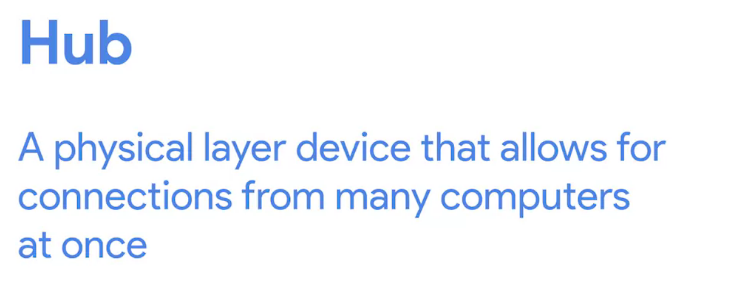

Hubs are outdated – replacing with switch. Hubs send to every device
–.because it’s layer 1. Switch can find which device is intended and
send to correct device (layer 2)/

A switch is a more modern version of a bridge.

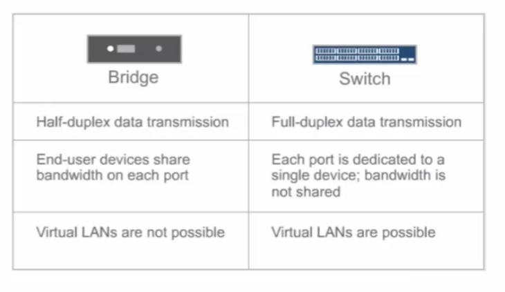

#### **Routers**

Routers sit between networks and direct traffic, based on the IP address
of the destination network. In the TCP/IP model, routers are a part of
the network layer. The IP address of the destination network is
contained in the IP header. The router reads the header information and
forwards the packet to the next router on the path to the destination.
This continues until the packet reaches the destination network. Routers
can also include a firewall feature that allows or blocks incoming
traffic based on information in the transmission. This stops malicious
traffic from entering the private network and damaging the local area
network.

#### **Modems and wireless access points**

**Modems**

Modems usually interface with an internet service provider (ISP). ISPs
provide internet connectivity via telephone lines or coaxial cables.
Modems receive transmissions from the internet and translate them into
digital signals that can be understood by the devices on the network.
Usually, modems connect to a router that takes the decoded transmissions
and sends them on to the local network.

**Note:** Enterprise networks used by large organizations to connect
their users and devices often use other broadband technologies to handle
high-volume traffic, instead of using a modem. 

**Wireless access point**

A wireless access point sends and receives digital signals over radio
waves creating a wireless network. Devices with wireless adapters
connect to the access point using Wi-Fi. Wi-Fi refers to a set of
standards that are used by network devices to communicate wirelessly.
Wireless access points and the devices connected to them use Wi-Fi
protocols to send data through radio waves where they are sent to
routers and switches and directed along the path to their final
destination.

### Network Design: Using network diagrams as a security analyst

Network diagrams allow network administrators and security personnel to
imagine the architecture and design of their organization’s private
network.

Network diagrams are topographical maps that show the devices on the
network and how they connect. Network diagrams use small representative
graphics to portray each network device and dotted lines to show how
each device connects to the other. Security analysts use network
diagrams to learn about network architecture and how to design
networks. 

## Network Types

### LAN

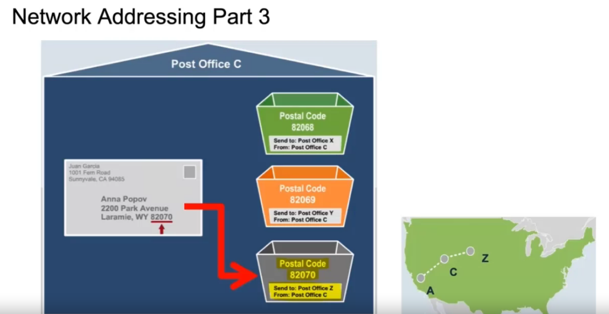

In this video, you will learn to; describe how Ethernet networks work,
describe the difference between the Layer 2 and Layer 3 addressing
schemes. Greetings. Today we're going to discuss Ethernet and Local Area
Networks. This lecture was developed by Moises Monge and is being
presented by Ben Briggs. Let's talk about ethernet and LAN. This lesson
will be an introduction to the Local Area Network. Our objectives will
be to; describe how the Ethernet networks work, understand the various
network devices and differentiate between them, understand the
difference between a collision and a broadcast domain, describe
different ways of segmenting broadcast domains, understand how Virtual
Local Area Networks work, understand the different addressing schemas
used in modern networks. The two different addressing schemas just
mentioned are shown here. One on Layer 2, the data link layer of the OSI
model, and the other on Layer 3, the network layer. The data link layer,
uses MAC addresses, while the network layer uses IP addresses, which
could be IPv4 or IPv6 format. The way a packet is delivered from one
network to another, from one host to another, can be compared to the way
the postal service delivers mail. We will put a message inside of an
envelope, which is similar to the way the data is encapsulated within
one packet header. Then the header is encapsulated within another
header. The IP packet is then encapsulated on an Ethernet frame at the
data link layer, or another type of Layer 2 frame if something other
than Ethernet is being used by the network. Finally, this is all
encapsulated one more time with physical information added at the Layer
1, the physical layer. This is similar to the way we put the message we
want to send inside of an envelope and write our address and the
destination address on the envelope, including the city, state, country,
and postal codes. The post office puts your envelope in a shipping crate
destined for the postal code and marks that code clearly on the outside
of the crate. The post office will search for the shortest and most
efficient route, to get the crate from its current location to the
postal office designated by the destination postal code. This is similar
to how a Layer 2 device, or router, searches for the most efficient
route for sending your message across the network or the Internet. Once
the shipping crate has been received by the destination post office in
the country, state, and city you specified, your envelope will be
removed and driven to the street and the house or apartment number
specified and placed in a mailbox. Your friend will receive the
envelope, open it, and read your message. As you can see, each step
taken to encapsulate your message prior to it actually being sent, is
undone, one step at a time in reverse order at the receiving end. The
Layer 2 address and Layer 3 address are quite different. Layer 2
addresses are known as Media Access Control or MAC addresses. MAC are
also referred to as hardware addresses, physical addresses, or burned-in
addresses, because they are permanently etched into every network
interface card and are unique to that card. Of the billions of network
interface cards ever produced, no two have the same MAC address. This is
an example of a MAC address which is a six octet address for a total of
48 bits. Every time a packet passes through a Layer 3 device, like a
router, and passes from one network to another, the Layer 2 information
in the packet header is stripped out and replaced with new physical
source of destination addresses. The Layer 3 address is the IP address,
which is also known as the logical address. This is an example of a
private IPv4 address that is not routable on the Internet. Layer 3
addresses identify computers or endpoints and do not change as the
packets are routed. With the exception of substitutions made by NAT
routers, of course. Let's look at how Local Area Networks work so we can
better understand the connections between devices and the rules
controlling their communication. In order to deliver information from
one host to another within the same Local Area Network, we need to know
the MAC address associated with the IP address of the destination
device.

Play video starting at :4:52 and follow transcript4:52

Let's jump on our server and take a look. Let's say we want to ping this
address, 192.168.52.2. Ping or packet Internet groper, is a utility that
measures the time it takes to send a packet to another computer and
receive a response back. It's the easiest way to quickly test if there's
an open communication route between your computer and another system.
You can see that the ping was successfully delivered and we've received
a response. You can ping an IP address because the Address Resolution
Protocol or ARP, is able to make an association between the IP address
we typed in and the MAC address that you can now see on the screen. This
works fine for communication or Local Area Network. But when we need to
deliver a packet outside a Local Area Network, the default gateway is
the device that will make sure the packet is forwarded outside of the
local network. Now let's try to ping 4.2.2.2, an address which is
outside of our LAN. But the default gateway address is not found in our
ARP table, which is why the ping did not succeed. No default gateway
means no packets get routed outside a Local Area Network. <u>To
summarize, in order to deliver a message to any computer within our LAN,
whether the packet originated from a computer within the LAN or was
routed to our LAN from an outside network, we need to know the MAC
address that was associated with a destination IP address.</u>

### VLAN

Note: This is not subetting – the subnet mask doesn’t change – nor the
local ip. All we’re doing is segregating a group of devices from another
group based on which physical ports they are plugged into at the switch.
This requires a **layer-3** **managed switch (as these are capable of
routing).**

Incorporating VLANs into the network structure is recommended as a form
of network segmentation; it will make controlling access to various
services easier to manage. VLANs can be created for broad roles or
functions for devices and services. An engineering VLAN can be used to
place all engineering workstations and engineering services on. An
Infrastructure VLAN can be used for all infrastructure devices, like
wireless APs, network devices, and critical servers like authentication.
A Sales VLAN can be used for non-engineering machines, and a Guest VLAN
would be useful for other devices that don't fit the other VLAN
assignments.

### WAN (Wide area network)

Unless you end up working as a network engineer at an Internet service
provider, chances are you’ll never have to directly interact with any of
the protocols that allow for WAN technologies to work. But, if you’d
like to learn more about some of the more popular options, you can read
about them on Wikipedia. It’s important to note that these protocols
usually define how both the physical and data link layers need to
operate when they’re deployed.

Networks are identified by logical addresses (IP addresses). Physical,
MAC, and Ethernet addresses are all different names for the same thing.

**Check out Frame Relay**: <https://en.wikipedia.org/wiki/Frame_Relay>

**HDLC, or High-Level Data Link Control**:
<https://en.wikipedia.org/wiki/High-Level_Data_Link_Control>

**ATM, or Asynchronous Transfer Mode: here**:
<https://en.wikipedia.org/wiki/Asynchronous_Transfer_Mode>

## *OSI 7-Layer Model*

The **TCP/IP model** is a framework used to visualize how data is
organized and transmitted across a network. This model helps network
engineers and network security analysts design the data network and
conceptualize processes on the network and communicate where disruptions
or security threats occur.

The TCP/IP model has four layers: network access layer, internet layer,
transport layer, and application layer. When analyzing network events,
security professionals can determine what layer or layers an attack
occurred in based on what processes were involved in the incident.

The **OSI model** is a standardized concept that describes the seven
layers computers use to communicate and send data over the network.
Network and security professionals often use this model to communicate
with each other about potential sources of problems or security threats
when they occur.

Some organizations rely heavily on the TCP/IP model, while others prefer
to use the OSI model. As a security analyst, it’s important to be
familiar with both models. Both the TCP/IP and OSI models are useful for
understanding how networks work. 

### Layer 7: Application layer

The application layer includes processes that directly involve the
everyday user. This layer includes all of the networking protocols that
software applications use to connect a user to the internet. This
characteristic is the identifying feature of the application layer—user
connection to the network via applications and requests.

An example of a type of communication that happens at the application
layer is using a web browser. The internet browser uses HTTP or HTTPS to
send and receive information from the website server. The email
application uses simple mail transfer protocol (SMTP) to send and
receive email information. Also, web browsers use the domain name system
(DNS) protocol to translate website domain names into IP addresses which
identify the web server that hosts the information for the website.

### Layer 6: Presentation layer

Functions at the presentation layer involve data translation and
encryption for the network. This layer adds to and replaces data with
formats that can be understood by applications (layer 7) on both sending
and receiving systems. Formats at the user end may be different from
those of the receiving system. Processes at the presentation layer
require the use of a standardized format.

Some formatting functions that occur at layer 6 include encryption,
compression, and confirmation that the character code set can be
interpreted on the receiving system. One example of encryption that
takes place at this layer is SSL, which encrypts data between web
servers and browsers as part of websites with HTTPS.

### Layer 5: Session layer

A session describes when a connection is established between two
devices. An open session allows the devices to communicate with each
other. Session layer protocols occur to keep the session open while data
is being transferred and terminate the session once the transmission is
complete. 

The session layer is also responsible for activities such as
authentication, reconnection, and setting checkpoints during a data
transfer. If a session is interrupted, checkpoints ensure that the
transmission picks up at the last session checkpoint when the connection
resumes. Sessions include a request and response between applications.
Functions in the session layer respond to requests for service from
processes in the presentation layer (layer 6) and send requests for
services to the transport layer (layer 4).

### Layer 4: Transport layer

The transport layer is responsible for delivering data between devices.
This layer also handles the speed of data transfer, flow of the
transfer, and breaking data down into smaller segments to make them
easier to transport. Segmentation is the process of dividing up a large
data transmission into smaller pieces that can be processed by the
receiving system. These segments need to be reassembled at their
destination so they can be processed at the session layer (layer 5). The
speed and rate of the transmission also has to match the connection
speed of the destination system. TCP and UDP are transport layer
protocols. 

### Layer 3: Network layer

The network layer oversees receiving the frames from the data link layer
(layer 2) and delivers them to the intended destination. The intended
destination can be found based on the address that resides in the frame
of the data packets. Data packets allow communication between two
networks. These packets include IP addresses that tell routers where to
send them. They are routed from the sending network to the receiving
network. 

### Layer 2: Data link layer

The data link layer organizes sending and receiving data packets within
a single network. The data link layer is home to switches on the local
network and network interface cards on local devices.

Protocols like network control protocol (NCP), high-level data link
control (HDLC), and synchronous data link control protocol (SDLC) are
used at the data link layer.

### Layer 1: Physical layer 

As the name suggests, the physical layer corresponds to the physical
hardware involved in network transmission. Hubs, modems, and the cables
and wiring that connect them are all considered part of the physical
layer. To travel across an ethernet or coaxial cable, a data packet
needs to be translated into a stream of 0s and 1s. The stream of 0s and
1s are sent across the physical wiring and cables, received, and then
passed on to higher levels of the OSI model.

## OSI 7-Layer vs TCP/IP 5-Layer

The TCP/IP model next to the OSI model

The OSI visually organizes network protocols into different layers.
Network professionals often use this model to communicate with each
other about potential sources of problems or security threats when they
occur.

The TCP/IP model combines multiple layers of the OSI model. There are
many similarities between the two models. Both models define standards
for networking and divide the network communication process into
different layers. The TCP/IP model is a simplified version of the OSI
model.  

The **OSI** visually organizes network protocols into different layers.
Network professionals often use this model to communicate with each
other about potential sources of problems or security threats when they
occur.

The TCP/IP model combines multiple layers of the OSI model. There are
many similarities between the two models. Both models define standards
for networking and divide the network communication process into
different layers. The TCP/IP model is a simplified version of the OSI
model.

OSI 7-layer models adds in two more layers under the application layer
and above transport layer:

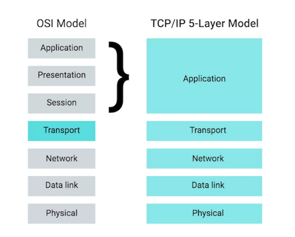

The concept of a session layer is that it's responsible for things like
facilitating the communication between actual applications and the
transport layer. It's the part of the operating system that takes the
application layer data that's been unencapsulated from all the layers
below it, and hands it off to the next layer in the OSI model, the
presentation layer. The presentation layer is responsible for making
sure that the unencapsulated application layer data is actually able to
be understood by the application in question. This is the part of an
operating system that might handle encryption or compression of data.

While these are important concepts to keep in mind, you'll notice that
there isn't any encapsulation going on. That's why in our model we lump
all of these functions into the application layer. We believe a
five-layer model is the most useful when it comes to the day-to-day
business of understanding networking, but the seven-layer OSI model is
also prevalent. No networking education would be complete without
understanding its basics.

## TCP/IP 5-layer model \[MAIN\]

**<u>The TCP/IP model</u>**

The **TCP/IP model** is a framework used to visualize how data is
organized and transmitted across a network. This model helps network
engineers and network security analysts conceptualize processes on the
network and communicate where disruptions or security threats occur. 

The TCP/IP model has four layers: network access layer, internet layer,
transport layer, and application layer. When troubleshooting issues on
the network, security professionals can analyze and deduce which layer
or layers an attack occurred based on what processes were involved in an
incident.

### (1) Physical Layer (cables)

Most modern cables are copper or fiber optic (glass).

Standard CAT6 cable has 8 wire consisting of 4 twisted pairs – supports
duplex comms.

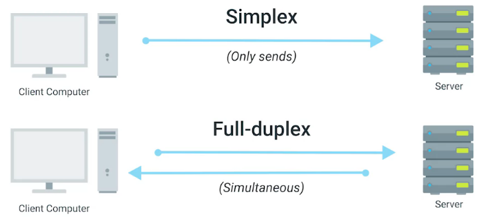

Full duplex allows communications in two directions at the same time;
half duplex means that only one side can communicate at a time.

<https://en.wikipedia.org/wiki/Ethernet_over_twisted_pair>

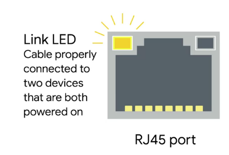

### (2) Data Link Layer (Ethernet, MAC)

#### MAC Address (media access control?)

**Six total octets**

Specify the **manufacturer**. Next (last) three octets are defined by
the vendor and kept globally unique..

MAC addresses are made up of 12 hexadecimal characters (6 octets).

\>\> **The Mac is 48 bits long** or a string of 48 1s and 0s, this
address is divided into 6 octets or 6 groups of 8 bits each. The first
three octets are reserved to identify the manufacturer of the NIC and
are called the organizationally unique identifier or OUI. The last three
octets are used by the manufacturer to identify each unique card. With
more than 300 million new devices connecting to the Internet each month,
we might wonder if we risk running out of available Mac addresses. Well,
two to the 48th power is about 281 trillion, so at the current rate of
consumption, we have just under a million months to go before we run
into trouble with Mac addresses.

To see your computer's MAC address, open a terminal or command prompt
window. On Linux systems, run the IF config command. On windows systems,
run ipconfig/all and the physical address is clearly listed among the
many other parameters in addresses.

Play video starting at :2:45 and follow transcript2:45

\>\> In this example, we'll use secure shell or SSH to connect to the
router.

I enter the password and we see the information for all the interfaces.

Remember each individual network interface has its own address
regardless of how many network interfaces are in a single device.

So looking more closely at this one, we can see the layer 2 MAC address.

This is the physical address or MAC address of my system, and this is
the broadcast address that can be used to send a message to all the
devices in this network segment.

Notice that the Mac address does not appear at six groups with eight 1s
and 0s in each group, but has been condensed by representing each binary
octet by two hexadecimal or base 16 numbers instead to make them easier
for us humans to work with. The computer still sees the eight 1s and 0s,
but displays only to hex numbers for our benefit.

\>\> When the packet is sent from one computer to another, the packet
header will contain both the layer 2 and The layer 3 address. The packet
is actually delivered to the layer 2 or MAC address, and the computer
then verifies that the layer 3 or IP address in the header matches its
own assigned IP address. The system then checks to make sure the layer 2
MAC address in the packet header matches that of the system, and if it
does, it will start processing the packet. When we talk about broadcast
domains, we're talking about the segment of the network that are
computer is on.

Looking at the router we logged into, we can see that it has many
network interfaces, we have the enpos3, enpos8, and enpos9. So this
device is connected to three different networks, which means three
different broadcast domains. You will see what my local IP address is,
what the broadcast address is. If the packet is sent to the broadcast
address, all the end points within that broadcast address will receive
the packet. Broadcast domains can also be called virtual lans or Vlans.

Switches watch all inbound frames and learn MAC addresses from them.
Switches definitely need to know MAC addresses, which they learn
automatically without needing to query hosts or be manually programmed.

#### Problem regard collision detection

#### Ethernet Frame

Data packets at the Ethernet level are known as Ethernet frames. An
Ethernet frame is a highly structured collection of information
presented in a specific order.

The first seven bytes are a series of alternating ones and zeros. These
act partially as a buffer between frames and can also be used by the
network interfaces to synchronize internal clocks they use, to regulate
the speed at which they send data. This last byte in the preamble is
known as the SFD or start frame delimiter.

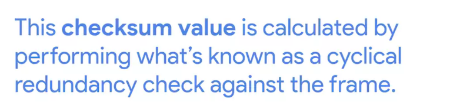

#### Summary

In this video, you will learn to understand the difference between
collision and broadcast domains. Describe the different ways available
to segment broadcast domains. In order to connect to a local area
network, we need to connect through a medium on layer one, the physical
layer. This could be wired using an ethernet cable for example, or it
could be a wireless connection. The frame or header of layer to the data
link layer contains the source and destination MAC IP addresses, the
protocol type, whatever we're using IPV4 or IPV6, etc. The data itself
and the checksum. The checksum is a number that's calculated by an
algorithm that looks at the data being transmitted after the frame is
encapsulated, the receiving host recalculates the checksum on the
received packet as a way of making sure that the packet has not changed
in any way during transmission. If the packet is changed, it is dropped
or request is sent to transmitted again depending upon the upper layer
protocol being used. All modern network support full-duplex
communications so computers can send and receive data at the same time.
Some older networks did not support full-duplex and only supported
half-duplex, which limits the computer to switching back and forth
between sending data and receiving data. To deal with half duplexing,
the old networks used a protocol called Carrier Sense Multiple Access
Collision Detection. This protocol would detect if it was okay to
transmit data, and it would detect when collisions occurred. If there
was a collision, it would simply wait for a random period of time and
try again. The protocol is not needed in today's networks since
everything is full-duplex and we can send and receive packets
simultaneously without collisions. How does a NIC know if a packet is
intended for its computer? The receiving computer takes the data and
moves it back up the stack one layer at a time. Layer one converts the
electronic signals to digital bits and forwards the frame to layer two,
the data link layer. Layer two checks to make sure the destination MAC
address matches its own MAC address, and if it does, it strips off the
layer two header and forwards the data as a packet to layer three, the
network layer. Layer three checks to make sure the destination IP
address matches its IP address. If it does, it strips off the layer
three header and sends the packet on up to layer four. If either the
destination MAC address or the destination IP address do not match the
receiving computers MAC and IP address, the packet will be discarded as
not being intended for this system. Let's touch briefly on the Internet
frame preamble. The preamble is the first eight bytes of an ethernet
frame. The first seven bytes are just a series of alternating ones and
zeros. This is used as a buffer to separate adjacent ethernet frames,
and it helps the network regulate the speed at which the data is sent.
The last byte of the preamble is called the Start Frame Delimiter or
SFD. The SFD lets the receiving computer know that the preamble is over
and what follows is the actual frame contents. This is an example of a
MAC address. Remember, this is a 48-bit address divided into six octets.
The first three octets makeup the organizationally unique identifier.
This uniquely identifies the manufacturer of the NIC. The remaining
three octets are assigned by the manufacturer as the unique identifier
for this specific card. Combine these two sets and every network card
ever made has unique MAC address to identify it. When a computer
receives a frame, the first thing it does is look at the destination
address. If the destination address matches its own MAC address, it will
pass it up to the next higher layer protocol. If it does not match, it
will drop the frame. From here we need to determine Unicast, multicast,
or broadcast.

### (3) Network Layer (IP)

On a local area network or LAN, nodes can communicate with each other
through their physical MAC addresses. This works well on small scale
because switches can quickly learn the MAC addresses connected to each
other ports to forward transmissions appropriately. But MAC addressing
isn't a scheme that scales well, every single network interface on the
planet has a unique MAC address and they aren't ordered in any
systematic way. There is no way of knowing where on the planet a certain
MAC address might be at any one point in time, so it's not ideal for
communicating across distances.

IP addresses are a 32 bit long numbers made up of four octets, and each
octet is normally described in decimal numbers. 8 bits of data or a
single octet can represent all decimal numbers from 0 to 255.

This format is known as **dotted-decimal notation**:

^ (above) because we are using binary octets, each octet will never
exceed 255 (256 possible value, 0 - 255).

IP addresses belong to the networks, not the devices attached to those
networks. So your laptop will always have the same MAC address no matter
where you use it, but it will have a different IP address assigned to it
at an Internet cafe than it would when you're at home. The LAN at the
Internet cafe, or the LAN at your house would each be individually
responsible for handing out an IP address to your laptop if you power it
on there.

- **Dynamic IP address**: IP assigned by DHCP dynamically.

- **Static IP address**: Configured manually.

In most cases static IP addresses are reserved for servers and network
devices, while dynamic IP addresses are reserved for clients. But there
are certainly situations where this might not be true.

**IP:** <https://youtu.be/A1g9SokDJSU>

#### IP Datagrams and Encapsulation

Just like all the data packets at the Ethernet layer have a specific
name, Ethernet frames, so do packets at the network layer. Under the IP
protocol, a packet is usually referred to as an IP datagram. Just like
any Ethernet frame, an IP datagram is a highly structured series of
fields that are strictly defined. The two primary sections of an IP
datagram are the header and the payload.

- **Version**

  - IPv4/IPv6

- **Header Length**

  - 20bytes (almost always – also the minimum in IPv4)

- **Service Type (8bits)**

  - These eight bits can be used to specify details about quality of
    service or QoS technologies.(service type field).

  - These 8 bits can be used to specify details about quality of
    service, or QoS, technologies. The important take away about QoS is
    that they’re services that allow routers to make decisions about
    which IP datagram may be more important than others.

  - So quality of service is a toolset which allows you to meter how
    much bandwidth things get based on IP address. You can give a
    certain IP address more bandwidth than others. You can give a
    certain Mac address more or less bandwidth than others. You can
    assert certain ports to have more or less bandwidth than others.
    It's really completely up to you and how you want to configure this.
    This is actually one of these features that people don't nearly take
    advantage of enough.

- **Total Length (16bit)**

  - Largest possible = 65,535

- **Identification (16bit)**

- **Protocol**

  - 

- **Flags**

  - 

- **TTL**

  - 

  - Usually set at 64 hops

- **Header Checksum**

- **Source IP (32bit like IPs)**

- **Destination IP (32bit like IPs)**

- **Options**

- **Padding: Filled with zeros**

You might remember that in our breakdown of an Ethernet frame, we
mentioned a section we described as the data payload section. This is
exactly what the IP datagram is, and this process is known as
encapsulation. The entire contents of an IP datagram are encapsulated as
the payload of an Ethernet frame. You might have picked up on the fact
that our IP datagram also has a payload section. The contents of this
payload are the entirety of a TCP or UDP packet which we'll cover later.

##### From Google’s CybserSec Course

###### Operations at the network layer

Functions at the network layer organize the addressing and delivery of
data packets across the network and internet from the host device to the
destination device. This includes directing the packets from one router
to another router across the internet, based on the internet protocol
(IP) address of the destination network. The destination IP address is
contained within the header of each data packet. This address will be
stored for future routing purposes in  routing tables along the packet’s
path to its destination.

All data packets include an IP address; this is referred to as an IP
packet or datagram. A router uses the IP address to route packets from
network to network based on information contained in the IP header of a
data packet. Header information communicates more than just the address
of the destination. It also includes information such as the source IP
address, the size of the packet, and which protocol will be used for the
data portion of the packet. 

###### Format of an IPv4 packet

Next, you can review the format of an IP version 4 (IPv4) packet and
review a detailed graphic of the packet header. An IPv4 packet is made
up of two sections, the header and the data:

- The size of the IP header ranges from 20 to 60 bytes. The header
  includes the IP routing information that devices use to direct the
  packet. The format of an IP packet header is determined by the IPv4
  protocol.

- The length of the data section of an IPv4 packet can vary greatly in
  size. However, the maximum possible size of an IP packet is 65,536
  bytes. It contains the message being transferred to the transmission,
  like website information or email text.

There are 13 fields within the header of an IPv4 packet:

- **Version:** The first 4-bit header tells receiving devices what
  protocol the packet is using. The packet used in the illustration
  above is an IPv4 packet.

- **IP Header Length (HLEN):** HLEN is the packet’s header length. This
  value indicates where the packet header ends and the data segment
  begins. 

- **Type of Service (ToS):** Routers prioritize packets for delivery to
  maintain quality of service on the network. The ToS field provides the
  router with this information.

- **Total Length:** This field communicates the total length of the
  entire IP packet, including the header and data. The maximum size of
  an IPv4 packet is 65,535 bytes.

- **Identification:** For IPv4 packets that are larger than 65, 535
  bytes, the packets are divided, or fragmented, into smaller IP
  packets. The identification field provides a unique identifier for all
  the fragments of the original IP packet so that they can be
  reassembled once they reach their destination. 

- **Flags:** This field provides the routing device with more
  information about whether the original packet has been fragmented and
  if there are more fragments in transit.

- **Fragmentation Offset:** The fragment offset field tells routing
  devices where in the original packet the fragment belongs.

- **Time to Live (TTL):** TTL prevents data packets from being forwarded
  by routers indefinitely. It contains a counter that is set by the
  source. The counter is decremented by one as it passes through each
  router along its path. When the TTL counter reaches zero, the router
  currently holding the packet will discard the packet and return an
  ICMP Time Exceeded error message to the sender. 

- **Protocol:** The protocol field tells the receiving device which
  protocol will be used for the data portion of the packet.

- **Header Checksum:** The header checksum field contains a checksum
  that can be used to detect corruption of the IP header in transit.
  Corrupted packets are discarded.

- **Source IP Address:** The source IP address is the IPv4 address of
  the sending device.

- **Destination IP Address:** The destination IP address is the IPv4
  address of the destination device.

- **Options:** The options field allows for security options to be
  applied to the packet if the HLEN value is greater than five. The
  field communicates these options to the routing devices.

#### IP Address Classes

IP addresses can be split into two sections, the **network ID** and the
**host ID**. Earlier we mentioned that IBM owns all IP addresses that
have a nine as the value of the first octet in an IP address. If we take
an example IP address of 9.100.100.100, the network ID would be the
first octet, and the host ID would be the second, third and fourth
octets. The address class system is a way of defining how the global IP
address space is split up.

There are **three primary types of address classes**.

- **Class A** addresses are those where the first octet is used for the
  network ID and the last three are used for the host ID.

- **Class B** addresses are where the first two octets are used for the
  network ID, and the second two are used for the host ID.

  - 

- **Class C** addresses, as you might have guessed, are those where the
  first three octets are used for the network ID, and only the final
  octet is used for the host ID.

  - Has 254 IP addresses

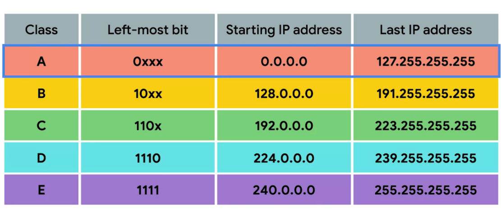

^ (above) Look at the first octet, for each class and take note of the
possible range of values for each class by comparing the Start and Last
possible IPs for each first octet of each class. Class D is used for
multitasking and class E is used for testing – A,B, and C are the
primary IP classes.

**Available IPs by class**

As the available IPs for the host increases the available IPs for the
Network ID decreases as a result.

As the available IPs for the host increases the available IPs for the
Network ID decreases as a result.

##### Private IP Addressing and IP classes

The private Ips for a given network depends on the class of the public
ip (outward facing ip of default gateway).

#### ARP

ARP is a protocol used to discover the hardware address of a node with a
certain IP address. Once it IP datagram has been fully formed, it needs
to be encapsulated inside an Ethernet frame. This means that the
transmitting device needs a destination MAC address to complete the
Ethernet frame header. Almost all network connected devices will retain
a local ARP table. An ARP table is just a list of IP addresses an the
Mac addresses associated with them.

Let's say we want to send some data to the IP address 10.20.30.40. It
might be the case that this destination doesn't have an entry in the ARP
table. When this happens, the node that wants to send data sends a
broadcast ARP message to the Mac broadcast address, which is all F's.

These kinds of broadcasts ARP messages are delivered to all computers on
the local network. When the network interface that's been assigned an IP
of 10.20.40 receives this ARP broadcast, it sends back what's known as
an ARP response. This response message will contain the MAC address for
the network interface in question. Now, the transmitting computer knows
what MAC address to put in the destination hardware address field, and
the Ethernet frame is ready for delivery. It'll also likely store this
IP address in its local ARP table, so that it won't have to send an ARP
broadcast the next time it needs to communicate with this IP, handy. ARP
table entries generally expire after a short amount of time to ensure
changes in the network are accounted for.

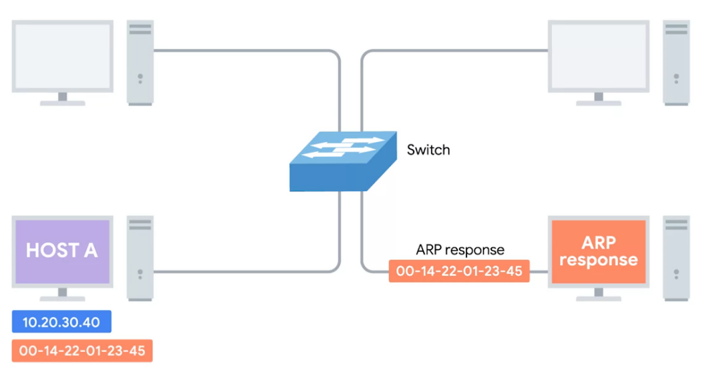

#### DHCP

There are a few standard ways that DHCP can operate.

- **DHCP dynamic allocation**, is the most common, and it works how we
  described it just now. A range of IP addresses is set aside for client
  devices and one of these IPs is issued to these devices when they
  request one. Under a dynamic allocation the IP of a computer could be
  different almost every time it connects to the network.

- **Automatic allocation** is very similar to dynamic allocation, in
  that a range of IP addresses is set aside for assignment purposes. The
  main difference here is that, the DHCP server is asked to keep track
  of which IPs it's assigned to certain devices in the past. Using this
  information, the DHCP server will assign the same IP to the same
  machine each time if possible.

- **Fixed allocation** requires a manually specified list of MAC address
  and their corresponding IPs. When a computer requests an IP, the DHCP
  server looks for its MAC address in a table and assigns the IP that
  corresponds to that MAC address. If the MAC address isn't found, the
  DHCP server might fall back to automatic or dynamic allocation, or it
  might refuse to assign an IP altogether.

NTP stands for Network Time Protocol and is used to keep all computers
on a network synchronized in time.

##### DHCP discovery

The process by which a client configured to use DHCP attempts to get
network configuration information is known as DHCP discovery. The DHCP
discovery process has four steps.

- First, we have the server discovery step.

  - 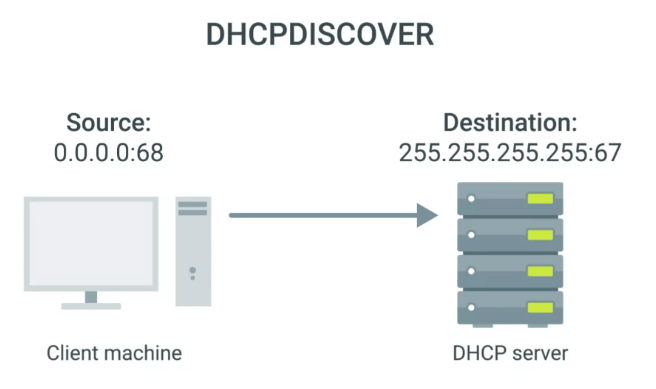

- Next, the DHCP server would examine its own configuration and would
  make a decision on what, if any, IP address to offer to the client.

#### NAT (network and transport)

##### General

\>\> Now, let's take a look at Network Address Translation or NAT. This
is very common in both home and enterprise-level networks. Basically
network address translation masquerades the real IP address, the IP
address is configured on the system with a different IP address, for use
on another network.

The most common example is when IP addresses from an internal network,
are translated from the private IP address that is on the computer to an
External or public IP address that is routable across the internet. Of
course, the reverse operation is performed for traffic coming from the
internet, that needs to go to a computer on the internal network.

This is not always the case, sometimes we want to translate from a
private IP address to another private IP address, or from a public IP
address to another public IP address. So in a nutshell network address
translation does exactly what its name implies.

Normally, NAT routers have a public IP address on their WAN interface
and a private IP address on their LAN interface. The other answers are
not correct.

Network address translation is a method of remapping the IP address
space, by modifying the network address information in the internet
Protocol IP datagram packet headers, while they're passing through a NAT
router.

Basically, the router will read the layer 3 information, and if there is
any net procedure, it will modify the source or destination IP address.
NAT gives us an additional layer of security by preventing the real IP
addresses of the systems that are network, from being exposed to the
world across the internet.

Each of an organization's computers could be represented by a different
IP address outside the network that is used inside the network, or the
entire organization could be represented by a single public IP address
exposing only the IP address of the firewall publicly. That is something
that is really common in global networking. IP address mapping by a NAT
can be performed in a few ways. Here are the most common configurations,
static map provides a simple one-to-one mapping between one IP address
and another, this is typically one private or internal address map to
one public or external address. Everytime the NAT sees one address, it
substitutes the other address that it's mapped to and forwards it onto
its destination. Dynamic NAT uses a pool of IP addresses and dynamically
maps one of these to the incoming packet. For example an organization
with 100 computers in its network, each with its own private or internal
IP address, could share a much smaller pool of public addresses that are
used only for packets that get routed outside the firewall to the
internet. Finally, we have what's called Static NAT overloading, in this
configuration the NAT will map all of the internal IP address to a
single external or public IP address. So hundreds or even thousands of
users will have their local IP addresses converted to a single public IP
address when leaving their local network.

This could work because the NAT also assigns a unique layer for source
or destination port number to each IP address it maps, so it can
properly differentiate between all of the local users who are now
sharing the single public IP address. This process is also known as port
address translation or path. Obviously, this means that the NAT must
maintain a database to keep track of all the addresses and port mapping
that it has assigned, so any packets can be properly translated back to
local IP and port information so they can be properly routed once back
inside the local network.

##### Nat Overloading/Port Address Translation (PAT) \[One-to-many NAT\]

##### AAPIPA (Link-local range)

An ip starting with **169.154** cannot connect to internet as this range
is recognized to be statically set as locally only.

##### Network Layer

Your router’s receptionist

Normally, a router will inspect the contents of an IP datagram,
decrement the TTL by 1, re-calculate the checksum, and forward the rest
of the data at the network layer without touching it. But with NAT, the
router will also rewrite the source IP address, which in this instance,
becomes the router's IP on network B or 192.168.1.1. When the datagram
gets to computer 2, it'll look like it originated from the router, not
from computer 1.

Now, computer 2 crafts its response and sends it back to the router. The
router, knowing that this traffic is actually intended for computer 1,
rewrites the destination IP field before forwarding it along. What NAT
is doing in this example, is hiding the IP of computer 1 from computer
2. This is known as **IP masquerading**.

##### Transport Layer NAT

Port preservation is a technique where the source port chosen by a
client, is the same port used by the router.

##### RIRs

The [IANA](https://www.iana.org/) (**Internet Assigned Numbers
Authority**) has been in charge of distributing IP addresses since 1988.
Since that time, the internet has expanded at an incredible rate! The
4.2 billion possible IPv4 addresses have almost run out, as it’s long
been predicted. 

For some time now, the IANA has primarily been responsible for assigning
address blocks to the five regional internet registries or RIRs. The
five RIRs are:

- [**<u>AFRINIC</u>**](https://afrinic.net/), which serves the continent
  of Africa

- [**<u>ARIN</u>**](https://www.arin.net/), which serves the United
  States, Canada and parts of the Caribbean

- [**<u>APNIC</u>**](https://www.apnic.net/), which is responsible for
  most of Asia, Australia and New Zealand and Pacific Island nations

- [**<u>LACNIC</u>**](https://www.lacnic.net/), which covers Central and
  South America and any parts of the Caribbean not covered by ARIN

- [**<u>RIPE</u>**](https://www.ripe.net/), which serves Europe,
  Russia,the Middle East, and portions of Central Asia

These five RIRs have been responsible for assigning IP address blocks to
organizations within their geographic areas and most have already run
out. The [IANA assigned the last unallocated /8 network blocks to
various RIRs](https://www.nro.net/ipv4-free-pool-depleted) on February
3rd, 2011. Then on April 2011, [APNIC reached its final /8 of
addresses](https://mailman.apnic.net/mailing-lists/apnic-announce/archive/2011/04/msg00002.html).
[RIPE was
next](https://www.ripe.net/publications/news/announcements/ripe-ncc-begins-to-allocate-ipv4-address-space-from-the-last-8),
in September of 2012. [LACNIC reached its final
/10](https://www.lacnic.net/en/web/anuncios/2014-no-hay-mas-direcciones-ipv4-en-lac)
in June 2014. [ARIN exhausted its list of free IPv4
addresses](https://www.arin.net/vault/announcements/2015/20150924.html)
in September 2015. Only [AFRINIC has some IPs
left](https://afrinic.net/exhaustion).

#### Routers & Routing

> **Routers**: Coordinate the protocols of the incoming/outgoing
> communication. They bundle up all the connection details for the start
> of an internet communication (sender, destination IP, etc) and this
> communication will be sent to an ISP in the form of a ***network
> protocol** (*like a wifi protocol – which itself is a type of internet
> protocol). Note: Not all routers produce wireless access.

**Interior/ exterior gateway protocols**

Routing protocols fall into two main categories, interior gateway
protocols, and exterior gateway protocols.

- **Interior gateway protocols**: Interior gateway protocols are used by
  routers to share information within a single autonomous system. In
  networking terms, an autonomous system is a collection of networks
  that all fall under the control of a single network operator. Interior
  gateway protocols are further split into two categories,

  - **link state routing protocols**

  - **distance-vector protocols**.

- **Exterior gateway protocols**:

##### DNS and Domains

<https://blog.dnsimple.com/2015/02/top-dns-servers/>

**Caching** and **recursive** name servers are generally provided by an
ISP or your local network. Their purpose is to store domain name lookups
for a certain amount of time. There are lots of steps in order to
perform a fully qualified resolution of a domain name. In order to
prevent this from happening every single time a new TCP connection is
established, your ISP or local network will generally have a **caching
name server available**. Most caching name servers are also recursive
name servers.

**Recursive name servers** are ones that perform full DNS resolution
requests. In most cases, your local name server will perform the duties
of both, but it's definitely possible for a name server to be either
just caching or just recursive.

**Anycast** is a technique that's used to route traffic to different
destinations depending on factors like location, congestion, or link
health. Using anycast, a computer can send a data gram to a specific IP
but could see it routed to one of many different actual destinations
depending on a few factors. This should also make it clear that there
aren't really only 13 physical route name servers anymore. It's better
to think of them as 13 authorities that provide route name lookups as a
service.

**DNS uses UDP as its connectionless protocol.**

*How DNS would looks if it used TCP: (total of 4 packets)*

*Total of 8 packets with UDP:*

You might be wondering how error recovery plays into this, since UDP
doesn't have any. The answer is pretty simple. The DNS resolver just
asks again if it doesn't get a response. Basically, the same
functionality that TCP provides at the transport layer is provided by
DNS at the application layer in the most simple manner. A DNS server
never needs to care about doing anything but responding to incoming
lookups, and a DNS resolver simply needs to perform lookups and repeat
them if they don't succeed. A real showcase of the simplicity of both
DNS and UDP. I should call out that DNS over TCP does in fact exist and
is also in use all over. As the Web has gotten more complex, it's no
longer the case that all DNS lookup responses can fit in a single UDP
datagram. In these situations, a DNS name server would respond with a
packet explaining that the response is too large. The DNS client would
then establish a TCP connection in order to perform the lookup.

###### DNS Resource Records (DNS Records)

There are dozens of different resource record types defined, but a lot
of them only serve very specialized purposes.

The most common resource record is known as an A record.

**An A record** is used to point a certain domain name at a certain IPv4
IP address.

In its most basic use, a single A record is configured for a single
domain name. But, a single domain name can have multiple A records, too.
This allows for a technique known as **DNS round robin** to be used to
balance traffic across multiple IPs. Round robin is a concept that
involves iterating over a list of items one by one in an orderly
fashion. The hope is that this ensures a fairly equal balance of each
entry on the list that's selected.

The **CNAME** **record** is also super common. A CNAME record is used to
redirect traffic from one domain to another.

Another important resource record type is the **MX record**. MX stands
for mail exchange and this resource record is used in order to deliver
e-mail to the correct server.

A record type very similar to the MX record is the **SRV record**. SRV
stands for service record, and it's used to define the location of
various specific services. It serves the exact same purpose as the MX
resource record type except for one thing, while MX is only for mail
services, an SRV record can be defined to return the specifics of many
different service types.

###### Domains

Administration and definition of TLDs is handled by a non-profit
organization known as **ICANN**, or the Internet Corporation for
Assigned Names and Numbers.

ICANN is a sister organization to the **IANA**, and together they help
define and control both the global IP spaces, along with the global DNS
system. A registrar is just a company that has an agreement with ICANN
to sell unregistered domain names. When you combine all these parts
together, you have what's known as a fully qualified domain name, or
**FQDN**.

Although you rarely see fully qualified domain names with that many
levels. DNS can technically support up to 127 levels of domain in total
for a single fully qualified domain name.

***Limits***

There are some other restrictions in place for how your domain name can
be specified. Each individual section can only be 63 characters long and
a **complete FQDN is limited to a total of 255 characters**

**Domain Hierarchy**

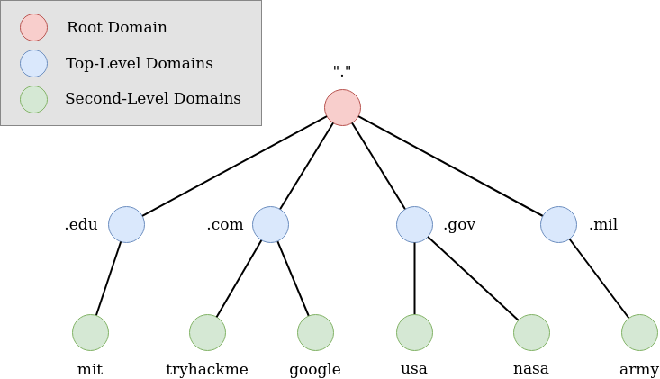**  **

**TLD (Top-Level Domain)  **

A TLD is the most righthand part of a domain name. So, for example, the
tryhackme.com TLD is **.com**. There are two types of TLD, gTLD (Generic
Top Level) and ccTLD (Country Code Top Level Domain). Historically a
gTLD was meant to tell the user the domain name's purpose; for example,
a .com would be for commercial purposes, .org for an organisation, .edu
for education and .gov for government. And a ccTLD was used for
geographical purposes, for example, .ca for sites based in Canada,
.co.uk for sites based in the United Kingdom and so on. Due to such
demand, there is an influx of new gTLDs ranging from .online , .club ,
.website , .biz and so many more. For a full list of over 2000
TLDs [click
here](https://data.iana.org/TLD/tlds-alpha-by-domain.txt).**  **

**Second-Level Domain  **

Taking tryhackme.com as an example, the .com part is the TLD, and
tryhackme is the Second Level Domain. When registering a domain name,
the second-level domain is limited to 63 characters + the TLD and can
only use a-z 0-9 and hyphens (cannot start or end with hyphens or have
consecutive hyphens).**  **

**Subdomain**

A subdomain sits on the left-hand side of the Second-Level Domain using
a period to separate it; for example, in the name admin.tryhackme.com
the admin part is the subdomain. A subdomain name has the same creation
restrictions as a Second-Level Domain, being limited to 63 characters
and can only use a-z 0-9 and hyphens (cannot start or end with hyphens
or have consecutive hyphens). You can use multiple subdomains split with
periods to create longer names, such as jupiter.servers.tryhackme.com.
But the length must be kept to 253 characters or less. There is no limit
to the number of subdomains you can create for your domain name.

###### DNS in action

1.  When you request a domain name, your computer first checks its local
    cache to see if you've previously looked up the address recently; if
    not, a request to your Recursive DNS Server will be made.

2.  A Recursive DNS Server is usually provided by your ISP, but you can
    also choose your own. This server also has a local cache of recently
    looked up domain names. If a result is found locally, this is sent
    back to your computer, and your request ends here (this is common
    for popular and heavily requested services such as Google, Facebook,
    Twitter). If the request cannot be found locally, a journey begins
    to find the correct answer, starting with the internet's root DNS
    servers.

3.  The root servers act as the DNS backbone of the internet; their job
    is to redirect you to the correct Top Level Domain Server, depending
    on your request. If, for example, you
    request [www.tryhackme.com](http://www.tryhackme.com/), the root
    server will recognise the Top Level Domain of .com and refer you to
    the correct TLD server that deals with .com addresses.

4.  The TLD server holds records for where to find the authoritative
    server to answer the DNS request. The authoritative server is often
    also known as the nameserver for the domain. For example, the name
    server
    for [tryhackme.com](http://tryhackme.com/) is [kip.ns.cloudflare.com](http://kip.ns.cloudflare.com/) and [uma.ns.cloudflare.com](http://uma.ns.cloudflare.com/).
    You'll often find multiple nameservers for a domain name to act as a
    backup in case one goes down.

5.  An authoritative DNS server is the server that is responsible for
    storing the DNS records for a particular domain name and where any
    updates to your domain name DNS records would be made. Depending on
    the record type, the DNS record is then sent back to the Recursive
    DNS Server, where a local copy will be cached for future requests
    and then relayed back to the original client that made the request.
    DNS records all come with a TTL (Time To Live) value. This value is
    a number represented in seconds that the response should be saved
    for locally until you have to look it up again. Caching saves on
    having to make a DNS request every time you communicate with a
    server.

###### DNS Zones

We've covered how authoritative name servers are responsible for
responding to name resolution requests for specific domains, but they do
more than that. An authoritative name server is actually responsible for
a specific DNS zone.

Zones are configured through what are known as **zone files**, simple
configuration files that declare all resource records for a particular
zone. So a zone file has to contain an **SOA**, or a **Start of
Authority resource record declaration**. This SOA record declares the
zone and the name of the name server that is authoritative for it. Along
with the SOA record, you'll usually find NS records which indicate other
name servers that may also be responsible for this zone. For
simplicity's sake, we've been referring to server in the singular when
discussing what's responsible for its zone, whether at the root, TLD, or
domain level, but there are often going to be multiple physical servers
with their own FQDNs and IP addresses involved.

Sometimes, you'll also see what are known as **reverse lookup zone
files**. These let DNS resolvers ask for an IP, and get the FQDN
associated with it returned. These files are the same as zone files
except, instead of A and quad A records, which resolve names to IPs,
you'll find mostly pointer resource record declarations. As you might
have guessed, a **PTR**, or **Pointer Record**, resolves an IP to a
name.

###### Troubleshootin

Flush your dns (command prompt)

###### Quiz (name resolution)

##### IP Routing Table

(below) routing table may also include **total number of hops**.

Now suppose, one of these (local) machines sends some info and this hits
the router. The router will first try to see if this should be handled
locally (by looking at the destination address), if not send it out to
the internet.

Taking a look at room A…

Routers and initial configuration

Routers sometimes have a console port where a cable can be plugged it to
access a program for configure a router from a terminal based software.
For modern cases we can use a web interface via the default gateway.

Handy way to calculate number of hosts:

##### Routers and routing tables

In this video, you will learn to describe the different types of routes
defined in a routing table. Describe how MAC addresses show up in a
system's ARP table. Describe in detail how a network knows exactly where
to forward packets successfully. Welcome back. Now let's talk a little
more about routers and routing tables. There are different types of
routes defined in a routing table. In the last video, we saw three
different route types on a single terminal and router. So let's check
again on these routes. There are three routes. The default route is used
to send packets to addresses we have no other information about. For
example, if we send a packet to IP address 4.2.2.2. We don't know
anything about this network. So the packet will be sent to the default
gateway. The default gateway for this subnet is 10.0.4.2. Send the
packet there, and the default gateway will take care of routing it to
another network. The default gateway is doing a good job, as we can see,
since we are getting a successful reply to our ping. We also have three
more routes shown which are directly connected to our server. So this is
saying that this network exists connected to this interface and the same
for these other two. So these are two different types of routes. Routes
to systems that are directly connected to our local network and routes
through our default gateway. Of course, there are more than two types of
routes. There are dynamic routing protocols like OSPF, RIP version 1,
and RIP version 2, EIR, GRP, which is a Cisco proprietary protocol.
Looking again at our example of someone trying to send data from network
1 to network 3. This is a small network, that's about as simple as a
network can be containing only router and server 100 and server 200. We
use SSH to log in as root to server 100 at IP address 192.168.52.100.
From server 100, we want to ping server 200. Service not known means we
don't have the DNS translation enabled, but we know the IP address of
server 200, it's 172.16.52.100. So we can ping that. You can see the
ping is successful. Now let's check the routing table to see how the
router is making sure that this packet is delivered to server 200. We
can see now what the router is doing. There isn't a route that points
directly to 172.16.0.0. That's where we're trying to ping, but we have
our default gateway connected to the interface enp0s3. So all that's
happening is the packets being sent to our default gateway, and the
default gateway is making sure this packet is delivered. The default
gateway is also going to make sure the reply is routed back to us. We
can run a trace to see exactly how this packet is routed from the local
host through the gateway. The gateway is making sure that the packet is
delivered to its destination endpoint. You can see here that 172.16.52.0
is not directly connected to our interface. In this case, we only have
one interface. We have the loopback, which is a logical interface, and
we have enp0s3, which is the physical interface for this device. There
are two IP addresses assigned to the same interface, which is perfectly
valid. Here's our MAC address. If we check the ARP table, we'll see that
the ARP table is only populated with devices that are directly connected
to our interfaces, meaning from the same broadcast domain. In this case,
the only interface we have within this network segment of
192.168.52.3/24. So our ARP table is populated with only that address,
even though we're pinging 172.16.52.100 and the ping is successful, the
172 address will not be added to this ARP table. Again, the ARP table
will only translate addresses within our local broadcast domain. What we
need to know in sending data to a remote IP address is the MAC address
of our default gateway. In this case, when we check the routing table,
our default gateways IP address is 192.168.52.4. We can look up that
address translation in the ARP table. The entry for this IP address is
the physical address, 08:00:27:84:64:a5. It should be obvious by this
point, each IP address will have a different MAC address because the MAC
address is the physical or burned-in-address for that interface. So
that's how we can send packets across the different network segments.
Our default gateway will make sure that the packets are delivered to the
closest layer 3 device until it finds a layer 3 device that has the
destination system directly connected to one of its interfaces.

##### Routing Path Summary and examples

**Routing and CIDR**

In CIDR notation, the “/” number defines how many bits (of 32 total)
belong to the Network ID.

- **“/8”** – means that 8 bits of the 32 possible bits that make up a
  given IP is used up by the Network ID. Leaving 24-bits (3 octets)
  available for hosts.

  - ***Of the 4 total bytes (octets) that compose the IP…***

    - 1 belong to Network ID \[8bits\]

    - 3 belong to Hosts \[24bits\]

- **“/16”** – means that 16 bits of the 32 possible bits that make up a
  given IP is used up by the Network ID. Leaving only 16-bits (half)
  available for hosts.

  - ***Of the 4 total bytes (octets) that compose the IP…***

    - 2 belong to Network ID \[16bits\]

    - 2 belong to Hosts \[16bits\]

- **“/24”** – means that 24 bits of the 32 possible bits that make up a
  given IP is used up by the Network ID. Leaving only 8-bits (single
  octet) available for hosts.

  - ***Of the 4 total bytes (octets) that compose the IP…***

    - 3 belong to Network ID \[24bits\]

    - 1 belong to Hosts \[8bits\]

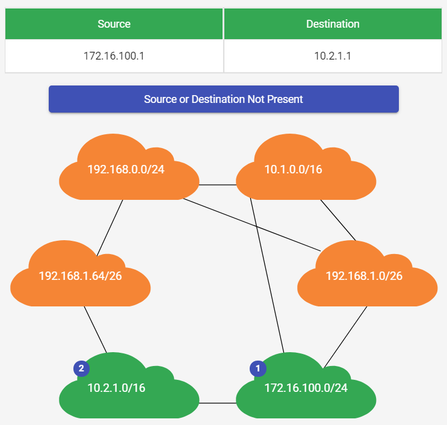

##### IGP/EGP

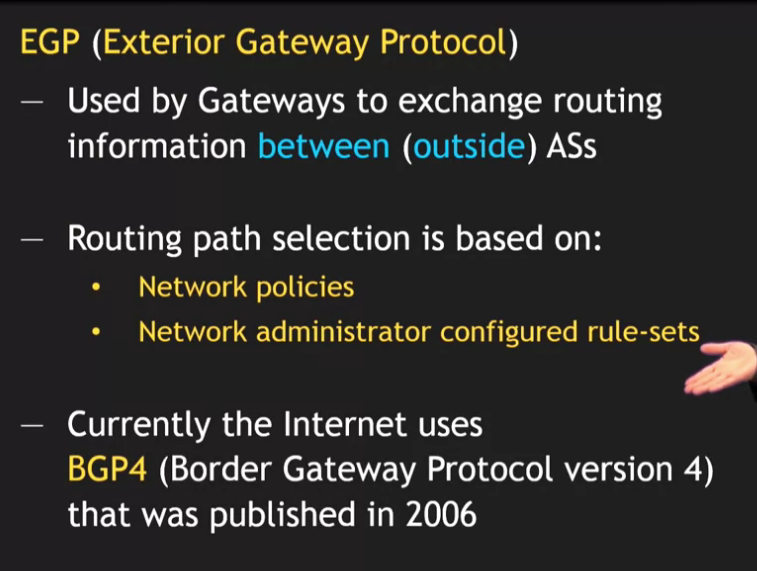

###### OSPF

###### Unicast, Multicast, and Broadcast (IP addressing schemes)

<https://www.tutorialspoint.com/unicast-broadcast-and-multicast-in-computer-networks>

1.  A **unicast** transmission is always meant for just one receiving
    address. At the Ethernet level, this is done by looking at a special
    bit in the destination MAC address. If the least significant bit in
    the first octet of a destination address is set to zero, it means
    that Ethernet frame is intended for only the destination address.
    This means it would be sent to all devices on the collision domain,
    but only actually received and processed by the intended
    destination. If the least significant bit in the first octet of a
    destination address is set to one, it means you're dealing with a
    multicast frame.

2.  A **multicast** frame is similarly set to all devices on the local
    network signal. What's different is that it will be accepted or
    discarded by each device depending on criteria aside from their own
    hardware MAC address. Network interfaces can be configured to accept
    lists of configured multicast addresses for these sort of
    communication.

3.  The third type of Ethernet transmission is known as **broadcast**.
    An Ethernet broadcast is sent to every single device on a LAN. This
    is accomplished by using a special destination known as a broadcast
    address. The Ethernet broadcast address is all Fs. Ethernet
    broadcasts are used so that devices can learn more about each other.

There are several types of communication that can go on and network.

**Unicast** is a one-to-one communication between only two computers.

**Broadcast** is when one computer sends information to all the
computers on a network using the broadcast IP address.

Then there's **multicast**. This is a one-to-many configuration where
endpoints are subscribe to a service to receive the messages sent by the
one computer. This is useful when you want to send different messages to
different groups of computers that are all on the same network.

###### RFC

In the video about **non-routable address space**, we introduced the
concept of an RFC, or**Request for Comments**. RFCs started as a way for
academics to discuss how their computers might talk to each other.

An RFC would be published, people would leave comments, eventually a
consensus would be formed, and a new standard would be developed.

Over many decades, RFCs have come to belong to the IETF, or[**Internet
Engineering Task Force**](https://www.ietf.org/), which is an open
community charged with developing and maintaining the standards required
for the Internet to continue to operate.

You can browse the impressively large collections of RFCs
[here](https://www.ietf.org/standards/rfcs/).

###### Quiz Questions

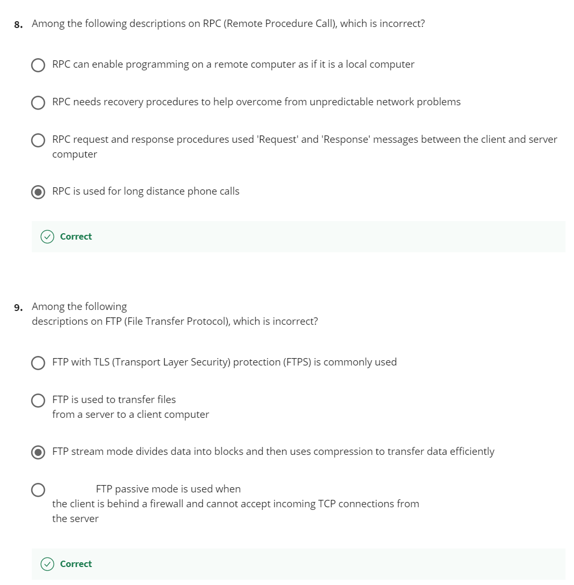

##### Ports

IP addresses reference your “internet access point”, a MAC address
references your device, and ports reference the program on your device.
Often referenced jointly with IP to denote the **IP** and **Port**
combination on a server.

Remember the concept of server and clients? A server or service is a
program running on a computer waiting to be asked for data. A client is
another program that is requesting this data.

Different network services run while listening on specific ports for
incoming requests. For example, the traditional port for HTTP or
unencrypted web traffic is port 80. If we want to request the webpage
from a web server running on a computer listening on IP 10.1.1.100, the
traffic would be directed to port 80 on that computer.

Ports are normally denoted with a colon after the IP address. So the
full IP and port in this scenario could be described as 10.1.1.100:80.
When written this way, it's known as a socket address or socket number.

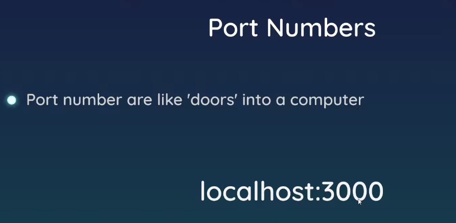

Transportation layer protocols use a concept of ports and
multiplexing/demultiplexing to deliver data to individual services
listening on network nodes. These ports are represented by a single
16-bit number, meaning that they can represent the numbers 0-65535.

This range has been split up by the IANA (Internet Assigned Numbers
Authority) into independent sections:

- **Port 0** isn’t in use for network traffic, but it’s sometimes used
  in communications taking place between different programs on the same
  computer.

- **Ports 1-1023** are referred to as **system ports**, or sometimes as
  “well-known ports.” These ports represent the official ports for most
  well-known network services. In an earlier video, we talked about how
  HTTP normally communicates over port 80, while FTP usually
  communicates over port 21. In most operating systems,
  administrator-level access is needed to start a program that listens
  on a system port.

- **Ports 1024-49151** are known as **registered ports**. These ports
  are used for lots of other network services that might not be quite as
  common as the ones that are on system ports. A good example of a
  registered port is 3306, which is the port that many databases listen
  on. Registered ports are sometimes officially registered and
  acknowledged by the IANA, but not always. On most operating systems,
  any user of any access level can start a program listening on a
  registered port.

- Finally, we have **ports 49152-65535**. These are known as **private**
  or **ephemeral ports**. Ephemeral ports can’t be registered with the
  IANA and are generally used for establishing outbound connections. You
  should remember that all TCP traffic uses a destination port and a
  source port. When a client wants to communicate with a server, the
  client will be assigned an ephemeral port to be used for just that one
  connection, while the server listens on a static system or registered
  port.

Not all operating systems follow the ephemeral port recommendations of
the IANA. In this lesson, we’ll continue to assume that the ephemeral
ports used for outbound connections consist of the ports 49152 through
65535. But it’s important to know that this exact range can vary
depending on the platform you’re working on. Sometimes portions of the
registered ports range are used, but no modern operating system will
ever use a system port for outbound communication

To learn more about ports, and to see a list of what ports have been
assigned to what services, check out the IANA Service Name and Transport
Protocol Port Number Registry. A similar list on Wikipedia is not
official, but it is a little easier to read.

<https://en.wikipedia.org/wiki/List_of_TCP_and_UDP_port_numbers>

###### Ports (TRYHACKME)

Perhaps aptly titled by their name, ports are an essential point in
which data can be exchanged. Think of a harbour and port. Ships wishing
to dock at the harbour will have to go to a port compatible with the
dimensions and the facilities located on the ship. When the ship lines
up, it will connect to a **port** at the harbour. Take, for instance,
that a cruise liner cannot dock at a port made for a fishing vessel and
vice versa.

These ports enforce what can park and where — if it isn't compatible, it
cannot park here. Networking devices also use ports to enforce strict
rules when communicating with one another. When a connection has been
established (recalling from the OSI model's room), any data sent or
received by a device will be sent through these ports. In computing,
ports are a numerical value between **0** and** 65535** (65,535).

Because ports can range from anywhere between 0-65535, there quickly
runs the risk of losing track of what application is using what port. A
busy harbour is chaos! Thankfully, we associate applications, software
and behaviours with a standard set of rules. For example, by enforcing
that any web browser data is sent over port 80, software developers can
design a web browser such as Google Chrome or Firefox to interpret the
data the same way as one another.

This means that all web browsers now share one common rule: data is sent
over port 80. How the browsers look, feel and easy to use is up to the
designer or the user's decision.

While the standard rule for web data is *port 80*, a few other protocols
have been allocated a standard rule. Any port that is
within **0 **and **1024** (1,024) is known as a common port. Let's
explore some of these other protocols below:

<table>
<colgroup>
<col style="width: 28%" />
<col style="width: 7%" />
<col style="width: 64%" />
</colgroup>
<thead>
<tr>
<th style="text-align: center;"><strong>Protocol</strong></th>
<th style="text-align: center;"><strong>Port Number</strong></th>
<th style="text-align: center;"><strong>Description</strong></th>
</tr>
</thead>
<tbody>
<tr>
<td
style="text-align: center;"><strong>F</strong>ile <strong>T</strong>ransfer <strong>P</strong>rotocol
(<strong>FTP</strong>)</td>
<td style="text-align: center;">21</td>
<td style="text-align: center;">This protocol is used by a file-sharing
application built on a client-server model, meaning you can download
files from a central location.</td>
</tr>
<tr>
<td
style="text-align: center;"><strong>S</strong>ecure <strong>Sh</strong>ell
(<strong>SSH</strong>)</td>
<td style="text-align: center;">22</td>
<td style="text-align: center;">This protocol is used to securely login
to systems via a text-based interface for management.</td>
</tr>
<tr>
<td
style="text-align: center;"><strong>H</strong>yper<strong>T</strong>ext
Transfer Protocol (<strong>HTTP</strong>)</td>
<td style="text-align: center;">80</td>
<td style="text-align: center;">This protocol powers the World Wide Web
(WWW)! Your browser uses this to download text, images and videos of web
pages.</td>
</tr>
<tr>
<td
style="text-align: center;"><strong>H</strong>yper<strong>T</strong>ext <strong>T</strong>ransfer <strong>P</strong>rotocol <strong>S</strong>ecure
(<strong>HTTPS</strong>)</td>
<td style="text-align: center;">443</td>
<td style="text-align: center;">This protocol does the exact same as
above; however, securely using encryption.</td>
</tr>
<tr>
<td
style="text-align: center;"><strong>S</strong>erver<strong> M</strong>essage<strong> B</strong>lock
(<strong>SMB</strong>)</td>
<td style="text-align: center;">445</td>
<td style="text-align: center;">This protocol is similar to the File
Transfer Protocol (FTP); however, as well as files,
SMB<strong> </strong>allows you to share devices like printers.</td>
</tr>
<tr>
<td
style="text-align: center;"><strong>R</strong>emote <strong>D</strong>esktop <strong>P</strong>rotocol
(<strong>RDP</strong>)</td>
<td style="text-align: center;">3389</td>
<td style="text-align: center;">This protocol is a secure means of
logging in to a system using a visual desktop interface (as opposed to
the text-based limitations of the SSH protocol).</td>
</tr>
</tbody>
</table>

We have only briefly covered the more common protocols in cybersecurity.
You can [find a table of the 1024 common ports
listed](http://www.vmaxx.net/techinfo/ports.htm) for more information.

What is worth noting here is that these protocols only follow the
standards. I.e. you can administer applications that interact with these
protocols on a different port other than what is the standard (running a
web server on 8080 instead of the 80 standard port). Note, however,
applications will presume that the standard is being followed, so you
will have to provide a **colon (:)** along with the port number.

####   Subnetting

##### Subnet Mask

<https://www.udemy.com/course/introduction-to-computer-networks/learn/lecture/13564106#questions>

**Subnetting** is the subdivision of a network into logical groups
called subnets. It works like a network inside a network. Subnetting
divides up a network address range into smaller subnets within the
network. These smaller subnets form based on the IP addresses and
network mask of the devices on the network. Subnetting creates a network
of devices to function as their own network. This makes the network more
efficient and can also be used to create security zones. If devices on
the same subnet communicate with each other, the switch changes the
transmissions to stay on the same subnet, improving speed and efficiency
of the communications.

A subnet mask defines the structure of the LAN. I.e., it defines how the
local IP addresses on this network are divided up where zeros define
where the devices numbers begin.

Example, a subnet mask of **255.255.255.0** means that a local IP a
192.168.1.7 implies that only the last number ‘7’ is responsible for the
number of this device.

Example, a subnet mask of **255.255.0.0** means that a local IP a
192.168.1.7 implies that only the last two numbers ‘1.7’ is responsible
for the number of this device.

Another example:

^ Five octets available

**Wildcard Mask**

A wild card mask is the inverse of the subnet mask (for example, a class
c subnet of 255.255.255.0 would yield a wildcard mask of 0.0.0.255) and
is usually used when setting up deny rules on a firewall.

##### CIDR Notation

A notation used to reference the Network destination and subnet in one
line:

Basically the network destination over the subnet mask’s number of ‘1’.
How do we see how many 1’s there are? As noted earlier, we change our
*255.255.**128*** to binary and just count how many ‘1’ we see. 32 total
chars/bits minus seven zeros gives us 25 ‘1’s.

Note : the zero in …0/25 means “we can start at the unique ip ‘0’
because it’s not in use.

It should be noted that the number after the slash represents the
network ips, not host ips, so the bigger that number is, the bigger the
number of ips assigned to the network which means less ips are assigned
as host ips.

Great subnetting stuff :
<https://www.youtube.com/watch?v=hKXYNpvdAOU&t=21943s>

##### Subnetting in action

<https://www.udemy.com/course/introduction-to-computer-networks/learn/lecture/13564106#overview>

**Subnettjng** - 32 possible bits for a network. In cidr, the slash
shows how Manny are assigned to the network. Remainder is how many bits
left for the hosts, convert that to binary and viola.

**Number of subnets** = always 1 if not borrowing any hosts bits from
network bits (/8,/16,/24 network). Otherwise, it's 2 to the power of the
number of borrowed host bits.

##### Subnet/CIDR Conversion

Binary octet

*Note: Column numbers are counted from left to right.*

###### From CIDR to Subnet

***Rules:***

- Replace each divisible of 8 with a 255 and keep zero’s as is working
  left-to-right.

- For remainder, if zero keep as is, otherwise…

  - DiffVal: Place represented in the ‘DiffVal’-th column of a binary
    octet.

  - Answer: Difference between 256 and that DiffVal.

- Add all values together

####### Example (/27 to 255.255.255.224)

1.  **Find remainder**

    1.  /27 = 27/8

    2.  /27 = 3 r 3 (Remainder 3, so first three octets are max values)

    3.  /27 = **255.255.255.\[r3\]**

2.  **Convert remainder (3)**

    1.  Third column in binary octet is represented by 32nd
        place

    2.  256 – 32 = 224

    3.  <u>Last Octet value: 224</u>

3.  **Add together**

    1.  255.255.255.\[r3\] -\> 255.255.255.224

####### Example (/28 to 255.255.255.240)

1.  **Find remainder**

    1.  /28 = 28/8

    2.  /28 = 3 r 4 (Remainder 4, so first three octets are max values)

    3.  /28 = **255.255.255.\[r4\]**

2.  **Convert remainder (4)**

    1.  Third column in binary octet is represented by 16 place

    2.  256 – 16 = 240

    3.  <u>Last Octet value: 240</u>

3.  **Add together**

    1.  255.255.255.\[r4\] -\> 255.255.255.240

####### Example (/24 to 255.255.255.0)

1.  **Find remainder**

    1.  /24 = 24/8

    2.  /24 = 3 r 0 (Remainder 4, so first three octets are max values)

    3.  /28 = **255.255.255.\[r0\]**

2.  **Convert remainder (0)**

    1.  <u>Last Octet value: 0</u>

3.  **Add together**

    1.  255.255.255.\[r4\] -\> 255.255.255.0

####### Example (/16 to 255.255.0.0)

1.  **Find remainder**

    1.  /16 = 16/8

    2.  /16 = 2 r 0 (Remainder 0, so first two octets are max values)

    3.  /16 = **255.255.\[r0\].0**

2.  **Convert remainder (0)**

    1.  <u>Last Octet value: 0</u>

3.  **Add together**

    1.  255.255.255.\[r4\] -\> 255.255.0.0

####### Example (/4 to 240.0.0.0)

1.  **Find remainder**

    1.  /4 = 4

    2.  /4 = r 4 (Remainder 0, so no octets are max values)

    3.  /4 = **\[r4\].0.0.0**

2.  **Convert remainder (4)**

    1.  Third column in binary octet is represented by 16 place

    2.  256 – 16 = 240

    3.  <u>Last Octet value: 240</u>

3.  **Add together**

    1.  \[r4\].0.0.0 -\> 240.0.0.0

###### From Subnet to CIDR

***Rules:***

- Replace each 255 with an 8 and keep zero’s as is working
  left-to-right.

- For remaining number…

  - DiffVal: Find the difference between 256 and that number.

  - Answer: Column number represented in the ‘DiffVal’-place of a binary
    octet

####### Example (255.255.255.224 to /27)

1.  **Replace and find remaining number**

    1.  255.255.255.224 = 8, 8, 8,224

2.  **Convert remaining number (224)**

    1.  256 – 224 = 32

    2.  32 is represented by column number **3**

3.  **Add together**

    1.  8 + 8 + 8 + 3 = /27

####### Example (255.255.255.240 to /28)

4.  **Replace and find remaining number**

    1.  255.255.255.240 = 8, 8, 8,240

5.  **Convert remaining number (240)**

    1.  256 – 240 = 16

    2.  16 is represented by column number **4**

6.  **Add together**

    1.  8 + 8 + 8 + 4 = /28

####### Example (255.255.255.128 to /24)

1.  **Replace and find remaining number**

    1.  255.255.255.0 = 8, 8, 8,0

2.  **Convert remaining number (128)**

    1.  **256 – 128 = 128**

    2.  128 is represented by column number **1**

3.  **Add together**

    1.  8 + 8 + 8 + 1 -\> /25

####### Example (255.255.255.0 to /24)

4.  **Replace and find remaining number**

    1.  255.255.255.0 = 8, 8, 8,0

5.  **Convert remaining number (n/a)**

6.  **Add together**

    1.  8 + 8 + 8 + 0 -\> /24

####### Example (255.255.0.0 to /16)

1.  **Replace and find remaining number**

    1.  255.255.0.0 = 8, 8, 0,0

2.  **Convert remaining number (n/a)**

3.  **Add together**

    1.  8 + 8 + 0 + 0 -\> /16

####### Example (240.0.0.0 to /4)

1.  **Replace and find remaining number**

    1.  240.0.0.0 = 240, 0, 0,0

2.  **Convert remaining number (240)**

    1.  256 – 240 = 16

    2.  16 is represented by column number **4**

3.  **Add together**

> 4 + 0 + 0 + 0 -\> /16

#### \[LAB\] IPs, Routing and Subnet Masks (A Practical example)

^ (above) Note how room C and D are connected to a switch (hub)

Note, the numbers in the routing table are called “Gateway/Gateway
port/interface”

Since we are subnetting off of \#3, we see that the range of possible
IPs to allocate would look something like this:  

##### Room A

Keep in mind, given \# three we are subnetting based off this:

Time to define our range for this subnet (room).

Before allocating ips, you will see that some ips are already reserved
as well as some that will be pre-defined (see below):

- **Network destination**: A unique identifier for this subnet as is
  relates back to Internet (?)

- **Broadcast ip**: an ip reserved for sending info to other devices in
  this same subnet (Room A)

- **Gateway Interface 1**: An ip we use to communicate back to the
  gateway interface from this subnet.

Subnet sizes are always expressed in powers of 2 – we use the smallest
power that supplies us the ips we need (in this case 128). Then, we get
total possible range (256) and subtract the subnet size (128) – this
will be the last value for our subnet size (128 in this case).

Remainder of ips within this range that aren’t in use will be saved for
future use – see grey ones (not how are are only using 103 of the 128
available for this subnet).

##### Room B

Once again, we get total possible range (256) and subtract the subnet
size (28) – this will be the last value for our subnet size (224).

Note how the ip beings where we left off in room A. Notice how the
network destination start at ‘128’ in this example and this is seen in
the CIDR notation as well:  

Note : the zero in …128/27 means “we can start at the unique ip ‘128’
because it’s not in use.

##### Room C & D

These are combined together since they are connected to the same
hub/switch.

Once again, we get total possible range (256) and subtract the subnet
size (53) – this will be the last value for our subnet size (192).

Note again that we are also continuing from where we left off in room b
since we are still referencing the same Gateway.

Would results in a /28 subnet.

#### Quiz: IP and Routing

### (4) Transport Layer (TCP, UDP)

In short, the Transport layer allows traffic to be directed to specific
network applications. And the Application layer allows these
applications to communicate in a way they understand.

**TCP:** <https://youtu.be/GP7uvI_6uas>

#### Multiplexing

**Multiplexing** in the transport layer means that nodes on the network
have the ability to direct traffic toward many different receiving
services.

**Demultiplexing** is the same concept, just at the receiving end, it's
taking traffic that's all aimed at the same node and delivering it to
the proper receiving service.

This is all handled using **ports**.

#### TCP header (segment)

At the IP or Ethernet level, if a checksum doesn't compute, all of that
data is just discarded. It's up to TCP to determine when to resend this
data. Since TCP expects an ack for every bit of data it sends, it's in
the best position to know what data successfully got delivered and can
make the decision to resend a segment if needed. This is another reason
why sequence numbers are so important. While TCP will generally send all
segments in sequential order, they may not always arrive in that order.
If some of the segments had to be resent due to errors at lower layers,
it doesn't matter if they arrive slightly out of order. This is because
sequence numbers allow for all of the data to be put back together in
the right order.

- **A source port** is a high numbered port chosen from a special
  section of ports known as ephemeral ports. Helps coordinate with
  services go to which port(s).

- **The sequence number** is a 32-bit number that's used to keep track
  of where in a sequence of TCP segments this one is expected to be. In
  Ethernet frame, it's usually limited in size to 1,518 bytes, but we
  usually need to send way more data than that. At the transport layer,
  TCP splits all of this data up into many segments. The sequence number
  in a header is used to keep track of which segment out of many this
  particular segment might be.

- **The acknowledgment number** is the number of the next expected
  segment. In very simple language, a sequence number of one and an
  acknowledgement number of two could be read as this is segment one,
  expect segment two next.

- **The data offset field comes next**. This field is a four-bit number
  that communicates how long the TCP header for this segment is. This is
  so that the receiving network device understands where the actual data
  payload begins.

- Six bits that are reserved for the six **TCP control flags (see next
  section)**.

- The next field is a 16-bit number known as the **TCP window**. A TCP
  window specifies the range of sequence numbers that might be sent
  before an acknowledgement is required.

- The next field is a 16-bit **checksum**. It operates just like the
  checksum fields at the IP and Ethernet level. Once all of this segment
  has been ingested by a recipient, the checksum is calculated across
  the entire segment and is compared with the checksum in the header to
  make sure that there was no data lost or corrupted along the way.

#### TCP Sockets

A socket is the instantiation of an endpoint in a potential TCP
connection. An instantiation is the actual implementation of something
defined elsewhere. TCP sockets require actual programs to instantiate
them. You can contrast this with a port which is more of a virtual
descriptive thing. In other words, you can send traffic to any port you
want, but you're only going to get a response if a program has opened a
socket on that port. TCP sockets can exist in lots of states. And being
able to understand what those mean will help you troubleshoot network
connectivity issues as an IT support specialist. We'll cover the most
common ones here.

- **LISTEN**. Listen means that a TCP socket is ready and listening for
  incoming connections. You'd see this on the server side only.

- **SYN_SENT**. This means that a synchronization request has been sent,
  but the connection hasn't been established yet. You'd see this on the
  client side only.

- **SYN_RECEIVED.** This means that a socket previously in a listener
  state, has received a synchronization request and sent a **SYN_ACK**
  back. But it hasn't received the final **ACK** from the client yet.
  You'd see this on the server side only.

- **ESTABLISHED**. This means that the TCP connection is in working
  order, and both sides are free to send each other data. You'd see this
  state on both the client and server sides of the connection. This will
  be true of all the following socket states, too. So keep that in mind.

- **FIN_WAIT**. This means that a FIN has been sent, but the
  corresponding ACK from the other end hasn't been received yet.
  CLOSE_WAIT. This means that the connection has been closed at the TCP
  layer, but that the application that opened the socket hasn't released
  its hold on the socket yet.

- **CLOSED**. This means that the connection has been fully terminated,
  and that no further communication is possible. There are other TCP
  socket states that exist. Additionally, socket states and their names,
  can vary from operating system to operating system. That's because
  they exist outside of the scope of the definition of TCP itself. TCP,
  as a protocol, is universal in how it's used since every device
  speaking to TCP protocol has to do this in the exact same way for
  communications to be successful.

#### TCP Handshake

##### Three/Four-way Handshake & TCP Control flags

We'll look at them in the order that they appear in a TCP header. Heads
up. This isn't necessarily in the same order of how frequently they're
set, or how important they are.

1)  **URG** : The first flag is known as URG, this is short for Urgent.
    A value of one here indicates that the segment is considered urgent
    and that the urgent pointer field has more data about this. Like we
    mentioned in the last video, this feature of TCP has never really
    had wide spread option and isn't normally seen.

2)  **ACK** : The second flag is ACK, short for acknowledge. A value of
    one in this field means that the acknowledgment number field should
    be examined.

3)  **PSH** : The third flag is PSH, which is short for Push. This
    means, that the transmitting device wants the receiving device to
    push currently- buffered data to the application on the receiving
    end as soon as possible. A buffer is a computing technique, where a
    certain amount of data is held somewhere, before being sent
    somewhere else. This has lots of practical applications. In terms of
    TCP, it's used to send large chunks of data more efficiently. By
    keeping some amount of data in a buffer, TCP can deliver more
    meaningful chunks of data to the program waiting for it. But in some
    cases, you might be sending a very small amount of information, that
    you need the listening program to respond to immediately. This is
    what the push flag does.

4)  **RST** : The Fourth flag is RST, short for Reset. This means, that
    one of the sides in a TCP connection hasn't been able to properly
    recover from a series of missing or malformed segments. It's a way
    for one of the partners in a TCP connection to basically say, "Wait,
    I can't put together what you mean, let's start over from scratch."

5)  **SYN**: The fifth flag is SYN, which stands for Synchronize. It's
    used when first establishing a TCP connection and make sure the
    receiving end knows to examine the sequence number field.

6)  **FIN:** And finally, our six flag is FIN, which is short for
    Finish. When this flag is set to one, it means the transmitting
    computer doesn't have any more data to send and the connection can
    be closed.

This exchange involving segments that have SYN, SYN/ACK and ACK sets,
happens every single time a TCP connection is established anywhere. And
is so famous that it has a nickname. **The three way handshake**. A
**handshake** is a way for two devices to ensure that they're speaking
the same protocol and will be able to understand each other. Once the
three way handshake is complete, the TCP connection is established. Now,
computer A is free to send whatever data it wants to computer B and vice
versa. Since both sides have now sent SYN/ACK pairs to each other, a TCP
connection in this state is operating in full duplex.

Once one of the devices involved with the TCP connection is ready to
close the connection, something known as a **four way handshake**
happens. The computer ready to close the connection, sends a FIN flag,
which the other computer acknowledges with an ACK flag. Then, if this
computer is also ready to close the connection, which will almost always
be the case. It will send a FIN flag. This is again responded to by an
ACK flag.

##### Three-way handshake \[TRYHACKME\]

**TCP **(or **T**ransmission **C**ontrol **P**rotocol for short) is
another one of these rules used in networking.

This protocol is very similar to the OSI model that we have previously
discussed in room three of this module so far. The TCP/IP protocol
consists of four layers and is arguably just a summarised version of the
OSI model. These layers are:

- Application

- Transport

- Internet

- Network Interface

Very similar to how the OSI model works, information is added to each
layer of the TCP model as the piece of data (or packet) traverses it. As
you may recall, this process is known as encapsulation - where the
reverse of this process is decapsulation.

One defining feature of TCP is that it is **connection-based**, which
means that TCP must establish a connection between both a client and a
device acting as a server **before** data is sent.

Because of this, TCP guarantees that any data sent will be received on
the other end. This process is named the Three-way handshake, which is
something we'll come on to discuss shortly. A table comparing the
advantages and disadvantages of TCP is located below:

<table>
<colgroup>
<col style="width: 40%" />
<col style="width: 59%" />
</colgroup>
<thead>
<tr>
<th style="text-align: center;"><strong>Advantages of TCP</strong></th>
<th style="text-align: center;"><strong>Disadvantages
of TCP</strong></th>
</tr>
</thead>
<tbody>
<tr>
<td style="text-align: center;">Guarantees the integrity of data.</td>
<td style="text-align: center;">Requires a reliable connection between
the two devices. If one small chunk of data is not received, then the
entire chunk of data cannot be used and must be re-sent.</td>
</tr>
<tr>
<td style="text-align: center;">Capable of synchronising two devices to
prevent each other from being flooded with data in the wrong order.</td>
<td style="text-align: center;">A slow connection can bottleneck another
device as the connection will be reserved on the other device the whole
time.</td>
</tr>
<tr>
<td style="text-align: center;">Performs a lot more processes for
reliability</td>
<td style="text-align: center;">TCP is significantly slower than UDP
because more work (computing) has to be done by the devices using this
protocol.</td>
</tr>
</tbody>
</table>

TCP packets contain various sections of information known as headers
that are added from encapsulation. Let's explain some of the crucial
headers in the table below:

<table>
<colgroup>
<col style="width: 15%" />
<col style="width: 84%" />
</colgroup>
<thead>
<tr>
<th style="text-align: center;"><strong>Header</strong></th>
<th style="text-align: center;"><strong>Description</strong></th>
</tr>
</thead>
<tbody>
<tr>
<td style="text-align: center;">Source Port</td>
<td style="text-align: center;">This value is the port opened by the
sender to send the TCP packet from. This value is chosen randomly (out
of the ports from 0-65535 that aren't already in use at the time).</td>
</tr>
<tr>
<td style="text-align: center;">Destination Port</td>
<td style="text-align: center;">This value is the port number that an
application or service is running on the remote host (the one receiving
data); for example, a webserver running on port 80. Unlike the source
port, this value is not chosen at random.</td>
</tr>
<tr>
<td style="text-align: center;">Source IP</td>
<td style="text-align: center;">This is the IP address of the device
that is sending the packet.</td>
</tr>
<tr>
<td style="text-align: center;">Destination IP</td>
<td style="text-align: center;">This is the IP address of the device
that the packet is destined for.</td>
</tr>
<tr>
<td style="text-align: center;">Sequence Number</td>
<td style="text-align: center;">When a connection occurs, the first
piece of data transmitted is given a random number. We'll explain this
more in-depth further on.</td>
</tr>
<tr>
<td style="text-align: center;">Acknowledgement Number</td>
<td style="text-align: center;">After a piece of data has been given a
sequence number, the number for the next piece of data will have the
sequence number + 1. We'll also explain this more in-depth further
on.</td>
</tr>
<tr>
<td style="text-align: center;">Checksum</td>
<td style="text-align: center;">This value is what gives TCP integrity.
A mathematical calculation is made where the output is remembered. When
the receiving device performs the mathematical calculation, the data
must be corrupt if the output is different from what was sent.</td>
</tr>
<tr>
<td style="text-align: center;">Data</td>
<td style="text-align: center;">This header is where the data, i.e.
bytes of a file that is being transmitted, is stored.</td>
</tr>
<tr>
<td style="text-align: center;">Flag</td>
<td style="text-align: center;">This header determines how the packet
should be handled by either device during the handshake process.
Specific flags will determine specific behaviours, which is what we'll
come on to explain below.</td>
</tr>
</tbody>
</table>

Next, we'll come on to discuss the *Three-way handshake - *the term
given for the process used to establish a connection between two
devices. The Three-way handshake communicates using a few special
messages - the table below highlights the main ones:

<table>
<colgroup>
<col style="width: 3%" />
<col style="width: 5%" />
<col style="width: 90%" />
</colgroup>
<thead>
<tr>
<th style="text-align: center;"><strong>Step</strong></th>
<th style="text-align: center;"><strong>Message</strong></th>
<th style="text-align: center;"><strong>Description</strong></th>
</tr>
</thead>
<tbody>
<tr>
<td style="text-align: center;">1</td>
<td style="text-align: center;">SYN</td>
<td style="text-align: center;">A SYN message is the initial packet sent
by a client during the handshake. This packet is used to initiate a
connection and synchronise the two devices together (we'll explain this
further later on).</td>
</tr>
<tr>
<td style="text-align: center;">2</td>
<td style="text-align: center;">SYN/ACK</td>
<td style="text-align: center;">This packet is sent by the receiving
device (server) to acknowledge the synchronisation attempt from the
client.</td>
</tr>
<tr>
<td style="text-align: center;">3</td>
<td style="text-align: center;">ACK</td>
<td style="text-align: center;">The acknowledgement packet can be used
by either the client or server to acknowledge that a series of
messages/packets have been successfully received.</td>
</tr>
<tr>
<td style="text-align: center;">4</td>
<td style="text-align: center;">DATA</td>
<td style="text-align: center;">Once a connection has been established,
data (such as bytes of a file) is sent via the "DATA" message.</td>
</tr>
<tr>
<td style="text-align: center;">5</td>
<td style="text-align: center;">FIN</td>
<td style="text-align: center;">This packet is used to <em>cleanly
(properly)</em> close the connection after it has been complete.</td>
</tr>
<tr>
<td style="text-align: center;">#</td>
<td style="text-align: center;">RST</td>
<td style="text-align: center;">This packet abruptly ends all
communication. This is the last resort and indicates there was some
problem during the process. For example, if the service or application
is not working correctly, or the system has faults such as low
resources. </td>
</tr>
</tbody>
</table>

The diagram below shows a normal Three-way handshake process between
Alice and Bob. In real life, this would be between two devices.

Any sent data is given a random number sequence and is reconstructed
using this number sequence and incrementing by 1. Both computers must
agree on the same number sequence for data to be sent in the correct
order. This order is agreed upon during three steps:

1.  SYN - Client: Here's my Initial Sequence Number(ISN)
    to **SYN**chronise with (0)

2.  SYN/ACK - Server: Here's my Initial Sequence Number (ISN)
    to **SYN**chronise with (5,000), and I **ACK**nowledge your initial
    number sequence (0)

3.  ACK - Client: I **ACK**nowledge your Initial Sequence Number (ISN)
    of (5,000), here is some data that is my ISN+1 (5,000 + 1)

<table>
<colgroup>
<col style="width: 26%" />
<col style="width: 39%" />
<col style="width: 33%" />
</colgroup>
<thead>
<tr>
<th style="text-align: center;"><strong>Device</strong></th>
<th style="text-align: center;"><strong>Initial Number Sequence
(ISN)</strong></th>
<th style="text-align: center;"><strong>Final Number
Sequence</strong></th>
</tr>
</thead>
<tbody>
<tr>
<td style="text-align: center;">Client (Sender)</td>
<td style="text-align: center;">0</td>
<td style="text-align: center;">0 + 1 = 1</td>
</tr>
<tr>
<td style="text-align: center;">Client (Sender)</td>
<td style="text-align: center;">1</td>
<td style="text-align: center;">    1 + 1 = 2</td>
</tr>
<tr>
<td style="text-align: center;">Client (Sender)</td>
<td style="text-align: center;">2</td>
<td style="text-align: center;">2 + 1 = 3</td>
</tr>
</tbody>
</table>

**<u>TCP Closing a Connection:</u>**

Let's quickly explain the process behind TCP closing a connection.
First, TCP will close a connection once a device has determined that the
other device has successfully received all of the data.

Because TCP reserves system resources on a device, it is best practice
to close TCP connections as soon as possible.

To initiate the closure of a TCP connection, the device will send a
"FIN" packet to the other device. Of course, with TCP, the other device
will also have to acknowledge this packet.

Let's show this process using Alice and Bob as we have previously.

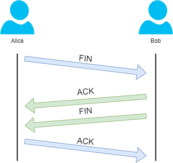

In the illustration, we can see that Alice has sent Bob a "**FIN**"
packet. Because Bob received this, he will let Alice know that he
received it and that he also wants to close the connection (using FIN).
Alice has heard Bob loud and clear and will let Bob know that she
acknowledges this.

#### UDP 

The **U**ser **D**atagram **P**rotocol (**UDP**) is another protocol
that is used to communicate data between devices.

Unlike its brother TCP, UDP is a **stateless **protocol that doesn't
require a constant connection between the two devices for data to be
sent. For example, the Three-way handshake does not occur, nor is there
any synchronisation between the two devices.

Recall some of the comparisons made about these two protocols in Room 3:
"OSI Model". Namely, UDP is used in situations where applications can
tolerate data being lost (such as video streaming or voice chat) or in
scenarios where an unstable connection is not the end-all. A table
comparing the advantages and disadvantages of UDP is located below:

<table>
<colgroup>
<col style="width: 56%" />
<col style="width: 43%" />
</colgroup>
<thead>
<tr>
<th style="text-align: center;"><strong>Advantages of UDP</strong></th>
<th style="text-align: center;"><strong>Disadvantages
of UDP</strong></th>
</tr>
</thead>
<tbody>
<tr>
<td style="text-align: center;">UDP is much faster than TCP.</td>
<td style="text-align: center;">UDP doesn't care if the data is received
or not.</td>
</tr>
<tr>
<td style="text-align: center;">UDP leaves the application (user
software) to decide if there is any control over how quickly packets are
sent.</td>
<td style="text-align: center;">It is quite flexible to software
developers in this sense.</td>
</tr>
<tr>
<td style="text-align: center;">UDP does not reserve a continuous
connection on a device as TCP does.</td>
<td style="text-align: center;">This means that unstable connections
result in a terrible experience for the user.</td>
</tr>
</tbody>
</table>

As mentioned, no process takes place in setting up a connection between
two devices. Meaning that there is no regard for whether or not data is
received, and there are no safeguards such as those offered by TCP, such
as data integrity.

UDP packets are much simpler than TCP packets and have fewer headers.
However, both protocols share some standard headers, which are what is
annotated in the table below:

<table>
<colgroup>
<col style="width: 11%" />
<col style="width: 88%" />
<col style="width: 0%" />
</colgroup>
<thead>
<tr>
<th style="text-align: center;"><strong>Header</strong></th>
<th style="text-align: center;"><strong>Description</strong></th>
<th style="text-align: center;"></th>
</tr>
</thead>
<tbody>
<tr>
<td style="text-align: center;">Time to Live (TTL)</td>
<td style="text-align: center;">This field sets an expiry timer for the
packet, so it doesn't clog up your network if it never manages to reach
a host or escape!</td>
<td style="text-align: center;"></td>
</tr>
<tr>
<td style="text-align: center;">Source Address</td>
<td style="text-align: center;">The IP address of the device that the
packet is being sent <strong>from</strong>, so that data knows where
to <strong>return to</strong>.</td>
<td style="text-align: center;"></td>
</tr>
<tr>
<td style="text-align: center;">Destination Address</td>
<td style="text-align: center;">The device's IP address the packet is
being <strong>sent to</strong> so that data knows where to travel
next.</td>
<td style="text-align: center;"></td>
</tr>
<tr>
<td style="text-align: center;">Source Port</td>
<td style="text-align: center;">This value is the port that is opened by
the sender to send the TCP packet from. This value is chosen randomly
(out of the ports from 0-65535 that aren't already in use at the
time).</td>
<td style="text-align: center;"></td>
</tr>
<tr>
<td style="text-align: center;">Destination Port</td>
<td style="text-align: center;">This value is the port number that an
application or service is running on the remote host (the one receiving
data); for example, a webserver running on port 80. Unlike the source
port, this value is not chosen at random.</td>
<td style="text-align: center;"></td>
</tr>
<tr>
<td style="text-align: center;">Data</td>
<td style="text-align: center;">This header is where the data, i.e.
bytes of a file that is being transmitted, is stored.</td>
<td style="text-align: center;"></td>
</tr>
</tbody>
</table>

Next, we'll come on to discuss how the process of a connection
via UDP differs from that of something such as TCP.  We should recall
that UDP is **stateless**. No acknowledgement is sent during a
connection.

The diagram below shows a normal UDP connection between Alice and Bob.
In real life, this would be between two devices.

#### TCP vs UDP (Connection-oriented and Connectionless Protocols)

**UDP** sits in the data payload (not the header) of an IP packet and
contains information about which port the data should go to.

TCP exists in the IP header by contrast

<https://nordvpn.com/blog/tcp-or-udp-which-is-better/>

<https://protonvpn.com/support/udp-tcp/>

A great example of UDP is streaming video. Let's imagine that each UDP
datagram is a single frame of a video. For the best viewing experience,
you might hope that every single frame makes it to the viewer, but it
doesn't really matter if a few get lost along the way. A video will
still be pretty watchable unless it's missing a lot of its frames. By
getting rid of all the overhead of TCP, you might actually be able to
send higher quality video with UDP. That's because you'll be saving more
of the available bandwidth for actual data transfer, instead of the
overhead of establishing connections and acknowledging delivered data
segments.

Relation to OSI model:UDP/TCP are layer 4 protocols

<https://youtu.be/7IS7gigunyI>

In this video, you will learn to describe the difference between the TCP
and UDP transport layer protocols.

List the various utilities that use the UDP protocol.

\>\> This lesson is being presented by Ben Briggs, and is based upon a
lecture series developed by Moises Monge. Today we're going to talk
about the two major transport protocols, TCP, the Transport Control
Protocol, and UDP, the User Datagram Protocol. We'll see how they differ
in the services they provide. Transport protocols are sort of like the
envelope that you put a letter into. The front face of the envelope is
like the packet header. This is where we write the sender's address, and
the destination address, and so forth. To extend this analogy, TCP is
sort of like sending a letter using Priority Mail, where you get a
tracking number and the signature of the receiver. So you can be sure
that the letter got to its intended recipient. While UDP is more like
using bulk mail, it's fast and cheap, and the vast majority of letters
will get to their intended destination. But you never really know for
sure. Some applications like to use TCP, while others like to use UDP.
Some applications can be configured to use either TCP or UDP. And a few
applications use both, but for different functions. TCP sets up a
connection, so the sending and receiving computers know which packets
have been sent and received, and which is the correct order. The
assurance that no packet is lost without being resent, and that all
packets are in the right order is critical for many applications. But
all that handshaking requires a lot of overhead, so it's not very fast.

UDP, on the other hand, does not set up a connection the same way TCP
does. The sender does not know if each packet has been received, and the
receiver can only reassemble the data stream in the order the packets
arrive, even if some are not in the order they were sent. This requires
very little overhead, so it's a very fast protocol, and great for
streaming videos and music, where it doesn't matter much if a few
packets were lost or out of order. At layer 4, or transport layer, the
data is broken into chunks and a header is added. The source port number
identifies the process that's making the call to the network, so the
source port number is added to the packet header. The destination port
number represents the remote service we're trying to connect to, so that
will also be added to the header. In this example, the source port is
25, which means that we're trying to communicate with an STMP server,
that's Simple Mail Transport Protocol. These are the fields that a UDP
packet-gram encapsulates. You can see the source and destination ports,
which are often the same number for protocols using UDP.

Then there is the UDP message length and its checksum. Common protocols
that use UDP are TFTP, the Trivial File Transport Protocol, using port
69. This is very similar to FTP, but uses UDP instead of TCP to avoid
all of the overhead of establishing and maintaining a connection just to
transfer very small files. DNS, the Domain Name System, uses Port 53.
DNS uses UDP for its name queries, but it can use TCP for less common
tasks. DNS is commonly used to translate domain names into IP addresses.
SNMP, the Simple Network Management Protocol, uses ports 161 and 162. It
is uncommon, but SNMP can also use TCP. SNMP is used to monitor and
manage network devices. DHCP, the Dynamic Host Configuration Protocol,
uses Port 67. DHCP automatically assigns and manages a pool of IP
addresses to the systems that are subscribed to it.

VoIP, or Voice over IP, uses port 5,060. It can also be implemented
using TCP, and is used for sending voice over the Internet, and is
growing in popularity with Internet-based phone services. IPTV, or
Internet Protocol Television, streams TV signals. IPTV uses both UDP and
TCP as well as ports 80, 5,004 and 12,000. Depending upon which service
is being used and whether the traffic is inbound or outbound. All of
these protocols take advantage of UDP, because it's so fast and a
dropped packet here or there is not a showstopper.

\>\> Going back to our traditional mail analogy for UDP, the sender puts
a destination address on a letter. Drops it in the mail and that's that.
The letter either arrived or it didn't. The sender will never know. TCP
on the other hand, requires an acknowledgment from the destination that
the letter was received. Unlike traditional mail, TCP only waits about
three seconds for the acknowledgement before automatically resending the
packet. When a TCP connection is established, the first thing that's
done is a three way handshake. The sender who's trying to establish the
connection sends a SYN. That synchronize sequence number, request to the
recipient system. The recipient system responds with a SYN plus x
signal. That is, the SYN plus an acknowledgement to indicate the
sequence number the communication will start with. So let's take a look
at a few captured packets here. In this case, we're trying to establish
an SSH or Secure Shell connection from our system at 192.168.52.1 to the
server at 192.168.52.100. Here are the first three packets. This is the
SYN, and you can see the flags here. The SYN flag is set to 1. Each flag
can take on only two possible values, zero or a one. So in this case the
flag is on. We expect the next packet to contain the SYN ACK. We see the
SYN is on, and also that the ACK is on. And the last packet just
contains a simple ACK. Once the three way handshake is successful, a TCP
connection is established and we can start transmitting data.

Play video starting at :2:13 and follow transcript2:13

You can see here what follows the handshake is the actual SSH
information being sent from the client to the server. A quick overview
of the transport layer protocols. Both UDP and TCP multiplex data using
ports. This means that the data stream is broken down into small chunks
of data, put into separate packets, and addressed and sent. In our
traditional mail analogy, that would be like taking a long letter and
putting it into envelopes one page at a time and mailing each
separately. We know that UDP is a connectionless protocol. So it sends
off its packets and does not ask or receive any acknowledgement from the
destination that we hope is receiving those packets. On the other hand,
TCP is a connection-oriented protocol. So the first thing it does, is
use the three way handshake to establish a connection with a recipient
before it starts transmitting any data. Not only that, but it receives
an acknowledgment that each and every packet has been received or it
will send it again. UDP is considered unreliable because it doesn't care
whether the destination received the packet or not. TCP on the other
hand is considered reliable because it will continue to retransmit a
packet until it receives an acknowledgement from the destination that
the packet has been received. UDP sends datagrams in the order the
transport layer gets them from the requesting application. But they are
reassembled by the receiving system only in the order they are received.
And only those packets that are actually received. Obviously this works
perfectly well for many applications, but not so well for others. A
bundle of data and headers in UDP is known as a datagram. In TCP that
bundle is called a segment. TCP has flow control. Which means the sender
will not send packets faster than the receiving system can process them.
UDP does not have flow control. So there's always the risk of the
recipient being overwhelmed under some conditions. We saw the UDP header
earlier. This is the TCP packet header. You should recognize from the
packet capture we just saw, features like the source port, the
destination port, the SYN and ACK flags, along with a number others.
Let's take another look at the Transmission Control Protocol on layer 4.
We can see for this packet the source port is 58,038 and the destination
port is 22. Port 22 is used for SSH. So this packet header tells us, an
attempt is being made to connect to a remote SSH server by a process
using the local Port 58,038. The packet header contains the sequence
number and an acknowledgement number. A number of flags, you can easily
look up with a Google search if you want to dig a little deeper, and the
checksum. Applications that use TCP include HTTP, the hypertext
transport protocol that connects the World Wide Web. HTTPS or secure
HTTP, which adds encryption, SMTP the Simple Mail Transport Protocol,
and FTP the File Transfer Protocol. As mentioned before, in TCP the
segment that is sent must be acknowledged by the destination, so we can
keep sending packets. In reality TCP often sends data in a series
instead of waiting for an acknowledgment for each and every packet. The
receiving computer can look at the sequence number to tell if a packet
is missing from a series. And can let the sender know to resend only the
missing packet. TCP uses sequence numbers and acknowledgement numbers.
Once a packet is received, the receiving system sends an ACK or
acknowledged number. That ACK number is going to be the sequence number
for the next datagram segment that is sent. HTTP works on a request
response cycle. The client requests a web page and the server returns
that requested page as a response. The HTTP packet is made up of three
blocks, the start line, the header and the body. By now everyone
aspiring to be a cyber security analyst should know that HTTP protocol
is not at all secure. HTTPS or secure HTTP, was developed to address the
need for privacy and security on the internet.

Play video starting at :6:51 and follow transcript6:51

HTTPS incorporates the use of SSL certificates, so your data is
encrypted and travels securely across the network. To be more precise,
SSL acts as the outermost protocol layer. So nothing after its initial
handshake is exposed or sent unencrypted.

#### Transport Layer Protocols

##### FTP

##### SNMP (Simple Network Management Protocol)

Simple Network Management Protocol (SNMP) is commonly used to gather
information from routers, switches, and other network devices. It
provides information about a device's status, including CPU and memory
utilization, as well as many other useful details about the device. 

##### Email protocols (POP3 IMAP)

One communication service that you're almost guaranteed to use today is
email. ***POP3 and IMAP are incoming while SMTP is outgoing.***

We use email for a wide range of communication.

In an enterprise setting, it's important for a sysadmin, or a sole IT
support specialist, to be able to configure email services for the
company. To do this, you need to have a domain name set up for your
company that you can use as your email domain, like devan@example.com.
When you send or receive email, you want to use this email address.

**There are two ways to set up email for a company**.

- The first is to run your own managed server. Using this option, you
  set up the email service software on a server, then you create a DNS
  record for your mail server.

  - There are different DNS records. Remember that the A record is used
    for hostnames, but for email servers we use MX, for the mail
    exchange record. Email server setup can be one of the most
    complicated service to setup for a sysadmin. You have to get the
    email to actually work, protect your email addresses from spam,
    filter out viruses and more. If you'd like to learn more about
    setting up an email server, check out the next reading.
    <https://www.digitalocean.com/community/tutorials/why-you-may-not-want-to-run-your-own-mail-server>

- An alternative approach to setting up your own email service is to use
  an email service provider, like Google Suite. These service providers
  allow you to create email inboxes and more by paying a monthly fee for
  every user in your organization. This ties you into the Gmail webmail
  client, and allows you to access your email from anywhere, as long as
  you're connected to the Internet. Whatever option you choose, you'll
  have to understand the differences between email protocols when you
  setup your email accounts.

**<u>Email protocols</u>**

<https://blog.servermania.com/what-protocols-send-receive-email-with-the-mail-server/>

There are lots of email protocols out there, but we'll only do a rundown
of the more common ones you'll hear about, POP3, IMAP, and SMTP.

- **Post Office Protocol,** or POP version 3, is an email protocol that
  downloads email from an email server onto your local device. It then
  deletes the email from the email server. If you want to retrieve your
  email through POP3, you can only view it from one device.

  - There are a few reasons why you might want to use POP3 to get your
    email.

    - If you need to keep your email storage under a certain quota, POP3
      is a good way to maintain that storage limitation.

    - Another benefit of POP3 is privacy. Your email can only be seen
      from your local device. If storage limitations and security are a
      concern for you, you might want to consider using POP3 over
      something like IMAP.

- **Speaking of IMAP**, or internet message access protocol, allows you
  to download emails from your email server onto multiple devices. It
  keeps your messages on the email server. This email protocol is one of
  the more popular ways to retrieve email.

- Last up is **simple mail transfer protocol**, or SMTP, which is a
  protocol used for sending emails. While POP3 and IMAP and other
  protocols can be used to retrieve email, there's only really one email
  protocol for sending email, SMTP.

So there are lots of different email protocols that can be implemented,
depending on the email software of you choose. You can read more about
them in the supplemental reading. Email service is critical for any
organization. Companies needs to be able to contact clients and business
partners and communicate internally. If you work in an IT support
specialist role, where you're handling system administration tasks, you
will need to weigh the pros and cons of a dedicated email server or a
cloud email service, decisions, decisions, decisions.

Ports of the encrypted services

143 is the unencrypted IMAP port. 993 is the encrypted IMAP port.

587 is one of the encrypted SMTP port numbers. 995 is the encrypted POP3
port.

**MIME handles file attachments in email**

#### Security

#### Firewall

A firewall is just a device that blocks traffic that meets certain
criteria. Firewalls are a critical concept to keeping a network secure
since they are the primary way you can stop traffic you don't want from
entering a network.

Firewalls can actually operate at lots of different layers of the
network. There are firewalls that can perform inspection of application
layer traffic, and firewalls that primarily deal with blocking ranges of
IP addresses. The reason we cover firewalls here is that they're most
commonly used at the transportation layer.

**Firewalls that operate at the transportation layer will generally have
a configuration that enables them to block traffic to certain ports
while allowing traffic to other ports.** Let's imagine a simple small
business network. The small business might have one server which hosts
multiple network services. This server might have a web server that
hosts the company's website, while also serving as the file server for a
confidential internal document.

A firewall placed at the perimeter of the network could be configured to
allow anyone to send traffic to port 80 in order to view the web page.
At the same time, it could block all access for external IPs to any
other port. So that no one outside of the local area network could
access the file server.

Firewalls are sometimes independent network devices, but it's really
better to think of them as a program that can run anywhere. For many
companies and almost all home users, the functionality of a router and a
firewall is performed by the same device. And firewalls can run on
individual hosts instead of being a network device. All major modern
operating systems have firewall functionality built-in. That way,
blocking or allowing traffic to various ports and therefore to specific
services can be performed at the host level as well. Up next, firing up
your brain for a short quiz.

##### TCP Stateless Inspection

In this video, you will learn to describe how a packet is inspected by a
stateless firewall. Today we're going to discuss networking fundamentals
and some of the basic concepts of network security. This lecture was
developed by Moises Monge and is being presented by Ben Briggs. Let's
review some of the differences between stateful and stateless
inspection. First, we will focus on how firewalls and routers work in
modern enterprises. Then, we are going to talk a little about the
differences between an intrusion detection system or IDS, and an
intrusion prevention system or IPS. Finally, we will cover some of the
basics of network address translation routers or NATs.

Regular routers and some firewalls utilize the stateless way of
filtering packets.

**Stateless means that each packet is inspected one at a time with no
knowledge of previous packets**. No session table is maintained, so each
packet is inspected independently of all other packets. So what is
inspected in the packet? The source IP address is examined to see if
it's allowed. We may have an ACL rule, an access control list rule that
will determine if that source IP address is allowed into our network, or
if the destination address is allowed to be accessed. A check is made to
see if the destination port or the service is allowed into the network.
Basically, this proceeds packet by packet. <u>Stateless inspection
doesn't know anything about session. We will discuss sessions later.
There is no database with details of the packets that have already been
inspected.</u>

Here is an example of a stateless inspection event. We will have our
source computer, the client system, bring up its web browser. The web
browsers operate in the network application layer. The browser can
create TCP or UDP traffic, but TCP is the most common traffic we will
see traversing our network. Since our packet is using TCP on network
layer 4, it is going to have an IP address. The packet header will
contain the source IP address of our client machine, and the destination
IP address of our receiving computer or web server. Then, the layer 2
information will be added to the packet header. This is information
about our local network segment added by the network, such as the
physical or MAC address of the source and destination computers, and the
MAC address of our gateway. Then, the encapsulated packet will be sent
to the physical layer, which could be wired or wireless ethernet. The
packet will go to the router and the router will evaluate the packet. If
the source IP address, in this case, our client machine, is allowed to
access our server, and TCP or UDP are allowed, and if the destination
port is allowed, in other words, if our server is listening to that
specific servers for traffic from outside or even within our company's
network, then the packet will be forwarded to the server.

**What are some of the benefits of a stateless inspection?**

- For starters, stateless inspections are faster than stateful
  inspections.

- A stateless inspection gives us a degree of control over what's going
  on and what is going to be allowed within our network.

- Stateless inspections are great for troubleshooting purposes when we
  want to classify packets.

- Also, they are helpful when we have a router that supports
  virtualization. We can tell if we have a flow of traffic coming from a
  specific source trying to go to a specific destination. Then we can
  send it to a specific virtual instance within our router.

- Also, we can perform some QRS or quality of service switches which
  will prioritize traffic.

##### TCP Stateful Inspection

In this video, you will learn to describe the additional level of
inspection provided by a stateful firewall. Okay, now let's talk about
stateful inspection.

Basically, a **stateful inspection means that each packet is inspected
with knowledge of all the other packets that have been sent or received
from the same session**. <u>A session consists of all the packets
exchanged between parties during an exchange.</u>

**Sessions have a number of elements like…**

- the source IP address,

- the destination IP address,

- the source port,

- the destination port,

- and in some cases, there's an identifier for the instance if, for
  example, your router supports virtualization.

So those five things define a session. <u>If we see traffic coming in
from the same IP address and going to the same destination address, and
coming in from the same source port, and going to the same destination
port, whether TCP or UDP, the firewall will know that these are from the
same session,</u> and can automatically allow or discard the packet.

You can see in this example that a session ID has been assigned. This
means that our firewall maintains a database of the session and keeps
track of all the packets in the session. You can see some of the
information associated with the session, like the session ID and the
policy name, we can configure a timeout value, so the session won't
remain open forever. You can see the incoming interface, the source IP
address, the destination IP address, what VLAN or interface the packet
is coming from, how many packets and how many bytes have been used in
the session. If there is any network address translation, we will see
that information as well. We will also see the outgoing interface. This
output is specific to a Juniper firewall.

So what happens if we have both a stateless and stateful inspection? The
stateless inspection is going to be performed first and then the
stateful data will be evaluated. What we have here is a diagram that is
specific to a Juniper firewall. This is the flow that the packet will
follow. If we have an incoming packet that matches the session, the
firewall will evaluate the screens, it will see the type of traffic and
it will match it against a session, then that or other services that are
required will be applied. Some of the service is shown are app track,
App DoS, App QoS, App FW, and IDP, which are some of the more advanced
security services. If the incoming packet doesn't match an existing
session, then a different flow will be followed. First, screens will be
applied. Screens are basically just filters that will protect against
flow or denial of service attacks. Then static NAT will be applied if
that is required, then the destination NAT if it is configured, then the
routing and the policy evaluation will be conducted. So depending on the
incoming and outgoing interfaces that are defined after we know what the
route should be, the zones will be defined, and then we'll see if there
is a policy that will allow or discard the traffic. In some cases, we
might see a reverse static NAT. The source NAT is gone after the policy
evaluation. When you are a network administrator, this type of flow is
really good to have in mind. Then services will be applied and the
session will be built. So you can see when an incoming packet doesn't
match an existing session, the path through the firewall is longer. If
the packet matches an existing session, it's path is shorter because the
firewall already knows what this packet is doing.

##### Next Generation Firewalls (NGFW)

In this video, you will learn to describe how the addition of network
device filtering distinguishes a next generation firewall, NGFW from a
traditional firewall. Describe how NGFWs can distinguish between
business applications, non-business applications and attacks. Hello.
Welcome to this lesson. My name is Fabian Alfaro, I'm part of the IBM
security team, and today we're going to talk about next generation
firewalls. Basically, a next generation firewall is part of the third
generation of the firewall technology. We have seen how the technology
has evolved from traditional firewalls to the application or deep packet
inspection firewalls that we're going to describe in this lesson. The
main difference between traditional firewall and a next generation
firewall is the word sessions, and we're going to understand how to
sessions work and what is the advantage of having them later on this
lesson. Our next generation firewall besides performing the blocking
decisions or allowing or denying traffic to go through the network based
on the IP address and the Layer 4 transport layer ports. Basically, the
next-generation firewall is able to inspect the packet further than
that. It will inspect off to the application layer to perform the
blocking decisions when it's inspecting traffic. Also, the next
generation firewall is able to provide other services such as intrusion
prevention system or IPS. They are also able to inspect the traffic even
if it's encrypted using SSL encryption or SSL inspection for example.
We're going to describe and we're going to talk about them a little bit
later on this session. The main difference between a next generation
firewall and a traditional firewalls are the sessions. The sessions
basically allow a firewall to permit the returning traffic, if it's part
of a previously established session. So for example, if I need to
connect to a web server from my PC. When the packet is going from my PC
to the web server the firewall will go ahead and inspect all traffic,
and it will determine if the traffic is allowed to go to the network or
if it should be denied. If the traffic is allowed to go through the
network and to go through the firewall session, security session or a
firewall session will be created and it will be stored on a session
table. When the server is responding and is sending the traffic back to
my computer. **<u>If there was a previously established session and if
this traffic is part of this session that we created, it will be
automatically allowed without needing to inspect all returning traffic.
That's the main difference between a next generation firewall and a
traditional firewall</u>**. For traditional firewalls we'll have to have
a rule configured to allow the traffic to go from my PC to the server
and another rule configured to permit the traffic from the server to my
PC even if it's part of a previously established TCP session for
example. So that's basically the main difference. That's basically the
main difference that we have between a next generation firewall and our
traditional firewall.

\>\> As you can see here, a traditional firewall inspects or uses layer
three and layer four to perform these decisions, the blocking decisions.
The deep packet inspection firewalls is able to use up to the
application layer, is able to inspect up to the application layer. So
for example, if we have a traditional firewall allowing HTTP traffic
from my PC to a web server, we have another application such as, I don't
know, something like Skype or any other application that is using HTTP
to transport the traffic. If we have a traditional firewall rule with a
rule configured to allow HTTP traffic and we want to block specifically
that application that it's using HTTP traffic to transport the packet,
we're not going to be able to do that because we cannot be that granular
when configuring a traditional firewall. With a next-generation firewall
we are able to inspect up to the application layer and we're going to be
able to determine if the real application is HTTP or it's another
application. So as you can see here with the next-generation firewall or
a deep packet inspection firewall, we are going to be able to permit and
block specific applications. So this is not the case, but assuming that
you have, for example, applications such as Facebook and YouTube and
they both users HTTP. If you have a traditional firewall allowing HTTP
traffic, you're not going to be able to block specifically YouTube or
Facebook because they will be using HTTP traffic and we have a rule
configured to allow that traffic. With the next generation firewall,
we're going to inspect the traffic

Play video starting at :2:17 and follow transcript2:17

than just destination transport, which is 80 for HTTP. We're going to
able to identify the real application. So for example, you can permit
HTTP traffic, but at the same time you can be blocked in YouTube and at
the same time you can be allowing Facebook, for example. So a
next-generation firewall allows you to be that granular when configuring
the rules to permit or block traffic.

###### High Availability and Clustering

In this video, you will learn to; describe what is meant by high
availability in information technology and how it can be achieved
through clustering, describe the importance of redundancy, monitoring,
and failover in achieving a highly available system, describe the
principle of NIC Teaming and how to achieve high availability on Next
Generation Firewall. Hello, thank you for being on this. Today, we're
going to talk about high availability and clustering, specifically on
Next Generation Firewall. Basically, the information security basis
should be that our information is confidential and it remains
confidential for us. In other words, this means that the information
should not be readable or viewed by other people that is not authorized
to do that. The other important point of information security is the
integrity, which is basically that the information should not be
manipulated in unauthorized waves. The third point, which is one of the
most important points of information security is the availability, and
that means that our information should always be available. If we need
to access our information, it should be ready to be accessible and it
should be ready for us to use it. That's basically where the need of HA
in clustering appear. Basically, in order for us to always have the
information available, we have deployed several technologies such as
high availability in task cluster. High availability is basically system
where a component that is continuously operational 100 percent of the
time. Basically, if we have, for example, a Next Generation Firewall
that it's processing traffic and it's a router that it's processing
traffic and it's forwarding traffic back and forth, basically, we will
have two devices working together. They could be working together or we
can have an active device and standby device. In case the primary or the
active device goes down, the secondary device or the standby device will
take over and will basically continue forwarding traffic or blocking and
allowing traffic if it's Next Generation Firewall. That's the key of
high availability. The most important thing for us is that our networks
should always be up and running, our data should always be accessible.
So that's basically the main reason why a chatty cluster and high
availability appeared on the market. Basically, the requirements if
you're going to create a chatty cluster is that the host in the virtual
server if we have, for example, a chatty cluster or two servers or more
servers working together, they should be able to access the same shared
storage, they should have identical network configurations, for example.
Their DNS should be configured properly on both devices. If it's not set
correctly, you won't be able to configure HA settings at all. They
should have the same operating system version. In some technologies such
as chatty cluster, for example, when talking about Next Generation
Firewall, sometimes they should have the same power and the same
software level. Usually, you should have a connection between them. You
should have a connection between the primary and the secondary nodes. So
how High Availability works. To create a highly available system, or an
HA device, three characteristics should be present. You should have them
in mind. The first one is redundancy, and also monitoring and failover.
Redundancy, basically, means that we have multiple components that can
do the same thing. So for example, I mentioned before that you can have,
for example, an active device and a secondary device. If the active
devices goes down, the secondary could take over, that's redundancy. You
don't have a single point of failure. Monitoring and failover, it's
basically that your secondary device, for example, should always be
monitoring your primary device. Because if your active device goes down,
it should be able to take over. It should be able to identify that the
primary device is no longer working and should be able to take the role
of the primary device. The failover is simply when you take the primary
role from the active. The active device goes down, there will be a
failover to have your secondary device working as the primary. Here,
we're just including an image. So you can see basically how High
Availability works. You have, for example, of the Internet and then you
have two different paths to go to your servers. If one path goes down,
you should be able to use an alternate path. At the end, you can even
have rate technologies. So you can have a copy of your data on more than
one disk. So if one hard disk fails, you have the data on another hard
drive, for example. But we're not going to talk about rating models on
this lesson.

NIC Teaming is basically technology that allows me to have more than one
NIC operating at the same time. So in this way, you eliminate single
point of failure risk. So with NIC Teaming, you can have two NICs
working at the same time. In this way, if one network goes down or if it
fails, you still have a second network adapter working. Here, we can see
an example of chatty cluster of a Next Generation Firewall. In this
case, we can see that we have SRX devices here and we have an active or
a primary device and a secondary device. The primary device has
connections against the secondary device. Basically, we have the fabric
link and a control link. The control link will be able to synchronize
configuration data and some other important data for the secondary to be
up-to-date. So for example, in the primary device, if you have a device
that it's connected to the Internet, the primary device will probably
create a session if it allows the traffic to go through. Once that
session is created, it will be synchronized using the control link
against the secondary device. So in the case, your secondary device
needs to take over the primary role, it should have a session table
which is always the same than the one you had on the primary device. The
fabric control link is just able to forward traffic when you have an
active-active scenario. I will explain what an active-active versus an
active-passive HA deployment is a little bit later. Basically, in this
case, you can have interface gigabit 0/0/1 and interface gigabit 3/0/1
on your secondary device connecting to two switches, or it could even be
the same switch. So basically, those interfaces are going to work
together as a single interface, or you'll have a reth interface, that's
like your virtual interface. If your primary interface, which is
ge-0/0/1 fails, your secondary interface, which is ge-3/0/1 should still
forward that traffic. However, each reth interface you have to assign it
to a redundancy group. So for example, let's say that you have a
redundancy group one here in reth 1.0. So if your primary interface,
which is gigabit 0/0/1 goes down, your redundancy group one will fail
over to the secondary and the secondary could then use gigabit 3/0/1 to
forward the traffic. That's basically how it works and that's basically
the monitoring that we talked before that the secondary device should be
able to monitor the status of the primary device for it to take over the
primary role. Basically, here on the untrust zone, we have the thing
constantly. We have another reth interface assigned probably to have
different redundancy group and two interfaces working together as a
Virtual Interface, which is reth 0.0. So this is an example of how an HA
or High Availability setup will be working on a Next Generation
Firewall. This is all for this lesson. Thank you so much for attending.

#### Access Control Lists

#### Quiz: Basics of IP Addressing and the OSI Model

#### Quiz: TCP/IP Framework

### (5) Application Layer (HTTP)

#### Syslog

In this video, you will learn to, describe the Syslog protocol and the
functions it provides. Describe the three Syslog layers, Syslog content,
Syslog application, and Syslog transport. \>\> Now let's talk about the
syslog protocol. **Syslog is a standard protocol for messaging and
logging.** Every event on any piece of computer or network equipment
generates a message that's stored in a local log file. Syslog is a
protocol that provides a standard format mechanism, to forward all of
these messages to a centralized Syslog Server, where system management
and system auditing can take place. General information analysis for
debugging and forensic investigations, could also be performed using
syslog data.

**Syslog is three layers, content, application, and transport.**

- **Content** is where the actual syslog messages contained.

- **Application** allows the syslog message to be routed, analyzed and
  stored,

- and **transport** handles sending the syslog message across the
  network.

**With syslog, we can talk about five different players**,

1.  the **originator** that is the entity, like your local machine,
    where the event occurred, and the original message was created.

2.  The **collector**, that is the syslog server that's collecting the
    messages.

3.  *There may be* a **relay server** that sits between the originator
    and the collector, that merely forwards the messages on.

4.  There is the **transport sender**, which is usually the same as the
    originator, which prepares the message for transport using UDP, or
    if needed for high reliability, using TCP.

5.  And finally there is the **transport receiver**, which is usually
    the same as the relay or the collector. The transport receiver takes
    the message from the specific transport protocol and delivers it
    unwrapped to the syslog Server.

The process that originates the message, always includes the process ID
and the severity level. But the syslog client adds three pieces of
information to the message header before forwarding it to the syslog
Server. The client adds the originator process ID, a timestamp, and the
host name or IP address of the device that originated the message. So a
little more detail on facility codes. The facility code identifies the
process that originated the message. Syslog was originally implemented
on BSD Unix, so the facility names reflect the Berkeley software
distribution process names and demons. Syslog recognizes 23 facility
codes. If you're receiving messages from a UNIX system, consider using
the user facility codes as your first choice. Note that facility codes
16 through 23, named local zero through local seven, are not used by
UNIX and are traditionally used by networking equipment like Cisco
routers which use local six or local seven. The second syslog parameter
to configure is the syslog severity level. There are eight severity
levels ranging from the most severe which is severity level zero or
emergency, to the least severe level which is seven or debug. Computers
and networking equipment can generate literally millions of log messages
per minute. You do not want to flood your syslog server with millions
and millions of routine messages that will make it difficult to analyze
all of the incoming data and find actionable anomalies. For this reason,
it's important to set the severity level on the originator, so that only
messages that are of that level or more severe are sent. For example, if
you set the severity level to 3, all messages with severity levels 0,1,2
or 3 would be sent. But no messages with severity levels of 4 through 7
would be sent. This is our packet capture of a syslog message. Here's
the originator, and here's the collector. This could have been a relay,
but in this case, it's the final collector. This identifies the
facility, and over here is the severity level. Finally, the actual
contents of the syslog message including the timestamp. \[BLANK AUDIO\]

#### Overview: How the web works (HTTP,TCP, and IP)

**Helpful links**

- [How The Web Works - The Big
  Picture](https://www.youtube.com/watch?v=hJHvdBlSxug)

- [Dynamic Websites vs Static Pages vs Single Page Apps
  (SPAs)](https://www.youtube.com/watch?v=Kg0Q_YaQ3Gk)

- [Frontend vs Backend vs Fullstack Web Development - What should you
  learn?](https://www.youtube.com/watch?v=pkdgVYehiTE)

- [A Complete Web Development Learning
  Path](https://www.youtube.com/watch?v=2-akTTZyrcM)

- [Getting Started with Web Dev in 2021 \[Web Development
  Guide\]](https://www.youtube.com/watch?v=UgBWUt4Y-sY)

- [Internet Primer](https://youtu.be/04GztBlVo_s)

> 
>
> *Some types of protocols (some including application layer protocols)*
>
>  alt="List of selected application-layer protocols | Download Table" />
>
> 
>
> *Understanding backend development*
>
>  alt="Network illustration" />

- **TCP/IP**: Transfer Control Protocol and Internet Protocol are the
  fundamental protocols which define how information transferred between
  the client and a server.

  - **TCP** will break up a request/response into small chunks
    (“packets”) and reassemble them once at the server/client. This
    allows the data to travel as fast a possible as it is traveling in
    smaller chunks.

  - **IP:** This protocol is responsible for the routing of these
    “packets” of data, ensuring each arrives at the proper destination
    through the use of particular addresses (IP addresses).

- **HTTP/HTTPS**: Https uses **SSL** (or **TLS** – a newer and
  standardized version of SSL) which secures communication being used on
  the HTT protocol.

> 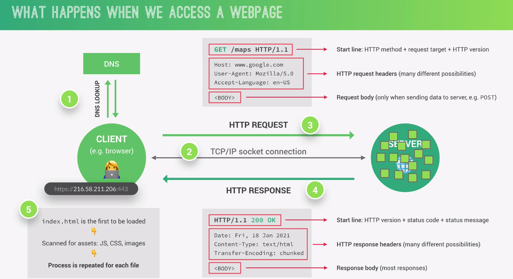
>
> 
>
> 

## Wireless Networking

### RFID/NFC

NFC is a type of RFID

RFID – requires a reader

### Bluetooth

PAN connection – personal area network. Only one-to-one pairing.

### Dial-up

### Broadband

The term broadband has a few definitions. In terms of internet
connectivity, it's used to refer to any connectivity technology that
isn't dial-up Internet. Broadband Internet is almost always much faster
than even the fastest dial-up connections and refers to connections that
are **always on**. This means that they're long lasting connections that
don't need to be established with each use. They're essentially links
that are always present. Broadband shaped today's world. While the
Internet itself is a totally amazing invention, it wasn't until the
advent of broadband technologies that its true potential for business
and home users was realized. Long before people had broadband
connections at home, businesses spent a lot of resources on them usually
out of necessity. If you had an office with more than a few employees,
the bandwidth available by a single dial-up connection would quickly be
oversaturated by just a few users. By the mid 1990's, it had become
pretty common for businesses that needed internet access for their
employees to use various T-carrier technologies. T-carrier technologies
were originally invented by AT&T in order to transmit multiple phone
calls over a single link. Eventually, they also became common
transmission systems to transfer data much faster than any dial-up
connection could handle. We'll cover the details of T-carrier
technologies in an upcoming lesson. After businesses got into the
broadband game, home use became more prevalent. As different aspects of
the Internet, like the World Wide Web became more complex, they also
required ever increasing data transfer rates. In the days of dial-up,
even a single image on a web page could take many seconds to download
and display. High resolution photos that you can now take on a cell
phone would have required a long time to download and a lot of your
patience. A single picture taken on a smartphone today can easily be
several megabytes in size. Two megabytes would translate to 16,777,216
bits. At a baud rate of 14.4 kilobits per second, that many bits would
take nearly 20 minutes to download. No one would've had time to download
all the hilarious cat images on the internet back then. What a travesty.
Without broadband internet connection technologies, the Internet as we
know it today wouldn't exist. We wouldn't be able to stream music, or
movies, or easily share photos. You definitely couldn't be taking an
online course like this. T-carrier technologies require dedicated lines,
which makes them more expensive. For this reason, you usually only see
them in use by businesses. But other broadband solutions also exist for
both businesses and consumers. In the next few videos, we'll deep dive
into four of the most common broadband solutions available today:
T-carrier technologies, digital subscriber lines or DSL, cable
broadband, and fiber connections. Are you ready? Let's get started.

#### DSL

Just like dial-up modems, these devices establish data connections
across phone lines, but unlike dial-up connections, they're usually
long-running. This means that the connection is generally established
when the DSLAM is powered on and isn't torn down until the DSLAM is
powered off. There are lots of different kinds of DSL available, but
they all vary in a pretty minor way. For a long time, the two most
common types of DSL were **ADSL** and **SDSL**.

**ADSL** stands for Asymmetric Digital Subscriber Line. ADSL connections
feature different speeds for outbound and incoming data. Generally, this
means faster download speeds and slower upload speeds. Home users rarely
need to upload as much data as they download since home users are mostly
just clients. For example, when you open a web page in a web browser,
the upload or outbound data is pretty small. You're just asking for a
certain web page from the web server. The download or inbound data tends
to be much larger since it'll contain the entire web page including all
images and other media. For this reason, asymmetric lines often provide
a similar user experience for a typical home user, but at a lower cost.

**SDSL**, as you might be able to guess, stands for Symmetric Digital
Subscriber Line. SDSL technology is basically the same as ADSL except
the upload and download speeds are the same.

Often uses PPPoE

#### History and T1

A T1 has **24** timeslots of with a bandwidth of 64Kbit/s each plus a
very low capacity synchronization channel.

T-carrier technologies were first invented by AT&T in order to provision
a system that allowed lots of phone calls to travel across a single
cable. Every individual phone call was made over individual pairs of
copper wire before Transmission System 1, the first T-carrier
specification, called T1 for short. With the T1 specification, AT&T
invented a way to carry up to 24 simultaneous phone calls across a
single piece of twisted pair copper. Years later, this same technology
was repurposed for data transfers. Each of the 24 phone channels was
capable of transmitting data at 64 kilobits per second, making a single
T1 line capable of transmitting data at 1.544 megabits per second. Over
the years, the phrase T1 has come to mean any twisted pair copper
connection capable of speeds of 1.544 megabits per second, even if it
doesn't strictly follow the original Transmission System 1
specification.

Originally, T1 technology was only used to connect different telecom
company sites to each other and to connect these companies to other
telecom companies. But with the rise of the Internet as a useful
business tool in the 1990s, more and more businesses started to pay to
have T1 lines installed at their offices to have faster Internet
connectivity. More improvements to the T1 line were made by developing a
way of multiple T1s to act as a single link. So a T3 line is 28 T1s, all
multiplexed, achieving a total throughput speed of 44.736 megabits per
second.

You'll still find T-carrier technologies in use today, but they've
usually been surpassed by other broadband technologies

Four of the most common **broadband** solutions available today:

- T-carrier technologies

- digital subscriber lines or DS

- cable broadband

- fiber connections.

#### Cable Broadband

The history of both the telephone and computer networking tells a story
that started with all communications being wired. But the recent trend
is moving towards more and more of this traffic becoming wireless. The
history of television follows the opposite path. Originally, all
television broadcasts were wireless transmissions sent out by giant
television towers and received by smaller antennas in people's homes.
This meant you had to be within range of one of these television towers
to watch TV, just like you have to be within range of a cell phone tower
to use your cellphone today.

Starting in the late 1940s in the United States, the first cable
television technologies were developed. At the time, they mainly wanted
to provide television access to remote towns and rural homes that were
out of range of capabilities of television towers at the time.

Cable television continued to expand slowly over the decades, but in
1984, The Cable Communications Policy Act was passed. This deregulated
the cable television business in the United States and caused a massive
boom in growth and adoption. Other countries all over the globe soon
followed. By the early 1990s, cable television infrastructure in the
United States was about the size of the public telephone system. Not too
long after that, cable providers started trying to figure out if they
could join in on the massive spike in Internet growth that was happening
at the same time.

Much like how DSL was developed, cable companies quickly realized that
the coaxial cables generally used by cable television delivery into a
person's home were capable of transmitting much more data than what was
required for TV viewing. By using frequencies that don't interfere with
television broadcast, cable-based Internet access technologies were able
to deliver high speed Internet access across these same cables. This is
the technology that we refer to when we say cable broadband.

One of the main differences in how cable Internet access works when
compared to other broadband solutions is that cable is generally what's
known as a **shared bandwidth technology**. With technologies like DSL
or even dial up, the connection from your home or business goes directly
to what's known as a Central Office or CO. A long time ago, the COs were
actually offices staffed with telephone operators who used a switchboard
to manually connect the caller with the callee. As technology improved,
the COs became smaller pieces of automated hardware that handled these
functions for the telephone companies, but the name stayed the same.
Technologies that connect directly to a CO can guarantee a certain
amount of bandwidth available over that connection since it's point to
point. On the flip side of this, are cable Internet technologies, which
employ a shared bandwidth model. With this model in place, many users
share a certain amount of bandwidth until the transmissions reach the
ISP's core network. This could be anywhere from a single city block to
entire subdivisions in the suburbs. It just depends on how that area was
originally wired for cables. Today, most cable operators have tried to
upgrade their networks to the point that end users might not always
notice the shared bandwidth. But it's also still common to see cable
Internet connections slow down during periods of heavy use. Like when
lots of people in the same region are using their Internet connection at
the same time. Cable Internet connections are usually managed by what's
known as a cable modem. This is a device that sits at the edge of a
consumer's network and connects it to the cable modem termination
system, or CMTS. The CMTS is what connects lots of different cable
connections to an ISP's core network.

#### Fiber connections

The core of the Internet has long used fiber for its connections, both
due to higher speeds and because fiber allows for transmission to travel
much further without degradation of the signal. Remember that fiber
connections use light for data transmission instead of electrical
currents. The absolute maximum distance an electrical signal can travel
across a copper cable before it degrades too much and requires a
repeater is thousands of feet, but certain implementations of fiber
connections can travel many, many miles before signal degrades.
Producing and laying fiber is a lot more expensive than using copper
cables. So for a long time it was a technology you only saw in use by
ISPs within their core networks, or maybe for use within data centers.
But in recent years it's become popular to use fiber to deliver data
closer and closer to the end user. Exactly how close to the end user can
vary a ton across implementations, which is why the phrase **FTTX** was
developed.

**FTTX** stands for fiber to the X, where the X can be one of many
things. We will cover a few of these possibilities.

- The first term you might hear is **FTTN**, which means fiber to the
  **neighborhood**. This means that fiber technologies are used to
  deliver data to a ***single physical cabinet*** that serves a certain
  amount of the population. From this cabinet, twisted pair copper or
  coax might be used for the last length of distance.

- The next version you might come across is **FTTB**. This stands for
  fiber to the **building**, fiber to the business, or even fiber to the
  basement, since this is generally where cables to buildings physically
  enter. FTTB is a setup where fiber technologies are used for data
  delivery to an individual building. After that, twisted pair copper is
  typically used to actually connect those inside of the building.

- A third version you might hear is **FTTH**, which stands for fiber to
  the **home**. This is used in instances where fiber is actually run to
  each individual residents in a neighborhood or apartment building.
  FTTH and FTTB may both also be referred to as FTTP fiber to the
  premises. Instead of a modem, the demarcation point for Fiber
  Technologies is known as **Optical Network Terminator** or **ONT**. In
  ONT, converts data from protocols, the fiber network can understand to
  those that more traditional twisted pair copper networks can
  understand.

#### Satellite

Occasional Latency

### 802.11 frame fields

In terms of our networking model, you should think of 802.11 protocols
as defining how we operate at both the physical and the data link
layers. An 802.11 frame has a number of fields.

- The first is called the **frame control field**. This field is 16 bits
  long, and contains a number of sub-fields that are used to describe
  how the frame itself should be processed. This includes things like
  what version of the 802.11 was used.

- The next field is called a **duration field**. It specifies how long
  the total frame is. So, the receiver knows how long it should expect
  to have to listen to the transmission.

- After this, are *four* **address fields**. Let's take a moment to talk
  about why there are four instead of the normal two. We'll discuss
  different types of wireless network architectures in more detail later
  in this lesson, but the most common setup includes devices called
  access points. A **wireless access point** is a device that bridges
  the wireless and wired portions of a network. A single wireless
  network might have lots of different access points to cover a large
  area. Devices on a wireless network will associate with a certain
  access point. This is usually the one they're physically closest to.
  But, it can also be determined by all sorts of other things like
  general signal strength, and wireless interference. Associations isn't
  just important for the wireless device to talk to a specific access
  point, it also allows for incoming transmissions to the wireless
  device to be sent by the right access point. There are four address
  fields, because there needs to be room to indicate which wireless
  access point should be processing the frame. So, we'd have our normal
  source address field, which would represent the MAC address of the
  sending device. But, we'd also have the intended destination on the
  network, along with a receiving address and a transmitter address. The
  receiver address would be the MAC address of the access point that
  should receive the frame, and the transmitter address would be the MAC
  address of whatever has just transmitted the frame.

In lots of situations, the destination and receiver address might be the
same. Usually, the source and transmitter addresses are also the same.
But, depending on exactly how a specific wireless network has been
architected, this won't always be the case. Sometimes, wireless access
points

- 

- Since all addresses in an 802.11 frame are Mac addresses, **each of
  those four fields is 6 bytes long**.

<!-- -->

- In between the third and fourth address fields, you'll find the
  sequence control field. The **sequence control field** is **16 bits**
  long and mainly contains a sequence number used to keep track of
  ordering the frames.

- After this is the **data payload section** which has all of the data
  of the protocols further up the stack. Finally, we have a frame check
  sequence field which contains a checksum used for a cyclical
  redundancy check. Just like how ethernet does it.

### Frequency Bands and WiFi

The most common specifications for how wireless networking devices
should communicate, are defined by the IEEE 802.11 standards. This set
of specifications, also called the **802.11** family, make up the set of
technologies we call WiFi. Wireless networking devices communicate with
each other through radiowaves. Different 802.11 standards generally use
the same basic protocol, but might operate at different frequency bands.

**A frequency band** is a certain section of the radio spectrum that's
been agreed upon to be used for certain communications. In North
America, FM radio transmissions operate between 88 and 108 megahertz.
This specific frequency band is called the FM broadcast band. WiFi
networks operate on a few different frequency bands. Most commonly, the
**2.4 gigahertz** and **5 gigahertz bands**.

There are lots of 802.11 specifications including some that exist just
experimentally or for testing. The most common specifications you might
run into are **802.11b, 802.11a, 802.11g, 802.11n, and 802.11ac** (these
are also known as modes). We won't go into detail about each one here.
For now, just know that we've listed these in the order they were
adopted. Each newer version of the 802.11 specifications has generally
seen some improvement, whether it's higher access speeds, or the ability
for more devices to use the network simultaneously. In terms of our
networking model, you should think of 802.11 protocols as defining how
we operate at both the physical and the data link layers.

The many different 802.11 specifications -- most commonly b, a, g, n,
and ac -- all operate with the same basic data link protocol. But, how
they operate at the physical layer varies. Each of these specifications
can have different ranges, can use different **modulation** techniques,
can have different transmission bit rates, operate on different
frequency bands, etc.

Memorizing all of these differences probably isn’t worth the time unless
you’re going to be working with many different types of wireless
networks all the time. The most important thing to remember is that
networks that operate on the 5Ghz band are almost always faster, but
have less of a range. Most of the 2.4Ghz networks are slightly slower
and more susceptible to interference, but usually cover a larger area

[https://en.wikipedia.org/wiki/IEEE_802.11\\](https://en.wikipedia.org/wiki/IEEE_802.11\)

### Wireless Channels

The concept of channels is one of the most important things to
understand about wireless networking. Channels are individual, smaller
sections of the overall frequency band used by a wireless network.
Channels are super important because they help address a very old
networking concern, collision domains. You might remember that a
collision domain is any one network segment where one computer can
interrupt another. Communications that overlap each other can't be
properly understood by the receiving end. So when two or more
transmissions occur at the same time, also called a collision, all
devices in question have to stop their transmissions. They wait a random
amount of time and try again when things quiet down. This really slows
things down.

The problem caused by **collision domains** has been mostly reduced on
wired networks through devices called **switches**. Switches remember
which computers live on which physical interfaces. So traffic is only
sent to the node It's intended for. Wireless networking doesn't have
cables, so there aren't physical interfaces for a wireless device to
connect to. That means, we can have something that works like a wireless
switch.

Wireless devices are doomed to talk over each other. **Channels** help
fix this problem to a certain extent.

We just mentioned 2.4 Gigahertz and five Gigahertz. This is because
that's really just shorthand for where these frequency bands actually
begin. For wireless networks that operate on a 2.4 Gigahertz band, what
we really mean is that they operate on roughly the band **from 2.4
Gigahertz to 2.5 Gigahertz**. Between these two frequencies are a number
of channels, each with a **width of a certain megahertz**. Since
different countries and regions have different regulatory committees for
what radio frequencies might be used for what, exactly how many channels
are available for use depends on where in the world you are. For
example, dealing with an 802.11b network, channel one operates at **2412
megahertz**, but since the channel width is 22 megahertz, the signal
really lives on the frequencies between **2401 megahertz and 2423
megahertz**. This is because radio waves are imprecise things. So, you
need some buffer around what exact frequencies a transmission might
actually arrive on.

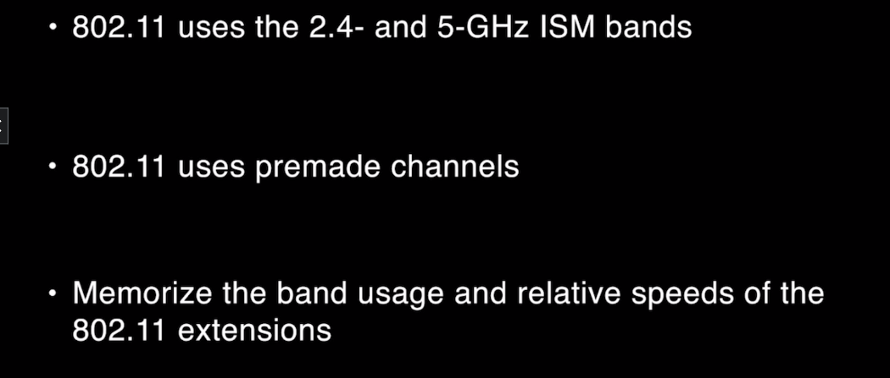

### Wireless Network Configurations

There are a few main ways that a wireless network can be configured.

There are **ad-hoc networks** where nodes all speak directly to each
other.

There are **wireless LANS** or WLANS where one or more access points act
as a bridge between a wireless and a wired network.

And there are **mesh networks** which are kind of a hybrid of the two

### Wireless Adapters

<https://www.youtube.com/watch?v=0lqRZ3MWPXY>

### Antennas

So I want to take a moment and talk about the different types of
signals.

Now, there's basically three types of antennas out there.

There is an omnidirectional there is a patch and then there is a highly
directional.

So with an omnidirectional.

Now, I'm going to pretend for a minute that this is an omni
omnidirectional is like the antennas that

you see on automobiles.

It's just one piece of metal that sticks up.

Omnidirectional is distinct that because the radiation pattern looks
like a big fuzzy ball and the more

power you put to the antenna, the larger this fuzzy ball gets now.

Omnidirectional works fine, there's nothing wrong with it, but think
about what a big fuzzy ball does

for you if, say, you're like on one floor of an office, a lot of times
that type of fuzzy ball signal

propagation isn't what we want.

So what we tend to turn to is something like this.

This is really a dipole antenna.

What you're looking at are two omnidirectional antennas that are
pointing exactly opposite of each other.

Now, if you look at this, you go, whoa, Mike, this looks like a nominee
directional.

Just one thing, stick it up.

But it's really not at the midpoint here.

There's another antenna pointing straight down.

Dipole antennas create a very interesting signal that's very useful for
wireless.

It basically looks like somebody took a doughnut and stomped it.

So you get a big flat circular signal, which is absolutely perfect.

Like, for example, if you're on the highway or if you're on one floor of
an office or if you're in

a park, things like that, where you just need a big signal going out,
you don't want to propagate

up into space or down into the dirt.

So dipoles are very, very popular on this system.

Right here.

I got three dipoles.

Now, there are some other situations that come into play, another one is
what we call patch now a

patch antenna, and I've got one right here.

So a 10 is always going to have this flat look to it and the idea behind
a patch is that the radiation

signal is going to be a big fuzzy ball, but only half of one.

So if you're against a wall and you want to propagate in one direction,
but you don't want to, going

out the back patches are extremely popular ways to get that type of
coverage.

The last type is what I call highly directional.

And I've got one example right here.

This is a Yagi antenna.

So a Yagi antenna is designed.

So anybody old out there who remembers when antennas for your TV were?

No, OK, well, it was the television of your forefathers anyway.

These are highly directional and they're propagation signal.

Looks like we'll take a football and American football and stretch it
out really, really, really long.

So that type of signal, which is also known as a friendly lens, is
really good for shooting really

long distances.

So a lot of times if you're using a highly directional antenna, you
probably have another highly directional

antenna pointing back at it.

So for really long throws for 211, these are very popular.

There is another version.

I don't have a one on me, so I'll just show a picture of you.

And that is what we call a parabolic.

So parabolic antennas are another alternative for very, very long,
highly directional throws.

So make sure you're comfortable with these eight to 11 BASIX.

We have two modes infrastructure, which means you will be using a
wireless access point and adhoc,

which means you will not be using a wireless access point.

Also, keep in mind is that if you have a WAP, you're also going to have
to have some network card

which connects to an SS ID which will configure on our wireless access
points.

And also keep in mind is that there are lots of antennas out there.

There are directional antennas like a Yoji and a parabolic there's a
patch which is kind of unique unto

itself.

And then there's going to be omnis and dipoles when you need to cover a
really broad area.

### (Wireless) Access point \[WAP\]

**(Wireless) Access point**: Connects a LAN to nearby wireless devices.
Physically connects to a router (with Ethernet cable) which itself is
connected to a modem. It essentials extends the WiFi signal. Can just
use more routers, but this means all routers would need to be updated if
any configuration was modified by the main router. By contrast, access
points inherit the configuration settings from the router they are
connected to. Also, allows all wireless devices which are connected to
operate on a single subnet instead of multiple subnets.

***Key Differences:***

- APs have no switch since they are only used to connect wireless
  devices.

- APs inherit router config

- APs don’t have a Firewall – routers do.

- APs do not have a built-in DHCP service – routers do.

  - AP will receive local ip from router and send it to devices.

- APs do not have a WAN port – so they cannot directly connect to modem
  to receive internet, they can only receive internet connection from
  the Ethernet port.

<https://www.youtube.com/watch?v=OxiY4yf6GGg>

### WLAN

**A traditional wireless network involving access points that all have
wired connections.**

### Quiz

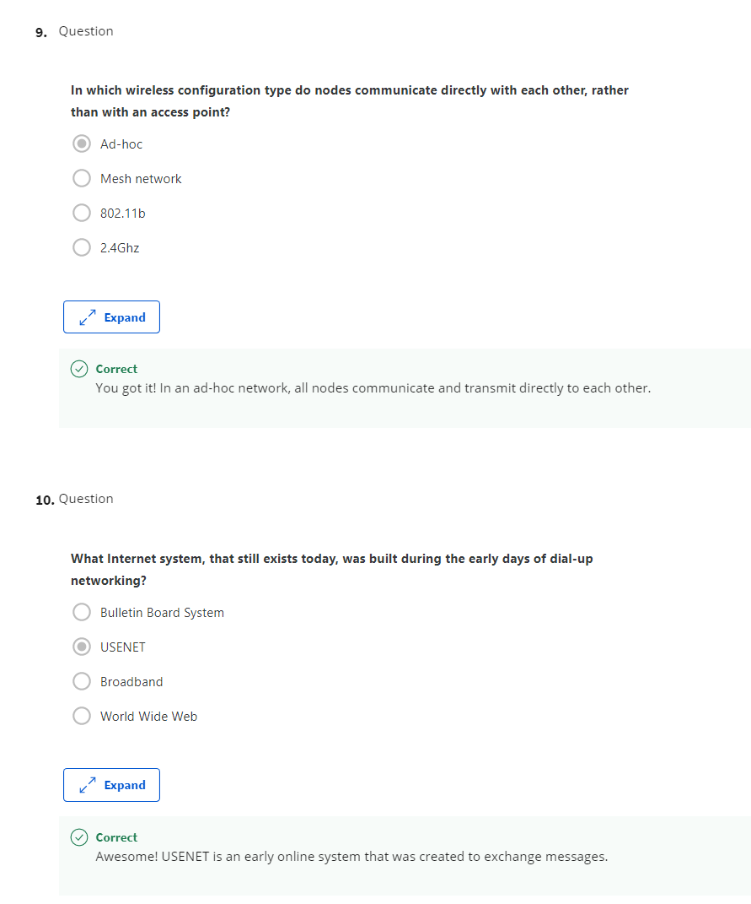

### Virtualilzation

### Virtual Machines and containers

**Type 1 VMs (enterprise):** VMWare’s Sphere, Microsoft’s Hyper-V
\[Hypervisor sites on Hardware\]

**Type 2 VMs (end user):** Virtual box, VMWare’s Fusion \[Hypervisor
sits on OS\]

- 

#### Virtualbox

You can right-click OVA files and open with VirtualBox to install.

OVA is just a tar’d and archived version of an OVF file.

#### Installing Hyper-V

<https://www.youtube.com/watch?v=3I64TeJ4iNI&t=380s>

<https://www.cloudwards.net/hyper-v/>

Enable from the command prompt to feel cool:

DISM /Online /Enable Feature /All /FeatureName:Microsoft-Hyper-V

### Cloud Computing & Cloud backup Solutions

<https://www.youtube.com/watch?v=1pBuwKwaHp0>

#### Air-gapped

An **air gap**, **air wall**, **air
gapping**[\[1\]](https://en.wikipedia.org/wiki/Air_gap_(networking)#cite_note-1) or **disconnected
network** is a [network
security](https://en.wikipedia.org/wiki/Network_security) measure
employed on one or more computers to ensure that a secure [computer
network](https://en.wikipedia.org/wiki/Computer_network) is physically
isolated from unsecured networks, such as the
public [Internet](https://en.wikipedia.org/wiki/Internet) or an
unsecured [local area
network](https://en.wikipedia.org/wiki/Local_area_network).[\[2\]](https://en.wikipedia.org/wiki/Air_gap_(networking)#cite_note-2) It
means a computer or network has no [network
interfaces](https://en.wikipedia.org/wiki/Network_interface) connected
to other
networks,[\[3\]](https://en.wikipedia.org/wiki/Air_gap_(networking)#cite_note-Zetter-3)[\[4\]](https://en.wikipedia.org/wiki/Air_gap_(networking)#cite_note-Bryant-4) with
a physical or conceptual air gap, analogous to the [air
gap](https://en.wikipedia.org/wiki/Air_gap_(plumbing)) used in plumbing
to maintain water quality.

#### Seed drive

<https://support.storagecraft.com/s/article/seed-storagecraft-cloud?language=en_US#:~:text=Seed%20drives%20are%20used%20when,preparing%20to%20seed%20the%20cloud>.

<https://searchdatabackup.techtarget.com/definition/cloud-seeding>

Cloud seeding is a strategy for uploading large amounts of data to
a [cloud
storage](https://searchstorage.techtarget.com/definition/cloud-storage) service.
Transferring a sizable amount of data to the cloud can take days, weeks
or even years. To help decrease transmission time, some [cloud storage
providers](https://searchstorage.techtarget.com/definition/cloud-storage-provider) offer
a seeding option in which a [disk
drive](https://searchstorage.techtarget.com/definition/hard-disk) or
other [appliance](https://whatis.techtarget.com/definition/appliance-network-appliance) is
sent to the customer, who then backs up data locally and ships the
drive/appliance back to the provider.

#### NAS (Network-attached storage)

Network-attached storage is a file-level computer data storage server
connected to a computer network providing data access to a heterogeneous
group of clients. NAS is specialized for serving files either by its
hardware, software, or
configuration. [Wikipedia](https://en.wikipedia.org/wiki/Network-attached_storage)

#### Backup

##### The Grandfather-Father-Son (GFS) Backup Strategy

<https://backup.ninja/news/grandfatherfatherson-gfs-backup-strategy>

**Why Use Grandfather-Father-Son (GFS)?**

The key advantage of using the GFS strategy is that it is easy to
operate and saves on storage. However, the restoration process can be
very complex. Having suitable tools to create such a setup is essential
to ease your restoration process.

#### Failover & Failback

**Failover** to a redundant system and **failback** to the original
system.

<https://en.wikipedia.org/wiki/Failover>

#### CRC: Cyclic redundancy check

A cyclic redundancy check is an error-detecting code commonly used in
digital networks and storage devices to detect accidental changes to raw
data. Blocks of data entering these systems get a short check value
attached, based on the remainder of a polynomial division of their
contents.

#### Data backup: File vs Image

<https://blog.storagecraft.com/file-backup-vs-image-backup-how-to-choose/>

### IPv6

#### IPv6 Addressing and Subnetting 

#### IPv6 address shortening (compressing)

IPv6 addresses are 128 bits long. IPv4 address are 32 bits long. No IP
address versions are 64 or 256 bits long.

Just like how an IPv4 address is really just a 32-bit binary number,
IPv6 addresses are really just one 28-bit binary numbers. IPv4 addresses
are written out in four octets of decimal numbers, just to make them a
little more readable for humans. But trying to do the same for an IPv6
address just wouldn't work. Instead, IPv6 addresses are usually written
out as 8 groups of 16-bits each. Each one of these groups is further
made up of four hexadecimal numbers. A full IPv6 address might look
something like this.

**There are two rules when it comes to shortening an IPv6 address.**

1.  The first is that you can remove any leading zeros from a group.

    1.  

    2.  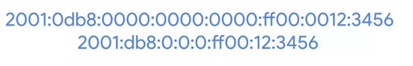

2.  The second is that if you have a “hextet” with 4 zeros then you can
    remove those and leave a single zero. Your IPv6 device will add the
    remaining 3 zeros.

3.  The third is that any number of consecutive groups composed of just
    zeros can be removed.

    1.  

    2.  I should call out that this can only happen once for any
        specific address. Otherwise, you couldn't know exactly how many
        zeros were replaced by the double colons.

<https://networklessons.com/ipv6/shortening-ipv6-addresses>

##### Loopback address

You might remember that with IPv4, this address is 127.0.0.1. With IPv6,
the loopback address is 31 0s with a 1 at the end, which can be
condensed all the way down to just **::1**.

#####  Other Reserved Addresses

The IPv6 address space has several other reserved address ranges,
besides just the one reserved for documentation purposes, or the
loopback address.

- For example, any address that begins with **FF00**:: is used for
  multicast, which is a way of addressing groups of hosts all at once.

- It's also good to know that addresses beginning with **FE80**:: are
  used for **link-local unitcast**. Link-local unicast addresses allow
  for local network segment communications, and are configured based
  upon a host's MAC address. The link-local address are used by an IPv6
  hosts to receive their network configuration, which is a lot like how
  DHCP works. The host's MAC address is run through an algorithm to turn
  it from a 48-bit number into a unique 64-bit number. It's then
  inserted into the addresses host ID. The IPv6 address space is so
  huge, there was never any need to think about splitting it up into
  address classes like we used to do with IPv4. From the very beginning,
  an IPv6 address had a very simple line between network ID and host ID.
  The first 64-bits of any IPv6 address is the network ID, and the
  second 64-bits of any IPv6 address is the host ID. This means that any
  given IPv6 network has space for over 9 quintillion hosts. Still,
  sometimes network engineers might want to split up their network for
  administrative purposes. IPv6 subnetting uses the same CIDR notation
  that you're already familiar with. This is used to define a subnet
  mask against the network ID portion of an IPv6 address.

**IPv6 address classes**

Also uses CIDR notation

#### IPv6 Headers

1.  The first field in an IPv6 header is the **version field**. This is
    a **4-bit** field that defines what version of IP is in use. You
    might remember that an IPv4 header begins with this exact same
    field.

2.  The next field is called the **traffic class field**. This is an
    **8-bit** field that defines the type of traffic contained within
    the IP datagram and allows for different classes of traffic to
    receive different priorities.

3.  The next field is the **flow** **label field**. This is a **20-bit**
    field that's used in conjunction with the traffic class field for
    routers to make decisions about the quality of service level for a
    specific datagram.

4.  Next you have the **payload length field**. This is a **16-bit**
    field that defines how long the data payload section of the datagram
    is.

5.  Then you have the **next header field**. This is a unique concept to
    IPv6, and needs a little extra explanation. IPv6 addresses are four
    times as long as IPv4 addresses. That means they have more ones and
    zeros, which means that they take longer to transmit across a link.
    To help reduce the problems with additional data that IPv6 addresses
    impose on the network, the IPv6 header was built to be as short as
    possible. One way to do that is to take all of the optional fields
    and abstract them away from the IPv6 header itself. The next header
    field defines what kind of header is immediately after this current
    one. These additional headers are optional, so they're not required
    for a complete IPv6 datagram. Each of these additional optional
    headers contain a next header field and allow for a chain of headers
    to be formed if there's a lot of optional configuration.

6.  Next we have what's called the **hop limit field**. This is an
    **8-bit** field that's identical in purpose to the TTL field in an
    IPv4 header.

7.  Finally, we have the **source** and **destination address** fields,
    which are each a **128** bits. If the next header field specified
    another header, it would follow at this time. If not, a data payload
    the same length as specified in the payload length field would
    follow.

#### IPv6 and IPv4 Harmony

It's just not possible for the entire Internet and all connected
networks to switch to IPv6 all at once. There would be way too much
coordination at play. Too many old devices that might not even know how
to speak IPv6 at all, still requiring connections. So the only way IPv6
will ever take hold is to develop a way for IPv6 and IPv4 traffic to
coexist at the same time. This would let individual organizations make
the transition when they can.

**IPv4 mapped address space**

One example of how this can work is with what's known as **IPv4 mapped
address space**. The IPv6 specifications have set aside a number of
addresses that can be directly correlated to an IPv4 address. ***Any
IPv6 address that begins with 80 zeros, and is then followed by 16 ones
is understood to be part of the IPv4 mapped address space***. The
remaining 32 bits of the IPv6 address is just the same 32 bits of the
IPv4 address it's meant to represent. This gives us a way for IPv4
traffic to travel over an IPv6 network. But probably more important is
for IPv6 traffic to have a way to travel over IPv4 networks. It's easier
for an individual organization to make the move to IPv6 than it is for
the networks at the core of the Internet to. So while IPv6 adoption
becomes more widespread, it'll need a way to travel over the old IPv4
remnants of the Internet backbone.

**IPv6 tunnels**

The primary way this is achieve today is through IPv6 tunnels. IPv6
tunnels are conceptually pretty simple. They consist of IPv6 tunnels
servers on either end of a connection. These IPv6 tunnel servers take
incoming IPv6 traffic and encapsulate it within traditional IPv4
datagrams. This is then delivered across the IPv4 Internet space where
it's received by another IPv6 tunnel server. That server performs the
de-encapsulation and passes the IPv6 traffic further along in the
network.

**IPv6 tunnel broker**

Along with IPv6 tunnel technologies, the concept of an **IPv6 tunnel
broker** has also emerged. These are companies that provide IPv6
tunneling endpoints for you, so you don't have to introduce additional
equipment to your network.

There are a lot of competing protocols to be used for these kinds of
IPv6 tunnels. Since this is still a new and evolving space, it's not
clear who the winner will be. I've left you with some links to read
about the main competitors right after this video. It doesn't really
matter which tunneling technology ends up becoming the most common
solution. It'll probably fade away in time itself.

The future of networking is the adoption of IPv6 as the main protocol at
the network layer, and one day we won't need any tunnels at all. The
future is limitless, and tunnelless, or something like that.

# Infrastructure Services

## Physical Infrastructure

## SDN and tacacs

Let's start off with a question. Which would be the most important to
spend our time on as far as securing, a water bottle half full or a
network device, like a next generation firewall to make sure it has
physical security and can't be compromised because it's providing all
the security for our network?

Now, there's a good chance if you're like me that we want to spend the
time and security on the devices that need it the most and have the
lowest risk to us if they're compromised. So in this video, I'd like to
share with you a few additional authentication methods and options that
we can use to put the appropriate level of control to protect our stuff.

So let's start off by taking a look at how we can protect the management
of our network devices. So here's a firewall, a router, a switch. Now,
in the old days what we would do is we would go from our management
machine-- let's say this is us right here at this computer-- and we
would SSH to gain connectivity to that device.

And then we'd use the command line to go ahead and configure it. Same
with the router and the firewall. As time went on, then we had graphical
user interfaces. And now we're getting more and more to something called
SDN, software defined networking. And one option for SDN software to
find networking is that instead of us having to log in directly to this
gear, what we do is we log on to some kind of an SDN, software defined
networking controller, very similar to what we talked about with
wireless, where we talk to the controller and then the controller talks
to the access points.

Well, for our network here, we talk to the SDN controller. And then the
controller talks to the switches and the routers and the firewalls. It's
like command and control for us. So we specify what we want. And what it
does it translates those to the individual commands on those devices.

We also can get feedback from those devices back to the controller,
which we can then see on, hopefully, one pane of glass. So that's a
quick high level overview of software defined networking. But in either
case, whether we're connecting directly to the switch or the
controller's talking to the switch, we want to make sure that the switch
and the router and the firewall are only accepting commands and
accepting logins from authorized entities, whether it's us directly or
from an SDN controller.

And one option that is popular in Cisco-specific networks is an
authentication option called TACACS. And officially behind the scenes is
called TACACS+. There's been a few versions of TACACS. And the acronym
stands for terminal access controller access control system, which is
why we just call it TACACS.

That's the actual pronunciation of the acronym, TACACS. And it is Cisco
proprietary. So unlike RADIUS, which we can use with a AAA server, which
is an open standard, TACACS is proprietary to Cisco systems. And the
concept is this. If we have a TACACS server right here and we have Bob,
who's going to go ahead and access a switch, when he tries to
authenticate or connects that switch for management purposes, the switch
talks to the TACAC server and says, hey, TACAC server, got Bob trying to
log in.

Is that OK? And then TACAC server would respond back and say yes or no.
At which point, the switch would then give access to Bob for the
management of that switch. So think of TACACS as a Cisco proprietary
solution for authenticating the management functions, or the person who
is going to be managing a switch or a router or a firewall.

And the benefit of having a centralized TACAC server, which is also
acting as a AAA server for the authentication, authorization, and
accounting regarding Bob or any other user that might be trying to
manage your network, the benefit is we can have all that user
information for our administrators on the TACAC server.

And then we can have that TACAC server be used by lots of devices. The
router could check in with TACACS. The firewall could check in with
TACACS. And we don't have to locally create a user account for Bob on
the switch, on the router, on the firewall, or anywhere else.

We can have all those devices acting as TACACS clients, checking with
the TACAC server anytime someone tries to log in for the administration
of a network device. Now, one other factor with authentication in
general, whether it's administrators trying to manage the network or its
users trying to get access to the system, because many environments,
including Active Directory, use single sign on, which means that Lois
here, she logs on once into the domain.

And then if she passes that authentication, she then has the
authorization for whatever she's been given, the rights and permissions
in the entire domain. So we really want to make sure that Lois is really
Lois. And so even though we've touched on it before in a separate set of
skills, I want to touch on it again because it's so important.

And that is the idea of two factor authentication, or multi-factor
authentication. And the secret two factor or multi-factor authentication
is two, but from two different categories, or factors. One is something
that the user knows. So that would be very likely a password.

So what all the cool kids are doing now as far as passwords is we're
doing passphrases, something that is like three or four words that don't
make sense together, but they make sense of the user. That way they're
easy to remember, but hard to break. And the user doesn't have to write
them down.

That'll be one category. Something that the user has. Now, that user may
have a hardware token or a software token, like a six digit code that
gets generated as a one time password. So if we were requiring for log
in the password for the user and also the token that was generated from
a software or hardware token generator, that would meet the requirements
of two factor authentication.

And a third major category is something that the user is, like
biometrics, like a fingerprint reader, an eyeball scanner, either retina
or iris, or a hand print or something else that's unique to that person
that that user is. That can also extend to voice analysis or the way
they type.

So the risk of using single factor authentication, like just a password,
increases the likelihood that an attacker or someone who's going to
compromise the network could log in as Bob or as our user. So by using
multi-factor authentication with at least two elements from two
different categories or two different factors, we're helping to ensure
that the person who's authenticating really is the person we intended.

And that way the authorization and the rights they've been given will
only be given to the correct person, not the hacker. So I hope this has
been informative for you. And I'd like to thank you for viewing.

## Directory Server

**Directory services** are great for centralized authentication, keeping
track of where computers are in your organization, who can access them
and more.

Have you ever looked up someone's phone number in a phone directory? Or
use a directory listing at a shopping mall to find a specific store? A
directory server essentially provides the same functionality. A
**directory server** contains a lookup service that provides mapping
between network resources and then network addresses. It's used to
organize and look up organizational objects and entities ranging from
things like user accounts, user groups, telephone numbers, and network
shares. Instead of managing user accounts and computer information
locally on every machine, all that information can be stored on a
directory server for easy access and management. The ideal enterprise
quality directory server should support replication.

Directory services are useful for organizing data and making it
searchable for an organization. This is achieved through the use of a
hierarchal model of objects and containers. The containers are referred
to as **organizational units** or **OUs**, and they can contain objects
or more organizational units. This is similar in organizational
structure to a file system.

**Gpupdate and gpresult**

### LDAP

Before we jump into directory services, let's talk about the underlying
protocol that's used in directory services called **LDAP** or
**lightweight directory access protocol**.

**LDAP** is used to access information in directory services like over a
network.

**Two of the most popular directory services** that use LDAP are
**active directory** and **openLDAP**, which we'll talk about more in
upcoming lessons. There are a lot of different operations you can use in
LDAP. You can add a new entry in the directory server database like
creating a **new user objects called Cristi**. You can delete an entry
in the directory server database. You can modify entries and much, much
more. When we say ***entry***, we're referring to the LDAP entry format
or ***LDAP notation*** for records in the directory service.

***An LDAP entry is just a collection of information that's used to
describe something***. Take a look at this example.

Don't worry too much about what this says. The format of LDAP entry
basically has a unique entry name denoted by dn or distinguished name,
then attributes and values associated with that entry. So, CN is the
common name of the object. In this case, since it's a person, we use
Devan Sri-Tharan as the name. OU is the organizational unit such as a
group. And in this case, Sysadmin is used. DC is the main component. So
example.com is split into example then com. Again, it's not necessary to
remember these attributes. You can reference them in the next reading.
The takeaway here is that LDAP notation is used for entries in directory
services to describe attributes using values.

<https://en.wikipedia.org/wiki/LDAP_Data_Interchange_Format>

**Centralized management**

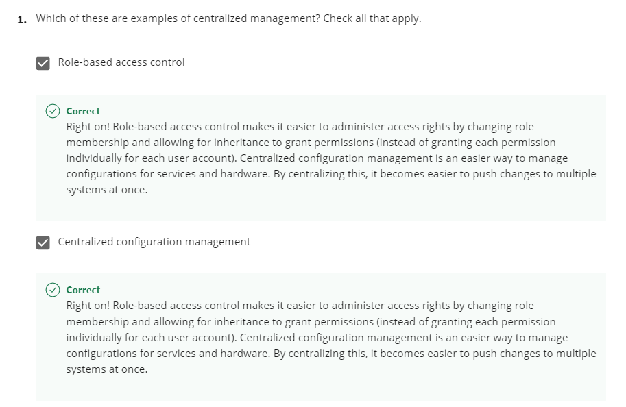

**LDAP Authentication**

We talked about the different operations you can do with LDAP, like add,
remove or modify entries in a directory. Another operation that you can
perform is the Bind operation, which authenticates clients to the
directory server. Let's say you want to log in to a website that uses a
directory service. You enter your account login information and
password, your information is then sent back to the website.

It will use LDAP to check if that user account is a user at the
directory and that the password is valid. If it's valid, then you will
be granted access into that account. You want your data to be protected
and encrypted when it's completing this process.

*There are three common ways to authenticate.*

**The first is anonymous, then simple, and the last is SASL**, or simple
authentication and security layer. When using anonymous binding, you
aren't actually authenticating at all, depending on how it's configured
anyone could potentially access that directory, just like our public
phone book example. When you use simple authentication you just need the
directory entry name and password, this is usually sent in plain text,
meaning it's not secure at all. Another authentication method that's
commonly used is SASL authentication. This method can employ the help of
security protocols like TLS, which we've already learned about in
Kerberos, which we'll discuss in a minute. SASL authentication requires
the client and the directory server to authenticate using some method.
One of the most common methods for this authentication is using
Kerberos. Kerberos is a network authentication protocol that is used to
authenticate user identity, secure the transfer of user credentials, and
more. Kerberos by itself can be a complex topic that we'll revisit in
the IT security course. If you want to learn more about Kerberos right
now, you can check out at the supplemental reading right after this
lesson. Once the client has successfully authenticated with LDAP server
or directory service, the user will be authorized to use whatever access
levels they have. In the next few lessons we're going to dive deeper
into two of the most popular directory services that use LDAP, Active
Directory and OpenLDAP.

LDAP, or Lightweight Directory Access Protocol, is an open
industry-standard protocol for accessing and maintaining directory
services. When we say directory services, we're referring to something
similar to a phone or email directory. It's most commonly used as a
backend for authentication of accounts. The LDAP specification describes
the data structure of the directory itself. And defines functions for
interacting with the service, like performing look ups and modifying
data. You can think of a directory like a database, but with more
details or attributes, describing entities within the database. The
structure of an LDAP directory is a sort of tree layout and is optimized
for retrieval of data more so than writing. Think of it as being similar
to a phone book being used for looking up data far more often than
making modifications to that data. Directories can be hosted across lots
of different LDAP servers to facilitate more rapid look ups, and are
kept in sync through replication of the directory. So what kind of data
gets stored in directory entry, exactly? Similar to an address book, an
entry for a particular user will contain information pertaining to that
user account, like their first and last name, phone number, desk
location, email address, login shell, and other such data. Along with
object attributes the location of an entry within the overall data
structure will represent information pertaining to the objects as
relationships between objects. Because LDAP uses a tree structure called
a Data Information Tree, objects will have one parent and can have one
or more children that belong to the parent object. You can also think
about this like a file system with a root file system in folders under
that. The folder an object belongs to will provide information about
that object because of its relationship to the parent object. In LDAP
language, we call these folders Organizational Units, or OUs. They let
us group related objects into units like people or groups to distinguish
between individual user accounts and groups that accounts can belong to.
This tree structure also allows for inheritance and nesting of objects,
where attributes or properties of a parent object can be inherited by
children further down the tree. Now, since it is possible for entries in
the directory to share attributes, there must be a unique identifier for
each entry. We call this, Distinguished Name, or DN. Coming back to our
file system analogy, you can think of a DN as a full path to a file as
opposed to a file name. This is because you can have multiple files with
the same file name across a file system. But the fully qualified path to
the file would describe one unique file. Some of the more common
operations that can be called by a client to interact with an LDAP
server are bind, which is how clients authenticate to the server.
StartTLS, which permits a client to communicate using LDAP v3 over TLS.
Search, for performing look ups and retrieval of records.
Add/delete/modify which are various operations to write data to the
directory, and Unbind, which closes the connection to the LDAP server.
Now, there are many implementations of LDAP servers, like Active
Directory from Microsoft and OpenLDAP for open source implementations.

#### On Kerberos

<https://technet.microsoft.com/en-us/library/cc780469(v=ws.10).aspx>

Kerberos is a network authentication protocol that uses tickets to allow
entities to prove their identity over potentially insecure channels to
provide mutual authentication. It also uses symmetric encryption to
protect protocol messages from eavesdropping and replay attacks. The
name Kerberos is taken from the Greek mythical character of the same
name. A three headed guard dog protecting the gates to Hades, the
underworld. Seems like an appropriate choice for an authentication
protocol, don't you think? Kerberos was originally developed at the
Massachusetts Institute of Technology in the US, and was published in
the 1980s as version four. Years later, in 1993, version 5 was
published. Today Kerberos supports AES encryption, and implements
checksums to ensure data integrity and confidentiality. When joined to a
Windows domain, Windows 2000 and newer versions will use Kerberos as the
default authentication protocol. Microsoft also implemented their own
Kerberos service with some modifications to the open protocol like the
addition of the RC 4 Stream Cipher. We mentioned tickets earlier which
is a sort of token that proves your identity. They can be used for
authenticating to services protected using Kerberos or in other words or
within the Kerberos realm. The authentication tickets let users
authenticate to services without requiring username and password
authentication for every service individually. A ticket will expire
after some time, but it has provisions for automatic transparent renewal
of the ticket. Let's run down the details of how the Kerberos protocol
operates. First, a user that wants to authenticate enters their username
and password on their client machine. Their Kerberos client software,
will then take the password and generate a symmetric encryption key from
it. Next, the client sends a plain text message to the Kerberos, AS or
Authentication Server which includes the user ID of the authenticating
user. The password or secret key derive from the password aren't
transmitted. The AS uses the user ID to check if there is an account in
the authentication database, like an active directory server. If so the
AS will generate the secret key using the hashed password stored in the
key distribution center server. The AS will then use the secret key to
encrypt and send a message containing the client TGS session key. This
is a secret key use for encrypting communications with the Ticket
Granting Service or TGS, which is already known by the Authentication
Server. The AS also sends a second message with a Ticket Granting Ticket
or TGT, which is encrypted using the TGS secret key. The Ticket Granting
Ticket has information like the client ID, ticket validity period, and
the client taking granting service session key. So the first message can
be decrypted using the shared secret key derived from the user password.
It then provides the secret key that can decrypt the second message
giving the client a valid Ticket Granting Ticket. Now, the client has
enough information to authenticate with the Ticket Granting Server.
Since the client has authenticated and received a valid Ticket Granting
Ticket, it can use the Ticket Granting Ticket to request access to
services from within the Kerberos realm. This is done by sending a
message to the Ticket Granting Service with the encrypted Ticket
Granting Ticket received from the AS earlier along with the service name
or ID the client is requesting access to. The client also sends a
message containing in authenticator which has the client ID and a time
stamp that's encrypted with the client Ticket Granting Ticket session
key from the AS. The Ticket Granting Service decrypts the Ticket
Granting Ticket using the Ticket Granting Service secret key, which
provides the Ticket Granting Service with the client Ticket Granting
Service session key. It then uses the key to decrypt the authenticator
message. Next, it checks the client ID of these two messages to ensure
they match. If they do, it sends two messages back to the client. The
first one, contains the client to server ticket which is comprised of
the client ID, client address, validity period, and the client-server
session key encrypted using the service's secret key. The second
message, contains the client-server session key itself, and is encrypted
using the client Ticket Granted Service session key. Finally, the client
has enough information to authenticate itself to the service server or
SS. The client sends two messages to the SS. The first message is the
encrypted client to server ticket received from the Ticket Granting
Service. The second is a new authenticator with the client ID and time
stamp encrypted using the client-server session key. The SS decrypts the
first message using its secret key which provides it with the
client-server session key. The key is then used to decrypt the second
message, and it compares the client ID in the authenticator to the one
included in the client to server ticket. If these IDs match, then the SS
sends a message containing the time stamp from the client supplied
authenticator encrypted using the client-server session key. The client,
then decrypts this message, and checks that the time stamp is correct
authenticating the server. If this all succeeds, then the server grants
access to the requested service on the client. Wow, okay, are you with
me? I know that was a lot. Kerberos has received some criticism because
it's a single monolithic service. This creates a single point of failure
danger. If the Kerberos service goes down, new users won't be able to
authenticate and log in. Aside from the availability issues, if the
central Kerberos server is compromised, the attacker would be able to
impersonate any user by generating valid Kerberos tickets for their user
account. Kerberos enforces strict time requirements requiring the client
and server clocks to be relatively closely synchronized, otherwise,
authentication will fail. This is usually accomplished by using NTP to
keep both parties synchronized using an NTP server. The trust model of
Kerberos is also problematic, since it requires clients and services to
have an established trust in the Kerberos server in order to
authenticate using Kerberos. This means, it's not possible for users to
authenticate using Kerberos from unknown or untrusted clients. So things
like BYOD or Bring Your Own Device, and cloud computing are
incompatible, or at least very challenging to implement securely with
Kerberos authentication. Now as an IT support specialist, you're likely
to encounter Kerberos authentication especially, in an environments
running Microsoft Active Directory. Understanding how the underlying
protocol functions will help when troubleshooting issues that may come
with it.

#### Active Directory

<https://www.youtube.com/watch?v=Q4I2lKHboDw>

Active Directory, or AD, is the native directory service for Microsoft
Windows.

<u>Active Directory organizes users, groups and computer permissions to
restrict certain resources in the enterprise environment. It's also used
to deploy software, and it's also used to control the environment</u>

#### openLDAP

In the last lesson you dove headfirst into the popular directory service
Active Directory. You learned how to add users, password, groups and
even modify access level for groups, using group policies. Another
popular directory service that's used today is the free and open source
service OpenLDAP. OpenLDAP, which stands for lightweight directory
access protocol operates very similar to Active Directory. Using LDAP
notation or LDAP data interchange format, or LDIF, you can authenticate,
add, remove users, groups, computers and so on in a directory service.
OpenLDAP can be used on any operating system, including Linux, macOS,
even Microsoft Windows. However, since Active Directory is Microsoft's
propriety software for directory services, we recommend that you use
that on Windows instead of OpenLDAP. But its helpful to know that
OpenLDAP is open source so it can be used on a variety of platforms.
There are a few ways you can interact with an OpenLDAP directory. First,
you can use the command-line interface and passing commands to create
and manage directory entries. You can also use a tool like phpLDAPadmin,
which offers you a web interface that you can use to manage your
directory data, much like the Windows Active Directory GUI that you're
familiar with. You can read more about how to set up OpenLDAP and
phpLDAPadmin in the next reading. In this lesson we'll give you a high
level overview of the operations you can do in OpenLDAP via commands and
how they work. To begin we'll just open the OpenLDAP package using this
command. I'm going to get into my Linux environment and type up this
command. Sudo apt-get install slapd ldap-utils.

Put my password in and accept.

Once you install the packages it'll prompt you enter in an
administrative password for LDAP. So let's go ahead and do that.

And then hit Ok.

Then confirm your password, then hit Ok.

Now that it's installed we're actually going to reconfigure the slapd
package so that we can fine tune our setting. To do that we're going to
run the following command.

I'm going to clear my window, and then run sudo dpkg-reconfigure slapd.

This is going to ask us a bunch of questions about our new setup. We
won't answer all of these options, but you can learn more about them in,
you've guessed it, the supplemental reading. For now let's just fill out
the settings with these values. So the first option is Omit OpenLDAP
server configuration? I'm going to go ahead and say No. Next, DNS domain
name, is similar to Windows AD, this is our organization domain. Let's
use example.com.

And then hit Ok.

Organization name, let's use example.

Administrator password, let's do the same thing that we entered before.

For the database let's use MBD. Do you want the database to be removed
when slapd is purged? Let's go ahead and say No. Then it's asking us if
we would like to move old database. We're going to say Yes for now. And
then it'll say, Allow LDAP version 2 protocol? I'm going to say No.

That's it, now you have a running OpenLDAP server.

##### Manage openldap

t's easy to manage OpenLDAP through a web browser and tool like
phpLDAPadmin, but you can also use command line tools to achieve the
same result. I'd recommend you look into setting up PHPLDAPadmin, if
this is your first set up with open LDPA. For instructions about how to
set up a PHPLDAPadmin, check out the supplementary readings. In this
lesson, we're going to quickly run down a few other commands that will
allow you to add, modify and remove entries in your directory. To begin
using command line tools, you need to use something known as LDIF files,
pronounced LDIF. We've already seen LDIF format or LDAP notation in
action. It's just a text file that lists attributes and values that
describe something. Here's a simple example of an LDIF file for a user.
Even without understanding what the syntax of this file is saying, we
can infer that it's talking about an employee named Cindy who works in
the Engineering department at the company example.com. We've talked a
little bit what the attributes are referring to in an earlier lesson.
But you can refer to the supplemental reading if you want to know what
the specific fields mean. For our purposes here, though, we just want to
see a high level overview of how this works. Once you've written your
LDIF files, you're practically done. Depending on what task you want to
do to your directory, you'd run commands like these. Ldapadd, this takes
the input of an LDIF file, and adds the context of the files.
ldapmodify, as you can guess, this modifies an existing object.
ldapdelete, this will remove the object that the LDIF file refers to.
ldapsearch, this will search for entries in your directory database.

Play video starting at :1:56 and follow transcript1:56

It's not important to note the syntax of these commands, you can always
look up a syntax on official documentation. But as you can see, it's not
scary to work with OpenLDAP. It operates in a very similar way to
Windows Active Directory, or AD. You can take this knowledge and
populate your directory just like you did in Windows AD. If you're
curious about the syntax of these commands, check out the supplemental
reading on using LDIF files and LDAP commands. Again, if you're
considering LDAP as your solution to your directory service needs, I'd
recommend looking into the web manager tool PHPLDAP admin that we've
included a link to in the next reading. Just like Windows AD, this topic
can be pretty extensive. So think about which directory solution best
fits the IT needs for your organization. There are lots of reasons why
you might want to deploy the help of a directory service like OpenLDAP
or Active Directory when working in a systems administration role.
Directory services are great for centralized authentication, keeping
track of where computers are in your organization, who can access them
and more. Make sure to play around and familiarize with OpenLDAP or
PHLDAP admin to get a better sense of how these directory services work.
Checking out the official documentation is always a good place to start.
By now, if you've learned about all the essential IT infrastructure
services. The next topic we'll shift to is how to make sure all the hard
work you've put in to your IT infrastructure doesn't go to waste by
learning about disaster recovery and backups. Your hard work is really
paying off, high five to that.
