# Resources

<https://www.youtube.com/watch?v=YgiKuKwzyiY>

<https://www.youtube.com/watch?v=s1fxZ-VWs2U>

<https://www.tutorialspoint.com/computer_fundamentals/index.htm>

# Assembly

1.  Motherboard

2.  CPU + Heatsink

3.  Ram

4.  HDD

5.  Rear fans (if applicable)

6.  Power supply

    - Connects to …

      - Motherboard

      - CPU

      - Ports for batteries, light, etc

7.  Graphics card

Radio Frequency Interference (RFI) can interfere with wireless signals.
Antistatic mats and bags protect equipment from ESD. ESD may impact
wireless signals but to a much lower degree than RFI.

Antistatic bags, mats and wrist straps all reduce the chance of ESD
damaging a computer or components.

Class C fire extinguishers are designed to be used in fires involving
electronics - think "C" for computer. A, B, and D are not the best
choice for electrical fires.

# Case

This is an example of a tower case

The “standout” is the place wherein which we place our motherboard

# Motherboards

<https://www.tutorialspoint.com/computer_fundamentals/computer_motherboard.htm>

- *Northbridge***:**

  - Connects to things like Ram and video cards.

- *Southbridge***:**

  - Controls IO devices like hard drives and USB

  - Usually contains the chipset

  - The South Bridge interfaces slow hardware such as hard drives and
    keyboards to the CPU. The CPU interacts directly with fast hardware
    including RAM and video cards.

1.  **Chipset**: Determines communication of devices and connects the
    CPU to peripherals (keyboard, mouse, monitor, how much ram the
    motherboard can support, how hard drives can be installed etc). They
    are single chips in modern system.

2.  **Expansion slots**: Give usability to increase the functionality of
    our computer.

    - *PCIE*

*Most modern systems use 16-lane PCIE expansion slots*

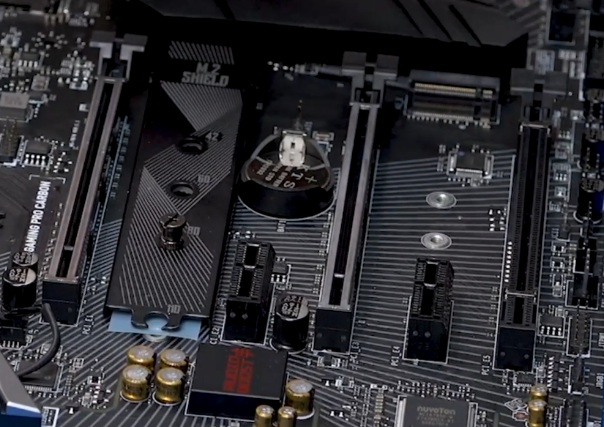

*Older expansion slot - PCI*

*RGB light connectors/etc*

USB connectors

To be used with dongle

Serial port dongle

VGA dongle

## Chipset example

## Overview/About

**Different Form factors**

*Form Factor*: Size/build of mothreboard. Each form factor often has
it’s own set of sub-sizes.

*Four main types*

1.  ATX (12” x 9.6”): biggest form factor – fairly standard.

2.  MicroATX (9.6” x 9.6”)

3.  ITX

4.  MiniITX ()

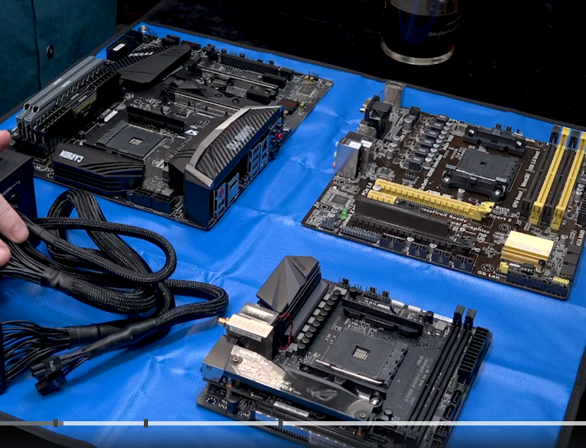

I/O shields are customized to fit the motherboard I/O area. I/O shields
have standard dimensions to fit standard form factor cases. Micro-ATX
motherboards are 9.6x9.6, not their I/O shields. Different motherboards
have different I/O ports so it is impossible to create a
one-size-fits-all I/O shield for different motherboards.

This was discussed in Lecture 27: **Form Factors**

## Installation

The best answer is to test the motherboard with a CPU and RAM installed.
It is harder to install a CPU and RAM once the motherboard is mounted so
removing them is not a good idea. It may be possible to connect cables
to the motherboard before installing it into the case but it makes the
installation challenging.

Case fan – “rear fan” (possible)

Note “rear fans”

# CPU

The CPU has an internal code book that identifies each instruction
pattern. A **register** is a memory location inside a CPU. The
**external data bus** is the set of wires that carry data and
instructions between the CPU and RAM. In this context, **translator** is
a made-up term.

L3 is the slowest memory inside a CPU. L2 is faster than L3 and L1 is
faster than L2. System RAM is slower than all of these, but it is not
inside the CPU.

**This is the brains!**

## Two major types

Make sure you have one compatible with your motherboard.

Two different socket types:

- **Land Grid Array (LGA):** Pins stick out of motherboard itself and
  connect to holes in CPU

  - 

- **Land Grid Array (LGA):** Pins stick out of motherboard itself and
  connect to holes in CPU

- **Ping Grid Array (PGA):** Pins located on the Processor itself.

(below) Pins on left – no pins on right

## Popular Socket types

### Intel

^ Mainstream

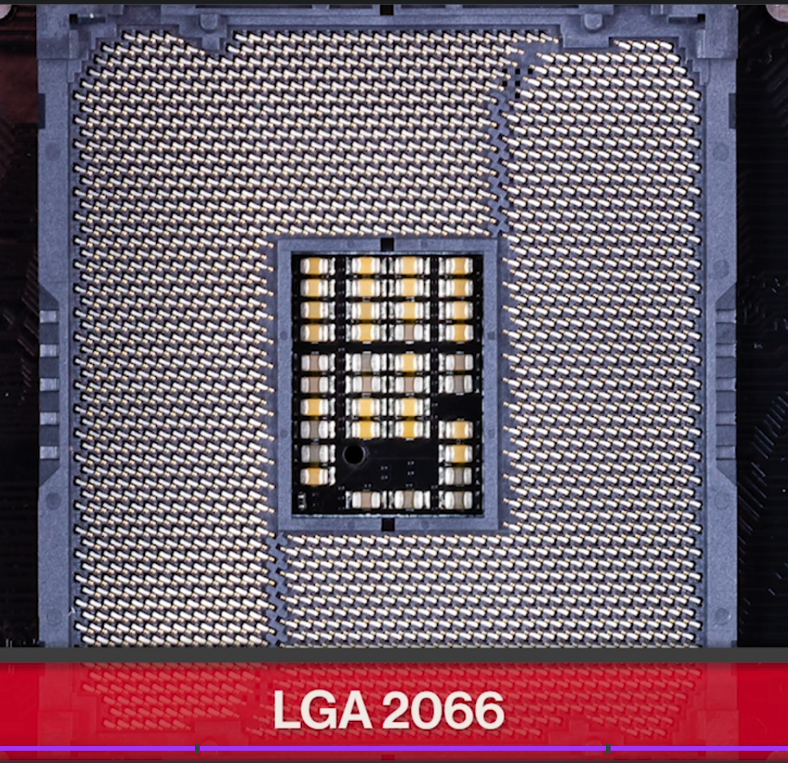

^ Enthusiast

### AMD

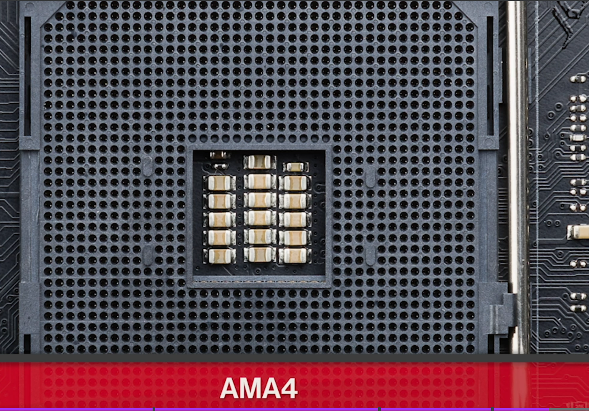

^ Mainstream

^Enthusiast

## Installation

Marker on the bottom must line up with motherboard socket (see small
white triangle in bottom left below).

Heatsinks are used on CPUs to displace the heat. After shutting socket
door – two wire clamps can be flattened into place. First, thermal paste
must be applied to cpu first:

Pop on heat sink and plug into
motherboard

## Architecture types

This defines how much data they can handle.

- 32-bit:

- 64-bit:

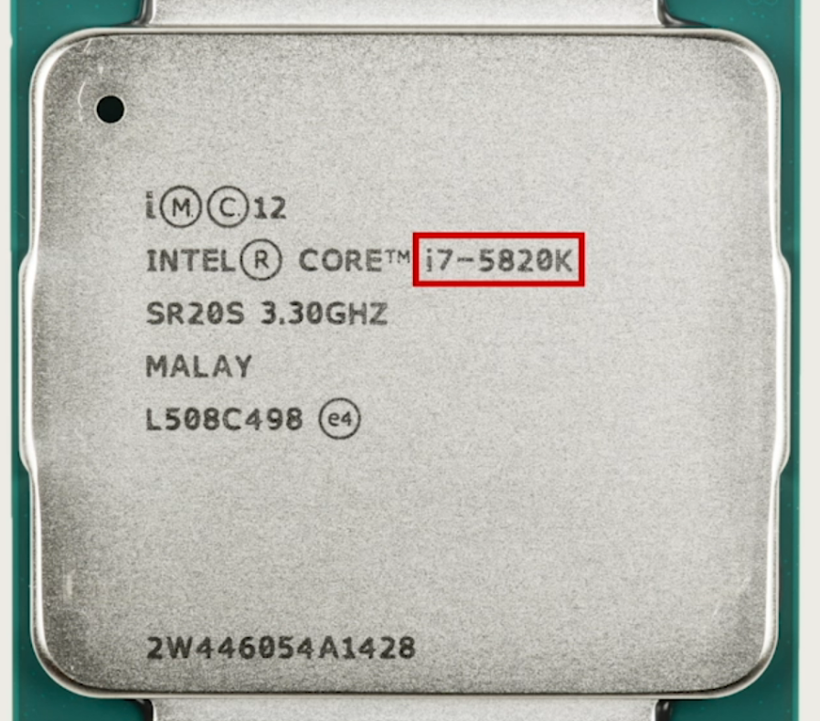

## ALU

CPU is also where the ALU sits

*Arithmetic logic unit*

# Memory & Storage

## How data is stored

## Overview(s)

## RAM

<https://www.tutorialspoint.com/computer_fundamentals/computer_ram.htm>

### Speed vs Capacity

**Speed**: Defined by type (DDR1, DDR2, DDR3, DDR4, etc)

**Capacity**: Based on the number of Ram chips (and whether or not it is
dual/single-layered and/or double/single-sided either).

**Number of pins**

### Dual channel memory

The idea that you would generally be required to insert two ramsticks at
a time of the same capacity – and preferably speed as well. Each channel
(which can be composed of one or more slots) must contain ram sticks of
the same capacity and speed (ideally) if there are more than one stick
used per channel.

Dual channel memory provides simultaneous access to two RAM modules when
reading or writing. Synchronous RAM is technology that keeps RAM timing
matched to the system clock. Single and double-sided RAM modules are
configurations that determine the capacity of RAM modules.

### Parity and ECC

Most Ram sticks have 8 ram chips – but if there’s a ninth chip it will
act as a failover if one of the other ram chips dies. This is called a
“Parity chip”. “ECC” chips are the same as parity chips, but they can
assist with failover for two failed ram chips. Usually in use on server
motherboards.

### SPD chip (serial presence detect)

This chips gives you info about the ram isntalled

### SO DIMMs (laptop ram sticks)

### Installation

## ROM

<https://www.tutorialspoint.com/computer_fundamentals/computer_rom.htm>

## Cache

<https://www.youtube.com/watch?v=Zr8WKIOIKsk>

The “L” caches exist inside the CPU and are the fastest form of RAM (l1
being the fastest). The address bus identifies memory addresses that
hold data or instructions. The memory controller chip sends data between
RAM and the CPU. The external data bus is the set of wires that move
data into and out of the CPU. The cache controller handles the L1, L2,
and L3 caches inside a CPU.

## Virtual/Swap Memory

Virtual memory also gives us the ability for our computer to use more
memory than we physically have installed. To do this, it dedicates an
area of the hard drive to use a storage base for blocks of data called
pages. When a particular page of data isn't being used by an
application, it gets evicted. Which means it gets copied out of memory
onto the hard drive. This is because accessing data on RAM is fast, much
faster than the hard drive where space is at a premium. Because of this,
the operating system wants to keep the most commonly accessed data pages
in RAM. It then puts stuff that hasn't been used in a while on the disk.
This way, if a program needs a page that's not accessed a lot, the
operating system can still get to it. But it has to read it from the
comparatively slow hard drive and put it back into memory. Almost all
operating systems use some kind of virtual memory management scheme and
***paging mechanism***. So how does it work on windows?

The Windows OS uses a program called ***The Memory manager*** to handle
virtual memory. Its job is to take care of that mapping of virtual to
physical memory for our programs and to manage paging. In Windows, pages
saved to disk are stored in a special hidden file on the root partition
of a volume called ***page.file.sys***. Windows automatically creates
page files and it uses the memory manager to copy pages of memory to be
read as needed. The operating system does a pretty good job of managing
the page file automatically. Even so, windows provides a way to modify
the size, number and location of paging files through a control panel
applet called System Properties. You can get to the system properties
applet by opening up the control panel.

Going to the system and security setting, and clicking on system. Once
in the system pane, you can open up the advanced system settings on the
left hand menu.

Pick the advanced tab, then click on the settings button in the
performance section. One last time, click on the advance tab and you
should see a section called virtual memory which displays the paging
file size. If you click the change button, you can override the defaults
Windows provides, so you can set the size of the paging file, and add
paging files to other drives on the computer. Microsoft has some
guidelines for setting the page in file size that you can follow. For
example, on 64 bit Windows 7, the minimum paging file size should be set
to 1x, the amount of RAM in the machine. Unless you have a specific
reason to change it, it's generally fine to let windows automatically
manage the paging file size itself.

## Storage

### Data sizes

We use 1024 instead of 1000 because 1024 approximates closest to 1000
given a base-8 numbering systems used in computers.

HDDs use SATA cable

### Installation

Slide into cage – connect cable to ssd and motherboard

### Hardware and connections

Advanced Technology Attachment (ATA) is a command and connection
standard for mass storage devices. Form factors are not command or
connection standards. LBA is an organization structure for mass storage
devices.

SATA uses a serial data transfer protocol. Data is transferred one bit
at a time from the drive to the computer and one bit at a time from the
computer to the drive. SATA does not pass data 2-bits, 4-bits or 8-bits
at a time.

SSD memory cells are called pages. Magnetic drive storage units are
called sectors.

NVMe uses PCIe lanes and is the fastest of these interface choices. PATA
is the slowest; SATA and SCSI speeds fall between NVMe and PATA.

Serial Attached SCSI (SAS) uses the SATA connector with the SCSI command
language. M.2 is a connector interface and form factor. iSCSI uses SCSI
commands sent over Ethernet

### LBA

### Mass Storage & Optical media

#### USB

Each version of USB in a computer has its own USB controller which is
then connected to a USB hub. USB Type-B connectors connect to a
downstream peripheral (such as a printer). A USB hub is a circuit or
device with one or more upstream USB ports. Each version of USB does not
have its own peripheral.er

### File Storage Solutions

<https://www.cloudwards.net/comparison/>

#### Storage types

#### NFS 

We mentioned that very few file systems can be used across all major
operating systems. FAT32 is a popular FAT system that's compatible with
Windows, Linux, and Mac OSes. But it has severe limitations on the
amount of data you can store on a volume. What happens if you have
multiple users that want to share files between each other? Well, they
need to store the files somewhere and they need to be able to retrieve
the files over a network.

**NFS**

**Network file system**, or NFS, allows us to do this. It's a protocol
that enables files to be shared over a network. The FAT system is
compatible on all major operating systems. The easiest way to setup an
NFS server is by using a Linux environment. You can install NFS server
software that modify the configuration files for the directories that
you want to allow shared access to. Once you do that, the NFS service
will be running in the background of the server. On each client machine
that wants to access a server, you just mount the file system the way
you would any other file system. Except, you'd use the host name instead
of a physical disk device. From there, you can access the shared
directory like you would any other folder in a computer. Check out the
next supplementary reading for some examples of NFS server software you
can configure for Linux. NFS is a good solution to file sharing within
the network, but as with anything on a network heavy usage will slow
down the file system.

<https://www.linuxfromscratch.org/blfs/view/cvs/basicnet/nfs-utils.html>

**Samba (and SMB protocol)**

While NFS works with all major operating systems there are still
interoperability issues with Windows. If your fleet consists mostly of
Windows machines you might want to look at using something like Samba.
Samba services are similar to NFS since she can centrally share and
manage files services. Also, all major operating systems can use a Samba
file sharing. The only reason you might want to consider Samba over NFS,
is because it works better with Windows operating systems. It also
includes other services that can be integrated with your organization
like printer services, we'll talk about printer services in an upcoming
lesson.

One thing to note is that, you may hear the term Samba or SMB. These two
are different.

**SMB** (Server Message Block) is a protocol that Samba implements. You
can read more about SMB in the supplemental reading.
<https://technet.microsoft.com/en-us/library/hh831795(v=ws.11).aspx>

Fun fact, when you create a Windows shared folder it's actually using
the SMB protocol, Samba itself is a software service suite used for file
services which you can also read more about in the supplemental reading.
There are lots of other file storage services that you can use and you
can read more about them in, wait for it, the supplemental readings.

**NAS**

A relatively affordable solution for FAT storage hardware is to use a
network attached storage or NAS, pronounced NAS. Instead of setting up a
dedicated server like you would other services. NASes are computers that
are optimized for file storage. They usually come with an operating
system best stripped down in order just to serve files over a network.
They also come with lots of storage space. Whatever method you choose,
central file storage and management is an important part of I.T.
infrastructure for any organization.

#### Types of Backups

So we've talked about how important backups are, and why you should be
backing up any important data. And some tools that can be used to help
you back up data. But how exactly do you decide when, and how to back up
data? Well let's explore those options. There's a couple of ways to
perform regular backups on data that's constantly changing.

**full backup**

You can do a **full backup** on a regular basis, which involves making a
copy of the data to be fully backed up. The full unmodified contents of
all files to be backed up is included in this backup mechanism whether
the data was modified or not. In the case of data that doesn't change
very often, like operating system configuration files, this approach can
be inefficient. You're backing up multiple copies of data that isn't
changing, which waste space and uses bandwidth unnecessarily. That
doesn't seem like the best idea does it?

**differential backup**

A more efficient approach is to only backup files that are changed, or
been created since the last full backup, this is called a **differential
backup**. The advantage is that you aren't storing backups of
duplicated, unchanging data, only the files that changed are backed up.
Saving us some storage space and time to form the backup. But you
wouldn't want to completely stop taking full backups. Over time you wind
up tracking and storing lots of copies of files that change a lot, which
will also take up more and more disk space over time. <u>To avoid this
it's a good practice to perform infrequent full backups, while also
doing more frequent differential backups</u>. How often you perform a
full backup will depend on how far back you want changes to be tracked.
Let's say we perform full backups once every week, and differential
backups daily. In the worst case scenario we'll lose close to 24 hours
of data changes, that's not bad.

**incremental backups**

Another efficient way to backup changing data is to perform regular
**incremental backups**. While a differential backup backs files that
have been changed or created, and incremental backup is when only the
data that's changed in files is backed up. This is even more efficient
in terms of both disk space, and time required compared to differential
backups. Again you'll want to use frequent incremental backups along
with less frequent full backups. But because this approach only sorts
differences in the files that have changed since the last incremental
backup, it's possible that all incremental backups are needed to fully
reconstruct the files. If one of these incremental backups is missing or
corrupt it might not be possible to recover data any more recently than
the last full back up. Another drawback is that recovery might be more
time consuming. This is because the most recent version of backed up
data has to be recreated by integrating the last full backup with each
incremental backup that follows. For super large files that are changing
frequently this could require a lot of time to process.

While a differential backup backs **up** files that have been changed or
created **since the last full backup**, an incremental backup is when
only the data that's changed in files **since the last incremental
backup** is backed up

One more thing backup systems can do to help save space is **bar
compression**. When creating a backup all the files and folder
structures will be copied and put into an archive. Archives are useful
for keeping files organized and preserving full structure. Besides
archiving the files, backups can also be compressed, this is a mechanism
of storing the same data while requiring less disk space by using
complex algorithms. Those are way to complicated to go into detail here,
but it's important to call out that not all data types lend themselves
to being compressed. This means that space savings from compression will
depend on what you're backing up. Another thing you should know about
compressing backups is the expense of restoration.

To recover data from a backup it needs to be decompressed first.
Depending on the size of your backups this could take a lot of time, and
disk space to expand. We touched on backup storage location a bit in the
last lesson, but let's dive into a little more detail. Good news,
there's a pretty cheap and easy to maintain option out there for storing
backup data on site. You can use a commercial NAS device, or configure a
filer server with a large amount of disk space. Wherever you chose to
store your backup data you'll need a lot of space. You could go out and
buy a giant 10 terabyte hard disk, which could work for a little while.
But what do you do once your back up data grows to fill that one disk?
Are they even making disks larger than 10 terabytes yet? Another thing
to worry about is what do you do if that one disk holding all your
backed up data fails. Yikes, that wouldn't be good.

#### RAID

These are issues a RAID array can address. **RAID** stands for
**Redundant Array of Independent Disks**, it's a method of taking
multiple physical disks and combining them into one large virtual disk.
There are lots of types of RAID configuration called levels. Depending
on the characteristics desired from the RAID, various RAID levels
prioritize features like performance, capacity, or reliability. RAID
arrays are a great, inexpensive way of creating a lot of data capacity,
while minimizing risk of data loss in the event of disk failure. They
can even be flexible enough to allow future growth in disk capacity. We
won't go into the nitty gritty details of the different RAID levels
available, but if you want to learn more check out the supplemental
readings at the end of this lesson. I want to stress the fact that RAID
isn't a back up solution, it's a data storage solution that has some
hardware failure redundancy available in some of the RAID levels. But
storing data on a RAID array doesn't protect against accidentally
deleting files, or malware corrupting your data. This is so important
that I'm going to say it one more time. RAID is not a replacement for
backups.

<https://en.wikipedia.org/wiki/Standard_RAID_levels>

A dedicated RAID controller comes in the form of an expansion card.

Software RAID is controlled by the operating system and the CPU. RAID
expansion cards and motherboard-based RAID controllers are examples of
hardware RAID. Drives don't have built-in RAID controllers.

#### Disaster Recovery Plans

We have all experienced an accident or made a mistake before. We're only
human, right? As an IT support specialist, It's important that you're
prepared for a disastrous accident or mistake. Maybe an electrical surge
fried the hard drive in a database server or someone deleted the wrong
folder. These things happen and you need to be prepared for them. This
is where the disaster recovery plan comes in. A **disaster recovery
plan** is a collection of documented procedures and plans on how to
react and handle an emergency or disaster scenario, from the operational
perspective. This includes things that should be done before, during and
after a disaster. The goal of the disaster recovery plan is to minimize
disruption to business and IT operations, by keeping downtime of systems
to a minimum and preventing significant data loss. <u>Despite the name,
a disaster recovery plan will actually cover preventive measures and
detection measures on top of the post disaster recovery approach.</u>

- **Preventative measures** cover any procedures or systems in place
  that will proactively minimize the impact of a disaster. This includes
  things like regular backups and redundant systems. Anything that's
  done before an actual disaster that's able to reduce the overall
  downtime of the event is considered preventative. For example, a
  standard for critical network infrastructure or service to have
  redundant power supplies. They're often fed from different power
  sources like battery backup. This is designed to minimize the downtime
  that would be caused by one power supply failing or a power outage.
  That would be a preventative measure. We're going to some more detail
  on this in the next lesson, when we cover designing and effective
  disaster recovery plan.

- **Detection measures** are meant to alert you and your team that a
  disaster has occurred that can impact operations. Obviously, you need
  to be aware of a disaster in order to take appropriate steps to reduce
  the impact on your organization. Timely notification of a disaster is
  critical, since some steps of the disaster recovery plan might be time
  sensitive to ensure there is no data loss or equipment damage. If
  there a power outage for example, critical systems should fall back to
  battery power. But, battery backup power will only keep the systems on
  line for so long. To avoid potential data loss or damage, these
  systems should be gracefully shut down before they completely lose
  power. This is why lots of systems that support redundant power
  supplies also have a function to send alerts on power loss events.
  Other things that should be monitored to help head off any unexpected
  disasters include environmental conditions inside several networking
  rooms. Flood sensors can alert you to water coming into the server.
  Temperature and humidity sensors can watch for dangerously high
  temperatures or some optimal moisture levels in the air. This can
  alert you to failed cooling in the server room. Smoke detectors and
  fire alarms are also critically important. Remember, that it isn't
  just the technology that's necessary for a business to continue to
  operate. You also need the people working there. The specifics of
  building evacuation usually forward to the building management team,
  but as an IT support specialist, you'll likely work closely with some
  members of this team on things like, power delivery, heating and
  cooling systems and building evacuation. If there's a fire and the
  building needs to be evacuated, you should be prepared to set up
  temporary accommodation so people can still work effectively. This
  might be as simple as sending everyone home for the day and having
  them work from home. But you should be prepared for the situation
  ahead of time and have a plan in place to ensure that everyone is able
  to work from home effectively.

- Finally, **corrective or recovery measures** are those enacted after
  disaster has occurred. These measures involve steps like restoring
  lost data from backups or rebuilding and reconfiguring systems that
  were damaged. Once the disaster has been detected and steps have been
  taken to either prevent an outage or at least minimize downtime, work
  should begin on restoring full operations of everything affected.
  Usually, a disaster will take out one system that's part of a
  redundant pair or a replication scheme which would prevent a complete
  service outage. But that would mean you aren't prepared for another
  disaster. When one system in a redundant pair suffers a failure, it's
  called a single point of failure. This is because it only takes one
  failure now to completely take the system down. That's not a scenario
  you want to be in. We've covered the overall elements of a disaster
  recovery plan. Why don't you take a little break to recover yourself,
  then join me in the next video. We're going to run down the details of
  designing a disaster recovery plan of your own. Does that include
  planning for the zombie apocalypse? You have to watch to find out.

##### Designing a plan

So, what exactly goes into an effective disaster recovery plan? Well, it
depends. Keep in mind, there's no one-size-fits-all for disaster
recovery plans. The mechanisms chosen and procedures put in place will
depend a lot on the specifics of your organization and environment. But
we can't start by covering the three types of measures in more detail.
We'll also go over some examples to help give you an idea of what to
think about.

**risk assessment**

A good way to understand what to plan for is to perform a **risk
assessment**. This involves taking a long hard look at the operations
and characteristics of your teams. A risk assessment allows you to
prioritize certain aspects of the organizations that are more at risk if
there's an unforeseen event. Risk assessment can involve brainstorming
hypothetical scenarios and analyzing these events to understand how
they'd impact your organization and operations. When you look into
preventive measures, pay attention to systems that lack redundancy. If
it's something critical to permit operations, they should probably have
a redundant spare, just in case. Make sure you have a sound backup and a
recovery system, along with a good strategy in place. Ideally, you
should have regular but automated backups to backup systems located both
on site and off site. It's also critical that you have data recovery
procedures clearly documented and kept up-to-date. Data recovery
following a disaster is hopefully something you will rarely do. It's
important to make sure that these procedures are updated since systems
change and evolve throughout their lifetime. Redundancies shouldn't be
limited only to systems. Anything critical to operations should be made
redundant whenever possible. This includes power delivery or supply,
communications systems, data links, and hardware. Think through the
impacts that a disaster affecting each of these aspects would have on
your day-to-day operations. What would happen to your network if the
building lost power? Can you use continue to work at the fiber-optic
data line if the building gets damaged by a nearby construction work?
You call router for the office just burst into flames. Okay. The last
one is a little far-fetched, but I think you get where I'm going.

**operational documentation**

Another super important preventive measure that should be evaluated and
verified is **operational documentation**. Make sure that every
important operational procedure is documented and accessible. This
includes things like setting up and configuring critical systems and
infrastructure. Any steps or specific configuration details that are
needed to restore 100 percent functionality to core systems and services
should be documented in detail. It's also important that this
documentation is kept up-to-date. An effective way to do this is
periodically verify that the steps documented actually work. You don't
want to find yourself in a situation where you need to reconfigure
assistant following incident, only to discover that the documentation is
wrong. When looking at detection measures, you'll want to make sure you
have a comprehensive system in place that can quickly detect and alert
you to service outages or abnormal environmental conditions. If up-time
and availability is important for your organization, you'll likely have
two internet connections; a primary and a secondary. You want to monitor
the connection status of both of these links. Ideally, they should be
configured to automatically fail over if one goes down. But you'll still
want to be alerted when this happens, so you can investigate why the
link went down and work on getting it back as soon as possible. The way
to think about designing detection measures is to evaluate what's most
critical to the day-to-day functioning of the organization. What
infrastructure services and access are absolutely vital? Those are the
ones you should be closely monitoring. And it's not just outages or
complete failures you should be watching for. Of course, you want to
monitor for those, but you also want to monitor for conditions that
indicate that a problem is likely to occur. If we can avoid a
catastrophic failure by being alerted to an overheating server before it
fails, that would be much better, wouldn't it? So, you want to monitor
conditions of service and infrastructure equipment. Things like
temperatures, CPU load and network load for a service monitoring for
error rates and requests per second will give you insight into the
performance of the system. You should investigate any unusual spikes or
unexpected increases. These early warning systems allow you to head off
disaster before it brings operations to a halt. And of course, you
absolutely must test these systems. Simulate the conditions your
monitoring systems are designed to catch. Make sure the detection
thresholds actually fire the alerts like they're supposed to. This
testing goes beyond just the monitoring systems too. You'll also want to
test your reactions and responses to these alerts. If you're monitoring
systems reliably trigger alerts but everyone just ignores them, they
aren't super useful, are they? You want to conduct regular disaster test
to make sure systems are functioning and that your procedures to handle
them are also up to the task.

**Corrective or recovery measures** include actions that are taken to
restore normal operations and to recover from an incident or outage.
This includes taps like restoring a corrupted database from a backup or
rebuilding and re-configuring a server. Your disaster plan should
include reference or links to documentation for these types of tasks.
Anything and everything that would be required to restore normal
operations following some disaster. This is where the steps for
restoring various systems and data from backups should be. The disaster
recovery doc doesn't need to contain the details of the operations.
Links and references are sufficient. But it's important to be prepared
for a situation where typical documentation acts methods are
unavailable. Let's imagine you keep all your operational documentation
in a wiki on a dedicated server. What happens when that server suffers
an outage? It's important that critical documentation is accessible if
an emergency scenario or disaster strikes. In the next lesson, we'll
cover what to do after a failure. See you there.

##### Post-Mortems

Making mistakes is part of being human. We all make them from time to
time, and hopefully each mistake is a learning opportunity. We look at
what happened and try to understand why it did to avoid it in the
future. Think of a toddler learning the stove is hot. They touch it once
and it burns them. They quickly learn that touching the stove hurts, so
they stop doing it. It's important that we're able to learn from our
mistakes or else we'd constantly be burning ourselves. That's the
purpose of a post-mortem report. <u>We create a post-mortem after an
incident, an outage, or some event when something goes wrong, or at the
end of a project to analyze how it went. This report documents, in
detail, what exactly happened leading up to, during, and after the event
or project. It tries to highlight things that went well and things that
didn't. The purpose of a post-mortem is to learn something from an event
or project, not to punish anyone or highlight mistakes.</u> Sure,
they'll likely be some mistakes that'll be address but, the intention
isn't to punish or shame, it's meant to understand the root cause of why
the mistakes happen and how to prevent them from happening again. The
post-mortem process isn't quite over yet, once the report is written up
it needs to be communicated. These types of reports have value beyond
the immediate people involved in the incident, investigation and writing
of the report. Sharing post-mortems with other teams at an organization
helps encourage a culture of learning from mistakes, it shows that your
team is willing to acknowledge when you mess up. But you don't let
mistakes hold you back, it sets a good example for others to follow and
the content in the report might trigger the thought that some other team
and make them realize they have a similar problem in their
infrastructure. You may also identify areas that could be improved that
are the responsibility of teams that weren't involved in the incident.
When it comes to post-mortems, sharing is caring. If you embrace
post-mortems, they tend to foster a culture where it's okay to make
mistakes. This is a healthy attitude to have in any organization. If
people are afraid to make mistakes, then decision making will be very
conservative. It's hard to push the boundaries and try new things if
everyone is afraid of screwing up. But if the prevailing culture says
that mistakes are okay as long as we can learn from them, then you'll
have an organization that's willing to take risks, and try out new and
exciting ideas.

**Writing a post-mortem**

Now that we know the benefits of a postmortem, let's take a closer look
at what goes into one.

- A typical postmortem for an incident begins with a **brief summary**,
  just a short paragraph, that summarizes the incident. It should
  include: what the incident was? How long it lasted? And what the
  impact was? And how it was fixed? Be mindful of time zone when listing
  times and dates in the postmortem. Always clearly state the time zone
  to be absolutely clear.  
  Next, you need a **detailed timeline of key events**. This should
  include everything that happened throughout the event like when it
  started, and when people involved were notified or realized what was
  going on. Every action taken in an attempt to resolve this situation
  should also be identified. These could contain times and dates along
  with time zones, and who did what. The timeline should wrap up with
  the actions taken that resolved the outage and restored services,
  signaling the end of the event.

- Next, a **very detailed and honest account of the root causes
  covered**. This should go into detail explaining what led to the
  issue. It could be something like a configuration change that was
  pushed live without proper testing, or a command that was typoed.
  Remember that the intent isn't to blame or shame, is to be honest with
  what went wrong so that a lesson can be learned from it. If the cause
  stemmed from a lack of testing, this might indicate areas for
  improvement in test verification. If it was from a typoed command,
  this may reveal the need to automate a manual process. A more detailed
  explanation of the resolution and recovery efforts should be
  documented next. This is similar to the timeline covered earlier and
  should include the dates, times, and time zones. But it should go into
  more detail about what steps were taken to recover, the rationale and
  the reasoning behind those actions, and what the outcome of each that
  was including the rationale gives those reading the report more
  context on how the event played out.

- Lastly, close out the report with a list of **specific actions that
  should be taken to avoid the same scenario from happening again**.
  This should include any actions or efforts aimed at improving the
  response handling too. Steps to reduce response time when monitoring
  would help. When you spin up a list of things to improve, look out for
  things like improvements to monitoring systems. Maybe the incident
  investigation revealed a gap in visibility into critical systems, or
  the cause investigating turns out that automation system isn't
  functioning as intended. While it's outside the scope of a postmortem
  report to come up with solutions to these gaps, they should be listed
  in areas for improvement. Based on these discoveries, new parties can
  start to address the deficiencies found.

> One thing that often gets overlooked in postmortem is what went well.
> But this is just as important as analyzing what went wrong. During the
> post-incident analysis, it's also good to highlight things that went
> well. These include: fail safe or fail of a system that worked as
> designed, and prevented a large outage, or minimized the severity of
> the outage. This helps to demonstrate the effectiveness of our systems
> in place. For some folks, like those in finance, this is good news. It
> justifies any cost associated with these systems by clearly
> demonstrating a tangible benefit. This is important for any
> preventative system since they are frequently viewed as unnecessary
> costs by those that may not fully understand their benefit. These
> examples of systems working to prevent or reduce the impact of outages
> make that benefit very clear. Hopefully, you're better prepared now to
> learn from any mistakes you might make in your career. And mistakes
> will be made because you are human after all. Own them, learn from
> them, and do better next time. Such is true in IT, work, and in life.
> Well, that brings us to the close of our sysadmin course. We hope you
> have a better understanding of the responsibilities of a sysadmin, and
> how closely they relate to the work of an IT support specialist. Feel
> free to review any sections that might have been a bit heavy on the
> technical side. First up, we've brought a quiz for you that would
> touch on everything we've learned in this module. Then, when you're
> ready, you can jump into the course project to put your new knowledge
> to work. We have some fictional companies that you are going to play
> system administrator for. You need to take a look at their current
> infrastructure and make recommendations for improvements. I w

#### Data Recovery and Backups (Quiz Questions)

# Peripherals (USB)

USB 2.0 ports: Black usually

USB 3.0 ports: Blue usually

USB 3.1 ports: Teal usually

# BIOS and CMOS

Bios is storred in ROM on CMOS chip. It’s a type of firmware (burned
onto a chip) as opposed to software (which is copied on different types
of electronic media).

Every computer has a certain key on the keyboard that must be pressed
before the OS boots to launch the setup program. There is no automatic
procedure or button to start the setup program. The administrator
password is not entered until after the setup program has started.

A user password prevents the OS from booting until the password is
entered. The administrator password prevents access to the setup program
until the password is entered. Flashing the BIOS is for fixing bugs and
adding features to the contents of the BIOS chip. Removing the CMOS
battery might prevent the OS from booting, but it is not the best
answer.

A weak or failed CMOS battery will slow the system clock and may cause
other problems. Missing a leap year won't affect the computer's clock
rate. Low wall voltage is adjusted in the power supply; if it is too
low, the computer won't boot.

**CR2032** is the standard CMOS battery. The other choices are not
normally used for CMOS in a computer.

Lots of motherboards have two bios – where the second is a backup in
case the first fails/dies.

Services are BIOS programs that make hardware functional. POST is a
testing program in BIOS. CMOS is a type of memory chip. Device drivers
make hardware function in an operating system.

The Power On Self Test (POST) program and the services are contained in
the BIOS chip. The CMOS battery is not inside a chip. The RTC is in the
CMOS chip, not the BIOS chip. The explanation of POST hex codes can be
found in the system manual.

This was discussed in Lecture 23: **What is the BIOS?**

POST = power on self test

POST is a program in the computer's BIOS chip that performs diagnostics
prior to the computer booting an operating system. POST can send
messages to a POST card but the card does not contain the POST program.
A power supply provides power to the CPU. POST does not enable hardware,
it tests hardware.

Beep codes are issued when error messages can't be displayed on the
screen. A bad video card would cause beep codes. Missing keyboard,
printers, and network connection failures can be shown on a screen. The
POST program will not run at all without a CPU installed (and thus would
not generate a beep code).

BootLoader – program that loads the OS

# UEFI – Bios new and improved

# Boot Process

Use msconfig to enable Boot log

## Troubleshooting

### Clear CMOS Jumper

Shorting this (by touching both pins with a key for example for around
30s) will reset the Bios and clear any system settings that you may have
configured.

# Filesystems and Boot process

## Windows vs Linux comparison

**FAT** (FAT 16) comes from “file allocation table” and is the oldest
common filesystem type which works with windows and linux though it now
is only an option for very small volumes.

Though windows can’t read/write ext4, Ubuntu can read/write ext4 (etx3
as well which was the precursor).

There are lots of file systems out there, but the two that we'll talk
about in this course are recommended as default filesystems for Windows
and Linux. For Windows, we use the NTFS filesystem, and for Linux, it's
recommended to use ext4. Filesystems have different compatibilities with
different OSes. Most of the time, cross operating system support is
minimal at best. Let's say you have a USB drive that's using an NTFS
filesystem. Both Windows and Linux's Ubuntu can read and write to the
USB drive. But if you have an ext4 USB drive, it'll only work on Ubuntu
and not on Windows, at least without the help of third party tools.

It's pretty likely that you'll encounter this situation in an IT support
role. Let's say you have some important files on that same USB drive
that you want to copy over to your Windows, Linux, and Mac OSes, what
would you do then?

This is a pretty common situation. You'd have to reformat or wipe the
USB drive and add a filesystem that's compatible with all three
operating systems.

Luckily, there are filesystems like FAT32 that support reading and
writing data to all three major operating systems. ***FAT32*** has some
shortcomings though. It ***doesn't support files larger than 4
gigabytes, and the size of the filesystem can't be larger than 32
gigabytes***. This might be enough for a small USB drive, but it's not
really great for anything else.

NTFS is the standard Windows file system. FAT32 was once the standard in
much older versions of Windows.

You can learn more about FAT32 in the next supplemental reading. This
still begs the question, what if you wanted to be able to share files
between multiple OSes and don't want to deal with filesystem
limitations? Don't worry, we've got you covered. In the next course on
system administration and IT infrastructure services, we'll discuss
another filesystem type called network filesystems that solves this
exact problem.

## Disk anatomy (volumes and partitions)

Before we start adding a filesystem to a disk, let's do a rundown of the
components of the disk that allow you to store and retrieve files. <u>A
storage disk can be divided into something called partitions</u>. **A
partition is just a piece of the disk that you can manage.**

When you create multiple partitions, it gives you the illusion that
you're physically dividing a disk into separate disks.

To add a filesystem to a disk, first you need to create a partition.
Usually, we just have a single partition for our OS, but it's not
uncommon to have multiple partitions for different uses. Let's say you
want to have two partitions on a disk, one for a Windows OS and one for
a Linux OS. Instead of using two machines to use both operating systems,
you can just use one machine and switch between the two OSs on boot-up
(This is known as dual-booting). You can also add different filesystems
on different partitions of the same disk. Partitions essentially act as
their own separate sub-disks, but they all use the same physical disk.
Partitions are the VMs of storage space. Partitions are to Hard Disks
what VMs are to

One thing to call out is that, **when you format a filesystem on a
partition, it becomes a volume**. Volume and partition are sometimes
mistakenly used synonymously, but we want to make sure that you
understand this distinction.

The other component of a disk is a partition table. **A partition
table** tells the OS how the disk is partitioned. The table will tell
you which partitions you can boot from, how much space is allocated to
partition, etc.

There are **two main partition table schemes** that are used

- **MBR**, or Master Boot Record

- **GPT**, or GUID Partition Table.

These **schemes** decide how to structure the information on partitions.
MBR is a traditional partition table, and it's mo\`stly used in the
Windows OS. ***MBR only lets you have volume sizes of 2 terabytes or
less***. It also uses something called primary partitions. You can only
have four primary partitions on a disk. If you want to add more, you
have to take a primary partition and make it into something known as an
extended partition. Inside the extended partition, you can then make
something called a logical partition. It's a little odd to get at first,
but that's just how the partition table was created.

MBR is an old standard, and it's slowly being faded out by the next
partition table scheme we'll talk about, GPT. GPT is becoming the new
standard for disks. ***You can have a volume size greater than 2
terabytes, and it only has one type of partition. You can make as many
of them as you want in a disk.*** In an earlier lesson, we learned about
a new BIOS standard called UEFI that's become the default BIOS for newer
systems. <u>To use UEFI booting, your disk has to use the GUID Partition
Table</u>.

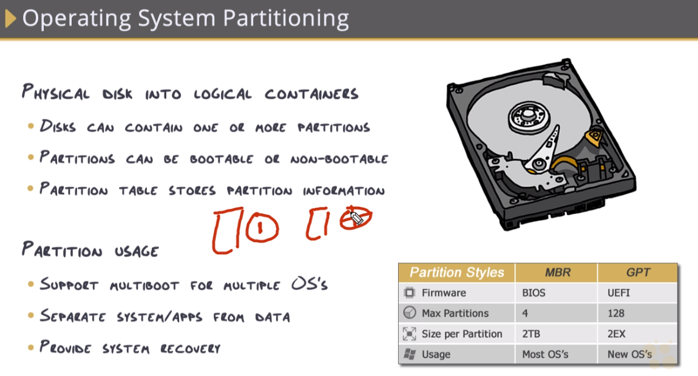

The master boot record is found at LBA 0 (the first sector). The OS
partition could be anywhere on the drive. The Windows swap file is
stored in the root of the C: drive, but not at LBA 0. POST is located in
the UEFI/BIOS chip.

The first GPT header is the **primary GPT header**. The secondary GPT
header is the backup, or second, GPT header. Main and master are not
terms associated with the GPT header.

UEFI is stored in a specialized partition whereas MBR was stored on the
drive usually at the first sector.

# Graphics card

## Instalation

Goes into PCIExpress dock

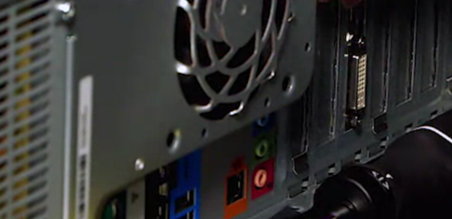

# PC Cooling

Liquid cooling utilizes a radiator system to cool the system.

Cooling fans are often 3pin and can connect directly into a 4pin port:

# Monitors/Screens

- Threading is not a projector adjustment. Keystone, skew and pincushion
  are all standard projector adjustments.

- LED is a backlight technology

- DLP technology uses rotating mirrors

***Troubleshooting***

A failed inverter will make a monitor dim, not shut down a video card.
Bad fans and poor ventilation can cause a video card to overheat. High
video workloads may cause overheating.

# Power

**DC**: Flows in one direction.

**AC:** Constantly alternates between two directions.

Wall outputs AC – computers use DC. This is what a power supply does –
and usually has its own fan with connects to motherboard.

**Voltage**: total power being pushed out.

**Amperage**: (measured in AMPs) the controlled amount of voltage being
pulled.

Volts X Amps = Watts

A **surge suppressor** only protects devices from power spikes. A UPS
protects from spikes, sags ,and brownouts. A heat sink carries heat away
from hot components such as a CPU. A power supply has a built-in surge
suppressor, but it also provides power to the computer.

## 80 plus rating system

## Overview of power supply and its connectors

It allows power to flow from the plug into the power supply. The
computer has its own on/off switch. The power supply powers the "power
good" wire (if the power is good) but the power supply switch does not
do this directly. Power supplies (mostly) do not autodetect power and
then react.

Modular systems don’t have connectors soldered in

A modular power supply simplifies cable management by enabling you to
add and remove optional plug-in cables as needed to power components.
Option power supply is a made-up term. A Flex power supply is a
small-form-factor power supply. A soldered power supply has all of its
power cables soldered to the power supply unit (PSU).

### Motherboard

**Yellow**: 12 volt

**Red**: 5 volt

**Orange**: 3.3 volt

The four/six/eight pin connector (known as the P4 connector) on the ATX
12V power supply provides power to which computer component(s)?

### PCIe

Primarily for video cards

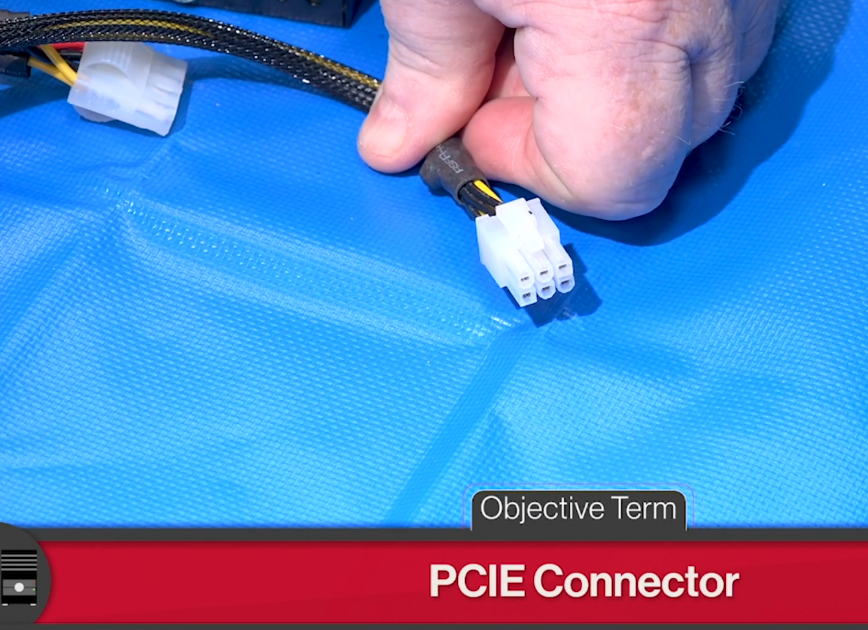

### SATA (Hard drives primarily)

Can also be used on other things like optical media

### Mini connectors (floppy drives)

### Molex (deprecated)

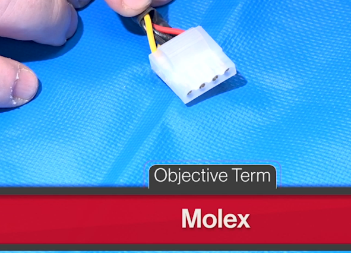

## Installation

**Connectors**

Big one powers motherboard – “Stick Pin”

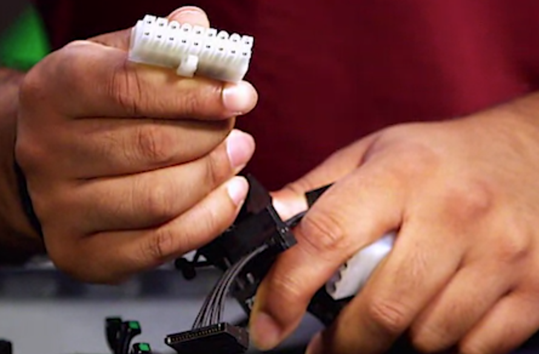

Small pre-sata deprecated cable (4pin)

Modern (SATA) – used to power devices (8 pin)– goes into CPU

Other cables – for buttons and lights. Have their own port section

**Power regulators and capacitors**

Translate total voltage from power supply into smaller voltage units
amongst certain pins throughout the motherboard.

## Power Supply testing

This is a small power supply tester

Voltmeter

This of the squiggle as alternate current (wavy) and straight line as
direct current.

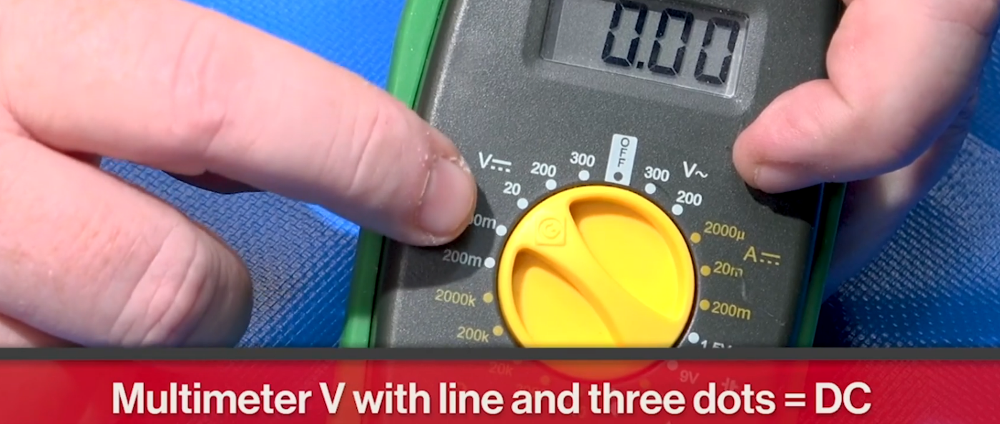
