<https://dev.to/iuliagroza/complete-introduction-to-the-30-most-essential-data-structures-algorithms-43kd>

# Problem Solving with Naïve Approach

## Mathing

### Summing from…to…

We'll pass you an array of two numbers. Return the sum of those two
numbers plus the sum of all the numbers between them. The lowest number
will not always come first.

For example, sumAll(\[4,1\]) should return 10 because sum of all the
numbers between 1 and 4 (both inclusive) is 10.

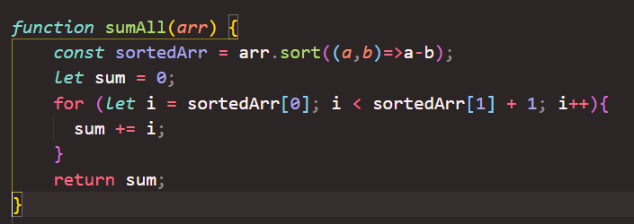

### Sum All Primes

A prime number is a whole number greater than 1 with exactly two
divisors: 1 and itself. For example, 2 is a prime number because it is
only divisible by 1 and 2. In contrast, 4 is not prime since it is
divisible by 1, 2 and 4.

Rewrite sumPrimes so it returns the sum of all prime numbers that are
less than or equal to num.

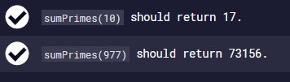

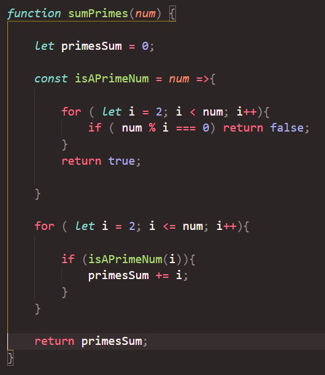

### Sum All Odd Fibonacci Numbers

Given a positive integer num, return the sum of all odd Fibonacci
numbers that are less than or equal to num.

The first two numbers in the Fibonacci sequence are 1 and 1. Every
additional number in the sequence is the sum of the two previous
numbers. The first six numbers of the Fibonacci sequence are 1, 1, 2, 3,
5 and 8.

For example, sumFibs(10) should return 10 because all odd Fibonacci
numbers less than or equal to 10 are 1, 1, 3, and 5.

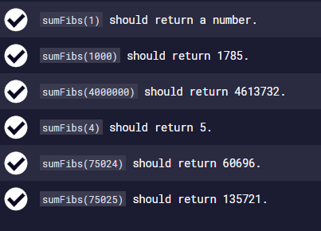

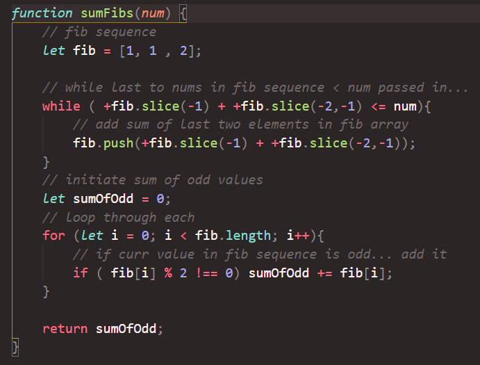

### Smallest common multiple

Find the smallest common multiple of the provided parameters that can be
evenly divided by both, as well as by all sequential numbers in the
range between these parameters.

The range will be an array of two numbers that will not necessarily be
in numerical order.

For example, if given 1 and 3, find the smallest common multiple of both
1 and 3 that is also evenly divisible by all numbers between 1 and 3.
The answer here would be 6.

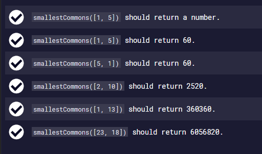

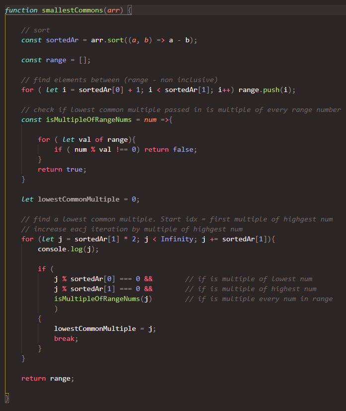

## String Transformation

### Spinal Case

Convert a string to spinal case. Spinal case is
all-lowercase-words-joined-by-dashes.

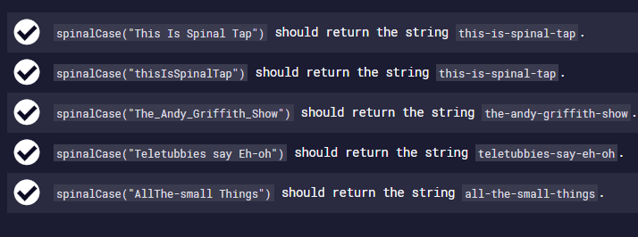
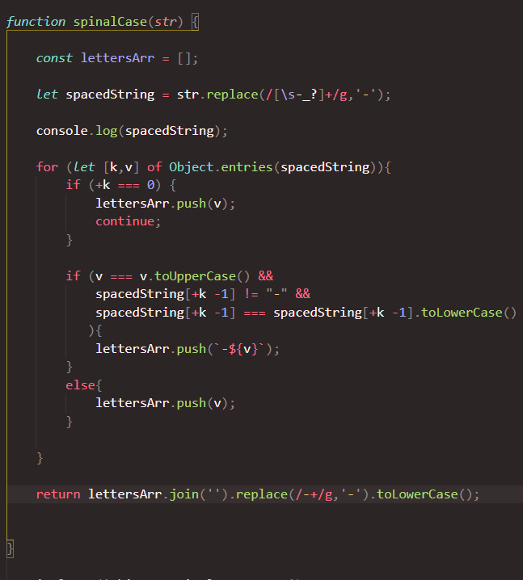

### Alter case (PascalCase)

Return the provided string with the first letter of each word
capitalized. Make sure the rest of the word is in lower case.

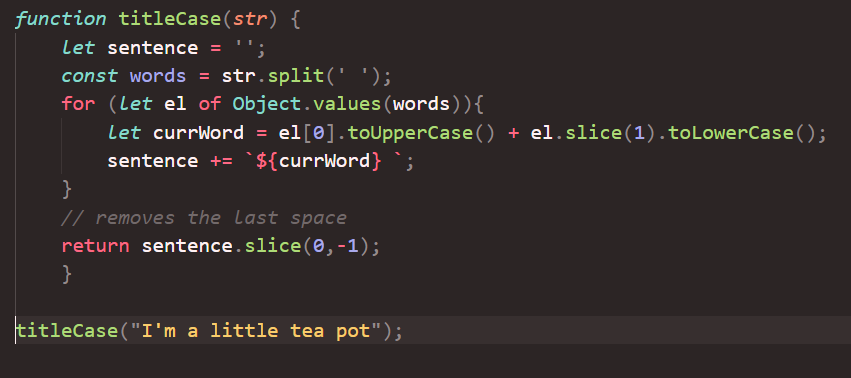

### Search & Replace

Perform a search and replace on the sentence using the arguments
provided and return the new sentence.

First argument is the sentence to perform the search and replace on.

Second argument is the word that you will be replacing (before).

Third argument is what you will be replacing the second argument with
(after).

Note: Preserve the case of the first character in the original word when
you are replacing it. For example if you mean to replace the word Book
with the word dog, it should be replaced as Dog

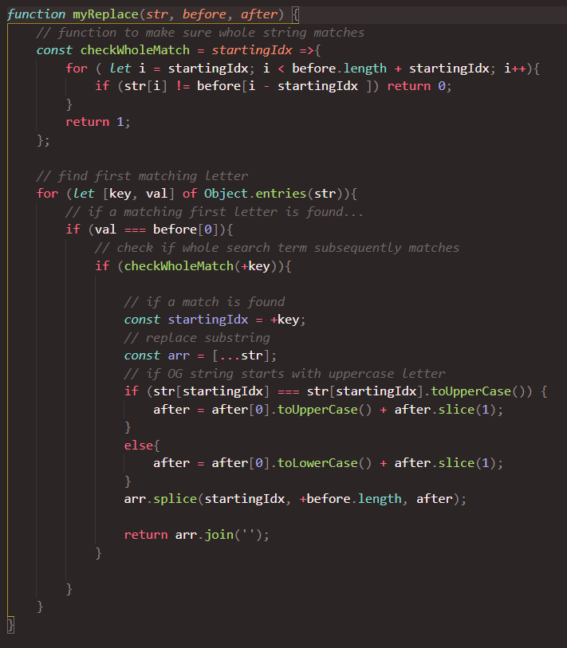

### Truncate a string

Truncate a string (first argument) if it is longer than the given
maximum string length (second argument). Return the truncated string
with a ... ending.

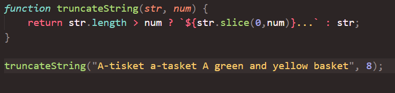

### Piglatin-ize

Pig Latin is a way of altering English Words. The rules are as follows:

\- If a word begins with a consonant, take the first consonant or
consonant cluster, move it to the end of the word, and add ay to it.

\- If a word begins with a vowel, just add way at the end.

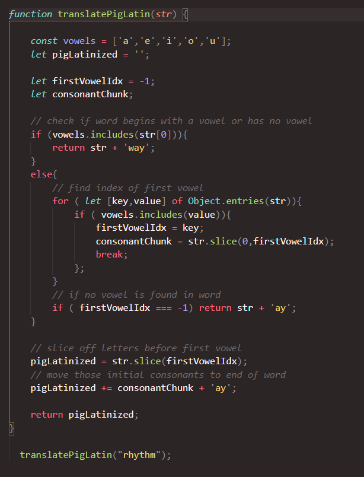

## Searching & Filtering

### Remove falsy ones from array

Note: Notice the use of double negation to convert to Boolean.

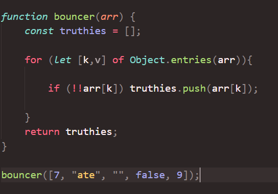

### Find true

Create a function that looks through an array arr and returns the first
element in it that passes a 'truth test'. This means that given an
element x, the 'truth test' is passed if func(x) is true.

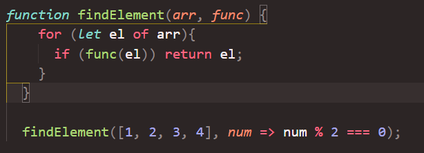

### Every Object contains this key

Check if the predicate (second argument) is truthy on all elements of a
collection (first argument).

In other words, you are given an array collection of objects. The
predicate pre will be an object property and you need to return true if
its value is truthy. Otherwise, return false.

In JavaScript, truthy values are values that translate to true when
evaluated in a Boolean context.

Remember, you can access object properties through either dot notation
or \[\] notation.

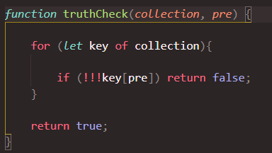

### Seek & Destroy

You will be provided with an initial array (the first argument in the
destroyer function), followed by one or more arguments. Remove all
elements from the initial array that are of the same value as these
arguments.

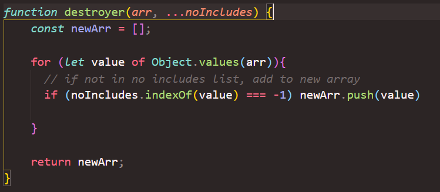

### Ends with

Check if a string (first argument, str) ends with the given target
string (second argument, target).

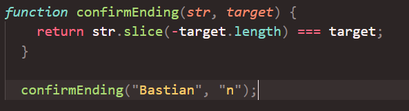

### Largest value in sub array

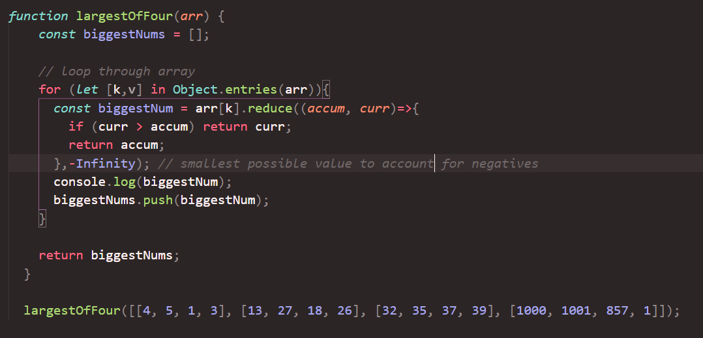

### Find missing letter

Find the missing letter in the passed letter range and return it.

If all letters are present in the range, return undefined.

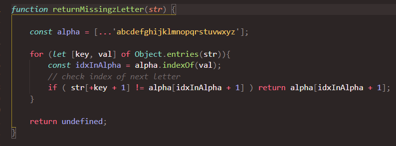

### Find longest length

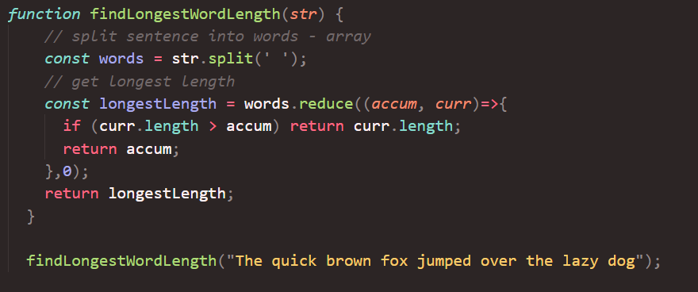

### Drop it

Given the array arr, iterate through and remove each element starting
from the first element (the 0 index) until the function func returns
true when the iterated element is passed through it.

Then return the rest of the array once the condition is satisfied,
otherwise, arr should be returned as an empty array.

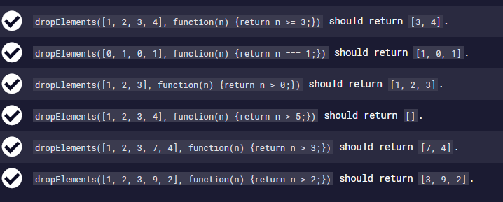

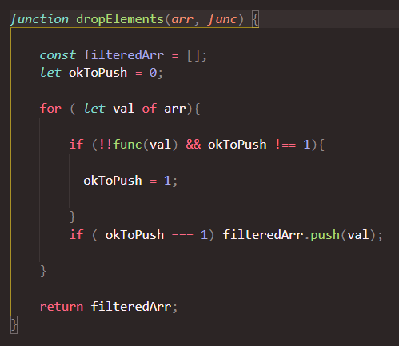

### Where art thou

Make a function that looks through an array of objects (first argument)
and returns an array of all objects that have matching name and value
pairs (second argument). Each name and value pair of the source object
has to be present in the object from the collection if it is to be
included in the returned array.

For example, if the first argument is \[{ first: "Romeo", last:
"Montague" }, { first: "Mercutio", last: null }, { first: "Tybalt",
last: "Capulet" }\], and the second argument is { last: "Capulet" },
then you must return the third object from the array (the first
argument), because it contains the name and its value, that was passed
on as the second argument.

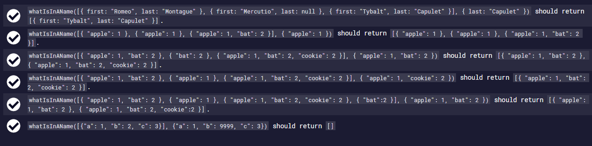

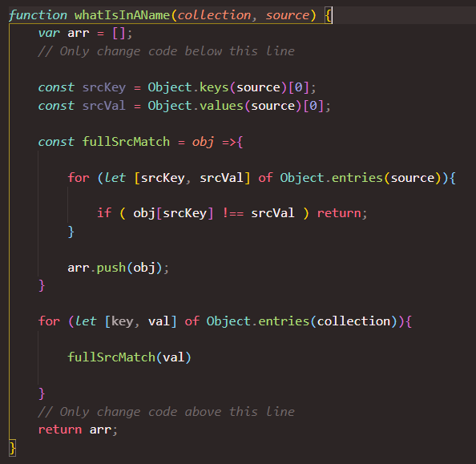

## Arrays: General

### Array in pieces

Write a function that splits an array (first argument) into groups the
length of size (second argument) and returns them as a two-dimensional
array.

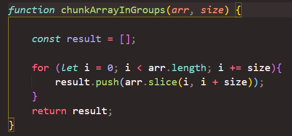

### Difference between arrays

Compare two arrays and return a new array with any items only found in
one of the two given arrays, but not both. In other words, return the
symmetric difference of the two arrays.

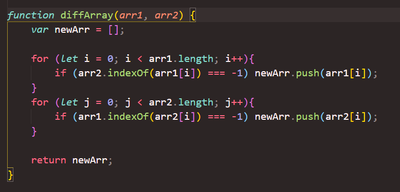

### Contains shared value

***Without JS built-in methods***

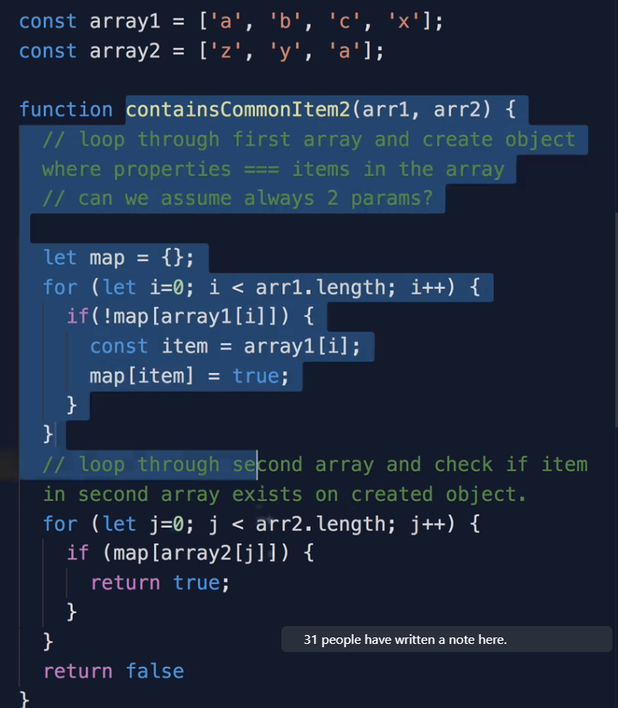

***With JS built-in methods***

It reads: There is at least one element (some) in **arr1** such that it
is included in **arr2**.

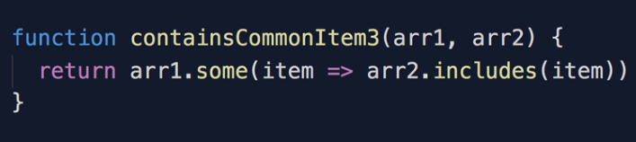

### Flatten and uniqued

Write a function that takes two or more arrays and returns a new array
of unique values in the order of the original provided arrays.

In other words, all values present from all arrays should be included in
their original order, but with no duplicates in the final array.D

The unique numbers should be sorted by their original order, but the
final array should not be sorted in numerical order.

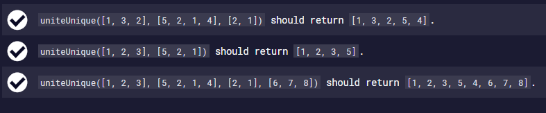

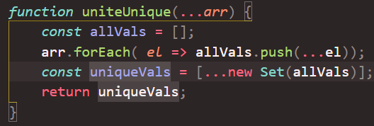

## Ordering & Reordering

### Where do I belong

Return the lowest index at which a value (second argument) should be
inserted into an array (first argument) once it has been sorted. The
returned value should be a number.

For example, getIndexToIns(\[1,2,3,4\], 1.5) should return 1 because it
is greater than 1 (index 0), but less than 2 (index 1).

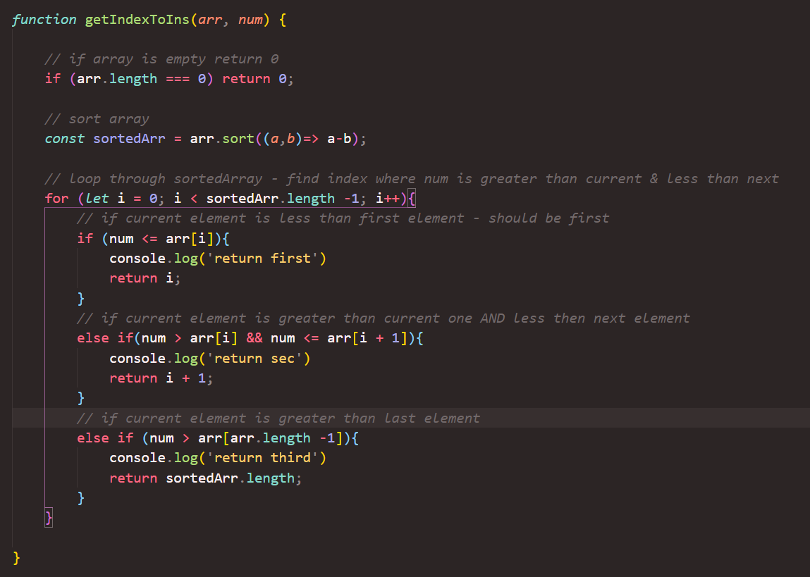

### Reversed Integer

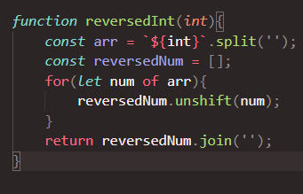

To also account for negative numbers and zero:

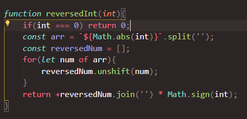

**Using recursion:**

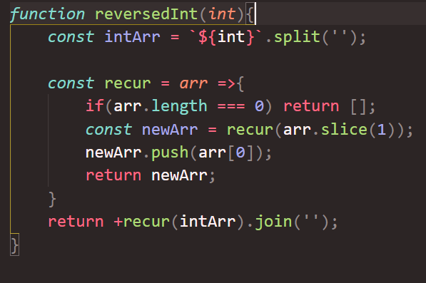

Note: Notice how the plus sign issued instead of ParseInt to parse
string into a number. Notice how we also do not need to call unshift to
change the order of the array being built by the recursive function
because since we are calling the recursive call before the executing
case the array will populate in reverse order anyway. **A proceeding
plus symbol coerces to a positive numeric value (integer or float) and
(inversely) a proceeding minus sign coerces to a negative numeric value
(integer or float)**.

**Alternative:**

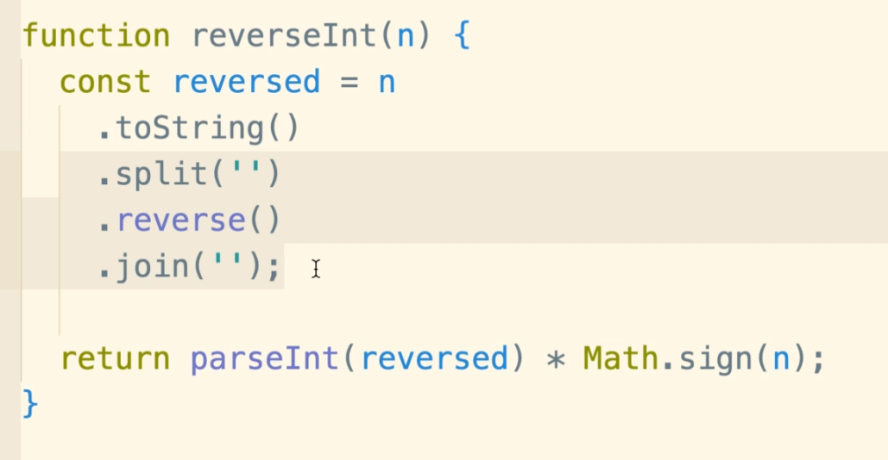

### Reverse an array

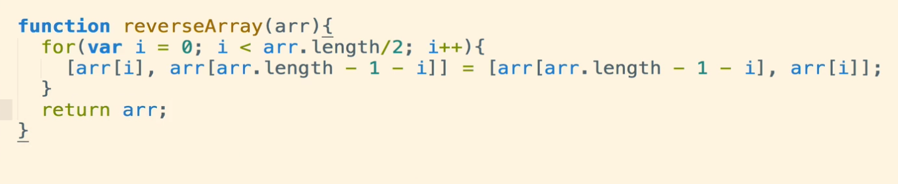

### Reverse a string

Novice solution:

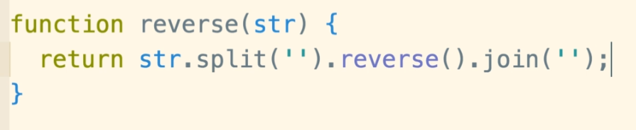

Better/alt solution:

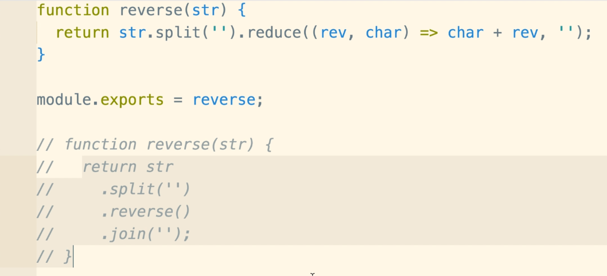

### Palindromes

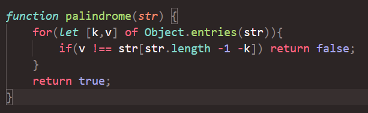

Basically: For each letter I’m searching to see if the current letter is
equal to the letter in the string that has an index of the last element
(length -1) minus the current index.

Note: It isn’t ideal/necessary to compare every letter in the string –
only the first or last half because if half matches the other half will
match as well since we are matching from on end to the other.

**Similar solution:**

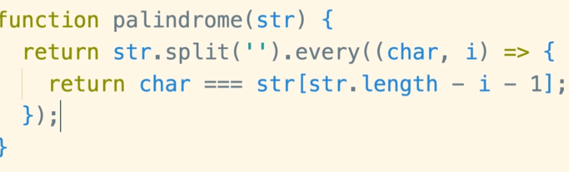

**Alternative**

Reverse the string and then compare with the reversed version.

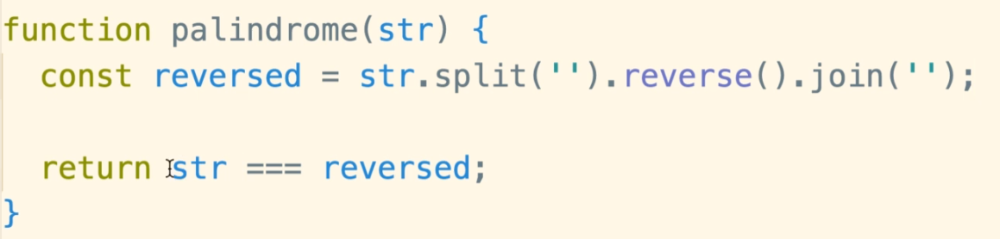

### Palindrome II

Return true if the given string is a palindrome. Otherwise, return
false.

A palindrome is a word or sentence that's spelled the same way both
forward and backward, ignoring punctuation, case, and spacing.

Note: You'll need to remove all non-alphanumeric characters
(punctuation, spaces and symbols) and turn everything into the same case
(lower or upper case) in order to check for palindromes.

We'll pass strings with varying formats, such as racecar, RaceCar, and
race CAR among others.

We'll also pass strings with special symbols, such as 2A3\*3a2, 2A3 3a2,
and 2_A3\*3#A2.

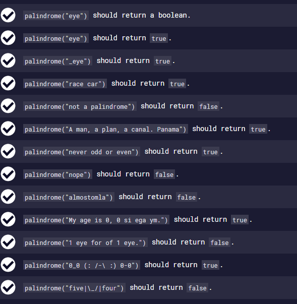

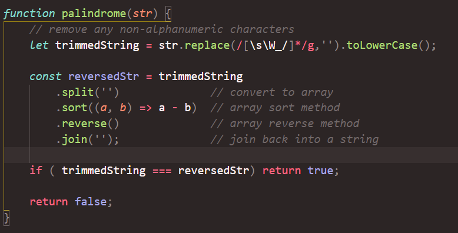

## Other

### (PERL) Number to float (2 decimals)

    *sub* float_2_from_num

    {

      *my* $working_num = $\_\[0\];         *\#ACCEPTS INTS & FLOATS*

      return '' if $working_num eq ''; *\#GUARD CLAUSE*

      *my* $decimal_idx_pre = index $working_num,'.';

      $working_num = $decimal_idx_pre == - 1 ? $working_num . '.00' : $decimal_idx_pre + 1 == length $working_num ? $working_num . '00' : $decimal_idx_pre + 2 == length $working_num ? $working_num . '0': $working_num;

      *my* $decimal_idx = index $working_num,'.';

      *my* $floats = substr($working_num,$decimal_idx + 1);

      *my* $float_length = length $floats;

      *my* $num_length = length $working_num;

      *my* $decimal_places = 2; 

      *my* $adjusted_length = $num_length - $float_length + $decimal_places;

      *my* $num_floated_2_places = substr($working_num,0,$adjusted_length);

      return $num_floated_2_places;   *\#RETURNS FLOAT WITH 2 DECIMAL PLACES*

    }

### Find true type

Check if a value is classified as a boolean primitive. Return true or
false.

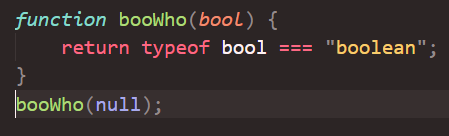

### DNA Pairing

The DNA strand is missing the pairing element. Take each character, get
its pair, and return the results as a 2d array.

Base pairs are a pair of AT and CG. Match the missing element to the
provided character.

Return the provided character as the first element in each array.

For example, for the input GCG, return \[\["G", "C"\], \["C","G"\],
\["G", "C"\]\]

The character and its pair are paired up in an array, and all the arrays
are grouped into one encapsulating array.

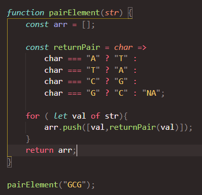

### Replace special characters with HTML entities

Convert the characters &, \<, \>, " (double quote), and ' (apostrophe),
in a string to their corresponding HTML entities.

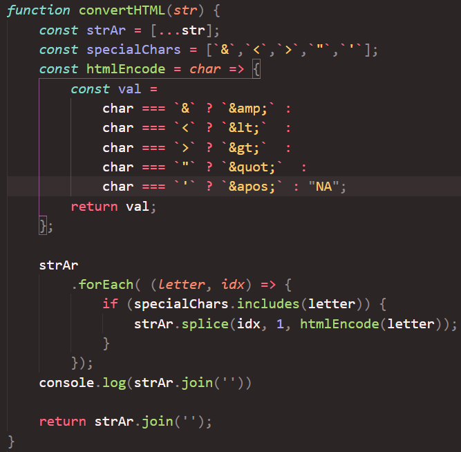

### Binary to text

Return an English translated sentence of the passed binary string.

The binary string will be space separated.

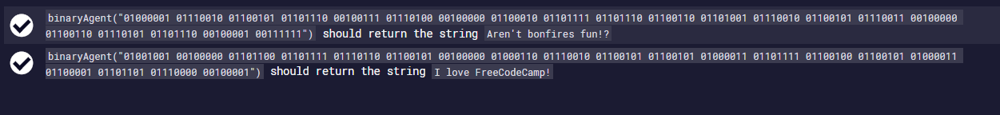

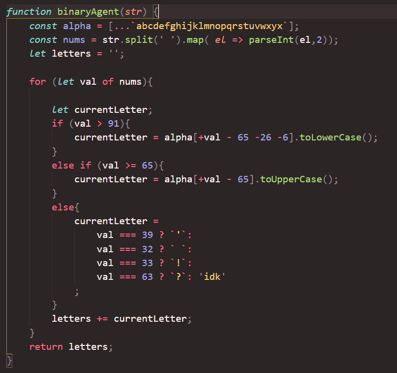

### Map the Debris

Return a new array that transforms the elements' average altitude into
their orbital periods (in seconds).

The array will contain objects in the format {name: 'name', avgAlt:
avgAlt}.

You can read about orbital periods on
[Wikipedia](http://en.wikipedia.org/wiki/Orbital_period).

The values should be rounded to the nearest whole number. The body being
orbited is Earth.

The radius of the earth is 6367.4447 kilometers, and the GM value of
earth is 398600.4418 km3s-2.

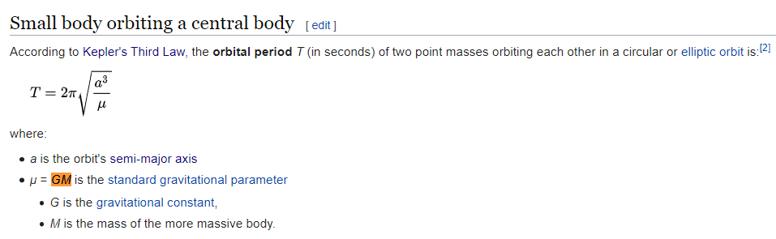


### Caesars Cipher

One of the simplest and most widely known ciphers is a Caesar cipher,
also known as a shift cipher. In a shift cipher the meanings of the
letters are shifted by some set amount.

A common modern use is the ROT13 cipher, where the values of the letters
are shifted by 13 places. Thus A ↔ N, B ↔ O and so on.

Write a function which takes a ROT13 encoded string as input and returns
a decoded string.

All letters will be uppercase. Do not transform any non-alphabetic
character (i.e. spaces, punctuation), but do pass them on.


### Telephone Number Validator

Return true if the passed string looks like a valid US phone number.

The user may fill out the form field any way they choose as long as it
has the format of a valid US number. The following are examples of valid
formats for US numbers (refer to the tests below for other variants):


For this challenge you will be presented with a string such as
800-692-7753 or 8oo-six427676;laskdjf. Your job is to validate or reject
the US phone number based on any combination of the formats provided
above. The area code is required. If the country code is provided, you
must confirm that the country code is 1. Return true if the string is a
valid US phone number; otherwise return false.


### Roman Numeral Converter

Convert the given number into a roman numeral.

All roman numerals answers should be provided in upper-case.


### Cash Register

Design a cash register drawer function checkCashRegister() that accepts
purchase price as the first argument (price), payment as the second
argument (cash), and cash-in-drawer (cid) as the third argument.

cid is a 2D array listing available currency.

The checkCashRegister() function should always return an object with a
status key and a change key.

Return {status: "INSUFFICIENT_FUNDS", change: \[\]} if cash-in-drawer is
less than the change due, or if you cannot return the exact change.

Return {status: "CLOSED", change: \[...\]} with cash-in-drawer as the
value for the key change if it is equal to the change due.

Otherwise, return {status: "OPEN", change: \[...\]}, with the change due
in coins and bills, sorted in highest to lowest order, as the value of
the change key.


# Big O Notation

***Short and sweet***: <https://www.youtube.com/watch?v=g2o22C3CRfU>

***Cheat Sheet:*** https://www.bigocheatsheet.com/

<https://adrianmejia.com/most-popular-algorithms-time-complexity-every-programmer-should-know-free-online-tutorial-course/>

<https://adrianmejia.com/how-you-can-change-the-world-learning-data-structures-algorithms-free-online-course-tutorial/>

<https://adrianmejia.com/data-structures-time-complexity-for-beginners-arrays-hashmaps-linked-lists-stacks-queues-tutorial/>

## Intro

> 
>
> 
>
> 

### Computational Complexity

> **Big O** : *“on the order of…”.* Describes the *runtime* a given
> task/algorithm takes.
>
> **Upper bound**: (worst case) highest number of steps a given
> algorithm can take to yield the given result. Designated by the big
> ‘**O**’ – called Big O notation.
>
> **Lower bound**: (best case) highest number of steps a given algorithm
> can take to yield the given result. Designated by the omega symbol
> ‘**Ω**’ – called omega notation.


>  alt="A screenshot of a computer program Description automatically generated" />
>
> The second example is based off of a mathematical formula (zomg wut)
> described below:
>
>  alt="A math equations and numbers Description automatically generated with medium confidence" />
>
> 
>
> 
> 
> 
>  style="width:6.28819in;height:4.24028in" />
>
> 

#### Measuring performance in JavScript

Performance object


***Time complexity***: Deals with how long an algorithm takes to run –
and the degree to which this grows exponentially (potentially).

***Space complexity***: Deals with how much space (memory) an algorithm
uses up to run - and the degree to which this grows exponentially
(potentially).


#### Time complexity


>  alt="A graph of a function Description automatically generated with medium confidence" />
>
>  alt="A graph of a graph of a problem Description automatically generated with medium confidence" /> alt="A chart with different colored lines Description automatically generated" />
>
> 
>
> Linear example above
>
> Ordered from fast to slowest (common ones)
>  alt="A screenshot of a graph Description automatically generated" />
>
> Common formulas:
>
>  alt="A screenshot of a computer Description automatically generated" />
>  alt="A screenshot of a computer Description automatically generated" />
>  alt="A screenshot of a computer game Description automatically generated" />
>  alt="A screenshot of a computer game Description automatically generated" />
>  alt="A screenshot of a computer Description automatically generated" />
>
>  alt="A computer screen with text and numbers Description automatically generated" />

##### Big O Rules of thumb

> <https://youtu.be/itn09C2ZB9Y>
>
> <https://www.youtube.com/watch?v=kS_gr2_-ws8>
>
> <https://youtu.be/JgWm6sQwS_I>

***O notation asks***: “By which *highest* factor of ***n*** is ***n***
growing?” (where n represent the number of operations being executed).

- **O(1)** – *Constant time complexity*, where the algorithm’s
  performance does not depend on the input size. Example: accessing a
  single element in an array.

- **O(log n)** – *Logarithmic time complexity*, where the algorithm
  reduces the problem size by a certain factor each time (often by
  half), common in divide-and-conquer approaches. Example: binary search
  in a sorted array.

- **O(n)** – *Linear time complexity*, where the performance grows
  directly proportional to the input size. Example: iterating through
  each element in an array.

- **O(n²)** – *Quadratic time complexity*, where the performance grows
  proportional to the square of the input size. Typically seen in
  algorithms with nested loops. Example: a double loop for comparing all
  pairs in a dataset (e.g., bubble sort).

- **O(n³)** – *Cubic time complexity*, where performance grows
  proportional to the cube of the input size. Seen in algorithms with
  three nested loops. Example: some brute-force matrix operations.

- **O(2n²)**, it's still exponential, but the factor 2 grows with the
  square of the input, so it grows faster than standard O(n²) but not
  quite as steep as O(2ⁿ)

- **O(2ⁿ)** – *Exponential time complexity*, where performance doubles
  with each additional input size unit. Example: recursive algorithms
  solving problems by splitting into two branches for each input, like
  the naive approach to calculating Fibonacci numbers.

- **O(n!)** – *Factorial time complexity*, where performance grows
  extremely fast with input size, usually when the algorithm generates
  all possible permutations of the input. Example: brute-force
  algorithms for solving the traveling salesman problem.


>  alt="A close-up of a white background Description automatically generated" />
>
>  alt="A white background with red circles and green text Description automatically generated" />
>
>  alt="A white background with red circles and black text Description automatically generated" />
>
> 
>
>  alt="A screenshot of a computer Description automatically generated" />
>  alt="A screenshot of a computer program Description automatically generated" /> alt="A computer screen shot of a computer code Description automatically generated" />
>  alt="A computer screen with colorful text Description automatically generated" />

##### Quiz


**^Above**: **O(n2)** becuas the number of times the inner
loop runs is equal to the number of times the outer loops runs. That is
to say, n is growing by a factor if itself squared **O(n2)**.

#### Space complexity


##### Examples


^Above: The amount of space required is proportianate to the input.

##### Quiz


^Above: O(n) because the amount of *total* space needed is proportianate
to the value of n. I.e, if n grows, the amount of space will as well
(not the same degree – but it is still proportianate).

^Above:
Although the numeric values of certain variables does increase, these
all take up constant space. Only the array increases in space by an
exponential factor as it’s size increases – and that factor is
proportianate to the value of n.

## Big O of Objects


## Big O of Arrays


Insertion/removal depends on where data is being inserted removed from.
If from the end, it’s O(1) but if it’s from the beginning its O(n) since
every element in the array needs to be shifted/unshifted.

### Big O of Array methods


#### Quiz


## Analyzing Performance of Arrays and Objects


# Algorithms I: General

## Intro: Algorithms

<https://www.youtube.com/watch?v=rL8X2mlNHPM&list=PL8dPuuaLjXtNlUrzyH5r6jN9ulIgZBpdo&index=14>

**Algorithm**: A set of instructions to complete a given task. The
phrase was first coined by a Persian polymath named Muhammad Ibn Musa
Al-Khwarizmi who was a father of algebra over a millennia ago.


**<u>Types of Questions</u>**


## Logarithms

**Introduction to Logarithms**:
<https://www.youtube.com/watch?v=mQTWzLpCcW0>

**Logarithm**: A logarithm has a ***base*** number and an
***exponent***. Logarithmic notation is the inverse of exponent notation
– where the result and the exponent are switched. So the ***log*** of
some ***base*** number is equal to the number of times you have to
multiply the ***base*** number by itself to get to the number after the
***base*** number.

> > “In mathematics, the logarithm is the inverse function to
> > exponentiation. That means the logarithm of a given number x is the
> > exponent to which another fixed number, the base b, must be raised,
> > to produce that number x.”


## Approaching a problem

a-z

## Problem solving Patterns

In programming, especially in algorithm design and competitive
programming, recognizing and applying common problem-solving patterns
can significantly streamline the process of developing efficient
solutions. These patterns are reusable approaches that can be adapted to
solve a wide variety of problems. Below is an overview of some of the
most widely used problem-solving patterns in programming:

### Greedy Algorithms

**Description:**  
Greedy algorithms make the locally optimal choice at each step with the
hope of finding a global optimum.

**Patterns Included:**

- **Activity Selection:** Choosing the maximum number of activities that
  don't overlap.

- **Huffman Coding:** Creating an optimal prefix code based on frequency
  of characters.

- **Kruskal's Algorithm:** Finding the minimum spanning tree in a graph.

**When to Use:**  
When a problem exhibits the greedy choice property, meaning a local
optimum leads to a global optimum.

**Example:**  
Selecting the minimum number of coins that make a given value from a set
of denominations.

------------------------------------------------------------------------

#### Activity Selection

#### Huffman Coding

#### Kruskal's Algorithm

### Sliding Window and Multi-Pointers

**Description:**  
These patterns involve using pointers to traverse data structures in a
way that optimizes space and time complexity.

**Patterns Included:**

- **Sliding Window:** Maintaining a window that satisfies certain
  conditions and moving it through the data structure.

- **Two Pointers / Multiple Pointers:** Using two or more pointers to
  traverse the data structure from different directions or speeds.

- **Fast and Slow Pointers:** A specific implementation of two pointers
  moving at different speeds, typically used in linked lists.

**When to Use:**  
When dealing with linear data structures like arrays or strings,
especially for problems involving subarrays or substrings.

**Example:**  
Finding the longest substring without repeating characters using the
sliding window technique.

------------------------------------------------------------------------

#### Sliding Window

**Description:**  
This pattern is used for problems involving sequences (like arrays or
strings) where you need to consider all possible contiguous
sub-sequences of a certain size or that satisfy certain conditions.

**When to Use:**

- Finding the maximum or minimum sum of a subarray of size k.

- Longest substring without repeating characters.

**Example:**  
Given an array of integers and a number k, find the maximum sum of a
subarray of size k.

------------------------------------------------------------------------


##### Examples

###### maxSubArraySum


###### MaxSubArray


###### findLongestSubstring 


###### minSubArrayLen


#### Two Pointers / Multiple Pointers

**Description:**  
This involves using two or more pointers to traverse the data structure,
typically from different ends or at different speeds, to solve problems
efficiently without using extra space.

**When to Use:**

- Finding pairs in a sorted array that add up to a specific target.

- Removing duplicates from a sorted array in place.

**Example:**  
Given a sorted array, find two numbers that add up to a specific target
number.

------------------------------------------------------------------------


Note: This approach only works on sorted arrays.


##### Examples

###### Average Pair

Given an array and a target average, find if any two consecutive numbers
in the array are equal to the target average:


Given an array and a target average, find if any two consecutive numbers
in the array are equal to the target average:


###### Is subsequence


With comments:


**Alternative:**


##### Fast and Slow Pointers (Tortoise and Hare)

**Description:**  
This technique uses two pointers moving at different speeds to detect
cycles or find midpoints in data structures like linked lists.

**When to Use:**

- Detecting cycles in a linked list.

- Finding the middle of a linked list.

**Example:**  
Determine if a linked list has a cycle by moving one pointer one step at
a time and another two steps at a time.

------------------------------------------------------------------------

### Frequency Counter


#### Examples: 

##### Is Substring


##### Anagram


##### Frequency Counter (same frequency)


Detailed:


**Alternative**:


##### Duplicate counter


##### Has same letters

Return true if the string in the first element of the array contains all
of the letters of the string in the second element of the array.

For example, \["hello", "Hello"\], should return true because all of the
letters in the second string are present in the first, ignoring case.

The arguments \["hello", "hey"\] should return false because the string
hello does not contain a y.

Lastly, \["Alien", "line"\], should return true because all of the
letters in line are present in Alien.


### Backtracking 

**Description:**  
This pattern explores all possible options to solve a problem and
abandons ("backtracks") those options that do not lead to a viable
solution.

**When to Use:**

- Solving puzzles like Sudoku or the N-Queens problem.

- Generating all subsets or permutations of a set.

**Example:**  
Solving the N-Queens problem by placing queens one by one and
backtracking when a conflict is detected.

------------------------------------------------------------------------

### Recursion

**Description:**  
A method where the solution to a problem depends on solutions to smaller
instances of the same problem.

**When to Use:**

- Problems that can naturally be divided into similar subproblems.

- Traversing data structures like trees and graphs.

- When the problem requires exploring all possible configurations, such
  as puzzles, permutations, or combinations.

**Example:**  
Calculating factorial of a number recursively.

------------------------------------------------------------------------

A good idea when you don’t know how deep to search.

**Factorial**

In mathematics, the factorial of a positive integer n, denoted by n!, is
the product of all positive integers less than or equal to n.

Similar to Fibonnaci numbers, except instead of ***sum*** we are using
***product*** for factorials.

[**https://www.youtube.com/watch?v=Mv9NEXX1VHc**](https://www.youtube.com/watch?v=Mv9NEXX1VHc)


Iterative vss recursive:


The base case tells the recursive function when it no longer needs to
call itself.


#### Pitfalls


#### Recursion vs Loops

Recursion can replace loops:

Countdown


In recursion. the start value is also the iterating value – similar to
the accumaltor in a reduce function.

**<u>Key point</u>**: The argument passed in an ***inner*** recursive
function must always decrement/increment – and the base case must always
act on this change to stop further function calls. ***A recursive call
must be structured such that the base case must be reached.***

**Note**: Notice how in order to sum for example, we need to
***return*** the result of each inner recursive function called. By
contrast, if we are merely looping we can just call the function itself.

#### Direction of Recursion

In a traditional for loop, the first iteration executed always executes
on the first thing being iterated over (for example – whatever value
***i*** begins with). However this assumes we are always executing the
intended action of our function before iterating to the next
element/value.

But suppose we could simply iterate to the next element/value first and
then subsequently execute the intended action of our function. In such a
case we would keeping iterating until we arrived at the base case first
then we would work backward iterating over each value/element in reverse
order. Thus, the last value/element being iterated over will actually be
executed first and the last value/element will be executed last.

In recursion, we can achieve this by simply placing our recursive call
before our executing case. **IMPORTANT**: If the recursive call occurs
before the executing code, the last iteration will be the first
iteration completed because we will be working backward after the base
case is reached. Note in the example below we have two different
recursive functions and they both have the same start value (5) and the
same ending value in the base case (0). However, the direction of
execution is still reversed merely in virtue of the fact that we have
recursive call placed before our executing case.


This is helpful for building objects. For we can set our base case to
return an empty (or otherwise) object where in which we can add items
for example working backward.

#### Recursion to Loop over arrays

##### Traditional

When looping over an array we usually iterate over each element of the
array until we reach the end of the array – designated by the length of
the array (minus 1). Here’s how we would do that with recursion:


##### Alternative

Alternatively, instead of sending two parameters where one is the index,
we can simply always run some action on the first element in the array.
Upon calling the next recursive function we can just send the original
loop ***minus the first element***. Thus, the next time we call the
function the first element in the array sent over will be the ***next
element*** in the original array. We can do this by using the slice
method in the array to only send the array as an argument after slicing
the array starting at the 2nd element (index of ‘1’). As a
base case, we can just use an empty array (length of ‘0’) as our
stopping point – since we are sending over a smaller array with each
iteration.


#### Recursion to build arrays/objects

**Note**: Recursive functions are different from loops in that when we
are building a single thing (a value, object, etc) we have to
***return*** the value from the ***subsequent recursive call first***.
This amounts to our base case being our initial case, and we then
continue to ***accumulate towards our initial recursive call***. So in
the case of constructing objects for example, out initial return value
(i.e. our base case) would be an empty object to add ***elements into***
(or key/value pairs). It’s important to note that the recursive call
must return a value from the next recursive function, not merely call
that function. Simply, by placing our recursive case before executing
case we can use out intial execution (base case) to return an empty
object to which we can later add into upon each successive iteration.


By saving the returned object of the base case (the initial execution)
into an object (myArr) we can act on that object in the subsequent
executions.

Note: Unshift will reverse the order since each element is being added
to the beginning of the array with each call. Thus the last value will
be the first element in the array.


Another example:


#### Helper method Recursion


#### Pure recursion


#### Examples:


##### Countdown

Iteratively:


Recursively:


##### sumrange


##### Repeat a string

Repeat a given string str (first argument) for num times (second
argument). Return an empty string if num is not a positive number. For
the purpose of this challenge, do not use the built-in .repeat() method.


function repeatStr(str, num){

if (num == 1) return str;

return str + repeatStr(str, num - 1)

}

repeatStr("abc",5);

##### Flatten an array

Flatten a nested array. You must account for varying levels of nesting.


##### Power


##### factorial


##### productOfArray


##### Recursive range


##### Fibonacci


Big O: O(n)


Big O: O(2^n)


##### Reverse string


### Bit Manipulation

**Description:**  
Bit Manipulation involves using bitwise operations to perform efficient
computations, often leading to space and time optimizations.

**Patterns Included:**

- **XOR Operations:** Useful for finding unique elements or performing
  swaps without a temporary variable.

- **Bit Masks:** Representing subsets or states using bits.

**When to Use:**  
When dealing with problems that can be represented or optimized using
binary representations.

**Example:**  
Finding a single number in an array where every other number appears
twice using the XOR operation.

------------------------------------------------------------------------

### Hashing

**Description:**  
Hashing uses hash tables (dictionaries/maps) to store key-value pairs
for efficient data retrieval based on keys.

**Patterns Included:**

- **Hash Tables for Counting:** Counting occurrences of elements.

- **Sets for Uniqueness:** Checking for duplicates or implementing set
  operations.

- **Implementing caches**.

**When to Use:**  
When you need constant-time access to elements, such as lookups,
insertions, and deletions based on keys.

**Example:**  
Counting the frequency of characters in a string to determine if two
strings are anagrams.

------------------------------------------------------------------------

#### Examples

### State Machines

**Description:**  
Modeling the problem as a finite state machine where each state
represents a condition or situation in the problem.

**When to Use:**

- Parsing strings or sequences with specific rules.

- Designing systems with a finite number of states and transitions.

**Example:**  
Validating the syntax of a string based on predefined rules (like
checking for balanced parentheses).

------------------------------------------------------------------------

### Randomized Algorithms

**Description:**  
Using random numbers to make decisions within the algorithm, often
leading to simpler or more efficient solutions on average.

**When to Use:**

- Algorithms where deterministic solutions are too slow.

- Problems requiring probabilistic guarantees.

**Example:**  
Randomized Quick Sort selects a random pivot to improve average
performance.

------------------------------------------------------------------------

# Algorithms II: Sorting and Searching

**Description:**  
These patterns involve ordering data in a specific manner to make
searching and other operations more efficient.

**Patterns Included:**

- **Standard Sorting Algorithms:** Like Quick Sort, Merge Sort, etc.

- **Binary Search:** Efficiently searching in sorted arrays.

- **Custom Sorting:** Sorting based on specific criteria to simplify
  problem-solving.

**When to Use:**  
When ordering data can simplify the problem or make certain operations
more efficient.

**Example:**  
Sorting an array before applying two-pointer techniques to find pairs
with a given sum.


------------------------------------------------------------------------

## Problem Solving Patterns

### Divide and Conquer

**Description:**  
Divide and Conquer involves breaking a problem into smaller subproblems,
solving each subproblem independently, and then combining their
solutions to solve the original problem.

**Patterns Included:**

- **Merge Sort & Quick Sort:** Sorting algorithms that divide the array
  into subarrays, sort them, and merge the results.

- **Binary Search:** Efficiently searching a sorted array by repeatedly
  dividing the search interval in half.

- **Fast and Slow Pointers (Tortoise and Hare):** Often used in linked
  list problems to find cycles or midpoints.

**When to Use:**  
When a problem can be divided into non-overlapping subproblems that are
easier to solve individually.

**Example:**  
Implementing the Merge Sort algorithm to sort an array.

------------------------------------------------------------------------


### Iteration

**Description:**  
Iteration involves using loops (for, while) to repeatedly execute a
block of code until a certain condition is met.

**Patterns Included:**

- **Simple Iteration:** Traversing through elements of data structures
  like arrays and lists.

- **Nested Iteration:** Using multiple loops to handle multi-dimensional
  data.

**When to Use:**  
When you need to process each element in a data structure or perform
repetitive tasks.

**Example:**  
Iterating through an array to find the maximum element.

------------------------------------------------------------------------

## Searching Algorithms


### Linear search

<https://youtu.be/TwsgCHYmbbA>

### Binary Search \[Fast | requires sorted data\] {Divide and Conquer}

**Description:**  
Binary search efficiently finds an item from a sorted list by repeatedly
dividing the search interval in half.

**When to Use:**

- Searching in a sorted array or list.

- Solving problems that can be transformed into a decision problem where
  the answer can be "yes" or "no".

**Example:**  
Finding the position of a target value within a sorted array.

**BigO**


## Sorting Algorithms

<https://www.toptal.com/developers/sorting-algorithms>

<https://visualgo.net/en/sorting?slide=1>


### Stable vs Unstable Sorting algorithms


### Bubble Sort (great for almost-sorted arrays)

<https://youtu.be/RT-hUXUWQ2I>


In terms of the upper bound, bubble and selection sort are both in the
same O bound but in terms of the lower bound bubble sort is in a lower
omega bound.

### Selection Sort

<https://youtu.be/3hH8kTHFw2A>

<https://www.udemy.com/course/js-algorithms-and-data-structures-masterclass/learn/lecture/8344154#questions>


### Insertion Sort

<https://youtu.be/O0VbBkUvriI>

<https://www.udemy.com/course/js-algorithms-and-data-structures-masterclass/learn/lecture/8344156#questions/7860030>


### Comparing Bubble, Selection, and Insertion Sort


Bubble and insertion are great on nearly sorted data.

Insertion sort is great if data is being dynamically added add sorting
needs to happen throughout this process.

### Merge Sort {Divide and Conquer}

<https://youtu.be/Ns7tGNbtvV4>

<https://www.udemy.com/course/js-algorithms-and-data-structures-masterclass/learn/lecture/8344174#overview>


<https://www.udemy.com/course/js-algorithms-and-data-structures-masterclass/learn/lecture/11072016#overview>


**Big O**


**Merging two sorted arrays**

### Heap Sort

<https://brilliant.org/wiki/heap-sort/>

### Quick Sort {Divide and Conquer}


https://www.udemy.com/course/js-algorithms-and-data-structures-masterclass/learn/lecture/8344144#notes

<https://www.udemy.com/course/js-algorithms-and-data-structures-masterclass/learn/lecture/8344144#notes>

### Radix Sort

<https://brilliant.org/wiki/radix-sort/>

<https://www.udemy.com/course/js-algorithms-and-data-structures-masterclass/learn/lecture/8344146#content>


# Algorithms III: Complex Data Structures and their algorithms

## Intro: Data Structures

<https://youtu.be/DuDz6B4cqVc>


**Data structures and memory**


Strings act as arrays (since they are iterables)


**Matrix**: An array of arrays


## Choosing the right Data Structures 


## Linked Lists


### Singly Linked Lists

<https://youtu.be/zQI3FyWm144>


Nodes in a linked list don’t have any indices.


In C


#### Big O


Singly linked lists beat arrays when it comes to insertion and removals.


### Doubly Linked Lists

<https://youtu.be/FHMPswJDCvU>


#### big O


### Circular Linked Lists


These are a problem – solution – add a way to determine if a list is
circular.

## Stacks + Queues


### Stacks (LIFO)

Call Stacks: <https://youtu.be/aCPkszeKRa4>


Stacks are LIFO (last-in/first-out)


### Queues (FIFO)


Queues are FIFO (first-in/first-out)


#### Stack-based Queue

Very common interview question


#### Weaves


## Hash Tables

<https://youtu.be/nvzVHwrrub0>


### Big O of hash tables


Most programming languages have an O(1) implementation of a hash table
by default and its generally not recommended to create your own hash
function.

### HashTable class


### Handling Collisions Methods

#### Separate Chaining


Store multiple in same spot.

#### Linear Probing


Choose next available spot.


#### Open Addressing


## Graphs

**Graph Search Algorithm in 10mins (fireship):**
<https://www.youtube.com/watch?v=cWNEl4HE2OE>

**Graph Theory:**

<https://www.youtube.com/watch?v=09_LlHjoEiY>

<https://www.youtube.com/watch?v=tWVWeAqZ0WU>

Graphs = nodes + connections

A graph is just a series of nodes connected by lines. With a graphing
algorithm we can find the shortest distance from any one node to
another.


### Time & Space Complexity


Alternate Big O considering worst case (two-way edged) graph


### Use cases


### Graph Terminology


#### Types of graphs


##### Directed/Undirected


##### Weighted/Unweighted


Unweighted


##### Cyclic vs Acyclic


#### Graph Data types


##### Adjacency List


##### Adjacency Matrix


##### Matrix vs List (Big O)


### Graph Structure


#### Adding a vertex


#### Adding an edge


#### Removing an edge


#### Removing a vertex


### Graph Algorithms

**Description:**  
Graph algorithms deal with problems related to graph structures,
involving nodes (vertices) and edges.

**Patterns Included:**

- **Breadth-First Search (BFS):** Exploring neighbors level by level,
  ideal for shortest path in unweighted graphs.

- **Depth-First Search (DFS):** Exploring as far as possible along each
  branch before backtracking.

- **Topological Sort:** Ordering nodes in a Directed Acyclic Graph (DAG)
  such that for every directed edge UV, U comes before V.

- **Union-Find (Disjoint Set):** Managing a collection of disjoint sets
  and supporting union and find operations.

**When to Use:**  
When dealing with problems that can be modeled as graphs, such as
network traversal, shortest paths, or connectivity.

**Example:**  
Using BFS to find the shortest path in a maze represented as a graph.

------------------------------------------------------------------------

find the shortest path in a maze represented as a graph.


#### Sorting

##### Topological Sort

**Description:**  
This pattern orders the nodes of a directed acyclic graph (DAG) such
that for every directed edge UV from node U to node V, U comes before V
in the ordering.

**When to Use:**

- Scheduling tasks with dependencies.

- Resolving symbol dependencies in linkers.

**Example:**  
Determining the order to take courses based on prerequisites.

------------------------------------------------------------------------

#### Traversal/Searching

##### Breadth-First Search (BFS)

**Description:**  
BFS explores the neighbor nodes level by level, making it ideal for
finding the shortest path on unweighted graphs.

**When to Use:**

- Shortest path problems in graphs.

- Level order traversal of trees.

**Example:**  
Finding the shortest path from a starting node to a target node in an
unweighted graph.

------------------------------------------------------------------------


##### Depth-First Search (DFS)

**Description:**  
DFS explores as far as possible along each branch before backtracking,
which is useful for problems requiring traversal of all possible paths.
This means that when starting at some given node “A” and reaching a
given sibling “B”, we don’t go back to “A” to see what other siblings
there are, rather we follow “B” and keep traversing deeper into the
graph (as far as we can) before coming back to “A” and checking what
other sibling nodes besides “B” that it may be connected to.

**When to Use:**

- Topological sorting.

- Detecting cycles in a graph.

**Example:**  
Traversing all nodes in a maze to find an exit path.

###### Recursive solution


###### Iterative Solution


##### BFS vs DFS

BFS uses a queue, think of “breadth” as horizontally wide – like a line
(queue).

DFS uses a stack, think of “depth” as vertically tall – like a stack.


##### Pathfinding (findings best path)


###### Dijkstra’s Algorithm (weighted graph traversal)


###### Bellman-Ford

Can be slow/inefficient but can handle negative weight.

###### Union-Find (Disjoint Set)

**Description:**  
A data structure that keeps track of elements partitioned into disjoint
(non-overlapping) sets and supports union and find operations.

**When to Use:**

- Detecting cycles in an undirected graph.

- Kruskal's algorithm for finding the minimum spanning tree.

**Example:**  
Grouping friends into connected components based on their friendships.

------------------------------------------------------------------------

### Trees


- Node: A branching point or an endpoint (leaf).

- Trees must have a single root node.

- Node must be in a parent-child relationship (not sibling for example).


#### Binary Trees 

**Binary tree** are trees where each nodes can have at most 2 children.


##### Binary Search Trees (BST)

<https://youtu.be/T98PIp4omUA>

**BSTs** are special types of Binary Trees which are sorted in
structure. They are ideal for **looking things up** and **inserting**.
They are also called “sorted/ordered binary trees”.


By “to the left” we don’t mean “drawn on the left side” but we mean “on
a node which itself is to the left of another node”. For example, here
although the 7 is slight to the right of the 8 the node itself on which
the 7 resides is to the left of the node on which the 8 resides (note
the branching structure).

\<=
Valid BST.


8 is larger than 6. However, it should not be the case in BSTS. All the
nodes to the right should be higher than the nodes on the left
**including the parent** **node**. So, if the parent was 8 and the
children on the right instead of 6 was 9 or higher, then it would be a
BST.


##### Validating


#### Tree Traversal Algorithms

##### Breadth-first search

<https://www.udemy.com/course/js-algorithms-and-data-structures-masterclass/learn/lecture/8344808#overview>


##### Depth-first search

###### Inorder, preorder, and postorder


###### Pre-order Stye


###### Post-order Stye


------------------------------------------------------------------------

#### Heaps

##### Binary Heap


Because a binary heap does left-to-right insertion there’s no need to
balance.


###### Big O of binary heaps


###### Adding to a MaxBinaryHeap


My solution


###### Removing


##### Priority Queue (max binary-heap)

<https://www.geeksforgeeks.org/priority-queue-set-1-introduction/>

A data structure where each element has a priority and elements with
higher priority are served before elements with a lower priority.


##### Indexed Priority Queue


Yes, there is a difference between a \*\*priority queue\*\* and an
\*\*indexed priority queue\*\*.

\### Priority Queue

A \*\*priority queue\*\* is a data structure that allows elements to be
added with an associated priority, and elements are accessed based on
their priority rather than the order they were added. Common operations
include:

\- \*\*Insert\*\*: Add an element with a specified priority.

\- \*\*Extract-Min/Extract-Max\*\*: Remove and return the element with
the highest or lowest priority.

\- \*\*Peek\*\*: View the highest or lowest priority element without
removing it.

Priority queues are typically implemented with heaps (binary heaps,
Fibonacci heaps, etc.), making insertions and deletions efficient.
However, a standard priority queue does not allow efficient direct
access to any specific element by index.

\### Indexed Priority Queue

An \*\*indexed priority queue\*\* extends the priority queue by allowing
elements to be accessed and modified via an index. This structure
maintains:

\- \*\*Direct element access\*\*: Each element has an associated index,
allowing for operations like decreasing the priority of a specific
element at a known index (also called decrease-key or increase-key).

\- \*\*Efficiency in updates\*\*: With an indexed priority queue, you
can directly adjust the priority of elements, making it suitable for
algorithms like Dijkstra's and Prim’s algorithms, where adjusting
priorities of specific elements is common.

\### Summary of Key Differences


In summary, if you only need to access elements by priority, a standard
priority queue suffices. If you need to frequently update or access
elements by index, an indexed priority queue is the better choice.

### Fenwick Tree (for range queries- max values)

<https://www.youtube.com/watch?v=uSFzHCZ4E-8>

Problem we’re trying to solve: Range Queries


^ could just iterate and add through range, but not optimal – linear
time.

However, we compute the prefix sums for array A, we can do this in
constant time which is much better.


This uses a form of dynamic programming (believe its tabulation).


But it’s a problem if we update our original array because we then have
to re-compute our prefix sum array again.


### Sparse Tree (for range queries – minimum value)

<https://youtu.be/ieMh3thHMjA?si=Sqzw4vZt-FJUlFkW>


### Trie (prefix tree)


Ideal for text/word completion. Optimized for speed and space.

### Union Find/ Disjoint Set


**Find**: Given an element the union find will tell you which group that
element belongs to.

**Union**: merges two groups together.


#### Kruskal’s Minimum spanning tree Algorithm

##### What is Kruskal's Algorithm?

<https://www.youtube.com/watch?v=JZBQLXgSGfs>

Example


Minimum spanning tree means defining a minimum weighted path(s) to
traverse throughout the tree.


Example


It’s fine to merge distinct groups – that’s intended


#### Theory behind a union Find 

##### Union and Find operations


^ array values become the parent node (from node) of a given node. So
“K”’s parent is “C” which is at index 4, so “K” (index 9) holds the
value of 4 now.

<s>^ This represents a hash where the vertex (node) is the letter and
the value is an array where…</s>


As a general rule, we try to merge smaller components into the larger
ones. For B (index 10) its parent becomes J (index 6) because J is part
of a union of two members (green – A, J) and B is only in a union of 1
(itself).


##### Path Compression


^ nodes directly/indirectly pointing to F as a root node are path
compressed.

The same occurs for nodes of G


Then we can unify


### Balanced Binary Search Trees


**How tree rotations work.**

**Suppose our invariant is not satisfied and we needed to do a right
rotation about node A.**

**Supposing node A had a left child node (B). we can perform a right
rotation to put B where A was, and push node A down to become B’s right
child/**


**Example: Right Rotation**


#### AVL Trees

[Animation](https://www.cs.usfca.edu/~galles/visualization/AVLtree.html)  
[How it
Works](https://medium.com/basecs/the-little-avl-tree-that-could-86a3cae410c7)


##### Tree Element insertions: Balancing with Tree Rotations (4 scenarios)


##### Tree Element Removals


#### Red Black Trees:  [Animation](https://www.cs.usfca.edu/~galles/visualization/RedBlack.html) [How it Works](https://medium.com/basecs/painting-nodes-black-with-red-black-trees-60eacb2be9a5)  You can compare the technical details [between the two here](https://stackoverflow.com/questions/13852870/red-black-tree-over-avl-tree)

## Dijkstra's Algorithm!


## The Wild West

To review before ending these notes:
<https://dev.to/iuliagroza/complete-introduction-to-the-30-most-essential-data-structures-algorithms-43kd>

(delete when done – it’s a repost link)

# Dynamic Programming

**Description:**  
DP is used for solving complex problems by breaking them down into
simpler overlapping subproblems and storing the results to avoid
redundant computations.

**Patterns Included:**

- **Memoization:** Storing the results of expensive function calls and
  reusing them when the same inputs occur again.

- **Tabulation:** Building a table iteratively to store subproblem
  solutions.

- **State Machines:** Modeling problems where the solution can be
  represented as a series of states with transitions.

**When to Use:**  
When the problem has overlapping subproblems and an optimal
substructure, meaning the optimal solution can be constructed from
optimal solutions of its subproblems.

**Example:**  
Calculating the nth Fibonacci number using memoization to reduce time
complexity.

------------------------------------------------------------------------

## Introduction


### Overlapping Subproblems


### Optimal Substructure


*Example that does exhibit optimal substructure*


*Example that does not exhibit optimal substructure*


------------------------------------------------------------------------

## Memoization (Big O - On)

**Description:**  
Storing the results of expensive function calls and reusing them when
the same inputs occur again.

**When to Use:**

- Optimizing recursive algorithms.

- Reducing the time complexity of dynamic programming solutions.

**Example:**  
Caching the results of API calls to avoid redundant network requests.


### Memoization and recursion

**Description:**  
A technique to optimize recursive algorithms by storing the results of
expensive function calls and returning the cached result when the same
inputs occur again.

**When to Use:**

- Enhancing the performance of recursive algorithms in dynamic
  programming.

- Avoiding redundant computations in overlapping subproblems.

**Example:**  
Caching the results of Fibonacci number calculations to reduce time
complexity from exponential to linear.


Since objects are pass-by-reference, we are passing the same object
(array) through each function call.

Another memorized approach


^ Removed base case by adding fibs of 0, 1, and 2 in the memo array.

------------------------------------------------------------------------

## Tabulation (Big O – On)

**Description:**  
Both are techniques used in dynamic programming. Memoization is
top-down, storing results as they are computed, while tabulation is
bottom-up, building a table iteratively.

**When to Use:**

- When dynamic programming is applicable, to store and reuse subproblem
  solutions.

**Example:**  
Building a table to solve the knapsack problem iteratively.


The benefit of tabulation over recursion is that you don’t have to every
worry about stack overflow because we’re not queuing up a bunch of calls
on the stack to be handled later – we process each in real time.

# Interview Question (in Technical Interview)

## Top Interview Question

Want some extra practice? Here are a list of some of the top interview
questions focusing on data structures and algorithms:  
  
\#344 [Reverse String](https://leetcode.com/problems/reverse-string)   

\#412 [Fizz Buzz](https://leetcode.com/problems/fizz-buzz)    

\#136 [Single Number](https://leetcode.com/problems/single-number)    

\#104 [Maximum Depth of Binary
Tree](https://leetcode.com/problems/maximum-depth-of-binary-tree)    

\#283 [Move Zeroes](https://leetcode.com/problems/move-zeroes)    

\#371 [Sum of Two
Integers](https://leetcode.com/problems/sum-of-two-integers)    

\#206 [Reverse Linked
List](https://leetcode.com/problems/reverse-linked-list)    

\#171 [Excel Sheet Column
Number](https://leetcode.com/problems/excel-sheet-column-number)    

\#169 [Majority
Element](https://leetcode.com/problems/majority-element)    

\#13 [Roman to
Integer](https://leetcode.com/problems/roman-to-integer)    

\#237 [Delete Node in a Linked
List](https://leetcode.com/problems/delete-node-in-a-linked-list)    

\#122 [Best Time to Buy and Sell Stock
II](https://leetcode.com/problems/best-time-to-buy-and-sell-stock-ii)    

\#242 [Valid Anagram](https://leetcode.com/problems/valid-anagram)    

\#217 [Contains
Duplicate](https://leetcode.com/problems/contains-duplicate)    

\#387 [First Unique Character in a
String](https://leetcode.com/problems/first-unique-character-in-a-string)    

\#108 [Convert Sorted Array to Binary Search
Tree](https://leetcode.com/problems/convert-sorted-array-to-binary-search-tree)    

\#268 [Missing Number](https://leetcode.com/problems/missing-number)    

\#350 [Intersection of Two Arrays
II](https://leetcode.com/problems/intersection-of-two-arrays-ii)    

\#121 [Best Time to Buy and Sell
Stock](https://leetcode.com/problems/best-time-to-buy-and-sell-stock)    (Use
dynamic programing)

\#21 [Merge Two Sorted
Lists](https://leetcode.com/problems/merge-two-sorted-lists)    

\#202 [Happy Number](https://leetcode.com/problems/happy-number)    

\#118 [Pascal's
Triangle](https://leetcode.com/problems/pascals-triangle)    

\#70 [Climbing
Stairs](https://leetcode.com/problems/climbing-stairs)    (Use dynamic
programing)

\#101 [Symmetric Tree](https://leetcode.com/problems/symmetric-tree)    

\#53 [Maximum
Subarray](https://leetcode.com/problems/maximum-subarray)    

\#326 [Power of Three](https://leetcode.com/problems/power-of-three)    

\#191 [Number of 1
Bits](https://leetcode.com/problems/number-of-1-bits)    

\#198 [House Robber](https://leetcode.com/problems/house-robber)    (Use
dynamic programing)

\#66 [Plus One](https://leetcode.com/problems/plus-one)    

\#1 [Two Sum](https://leetcode.com/problems/two-sum)    

\#38 [Count and Say](https://leetcode.com/problems/count-and-say)    

\#26 [Remove Duplicates from Sorted
Array](https://leetcode.com/problems/remove-duplicates-from-sorted-array)    

\#172 [Factorial Trailing
Zeroes](https://leetcode.com/problems/factorial-trailing-zeroes)    

\#20 [Valid
Parentheses](https://leetcode.com/problems/valid-parentheses)    

\#141 [Linked List
Cycle](https://leetcode.com/problems/linked-list-cycle)    

\#234 [Palindrome Linked
List](https://leetcode.com/problems/palindrome-linked-list)    

\#88 [Merge Sorted
Array](https://leetcode.com/problems/merge-sorted-array)    

\#155 [Min Stack](https://leetcode.com/problems/min-stack)    

\#14 [Longest Common
Prefix](https://leetcode.com/problems/longest-common-prefix)    

\#160 [Intersection of Two Linked
Lists](https://leetcode.com/problems/intersection-of-two-linked-lists)    

\#28 [Implement
strStr()](https://leetcode.com/problems/implement-strstr)    

\#69 [Sqrt(x)](https://leetcode.com/problems/sqrtx)    

\#190 [Reverse Bits](https://leetcode.com/problems/reverse-bits)    

\#125 [Valid
Palindrome](https://leetcode.com/problems/valid-palindrome)    

\#189 [Rotate Array](https://leetcode.com/problems/rotate-array)    

\#204 [Count Primes](https://leetcode.com/problems/count-primes)    

\#7 [Reverse Integer](https://leetcode.com/problems/reverse-integer)    

\#94 [Binary Tree Inorder
Traversal](https://leetcode.com/problems/binary-tree-inorder-traversal)    

\#98 [Validate Binary Search
Tree](https://leetcode.com/problems/validate-binary-search-tree/description/)

## Amazon Interview Questions

If you would like to practice real life interview questions asked by
Amazon, then here they are below. Keep in mind that it will be hard to
just get everything right from the beginning. With enough practice you
will become better and better, but there is an entire community of us
learning, so I recommend you tackle these questions together with our
online Discord community (see lesson \#3 in this course for the link)
and join the conversation and tackle problems in the
\#**interview-questions **channel:  
  
**1.** [Past Interview
Questions](https://www.glassdoor.ca/Interview/Amazon-Software-Development-Engineer-Interview-Questions-EI_IE6036.0,6_KO7,36.htm)

**2.** *From Leetcode*:  
  
\#1 [Two Sum](https://leetcode.com/problems/two-sum)    

\#2 [Add Two Numbers](https://leetcode.com/problems/add-two-numbers)    

\#3 [Longest Substring Without Repeating
Characters](https://leetcode.com/problems/longest-substring-without-repeating-characters)      

\#200 [Number of
Islands](https://leetcode.com/problems/number-of-islands)    

\#20 [Valid
Parentheses](https://leetcode.com/problems/valid-parentheses)    

\#5 [Longest Palindromic
Substring](https://leetcode.com/problems/longest-palindromic-substring)    

\#138 [Copy List with Random
Pointer](https://leetcode.com/problems/copy-list-with-random-pointer)    

\#121 [Best Time to Buy and Sell
Stock](https://leetcode.com/problems/best-time-to-buy-and-sell-stock)    

\#21 [Merge Two Sorted
Lists](https://leetcode.com/problems/merge-two-sorted-lists)    

**3.** **Bonus Question asked by Amazon:**

*From: https://www.dailycodingproblem.com/*

There's a staircase with N steps, and you can climb 1 or 2 steps at a
time. Given N, write a function that returns the number of unique ways
you can climb the staircase. The order of the steps matters.

For example, if N is 4, then there are 5 unique ways:

- 1, 1, 1, 1

- 2, 1, 1

- 1, 2, 1

- 1, 1, 2

- 2, 2

What if, instead of being able to climb 1 or 2 steps at a time, you
could climb any number from a set of positive integers X? For example,
if X = {1, 3, 5}, you could climb 1, 3, or 5 steps at a time. Generalize
your function to take in X.

**Solution**

It's always good to start off with some test cases. Let's start with
small cases and see if we can find some sort of pattern.

- N = 1: \[1\]

- N = 2: \[1, 1\], \[2\]

- N = 3: \[1, 2\], \[1, 1, 1\], \[2, 1\]

- N = 4: \[1, 1, 2\], \[2, 2\], \[1, 2, 1\], \[1, 1, 1, 1\], \[2, 1, 1\]

What's the relationship?

The only ways to get to N = 3, is to first get to N = 1, and then go up
by 2 steps, or get to N = 2 and go up by 1 step. So f(3) = f(2) + f(1).

Does this hold for N = 4? Yes, it does. Since we can only get to the 4th
step by getting to the 3rd step and going up by one, or by getting to
the 2nd step and going up by two. So f(4) = f(3) + f(2).

To generalize, f(n) = f(n - 1) + f(n - 2). That's just the [Fibonacci
sequence](https://en.wikipedia.org/wiki/Fibonacci_number)!

1.  def staircase(n):

2.  if n \<= 1:

3.  return 1

4.  return staircase(n - 1) + staircase(n - 2)

Of course, this is really slow (O(2N)) — we are doing a lot of repeated
computations! We can do it a lot faster by just computing iteratively:

1.  def staircase(n):

2.  a, b = 1, 2

3.  for \_ in range(n - 1):

4.  a, b = b, a + b

5.  return a

Now, let's try to generalize what we've learned so that it works if you
can take a number of steps from the set X. Similar reasoning tells us
that if X = {1, 3, 5}, then our algorithm should be f(n) = f(n - 1) +
f(n - 3) + f(n - 5). If n \< 0, then we should return 0 since we can't
start from a negative number of steps.

1.  def staircase(n, X):

2.  if n \< 0:

3.  return 0

4.  elif n == 0:

5.  return 1

6.  else:

7.  return sum(staircase(n - x, X) for x in X)

This is again, very slow (O(|X|N)) since we are repeating computations
again. We can use dynamic programming to speed it up.

Each entry cache\[i\] will contain the number of ways we can get to step
i with the set X. Then, we'll build up the array from zero using the
same recurrence as before:

1.  def staircase(n, X):

2.  cache = \[0 for \_ in range(n + 1)\]

3.  cache\[0\] = 1

4.  for i in range(1, n + 1):

5.  cache\[i\] += sum(cache\[i - x\] for x in X if i - x \>= 0)

6.  return cache\[n\]

This now takes O(N \* |X|) time and O(N) space.

## Facebook Interview Questions

If you would like to practice real life interview questions asked by
Facebook, then here they are below. Keep in mind that it will be hard to
just get everything right from the beginning. With enough practice you
will become better and better, but there is an entire community of us
learning, so I recommend you tackle these questions together with our
online Discord community (see lesson \#3 in this course for the link)
and join the conversation and tackle problems in the
\#**interview-questions **channel:  
  
**1.** [Past Facebook Interview
Questions](https://www.glassdoor.ca/Interview/Facebook-Software-Engineer-Interview-Questions-EI_IE40772.0,8_KO9,26.htm)  
  
**2.** *From Leetcode:*

\#1 [Two Sum](https://leetcode.com/problems/two-sum)    

\#200 [Number of
Islands](https://leetcode.com/problems/number-of-islands)    

\#20 [Valid
Parentheses](https://leetcode.com/problems/valid-parentheses)    

\#121 [Best Time to Buy and Sell
Stock](https://leetcode.com/problems/best-time-to-buy-and-sell-stock)    

\#56 [Merge
Intervals](https://leetcode.com/problems/merge-intervals)    

\#206 [Reverse Linked
List](https://leetcode.com/problems/reverse-linked-list)     

**3.** **Bonus Interview Question asked by Facebook:**

Determine the 10 most frequent words given a terabyte of
strings.** **([solution](https://stackoverflow.com/questions/12525455/most-frequent-words-in-a-terabyte-of-data))

## Google Interview Questions

If you would like to practice real life interview questions asked by
Google, then here they are below. Keep in mind that it will be hard to
just get everything right from the beginning. With enough practice you
will become better and better, but there is an entire community of us
learning, so I recommend you tackle these questions together with our
online Discord community (see lesson \#3 in this course for the link)
and join the conversation and tackle problems in the
\#**interview-questions **channel:  
  
**1.** [Past Google Interview
Questions](https://www.careercup.com/page?pid=google-interview-questions)  
  
**2.** *From Leetcode:*

\#155 [Min Stack](https://leetcode.com/problems/min-stack)   

\#200 [Number of
Islands](https://leetcode.com/problems/number-of-islands)    

\#20 [Valid
Parentheses](https://leetcode.com/problems/valid-parentheses)    

\#42 [Trapping Rain
Water](https://leetcode.com/problems/trapping-rain-water)    

\#56 [Merge
Intervals](https://leetcode.com/problems/merge-intervals)    

\#681 [Next Closest
Time](https://leetcode.com/problems/next-closest-time)    

\#139 [Word Break](https://leetcode.com/problems/word-break)    

\#31 [Next
Permutation](https://leetcode.com/problems/next-permutation)    

**3.** **Bonus Interview Question asked by Google:**

Write a function which will remove any given character from a
String** **([solution](http://javarevisited.blogspot.sg/2015/04/how-to-remove-given-character-from.html) in
Java)

# Mathematics

## Negative zero


