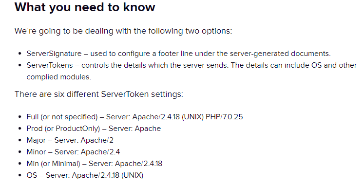

- **Apache webserver:**

  - <https://ubuntu.com/tutorials/install-and-configure-apache#1-overview>

  - <https://opensource.com/article/18/2/how-configure-apache-web-server>

  - <https://www.digitalocean.com/community/tutorials/how-to-install-the-apache-web-server-on-ubuntu-20-04>

  - Change SELinux context

  - 

  - 

  - ***Apache + Perl***

    - <https://perlmaven.com/perl-cgi-script-with-apache2>

    - <https://stackoverflow.com/questions/560749/how-do-i-configure-apache-2-to-run-perl-cgi-scripts>

- **Service Manipulation** *(using sys-v)*

  - *Note: replace ‘restart’ with ‘status’,’start’ , ‘stop’,’enable’, or
    ‘disable’.*

  - sudo service \<servicename\> restart

  - sudo service apache2 restart

  - sudo service ssh restart

- **journal -u \<service\>**

  - Get logs by service (unit)

  - sudo journalctl -u apache2.service | grep Starting | tail -n 5

^ get last five times apache was restarted

# Changing Root Directory

<https://stackoverflow.com/questions/5891802/how-do-i-change-the-root-directory-of-an-apache-server>

**Please note, that this only applies
for [Ubuntu 14.04](https://en.wikipedia.org/wiki/Ubuntu_version_history#Ubuntu_14.04_LTS_.28Trusty_Tahr.29) LTS
(Trusty Tahr) and newer releases.**

In my Ubuntu 14.04 LTS, the document root was set to /var/www/html. It
was configured in the following file:

/etc/apache2/sites-available/000-default.conf

So just do a

sudo nano /etc/apache2/sites-available/000-default.conf

and change the following line to what you want:

DocumentRoot /var/www/html

Also do a

sudo nano /etc/apache2/apache2.conf

and find this:

\<Directory /var/www/html/\>

Options Indexes FollowSymLinks

AllowOverride None

Require all granted

\</Directory\>

And change /var/www/html to your preferred directory and save it.

After you saved your changes, just restart the Apache 2 web server and
you'll be done :)

sudo service apache2 restart

------------------------------------------------------------------------

If you prefer a graphical text editor, you can just replace the sudo
nano with a gksu gedit.

# Manipulating Response Headers

**Edit** /etc/apache2/apache2.conf \[debian\] or httpd.conf (redhat)

Header set Test "This is a test"

Header set Hello "Hello. It took %D microseconds for Apache to serve
this request."

<https://blog.sucuri.net/2023/04/how-to-set-up-a-content-security-policy-csp-in-3-steps.html>

<https://techexpert.tips/apache/apache-add-header/>

# Security-based configuration

## Cookies

Need to be set to secure=1 – this means cookies will only be set if
communicating over HTTPs.

SameSite = 1 – makes sure cookies can’t be sent to another domain.

## CSP

Content-Security-Policy: default-src \*

**In apache config:**

Header set Content-Security-Policy "default-src \*"

***\# If you have inline syles \[not reccommended\]***

Header set Content-Security-Policy "default-src 'self' style-src 'self'
'unsafe-inline';"

***\# If you have inline styles+scripts \[not reccommended\]***

Header set Content-Security-Policy "default-src 'self' style-src 'self'
script-src 'self' 'unsafe-inline';"

X-Content-Type-Options: nosniff

## Strict-Transport-Security (HTTPS-Only)

<https://scanrepeat.com/web-security-knowledge-base/strict-transport-security-header-not-set#:~:text=Why%20%E2%80%9CStrict%2DTransport%2DSecurity,being%20one%20of%20the%20options>.

<https://kinsta.com/knowledgebase/hsts-missing-from-https-server/>

Strict-Transport-Security: max-age=31536000; includeSubDomains;

Apache config:

Header always set Strict-Transport-Security max-age=31536000

## Content-Type

**In apache config:**

Header set X-Content-Type-Options "nosniff"

## Hiding server info from error pages

In the apache config file you can set **ServerTokens** to any of the
above.

However, if you may want to remove it altogether..

*To do so, simply add this to your apache config file and reload the
service*

ServerTokens Prod

ServerSignature Off

# Log configuration

**Log Cookie header**

Add "%{Cookie}i" Cookie

*Example:*

LogFormat "%{X-Forwarded-For}i %h %l %u %t \\%r\\ %\>s %O
\\%{Referer}i\\ \\%{Cookie}i\\ \\%{User-Agent}i\\" combined
