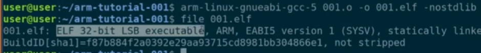

**2min Crash Course**: <https://www.youtube.com/watch?v=4gwYkEK0gOk>

Good to note that there is a separate Assembly Language each different
type of CPU Architecture (such as x86 for Intel and ARM for Silicon,
Apple M1 and Raspberry Pi).

# Assembly with x86 (with NASM)

## Helpful Links

Playlist with great overview/theory behind Assembly (how it works/what
it does)

<https://www.youtube.com/playlist?list=PLHJns8WZXCdvESvdr1BRjo4RHiR1Ylhw9>

- <https://www.youtube.com/playlist?list=PLGLfVvz_LVvQu9IwUcpn8KOZsOvoHx8sU>

- <https://www.youtube.com/playlist?list=PL2EF13wm-hWCoj6tUBGUmrkJmH1972dBB>

**<u>Other Resources</u>**

- [**Chromium OS Docs - Linux System Call
  Table**](https://chromium.googlesource.com/chromiumos/docs/+/master/constants/syscalls.md#arm-32_bit_EABI)

- [**Assembly Language
  Tutorial**](https://www.newthinktank.com/2016/04/assembly-language-tutorial/)

- [**Assembly Language Tutorial
  2**](https://www.newthinktank.com/2016/05/assembly-language-tutorial-2/)

- [**Assembly Language Tutorial
  3**](https://www.newthinktank.com/2016/05/assembly-language-tutorial-3/)

- [**CPUlator Computer System Simulator**](https://cpulator.01xz.net/)

- [**CPUlator ARMv7 System
  Simulator**](https://cpulator.01xz.net/?sys=arm-de1soc)

**<u>Videos and Playlists (x86)</u>**

- [x86 vs ARM Assembly: Key Differences Explained | Assembly
  Basics](https://www.youtube.com/watch?v=Jk7Ul2hKqxs)

- [Assembly Basics: The Language Behind the
  Hardware](https://www.youtube.com/watch?v=LdWU8JEfPhg&t=25s)

- [x86 Assembly Crash
  Course](https://www.youtube.com/watch?v=75gBFiFtAb8) \[GOOD INTRO\]

- [x86 Assembly: Hello
  World!](https://www.youtube.com/watch?v=HgEGAaYdABA)

- [You Can Learn Assembly in 10 Minutes (it’s
  easy)](https://www.youtube.com/watch?v=jPDiaZS-2ok)

- [x86 Assembly - Hello World
  Explained](https://www.youtube.com/watch?v=GPx4fUEmYJ8)

- [\[PLAYLIST\] Intro to x86 Assembly
  Language](https://www.youtube.com/playlist?list=PLmxT2pVYo5LB5EzTPZGfFN0c2GDiSXgQe)

- [\[PLAYLIST\] x86
  Assembly](https://www.youtube.com/playlist?list=PLan2CeTAw3pFOq5qc9urw8w7R-kvAT8Yb)

- [x86_64 Linux
  Assembly](https://www.youtube.com/playlist?list=PLetF-YjXm-sCH6FrTz4AQhfH6INDQvQSn)

## AT&T and Intel (NASM) Syntaxes

**<u>Assembly</u>**

- X86 has two main instruction sets (ISAs): AT&T and Intel

  - **AT&T Syntax**: Developed by AT&T for UNIX systems, commonly used
    in tools like the GNU Assembler (GAS) and in Linux environments.

    - Compiling Object file(s): as hello.s -o hello.o

  - **Intel Syntax**: Developed by Intel, used in Intel’s documentation,
    NASM (Netwide Assembler), and many Windows-based tools.

    - Compiling Object file(s): nasm -f elf64 hello.asm -o hello.o

  - **Key Point**: The underlying machine code generated by both
    syntaxes is identical for the same x86 instructions; only the
    human-readable format differs.

- Depends on arch (32-bit vs 64-bit)

- Depends on how you’re compiling (for example, using NASM).


## Setup

Necessary to install

*(for 32-bit systems)*


*(for nasm syntax)*

sudo apt-get install nasm

*(for ld)*

sudo apt-get install binutils

Programs should be created as an “**.asm**” file.

## Program Structure

General program template

```
.global \_start

.intel_syntax

.section .text

\# Comment

.section .data

; Simple x86 Assembly Program Template (32-bit, NASM syntax, Linux)

; This template provides a basic structure for x86 assembly programs

section .data ; Initialized data goes here ; Example: message db 'Hello,
World!', 0xA ; String with newline ; Example: message_len equ $ -
message ; Length of the string

section .bss ; Uninitialized data goes here ; Example: buffer resb 256 ;
Reserve 256 bytes for a buffer

section .text global \_start ; Entry point for the linker

\_start: ; Your program code goes here ; Example: Write "Hello, World!"
to stdout ; mov eax, 4 ; Syscall number for sys_write (4 in 32-bit
Linux) ; mov ebx, 1 ; File descriptor 1 (stdout) ; mov ecx, message ;
Pointer to the message ; mov edx, message_len ; Length of the message ;
int 0x80 ; Call the kernel

; Exit the program mov eax, 1 ; Syscall number for sys_exit (1 in 32-bit
Linux) mov ebx, 0 ; Exit status code 0 (success) int 0x80 ; Call the
kernel
```


## Printing to stdout

Once you have defined a variable, you can get the variable length using
the pointer ‘$’. The pointer is the current pointer position minus the
variable itself will yield the length of the variable in question.


##  Program Compilation

Compile then link


Ld assumes the architecture of your system so its best to specify the
architecture your program is for


# Assembly with ARM 32-bit (ARMv7 DE1-SoC)

## Code tutorial \[Derek Banas\]

<https://www.newthinktank.com/2016/04/assembly-language-tutorial/>

<https://www.newthinktank.com/2016/05/assembly-language-tutorial-2/>

<https://www.newthinktank.com/2016/05/assembly-language-tutorial-3/>

## Helpful Links

**Emulator:** <https://cpulator.01xz.net/?sys=arm-de1soc>

**Tuts:**
<https://www.tutorialspoint.com/assembly_programming/assembly_introduction.htm>

**Hello World**: <https://www.youtube.com/watch?v=FV6P5eRmMh8>

<https://www.youtube.com/watch?v=gfmRrPjnEw4>

<https://www.youtube.com/playlist?list=PLGLfVvz_LVvQu9IwUcpn8KOZsOvoHx8sU>

**System Call Table:**
<https://chromium.googlesource.com/chromiumos/docs/+/master/constants/syscalls.md>

## Intro/Overview


## On registers

Registers are stored in 8 hexadecimal values. Each hex value is 4 bits –
totaling 32 bits for each register (4 bytes). This is true for a
**32-bit systems**.

**64-bit systems** will have 16 hexadecimal values saved in each
register. 4bits for each hex value and 16 such value results in 64bits
per register.

The amount of data that can be stored in a single register is also known
as a “word” – there is also “half-word” as well.

**<u>Notable Register ranges/uses</u>**

- **R0 – R6:** General Purpose

- **R7:** System Calls (Calls to OS/Kernel)

- **sp:** Stack pointer

  - Stores the address of the next available memory location.

  - Each location is represented by a hex value – meaning each memory
    “slot” holds 4bits and the next address is always four bits larger
    than the last available memory slot.

  - Stack memory is RAM memory and is slower than CPU register memory
    but can store more data.

- **lr**: link register. Stores the location that a function should
  *return* back to.

- **pc**: Program Counter. Keeps track of how many things have already
  been processed so we know where we left off at any given time.

- **cpsr**: Stores information about our program or a given operation.

  - For example: We can’t store negative numbers in binary, but we can
    use the **cpsr register** to store a special flag that says “the
    last operation yields a negative number”.

## Program structure (by example)

Begin each program with these two lines

.global \_start

\_start:

(Above) “.global \_start” is globally declaring the “start” label
(labels are functions) and “\_start” is where we define what is to be
done in this label.

## Moving data into registers

An “OpCode” or “Operation Code” or “Pneumonic” are all words used to
describe the keyword being using on a given operation. Convention to use
all caps as in SQL.

The “MOV” OpCode is used to move some value into/out of a register.

This required a destination and source for our data (in that order).


- **Constants** (constant values) are prefixed with ‘#’ and are base-10
  values. Example: \#30

- Hex values are prefixed with a ‘#0x’. Example: \#0x0A

### Addressing Types and Managing Stack Data

**Addressing Types**

- **Immediate Addressing:** Moving a constant value into a register.

  - Example1: MOV R1,#100

  - Example2: MOV R1,#0x64

- **Register-Direct Addressing:** Moving a value from one register to
  another.

  - Example: MOV R1,R3

- **Direct Addressing:** Storing an address in memory into a register
  (saving into stack).

  - Example: Storing a list location into a register (only the first
    element’s address is saved).

  - LDR R0,=mylist

- **Register Indirect Addressing:** Retrieving a value from a memory
  address.

  - 

### Arrays

#### Storing a list (array) into a register and referencing.

Use LDR (Load Direct Register) to load direct values into a register.

LDR \<register\>,=\<list_name\>

Then use a keyword to define the size of each list element (‘word” means
the full register size).


When an array is stored, we can’t store a single value – so instead the
memory address of first value of the array is stored. This way we know
where the array begins.

Stepping into the compiled program (first step) we see R0 shows a value
of 10.


And what’s in memory address 10…


^ 14! The first value of our array. You’ll see every subsequent value
also matches our list.

So R0 stores (loads) the first memory address of the array using an
equal sign and the name of the array – but we reference that array
(first element address) by surrounding the register with brackets.

LDR R1, \[R0\]

^ Save into R1 the value saved in the memory address held in R0.

**Square brackets** tell assembly that we want the value of whatever is
in the location address saved in this register (x).

#### Accessing the next array element

**Using an offset**

So we know that R\[0\] will tell you where the array starts. We can move
to the next element by adding four more bits (since each memory slot is
represented by a hex value and since each hex is 4bits in length. We can
add bits as an offset to the value we’re referencing as second argument.

R\[0, \#\<num_of_bits\>\]

So if the first element of the array is **R\[0\]** the next element
would reside at **R\[0, \#4\]**.

Here we don’t the value in R0, we just use is as a reference point to
move more space over and get some other value. However, things are
different with pre/post increment addressing.

**Using Pre-increment and Post Increment**

- **Pre-Increment Addressing:** We refer to one register (say, **R0**)
  then increment the value at that register. Next, we check the new
  value in this register and use that as the memory address that should
  be returned.

  - Example: LDR R2,\[R0,#4\]!

  - ^ This says, Load data into R2, the source should be whatever is at
    the following address: Get the value at R0, increment that by four,
    check the new value at R0 and return that (to be saved in R2).

- **Post-Increment Addressing:** We refer to one register (say, **R0**)
  and get that value. Next we increment the value at that register.

  - Example: LDR R2,\[R0\],#4

  - ^ This says, Load data into R2, the source should be whatever is at
    R0. Once done, increment the value in R0 by four.

## Logical operators

Work as you expect (AND,ORR).

- **AND**: Returns the value of the last truthy value.

- **ORR**: Returns the first truthy value – otherwise zero.

- **EOR**: Returns the first truthy value so long as it’s the only
  truthy value in the ORR statement, otherwise zero.

**Negation and MVN**

The “Move Negation” OpCode (**MVN**) takes a value from a register,
negates it and places it somewhere – usually back into the same register
for the sake of just negation.

MVN R0, R0

It’s important to note that the value in the register are completely
negated – so they are effectively inversed. See below how the hex value
**00000001** becomes **fffffffe** once negated.


Another example is, if started **R0** with **000000FF** then negated, we
would get **FFFFFF00**.

You can inverse again to give you the original state.

*(Not too sure about the below – in the video)*

You can reset the register with **AND** and replacing:


## Arithmetic

For addition, multiplication, and subtraction you have **ADD**, **MUL**
and **SUB** (in that order).

**SUB vs SUBS**

If you’re going to be using **SUB** with a potential for a negative
number – use **SUBS** instead.

The extra ‘S’ on SUBS triggers the **cpsr** register to use the ‘N’ flag
which will keep track if a negative number is being saved in a register.

**ADD vs ADDS**

The ‘S’ can also be used with **ADD** to make **ADDS**. This is useful
in cases where the numbers you are adding might be to large to be stored
in one register (32bit in this case). In this case, using ‘S’ tells the
cpsr register to watch out for a potential “carry” and trigger the
“Carry” flag (C) if needed.

**Logical Shifting**

Since there’s no native divide method in assembly, we can logically
shift a binary number to the left to double or to the right to cut in
half (divide by 2).

- **LSL:** Logical Shift to Left

  - LSL R0 \<num_times\>

- **RSL:** Logical Shift to Right

  - RSL R0 \<num_times\>

You can chain with MOV operator to store a new value in a register.

For example, if we have 10 in R0 and we want 10 in R1…


## Comparators and Branches

At the heart of comparison is subtraction. If the difference between two
values is zero then they must be equal. If it’s a positive number, the
first number must be bigger than second – and vice versa.

CMP R0,R1

^ this says compare the values between R0 and R1 and store the
difference in R0. The cpsr register adds any necessary flags as needed
here.

Then you can use the BGT (Branch Greater Than) Operator to choose what
to do if the result if positive (if first number if greater than the
second. We can also call a certain label (function) that should be
invoked.

BGT my_label

my_label:

\# Do stuff here

It’s best practice to add a BAL (Branch Always) operator after a BGT.
This make sure we have somewhere to go in case the BGT branch is not to
be executed. The BAL branch always runs – whether or not the BGT branch
is executed. Adding a BAL does make sure not to execute the BGT branch
in case where the BGT branch would have otherwise been executed.


**Branches**

- BGT: \>

- BGE: \>=

- BLT: \<

- BLE: \<

- BEQ: =

- BNE: !=

## Pushing data to/from Stack


## Labels (functions)

Use the BL Operator to execute a function and return to the next line.
The next line to return to is saved in the LR register )link register).


Use the BX operator (branch back) to exit a function and return back to
the spot stored in the Link Register (LR).


## Looping


**Conditional Instructions – Combo Operators**


^ The “**ADDLT**” will add **R2** and **\#1** if the previous comparison
resulted in **R0** being less than **R1**.

These comparison operators (GE,GT,LT,LE,EQ,NE) can be added to ADD, SUB,
MUL, MOV and more.

## Strings


Though you might see “ascii” lots of places – it’s not preferred as it
doesn’t have a terminator character.

Instead the “asciz” type is preferred. “string” is also an alias to
“asciz”.

Get length


## Terminating a program

Sending a value of ‘1’ to register 7 (R7) means we are sending a
“termination” system call to the OS noting that we want to exit to the
terminal.

MOV R7,#1

Could also use…

MOV R7,#0x1

After this we can send a software interrupt – meaning, after we
terminate the program drop the connection to the program and left the
software take over. We do this using the **SWI** OpCode and the value
‘0’. Storing a value in R0 will server as the programs exit code.

SWI 0


**Putting it all together**


## Compiling/Finalizing

### Compiling within ARM-Based Architecture

**Step1: Make our file an object file**

as -o \<object_filename.o\> \<assembly_file\>

**Step2: Make our binary (using a linker)**

ld -o \<executable_name\> \<object_file\>


### Developing ARM Assembly on non-ARM architecture (Intel)

Install ARM build-chain for intel machines:

sudo apt install gcc-5-arm-linux-gnueabi

Creating an object file from Assembly file

arm-linux-gnueabi-as \<myprogram.asm\> -o \<object_file.o\>

Compiling from Assembly object file (creates executable binary elf file)

arm-linux-gnueabi-gcc-5 \< object_file.o\> -o \<output.elf\> -nostdlib



To run our program install qemu

sudo apt install qemu

# Assembly with ARM 64-bit (AArch64)

**Syscall table:**
<https://chromium.googlesource.com/chromiumos/docs/+/master/constants/syscalls.md#arm64-64_bit>

<https://www.youtube.com/watch?v=8NdrdxkBP3U>


## Compiling

### Using a non-ARM64-bit Arch


