Playlist:
<https://www.youtube.com/playlist?list=PL98qAXLA6aftD9ZlnjpLhdQAOFI8xIB6e>

Playlist 2:
<https://www.youtube.com/playlist?list=PLBlnK6fEyqRggZZgYpPMUxdY1CYkZtARR>

Video 1: <https://www.youtube.com/watch?v=8PopR3x-VMY&t=1769s>

# Preprocessor Directives

<https://www.youtube.com/watch?v=cmGq62c1Ceg&list=PL98qAXLA6aftD9ZlnjpLhdQAOFI8xIB6e&index=30>

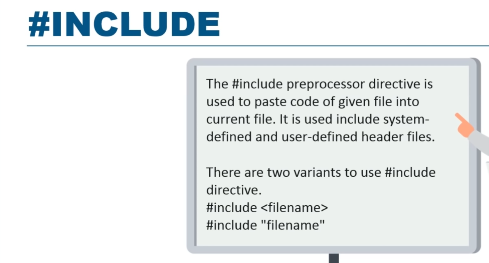

(above) adding \#include statements with angle brackets tells the
browser that the code for the libraries exists in /usr/include. Using
double quotes indicates we are referring to a relative path of some file
we have saved (could also use relative path).

\#DEFINE – Used to define macros

Define function macros

^ the double parens means it will return the result of the expression.

**Example:**

## Using preprocessor Directives to check OS type

# C standardization

The C programming language has evolved through several standards, each
defining new features, improvements, and enhancements. Some of the
significant standards in C are:

**<u>1. C89/C90 (ANSI C</u>**

\- Published: 1989 (by ANSI), 1990 (by ISO)

\- Official Name: ANSI X3.159-1989 or ISO/IEC 9899:1990

\- Significance: This was the first standardized version of C. It
provided a formal specification of the language, which helped in
ensuring that compilers were consistent across different platforms.

\- Key Features:

\- Function prototypes (declaration of function signatures)

\- \`void\` keyword for functions with no return value

\- Improved support for standard library functions (e.g., \`stdio.h\`,
\`stdlib.h\`, etc.)

**<u>2. C99</u>**

\- Published: 1999

\- Official Name: ISO/IEC 9899:1999

\- Significance: C99 introduced several new features that brought the
language closer to modern programming practices while maintaining
backward compatibility.

\- Key Features:

\- Variable-length arrays (VLAs): Arrays whose length is determined at
runtime.

\- Inline functions: Allows defining small functions directly in header
files.

\- New data types: Added \`long long int\` (for 64-bit integers) and
\`bool\` (in \`stdbool.h\`).

\- Designated initializers: Allow initializing structure members by
name.

\- Flexible array members: Allows defining the last member of a
structure as an array with unspecified size.

\- Improved \`for\` loop syntax: Declaration of loop control variables
within the \`for\` loop itself.

**<u>3. C11</u>**

\- Published: 2011

\- Official Name: ISO/IEC 9899:2011

\- Significance: C11 added several new features that made the language
more robust, especially for multithreading and error handling. It also
focused on compatibility with modern hardware.

\- Key Features:

\- Multithreading support: Introduced a standard way to handle threads,
mutexes, and atomic operations (via \`threads.h\` and atomic types).

\- Static assertions: Added \`\_Static_assert\` for compile-time
assertions.

\- Anonymous structures and unions: Allows using structures and unions
without explicitly naming them.

\- Improved support for Unicode: Added types like \`char16_t\`,
\`char32_t\`, and \`u8\` string literals for handling Unicode
characters.

\- Type-generic macros: Improved type flexibility in macros via
\`\_Generic\`.

**<u>4. C17</u>**

\- Published: 2017

\- Official Name: ISO/IEC 9899:2018 (often referred to as C18)

\- Significance: This is largely a bug-fix and refinement update to the
C11 standard without introducing major new features.

\- Key Features:

\- Fixes and clarifications to the C11 standard.

\- Minor improvements to the language's consistency and error handling.

**<u>5. C23 (Upcoming)</u>**

\- Expected Release: 2024

\- Significance: This upcoming version is expected to include more
features, such as enhanced support for Unicode, improvements to memory
safety, and modernization of the language.

\### General Importance of These Standards:

\- Portability: The standards ensure that code written in C can run on
different platforms with minimal changes.

\- Consistency: Standardized libraries and features make the behavior of
C code predictable across different compilers.

\- Modernization: Each standard introduces new features to keep the
language relevant and efficient for modern software development.

These standards evolve based on feedback from the programming community,
technological advancements, and the need to improve language safety,
performance, and usability.

## Optional Curly braces

Curly braces can be omitted for one-line if statements.

They can also be omitted for for-loops, but it should be noted that only
the first line would be considered part of the loop – doesn’t matter if
other lines are indented.

While loops

# Variable declaration

You might see this…

int i, x\[6\], sum = 0;

^ three variables all being declared at once and the last one being set
to zero.

# Program arguments

# Scoping and storage classes

## Global and local variables (extern and static)

**<u>Auto</u>**

This is implied and you don’t need to add it in your code. This is the
default – meaning function/blocked-scoped.

auto int number = 7;

You would only ever add the keyword itself if you want others to know
that it shouldn’t be changed.

**<u>Extern</u>**

Declaring global variables (to be accessed across other files).

Any variable you want to make global just declare with the **extern**
keyword Now other files will be able to access it. I think this only
works in header files.

**<u>Static</u>**

Inversely, the static keyword makes sure a variable is not accessible by
other files.

static int mynumber = 0;

Static variables have a property of preserving their value even after
they are out of their scope. No new memory is allocated because they are
not redeclared – their scope is local to the function to which they were
defined.

It essentials acts as closure-based memorization

- Static is also helpful as it allows you to use the same variables name
  in multiple places while keeping each instance of the variables local
  and context-specific. Commonly used on functions to make sure that
  functions can’t be called from another file.

- Static values are stored on the heap not the stack.

- Can only be initialized with a constant (can’t be the result of a
  function return for example).

- Static variables cannot be declared in a struct.

# Loops

# Data Types and Format specifiers

Padding numbers with:

5 -\> 00005

## Getting size of basic types (with sizeof) and getting limits

Returns size of data type expressed in bytes.

Use the **“%zu”** format specifier.

You can pass in variables as well

The sizeof function always returns a value of the size_t data type.

size_t size = 0;

size = sizeof( char );

but that value is really just an integer that represents the number of
bytes.

You can use the limits.h header file to get more information on data
type sizes

## Typedefs

Typedefs aren’t a new data type, just a name or label for an existing
data type.

typdef int\* i_pointer

i_pointer p; // same as int \*p

## Boolean

By default C interprets logical conditions as binary numbers as in C.

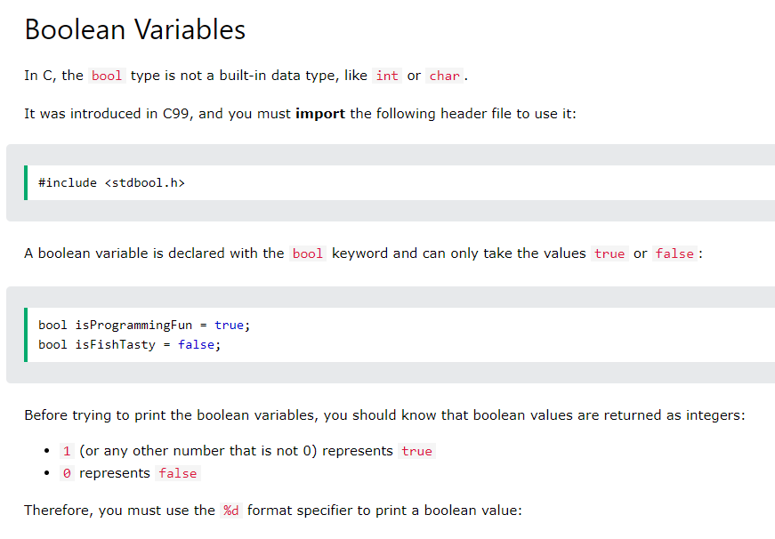

## Integers

The int data type accepts hex values and convert them to a decimal val:

In order to get ints to hold/show their hex val, the data needs to be
stored/displayed as a pointer:

### Integers and 2s compliment

The amount of memory can integer can take up can be 2 or 4 bytes
(depending on the system).

Suppose an integer takes up 4bytes.

**One byte** is 8 bits of memory, meaning a max value of

- Binary: 11111111

- Hex: FF

- Decimal: 255

- Bits: 8.

This means, 4bytes entails…

**Four bytes** is 32 bits of memory, meaning a max value of

- Binary: 11111111-11111111-11111111-11111111

- Hex: FFFFFFFF

- Decimal: 1024

- Bits: 32

So, an integer takes up the hex value from 0x000000 to 0xFFFFFF.

This means, the first half (0x00000000 to 0x7FFFFFFF) will be used for
positive numbers and the second half (0x800000000 to 0xFFFFFFFF) will be
reserved for negative numbers.

Since 0xFFFFFFFF = 4294967295 (our max), this means half of this is our
positive integer limit -\> 2147483647.5 (0x7FFFFFFF).

4294967295 = 4,294,967,295

## Casting

**Converting int to float**

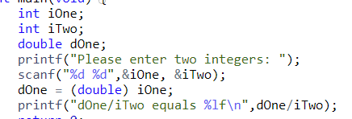

**Printing float from an int on the fly**

**With Malloc**

Malloc returns void so if we wanted to convert that to a pointer so we
can assign it, here’s how we would do it

## Arrays

Arrays are lists of data and do not have their own data type (“array”)
but instead have the same data type as the items in the list (int, char,
etc). Meaning all the items in the array must be of the same type.

Arrays are as big as the elements within them.

It’s important to note that when referencing an array itself (without
specifying an index) we’re really pointing to the address in memory of
the array itself (the address of the first item).

char myarray\[0\];

*<u>Memory address</u>*

Note that myarray + 0 is also the same as myarray and both represent the
memory address of the first item in the array. This implies that
myarray + 1 represents the address of the second item in the array.

Because of this, there is no need for an ampersand like so &myarray to
get the address you can just use myarray.

This implies that &myarray\[2\] is the same as myarray + 2 (the ‘2’
meaning move two more bytes over in memory).

*<u>Getting values stored at an address in memory</u>*

This also means that\* (myarray + 0) is the same as myarray\[0\].

Meaning \* (myarray + 1) is the value of the second item in the array
(using the ‘\*’ operator to get the value at an address).

Given the fact that the unary operator “\*” (‘indirection operator’)
gets the value stored in an address, this means that these print the
same thing

### Multi-Dimensional Arrays (matrices)

A nested array, must be declared as a pointer of the same types of the
arrays it contains.

For example, if you have two arrays, each containing characters (char)
then you can create a new array to hold those arrays. That new array
must be a char pointer.

You can also define an “matrix” as follows:

^ Two row consisting of three columns each row ^

### Char

### Variable Length Arrays

Just means we’re using a variable to determine the array:

Int myfavnumber\[numcount\];

### Strings

#### Declaration

**Arrays need to have a number specified if the values are defined later
a later time. If you are both declaring and defining an array, the
number can be omitted.**

Important notes:

- String arrays must have a length that exceeds the length of the text
  we want inside by one character. This is to make room for the bull
  character.

- A string doesn’t have to be changed one character at a time. For
  example, you can use the scanf function to redefine the string in one
  go. If the string is redefined, the null char will be moved to the end
  of the new string.

  - If the string is redefined to be a shorter string, the values at the
    old indexes which used to have values (when the string was longer)
    will still have those values.

- A string will use the same amount of space (1 byte/array) even if all
  the spaces in memory aren’t used.

#### Defining, Reading, and the null character

Note, since the last chat must be our string terminator (the null
character - \0), we have to make sure our array length is one unit
longer than the numbers of chars in the array itself. For example, a
string (char array) of 3 letters, we need to create a char array with a
length of 4 – to account for our null character.

Note: The null character will automatically be added to the last index
if using scanf to define the string.

char text\[4\]=”ABC”

^ 4 is the LENGTH of the array, not the last index. The last index is
will 3 and should contain the null char (which it will by default as
long as your string text is 3chars or less – leaving room for the null
char).

^ Notice two important things

- **We don’t add the ampersand in the scanf function** (because the
  ampersand means we want to save our value in the pointer location
  (memory address) of our char array. But the whenever getting the
  memory address of an array, it always returns the memory address of
  where the array beings – i.e., the address of the first index. And we
  don’t want to save our values all in that one location). Instead, we
  want to map the values inputted into the addresses of the array
  itself.

- **The format specifier used in the %s character**.

Adding angle brackets just to see the null char is indeed a character:

#### Null Character – stopping the string early

Anytime the null character is encountered, C will think this is the end
of the string and stop reading any subsequent indexes. In this example
we manually add the null char to prove this.

#### Fixed-length vs nonfixed-length strings

Strings can be defined with a fixed length or nonfixed-length but need
to be initialized with a value (even if only an empty string).

##### Fixed

*Method 1: Without allocating memory manually*

char name\[4\]="Joe";

*Method 2: Allocating memory manually (using a pointer)*

Then free up memory later

##### Non-Fixed (building a string array)

Note: C prefers double quotes – not sing-quotes.

*Manual defining of a string array*

*Dynamic defining of a string array*

Example: building a string array using user input from **scanf** method

Using scanf to build a string array causes the string array to re-size
itself and re-apply the null char at the end.

But beware! Previously used mem addresses still contain their old value!

This is because non-fixed length arrays keep the largest size its ever
been defined to have. We’re still using the same “word” (string of
addresses in memory – 1byte for string for example).

#### Printing strings

Print strings with %s format specifier. This loops through every char in
array and prints until it hits the null terminator.

#### Get string length (manual)

Count until we hit null character

#### String library

We can also use the string library as well.

**\#include \<string.h\> : string library**

##### Getting string length (with strlen)

##### Joining Strings

##### Validating Strings

##### Converting string to/from different data type

##### Finding Substrings

##### Copying strings (with strcpy and strncpy)

**strcpy**: Copy the second array into the second:

What you will notice here is although the **sizeof** operator will still
show the same number of elements as before (19) yet the **strlen** will
have dropped down to 14 because its look for the first “\0”.

**strncpy**: Copy just first five character of second string into first
string.

What you will notice here is although the **sizeof** operator will still
show the same number of elements as before (19) yet the **strlen** will
have dropped down to 5 because its look for the first “\0”.

### Array of strings

This means create an array of 3 items (words) where each item has a
length of 10 (including null char)

Building an array of strings from user input

### Flexible Array Members

Example

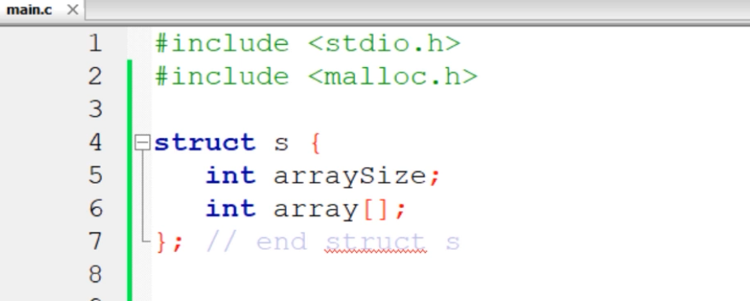

## Struct

### Declaring a struct

<https://www.youtube.com/watch?v=gt9YPl6O9ZM&list=PL98qAXLA6aftD9ZlnjpLhdQAOFI8xIB6e&index=26>

They are declared **<u>OUTSIDE</u>** of the **main()** function.

Another

### Creating instances of a struct

#### Method 1 \[Good\] Declare an instance then define it separately

#### Method 2 \[better\] Declare instances while declaring the struct and define instance later

Create struct instances upon defining the struct:

Then define the instances later

#### Method 3 \[even better\] Declare and define instances at the same time using a one-liner to define instances.

Struct instances can also be defined as one-liners (instead of dot
notation):

*(use dot in key preceding the variable name).*

#### Method 4 \[even better yet\] Use instance aliases when declaring struct itself and define instances later 

If typing out “struct” for each instance is too cumbersome, we have
another syntax where we can add an alias by adding a typedef. In this
example, our struct is still “Person” but we’re adding an alias called
“person” which allows us to use “person” as its own datatype.

So instead of declaring instances using

struct Person person1

*(as we would if we didn’t use a typedef)*

we can just use

person person1;

^ Even though we are using a cleaner method to ***declare*** an instance
we are still using dot notation to ***define*** an instance.

We can clean it up even more

#### Method 5 \[Best\] Use instance aliases when declaring struct itself and define instances later in one-liner 

### Defining multiple struct pointers

### Char arrays in pointers

Points ^6 and \* are the most import here

Defining a character array

OR

Defining a pointer array

### Passing into functions

The param on the function must be of type struct and you must specify
your prototype

**<u>Passing by value</u>**

Note (above): The struct is being passed by value, meaning it is being
copied and used inside the function. This may not be ideal if we have a
large struct and it uses a good deal of memory. We may instead decide to
pass by reference (using a pointer).

**<u>Passing by reference (using pointers)</u>**

**A better way to reference!**

*can be replaced by this:*

The arrow (‘-\>’), serves to dereference a pointer!

And here’s the same for values that DO need the ampersand (if you need
the memory address) for the scanf function

### Referencing and dereferencing structs with -\>

Key points:

- Pointers need to be dereferenced to get the value being stored.

- To dereference a pointer (and retrieve the saved value) to a number
  just add another “\*” before the pointer.

  - 

- To dereference a pointer to a string (char array) number just add
  another “\*” before the string. Because remember, a char array is
  already a pointer.

  - 

### Pointing to Structures

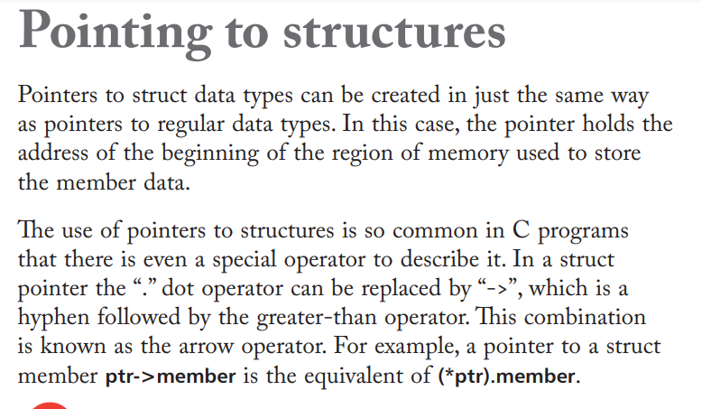

- Dereferencing a pointer to a ***struct***

  - Usually we would just throw a ‘\*’ before the pointer and be done
    with it.

  - However, structs can have their properties accessed with dot
    notation.

    - person.name;

  - And if a struct \[ if passed as a pointer into a function then it
    look like this

    - \*person;

  - Accessing a property of a struct would look this this

    - (\*person).name

  - Instead of throwing another asterisk before…

    - <s>\* (\*person).name</s>

  - We could use the dereference operator (-\>)

    - person-\>name

  - Getting the memory address

    - &(\*person).name

  - Getting the memory address using pointer

    - &person-\>name

### Printing size of struct

Size of struct is at least the size of the sum of the elements that make
up the struct

### An Array of structs

#### Pass-by-reference

#### Pass-by-value

**<u>Declaring now and defining later</u>**

**<u>Declaring and defining in one step</u>**

### Struct linked list

<https://youtu.be/t5NszbIerYc?si=e1HSuEFjVHCeBkUQ>

### Dynamically allocating memory for structures

## Struct vs Union

## Enums (enumeration)

Custom data type where you can define a fixed number of possible values.

^ if someone created a “shoeSize” variable (as above) it can only take
one of the values specified in the enum declaration. This is because
this variable is prefixed with the data type enum Size.

Behind the scenes, each possible value is called an “Integral Constant”
and has a distinct value.

This is why this outputs “3” when printed:

However, if you initialize the first one with value other than zero, for
example:

Enum Size {

Small = 1,

Medium,

Large,

ExtraLarge

}

Then the subsequent options will have their value (Integral Constant)
updated to follow the preceding one. So in this case, specifying Small =
1 causes Medium to be 2, Large to be 3, and so on.

You can customize the Integral Constants upon declaration as well:

And as with structs – you can predefine some variables that will be
enumerated:

## “Designated Initializers” (default values for arrays and structs)

**Structs**

**Array of structs**

# Pointers

<https://www.youtube.com/watch?v=KGhacRRMnDw&list=PL98qAXLA6aftD9ZlnjpLhdQAOFI8xIB6e&index=23&t=350s>

## IMPORTANT NOTE

**Note that the type of the pointer has to match the type of the
variable you're working with.**

**Example:**

Int age = 21;

Int \* agePtr = &age;

char name = “B”;

char namePtr = &name;

## Getting/Printing/Dereference Memory Addresses

**<u>All-In-One</u>**

**<u>Getting/Printing Memory Addresses</u>**

^ adding the \* after int means this is special type of int data type,
namely, one that holds a memory address in hex. **Note that the type of
the pointer has to match the type of the variable you're working with
(doesn’t always have t ob.**

The \* can also be touching the int keyword

or the variable name

**<u>Dereferencing the value from a Memory Address</u>**

Just put star in front of mem address (doesn’t matter if it’s a pointer
or an ampersand-prefixed variable) – this means go to that address and
read what value is saved there. This isn’t read-only, once dereferenced,
you can do anything you would normally do with a variable (including
updating the value itself).

---------------------------------------------------------

You can print a memory address with the “%p” qualifier.

This will print out a memory address in hex.

Full example:

## Storing user input into a memory address

^ This means…: accept a digit (“%d”) and save the value into the
**&age** memory address (which is the memory address where age is
stored.

## Pointer Variables

A pointer variable stores the memory address of a variable – not the
value. It’s still considered an int (even though it’s hex) but we just
have to add an asterisk to let C know it’s a special type of “int” – a
hex.

To define a pointer variable…

- Initialize the variable with a data type of **int\*** (or **char\*** -
  or what have you).

- Set the value to a memory address (an ampersand followed by a variable
  name).

Example: int\* ptr = &age;

**<u>Another Full example</u>**

## Access/change a value using a Pointer

To access the value that a pointer points to, just prepend the pointer
itself with an asterisk “\*”.

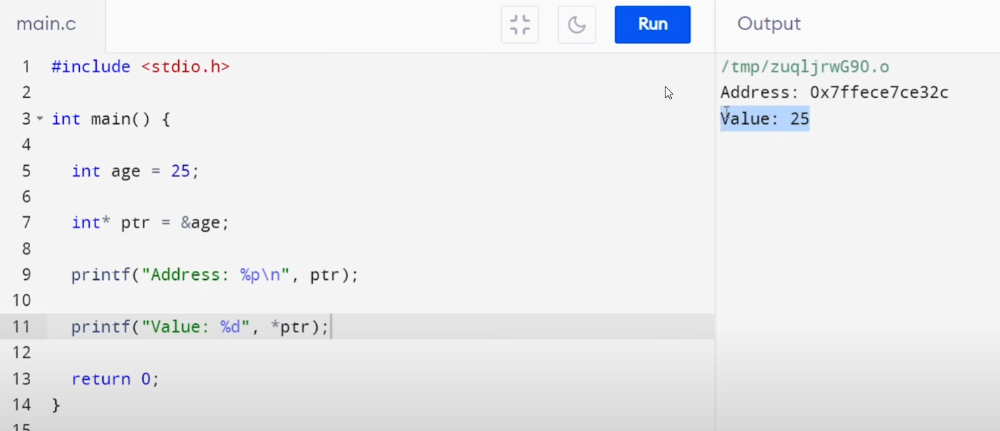

Change the value of a pointer variable.

**Exercise**: Both of these point to the same thing (memory address):

## Pointers and Functions

**Send pointer as an argument**

Parameter type must be int\* to accept pointer:

^ here we are passing in a pointer and then changing the value
associated with that pointer.

**Return a pointer from a function**

The return data type of our function must be **int\***

*Another example:*

## Function Pointers

## Pointers and Arrays

<https://www.youtube.com/watch?v=LscgaBzlGdE&list=PL98qAXLA6aftD9ZlnjpLhdQAOFI8xIB6e&index=24>

### Referencing arrays: Memory addresses and pointers

**<u>KeyPoint</u>**: A pointer to an array **<u>just is</u>** the array
itself since arrays passed-by-reference.

**Full example**

- The address of an array is the address of it’s first element.

- Referencing an array without an index, always refers to the address of
  the array itself (first element) – which is always a pointer.

- You can use **array + 1** to print the address of the second element
  in the array and qo to print the address of the third element, and so
  on. Technically, “+1” means – “add 4 bits to the address memory”.

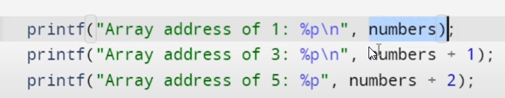

Example:

### Accessing values from our array (pointer)

To get mem address of an array, you don’t need to add an ampersand, just
pass in the array name:

^ because an array **<u>just is</u>** a memory address/pointer.

Print the first value in an array with…

\*myarray

To get other index values … (parens required)

\*(myarray + \<offset\>)

Or… if you have a pointer to the array, you can just use that as another
way of accessing the array itself since the first

int arr = {23,8,47};

ptr\[0\] = 0;

The above proves that incrementing a memory address by “1” increases the
address by 4bits (unlike in assembly). This means it takes you to the
next element in memory.

A more complex example:

Notice how as ptr is increased we are taken to the next element in the
array. This is because ptr is an address in memory so each increase
takes us to the next element in memory. And when we print \*ptr we are
printing the value of whatever is at the memory location named “ptr” –
which just is the next item in our array .

**<u>Practice Quiz</u>**

### Pointer Arithmetic: Change values from our array pointer 

Change second item in array (pointer arithmetic – add in pointer units,
based on whatever the pointer points to)

^ (parens required otherwise you’re just dereferencing ptr adding that
val to 1)

Change value of first and last elements:

You can also add values to a pointer variable to change indexes:

**Answer:** 3

Traverse one index over:

Int \* ptr;  
ptr = &array\[0\];

ptr +=3; // Move 3 spaces ovrt.

**Multi-dimentional Array**

To make a multi-dimensional array, just create a pointer:

int numsArr\[3\] = {1,2,3};

int numsArr_10\[3\] = {10,20,30};

int \* assocArr\[2\] = {numsArr, numsArr_10}

Getting “20” from assocArr:

Int found = assocArr\[1\]\[2\];

### Accepting+ modifying arrays as function arguments (3ways) 

**<u>Pointer-based</u>**

**<u>Index-based</u>**

**<u>Array-Based</u>**

### Quiz Qs

**Answer**: 0

**Answer:** 8

**Answer:** Random and depends on what was stored at this memory address
before.

**Answer:** 3

# Functions

You don’t need to add type definitions for arguments, but you do for
defining parameters and defining functions (to define return value).

**Defining prototypes**

If our functions are defined after the main func, we have to set
function prototypes of these function to let the compiler know that this
function is indeed defined further down (param types must match).

You can include the variable name as well, but that’s optional:

**Functions in modules**

If you are in one file (“A.c”) and calling a function that was defined
in another file (“main.c”), you need to add a function prototype into
the new file you intend to use it in.

*File: “A.c”*

int fun();

void fun2(){

fun(); // where fun is defined in main.c

}

# Memory Management

## Data Segments

## When to use Heap or stack?

**Stack**: Just declare variables as needed and they will automatically
use the stack and be cleared once they are no longer needed.

**Heap**: Use malloc and free (and other functions) to allocate memory
as needed.

## Dynamic memory in the Heap (manual memory management)

<https://www.youtube.com/watch?v=Dn87Bna23TQ&list=PL98qAXLA6aftD9ZlnjpLhdQAOFI8xIB6e&index=28>

Variables is represented as static memory and is stored on the call
stack. The program automatically releases these items from memory once
these items are no longer in use by the program. By contrast, Dynamic
memory is stored on “the heap” – a special (larger) place in memory on
the system where items are manually allocated/freed of space on the
system.

Using free/malloc require including the stdlib library

**<u>Why bother with manual memory management? \[Wiki\]</u>**

Src: <https://en.wikipedia.org/wiki/C_dynamic_memory_allocation>

The [C programming
language](https://en.wikipedia.org/wiki/C_(programming_language)) manages
memory [statically](https://en.wikipedia.org/wiki/Static_memory_allocation), [automatically](https://en.wikipedia.org/wiki/Automatic_memory_allocation),
or [dynamically](https://en.wikipedia.org/wiki/Dynamic_memory_allocation).
Static-duration variables are allocated in main memory, usually along
with the executable code of the program, and persist for the lifetime of
the program; automatic-duration variables are allocated on
the [stack](https://en.wikipedia.org/wiki/Call_stack) and come and go as
functions are called and return. For static-duration and
automatic-duration variables, the size of the allocation must
be [compile-time](https://en.wikipedia.org/wiki/Compile-time) constant
(except for the case of variable-length automatic
arrays[\[5\]](https://en.wikipedia.org/wiki/C_dynamic_memory_allocation#cite_note-5)).
If the required size is not known
until [run-time](https://en.wikipedia.org/wiki/Run_time_(program_lifecycle_phase)) (for
example, if data of arbitrary size is being read from the user or from a
disk file), then using fixed-size data objects is inadequate.

<u>The lifetime of allocated memory can also cause concern. Neither
static- nor automatic-duration memory is adequate for all situations.
Automatic-allocated data cannot persist across multiple function calls,
while static data persists for the life of the program whether it is
needed or not. In many situations the programmer requires greater
flexibility in managing the lifetime of allocated memory.</u>

These limitations are avoided by using [dynamic memory
allocation](https://en.wikipedia.org/wiki/Dynamic_memory_allocation), in
which memory is more explicitly (but more flexibly) managed, typically
by allocating it from the *free store* (informally called the
"heap"),\[[*citation
needed*](https://en.wikipedia.org/wiki/Wikipedia:Citation_needed)\] an
area of memory structured for this purpose. In C, the library
function malloc is used to allocate a block of memory on the heap. The
program accesses this block of memory via
a [pointer](https://en.wikipedia.org/wiki/Pointer_(computer_programming)) that malloc returns.
When the memory is no longer needed, the pointer is passed to free which
deallocates the memory so that it can be used for other purposes.

The original description of C indicated that calloc and cfree were in
the standard library, but not malloc. Code for a simple model
implementation of a storage manager
for [Unix](https://en.wikipedia.org/wiki/Unix) was given
with alloc and free as the user interface functions, and using
the [sbrk](https://en.wikipedia.org/wiki/Sbrk) system call to request
memory from the operating
system.[\[6\]](https://en.wikipedia.org/wiki/C_dynamic_memory_allocation#cite_note-6) The
6th Edition Unix documentation gives alloc and free as the low-level
memory allocation
functions.[\[7\]](https://en.wikipedia.org/wiki/C_dynamic_memory_allocation#cite_note-7) The malloc and free routines
in their modern form are completely described in the 7th Edition Unix
manual.[\[8\]](https://en.wikipedia.org/wiki/C_dynamic_memory_allocation#cite_note-8)[\[9\]](https://en.wikipedia.org/wiki/C_dynamic_memory_allocation#cite_note-9)

Some platforms provide library or [intrinsic
function](https://en.wikipedia.org/wiki/Intrinsic_function) calls which
allow run-time dynamic allocation from the C stack rather than the heap
(e.g. alloca()[\[10\]](https://en.wikipedia.org/wiki/C_dynamic_memory_allocation#cite_note-10)).
This memory is automatically freed when the calling function ends.

### Malloc (memory allocate)

Use malloc to allocate 1 unit (byte) of memory with: malloc(1)

Import standard library

Even better, allocate by the size of the data type you’re working with:

^ free enough space for three units of ints.

Malloc returns the address in memory so that we could use that but we
need to cast it as the proper data type:

^ casting as a double

Allocating space for a struct called “point”

*Example*

#### Allocate memory for an array

Just allocate memory for the sum of all the elements in the array.

^ we know a pointer to an array will be returned because malloc knows
the base size is an int (since we have an int pointer expected as the
return value) and we just divide the amount of space being allocated by
malloc but the amount of space per “int” in this example. More than one
item to be easily divided means we should expect an array of items back.

**Handy function**

If the number “3” was passed in, that means 3 ints (12bytes, ints are
4bytes each on this machine and we want 3 ints). These bytes are shown
as white below:

^ the prefixing red blocks are 4bytes representing how many bytes are
used. It’s showing “10” because that’s hex for 16 – 16 bytes are being
used :12 for ints (white) and four the four suffixing 4bytes at the end.
The suffixing four bytes represent how much space is left on the heap
after allocating this space.

***More…***

^ In the above, prt holds the first address in memory of the memory
allocated using **malloc**.

**Storing input**

You can print those values with…

#### Error Handling

There are times when the malloc function fails – in this case the malloc
function returns **NULL**.

#### Dereferencing values from malloc

The malloc function returns a void value, but we can cast that into a
pointer variable of the proper type. That is to say.”this is a pointer
to an integer” etc.

Save the return value from malloc into a pointer variable. Make sure to
cast the value to the proper type:

^ Since we’re casting, be sure to keep the parens around the pointer -\>
(float \*)

**Full example**

#### Malloc and void pointer

### Freeing memory with free()

Once your program is done, you can free the memory assigned with malloc
with the free function.

*Full example:*

**<u>Detailed Notes</u>**

Just pass in the **pointer** to free function (common to free anything
unfreed before end of main):

**<u>Important note</u>**: Once a variable is cleared, is still might
reside at its original address if it’s referenced shortly after being
freed. The space in memory is merely marked as “free to use” for other
applications. But if no other programs need to use that then it will
still be there.

You can demonstrate this by feeing a variable, and creating a similar
variable of the same type immediately after. You’ll see that the same
space in memory is used for the new variable.

### calloc()

### realloc()

Change the amount of memory that was initially allocated with malloc.

# GoTo

# STDIN/STDOUT

## Flushing stdout

If you are using printf and you aren’t adding a newline at the end, your
program might experience some odd behavior. Printf works by printing a
buffer to the scree. A buffer is marked as ended by the presence o f a
newlines character. Since we’re not adding this. Commands will continue
to print to screen even though you printf might have already printed
what is was supposed to.

To avoid this, either use a newline OR flush stdout by running
fflush(stdout) immediately after calling each printf (that doesn’t end
in a newline). This tells the printf buffer that we’re done and the
buffer can be written to std out.

## STDOUT (Writing)

printf, putchar, and puts

- printf: print string (doesn’t add newline)

- puts: prints string and adds newline

- putchar: pring char

### Writing characters

#### fput

#### puchar

#### scanf

**<u>General</u>**

Scanf expects a memory address for most things so you can save values
into a variable by prefixing with an ampersand except when saving
strings (char arrays).

^ This means…: accept a digit (“%d”) and save the value into the
**&age** memory address (which is the memory address where age is
stored.

**<u>Reading char (%c)</u>**

##### Reading a single character

##### Storing multiple values separately

**Reading Numbers**

^ you can space-separate or hit enter to separate numbers. C (scanf
function) ignores whitespace so as long as the numbers aren’t directly
adjacent, it should work fine.

^ like this the program would expect space-separated values.

Expecting comma-separated values

**Reading Chars**

^ Noticed how unlike numbers, here space matters because a spaces are
considered chars. So passing two chars means no spacing.

If you want to accept space separated chars, just make sure your scanf
function accepts the values in the same pattern

Doing it with commas

### Writing Lines

#### printf (doesn’t add newline)

Use **“%c”** to print the character and **“%d”** to print the ASCII
value:

#### puts (adds a newline)

## STDIN (Reading)

### Reading characters

#### scanf

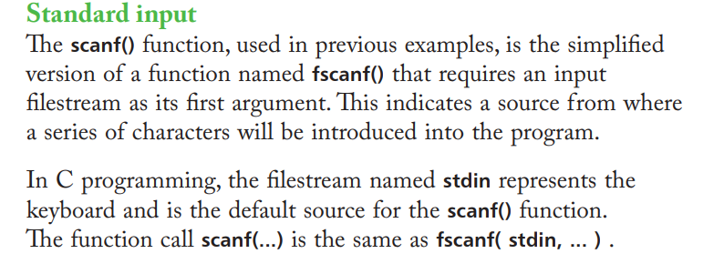

### Reading Lines

These ^ are preferred over scanf when reading strings, because scanf
uses white space to separate input into multiple inputs. This can be
very dangerous if you are accepting a string and one of these other
methods should be considered instead.

#### Getline

#### Realine

#### Fgets

### Reading Files

#### Reading from a file as input

If you know how many requests for user input are needed then you can
match that up with a file with lines of text equaling that number. Then
we can use ca to pipe the input to our program.

Can do the same with redirection

# File Handling

## Creating a file

## Reading/Writing one character at a time

## Reading/writing a file one line at a time

**Opening and Reading**

- Initialize a file pointer (fptr) with **FILE\***.

- If your file cannot be opened, the pointer will be set to **NULL**.

- Then use **fopen** to read your file.

  - fopen \<file\> \<mode\>

- Use **fgets** to read the file (gets string – fgetc read a single
  char).

  - fgets \<var_name\> \<max_num_chars/line\> \<mem_address_to_read\>

  - 

- Close your file with fclose

  - fclose \<file_pointer\>

### Reading with fgets

### Writing with fputs

^ fgets loops through each line – for 1000 characters. Fgets only gets
one line – you can loop through fgets as the file pointer will keep
changing allowing you to read each line. This is also why you can’t read
the same file twice without closing it once. After the first read, the
file pointer will stay at the end of the file.

### Example showing fgets and fputs

## Reading/writing entire files with fread/fwrite

## Reading/writing from a filestream of your choice using fscanf and fprintf

*Note: How much you read determines the last file pointer position*

**<u>Reading a file</u>**

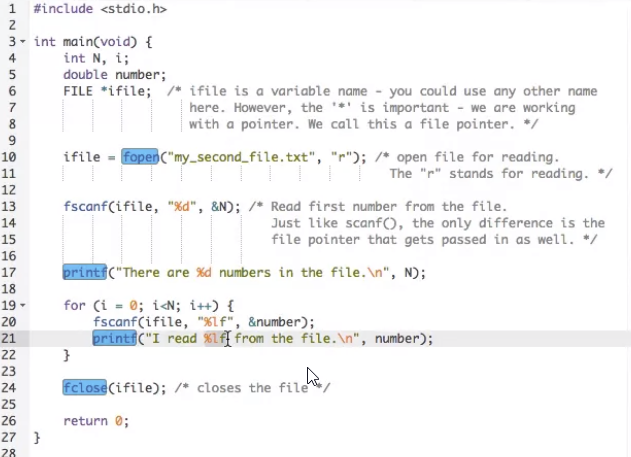

**<u>Using fprintf (and accept user input)</u>**

**<u>Read until the end of the file</u>**

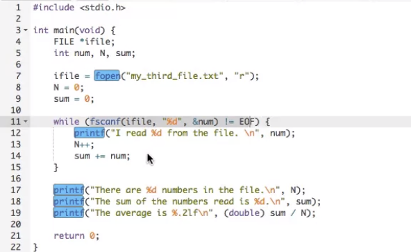

# Process, Forking, and Zombies

**Quick Vids**

<https://www.youtube.com/watch?v=ss1-REMJ9GA>

<https://www.youtube.com/watch?v=kDxjcyHu_Qs>

<https://www.youtube.com/watch?v=xJ8KenZw2ag>

<https://www.youtube.com/watch?v=TJzltwv7jJs>

<https://www.youtube.com/watch?v=IGW8-yeYRgI>

# Debugging

<https://www.youtube.com/watch?v=Dq8l1_-QgAc>

## Reporting Errors

# Generating Random Numbers

# Dates and Times

# Running a Timer

The critical part here is the end_wait variable.

- clock() – number of clock “ticks” since the program began.

- CLOCKS_PER_SEC – Returns the number of clock ticks per second on this
  system.

With those two bits of info we can calculate the number of clock ticks
we should reach given a certain number seconds – and we can just created
a while loop that does nothing until that count is reached.

# Compiling

## Compiler Phases: What steps the compiler takes

1.  **Object files are created**.

2.  **Linking of object files.**

3.  **Converting into a binary**

## Step-by-step compiling in practice

### Step 0: Pre Checks

- If you have multiple c files that you’re linking together, make sure
  only one file has the main function.

- All files must have preprocessor directive if including libraries.

All other files must contain one or more functions which can be defined
in the main file (or a header file) and called from the main file.

### Step 1: Managing Local Modules

If you plan to import local files (“modules”) into your main program you
need to do the following:

**<u>Create your header file “.h” to hold the function prototypes</u>**

This file needs to be included in any source files where the functions
defined here are called (using \#include “other.h”).

The bits in green are good practice to ensure that we don’t include the
same header file multiple times (avoid recursive errors among other
things).

*Remember, header files don’t need a main function.*

*More on header files*:
<https://youtu.be/tOQZlD-0Scc?si=1Fk8CihJOBeLvSk1>

Header files are also used to define structs as well

struct Node {

int data;

struct Node\* next;

};

void display(struct Node\* temp);

**<u>Create your source “.c” file (same name file just different
extension)</u>**

Include your header file (**\#include “other.h”**) and define the
functions in this file.

“Include” preprocessor directives are replaced the contents of their
respective header files (“.h”).

\#include “other.h” *\<- this line will be replaced with the contents of
this header*

**<u>Include your header file and use function in your main file</u>**

Another example:

### Step2: Creation of any necessary object files

Using gcc without the “-c” flag causes the compiler to first compile
everything into machine code by creating object files then as a second
step it converts that machine code into a binary.

gcc myprogram.c -o myprogram

However, you could break this up into two steps if you want (i) to build
your object file(s) and (ii) to build the binary.

gcc -c myprogram.c -o myprogram.o *(creates an object file named
“myprogram.o”)*

gcc myprogram.o -o my program *creates a binary named “myprogram”*

So if you wanted to created any object files, this would be the step to
do so.

*<u>Note on object files</u>*

Object files are files that are the result of the program being compiled
down to pure machine code. This “object” file is not itself an
executable file. This is the same as compiling with the “-c” option.

^ that file (program.o) is binary and trying to read it results in a
mess of characters to stdout.

Each .c file can be compiled into an object file but only one object
file should have the main function. During the linking phase, an error
will be thrown if you’re trying to link all object files together and
more than one main function is detected.

### Step 3: Building the command | Including your object files

gcc -o \<program\> \<file_to_link.o\> \<file_to_link2.o\>…

Object files are joined by the llinker and converted into an executable.

**Example**: weatherstats.c and program.c have already been compiled
into an object files using the “-c” option.

The command to build the binary from those object files:

### Step 4: Building the command | Adding External Libraries

If you are using external libraries into your program be sure to add
headers and specify the external libraries when compiling.

- **Header Files (.h):** /usr/include/\*

  - These are bits of C source code which helps use specific libraries
    in our program.

  - Every header file has an associated library file. We need both to
    use an external library.

- **Libraries/Object Files (.so)**: /usr/lib/\*

  - These are compiled binaries which contain the actual code for this
    library to work.

*Example*

- \#include \<math.h\> in program

- gcc -lm myprogram.c in cli

#### Step 4A: Add C headers

C libraries can be found in /usr/include, these are “header” files and
thus end in “.h”.

The math library is found in /usr/include/math.h and can be added to
your code as

\#include \<math.h\>

**\#include** statements with angle brackets tells the compiler that the
code for the libraries exists in /usr/include. Using double quotes
indicates we are referring to a relative path of some file we have saved
(could also use absolute path).

#### Step 4B: Add libraries

Most libraries are in /usr/lib and can be referenced when compiling by
adding it as an argument without any preceding option flag.

Example: adding math library

gcc myprogram.c /usr/lib/libm.a -o myprogram

A shorthand way writing external libraries exists to make things much
easier is just to add “-l” followed by the library name.

Adding /usr/lib/mylib.so becomes -lmylib

*<u>How did we know it was “libm.a?”</u>*

External libraries always follow this format: /usr/lib/lib\*.a

Where ‘\*’ represents a letter, in this case ‘m’ for math. It should be
noted that the default path is /usr/lib so the bit of the path is
assumed and shouldn’t added. Though you could change the default path to
use with -L /usr/ib

With the shorthand /usr/lib/libm.a becomes -lm

Shorthand Steps (using the example of ‘/usr/lib/libm.a’):

- Remove file extension **libm.a -\> libm**

- Remove “lib” prefix from filename. **libm -\> m**

- Prepend to the “l” option. **m -\> lb**

Example: If we’re adding the /usr/lib/libm.a (math library) we can
compile like so

gcc myprogram.c -lm -o myprogram

*^ Note above how “/usr/lib/libm.a” becomes “-lm”*

However, some (and custom) libs don’t follow this format so if in doubt
just check the name in the /use/lib dir.

*<u>Why do we need to link?</u>*

Since the math library is not part of the standard library, it need to
be linked (using a cli option) and imported (using an include header).

### Step 5: Running your final command

If you have multiple sources files “.c” be sure to specify each one and
you don’t need to include any “.h” (header) files in the compiling step
as they should already be called into yout “.c” files.

Common practice to compile all “.c” files using gcc \*.c -o main

Verbose (good for debugging)

- -std=c11 – Use the C11 Standard when compiling (c99 is widely used as
  well).

- -Wall – “Warnings All”. Show all basic warnings.

- -Wextra – Show all extra/advanced warnings.

- -fmax-errors=10 – Stop compiling after 10 errors found.

- -o \<file\> - output filename.

- \<files\> - source code (C).

## Making a Makefile

<https://makefiletutorial.com/>

- A Makefile automates the process of creating object files and linking
  those files together to make an executable.

- The name is fixed and much be “Makefile”.

- The program **make** reads instructions from the **Makefile** it finds
  in the pwd.

**<u>Makefile structure</u>**

target (what is to be produced): what is needed to do so

how to produce

^ That space there must be a TAB (not a space or group of spaces,
Makefiles only work with tabs).

**<u>Makefile structure (example)</u>**

program: program.o myutils.o

gcc -std=c11 -Wall -fmax-errors=10 -Wextra program.o myutils.o -o
program

program.o: program.c func_protos.h

gcc -std=c11 -Wall -fmax-errors=10 -Wextra -c program.c -o program.o

myutils.o: myutils.c

gcc -std=c11 -Wall -fmax-errors=10 -Wextra -c myutils.c -o myutils.o

^ save in a file as Makefile

**<u>Elaborate Makefile</u>**

## Working with Static and Dynamic libraries

### Creating a dynamic library

### Creating a static library (bundle of object files)

**Format**: ar rcs \<libraryname\> \<objectfiles\> …

**Example**: ar rcs libweather.a weather1.o weather2.o

This results in a single file that contains all of your external code
boiled down to machine code.

Now if you want to compile, you just need your main object file and this
one additional object file (instead of multiple additional object files
– potentially).

**Example:** gcc -o program program.o libweather.a

**Alternative:** gcc -o program program.o -lweather -L.

(above) note the “-L.” just says look for the “weather” library in the
current dir (adjust as needed).

## Readlelf

The readelf command is **a powerful utility in Linux used to display
information about ELF (Executable and Linkable Format) files**. ELF is a
standard file format for executables, object files, shared libraries,
and core dumps in Unix-like systems.4 The readelf command provides
detailed insights into the structure and contents of these files,
including headers, sections, symbols, and other critical information.1

Some of the most commonly used options for the readelf command include:

- -h or --file-header: Displays the ELF file header, which contains key
  information about the file's structure.1

- -S or --section-headers: Lists all the sections in the ELF file,
  showing details about each section's address, size, type, and
  attributes.1

- -l or --program-headers: Displays the program headers, which describe
  the segments used at runtime.1

- -s or --syms: Shows the symbol table, including symbols defined and
  used in the ELF file.1

- -r or --relocs: Displays the relocation sections, showing how the
  binary modifies itself at runtime.1

- -d or --dynamic: Displays the dynamic section, which contains
  information about dynamic linking.1

- -n or --notes: Displays core notes, which include metadata such as the
  build ID.1

- -V or --version-info: Displays the version information of
  the readelf command.1

- --help: Provides a help message listing all available options for
  the readelf command.

## Otool (disassemble executable)

<https://www.youtube.com/watch?v=yOyaJXpAYZQ>

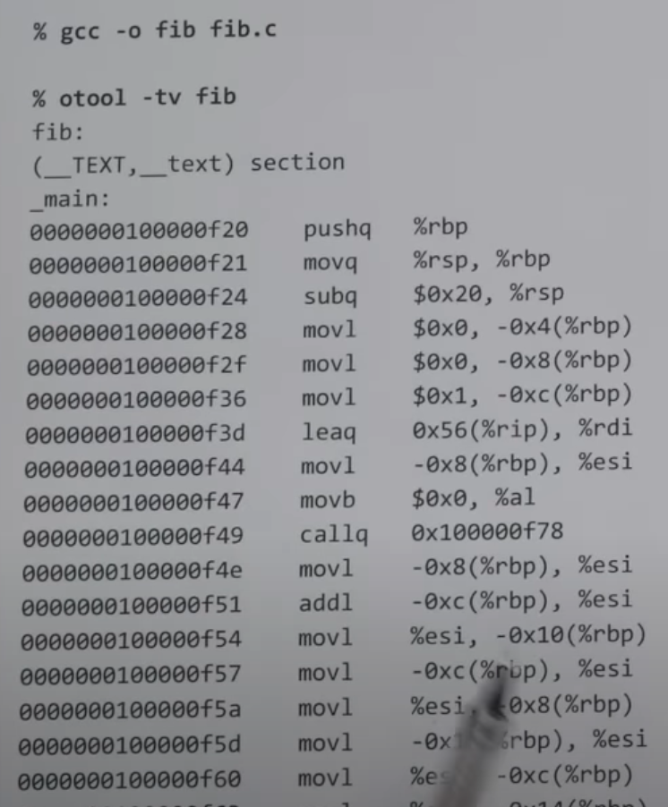

## Objdump (disassemble executable)

You can disassemble an executable compiled with the -g flag using
objdump to retrieve the assembly code, but let’s clarify what this
process entails and what you can expect.

The -g flag in compilers like gcc or clang includes debugging
information in the executable, such as source code line numbers,
variable names, and symbol tables, typically in a format like DWARF.
This debugging information makes the executable more informative when
analyzed with tools like objdump, gdb, or other debuggers. However,
disassembling with objdump doesn’t directly rely on -g to produce
assembly code—it’s more about the executable’s machine code being
translated back into assembly instructions.

Here’s a breakdown:

1.  **Disassembling with objdump:**

    - The objdump tool, part of the GNU Binutils, can disassemble an
      executable’s machine code into assembly language using the -d
      (disassemble) or -S (source-interleaved disassembly) option.

    - Command example: objdump -d executable will output the assembly
      code for all executable sections.

    - If the executable was compiled with -g, using objdump -S
      executable will interleave the assembly with corresponding source
      code lines, making it easier to understand the relationship
      between the high-level code and the assembly.

2.  **Role of -g:**

    - The -g flag embeds debugging symbols, which include mappings
      between machine code addresses and source code lines, function
      names, and variable information.

    - Without -g, objdump -d can still produce assembly code, but it
      will lack source code context and may not include function or
      variable names (unless symbols are retained, e.g., without
      stripping).

    - With -g, objdump -S provides a more readable output by showing the
      original source code alongside the assembly, assuming the
      debugging information is present.

3.  **Limitations:**

    - **Not full source code recovery:** Disassembling doesn’t recover
      the original high-level source code (e.g., C or C++); it only
      translates machine code back to assembly. The -g flag helps by
      including source code in the output, but only if the source files
      are available or embedded.

    - **Optimization effects:** If the executable was compiled with
      optimizations (e.g., -O2), the assembly code may not directly
      correspond to the source code due to inlining, loop unrolling, or
      other transformations, even with -g.

    - **Stripped executables:** If the executable was stripped (e.g.,
      using strip), debugging symbols are removed, and objdump -S won’t
      show source code, even if -g was used during compilation.

4.  **Practical Example:** Suppose you have a C program example.c:

**Other Tools:**

- Tools like gdb (with disassemble command) or readelf can also inspect
  the executable, and the -g flag enhances their output.

- For a more user-friendly experience, tools like IDA Pro or Ghidra can
  reverse-engineer executables, leveraging debugging symbols if present.

## Graphics

**<u>Using Windows API</u>**

<https://www.youtube.com/watch?v=-i-YcX-qd2E>

<https://github.com/nir9/welcome/blob/master/win/draw.c>

# WinAPI

## Displaying a dialog box

Running in Cygwin

