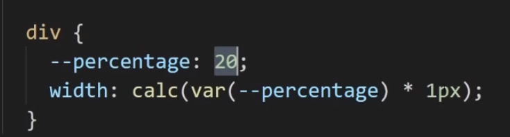
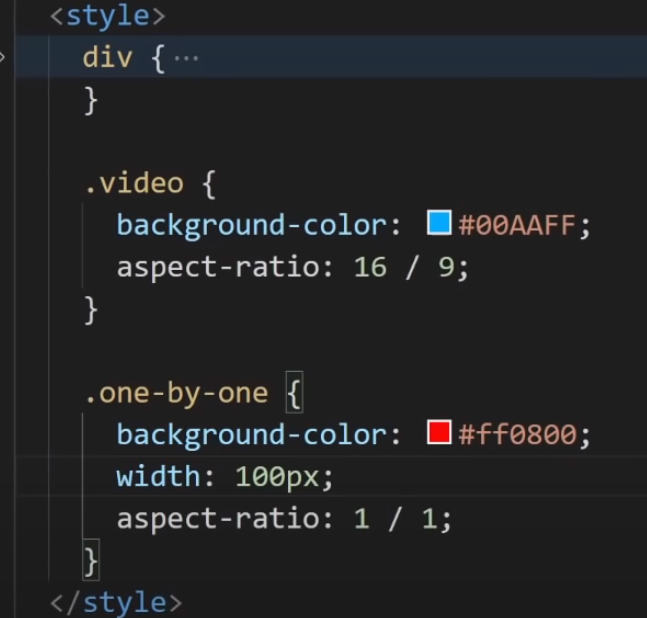
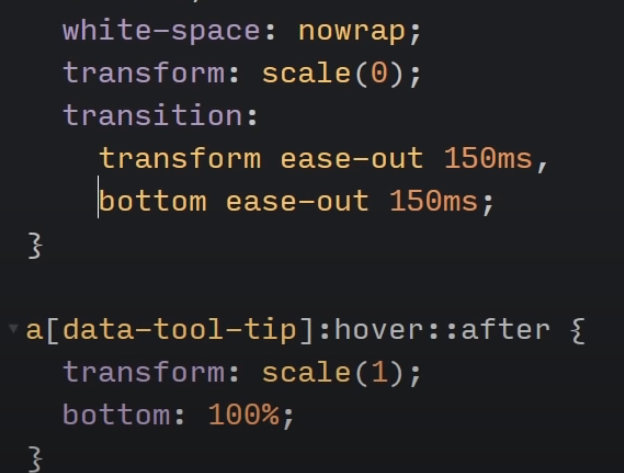

# CSS General

**Normalize**: A CSS reset library that resets all browser styles.

## Tips & Tricks

<https://youtu.be/JSURzPQnkl0>

<https://youtu.be/pKO1ktPQByk>

<https://youtu.be/ecl-eCbYFPM>

## Scrolling

Jump to href link

## Positioning 

<table>
<colgroup>
<col style="width: 33%" />
<col style="width: 33%" />
<col style="width: 33%" />
</colgroup>
<thead>
<tr>
<th>Element with the position property of…</th>
<th>Has position and size that is relative to the…</th>
<th>Of…</th>
</tr>
</thead>
<tbody>
<tr>
<td>Fixed</td>
<td>Complete</td>
<td>Viewport</td>
</tr>
<tr>
<td>Absolute</td>
<td>Content + padding</td>
<td>The First ancestor with non-static positioning</td>
</tr>
<tr>
<td>Relative</td>
<td>Content</td>
<td>Normal document flow</td>
</tr>
<tr>
<td>Static</td>
<td>Normal doc flow</td>
<td></td>
</tr>
</tbody>
</table>

**Two valued shorthands:**

- On position-type properties: (x-value, y-value)

  - *Position, background position, etc*

- On non-position-type properties: (y-value, x-value)

  - *Margin, padding, etc*

**Centering:**

- Text-align:center – works on the parent element to center all elements
  that **DO NOT** have a width set.

- Margin: 0 auto – works on elements that **DO** have some width set.

### Percentages

### Aspect ratio

### Resizeable

**resize: both**

(horizontal and vertical)

Using display:flex on the parent element enforces max/min width
properties.

### Sticky

<https://www.youtube.com/watch?v=NzjU1GmKosQ>

position:sticky;

### Centering (General)

- Text-align: center -\> used to center elements that don’t have a width
  set.

- Flexbox

  - Justift-content: center

  - Align-items center

- Margin:0 auto

### Centering an Image

## Logical properties

<https://blog.webdevsimplified.com/2021-05/css-logical-properties/>

## Selectors

### IS

<https://youtu.be/McC4QkCvbaY>

## Media Query & Aspect Ratio

### Aspect-ratio: css media feature

<https://developer.mozilla.org/en-US/docs/Web/CSS/@media/aspect-ratio>

<https://calculateaspectratio.com/>

Aspect-ratio is defined here as the ***width-to-height*** ratio.

In the example below, if the aspect ratio of the screen is such that it
is at minimum 15/9 or greater, the code in the code block will be
referenced:

Note: by ‘15/9’ we mean ‘as wide as 15/9 or wider’ (this would include a
16/9 aspect ratio).

## CSS Variables

<https://www.youtube.com/watch?v=oZPR_78wCnY>

**Access CSS variable values in JS:**

**Update**

**Note**: Only works on root element values (since we are passing in
the’document.documentElement)

To get specific variables from a class, pass in the class name

## CSS Functions

<https://developer.mozilla.org/en-US/docs/Web/CSS/CSS_Functions>

### Filter

## Forms

## Accessibility

### TabIndex

The HTML tabindex attribute has three distinct functions relating to an
element's keyboard focus. When it's on a tag, it indicates that the
element can be focused on. The value (an integer that's positive,
negative, or zero) determines the behavior.

Certain elements, such as links and form controls, automatically receive
keyboard focus when a user tabs through a page. It's in the same order
as the elements come in the HTML source markup. This same functionality
can be given to other elements, such as div, span, and p, by placing a
tabindex="0" attribute on them. Here's an example:

\
I need keyboard focus!\</div\>

Note: A negative tabindex value (typically -1) indicates that an element
is focusable, but is not reachable by the keyboard. This method is
generally used to bring focus to content programmatically (like when a
div used for a pop-up window is activated), and is beyond the scope of
these challenges. Bonus - using tabindex also enables the CSS
pseudo-class :focus to work on the p tag.

### Contrast

Improve Readability with High Contrast Text

Low contrast between the foreground and background colors can make text
difficult to read. Sufficient contrast improves your content's
readability, but what exactly does "sufficient" mean?

The Web Content Accessibility Guidelines (WCAG) recommend at least a 4.5
to 1 contrast ratio for normal text. The ratio is calculated by
comparing the relative luminance values of two colors. This ranges from
1:1 for the same color, or no contrast, to 21:1 for white against black,
the most substantial contrast. There are many contrast checking tools
available online that calculate this ratio for you.

### Make Elements Only Visible to a Screen Reader by Using Custom CSS

## Shapes/clip path

*.header*{

    height: 95vh;

    background: linear-gradient(to right bottom, rgb(238, 238, 238), rgb(143, 143, 238));

    clip-path: polygon(50% 0, 100% 100%, 0 100%);

    animation: widen 1.5s ease-in-out forwards;

}

**Hexagons:** <https://jtauber.github.io/articles/css-hexagon.html>

## Colors

<https://blog.webdevsimplified.com/2021-06/hsl-color-format/>

## CSS Resetting

<https://blog.webdevsimplified.com/2021-05/initial-inherit-revert-unset/>

## CSS Counters

<https://youtu.be/0gayskscLY4>

## Pseudo Elements

P1: <https://youtu.be/zGiirUiWslI>

P2: <https://www.youtube.com/watch?v=xoRbkm8XgfQ>

P3: <https://youtu.be/djbtPnNmc0I>

**With tooltip
triangle**

Using **attr()** method to grab out title from a data attribute:

***This works on a links:***

\<a href="javascript:;" data-custom-tooltip="Check this
out"\>Yoooo\</a\>

\[data-custom-tooltip\]{overflow:visible;position:relative;}

\[data-custom-tooltip\]:hover::before{

content: none;

border-style: solid;

border-color: black transparent transparent transparent;

border-width: 10px 8px 0 8px;

position: absolute;

left: -50%;

top: -100%;

transform:translate(50%, 0);

}

\[data-custom-tooltip\]:hover::after{

background: black;

opacity:1;

display: block;

position: absolute;

bottom: 100%;

left: -50%;

border-radius: 3px;

padding: 13px 12px;

box-sizing: border-box;

z-index:99;

width: max-content;

min-width: 300px;

max-width: 600px;

transform: translate(-160px, -18px);

font-size:18px;

font-weight:100;

color:white;

text-align:center;

}

\[data-custom-tooltip\]:hover::before{content: "";}

\[data-custom-tooltip\]:hover::after{content:
attr(data-custom-tooltip);}

## Gradients

<https://css-tricks.com/css3-gradients/>

<https://learn.shayhowe.com/html-css/setting-backgrounds-and-gradients/>

## Transitions & Animations

### Cubic-Bezier

<https://developer.mozilla.org/en-US/docs/Web/CSS/easing-function>

<https://cubic-bezier.com/>

The Math behind it: <https://www.youtube.com/watch?v=pnYccz1Ha34>

A cubic Bézier curve is defined by four points P0, P1, P2, and P3. P0
and P3 are the start and the end of the curve. P0 is (0, 0) and
represents the initial time or position and the initial state, P3 is
(1, 1) and represents the final time or position and the final state.

- **P0 & P3**: Control time progression (begin and end state)

- **P1 & P4**: Control curvature

In general, changing the p1 and p2 anchor points drives the creation of
different Bezier curves, which controls how the animation progresses
through time. Here's an example of a Bezier curve using values to mimic
the ease-out style:

animation-timing-function: cubic-bezier(0, 0, 0.58, 1);

***Remember that all cubic-bezier functions start with p0 at (0, 0) and
end with p3 at (1, 1)***. In this example, the curve moves faster
through the Y-axis (starts at 0, goes to p1 y value of 0, then goes to
p2 y value of 1) than it moves through the X-axis (0 to start, then 0
for p1, up to 0.58 for p2). As a result, the change in the animated
element progresses faster than the time of the animation for that
segment. Towards the end of the curve, the relationship between the
change in x and y values reverses - the y value moves from 1 to 1 (no
change), and the x values move from 0.58 to 1, making the animation
changes progress slower compared to the animation duration.

cubic-bezier(

### Transform properties

<https://www.w3schools.com/cssref/css3_pr_transform.asp>

# CSS Grid

**Fireship:** <https://www.youtube.com/watch?v=705XCEruZFs>

**WebDev:** <https://www.youtube.com/watch?v=9zBsdzdE4sM>

**Traversy (basic):** <https://www.youtube.com/watch?v=jV8B24rSN5o>

**FreeCodeCamp**: <https://www.youtube.com/watch?v=t6CBKf8K_Ac>

**Layout Land** : <https://www.youtube.com/watch?v=FEnRpy9Xfes>

- Container properties include

  - Display (grid or inline-grid)

  - grid-column-gap

  - grid-row-gap

  - grid-gap (shorthand of grid-column-gap and grid-row-gap)

  - grid-auto-rows/columns

  - justify-content (horizontal positional)

  - align-content (vertical positioning)

  - **grid-template-columns**

    - Methods to determine column width

      - standard- percent: 33.33% 33.33% 33.33%

      - standard-fraction: 1fr 1fr 1fr

      - standard-minmax: minmax ( 200px, auto)

      - shorthand: repeat( 3, 1 fr)

      - shorthand-minmax repeat (3fr, minmax(100px. auto))

  - **grid-template-rows**

    - Methods to determine row height

      - standard- percent: 33.33% 33.33% 33.33%

      - standard-frame: 1fr 1fr 1fr

      - standard-minmax: minmax ( 200px, auto)

      - shorthand: repeat( 3, 1 fr)

      - shorthand-minmax repeat (3fr, minmax(100px. auto))

  - grid-auto-flow: (default to ‘row’). Set to ‘dense’ to fill in empty
    space

- Item properties include

  - grid-row-start

  - grid-row-end

  - grid-row (shorthand of grid-row-start and grid-row-end)

  - grid-column-start

  - grid- column -end

  - grid- column (shorthand of grid- column -start and grid- column
    -end)

  - grid-area (grid-row-start, grid-column-start, grid-row-end and the
    grid-column-end)

  - justify-self

  - align-self

- Item values

  - Description by column line \# and row line \# (example – three cols
    wide: 1/3)

  - Description by span keyword (example – three cols wide: span 3)

**<u>Grid areas</u>**

- Each element in the grid container must be assigned a “grid-area”
  value in your stylesheet

  - Example: header{grid-area: head}

- Also, your grid container must include a “grid-template-areas”
  property, this will serve as a visual representation of the grid
  layout, with the grid-area names serving as the layout boxes and the
  spaces serving as the spaces between the columns, where each instance
  of a grid-area name representing a box, and each “.” represents an
  empty box

Note: the “boxes” must be laid out as such, boxes or rectanges, not
irregular or disconnected shapes

- \#gridWrapper{

-     width: 100%;

-     display: grid;

-     grid-gap: 10px;

-     grid-template-columns: repeat(12, 1fr); */\* determines column
  width \*/*

-     grid-auto-rows: minmax(150px, auto);    */\* determines row height
  \*/* 

-     grid-template-areas:

-     "nava nava nava nava nava nava nava nava nava nava nava nava"

-     "head head head head head head head head head head head head"

-     "asid asid main main main main main main main main main main"

-     "asid asid main main main main main main main main main main"

-     "asid asid sect sect sect sect sect sect sect sect sect sect"

-     "foot foot foot foot foot foot foot foot foot foot foot foot"

-     ;

- }

- 

- \#gridWrapper \>\*{

-     background-color: \#40a9e6;

-     color: white;

-     font-family: Arial, Helvetica, sans-serif;

-     padding: 30px;

- }

- 

- header{

-     grid-area: head;

- }

- aside{

-     grid-area: asid;

- }

- nav{

-     grid-area: nava;

- }

- main{

-     grid-area: main;

- }

- section{

-     grid-area: sect;

- }

- footer{

-     grid-area: foot;

- }

- **Mobile-responsive**: Placing the CSS styles for the grid wrapper
  into a CSS media query will allow you to make the CSS grid
  mobile-responsive by repeating this process for multiple CSS media
  queries.

- **Mosaic**: using unique CSS grid combined with the transform style
  property allows for many different CSS layouts including mosaic
  inspired layouts

- More CSS grid info here:
  <https://developer.mozilla.org/en-US/docs/Web/CSS/CSS_Grid_Layout>

# Flex box

<https://css-tricks.com/snippets/css/a-guide-to-flexbox/>

<https://www.youtube.com/watch?v=fYq5PXgSsbE>

- Requires container with “display: flex” style

- Container properties include

  - flex-direction

  - flex-wrap

  - flex-flow (shorthand of direction and wrap property)

  - justify-content (horizontal positional)

  - align-content (vertical positioning)

  - align-items (refers to cross-axis)

  - justify-items

- Item properties include:

  - order

  - flex-grow

  - flex-shrink

  - flex-basis (minimum size)

  - flex (shorthand property for the flex-grow, flex-shrink, and
    flex-basis)

  - align-self

  - justify-self

- Cross axis changes depending on the flex-direction, where the flex
  direction determines main axis. Although both axes begin at the same
  point, the flex direction (row/column) determine the main axis

For actual values of properties and their meaning:
<https://developer.mozilla.org/en-US/docs/Web/CSS/CSS_Flexible_Box_Layout>

## Even columns every time

A more preferred method would be **flex-basis:100%.**

**Flexbox naturally has a flex-shrink, which means it’s always trying to
narrow down to smallest size (based on content unless otherwise
specified – like by using a flex-basis).**

# Materialize

# SASS/SCSS

<https://raygun.com/blog/6-reasons-you-should-use-a-css-preprocessor/>

## Mixins

With args

## Functions

## Arrays

# Tailwind CSS

**Helpful links**:

- <https://dev.to/finallynero/scss-cheatsheet-7g6>

- <https://www.youtube.com/playlist?list=PL4cUxeGkcC9iEwigam3gTjU_7IA3W2WZA>
