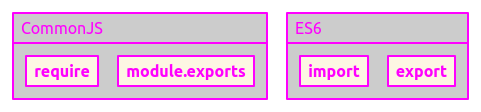
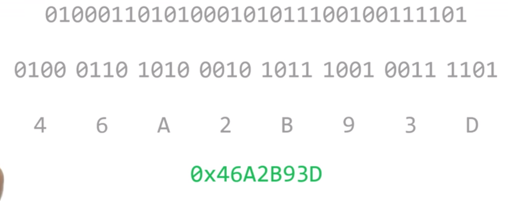
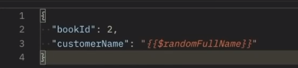
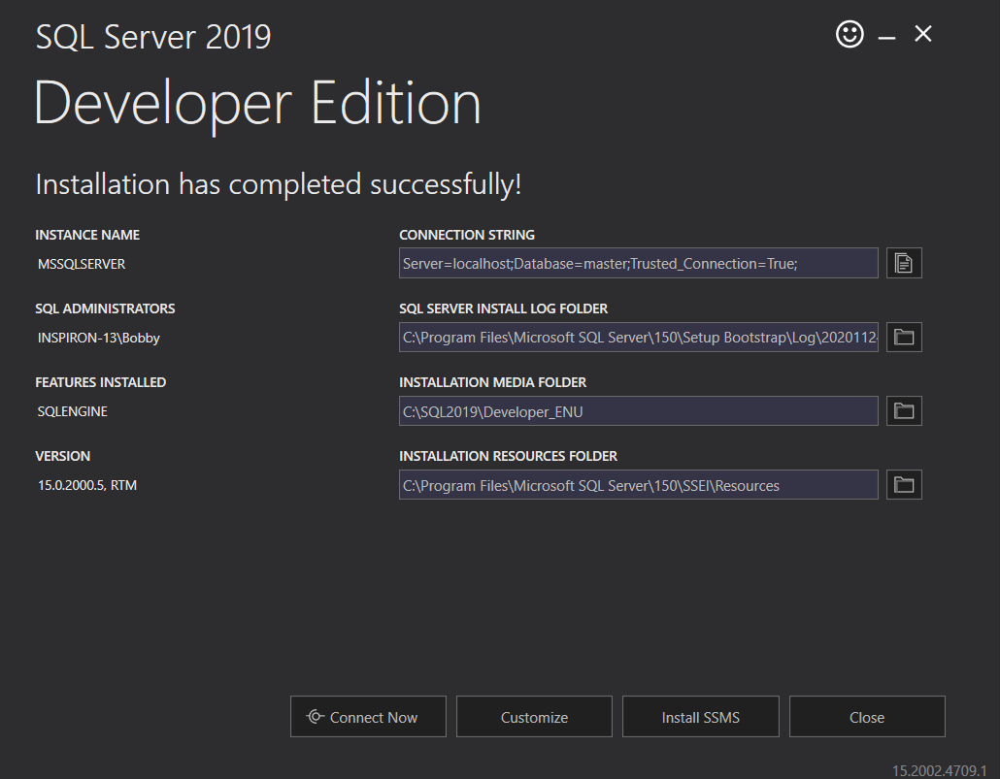

# Computer Science

## General

**CrashCourse**:
<https://www.youtube.com/playlist?list=PL8dPuuaLjXtNlUrzyH5r6jN9ulIgZBpdo>

**CS50**: <https://cs50.harvard.edu/x/2020/>

**CS50 - shorts**:
<u>https://www.youtube.com/playlist?list=PLhQjrBD2T381k8ul4WQ8SQ165XqY149WW</u>

**Fancy words:** <https://youtu.be/4Zc9ci9L5wY>

## Workflow

### Visual Studio Code

<https://code.visualstudio.com/docs/getstarted/settings>

- Extensions

  - Prettier (avoid parens)

  - Emmet

  - Monakai Pro

  - Live SASS compiler

  - Vetur

#### Emmet

- **Full cheat sheet**: <https://docs.emmet.io/cheat-sheet/>

- <https://www.freecodecamp.org/news/write-html-css-faster-with-emmet-cheat-codes/>

- <https://www.youtube.com/watch?v=V8vizNQKtx0>

Essentials

- Prettier & VS Code

- Node.js

- Google, MDN, Stack Overflow

## Debugging and Testing

### More About Preventing Future Breakage

Preventing future breakage is a bit of a dynamic subject. Probably the
most useful techniques here are identifying, isolating, and managing
*problem domains* and *failure domains. *

***Problem Domains*** just describe the complexity of a given problem
that one is trying to solve. Let’s look at an example below:

For example: counting the number of occurrences of a specific word in
one of Shakespeare’s plays, like Hamlet. This is an indexing problem.
And its problem domain is fairly limited in scope. It’s a single word,
and a single play. A bit of BASH could easily solve this problem. So the
problem domain is small, and the technical solution is fairly simple.

However, if the scope is widened slightly to include all of
Shakespeare’s plays, the problem domain becomes larger. Any software
solution used to try and solve this indexing problem has to now handle
various logic that it did not have to handle before, like consolidating
word occurrences in various plays. I.e. the word ‘Brevity’ may occur at
least once in Hamlet, and N number of times in various other plays.
Managing N occurrences of ‘Brevity’ over M works of Shakespeare is an
order of magnitude more complex in terms of describing the problem
domain. A bit of BASH could solve this problem, but it might be
difficult.

If the problem becomes slightly more complex, such as finding the
occurrences of various synonyms to a given word, then the problem domain
becomes equally large. Managing original words, their synonyms, and
their hit-count across multiple works of Shakespeare is even MORE
complex.

So why is any of this useful? Well, if one can easily describe and
reason about a problem in a lot of detail, they understand the Problem
Domain fairly well. Producing a software solution for a given problem
becomes easier when the Software Engineer understands the problem domain
fairly well. Of course, building a good understanding of the Problem
Domain often requires a lot of experimentation, and iteration. This is
why it’s good to make a few initial attempts at testing a design before
building an entire Production system to solve a problem like indexing
Shakespeare.

**Failure Domains**

Like problem domains, failure domains just describe the complexity of a
system. Except, instead of describing the various problems a system
tries to solve, failure domains describe various sub-systems which may
fail. Using the Shakespeare example again, if one of your systems is
responsible for managing the full text of the works of Shakespeare (a
content server), that might be a single failure domain. If another
system is responsible for actually searching that content and counting
the words (an indexer), that is a separate failure domain. Some failure
domains can be within other failure domains. For example, if an indexer
fails, the content server may not fail. But if a content server fails,
the indexer will probably also fail.

So why do we care about any of this? Well, Problem Domains drive system
complexity. Complex systems often have many failure domains. The key to
preventing future breakage is to identify, and manage the scope and
severity of a failure domain. This may mean redesigning the system in a
way that has many smaller failure domains, instead of few large ones. 

As another example It’s better to have a video streaming service slow
down instead of failing entirely. This kind of graceful degradation can
be attributed to isolated failure domains.

This topic can be a bit complex, but there are several community
articles on the idea of identifying and managing failure domains.
Consolidating and completely eliminating possible failure domains is the
key to preventing future breakage. If anything, managing failure domains
should keep the scope of a break as small as possible.

Check out some more info here:

- <https://simpleprogrammer.com/understanding-the-problem-domain-is-the-hardest-part-of-programming/>

- <https://deploy.equinix.com/blog/explaining-failure-domains-sre-lifeblood/>

- <https://landing.google.com/sre/sre-book/chapters/effective-troubleshooting/>

#### Resources for Understanding Crashes

There's a ton of different reasons why a computer might crash. This
[Scientific American
article](https://www.scientificamerican.com/article/why-do-computers-crash/)
discusses many of the possible reasons, including hardware problems and
issues with the overall operating system or the applications on top. 

On Linux or MacOS, the worst kind of crash is called a Kernel Panic. On
Windows, it's known as the [Blue Screen of
Death](https://en.wikipedia.org/wiki/Blue_Screen_of_Death). These are
situations where the computer completely stops responding and only a
reboot can make it work again. They don't happen often, but it's good to
understand what they mean: the whole OS encountered an error and it
can't recover.

We called out that reading logs is super important. You should know how
to read logs on the operating system that you're using. Here are some
resources for this:

- [How to find logs on Windows
  10](https://www.digitalmastersmag.com/magazine/tip-of-the-day-how-to-find-crash-logs-on-windows-10/)
  (Digital Masters Magazine)

- [How to view the System Log on a
  Mac](https://www.howtogeek.com/356942/how-to-view-the-system-log-on-a-mac/)
  (How-to Geek)

- [How to check system logs on
  Linux](https://www.fosslinux.com/8984/how-to-check-system-logs-on-linux-complete-usage-guide.htm)
  (FOSS Linux) 

You also need to be familiar with the tools available in your OS to
diagnose problems. These are the tools we called out, but you don't need
to limit yourself to them:

- [Process
  Monitor](https://docs.microsoft.com/en-us/sysinternals/downloads/procmon)
  for Windows (Microsoft)

- [Linux strace command tutorial for
  beginners](https://www.howtoforge.com/linux-strace-command/)
  (HowtoForge)

- [How to trace your system calls on Mac
  OS](https://etcnotes.com/posts/system-call/) (/etc/notes)

### Different Test Types

When we looked at unit tests, we call out they should focus on one
specific unit, a functional method that being tested. This allows the
test to verify the unit provides expected functionality regardless of
the rest of the environment. On the other hand, integration tests verify
that the interactions between the different pieces of code in integrated
environments are working the way we expect them to.

While unit tests shouldn't cross boundaries to do things like make a
network request or integrate with an API or database, the goal of an
integration test is to verify these kinds of interactions and make sure
the whole system works how you expect it to. Integration test, usually
take the individual modules of code that unit test verify then combine
them into a group to test.

Depending on what our program does, and how it interacts with the rest
of the systems involved, we might need to create a separate test
environment for our test. Which runs a test version of our software that
we're trying to verify. We might be able to run our test against the
actual version of our system that's running, but that's only if our code
doesn't make any changes to the production environment. Whenever your
company is deploying a system that's somewhat complex, having
integration tests will help make sure that all the pieces come together
the way you expect them to. These tests usually take a bit more work to
set up because you'll need to make sure that you have the test versions
of all relevant systems.

But they might help catch issues that unit tests won't text, so the
extra effort is definitely worth it. For example, if the service you're
trying to test interacts with a database, you want to set up a separate
test database with a test user and a test tables. This lets you run all
tests you need in an environment that you can control without risking
modifying the production database. A variant of unit tests our
regression tests. They're usually written as part of a debugging and
troubleshooting process to verify that an issue or error has been fixed
once it's been identified. Say our script has a bug and we're trying to
fix it.

A good approach to doing this would be the first right to test fails by
triggering the buggy behavior, then fix the bug so that a test passes.
Regression tests are useful part of a test suite because they ensure
that the same mistake doesn't happen twice. The same bug can't be
reintroduced into the code because introducing it will cause the
regression test to fail. Smoke test sometimes called build verification
test,

get their name from a concept that comes from testing hardware
equipment. Plug in the given piece of hardware and see if smoke starts
coming out of it. When writing software smoke test serve as a kind of
sanity check to find major bugs in a program. Smoke test answer basic
questions like, does the program run? These tests are usually run before
more refined testing takes place. Since if the software fails the smoke
test you can be pretty sure none of the other tests will pass either. As
they say where there's smoke there's fire. For a web service the smoke
test would be to check if there's a service running on

the corresponding port. For an automation script, the smoke test would
be to run it manually with some basic input and check that the script
finishes successfully. Other types of tests are load tests. These tests
verify that the system behaves well when it's under significant load. To
actually perform these tests will need to generate traffic to our
application simulating typical usage of the service. These tests can be
super-helpful when deploying new versions of our applications to verify
that performance does not degrade. For example, we might want to measure
the response time of our website while there are 100 requests per second
on our pages, or a 1000, or 10,000. The actual numbers will depend on
the expectations of how much traffic our website will receive. Taking
together a group of tests of one or

many kinds is commonly referred to as a test suite. A good diversity of
test types can create a more robust test suite that helps ensure your
scripts and automation, do what you tell them to.

There are many more kinds of tests out there, we've only touched on a
few of the most common types. If you're interested in learning more
about the way software can break and how to test for that, all kinds of
books and articles have been written on the subject. Speaking of tests,
we have a huge and difficult test coming up, just kidding.

Up next, we'll learn about a technique called test driven development.

### TDD (Test Driven Development)

You might expect that most testing happens after the code has been
written. This seems like a natural progression. First you write your
script then you write tests that verify that the script does what you
want it to do. But this isn't always the best approach. A process called
test-driven development or TDD calls for creating the test before
writing the code. This might seem a bit counter-intuitive, but it can
make for more thoughtful well-written programs. When presented with a
new problem that can be solved by automation, your gut instinct might be
to fire up your code editor and start writing. But creating some tests
first make sure that you've thought about the problem that you're trying
to solve and some different approaches that you might use to accomplish
it. Writing a test first also helps you think about the ways your
program could fail and break which can lead to some valuable insights
and even change the approach you take for the better. The test-driven
development cycle typically involves first writing a test then running
it to make sure it fails. After all, you haven't written the code to
make it passed yet. Once you've verified it fails, you write the code
that will satisfy the test then run the tests again. If it passes you
can continue on to the next part of your program. If it fails you Debug
and run the test again. The cycle is repeated for each new feature of
your script until it's up and running. So before you write your next
Python program, you might want to think about the tests you can create
to make sure it's working as you expect. There are all resources out
there if you'd like to learn more about how you can create code using
the test-driven development approach. Lots of them are Python-centric,
but the principles can be applied to any language you need to create in.
Hopefully you can see the benefits of writing tests to validate the code
rate. You gain some understanding about a different testing techniques
available. Remember that good tests help make any automation and script
you write more robust, resilient, and less buggy. Having reliable
automation makes life better for everyone. Many companies take testing a
step further and combine it with our version control systems and
development processes. When engineers submit their code, it's integrated
into the main repository and tests are automatically run against it to
spot bugs and errors in a process called Continuous Integration.
Although useful, setting up a continuous integration process can be a
big undertaking. Will talk more about it in a later course. In the
meantime, if you use unit tests to validate the code you write, you're
already on your way to a more reliable and robust automation. Up next, a
reading summing up all the different types of tests we mentioned
followed by a quick quiz to make sure you're on track.

### Workarounds

One of the great things about working in IT is that we can tell the
computer what to do and it will follow our orders. When dealing with
unexpected behavior in the software written by other people though, we
might not always be so lucky. It could be that we're dealing with
proprietary software and the source code isn't available at all, or we
might have access to the source code but it's written in a language that
we don't understand and so we can't change it. No matter the reason,
what can you do if you need to fix an application that crashes and you
can't change the code. You'll need to figure out a way of working around
the problem and avoiding the crash. The actual workaround will depend on
what the issue is that you're trying to solve. Let's do a rundown of
some of the available options.

#### Compatibility Wrapper

Say you figured out that the issue was caused by a specific data input
that makes the application crash. The crashes only happen when the input
isn't in the format the code expects. Some of your systems generate data
in XML format which used to work fine with the previous version of the
software but the new version now requires all data to be in a YAML
format. In this case you can write a script that pre-processes the data
and make sure that it's in the format that the program expects.
Similarly if the problem is caused by an external service that the
application uses and that's no longer compatible, we could write a
service to act as a proxy and make sure that both sides see the requests
and responses they expect. This type of compatibility layer is called a
Wrapper. A Wrapper is a function or program that provides a
compatibility layer between two functions or programs so they can work
well together. Using Wrappers is a pretty common technique when the
expected output and input formats don't match. So if you're faced with
some sort of compatibility problem don't be afraid to write a Wrapper to
work around it.

#### Environment Adjustment

Another possibility you might need to look at is if the overall system
environment is it working well with the application. In this case, you
might want to check what environment the applications developers
recommend and then modify your systems to match that. This could be
running the same version of the operating system using the same version
of the dynamic libraries or interacting with the same back end services.
Say the application was developed and tested on Windows 7, if you run
into problems while trying to run it under Windows 10, you might want to
use Windows 7 instead or if the application was developed and tested for
Ubuntu and you're having trouble running it under Fedora, you might want
to try running it on Ubuntu instead, and what can you do if you can't
make the environment match? This could happen, for example, if there's
another application that requires a different version of the same
library or you can't change a certain configuration setting because it's
required to access a different service. In this case, you might want to
consider running the application inside a virtual machine or maybe a
container. These are two different things but we won't go into details
of how they are different here. All you need to know right now is they
both let you run the affected application in its own environment without
interfering with the rest of the system. This is what we need if we want
the environment to be different than the one other Applications are
using on the same computer.

#### Watchdog

Sometimes we can't find a way to stop an application from crashing but
we can make sure that if it crashes it starts back again. To do this, we
can deploy a watchdog. This is a process that checks whether a program
is running and when it's not starts the program again. To implement
this, we need to write a script that stays running in the background and
periodically checks if the other program is running. Whenever the check
fails the watchdog will trigger the program to restart. Doing this won't
avoid the crash itself. But it will at least ensure that the service is
available. This works well for services where availability matters more
than running continuously.

As we called out, if you have a good reproduction case for your issue,
it makes it easier for the developers to figure out what's wrong and how
to fix it. So when you report a bug make sure you include as much
information as possible, share good reproduction case and answer the
questions that we mentioned earlier on. What were you trying to do? What
were the steps you followed? What did you expect to happen? What was the
actual outcome? Up next, we'll see how to apply these skills to
troubleshoot an application that's crashing.

In our earlier videos, we looked into a bunch of different things that
can make software crash and what we can do about them when we can't fix
the code. If we're able to make the application behave correctly though,
we'll have a lot more options for dealing with the crash.

### Segmentation fault: Accessing invalid memory

**Useful:**
<https://stackoverflow.com/questions/33047452/definitive-list-of-common-reasons-for-segmentation-faults>

Of course to apply these fixes, we'll need to understand why the crash
is even happening. One common reason a program crashes is it's trying to
access invalid memory. To understand what this means, let's quickly
explain how using the memory works on modern operating systems. Each
process running on our computer asks the operating system for a chunk of
memory. This is the memory used to store values and do operations on
them during the program's execution. The OS keeps a mapping table of
which process is assigned which portion of the memory. Processes aren't
allowed to read or write outside of the portions of memory they were
assigned. So accessing invalid memory means that the process tried to
access a portion of the system's memory that wasn't assigned to it. Now,
how does this even happen? During normal working conditions,
applications will request a portion of the memory and then use the space
at the OS assigned to them. But programming errors might lead to a
process trying to read or write to a memory address outside of the valid
range. When this happens, the OS will raise an error like segmentation
fault or general protection fault. What kind of programming error is
this? It typically happens with low-level languages like C or C++ where
the programmer needs to take care of requesting the memory that the
program is going to use and then giving that memory back once it's not
needed anymore. In these languages, the variables that store memory
addresses are called pointers. They're just like any other variable and
code that can be modified as needed. So if a pointer is set to a value
outside of the valid memory range for that process, it will point to
invalid memory. If the code then tries to access the memory the pointer
points to, the application will crash. Common programming errors that
lead to segmentation faults or segfaults include forgetting to
initialize a variable, trying to access a list element outside of the
valid range, trying to use a portion of memory after having given it
back, and trying to write more data than the requested portion of memory
can hold. So what can you do if you have a program that's said vaulting?
The best way to understand what's going on is to attach a debugger to
the faulty program. This way when the program crashes, you'll get
information about the function where the fault happened. You'll know the
parameters that the function received and find out the address that was
invalid. That might already be enough to understand the problem. Maybe a
certain variable is being initialized to late or the code is trying to
read too many items on a list. If that's not enough, the debugger can
give you a lot more detail on what the application is doing and why the
memories invalid. For this to be possible, we'll need our program to be
compiled with debugging symbols. This means that on top of the
information that the computer uses to execute the program, the
executable binary needs to include extra information needed for
debugging, like the names of the variables and functions being used.
These symbols are usually stripped away from the binaries that we run to
make them smaller. So we'll need to either recompile the binary to
include the symbols, or download the debugging symbols from the provider
of the software if they're available. Linux distributions like Debian or
Ubuntu ships separate packages with the debugging symbols for all the
packages in the distribution. So to debug and application that's
segfaulting, we download the debugging symbols for that application.
Attach a debugger to it, and see where the fault occurs. When doing
this, we might find that the crash happens inside a call to a library
function. This is separate from the application itself, so we need to
install the debugging symbols for that library. We might need to repeat
this cycle a few times before we can identify the portion of the code
that's buggy. Microsoft compilers can also generate debugging symbols in
a separate PDB file. Some Windows software providers let users download
the PDP files that correspond to their binaries to let them properly
debug failures. One of the trickiest things about this invalid memory
business is that we're usually dealing with undefined behavior. This
means that the code is doing something that's not valid in the
programming language. The actual outcome will depend on the compiler
used, how the operating system assigns memory to processes, and even the
version of the libraries in use. A program that runs fine on a computer
running Windows may trigger a segfault on a computer running Linux and
vice versa.

#### Valgrind

When trying to understand problems related to handling invalid memory,
**valgrind** can help us a lot. **Valgrind** is a very powerful tool
that can tell us if the code is doing any invalid operations no matter
if it crashes are not. Valgrind lets us know if the code is accessing
variables before initializing them. If the code is failing to free some
of the memory requested, if the pointers are pointing to an invalid
memory address, and a ton more things. Valgrind is available on Linux
and Mac OS, and **Dr. Memory** is a similar tool that can be used on
both Windows and Linux. So all of that said, what do we do when we
finally discover the cause of the segfaults? You'll want to either
change the code yourself or get the developers to fix the problem in the
next version. This might sound scary if you've never programmed in the
language used by the application. But when you know what's wrong with
the code, it's usually not that hard to figure out how to fix it.

<u>If a variable is initialized too late, fixing the problem can be as
easy as moving the initialization to the right part of the code, or if a
loop is accessing an item outside of the length of the list, you might
solve the issue by checking that there aren't more iterations than
needed</u>.

**Valgrind tuts**

<https://valgrind.org/>

<https://www.youtube.com/watch?v=A5Rc4AwdaOA>

valgrind --leak-check=full ./myprog arg1 arg2

**Debug with core files**

Core files contain data about system crashes.

Enable the dumping of core files with: ulimit -c unlimited

Read core files with gdb

gdb -c core \<program\>

While still in this gdb session, use the **backtrace** command to see
the full backtrace:

\#0
is where the crash occurred, \#1 is the code that caused \#0, and so on.

Use the **up** command to see where (in the backtrace) the calling
function is called (where \#1 calls \#0 in this case)along with its line
number:

Use the **list** command to see surrounding lines around the viewed line
(5lines before+after):

You can print values of a print using the “print” gdb command:

### Concurrency and Parallelization

- **If you have a slow script that loops through a large set and becomes
  slow:**

  - Break it up so that the script is called multiple times by the same
    machine and each call of the script handles a portion of the list.

- **If you have a slow script that heavily uses a resource (say disk
  space):**

  - Break it up so that the script is called twice (or more) on
    different machines and each call of the script handles a portion of
    the list.

- **If you have a slow script that heavily uses multiple resources:**

  - Break it up so that the script is called multiple times (in
    parallel) but where each call handles a specific task (job#1:
    network tasks, job#2 disk tasks, etc).

We've called that a few times already, that reading information from
disk or transferring it over the network is a slow operation. In typical
scripts while this operation is going on, nothing else happens. The
script is blocked, waiting for input or output while the CPU sits idle.
One way we can make this better is to do operations in parallel. That
way, while the computer is waiting for the slow IO, other work can take
place. The tricky part is dividing up the tasks so that we get the same
result in the end. There's actually a whole field of computer science
called concurrency, dedicated to how we write programs that do
operations in parallel. We won't go into a ton of details here but we'll
give you a brief overview of what you can do. First, we need to
understand what the operating system already does for us. Our OS handles
the many processes that run on our computer. If a computer has more than
one core, the operating system can decide which processes get executed
on which core, and no matter the split between cores, all of these
processes will be executing in parallel. Each of them has its own memory
allocation and does its own IO calls. The OS will decide what fraction
of CPU time each process gets and switch between them as needed. So a
very easy way to run operations in parallel is just to split them across
different processes, calling your script many times each with a
different input set, and just let the operating system handle the
concurrency. Let's say you want to collect statistics on the current
load and memory usage for all the computers in your network. You can do
this by writing a script that connects to each computer in a list and
gets the stats. Each connection takes a while to complete, so the total
run-time of the script would be the sum of the time taken by all those
connections. Instead, you could split the list of computers into smaller
groups and use the OS to call the script many times once for each group.
That way, the connections to the different computers can be started in
parallel, which minimizes the time but the CPU isn't doing anything.
This is super easy to do and for many scripts, it'll be the right
choice. Another easy thing to do, is to have a good balance of different
workloads that you run on a computer. If you have a process that's using
a lot of CPU while a different process is using a lot of network IO and
another process is using a lot of disk IO, these can all run in parallel
without interfering with each other. When using the OS to split the work
and the processes, these processes don't share any memory, and sometimes
we might need to have some shared data. In that case, we'd use threads.
Threads let us run parallel tasks inside a process. This allows threats
to share some of the memory with other threads in the same process.
Since this isn't handled by the OS, we'll need to modify our code to
create and handle the threats. For that, we'll need to look into how the
programming language we're using implements threading. In Python, we can
use the Threading or AsyncIO modules to do this. These modules let us
specify which parts of the code we want to run in separate threads or as
separate asynchronous events, and how we want the results of each to be
combined in the end. We won't go into the details of how you can do that
here, but we'll link to more information on this in the next reading.
One thing to watch out for is that depending on the actual threading
implementation for the language you're using, it might happen that all
threads get executed in the same CPU processor. In that case, if you
want to use more processors, you'll need to split the code into fully
separate processes. If your script is mostly just waiting on input or
output, also known as I/O bound, it might matter if it's executed on one
processor or eight. But you might be doing this in parallel because
you're using all of the available CPU time. In other words, your script
is CPU bound. In this case, you'll definitely want to split your
execution across processors. Now there's a point where adding more
parallel processes means things become even slower, not faster. If we're
trying to read a bunch of files from disk and do too many operations in
parallel, the disk might end up spending more time going from one
position to another then actually retrieving the data, or if we're doing
a ton of operations that use a lot of CPU, the OS could spend more time
switching between them than actually making progress in the calculations
we're trying to do. So when doing operations in parallel, we need to
find the right balance of simultaneous actions that let our computers
stay busy without starving our system for resources. I recently felt the
benefits of applying concurrency. I was working on migrating data that
was stored in one format, and I needed to store it in a different
format. There were a lot of gigabytes of data that needed migrating, so
of course I wasn't going to do it manually. My first version of the
script was taking an average of one hour per gigabyte migrated. This was
much slower than I expected, so I decided to spend more time tweaking
the code to make the migration go faster. I reorganized the logic to
have a separate thread per file which decreased the total time to work
through the files since it now wasn't a linear process, and then, to
make it go even faster, I split the work onto different machines, each
running a bunch of threads. After all this rearranging to use the
resources I have, I brought it down to three minutes per gigabyte. Yeah,
we may be learning a lot about slowness, but we sure are moving fast.
Some of these concepts may feel a little complex and it's perfectly
normal. Take your time, everyone learns slowness at their own pace. Up
next, we'll discuss the different approaches we can take to handle
systems as they become more complex.

### CPU Bound

CPU bound means the program is bottlenecked by the CPU (Central
Processing Unit). When your program is waiting for I/O (e.g., disk
read/write, network read/write), the CPU is free to do other tasks, even
if your program is stopped. The speed of your program will mostly depend
on how fast that I/O can happen; if you want to speed it up, you'll need
to speed up the I/O. **If your program is running lots of program
instructions and not waiting for I/O, then it's CPU bound (it’s going as
fast as it can given the CPU it can use). Speeding up the CPU will make
the program run faster.**

In either case, the key to speeding up the program might not be to speed
up the hardware but to optimize the program to reduce the amount of I/O
or CPU it needs. Or you can have it do I/O while it also does
CPU-intensive work. CPU bound implies that upgrading the CPU or
optimizing code will improve the overall computing performance.

### Code Profilers (resource utilization)

*“tell me why my perl program runs so slowly”*

In software engineering, profiling ("program profiling", "software
profiling") is a form of dynamic program analysis that measures, for
example, the space (memory) or time complexity of a program, the usage
of particular instructions, or the frequency and duration of function
calls.

## Encoding and Math for developers

### Binary

**Why 255?**

This used in SQL (varchar), CSS (rgb), and all throughout CS. This is
because a ***byte*** is 8 ***bits*** (binary digits). Setting all
***bits*** in a ***byte*** to 1 will reach the maximum size for a
***byte*** which is ***255***. Hence this allows for 256 different
values (**255** variations of digits values and **1** variation where
all digits are set to ‘0’). Thus, on 8-bit systems we can have only 256
different values (colors for graphics for example). Hence larger bit
systems were introduced.

### Hexadecimal

Often prefixed with ‘**0x’**

One hexadecimal digit (up to 15) is equivalent to four binary digits (up
to 15).

An RGB colour value takes 24 bits of computer memory, 8 bits (or one
byte) for red green and blue.

This provides 28, or 256 possible values for red, green, and
blue. 256 x 256 x 256 = **16,777,216** total possible colors in the
"true color" palette. The human eye can only distinguish about seven
million colors, so color depths above 24-bit are rarely used.

#### Converting

Here’s an example:

Binary \>binary by 4digits \> hex

### ASCII & Unicode

Francis Bacon:

ASCII was originally a 7-bit code, but became 8-bit to accommodate for
non-English characters. However this still wasn’t enough for all the
characters in many other languages including many Asian dialects. Thus,
Unicode was an encoding scheme introduced in 1992 to do away with all
these international standards and have one single **16-bit** (2byte)
standard which can represent every character and then more (such as
emojis). Although ASCII is still widely used as an American standard
Unicode prevails for many larger tasks.

**UTF-8**

UTF-8 has a dynamic length which is why it’s preferred. ASCII is only 1
byte, so compatible as well.

**ASCII Conversion chart**

<https://www.freecodecamp.org/news/ascii-table-hex-to-ascii-value-character-code-chart-2/>

## Artificial intelligence

Alan Turing sought to answer Hilbert’s questions as to whether an
algorithm could exist that could always be accurate in computing
everything computation:

*Called the decision problem*

Proved that no such algorithm could exist.

**Turing test**

## Compilers & Interpreters

<https://kinsta.com/blog/scripting-languages/>

Both an interpreter AND a compiler translate high-level human-readable
code into low-level machine-readable code but how they do this is
different.

**Interpreter**: Reads and Executes code line-by-line

**Compiler**: Reads all code then executes it at any later time.

<https://www.youtube.com/watch?v=e4ax90XmUBc>

### A detailed explanation

From:
<https://softwareengineering.stackexchange.com/questions/246094/understanding-the-differences-traditional-interpreter-jit-compiler-jit-interp>

An interpreter for language X is a program (or a machine, or just some
kind of mechanism in general) that executes any program p written in
language X such that it performs the effects and evaluates the results
as prescribed by the specification of X. CPUs are usually interpreters
for their respective instructions sets, although modern high-performance
workstation CPUs are actually more complex than that; they may actually
have an underlying proprietary private instruction set and either
translate (compile) or interpret the externally visible public
instruction set.

A compiler from X to Y is a program (or a machine, or just some kind of
mechanism in general) that translates any program p from some
language X into a semantically equivalent program p′ in some
language Y in such a way that the semantics of the program are
preserved, i.e. that interpreting p′ with an interpreter for Y will
yield the same results and have the same effects as interpreting p with
an interpreter for X. (Note that X and Y may be the same language.)

The terms Ahead-of-Time (AOT) and Just-in-Time (JIT) refer
to when compilation takes place: the "time" referred to in those terms
is "runtime", i.e. a JIT compiler compiles the program as it is running,
an AOT compiler compiles the program before it is running. Note that
this requires that a JIT compiler from language X to language Y must
somehow work together with an interpreter for language Y, otherwise
there wouldn't be any way to run the program. (So, for example, a JIT
compiler which compiles JavaScript to x86 machine code doesn't make
sense without an x86 CPU; it compiles the program while it is running,
but without the x86 CPU the program wouldn't be running.)

Note that this distinction doesn't make sense for interpreters: an
interpreter runs the program. The idea of an AOT interpreter that runs a
program before it runs or a JIT interpreter that runs a program while it
is running is nonsensical.

So, we have:

- AOT compiler: compiles before running

- JIT compiler: compiles while running

- interpreter: runs

### JIT Compilers

Within the family of JIT compilers, there are still many differences as
to when exactly they compile, how often, and at what granularity.

The JIT compiler in Microsoft's CLR for example only compiles
code once (when it is loaded) and compiles a whole assembly at a time.
Other compilers may gather information while the program is running and
recompile code several times as new information becomes available that
allows them to better optimize it. Some JIT compilers are even capable
of de-optimizing code. Now, you might ask yourself why one would ever
want to do that? De-optimizing allows you to perform very aggressive
optimizations that might actually be unsafe: if it turns out you
were too aggressive you can just back out again, whereas, with a JIT
compiler that cannot de-optimize, the program would crash or return a
wrong result; in other words, you simply can't allow yourself to perform
the aggressive optimizations in the first place.

JIT compilers may either compile some static unit of code in one go (one
module, one class, one function, one method, …; these are typically
called method-at-a-time JIT, for example) or they may trace the dynamic
execution of code to find dynamic traces (typically loops) that they
will then compile (these are called tracing JITs).

### Combining Interpreters and Compilers

Interpreters and compilers may be combined into a single language
execution engine. There are two typical scenarios where this is done.

Combining an AOT compiler from X to Y with an interpreter for Y. Here,
typically X is some higher-level language optimized for readability by
humans, whereas Y is a compact language (often some kind of bytecode)
optimized for interpretability by machines. For example, the CPython
Python execution engine has an AOT compiler that compiles Python
sourcecode to CPython bytecode and an interpreter that interprets
CPython bytecode. Likewise, the YARV Ruby execution engine has an AOT
compiler that compiles Ruby sourcecode to YARV bytecode and an
interpreter that interprets YARV bytecode. Why would you want to do
that? Ruby and Python are both very high-level and somewhat complex
languages, so we first compile them into a language that is easier to
parse and easier to interpret, and then interpret that language.

The other way to combine an interpreter and a compiler is
a mixed-mode execution engine. Here, we "mix" two "modes" of
implementing the same language together, i.e. an interpreter for X and a
JIT compiler from X to Y. (So, the difference here is that in the above
case, we had multiple "stages" with the compiler compiling the program
and then feeding the result into the interpreter, here we have the two
working side-by-side on the same language.) Code that has been compiled
by a compiler tends to run faster than code that is executed by an
interpreter, but actually compiling the code first takes time (and
particularly, if you want to heavily optimize the code to
run really fast, it takes a lot of time). So, to bridge this time where
the JIT compiler is busy compiling the code, the interpreter can already
start running the code, and once the JIT is finished compiling, we can
switch execution over to the compiled code. This means that we get both
the best possible performance of the compiled code, but we don't have to
wait for the compilation to finish, and our application starts running
straight away (although not as fast as could be).

This is actually just the simplest possible application of a mixed-mode
execution engine. More interesting possibilities are, for example, to
not start compiling right away, but let the interpreter run for a bit,
and collect statistics, profiling information, type information,
information about the likelihood of which specific conditional branches
are taken, which methods are called most often etc. and then feed this
dynamic information to the compiler so that it can generate more
optimized code. This is also a way to implement the de-optimization I
talked about above: if it turns out that you were too aggressive in
optimizing, you can throw away (a part of) the code and revert back to
interpreting. The HotSpot JVM does this, for example. It contains both
an interpreter for JVM bytecode as well as a compiler for JVM bytecode.
(In fact, it actually contains two compilers!)

It is also possible and in fact common to combine those two approaches:
two phases with the first being an AOT compiler that compiles X to Y and
the second phase being a mixed-mode engine that both interprets Y and
compiles Y to Z. The Rubinius Ruby execution engine works this way, for
example: it has an AOT compiler that compiles Ruby sourcecode to
Rubinius bytecode and a mixed-mode engine that first interprets Rubinius
bytecode and once it has gathered some information compiles the most
often called methods into native machine code.

Note that the role that the interpreter plays in the case of a
mixed-mode execution engine, namely providing fast startup, and also
potentially collecting information and providing fallback capability may
alternatively also be played by a second JIT compiler.

This is how the second generation of Google's V8 ECMAScript engine
worked, for example. This generation of V8 never interprets, it always
compiles. The first compiler is a very fast, very slim compiler that
starts up very quick. The code it produces isn't very fast, though. This
compiler also injects profiling code into the code it generates. The
other compiler is slower and uses more memory, but produces much faster
code, and it can use the profiling information collected by running the
code compiled by the first compiler.

## API & HTTP Requests

<https://www.youtube.com/watch?v=GZvSYJDk-us>

### Authentication: Sessions vs Tokens

**On JWT Tokens**

<https://www.youtube.com/watch?v=7Q17ubqLfaM>

<https://www.youtube.com/watch?v=ND5KO4-Ao0c>

### CORS

<https://blog.webdevsimplified.com/2021-05/cors/>

<https://dev.to/lydiahallie/cs-visualized-cors-5b8h>

### XML

XML has different schemas which allow you to set constraints on the data
in your XML. These allow you to set min length of a value, required,
etc.

**XSD** is the W3C Schema specification for XML.

### Postman

<https://www.youtube.com/watch?v=VywxIQ2ZXw4&list=WL&index=6>

<https://www.youtube.com/playlist?list=PLL34mf651faPfS9z4BXdLfaw1KAaJOI7n>

Collections allow you to save auth details in collection itself. New
requests based on a given collection with inherit those same auth
details from their parent collection.

Note: Postman console is great to debug your requests.

#### Variables

In order to apply variables make sure you select the relevant
‘environment’ (top right):

Variables defined in scripts will only be applied one the requests is
sent (since that is when the test script will run)

You can save parts of a URL as a variable to be used later:

**Example using hubspot API**

*Collection*

#### Random Variable

Used to send random data in a request body. Use double-curly braces in
your JSON:

\`

#### Path Variable

Get a single item (id) from a resource (response)

Same as this:

Path variable method

We can name path variable anything we want

#### Global variables

Use eye icon or…in test window

#### API testing

Accepts JS code!

You can select a snippet as well.

**Test** method is important here

Results are displayed in test results (of response section)

Test the status of the response using **json()** method on **pm** object
(pm = postman). The same way we parse json on axios or fetch API.

Get status directly

Postman test method

**Extracting data**

Also a good idea to console log the response so you can play around with
parse response json in the console window

We can also filter data we want to log

#### Collection Runner

Runs all requests at once in a given collection. Bottom right hand of
screen

Simply drag and drop a collection into the run order section and adjust
your order as needed

Save responses for your records

Stopping the runner on a given request

### Request Types

**<u>Types of requests (by URL)</u>**

- **GET:** *\[retrieve resource\]*. This will send a request to the
  server through the web address.

- **POST:** *\[create resource\]. This* will send a request to the
  server through the http protocol and will not display in the URL.
  Further, it allows you to send along some data in a body property.

  - Note: Just as a get request sends its data through query parameters
    sent in the url, a post request (can also) send a query parameter
    string (also known as form data) but instead carries these in the
    post ***body***.

- **PUT:** *\[create resource\]* Update existing resource (by
  replacement unless API supports partial updating).

- **DELETE:** *\[delete resource\]*

**<u>PATCH vs PUT</u>**

The PATCH method is the correct choice here as you're updating an
existing resource - the group ID. PUT should only be used if
you're *replacing* a resource in its entirety.

**PUT** – acts on an entire resource (can update part of a resource
without replacing everything in that resource if API supports it – and
if one is only referencing the parts they wish to update)

**PATCH** – acts on part of a resource

### Request Body

**<u>Request Body:</u>** Data that is sent with a request (certain
requests)

**QUERY PARAMETER**: Values sent to URL

- <u>Form-data</u>: A string of query parameters

  - GET: Directly in URL

  - POST: included in request body

- Raw: A type of markup (JSON/XML)

  - Always in request body

The response of a request is (always?) equivalent to a new GET request
after any data has been updated

Example of JSON sent as raw in PUT request:

First, GET to see what’s already there:

Now our PUT:

Response from PUT:

### Response Body

**<u>Response Body:</u>** Data that is returned from a request as part
of the response.

### Status codes

### URL Encoding (percent encoding)

I learned about the difference between HTML entities vs URL encoded
entities (for example &amp; vs %26). The former won't work to regex a
URL since HTML entities are encoded specifically for HTML. Explains why
DEV-44 didn't work with &amp; but did work with %26 - lesson learned.

***Formula for HTML encoding HTML Entities:***

Ampersand followed by asci code followed by a semi-colon.

**&**\<ASCII code\>**;**

***Formula for URL encoding unsafe/reserved characters:***

Percent symbol followed by asci code followed by a semi-colon.

**%**\<ASCII code\>

When a character from the reserved set (a "reserved character") has a
special meaning (a "reserved purpose") in a certain context, and a URI
scheme says that it is necessary to use that character for
some *other* purpose, then the character must be *percent-encoded*.
Percent-encoding a reserved character involves **converting the
character to its corresponding byte value
in [ASCII](https://en.wikipedia.org/wiki/American_Standard_Code_for_Information_Interchange)** and
then representing that value as a pair
of [hexadecimal](https://en.wikipedia.org/wiki/Hexadecimal) digits. The
digits, preceded by a [percent
sign](https://en.wikipedia.org/wiki/Percent_sign) (%) which is used as
an [escape character](https://en.wikipedia.org/wiki/Escape_character),
are then used in the URI in place of the reserved character. (For a
non-ASCII character, it is typically converted to its byte sequence
in [UTF-8](https://en.wikipedia.org/wiki/UTF-8), and then each byte
value is represented as above.)

The reserved character /, for example, if used in the "path" component
of a [URI](https://en.wikipedia.org/wiki/URI), has the special meaning
of being
a [delimiter](https://en.wikipedia.org/wiki/Slash_(punctuation)#Networking) *between* path
segments. If, according to a given URI scheme, / needs to be *in* a path
segment, then the three characters %2F or %2f must be used in the
segment instead of a raw /.

<https://www.tutorialspoint.com/html/html_url_encoding.htm>

<https://en.wikipedia.org/wiki/Percent-encoding>

<https://www.w3schools.com/tags/ref_urlencode.ASP>

<https://secure.n-able.com/webhelp/NC_9-1-0_SO_en/Content/SA_docs/API_Level_Integration/API_Integration_URLEncoding.html>

## Images

**Vector**: Described in continuous/non-discrete points in a plane and
the lines (known as ***paths***) which form the relation between these
points (such as SVGs).

**Non-vector**: Described in discrete/non-continuous constituents (known
as ***pixels***) – rasterized (such as JPGs, PNGs, etc).

**Rasterization**: The process of converting a vector-based image into a
non-vector-based image by applying a fixed amount of system memory to
represent a grid on a vectorized image to form a pre-defined resolution
wherein which pixels are denominated in virtue of their relation to the
coordinates provided by the pre-defined resolution.

## Date and Timezones and such

<https://en.wikipedia.org/wiki/List_of_tz_database_time_zones>

<https://perldoc.perl.org/POSIX>

<https://github.com/nayarsystems/posix_tz_db/blob/master/zones.csv>

<http://support.cyberdata.net/index.php?/Knowledgebase/Article/View/438/20/posix-timezone-strings>

<https://metacpan.org/pod/Tie::TZ>

# Software Engineering

## Programming Paradigms

<table>
<colgroup>
<col style="width: 16%" />
<col style="width: 29%" />
<col style="width: 21%" />
<col style="width: 19%" />
<col style="width: 12%" />
</colgroup>
<thead>
<tr>
<th><strong>Paradigm</strong></th>
<th><strong>Description</strong></th>
<th><strong>Key Features</strong></th>
<th><strong>Example Use Case</strong></th>
<th><strong>Common Languages</strong></th>
</tr>
</thead>
<tbody>
<tr>
<td><strong>Dynamic Programming</strong></td>
<td>Optimization technique that solves complex problems by breaking them
into smaller subproblems, storing solutions to avoid redundant
computations.</td>
<td>Memoization, tabulation, optimal substructure, overlapping
subproblems.</td>
<td>Fibonacci sequence, shortest path in graphs.</td>
<td>Python, C++, Java.</td>
</tr>
<tr>
<td><strong>Structured Programming</strong></td>
<td>Organizes code into clear, logical structures using sequences,
selections, and iterations, avoiding unstructured constructs like
"goto".</td>
<td>Sequences, loops, conditionals, modularity, readability.</td>
<td>Processing user input with loops and conditionals.</td>
<td>C, Pascal, Java, Python.</td>
</tr>
<tr>
<td><strong>Object-Oriented Programming (OOP)</strong></td>
<td>Organizes code around objects combining data and behavior.</td>
<td>Classes, objects, inheritance, encapsulation, polymorphism.</td>
<td>Modeling real-world entities (e.g., a "Car" class).</td>
<td>Java, Python, C++, C#.</td>
</tr>
<tr>
<td><strong>Functional Programming</strong></td>
<td>Treats computation as mathematical functions, avoiding state changes
and side effects.</td>
<td>Pure functions, immutability, higher-order functions,
recursion.</td>
<td>Data transformations using map/reduce.</td>
<td>Haskell, Scala, JavaScript.</td>
</tr>
<tr>
<td><strong>Procedural Programming</strong></td>
<td>Focuses on procedures (functions) that perform tasks in a
step-by-step manner.</td>
<td>Function calls, sequential execution, modularity.</td>
<td>Writing a program to process a file.</td>
<td>C, Fortran, Python.</td>
</tr>
<tr>
<td><strong>Logic Programming</strong></td>
<td>Based on formal logic, where programs are written as rules and
facts.</td>
<td>Rules, facts, queries, inference engines.</td>
<td>Expert systems, AI query systems.</td>
<td>Prolog, Datalog.</td>
</tr>
<tr>
<td><strong>Event-Driven Programming</strong></td>
<td>Code responds to events (e.g., user actions, system events).</td>
<td>Event listeners, callbacks, asynchronous handling.</td>
<td>Web apps with button click handlers.</td>
<td>JavaScript, Java, C#.</td>
</tr>
</tbody>
</table>

## Programming Styles 

<table>
<colgroup>
<col style="width: 11%" />
<col style="width: 23%" />
<col style="width: 21%" />
<col style="width: 21%" />
<col style="width: 21%" />
</colgroup>
<thead>
<tr>
<th><strong>Aspect</strong></th>
<th><strong>Imperative</strong></th>
<th><strong>Declarative</strong></th>
<th><strong>Functional (Relevant Style)</strong></th>
<th><strong>Object-Oriented (Relevant Style)</strong></th>
</tr>
</thead>
<tbody>
<tr>
<td><strong>Focus</strong></td>
<td>How to achieve the result (step-by-step).</td>
<td>What result is needed (goal-oriented).</td>
<td>Mathematical functions, avoiding state changes.</td>
<td>Objects combining data and behavior.</td>
</tr>
<tr>
<td><strong>Control Flow</strong></td>
<td>Programmer explicitly defines flow (loops, conditionals).</td>
<td>System handles flow internally.</td>
<td>Relies on function composition and recursion.</td>
<td>Defined by object interactions and methods.</td>
</tr>
<tr>
<td><strong>Key Features</strong></td>
<td>Loops, conditionals, variable assignments.</td>
<td>Goal-oriented, no explicit steps, abstraction.</td>
<td>Pure functions, immutability, higher-order functions.</td>
<td>Classes, inheritance, encapsulation, polymorphism.</td>
</tr>
<tr>
<td><strong>Example</strong></td>
<td>Looping through an array to sum it.</td>
<td>SQL query to sum a column.</td>
<td>Using map/reduce to process data.</td>
<td>Creating a class to model a "Car".</td>
</tr>
<tr>
<td><strong>Code Example</strong></td>
<td>python&lt;br&gt;numbers = [1, 2, 3, 4, 5]&lt;br&gt;sum =
0&lt;br&gt;for num in numbers:&lt;br&gt; sum +=
num&lt;br&gt;print(sum)</td>
<td>sql&lt;br&gt;SELECT SUM(column_name) FROM table_name;</td>
<td>python&lt;br&gt;numbers = [1, 2, 3, 4, 5]&lt;br&gt;sum =
sum(numbers)</td>
<td>python&lt;br&gt;class Car:&lt;br&gt; def __init__(self,
speed):&lt;br&gt; self.speed = speed&lt;br&gt; def
drive(self):&lt;br&gt; print(f"Driving at {self.speed} mph")</td>
</tr>
<tr>
<td><strong>Common Languages</strong></td>
<td>C, Python, Java.</td>
<td>SQL, HTML, Haskell.</td>
<td>Haskell, Scala, JavaScript.</td>
<td>Java, Python, C++.</td>
</tr>
</tbody>
</table>

# Software Architecture

## Performance

### Understanding performance problems

#### Performance Principles

There **are three main reasons why performance suffers**:

Given the three reasons (above) we can outline **<u>three performance
principles</u>** we want to highlight

#### Performance Objectives

- **Latency**: How long something takes to execute

- **Throughput**: How many things we can process at a given time.

  - *Throughput = Latency + Capacity (hardware/resources)*

**<u>Two main types of tasks</u>**

- <u>Response-Request</u> *(for example, a web server, file server,
  etc)*

  - This is concerned with latency + throughput.

- <u>Batch Processing</u> *(for example, a script runs some task on
  multiple items and runs on a schedule)*

  - This is concerned with throughput.

#### Performance Metrics

These are the most important metrics

### Fixing performance problems

#### Serial request latency

##### Network request latency

#### Concurrency-related latency

## Scalability

## Reliability

## Security

## Deployment

## Technology Stack

## System Design and Design Patterns

### What is system design?

**Freecodecamp \[1hr\]:**
<https://youtu.be/m8Icp_Cid5o?si=aAvCfl9EangkkErx>

**Large-scale distributed systems:** Highly intensive and geographically
separate systems that operate as a unit.

#### What is a Design Pattern?

#### Object-Orientated Fundamentals

#### 23 Design Patterns (GoF)

**Mosh Tut:** <https://www.youtube.com/watch?v=NU_1StN5Tkk>

**GoF:** “Gang-of-Four” is the name given to a group of four authors who
wrote the book *“Design Patterns: Elements of Reusable Object-Oriented
Sofware”* in the 1990s, which set the standard for modern Design
Patterns.

In that book 23 design patterns were laid out that can be broken down
into three distinct categories:

- **Creational**: All about different ways to create objects

- **Structural**: All about the relationships between those objects

- **Behavioral**: All about the interaction or communication between
  those objects

##### Creational

##### Structural

##### Behavioral

## HTTP Request Caching (server-side caching)

### Nginx (reverse proxy that can be used as an http accelerator)

- Can cache both static and dynamic data.

- Does support HTTPS requests.

*See Nginx*

### Varnish HTTP Caching (accelerator)

**Intro**: <https://www.youtube.com/watch?v=fGD14ChpcL4>

**Tut**: <https://www.youtube.com/watch?v=-cWs6eoyaLg>

- Can cache both static and dynamic data.

- Does **not** support HTTPS requests.

  - But can throw caddy in front of varnish to make is accept https
    request (see Tut link above)

  - 

  - Newer versions of varnish (varnish+ commercial product) does do
    something similar to handle HTTPS requests.
