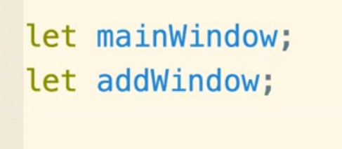
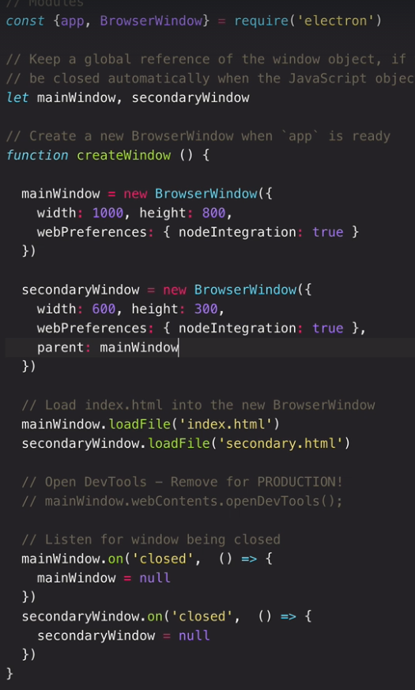
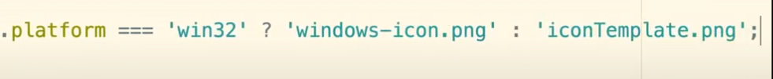

# Electron

### Helpful Links:

- <https://www.geeksforgeeks.org/http-rest-api-calls-in-electronjs/>

- <https://www.electronjs.org/docs/api/client-request>

- <https://www.geeksforgeeks.org/geo-information-in-electronjs/>

- <https://flaviocopes.com/electron/>

- API: <https://www.electronjs.org/docs/api>

Videos:

- <https://www.youtube.com/watch?v=kN1Czs0m1SU>

- <https://www.youtube.com/watch?v=2RxHQoiDctI>

- <https://www.youtube.com/watch?v=2RxHQoiDctI&t=1518s>

- <https://www.youtube.com/watch?v=3yqDxhR2XxE>

Video Playlists:

- <https://www.youtube.com/playlist?list=PLC3y8-rFHvwiCJD3WrAFUrIMkGVDE0uqW>

- <https://www.youtube.com/playlist?list=PLtWy6rdN1yBntIyLeNo-fCVR6AaK7vdyl>

- 

## Setup Code

## Intro and Electron Architecture

### Electron.app Overview

### Enable devtools on dev

Set environment value:

Place a conditional on your onready app function:

Alternatively, you can add a new menu button

Focused window triggers dev tools on relevant window button was clicked
on

### Menus/Hotkeys

Add reload option

### IPC

#### Main Process

##### App module & Events

<https://www.electronjs.org/docs/api/app>

##### BrowserWindow Module 

<https://www.electronjs.org/docs/api/browser-window>

BrowserWindow & Events

The global "app" instance receives all relevant BrowserWindow events, as
they also apply to the application as a whole. Listening on the "app"
instance, instead of a specific BrowserWindow, allows us to intercept
events when they're relevant to the application and not so much the
specific window on which they were triggered. When working with multiple
BrowserWindows (Renderer processes), this can save duplicating event
listeners on individual windows.

###### Loading gracefully: 

‘ready-to-show’ event.

Note: Look for ‘Gracefully’ in docs

Show false, then show on ‘once’ or ‘on’

###### Common options:

#### Renderer Process

#### Preload script

Can require mode module functions (not entire modules themselves) here
and allow them to be used in renderer process

#### Multiple windows

Key methods to call on a BrowserWindow instance

- show()

- hide()

- open()

- close()

- focus()

- on()

  - This is an event listener that can listen to any of those other
    methods

##### Adding a new Window

We don’t need to declare our new window in the **app.on(‘ready’)**
state, since we would likely want this to be triggered later. So we can
create a function instead.

Note: It’s important to size child window appropriately.

Note: ***loadFile*** is newer syntax

In order to load the content of a local file into a BrowserWindow, we
use the "loadFile" method with either a relative or absolute path to the
file as it's first argument. To load remote content however, we must
instead use the "loadURL" method, passing it the HTTP URI of the
resource. That said, "loadURL" can also be used to load local files, but
must be pointed to the file using an absolute URI with a "file"
protocol. This was the default in earlier versions of Electron and still
works, although it isn't recommended.

Then make a new ‘add.html’ doc.

Make sure to declare the new window in the global scope.

##### Making a window a child window

##### Linking new window (from menu option)

Before

After

##### Garbage collect closed windows

##### Close all windows on close main

Since windows are independent, closing the main window won’t quit the
app – thus any sub windows will remain open as well. Solution: on close
main – quit app.

##### Inter-window Communication

When sending from a renderer process to the main window there is only
one ‘listener’ =- the main window. However, when sending from main
window to every renderer will ‘listen’ for the event relevant to each
renderer process.

###### Retrieving Data

To retrieve data between windows (using **ipcMain.on()** or
**ipcRenderer.on()**) the first parameter will always be the custom
event name and the second will be a callback holding (i) the event arg
and (ii) the passed in data as an argument.

###### Sending Data

To send data (with **mainWindow.webContents.send()** or
**ipcRenderer.send()**), there is no callback and we can just pass in
(i) the event name and (ii) the data we wish to send over.

###### Retrieving & Sending

You can also sending some info as soon as some info is received:

##### Trigger window closes

Specify triggered event, and specify the window you wish to close
followed by the **close()** method.

Make sure to garbage collect the closed window.

Method1:

Method 2 (preferred):

Pre-emptively trigger a function to garbage collect this window if ever
closed. This can be specified during window declaration. If the window
is ever opened again the function will run again which will in turn
assign a new instance of **BrowserWindow** to that variable while the
old/closed **BrowserWindow** will now point to null and free up space..

**Note**: Main window doesn’t need to be garbage collected because of
the main window closes, the entire app will quit.

##### Framless window

Add CSS on draggable region

Since child elements will inherit this style, you can explicitly add a
‘no-drag’ class on some:

##### Window hide on blur

## Garbage Collection and Good practice

## Bells & Whistles

### Notifications

### Tray Icons

<https://youtu.be/6guMb33u7Kg>

#### Setup

Destruct Tray object from Electron object:

On app.ready, call new Tray function:

Set icon file path based on OS:

Just above new tray function

Install path module:

Note: The path module sets a new path universal to all OS’s.

Note: \_\_dirname is a special keyword node uses to specify current
working directory.

Create path:

Pass in iconPath into Tray function

#### Create trigger on tray icon

Don’t show app on ready

Declare & globalize tray function into a new variable

Add event handler

Note: This example merely displays the main app – ideally we can toggle
(next).

Toggle app on click

Because we set main app to show: ‘false’ on ready, the app by default
will not be visible.

### Code-signing: Adding a Publisher

<https://docs.microsoft.com/en-us/windows-hardware/drivers/dashboard/get-a-code-signing-certificate>

<https://www.electron.build/code-signing>

#### Positioning App using tray

You can pass in the bounds arg into a ‘click’ function.

Position for OSx & Win

## Troubleshooting

### CORS warning in devtools

Fix by adding meta header

## Packaging & Production

### Quick start A-Z

- **Forge** as template **Electron-builder** as packager (nsis optional)

  - <https://www.youtube.com/watch?v=TnXz_nnQZrw>

### Electron Builder

<https://www.electron.build/>

<https://github.com/electron-userland/electron-builder>

<https://www.youtube.com/watch?v=XEBcBEM9Zj4>

### Electron-Packager

<https://www.christianengvall.se/electron-packager-tutorial/>

Copy from blog:

In this [electron
packager](https://github.com/electron-userland/electron-packager) tutorial
we will look at how to create MacOS, Windows and Linux executables with
an app icon. This is also a continuation of the [Electron app
icon](https://www.christianengvall.se/electron-app-icons/) post, so
start there if you haven’t read it (It’s short, i promise).

I add this code to the [Electron tutorial app on
github](https://github.com/crilleengvall/electron-tutorial-app). Just
look at that repo if you want to see all the code.

In this tutorial I package the application on Windows, macOS and Ubuntu
Linux. There are some information about building Windows apps from
non-Windows platforms in the [Electron packager
readme](https://github.com/electron-userland/electron-packager#building-windows-apps-from-non-windows-platforms).

#### 1. Install Electron packager

Electron packager is created
by [electron-userland](https://github.com/electron-userland) and this is
what they say about it:

"Electron Packager is a command line tool and Node.js library that
bundles Electron-based application source code with a renamed Electron
executable and supporting files into folders ready for distribution."

So lets go ahead and install it. Run these commands in the terminal in
the app folder:

*\# for use in npm scripts*

npm install electron-packager --save-dev

*\# for use from cli*

npm install electron-packager -g

#### 2. Setting productname and electron version

Electron packager looks for a product name in package.json, so lets go
ahead and add one. We also need to add what version of electron to
package the app with.

Lets begin with the electron version. We’ll add that from the terminal
with this command:

npm install --save-dev electron

Now when that is done open up package.json and add a productname:

{

"name": "electron-tutorial-app",

"productName": "Electron tutorial app",

"version": "0.1.0",

"main": "main.js",

"devDependencies": {

"electron": "^1.4.3",

"electron-packager": "^8.1.0"

}

}

#### 3. Building MacOS, Windows and Linux package from the terminal

To get to know what all these flags do, and what more flags exists you
can read the [electron-packager
api](https://github.com/electron-userland/electron-packager/blob/master/docs/api.md).

##### MacOS

Now you can run this command from the terminal to build a package for
mac:

electron-packager . --overwrite --platform**=**darwin --arch**=**x64
--icon**=**assets/icons/mac/icon.icns --prune**=**true
--out**=**release-builds

Electron packager mac

##### Windows

And to build for Windows you can run this from the git bash:

electron-packager . electron-tutorial-app --overwrite --asar**=**true
--platform**=**win32 --arch**=**ia32
--icon**=**assets/icons/win/icon.ico --prune**=**true
--out**=**release-builds --version-string.CompanyName**=**CE
--version-string.FileDescription**=**CE
--version-string.ProductName**=**"Electron Tutorial App"

Electron packager windows

##### Linux

electron-packager . electron-tutorial-app --overwrite --asar**=**true
--platform**=**linux --arch**=**x64
--icon**=**assets/icons/png/1024x1024.png --prune**=**true
--out**=**release-builds

Electron packager ubuntu linux

**overwrite**: replaces any existing output directory when packaging.

**platform**: The target platform to build for

**arch**: the architecture to build for

**icon**: sets the icon for the app

**prune**: runs npm prune –production before packaging the app. It
removes unnecesary packages.

**out**: the name of the directory where the packages are created.

#### 4. Shortcuts

To make it easier to create new builds we can create scripts in
package.json so that we don’t have to remember all these settings. Add
the scripts below, making your package.json look like this:

{

"name": "electron-tutorial-app",

"productName": "Electron tutorial app",

"version": "0.1.0",

"main": "main.js",

"devDependencies": {

"electron": "^1.4.3",

"electron-packager": "^8.1.0"

},

"scripts": {

"package-mac": "electron-packager . --overwrite --platform=darwin
--arch=x64 --icon=assets/icons/mac/icon.icns --prune=true
--out=release-builds",

"package-win": "electron-packager . electron-tutorial-app --overwrite
--asar=true --platform=win32 --arch=ia32
--icon=assets/icons/win/icon.ico --prune=true --out=release-builds
--version-string.CompanyName=CE --version-string.FileDescription=CE
--version-string.ProductName=\\Electron Tutorial App\\",

"package-linux": "electron-packager . electron-tutorial-app --overwrite
--asar=true --platform=linux --arch=x64
--icon=assets/icons/png/1024x1024.png --prune=true --out=release-builds"

}

}

Now you can run:

npm run package-mac

npm run package-win

npm run package-linux

#### Installer tutorials

[DMG installer for macOS
tutorial](https://www.christianengvall.se/dmg-installer-electron-app/)

[Windows installer
tutorial.](https://www.christianengvall.se/electron-windows-installer/)

[Debian package installer
tutorial](https://www.christianengvall.se/electron-installer-debian-package/)

Coming soon: Red-hat package.

### Electron-forge

<https://www.electronforge.io/>

# Writing Clean code

## Programming Paradigms

## Pure functions

Impure functions

## Project planning

