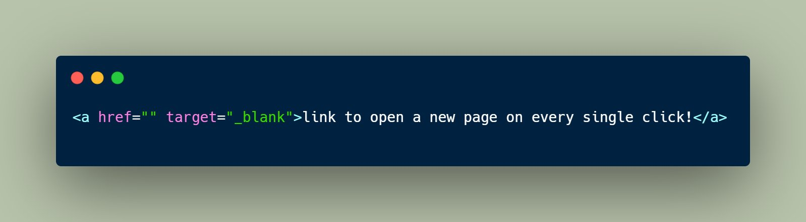
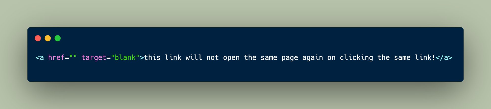
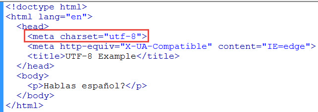
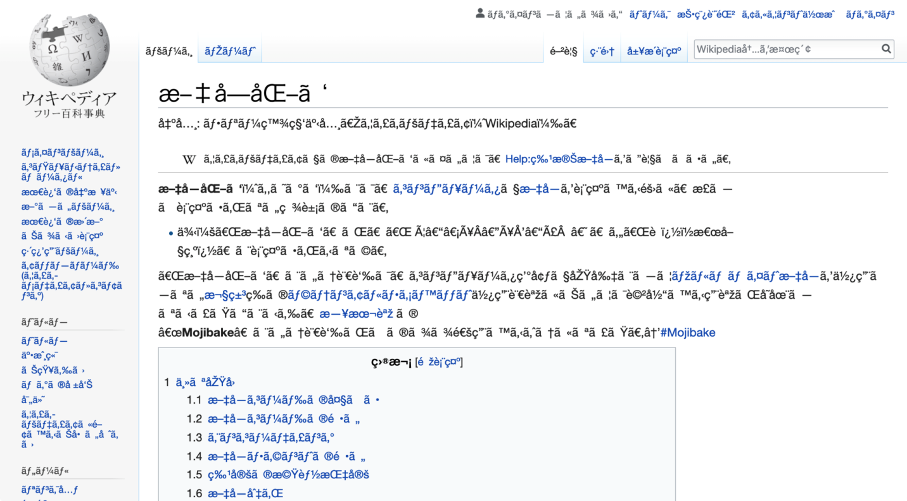
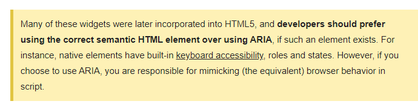
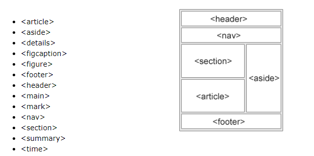
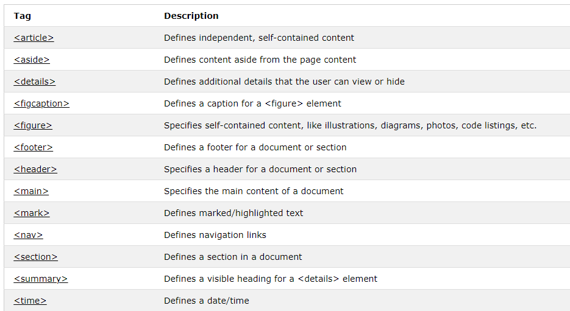

<https://code.tutsplus.com/tutorials/28-html5-features-tips-and-techniques-you-must-know--net-13520>

<https://www.tutorialspoint.com/html5/html5_new_tags.htm>

***Optional Quotation***

HTML attribute quotations are not required per whatwg :

<https://html.spec.whatwg.org/dev/syntax.html#syntax-attributes>

<https://mathiasbynens.be/notes/unquoted-attribute-values>

## Target – Blank

1.𝙩𝙖𝙧𝙜𝙚𝙩="\_𝙗𝙡𝙖𝙣𝙠" :

This will allow you to open the same page in a new tab again and again
after every click on the link given in the website.

2\. 𝙩𝙖𝙧𝙜𝙚𝙩="𝙗𝙡𝙖𝙣𝙠" :

\- Unlike the previous tag, this tag doesn't open a new tab each time
when you click on the link. Rather after opening a new tab on first
click you'll get switched to the same tab when you click on the link.

target="blank" isn't anything in HTML.

If the target is not one of a special set of names - which includes
"\_blank" - then it's just a window name. If a window with the name
exists then it's the target. If it doesn't exist it's created.

This means that "blank" is just a name.

You can use any name you want, and you'll get the same behaviour.

This also means you can use different names for different reasons and
only that named window will get reused. This can be useful in some
situations.

That's because "\_blank" is a reserved keyword meaning new window or tab
but "blank" (or any other word) doesn't mean anything so the browser
assumes it's the name of a window or frame. It then opens it in a window
of that name (if found) or creates a new one.

## Encoding

### UTF-8

Utilizes international standard encoding (including emojis) and gets rid
of ***Mojikabe***

*Example of mojikabe*

## Tooltip Troubleshooting

Just use the entity code &#013;&#010; for a linebreak in a title
attribute.

**data-html="true" with \  in title text works perfectly.**

The &#013; combined with the style white-space: pre-line; worked for me.

.tooltip-inner {

white-space: pre-wrap;

}

**Anecdotes:**

- Adding data-html=”true” in element and “br” tags in tooltip text in
  title attribute seems to work for bootstrap

- Adding line breaks (\n) when using JS to update data prop itself with
  ES6 template literal works as is (add in white-space:line-break as
  well)

- Using &010;&#013; with white-space:line-break works as well

## Semantics, Accessibility, and SEO

[**The Four
Principles**](https://www.theodinproject.com/paths/full-stack-javascript/courses/html-and-css/lessons/the-web-content-accessibility-guidelines-wcag#the-four-principles)

The WCAG are organized around four, core principles that should be kept
in mind when implementing any sort of accessibility feature:

1.  **Perceivable:** Users must be able to perceive the information or
    user interfaces being presented. Light text on a light background
    could be difficult for some users with a visual impairment to
    perceive, for example.

2.  **Operable:** Users must be able to operate any user interfaces or
    navigation, and interfaces cannot require an interaction which the
    user cannot perform. A navigation bar with drop-down menus that only
    expand when a mouse cursor hovers over them, for example, would not
    be operable by keyboard users giving those menu items focus.

3.  **Understandable:** Users must be able to understand any information
    or user interface that is presented to them. For example, if a user
    tried submitting a form and received an error such as “Error 113:
    Bad data”, they wouldn’t be able to understand what the error
    actually means or how to fix whatever caused the error.

4.  **Robust:** Content must be accessible by current assistive
    technologies and other user agents, and must remain accessible as
    those technologies advance.

### Color and Contrast

A contrast ratio is the difference in brightness between two colors
expressed as a ratio. White text on a white background would have lowest
ratio (1:1), while black text on a white background would have the
highest (21:1). Contrast ratios refer to both normal text as well as
images of text.

There are two different conformance levels for contrast ratios, both of
which have rules for normal text and large text. **Normal text** is
defined as text with a font size that’s less than 18 points/24px (or
less than 14 points/18.66px for bold text), and **large text** is
defined as text with a font size that is at least 18 points/24px (or at
least 14 points/18.66px for bold text).

1.  **Level AA** (minimum) requires a contrast ratio of at least 4.5:1
    for normal text and 3:1 for large text.

2.  **Level AAA** (enhanced) requires a contrast ration of at least 7:1
    for normal text and 4.5:1 for large text.

Both conformance levels have exceptions that don’t need to follow the
contrast ratio rules:

- Incidental text, such as text that just *happens* to be within an
  image that has other significant visual content, or text that is
  purely decorative.

- Text that is part of an inactive or disabled user interface component,
  such as a button that is disabled and has a lowered opacity.

- Text that is part of a logo or brand name.

[WebAIM Contrast
Checker](https://webaim.org/resources/contrastchecker/) is a fantastic
tool for checking contrast ratios. Just enter the HEX code of the
foreground and background colors and it calculates what conformance
levels, if any, the contrast ratio passes. The page also has a link for
a link contrast checker, which goes over what the contrast ratio should
be if a text link isn’t underlined.

### Keyboard navigation

- What are two things that interactive elements must have for keyboard
  users?

  - **Focus styles**

  - **Tab order (using tabIndex)**

- What are focus styles?

- Why should you never completely remove focus styles from an element?

- What is the tab order?

- What is the best way to hide hidden content from assistive
  technologies?

  - A better solution is giving the container for the hidden content
    itself either the display: none or visibility: hidden CSS property
    when it’s hidden, and removing or overriding that property when it’s
    meant to be visible. This not only removes the menu items from the
    tab order, but it also prevents assistive technologies from
    announcing them.

### Aria

Accessible Rich Internet Applications **(ARIA) **is a set of attributes
that define ways to make web content and web applications (especially
those developed with JavaScript) more accessible to people with
disabilities.

#### The Five Rules of ARIA

ARIA can be extremely powerful when used correctly, but it can be
equally as dangerous when used incorrectly. Because of this, you should
keep in mind that **no ARIA is better than bad ARIA**, even when you
have the best intentions. The WCAG have something called “The five rules
of ARIA,” which as you may have guessed are rules you should follow when
using ARIA. Although we don’t cover all of the terms mentioned below,
it’s still important to understand the rules themselves, especially if
you decide to dive deeper into ARIA on your own.

1.  Always use native HTML elements and attributes over ARIA when
    possible.

2.  Never change native semantics, unless you have no other choice.

3.  All interactive ARIA controls must be usable with a keyboard.

4.  Never use role='presentation' or aria-hidden='true' on focusable
    elements.

5.  All interactive elements must have an accessible name.

### HTML Semantic tags

**ALT**: not a tag, but useful for images

***Strong*** and ***em*** should be preferred over ***b*** and ***I***
respectively.
