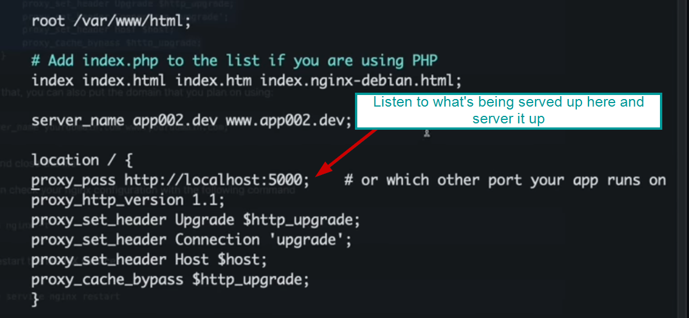

## Helpful vids

**Overview (edureka – good):**
<https://www.youtube.com/watch?v=1ndlRiaYiWQ>

**Travers ===y (as reverse proxy in JS app):**
<https://www.youtube.com/watch?v=7aRjGIhwyQM>

## Overview and purpose of nginx

Of course nginx itself can be used as a webserver (as is it’s main
purpose) but it’s often used on top of a webserver (like express) in
javascript applications. This allows for the robust functionality of an
express server while using nginx as a reverse proxy to utilize the
loadbalancing/caching nature of nginx. Nginx “sits” on top of an express
application by allowing express to listen on a non-registered port (like
8080,5000, etc) and nginx can server that application up on port 80/443
for example by editing the configuration file.

**Architecture**

Nginx doesn’t follow a process-thread modal to handle concurrent
connections wherein which each connection is assigned it’s own thread.

## Nginx configuration file

Path: /etc/nginx/sites-available-default

This section can be updated

Editing as below will allow for reverse proxy to serve up an express
application that listening on a non-registered.

Test state of the configuration file

