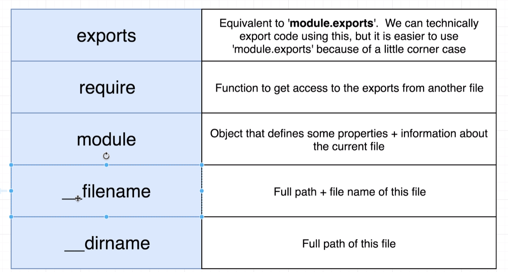
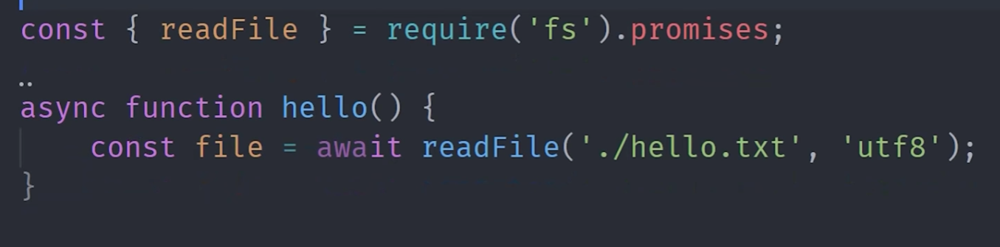
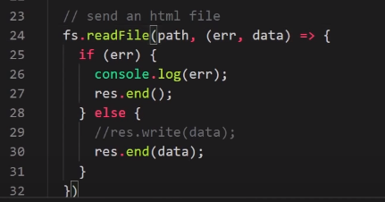

<https://youtu.be/ENrzD9HAZK4>

<https://www.tutorialspoint.com/nodejs/>

Please first understand and review “[How the Web Works](#_How_the_web)”
section.

# Crash Course Resources

Videos:

- 

Playlists:

- **Net Ninja:**
  <https://www.youtube.com/playlist?list=PL4cUxeGkcC9jsz4LDYc6kv3ymONOKxwBU>

Articles:

- <https://www.namecheap.com/support/knowledgebase/article.aspx/10202/48/how-to-install-nodejs-on-a-vps-or-a-dedicated-server/>

- [**https://docs.aws.amazon.com/sdk-for-javascript/v2/developer-guide/setting-up-node-on-ec2-instance.html**](https://docs.aws.amazon.com/sdk-for-javascript/v2/developer-guide/setting-up-node-on-ec2-instance.html)

- 

# Preface I: Node Architecture

## General & Threads

Node uses ***libuv*** as a main dependency for a lot of the
heavy-lifting with files (with the thread pool taking in tasks to heavy
for the event loop) and with its asynchronous behavior.

## Event Loop

The event loops handles all of the callback functions (primary
function).

Nextticks queue and microtasks are executed (checked for execution)
after each phase is complete for each loop.

A tick is a single cycle of the event loop.

process.nextTick

setTimeout vs setImmediate

1\) setImmediate callbacks actually **precede** timer callbacks, since
they come immediately after the I/O cycle, which synchronises all
callbacks. Using a setImmediate callback ensures it will be
executed **as soon as possible** (here the immediate attribute starts to
make sense).

2) **Without a synchronisation I/O phase, there is no actual starting
point for callbacks synchronization**. The order of arrival of timeout/
immediate callbacks strictly depends on the process behaviour. This
justifies what Jonas said in the video. setTimeout and setImmediate are
indeed called one after another in the top level context, **without
setting up any I/O callback**. Later on in the code, these instructions
are then repeated in the file read callback, where therefore an I/O
phase is fired. Since then, callbacks entry points are stated, and their
execution order (first the setImmediate, BEFORE timers, then the timers)
becomes deterministic.

A similar example as the one provided in this video is given here, from
the linked page (screenshot for quick reference):

## Code Execution process

Zooming out from the Event loop, we can see the order in which our code
is executed.

# Intro

- **Node JS** (written in C++) is a JavaScript runtime based on the
  chrome V8 JavaScript engine.

- **Runtime**: An environment where JavaScript can run with added C++
  bindings (for example chrome has DOM). Node has its own bindings too
  which allow you to access file system for example.

- **Event-driven**: Callback-based (event loop based)

- **I/O**: Input/output – how it communicates with the outside world
  (file system, server, etc). I/O tasks mainly deal with networking and
  file accessing within the context of Node.

  - **Non-blocking**: Node can work on multiple requests at the same
    time.

- **Backend**: Node actually allows you to build a server, not merely to
  use one that already exists (as PHP for example).

Here is how PHP or ASP handles a file request:

1.  Sends the task to the computer's file system.

2.  Waits while the file system opens and reads the file.

3.  Returns the content to the client.

4.  Ready to handle the next request.

Here is how Node.js handles a file request:

1.  Sends the task to the computer's file system.

2.  Ready to handle the next request.

3.  When the file system has opened and read the file, the server
    returns the content to the client.

Node.js eliminates the waiting, and simply continues with the next
request.

Node.js runs single-threaded, non-blocking, asynchronously programming,
which is very memory efficient.

- 

## Command Line/Getting started

- Use ‘node’ to enter and Ctrl + D to exit (or ‘**.exit**’)

  - This is known as the REPL (read, evaluate, print, loop)

- Can use Tab to see all Node actions.

- Underscore will refer to previous computed value.

- Run node file with **node filename.js**

- **Global** is the root element (akin to window element)

- **Process** : an object which gives us access to many methods and
  properties (akin to document)

## Configuration

Changing the threadpool size (default 4)

## Modules

- Node is built around the concept of modules – thus modules must be
  imported to perform certain tasks.

- Modules can be imported using the require method and passing the
  module you wish to use as a string.

- Types of modules:

  - **Core**: Built into Node globally

  - **NPM**: Must install from using NPM

    - **Validator** for example (used to validate emails and such)

    - **Yargs:** To parse/manipulate CLI data

  - **Custom**: Modules we’ve exported in other external files.

- **Require**: The ‘require’ keyword can be used to not only include
  modules, but also more code from other files. Note: These imported JS
  files have their own scope – to import the variable environment from
  an external script, one must use the **module.export** functionality
  on the file you are receiving from.

### Node functions

Each js script ran in node is wrapped in a huge function.

Try console.log(arguments) to see these four arguments contained:

### Using Faker module

# General

## Working with CLI

### Manipulating user input from the command line

- **\_STANDARD**\_\_ (not preferred): Call the
  **argv** property on the **process** object.

  - **argv**: argument vector is a property on the global object which
    returns variables in the global context (this includes user input in
    the CLI). This returns an index with 3 elements: (i) path to node on
    client, (ii) filepath (iii) Variables we’ve declared. Use the
    **argv\[2\]** to return variables
    solely.

- **\_YARGS**\_\_ (preferred): Use the Yargs
  Package

  - **Install Yargs**: **npm i yargs@latestverion**, require this
    module, and save it into a **yargs** variable.

  - Run the **yargs.argv** command = this will return user input

  - **yargs.command()** : This takes in an object with the following
    keys..

    - command: Provide the value intended to run the command

    - describe: Add a description

    - handler: A callback function to run whenever the command is called

    - 

  - **builder**: This command will include all the options you want the
    command to support. This takes in an object.

##  ‘FS’ Module (Read/write files)

This module allows us to read and write files – stands for **file
system**.

- Create a variable to store this module as this module will contain an
  object that will have a lot of methods relevant for the file system

  - 

- Use this module and call the **readFileSync()** to read content.

  - P1: File to write to

  - P2: Character encoding (‘utf-8’)

- Use this module and call the **writeFileSync()** to write content
  (overwrite file).

  - P1: File to write to (new files will be created if it does not
    exist)

  - P2: Text to write in

- Use this module and call the **appendFileSync()** to write content and
  append it to the file.

  - P1: File to write to

  - P2: Text to write in

Asynchronously…

We can also read/write in an asynchronous way by removing the ‘Sync’
from the method names (**readFIle, writeFile, appendFile**). Callbacks
are required here – most callbacks require at least two parameters (i)
**err** and (ii) **data**. Note: When using callbacks in Node, it is
common to use arrow functions, since they don’t get their own ‘this’
keyword.

- **readFile ()** to read content.

  - P1: File to write to

  - P2: Character encoding (‘utf-8’)

  - P3: Callback

- **writeFile ()** to write content (overwrite file).

  - P1: File to write to (new files will be created if it does not
    exist)

  - P2: Text to write in

  - P3: Character encoding (‘utf-8’)

  - P4: Callback

- Use this module and call the **appendFileSync()** to write content and
  append it to the file.

  - P1: File to write to

  - P2: Text to write in

  - P3: Character encoding (‘utf-8’)

  - P4: Callback

Promise-based

## Module handling in node js

## Events and EventEmitters (observer pattern)

^ **myEmitter** is in instance of the **EventEmitter** class.

Sending arguments

If you are going to use the EventEmitter class – its best to extend it
to make a new class

Upon exiting nodejs already has a built-in event

## Creating a server

- Use **http** module

- createServer() on http module.

  - Its callback takes two parameters (request and response)

  - Each of these arguments is an object which has it’s own special
    methods we can use inside this callback.

- Run listen method on server instance – 3 args

  - 1 – port

  - 2 – IP

  - 3 - Action

Run
our script in in node

Navigating to that host ip+port will send a request to our server

  

### Port

The port can be manually set, however when deployed on an app is
deployed we can’t be sure which port will actually be used. If the port
is set by the host, we can use this by accessing the
**process.env.PORT** property and short-circuit to one we manually
define if not in use.

### Making changes

When changes are made to our code we have to restart our server (stop
file and re-run file – node server in this case).

With nodemon just rin your file once and any changes will restart the
server.

## Basic: Requests & Responses

Handling a request: log some request data

The request argument is an object – the url method on this object
returns the path the user sent a reuest from Default is ‘/’ but can be
any other defined one as well (‘/about’ for example)/

One method to handle a form submission (request)

Data is returned in query parameter format, we have to parse
accordingly.

### Responding to a request

Generally there are three methods called on the respond argument

1.  res.setHeader(p1,p2)

    1.  p1: content-type

    2.  p2 - value

2.  res….

3.  **res.end()** : close response

### Respond: writing text

### Respond: writing HTML

### Respond: HTML File

Respond with an HTML file by reading it and sending the read data over
as a response.

Note: make sure to require fs (filesystem) module.

Note: be sure to end response.

If we are only sendng one thing over we can just add the data in the
**end()** method.

### Routing between multiple HTML files

Set path variable contingent on request URL

Status code can be specified on the **response** object.

Use path variable as HTML file to respond with

### Accepting cross-origin requests (CORS)

Set these headers on your server for every request

^ we add OPTIONS header because sometimes the browser changes/adds
another request method when sending a request (for example POST request
can sometimes change to OPTIONS).

### Redirecting

# Express

## Initializing a Server

Note: Assumes localhost unless otherwise specified. Pass in port num.
Returns an instance of the server.

## Respond (manually)

Note: content type is assumed.

Alternatively, using the ***use*** method (with express) but use is
middleware:

Request handling Refactor

Define functions to handle requests..

Handle requests like so…

## Respond with file

## Redirects

## Redirect 404

Note: the ***status*** method on the response argument returns the
response so this method can be chained. In this case we can send a 404
file back.

Note: Notice how we don’t pass in a path here as the first argument.
This is because the 404 page (using the ‘use’ method) must be at the
bottom of you chain of directs/redirects as it will serve as the default
response if there are no other matched – just as is the case without
express in a typical switch statement.

## Middleware

# View Engines (template engine)

Server-side rendering has a few important points that you should
consider when evaluating a problem:

- Is faster to render the page in the server than in the client

- It is much better for SEO(Search Engine Optimisation), since the
  crawlers can craw the entire page. Since some crawlers are not
  evaluating/running javascript, a SPA(Single Page App) will probably
  result in an empty page. Even though Google has improved quite a lot
  with SPA SEO, server-side rendering is still the best option.

Client-side rendering, using SPAs, has different advantages:

- Is much better to manipulate and maintain user state in the
  client-side, since you can have your webpage broken down into
  components.

- Faster interactions/page changes after the first load, since, in most
  cases, the entire app is loaded at once in the first request.

So with that in mind, you have to consider what you want to do. If you
are building some website that reflects a more page-like structure, like
a news or blog, server-side rendering is probably the best way to go. On
the other hand, if you are building a full-blown application that has
loads of user interactions and state management, client-side rendering
(or SPA) could be the best option.

There is no reason to outsource your code to the client-side without
evaluating your problem first. That really depends on the problem you
are trying to solve.

# Authentication

Create Node API with JWT Auth

<https://www.youtube.com/watch?v=xBYr9DxDqyU>

<https://www.youtube.com/watch?v=7nafaH9SddU>

# Node + MySQL

## Node & MySQL: Getting started

### NPM Setup

1.  Install & Import MySQL package

This ‘***mysql’*** packages gives us access to special methods and
properties we can used to interact with our database. These methods
include things like ***‘createConnection’*** and ***‘query’*** as well
as properties like ***‘host’***, ***‘user’***, and ***‘database’***.

### Connecting MySQL with Node

1.  Connect to MySQL

The ***createConnection*** method can be called on the mysql object we
are importing into our project. This ***createConnection*** method
accepts an argument which is an object containing all of the database
connection details and credentials. This can be saved into a variable
(named ***‘connection’*** for example) which will have its own methods
that can be called on this new variable.

2.  Connect to MySQL

The ***query*** method can be called on the ***connection*** variable.
The ***query*** method takes 2 parameters

1)  Query to run

2)  Callback function to execute once query runs

    1.  Parameter 1: Holds the error value

        1.  You can place a ***guard clause*** to check for a truthy
            ***error*** value and throw an ***error*** if there is an
            error.

    2.  Parameter 2: Holds the value of the query results

        1.  Results are returned in an array ‘wrapper’, selected
            **\[0\]** index to ‘unwrap’ result.

    3.  

Querying with Aliases

Using SQL aliases for attributes/columns in your query allows you to
access these attributes by the alias name as a property name on the
object being returned.

Closing connection

It’s a good practice to close your connection when you have executed
your query using the ***end()*** method on the ***connection***
variable.

### Sample code

### Debugging

<https://code.visualstudio.com/docs/nodejs/nodejs-debugging>

<https://www.youtube.com/watch?v=2oFKNL7vYV8>

### Outline: Node + MySQL

## Node & MySQL: Interacting with Database

### Selecting Data

### Inserting Data

The ***mysql*** npm package allows you to insert data using an object
literal containing the data you wish to insert. The ***keys*** of the
object will present the ***columns/attributes*** you wish to insert into
and the ***values*** of the object will represent the ***values*** you
wish to insert.

The ***query*** method itself will use three parameters instead of the
typical two. The first will still be the query to run, the last will
still be the callback, but the second argument will now be the variable
containing the object you wish to pass in place of the **‘SET ?’**
keywords:

Three arguments

1.  **Parameter 1**: Query to run - must use the **SET** keyword
    followed by a question mark

2.  **Parameter 2**: Object containing data to insert.

3.  Parameter 3: Callback

With this, the first argument of the ***query*** method (the query
itself), will be constructed as this behind the scenes:

Inserting into multiple columns

To insert into multiple columns just add another key-value pair:

This will look like a standard insert behind the scenes:

Note: image is cut off

Sample code

#### Inserting dates & times

The **mysql** npm package will always try to convert any date/times into
the same format as the SQL date/time format (YYYY-MM-DD HH:MI:SS)
whenever values are being inserting into a column with a date/time data
type.

#### Bulk insert

Using a nested array as the object to pass in and omit the **SET**
keyword in the query.

### Excercises

## Mondo DB and Mongoose

## Building Our Web App

Run ***npm init***, install & import the express js package

**Listen**: This method listens for a request made from this port.

**Simply:** This tells the server to listen.

**Get**: This method listens for a ***get*** request made on the file
path specified in parameter 1 and executes a callback as specified in
parameter 2.

**Simply:** This tells the server where to listen and what to do when it
‘hears’ something.

Together, the ***get*** and ***listen*** methods create a listener on a
specific ***port*** on the server and executes a function when a request
or response is made on a given ***path***.

**Note**: The ***post*** method is another variant which listens to post
requests.

The get callback

The ***response*** argument has a ***send*()**method inside which we can
pass information we want to send pack to the client.

### Connecting Express with MySQL

### Send data to client

### Use EJS package

This is a JS templating package

The set() method allows you to set settings of our app. The second
argument specifies the file extension.

Setting a view

Instead of using the ***send*** method on the response argument we can
use the ***render*** method to respond with the content of file located
in the ***views*** directory.

Ejs fie

Dynamically passing in data

The ***render*** method can also take in a second argument which is an
object which we can use to specify the data we wish to be interpreted as
dynamic in our EJS file using key-value pairs. The ***key*** is the word
we can use to be interpreted which will in reality contain the value
contained in the ***value***.

The EJS file will recognize dynamic data when it is wrapped in the
**\<%=**dat**%\>**,.

Anything passed in these brackets will be interpreted as JavaScript.

Another example:

### Connecting the form

Body parser package

This package will parse the form data received from the ***res***
argument in the ***app.post*** callback function.

# Streams

