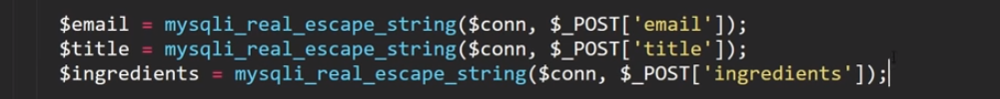
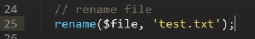
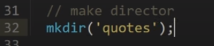
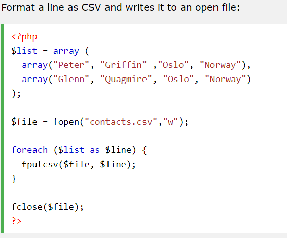

*PHP And its difference from JavaScript || SQL using MySql*

# PHP in Practice

## PHP

### Installation: Xampp

**XAMPP Software components:**

- **Apache** plays a major role in the HTTP request processing. It is an
  authentic default web server application. Apache is a widespread web
  server kept by Apache Software Foundation.

- **PHP** is the server-side scripting language that signifies Hypertext
  Preprocessor. It is an open-source language that very well works with
  MySQL and for many web developers, it has become the first choice. It
  is rooted in the HTML code that interrelates with the webserver.

- **MySQL:** in XAMPP, MySQL plays the role of a database management
  system. It supports to manage and store collected data proficiently.
  It is the most popular and open-source.

- **Perl** is the high-level programming language made for editing text
  in the network programming and [web
  development](https://www.temok.com/web-development).

### General & Basics

- **Syntax**: PHP scripts are wrapped in the **\<?php ?\>** syntax.

- **Writing/logging**

  - **echo :** keyword equivalent to <u>document.write</u> in JS.

  - **print_r:** returns a readable version.

- **Variables**: Prefixed with the **$**

  - As in JS, variables cannot start with number or special character

  - **Constants**: Use the define function to pass in (p1) the name of
    the constant and (p2) the value of the constant.

- **Strings**:

  - **Interpolation**: Double quotations will allow dynamic
    interpolation

    - Interpolation of a single variable can be done simply with double
      quotations, but interpolation of nested values requires curly
      braces surround the entire variable. Equivalent to JS but without
      the dollar sign.

    - 

  - **Concatenation**: Dot Notation will concatenate (equivalent to ‘+’
    in JS).

- **Functions:** PHP has many built in functions that aren’t called on a
  variable as they are in JS. As such, usually we often have to pass the
  variable we wish to use this function on into the parameter of the
  function itself. If the function uses its own parameters, the variable
  we wish to call the function on is usually the last parameter.

  - **strlen():** pass in element , returns string length

  - **strtoupper() :** pass in element, returns uppercased version

  - **strtolower():** pass in element, returns lowercased version

  - **str_replace():**

    - p1: character to replace

    - p2: replacing character

    - p3: element to apply function on

- **Numbers**:

  - **Functions**

    - **floor():** round value passed in down

    - **ceil():** rounds value passed in up

    - **pi():** returns value of pi

    - **rand()**: returns a random value between the two numbers passed
      in as the two parameters.

- **Operators:** Mathematical and Logical as well as order of operations
  and shorthand operators are the same as in JS.

  - Exceptions:

    - (.= ) Used to add to strings.

    - (and) Used for **&&**

    - (or) Used for ||

    - (xor) Used for or (requires only one value to be truthy)

- **Arrays**: Arrays can be declared using the bracket in syntax \[ \]
  or the **array()** function (like the **new Array()** keyword in JS).
  Use the

  - **Functions:**

    - **count()** function and pass in the element to returns the array
      length (number of elements in the array).

    - **array_merge():** pass in the arrays you wish to merge ( in each
      parameter).

    - **array_pop():** pass in array you wish to remove its last member

    - **array_push():**pass in array you wish to append and the
      element(s) to wish to push (2nd parameter). Also you
      can use bracket notation with an empty bracket.

      - 

    - 

    - **array_filter()** : Pass in an array to check if all members
      evaluate to false or true. If all the members evaluate to false
      then the function will return false. Can take a callback to
      determine a condition to check against, otherwise it will check
      for truthy/falsy values of each member of the array.

    - **In_array():** Returns true/false checks if a value (p1) is in an
      array (p2)

  - **Sorting**

    - **sort() - sort arrays in ascending order**

    - **rsort() - sort arrays in descending order**

    - **asort() - sort associative arrays in ascending order, according
      to the value**

    - **ksort() - sort associative arrays in ascending order, according
      to the key**

    - **arsort() - sort associative arrays in descending order,
      according to the value**

    - **krsort() - sort associative arrays in descending order,
      according to the key**

      - sort() - sort arrays in ascending order

      - rsort() - sort arrays in descending order

      - asort() - sort associative arrays in ascending order, according
        to the value

      - ksort() - sort associative arrays in ascending order, according
        to the key

      - arsort() - sort associative arrays in descending order,
        according to the value

- krsort() - sort associative arrays in descending order, according to
  the key

  - 

  <!-- -->

  - ***Types of arrays*:**

    - **Indexed:** As in JS

    - **Associative:** Key-value pairs (similar to JS objects)

      - Keys point to the value using the fat arrow sign **( =\> ).**
        

    - **Multidimensional:** Nested arrays.

  - **Redirect**

    - **header():** function that will redirect the page to the location
      determined by the parameter. (Example, **header( ‘ Location:
      index.php ’ )**

### Loops

- **For loop, while**: Same as JS.

- **foreach( $array** as **$ar )**:

  - **$array =** array being looped over.

  - **$ar =** member of current array member.

  - *Note:* The opening and closing curly braces of a foreach loop can
    be replaced by the **:** and **endforeach** respectively for better
    readability.

    - *Opening curly brace =* **:**

    - *Ending curly brace = **endforeach***

### Booleans

- **Values**: Boolean values are converted to strings and are expressed
  as a numericvalue.

  - **true** is returned as ‘1’

  - **false** returns nothing (empty string).

### Conditional Statements

- If/elseif: same as JS (except ***else if*** = **elseif** in PHP).

### Functions

- **Parameters:** Can be referenced as a variable. Parameters accept
  default values.

- **Scope**: Global, Local and Static. Functions only used locally
  scopes variables unless otherwise specified

  - Using globally scoped variables: Add the ‘global’ keyword before
    referencing the global variables you want to use. Changes made to
    the global variable will be reflected in the function and in the
    global context as well.

  - 

    - Global variables can be passed as a parameter using the ampersand.

      - 

  - **Static** is a keyword that can be used like the global keyword,
    but instead it will maintain the most recent value of a variable
    declared within a function.

### Modularity

- **include( ‘ relative file path ’ )**: Includes the PHP code from the
  file passed in, to the place where the include function was called.
  Not necessary to include relative path in parentheses – a space will
  work as well.

- **require(‘ relative file path ’ )**:Exact same as include except, a
  fatal error will be thrown if the relevant file cannot be found. This
  will cease execution of any subsequent code.

### Superglobals

The PHP superglobal variables are:

- **$GLOBALS**

- **$\_SERVER**

- **$\_REQUEST**

- **$\_POST:** PHP $\_POST is a PHP super global variable which is used
  to collect form data after submitting an HTML form with method="post".
  $\_POST is also widely used to pass variables.

- **$\_GET:** PHP $\_GET is a PHP super global variable which is used to
  collect form data after submitting an HTML form with method="get".

  - **Forms**: When working with forms the **$\_GET** gathers the
    information received from the name attributes.

  - **URL**: When working with URLs the **$\_GET** will gather
    information from the query parameters.

- **$\_FILES**

- **$\_ENV**

- **$\_COOKIE**

- **$\_SESSION**

**<u>Server superglobals</u>**

## Forms & Retrieving Data from URL

**<u>Types of requests (by URL)</u>**

- **GET:** Will send a request to the server through the web address.

- **POST:** Will send a request to the server through the http protocol
  and will not display in the URL.

- **QUERY PARAMETER**: In addition to receiving data from a **GET** or
  **POST** request, you can also use the **$\_SERVER** super global to
  check for any query parameters.

  - 

  - More on how to [validate forms
    here](https://www.w3schools.com/php/php_forms.asp) and how to [send
    emails here](https://www.w3schools.com/php/func_mail_mail.asp).

**<u>Form data</u>**

- **Form attributes**

  - action **=** file to which the request will be sent.

    - To reference the current page, you the **$\_SERVER** superglobal
      along with the **PHP_SELF** key.

    - \<form method="post" action="\<?php echo htmlspecialchars($\_SERVER\["PHP_SELF"\]);?\>"\>

  - method = the type request will go here (all caps).

    - More on sending emails
      [here](https://www.w3schools.com/php/func_mail_mail.asp).

- **Receiving requests (**With **GET** and **POST)**

  - You can begin your PHP file with some code that will listen for any
    requests sent to this file.

  - **isset()** function checks to see of the value of a variable has
    been set.

    - Passing the **$\_GET** keyword into the **isset()** function will
      check if a value has been set to **$\_GET** . **$\_GET** is a
      global array which is an array which carries all of the data that
      has been sent through a request.

> **\[ IMPORTANT \]** The $\_GET array is an
> associative array composed of members who keys are defined by the
> “**name**” attribute of an input element in HTML and whose value is
> defined by the value of the name element.

- The **$\_GET** keyword stores any queries that have been requested
  through the URL.

<!-- -->

- One can also check for anything sent using the **POST** method as well
  (using the **$\_POST** global array) as they are constituted in the
  same way as the global **$\_GET** array is.

<!-- -->

- **XSS (cross-side scripting attacks )**: Its best practice to wrap
  your array in the **htmlspecialchars()** function. This will convert
  any special character into HTML entities instead of allowing the
  browser to execute directly (which could potential allow for the
  execution of malicious JS code).

  - In fact its best to wrap any code that may be potentially inputted
    by the user in the **htmlspecialchars()** function.

  - 

### Form Validation

- Empty values: Use the **empty()** function to make sure a value is not
  empty.

- **Filters**: Are functions in PHP which can filter certain data based
  on some condition.

  - **filter_var():** This function will validate a variable passed in
    P1 based on the condition defined as a PHP keyword in the
    2nd parameter (FILTER_VALIDATE_EMAIL for example).
    Returns a Boolean value.

  - 

- **preg_match():** This function check for a regular expression (RegEx)
  match for the variable passed in.

  - **P1:** Regular Expression to validate against.

  - **P2:** The variable to be matched against.

  - 

## PHP & SQL

What is SQL?

- **RDBMS**: Relational DataBase Management System. A database composed
  of tables connected/related internally by foreign keys.

- **Database**: Can contain several tables, each containing its own
  columns/rows. Tables can be related by common properties (foreign keys
  represented in columns).

  - **Rows**: Represent a record.

  - **Columns**: Represent a property.

**PHP MyAdmin**: This is an interface used to visualize the features of
a SQL database.

### Connecting PHP to SQL database:

- In your PHP, create a variable ( **$conn** , for example ) that you
  can reference that will be your connection variable.

- **mysqli_connect()** : The value of this variable will use the
  **mysqli_connect()** function – this takes four parameters:

  - **p1**: host/server

  - **p2**: username

  - **p3**: user password

  - **p4**: database you want to connect to

  - *note: if the connection is successful a true value will be returned
    into the variable.*

  - 

- **Test connection:** Use the ‘**if’** statement to test the connection
  as it should return true. If the connection has an error, this can be
  returned using the **mysql_connect_error() function**

  - 

- **Alternate way to test connection:** We can also use the
  **mysqli_error()** function and pass in our connection variable.

  - 

- It is common practice to save our code containing out connection
  variable into **db_connect.php** file. We can use the **include()**
  method to import this code (and thus access to the database connection
  ) into any other scripts we may need this in increase modularity.

### Interacting with the Database

SQL commands, also called queries, are used to perform certain actions.

**<u>Two steps</u>**

1.  Construct the query.

2.  Make the query.

#### 1 - Constructing the query (command in SQL language)

Create a variable which holds our SQL command(s). This will store the
SQL command wish to run in a string written in SQL We can name this
variable ‘sql’ for example ( **$sql ).**

- **SQL keywords (convention is all uppercase):**

  - *Example 1: Retrieving Data*

    - **SELECT:** prepares to select certain column(s).

    - **\* :** Symbolizes ‘all’ quantifier

    - **FROM:** Specifies which table to reference from (this will be
      attached to the **$conn** variable next, which contains out
      database, so the table we are referencing has to be in this
      database).

  - *Example 2: Saving Data*

    - **INSERT**

##### Interacting with the Database

- If we are ever using a value acquired from a **POST** or **GET**
  request which will interact with our SQL database (either to INSERT,
  SELECT, DELETE, or otherwise), we need to secure this data first using
  the the **mysqli_real_escape_string()** function. The
  **mysqli_real_escape_string()** function wraps our data we wish to
  send to the SQL DB and makes sure no malicious data is being executed
  into our database. Just as the **htmlspecialchars()** function secures
  any HTML code being inputted to the DOM, the
  **mysqli_real_escape_string()** function secures any SQL code
  interacting with our database.

  - P1: our connection variable (**$conn**)

  - P2: the data we wish to save ($

also…

Basically, anytime you have data in your **$sql** variable which was
acquired from a $\_GET or $\_POST super global, then you have to secure
it first using the **mysqli_real_escape_string()** function.

#### 2 – Send the SQL command

In your PHP script, create a new variable (for example, **$result**)
which calls the **mysqli_query() function**. This will combine the SQL
connection (**$conn)** with the SQL command itself (**$sql**). Pass in
both our variables respectively. This will (p1 = **$conn** ) connect to
our database and (p2 = $**sql** ) run the SQL query we are passing into
the function.

1.  **mysqli_query() function:**

    1.  p1: connection to your SQL database ( **$conn** ).

        1.  The fourth parameter in this variable contains our database
            we are trying to access.

    2.  P2: your SQL query itself (**$sql**).

        1.  This tells us what we want to do with the database we are
            referencing with the **$conn** variable.

Once the variable is defined, the next step depends on if we are
retrieving data from the SQL database or saving data into it (this is
defined in the SQL commands we wrote in the **$sql** variable).

##### Saving into the SQL database

A

##### Retrieving Data from a Database

If we are retrieving data from the SQL database using the ‘**SELECT’**
keyword in our **$sql** variable, then the data we wish to retrieve will
be stored into the **$result** variable. In order to manipulate this
data we need to convert it into an array using the
**mysqli_fetch_all()** or the **mysqli_fetch_assoc()** function and
passing **$result** into this function \[\]next step\].

**<u>Fetching the data in an associative array</u>**

1.  When receiving data from our SQL DB, the PHP function we will use to
    receive the data depends on how many records (rows of information)
    we are receiving. If we are receiving a single record (one row from
    our SQL DB) then we can use the **mysqli_fetch_assoc()** function –
    two or more and we can use the **mysqli_fetch_all()** function.

2.  We pass in the **$result** variable (the result of our query).

    1.  **mysqli_fetch_assoc( $result )** 

    2.  **mysqli_fetch_all($result, MYSQLI_ASSOC )**

        1.  p1: **$result**, this is the queried expression of the
            database connection (**$conn**) and the query to run on this
            database in SQL (**$sql**).

        2.  P2: Here we define the format we wish to receive this array.
            The **MYSQLI_ASSOC** keyword will format our data into an
            associative array

        3.  

#### 3 – Confirm status

If SQL can successfully execute the command being run, then this
function (**mysqli_query**) will return true – and this Boolean value
will be stored in the **$result** variable. We can place it in an if
statement to check if this was successful.

From here we can…

- Use data retrieved from the SQL DB (if we are retrieving data). For
  example, we can interpolate this data and output some data
  conditionally on the page.

- Output a message stating that the action performed was successful (if
  we are saving data into the database or just confirming some other
  action for example).

#### 4 - Final steps

Finally, it’s best practice to free our result from memory and
disconnect from the database after we have retrieved our data.

- Use the **mysqli_free_result()** function to pass in the result
  variable we are done retrieving.

- Use the **mysqli_close()** function to pass in the connection variable
  ( **$conn** ) containing the variable we wish to close.

<!-- -->

- 

- **explode()**: This function returns an array from a string (split in
  JS).

  - P1: character to split by (‘ ,’)

  - P2: string to split/explode.

Once you have your data in an array, you can output it to the webpage as
needed.

#### Dynamically load pages

*Outline*

1.  **Retrieve Data from DB & use it to create dynamic links**:
    Interpolate SQL DB data info into anchor tags links to produce
    unique links and hence unique PHP pages to load. This will produce
    unique query parameters when clicked.

2.  **Load conditional data**: Populate newly loaded pages with content
    based off of query parameters using the **$\_GET** global to pass in
    some piece of info that will tie this newly loaded page to the
    reference of the anchor link clicked.

*More*

You can use PHP to interpolate some database data into a href attribute
of an anchor tag. This will allow you to have unique URLs based on the
data from the database. This URL query parameter can be accessed by the
**$\_GET** superglobal by the page loaded.

Since the **$\_GET** keyword stores any queries that have been requested
through the URL we can now create a page which will listen for anything
sent using the **GET** method or any query parameters sent in the URL.

**<u>Step 1 (example)</u>**

**<u>Step 2 (example)</u>**

## Sessions

- **Sessions**: Stores data on the server between requests (such as GET
  or POST).

**<u>Working with sessions</u>**

- **\_ACCESSING\_\_**: In order to access the
  session super global (**$\_SESSION**) we must first run the
  **session_start()** function.

- **\_SAVING DATA\_** We can save data into
  the session super global – even data retrieved from a POST or GET
  request. Save the name of the data you want to save into a variable
  declared within the square brackets.

  - 

<!-- -->

- **\_RETRIEVING DATA\_** We can retrieve data
  from the session super global and save it into a variable and using it
  anywhere else on screen.

  - Note: Just make sure to wrap this variable in the
    **htmlspecialchars()** function before outputting it.

  - 

  - 

- **\_REMOVING DATA\_** We can also remove
  session data from the active session.

  - **Clear single**:

    - Simply use the **unset()** function and pass in the variable
      holding the data you wish to remove.

    - 

  - **Clear all**: Call the **session_unset()** function

  - 

## Cookies

- **Cookies**: Store data in the user’s computer (even between
  sessions).

> **<u>Working with Cookies</u>**

- **\_SETTING\_\_**: In order to set cookies
  we have to use the **setcookie ()** function. This function take three
  parameters.

  - P1: The name/key of our cookie

  - P2: The value of your cookie (which you can get from Query parameter
    or **GET**/**POST** request for example).

  - P3: The time your cookie will expire

    - Use the **time()** function plus the number of seconds (86400 =
      1day). 

- **\_GETTING\_\_**: Use the cookie super
  global **$\_COOKIE** to retrieve cookie values by referencing their
  key/variable name that was defined when setting the cookie. Then we
  can save this into a variable that we can use later.

  - 

  - It’s a good idea to also use the null coalescing operator to set a
    default value in case the cookie has no value. Alternatively one can
    you short-circuiting with a logical operator.

  - 

## File System

### General tasks

- **\_FILES\_&\_\_DIRECTORY\_**:

  - **File exists:** use the **file_exists()** function to verify if the
    file exists before interacting with it.

    - 

  - **File path**: You can also find the file’s absolute path with the
    **realpath()** function.

    - 

  - **File size**: **filesize()** function

    - 

  - **Rename File**: **rename()** function, pass in (p1) file (p2) new
    name.

    - 

  - **Create Folder**: Use **mkdir()** function and pass in folder name.

    - 

- **\_COPYING\_\_FILES\_**: Use the **copy()**
  function to (p1) pass in file to copy and (p2) the name of the new
  file.

  - 

- **\_DELETING\_\_FILES\_**: Use the
  **unlink()** function

  - 

### Reading/writing Files

#### Old method to read files (not recommended)

- **\_READING\_\_FILES\_**: Use the
  **readfile()** function and pass in the file you wish to be read.
  Output will be followed by the number of bytes.

  - 

#### 

#### Modern method to read files (recommended)

**<u>Setup</u>**

1.  Create variable which stores your file - **$file**

2.  Use the file open function **fopen()**

    - P1: The relevant file

    - P2:
      [Mode](https://www.w3schools.com/php/func_filesystem_fopen.asp)

      - "r" - Read only. Starts at the beginning of the file

      - "r+" - Read/Write. Starts at the beginning of the file

      - "w" - Write only. Opens and truncates the file; or creates a new
        file if it doesn't exist. Place file pointer at the beginning of
        the file

      - "w+" - Read/Write. Opens and truncates the file; or creates a
        new file if it doesn't exist. Place file pointer at the
        beginning of the file

      - "a" - Write only. Opens and writes to the end of the file or
        creates a new file if it doesn't exist

      - "a+" - Read/Write. Preserves file content by writing to the end
        of the file

      - "x" - Write only. Creates a new file. Returns FALSE and an error
        if file already exists

      - "x+" - Read/Write. Creates a new file. Returns FALSE and an
        error if file already exists

      - "c" - Write only. Opens the file; or creates a new file if it
        doesn't exist. Place file pointer at the beginning of the file

      - "c+" - Read/Write. Opens the file; or creates a new file if it
        doesn't exist. Place file pointer at the beginning of the file

      - 

3.  Store this **fopen()** function into a variable - **$handle**

> *Note:* When we are done we can use the **fclose()** function.

**<u>In practice</u>**

*Note: All these functions require the handle to be passed in.*

- **\_READING\_\_FILES\_**: Use the
  **fread()** function and pass in (p1) the file you wish to be read and
  (p2) the number of bytes of the file (can be determined by passing in
  the **filesize()** function). Output will be followed by the number of
  bytes.

  - 

  - **Single-line**: Use **fgets()** function (each time called will
    read the next time).

    - 

  - **Single-character**: Use **fgetc()** function (each time called
    will read the next time).

    - 

- **\_COPYING\_\_FILES\_**: Use the **copy()**
  function to (p1) pass in file to copy and (p2) the name of the new
  file.

  - 

- **\_WRITING\_\_FILES\_**: Use the
  **fwrite()** function – this prepends the written text to the file.

  - P1: the handle

  - P2: the text to write in

  - 

- **\_CLOSING\_\_FILES\_**: It’s always good
  practice to close files when we are done with them. Use the
  **fclose()**.

  - 

**<u>Other…</u>**

- **fputcsv() : Format a line as CSV and writes it to an open file:**

  - 

- **fgetcsv():**Read and output one line from the open CSV file:

  - 
