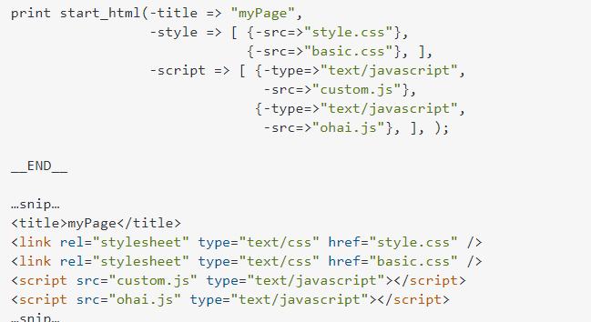
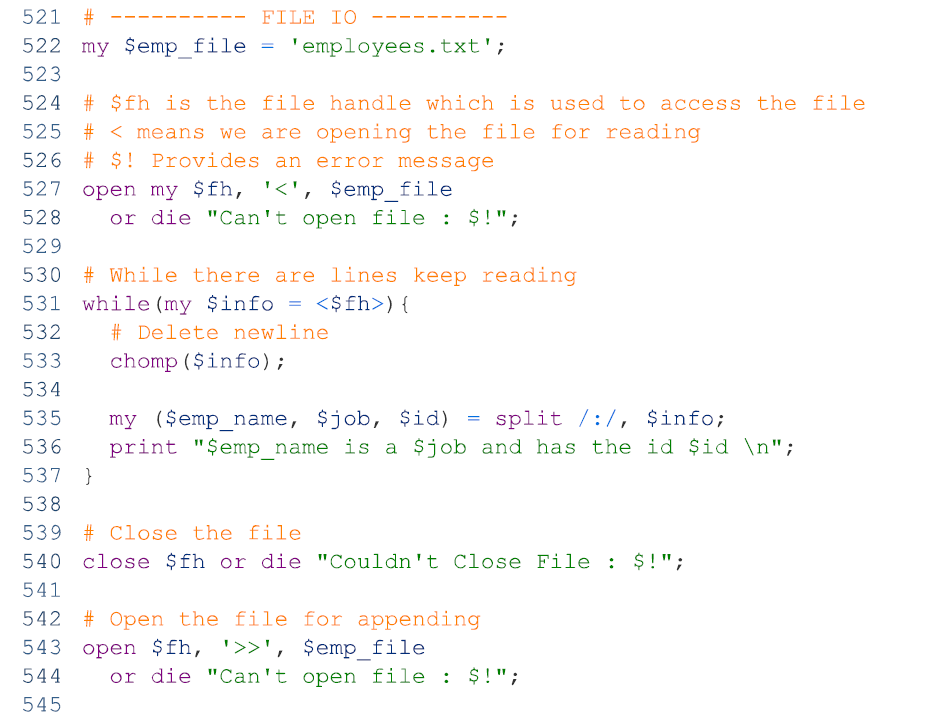

<https://www.perltutorial.org/>

## 

# Helpful Links

- <https://www.tutorialspoint.com/perl/perl_cgi.htm>

- <http://www.cgi101.com/book/ch1/text.html>

- <https://websitehelpers.com/perl/>

- [CGI Programming 101: Chapter 1: Getting
  Started](http://www.cgi101.com/book/ch1/text.html)

- [PERL and CGI Tutorial -
  Tutorialspoint](https://www.tutorialspoint.com/perl/perl_cgi.htm)

- <https://www.geeksforgeeks.org/perl-cgi-programming/>

- [Perl CGI Tutorial: First lesson on Perl
  programming](https://websitehelpers.com/perl/)

- [Perl Tutorial - Tutorialspoint](https://www.tutorialspoint.com/perl/)

- Databases

  - [A Short Guide to DBI](https://www.perl.com/pub/1999/10/DBI.html/)

  - [Accessing MySQL Databases with
    Perl](https://docs.cs.cf.ac.uk/notes/accessing-mysql-with-perl/)

  - [DBD::mysql - MySQL driver for the Perl5 Database Interface (DBI) -
    metacpan.org](https://metacpan.org/pod/DBD::mysql)

  - [Perl DBI](https://www.perltutorial.org/perl-dbi/)

  - [Perl MySQL
    Connect](https://www.mysqltutorial.org/perl-mysql/perl-mysql-connect/)

# CGI

All Perl & CGI files can be placed in the **public_html/cgi-bin**
folder. Locally on xampp this would be **xampp \>** **cgi-bin**

**Helpful overview here**:
[*Link*](http://httpd.apache.org/docs/2.2/howto/cgi.html)

[DIY: Enable CGI on your Apache server -
TechRepublic](https://www.techrepublic.com/blog/diy-it-guy/diy-enable-cgi-on-your-apache-server/)

[The Fool's Guide to CGI.pm, the Perl module for CGI
scripting](http://jkorpela.fi/perl/cgi.html)

[Perl and CGI](https://www.perl.com/article/perl-and-cgi/)

## **Web Browsing**

> To understand the concept of CGI, lets see what happens when we click
> a hyper link to browse a particular web page or URL.

- Your browser contacts the HTTP web server and demand for the URL ie.
  filename.

- Web Server will parse the URL and will look for the filename in if it
  finds that file then sends back to the browser otherwise sends an
  error message indicating that you have requested a wrong file.

- Web browser takes response from web server and displays either the
  received file or error message.

> However, it is possible to set up the HTTP server so that whenever a
> file in a certain directory is requested that file is not sent back;
> instead it is executed as a program, and whatever that program outputs
> is sent back for your browser to display. This function is called the
> Common Gateway Interface or CGI and the programs are called CGI
> scripts. These CGI programs can be a PERL Script, Shell Script, C or
> C++ program etc.

A sample script

Full:

## Configure Apache

*In order to get your CGI programs to work properly, you'll need to have
Apache configured to permit CGI execution. There are several ways to do
this.*

**Main way (Using ScriptAlias)**:

1.  Open your  httpd.conf  file

    1.  C:\xampp\apache\conf\httpd.conf

    2.  

2.  Add your ScriptAlias

    1.  ScriptAlias /cgi-bin/ /usr/local/apache2/cgi-bin/

3.  The ScriptAlias includes…

    1.  The file path to detect: /cgi-bin/ 

    2.  The directory to serve from: /usr/local/apache2/cgi-bin/

    3.  

4.  

5.  

6.  Uncomment

7.  

8.  

9.  

10. Disable script alias (comment out)

11. 

## Helpful Links

<https://www.techrepublic.com/blog/diy-it-guy/diy-enable-cgi-on-your-apache-server/>

# Perl REST API with Dancer

## Perl + Dancer REST API Configuration

<https://metacpan.org/dist/Dancer2/view/lib/Dancer2/Manual.pod#TESTING>

Note: proceed nonetheless on all.

**Install Dancer**

*Run as root*

perl -MCPAN -e shell

install Dancer2

**Install Plack**

<https://metacpan.org/pod/Plack>

*run as root*

perl -MCPAN -e shell

install Plack

**Start app**

perl \<filename\>

Note: Make sure your have proper firewall perms.

**Bootstrap new app**

dancer2 -a MyApp && cd MyApp

## New app setup

*\# set serializer =\> 'XML';*

set serializer =\> 'JSON';

set port =\> 3000;

set content_type =\> 'application/json';

*\# Occurs on every request*

hook before =\> *sub* {

    *my* $path = request-\>path;

    *my* $agent = request-\>env-\>{HTTP_USER_AGENT};

    *my* $ip = request-\>env-\>{REMOTE_ADDR};

};

## Getting request payloads

*\#### GETTING PARAMS*

*\# params-\>{name}; \# This is path param - not query param*

*\# query_parameters-\>get('user')*

*\# body_parameters-\>get('user')*

## Printing JSON as a response

*\### Sending back JSON in Dancer*

In order to send back JSON Dancer needs to send back a REFERENCE to a
Perl Data Structure

*\# PRINTING DATA STRUCTURES TO JSON*

*\# ==\> Named data structures - prepend with backslash to create
reference*

*\## \\mydata_array*

*\## \\mydata_hash*

*\#==\>  Anonymous data structures - print as-is (it's already a
rerference)*

*\# $myarray*

*\# $myhash*

*\#==\>  String to JSON - from_json returns a refernce - use that yo*

*\# my $accounts_json = qq(*

*\#     {*

*\#         "accountId": "$req_accountid",*

*\#         "accountName": "$req_accountid_name",*

*\#         "accountOwnerName": "$accountid_owner_name"*

*\#     }*

*\# );*

*\# return from_json($accounts_json);*

*\#### STRING TO JSON II*

*\# $accounts_list_json-\>\[$a\] = from_json(qq(*

*\#     {*

*\#         "id": "$accounts_list-\>\[$a\]\[0\]",*

*\#         "accountName":"$accounts_list-\>\[$a\]\[1\]",*

*\#         "accountOwner":"$accountid_owner",*

*\#         "admins":"$admin_count",*

*\#         "licenses":"$lic_count",*

*\#         "alerts":"$alerts_count",*

*\#         "resources":$resources_json*

*\#     }*

*\# ));*

*\# my %return_json = ( results=\>$accounts_list_json );*

*\#### HASH TO JSON I*

*\# \# Build JSON reponse*

*\# $accounts_list_json-\>\[$a\] = {*

*\#     id =\> $accounts_list-\>\[$a\]\[0\],*

*\#     accountName =\> $accounts_list-\>\[$a\]\[1\],*

*\#     accountOwner =\> $accountid_owner,*

*\#     admins =\> $admin_count,*

*\#     licenses =\> $lic_count,*

*\#     alerts =\> $alerts_count,*

*\#     resources =\> {*

*\#         resources=\>$resources_count,*

*\#         objectStorageTubs=\>$active_obj_tubs,*

*\#         vo365_SharepointSites=\>$sharepoints,*

*\#         vo365_OneDrives=\>$vo_drives,*

*\#         vo365_Teams=\>$teams_total,*

*\#         vo365_Mailboxes=\>$mailboxes,*

*\#         vo365_Dropboxes=\>$db_users            *

*\#     }*

*\# };*

*\#### HASH TO JSON II*

*\# $accounts_list_json-\>\[$a\] = {*

*\#     id =\> $accounts_list-\>\[$a\]\[0\],*

*\#     accountName =\> $accounts_list-\>\[$a\]\[1\],*

*\#     accountOwner =\> $accountid_owner,*

*\#     admins =\> $admin_count,*

*\#     licenses =\> $lic_count,*

*\#     alerts =\> $alerts_count,*

*\#     resources =\>from_json($resources_json)*

*\# };*

*\# my %return_json = ( results=\>$accounts_list_json );*

*\# my @array_of_json = map { decode_json $\_ }  (*

*\#   '{"id":"3","name":"John", "age":31, "city":"New York" }',*

*\#   '{"id":"2","name":"Prem", "age":26, "city":"India" }',*

*\#   '{"id":"4","name":"Mark", "age":27, "city":"USA" }',*

*\#   '{"id":"1","name":"Anto", "age":28, "city":"UK" }',*

*\# );*

*\# my @sorted = sort { $a-\>{id} \<=\> $b-\>{id } } @array_of_json;*

## SORTING JSON

    if (%hive_api_json){

        *my* $json_text = to_json(\\hive_api_json, {utf8 =\> 1, pretty
=\> 1, canonical =\> 1});

        print "\[1\] $json_text\n";

        *my* $json_scalar = from_json($json_text, {utf8 =\> 1, pretty
=\> 1, canonical =\> 1});

        print "\[2\] $json_scalar\n";

        return $json_scalar;

    }

Possible solution here…

<https://www.perlmonks.org/?node_id=1130703>

## Misc

--- lOGGING ---

in a prod env, only warnings + errors are logged \[FILE\]

log(warning =\> 'this is my warning message');

log(error =\> 'this is my error message');

-- not logged in prod

log(debug =\> 'this is my error message');

Catchall

any qr{.\*} =\> *sub* {

    status 'not_found';

    template 'special_404', { path =\> request-\>path };

};

Any method to this endpoint

any '/myaction' =\> *sub* {

    *\# code*

}

Returns a Hash::MultiValue object from the body parameters.

post '/v1/' =\> *sub* {

    *my* $last_name = $body_parameters-\>{'name');

    *my* @all_names = body_parameters-\>get_all('name');

};

Forwarding...

get '/v1/demo/articles/:article_id' =\> *sub* {

 

    forward "/articles/" . route_parameters-\>get('article_id');

};

**<u>Env Vars</u>**

    *\# 'REQUEST_URI' =\> '/accessToken',*

    *\# 'PATH_INFO' =\> '/accessToken',*

    *\# 'HTTP_ACCEPT' =\> 'application/javascript',*

    *\# 'HTTP_ACCEPT_ENCODING' =\> 'gzip, deflate, br',*

    *\# 'HTTP_USER_AGENT' =\> 'PostmanRuntime/7.31.0',*

    *\# 'REMOTE_ADDR' =\> '54.39.190.133',*

    *\# 'CONTENT_LENGTH' =\> '77',*

    *\# 'HTTP_CONNECTION' =\> 'keep-alive',*

    *\# 'QUERY_STRING' =\> '',*

    *\# 'REQUEST_METHOD' =\> 'POST',*

    *\# 'HTTP_HOST' =\> 'c4alpha.probax.io:3000',*

    *\# 'CONTENT_TYPE' =\> 'application/json',*

# Main

## Why Perl?

- **Interpreted language** (no compiler needed) – only Perl is needed to
  interpret the code.

- The disadvantage is you won't discover any bugs in your program until
  you run it.

## Working with your script

### Getting started

- **<u>Working with Scripts</u>**:

  - Files can be saves as either CGI or PL – depending on your web
    server requirements.

  - If you use a text editor, be sure to turn off special characters
    such as smartquotes. CGI files must be ordinary text.

  - It is imperative that you upload your CGI programs as plain text
    (ASCII) files, and not binary.

    - CGI file may need to undergo EOL conversion and be in the UNIX/OSX
      format.

#### Update file permissions

Once your program is uploaded to the web server, you'll want to be sure
to move it to your **cgi-bin** (or **public_html** directory — wherever
your ISP has told you to put your CGI programs). Then you'll also need
to change the permissions on the file so that it is "executable" (or
runnable) by the system. The Unix shell command for this is:

- **chmod 755 filename**

Update permissions to allow for global /full execution (set to 7-5-5)

- 

  - 

### Initialize your script

The first line of your program should look like this:

\#!/usr/bin/perl -wT

**<u>Breakdown</u>**:

**Shebang**:The first part of this line, **\#!**, indicates that this is
a script.

**Perl Path**: The next part, /usr/bin/perl, is the location (or *path*)
of the Perl interpreter (the location of the perl.exe).

- <u>Alternatives…</u>

  - If you're using ActivePerl on Windows, the path should
    be /**perl**/bin/perl instead.

  - If perl is local on Xampp

    - 

**Flags:** Warnings are enabled by the -w flag. Special user input taint
checking is enabled by the -T flag. 

### Pragmas

**Pragmas/Headers**: The **‘use’** keyword allows us to add special
features and modules.

It’s useful to also include…

- Strict mode

- Diagnostics

- Warnings ( redundant –w flag)

  - 

### Define Content-type, Add HTML, CGI.pm

#### Traditional Method

1.  Next, we need to specify the content-type that we are outputting

    1.  print "Content-type: text/html\n\n";

2.  Add HTML using print statements and writing HTML in double
    quotations.

    1.  

#### Preferred Method (CGI.pm)

Alternatively, we can add the **CGI** module. Once this installed, we
can use special functions that will allow us to manipulate CGI scripts
more effectively.

1.  **Add CGI module**

    - 

    - **qw(:standard)** – indicates that we are importing the standard
      set of functions from the **CGI.pm** module

2.  **Show Errors**: With the CGI module now installed, we can have
    access to more detailed errors by adding this code.

    - 

    - Or (preferred)

    - 

3.  **Define content type**: Thanks to the CGI module, we can now print
    the **header()** function, which is the same as \[ **print
    “Content-type: text/html\n\n”** \]

    - 

    - Note: **header** function be used after declaring CGI module since
      this header function uses the CGI module.

#### Current Progress

#### The Other Way To Use CGI.pm

**  
or "There's More Than One Way To Do Things In Perl"**

As you learn Perl you'll discover there are often many different ways to
accomplish the same task. CGI.pm exemplifies this; it can be used in two
different ways. The first way you've learned already: function-oriented
style. Here you must specify qw(:standard) in the use line, but
thereafter you can just call the functions directly:

> use CGI qw(:standard);
>
> print header;
>
> print start_html("Hello World");

The other way is object-oriented style, where you create an object (or
instance of the module) and use that to call the various functions of
CGI.pm:

> use CGI; \# don't need qw(:standard)
>
> $cgi = CGI-\>new; \# ($cgi is now the object)
>
> print $cgi-\>header; \# function call: $obj-\>function
>
> print $cgi-\>start_html("Hello World");

Which style you use is up to you. The examples in this book use the
function-oriented style, but feel free to use whichever style you're
comfortable with.

**Adding HTML tags**

#### Helpful Links (CGI.pm)

- <http://jkorpela.fi/perl/cgi.html>

- <https://www.perl.com/article/perl-and-cgi/>

- <https://metacpan.org/pod/CGI::HTML::Functions>

### Retrieving requests

Before starting to add the body of our HTML, we can retrieve data here.

### Adding HTML

With the **start_html** function (courtesy of the CGI module) we can
prefill in our HTML up until (and including) the opening of the body
tag. We can also pass in our title.

*Source code of rendered file:*

**<u>Ending HTML</u>**

At the end of our HTML, we can write the **end_html()** function.

### Linking external files

**Adding CSS**: To incorporate multiple HTML elements into the \<head\>
section, just pass an array reference:

**Adding External Scripts**: As with CSS, we can pass in an array.

#### Adding more HTML

Additional Tags can be prefixed with ‘print’ and a space – inner text is
passed into function.

## The basics (CLI)

### Writing

**<u>Method 1</u>:**

the print function:

print "somestring";

**<u>Method 2</u>:**

You can write multiple lines of text without using multiple print
statements by using the here-document syntax:

> print \<\<endmarker;
>
> line1
>
> line2
>
> line3
>
> etc.
>
> endmarker

**<u>Method 3</u>:**

**<u>Escaping Quotes:</u>**

### printf Function

> This function prints the value of LIST interpreted via the format
> specified by FORMAT to the current output filehandle, or to the one
> specified by FILEHANDLE.
>
> Effectively equivalent to print *FILEHANDLE sprintf(FORMAT, LIST)*
>
> You can use print in place of printf if you do not require a specific
> output format. Following is the list of accepted formatting
> conversions.

<https://www.tutorialspoint.com/perl/perl_printf.htm>

### Math

### Logical Operators (for strings)

### Functions in Perl vs …

- JAVASCRIPT (methods)

  - variable**.**method(
    param1, param2, …)**;**

- PERL

  - function
    **$**variable, param1,
    param2, …**;**

- PHP

  - function
    **(**variable, param1,
    param2, …)**;**

### Strings

### Arrays

Assign multiple elements into an array

### Referencing an Array

<https://www.cs.ait.ac.th/~on/O/oreilly/perl/cookbook/ch11_02.htm>

\#MAIN I single value

return $sth-\>fetchrow();

\#MAIN II multi-dimensional array - needs to be dereferenced

return $sth-\>fetchall_arrayref();

\# one row - one-dimensional array ?

return $sth-\>fetchrow_array();

\# one-dimensional array ?

return $sth-\>fetchrow_arrayref();

### Array Length

<https://perlmaven.com/length-of-an-array>

***Preferred:***

$#{} = gives you index of last element so you must add one to it to get
the total array length.

### Sort Array

Sorry nested array by column of each sub-array

$unsorted = \[

    \[1,'a1','b','c'\],

    \[3,'a3','b','c'\],

    \[2,'a2','b','c'\]

\];

@unsorted =  @{$unsorted};

*my* @array = sort { $a-\>\[0\] \<=\> $b-\>\[0\] } @unsorted;

$array = \\array;

for *my* $el (0 .. $#{$array}){

    print "$array-\>\[$el\]\[1\] \_ ";

}

### Hashes (objects)

Hashes are key/value pairs in Perl prefixed by the **%**

**<u>Preferred Syntax</u>:**

### Nested hashes

**<u>One way</u>**

**<u>Another way</u>**

### Array to hash

Where values are keys and “1” is value.

### Dereferencing arrays and hashes

Note: only parent needs to be dereferenced

### Perl and Recursion

*my* $testArr = \['a','b','c','d'\];

*sub* recur

{

    if ($\_\[0\] == -1){return;}

    recur($\_\[0\] - 1);

    say $testArr-\>\[$\_\[0\]\]; *\#action*

}

recur($#{$testArr});

### Subroutines

Equivalent to JS functions, but use the **sub** keyword.

You can pass various arguments to a subroutine like you do in any other
programming language and they can be acessed inside the function using
the special array @\_. Thus the first argument to the function is in
$\_\[0\], the second is in $\_\[1\], and so on.

Parameters are referenced with a sigil and underscore (or custom
variables)

**Method \#1**:

**Method \#2 (using shift for each arg):**

**Method \#3:**

sub accumulate {

my ( $list, $func ) = @\_;

return undef;

}

#### Subs in subs

#### Calling a subroutine

<http://alvinalexander.com/perl/call-perl-subroutines-sub-function-ampersand/>

You can call a sub without the ampersand so long as the sub proceeding
the line of code that calls the sub. Otherwise, use the ‘**&’** to look
for the sub throughout your code.

### Loops

- **next**: skips a loops iteration (***continue*** in JS)

- **break**: exits loop (***break*** in JS)

**Loop through anonymous array**

sub print_options {

my($self) = @\_;

for ( @{$self-\>{options} } ) {

print $\_ . "\n";

}

}

**<u>Switch (given/when)</u>**

**<u>For each</u>**

for *my* $var (@test_array){say $var;}

*Without declaring a variable*

## Files I/O

### Reading Files

    $filename\_ = 'js/script.js';

    *my* $file_content = do{*local*(@ARGV,$/)=$filename;\<\>};

open my $fh, '\<', $filename

or die "Could not open $filename for reading: $!";

my $contents = do { local $/; \<$fh\> };

After opening the file (read man perlio if you want to read specific
file encodings instead of raw bytes), the trick is in
the do block: \<$fh\>, the file handle in a diamond operator, returns a
single record from the file. The "input record separator"
variable $/ specifies what a "record" is—by default it is set to a
newline character so "a record" means "a single line". As $/ is a global
variable, local does two things: it creates a temporary local copy
of $/ that will vanish at the end of the block, and gives it the
(non-)value undef (the "value" which Perl gives to uninitialized
variables). When the input record separator has that (non-)value, the
diamond operator will return the entire file. (It considers the entire
file to be a single line.)

Using do, you can even get around manually opening a file. For repeated
reading of files,

sub readfile { do { local(@ARGV,$/) = $\_\[0\]; \<\> } }

my $content = readfile($filename);

can be used. Here, another global variable(@ARGV) is localized to
simulate the same process used when starting a perl script with
parameters. $/ is still undef, since the array in front of it "eats" all
incoming arguments. Next, the diamond operator \<\> again delivers one
record defined by $/ (the whole file) and returns from the do block,
which in turn return from the sub.

The sub has no explicit error handling, which is bad practice! If an
error occurs while reading the file, you will receive undef as return
value, as opposed to an empty string from an empty file.

Another disadvantage of the last code is the fact that you cannot use
PerlIO for different file encodings—you always get raw bytes.

#### Full example

Helpful Links

<https://www.tutorialspoint.com/perl/perl_files.htm>

### Read and write

### Appending to file

## Regex

**=~ s/// = replace**

**=~ // = testing**

            *\# REPLACING CHARACTERS*

            $sub_path =~ s/\Q&/\\/g;

            $sub_path =~ s/'/''/g;

            $sub_path =~ s/\\\\/\\/g;

*\# CHECKING FOR A MATCH*

  if ($sub_path =~ /\Qdbmid:/){

### RegEx Return matches

Add parens to variable AND total regex (see green arrows)

^ returns one match

To return all matches – save into array (@dates) and use ‘g’ regex
qualifier.

### RegEx (unicode)

Match by long hex with **x\\ff3f23}**

**Unicode matching**

#### Bell character and start of heading character

$mbox_name =~ s/\a/?/g; \# REPLACE BELL CHAR

$mbox_name =~ s/\x{0001}$//g; \# REPLACE START OF HEADING CHARACTER

## Perl Special variables

<https://www.tutorialspoint.com/perl/perl_special_variables.htm>

## CGI Environment Variables

> All the CGI program will have access to the following environment
> variables. These variables play an important role while writing any
> CGI program.

Environment variables are typically prefixed with $ **ENV**.

<table>
<colgroup>
<col style="width: 7%" />
<col style="width: 92%" />
</colgroup>
<thead>
<tr>
<th style="text-align: center;"><strong>S.No.</strong></th>
<th style="text-align: center;"><strong>Variable Name &amp;
Description</strong></th>
</tr>
</thead>
<tbody>
<tr>
<td>1</td>
<td style="text-align: left;"><blockquote>

<strong>CONTENT_TYPE</strong>

The data type of the content. Used when the client is sending
attached content to the server. For example file upload etc.

</blockquote></td>
</tr>
<tr>
<td>2</td>
<td style="text-align: left;"><blockquote>

<strong>CONTENT_LENGTH</strong>

The length of the query information. It's available only for POST
requests.

</blockquote></td>
</tr>
<tr>
<td>3</td>
<td style="text-align: left;"><blockquote>

<strong>HTTP_COOKIE</strong>

Return the set cookies in the form of key &amp; value pair.

</blockquote></td>
</tr>
<tr>
<td>4</td>
<td style="text-align: left;"><blockquote>

<strong>HTTP_USER_AGENT</strong>

The User-Agent request-header field contains information about the
user agent originating the request. Its name of the web browser.

</blockquote></td>
</tr>
<tr>
<td>5</td>
<td style="text-align: left;"><blockquote>

<strong>PATH_INFO</strong>

The path for the CGI script.

</blockquote></td>
</tr>
<tr>
<td>6</td>
<td style="text-align: left;"><blockquote>

<strong>QUERY_STRING</strong>

The URL-encoded information that is sent with GET method request.

</blockquote></td>
</tr>
<tr>
<td>7</td>
<td style="text-align: left;"><blockquote>

<strong>REMOTE_ADDR</strong>

The IP address of the remote host making the request. This can be
useful for logging or for authentication purpose.

</blockquote></td>
</tr>
<tr>
<td>8</td>
<td style="text-align: left;"><blockquote>

<strong>REMOTE_HOST</strong>

The fully qualified name of the host making the request. If this
information is not available then REMOTE_ADDR can be used to get IR
address.

</blockquote></td>
</tr>
<tr>
<td>9</td>
<td style="text-align: left;"><blockquote>

<strong>REQUEST_METHOD</strong>

The method used to make the request. The most common methods are GET
and POST.

</blockquote></td>
</tr>
<tr>
<td>10</td>
<td style="text-align: left;"><blockquote>

<strong>SCRIPT_FILENAME</strong>

The full path to the CGI script.

</blockquote></td>
</tr>
<tr>
<td>11</td>
<td style="text-align: left;"><blockquote>

<strong>SCRIPT_NAME</strong>

The name of the CGI script.

</blockquote></td>
</tr>
<tr>
<td>12</td>
<td style="text-align: left;"><blockquote>

<strong>SERVER_NAME</strong>

The server's hostname or IP Address.

</blockquote></td>
</tr>
<tr>
<td>13</td>
<td style="text-align: left;"><blockquote>

<strong>SERVER_SOFTWARE</strong>

The name and version of the software the server is running.

</blockquote></td>
</tr>
</tbody>
</table>

### **Output**

Environment CONTEXT_DOCUMENT_ROOT:

CONTEXT_PREFIX:

DOCUMENT_ROOT:

GATEWAY_INTERFACE:

GEOIP_ADDR:

GEOIP_CONTINENT_CODE:

GEOIP_COUNTRY_CODE:

GEOIP_COUNTRY_NAME:

HTTP_ACCEPT:

HTTP_ACCEPT_ENCODING:

HTTP_ACCEPT_LANGUAGE:

HTTP_COOKIE:

HTTP_HOST:

HTTP_UPGRADE_INSECURE_REQUESTS:

HTTP_USER_AGENT:

HTTP_VIA:

HTTP_X_FORWARDED_FOR:

HTTP_X_FORWARDED_PROTO:

HTTP_X_HOST:

PATH:

QUERY_STRING:

REMOTE_ADDR:

REMOTE_PORT:

REQUEST_METHOD:

REQUEST_SCHEME:

REQUEST_URI:

SCRIPT_FILENAME:

SCRIPT_NAME:

SCRIPT_URI:

SCRIPT_URL:

SERVER_ADDR:

SERVER_ADMIN:

SERVER_NAME:

SERVER_PORT:

SERVER_PROTOCOL:

SERVER_SIGNATURE:

SERVER_SOFTWARE:

UNIQUE_ID:

## @INC and %ENV

\# printing INC and using those paths

\- using perl -V - Look at %ENV adding all those paths compiles but
gives error I noted a few comments back when running exe (same err kev
found)

\- using perl -e 'print join "\n", @INC;' (same as above)

\# modifying @INC

\- using a begin block:

BEGIN {

push @INC, '/usr/share/perl5/namespace/';

}

^ using multiple paths and many different combinations and orders (while
changing/removing -I paths)

\- by editing env var

export PERL5LIB=/usr/share/perl5/namespace/"${PERL5LIB:+:$PERL5LIB}"

^ using multiple paths and many different combinations and orders (while
changing/removing -I paths)

PERL5LIB that perl shold have...

/etc/perl:/usr/local/lib/x86_64-linux-gnu/perl/5.26.1:/usr/local/share/perl/5.26.1:/usr/lib/x86_64-linux-gnu/perl5/5.26:/usr/share/perl5:/usr/lib/x86_64-linux-gnu/perl/5.26:/usr/share/perl/5.26:/usr/local/lib/site_perl

export
PERL5LIB=/etc/perl:/usr/local/lib/x86_64-linux-gnu/perl/5.26.1:/usr/local/share/perl/5.26.1:/usr/lib/x86_64-linux-gnu/perl5/5.26:/usr/share/perl5:/usr/lib/x86_64-linux-gnu/perl/5.26:/usr/share/perl/5.26:/usr/local/lib/site_perl

/etc/perl

/usr/local/lib/x86_64-linux-gnu/perl/5.26.1

/usr/local/share/perl/5.26.1

/usr/lib/x86_64-linux-gnu/perl5/5.26

/usr/share/perl5

/usr/lib/x86_64-linux-gnu/perl/5.26

/usr/share/perl/5.26

/usr/local/lib/site_perl

## Perl OOP

### Modules

### CARP

CGI scripts have a nasty habit of leaving warning messages in the error
logs that are neither time stamped nor fully identified. Tracking down
the script that caused the error is a pain. This fixes that.

<https://metacpan.org/pod/CGI::Carp>

## Troubleshooting

***“End of script output before headers” error in Apache***

Check file permissions.

I had exactly the same error on a Linux machine with the wrong
permissions set.

chmod 755 myfile.pl

solved the problem

## Compiling

oh nah thats a perl2exe flag - so when i compile perl scripts to run on
windows i use perl2exe. by default (without -tiny) it takes all the
modules you 'use' in your script and pulls that into the exe. then when
you run the exe it extracts them to a random temp folder so that it can
use them. however, 2 issues: 1. the file size of each exe is a lot
bigger as they have the modules in them, so something like with our own
vms when we have 10 exes that require the same modules, thats 10x more
space. but 2. if the program dies or exits, it doesnt clean up the temp
folder. and thats dev-150 with the scout temp folders taking up many
GBs.

so if you use -tiny it doesnt include the modules in the exe, but you
have to include them in the folder in your own way. and if you miss one
itll cause the exe to fail or get stuck

c:\Perl2Exe\perl2exe.exe -platform=Win64-5.24.3
-i="c:\Perl2Exe\probax2e.ico" -o=exes\\ probax-spbadsmasher.pl

## Perl Modules

## CGI & SQL

### User data (Send/Receive)

#### Submitting Data (User)

##### Forms

- **Form on an html page** – where the action is set to the CGI file and
  method is post (lowercase)

  - **CGI** can use params function to access any data passed in from
    form

  - 

  - 

    - The value of the action attribute will be where the CGI file is
      located relative to this HTML file

    - 

  - Read data using **param()** function

    - 

    - 

##### Links

- Query parameters can send info without a for

  - ? – beings query parameter

  - & - adds another query parameter

  - URL encoding: Browser will convert spaces to **%20** in the address
    bar.You can use the plus sign alternatively **+**

    - 

    - 

    - 

    - 

    - 

  - We have access to this data in the file that is being linked to and
    can retrieve it later through the param function,

#### Receiving Data (from user)

<u>From Link (query parameters) or From Form (get/post)</u>

Both query parameters and the get/post method, send information through
the URL. Thus is can be retrieved the same way – through the **param**
function.

Use the param function and pass in “name” of query and the value will be
returned.

#### Alternative syntax

Using a namespace

In this example (below) one can now refer to capital **Q** to refer to
**q-\>params** and lowercase **q-\>** to refer to the **CGI** module.

### Working with a Database

**DB modules:**

<https://metacpan.org/pod/DBI>

<https://metacpan.org/pod/DBD::Sybase>

<https://metacpan.org/pod/DBD::ODBC>

1.  Use DBI module

    1.  

    2.  If not installed…

        1.  

2.  Connect to DB

    1.  Create a $conn variable

        1.  Use DBI to return the **connect** function (4 parameters)

        2.  
            

        3.  Or three (DB + host, User, PW)

            1.  

### To retrieve from a database & insert data to a database

- Create DB connection

- Do method to insert data

  - Do can be used for any SQL action that doesn’t return a result

- Create select query

- Execute query

- Use data

- Finish query

- Close DB

#### Helpful Links (Database):

- Working with fetch…

  - <http://joabj.com/Writing/Tech/Tuts/MySQL/MySQL-ExtractingData.html>

- <https://www.perl.com/pub/1999/10/DBI.html/>

- <https://docs.cs.cf.ac.uk/notes/accessing-mysql-with-perl/>

- <https://metacpan.org/pod/DBD::mysql>

- <https://www.mysqltutorial.org/perl-mysql/perl-mysql-connect/>

- <https://www.perltutorial.org/perl-dbi/>

- <https://www.mysqltutorial.org/perl-mysql/>

Perl & DB

<https://www.perltutorial.org/substitution-and-translation/>

#### Data Dumper

<https://perldoc.perl.org/5.8.8/Data::Dumper>

### HTTP Requests

<https://www.xmodulo.com/how-to-send-http-get-or-post-request-in-perl.html>

<https://metacpan.org/pod/HTTP::Response>

<https://metacpan.org/pod/HTTP::Headers>

### SPOPS: Built in DB functions

*SPOPS::SQLInterface - Generic routines for DBI database interaction*

<https://metacpan.org/pod/SPOPS::SQLInterface>
