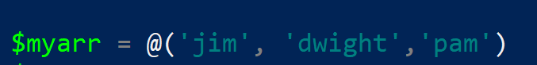

<https://www.tutorialspoint.com/powershell/index.htm>

A **cmdlet** is basically the name we give to Windows PowerShell
commands that use the **verb-noun** format.

# Getting started: Initialization and Configuration

## Script execution Permissions

Set permissions for new file in VScode:

**Set-ExecutionPolicy -Scope CurrentUser -ExecutionPolicy Unrestricted**

Set permissions to execute powershell files

**Set-ExecutionPolicy -ExecutionPolicy RemoteSigned -Force**

## Help system

### Update help system

**With internet**

**Updating help from file (no internet)**

- Step1: Save copy of help file(s) (on some internet-connected device)
  into a folder

  - save help -DestinationPath “C:\help” -force -verbose

- Step 2: On no-internet machine, update help pointing at help folder

  - update-help -SourcePath “C:\helpdownloads” -force -verbose

## Aliases and common commands

Can also use **gal** to get all aliases

Inversely, you can get alias of a cmdlet

- % - ForEach-Object

- ? – Where-Object

<https://www.youtube.com/watch?v=H0gwnFV_SFs>

**<u>Common Commands</u>**

# External Modules

About modules:
<https://www.udemy.com/course/windows-powershell-training/learn/lecture/39305530#overview>

Get available commands for a certain module

Get-Command -Module \<modulename\>

Get-Command -Module SharePointPnPPowerShellOnline

## Custom Powershell modules

<https://www.udemy.com/course/windows-powershell-training/learn/lecture/39319146#overview>

## Module Troubleshooting

### Installing “GET”: “WARNING: Unable to find module repositories”

With [the deprecation of TLS 1.0 and 1.1 for PowerShell Gallery as of
April
2020](https://devblogs.microsoft.com/powershell/powershell-gallery-tls-support/),
the cmdlets Update-Module and Install-Module became broken.
Thus, [according to this
article](https://dev.to/darksmile92/powershell-disabled-support-for-tls-1-0-for-the-gallery-update-module-and-install-module-broken-1oii),
some commands need to be executed to bring them alive again:

\[Net.ServicePointManager\]::SecurityProtocol =
\[Net.SecurityProtocolType\]::Tls12

Install-Module PowerShellGet -RequiredVersion 2.2.4 -SkipPublisherCheck

If that still doesn't work, then run the following commands:

\[Net.ServicePointManager\]::SecurityProtocol =
\[Net.ServicePointManager\]::SecurityProtocol -bor
\[Net.SecurityProtocolType\]::Tls12

Register-PSRepository -Default -Verbose

Set-PSRepository -Name "PSGallery" -InstallationPolicy Trusted

### Err Message: “No match was found for the specified search criteria and module name Error”

Install-Module: PackageManagement\Install-Package : No match was found
for the specified search criteria and module name Error

Try **Get-PSRepository** to see all available registered module
repositories.

Here is the troubleshooting checklist:

- It could be due to a typo in the module name (E.g., the “dot” at the
  end of the module name, in my case!). The right module name resolved
  the issue. Try Find-module \*Module-Name\* to check all available
  modules. E.g., Find-module \*Exchange\*

- Try setting the TLS1.2 for the .net Security protocol using:
  \[Net.ServicePointManager\]::SecurityProtocol =
  \[Net.SecurityProtocolType\]::Tls12

- Type: **Get-PSRepository**, If you get any error, Try running:
  **Register-PSRepository -Default**

- Try Re-installing the **PowerShellGet** module using: **Install-Module
  -Name PowerShellGet -Force**

  - <u>If this doesn’t work – then you may not even have
    PSGallery/PowerShellGet installed</u>

  - With [the deprecation of TLS 1.0 and 1.1 for PowerShell Gallery as
    of April
    2020](https://devblogs.microsoft.com/powershell/powershell-gallery-tls-support/),
    the cmdlets Update-Module and Install-Module became broken.
    Thus, [according to this
    article](https://dev.to/darksmile92/powershell-disabled-support-for-tls-1-0-for-the-gallery-update-module-and-install-module-broken-1oii),
    some commands need to be executed to bring them alive again

> **\[Net.ServicePointManager\]::SecurityProtocol =
> \[Net.SecurityProtocolType\]::Tls12**
>
> **Install-Module PowerShellGet -RequiredVersion 2.2.4
> -SkipPublisherCheck**

- If that still doesn't work, then run the following commands:

> **\[Net.ServicePointManager\]::SecurityProtocol =
> \[Net.ServicePointManager\]::SecurityProtocol -bor
> \[Net.SecurityProtocolType\]::Tls12**
>
> **Register-PSRepository -Default -Verbose**
>
> **Set-PSRepository -Name "PSGallery" -InstallationPolicy Trusted**
>
> ^ this may fail if its already installed, but it will still change
> installation policy from untrusted to trusted
>
>  style="width:5.25026in;height:0.62319in" />

- Now try installing your module using the “-scope” attribute.

  - E.g. **Install-Module -Name ExchangeOnlineManagement -Scope
    CurrentUser**

  - **Install-Module -Name ExchangeOnlineManagement -Scope AllUsers**

# Creating Custom cmdlets

<https://www.improvescripting.com/how-to-create-custom-powershell-cmdlet-step-by-step/>

1.  **Create CMDlet – save into file (**o365PermValidator.ps1**)**

    1.  Function Get-Hello {

    2.  \[CmdletBinding()\]

    3.  param (

    4.  

    5.  \[Parameter(Mandatory=$true,HelpMessage="Organization Name
        defined in Microsoft (Example:
        myorganization.onmicrosoft.com)")\]

    6.  \[string\]$OrganizationName, \# NAME OF PARAM

    7.  

    8.  \[Parameter(Mandatory=$true,HelpMessage="Tenant ID as defined in
        Azure (not to be confused with application id).")\]

    9.  \[string\]$TenantId \# NAME OF PARAM

    10. 

    11. 

    12. )

    13. BEGIN {

    14. 

    15. 

    16. }

    17. PROCESS {

    18. 

    19. Write-Host "Hello world!"

    20. 

    21. }

    22. END {

    23. 

    24. }

    25. 

    26. 

    27. }

2.  **Create module file (psm/psm1) containing references to modules you
    want to import (source other files)**

    1.  FILE: pbx_utils.psm1

        1.  . $PSScriptRoot\o365PermValidator.ps1

        2.  Or…

        3.  .
            C:\Windows\System32\WindowsPowerShell\v1.0\pbx\o365PermValidator.ps1

3.  **Snippet: Save a snippet to Import your module**

    1.  Import-Module
        C:\Windows\System32\WindowsPowerShell\v1.0\pbx\pbx_utils.psm1
        -Scope Global

    2.  Or..

    3.  Import-Module C:\Probax2\o365_perm_validator.ps1 -Verbose -Scope
        Global

4.  **Find your profile file:**
    <https://www.improvescripting.com/how-to-create-powershell-profile-step-by-step-with-examples/>

    1.  This is the “Everyone” profile: $profile.AllUsersAllHosts

    2.  

5.  Save step 3 snippet into profile file

# Scripting

## Piping/STDIN/STDOUT

**See which commands accept piping input**  
- on sending command...  
- use gm to view command type  
- on receiving command...  
- use help with full flag to see which type is accepted as pipe input
(see InputObject parameter ) and match sure we can accept pipeline input

### Out-File

Output results to a file

### Import-csv (piping)

Use Import-csv -to pipe to another command.. Where the second command
accepts pipeline input by some parameter (name for example) and there
there exists some field in the csv of the same name.

## Conditionals and IF statements

If statement

Note: Piping an array to a file just prints each entry to it’s own line.

**Pipeline Chain operators (short-circuiting) \[V7\]**

Version 7 also supports ternary operators.

## Filtering and Formatting

### Select-String (grep)

<https://adamtheautomator.com/powershell-grep/>

### Searching files for text (grep-ish)

Get-ChildItem -Recurse | Select-String "\<string\>" -List | Select path

To get only path

Get-ChildItem -Recurse | Select-String "\<string\>" -List | Select path

Best

-- Windows Grep

dir -recurse \*.\* | sls -pattern "foobar" | Select -unique Filename

-- Grep for M365 onboards

dir -recurse \*.\* | sls -pattern "applicationCertificate" | Select
-unique Filename

### Filtering results from Object

Using **Where-Object** you can filter by **Property** or **Value** (and
more)

^ you can filter with -Like, -NotLike, and more

You can use a question mark (?) as an alias for Where-Object

### Formatting as table

Using **Format-Table**

### Select-Object

Using **Select-Object**

Both **Select-Object** and **Get-Member** accept an object as piped
input or they can use the -InputObject switch to reference an object
inline.

### Getting top, last, uniques, skip

Pipe results into **Select-Object** and use with flags like First, Last,
Skip, Unique, and ExcludeProperty

## Arrays

Loop through arrays with **foreach** loop

## ArrayLists

Arrays are of fixed size and thus less performant on large datasets
(over 100 items) than ArrayLists. Arrays can be casted as an ArrayList
using \[System.Collections.ArrayList\].

For example:

$characters = \[System.Collections.ArrayList\]@('jim', 'pam').

ArrayLists do support a variable size.

## Objects/Hashtable

Assigned with equal signs, separated by semicolons.

View
type…

### Add to object

### Get-Member (gm)

List all properties and methods of a command’s results

Both **Select-Object** and **Get-Member** accept an object as piped
input or they can use the -InputObject switch to reference an object
inline.

### Adding custom property

^ “NoteProperty” is a type of custom property.

Using ForEach

### Looping through an array of objects

Each object…

Building array…

Looping…

### Splatting

<https://www.youtube.com/watch?v=CkbSFXjTLOA>

Splatting allows you to pass in an object as a collection of
parameters/values.

For example, instead of typing all this

We can type this

$myobject = @{  
"Name" = 'thisname'  
}  
  
Get-Something @myobject

### Complex Hashes

Using
Begin, Process, and End params

## Function

### Scope

### Advanced Function

Outline

^ Don’t need the Cmdlet binding?

## ScriptBlocks

A script block just is a function that can be saved into a variable and
thus passed into other functions or executed remotely.

Multi-line

It cannot be called as a normal function – doing so just prints out the
content

Call it by prepending with an ampersand

Full example

**Use cases…**

a

## Loops

### ForEach-Object

<https://riptutorial.com/powershell/example/3665/foreach-object>

### Foreach

Foreach: iterates over Arrays and does not accept piped input. Items
iterated over are copies of items, not the items themselves. Instead of
piped input one can call this as a method on an array using dot
notation.

Get index of loop

| % -Begin { $i=0;} -Process { $\_,$i;$i++; }

### **How to use custom headers in the PowerShell output table?**

### Give a default value to entries of a given field

## File management

### Export simple array (one column) to csv

$restore_details = ()

$restore_details += ‘First thing’

$restore_details += ‘Second thing’

$restore_obj = $restore_details | ForEach-Object {
\[PSCustomObject\]@{'Value' = \\\_} }

$restore_obj | Export-Csv -Path “.\test.csv” -NoTypeInformation

### Exporting array to csv (multi-column)

The best way to create export to csv is to create an array full of rows
– each of which (row) is an object where the key serves as the column
and the value, the value in that row.

**<u>Create array</u>**

**<u>Add rows to array</u>**

*This is better – preserves column odering*

$results += \[pscustomobject\] @{ 'Status' = 1; 'Type' = "exchange" ;
'File' = $item }

Preview + export array

Csv

### Adding file select window

**Example**

Script

### Append to JD 

### Append to CSV

*Pseudo-code*

**<u>Full code</u>**

Load csv and accept new record information

Columns in csv are FirstName and LastName – so creating new record
(PSCustomObject) of same format

Add to csv

### Append to JSON

# Remote Sessions

- **Invoke-Command**: Executes powershell on a remote machine with the
  **ComputerName** param – can accept a comma-separated list of machines
  to execute on multiple machines. Uses WinRM service.

  - -ScriptBlock : Pass in a script block with this param.

  - -Session: Specify a session so you can run multiple commands and
    reference the same session.

- **New-Session**: Creates a new PSSession

- **Get-PSSession**: View sessions

- **Enter-PSSession**: Enter into an interactive session.

  - Can be used to SSH into a Linux machine that only has ssh set up
    with password auth.

  - 

Note, **ComputerName** param is another computer on the same domain.
This is distinct from HostName which can be an ip for example. The
HostName param was added with Powershell 7 where SSH-based remoting was
made possible.

# System Information

## Check if listening on a port

Get-Process -Id (Get-NetTCPConnection -LocalPort
YourPortNumberHere).OwningProcess

Get-Process -Id (Get-NetTCPConnection -LocalPort 9191).OwningProcess

## Get scheduled tasks

## Running Process retriever

These three commands can work

## Get version number

**Method 1**

**Method 2**

# Troubleshooting and error handling

## What-If

See what will happen if command is executed

## Try…catch

## Logging command session in output file

Start-Transcript/Stop-Transcript

^ anything you write in between those commands will be logged.

Transcript file:

\*\*\*\*\*\*\*\*\*\*\*\*\*\*\*\*\*\*\*\*\*\*

Windows PowerShell transcript start

Start time: 20220920133028

Username: LEGION7\Bobby

RunAs User: LEGION7\Bobby

Configuration Name:

Machine: LEGION7 (Microsoft Windows NT 10.0.22000.0)

Host Application:
C:\Windows\System32\WindowsPowerShell\v1.0\powershell.exe

Process ID: 37832

PSVersion: 5.1.22000.832

PSEdition: Desktop

PSCompatibleVersions: 1.0, 2.0, 3.0, 4.0, 5.0, 5.1.22000.832

BuildVersion: 10.0.22000.832

CLRVersion: 4.0.30319.42000

WSManStackVersion: 3.0

PSRemotingProtocolVersion: 2.3

SerializationVersion: 1.1.0.1

\*\*\*\*\*\*\*\*\*\*\*\*\*\*\*\*\*\*\*\*\*\*

Transcript started, output file is
C:\Users\Bobby\Documents\PowerShell_transcript.LEGION7.6QC+6Xdc.20220920133028.txt

PS C:\Users\Bobby\> Write-Host "Hey guiys"

Hey guiys

PS C:\Users\Bobby\> Stop-Transcript

\*\*\*\*\*\*\*\*\*\*\*\*\*\*\*\*\*\*\*\*\*\*

Windows PowerShell transcript end

End time: 20220920133051

\*\*\*\*\*\*\*\*\*\*\*\*\*\*\*\*\*\*\*\*\*\*

# Workflow and Automation

## Use batch file to run powershell scripts

**Explainer article**:
<https://www.howtogeek.com/204088/how-to-use-a-batch-file-to-make-powershell-scripts-easier-to-run/>

*“Let's start by addressing the first problem - .PS1 file associations.
You can't double-click to run .PS1 files, but you can execute a .BAT
file that way. So, we'll write a batch file to call the PowerShell
script from the command line for us.”*

*“So we don't have to re-write the batch file for every script, or every
time we move a script around, it's going to make use of a
self-referencing variable to build the file path for the PowerShell
script. To make this work, the batch file will need to be placed in the
same folder as your PowerShell script and have the same file name. So if
your PowerShell script is called "MyScript.ps1", you'll want to name
your batch file "MyScript.bat" and make sure it's in the same folder.
Then, put these lines in the batch script:”*

@ECHO OFF

PowerShell.exe -Command "& '%~dpn0.ps1'"

# Networking Tools

*Called **Test-Network-Connection** in windows*

# Powershell and linux

## Restarting WSL

This restarts the vvmem process

Restart-Service LxssManager

## Install powershell on linux

**Ubuntu:**

<https://docs.microsoft.com/en-us/powershell/scripting/install/install-ubuntu?view=powershell-7.2>

# Security

## Certificates

<https://shellgeek.com/how-to-get-certificates-using-powershell/>
