**FUNC : Indicates a function/method**

**Resources**

- Helpful Link: [Python for JavaScript
  Programmers](http://hg.toolness.com/python-for-js-programmers/raw-file/tip/PythonForJsProgrammers.html)

- Helpful Link: [Python Documentation](https://docs.python.org/3/) (see
  tutorial section)

- Helpful Link: [JavaScript
  Equivalents](https://dev.to/djangotricks/equivalents-in-python-and-javascript-part-1-3317)

**Python is…**

- General purpose programming language

- A high-level (abstracted) code which requires a interpreter.

- After installing Python, use ‘py’ in the CLI to run python code

- Exit python with Ctrl + Z

# Installation

## Ubuntu: installing latest python version

**Method 1: Apt (preferred)**

<https://phoenixnap.com/kb/upgrade-python>

*Install new version*

sudo apt update && sudo apt install python3.9 -y

*You should see two versions now – python3 pointing to old one (3.10
here)*

However, checking the installation with the python3 --version command
still returns the old version. To fix this, you need to create a list of
update alternatives. First, add the old version to the list with the
command:

sudo update-alternatives --install /usr/bin/python3 python3
/usr/bin/python3.\[old-version\] 1

Now add the new version:

sudo update-alternatives --install /usr/bin/python3 python3
/usr/bin/python3.9 2

Next, type the following command to configure the priority status of the
versions:

sudo update-alternatives --config python3

The output displays the available choices and their assigned number (in
the example below, the numbers are **0**, **1**, **2**). Type the number
of the the version you wish to use and press **Enter**.

**Optional cleanup: Update symlink**

If you are not planning to use the old version of Python, remove
the [symlink](https://phoenixnap.com/kb/symbolic-link-linux) that
contained the previous Python 3 version with:

sudo rm /usr/bin/python3

Then, replace the symlink with the new version:

sudo ln -s python3.9 /usr/bin/python3

One liner:

sudo rm /usr/bin/python3 && sudo ln -s $(which python3.9)
/usr/bin/python3

Now, check the default version:

python3 --version

Good to install latest pip version as well

**Method 2: PPA**

<https://cloudbytes.dev/snippets/upgrade-python-to-latest-version-on-ubuntu-linux>

# Basics

## General

- **FUNC type()**

- **FUNC len()** : returns the length of the
  entity passed in.

- **Dot notation** is used to access methods (as in JS)

**Check variable type**

<https://pytutorial.com/python-check-variable-type>

print(type(variable_1))

\#check the typle of variable_2

if type(variable_2) is str:

print("Yes it is")

## Command line arguments

**Argparse**

\# Import the library  
import argparse# Create the parser  
parser = argparse.ArgumentParser()# Add an argument  
parser.add_argument('--name', type=str, required=True)# Parse the
argument  
args = parser.parse_args()# Print "Hello" + the user input argument  
print('Hello,', args.name)

## Scope

**Key note**: Inside a function, global variables can be *accessed*
without the global keyword, but they cannot be *manipulated* unless the
global keyword is used.

To be precise, if refers to any *ancestor* variables.

**Example of Enclosing:**

**Local Reassignment**

**Global Reassignment:**

Preferred method:

Always preferrable to only change variables within same scope.

Meaning it’s best to pass in global variables into a function and return
a new value and allow the reassignment to occur in the proper scope

# Operators

## Ternary Operator

**Syntax**

\[on_true\] if \[expression\] else \[on_false\]

$positive_or_negative "Negative" if x\<0 else "zero" if a==0 and
ome_condition == False else "Positive"

# Data Structures

## Strings

### Text/Iterables

- Escape characters with backslash or mixed single/double quotes.

- Multi-line string: Use triple quotes .

<!-- -->

- **Slicing**: You can select a range by using a colon with two values
  (first and last) the last value is not inclusive. Leaving either side
  empty will assume to start from the beginning/end of that side.

  - 

- Join – join list into a string

  - new_string = “\_”.join(cool_list) -\> joins by an underscore

- Split – Split string into an list

  - New_list = cool_list.split(‘\_’) -\> Splits by an underscore. Keep
    blank (not empty string) to split by single space.

### Interpolation

### Formatting

#### Apply a style guide to a file

#### Apply text interpolation in input prompt

The “%s” will be replaced by anything after the “%”.

## Dictionaries

- Using **in** checks for the presence of keys not values

- Dictionary Methods

  - **items()** returns a nested array of keys and values

  - **keys()** returns an array of keys

  - **values()** returns an array of values

    - can use **in** here to check for presence of values since **in**
      works on any array

  - **clear()** clears all keys/values

  - **copy()** copies a dict

  - **pop()**

  - **pop1()** (no args remove last in list.

  - **popitems()** pass in

### pop

Requires at least one arg .

### popitem

### update

Literally updates – adds and edits based on dict passed in.

If key doesn’t exist it adds it.

This happens in place – doesn’t return a value.

In **dict2.update(dict1)** – “dict2” is being merged into “dict1” – thus
“dict1” has precedence.

Another method:

### fromkeys

Assign a value to all keys specified. A good way to initialize a
dictionary where lots of keys can be initialized with the same value.

Best to use a list in the first arg – though any iterable can be used:

initial_game_state = dict.fromkeys(game_properties,0)

### see if key/value exists in dictionary

“bobby” in ages.keys()

“32” in ages.values()

### Get (better than in)

Arguably better than bracket notation since you don’t get an error if no
value exists – it just returns **None**. Moreover, you can pass in a
second argument which will serve as a default value if **None** is
returned

user.get(‘age’,32)

This is great for setting a value of a dictionary if you aren’t sure if
the key is in the dictionary.

### Dictionary Comprehension

Conditional logic can be done on both keys and values.

**Another example**

## Sets

Get count of unique items in a list…

len(set(my_cool_list))

### Methods

Note: Discard - **discard()** is preferred to avoid errors when trying
to remove non-existent elements.

**Union (pipe operator)**

*Returns all unique values in both lists*

**Intersections**

*Return all members that are in both sets*

### Set comprehension

## Tuples

Lists in parens that are immutable.

The inverse of an array declared with const in JS. Though we can’t
change the values of a tuple itself (i.e. modify any elements of the
tuple) we can still modify that defines the tuple.

This is special because you cannot use a list as a key in a dictionary
(but you can use a tuple).

**Single-item tuples**

Will be followed by a single comma to distinguish from parens

**Turn tuple into list**

### Methods

## Lists

### Adding items (list methods)

- append(\<element\>) – insert at end

- insert(\<index\>, \<element\>)

### Removing items (list methods)

- pop() – remove last item (returns value)

- del coollist\[1\] – remove by index (only deletes first occurence)

- remove(\<value\>) – remove by value

### Any (check for any falsy values)

### List Comprehension

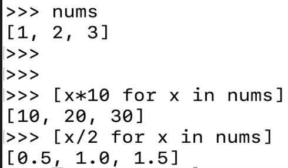

### List Comprehension and conditional logic

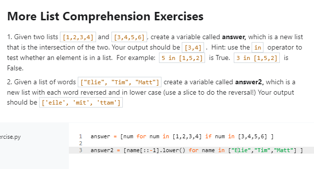

*Note: Ranges are not inclusive whereas **int.randomint()** is*

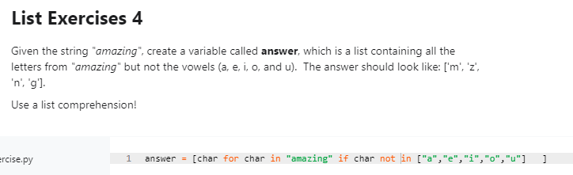

### Nested List Comprehension

**Another example**

### Enumeration

Enumerate – give me the index too bro

Can also expand tuples

Also great for looping through arrays while getting the index/value:

### Get intersections between two lists

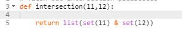

### Slicing

## Copying a list

copied_list = og_list\[:\]

# Functions

## Pass statement

When you are in a block of code and you intend that block to be empty
(like an if statement for example) you can just use the pass keyword to
indicate no code is needed here. Just leaving it empty will throw an
error.

## Docstrings

return

## Closure

## \*args, \*kwargs, and unpacking (rest and spread)

### List Unpacking (rest operator)

\*args is like the rest operator in JS.

### \*\*kwargs

### \*args and \*\*kwargs (together)

### Unpacking lists/tuples

Equivalent to the spread operator.

### Unpacking dictionaries

In this case (below) the arg was a dictionary that was unpacked (i.e.
spread into params and args) and in the function itself, these were
re-packed with kwargs:

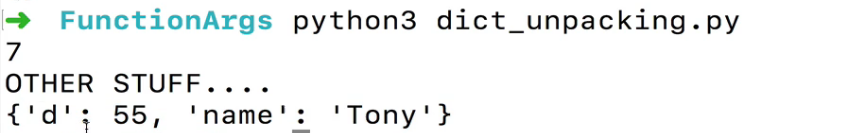

### Default Parameters and Keyword arguments

## Lambdas

*Seem just like one-line arrow functions in JS – just need to prefix
with “lambda”*

A lamba with no args…

**lamba: print(“Ayooo”)**

Also, lambda functions are perfect when passing in simple functions as a
callback (for example when used on a list method).

## Decorators

<https://www.youtube.com/watch?v=r7Dtus7N4pI>

**Decorator functions mean**… “For this function **@superfunc** pass in
the following function as an argument… *def…*”  

### Decorator metadata

### Decorators with different signatures

### Ensure Authorized

### Only Ints

### Ensure no kwargs

### Show Args Decorator

### Example : Speed Test Detector

## Useful built-in functions

### Working with iterables

Interesting to note that methods called on lists, are usually specific
to lists. Whereas built-in functions ***where we pass-in*** a list (for
example) usually accept *any iterable* – which includes lists, tuples,
dictionaries, and even generators. Though these built-in functions tend
to return iterators/generators which can be converted into a list if
needed.

#### Zip

Nice for creating dictionaries

Merges multiples lists together per record – sort of like a join in SQL

**Zip unpacking**

Use the star operator to unpack- notice how first element of each tuple
is placed into a new tuple and every 2nd element in initial
tuple is placed into a new tuples, etc etc

##### Using zip to get highest value in dict

^ noticed how we’re zipping the values first – because these are the
values we want so get the max. Otherwise, put keys first.

##### Zip to get max

You can also do something like this to get the max for each pair (tuple)

##### Creating a dict using username as key and max value as value…

##### Using map and lambda

##### Using zip on map on zip

Refactor!

#### Len

This is also a built-in method on iterables

In fact all the len function does call the \_\_len\_\_() method on the
value passed in and all the \_\_len\_() does is return the length on the
element passed in. See below how we define \_\_len\_\_ from scratch wen
creating a class.

Above we are returning an arbitrary length – but we can also use this to
return the actual length of some property of the class itself:

#### Map

***Function accepts two args: function(often a lambda) and iterable and
returns a map object***

Convert map object to list

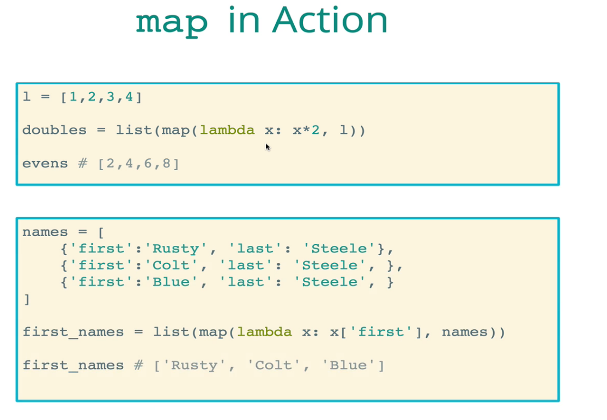

#### Filter

#### Filter and Map

Notice how you can run map on a filter object and don’t need to convert
it to a list first.

List comprehension can at times be cleaner:

#### All

#### Any

#### Sorted

This is non-destructive – unlike the sort method

Reverse order

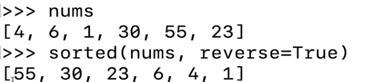

**Sorting dictionaries**

Key = what we want to sort by

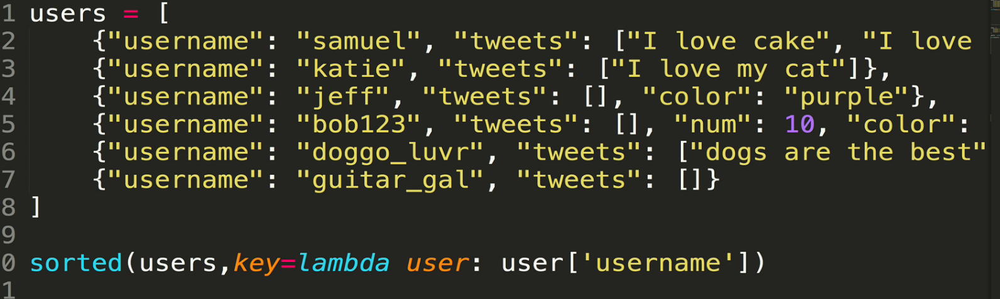

Sort by length of a list stored in the keys

As a final arg, you can still reverse

**Another example**

#### Note on list comprehensions and generator expressions

If we are using list comprehension to merely pass the list into another
function (such as map, filter, any, etc) we can omit the square
brackets. This will output a generator object which functions like map,
filter, etc can still accept.

### Math and numerical

#### Round

#### Sum

#### Abs (returns unsigned)

#### Min/Max

Get shortest length

**Second arg**

Passing in a second arg (just like with sorted function) so we can
specify what key we want to reference when calculating min/max.

Example below – give element with shortest length:

Another example, song with shortest play count

Since the above example returns the entire element – in this case a
dictionary, we can reference a value in that dictionary by adding on the
key to the end

## Iterators and Generators

Generators are iterators, but not all iterators are generators.

Top of Form

Bottom of Form

### Iterator

#### Simple example

**Example**

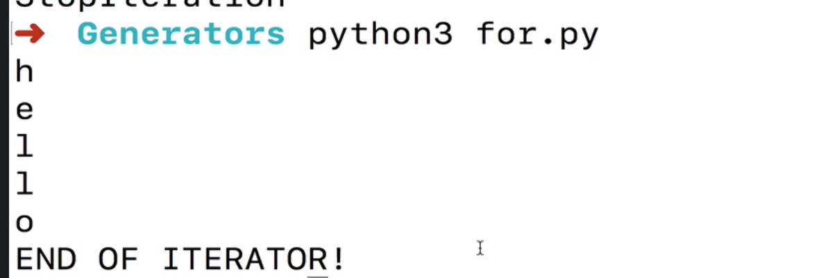

**Example**

**Example**

### Iterators and the \_\_iter\_\_ special method

**iter()** is a function that calls the \_\_iter\_\_ special method on
an iterable.

### Generator

Calling this function does nothing but returns a generator.

If the “next” method is called, the yield statement returns the current
value and stays that way until the “next” method is called in which case
it will move through the next line of code where it left off (where
count is increased in the example).

^ above returns generator object into “counter”.

#### Further Examples

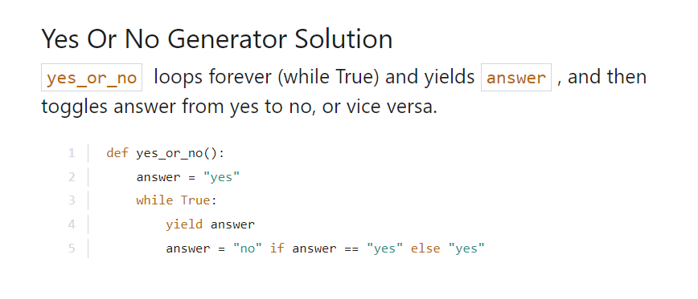

# OOP (Object-Oriented Programming)

## Classes and subclasses

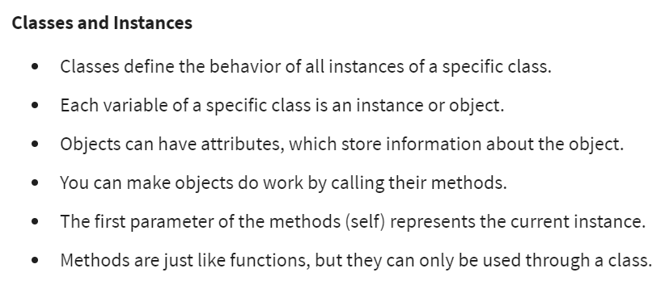

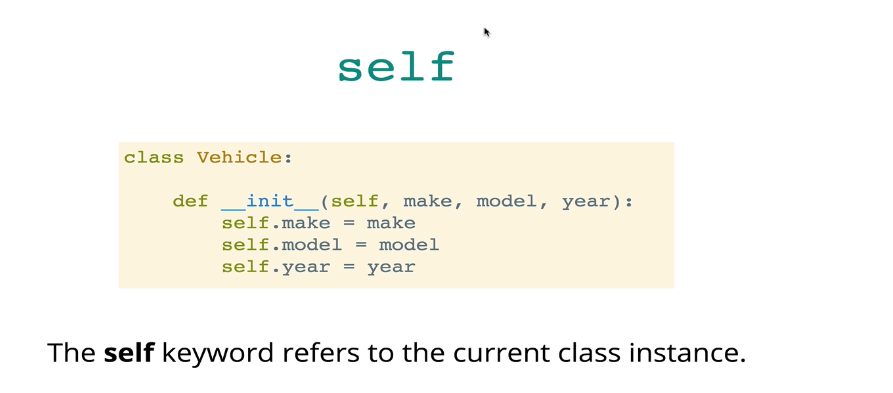

### More class examples

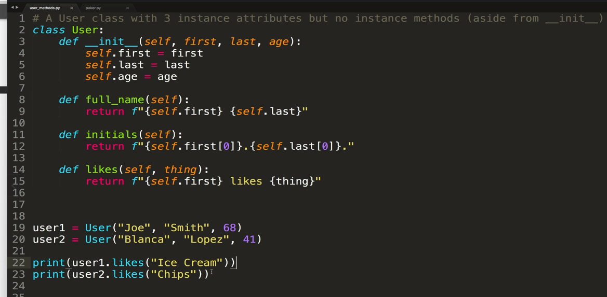

**With subclass:**

### Composition

**Using classes as properties of other classes is an example of Object
Composition.**

You can have a situation where two different classes are related, but
there is no inheritance going on. This is referred to as **composition**
-- where one class makes use of code contained in another class. For
example, imagine we have a **Package** class which represents a software
package. It contains attributes about the software package, like name,
version, and size. We also have a **Repository** class which represents
all the packages available for installation. While there’s no
inheritance relationship between the two classes, they are related. The
Repository class will contain a dictionary or list of Packages that are
contained in the repository. Let's take a look at an example Repository
class definition:

class has its own dictionary.

We then define the add_package method, which takes a Package object as a
parameter, and then adds it to our dictionary, using the package name
attribute as the key.

Finally, we define a total_size method which computes the total size of
all packages contained in our repository. This method iterates through
the values in our repository dictionary and adds together the size
attributes from each package object contained in the dictionary,
returning the total at the end. In this example, we’re making use of
Package attributes within our Repository class. We’re also calling the
values() method on our packages dictionary instance. Composition allows
us to use objects as attributes, as well as access all their attributes
and methods.

### Mutable Attributes

If you have a mutable attribute (say a list or dict) and you initialize
this as a class property, then all instances will share the same
attribute. Thus, making an edit from an instance affects all other
instances. Instead, declare in the constructor.

### Class Attributes

**Defining:**

**Referencing a class attribute**:

*Call on the class itself.*

***Prototypal Inheritance:***

Class attributes are accessible by instances and refer to the same info
that sits on the class itsef. This can be proven by grabbing the memory
address by using the id method.:

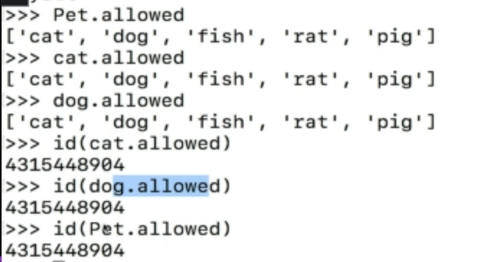

### Class Methods

### String Representation

This has to do with what gets returned when the class itself is
referenced in python.

### Isinstanceof

Use to see if a given object is an instance of some class

^ Checks if “other” is an instance of “Human”.

### Getters and setters

The **getters** and **setters** keyword allows us to define methods in
an object (or class by extension) which can be called as properties on
the object. (Can also be used on Classes). Getters and setters allow us
to define private variables that cannot be directly accessed/set on the
class instance.

- **<u>Getters</u>**: Use the ***property** decorator* to prefix a
  method which will serve as a **getter**. Getters will return some data
  after some computation.

- **<u>Setters</u>**: Use the ***property** decorator* to prefix a
  method which will serve as a **setter**. Setters will also run a
  computation but instead of returning the data, it will merely change
  another property if the object.

**Getter example:**

Though we are returning the property name prefixed-by a single
underscore, we can access that property without the underscore.
Technically we aren’t touching the **\_age** property at all. Rather, we
are calling the age method. The difference is getters are methods that
can be called without parens, but called upon as if they are properties.

Note: the name of the getter method determines how we call it. For
example, if the class method was called “**yearsalive**” we would have
to call it like jane.yearsalive and we can still return the private
property
\_age.

**Setter example:**

Prefix your function name with a decorator calling the setter property
on the function.

Calling the setter to update the age private property is the same as
accessing a property:

### Multiple Inheritance

Penguin inherits from both

Notice that when calling the gree method (which exists on both parent
classes) the one fromAmbulatory was called. This is because this is the
first parent class- so this is the class referred to by the **super**
function. If you want to inherit from the second class as well

Explicit..

Refactored

#### Method resolution order (MRO)

What are three ways to look up MRO for the class Penguin ?

Because of MRO, we can create a subclass based off of the dict object
itself.

^ No **\_\_init\_\_** method needed as we will “look up the prototype
chain” (as we say in JavaScript) and find the nearest init method.

## Polymorphism

***More special methods (magic methods)***

### An example using the representation method

The **\_\_repr\_\_** method (representation) determines what gets
returned when referencing am object. Especially useful when printing an
object and you want to overwrite the default output which usually looks
something like: \<\_\_\_abc\_\_\_.YouObj at 0x103043\>

More on the representation method

### Creating/Overwriting a special method

The plus sign invokes a special method in python named “\_\_add\_\_”
which we can overwrite where present or add where not.

You can also do the same with the multiplication operator:

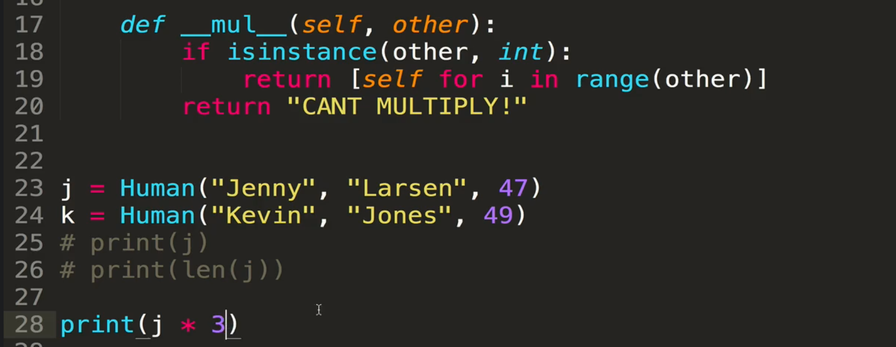

Note that the order matters as ‘self’ refers to the entity on the left
(since this invoked it). Thus, in this case “j” does have the
**\_\_mul\_\_** method. Reversing the order ( 3 \* j ) wouldn’t work as
the number ‘2’ doesn’t have a **\_\_mul\_\_** method.

That produces a list comprehension with the same three objects. Same
because we are sending self every time = referring to the same object.
To fix this we can use the copy module:

The **\_\_missing\_\_** method is called when we are trying to access a
non-existen dictionary key:

Setting a value as well:

Some other special methods called on a dictionary:

# Modules

## Generator Expression

Equivalent to the VMCE…

## General and built-in modules

- Import entire module

  - **import \<module name\>** *or…*

  - **import \<module name\> as cool_mod**

> *Concrete…*

- **import random as rando**

<!-- -->

- Import a function from a module

  - *Note: Using this method, you call the function by the function name
    – by **module.function** using dot notation since we aren’t actually
    importing the entire module.*

  - **from \<module name\> import \<function name\>** *or…*

  - **from \<module name\> import \<function name\> as cool_mod**

> *Concrete…*

- **from random import randint as randy**

Built-in modules don’t require installation. External modules we have to
use you pip module manager to install a module and the the import
command to import these modules into our working project. This is just
like Node js where we can just require some built-in modules (like http,
or fs) and external modules would have to be imported first (using npm
install where the package.json keeps track of all of our installed
external modules).

Multiple function importing

## Custom modules

## External modules (and pip)

Main**:**

- **Install pip3** (if not already installed)

  - sudo apt install python3-pip \#python 3

  - sudo apt install python-pip \#python \<3

- **Upgrade pip version**

  - python -m pip install --upgrade pip

- **Install packages**

  - python3 -m pip install \<SomeProject\>

Examples:

- Install SQL Server package

  - python3 -m pip install pymssql

- Install MySQL package

  - python3 -m pip install mysql-connector-python

Use the built-in help function to get details about a functions
structure

Auto-pep8 module

**Troubleshooting**

If you see “Circular reference” it may be because you are importing a
module with the same name as a file you created.

**pip3 vs python -m pip**

<https://snarky.ca/why-you-should-use-python-m-pip/>

## The \_\_name\_\_ variable

# Virtual Environment

Installing Virtual Environment & Dependencies prevents any potential lib
conflicts.

## Setting up virtual environment

**\[METHOD 1\] Setup your virtual environment:**

Make sure you have the virtual environment package installed:

\`sudo apt install python3.8-venv\` or \`sudo apt install python3-venv\`

Create environment + source it:

\`python3 -m venv env\` \# Where 'env' is the name of your environment

\`source env/bin/activate\`

**\[METHOD 2\] Setup your virtual environment:**

Make sure you have the virtual environment package installed:

sudo apt install python3-dev libffi-dev build-essential
virtualenvwrapper -y

Configure/Activate Virtual Envinronment Wrapper (source it):

. /usr/share/virtualenvwrapper/virtualenvwrapper.sh

Create new Virtual Environment:

mkvirtualenv --python=$(which python3) env \# where ‘env’ is environment
name

or

virtualenv env

**Difference**

**mkvirtualenv** is command under ***virtualenvwrapper*** which is just
a wrapper utility around **virtualenv** that makes it even easier to
work with.

**Exiting a virtualenvironment**

Run “deactivate”

## Creating a requirements.txt file

Instead of uploading your “env” folder – it’s preferred to create a
“requirements.txt” file and users can import what they need and make
their own virtual environment.

***Example***: pip3 install pipreqs && pipreqs .

Sometimes you come across pip freeze, but this saves all packages in the
environment including those that you don't use in your current project.

## Installing from a requirements.txt file

***Python3:*** pip3 install -r requirements.txt

**Creating a virtual end and installing from requirements.txt in one
go:**

virtualenv env && source env/bin/activate && pip3 install -r
requirements.txt

## Loading values from a .env file

*\# load_dotenv =\> Looks for ./.env file by default and saves values an
environment variable which you can access with os.getenv("MY_VAR")*

# Concurrency and Parallelization

**Concurrency** is the idea is doing multiple things at the same time.
**Parallel processing or “parallelism”** is a type of concurrency that
has to do with distributing your workload among **multiple threads
(known as threading or mutli-threading) or multiple processes (known as
Multiprocessing or Parallelism – making use of idle CPU cores)**.

<https://realpython.com/python-concurrency/>

Coursera:
<https://www.coursera.org/learn/troubleshooting-debugging-techniques/lecture/JSjDh/using-threads-to-make-things-go-faster>

Our company has an e-commerce website that includes a bunch of images of
the products that are up for sale. There's a rebranding coming up, which
means that all of these images will need to be replaced with new ones.
This includes both the full-size images and the thumbnails. We have a
script that creates the thumbnails based on the full-size images. But
there's a lot of files to process, and our script is taking a long time
to finish. It looks like it's time to take it up a notch and use
something better to do the resizing. We'll start by trying out the
current script as-is using a set of 1,000 test images. There's more
images to convert, but it'll be easier to test the speed of our script
with a smaller batch. We'll execute our program using the time command
to see how long it takes.

It took about two seconds for 1,000 images. This doesn't seem too slow,
but there's tens of thousands of images that need converting, and we
want to make sure that the process is as fast as possible. Let's try
making this go faster by having it process the images in parallel.

First, import the futures function from the concurrent module:

from concurrent import futures

## Processes vs threads

(continuing from above) This is because, by using processes, we're
making even more use of the CPU. The difference is caused by the way
threads and processes work in Python. Threads use a bunch of safety
features to avoid having two threads that try to write to the same
variable. And this means that when using threads, they may end up
waiting for their turn to write to variables for a few milliseconds,
adding up to the small difference between the two approaches.

Threads exist within a single process and can share the same memory
space as the process they are a part of – so threads can communicate
with one another via the shared memory space inside that process.

## A. Concurrency module using threads (multi-threading)

We'll start by importing the futures sub module, which is part of the
concurrent module. This gives us a very simple way of using Python
threads.

To be able to run things in parallel, we'll need to create an executor.
This is the process that's in charge of distributing the work among the
different workers. The futures module provides a couple of different
executors, one for using threads and another for using processes. We'll
go with the ThreadPoolExecutor for now.

Now the function that does most of the work in this loop is
process_file. Instead of calling it directly in the loop, we'll submit a
new task to the executor with the name of the function and its
parameters.

Our for loop now creates a bunch of tasks that are all scheduled in the
executor. The executor will run them in parallel using threads. An
interesting thing that happens when we use threads is that the loop will
finish as soon as all tasks are scheduled. But it will still take a
while until the tasks complete. So we'll add a message saying that we're
waiting for all threads to finish, and then call the shutdown function
on the executor. This function waits until all the workers in the pool
are done, and only then shuts down the executor.

All right, we've made the change, let's save our script and test it out.

Our script now takes 1.2 seconds. That's a nice improvement over the two
seconds we saw before. See how the user time is higher than the real
time? By using multiple threads, our script is making use of the
different processors available in the computer. And this value shows the
time used on all processors combined. What do you think will happen if
we try to use processes instead of threads? Let's try this out by
changing the executor that we're using.

## B. Concurrency module using individual processes (multiprocessing/parallelism)

By changing the executor to the ProcessPoolExecutor, we tell the futures
module that we want to use processes instead of threads for the parallel
operations. Let's save and try this one out now.

Wow, this is now taking less than a second to finish, and the user time
has gone up even more.

## CPU Bound (multiprocessing module)

### concurrent.futures.ProcessPoolExecutor vs multiprocessing.pool.Pool

**concurrent.futures.ProcessPoolExecutor** is a wrapper for
**multiprocessing.pool.Pool** but since the latter has more fine-grained
functionality, it’s preferred for fixing issues like a system being CPU
bound.

(taken from
<https://stackoverflow.com/questions/20776189/concurrent-futures-vs-multiprocessing-in-python-3>)

it's a simpler interface that works very much the same regardless of
whether you use multiple threads or multiple processes as the underlying
parallelization gimmick.

So, like virtually all instances of "simpler interface", much the same
trade-offs are involved: it has a shallower learning curve, in large
part just because there's so much less available to be learned; but,
because it offers fewer options, it may eventually frustrate you in ways
the richer interfaces won't.

So far as CPU-bound tasks go, that's way too under-specified to say much
meaningful. For CPU-bound tasks under CPython, you need multiple
processes rather than multiple threads to have any chance of getting a
speedup. But how much (if any) of a speedup you get depends on the
details of your hardware, your OS, and especially on how much
inter-process communication your specific tasks require. Under the
covers, all inter-process parallelization gimmicks rely on the same OS
primitives - the high-level API you use to get at those isn't a primary
factor in bottom-line speed.

### Introduction

CPU bound means the program is bottlenecked by the CPU (Central
Processing Unit). When your program is waiting for I/O (e.g., disk
read/write, network read/write), the CPU is free to do other tasks, even
if your program is stopped. The speed of your program will mostly depend
on how fast that I/O can happen; if you want to speed it up, you'll need
to speed up the I/O. **If your program is running lots of program
instructions and not waiting for I/O, then it's CPU bound (it’s going as
fast as it can given the CPU it can use). Speeding up the CPU will make
the program run faster.**

In either case, the key to speeding up the program might not be to speed
up the hardware but to optimize the program to reduce the amount of I/O
or CPU it needs. **We can “speed up the CPU” by allowing your program to
run on multiple processors at once. Balancing your code like this is
called “multiprocessing”.**

Or you can have it do I/O while it also does CPU-intensive work. CPU
bound implies that upgrading the CPU or optimizing code will improve the
overall computing performance.

In order to check how much your program utilizes CPU, you first need to
install the **pip3** which is a Python package installer. This downloads
and configures new Python modules with single-line commands. For any
pop-up messages, when the prompt *Do you want to continue appears*,
type **‘Y'**.

sudo apt install python3-pip

psutil (process and system utilities) is a cross-platform library for
retrieving information on running processes and system utilization (CPU,
memory, disks, network, sensors) in Python. It's mainly useful for
system monitoring, profiling, and limiting process resources and
management of running processes. Install the psutil python library using
pip3:

pip3 install psutil

Import psutil python3 module for checking CPU usage as well as the I/O
and network bandwidth.

import psutil

psutil.cpu_percent()

This shows that CPU utilization is low. Here, you have a CPU with
multiple cores; this means one fully loaded CPU thread/virtual core
equals 1.2% of total load. So, it only uses one core of the CPU
regardless of having multiple cores.

After checking CPU utilization, you noticed that they're not reaching
the limit.

So, you check the CPU usage, and it looks like the script only uses a
single core to run. But your server has a bunch of cores, which means
the task is **CPU-bound**.

Now, using psutil.disk_io_counters() and psutil.net_io_counters() you'll
get **byte read** and **byte write** for disk I/O and **byte
received** and **byte sent** for the network I/O bandwidth. For checking
disk I/O, you can use the following command:

psutil.disk_io_counters()

For checking the network I/O bandwidth:

psutil.net_io_counters()

After checking the disk I/O and network bandwidth, you noticed the
amount of **byte read** and **byte write** for disk I/O and **byte
received** and **byte sent** for the network I/O bandwidth.

### **Example:**

In order to use the rsync command in Python, use
the **subprocess** module by calling **call** methods and passing a list
as an argument. You can do this by opening the python3 shell:

python3

Now, import the subprocess module and call the **call** method and pass
the arguments:

import subprocess

src = "\<source-path\>"

dest = "\<destination-path\>"

subprocess.call(\["rsync", "-arq", src, dest\])

By using the above script, you can sync your data recursively from the
source path to the destination path.

**Multiprocessing**

Now, when you go through the hierarchy of the subfolders
of /data/prod, data is from different projects (e.g., , beta, gamma,
kappa) and they're independent of each other.

So, in order to efficiently back up parallelly,
use **multiprocessing** to take advantage of the idle CPU cores.
Initially, because of CPU bound, the backup process takes more than 20
hours to finish, which isn't efficient for a daily backup. Now, by
using **multiprocessing,** you can back up your data from the source to
the destination parallelly by utilizing the multiple cores of the CPU.

Navigate to the script/ directory using the command below:

ls ~/scripts

Now, you'll get the Python script multisync.py for practice in order to
understand how multiprocessing works. We used the **Pool** class of
the **multiprocessing** Python module. Here, we define a run method to
perform the tasks. Next, we have a few tasks. Create a pool object of
the **Pool** class of a specific number of CPUs your system has by
passing a number of tasks you have. Start each task within
the pool object by calling the map instance method, and pass
the **run** function and the list of tasks as an argument.

^ “*Create a pool of specific number of CPUs*” should really be “*…a
specific number of processes*”

To learn more about multiprocessing, check out
this [link](https://realpython.com/python-concurrency/).

Now that you understand how multiprocessing works, let's fix CPU bound
so that it doesn't take more than 20 hours to finish. Try
applying **multiprocessing**, which takes advantage of the idle CPU
cores for parallel processing.

Open the dailysync.py Python script in the nano editor that needs to be
modified. It's similar to multisync.py that utilizes idle CPU cores for
the backup.

nano ~/scripts/dailysync.py

Here, you have to use **multiprocessing** and **subprocess** module
methods to sync the data from /data/prod to /data/prod_backup folder.

Once you're done writing the Python script, save the file by clicking
Ctrl-o, the Enter key, and Ctrl-x.

***Before***

***After***

**Hint: **os.walk() generates the file names in a directory tree by
walking the tree either top-down or bottom-up. This is used to traverse
the file system in Python. **dirs.\[0\]** would be the “src” dir (the
dir passed in), **dirs.\[1\]** is a list of all folders in src dir, and
**dirs\[2\]** is a list of all files in the src dir.

Now, grant the executable permission to the dailysync.py Python script
for running this file.

sudo chmod +x ~/scripts/dailysync.py

Run the dailysync.py Python script:

./scripts/dailysync.py

You've successfully synced or copied data from different multimedia
projects from the source location to the destination using rsync command
used in the Python script. And you've reduced the backup time by taking
advantage of the idle CPU cores for parallel processing using
multiprocessing. Backing up a large amount of data from one place to
another place will definitely help you in the field of IT.

# Debugging, and Testing

## Unit tests

### Writing unit tests for functions

<https://www.coursera.org/learn/python-operating-system/lecture/jd2K1/writing-unit-tests-in-python>

- import **unittest** module

- Create a class that inherits from **unittest.TestCase**

  - To access this functionality, we create our own class by inherits
    from test case, thus inheriting all those testing methods.

  - Write methods on this class to test different aspects of the
    function itself.

  - **Example:** We called our test class, TestRearrange, and indicated
    that it should inherit functionality from the TestCase class located
    in the unit test module. Any methods we define in our TestRearrange
    class that start with the prefix test will automatically become
    tests that can be run by the testing framework.

    - 

  - **Add additional test cases like so**

    - 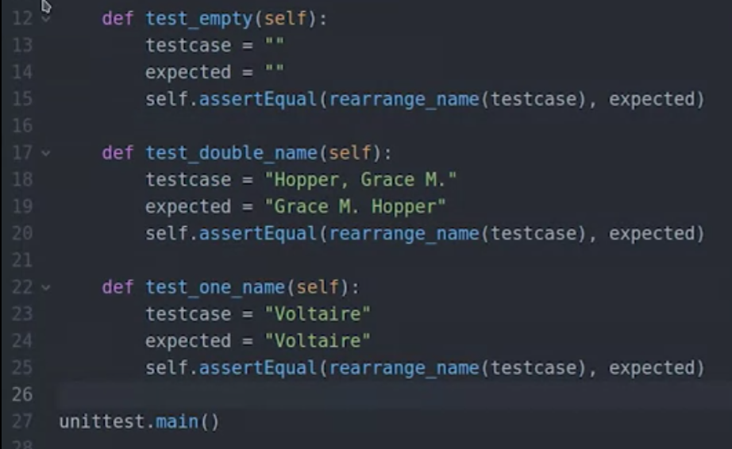

    - Using the assertRaises keyword

    - 

**<u>Common/best practices</u>**

- The convention is to call the script with the same name of the module
  that it's testing and appending the suffix **\_test**.

### Unit test cheat sheet

Best of Unit Testing Standard Library Module

Understand a Basic Example:

- <https://docs.python.org/3/library/unittest.html#basic-example>

Understand how to run the tests using the Command Line:

- <https://docs.python.org/3/library/unittest.html#command-line-interface>

Understand various Unit Test Design Patterns:

- <https://docs.python.org/3/library/unittest.html#organizing-test-code>

<!-- -->

- Understand the uses of setUp, tearDown; setUpModule and tearDownModule

Understand basic assertions:

<table>
<colgroup>
<col style="width: 45%" />
<col style="width: 36%" />
<col style="width: 18%" />
</colgroup>
<thead>
<tr>
<th><strong>Method</strong></th>
<th><strong>Checks that</strong></th>
<th><strong>New in</strong></th>
</tr>
</thead>
<tbody>
<tr>
<td><a
href="https://docs.python.org/3/library/unittest.html#unittest.TestCase.assertEqual">assertEqual(a,
b)</a></td>
<td>a == b</td>
<td></td>
</tr>
<tr>
<td><a
href="https://docs.python.org/3/library/unittest.html#unittest.TestCase.assertNotEqual">assertNotEqual(a,
b)</a></td>
<td>a != b</td>
<td></td>
</tr>
<tr>
<td><a
href="https://docs.python.org/3/library/unittest.html#unittest.TestCase.assertTrue">assertTrue(x)</a></td>
<td>bool(x) is True</td>
<td></td>
</tr>
<tr>
<td><a
href="https://docs.python.org/3/library/unittest.html#unittest.TestCase.assertFalse">assertFalse(x)</a></td>
<td>bool(x) is False</td>
<td></td>
</tr>
<tr>
<td><a
href="https://docs.python.org/3/library/unittest.html#unittest.TestCase.assertIs">assertIs(a,
b)</a></td>
<td>a is b</td>
<td>3.1</td>
</tr>
<tr>
<td><a
href="https://docs.python.org/3/library/unittest.html#unittest.TestCase.assertIsNot">assertIsNot(a,
b)</a></td>
<td>a is not b</td>
<td>3.1</td>
</tr>
<tr>
<td><a
href="https://docs.python.org/3/library/unittest.html#unittest.TestCase.assertIsNone">assertIsNone(x)</a></td>
<td>x is None</td>
<td>3.1</td>
</tr>
<tr>
<td><a
href="https://docs.python.org/3/library/unittest.html#unittest.TestCase.assertIsNotNone">assertIsNotNone(x)</a></td>
<td>x is not None</td>
<td>3.1</td>
</tr>
<tr>
<td><a
href="https://docs.python.org/3/library/unittest.html#unittest.TestCase.assertIn">assertIn(a,
b)</a></td>
<td>a in b</td>
<td>3.1</td>
</tr>
<tr>
<td><a
href="https://docs.python.org/3/library/unittest.html#unittest.TestCase.assertNotIn">assertNotIn(a,
b)</a></td>
<td>a not in b</td>
<td>3.1</td>
</tr>
<tr>
<td><a
href="https://docs.python.org/3/library/unittest.html#unittest.TestCase.assertIsInstance">assertIsInstance(a,
b)</a></td>
<td>isinstance(a, b)</td>
<td>3.2</td>
</tr>
<tr>
<td><a
href="https://docs.python.org/3/library/unittest.html#unittest.TestCase.assertNotIsInstance">assertNotIsInstance(a,
b)</a></td>
<td>not isinstance(a, b)</td>
<td>3.2</td>
</tr>
</tbody>
</table>

## Code debugging techniques

### Raising Exceptions

**Raise allows you to throw an exception at any time.**

All built-in python functions raise errors upon initial checks of the
args passed into it.

We can make our own test function as an example

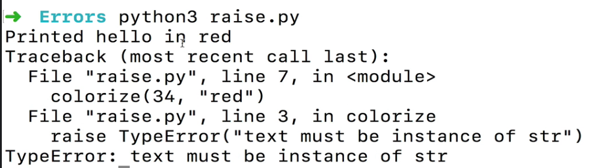

### Try/Except block

**Try, except, else, and finally**

Else means all good (like the then method in JS promises and except is
like error)

Another example in a function

You can also store the actual error being thrown and save it into a
variable (“err “is conevention)

### Using pdb (python debugger)

#### General usage

We'll start the debugger by running pdb3 and then passing the script
that we want to run and any parameters that our script needs. In our
case, we'll call pdb3 update products.py new products.csv. When we start
the debugger it gets positioned at the first line of our script and
waits for us to tell it what to do. We could run each of the
instructions in the file one by one using the **next** command. But
there's a lot going on here. So we need to go through a lot of lines
until we reach the failure. Alternatively, we can tell the debugger to
**continue** the execution until it either finishes or crashes. Let's do
that now.

So the program failed in the same way we'd seen before. But now we can
use the debugger to get a better idea of why we're getting this pesky
key error. Let's print the contents of row.

That's really weird. What are those characters appearing before product
code (“\ufeff”)? If we search online for the sequence of characters,
will find that they represent the Byte Order Mark or BOM which is used
in UTF-16 to tell the difference between a file stored using
Little-endian and Big-endian. Our file is in UTF-8 so it doesn't need
the BOM. But some programs still include it and this is tripping up our
script. So what can we do? Fortunately, others have already faced the
same issue and figured out a solution. There is a special value called
UTF-8-sig that we can set as the encoding parameter of the open
function. Setting this encoding means that Python will get rid of the
BOM when files include it and behave as usual when they don't. Let's
change the code of our script to use that encoding instead of the
default. We'll look for the place where it's opening the file, then add
the encoding parameter with UTF-8-sig as the value.

All right. We've made the change. Will they work now? Let's check it
out.

Yeah. We've fixed the problem. Our script can now work with users
generating files with and without the Byte Order Mark. In the last two
videos, we looked briefly at GDB and PDB. We've barely discussed the
surface of the many operations that we can do with debuggers. There are
ton more advanced debugging features. Like setting breakpoints the
letter code run until certain line of code is executed or watch points
that letter code run until a variable or expression changes. We can also
step through the code instruction by instruction to check when a problem
happens and much more.

#### Setting breakpoints

Also ‘a’ command lists values of all variables

### Assertions

**Assert enables you to verify if a certain condition is met and throw
an exception if it isn’t.**

Another example

**Warning!**

If a python script is running with the **-O** flag (optimized mode)
assertions will not be evaluated and will be removed! This is why
raising an error is preferred and assertions are usually used for
debugging only to validate values and types.

### Doctests

Code to test must be wrapped in triple double quotes

**Example**

^ I’m highlighting one test case here (a successful one) but notice
there is also an expected test case for an unsuccessful run of the
function.

Run the text by loading the doctest module

python3 -m doctest -v doctest_demo.py

### Code Profilers (“tell me why my perl program runs so slowly”)

Callgrind: A hierarchy of the function/system calls that were carried
out in the program.

**Create a file of the “callgrind” format**

*pprofile3 is a Python3 profiler (“grind” like valgrind).*

pprofile3 -f callgrind -o \<output_file\> \<program\> \<arguments\>

**Open with a “callgrind” format viewer**

*Using kcachegrind here, but there are other options.*

This is a GUI tool that opens a GUI:

**Example output**

In the lower right half we see a call graph, which tells us that the
main function is calling the send message function one time. This
function is calling the message template function, the get name
function, and the send message function nine times each. The graph also
tells us how many microseconds are spent on each of these calls. We can
see that most of the time is being spent in the get name function
(738888 microseconds). That's probably the one we should optimize.

# Networking and HTTP

## Sockets

## HTTP Requests urllib

## Accepting XML

## Making HTTP Requests (with requests package)

Install an HTTP requests package – heres a very popular one:

<https://requests.readthedocs.io/en/latest/user/quickstart/>

The response object has lots of properties for obtaining response data

Note: Though we may not need the “www” (depending on how the DNS records
are set up) we also need to specify the protocol – in this case “http”.

### Request Headers

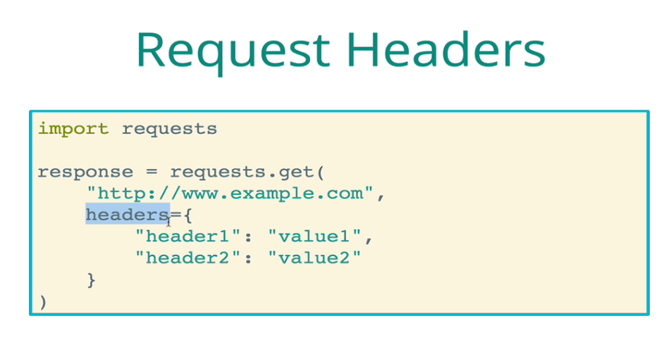

### Getting request information

### Receiving Json

You can also directly chain on the json method since this is all
synchronous scripting

***Json to Python Dictionary***

### Query String & Query Parameters

## json module

### Json.loads (string/byte to object)

<https://www.geeksforgeeks.org/json-loads-in-python/>

**json.loads()** method can be used to parse a valid JSON string and
convert it into a Python object (Dictionary/Array). It is mainly used
for deserializing native string, byte, or byte array which consists of
JSON data into Python Dictionary.

Remember that JSON elements can only represent simple data types. If you
have complex Python objects, you won’t be able to automatically
serialize them as JSON. Take a look at [this
table](https://docs.python.org/3/library/json.html#py-to-json-table) to
see in detail how Python objects are converted into JSON elements.

### Json.load (file object to simple object)

Deserialize *fp* (a .read()-supporting [text
file](https://docs.python.org/3/glossary.html#term-text-file) or [binary
file](https://docs.python.org/3/glossary.html#term-binary-file) containing
a JSON document) to a Python object.

Another example

### Json.dumps (object to string)

**json.dumps()** function will convert a subset of Python objects into a
json string. Not all objects are convertible and you may need to create
a dictionary of data you wish to expose before serializing to JSON.

### Json.dumps (object to file)

Json.dump to save json object into file.

Without adding “indent” the file would look like this:

Another solution for saving/retrieving json data into a file is json
pickling.

## Web Scraping

- **Beautiful Soup**: What Python library is used for parsing HTML
  documents and extracting data from HTML documents?

- 

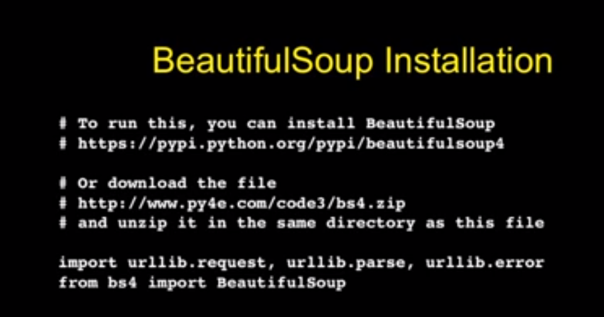

## Frameworks

**Flask vs Django**: <https://www.youtube.com/watch?v=NwKB4HZnIHM>

Django is one of many popular web frameworks. Alternative Python-based
web frameworks similar to Django include
[Flask](https://www.fullstackpython.com/flask.html),
[Bottle](https://bottlepy.org/docs/dev/),
[CherryPy](https://cherrypy.org/), and
[CubicWeb](https://www.cubicweb.org/). There are a host of other
frameworks written in other languages too, not just Python.

### Flask: Making Web Apps

<https://www.youtube.com/watch?v=Z1RJmh_OqeA>

#### Setting up with virtualenv

\# Setup

1\. Create a .env file with your OpenAI api key

Example: \`OPENAI_API_KEY=\<my_api_key\>\`

2\. Setup Flask server  

Make sure you have the virtual environmwnt package installed:

\`sudo apt install python3.8-venv\` or \`sudo apt install python3-venv\`

\[METHOD 1\] Setup your virtual environment:

\`python3 -m venv env\` or \`virtualenv env\` \# Where 'env' is the name
of your environment

\`source env/bin/activate\`

\[METHOD 2\] Setup your virtual environment:

\# Install Python's Virtual Environment & Dependencies (this prevents
any potential lib conflicts)

sudo apt install python3-dev libffi-dev build-essential
virtualenvwrapper -y

\# Configure/Activate Virtual Envinronment Wrapper (source it)

. /usr/share/virtualenvwrapper/virtualenvwrapper.sh

\#Create new Virtual Environment

mkvirtualenv --python=$(which python3) angrEnv

3\. Install dependencies:  

\`pip3 install Flask\`  

\`pip3 install openai\`  

\`pip3 install python_dotenv\`  

Note: This should be done before step2 to make sure all dependencies are
installed in Python virtual environment.                                
                                 

4\. Run Flask Server

\`flask run\`

or (to live respond to code changes)...

\`flask run --debug\`

#### Basic webpage with Flask

#### SQLAlchemy: Working with SQL

**Import**

#### Jinja 2 template engine

**Importing StyleSheets**

First make sure you import url_for in your app.py (from flask import
Flask, url_for)

# Jupyter

Executing python code in browser.

<https://www.youtube.com/watch?v=HW29067qVWk>

# Working with emails (email library)

## Creating emails with Python Email Library

<https://docs.python.org/3/library/email.examples.html>

The [***<u>Simple Mail Transfer Protocol
(SMTP)</u>***](https://tools.ietf.org/html/rfc2821.html) and
[***<u>Multipurpose Internet Mail Extensions
(MIME)</u>***](https://tools.ietf.org/html/rfc2045) standards define how
email messages are constructed. You *could* read the standards
documentation and create email messages all on your own, but you don't
need to go to all that trouble. The [email built-in Python
module](https://docs.python.org/3/library/email.html) lets us easily
construct email messages.

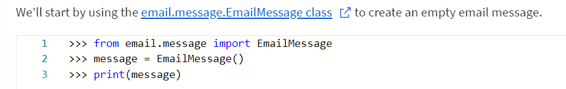

As usual, printing the message object gives us the string representation
of that object. The email library has a function that converts the
complex EmailMessage object into something that is fairly
human-readable. Since this is an empty message, there isn't anything to
see yet. Let's try adding the sender and recipient to the message and
see how that looks.

We'll define a couple of variables so that we can reuse them later.

## Adding Attachments

## Sending the Email Through an SMTP Server

<https://docs.python.org/3/library/smtplib.html>

Oops! This error means that there's no local SMTP server configured. But
don't panic! You can still connect to the SMTP server for your personal
email address. Most personal email services have instructions for
sending email through SMTP; just search for the name of your email
service and "SMTP connection settings".

When setting this up, there are a couple of things that you'll probably
need to do: Use a secure transport layer and authenticate to the service
using a username and password. Let's see what this means in practice.

You can connect to a remote SMTP server using ***<u>Transport Layer
Security (TLS)</u>***. An earlier version of the TLS protocol was called
***<u>Secure Sockets Layer (SSL)</u>***, and you’ll sometimes see TLS
and SSL used interchangeably. This SSL/TLS is the same protocol that's
used to add a secure transmission layer to HTTP, making it HTTPS. Within
the smtplib, there are two classes for making connections to an SMTP
server: The [***<u>SMTP
class</u>***](https://docs.python.org/3/library/smtplib.html#smtplib.SMTP)
will make a direct SMTP connection, and the [***<u>SMTP_SSL
class</u>***](https://docs.python.org/3/library/smtplib.html#smtplib.SMTP_SSL)
will make a SMTP connection over SSL/TLS. Like this:

If you want to see the SMTP messages that are being sent back and forth
by the smtplib module behind the scenes, you can set the debug level on
the SMTP or SMTP_SSL object. The examples in this lesson won’t show the
debug output, but you might find it interesting!

# Working with media

## Generating PDFs (using ReportLab)

<https://www.reportlab.com/docs/reportlab-userguide.pdf>

There's a few tools in Python that let you generate PDFs with the
content that you want. Here, we'll learn about one of them:
[***<u>ReportLab</u>***](https://www.reportlab.com/opensource/).
ReportLab has a **lot** of different features for creating PDF
documents. We'll cover just the basics here, and give you pointers for
more information at the end.

For our examples, we'll be mostly using the high-level classes and
methods in the ***<u>Page Layout and Typography Using Scripts
(PLATYPUS)</u>*** part of the ReportLab module.

Let's say that I have an awesome collection of fruit, and I want to
create a PDF report of all the different kinds of fruit I have! I can
easily represent the different kinds of fruit and how much of each I
have with a Python dictionary. It might look something like this:

Adding Tables to our PDFs

Up to now, we've generated an extra simple PDF file, that just includes
a title.

### Make 2D Array

Let's spice this up by adding a ***<u>Table</u>***. To make a Table
object, we need our data to be in a ***<u>list-of-lists</u>***,
sometimes called a ***<u>two-dimensional array</u>***. We have our
inventory of fruit in a dictionary. How can we convert a dictionary into
a list-of-lists?

Great, we have the list of lists. We can now add it to our report and
then generate the PDF file once again by calling the **build** method.

And this is how the generated report looks now:

### Adding Styling

Okay, it worked! It's not very easy to read, though. Maybe we should add
some style to **report_table**. For our example, we'll add a border
around all of the cells in our table, and move the table over to the
left. ***<u>TableStyle</u>*** definitions can get pretty complicated, so
feel free to take a look at the documentation for a more complete idea
of what’s possible.

### Adding Graphics

We’re going to need to use the ***<u>Drawing</u>*** Flowable class to
create a ***<u>Pie</u>*** chart.

To add data to our **Pie** chart, we need two separate lists: One for
data, and one for labels. Once more, we’re going to have to transform
our fruit dictionary into a different shape. For an added twist, let's
sort the fruit in alphabetical order:

The **Pie** object isn’t Flowable, but it can be placed inside of a
Flowable ***<u>Drawing</u>***.

Now, we'll add the new Drawing to the report, and see what it looks
like.

You'll want to refer to the [ReportLab User
Guide](https://www.reportlab.com/docs/reportlab-userguide.pdf) for more
details on the features we've seen, and to see what else you can create
with it.

## Working with images (using PIL)

Use the **pillow** library.

[pillow.readthedocs.io](pillow.readthedocs.io)

<https://pillow.readthedocs.io/en/stable/reference/index.html>

<https://pillow.readthedocs.io/en/stable/handbook/tutorial.html>

In this module, we’re going to be ***<u>transforming</u>*** and
***<u>converting</u>*** images. To do that, we'll be using a popular
library for image manipulation: the ***<u>Python Imaging Library
(PIL)</u>***. The original PIL library [hasn't been updated since
2009](http://www.pythonware.com/products/pil/) and does not support
Python 3. Fortunately, there's a current *fork* of PIL called
[***<u>Pillow</u>***](https://pypi.org/project/Pillow/), that properly
supports Python 3 and is kept up-to-date. The Pillow library is packaged
with the name **pillow**, but the module name in Python is still
**PIL**.

When using PIL, we typically create **Image** objects that hold the data
associated with the images that we want to process. On these objects, we
operate by calling different methods that either return a new image
object or modify the data in the image, and then end up saving the
result in a different file.

For example, if we wanted to resize an image and save the new image with
a new name, we could do it with:

In this case, we're using the resize method that returns a new image
with the new size, and then we save it into a different file. Or, if we
want to rotate an image, we can use code like this:

### Sample script: resize and rotate

# Working with shell/host

**os** module and **shutil**.

<https://docs.python.org/3/library/shutil.html>

Perform usual cmd commands.

# File IO

## Opening

#### Standard

Make sure to close file when done reading

#### Cursor Movement

#### Cool way (with blocks)

### Options (Mode, etc)

Note:

The **\_\_enter\_\_** and **\_\_exit\_\_** special methods are used
behind the scenes to automatically open and close a file using with
blocks.

## Appending/Writing

“r+” acts like “prepend” where is starts at the beginning of the file by
default.

## Reading

Once read reset seeker if trying to read again

Can also read starting at a certain index

Reading line-by-line

**Readlines to return lines as list**

Though it seems this also works…

Reading

## Expanding home dir

## Useful OS methods

## Examples

# Working with user input

## OptParser

<https://docs.python.org/2/library/optparse.html>

## Subprocess

In the above screenshot, the bottom format is preferred as it doesn’t
allow for the input to directly go to shell (in which case, other
commands could be injected.

See example here:
<https://www.udemy.com/course/learn-python-and-ethical-hacking-from-scratch/learn/lecture/9195916#overview>

## Accepting input with python2/3

Instead of using the input function (which is only supported by python3)
you can also use the raw_input function, which operates the same way but
works for python2 (doesn’t work for python3).

## Accepting multi-line user input

# Text Processing

Handy built-in functions

- **startswith/endswith**: Called on strings and used to match text by
  returning a Boolean value.

- **ord():** Pass in a character/letter and it returns the ASCII index
  of that character.

## RegEx

- <https://docs.python.org/3/howto/regex.html>

- <https://docs.python.org/3/library/re.html>

Search module returns a search object

Res.group returns the matched string

You can also use

***Search method returns None if no match was found***

Sometimes I have to prepend with “b” so its understood as a byte string.

**Alternate method: Call search on regex object**

### Special sequences

### Receiving multiple matches by using capture groups

Use parens to match specific groups

**Another example showing how the groups method returns a tuple of all
matches**

The zero-th index is the complete match, and all indexes after are all
individual matches

### Symbolic Group Names

**Another**

### Sub (substitute)

Use regex to determine where we should substitute a string and with what

re.sub(\<regex\>,\<replace_val\>,\<input_string\>)

*Example*

**Sub and replace using capture groups**

### Split

Use a regex to define how we should split a string:

### Complilation Flags

#### Verbose

**Verbose**: Lets you break up your regex into multiple lines and add
comments:r

Note: can you re.VERBOSE or re.X

c

### Examples

**See if email contains domain**

# CSV files and pickling

**Docs**: <https://docs.python.org/3/library/csv.html>

<https://realpython.com/python-csv/>

## Pickling

### Storing/saving as pickle

- import pickle

- Make sure to write “binary” (wb) and that the filename ends with
  “**.pickle**”.

- Choose some element/object to pickle (in this case, the Class “Blue”).

- Use the **pickle.dump** method to dump the binary content of the
  element passed in as first arg into the file passed in as the second
  arg.

### Extracting/exporting pickled data back into python:

Use “rb” to read binary contents of a “.pickle” file. Use
**pickle.load** method to save back into a python element.

## json pickling

<https://www.afternerd.com/blog/python-pickle/>

*Pickling* in Python means the process of serializing a Python object
into a byte stream. The pickle module is responsible for the
serialization and deserialization of Python objects. 

**Using json dumps**

*Converts python data/objects to JSON*

Ideal to use a package like **JSONPickle** (better for more complex data
types like classes)

**Install**

**Pickle**

**Depickle**

## Reading from a csv

### Reader

Using reader, the **reader** method returns a reader object which can be
iterated over:

Use **next()** method once to loop past the first iteration and thus
skip the headers.

**You can also “unpack” or “deconstruct” each row into it’ variables**

Note: **row\[0\]** is valid – but can be hard to read.

**Using a list instead of the reader object**

We’re able to iterate over the reader object *like* a list because the
reader object is iterable. However, if you actually want the
functionality of a list and all it’s associated methods it’s best to
cast the reader object into a list like so:

### Dictreader

**Another**

#### Adding a dialect

We also need to pass a dialect as a parameter to this function. There
isn't a well-defined standard for comma-separated value files, so the
parser needs to be flexible. Flexibility here means that there are many
parameters to control how csv parses or writes data. Rather than passing
each of these parameters to the reader and writer separately, we group
them together conveniently into a dialect object.

Dialect classes can be registered by name so that callers of the CSV
module don't need to know the parameter settings in advance. We will now
register a dialect **empDialect**.

**csv.register_dialect('empDialect', skipinitialspace=True,
strict=True)**

The main purpose of this dialect is to remove any leading spaces while
parsing the CSV file.

The function will look similar to:

**employee_file = csv.DictReader(open(csv_file_location), dialect =
'empDialect')**

***Full example***

### Custom Delimiters

## Writing to a CSV

### Writer (using lists)

You can always append to a csv with “a” instead of “w”:

**Writerows: Write all rows at once**

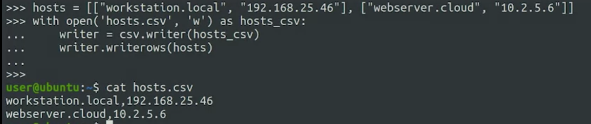

### DictWriter (write using dicts)

Use csv headers to reference what to read/write.

## CSV reading/writing examples 

### Find user in a csv

### Copying data from one csv to another

# Python and SQL

## Python and SQLite

## Python and MySQL

<https://www.w3schools.com/python/python_mysql_create_db.asp>

<https://www.tutorialspoint.com/python_data_access/python_mysql_introduction.htm>

Be sure to upgrade pip first (optional)

Python3 -m pip install --upgrade pip

- Install MySQL connector/adataper

  - pip install mysql-connector-python

- Import into your script

  - import mysql.connector

- df

import mysql.connector

\#establishing the connection

conn = mysql.connector.connect(user='root', password='password',
host='127.0.0.1', database='mydb')

\#Creating a cursor object using the cursor() method

cursor = conn.cursor()

\#Executing an MYSQL function using the execute() method

cursor.execute("SELECT DATABASE()")

\# Fetch a single row using fetchone() method.

data = cursor.fetchone()

print("Connection established to: ",data)

\# Fetch multiple rows using fetchall() method.

cursor.execute("SHOW DATABASES")

new_data = cursor.fetchall()

\#Closing the connection

conn.close()

# Python and OpenAI

# Numbers and Arithmetic

## Numbers

- Division always returns a float unless you use //

- Multiplier operator (\*) can multiply instances of strings

  - 

- Order of operations (**BIDMAS**)

**If number is a positive integer:**

If userinput.isdigit():

## Pandas

## NymPy

<https://www.youtube.com/watch?v=GB9ByFAIAH4>

**Code:**

<https://github.com/KeithGalli/NumPy/blob/master/NumPy%20Tutorial.ipynb>

# Style guides

PEP8 is a common style guide for python projects.

<https://peps.python.org/pep-0008/>

# System stats

## General

<https://psutil.readthedocs.io/en/latest/>

**psutil** library is very common.

## Getting connection speed

# Compiling 

## Using Pyinstaller 

Official Docs:
<https://pyinstaller.readthedocs.io/en/v4.10/operating-mode.html#analysis-finding-the-files-your-program-needs>

You can use [PyInstaller](http://www.pyinstaller.org/) to package Python
programs as standalone executables. It works on Windows, Linux, and Mac.

**<u>PyInstaller Quickstart</u>**

Install PyInstaller from PyPI:

pip install pyinstaller

Python3 install

python3 -m pip install pyinstaller

To generate the bundle in a subdirectory called dist, go to your
program’s directory and run:

pyinstaller yourprogram.py

Adding -F (or --onefile) parameter will pack everything into single
"exe" without the need for any external package files/dependencies.
Downside here is it would be hard for you program to act on certain
files that are in specific external locations.

pyinstaller -F yourprogram.py

or…

Running into "ImportError" you might consider side-packages.

pyinstaller -F --paths=\<your_path\>\Lib\site-packages yourprogram.py

Still runing in Import-Erorr - try to downgrade pyinstaller -
see [Getting error when using pynput with
pyinstaller](https://stackoverflow.com/questions/63681770/getting-error-when-using-pynput-with-pyinstaller)

pip install pynput==1.6.8

For a more detailed walkthrough, see
the [manual](https://pyinstaller.readthedocs.io/).
