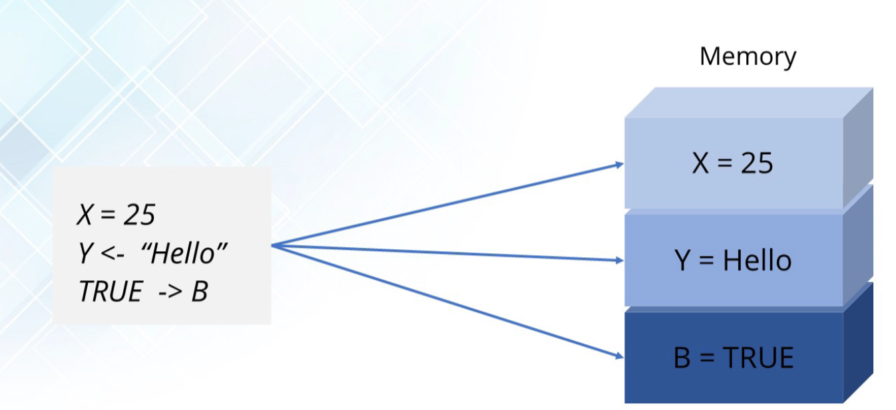
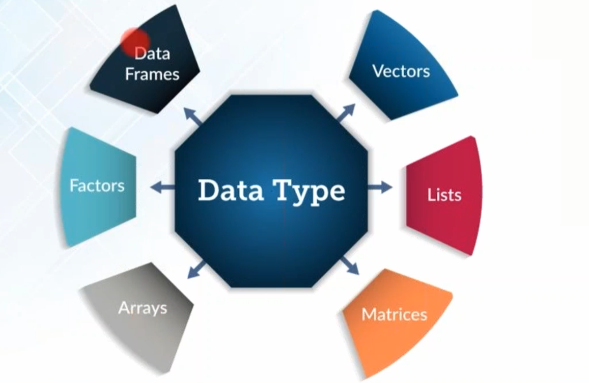

# Getting started/Tutorials

**Installation**

**Windows:** <https://cran.r-project.org/bin/windows/base/>

**Linux (binaries):** <https://cran.r-project.org/bin/linux/>

**RStudio IDE:** <https://www.rstudio.com/products/rstudio/download/>

**Packages**

- **ggplot**

**Tutorials**

<https://www.tutorialspoint.com/>

**Edureka**: <https://www.youtube.com/watch?v=fDRa82lxzaU>

**Edureka:** <https://www.youtube.com/watch?v=eDrhZb2onWY>

**FreeCodeCamp (2hr – NOT DONE)**:
<https://www.youtube.com/watch?v=_V8eKsto3Ug>

# Saving your plots

**Save your work**

To learn more about the different processes for saving images, check out
these resources: 

- [**Saving images without
  ggsave()**](https://ggplot2.tidyverse.org/reference/ggsave.html#saving-images-without-ggsave-):
  This resource is pulled directly from the ggplot2 documentation at
  [**tidyverse.org**](https://www.tidyverse.org/). It explores the tools
  you can use to save images in R, and includes several examples to
  follow along with and learn how to save images in your own R
  workspace. 

- [**How to save a
  ggplot**](https://www.datanovia.com/en/blog/how-to-save-a-ggplot/):
  This resource covers multiple different methods for saving ggplots. It
  also includes copyable code with explanations about how each function
  is being used so that you can better understand each step in the
  process.  

<!-- -->

- [**Saving a plot in
  R:**](https://www.datamentor.io/r-programming/saving-plot/) This guide
  covers multiple file formats that you can use to save your plots in R.
  Each section includes an example with an actual plot that you can copy
  and use for practice in your own R workspace.

# Variables, Operators and data types

## Notable tips

- print() command to print.

- Booleans are in all caps (TRUE/FALSE).

- Modulo operator is ‘%%’

- Floor division is ‘**%/%**’

- Integers must be followed by a “L” otherwise the value will simply be
  assumed to be numeric.

  - 

## Variable assignment

## DataTypes

### Vectors and vector types

All R collections (vectors, lists, matrices) are 1-indexed not
zero-indexed as with other programming languages.

A “character” vector is a vector (collection of items)- where R tries to
convert all items to the same data type. This is denoted by **c()**.

You can determine the vector type (it’s class) by using the **class**
command. Mixing different data types ill results in a massive change.

There are two types of vectors: **atomic vectors** and **lists**. Coming
up, you’ll learn about the basic properties of atomic vectors and lists,
and how to use R code to create them. 

### Atomic vectors 

First, we will go through the different types of atomic vectors. Then,
you will learn how to use R code to create, identify, and name the
vectors. 

Earlier, you learned that a **vector** is a group of data elements of
the *same* type, stored in a sequence in R. You cannot have a vector
that contains both logicals and numerics. 

There are six primary types of atomic vectors: logical, integer, double,
character (which contains strings), complex, and raw. The last
two–complex and raw–aren’t as common in data analysis, so we will focus
on the first four. Together, integer and double vectors are known as
numeric vectors because they both contain numbers. This table summarizes
the four primary types: 

<table>
<colgroup>
<col style="width: 21%" />
<col style="width: 54%" />
<col style="width: 24%" />
</colgroup>
<thead>
<tr>
<th><strong>Type</strong></th>
<th><strong>Description </strong></th>
<th><strong>Example</strong></th>
</tr>
</thead>
<tbody>
<tr>
<td>Logical </td>
<td>True/False </td>
<td><strong>TRUE</strong></td>
</tr>
<tr>
<td>Integer </td>
<td>Positive and negative whole values</td>
<td><strong>3</strong></td>
</tr>
<tr>
<td>Double </td>
<td>Decimal values </td>
<td><strong>101.175</strong></td>
</tr>
<tr>
<td>Character </td>
<td>String/character values</td>
<td><strong>“Coding” </strong></td>
</tr>
</tbody>
</table>

This diagram illustrates the hierarchy of relationships among these four
main types of vectors:

Bottom: logical (arrow points to
atomic), integer (arrow points to numeric), double (arrow points to
numeric), character (arrow points to atomic) Second to bottom: numeric
(arrow points to atomic) second level: atomic (arrow points to vector)
top: vector

### Creating vectors  

One way to create a vector is by using the **c()** function (called the
“combine” function). The c() function in R combines multiple values into
a vector. In R, this function is just the letter “c” followed by the
values you want in your vector inside the parentheses, separated by a
comma: c(x, y, z, …).

For example, you can use the c() function to store numeric data in a
vector. 

**c(2.5, 48.5, 101.5)**

To create a vector of integers using the c() function, you must place
the letter "L" directly after each number.

**c(1L, 5L, 15L)**

You can also create a vector containing characters or logicals. 

**c(“Sara” , “Lisa” , “Anna”)**

**c(TRUE, FALSE, TRUE)**

### Determining the properties of vectors 

Every vector you create will have two key properties: type and length.  

 You can determine what type of vector you are working with by using the
**typeof()** function. Place the code for the vector inside the
parentheses of the function. When you run the function, R will tell you
the type. For example: 

**typeof(c(“a” , “b”))**

**\#\> \[1\] "character"**

 Notice that the output of the typeof function in this example is
**“character”**. Similarly, if you use the typeof function on a vector
with integer values, then the output will include **“integer”**
instead: 

**typeof(c(1L , 3L))**

**\#\> \[1\] "integer"**

You can determine the length of an existing vector–meaning the number of
elements it contains–by using the **length()** function. In this
example, we use an assignment operator to assign the vector to the
variable *x*. Then, we apply the length() function to the variable. When
we run the function, R tells us the length is **3**.

**x \<- c(33.5, 57.75, 120.05)**

**length(x)**

**\#\> \[1\] 3**

You can also check if a vector is a specific type by using an **is**
function: **is.logical(), is.double(), is.integer(), is.character()**.
In this example, R returns a value of **TRUE** because the vector
contains integers. 

**x \<- c(2L, 5L, 11L)**

**is.integer(x)**

**\#\> \[1\] TRUE**

In this example, R returns a value of **FALSE** because the vector does
*not* contain characters, rather it contains logicals.

**y \<- c(TRUE, TRUE, FALSE)**

**is.character(y)**

**\#\> \[1\] FALSE**

### Naming vectors 

All types of vectors can be named. Names are useful for writing readable
code and describing objects in R. You can name the elements of a vector
with the **names()** function. As an example, let’s assign the variable
x to a new vector with three elements. 

**x \<- c(1, 3, 5)**

You can use the names() function to assign a different name to each
element of the vector. 

**names(x) \<- c("a", "b", "c")**

Now, when you run the code, R shows that the first element of the vector
is named **a**, the second **b**, and the third **c**.

**x **

**\#\> a b c **

**\#\> 1 3 5**

Remember that an atomic vector can only contain elements of the same
type. If you want to store elements of different types in the same data
structure, you can use a list. 

### Lists

The benefit of lists (unlike character vectors) is they can store
different values of varying data type (like a character without trying
to convert them to a common data type (as character class vectors do)

Joining two lists together

Notice how joining two lists doesn’t create a nested vector, but instead
flattens the two together? That’s because we are joining them together
into another vector. But, if we join them together into a list, they
will become nested, just as arrays do.

Making a matrix out of the above…(2 rows of data, 5 columns each row)

### Matrix

### Arrays

^ the above says “I need a array composed of the numbers 0-15. This is
to be stored into a 4x4 table – those are the dimensions. Finally, I
want enough of these “tables” to fill a 2x2 grid.

### Data Frames

**A data frame is a collection of columns.**

Reminds me of two (or more) tables being stacked horizontally (like a
SQL union but sideways – join?).

####  Example data frame

### Tibbles

### Factors

# Operators

## Assignment operator

**Sequence Operator**

## Logical operators

## Arithmetic operators

## Relational/Comparison operators

## Special operators

Colon is similar to brace expansion in bash

Range

# Loops

- While: just like JS

- For : iterate over iterables

- Repeat: a do while loop – with if block inside

**For loop**

**Repeat loop**

# Functions

## String operations

# R packages

Packages can be found in repositories, which are collections of useful
packages that are ready to install. You can find repositories on
[**Bioconductor**](http://bioconductor.org/),
[**R-Forge**](https://r-forge.r-project.org/),
[**rOpenSci**](https://ropensci.org/), or
[**GitHub**](https://github.com/), but the most commonly used repository
is the Comprehensive R Archive Network or
[**CRAN**](https://cran.r-project.org/). CRAN stores code and
documentation so that you can install packages into your own RStudio
space. 

With so many packages out there, it can be hard to know which ones will
be the most useful for your library or directory of installed packages.
Luckily, there are some great resources out there:

- [**Tidyverse**](https://www.tidyverse.org/): the tidyverse is a
  collection of R packages specifically designed for working with data.
  It’s a standard library for most data analysts, but you can also
  download the packages individually. 

- [**Quick list of useful R
  packages**](https://support.rstudio.com/hc/en-us/articles/201057987-Quick-list-of-useful-R-packages):
  this is RStudio Support’s list of useful packages with installation
  instructions and functionality descriptions. 

- [**CRAN Task Views**](https://cran.r-project.org/web/views/): this is
  an index of CRAN packages sorted by task. You can search for the type
  of task you need to perform and it will pull up a page with packages
  related to that task for you to explore.  

You will discover more packages throughout this course and as you use R
more often, but this is a great starting point for building your own
library. 

Sites: crantastic (CRAN)

## Usage

### Installing/Upadting a package repository

Installing a package repo populates your package list in R studio

Example using **tidyverse**

And using **pacman**

**Updating the package repos**

### Loading/Unloading a package repo

**Tidyverse**

*Note: “Conflicts” occur when function has the same name as another
function. Most recently installed packages will have those function
names preferred.*

**Pacman**

### Installing/Updating Individual packages

^ or the command will just install the package if it doesn’t exist.

### Loading/Unloading packages

**Load a specific package**

**Unload all packages**

**Pacman variant**

# Dates and Times in R

In this reading, you will learn how to work with dates and times in R
using the **lubridate** package. Coming up, you will use tools in the
lubridate package to convert different types of data in R into date and
date-time formats.

## Loading tidyverse and lubridate packages

Before you get started working with dates and times, you should load
both **tidyverse** and **lubridate**. Lubridate is part of tidyverse.

First, open RStudio. 

If you haven't already installed tidyverse, you can use the
**install.packages()** function to do so:

- **install.packages("tidyverse")**

Next, load the tidyverse and lubridate packages using the **library()**
function. First, load the core tidyverse to make it available in your
current R session:

- **library(tidyverse)**

Then, load the lubridate package:

- **library(lubridate)**

Now you’re ready to be introduced to the tools in the lubridate
package. 

## Working with dates and times 

T​his section covers the data types for dates and times in R and how to
convert strings to date-time formats.

### Types

In R, there are three types of data that refer to an instant in time:

- A date **("2016-08-16")**

- A time within a day **(“20:11:59 UTC")**

- And a date-time. This is a date plus a time **("2018-03-31 18:15:48
  UTC")**

The time is given in UTC, which stands for Universal Time Coordinated,
more commonly called Universal Coordinated Time. This is the primary
standard by which the world regulates clocks and time.

For example, to get the current date you can run the **today()**
function. The date appears as year, month, and day. 

**today()**

**\#\> \[1\] "2021-01-20"**

To get the current date-time you can run the **now()** function. Note
that the time appears to the nearest second. 

**now()**

**\#\> \[1\] "2021-01-20 16:25:05 UTC"**

When working with R, there are three ways you are likely to create
date-time formats: 

- From a string

- From an individual date

- From an existing date/time object

R creates dates in the standard yyyy-mm-dd format by default.

Let's go over each.

### Converting from strings 

Date/time data often comes as strings. You can convert strings into
dates and date-times using the tools provided by lubridate. These tools
automatically work out the date/time format. First, identify the order
in which the year, month, and day appear in your dates. Then, arrange
the letters *y*, *m*, and *d* in the same order. That gives you the name
of the lubridate function that will parse your date. For example, for
the date *2021-01-20,* you use the order *ymd*:

**ymd("2021-01-20")**

When you run the function, R returns the date in yyyy-mm-dd format. 

**\#\> \[1\] "2021-01-20"**

It works the same way for any order. For example, month, day, and
year. R still returns the date in yyyy-mm-dd format.

**mdy("January 20th, 2021")**

**\#\> \[1\] "2021-01-20"**

Or, day, month, and year. R still returns the date in yyyy-mm-dd format.

**dmy("20-Jan-2021")**

**\#\> \[1\] "2021-01-20"**

These functions also take unquoted numbers and convert them into the
yyyy-mm-dd format.

**ymd(20210120)**

**\#\> \[1\] "2021-01-20"**

### Creating date-time components

The ymd() function and its variations create dates. To create a
date-time from a date*,* add an underscore and one or more of the
letters *h*, *m*, and s (hours, minutes, seconds) to the name of the
function:

**ymd_hms("2021-01-20 20:11:59")**

**\#\> \[1\] "2021-01-20 20:11:59 UTC"**

**mdy_hm("01/20/2021 08:01")**

**\#\> \[1\] "2021-01-20 08:01:00 UTC"**

### Optional: Switching between existing date-time objects 

Finally, you might want to switch between a date-time and a date.

You can use the function **as_date()** to convert a date-time to a date.
For example, put the current date-time—now()—in the parentheses of the
function. 

**as_date(now())**

**\#\> \[1\] "2021-01-20"**

## Additional resources

To learn more about working with dates and times in R, check out the
following resources:

- [lubridate.tidyverse](https://lubridate.tidyverse.org/index.html):
  This is the “lubridate” entry from the official tidyverse
  documentation, which offers a comprehensive reference guide to the
  various tidyverse packages. Check out this link for an overview of key
  concepts and functions.

- [Dates and times with lubridate: Cheat
  Sheet](https://rawgit.com/rstudio/cheatsheets/master/lubridate.pdf):
  This “cheat sheet” gives you a detailed map of all the different
  things you can do with the lubridate package. You don’t need to know
  all of this information, but the cheat sheet is a useful reference for
  any questions you might have about working with dates and times in R. 

# Plotting data with gpglot

*Template*

*Example plot*

library("ggplot2")

library("palmerpenguins")

ggplot(data=penguins)+geom_point(mapping=aes(x=flipper_length_mm,y=body_mass_g))

Standard

Mapping more properties

# **Smoothing**

In this reading, you will learn about smoothing in ggplot2 and how it
can be used to make your data visualizations in R clearer and easier to
follow. Sometimes it can be hard to understand trends in your data from
scatter plots alone. **Smoothing** enables the detection of a data trend
even when you can't easily notice a trend from the plotted data points.
Ggplot2’s smoothing functionality is helpful because it adds a
**smoothing line** as another layer to a plot; the smoothing line helps
the data to make sense to a casual observer.

<table>
<colgroup>
<col style="width: 100%" />
</colgroup>
<thead>
<tr>
<th><strong>Example code</strong></th>
</tr>
</thead>
<tbody>
<tr>
<td><strong>ggplot(data, aes(x=distance, y= dep_delay)) + geom_point() +
geom_smooth()</strong></td>
</tr>
</tbody>
</table>

T​he example code creates a plot with a trend line similar to the blue
line below.

## Two types of smoothing

<table>
<colgroup>
<col style="width: 14%" />
<col style="width: 31%" />
<col style="width: 53%" />
</colgroup>
<thead>
<tr>
<th><strong>Type of smoothing</strong></th>
<th><strong>Description</strong></th>
<th><strong>Example code</strong></th>
</tr>
</thead>
<tbody>
<tr>
<td><strong>Loess smoothing</strong></td>
<td>The loess smoothing process is best for smoothing plots with less
than 1000 points.</td>
<td><strong>ggplot(data, aes(x=, y=))+  geom_point() +      
geom_smooth(method="loess")</strong></td>
</tr>
<tr>
<td><strong>Gam smoothing</strong></td>
<td>Gam smoothing, or generalized additive model smoothing, is useful
for smoothing plots with a large number of points. </td>
<td><strong>ggplot(data, aes(x=, y=)) + geom_point() +        
geom_smooth(method="gam", formula = y ~s(x))</strong></td>
</tr>
</tbody>
</table>

The smoothing functionality in ggplot2 helps make data plots more
readable, so you are better able to recognize data trends and make key
insights. The first plot below is the data before smoothing, and the
second plot below is the same data after smoothing.

### Additional resource

F​or more information about smoothing, refer to the Smoothing section in
the [**Stats Education’s Introduction to
R**](http://statseducation.com/Introduction-to-R/modules/graphics/smoothing/)
course. It includes detailed descriptions and examples of how to use the
different types of smoothing in ggplot2. It also includes links to other
lessons about ggplot2. You can explore these to get more familiar with
plotting data in R. 

# **Filtering and plots**

By this point you have likely downloaded at least a few packages into
your R library. The tools in some of these packages can actually be
combined and used together to become even more useful. This reading will
share a few resources that will teach you how to use the filter function
from **dplyr** to make the plots you create with **ggplot2** easier to
read. 

## E​xample of filtering data for plotting

Filtering your data before you plot it allows you to focus on specific
subsets of your data and gain more targeted insights. To do this, just
include the dplyr filter() function in your ggplot syntax. 

<table>
<colgroup>
<col style="width: 100%" />
</colgroup>
<thead>
<tr>
<th><strong>Example code</strong></th>
</tr>
</thead>
<tbody>
<tr>
<td><strong>data %&gt;%    filter(variable1 == "DS") %&gt;%  
ggplot(aes(x = weight, y = variable2, colour = variable1)) +  
geom_point(alpha = 0.3,  position = position_jitter()) +
stat_smooth(method = "lm")</strong></td>
</tr>
</tbody>
</table>

## Annotations

## Resources

Check out these resources to learn more:

- [**<u>Create an annotation
  layer</u>**](https://ggplot2.tidyverse.org/reference/annotate.html):
  This guide explains how to add an annotation layer with ggplot2. It
  includes sample code and data visualizations with annotations created
  in ggplot2. 

- **[<u>How to annotate a plot in
  ggplot2</u>](https://www.r-graph-gallery.com/233-add-annotations-on-ggplot2-chart.html):**
  This resource includes explanations about how to add different kinds
  of annotations to your ggplot2 plots, and is a great reference if you
  need to quickly look up a specific kind of annotation. 

- **[<u>Annotations</u>](https://ggplot2-book.org/annotations.html):**
  Chapter eight of the online ggplot2 textbook is focused entirely on
  annotations. It provides in-depth explanations of the different types
  of annotations, how they are used, and detailed examples. 

- **[<u>How to annotate a
  plot</u>](https://www.r-bloggers.com/2017/02/how-to-annotate-a-plot-in-ggplot2/):**
  This R-Bloggers article includes explanations about how to annotate
  plots in ggplot2. It starts with basic concepts and covers more
  complicated information the further on you read. 

<!-- -->

- **<u>[Text
  Annotations](https://viz-ggplot2.rsquaredacademy.com/textann.html):</u>**
  This resource focuses specifically on adding text annotations and
  labels to ggplot2 visualizations.

## Additional resources

To learn more details about ggplot2 and filtering with dplyr, check out
these resources:

- **[Putting it all together:
  (dplyr+ggplot)](https://rladiessydney.org/courses/ryouwithme/03-vizwhiz-1/#1-4-putting-it-all-together-dplyr-ggplot):**
  The RLadies of Sydney’s course on R uses real data to demonstrate R
  functions. This lesson focuses specifically on combining dplyr and
  ggplot to filter data before plotting it. The instructional video will
  guide you through every step in the process while you follow along
  with the data they have provided. 

- **[Data transformation:](https://r4ds.had.co.nz/transform.html)** This
  resource focuses on how to use the filter() function in R, and
  demonstrates how to combine filter() with ggplot(). This is a useful
  resource if you are interested in learning more about how filter() can
  be used before plotting. 

- [**Visualizing data with
  ggplot2:**](https://datacarpentry.org/dc_zurich/R-ecology/05-visualisation-ggplot2.html)
  This comprehensive guide includes everything from the most basic uses
  for ggplot2 to creating complicated visualizations. It includes the
  filter() function in most of the examples so you can learn how to
  implement it in R to create data visualizations.

# **R markdown**

R Markdown is a file format for making dynamic documents with R. R
Markdown lets you create a record of your analysis and conclusions in a
document.Can be downloaded into R Studio. R markdown is written in
markdown.

**R Markdown** is a useful tool that allows you to save and execute
code, and generate shareable reports for stakeholders. As you learn more
about how to use it, it can be helpful to bookmark some resources to
refer to later.

This reading explores some great online resources that will help you
learn more about R Markdown and how to use it to document your
analysis. 

## Resources

### R Markdown documentation

RStudio's [R Markdown
documentation](https://rmarkdown.rstudio.com/lesson-1.html) includes a
series of tutorials that will help you learn about the main features of
R Markdown, including code chunks, output formats, notebooks,
interactive documents, and more. The tutorials include online lessons
that you can complete directly in your RStudio Cloud workspace. 

### R Markdown reference materials

RStudio has developed a reference guide and a cheat sheet that you can
bookmark and use whenever you practice writing R Markdown files.  

- T​he [R Markdown Reference
  Guide](https://rstudio.com/wp-content/uploads/2015/03/rmarkdown-reference.pdf?_ga=2.49295910.1034302809.1602760608-739985330.1601281773)
  contains three sections: Markdown syntax, knitr chunk options, and
  Pandoc options. The guide is super detailed and includes tons of
  examples and explanations so that you can easily find the exact
  information you need to customize your R Markdown documents. 

- T​he [R Markdown Cheat
  Sheet](https://rmarkdown.rstudio.com/lesson-15.html) is a convenient
  summary of the different steps and workflow processes for R. It also
  includes sections with abbreviated explanations of knitr and pandoc
  chunk options, and other useful information to review or look up while
  you work.

### R for Data Science book

For a well-organized introduction to the basics of R Markdown, check out
the [Communicate](https://r4ds.had.co.nz/communicate-intro.html) section
of the **R for Data Science** book. It covers the main features and
functions of R Markdown, the various output formats, and the workflow
for combining text and code to create an analysis notebook.

### R Markdown: The Definitive Guide 

If you want to really explore the capabilities of R Markdown in a
systematic way, [R Markdown: The Definitive
Guide](https://bookdown.org/yihui/rmarkdown/) provides a comprehensive
guide to the R Markdown ecosystem. This book contains four main parts:

1.  [Part I](https://bookdown.org/yihui/rmarkdown/installation.html)
    explains how to install the relevant packages and offers an overview
    of R Markdown, including the syntax for Markdown and code chunks.

2.  [Part II](https://bookdown.org/yihui/rmarkdown/documents.html)
    provides detailed documentation of the built-in output formats
    included in R Markdown, like document formats and presentation
    formats. 

3.  [Part III](https://bookdown.org/yihui/rmarkdown/dashboards.html)
    shares several R Markdown extension packages that allow you to build
    different applications or generate output documents with different
    styles. 

4.  [Part
    IV](https://bookdown.org/yihui/rmarkdown/parameterized-reports.html)
    covers advanced topics in R Markdown. 

# **Jupyter notebooks**

**Jupyter notebooks** are documents that contain computer code and rich
text elements – such as comments, links, or descriptions of your
analysis and results. You will find them used in a variety of online
tools, including Project Jupyter, Kaggle, and Google Colaboratory
("Colab" for short). These notebooks can be executable documents that
you can run to perform an analysis. 

Jupyter notebooks can come in handy with everything from data cleaning
and transformation, to statistical modeling and visualizations. They are
compatible with R, so you can consider them as an alternative to R
Markdown. And just like R Markdown documents, you can easily share
Jupyter notebooks with team members and stakeholders. 

## Jupyter notebooks in Kaggle

If you are working in Kaggle, there are two types of notebooks
available: Jupyter notebooks and scripts (including R Markdown
scripts). For more information, refer to the [How to Use Kaggle
Notebooks](https://www.kaggle.com/docs/notebooks) page.

## Jupyter notebooks in Google Colab

Google Colab is a product from Google Research. Colab is a hosted
Jupyter notebook service that requires no setup to use. For more
information, refer to the [Welcome to
Colaboratory](https://colab.research.google.com/notebooks/intro.ipynb)
page.

## Additional resources

To learn more about Jupyter notebooks, check out these resources: 

- [**<u>Project Jupyter</u>**](https://jupyter.org/): This is the home
  of Jupyter notebooks, as well as JupyterLab – the web-based
  interactive development environment for Jupyter notebooks, code, and
  data. 

- [**<u>Jupyter Notebook: An
  Introduction</u>**](https://realpython.com/jupyter-notebook-introduction/):
  This detailed introduction of Jupyter notebooks comes from the people
  at Real Python, a tutorial-based site devoted to all things
  Python. You can take a video course or follow the written tutorial to
  get started with Jupyter notebooks and learn about its features and
  capabilities.

A​nd, just like R Markdown, Jupyter notebooks include basic formatting
tools and rules that will help you keep your work organized and
user-friendly. In fact, Jupyter uses R Markdown as its language for
writing and formatting text in a notebook. 

To learn about basic formatting in Jupyter notebooks, check out these
resources: 

- [**<u>The Jupyter</u>**
  **<u>Notebook</u>**](https://jupyter-notebook.readthedocs.io/en/stable/notebook.html)**:**
  This resource provides an overview of Jupyter notebooks, including
  information about the structure of the user interface and notebook
  document. You’ll also learn about the basic workflow for using a
  notebook document, along with information about keyboard shortcuts and
  other features that will help you format your work.

- **[<u>Using Jupyter Notebook for
  Writing</u>](https://gtribello.github.io/mathNET/assets/notebook-writing.html):**
  This resource focuses on how to use Markdown to format your writing in
  a Jupyter notebook. Use this as a guide to manage the syntax of your
  writing, including making titles and subtitles and adding links.

- [**<u>The Jupyter Notebook Formatting
  Guide</u>**](https://medium.com/analytics-vidhya/the-jupyter-notebook-formatting-guide-873ab39f765e):
  This resource includes a wide variety of formatting options for
  Jupyter notebooks. You’ll learn about the basics as well as some more
  advanced options, like embedding PDF documents and videos. 

After you know how to apply basic formatting to your notebooks, you can
start exploring more advanced options. 
