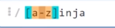
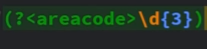
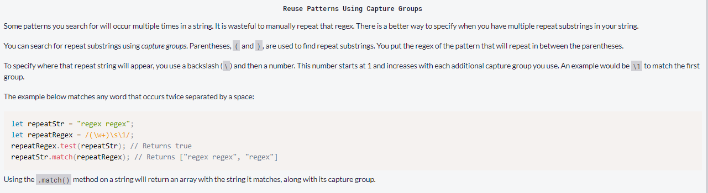

## Basics

**Cheat sheet**:
<https://dev.to/catherinecodes/a-regex-cheatsheet-for-all-those-regex-haters-and-lovers--2cj1>

<https://www.w3schools.com/tags/ref_urlencode.ASP>

https://fireship.io/lessons/regex-cheat-sheet-js/

<https://regex101.com/>

[Net
Ninja](https://www.youtube.com/playlist?list=PL4cUxeGkcC9g6m_6Sld9Q4jzqdqHd2HiD)

[WebDev
simplified](file:///C:\Users\Bobby\AppData\Roaming\Microsoft\Word\WebDev%20simplified)

[RegEx Mini Bootcamp](https://youtu.be/EiRGUNrz9MY)

- Always contained within two forward slashes

- RegEx Flags…

  - Default to look for first and only first match

  - Global flag ‘**g**’ will look for every match.

  - Default to match in a case-sensitive fashion

    - Use insensitive flag otherwise ‘**i**’

    - Combined with global you can use **/gi.**

- **<u>Character sets</u>**: Enclose some character in square brackets
  to indicate that any single character within the square brackets
  combined with the subsequent data should be matched against. Also
  called character classes. A character set is a giant OR block where
  each character is considered.

  - **<u>Note</u>**: Characters in a character set don’t need to be
    escaped.

  - Example: Matched with anything with an ‘a, b, c, 1, 2’ or ‘3’ AND
    ‘000’

  - 

- **<u>Creating an exclude set</u>**: The inverse of a character set.
  Define some characters in square bracket notation prefixed by a carat
  (**^**) and any data without these characters will matched against.
  The carat (**^**) is the negate symbol in RegEx which negates the
  character placed after it.

  - Example: We want matches wihout ‘p’ and ‘e’

  - 

- **<u>Ranges:</u>** Use a hyphen to match characters within in range.

  - 

  - 

  - Numbers

  - 

  - **Multiple ranges**: Ranges can be combined.

    - 

  - Long repetitive ranges…

  - 

    - These can be replaced with another shorthand…

- **Repeating characters**: Curly braces will repeat the preceding
  matching patter the number of times specified by the number in the
  curly braces.

  - **/**RegEx{**n**}/g - where **n** is the number of times to repeat
    matching pattern.

  - 

  - This is the same as…

    - 

  - Can also be used on numbers…

    - 

  - Setting of **range** of **repeats**

    - This searches for a range of **\[a - z\]** **repeated** between
      **5** and **8**.

    - 

  - You could also search for a **range** **repeated**, at least n
    number of times – by omitting the end range value.

    - 

Grouping

Matching patterns can be grouped together using parenthesis.
Additionally, these groups can be named by following the first
parenthesis with a question mark followed by a less-than and
greater-than symbol with the group name placed inside.

## Backreferences

These allow you to check for exact repeats of a character (not just the
character type – but the character value itself).

<https://www.youtube.com/watch?v=c9HbsUSWilw>

Use capture groups in reRegex to match a string that consists of only
the same number repeated exactly three times separated by single spaces.

The capture group (\d+) is referenced again – but instead of writing the
same pattern again (\d+) once can just use **\1** every time this
pattern needs to be referenced again since we have saved (captured) the
pattern in a capture group by placing it in parenthesis. If you are to
capture another pattern into a capture group, you can always refer to
that second capture group using**\2**.

Also known as “regex backreferences”

<https://www.stefanjudis.com/today-i-learned/backreferences-in-javascript-regular-expressions/>

**Important Note:** This doesn’t match the pattern but matches the
<u>actual string matched by the first capture group</u>.

## Replace & Capture Groups

You can also access capture groups in the replacement string with dollar
signs ($).

"Code Camp".replace(/(\w+)\s(\w+)/, '$2 $1');

// Returns "Camp Code"

What is the difference between .\*? and .\*?

## Metacharacters

Adding a backslash to these characters will cause them to be expressed
as a **metacharacter**.

Example:

1.  \d { 3 } : three digits

2.  **\s :** single space or tab

3.  **\w { 5 } :** five letters (“word characters/ alphanumeric &
    underscore”)

Word Boundary

Good for matching whole words

Failed attempt – doesn’t catch words at boundary (At end/begin of a
line)

Better solution

## Special characters:

Special character refer to (and therefore act on) the preceding
character.

Breakdown:

Note: Applies to preceding character

Note: ‘x’ represents an example character

**x** – At least one ‘x’/at most one consecutively

**+** - At least one / at most all consecutively

**?** - At least zero/ at most one consecutively

**\*** - At least zero/ at most all consecutively (don’t have to be all
identical)

Special character can be combined as well. For example

.+ – Any character (.) at least one time (+). At least once/at most
every.

**\*?** – Any character (\*) matched once optionally (?). At least
none/at most once.

**<u>Logical or:</u>** Use the single pipe symbol to represent ‘or’ and
this will affect everything on either side unless grouped by
parentheses.

Grouped…

Combing with other special characters…

**Note**: **?** means everything directly to the left – or grouped to
the left is optional

## Starting & Ending Patterns

- Carat and Sigil:

  - The carat (**^**) when outside a character string, has a different
    meaning – it signifies the starting point of a matched pattern.
    Simply, this mean “**begins with**”.

  - The sigil (**$**) when at the end of a character string signifies
    the endpoint of a matched pattern. Simply, this mean “**ends with**”

- **Q and E**: In a regular expression, all chars between the \Q and \E
  are escaped. \Q and \E are respectively the start and end of a literal
  string in a regex literal; they instruct the regex engine to not
  interpret the text in between those two "markers" as regexes.

## Look behind/ahead

Placed in a grouping statement ()

In a lookahead/lookbehind the **‘?’** represents

**(?)** : optional ahead

**(?\<)** : optional behind

**(?=)** : optional ahead equal to…

**(?\<=)** : optional behind equal to…

**(?\<!)** : optional behind not equal to…

**(?!)** : optional ahead equal to…

Calling the **test()** method directly on the RegEx itself and passing
in the string to test should return true in all cases.

Look ahead: ? (optional)

- Positive look ahead

  - Example**:** Match any character (**.**) that is followed by ‘at’.

  - 

- Negative look ahead example:

  - 

**Look behind**: **?** (optional) **\<** (behind).

- Similar to look behind but just add the less-than symbol.

- **Positive look behind** (equal). “Match any character which **is**
  preceded by…\[match case\]”

- 

  - Example, match any character followed by ‘The’ or ‘the’.

  - 

- **Negative look behind** (not equal). “Match any character which is
  not preceded by…\[match case\]”

  - 

Special Characters in Regular Expressions & their meanings

<table>
<colgroup>
<col style="width: 11%" />
<col style="width: 43%" />
<col style="width: 45%" />
</colgroup>
<thead>
<tr>
<th>Character</th>
<th>Meaning</th>
<th>Example</th>
</tr>
</thead>
<tbody>
<tr>
<td>*</td>
<td>Match <strong>zero, one or more</strong> of the previous</td>
<td>Ah* matches "Ahhhhh" or "A"</td>
</tr>
<tr>
<td>?</td>
<td>Match <strong>zero or one</strong> of the previous</td>
<td>Ah? matches "Al" or "Ah"</td>
</tr>
<tr>
<td>+</td>
<td>Match <strong>one or more</strong> of the previous</td>
<td>Ah+ matches "Ah" or "Ahhh" but not "A"</td>
</tr>
<tr>
<td>\</td>
<td>Used to <strong>escape</strong> a special character</td>
<td>Hungry\? matches "Hungry?"</td>
</tr>
<tr>
<td>.</td>
<td>Wildcard character, matches <strong>any</strong> character</td>
<td>do.* matches "dog", "door", "dot", etc.</td>
</tr>
<tr>
<td>( )</td>
<td><strong>Group</strong> characters</td>
<td>See example for |</td>
</tr>
<tr>
<td>[ ]</td>
<td>Matches a <strong>range</strong> of characters</td>
<td>[cbf]ar matches "car", "bar", or "far" 
[0-9]+ matches any positive integer 
[a-zA-Z] matches ascii letters a-z (uppercase and lower case) 
[^0-9] matches any character not 0-9.</td>
</tr>
<tr>
<td>|</td>
<td>Matche previous <strong>OR</strong> next character/group</td>
<td>(Mon|Tues)day matches "Monday" or "Tuesday"</td>
</tr>
<tr>
<td>{ }</td>
<td>Matches a specified <strong>number of occurrences</strong> of the
previous</td>
<td>[0-9]{3} matches "315" but not "31" 
[0-9]{2,4} matches "12", "123", and "1234" 
[0-9]{2,} matches "1234567..."</td>
</tr>
<tr>
<td>^</td>
<td><strong>Beginning</strong> of a string. Or within a character
range [] negation.</td>
<td>^http matches strings that begin with http, such as a url. 
[^0-9] matches any character not 0-9.</td>
</tr>
<tr>
<td>$</td>
<td><strong>End</strong> of a string.</td>
<td>ing$ matches "exciting" but not "ingenious"</td>
</tr>
</tbody>
</table>

## Matching Multiple conditions (with look ahead/behind)

Search for lines that match all of these conditions...

has "foo" and some text and then has "bar"

(?=foo).\*(?=bar)

## Cheat sheet 

<https://cheatography.com/davechild/cheat-sheets/regular-expressions/>

## Challenges

Reads: Either a letter followed by another letter (and optionally as
many digits as you want) OR a letter followed by anything else – (digit
in this case) but at least two more.

### Using Regex to remove leading & trailing whitespace

### Email RegEx

