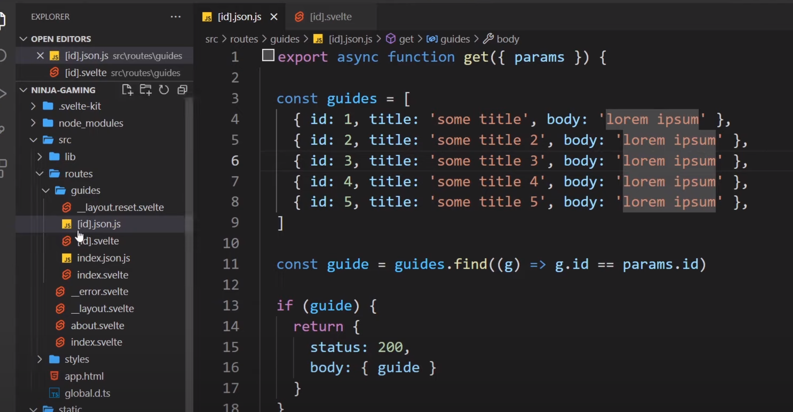

# Getting started

<https://svelte.dev/docs>

1.  Globally install **degit: npm i degit –g**

    1.  

2.  Install template in working **dir: degit sveltejs/template .**

3.  Run **npm install** to download all the dependencies.

4.  **npm run dev** to preview in local server

# Basics

**FireShip**: <https://youtu.be/043h4ugAj4c>

**Net Ninja**:
<https://www.youtube.com/playlist?list=PL4cUxeGkcC9hlbrVO_2QFVqVPhlZmz7tO>

**SvelteKit** : <https://youtu.be/UU7MgYIbtAk>

- Interpolating text {}

- Events: \<button on:click={alertYo}\>Click\</button\>

- 2-way binding

  - 

- Adding a custom CDN link

  - 

- A

# Sapper

<https://www.youtube.com/playlist?list=PL4cUxeGkcC9gdr4Qhx83gBBcID-KMe-PQ>

# SvelteKit

<https://kit.svelte.dev/docs>

<https://www.youtube.com/watch?v=_M-iOKo4FnE&t=145s>

SvelteKit is like Vue CLI and it handles routing as well.

## Reusable components

Can be placed in the routes/lib folder

You can use $lib to reference this folder later:

Using props:

Component:

## Layout Components

In routes folder

A way to hold multiple shared components together.

**Global styles**

You can make a css file in the src folder and import it into your layout
component

Import it into layout

**Reset layouts**

In the path you have to have new styles, you can overwrite the layout
componenet with a new layout that is local to the files in a given
directory by implementing a reset layout in that folder

Since this is scoped closer then layout component and still is a lyout
component, it will be preferred.

Loading data from API on start

Add another script tag with the context module and request using the
built-in fetch request. This fetch request will get called on the server
upon the initial request of the page but will subsequently be called in
the browser when the page is already loaded. It’s for this reason that
you have to make sure to only write js that can run on both browser and
server on this script tag.

Now you can use guides in your project

## Node JS and Svelte (a bit hacky)

Point your express app to your svelte index.html file

<https://www.youtube.com/watch?v=RpMBkkcxnMo>

Express…

Create new svelte folder

Move into svelte folder and initiate svelte

Run the svelte project

Runs on port 5000

**Point your express app to your svelte index.html**

In your svelte index.html, you might need to replace any paths with full
local host route

Changes to…

## Dynamic Routes

Wrap a part of your filename in square brackets to let svelte know this
file refers to a template where the route slug is changeable. This is
our route paramteter.

This would amount to this where id is variable

Note: Doesn’t have to be id – can be anything

Create some links…

And in the “id” file…

Access the page argument

### Redirecting from a dynamic route

### Error page

New file in routes folder

Note: This replaces the default one that sits here:

You can copy some code from the above to build our basic error page
template

Update message and details

Improving…

### Prefetch data

## API Routes

Setting up svelte to work as an API and handle API requests.

Create a new **index.json.js** file in the relevant dir

This means we can send API requests to this endpoint, where this end
point will be accessible at

**‘/guides.json’**

**Create handlers**

Create and export functions which will serve as our API handler
functions

From here we could connect to db and start responding to requests. Then
we just return the data we want to send back. For the sake of example
here, we will send back an object – this will return as json when
requested:

Then we replace our old function used to load a page with the new
request:

Becomes…

Another example:

