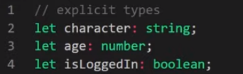
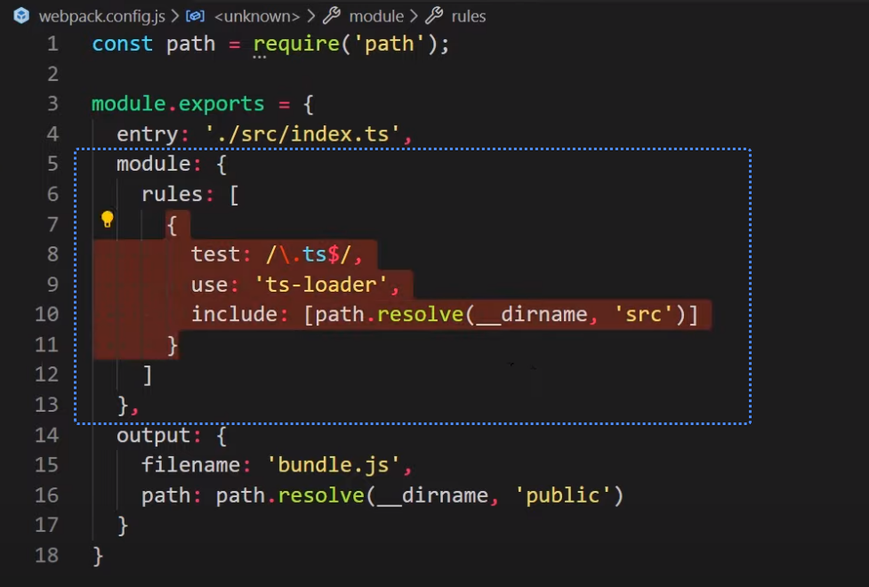
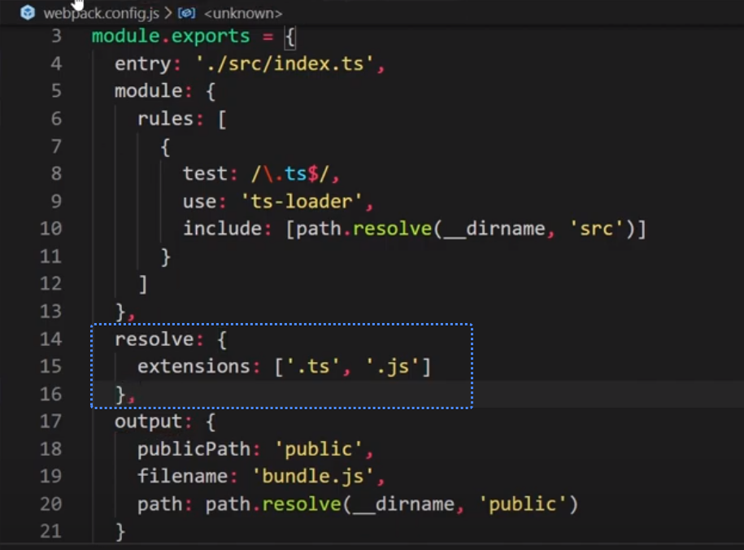

# TypeScript

**Tuts**

- **Net Ninja Playlist**:
  <https://www.youtube.com/playlist?list=PL4cUxeGkcC9gUgr39Q_yD6v-bSyMwKPUI>

- **Net Ninja Playlist (TypeScript + WebPack):**
  <https://www.youtube.com/playlist?list=PL4cUxeGkcC9hOkGbwzgYFmaxB0WiduYJC>

- 

Download: <https://www.typescriptlang.org/download>

npm install -g typescript

TypeScript it…

- A superset of JavaScript

- Uses strict types

- Supports modern features & extra features

- Install: using npm =\> npm install –g typescript

- Compile code: using npm =\> tsc script.ts script.js

  - Note: if the ‘to’ files is the same name as the production TS files,
    then you don’t need to specify the to file name.

  - Note: you can also add a watch flag to automatically compile after
    the first time

    - **Npm =\>** tsc script.ts –w

## Compiling

If your typescript file (app.ts) has the same base name as what you want
your javascript file to be (app.js) you don’t have to include the second
argument.

Example:

tsc app.ts

*^ creates app.js*

## Basics

- Strict types (no type coercion):

  - Type is inferred but not mutable

  - Only number type – no floating vs integer

## Core types

## Explicit Types

- Using the colon to define the data type is used to also define
  explicit types. Multiple applicable types will be considered ‘union’
  types where expected types are separated by the pipe symbol.

  - Variables

    - 

  - Function parameters

    - 

  - Union Types

    - Specify multiple types by using single pipe

    - 

  - Literal types: Specify exactly the values that are allowed

    - 

  - Literal Types using enum (Enum pretty much is a list of allowed
    options)

    - *Defining Function*

    - 

    - *Calling function*

    - 

  - Variables (mixed/union type)

    - 

  - Pure Arrays

    - 

  - Mixed Arrays (union type is one of multiple types)

    - 

  - Array of objects

    - 

  - Arrays full of a Class instance

    - 

    - *Example*

    - 

  - Objects

    - 

  - Functions

    - 

    - Type Inference: Typescript will always try to infer the type of a
      function return so you don’t have to explicitly specify it.

## Arrays & Objects

Arrays can be pure or mixed upon initialization

- An array can be initialized with members of all the same data type
  (pure array) or of mixed data (mixed array).

- If an array is initialized as a pure array (where every member is of
  the same data type) then…

  - …this cannot be changed later (by adding a member of a different
    type).

  - …the type of any particular member cannot be changed later.

- If an array is initialized as a mixed array (where the array consists
  of more than one different data type) then…

  - …the types used upon initialization of the array (say strings and
    numbers for example) cannot be changed later (you couldn’t add a
    Boolean value later).

  - …the type of any particular member <u>can</u> be changed later (as
    long as it is to one of the types defined in the array upon
    initialization).

^^^The same is true for objects

Exceptions…

- **Adding**: You cannot add to an object with the dot notation, only
  square bracket notation.

- Deleting: Use the delete keyword. delete objName.newPropName

## Better Workflow & tsconfig

- Common practice to have a “public” folder and a “src” folder.

- Create a **tsconfig.json** file by running ‘**tsc --init**’ in the
  command line.

- In the config file update the **outDir** and **rootDri** properties.

  - 

  - This will make it such that any file in the **src** folder will be
    compiled and output to the **public** folder.

- Update your include property to only compile the files in the folder
  you specify (“src” in this case)

  - 

- Run the file once and add the watch flag.

  - tsc script.ts –w or just tsc -w

  - ^ that will watch and compile all typescript files in your “src”
    folder and output the compiled file into “./public”.

## Functions

### Parameters

- Required parameter types

  - In a function, just as we can set default parameter values, we can
    also set required parameter value types in TypeScript. We do this by
    using the colon to specify the expected/required type to be passed
    into the function.

  - 

- Optional parameters

  - All parameters are required unless specified to be optional by using
    the **?** just before the parameter name (see parameter ‘c’ in the
    example below).

  - 

  - Note: It’s best practice to put optional parameters at the end.

- Optional parameters with default values

  - 

### Returned values

- Explicit return value type

  - 

  - ^ params “a” and “b” are number and fun returns a number.

- If/when a function returns a value into a variable, the type of that
  value will be inferred and that type will be rigidly set to that
  variable. A function defaults to returning a value of **void**.

  - This is implied if a return type is not specified

  - 

### Type Aliases

Save certain types/type combinations into variables which can be used
later

*Using later…*

*Using a type alias for an entire object…*

### Function signatures

Save the signature of a function (number and type of variables, what
will be returned, etc) into a variable not with the assignment variables
but with the colon. Once we define this function later, it must follow
the exact format as the function signature.

## Classes

### Access Modifiers (Public, Private & Readonly)

Since properties and methods are public by default, these are all the
same (“public” keyword is implied)

**<u>Private keyword</u>**

Using the private keyword makes sure these properties/methods can only
be modified from within the class – not externally.

This means that that this wouldn’t work…

As we aren’t even allowed to read this data (inv.details).

**<u>Readly Only</u>**

Allow for external reading only…

**<u>Shorthand (assign access modifier on constructor)</u>**

When creating a Class TypeScript requires that properties be defined
above the constructor.

However, there’s another syntax to simplify this:

^ by including the access modifiers before the params, this
automatically hoists those variables + access modifiers to the top of
the class.

*Another example…*

## Interfaces

Used to define the structure of a n object/class (which
properties/methods should be allowed).

Usually classes and interfaces get their own folders in your src folder:

### Object Interfaces

Defining Object Structure using an interface

Creating an object of isPerson type that complies with the isPerson
interface:

### Class Interfaces

<https://youtu.be/XPGFqx8Vg-Y?si=yk-7OAGOjIJMplTm>

Classes can have more than what an interface demands, but never less.

**<u>Step1: Create a class interface</u>**

^ in this class interface we’re making sure that any class that
implements this interface has a “format” method that returns a string.

**<u>Step2: Define your class</u>**

Make sure it “implements” (follows the structure of) your interface

## Generics

### Functions

Using the “\<T\>” before your params allows you to define what your
passing in:

### Interfaces

**<u>Standard way</u>**

Notice how “data” must merely be of the type “object”:

This works fine…

**<u>Using Generics</u>**

However, with generics, you can set the expected type

^ notice we set a placeholder when defining the interface and we specify
the type upon using the interface (teal arrow).

## Tuples

The type of data at each position (index) cannot be changed once a tuple
is defined.

Creating a tuple named “tup”…

The values at any index can be changed, but it must match the data type
defined when the tuple was declared.

## Enum

Literal Types using enum (Enum pretty much is a list of allowed options)

**<u>Example 0</u>**

**<u>Example 1</u>**

**<u>Example 2</u>**

*Defining Function*

*Calling function*

## Modules

**<u>Step1: Change module type</u>**

Open tsconfig.json and change module type to “es2015” and target to
“es6”

**<u>Step2: Make sure script tag is registered as “module”</u>**

**<u>Step3: Export items in module file(s)</u>**

Just add “export” word before (common js uses module.exports, but we’re
using es6 modules)

**<u>Step4: Import module into working file</u>**

^ be sure to use “.js” because that’s what typescript will be compiled
down to anya

## The DOM & Type Casting

**<u>Selecting items from the DOM</u>**

You might get an error if typescript can’t find an element in the DOM.
If you know a given element exists in the DOM, you can avoid this
warning by adding an exclamation mark.

However, if you’re grabbing by class or some other identifier not
specific to the type of element, you should add the “as” keyword to let
typescript know which type of element you’re grabbing:

This makes sure you can access properties/methods via intellisense.

*Alternatively… (less common)*

*Another example*

When printing input values (which will be strings) you can print value
as number by using…

## Webpack and TypeScript

**Playlist:**
<https://www.youtube.com/playlist?list=PL4cUxeGkcC9hOkGbwzgYFmaxB0WiduYJC>

### Setup

**<u>Step1</u>**

Run **tsc –-init** and edit the tsconfig.json file to use es6 modules

**<u>Step2</u>**

Run **npm init -y** to create your package.json file.

**<u>Step3: Install webpack and typescript loader</u>**

**<u>Step4: Install typescript as a local package as well</u>**

### Folder Structure + webpack config file

It’s common practice to create a “src” folder and your main typescript
file(s) inside and a “public” folder to contain your index.html file
(among others).

In your root path create a **webpack.config.js** file

**<u>Set entry/output paths</u>**

Although we only have one file as entry, we can import other files into
that file (index.ts) and those files will be compiled as well.

^ notice “output” folder.

It’s best to add in the “publicPath” option as well to specify where you
want your compiled file to be bundle to. Using webpack already does this
using “filename” and “path” but other packages (like webpack webserver)
rely on this “publicPath” option.

**<u>Add loader to check/compile typescript files with ‘ts-loader’</u>**

**<u>Add script to build public files:</u>**

*To compile…*

### WebPack WebServer

Spin up live development web server where webpack auto-compiles when
changes are made.

**<u>Install Webpack DevServer</u>**

**<u>Create npm script</u>**

Add a script to your package.json file that allows you to server your
files:

Compile with “**npm run serve**.

From your browser you can navigate to the “public” folder to view your
application.

Note: Make sure your public index.html file is linked to your public js
file:

**<u>Define public path</u>**

“publicPath” tell webpack server where it should saved compiled files

### SourceMaps

Source Maps help us debug by creating a link between our compiled JS
file and our source TS files. This way, any errors thrown in browser
console don’t merely reference “line1” of the minified js file.

**<u>Typescript Configuration</u>**

Edit the tsconfig.json file to enable sourcemaps

**WebPack Configuration**

In your webpack.config file, add in a “devtool” propery and give it a
source map value of “eval-source-map”

Note: There are other besides “eval-source-map” which can be used such
as “source-map” which commonly used in production.

Now errors in browser will point to typescript file

### Modules

To use ES6 modules in typescript, edit the tsconfig file as so

Edit the webpack.config file, adding in a resolve option for
typescript/javascript:

