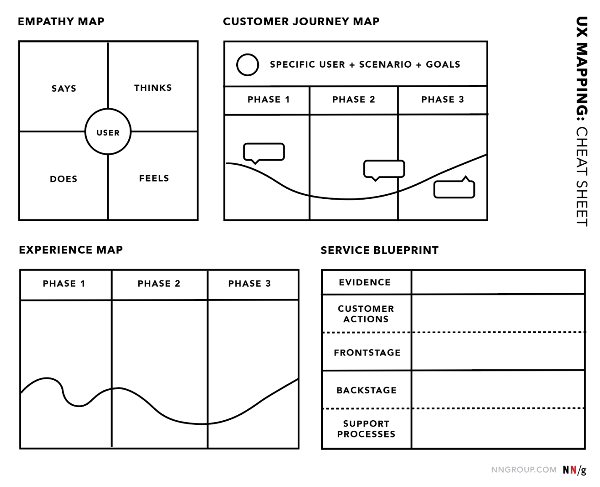
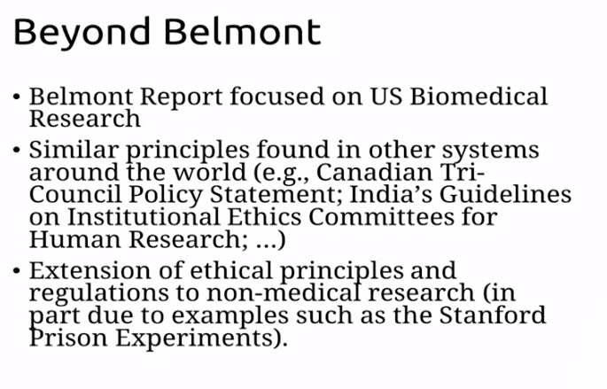
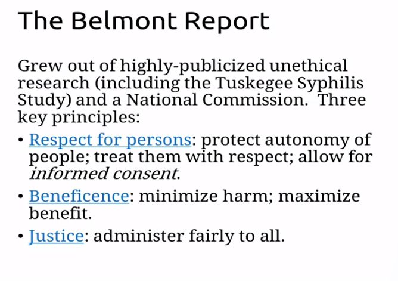

CALIFORNIA INSTITUTE OF THE ARTS

### UI vs UX

- UX is primarily non-visual, while UI is visual.

- The tangible, material results of UI are evident in the interface.

- UX development is driven by user behavior and feedback, while UI is
  designer driven.

- UI is rooted primarily in graphic design, because it concerned with
  how the interface looks.

- Because UX is user-driven, it aims to generate solutions to elevate
  user engagement.

- UI is design-driven, which involves making decisions to define the
  form, aesthetics, and look and feel of a site.

- UX is concerned with the experience that a user has with a site.

- UX relies upon research, planning and testing to improve user
  experience.

- **<u>Four quadrants of UX design</u>**

  - ***User research*** – Investigate why this project is being built,
    for who, and how they will interact with this content. Also involves
    gathering metrics and data on potential user base *(user personas)*.

  - ***Experience strategy*** – Usually a lead-role, engaged in team
    meetings discussing how to implement the experience.

  - Information Architecture – Analyzing the flow of the information
    given and how the user will benefit from the structure of the
    information given.

  - ***Interaction Design*** – Prototyping, wireframing, and design
    templates for the overall design.

# UI (Visual Elements of User Interface Design)

## Week 1: What is UI?

### Interface Conventions

- An interface can be best described as a bridge between:

  - User and the content

- Why is it helpful to rely on real world models within interface
  design?

  - Real world models are more familiar and therefore will enhance user
    experience – mpre intuitive

- What is the rule of thumb for organizing content within an interface?

  - Systematically

- Why is it important for the interface to react immediately when a user
  carries out an action? Choose the best answer.

  - So user knows the interface works/functions properly

- Context-specific design is best defined as:

  - Shaping a design that reflects different goals, content, and users.

### Approaches to screen-based UI

- Template-based: Quick, for repetitive or non-interactive content.

- Content-based: Heavily interaction-based, for varying content, takes
  more time.

## Week 2: Core UI Concepts

### Formal Elements of Interface Design (pre-design)

**<u>Look and feel/ Style and Mood</u>**

- <u>Creation of a Mood Board</u>: A general concept applying
  typography, general shapes, and a suggested color palette.

<!-- -->

- **<u>Language</u>**

  - Naming/Branding

  - Keywords that capture the look and feel

- **<u>Color</u>**

  - <u>Color Theory Triad</u> (*self-described*)

    - **Chromatic Semantics**: What will this color mean/represent to
      the intended user? (yellow triangle)

    - **Chromatic Qualia**: How does this color make one feel?

      - Example: Pink vs Blue

    - **Chromatic Teleology**: What is the intended purpose behind the
      presence or absence of a color in a given chromatic environment?
      Further, what does this makes the user want to do?

      - Example: A series of circles:

        - one’s color is muted = appears inactive

        - all but the last few circles are colored = shows progression

        - all same color = perceived identical functionality

    - *Note: These concepts can equally be applied to shapes as well*

  - Controlling color

    - Association

    - Contrast

    - Similarity

    - Active

    - Passive

  - Progression

  - State changes

- **<u>Shapes</u>**

  - Simple, Geometric, and systematic that may emulate a certain action
    if interacted with by the user.

- **<u>Imagery</u>** (can be used as…)

  - <u>Content</u> (always implies a mood) – display a product or
    service

  - <u>Navigation</u> (always implies a mood) – can represent something
    easier than words sometimes.

  - <u>Mood</u> – Sets a theme, and the mood always has visual aesthetic

- **<u>Typography</u>**

  - Can act as…

    - <u>Content</u> – Text is fast, economical, economical, and
      accurate.

    - <u>Interface</u> – Can represent what can’t be easily depicted
      (accurate representation of complex, non-visual, or abstract
      concepts)

    - <u>Branding</u> – Can create identity and individuality with the
      use of text form.

- **<u>Icons</u>**

  - Icons represent other things – just like symbols

    - Symbols are distinct in that they are non-pictorial and icons are
      a pictorial representation of the things they intend to represent.
      That is to say, icons look like the things they represent and
      symbols do not.

  - <u>An analogy</u>: Symbols are to Icons what text is to a picture.
    Symbols are used to represent that which cannot easily be
    represented by an icon in the same way text can be used to describe
    that which cannot be easily depicted by a picture. Examples for both
    of these include complex or abstract concept (example: democracy,
    allegiance, correlation).

  - <u>An inverse analogy</u>: Icons are to symbols what pictures are to
    text. Icons are used to more easily represent a simple concept which
    would be difficult to be represented by a symbol in the same way
    images can easily be used to describe that which would be more
    cumbersome to be represented by text. Examples for both of these
    include simple concepts (example: lane merging signs).

  - What makes a good icon?

    - Communication of idea

      - The semiotics of icons: Asks what is the icon intended to
        represent?

    - Functionality

    - Audience understanding

    - Recognition

- **<u>Visual Hierarchy</u>**

  - The flow of the experience should make give the user an intuitive
    feeling as to what to do and how to achieve it.

### UI Project Elements

Things a typical rough project brief should contain:

1)  Name of your product

2)  A short description of your project idea. The description should
    answer the following questions:

    1)  What is it?

    2)  Who is it for?

    3)  Where does it live?

3)  A tagline for your project, using suitable language aligned with the
    intended audience.

4)  A description of the main activity or function of the app.

5)  A mood board containing your visual research for your project idea.
    The mood board should contain:

    1)  Between 15 to 20 images to help define the mood or attitude of
        your product or service, or as possible content in your
        interface

    2)  At least one possible typeface that will appear in your design

    3)  A color palette of 3 to 5 colors based on/pulled from the
        imagery you collected

## Week 3: Functionality

### Static to active

- Adding functionality is key, but what’s more important than making
  something dynamic is finding the right balance between static and
  dynamic. **There are pros and cons of each and the balance between the
  two depends on the intended user**.

### Simplicity and Complexity

- This is essentially a matter of finding the best balance just as with
  a static and active experience.

- There pros and cons of both: A simple experience may be easy,
  intuitive, and fast, but it may also be boring and unexciting. By
  contrast a complex website may me beautiful and exciting but it may
  also be annoying and cumbersome to navigate.

### Composition and Structure

- This involves deciding how the experience should be arranged.
  Structured around the explicit content or composed around the implicit
  content.

### Points of Interaction

- Buttons

  - How is a button recognized?

  - Types of buttons: Standard, toggle, switch, etc

  - States changes: How can we represent the different states within the
    pressing of a button?

    - Inactive state

    - Hover state

    - Interacted with

## Week 4: A Cohesive Flow

### Invisible Complexity: Making a Whole from Many Parts

- Find a harmonious balance between UI and UX will strengthen the
  relationship the one has with the other.

  - UX Overview

    - Content

    - Context

    - Audience

    - Look and Feel (empathy)

    - Language

    - Functionality

  - UI Elements

    - Color/Shape/Pattern

    - Imagery

    - Typography

    - Iconography

    - Buttons

    - Navigation

    - Menus/Links/Fields

### Hierarchy of Content

- This asks, what goes where and why? And what doesn’t go in other
  places – and why?

- **<u>Steps:</u>**

  - **Set the scene**: The initial impression of the site will set the
    expectation for the rest of the site. This asks ‘what is the user’s
    goal? The first thing they want to see?’

  - **Keep the flow Intuitive**: Now that the scence is set, maintain
    this visual continuity and order elements in the visual hierarchy
    based on the scene that was set.

- **Conventions and Expectations:**

  - The structure of a layout will depend largely on the device itself
    that is being used to view the site.

  - <u>Conventions:</u> What conventions are best for this device? A
    grid layout? How many panels or sections per visible area? This all
    depends on the device

  - <u>Expectations:</u> Given some particular decide, what will the
    user expect to see if they do or do not wish to interact with the
    site in a certain manner?

### Structure and Grids

- Large devices vs Small devices

  - Large: Multiple elements per given visible space

  - Small: One or fewer elements per given visible space, essential
    button near bottom of screen, etc.

- **Deciding which device to primarily design your site for will depends
  on the context, the purpose of the site, and the intended user.**

- Gridlines, don’t have to be visible, but they can be implied by the
  flow of the content within.

- Grids can provide: Spacing, scale, systematization, modularity, and a
  neat layout.

# UX Design Fundamentals

# General process of UX <u>Design</u>

1.  **Ideation, Articulation, & Development** \[Non-Visual\]

    1.  Words and light research

2.  **Mapping, Testing, Envisioning** \[Semi-Visual\]

    1.  Words, content maps, interaction maps

    2.  Sitemap (content map(s) + interaction map(s) )

3.  **Wireframing** \[Semi-Visual\]

    1.  Rough Designs of UI

4.  **Prototyping** \[Visual\]

    1.  Final Designs of UI

## Week 1: Ideation, Articulation, & Development

**Key idea**:

An idea doesn’t have to be unique, but how it’s approached, presented,
and the manner in which it solves the problems in question must be
unique in order to stand out and create a great user experience.

**Basic components of good UX design**

- Testing

- Research

- Revision

### User Research: Core Questions to ask

- What does it do? (Ideation and Articulation)

- How does it work? (Research & Development)

- Who will benefit from it? (Audience & Rationale)

- Why would someone use this? (Goals and outcomes)

#### Ideation and Articulation

- **Explore and Refine**:

  - **First**: <u>Explore</u> the different ways you can approach your
    idea.

  - **Second**: <u>Refine</u> which ways are relevant and best-suited to
    arrive at your goal in a *unique* way.

- **Hierarchy functionality**

  - List functions of your digital product in a hierarchical order and
    build them into your overall flow accordingly.

- **Main purpose**: Write a one line description to capture main
  function(s).

#### Research and Development:

- Look at similar/competing digital products: What do you like or
  dislike?

- Look at dissimilar yet successful digital products: What can you apply
  in your project?

- Map out your ideas and expand the parameters.

#### Audience & Rationale:

- Who is the target user base?

- Categorize different hypothetical users by some general common trait.

- Create user personas based off of this categorization (ideally each
  user persona should fit into all/most categories).

- Find specific traits shared by these user personas.

- Why use user personas:

  - Might describe future user

  - Helpful to describe your digital product to others

  - Role-play

#### Goals and outcomes:

- Naming and Mission: How we can use words effectively

  - Branding with words: These three keywords all work <u>together</u>
    and they all set the <u>tone</u>

    - **Naming**: a word or two

      - Memorable and original

    - **Tagline**: a short sentence

      - A summarized soundbite, catchy, succinct

    - **Mission:** Statement: a few lines

      - Describe achievements and goals

  - Use a word-web: Find relevant worlds, and connect them to related
    words to form a web of ideas

    - Look at competition

    - Try combining words together

    - Q: What’s the intended mood?

## Week 2: Mapping, Testing, Envisioning

1.  **Mapping**

    1.  Systematize our developed ideas

    2.  Build maps (content and interaction)

        1.  <u>Content map</u>

            1.  What content goes where?

        2.  <u>Interaction map (User flowchat)</u>

            1.  What’s the flow of the content?

            2.  Traverse the possible path a user could take when
                interacting with your site or app.

    3.  About each map

        1.  **Map Qualities**

            1.  Clarity

            2.  Hierarchy

            3.  Modularity

            4.  Growth potential

    4.  Using the hierarchy of functionality prepared during your
        ideation phase, lay out the steps user would have to take to
        complete each function.

2.  **Testing** (interaction map)

    1.  Paper Prototyping

        1.  Break up your interaction map into modular and concise
            pieces

        2.  **User testing & updating your maps**: Edit, test, revise
            and repeat continuously until you can account for all
            expected interaction in an intuitive way.

        3.  **Testing questions to ask user**:

            1.  Before even looking at the prototype, what do you expect
                to do with this app?

            2.  What is the first thing you notice on this screen?

            3.  What is the first thing you would do on this screen?

            4.  Your task is X. What would be the first thing you would
                do here to accomplish that task?

            5.  (after observing the user press a particular part of the
                interface) Why did you choose that button?

            6.  Is there anything on this screen that seems out of
                place?

            7.  Is there anything missing from this screen?

            8.  Is the prototype easy to use?

            9.  How do you feel when you are using the prototype?

            10. What would you change about the prototype?

>  alt="UX Mapping Cheat Sheet: Empathy Mapping, Customer Journey Mapping, Experience Mapping and Service Blueprinting" />

3.  **Envisioning**

    1.  Site map

        1.  A combination of the content + Interaction map

        2.  Sitemaps set the basis for wireframing

    2.  Visual development (UI): Putting it together

        1.  Sitemap: This will control our content flow (Done)

        2.  Visual direction: This will incorporate UI elements (style
            and mood)

        3.  Wireframes: This is next

## Week 3: Wireframing and UI design

### Nielsen's Usability Heuristics

1.  **Visibility of system status**: The system should always keep users
    informed about what is going on, through appropriate feedback within
    reasonable time.

2.  **Match between system and the real world**: The system should speak
    the users' language, with words, phrases and concepts familiar to
    the user, rather than system-oriented terms. Follow real-world
    conventions, making information appear in a natural and logical
    order

3.  **User control and freedom**: Users often choose system functions by
    mistake and will need a clearly marked "emergency exit" to leave the
    unwanted state without having to go through an extended dialogue.
    Support undo and redo.

4.  **Consistency and standards**: Users should not have to wonder
    whether different words, situations, or actions mean the same thing.

5.  **Error prevention**: Even better than good error messages is a
    careful design which prevents a problem from occurring in the first
    place. Either eliminate error-prone conditions or check for them and
    present users with a confirmation option before they commit to the
    action.

6.  **Recognition rather than recall**: Minimize the user's memory load
    by making objects, actions, and options visible. The user should not
    have to remember information from one part of the dialogue to
    another. Instructions for use of the system should be visible or
    easily retrievable whenever appropriate.

7.  **Flexibility and efficiency of use**: Accelerators — unseen by the
    novice user — may often speed up the interaction for the expert user
    such that the system can cater to both inexperienced and experienced
    users. Allow users to tailor frequent actions.

8.  **Aesthetic and minimalist design**: Dialogues should not contain
    information which is irrelevant or rarely needed. Every extra unit
    of information in a dialogue competes with the relevant units of
    information and diminishes their relative visibility.

9.  **Help users recognize, diagnose, and recover from errors**: Error
    messages should be expressed in plain language (no codes), precisely
    indicate the problem, and constructively suggest a solution.

10. **Help and documentation**: Even though it is better if the system
    can be used without documentation, it may be necessary to provide
    help and documentation. Any such information should be easy to
    search, focused on the user's task, list concrete steps to be
    carried out, and not be too large.

### Working with wireframes

- **<u>Key point</u>**: For each screen, find the layout that
  prioritizes the **expected** **functionality for the intended user**.

- **<u>Key point</u>**: For each screen, find the optimal balance
  between consistency and difference.

  1.  The user has to be able to recognize the general consistent style
      throughout your app. In addition, there has to be a level of
      difference between certain areas to reduce boredom and
      repetitiveness. **Takeaway**: Visual continuity + Visual
      engagement.

#### Wireframe Map

- Sitemap will serve as a guide for our many wireframe screens

- Check for inconsitencies

- Think about navigation/menu movement – how will things move?

- Find an optimal layout to display your wireframe screens

- More user testing/retesting

#### Visual Direction

- Create a mood board (develop your look and feel).

- Develop UI: Apply your mood board style to wireframes to create UIs.

- Refinement: Contrast, shadow, small details

## Week 4: Prototyping

- What goes where?

- Functionality

- Visual hierarchy

# User Research and Design

**<u>Ways of thinking</u>**

*Note: A balance of <u>both</u> of these two ways of thinking is crucial
to a good user experience.*

- **<u>Convergent thinking:</u>** A methodology of approaching a certain
  problem by putting forward the best solutions that have worked in the
  past and that you think are best for the job at hand.

- **<u>Divergent thinking</u>**: Not knowing the solution to the problem
  and starting off by asking the fundamental question as to what it
  means to solve such a problem.

## Process of user research & design

1.  **<u>Research with users:</u>**

*Typically involves…*

1.  Asking people questions

2.  Observing people’s behaviors

3.  Analyzing traces of people’s behaviors

<!-- -->

2.  **<u>Analyzing and communicating</u>**

    1.  <u>Qualitative analysis:</u>

    2.  <u>Quantitative analysis</u>:

    3.  <u>Communication tools</u>: User personas, use cases, tasks,
        scenarios, implications.

3.  **<u>Generating and selecting ideas</u>:**

    1.  Getting to a quantity of ideas

    2.  Selecting best quality ideas

    3.  Communicating ideas to stakeholders

## User research methods

**<u>How to interview participants</u>**

1.  Prepare your questions

    1.  Open-ended wording

    2.  Note any possible follow-up questions

2.  Schedule and arrange your meeting

3.  Conduct the interview

4.  Analyze

**<u>Interview pointers</u>**:

- General

  - Schedule a time & place and confirm with participants

  - Design and pilot an interview protocol

  - Carefully select a group based on role and demographics

**<u>Observations</u>**

- Allows you to find things about user that they didn’t/couldn’t
  articulate.

**<u>Contextual Inquiry</u>**

- Contextual inquiry is generally conducted in the participants’ context

  - If possible, conduct multiple contextual inquiry sessions with the
    participants to allow you to form a stronger partnership and observe
    more rare events.

- Involve the participants in the interviewing.

- What do you want to get from them?

- How do they want to share?

- Can they interact with your findings and observations?

- Strengths:

  - Requires no prior-knowledge

  - More nuanced data

- Weaknesses:

  - Usually takes much longer

**<u>Ethics and consent</u>**

**<u>Protocol Packet:</u>** A single pdf that combines a consent form, a
questionnaire, and a set of instructions (including questions to ask)
for the interviewer.
