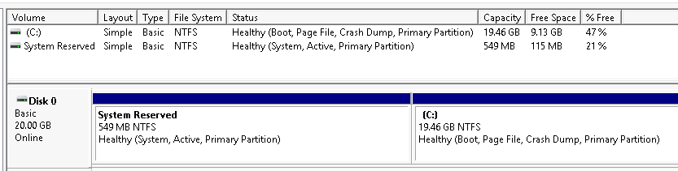
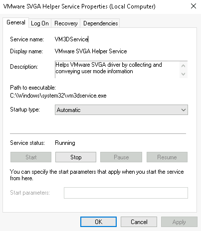
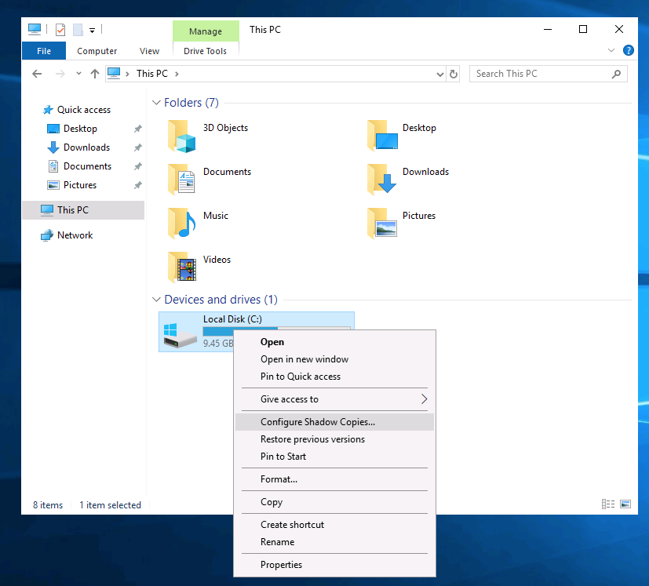
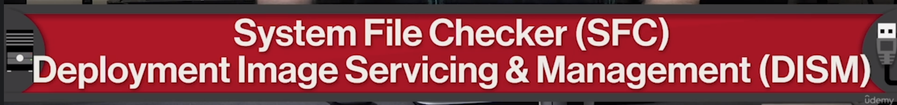
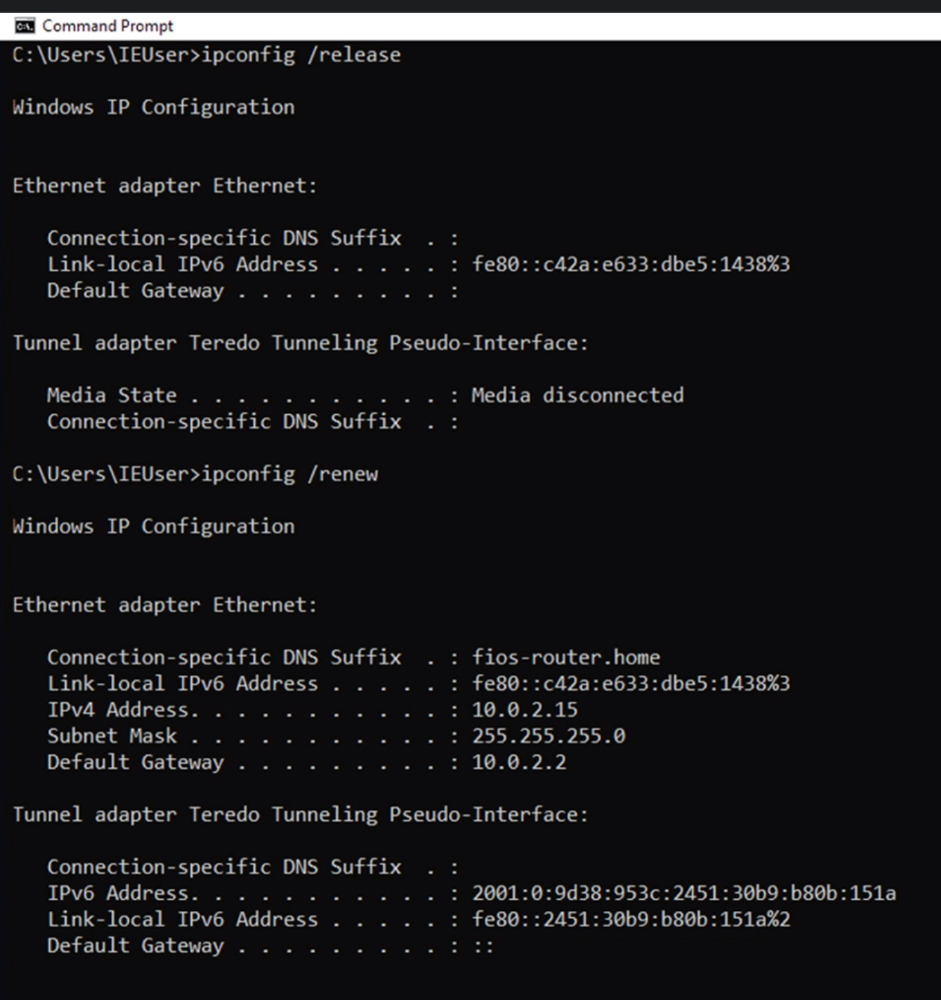
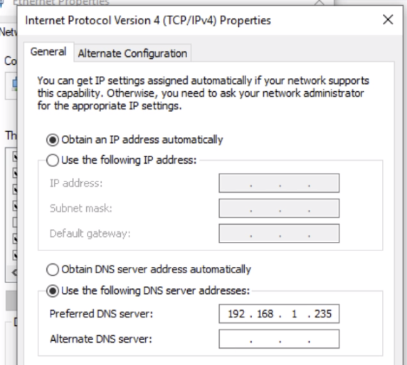
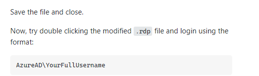

# Windows SysAdmin (Cmd and Powershell)

# Introduction

^ Administrative Tools is where you can find many of the services used
by sysadmins.

A common service “System Configuration” can be ran from the command line
by running ‘**msconfig**’.

Systems administrators have a diverse set of roles, and
responsibilities. They can range from configuring servers, monitoring
the network, provisioning, or setting up new users in computers and
more. Think of system administrator as a tech Generalist.

**IT infrastructure** encompasses the software, the hardware, network,
and services required for an organization to operate in an enterprise IT
environment. Without an IT infrastructure, employees wouldn't be able to
do their jobs and the whole company will crumble before it even get
started. So organizations employ the help of someone like a systems
administrator to manage the company's IT infrastructure. Their
responsibilities may be separated out into different roles with job
titles like network administrators and database administrators.

**UAC** prevents usage of powerful programs by users with limited
permissions. Root is the name of a Linux administrative account.
Administrator is the name of a Windows administrative account. Superuser
is the general term for a Linux or Unix administrative account.

**KVM Switch**

Used in datacenters (or server rooms) where multiple servers are
operating in server racks (or blade towers). These servers can serve up
different services, such as web content (web server), ftp server, email
server, ssh server, database server, and more. We can remotely connect
to them with something like SSH. Even so, you should always have a
monitor keyboard on hand. Sometimes when you're working your network
might be having issues and SSH won't be an option. A common industry
practice is to use something known as a **KVM Switch**. KVM stands for
keyboard, video and mouse. A KVM Switch looks like a hub that you can
connect multiple computers to and control them using one keyboard, mouse
and monitor.

On Server Operating Systems:
<https://www.pcworld.idg.com.au/article/151491/server_operating_systems/>

# The System Configuration Utility (MSConfig)

The **System Configuration** utility (MSConfig) is for advanced
troubleshooting, and its main purpose is to help diagnose startup
issues. 

Reference the following
document [here ](https://docs.microsoft.com/en-us/troubleshoot/windows-client/performance/system-configuration-utility-troubleshoot-configuration-errors)for
more information on the System Configuration utility. 

There are several methods to launch System Configuration. One method is
from the Start Menu.

**Note**: You need local administrator rights to open this utility. 

The utility has five tabs across the top. Below are the names for each
tab. We will briefly cover each tab in this task. 

1.  General

2.  Boot

3.  Services

4.  Startup

5.  Tools

In the **General** tab, we can select what devices and services for
Windows to load upon boot. The options are: **Normal**, **Diagnostic**,
or **Selective**. 

In the **Boot** tab, we can define various boot options for the
Operating System. 

The **Services** tab lists all services configured for the system
regardless of their state (running or stopped). A service is a special
type of application that runs in the background.  

In the **Startup** tab, you won't see anything interesting in the
attached VM.  Below is a screenshot of the Startup tab
for **MSConfig** from my local machine. 

As you can see, Microsoft advises using **Task Manager
(**taskmgr**) **to manage (enable/disable) startup items. The System
Configuration utility is **NOT** a startup management program. 

**Note**: If you open Task Manager for the attached VM, you will notice
that Task Manager doesn't show a Startup tab. 

There is a list of various utilities (tools) in the Tools tab that we
can run to configure the operating system further. There is a brief
description of each tool to provide some insight into what the tool is
for. 

Notice the **Selected command** section. The information in this textbox
will change per tool.

To run a tool, we can use the command to launch the tool via the run
prompt, command prompt, or by clicking the Launch button. 

## System information

We're continuing with Tools that are available through the **System
Configuration** panel.

What is the **System Information** (msinfo32) tool?

Per Microsoft, "*Windows includes a tool called Microsoft System
Information (Msinfo32.exe).  This tool gathers information about your
computer and displays a comprehensive view of your hardware, system
components, and software environment, which you can use to diagnose
computer issues.*"

The  information in **System Summary** is divided into three sections:

- **Hardware Resources**

- **Components**

- **Software Environment**

System Summary will display general technical specifications for the
computer, such as processor brand and model.

The information displayed in **Hardware Resources** is not for the
average computer user. If you want to learn more about this section,
refer to the official
Microsoft [page](https://docs.microsoft.com/en-us/windows-hardware/drivers/kernel/hardware-resources#:~:text=Hardware%20resources%20are%20the%20assignable,of%20bus%2Drelative%20memory%20addresses.).

Under **Components**, you can see specific information about the
hardware devices installed on the computer. Some sections don't show any
information, but some sections do, such as **Display** and **Input**.

In the **Software Environmen**t section, you can see information about
software baked into the operating system and software you have
installed. Other details are visible in this section as well, such as
the **Environment Variables** and **Network Connections**. 

Recall from the [Windows Fundamentals 1
room ](https://tryhackme.com/room/windowsfundamentals1xbx)(The
Windows\System32 Folder task) where **Environment Variables** was
briefly touched on. 

Per [Microsoft](https://docs.microsoft.com/en-us/powershell/module/microsoft.powershell.core/about/about_environment_variables?view=powershell-7.1),
"*Environment variables store information about the operating system
environment. This information includes details such as the operating
system path, the number of processors used by the operating system, and
the location of temporary folders.*

*The environment variables store data that is used by the operating
system and other programs. For example, the WINDIR environment variable
contains the location of the Windows installation directory. Programs
can query the value of this variable to determine where Windows
operating system files are located*".

Click on Environment Variables to see the assigned values for the
virtual machine.

Another method to view environment variables is Control Panel \> System
and Security \> System \> Advanced system settings \> Environment
Variables **OR** Settings \> System \> About \> system info \> Advanced
system settings \> Environment Variables.

The detour is over. Let's redirect our attention back to msinfo32 and
pick up where we left off.

Towards the very bottom of this utility, there is a search bar. Please
give it a go. Select Components and search for IP address.

## RegEdit

We're continuing with Tools that are available through the **System
Configuration** panel.

The **Windows Registry** (per Microsoft) is a central hierarchical
database used to store information necessary to configure the system for
one or more users, applications, and hardware devices.

The registry contains information that Windows continually references
during operation, such as:

- Profiles for each user

- Applications installed on the computer and the types of documents that
  each can create

- Property sheet settings for folders and application icons

- What hardware exists on the system

- The ports that are being used.

**Warning**: The registry is for advanced computer users. Making changes
to the registry can affect normal computer operations. 

There are various ways to view/edit the registry. One way is to use
the **Registry Editor** (regedit).

Refer to the following Microsoft
documentation [here](https://docs.microsoft.com/en-us/troubleshoot/windows-server/performance/windows-registry-advanced-users) to
learn more about the Windows Registry. 

## Computer Management

We're continuing with Tools that are available through the **System
Configuration** panel.

The **Computer Management **(compmgmt)** **utility has three primary
sections: **System Tools**, **Storage**, and **Services and
Applications**.

**System Tools**

Let's start with **Task Scheduler**. Per Microsoft, with Task Scheduler,
we can create and manage common tasks that our computer will carry out
automatically at the times we specify.

A task can run an application, a script, etc., and tasks can be
configured to run at any point. A task can run at log in or at log off.
Tasks can also be configured to run on a specific schedule, for example,
every five mins.

To create a basic task, click on Create Basic
Task under **Actions** (right pane).

Next is **Event Viewer**.

Event Viewer allows us to view events that have occurred on the
computer. These records of events can be seen as an audit trail that can
be used to understand the activity of the computer system. This
information is often used to diagnose problems and investigate actions
executed on the system. 

Event Viewer has three panes.

1.  The pane on the left provides a hierarchical tree listing of the
    event log providers. (as shown in the image above)

2.  The pane in the middle will display a general overview and summary
    of the events specific to a selected provider.

3.  The pane on the right is the actions pane.

There are five types of events that can be logged. Below is a table
from [docs.microsoft.com](https://docs.microsoft.com/en-us/windows/win32/eventlog/event-types) providing
a brief description for each.

The standard logs are visible under **Windows Logs**. Below is a table
from [docs.microsoft.com](https://docs.microsoft.com/en-us/windows/win32/eventlog/eventlog-key) providing
a brief description for each.

For more information about Event Viewer and Event Logs, please refer to
the Windows Event
Log [room](https://tryhackme.com/room/windowseventlogs). 

**Shared Folders** is where you will see a complete list of shares and
folders shared that others can connect to. 

In the above image, under Shares, are the default share of Windows, C$,
and default remote administration shares created by Windows, such as
ADMIN$. 

As with any object in Windows, you can right-click on a folder to view
its properties, such as Permissions (who can access the shared
resource). 

Under **Sessions**, you will see a list of users who are currently
connected to the shares. In this VM, you won't see anybody connected to
the shares.

All the folders and/or files that the connected users access will list
under **Open Files**.

The **Local Users and Groups** section you should be familiar with
from [Windows Fundamentals
1](https://tryhackme.com/room/windowsfundamentals1xbx) because
it's lusrmgr.msc.

In **Performance**, you'll see a utility called **Performance
Monitor** (perfmon).

Perfmon is used to view performance data either in real-time or from a
log file. This utility is useful for troubleshooting performance issues
on a computer system, whether local or remote. 

**Device Manager** allows us to view and configure the hardware, such as
disabling any hardware attached to the computer.

**Storage**  

Under Storage is **Windows Server Backup** and **Disk Management**.
We'll only look at Disk Management in this room.

**Note**: Since the virtual machine is a Windows Server operating
system, there are utilities available that you will typically not see in
Windows 10.  

Disk Management is a system utility in Windows that enables you to
perform advanced storage tasks.  Some tasks are:

- Set up a new drive

- Extend a partition

- Shrink a partition

- Assign or change a drive letter (ex. E:) 

**Services and Applications**

Recall from the previous task; a service is a special type of
application that runs in the background. Here you can do more than
enable and disable a service, such as view the Properties for the
service. 

WMI Control configures and controls the **Windows Management
Instrumentation** (WMI) service.

Per Wikipedia, "*WMI allows scripting languages (such as VBScript or
Windows PowerShell) to manage Microsoft Windows personal computers and
servers, both locally and remotely. Microsoft also provides a
command-line interface to WMI called Windows Management Instrumentation
Command-line (WMIC).*"

**Note**: The WMIC tool is deprecated in Windows 10, version 21H1.
Windows PowerShell supersedes this tool for WMI. 

# Windows CMD Cheat Sheet

## **System Information**

- **DATE** - Outputs or sets the current date

- **TIME** - Displays or sets the system time

- **DRIVERQUERY** - Displays the current state and properties of the
  device driver

- **HOSTNAME** - Displays name of the computer

- **SYSTEMINFO** - Shows configuration information about your computer

- **VER **- Allows you to view the Windows version

- **GPRESULT** – Displays current applied group policies (RSoP)

- **GPUPDATE** – Updates group policies

## **Command Line Setup**

- **CLS** - Clears screen

- **CMD** - Displays another command prompt

- **COLOR** - Sets the text and background color

- **PROMPT** - Changes the command line prompt

- **TITLE** - Assigns a title for the current session

- **HELP** – Launches CMD help

- **EXIT** - Exits the command line

# **Windows boot process**

Use msconfig to enable the blootlog which writes details about the boot
process to a file:

## **Dual Boot**

# User management and File sharing

## Users and Groups

**Common Commands**

- Get-LocalUser

- Get-LocalGroup

- Get-LocalGroupMember \<group name\>

## Passwords

**Powershell**

Or use add an asterisk as last arg to be prompted for pw:

Force user to update pw on next login

## Windows shared folders

Right-click a folder to enabled folder sharing

Once shared, other users can access it if this folder is now mapped as a
network drive:

Finally, on another computer, you can visit it directly from the run box
by typing in backslash, whatever the computer name is, and then
backslash the folder name that you mapped it to.

You might be interested to know that you can share folders from the
command line too, using the **net share** command. Net share lets you do
the same thing as the GUI sharing workflow, and you'll need to specify
what kind of permissions you'd like to give which users. Let's say you
wanted to give everyone on your network full permissions to a folder
called shareme.

The net share command can also be used to list the currently shared
folders on your computer by executing it without any arguments.

### Samba (SMB)

Windows Server creates and manages domains and single sign-on services.
iOS and Linux do not provide domains or single sign-on services. SAMBA
is a file sharing program.

# **Storage, Disk, and Filesystem Management**

## **Filesystem management** 

### NTFS and ADS

The file system used in modern versions of Windows is the **New
Technology File System** or
simply [NTFS](https://docs.microsoft.com/en-us/windows-server/storage/file-server/ntfs-overview).

Before NTFS, there was **FAT16/FAT32 **(File Allocation Table)
and **HPFS **(High Performance File System). 

You still see FAT partitions in use today. For example, you typically
see FAT partitions in USB devices, MicroSD cards, etc. but traditionally
not on personal Windows computers/laptops or Windows servers.

NTFS is known as a journaling file system. In case of a failure, the
file system can automatically repair the folders/files on disk using
information stored in a log file. This function is not possible with
FAT.   

NTFS addresses many of the limitations of the previous file systems;
such as: 

Supports files larger than 4GB

Set specific permissions on folders and files

Folder and file compression

Encryption ([Encryption File
System](https://docs.microsoft.com/en-us/windows/win32/fileio/file-encryption) or **EFS**)

If you're running Windows, what is the file system your Windows
installation is using? You can check the Properties (right-click) of the
drive your operating system is installed on, typically the C drive
(C:\\.

Another feature of NTFS is **Alternate Data Streams** (**ADS**).

**Alternate Data Streams** (ADS) is a file attribute specific to
Windows **NTFS** (New Technology File System).

Every file has at least one data stream ($DATA), and ADS allows files to
contain more than one stream of data. Natively [Window
Explorer](https://support.microsoft.com/en-us/windows/what-s-changed-in-file-explorer-ef370130-1cca-9dc5-e0df-2f7416fe1cb1) doesn't
display ADS to the user. There are 3rd party executables that can be
used to view this data,
but [Powershell](https://docs.microsoft.com/en-us/powershell/scripting/overview?view=powershell-7.1) gives
you the ability to view ADS for files.

From a security perspective, malware writers have used ADS to hide data.

Not all its uses are malicious. For example, when you download a file
from the Internet, there are identifiers written to ADS to identify that
the file was downloaded from the Internet.

To learn more about ADS, refer to the following link from
MalwareBytes [here](https://blog.malwarebytes.com/101/2015/07/introduction-to-alternate-data-streams/). 

### Windows vs Linux comparison

**FAT** (FAT 16) comes from “file allocation table” and is the oldest
common filesystem type which works with windows and linux though it now
is only an option for very small volumes.

Though windows can’t read/write ext4, Ubuntu can read/write ext4 (etx3
as well which was the precursor).

There are lots of file systems out there, but the two that we'll talk
about in this course are recommended as default filesystems for Windows
and Linux. For Windows, we use the NTFS filesystem, and for Linux, it's
recommended to use ext4. Filesystems have different compatibilities with
different OSes. Most of the time, cross operating system support is
minimal at best. Let's say you have a USB drive that's using an NTFS
filesystem. Both Windows and Linux's Ubuntu can read and write to the
USB drive. But if you have an ext4 USB drive, it'll only work on Ubuntu
and not on Windows, at least without the help of third party tools.

It's pretty likely that you'll encounter this situation in an IT support
role. Let's say you have some important files on that same USB drive
that you want to copy over to your Windows, Linux, and Mac OSes, what
would you do then?

This is a pretty common situation. You'd have to reformat or wipe the
USB drive and add a filesystem that's compatible with all three
operating systems.

Luckily, there are filesystems like FAT32 that support reading and
writing data to all three major operating systems. ***FAT32*** has some
shortcomings though. It ***doesn't support files larger than 4
gigabytes, and the size of the filesystem can't be larger than 32
gigabytes***. This might be enough for a small USB drive, but it's not
really great for anything else.

You can learn more about FAT32 in the next supplemental reading. This
still begs the question, what if you wanted to be able to share files
between multiple OSes and don't want to deal with filesystem
limitations? Don't worry, we've got you covered. In the next course on
system administration and IT infrastructure services, we'll discuss
another filesystem type called network filesystems that solves this
exact problem.

### Quick and common commands

- **COPY** - Copies files to another location

- **DIR** – Displays files and folders in current directory

- **DEL or ERASE** - Deletes files

- **EDIT** - Starts file editor

- **CD** - Changes directory

- **EXPAND** - Decompresses compressed files

- **FC** - Compares files and shows the differences between them

- **FIND** - Finds a text string in the file

- **MD or MAKEDIR** - Creates a folder

- **MOVE** - Moves files from one folder to another

- **PRINT** - Prints out the text file contents

- **RD or RMDIR** - Deletes a folder

- **REN or RENAME** - Renames a file or folder

- **REPLACE** - Replaces files in one directory with files of the same
  name in another directory (overwrite)

- **ROBOCOPY** - Uses an advanced tool to copy files and directories

- **TREE** - Shows directory structure of a disk or folder

- **TYPE** - Displays the contents of text files

- **OPENFILES** – Manages opened local or network files

- **XCOPY** - Copies files and directory trees

### **xcopy**

Copy one dir to another drive

*Flags:*

1.  **/s** : Recursive (copy all subdirectories)

2.  **/v** : Verify each file before copying

3.  **/h** : Omit hidden files

Works across external network drives with UNC paths:

### **Robocopy**

Better than xcop: more verification and more speed.

*Flags:*

1.  **/s** : Recursive (copy all subdirectories)

2.  **/xa:h** : Omit hidden files

#### \#1 Simple copy

To copy contents of C:\UserFolder to C:\FolderBackup:

Robocopy C:\UserFolder C:\FolderBackup

This is the simplest usage for Robocopy

#### \#2 Copy all content including empty directory

To copy all contents including empty directories of SourceFolder to
DestinationFolder:

Robocopy C:\SourceDir C:\DestDir /E

#### \#3 List only

List only files larger than 32 MBytes(33553332 bytes) in size.

Robocopy.exe c:\sourceFolder d:\targetfolder /min:33553332 /l

Note: /l - will list files matching the criteria. if /l is omitted,
files matching the criteria will be copied to the taget location

#### \#4 Move files over 14 days old

Move files over 14 days old (note the MOVE option will fail if any files
are open and locked).

ROBOCOPY C:\SourceFoldern D:\DestinationFolder /move /minage:14

Similarly you could use the below switches

- /maxage: \<N\> Specifies the maximum file age (to exclude files older
  than N days or date).

- /minage: \<N\>  Specifies the minimum file age (exclude files newer
  than N days or date).

- /maxlad: \<N\> Specifies the maximum last access date (excludes files
  unused since N).

- /minlad: \<N\> Specifies the minimum last access date (excludes files
  used since N) If N is less than 1900, N specifies the number of days.
  Otherwise, N specifies a date in the format YYYYMMDD

#### \#5 Mirror a directory with subfolders incl. empty directories

/MIR is an option to ROBOCOPY where you mirror a directory tree with all
the subfolders including the empty directories and you purge files and
folders on the destination server that no longer exists in source.

ROBOCOPY \\sourceserver\share \\destinationserver\share /MIR

Or

ROBOCOPY source-drive:\DIR destination-drive:\DIR /MIR

#### \#6 Mirror directories

The following command will mirror the directories using Robocopy:

Robocopy \\SourceServer\Share \\DestinationServer\Share /MIR /FFT /Z
/XA:H /W:5

Explanation of the switches used:

- /MIR specifies that Robocopy should mirror the source directory and
  the destination directory. Note that this will delete files at the
  destination if they were deleted at the source.

- /FFT uses fat file timing instead of NTFS. This means the granularity
  is a bit less precise. For across-network share operations this seems
  to be much more reliable - just don't rely on the file timings to be
  completely precise to the second.

- /Z ensures Robocopy can resume the transfer of a large file in
  mid-file instead of restarting.

- /XA:H makes Robocopy ignore hidden files, usually these will be system
  files that we're not interested in.

- /W:5 reduces the wait time between failures to 5 seconds instead of
  the 30 second default.

#### \#7 Copy all changes

Use Robocopy to copy all changes to files in a directory called c:\data
to a directory that contains the date, like data_20091124.  Create a
batch file as follows.

@echo off

set day=%date:~0,2%

set month=%date:~3,2%

set year=%date:~6,4%

Robocopy "c:\data" "c:\backup\data\\day%-%month%-%year%\\ /MAXAGE:1

#### \#8 Mirror directory excl. deletion

To mirror the directory "C:\directory" to "\\server2\directory"
excluding \\server2\directory\dir2" from being deleted (since it isn't
present in C:\directory) use the following command:

Robocopy "C:\Folder" "\\Machine2\Folder" /MIR /XD
 \\server2\\directory\dir2"

Robocopy can be setup as a simply Scheduled Task that runs daily,
hourly, weekly etc. Note that Robocopy also contains a switch that will
make Robocopy monitor the source for changes and invoke synchronization
each time a configurable number of changes has been made. This may work
in your scenario, but be aware that Robocopy will not just copy the
changes, it will scan the complete directory structure just like a
normal mirroring procedure. If there are a lot of files & directories,
this may hamper performance.

#### \#9 Copy permissions only

You have copied the contents from source to destination but now you made
changes to the Security permissions at source. You wanted to copy only
the permission changes and not data.

ROBOCOPY \<Source\> \<Target\> /E /Copy:S /IS /IT

Copy option have the following flags to use:

- D Data

- A Attributes

- T Time stamps

- S NTFS access control list (ACL)

- O Owner information

- U Auditing information

The default value for CopyFlags is DAT (data, attributes, and time
stamps).

- /IS - Includes the same files.

- /IT - Includes "tweaked" files.

Sidenote: *ROBOCOPY c:\sourcefolder d:\targetfolder /zb /sec /e
/nocopy *may give you similar results but useful ONLY when more
permissions are added. it will not consider or update the target for
permissions removed at the source.

#### filesystem and the OS

Now that we've gone a few practical things out of the way with disk
partitioning and file system creation, we can talk about concepts for a
bit. Remember when we talked about how our OS handles files? It actually
manages the actual file data, file metadata, and file systems. We've
already covered file systems. In this video, we're going to cover the
file data and file metadata. When we talk about data, we're referring to
the actual contents of the file; like a text document that we saved to
our hard drives. The file metadata includes everything else, like the
owner of the file, permissions, size of the file, it's location on the
hard drive, and so on. Remember that the NTFS file system is the native
file system format of windows. So how exactly does NTFS store and
represent the files we're working with on our operating system? NTF uses
something called ***The Master File Table*** or **MFT** to keep
everything straight. Every file on a volume has at least one entry in
the MFT, including the MFT itself. Usually, there's a one-to-one
correspondence between files and MFT records. But if a file has a whole
lot of attributes, there might be more than one record to represent it.
In this context, attributes are things like the name of a file, it's
creation time stamp, whether or not a file is read-only, whether or not
the file is compressed, the location of the data that the file contains,
and many other pieces of information. When you create files on an NTFS
file system, entries get added to the MFT. When files get deleted, their
entries in the MFT are marked as Free so they can get reused. One
important part of a file's entry in the MFT is an identifier called the
file record number. This is the index of the files entry in the MFT. A
special type of file we should mention in Windows is called a shortcut.
A shortcut is just another file and another entry in the MFT. But it has
a reference to some destination, so that when you open it up, you can
get taken to that destination. You can create a shortcut by
right-clicking on the target file and selecting the Create Shortcut
option.

There it is. Besides creating shortcuts as ways to access other files,
NTFS provides two other ways using hard and symbolic links. This might
get a little weird but stay with me. Symbolic links are kind of like
shortcuts but at the file system level. When you create a symbolic link,
you create an entry in the MFT that points to the name of another entry
or another file. This might seem like just another way to make a
shortcut but symbolic links have a key difference. The operating system
treats them like substitutes for the file they're linked to in almost
every meaningful way. This is the part that sounds strange. So, let's
demonstrate. Let's create a directory on the desktop called Links.

Inside of it, we'll create a text file called file_1.

And inside of that, let's add the word, Hello! And then, let's make a
shortcut that points this file called file_1 - Shortcut.

Next, let's open up a command prompt and navigate to this directory.

Let's try to open up file_1 through its shortcut with Notepad. What do
you think will happen?

If you expect the Notepad to display, Hello! Then you'd be disappointed.
Instead, notepad opened up the shortcut file which has some text in
there that isn't readable by us. Instead of a shortcut, let's create a
symbolic link. You can create symbolic links with the Make Link program
from the command prompt. Let's make one called file_1_symlink with the
following command and then open it up a Notepad and see what happens.
All right, let's open it up in Notepad. This is what we mean when we say
the operating system treats the symbolic link just like the original
file. There's another type of link worth mentioning called a hard link.
When you create a hard link in NTFS, an entry is added to the MFT that
points to the linked file record number, not the name of the file. This
means the file name of the target can change and the hard link will
still point to it. You can create hard links in a way that's similar to
symbolic links, but with the /H option. So mklink /H file_1_hardlink
file_1. Since a hard link points out the file record number and not the
file name, you can change the name of the original file and the link
will still work. Next, we'll have a look at how Linux organizes files
and the way it treats hard links and symbolic links. Onward and upward.

#### Filesystem repair

In an earlier lesson, we talked about the dangers of unplugging a USB
device without ejecting or unmounting it from the computer. You might
have seen error messages like this yourself, when the system alerts that
you must safely eject this flash drive. Why do we need to do this? When
we copy over files to a flash drive and we see that the file copied
successfully, why can’t we just unplug the drive without unmounting or
hitting the eject button in the OS? Turns out, it may not be finished
copying over that data. It's not just yelling at us for fun. When we
read or write something to a drive, we actually put it into a buffer, or
cache, first. A data buffer is a region of RAM that's used to
temporarily store data while it's being moved around. So when you copy
something from your OS to your USB drive, it first gets copied to a data
buffer because RAM operates faster than hard drives.

So if you don't properly unmount a file system and give your buffer
enough time to finish moving data, you run the risk of data corruption.

Data corruption could happen for lots of reasons, other than unsafely
removing a disk drive.

Let's say you're working on your computer and the power to the building
went out, causing your computer to suddenly shut off. This kind of crash
also causes data corruption. System failure or software bugs can cause
data corruption as well. The NTFS file system has some advanced features
built into it that can help minimize the danger of corruption, as well
as, try to recover when the file system does get damaged.

One of these features, through a process called journaling, logs changes
made to a file metadata into a log file called the NTFS log. By logging
these changes, NTFS creates a history of the actions it's taken. This
means it can look at the log to see what the current state of the file
system should be.

If a crash or bug does cause corruption, the file system can initiate
recovery process that will use that log to make sure the system is in a
consistent state.

In addition to journaling, NTFS and Windows implements something called
self-healing. As you might guess from the name, the self-healing
mechanism makes changes to minor problems and corruptions on the disk
automatically in the background. It does this while Windows is running
so you don't need to perform a reboot.

If you want to check the status of the self-healing process on your
computer, you can open up an administrative command prompt and use the
fsutil tool, like this.

*Fsutil repair query, and I want to query my C drive.*

Finally, when things get really bad and there's some serious or
catastrophic disk corruption, like bad disk sectors, disk failures, and
more, you can turn to the NTFS ***check disk*** utility. The recovery
features NTFS has built into it mean that you don't usually need to run
***chkdsk***. But it's available in emergencies. To run check discs
manually, you can open up an administrator command prompt and type
***chkdsk*** onto the command line. By default, ***chkdsk*** will run in
read-only mode. So it'll give you a report on the health of the disk,
but won't make any modifications or repairs to it. You can tell **check
disk** to fix any problems it finds with the /F flag. You can also
specify the drive you want to check like this.

***chkdsk/F .**I'm going to check my thumb drive, which is on the D...*

A lot of times, you won't need to run check disc manually, though. If
the operating system detects that some data's been corrupted or that the
disc has a bad sector, it'll set a bit in a metadata file on the volume
that indicates there's corruption. When the system boots, the check disk
utility will check this bit. If it's set, it'll execute and try to
repair the corruption by reconstructing the broken bits of the file
system from the NTFS log. As you can see, the Windows NTFS file system
has some pretty robust measures and features in place to recover and
prevent corruption from breaking your partitions. Next, let's have a
look at how you can perform file system repairs in Linux.

#### Defragmentation

nother task related to disk health is called defragmentation. The idea
behind disc defragmentation is to take all the files stored on a given
disk and reorganize them into neighboring locations. Having files
ordered like this will make life easier for rotating hard drive disks
that use an actuator arm to write to and read from a spinning disk. The
head of the actuator arm will actually travel less to read the data it
needs. I should call out that this is less of a benefit for solid state
drives since there's no physical read write head that needs to move
around a spinning disk.

SSDs don’t require defragmentation since there’s no mechanical parts.
However, it can still be “optimized” which will trim any bits of data
that has already been deleted. Although, it’s best practice not to trim
as windows will generally on a schedule and forcing a routine manually
will just decrease the life span of the ssd by causing so many writes.

## **Disks Management**

### Quick and common commands

- **CHKDISK** - Checks disk and shows statistics

- **DEFRAG** – Starts disk defragmentation

- **CHKNTFS** - Displays or changes execution of disk check at boot

- **COMPACT** - Displays and change the compression of files in NTFS
  partitions

- **CONVERT** - Converts FAT disk volume to NTFS

- **DISKPART** - Displays and adjusts disk partition properties

- **FORMAT** - Formats the disk

- **FSUTIL** - Displays and configures file system properties

- **LABEL** - Creates, changes, or deletes a disk volume label

- **RECOVER** - Recovers data from a bad or damaged disk

- **VOL** - Displays volume label and serial number for the disk

### Convert (cmd)

Use the convert command to change the filesystem of a drive

convert G: /FS:NFTS

### Chkdsk

/f :

<table>
<colgroup>
<col style="width: 100%" />
</colgroup>
<thead>
<tr>
<th>Fixes errors on the disk. The disk must be locked.
If <strong>chkdsk</strong> cannot lock the drive, a message appears that
asks you if you want to check the drive the next time you restart the
computer.</th>
</tr>
</thead>
<tbody>
<tr>
<td></td>
</tr>
</tbody>
</table>

/f and /r

Fixes any bad sectors (along with errors). (‘r’ implies ‘f’ so you don’t
need to list both necessarily)

#### Quiz

### Format and Partition a disk

Formatting does, however: test blocks, create a file index, and create a
blank root folder/directory.

#### Opening Disk Management

On Windows systems, a common practice is to use one primary partition
that contains the operating system, applications, and user data. The
drive letter C: is mostly used to identify this partition. Other
partitions are created on the hard disk for specialized functions, like
storing data of a specific type. It's also common practice to assign
partition letter names in order, creating disk partition D:, E:, F:, and
so on.

In this lab, you'll see how this is done by partitioning an extra disk
attached to the system into two partitions of 1GB and 9GB each.

Partitioning a disk using control panel

Windows provides tools for disk management through the GUI. Among many
other administrative tasks, the Control Panel in Windows also enables
users to manage storage devices attached to the system.

Go ahead and open Control Panel by clicking on the **Start** button and
selecting **Control Panel**.

While in Control Panel, navigate to **System and Security**,
then **Administrative Tools**.

In the Administrative Tools window, double click on **Computer
Management**.

From here, you can manage different services in your Windows system,
including storage, task manager, etc. Since we're interested in managing
disks, on the left panel, under **Storage**, select **Disk Management**.

#### Initializing a Disk

Usually occurs automatically and is akin to mounting a disk in unix.

In case your disk shows as not initialized – you can initialize it.

Similarly, the your disk is showing as offline you can set it to be
online

You'll notice that your system has access to two disks, one of which
contains unallocated space, and is labeled "Offline". You'll create
partitions on this disk.

Note: Throughout this lab, please ignore the 100 MB partitions named
"[EFI System
Partition](https://en.wikipedia.org/wiki/EFI_system_partition)". Those
are used to load the operating system during system boot up.

To enable partitioning, the disk will first need to be mounted on the
system. Right click on the left part of the disk and select **Online**.

The disk will be mounted and automatically assigned the letter D:\\
You'll further divide this disk into two partitions.

#### Create your simple volume

On this unallocated space, you'll create a new partition of 20GB in
size. Right click on it and select **New Simple Volume**.

Control Panel will present you with a partition creation dialogue.
Click **Next**.

A size specification dialogue will be presented, where you'll enter the
size of the partition you want to create. Create a partition that takes
up all the remaining space by accepting the default value in this
dialogue. Then, click **Next**.

In the next section of the wizard, ensure the drive letter is set
to **E**. Click **Next**.

In the next section of the wizard, you'll select the file format that
the partition should be made up of. You'll also need to provide the
label of the partition. You can provide any name you'd like, or use the
default name. Leave the default partition selected, and click **Next**.

The last section of the wizard will be presented. Ensure the Drive
letter or path is set to "E:", then click **Finish**.

#### Using windows GUI

##### Formatting a partition

Next, you'll format a partition to a different file format.

**Caution!**

Formatting a partition is destructive, and will erase all data on the
partition. Not good! Remember to always backup your data before
modifying partitions on a live system.

To format the partition E: to a different file format, right click on
it, and select **Format**.

Control Panel will present you with a file system formatting dialogue.
In the file format drop down list, select **FAT32**, then click **OK**.

A confirmation alert with a warning will be presented. To proceed with
the formatting, click **OK**.

The partition will be formatted to the selected file system type, and
the final disk configuration will be shown.

##### Reformat your filesystem

*In this example we reformat a USB from FAT32 to NFTS*

Disk Management

Like what's that **allocation unit size** thing? Well, the allocation
unit size is the block size that will be used when you format the
partition in NTFS. In other words, this is the size of the chunks that
the partition will be chopped into. Data that needs to be saved will
spread out across those chunks. This means that if you store lots of
small files, you'll waste less space with small block sizes. If you
store large files, larger block sizes will mean you'll need to read less
blocks to assemble the file. We'll pick the default, which is fine in
most cases. [More
info](https://support.microsoft.com/en-us/help/140365/default-cluster-size-for-ntfs--fat--and-exfat)

The difference between a **quick format** and a **full format** is that
in a full format, Windows will do a little extra work to scan the disk
or USB drive in our case, for errors or bad sectors. This extra work
will make the formatting process a little longer, so we'll just stick to
quick for now.

The decision to enable or disable **compression** comes with a
trade-off. If you enable compression, your files and folders will take
up less space on the disk, but compressed files will need to be expanded
when you open them, which means the computer's processor will need to do
some extra work.

Partitioning an existing disk into multiple position

Since the space is already allocated to the disk D:\\ you'll need to
first shrink it before a new partition can be created. Right click on
the disk and select **Shrink Volume**.

Control Panel will present you with a dialogue where you'll enter the
size to shrink the disk. Enter 20,480MB to partition the disk into two
partitions of 30GB and 20GB each. Click **Shrink**.

The disk will be shrunk, and the additional 20GB space will be shown as
unallocated.

On this unallocated space, you'll create a new partition of 20GB in
size. Right click on it and select **New Simple Volume**.

Control Panel will present you with a partition creation dialogue.
Click **Next**.

A size specification dialogue will be presented, where you'll enter the
size of the partition you want to create. Create a partition that takes
up all the remaining space by accepting the default value in this
dialogue. Then, click **Next**.

In the next section of the wizard, ensure the drive letter is set
to **E**. Click **Next**.

In the next section of the wizard, you'll select the file format that
the partition should be made up of. You'll also need to provide the
label of the partition. You can provide any name you'd like, or use the
default name. Leave the default partition selected, and click **Next**.

The last section of the wizard will be presented. Ensure the Drive
letter or path is set to "(E:)", then click **Finish**.

The disk partitioning will be carried out, and the resulting disk
configuration will be updated. The second disk now consists of two
partitions: D: and E: of 30GB and 20GB, respectively.

#### DISKPART: Using command line (cmd or powershell)

Example here where a new disk is detected (see DISK 1 in bottom half),
but it’s not formatted into a volume (see top half -missing disk 2.

Full DiskPart options:

<https://technet.microsoft.com/en-us/library/cc766465(v=ws.10).aspx>

1.  Open CMD.exe

2.  Start Diskpart

    1.  

3.  List current disks

    1.  

4.  Select disk to reformat

    1.  

    2.  

5.  Wipe current data on disk (optional – preferred)

    1.  

    2.  

6.  Create blank partition, select it, and mark as active

    1.  

        1.  More on create partition primary:

            1.  create partition primary \[size=\<n\>\] \[offset=\<n\>\]
                \[id={ \<byte\> | \<guid\> }\] \[align=\<n\>\] \[noerr\]

        2.  <https://docs.microsoft.com/en-us/windows-server/administration/windows-commands/create-partition-primary>

    2.  View partition and select it

    3.  

    4.  

    5.  

7.  Format as NFTS (or what have you), name it, and choose quick or
    leave blank

    1.  “full” is only an option in GUI and is not an argument. If quick
        is not used, full is assumed as default.

    2.  

        1.  Choose your format types

            1.  

            2.  Specifies the type of file system (FAT, **FAT32**, NTFS,
                exFAT, ReFS, or UDF). FAT32 used for Pi

    3.  Assign it a drive letter

        1.  

        2.  

        3.  Example 2:

        4.  

        5.  

**Full**

More helpful commands

- Use the asterisk to see selected disk

  - 

- Remove all partitions or volume formatting from the selected disk.

  - clean

- View the partitions/volumes on the selected disk

  - list partition

  - list volume

- With a disk selected, you can select a partition or volume

  - select partition

  - select volume

- Delete the selected partition/volume

  - delete partition

  - delete volume

#### Extend/shrink an existing volume

Shrink

Can also change drive letter from those options.

# Backup and Recovery

## Full system image backup

<https://www.youtube.com/watch?v=sUdQF8qo2xM>

## VSS (Volume Shadow Copy Service)

Per [Microsoft](https://docs.microsoft.com/en-us/windows-server/storage/file-server/volume-shadow-copy-service),
the **Volume Shadow Copy Service** (VSS) coordinates the required
actions to create a consistent shadow copy (also known as a snapshot or
a point-in-time copy) of the data that is to be backed up. 

Volume Shadow Copies are stored on the System Volume Information folder
on each drive that has protection enabled.

If VSS is enabled (**System Protection** turned on), you can perform the
following tasks from within **advanced system settings**. 

- **Create a restore point**

- **Perform system restore**

- **Configure restore settings**

- **Delete restore points**

From a security perspective, malware writers know of this Windows
feature and write code in their malware to look for these files and
delete them. Doing so makes it impossible to recover from a ransomware
attack unless you have an offline/off-site backup.

If you wish to configure Shadow Copies within the attached VM, see
below.

**Bonus**: If you wish to interact hands-on with VSS, I suggest
exploring Day 23 of [Advent of Cyber
2](https://tryhackme.com/room/adventofcyber2).

## Application and congfiguration backup

Restore points do not preserve user-created files. Restore points
preserve applications, drivers, the registry, and other critical system
files.

Once configured you can create a restore point immediately:

## Post-Installation tasks

\- Check device manager for any drivers that need installation/updating

\- Check for windows update

\- create recovery media and restore point

## Recovery Drive

\- A recovery drive is really just a copy of the windows installation.
If there's an error with loading windows, popping in a recovery drive
will load a recovery feature to restore any system settings.

\- A recovery drive can be made from the control panel.

\- use an thumb drive to create a recovery drive (must be 16GB) .

## Image-based-backup with dd

## Windows Recovery Environmnt (WinRE)

Useful to create a bootable windows drive for repair/updates & more.

## BitLocker

What is **BitLocker**?

Per Microsoft, "*BitLocker Drive Encryption is a data protection feature
that integrates with the operating system and addresses the threats of
data theft or exposure from lost, stolen, or inappropriately
decommissioned computers*".

On devices with TPM installed, BitLocker offers the best protection.

Per Microsoft, "*BitLocker provides the most protection when used with a
Trusted Platform Module (TPM) version 1.2 or later. The TPM is a
hardware component installed in many newer computers by the computer
manufacturers. It works with BitLocker to help protect user data and to
ensure that a computer has not been tampered with while the system was
offline*".

Refer to the official Microsoft documentation to learn more about
BitLocker [here](https://docs.microsoft.com/en-us/windows/security/information-protection/bitlocker/bitlocker-overview). 

**Note**: The BitLocker feature is not included in the attached VM.

On computers that don't have a TPM version 1.2 or later versions,
BitLocker can still be used to encrypt the Windows operating system
drive. However, this implementation requires the user to insert a USB
startup key to start the computer or resume from hibernation. Starting
with Windows 8, an operating system volume password can be used to
protect the operating system volume on a computer without TPM. Both
options don't provide the pre-startup system integrity verification
offered by BitLocker with a TPM.

## Storage Spaces

Simple (JBOD), two-way mirror, three-way mirror, and parity (RAID 5) are
all supported configurations under Storage Spaces). Storage Spaces does
not have a RAID 10 configuration.

## System file check (SFC) and Deployment Image servicing & Management (DISM)

Always run in this order:

1.  **SFC**: Checks working copies against backup copies. If configured,
    will fix up any error-prone working copies by literally copying a
    good copy from a backup.

2.  **DISM**: Will resolve issues where even backup copies may be
    corrupted.

Best practice if sfc finds errors is to run dism to repair critical
Windows files. Chkdsk checks the file table. Chkdsk /f checks the file
table and fixes bad blocks. Format wipes out the drive.

### Running SFC

Command: **sfc /scannow**

SFC can be run in “verifyonly” mode which is passive and only warns of
errors without fixing them. Often done to show proof of file corruption
before fixing.

If SFC shows errors (I’m thinking with backup copies?) run DSIM

### Running DSIM

*Switches*

- **Online**: Communicate with Microsoft online to find good copies of
  critical system files.

- **Cleanup-Image**: Check out clean up images (backup copies)

- **Restorehealth**: Replace any bad backup copies with a downloaded
  version from MSOL.

Finally, once **sfc** again to make sure everything is now running as
expected without errors.

# Programs, Services, and Package managers

In earlier lesson, we learned that programs are the applications that we
can run like the Chrome web browser. Processes are programs that are
running. We can have lots of processes running for the same program like
how we can have many chrome windows open at once or lots of movies
playing using one program. When we launch a process, we're executing a
program. And remember, a program is just software. To calculate the
information that our software contains, we need to give it resources so
that it can be run. When processes are run, they take up hardware
resources like CPU and RAM. Luckily, today's computers are powerful
enough to handle the processes that we use in our day-to-day activities,
like browsing the web, watching movies, etc..

Besides, the visible processes that we start, like our music player or
word processor, there are also not so visible processes running. These
are known as background processes, sometimes referred to as **daemon
processes**. Background processes are processes that run in the
background. We don't really see them, and we don't interact with them,
but our system needs them to function. They include processes like
scheduling resources, logging, managing networks, and more.

## **Applications and Processes Commands**

- **SCHTASKS** - Executes a command or start a scheduled application
  (Task Scheduler)

- **SHUTDOWN** - Shutdowns or reboots your computer

- **TASKLIST** - Lists the tasks being performed

- **TASKKILL** - Stops or halts a task (to stop a task you use a PID
  which you can find out from TASKLIST)

- **REG** – Starts registry editor

- **RUNAS** - Launches the task as another user

## Managing Services and Processes

As an IT support specialist, it's important to understand how the
programs that provide these services operate. So, that you can manage
them and fix any problems that pop-up. These programs run as background
processes. Also known as daemons, or just services. This means, that the
program doesn't need to interact with the user through the graphical
interface or the command line interface, to provide the necessary
service. The operating system ensures that the program is running. Each
service has one or more configuration files, that you as a system
administrator will use to determine how you want the service to behave.
Some services may offer interactive interfaces, that allow a user to
edit the configuration, and to inspect the current status or the usage
history. Other services may just rely on the system infrastructure for
this. Which means you need to edit the configuration files yourself. You
have to know how to start and stop the service, and how to go through
its logs to see any current or previous activity. Services are usually
configured to start when the machine boots. So that if there is a power
outage or a similar event that causes the machine to reboot, you won't
need a system administrator to manually restart the service. If you want
to decide yourself when the service starts, instead of starting upon
boot, you need to change the software configuration to make it start
when you want. Similarly, services are usually configured to restart if
they crash unexpectedly. If this is not how you want to set up, you may
need to change the system configuration than handles these properties.
There are lots of services out there, and each may require specific
knowledge regarding how to configure it, and when and how to use it. But
the general concepts relate to managing and configuring services are the
same across the board. In the rest of this lesson, we'll look at
examples of how to do this on both Windows and Linux.

The **Registry** is Windows’ internal database for system settings.

### Windows Service management with powershell

You can use the **Services** program or powershell

*Note: As is common in Powershell, running a command without an argument
will list all applicable results. This applies to **Get-Service** as
well.*

**Configuring services in windows**

In Linux configuration files exist to adjust service settings. In
windows, service configurations are handled in the registry.

### Windows Process management

When Windows boots up or starts, the first non-kernel user mode that
starts is the **Session Manager Subsystem** or **smss.exe**. The
smss.exe process is in charge of setting some stuff up for the OS to
work. It then kicks off the log-in process called **winlogon.exe**
appropriately enough, along with the **Client/Server Runtime Subsystem**
called **csrss.exe**, which handles running the Windows GUI and command
line council.

In Windows, each new process that's created needs a parent to tell the
operating system that a new process needs to be made. The child process
inherits some things from its parent like <u>variables and settings</u>,
which we can collectively refer to as an **environment**. This gives the
child process a pretty good start in life, but after the initial
creation step, the child is pretty much on its own. Unlike in Linux,
Windows processes can operate independently of their parents.

#### Task Manager

…

#### Tasklist cmd

List running processes in cmd: **tasklist**

#### Powershell Get-Process

We know that if we run **Get-Process** without any options or flags, we
get process information for each running process on the system. If you
check out the column headings at the start of the output, you'll see
things like NPM(K) values in this column represent the amount of non
paged memory the process is using. And the K stands for the unit,
kilobytes.

This is useful but it is a lot of information. It can be really helpful
to filter down to just the data you are interested in. Let's say you
wanted to just display the top three processes using the MOS CPU, you
could write this command.

Get-Process| Sort CPU -descending | Select -first 3 -property ID,
ProcessName and CPU

And just like that, we get the top three CPU hogs on the system. This
command might be a little hard to understand, so let's go through it
step by step. First, we call the Get-Process Commandlet to obtain all
that process information from the operating system. Then, we use a pipe
to connect the output of that command to the sort command. You might
remember pipes from some Linux examples earlier. We sort the output of
Get-Process by the CPU column descending to put the biggest numbers
first. Then, we pipe that information to the select command. Using
select, we pick the first three rows from the output of sort and pick
only the property ID, name, and CPU amount to display.

#### Windows Process Explorer

<https://docs.microsoft.com/en-us/sysinternals/downloads/process-explorer>

In Windows, we've looked up programs like **Task Manager**, the
PowerShell command like **Get-Desk process**, and the Task close
utility, to name a few. We've also seen how to send a running processor
signal through Control C, but there's another Process Management tool we
haven't talked about which lets you do things like restart or even pause
processes. This tool is called **Process Explorer**. Process Explorer is
a utility Microsoft created let IT support specialists, systems
administrators, and other users look at running processes. Although it
doesn't come built into the Windows operating system, you can download
it from the Microsoft website.

- **Kill Process** is what you might expect. Say goodbye to notepad.

- **Kill Process Tree** does a little bit more. It'll kill the process
  and all of its descendants. So, any child process started from it will
  be stopped. Kill Process Tree takes no prisoners.

- **Restart** is another interesting option. You might be able to guess
  what it does just by its name. It will stop and start the process
  again. Let's do that with the notepad.exe process. We started from
  command.exe. Interesting. After the restart, notepad.exe doesn't
  appear as a child of command.exe anymore. What gives? Well, if you'll
  search for notepad.exe again, we can see it's been restarted as a
  child of the procexp.exe process. This is the process name for Process
  Explorer. This makes sense since Process Explorer was a process in
  charge of starting it again after we terminated it.

- **Pause/Suspend**. But what about the **Suspend** option? Instead of
  killing a process, you can use this option to suspend it and
  potentially continue it at a later time. If we right-click, suspend
  the process, we'll see that in the CPU column, the process explorer
  output, the word suspended appears.

  - 

  - 

#### Signal

**A** **signal is a way to tell a process that something's just
happened**. You can generate a signal with special characters on your
keyboard and through other processes and software. One of the most
common signals you'll come across is called SIGINT, which stands for
signal interrupt. You can send this signal to a running process with the
CTRL+C key combination.

#### Killing a process

You can use a command prompt command by calling on the **task kill**
utility. **Task kill can find and halt a process in a few ways**. One of
the more common ways is use an identification number, known as the
process id or PID to tell task kill which process you'd like stopped.
One way to do this is to kill notepad again by specifying the PID using
taskkill/pid and then the PID number. Taskkill/pid, this is the process
id of notepad. That's success. This will send the termination signal to
the process identified by the PID, which happens to be notepad in our
case. This is useful, but how do we get that PID in the first place?
Glad you asked. We'll talk about how to locate and view processes and
other more detailed process information in an upcoming lesson.

You can also view all running processes by running “**tasklist**” in cmd
or “Get-Process”.

Task kill reference link:
<https://docs.microsoft.com/en-us/windows-server/administration/windows-commands/taskkill>

#### Lab: Find and killing processes with Powershell

## MSI

Windows installer that includes all the program dependencies and acts as
an installation “wizard”.

So what about MSI file, or an executable wrapping an MSI? Again, the
application itself will be closed source, so you won't be able to peek
at the source code to see what it does. But, installation packages that
use the MSI format have a set of rules and standards they need to
conform to, so that the Windows installer system can understand their
instructions and perform the installation. There are more to MSI files
than it might seem at first. In fact, they aren't simple files at all.
They're actually a combination of databases that contain installation
instructions in different tables along with all the files, objects,
shortcuts, resources and libraries the program will need all grouped
together. The Windows installer uses the information stored on the
tables in the MSI database, to guide how the installation should be
performed. They'll know where files and application data should go, and
any other things that should happen to successfully install the program.
The Windows installer will keep track of all the actions it takes and
create a separate set of instructions to undo them. This is how it lets
users uninstall the program. If you're curious about the details of what
goes into an MSI file, or want to create a Windows installer package
yourself, check out the orca.exe tool that Microsoft provides. It's a
good way to satisfy your curiosity. Orca, is part of the Windows SDK or
software development kit, but you don't need to be a programmer to use
it. Orca can help you edit, or create Windows installer packages. So,
feel free to explore what it can do. We've provided a link to the tool
in the supplementary reading right after this video. Wow, there's a lot
going on underneath the hood in a Windows installation, and it's all
kicked off by a couple of clicks.

***Supplemental Reading***:
<https://docs.microsoft.com/en-us/windows/win32/msi/windows-installer-examples?redirectedfrom=MSDN>

## DLL (Dynamic-linked libraries)

On modern Windows Operating Systems though, DLL hell is a problem of the
past. To fix it, most shared libraries and resources in Windows are
managed by something called side-by-side assemblies or SxS.

Most of these shared libraries are stored in a folder at
C:\Windows\WinSxS. If an application needs to use a shared library to
perform a task, that library will be specified in something called a
Manifest. This tells Windows to load the appropriate library from the
SxS folder. The SxS system also supports access to multiple versions of
the same shared library automatically. So when you install software, you
don't pull the rug out from underneath the programs you've already got.
In addition to manifest, the SSX system and installers bundling
dependencies together in their installation packages. You can use a
Windows Package Manager to help install and maintain the libraries and
other dependencies that your installed software needs to use.
**Chocolatey** is a popular package manager for windows that is very
similar to advanced package manager in linux (apt) and is commonly used
in powershell.

## Tasklist/taskkill

## Installing Chocolatey for windows

<https://community.chocolatey.org/courses/installation/installing?method=installing-chocolatey#powershell>

Install with powershell.exe

With PowerShell, there is an additional step. You must
ensure **Get-ExecutionPolicy** is not Restricted. We suggest
using **Bypass** to bypass the policy to get things installed
or **AllSigned** for quite a bit more security.

- Run **Get-ExecutionPolicy**. If it returns **Restricted**, then
  run **Set-ExecutionPolicy AllSigned** or **Set-ExecutionPolicy Bypass
  -Scope Process**.

**Now run the following command:**

Set-ExecutionPolicy Bypass -Scope Process -Force; iex ((New-Object
System.Net.WebClient).DownloadString('https://community.chocolatey.org/install.ps1'))

# Printing

## **Supplemental Reading for Print Services**

## Printers

Sometimes you just need to create a hard copy of something on a
computer. You need to be able to pass it around, mark it up, or store
something as a physical copy. This is where a printer comes in! Printers
work in a lot of different ways. In each case, the printer uses some
type of printing technology to apply an image to a printing substrate
such as paper, plastic, cloth, or just about any sort of surface you can
imagine!

## Printer technologies

Over time, many types of printing technologies have been developed. Here
are some of the most common types:

**Inkjet printers**use arrays of very small nozzles to spray ink onto
the printing substrate. These are very versatile printers that can print
onto a lot of different surfaces.

- <https://en.wikipedia.org/wiki/Inkjet_printing>

- <https://computer.howstuffworks.com/inkjet-printer.htm>

**Laser printers**use a laser to draw an image in static electricity on
a **photosensitive drum**. The statically charged image on the drum
attracts a powdered pigment called **toner**, which is transferred onto
the paper and **fused** in place!

- [**<u>https://en.wikipedia.org/wiki/Laser_printing</u>**](https://en.wikipedia.org/wiki/Laser_printing)

- [**<u>https://computer.howstuffworks.com/laser-printer.htm</u>**](https://computer.howstuffworks.com/laser-printer.htm)

**Impact printers**work sort of like a typewriter. A **dot-matrix
printer**, for example, has an array of small pins that press against
the paper through an inked ribbon. Dot-matrix printers used to be very
common, but now are only used in special situations. One example of this
is when you need to print on **carbon (or carbon-less) copy paper**.

- [**<u>https://en.wikipedia.org/wiki/Dot_matrix_printer</u>**](https://en.wikipedia.org/wiki/Dot_matrix_printer)

**Thermal printers**apply heat to special **thermochromatic paper**.
Thermochromatic paper changes color when it is heated, so thermal
printers don't require any ink! Thermal printers are very commonly used
as receipt printers.

- [**<u>https://en.wikipedia.org/wiki/Thermal_printing</u>**](https://en.wikipedia.org/wiki/Thermal_printing)

**3D printers**don't apply an image to a substrate. 3D printers slowly
layer small amounts of material at a time to create 3-dimensional
objects! There are a lot of types of 3D printing technologies, and you
need not only drivers, but other special software to build the
instructions for your specific 3D printer.

- [**<u>https://en.wikipedia.org/wiki/3D_printing</u>**](https://en.wikipedia.org/wiki/3D_printing)

- [**<u>https://en.wikipedia.org/wiki/3D_printing_processes</u>**](https://en.wikipedia.org/wiki/3D_printing_processes)

- [**<u>https://3dinsider.com/3d-printer-types/</u>**](https://3dinsider.com/3d-printer-types/)

## Viewing your printers

To see what printers are already installed in your operating system,
navigate to the OS's printer settings. You can also add new printers,
and manage existing printers from there.

- In Windows, you will go to one of two places, depending on the version
  of Windows that installed. You will go to either **Settings \> Devices
  \> Printers & Scanners**, or to **Control Panel \> Printers and
  Devices**.

- In MacOS, navigate to **System Preferences \> Printers & Scanners**.

- There are a lot of different utilities for configuring printer
  settings in Linux. Take a look at the documentation for your version
  of Linux to be sure. Just as an example, for one common distribution
  of Linux, Ubuntu, you will navigate to **Activities \> Printers**.

Each printer in your OS has a **print queue**, or **print spool**. If
you send multiple **print jobs** to a printer, those jobs will line up
in the queue to be handled, one at a time. Print jobs can be reordered
or cancelled while they are in the print queue.

- [**<u>Windows - View the print
  queue</u>**](https://support.microsoft.com/help/4027370/windows-10-view-the-print-queue)

- [**<u>MacOS - Use the Dock on your Mac to check on a printer or print
  job</u>**](https://support.apple.com/guide/mac-help/mchle453335f/mac)

- [**<u>Ubuntu - Cancel, pause or release a print
  job</u>**](https://help.ubuntu.com/stable/ubuntu-help/printing-cancel-job.html)

Your operating system will have a **default printer.** If you only have
one printer, then that will be the default printer. If you have multiple
printers configured, then you can select one to be used, well, by
default!

- [**<u>Windows - How to set a default printer in Windows
  10</u>**](https://support.microsoft.com/help/4028622/windows-10-how-to-set-a-default-printer)

- [**<u>MacOS - Change the default printer or a printer’s name on your
  Mac</u>**](https://support.apple.com/guide/mac-help/change-default-printer-a-printers-mac-mchlp1036/mac)

- [**<u>Ubuntu - Set the default
  printer</u>**](https://help.ubuntu.com/stable/ubuntu-help/printing-setup-default-printer.html)

## Installing a printer

Printers can be pretty complicated devices, with lots of settings. There
are dozens of common printer brands and thousands of printer models.
Your operating system has a printer service, and knows how to talk to
many printers, but it might not know how to talk to your printer.
Operating systems have generic printer **device drivers** that will work
for many common styles of printers. Beyond this, major operating systems
will also understand how to search catalogs of device drivers in order
to find the correct driver for a given printer. If your operating system
does not automatically locate a driver for the printer you are trying to
install, then the best place to look is on the printer manufacturer's
support website. Remember, device drivers are specific to your operating
system, so be sure to use the correct drivers for your OS.

- [Windows - How to install a printer in Windows
  10](https://support.microsoft.com/help/4015386/windows-10-install-printer)

- [MacOS - How to add a printer on your
  Mac](https://support.apple.com/guide/mac-help/mh14004/mac)

- [Use your Mac to print to a printer connected to a Windows
  computer](https://support.apple.com/guide/mac-help/mac-print-a-printer-connected-windows-mchlp2437/mac)

- [Ubuntu -
  Printing](https://help.ubuntu.com/stable/ubuntu-help/printing.html)

One thing you may notice when you are looking at printer device drivers
is that some printers can speak more than one **page description
language**. The most common of these languages are **PostScript (PS)**,
and **Printer Command Language (PCL)**. Some printers will work better
with one language than another. Most of the time, whatever is default or
recommended by the printer manufacturer is what you should go with.
Sometimes, the applications that you are printing from will prefer one
language over another. If your printer supports multiple languages and
it is failing to print certain documents, or failing to print from
certain applications, you might try a different language.

## Virtual Printers

What do you do if there is an important document that you want to save,
but you don't need a paper copy? You can use a **virtual printer**. A
virtual printer is a printer driver that looks like a real printer to
the operating system, but instead of printing print jobs onto paper, it
creates a file! Virtual printers have names like "**Print to PDF**", or
"**Print to File**". You can use virtual printers to create documents
like **PDFs**or **XPS** files, or just about any type of image file!

- [Microsoft XPS Document
  Writer](https://docs.microsoft.com/windows/win32/printdocs/microsoft-xps-document-writer)

- [Save a document as a PDF on
  Mac](https://support.apple.com/guide/mac-help/mchlp1531/mac)

- [Ubuntu - Print to
  file](https://help.ubuntu.com/stable/ubuntu-help/printing-to-file.html)

## Printer Sharing

What if you have a printer attached to your computer, and you want to
share that printer with someone who is using a different computer? You
can! You can **share** your printer! When you share your printer, you
are making it available to other computers as a **shared printer**. With
a shared printer, other computers will send print jobs across the
network to the computer that is attached to the printer. Take a look at
these instructions on how to share your printer, and connect to the
shared printer:

- [Windows - How to share your network
  printer](https://support.microsoft.com/help/4089224/windows-10-share-network-printer)

- [MacOS - How to share your printer on
  Mac](https://support.apple.com/guide/mac-help/mchlp2424/mac)

- [MacOS - How to add a printer on
  Mac](https://support.apple.com/guide/mac-help/mh14004/10.14/mac/10.14)

## Network Printers

Some printers can be directly attached to the network without having to
be shared by a computer's operating system. These are standalone
**network printers**. You can add network printers to your computers in
a very similar way as a shared printer:

- [Windows - How to install a printer in Windows
  10](https://support.microsoft.com/help/4015386/windows-10-install-printer)

- [MacOS - How to add a printer on
  Mac](https://support.apple.com/guide/mac-help/mh14004/10.14/mac/10.14)

- [Network printing from
  Ubuntu](https://help.ubuntu.com/community/NetworkPrintingWithUbuntu#Printing_from_Ubuntu)

Watch out! Some network printers contain hard drives or other storage
that are used to hold jobs in a print queue. This storage can end up
holding on to some pretty sensitive information! Make sure to control
access to this storage. Destroy the storage or **securely** delete any
data from this storage before servicing, selling, or disposing of a
network printer!

## Print Servers

What if you have just a few printers, and a several people who need to
share those printers? You might need a print server! Print servers work
similarly to a local printer share, but on a larger scale. They can
accept many print jobs at once, and will **queue** or **spool** the
print jobs so they can be processed one at a time by the printer(s).

- [Print and Document Services
  Overview](https://docs.microsoft.com/en-us/previous-versions/windows/it-pro/windows-server-2012-r2-and-2012/hh831468(v=ws.11))

- [Ubuntu - CUPS Print
  Server](https://help.ubuntu.com/lts/serverguide/cups.html)

# SysAdmin Tasks

## Windows Troubleshooting

- No GUI – Restart explorer

  - Powershell: Start-Process Explorer  
    Limited connectivity = DNS

  - **taskkill /f /im explorer.exe /T && explorer.exe**

## Hardware provisioning and Management

There are four main stages of the **hardware lifecycle**.

- **Procurement**. This is the stage where hardware is purchased or
  re-used for any employee.

- **Deployment**. This is where hardware is set up so that the employee
  can do their job.

- **Maintenance**. This is the stage where software is updated and
  hardware issues are fixed if and when they occur.

- **Retirement**. In this final stage, hardware becomes unusable or no
  longer needed and it needs to be properly removed from the fleet.

# Network

## **Network Commands**

- **IPCONFIG **- Shows information about network interfaces

- **PING** – Sends ICMP requests to the target host, checks host
  availability

- **TRACERT** - Finds the path for packets traveling over the network

- **NSLOOKUP** - Finds IP address by resource name

- **ROUTE** - Displays network route tables

- **ARP**- Shows a table with IP addresses converted into physical
  addresses

- **NETSH** – Starts is a network settings control program

- **GETMAC** - Shows the MAC address of the network adapter

- **TFTP** – Starts TFTP client in console

- 

- ***(windows)***

- 

## Net (view network devices)

**View all devices on network**

**View specific network device (and any of it’s shared folders)**

**Share a folder**

**View shared items**

**Use a network device**

**View users**

**Add new user**

Note: “total” should be replaced your user a password.

**Remove user**

## Netstat (view connections)

**<u>Show outgoing connections</u>**

Faster to run with numbers only “-n”

This is faster as it removes the need for DNS name resolution or port
name and can simply use IP/Port numbers.

**<u>Showing incoming and outgoing connections</u>**

## TCPview

## NIC Teaming (network bonding)

<https://www.udemy.com/course/complete-windows-server-2016-administration-course/learn/lecture/10600936#overview>

## ip (release and renew)

Disassociate from current ip ( for example if you can AAIPA address like
169.254…) and get new local ip provided by the DHCP server.

ipconfig /release

ipconfig /renew

ipconfig /all

## Icacls (cmd )

Grant user folder permissions

## Verifying Connectivity

**Network layer tests**

- Ping: test response

- Traceroute: track hops

- Nslookup: dns resolver

**Transport Layer Tests**

- Test-NetConnection (windows)

  - When you issue Test-NetConnection with the -port flag, you can ask
    it to test connectivity to a specific port.

Sometimes, you need to know if network connectivity is working at the
transport layer. For this, there are two super powerful tools at your
disposal: [**<u>Netcat (nc)</u>**](https://en.wikipedia.org/wiki/Netcat)
on Linux and macOS, and
[**<u>Test-NetConnection</u>**](https://docs.microsoft.com/powershell/module/nettcpip/test-netconnection)
on Windows.

On Windows, Test-NetConnection is a command with some similar
functionality. If you run Test-NetConnection with only a host specified,
it will default to using an ICMP echo request, much like the program
ping. But, it will display way more data, including the data link layer
protocol being used. When you issue Test-NetConnection with the -Port
flag, you can ask it to test connectivity to a specific port. For
example, this command tests a TCP connection to google.com:

Test-NetConnection will return output that looks something like this:

It's important to call out that both netcat and Test-NetConnection are
way more powerful than the brief port connectivity examples we've
covered here. In fact, they're such complex tools that covering all of
their functionality would be too much for one video. You should read up
about all of the other things these super powerful tools can do in the
Wikipedia article for [Netcat
(nc)](https://en.wikipedia.org/wiki/Netcat), and in the documentation
for
[Test-NetConnection](https://docs.microsoft.com/powershell/module/nettcpip/test-netconnection).

 

## NTP

One of the oldest Internet protocols in use today is the network time
protocol or NTP. It's used to keep the clock synchronized on machines
connected to a network. You've probably seen NTP implemented in your
personal life if you've ever been in an airport. Airports utilize
synchronized clocks systems, and many of their systems use NTP. This is
because the information that you see on your departure and arrival
screen has to match the time that the air traffic control team sees for
their airplanes. If only NTP could solve for airport delays. Anyway, in
the IT world, machines need to have accurate time across a network for a
lot of reasons. There are some security services like Kerberos and
network authentication protocol that depend on the time being consistent
across the network to work. You'll learn more about that in the IT
security course coming up. It is important to keep the time consistent
and accurate across your company's fleet. You can't depend on the
hardware itself to keep consistent time, so you might want to set up an
NTP server. There are different ways that an IT support specialist or
sysadmin can do this for an organization. You can use a local NTP server
or a public NTP server. To set up a local NTP server, you can install
NTP server software on your management server. Then, you install NTP
clients on your machines and tell those computers which NTP service to
sync their time to. This is a great option because you can then manage
the entire process from end to end. The other way to set up NTP is to
use a public NTP server. Public NTP servers are managed by other
organizations that your client machines connect to in order to get
synchronized time. This is an awesome way to utilize NTP without having
to run a dedicated NTP server. But if you have a large fleet of
thousands of machines, it's better etiquette to be running your own NTP
servers. Another good practice is to run your own NTP server. Then, have
that point to a public NTP server. This makes it so that you don't
connect all your clients to a public NTP server, and you don't have to
measure time synchronization. Whether you run your own NTP server, or
you use a public one, NTP is an important network service that you
should definitely integrate into your own fleet.

## DNS

When you connect a brand new machine to the Internet and start typing in
the web address, it just works automatically. You don't have to type in
IP address or anything, but something is happening in the background.
When you connect to a network, you're using the DNS server address that
was provided by the router you connected to. It updates your network
setting to use that network server address, which is usually your ISP's
DNS server. From there, you're able to access pretty much any website.

***So why do you need to set up your own DNS service if DNS just works
out of the box?***

Well, there's two reasons.

**First**, if you're running a web service like a website, you want to
be able to tell the Internet what IP address to reach your website at.
To do that, you need to set up DNS.

**The second reason** is that you probably want to work on your server
or user machines remotely. In theory, you could remote access into them
through an IP address but you could also just use an easy to remember
host name. To do that you need DNS to map the IP address to the host
name. In the next couple of lessons, we'll discuss what's needed for DNS
setup for websites and internal networks.

### Reason1: DNS and web servers

You might remember that we can use a web server to store and serve
content declines that request our services. We'll probably want to store
website content on our web server. If clients want to reach our website,
we need to set up DNS so that they can just type a URL to find us.

***So, let's talk about how DNS gets set up for a website.***

First, we need a domain name. We can buy a domain name like
SettingUpDNSIsFun.example.com. We can purchase domain names like this
from companies called domain registrars, like GoDaddy.com, or
BluHost.com. Once we have our domain name, we want to point our website
files to this domain name. Our website files can be stored on a cloud
hosting provider, or we can decide to control this ourselves and store
it on our own servers. Typically, domain registrars also provide cloud
hosting services but they can charge you a monthly fee to host your web
files for you. Protip, if you don't want to utilize cloud hosting
services, you can just run your own web server. Don't forget, there are
always pros and cons to hosting a service yourself or offshoring it
somewhere else. If you're the sole IT support specialist for an
organization, make sure to weigh all your options before committing to
an infrastructure service. Let's assume that we do want to host our
website files ourselves.

***From here, we still need to point our new domain name to where web
content is located. We can do this in two ways.*** Most domain
registrars can provide you with DNS settings and you can give the IP
address of where your content is stored. If you decide not to use your
domain registrar to host DNS for you, then **you have to set up an
authoritative DNS server for your website**. Remember from our
discussion in course 2 that authority DNS servers are the DNS servers
that know exactly what the IP address is for the domain name. Since we
own the domain name and host our web content ourselves, it makes sense
for us to have the DNS servers that know that information.

### Reason2: DNS and Internal network

The other reason we might want our own DNS servers is **so we can map
our internal computers to IP addresses**. That way, we can reference a
computer by name, instead of IP address. There are a few ways we can do
this. One is using a local host file which contains static IP addresses
to hostname mappings. Let's take a look at an example of this. Remember,
that we learned that hosts files and networking allows us to map IP
addresses to hosts things manually. In Linux, our host file is code
etc/hosts. It has an IP address that points to 127.0.0.1 which points to
a name called localhost. This just references back to the computer.
Localhost is commonly used as a way to access a local web server. We'll
talk about web servers in an upcoming module. So for now, let's not
worry too much about localhost. Instead, if I change this IP address
mapping to www.google.com, then save and open a web browser, and type
www.google.com, it won't take me there. Let me show you that. So I'm
going to go ahead and change my localhost to www.google.com. I'm going
to save this. Open my web browser to www.google.com, and as you can see,
it didn't take me anywhere. It just takes me back to my local computer.
This is because a DNS query first, checks our local host file, then our
local DNS servers. So, if there's an entry for google.com in my host
file, you go to that IP address instead. Let's say I wanted to access
Natalie's computer at 192.168.15 and her host name is
catlady.examplecompany.com. I would have to enter this in my host file
for every single computer in my fleet. That's definitely not a scalable
option. So, what's our next choice? We can set up a local DNS server
that contains all the organizations computer names mapped to their IP
addresses. This is a more central storage location for this information.
Then, we change our network settings for all our computers to use as DNS
server instead of the one given to us by our ISP. Finally, let's look at
one of the last DNS option we can use for an internal network. It can be
integrated with a directory service which handles user and machine
information in its central location like, active directory and LDAP.
Once we set up DNS in our directory service, it will automatically
populate with machine to IP address mappings. So, there's no need to
enter this information in manually. We'll talk more about these
directory services in the later module. And voila, that's an overview of
why you need the DNS along with your options for configuring them. We
won't dive too deeply into the technical details of setting up a DNS
server, but if you're interested in learning about which DNS software to
use, there are a few powerful options like Bind or powerDNS. I bet you
can guess where you can read more about them. In the supplemental
reading. One thing about DNS, that we haven't discussed is what to do if
we use something like DHCP, which doesn't use static IP addresses. Don't
worry, we'll cover this in the next lesson.

### DNS (testing functionality)

Having functional DNS is an important part of a functional network.

1.  An ISP almost always gives you access to a recursive name server as
    part of the service it provides. In most cases, these name servers
    are all you really need for your computer to communicate with other
    devices on the internet.

2.  But, most businesses also run their own DNS servers. In the very
    least, this is needed to resolve names of internal hosts. Anything
    from naming a computer, Nayas dash laptop, to being able to refer to
    a printer by name instead of an IP requires your own name server.

3.  A third option is to use a DNS as a service provider, and it's
    getting more and more popular.

Some internet organizations run what are called **public DNS servers**,
which are name servers specifically set up so that anyone can use them
for free. Using these public DNS servers is a handy technique for
troubleshooting any kind of name resolution problems you might be
experiencing. Some people just use these name servers for all the
resolution needs.

**Level 3**

For many years the most commonly used public DNS servers were those run
by Level 3 communications. One of the largest ISPs in the world. Level 3
is, in fact, so large. They mostly do business by selling connectivity
to their network, to other ISPs that actually deal with consumers
instead of dealing with end-users themselves. The IP addresses for Level
3s public DNS servers are 4.2.2.1 through 4.2.2.6. These IPs are easy to
remember but they've always been shrouded in a bit of a mystery. While
they've been available for use by the public for almost 20 years now,
it's not a service Level 3 officially has ever acknowledged or
advertised

Most public DNS servers also respond to ICMP echo requests, so they're a
great choice for testing general internet connectivity using ping.

**Hosts file**

That means the presence of an entry there would translate to anywhere
you might refer to a networking address.

Host files are examined before a DNS resolution attempt occurs on just
about every major operating system. This let's you force an individual
computer to think a certain domain name always points at a specific IP.

The **loop back** IP for IPV 4 is 127.0.0.1 and it's still to this day
configured on every modern operating system through an entry in a hosts
file. Almost every hosts file in existence will in the very least,
contain a line that reads 127.0.0.1 localhost. Most likely followed by
::1 localhost where ::1 is the loop back address for IPv 6.

#### Troubleshooting example

**Issue: Can’t access google**

**Question: Is it just google?**

If so, let’s see if we can get a response from ping to verify our
network is functioning

All good there.

**Verify DNS server is set up properly**

To verify that your DNS server is giving you a correct address for
google.com, you can use
nslookup.

All good there – the ip provded returns google in browser.

Check ping again and verify the ip we’re pining is one we resolved with
nslookup:

Nope, we’re pinging a local ip!

Remember that when a DNS query is performed, your computer first checks
host file. Now if I access my host file here, I can see that I have an
entry for www.google.com. And it points to a fake IP
address.

Remove that bit – problem solved.

## ICMP

For all of these situations and more ICMP or **Internet control message
protocol** is used to communicate these issues. ICMP is mainly used by a
router or remote host to communicate why a transmission has failed back
to the origin of the transmission.

The makeup of an ICMP packet is pretty simple, it has…

- a **header** with a few fields,

  - The first field is the **type** **field** 8 bits along which
    specifies what type of message is being delivered. Some examples are
    destination unreachable, or time exceeded.

  - Immediately after this is the **code field** which indicates a more
    specific reason for the message than just the type, for example of
    the destination unreachable type there are individual codes for
    things like destination network unreachable, and destination port
    unreachable.

  - After this is a **16 bit checksum** that works like every other
    checksum field we've covered so far.

    - Next up is a **32 bit field** with an uninspired name**, rest of
      header**. This field is optionally used by some of the specific
      types and codes to send more data. After this is the data payload
      for an ICMP packet. The payload for an ICMP packet exists entirely
      so that the recipient of the message knows which of their
      transmissions cause the error being reported. It contains the
      entire IP header, and the first 8 bytes of the data payload
      section of the offending packet.

- and a **data section** that's used by host to figure out which of
  their transmissions generated the error.

ICMP wasn't really developed for humans to interact with. The point is
so that these sorts of error messages can be delivered between networked
computers automatically. But there's also a specific tool and two
message types that are very useful to human operators. This tool is
called ping. Some version of it exists on just about every operating
system and has for a very long time. Ping is a super simple program and
the basics are the same no matter which operating system you're using.
Ping let's you send a special type of ICMP message called an echo
request. An ICMP echo requests essentially just acid destination. Hey
are you there? If the destination is up and running and able to
communicate on the network, it will send back an ICMP echo reply message
type.

# Infrastructure Services

## Active Directory

<https://www.youtube.com/watch?v=Q4I2lKHboDw>

Active Directory, or AD, is the native directory service for Microsoft
Windows.

<u>Active Directory organizes users, groups and computer permissions to
restrict certain resources in the enterprise environment. It's also used
to deploy software, and it's also used to control the environment</u>

Active Directory has been used to centrally manage networks of computers
since it was introduced with Windows Server 2000. If there are computers
running Windows in your organization then AD probably plays a huge role.
Active Directory works in a similar fashion to open LDAP. It actually
knows how to speak the LDAP protocol and can interoperate with LINUX, OS
X, and other non-Windows hosts using that protocol.

When you use Active Directory to manage a fleet of Windows servers and
client machines, it does a lot more then just provide directory services
and centralized authentication. It also becomes the central repository
of **group policy objects**, or **GPOs**, which are ways to manage the
configuration of Windows machines.

Active Directory Administration relies on a whole suite of tools and
utilities. We're going to use a tool called the **Active Directory
Administrative Center**, or **ADAC**. ADAC is a tool that we'll use for
lots of the everyday tasks that you'll learn in this course. It's great
for getting work done, and for learning how things work behind the
scenes, as you'll see. Remember that, much like file systems, directory
services are hierarchical.

*Note: Everything that can be done in ADAC can also be ran in
PowerShell*

Everything that you see in Active Directory is an object. Some objects
are containers, which can contain other objects. Several of the default
containers are just called containers, and they serve as default
locations for certain types of objects. Another type of container is
called an **organizational unit**, or **OU**, which we talked about in
an earlier lesson. You can think of an OU like a folder or a directory
for organizing objects within a centralized management system.

**Domain controllers** get to decide when computers and users can log
onto the domain. They also get to decide whether or not they have access
to shared resources like file systems and printers.

Some changes to the AD database can only be safely made by one DC at a
time. We task those changes to a single domain controller by granting it
a **flexible single-master operations**, or also known as **FSMO** role.

<https://docs.microsoft.com/en-us/previous-versions/windows/it-pro/windows-2000-server/cc961936(v=technet.10)?redirectedfrom=MSDN>

### Connecting to AD Domain

Make sure you can ping the A Domain controller via the hostname. If you
are connected to a local domain controller and can ping via ip but not
via hostname, make sure your default router is pointing to the domain
controller as that will be your DNS server.

### Managing Active Directory

When an Active Directory domain is first set up, it contains a default
user account, administrator, and several default user groups. Let's do a
rundown of the most important groups. So, I want to first get into my
Active Directory window. And as you can see, I'm an example.com. I'll
run through the users.

**Domain admins** are the administrators of the Active Directory domain.
The Administrator account is the only member of this group in a new
domain. Remember, how a local administrator or root on a computer is
able to make any changes they want to the operating system. Users in the
Domain Admins group can make any changes they want to the domain. Since
a domain can control the configuration of all of the computers that are
bound to it, domain admins can become local administrators of all of
those machines too. This is a huge amount of power and responsibility.
So don't add accounts to this group lightly.

**Enterprise Admins** are administrators of the Active Directory domain.
They also have a permission to make changes to the domain that affect
other domains in multi-domain forest. The administrator account is the
only member of this group in a new domain. Enterprise Admin accounts
should only be needed on a very occasion like when Active Directory
Forest is being upgraded to a new version.

**Domain Users** is a group that contains every user account in the
domain. If you want to give access to a network resource to everyone in
the domain, you don't need to grant access to every individual account.
You can use to Domain Users. Each computer that's joined to the domain
has an account too. So, we have a default group for them also.

**Domain Computers** contains all computers joined to the domain except
domain controllers.

**Domain Controllers** contains all domain controllers in the domain.
I'm going to be able to do everything in this lesson because I'll be
playing the role of a domain admin in my example organization. As a
systems administrator, or IT support specialist, you might also be a
domain admin or enterprise admin because of the power they give you to
make changes in Active Directory. You should never use a domain admin
account as your day to day user account. It's too easy to make a mistake
that affects the entire organization. Domain admin accounts should only
be used when you deliberately making changes to Active Directory. Got
it? Your normal user account should be very much like other user
accounts in the domain, where your permissions are restricted just to
those resources that you need to have access to all the time. If there
are some administrative tasks that you need to perform a lot as a part
of your day to day job but you don't need to have broad access to make
changes in AD, then delegation is for you. Just like you can set NTFS
DACLs to give accounts permission in the file system. You can set up
**ACLs** on Active Directory objects. If you'd like to learn more about
this, more advanced topic, check out the next reading. Let's start
administering Active Directory. First up, we'll take a look at user
account administration.

**Active Directory as a DNS Server**

Because an active directory domain controller also is a dns server, the
ip configuration on the system itself must have itself as the dns server
(and default gateway likely).

### Users and groups

**Gpupdate and gpresult**

Windows Server creates and manages domains and single sign-on services.
iOS and Linux do not provide domains or single sign-on services. SAMBA
is a file sharing program.

**group type and group scop**

So, what are they? They are two categories of group in active directory.
The most common one and the only one that we'll deal with in this
module, is called a **security group**. Security groups can contain user
accounts, computer accounts or other security groups.

- The default groups, that we talked about before, like domain users and
  domain admins are **security groups**. They're used to grant or deny
  access to IT resources. Let's say you create a human resource group
  and then give that group access to a shared folder specifically for
  folks in human resources.

- The other type of group is called a **distribution group**. A
  distribution group, is only designed to group accounts and contacts
  for email communication. You can't use distribution groups for
  assigning permission to resources. One reason you might use a
  distribution group instead of a security group, is to create an email
  list that included people from outside of your domain.

What about group scope? **Group scope** has to do with the way that
group definitions are replicated across domains. Keeping a lot of large
groups synchronized in very large network is a complicated problem. So,
Active Directory gives us different types of groups to manage that
complexity. Most commonly, group scopes are used like this.

- **Domain local**. This is used to assign permission to a resource. An
  example of this would be to create a domain local group, that has read
  access to a network share called ResearchShareReaders, and another
  with write access called ResearchShareWriters.

- **Global**. This is used to group accounts into a role. Our example,
  researcher's group, is a global group. You could have other role-based
  groups like sales or management.

- **Universal**. This is used to group global roles in a forest. Domain
  local and global groups aren't replicated outside of the domain that
  they're defined in, but universal groups are. In a multi-domain
  forest, you might have a global ResearchShareReaders group in each
  domain, and all ResearchShareReaders universal group that contains
  each global group has members. Universal groups are replicated to all
  domains in a forest.

> With domain local resource groups and global role groups, you can
> create very easy to understand group memberships. They very clearly
> describe what kind of access each role is supposed to have to each
> resource. So, I can add matches to the ResearchShareReader group and
> researchers to the ResearchShareWriters group. That's all very easy to
> understand. Now, if we add Kristi to our new researcher's group, she
> can write to the ResearchShare folder. It's not because her user
> account was given direct access to the files there, but because she's
> a researcher. All right. Let's add user accounts to our new
> researchers group. We can do this from the user account or from the
> group. Let's start from Kristi's user account. In the Active Directory
> Administrative Center, right-click on her account and select add to
> group. So, I'm going to do that right now. Now, in the enter the
> object names to select field, type researchers. So, let's do that
> right now, and then click "Okay". That's it. What did ADAC do in the
> background? ADAC used a PowerShell command that takes an Active
> Directory security principle, like a user account or security group
> and added to its group membership. I've included a link to more info
> about security principles in the next reading. Now, what if we want to
> make changes from the group instead? Let me add myself to the
> researchers group and see how that works. I'll right click on the
> researcher's group and then click on properties. Okay. If I click on
> members, I can see that Kristi is a member of this group. Now, if I
> click on this add button off to the right,

Play video starting at :8:58 and follow transcript8:58

it'll bring up a similar dialog windows you saw before. Now, I enter my
account name and click "Okay". So, some administrator, okay. Just like
we made changes from the group instead of the user, so did ADAC in
PowerShell. This time around, we used a PowerShell command to set or
make changes to an existing AD group. We added my account to the
researchers group. Now, I'm not really a researcher in this org, so
let's go ahead and remove my account using ADAC.

Play video starting at :9:36 and follow transcript9:36

This time of course, I use the remove button instead of the add button
and we're done. As you can see, the only thing that changed in the
PowerShell command was a single parameter to remove instead of add a
member. Most people in an organization have more than one role. In our
fictional company, researchers are part of the research and development
department. Some network resources will be shared with all of R and D,
while some resources will only be made available to researchers. It
makes sense for us to create a parent group for the R and D department.
Let's create a global security group for this. What we're going to do is
we're going to go ahead and right-click users, click new group and then
we're going to go ahead and name our group named research and
development.

Play video starting at :10:26 and follow transcript10:26

The description we're going to go ahead and write all of the members of
the research and development group, and then we're going to hit "Okay".
Now, our researchers are part of the R and D department, in addition to
being researchers. So, instead of adding each researcher independently
to the research and development group, we can add the researchers group
as a member. If I type research, like this and hit "Okay", I get a list
of all of the users and groups that start with research. Let's go ahead
and select research and development to add the researchers group. What
happened at the Windows PowerShell History? Remember, user accounts and
groups are both security principles. So, we use the same PowerShell
command to change group membership here like we did before. So, we've
created a user and added them to some new groups. The next thing that
you should know, is how to assist the people that you support with
password management. We'll go over that and more in the next lesson.

### Group policy Troubleshooting

As a systems administrator, or IT support specialist, you might be
called on to troubleshoot issues related to Active Directory. Let's go
through some of the most common troubleshooting tasks that you may
encounter. This lesson will introduce you to tools that will help you
troubleshoot these scenarios. Keep in mind, these are only examples.
Since we're working with complex systems, there are lots and lots of
ways for things to not work. Your greatest tool is to learn about these
systems and understand how they function. Thoughtful troubleshooting and
research are your friends. One of the most common issues you might
encounter is when a user isn't able to log into their computer or isn't
able to authenticate to the Active Directory domain. There are many
reasons this might happen. They may have typed the password with caps
lock button on. They may have locked themselves out of their computer,
actually changed a system setting, or it could be a software bug. It's
important to think about the steps to troubleshoot and remember to ask
questions about what happened. Make sure to look at the exact conditions
under which the failure occurs and any error message that accompany the
failure. This should be enough information to get you started down the
right path to troubleshoot. Let's just talk for a moment about the most
common types of failures that can lead to a user account authentication
issue. As we discussed in the earlier lesson, if a user enters a wrong
password several times in a row, their account may be locked out. People
sometimes just forget their passwords and need a systems administrator
to sort things out. Make sure to review our earlier lesson on managing
user and groups in Active Directory if you need a refresher on resetting
user passwords. If a domain computer isn't able to locate a domain
controller that it can use for authentication, then nothing that relies
on Active Directory authentication will work. If you remember, from the
customer support module in the first course, any time you troubleshoot
an issue, start with the simplest solution first. This could be a
network connectivity issue and nothing specific to Active Directory at
all. If the computer isn't attached to a network that can route
communications to the domain controller, then this must be fixed. You
also learned about network troubleshooting techniques in an earlier
module, so we won't repeat any of them here. Any networking issue that
would prevent the computer from contacting the domain controller or its
configured DNS servers, which is used to find domain controller, could
be an issue. Now, why is DNS so important? In order for the computer to
contact a domain controller, it needs to find one first. This is done
using DNS records. The domain computer will make a DNS request for the
SRV records matching the domain that it's been bound to. If a computer
can't contact its DNS servers, or if those DNS servers don't have the
SRV records that the computer is looking for, then it won't be able to
find the domain controller. The SRV records that we're interested in are
\_ldap.\_tcp.dc.\_msdcs.DOMAIN.NAME, where domain name is the DNS name
of our domain. So I'm going to go ahead to my PowerShell, and I want to
go ahead and type in Resolve-DNSName -Type SRV -Name
\_ldap.\_tcp.dc.\_msdcs.example.com. That looks good. I should see an
SRV record for each of my domain controllers. And I do. Perfect. Now, if
I can't resolve the SRV records for my domain controllers, then my DNS
servers may be misconfigured. How might they be misconfigured? Well, my
domain computers need to use the DNS servers that host my active
directory domain records. This will often be one or more of my domain
controllers, but it can be a different domain server. Either way, the
appropriate DNS servers to use for your domain computers should be known
and documented. Compare the configuration of the machine to the known
good configuration and see if it needs to be adjusted. On the flip side,
if you're resolving some SRV records, but they appear to be incomplete
or incorrect, then in-depth troubleshooting may be required. I've
included a link to more information about this in the next reading. One
more thing to call out. Depending on the configuration of your domain
and your computers, it's common that local authentication will continue
to work, for a little while least. Once someone logs into a domain
computer, information required to authenticate that user is copied to
the local machine. This means that after the first login, you'll be able
to log in to the computer, even if the network is disconnected. You
won't be authenticated to the domain or authorized access to any domain
resources like shared folders. Just because someone is able to log in
doesn't mean that they're able to find a domain controller. Another
issue that can prevent users from authenticating has to do with the
clock. Kerberos is the authentication protocol that AD uses, and it's
sensitive to time differences. I'm not talking about local time zones
here. I mean the relative UTC time. If the domain controller and
computer don't agree on the UTC time, usually within five minutes, then
the authentication attempt will fail. Domain computers usually
synchronize their time with domain controllers with the Windows Time
service, but this can sometimes fail. If the computer is disconnected
from a domain network for too long, or if the time is changed by
software or a local administrator to be too far out of sync, then the
computer may not automatically re-sync with a domain controller. You can
manually force a domain computer to re-sync by using the w32tm/rsync
command. I've included links with more information about this in the
next reading. Now, let's talk a bit about troubleshooting group policy
issues. A common issue that you might have to troubleshoot is when a
GPO-defined policy or a preference fails to apply to a computer. You
might learn about this failure in a number of ways, like a person in
your organization telling you that something on their computer is
missing or not working. If you're using GPO to manage configuration on
your machines, then maybe there will be a piece of software that should
be present, or there may be a mapped network drive that's missing or a
number of things. The common factor will be that something that you
created a GPO to configure won't be configured on one or more computers.
Let's look at the three most common reasons that this might happen. The
first, and possibly most common type of GPO failure, has to do with the
way group policies are applied. Depending on how your domain is
configured, the group policy engine that applies policy settings to a
local machine may sacrifice the immediate application of some types of
policies in order to make logon faster. This is called Fast Logon
Optimization, and it can mean that some GPO changes take much longer to
be automatically applied than you might expect. Also, the group policy
engine usually tries to make GPO application faster by only applying
changes to a GPO instead of the whole GPO. In either of these examples,
you can force all GPOs to be applied completely and immediately with
gpupdate/force. If you want to be really thorough, you can run
gpupdate/force/sync. Adding the /sync parameter will make you log off
and reboot the computer. Some types of group policy can only run when
the computer is first booted or when a user first logs on. So a log off
and reboot is the only way to make sure that a forced updated GPO has a
chance to apply all of the settings. Replication failure is another
reason that a GPO might fail to apply as expected. Remember that when
changes are made to Active Directory, those changes usually take place
on a single domain controller. Those changes then have to be replicated
out to other domain controllers. If replication fails, then different
computers on your network can have different ideas about the state of
directory objects, like group policy objects. The logon server
environment variable will contain the name of the domain controller that
the computer used to log on. Remember that you can see the contents of
the variable with this command in PowerShell, which is $env:LOGONSERVER.
It shows me DC 1. You could also get the same results using command
prompt which uses %LOGONSERVER%. Knowing which domain control you're
connected to is useful information to have if you suspect a replication
issue. From the group policy management console, we can check on the
overall health of the group policy infrastructure. I'm going to select
my domain and take a look at the status tab. This tab will summarize the
Active Directory and assist all replication status for the domain. It
may be showing result from a recent test so I'm going to force it to run
a new analysis by clicking on Detect Now. What we want to see is that
all of our domain controllers are listed under domain controllers with
replication in sync. If they are, then we can be sure that there are no
replication issues that will affect our group policy objects. If we do
see any domain controllers in the domain controller with replication in
progress list, then we may have a replication issue. Depending on the
size and complexity of your Active Directory infrastructure and the
reliability and throughput of the network links between your AD sites,
it's possible for a replication to take a few minutes to complete. If
replication doesn't complete in a reasonable amount of time, you may
need to troubleshoot Active Directory replication. In the supplemental
reading, you'll find a handy guide to help you through this more
advanced topic. We've focused on the simplest cases for managing group
policy. But the reality is that controlling the scope of a group policy
object can get super complicated. Take a look at the supplemental
reading to learn more about this topic, too. If you're trying to work
out why a particular GPO isn't applying to a computer, the first thing
to do is to run the resultant set of policy, or RSOP. You can use the
group policy management console, like we did in an earlier lesson, or
you can run a command on a computer directly to generate the report. The
GP result command will help us out there. If I run gpresult /R, you can
see that I get a summary report in my terminal. Let me go and show you
that. So I'm switching to my PowerShell, gpresult /R. Report being
created, and I get this report. If I want the full report, like I get
from my GP MC, I can run gpresult /H FILENAME.html. I'm going to do
gpresult /H and then test.html. This will give me a report that's an
HTML web page that I can open in my browser, so let me go and get that.
Okay, so with this report in hand, I want to look for some things. Is
the GPO that I want to apply listed? Was it linked to an OU that
contains a computer that I'm troubleshooting? Is the GPO that I care
about listed under applied GPOs or under denied GPOs? If it was denied,
what was denied reason? Did another GPO win for the policy or preference
that I'm trying to configure? Each GPO can be configured with an actual
called a security filter. Is the security filter set to something
besides authenticated users? If so, then that may mean that you have to
be in a specific group in order to read or apply the GPO. Each GPO can
also be configured with the WMI filter. A WMI filter lets you apply GPO
based on the configuration of the computer. WMI filters are powerful,
but expensive, and easy to misconfigure. This is because they look at
Windows management instrumentation values to decide if a policy should
apply or not. For example, if you could create a GPO that installs a
piece of software, but only if a WMI reports that a specific piece of
hardware is present. These filters are expensive because they require
the group policy engine to perform some sort of query or calculation on
every computer that's linked to the policy, but then only apply the GPO
to computers that match the filter. Many policies and preferences can be
configured to apply to the computer or to users as they log on. Did you
mean to configure a computer setting but accidentally configure a user
setting, or the reverse? There's a really in-depth group policy
troubleshooting guide in the supplemental reading that you should refer
to if you get into a really tricky GPO troubleshooting session. We've
really covered a lot out here. If you aren't clear on any of the
concepts we've covered, that's okay. Just make sure to re-watch the
lessons. Remember though, that the more you work with Active Directory
and the group policy, the more familiar you become with them. If you use
what you've learned about these systems combined with your research
skills, you can troubleshoot just about anything.

### Active Directory and Powershell

### Quiz Questions

# Mstsc - RDP (Remote Desktop Protocol)

**Windows:**

RDP provides users with a graphical user interface to remote computers,
provided the remote computer has enabled incoming RDP connections. A
client program called the **Microsoft Terminal Services Client** or
**mstsc.exe** is used to create RDP connections to remote computers. You
can enable remote connections on your computer by opening up the start
menu, right clicking on "This PC", then selecting "Properties".

You can enable remote connections on your computer by opening up the
start menu, right clicking on "This PC", then selecting "Properties".
From there, select "Remote Settings",

**How to:**

<https://support.microsoft.com/en-us/windows/how-to-use-remote-desktop-5fe128d5-8fb1-7a23-3b8a-41e636865e8c#ID0EDD=Windows_11>

## Azure Connected Machine

*"Remote machine is AAD" but "The logon attempt failed"*

enablecredsspsupport:i:0

authentication level:i:2

***PuTTYSCP (PuTTY’s SCP – pscp.exe)***

**Linux:**

VNC

<https://www.seimaxim.com/kb/how-to-install-and-configure-vnc-on-debian-9-and-kali-linux-2020-2>

# Windows Utilities

## NTP

One of the oldest Internet protocols in use today is the network time
protocol or NTP. It's used to keep the clock synchronized on machines
connected to a network. You've probably seen NTP implemented in your
personal life if you've ever been in an airport. Airports utilize
synchronized clocks systems, and many of their systems use NTP. This is
because the information that you see on your departure and arrival
screen has to match the time that the air traffic control team sees for
their airplanes. If only NTP could solve for airport delays. Anyway, in
the IT world, machines need to have accurate time across a network for a
lot of reasons. There are some security services like Kerberos and
network authentication protocol that depend on the time being consistent
across the network to work. You'll learn more about that in the IT
security course coming up. It is important to keep the time consistent
and accurate across your company's fleet. You can't depend on the
hardware itself to keep consistent time, so you might want to set up an
NTP server. There are different ways that an IT support specialist or
sysadmin can do this for an organization. You can use a local NTP server
or a public NTP server. To set up a local NTP server, you can install
NTP server software on your management server. Then, you install NTP
clients on your machines and tell those computers which NTP service to
sync their time to. This is a great option because you can then manage
the entire process from end to end. The other way to set up NTP is to
use a public NTP server. Public NTP servers are managed by other
organizations that your client machines connect to in order to get
synchronized time. This is an awesome way to utilize NTP without having
to run a dedicated NTP server. But if you have a large fleet of
thousands of machines, it's better etiquette to be running your own NTP
servers. Another good practice is to run your own NTP server. Then, have
that point to a public NTP server. This makes it so that you don't
connect all your clients to a public NTP server, and you don't have to
measure time synchronization. Whether you run your own NTP server, or
you use a public one, NTP is an important network service that you
should definitely integrate into your own fleet.

## Regedit

The Registry is Windows’ internal database for system settings.

You can export pieces of the registry to a file. Useful before making
changes. Registry files can be imported using right-click and merge.
They will find their spot in the 2and update the registry accordingly.

## Resource Monitoring

In Windows, what are the most common ways to quickly take a peek at how
the system resources are doing is by using the **Resource Monitoring
tool**. You can find it in a couple of places, but we will launch it
right from the start menu.

## MMC

Management console.

## dcdiag (diagnostic – sound/graphic)

## Device Drivers

An important piece of software that we've talked about, but haven't
really seen in action, is a driver. Remember that a driver is used to
help our hardware devices interact with our operating system. In this
lesson, we're going to talk about device drivers and how to manage them.
First, let's talk about how to manage the devices that our computer
sees, and then we'll go over how we install drivers for them. In
Windows, Microsoft groups all of the devices and drivers on the computer
together in a single Microsoft management console called the Device
Manager. You can get to the Device Manager in a couple of different
ways. You can open up the Run dialog box and type in devmgmt.msc. Or you
can right-click on This PC, select Manage, and click on the Device
Manager option in the left-hand navigation menu. I'm just going to open
it up from here.

Most devices you've got on your computer will be grouped together
according to some broad categories by Windows. So any displays you might
be using with your computer would show up under the Monitors section in
the Device Manager.

Like so. This grouping usually happens automatically when you plug in a
new device. It's part of the plug and play system that Windows uses to
automatically detect new hardware plugged into your computer. It then
recognizes and installs the appropriate software to manage it.

If you're interested, you can read more about the PnP system in the
supplementary reading. We'll give you an overview of how this works too,
so you can get a feel for it.

**Hardware ID.**

When you plug a new device, like a mouse or keyboard, into your
computer, the Windows operating system will go through a few steps to
try and get it working. Most vendors or computer hardware manufacturers
will assign a special string of characters to their devices called a
**hardware ID.**

When Windows notices that a new device has been connected, the first
thing it'll do is ask the device that's been plugged in for its hardware
ID.

Once Windows has the new device's hardware ID, the OS uses it to search
for the right driver for the device.

It looks for it in a few places…

- starting with a local list of well-known drivers.

- Then it goes on to Windows Update or the driver store if it needs to
  expand the search.

- Sometimes the device will come with an installation disk, which
  contains custom driver software and you can tell Windows to look there
  too.

Finally, Windows will take the driver software it found and install it
so you can use your new device. Although this process mostly happens
automatically and behind the scenes, you can interact directly with the
Windows drivers through the Device Manager console we mentioned earlier.
You can expand any of the categories in the Device Manager to view the
devices inside them, like so.

You can also use the all-powerful Windows right-click to open up a menu
with options to work with them.

You can uninstall, disable, and update a device driver from this menu.
You can also tell Windows to look for hardware changes like a newly
plugged in device.

Finally, if you choose Properties from the right-click menu, you can see
some details about the device and its driver.

Like its manufacturer and the driver version being used.

***Suplemental References***

For an Introduction to Plug and Play click
[here](https://docs.microsoft.com/en-us/windows-hardware/drivers/kernel/introduction-to-plug-and-play).

As discussed in the previous lecture video, when Windows notices that a
new device has been connected, the first thing it will do is ask the
device that's been plugged in for it's Hardware ID. For more information
on hardware identification click
[here](https://docs.microsoft.com/en-us/windows-hardware/drivers/install/step-1--the-new-device-is-identified).

Once Windows has the Hardware ID of the new device, the OS uses that ID
to search for the right driver for the device, For more information on
this click
[here](https://docs.microsoft.com/en-us/windows-hardware/drivers/install/hardware-ids).

It looks in a few places for the driver, starting with a local list of
well-known drivers, then going onto Windows Update or the Driver Store.
For more information click
[here](https://docs.microsoft.com/en-us/windows-hardware/drivers/install/step-2--a-driver-for-the-device-is-selected).

# Windows misc

UPGRADE: VK7JG-NPHTM-C97JM-9MPGT-3V66T

ACTIVATE: QVXJJ-NXWCF-CR7M3-YCH3H-WK8XM

1 - Enter slmgr /upk and wait for this to complete. This will uninstall
the current product key from Windows and put it into an unlicensed
state.

2 - Enter slmgr /cpky and wait for this to complete. This will remove
the product key from the registry if it's still there.

3 - Enter slmgr /rearm and wait for this to complete. This is to reset
the Windows activation timers so the new users will be prompted to
activate Windows when they put in the key.
